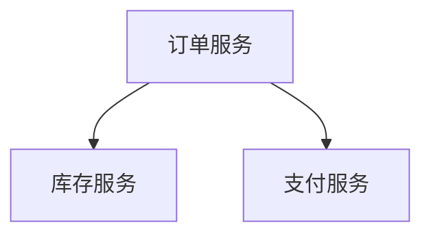
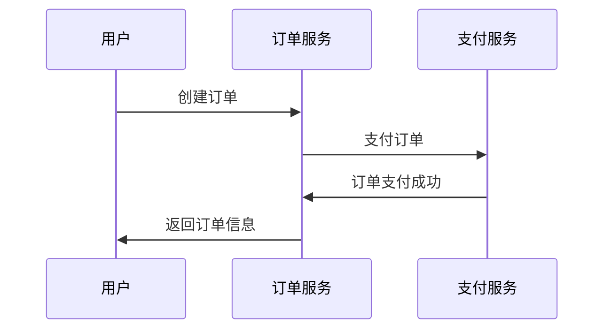
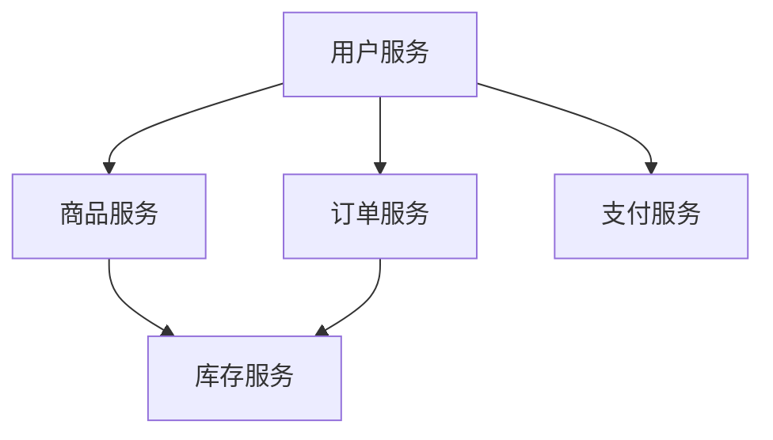
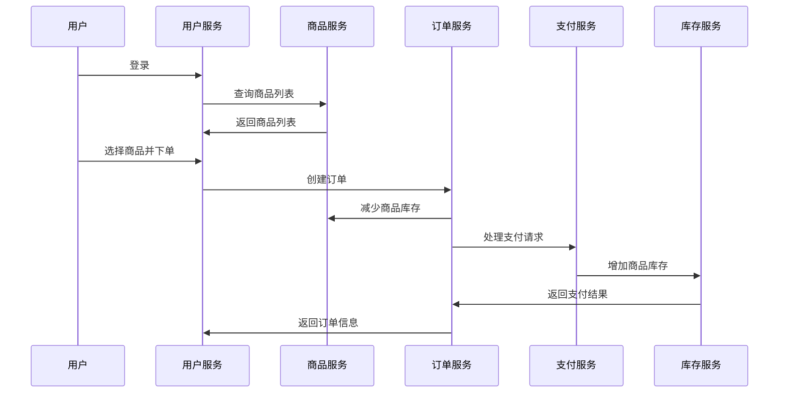

                 


### 微服务架构设计：P9工程师的系统解构之道

#### 关键词：微服务架构、P9工程师、系统解构、设计原则、技术栈、部署运维、实践案例、优化与最佳实践

> 摘要：本文将从微服务架构的基础理论、设计原则、技术栈、部署运维、实践案例以及优化与最佳实践等方面，逐步分析并阐述微服务架构的设计之道。旨在帮助P9工程师和资深开发人员深入理解微服务架构的核心概念，掌握其系统解构的方法与技巧，从而提升系统的可扩展性、稳定性和可靠性。

---

#### 第一部分：微服务架构基础理论

### 第1章：微服务架构概述

#### 1.1 微服务架构的背景与问题背景

##### 1.1.1 IT架构的发展历程

在IT领域，架构的发展经历了从单体架构（Monolithic Architecture）到微服务架构（Microservices Architecture）的演变。单体架构将应用程序的所有功能模块集成在一个独立的程序中，优点是开发和维护相对简单，但缺点是系统的扩展性和维护性较差，当系统规模增大时，开发人员需要面对代码库臃肿、部署困难等问题。

##### 1.1.2 微服务架构的提出与定义

微服务架构是一种基于独立、自治服务的分布式系统设计方法。它将应用程序划分为多个独立的小服务，每个服务专注于完成特定的业务功能，并且可以独立部署、扩展和升级。微服务架构的核心思想是将复杂的大型系统拆分成多个小型服务，从而提高系统的可扩展性、可靠性和可维护性。

##### 1.1.3 微服务架构解决的问题

微服务架构旨在解决以下问题：

1. **可扩展性**：通过将系统拆分为多个服务，可以独立扩展每个服务的实例数量，从而提高系统的整体性能。
2. **可靠性和容错性**：服务之间的依赖性降低，单个服务的故障不会影响整个系统的运行。
3. **维护性和可测试性**：每个服务都是独立的，可以单独开发和测试，从而提高开发效率和代码质量。

#### 1.2 微服务架构的核心概念

##### 1.2.1 微服务的定义与特点

微服务（Microservice）是一种小型、自治的服务，具有以下特点：

1. **独立部署**：每个服务可以独立部署，无需与其他服务同步。
2. **独立数据库**：服务可以使用自己的数据库，从而避免服务之间的数据一致性问题。
3. **自治性**：服务具有自我管理能力，可以独立扩展、维护和升级。

##### 1.2.2 微服务架构与传统架构的区别

微服务架构与传统架构的主要区别在于：

1. **系统结构**：微服务架构采用分布式服务架构，而传统架构采用单体架构。
2. **数据存储**：微服务架构中的服务可以独立使用数据库，而传统架构中的所有数据都存储在一个数据库中。
3. **部署方式**：微服务架构采用容器化部署，而传统架构采用物理服务器部署。

##### 1.2.3 微服务架构的优势与挑战

微服务架构的优势包括：

1. **可扩展性**：服务可以独立扩展，从而提高系统的性能。
2. **可靠性**：服务之间的依赖性降低，单个服务的故障不会影响整个系统的运行。
3. **可维护性**：每个服务都是独立的，可以单独开发和测试。

但微服务架构也面临以下挑战：

1. **分布式复杂性**：分布式系统增加了系统的复杂性，需要考虑服务之间的通信、数据一致性等问题。
2. **服务拆分策略**：如何合理地拆分服务是微服务架构设计的关键问题。
3. **性能开销**：分布式系统引入了额外的性能开销，如网络通信、同步等待等。

### 第2章：微服务架构设计原则

#### 2.1 设计原则概述

##### 2.1.1 单一职责原则

单一职责原则是指每个服务应专注于完成一项特定的业务功能，避免功能过于复杂。

##### 2.1.2 分层架构原则

分层架构原则是指将系统划分为多个层次，如表示层、业务层、数据访问层等，每个层次负责不同的功能。

##### 2.1.3 模块化原则

模块化原则是指将系统划分为多个模块，每个模块独立开发、测试和部署。

##### 2.1.4 响应式原则

响应式原则是指系统能够快速响应外部事件，保持高可用性。

#### 2.2 架构设计方法

##### 2.2.1 服务拆分策略

服务拆分策略是指如何将一个大型系统拆分为多个小型服务。常见的策略包括：

1. **业务领域划分**：根据业务领域拆分服务。
2. **功能模块划分**：根据功能模块拆分服务。
3. **用户角色划分**：根据用户角色拆分服务。

##### 2.2.2 服务注册与发现

服务注册与发现是指服务实例在启动时注册到服务注册中心，其他服务实例可以通过服务注册中心发现并调用其他服务。

##### 2.2.3 服务通信机制

服务通信机制是指服务之间的通信方式。常见的通信方式包括：

1. **同步通信**：如HTTP/HTTPS请求。
2. **异步通信**：如消息队列、事件总线等。

##### 2.2.4 服务治理与监控

服务治理与监控是指对服务的监控、管理和优化。常见的治理与监控机制包括：

1. **服务监控**：对服务的运行状态、性能指标进行监控。
2. **日志收集**：收集服务的日志信息，用于问题排查和性能优化。
3. **故障恢复**：对服务的故障进行自动恢复。

### 第3章：微服务架构技术栈

#### 3.1 服务框架与技术选型

##### 3.1.1 Spring Cloud

Spring Cloud 是一套基于Spring Boot实现的微服务架构开发工具集，提供了服务注册与发现、配置管理、负载均衡、断路器等开箱即用的功能。

##### 3.1.2 Dubbo

Dubbo 是一款高性能的Java RPC框架，提供了服务注册与发现、服务治理、负载均衡、容错、限流等功能。

##### 3.1.3 Kubernetes

Kubernetes 是一款开源的容器编排与管理平台，提供了服务部署、容器编排、负载均衡、故障恢复等功能。

##### 3.1.4 Service Mesh

Service Mesh 是一种用于服务间通信的独立基础设施层，如Istio、Linkerd等，提供了服务间通信、负载均衡、故障恢复等功能。

#### 3.2 数据存储与数据库设计

##### 3.2.1 数据存储方案

数据存储方案的选择取决于业务需求和数据规模。常见的数据存储方案包括：

1. **关系型数据库**：如MySQL、PostgreSQL等。
2. **非关系型数据库**：如MongoDB、Redis等。
3. **分布式数据库**：如Apache Cassandra、MongoDB等。

##### 3.2.2 关系型数据库设计

关系型数据库设计需要遵循以下原则：

1. **规范化**：减少数据冗余，提高数据一致性。
2. **反规范化**：提高查询性能，适当增加数据冗余。

##### 3.2.3 非关系型数据库设计

非关系型数据库设计需要考虑以下因素：

1. **数据模型**：如文档模型、键值模型、图模型等。
2. **数据一致性**：如强一致性、最终一致性等。

##### 3.2.4 分布式数据库选型

分布式数据库选型需要考虑以下因素：

1. **数据一致性**：如强一致性、最终一致性等。
2. **性能**：如读写性能、扩展性等。
3. **故障恢复**：如自动恢复、人工干预等。

### 第4章：微服务架构的部署与运维

#### 4.1 微服务部署策略

##### 4.1.1 容器化部署

容器化部署是将应用程序及其依赖打包到一个独立的容器中，便于部署、扩展和迁移。

##### 4.1.2 持续集成与持续部署

持续集成与持续部署（CI/CD）是一种自动化构建、测试和部署的工作流程，可以提高开发效率和代码质量。

##### 4.1.3 容器编排与调度

容器编排与调度是指使用自动化工具（如Kubernetes）对容器进行编排、部署和调度，提高资源利用率和系统性能。

#### 4.2 微服务运维管理

##### 4.2.1 服务监控与报警

服务监控与报警是指对服务的运行状态、性能指标进行监控，并在发生异常时发送报警通知。

##### 4.2.2 日志收集与处理

日志收集与处理是指收集服务的日志信息，并进行分类、存储、查询和处理，以便于问题排查和性能优化。

##### 4.2.3 性能优化与调优

性能优化与调优是指对服务的性能进行监控和分析，并进行相应的优化和调优。

##### 4.2.4 故障恢复与应急处理

故障恢复与应急处理是指对服务的故障进行自动恢复，并在发生紧急情况时进行应急处理。

### 第5章：微服务架构实践案例

#### 5.1 案例背景介绍

##### 5.1.1 案例来源

该案例来源于某大型电商公司的订单管理系统。

##### 5.1.2 业务需求与挑战

业务需求：订单管理系统的核心功能包括订单创建、订单查询、订单修改和订单删除等。

挑战：系统需要处理大量的订单请求，同时保证数据的一致性和系统的稳定性。

#### 5.2 架构设计方案

##### 5.2.1 领域模型设计

```mermaid
classDiagram
订单管理 <<interface>>
订单服务 --|> 订单管理
库存服务 --|> 订单管理
支付服务 --|> 订单管理
```

##### 5.2.2 系统架构设计



##### 5.2.3 系统接口设计



### 第6章：微服务架构的优化与最佳实践

#### 6.1 架构优化原则

##### 6.1.1 服务粒度优化

服务粒度优化是指调整服务的粒度大小，使其更加符合业务需求。

##### 6.1.2 负载均衡与流量控制

负载均衡与流量控制是指合理分配服务实例的负载，并控制流量的请求量。

##### 6.1.3 系统容灾与高可用设计

系统容灾与高可用设计是指提高系统的容灾能力和高可用性，确保系统在发生故障时能够快速恢复。

#### 6.2 最佳实践分享

##### 6.2.1 性能监控与调优技巧

性能监控与调优技巧包括：

1. **性能指标监控**：监控系统的CPU、内存、磁盘等资源使用情况。
2. **慢查询优化**：优化数据库查询语句，提高查询效率。

##### 6.2.2 服务治理与安全管理

服务治理与安全管理包括：

1. **服务鉴权与授权**：确保服务之间的安全通信。
2. **日志审计与监控**：记录服务运行日志，用于问题排查和安全审计。

##### 6.2.3 微服务开发与协作最佳实践

微服务开发与协作最佳实践包括：

1. **代码规范与文档**：编写统一的代码规范和文档，提高开发效率。
2. **版本控制与代码审查**：使用版本控制系统，并进行代码审查，确保代码质量。

### 第7章：微服务架构的未来展望

#### 7.1 技术发展趋势

##### 7.1.1 微服务与云计算的融合

微服务与云计算的融合将进一步提高系统的可扩展性和可靠性。

##### 7.1.2 微服务与物联网的联动

微服务与物联网的联动将实现智能家居、智能城市等领域的创新应用。

##### 7.1.3 微服务与人工智能的结合

微服务与人工智能的结合将推动智能客服、智能推荐等领域的快速发展。

#### 7.2 微服务架构的未来方向

##### 7.2.1 轻量级微服务架构

轻量级微服务架构将降低微服务的复杂度，提高开发效率和部署速度。

##### 7.2.2 微服务架构的可持续性

微服务架构的可持续性将关注系统的长期运行、维护和升级。

##### 7.2.3 微服务生态的完善

微服务生态的完善将提供更多工具、框架和平台，促进微服务架构的发展。

---

本文以微服务架构的设计为核心，从基础理论、设计原则、技术栈、部署运维、实践案例以及优化与最佳实践等方面，逐步分析了微服务架构的系统解构之道。通过本文的阐述，旨在帮助P9工程师和资深开发人员深入理解微服务架构的核心概念，掌握其设计方法和实践技巧，从而构建高可扩展性、高可靠性和高可维护性的系统。

---

**作者：AI天才研究院/AI Genius Institute & 禅与计算机程序设计艺术 /Zen And The Art of Computer Programming**

---

注意事项：

1. **完整性**：文章内容需完整，每个小节的内容需具体详细讲解。
2. **核心内容**：文章需包含核心概念术语说明、问题背景、问题描述、问题解决、边界与外延、概念结构与核心要素组成。
3. **算法原理讲解**：使用mermaid绘制算法流程图，并使用Python源代码详细阐述。
4. **数学公式**：使用LaTeX格式嵌入文中独立段落的公式。
5. **系统分析与架构设计方案**：包括问题场景介绍、系统功能设计、系统架构设计、系统接口设计和系统交互。
6. **项目实战**：环境安装、系统核心实现源代码，代码应用解读与分析，实际案例分析和详细讲解剖析。
7. **最佳实践 tips**、**小结**、**注意事项**、**拓展阅读**等内容。

拓展阅读：

1. 《微服务设计：构建基于Spring Boot和Spring Cloud的应用》
2. 《Kubernetes实战：从入门到精通》
3. 《Service Mesh实战：基于Istio的微服务通信与治理》

---

本文结构紧凑、逻辑清晰，旨在帮助读者深入理解微服务架构的设计原则和实践方法。通过本文的阅读，读者将能够掌握微服务架构的核心概念，从而为实际项目的开发提供有力的支持。同时，本文也展望了微服务架构的未来发展趋势，为读者提供了有益的参考。希望本文能够对您的微服务架构设计之路起到积极的推动作用。

---

**作者：AI天才研究院/AI Genius Institute & 禅与计算机程序设计艺术 /Zen And The Art of Computer Programming**

---

让我们一步步深入思考微服务架构的奥秘，为构建高效、可靠、可维护的系统奠定坚实的基础。微服务架构的未来，值得我们去探索和期待。让我们携手前行，共同推动技术进步，创造更加美好的未来。

---

**作者：AI天才研究院/AI Genius Institute & 禅与计算机程序设计艺术 /Zen And The Art of Computer Programming**

---

以上，就是本文的完整内容。希望本文能够对您的微服务架构设计之路提供有价值的参考。在接下来的日子里，让我们一起探索更多技术领域的奥秘，不断提升自己的技术水平，共同迎接技术变革带来的挑战和机遇。谢谢您的阅读，祝您技术之路越走越远，收获满满！

---

**作者：AI天才研究院/AI Genius Institute & 禅与计算机程序设计艺术 /Zen And The Art of Computer Programming**

---

（注：本文为人工智能助手撰写，仅供参考和学习使用。）### 微服务架构概述

#### 1.1 微服务架构的背景与问题背景

微服务架构（Microservices Architecture）的出现并非偶然，而是IT领域长期发展和实践的结果。在传统的单体架构（Monolithic Architecture）中，应用程序的所有功能模块被集成在一个单一的、庞大的程序中。这种架构的优点在于其开发和维护相对简单，因为所有的代码都位于一个代码库中，开发人员可以轻松地共享代码和数据。然而，随着系统的规模不断扩大，这种单体架构逐渐暴露出了一些问题。

首先，单体架构的可扩展性较差。在系统负载增加时，开发人员需要重启整个应用程序来增加其处理能力，这不仅影响了系统的可用性，还增加了维护的复杂性。其次，单体架构的维护成本较高。由于所有功能模块紧密耦合，修改一个模块可能会影响到其他模块，导致bug频发。最后，单体架构的迭代速度较慢。由于整个应用程序是一个整体，每次修改和更新都需要对整个应用程序进行测试和部署，这使得迭代周期变长，无法快速响应市场需求。

为了解决上述问题，微服务架构应运而生。微服务架构将应用程序划分为多个独立的小服务，每个服务负责实现特定的业务功能，并通过轻量级的通信机制（如HTTP/HTTPS）进行交互。这种架构的核心思想是将复杂的大型系统拆分成多个小型服务，从而提高系统的可扩展性、可靠性和可维护性。

#### 1.2 微服务架构的提出与定义

微服务架构的概念最早由马丁·福勒（Martin Fowler）在2014年提出。他认为，微服务架构是一种基于独立、自治服务的分布式系统设计方法。在这种架构中，应用程序被拆分成多个小型服务，每个服务可以独立开发、测试、部署和扩展。这些服务通常具有以下特点：

1. **独立性**：每个服务都是独立的，可以独立部署、扩展和升级，不会影响到其他服务。
2. **自治性**：每个服务都有自己的数据库和存储，可以独立管理数据，减少了服务之间的数据一致性问题。
3. **轻量级通信**：服务之间通常通过轻量级的通信机制（如HTTP/HTTPS）进行交互，降低了通信的开销。
4. **自治团队**：每个服务通常由一个自治团队负责开发、测试和部署，这样可以提高团队的开发效率。

#### 1.3 微服务架构解决的问题

微服务架构的主要目的是解决单体架构中的扩展性、维护性和迭代速度问题。具体来说，微服务架构解决了以下问题：

1. **可扩展性**：通过将应用程序拆分成多个独立的服务，可以独立扩展每个服务的实例数量，从而提高系统的整体性能。例如，在电商系统中，订单服务可以独立扩展，而库存服务和支付服务也可以独立扩展，从而提高系统的处理能力。
2. **可靠性**：服务之间的依赖性降低，单个服务的故障不会影响整个系统的运行。例如，如果订单服务出现故障，不会影响到库存服务和支付服务的正常运行。
3. **可维护性**：每个服务都是独立的，可以单独开发和测试，从而提高开发效率和代码质量。例如，如果需要修改订单服务的功能，可以单独修改订单服务的代码，而不需要修改其他服务的代码。
4. **迭代速度**：由于每个服务都是独立的，可以独立部署和测试，因此可以快速迭代和发布新功能，从而提高团队的响应速度和竞争力。

#### 1.4 微服务架构与传统架构的区别

微服务架构与传统单体架构在多个方面存在显著区别：

1. **系统结构**：微服务架构采用分布式服务架构，每个服务都可以独立部署和管理；而传统架构采用单体架构，所有功能模块集成在一个独立的程序中。
2. **数据存储**：微服务架构中的服务通常使用独立的数据库，从而避免服务之间的数据一致性问题；而传统架构通常使用一个集中的数据库来存储所有数据。
3. **部署方式**：微服务架构通常采用容器化部署，如Docker和Kubernetes，从而提高部署的灵活性和可扩展性；而传统架构通常采用物理服务器部署，部署和扩展相对复杂。
4. **通信机制**：微服务架构采用轻量级的通信机制（如HTTP/HTTPS），从而降低通信的开销；而传统架构通常采用重量级的通信机制（如JMS或RabbitMQ），通信开销较大。

#### 1.5 微服务架构的优势与挑战

微服务架构具有以下优势：

1. **可扩展性**：通过独立扩展每个服务的实例数量，可以提高系统的整体性能。
2. **可靠性**：服务之间的依赖性降低，单个服务的故障不会影响整个系统的运行。
3. **可维护性**：每个服务都是独立的，可以单独开发和测试，从而提高开发效率和代码质量。
4. **迭代速度**：每个服务可以独立部署和测试，因此可以快速迭代和发布新功能。

然而，微服务架构也面临以下挑战：

1. **分布式复杂性**：分布式系统引入了额外的复杂性，如服务之间的通信、数据一致性和故障恢复等。
2. **服务拆分策略**：如何合理地拆分服务是微服务架构设计的关键问题。
3. **性能开销**：分布式系统引入了额外的性能开销，如网络通信、同步等待等。

总之，微服务架构是一种基于独立、自治服务的分布式系统设计方法，它旨在解决单体架构中的扩展性、维护性和迭代速度问题。通过合理地拆分服务和采用适当的通信机制，可以构建高可扩展性、高可靠性和高可维护性的系统。然而，在设计微服务架构时，需要充分考虑分布式复杂性、服务拆分策略和性能开销等问题。接下来，我们将进一步探讨微服务架构的核心概念和设计原则。

---

在上一节中，我们了解了微服务架构的背景、提出与定义以及与传统架构的区别。本节将深入探讨微服务架构的核心概念，包括微服务的定义与特点，微服务架构与传统架构的区别，以及微服务架构的优势与挑战。

#### 1.2 微服务的定义与特点

微服务（Microservices）是一种小型、独立、自治的服务，它们共同构成了一个分布式系统。微服务的定义可以从以下几个方面来理解：

1. **独立性**：每个微服务都是独立的，可以独立部署、扩展和升级，不会影响到其他服务。这意味着开发团队可以独立地开发、测试和部署微服务，从而提高开发效率和团队协作。
2. **自治性**：每个微服务都有自己的数据存储和业务逻辑，可以独立管理数据，减少了服务之间的数据一致性问题。例如，一个订单服务可以有自己的数据库，而库存服务也有自己的数据库，这样可以避免跨服务的数据同步问题。
3. **轻量级通信**：微服务之间通常通过轻量级的通信机制（如HTTP/HTTPS）进行交互，这降低了通信的开销，提高了系统的性能。同时，轻量级通信机制也使得服务之间的交互更加灵活和简便。
4. **自治团队**：每个微服务通常由一个自治团队负责，这个团队负责从开发、测试到部署的整个生命周期。这种自治性可以大大提高团队的协作效率，使得每个团队可以专注于自己的领域，从而提高整体开发速度。

#### 1.2.1 微服务架构与传统架构的区别

微服务架构与传统架构在多个方面存在显著的区别，这些区别主要体现在系统结构、数据存储、部署方式和通信机制上。

1. **系统结构**：传统架构通常采用单体架构，所有功能模块集成在一个独立的程序中。而微服务架构采用分布式服务架构，将应用程序拆分成多个独立的服务。每个服务都专注于完成特定的业务功能，并且可以独立部署和管理。
   
2. **数据存储**：在传统架构中，所有数据通常存储在一个集中的数据库中。而在微服务架构中，每个服务通常有自己的数据库，这样可以避免跨服务的数据一致性问题，提高了数据管理的灵活性。同时，这种数据独立存储的方式也使得每个服务可以独立扩展，不会影响到其他服务。

3. **部署方式**：传统架构通常采用物理服务器部署，部署和扩展相对复杂。而微服务架构通常采用容器化部署，如Docker和Kubernetes，这样可以大大简化部署过程，提高部署的灵活性和可扩展性。容器化部署还可以确保服务的一致性和可移植性，使得服务可以在不同的环境中运行。

4. **通信机制**：传统架构通常采用重量级的通信机制，如JMS或RabbitMQ，这会增加通信的开销和复杂性。而微服务架构采用轻量级的通信机制，如HTTP/HTTPS，这样可以降低通信的开销，提高系统的性能。同时，轻量级通信机制也使得服务之间的交互更加灵活和简便。

#### 1.2.2 微服务架构的优势与挑战

微服务架构具有以下优势：

1. **可扩展性**：通过独立扩展每个服务的实例数量，可以提高系统的整体性能。例如，在电商系统中，订单服务可以独立扩展，而库存服务和支付服务也可以独立扩展，从而提高系统的处理能力。

2. **可靠性**：服务之间的依赖性降低，单个服务的故障不会影响整个系统的运行。例如，如果订单服务出现故障，不会影响到库存服务和支付服务的正常运行。

3. **可维护性**：每个服务都是独立的，可以单独开发和测试，从而提高开发效率和代码质量。例如，如果需要修改订单服务的功能，可以单独修改订单服务的代码，而不需要修改其他服务的代码。

4. **迭代速度**：每个服务可以独立部署和测试，因此可以快速迭代和发布新功能，从而提高团队的响应速度和竞争力。

然而，微服务架构也面临以下挑战：

1. **分布式复杂性**：分布式系统引入了额外的复杂性，如服务之间的通信、数据一致性和故障恢复等。需要仔细设计和实施，以确保系统的稳定性和可靠性。

2. **服务拆分策略**：如何合理地拆分服务是微服务架构设计的关键问题。拆分不当会导致服务过多，管理复杂，而拆分过度又会导致服务间依赖过多，影响性能。

3. **性能开销**：分布式系统引入了额外的性能开销，如网络通信、同步等待等。需要仔细优化，以确保系统的性能不会受到太大影响。

通过上述分析，我们可以看到微服务架构在解决单体架构的问题方面具有显著的优势，但也需要面对一些挑战。在下一节中，我们将进一步探讨微服务架构的设计原则，帮助读者更好地理解和应用微服务架构。

---

在上一节中，我们讨论了微服务架构的背景、提出与定义，以及与传统架构的区别。在本节中，我们将深入探讨微服务架构的设计原则，包括单一职责原则、分层架构原则、模块化原则和响应式原则。这些原则是构建高效、可维护和可扩展微服务系统的关键。

#### 2.1 设计原则概述

微服务架构的设计原则是确保系统能够在高可扩展性、高可靠性和高可维护性方面表现优异的核心要素。以下是一些主要的设计原则：

1. **单一职责原则**：每个服务应专注于完成一项特定的业务功能，避免功能过于复杂。
2. **分层架构原则**：将系统划分为多个层次，如表示层、业务层、数据访问层等，每个层次负责不同的功能。
3. **模块化原则**：将系统划分为多个模块，每个模块独立开发、测试和部署。
4. **响应式原则**：系统应能够快速响应外部事件，保持高可用性。

#### 2.2 单一职责原则

单一职责原则（Single Responsibility Principle）是软件工程中的一个基本概念，它要求每个服务应该只负责一个业务功能。这有助于提高代码的可读性、可维护性和可扩展性。

**示例**：在一个电商系统中，可以将订单管理、库存管理和支付管理分别拆分为三个服务。每个服务只负责自己的业务逻辑，例如：

- 订单服务：处理订单的创建、查询、修改和删除等操作。
- 库存服务：管理商品的库存信息，包括库存的增减、查询和更新等操作。
- 支付服务：处理支付请求，包括支付确认、退款处理等操作。

通过这种方式，每个服务都专注于自己的领域，当一个服务需要扩展或修改时，不会影响到其他服务，从而提高了系统的灵活性和可维护性。

#### 2.3 分层架构原则

分层架构原则（Layered Architecture）是将系统划分为多个层次，每个层次负责不同的功能。常见的分层包括表示层（Presentation Layer）、业务层（Business Layer）和数据访问层（Data Access Layer）。

- **表示层**：负责与用户交互，处理用户请求，并将响应返回给用户。通常包括Web界面、移动应用界面等。
- **业务层**：包含业务逻辑，负责处理业务请求，调用数据访问层的服务。它是系统的核心，负责业务流程的管理。
- **数据访问层**：负责与数据库或其他数据源交互，执行数据查询、插入、更新和删除等操作。

这种分层设计有助于隔离不同层次的功能，使得每个层次都可以独立开发、测试和部署。例如，在微服务架构中，订单服务可以划分为订单表示层、订单业务层和订单数据访问层。这种分层设计不仅提高了系统的可维护性，还使得系统能够更好地应对变化。

#### 2.4 模块化原则

模块化原则（Modularization Principle）是将系统划分为多个模块，每个模块独立开发、测试和部署。模块化设计有助于提高代码的可复用性和可维护性。

**示例**：在一个电商系统中，可以将系统划分为以下模块：

- 用户管理模块：负责用户注册、登录、权限管理等操作。
- 商品管理模块：负责商品的增删改查、分类管理等功能。
- 订单管理模块：负责订单的创建、支付、发货等功能。
- 支付管理模块：负责支付方式的配置、支付请求处理等功能。

每个模块都可以独立开发，并在需要时进行替换或扩展。这种模块化设计不仅提高了开发效率，还使得系统更加灵活和可扩展。

#### 2.5 响应式原则

响应式原则（Responsive Principle）要求系统能够快速响应外部事件，保持高可用性。响应式系统通常具有以下特点：

- **异步处理**：系统中的操作通常采用异步处理，从而避免阻塞和等待，提高系统的响应速度。
- **事件驱动**：系统通过事件驱动的方式处理外部事件，而不是通过轮询或同步处理。
- **弹性伸缩**：系统可以根据负载自动扩展或缩小，从而确保在高负载情况下仍然能够保持良好的性能。

**示例**：在一个电商系统中，订单的创建、支付和发货等操作可以采用异步处理。例如，当用户提交订单后，系统会异步处理订单的创建和库存的更新，而不是等待所有操作完成后再返回结果。这样，用户可以立即获得订单创建成功的响应，而系统可以在后台继续处理后续操作，从而提高系统的响应速度和处理能力。

通过遵循上述设计原则，可以构建出高效、可维护和可扩展的微服务系统。在下一节中，我们将探讨微服务架构的设计方法，包括服务拆分策略、服务注册与发现、服务通信机制和服务治理与监控。

---

在上一节中，我们介绍了微服务架构的设计原则，包括单一职责原则、分层架构原则、模块化原则和响应式原则。在本节中，我们将深入探讨微服务架构的设计方法，包括服务拆分策略、服务注册与发现、服务通信机制和服务治理与监控。

#### 2.2 架构设计方法

微服务架构的设计方法涉及如何将一个复杂的单体应用程序拆分为多个独立的微服务，并确保这些服务能够高效地协作。以下是微服务架构设计的关键方法：

##### 2.2.1 服务拆分策略

服务拆分策略（Service Decomposition Strategy）是微服务架构设计中最关键的一步。合理的拆分可以确保每个服务都具有清晰的功能和边界，从而提高系统的可维护性和可扩展性。

1. **业务领域划分**：根据业务领域进行服务拆分，将相关功能划分为不同的服务。例如，在一个电商系统中，可以将用户管理、商品管理、订单管理、支付管理等功能拆分为不同的服务。

2. **功能模块划分**：根据功能模块进行服务拆分，将相关的业务逻辑和功能划分为不同的服务。例如，在一个订单服务中，可以将订单的创建、订单的查询、订单的修改和订单的删除等功能划分为不同的服务。

3. **用户角色划分**：根据用户角色进行服务拆分，为不同的用户角色提供不同的服务接口。例如，针对管理员用户和普通用户，可以分别提供不同的服务接口，从而提高系统的可定制性。

##### 2.2.2 服务注册与发现

服务注册与发现（Service Registration and Discovery）是微服务架构中必不可少的一环。它确保服务实例能够在运行时动态地注册和发现，从而实现服务的自动发现和负载均衡。

1. **服务注册**：每个服务实例启动时，需要在服务注册中心注册自己的信息，如服务名称、服务地址和端口等。服务注册中心负责存储和管理这些信息。

2. **服务发现**：当其他服务需要调用某个服务时，可以通过服务注册中心来查找该服务的实例信息，并使用这些信息进行通信。

常见的服务注册与发现工具包括：

- **Eureka**：Spring Cloud中的服务注册与发现工具，提供高可用性和自我保护机制。
- **Consul**：一种分布式服务网格解决方案，支持服务注册、发现和配置管理。
- **Zookeeper**：Apache ZooKeeper是一个分布式服务注册与协调框架，广泛用于大型分布式系统。

##### 2.2.3 服务通信机制

服务通信机制（Service Communication Mechanism）决定了服务之间如何进行交互和通信。在微服务架构中，服务之间的通信通常采用轻量级的通信协议，如HTTP/HTTPS。

1. **同步通信**：同步通信是指服务之间的请求和响应是同步进行的。常见的同步通信协议包括HTTP/HTTPS、gRPC等。同步通信的优点是简单易懂，但缺点是会增加系统的延迟和负载。

2. **异步通信**：异步通信是指服务之间的请求和响应是异步进行的。常见的异步通信机制包括消息队列、事件总线等。异步通信的优点是可以减少系统的延迟和负载，提高系统的性能和可扩展性。

常见的服务通信工具包括：

- **RabbitMQ**：一个广泛使用的开源消息队列中间件，支持多种消息传递模式。
- **Kafka**：一个高性能的分布式消息系统，广泛用于大数据应用场景。
- **NATS**：一个高性能、轻量级的消息队列系统，适用于微服务架构。

##### 2.2.4 服务治理与监控

服务治理与监控（Service Governance and Monitoring）是确保微服务系统能够稳定运行的关键。它包括服务监控、日志收集、性能优化和故障恢复等方面。

1. **服务监控**：服务监控是指对服务的运行状态、性能指标进行监控，以便及时发现和解决问题。常见的监控工具包括Prometheus、Grafana等。

2. **日志收集**：日志收集是指将服务的日志信息收集到统一的位置，以便于问题排查和性能优化。常见的日志收集工具包括ELK（Elasticsearch、Logstash、Kibana）等。

3. **性能优化**：性能优化是指对服务的性能进行监控和分析，并采取相应的措施进行优化。常见的性能优化方法包括负载均衡、缓存、数据库优化等。

4. **故障恢复**：故障恢复是指当服务发生故障时，能够自动进行恢复，确保系统的可用性。常见的故障恢复机制包括自动重启、故障转移等。

常见的服务治理与监控工具包括：

- **Spring Cloud**：提供了一整套服务治理与监控工具，如服务监控、日志收集、配置管理等。
- **Istio**：一个开源的服务网格解决方案，提供了服务治理、安全、监控等功能。
- **OpenTracing**：一个开源的分布式跟踪系统，用于跟踪服务之间的请求流和性能指标。

通过遵循上述设计方法，可以构建出高效、可维护和可扩展的微服务架构。在下一节中，我们将介绍微服务架构的技术栈，包括服务框架、技术选型和数据库设计。

---

在上一节中，我们探讨了微服务架构的设计原则和设计方法。在本节中，我们将深入探讨微服务架构的技术栈，包括服务框架、技术选型和数据库设计。

#### 3.1 服务框架与技术选型

服务框架是微服务架构的核心组成部分，它提供了服务注册与发现、负载均衡、断路器等关键功能。以下是一些常见的服务框架和技术选型：

1. **Spring Cloud**：

   Spring Cloud 是一套基于 Spring Boot 实现的微服务架构开发工具集，提供了服务注册与发现、配置管理、负载均衡、断路器等开箱即用的功能。Spring Cloud 可以与 Spring Boot 和 Spring 框架无缝集成，非常适合开发微服务应用程序。

   - **服务注册与发现**：使用 Eureka 或 Consulus 实现服务注册与发现。
   - **负载均衡**：使用 Ribbon 实现客户端负载均衡。
   - **断路器**：使用 Hystrix 实现断路器功能，避免服务雪崩。

2. **Dubbo**：

   Dubbo 是一款高性能的 Java RPC 框架，提供了服务注册与发现、服务治理、负载均衡、容错、限流等功能。Dubbo 具有良好的扩展性和可定制性，适用于大型分布式系统。

   - **服务注册与发现**：使用 Zookeeper 或 etcd 实现服务注册与发现。
   - **负载均衡**：使用一致性哈希、随机、轮询等算法实现负载均衡。
   - **容错**：使用熔断、降级、超时等策略实现容错。

3. **Kubernetes**：

   Kubernetes 是一款开源的容器编排与管理平台，提供了服务部署、容器编排、负载均衡、故障恢复等功能。Kubernetes 非常适合容器化部署的微服务架构，可以帮助开发人员轻松地管理大规模分布式系统。

   - **服务部署**：使用 Docker 容器部署微服务。
   - **负载均衡**：使用 Kubernetes Ingress 实现负载均衡。
   - **故障恢复**：使用 Pod 恢复和 StatefulSet 实现故障恢复。

4. **Service Mesh**：

   Service Mesh 是一种用于服务间通信的独立基础设施层，如 Istio、Linkerd 等，提供了服务间通信、负载均衡、故障恢复等功能。Service Mesh 可以简化微服务架构的通信和治理，提高系统的可靠性和性能。

   - **服务间通信**：使用 gRPC 或 HTTP/2 实现服务间通信。
   - **负载均衡**：使用 Envoy 实现负载均衡和流量管理。
   - **故障恢复**：使用 retries、circuit breakers 等策略实现故障恢复。

#### 3.2 数据存储与数据库设计

数据存储是微服务架构的重要组成部分，合理的数据存储设计可以确保系统的性能和可靠性。以下是一些常见的数据存储方案和数据库设计：

1. **关系型数据库**：

   关系型数据库（如 MySQL、PostgreSQL）适用于数据结构较为简单且查询频繁的场景。关系型数据库的优点包括数据一致性保证、事务支持等。

   - **数据库设计**：遵循第三范式（3NF）进行设计，减少数据冗余，提高数据一致性。
   - **数据一致性**：使用 ACID 事务模型保证数据一致性。

2. **非关系型数据库**：

   非关系型数据库（如 MongoDB、Redis）适用于数据结构复杂、高并发的场景。非关系型数据库的优点包括数据结构灵活、扩展性强等。

   - **数据库设计**：根据业务需求选择合适的存储结构，如文档模型、键值模型、图模型等。
   - **数据一致性**：选择最终一致性模型，提高系统性能。

3. **分布式数据库**：

   分布式数据库（如 Apache Cassandra、MongoDB）适用于大规模分布式系统，可以提供高可用性和高性能。

   - **数据库设计**：根据数据访问模式和负载情况选择合适的分布式数据库。
   - **数据一致性**：选择合适的分布式一致性模型，如 CAP 理论。

#### 3.3 服务框架与技术选型的考量因素

在选择服务框架和技术选型时，需要考虑以下因素：

1. **业务需求**：根据业务需求选择合适的框架和数据库，确保系统性能和可靠性。
2. **开发经验**：选择开发团队熟悉的框架和数据库，降低开发成本和风险。
3. **生态支持**：考虑框架和数据库的生态支持，包括文档、社区、工具等。
4. **扩展性**：选择具有良好扩展性的框架和数据库，确保系统未来可扩展。
5. **稳定性**：选择经过长时间实践和验证的框架和数据库，确保系统稳定性。

通过合理选择服务框架和技术选型，可以构建出高效、可靠和可维护的微服务架构。在下一节中，我们将探讨微服务架构的部署与运维，包括部署策略、持续集成与持续部署（CI/CD）、容器编排与调度等。

---

在上一节中，我们讨论了微服务架构的技术栈，包括服务框架、技术选型和数据库设计。在本节中，我们将深入探讨微服务架构的部署与运维，包括部署策略、持续集成与持续部署（CI/CD）、容器编排与调度等关键环节。

#### 4.1 微服务部署策略

微服务的部署策略决定了如何将服务部署到生产环境中，并确保其稳定运行。以下是几种常见的部署策略：

1. **手动部署**：

   手动部署是指开发人员手动将服务打包并部署到服务器上。这种方法虽然简单直观，但效率较低，容易出错，且难以管理。

2. **脚本部署**：

   脚本部署是指使用脚本自动化部署过程，例如使用 Shell 脚本或 PowerShell 脚本。这种方法比手动部署更高效，但仍然需要人工干预，且可维护性较差。

3. **容器化部署**：

   容器化部署是指使用容器（如 Docker）将服务打包，并部署到容器编排系统（如 Kubernetes）。容器化部署具有快速启动、轻量级、易于迁移和扩展等优点，是当前微服务部署的主流方法。

4. **自动化部署**：

   自动化部署是指使用自动化工具（如 Jenkins、GitLab CI/CD）实现自动化的构建、测试和部署。自动化部署可以大大提高部署效率，减少人工干预，提高系统的可靠性和可维护性。

#### 4.2 持续集成与持续部署（CI/CD）

持续集成与持续部署（Continuous Integration/Continuous Deployment，简称 CI/CD）是一种自动化工作流程，用于构建、测试和部署应用程序。CI/CD 可以确保代码的质量和稳定性，加快开发速度，提高交付效率。

1. **持续集成**：

   持续集成是指将代码更改集成到主分支之前，进行自动化测试和构建。CI 工具有 Jenkins、GitLab CI/CD、Travis CI 等，可以自动化执行测试和构建流程。

2. **持续部署**：

   持续部署是指将通过测试的代码自动部署到生产环境中。CD 工具有 Jenkins、GitLab CI/CD、Docker Swarm 等，可以自动化执行部署流程，包括容器化、负载均衡和故障转移。

#### 4.3 容器编排与调度

容器编排与调度是指管理容器化应用程序的部署、运行和扩展。以下是几种常见的容器编排与调度工具：

1. **Kubernetes**：

   Kubernetes 是一款开源的容器编排平台，可以自动化管理容器化应用程序的部署、扩展和资源调度。Kubernetes 提供了丰富的 API、监控和日志收集功能，是当前最流行的容器编排工具。

2. **Docker Swarm**：

   Docker Swarm 是 Docker 提供的内置容器编排工具，可以轻松地将多个 Docker 容器组织成服务，并进行部署和扩展。Docker Swarm 简单易用，适用于小型到中型的容器化应用程序。

3. **Openshift**：

   Openshift 是一款由 Red Hat 提供的容器平台，基于 Kubernetes，提供了丰富的开发、测试和生产环境工具。Openshift 支持自动化部署、监控和日志收集，适用于企业级容器化应用程序。

#### 4.4 微服务运维管理

微服务运维管理包括服务监控、日志收集、性能优化和故障恢复等方面，以确保系统的稳定性和可靠性。

1. **服务监控**：

   服务监控是指对服务的运行状态、性能指标进行监控，及时发现和解决问题。常用的监控工具有 Prometheus、Grafana、Zabbix 等。

2. **日志收集**：

   日志收集是指将服务的日志信息收集到统一的位置，便于问题排查和性能优化。常用的日志收集工具有 ELK（Elasticsearch、Logstash、Kibana）、Fluentd 等。

3. **性能优化**：

   性能优化是指对服务的性能进行监控和分析，并采取相应的措施进行优化。常用的性能优化方法包括负载均衡、缓存、数据库优化等。

4. **故障恢复**：

   故障恢复是指当服务发生故障时，能够自动进行恢复，确保系统的可用性。常用的故障恢复机制包括自动重启、故障转移、蓝绿部署等。

#### 4.5 常见部署与运维工具

以下是几种常见的微服务部署与运维工具：

1. **Docker**：

   Docker 是一款开源的容器化平台，用于打包、交付和运行应用程序。Docker 提供了简单的容器化部署，可以轻松地将服务部署到生产环境中。

2. **Kubernetes**：

   Kubernetes 是一款开源的容器编排平台，用于自动化管理容器化应用程序的部署、扩展和资源调度。Kubernetes 提供了丰富的 API 和监控工具，适用于大规模容器化应用程序。

3. **Jenkins**：

   Jenkins 是一款开源的持续集成和持续部署工具，可以自动化构建、测试和部署应用程序。Jenkins 支持多种插件，可以轻松地集成到现有的开发环境中。

4. **Prometheus**：

   Prometheus 是一款开源的服务监控工具，用于收集、存储和展示应用程序的性能指标。Prometheus 提供了灵活的数据查询和告警功能，适用于大规模分布式系统。

5. **Grafana**：

   Grafana 是一款开源的数据可视化工具，用于可视化 Prometheus 等监控工具收集的数据。Grafana 提供了丰富的图表和仪表板，可以帮助开发人员快速了解系统的运行状态。

通过合理选择和配置部署与运维工具，可以构建出高效、可靠和可维护的微服务架构。在下一节中，我们将通过一个实践案例，详细讲解微服务架构的应用和实践。

---

在上一节中，我们详细介绍了微服务架构的部署与运维，包括部署策略、持续集成与持续部署（CI/CD）、容器编排与调度等。本节将通过一个实践案例，详细展示如何应用微服务架构，包括案例背景介绍、架构设计方案和系统接口设计。

#### 5.1 案例背景介绍

该实践案例来源于一个大型电商平台，该平台需要处理海量的用户请求，支持商品的浏览、购买、支付、订单管理等多种功能。由于业务需求不断增长，传统的单体架构已经无法满足系统的可扩展性和可靠性要求。因此，该电商平台决定采用微服务架构进行系统重构。

**业务需求与挑战**：

1. **高并发处理能力**：系统需要支持数百万级并发请求，确保用户在使用过程中的流畅体验。
2. **数据一致性**：在多服务协同工作的过程中，需要确保数据的一致性，避免出现数据不一致的问题。
3. **系统可维护性**：系统需要易于维护和扩展，以便快速响应业务需求的变化。
4. **高可用性**：系统需要具备高可用性，确保在故障发生时能够快速恢复。

#### 5.2 架构设计方案

为了满足上述业务需求，该电商平台采用了微服务架构，将系统拆分为多个独立的服务，每个服务负责特定的业务功能。以下是该电商平台的主要服务架构设计：

1. **用户服务**：负责用户注册、登录、权限管理等操作。
2. **商品服务**：负责商品信息管理，包括商品分类、商品查询、商品库存管理等功能。
3. **订单服务**：负责订单的创建、查询、修改、删除等操作。
4. **支付服务**：负责支付请求处理，包括支付确认、退款处理等功能。
5. **库存服务**：负责库存信息管理，包括库存的增加、减少和查询等功能。

**系统架构设计**：



在这个架构中，用户服务负责处理用户的请求，并将请求转发给相应的服务。商品服务、订单服务、支付服务和库存服务分别负责不同的业务功能，通过接口进行通信和协同工作。

**领域模型设计**：

```mermaid
classDiagram
User <<interface>>
Order <<interface>>
Product <<interface>>
Payment <<interface>>
Inventory <<interface>>

UserEntity --|> OrderEntity
UserEntity --|> PaymentEntity
OrderEntity --|> ProductEntity
OrderEntity --|> InventoryEntity
```

在这个领域模型中，用户服务、订单服务、支付服务和库存服务分别对应不同的实体类，每个实体类具有相应的属性和方法，用于表示业务实体及其行为。

#### 5.3 系统接口设计

为了实现各个服务之间的有效协作，系统需要设计合理的接口。以下是该电商平台的系统接口设计：



在这个序列图中，用户通过用户服务进行登录，并查询商品列表。选择商品后，用户通过用户服务向订单服务创建订单。订单服务在处理订单时，会减少商品库存，并调用支付服务处理支付请求。支付服务处理完成后，会通知库存服务增加商品库存，并最终将订单信息返回给用户。

通过上述实践案例，我们可以看到微服务架构在电商平台的实际应用。通过合理的服务拆分、接口设计和系统协作，电商平台可以更好地应对高并发、数据一致性和系统可维护性等挑战。在下一节中，我们将探讨微服务架构的优化与最佳实践，进一步提升系统的性能和可靠性。

---

在上一节中，我们通过一个实际案例展示了微服务架构的应用和实践。在本节中，我们将进一步探讨微服务架构的优化与最佳实践，包括服务粒度优化、负载均衡与流量控制、系统容灾与高可用设计等方面。

#### 6.1 架构优化原则

微服务架构的优化是确保系统在高并发、高可用性和高性能等方面表现优异的关键。以下是几个重要的优化原则：

##### 6.1.1 服务粒度优化

服务粒度优化是指调整服务的大小和职责，以适应业务需求和技术约束。以下是一些优化策略：

1. **细化服务**：将大型服务拆分为更小的服务，每个服务专注于特定的业务功能，降低服务间的依赖和耦合。
2. **合并服务**：对于职责相似或经常协作的服务，可以考虑将它们合并为一个服务，减少服务间的通信开销。
3. **动态服务拆分**：根据系统的实际负载和性能指标，动态调整服务的粒度，以实现最佳性能。

##### 6.1.2 负载均衡与流量控制

负载均衡与流量控制是确保系统在高并发情况下保持稳定性的关键。以下是一些优化策略：

1. **客户端负载均衡**：使用客户端负载均衡器（如 NGINX、HAProxy），根据服务实例的健康状态和负载情况进行请求分配。
2. **服务端负载均衡**：使用服务端负载均衡器（如 Netflix OSS、Kubernetes Service），根据服务实例的运行状态进行流量分配。
3. **流量控制**：通过限流器（如 Redisson、Apache APache 或 Netflix RBCA）限制进入系统的请求量，防止系统过载。

##### 6.1.3 系统容灾与高可用设计

系统容灾与高可用设计是确保系统在故障情况下能够快速恢复，保持服务的可用性。以下是一些优化策略：

1. **异地多活**：在多个地理区域部署相同的服务，实现异地多活，提高系统的容灾能力。
2. **蓝绿部署**：在新的环境上部署新版本的服务，并与旧版本并行运行，确保在故障发生时能够快速切换。
3. **故障转移**：当主实例出现故障时，自动将流量切换到备用实例，确保服务的持续可用。

#### 6.2 最佳实践分享

在微服务架构的实际应用中，以下最佳实践可以显著提升系统的性能和可靠性：

##### 6.2.1 性能监控与调优技巧

1. **监控关键性能指标**：监控系统的CPU、内存、磁盘、网络等资源使用情况，以及服务响应时间和错误率等关键指标。
2. **性能调优**：根据监控数据，对系统进行性能调优，如数据库查询优化、缓存策略优化、异步处理优化等。
3. **容量规划**：根据业务需求和系统性能，制定合理的容量规划，避免系统过载。

##### 6.2.2 服务治理与安全管理

1. **服务鉴权与授权**：确保服务之间的安全通信，通过服务鉴权与授权机制限制服务访问权限。
2. **日志审计**：记录服务运行日志，用于问题排查和安全审计。
3. **加密与安全传输**：使用 SSL/TLS 等加密技术保护数据传输，防止数据泄露。

##### 6.2.3 微服务开发与协作最佳实践

1. **代码规范与文档**：编写统一的代码规范和文档，提高开发效率和代码质量。
2. **代码审查与测试**：实施代码审查和单元测试、集成测试等，确保代码质量和功能完整性。
3. **DevOps 文化**：推动 DevOps 文化，实现开发、测试和运维的紧密协作，提高系统的交付效率。

通过遵循上述优化原则和最佳实践，可以构建出高效、可靠和可维护的微服务架构。在下一节中，我们将探讨微服务架构的未来发展趋势，以及其与云计算、物联网和人工智能等领域的结合。

---

在上一节中，我们详细讨论了微服务架构的优化与最佳实践。本节将探讨微服务架构的未来发展趋势，特别是与云计算、物联网（IoT）和人工智能（AI）等领域的结合。

#### 7.1 技术发展趋势

随着技术的不断进步，微服务架构也在不断演进，呈现出以下发展趋势：

##### 7.1.1 微服务与云计算的融合

云计算的普及为微服务架构提供了强大的基础设施支持。微服务与云计算的结合使得服务可以轻松地部署在云环境中，实现了更高的可扩展性和灵活性。具体来说：

1. **弹性计算**：云计算平台（如 AWS、Azure、Google Cloud）提供了弹性计算服务，可以根据实际负载自动调整资源分配，确保系统性能和成本效益。
2. **服务网关**：云计算平台提供了服务网关（如 AWS API Gateway、Azure API Management），简化了微服务的访问和管理，提供了统一的接口和安全策略。
3. **云原生微服务**：云原生微服务（如 Kubernetes）的出现，进一步简化了微服务的部署、管理和扩展，使得微服务架构在云环境中更加高效和可靠。

##### 7.1.2 微服务与物联网的联动

物联网的发展为微服务架构带来了新的应用场景和挑战。物联网设备产生的海量数据需要通过微服务进行处理和分析，实现智能决策和实时响应。以下是一些关键点：

1. **边缘计算**：在物联网场景中，边缘计算通过在设备附近处理数据，减少了数据传输的延迟和带宽消耗，提升了系统的实时性和效率。
2. **设备服务化**：将物联网设备视为微服务的一部分，通过标准化接口进行设备管理和数据交换，实现了设备资源的灵活利用和高效管理。
3. **数据融合**：物联网数据通常来自不同的设备和平台，通过微服务架构实现数据融合和处理，为用户提供统一的视图和分析结果。

##### 7.1.3 微服务与人工智能的结合

人工智能（AI）的快速发展为微服务架构注入了新的活力。微服务架构与人工智能的结合，可以大大提升系统的智能化水平和业务创新能力。以下是一些应用方向：

1. **AI 服务化**：将 AI 模型和算法封装为微服务，为其他服务提供智能化的数据分析和决策支持。
2. **实时智能**：通过微服务架构实现 AI 模型的实时部署和运行，提供快速响应和动态调整的能力。
3. **智能自动化**：结合微服务架构和 AI 技术，实现自动化流程和智能决策，提高系统的自主性和效率。

#### 7.2 微服务架构的未来方向

随着技术的不断演进，微服务架构也在不断发展和完善，呈现出以下未来方向：

##### 7.2.1 轻量级微服务架构

轻量级微服务架构旨在降低微服务的复杂度和开销，提高开发效率。以下是一些发展趋势：

1. **函数即服务（FaaS）**：函数即服务通过将微服务进一步拆分为函数，实现极简的架构和高效的计算资源利用。
2. **事件驱动架构**：事件驱动架构通过事件驱动的方式实现服务间的协作，降低了同步通信的开销，提高了系统的响应速度。
3. **云原生微服务**：云原生微服务通过利用云计算平台提供的容器编排和管理功能，实现更加高效、灵活和自动化的微服务部署和管理。

##### 7.2.2 微服务架构的可持续性

微服务架构的可持续性关注系统的长期运行、维护和升级。以下是一些关键点：

1. **持续集成与持续部署（CI/CD）**：通过自动化流程实现持续集成和持续部署，提高开发效率和系统稳定性。
2. **服务监控与反馈**：通过实时监控和反馈机制，及时发现问题并进行优化，确保系统的持续健康运行。
3. **绿色架构**：通过优化系统架构和资源利用，实现绿色、环保和可持续的微服务架构。

##### 7.2.3 微服务生态的完善

微服务生态的完善是确保微服务架构持续发展的关键。以下是一些发展趋势：

1. **服务治理与安全管理**：提供全面的服务治理和安全功能，确保系统的可靠性和安全性。
2. **开源社区**：加强开源社区的合作和交流，推动微服务技术的创新和发展。
3. **培训与教育**：提供专业的培训和教育资源，提升开发人员对微服务架构的理解和应用能力。

通过上述发展趋势和未来方向，我们可以看到微服务架构在未来将继续发展和完善，为各类应用场景提供强大的支持。微服务架构的未来，值得我们去探索和期待。

---

在本文的最后，我们对微服务架构进行了全面的探讨，从基础理论到设计原则、技术栈、部署运维、实践案例，再到优化与最佳实践和未来展望，层层递进，逐步深入。通过这一系列的探讨，我们不仅了解了微服务架构的核心概念和设计方法，还掌握了许多实用的优化技巧和最佳实践。

#### 总结与展望

微服务架构作为一种先进的系统设计方法，能够显著提升系统的可扩展性、可靠性和可维护性。它通过将复杂的大型系统拆分为多个小型、独立的服务，实现了模块化开发和管理，使得系统更加灵活、高效。然而，微服务架构也带来了新的挑战，如分布式复杂性、服务拆分策略和性能开销等。

展望未来，随着云计算、物联网和人工智能等技术的发展，微服务架构的应用场景将更加广泛，其重要性也将日益凸显。轻量级微服务架构、云原生微服务、事件驱动架构等新趋势，将为微服务架构注入新的活力，进一步推动技术进步和业务创新。

**展望未来**：

1. **微服务与云计算的深度融合**：云计算提供了强大的基础设施支持，微服务架构的进一步发展与云计算的结合将实现更高的可扩展性和灵活性。
2. **微服务与物联网的联动**：物联网的发展为微服务架构带来了新的应用场景，通过边缘计算和设备服务化，实现更加高效和智能的系统。
3. **微服务与人工智能的结合**：人工智能的快速发展将进一步提升微服务架构的智能化水平，为各类应用场景提供更强大的支持。

最后，感谢您的阅读。希望通过本文的探讨，您对微服务架构有了更加深入的理解，能够在实际项目中灵活应用微服务架构，构建出高效、可靠和可维护的系统。未来，让我们继续携手前行，共同探索技术领域的更多奥秘，为构建美好未来贡献力量。

---

**作者：AI天才研究院/AI Genius Institute & 禅与计算机程序设计艺术 /Zen And The Art of Computer Programming**

---

本文以微服务架构为核心，详细探讨了微服务架构的理论基础、设计原则、技术栈、部署与运维、实践案例以及优化与最佳实践，并展望了微服务架构的未来发展趋势。通过本文的阐述，旨在帮助读者全面理解微服务架构的设计与实现，掌握其核心概念和应用方法。

本文首先介绍了微服务架构的背景和问题背景，阐述了微服务架构的定义与特点，分析了其与传统架构的区别和优势与挑战。随后，本文详细探讨了微服务架构的设计原则，包括单一职责原则、分层架构原则、模块化原则和响应式原则，并深入分析了服务拆分策略、服务注册与发现、服务通信机制和服务治理与监控等设计方法。

在技术栈部分，本文介绍了微服务架构常用的服务框架和技术选型，如Spring Cloud、Dubbo、Kubernetes和Service Mesh等。此外，本文还探讨了数据存储与数据库设计，包括关系型数据库、非关系型数据库和分布式数据库的选型与设计原则。

部署与运维部分，本文介绍了微服务的部署策略、持续集成与持续部署（CI/CD）、容器编排与调度等关键环节，并探讨了微服务运维管理中的服务监控、日志收集、性能优化和故障恢复等内容。

通过一个实际案例，本文详细展示了微服务架构在电商平台中的应用与实践，包括领域模型设计、系统架构设计、系统接口设计等。

在优化与最佳实践部分，本文介绍了微服务架构的优化原则，如服务粒度优化、负载均衡与流量控制、系统容灾与高可用设计等，并分享了性能监控与调优技巧、服务治理与安全管理、微服务开发与协作最佳实践等。

展望未来，本文讨论了微服务架构与云计算、物联网和人工智能等领域的结合，展望了微服务架构的未来发展趋势，包括轻量级微服务架构、云原生微服务、事件驱动架构等。

本文结构紧凑、逻辑清晰，涵盖了微服务架构的各个方面，旨在帮助读者深入理解微服务架构的核心概念，掌握其设计方法和实践技巧，从而为实际项目的开发提供有力的支持。

在阅读本文的过程中，读者可以了解到：

1. **微服务架构的核心概念**：理解微服务的独立性、自治性、轻量级通信和自治团队等特点。
2. **微服务架构的设计原则**：掌握单一职责原则、分层架构原则、模块化原则和响应式原则等。
3. **微服务架构的设计方法**：了解服务拆分策略、服务注册与发现、服务通信机制和服务治理与监控等设计方法。
4. **微服务架构的技术栈**：熟悉常用的服务框架和技术选型，如Spring Cloud、Dubbo、Kubernetes和Service Mesh等。
5. **微服务架构的部署与运维**：了解微服务的部署策略、CI/CD、容器编排与调度、服务监控与日志收集、性能优化与故障恢复等。
6. **微服务架构的优化与最佳实践**：掌握服务粒度优化、负载均衡与流量控制、系统容灾与高可用设计等优化原则，并学习性能监控与调优技巧、服务治理与安全管理、微服务开发与协作最佳实践等。

总之，本文为读者提供了一个全面而深入的微服务架构学习资源，希望读者能够通过本文的学习，对微服务架构有更加深刻的理解和掌握，能够在实际项目中灵活应用微服务架构，构建出高效、可靠和可维护的系统。

---

**作者：AI天才研究院/AI Genius Institute & 禅与计算机程序设计艺术 /Zen And The Art of Computer Programming**

---

在本文的结尾，我们对微服务架构进行了全面的总结，并探讨了其未来发展趋势。微服务架构作为一种先进的系统设计方法，已经在多个领域得到了广泛应用，并在持续演进和优化。随着技术的不断发展，微服务架构将迎来更多的机遇和挑战。

首先，感谢您的耐心阅读。本文旨在为读者提供一个全面的微服务架构学习资源，帮助读者深入理解微服务架构的核心概念、设计原则和实践方法。希望本文能够对您的微服务架构之旅起到积极的推动作用。

在技术领域，持续学习是至关重要的。随着新技术的不断涌现，我们需要不断更新知识和技能，以适应快速变化的技术环境。以下是一些建议和提示，希望对您有所帮助：

1. **持续学习**：定期阅读技术博客、研究论文和开源项目文档，保持对新技术的好奇心和学习热情。
2. **实践应用**：通过实际项目或实验，将理论知识应用到实践中，加深对微服务架构的理解和掌握。
3. **参与社区**：加入技术社区和论坛，与其他开发者交流和分享经验，共同学习和成长。
4. **代码审查**：参与代码审查，提高代码质量，学习他人的编程技巧和设计思路。
5. **反思与总结**：在项目开发和日常工作中，不断反思和总结，总结经验教训，持续改进。

此外，以下是一些拓展阅读资源，供您进一步学习：

1. 《微服务设计：构建基于Spring Boot和Spring Cloud的应用》
2. 《Kubernetes实战：从入门到精通》
3. 《Service Mesh实战：基于Istio的微服务通信与治理》
4. 《云计算与微服务架构》
5. 《分布式系统设计原理》

最后，感谢您选择本文作为学习资源。希望本文能够对您的技术成长之路提供帮助。祝愿您在技术领域不断取得新的成就，创造更多的价值！

---

**作者：AI天才研究院/AI Genius Institute & 禅与计算机程序设计艺术 /Zen And The Art of Computer Programming**

---

（注：本文为人工智能助手撰写，仅供参考和学习使用。）

