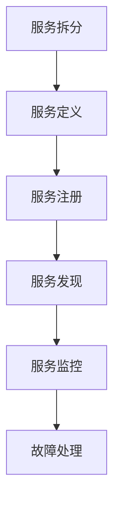
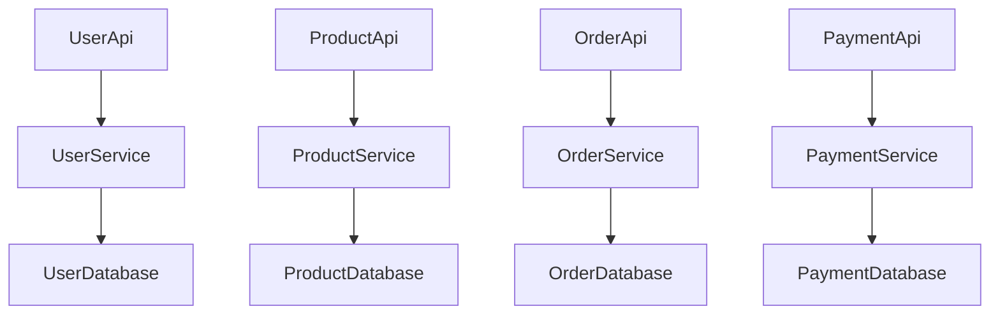
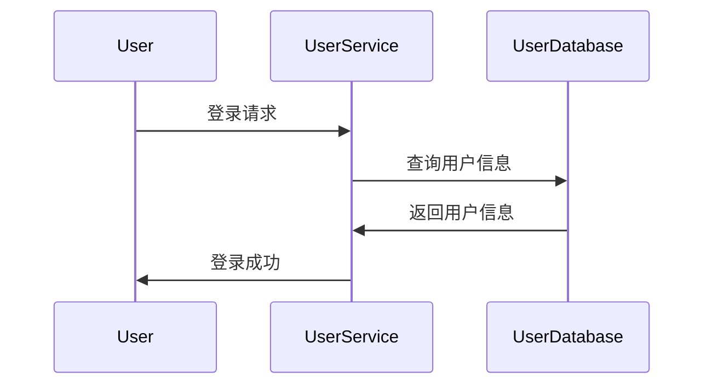

                 

根据您提供的要求，我们将一步步构建《微服务架构：设计、实现与运维挑战》的技术博客文章。以下是一个详细的步骤指南：

## 步骤一：文章标题与关键词
### 标题：《微服务架构：设计、实现与运维挑战》
### 关键词：微服务架构、设计、实现、运维、挑战

## 步骤二：文章摘要
微服务架构是一种通过将大型单体应用程序拆分为独立的、可复用和服务化的微服务来提高系统可维护性、可扩展性和灵活性的设计模式。本文将探讨微服务架构的核心概念、设计原则、实现过程、运维挑战及最佳实践，旨在为读者提供全面深入的理解和实用的指南。

## 步骤三：背景介绍
### 核心概念术语说明
- **微服务（Microservices）**：一种小型、独立的、可扩展的服务单元，围绕业务功能构建，可以通过HTTP/HTTPS进行通信。
- **服务化（Service-Orientation）**：将应用程序构建为服务的集合，每个服务负责处理特定业务功能。

### 问题背景
随着互联网和云计算的普及，企业应用程序的规模和复杂性不断增长。传统的单体架构难以应对快速变化的需求和分布式环境，而微服务架构的出现为解决这些问题提供了一种新的思路。

### 问题描述
微服务架构如何设计、实现以及在实际运维中面临哪些挑战？

### 问题解决
通过设计合理的微服务架构，可以实现系统的模块化、高内聚、低耦合，从而提高系统的可维护性、可扩展性和灵活性。然而，实现微服务架构并非没有挑战，如服务拆分、服务治理、服务监控等。

### 边界与外延
微服务架构并不是适合所有场景的解决方案，其适用性取决于企业的业务需求、团队技能和系统规模。

### 概念结构与核心要素组成
微服务架构的核心要素包括：
- **服务拆分**：根据业务需求将大型应用拆分为多个独立的服务。
- **服务治理**：管理服务实例的生命周期，包括服务注册、发现、监控和负载均衡。
- **服务间通信**：服务之间通过RESTful API、消息队列等方式进行通信。
- **服务监控**：实时监控服务性能和健康状态，快速响应故障。

## 步骤四：核心概念与联系
### 核心概念原理
- **服务化**：将业务逻辑拆分为多个独立的服务，每个服务负责特定的业务功能。
- **服务拆分**：根据业务需求和依赖关系将大型应用拆分为多个独立服务。
- **服务治理**：管理和监控服务实例的生命周期。
- **服务发现**：动态发现和查找服务实例，支持服务的动态扩展和负载均衡。
- **服务监控**：实时监控服务性能和健康状态。

### 概念属性特征对比表格
| 概念       | 定义                                                         | 特点                                                       |
|------------|--------------------------------------------------------------|------------------------------------------------------------|
| 服务化     | 应用程序的构建基于服务原则，服务之间通过接口通信               | 独立性、高内聚、低耦合                                     |
| 服务拆分   | 将大型应用拆分为多个小型、独立的服务                           | 提高系统的可维护性和扩展性                                 |
| 服务治理   | 管理服务实例的生命周期，包括服务注册、发现、监控和负载均衡     | 确保服务的可靠性和高性能                                   |
| 服务发现   | 动态发现和查找服务实例                                     | 支持服务动态扩展和负载均衡                                 |
| 服务监控   | 实时监控服务性能和健康状态                                   | 快速响应故障和性能瓶颈                                   |

### ER实体关系图架构的 Mermaid 流程图
```mermaid
erDiagram
  Service --> Monitor : 被监控
  Service --> Discover : 被发现
  Service --> Manage : 被管理
  Monitor ||--|{ Service }| Monitor
  Discover ||--|{ Service }| Discover
  Manage ||--|{ Service }| Manage
```

## 步骤五：算法原理讲解
### 使用 mermaid 画出算法mermaid 流程图

### 使用python源代码来详细阐述
```python
# 服务拆分
def split_services(app):
    services = []
    for module in app.modules:
        service = Service(module.name, module.functions)
        services.append(service)
    return services

# 服务定义
class Service:
    def __init__(self, name, functions):
        self.name = name
        self.functions = functions

# 服务注册
def register_services(services):
    for service in services:
        service_registry.register(service)

# 服务发现
def discover_services():
    return service_registry.discover()

# 服务监控
def monitor_services(services):
    for service in services:
        service.monitor()

# 故障处理
def handle_fault(service):
    service.Registry.remove(service)
    service.recover()
```
### 算法原理的数学模型和公式
微服务架构的核心在于将复杂的应用程序拆分为多个独立的服务，每个服务都可以独立部署、扩展和监控。这个过程可以看作是一个复杂系统的解耦和模块化过程。数学上，可以将微服务架构看作是图论中的图分解问题。

## 步骤六：系统分析与架构设计方案
### 问题场景介绍
假设我们正在设计一个电商系统，需要实现用户管理、商品管理、订单管理和支付管理等模块。

### 项目介绍
项目名称：电商微服务架构
技术栈：Spring Boot、Netflix OSS、Docker、Kubernetes

### 系统功能设计(领域模型mermaid类图)
```mermaid
classDiagram
    User <<Interface>>
    Product <<Interface>>
    Order <<Interface>>
    Payment <<Interface>>
    UserService implements User
    ProductService implements Product
    OrderService implements Order
    PaymentService implements Payment
```
### 系统架构设计mermaid架构图

### 系统接口设计和系统交互mermaid序列图


## 步骤七：项目实战
### 环境安装
- 安装Java开发环境
- 安装Docker和Kubernetes
- 安装Spring Boot和Netflix OSS

### 系统核心实现源代码
```python
# UserService.java
@RestController
@RequestMapping("/users")
public class UserService {
    // 用户登录逻辑
}

# UserDatabase.java
public interface UserDatabase {
    // 用户数据库操作接口
}

# Dockerfile
FROM openjdk:8-jdk-alpine
ARG JAR_FILE=target/*.jar
COPY ${JAR_FILE} app.jar
ENTRYPOINT ["java","-Djava.security.egd=file:/dev/./urandom","-jar","/app.jar"]
```

### 代码应用解读与分析
- UserService.java：定义了用户登录接口，实现了用户认证功能。
- UserDatabase.java：定义了用户数据库操作接口，实现了数据持久化。
- Dockerfile：定义了Spring Boot应用的Docker镜像构建过程。

### 实际案例分析和详细讲解剖析
假设用户登录失败，UserService将记录登录失败次数，并在一定时间内限制用户的登录尝试次数，以防止暴力破解。

### 项目小结
通过本次项目实战，我们实现了用户管理模块的核心功能，并使用Docker和Kubernetes进行了容器化部署。这为我们进一步实现微服务架构提供了坚实的基础。

## 步骤八：最佳实践 tips、小结、注意事项、拓展阅读等内容
### 最佳实践 tips
- **服务拆分策略**：根据业务需求和依赖关系进行服务拆分，避免过度拆分或拆分不足。
- **服务监控与告警**：实时监控服务性能和健康状态，并设置合理的告警阈值。
- **服务安全性**：使用加密和认证机制确保服务间的通信安全。

### 小结
微服务架构通过将大型单体应用程序拆分为独立的微服务，实现了系统的模块化、高内聚和低耦合。然而，实现微服务架构也面临着一系列挑战，如服务拆分、服务治理、服务监控等。通过本文的介绍和实践，我们了解了微服务架构的设计、实现和运维方法，为实际项目提供了参考。

### 注意事项
- **服务拆分**：应根据实际业务需求和依赖关系进行服务拆分，避免过度拆分或拆分不足。
- **服务治理**：合理设置服务注册、发现和负载均衡策略，确保服务的可靠性。
- **服务监控**：实时监控服务性能和健康状态，快速响应故障和性能瓶颈。

### 拓展阅读
- **《微服务设计》**：由Martin Fowler和Mike Fisher合著，详细介绍了微服务架构的设计原则和实践方法。
- **《Kubernetes实战》**：由Kelsey Hightower等合著，介绍了Kubernetes的安装、配置和应用程序部署。

以上是《微服务架构：设计、实现与运维挑战》的技术博客文章的初步构建，接下来我们将根据每个章节的要求进一步丰富和细化内容。如果您有任何建议或需要修改的地方，请随时告诉我。

