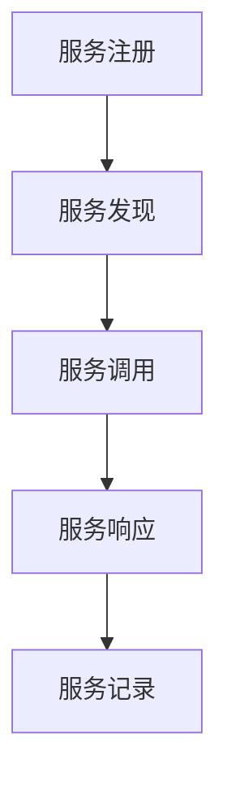
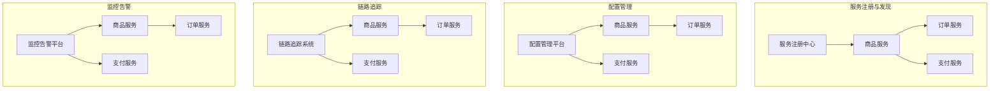
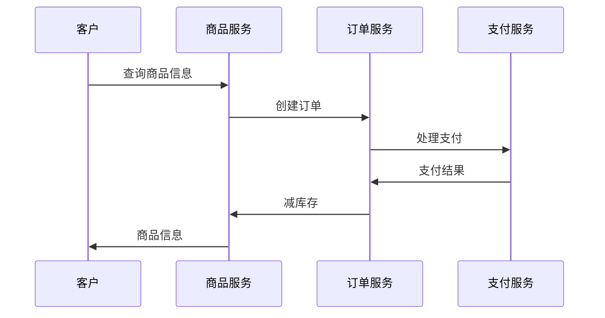

                 


### 1. 背景介绍

#### 问题背景

微服务架构起源于互联网时代，随着云计算、分布式系统和DevOps理念的兴起，传统单体应用架构逐渐无法满足日益增长的业务需求。微服务架构通过将复杂的应用系统拆分为多个独立的服务模块，每个服务模块负责不同的业务功能，能够更好地应对快速变化的市场需求。

微服务架构的特点在于模块化、分布式、自治性强、易于扩展和部署。然而，随着服务数量的增加，系统间的通信复杂性、稳定性、监控等问题也随之而来，给企业带来了巨大的挑战。

#### 问题描述

- **服务之间的通信**：微服务之间的通信主要通过API进行，随着服务数量和交互复杂性的增加，如何确保通信的高效、稳定和可扩展性成为关键问题。
- **系统稳定性**：大规模微服务系统的稳定性受到多种因素的影响，如服务依赖关系、网络延迟、硬件故障等，如何确保系统的稳定运行是一个重要的挑战。
- **监控告警**：在微服务架构中，系统的监控告警体系需要能够及时发现和定位问题，避免故障的扩散和业务的中断。

#### 问题解决

微服务治理是指通过一系列技术和方法，对大规模微服务系统进行管理和优化，以确保其高效、稳定和可扩展的运行。以下是微服务治理的几个核心方法：

- **服务注册与发现**：服务注册与发现机制能够确保服务实例在运行时能够被发现和调用，从而实现服务之间的动态通信。
- **配置管理**：配置管理系统能够集中管理和分发服务配置，避免因配置错误导致的服务故障。
- **链路追踪**：链路追踪技术能够记录服务之间的调用关系，帮助开发者快速定位和解决性能问题。
- **监控告警**：通过构建完善的监控告警体系，能够实现对系统运行状态的实时监控和故障预警。

#### 边界与外延

- **技术层面**：微服务治理主要涉及服务注册与发现、配置管理、链路追踪、监控告警等技术领域。
- **管理层面**：微服务治理还需要考虑团队协作、流程优化、风险管理等方面。

#### 核心要素组成

- **服务注册与发现**：服务注册与发现是微服务治理的基础，常见实现方式包括DNS、HTTP、gRPC等。
- **配置管理**：配置管理系统能够集中管理服务的配置项，支持热部署和灰度发布等功能。
- **链路追踪**：链路追踪技术通过记录请求在系统中的执行路径，帮助开发者定位性能瓶颈和故障。
- **监控告警**：监控告警系统通过采集系统运行指标，实现对服务状态和性能的实时监控和告警。

### 2. 核心概念与联系

#### 微服务

**微服务的概念**：微服务是一种设计理念，将大型单体应用拆分为多个小型、独立的服务模块，每个服务模块负责不同的业务功能。

**特点**：

- **独立性**：每个微服务具有独立的部署、升级和运维能力。
- **分布式**：微服务通过分布式网络进行通信，通常使用HTTP/HTTPS或gRPC等协议。
- **自治性**：每个微服务拥有自己的数据库和数据模型，能够独立处理业务逻辑。

**与传统架构的区别**：

- **传统架构**：单体应用通常将所有功能集成在一个大型的应用程序中，系统复杂度高、维护困难。
- **微服务架构**：通过将应用拆分为多个独立的微服务，降低系统复杂度，提高开发效率和系统可维护性。

#### 服务注册与发现

**作用**：服务注册与发现机制能够确保服务实例在运行时能够被发现和调用。

**原理**：

- **服务注册**：服务实例启动时，向服务注册中心注册自身信息。
- **服务发现**：消费者服务从服务注册中心获取服务实例列表，动态选择服务实例进行调用。

**常见实现方式**：

- **DNS**：通过DNS域名解析实现服务实例的动态查找。
- **Eureka**：Netflix开源的服务注册与发现组件，基于REST API实现。
- **Consul**：HashiCorp开源的服务注册与发现组件，支持多数据中心。
- **Zookeeper**：Apache开源的分布式服务注册与发现框架，基于ZAB协议。

#### 配置管理

**概念**：配置管理是指对服务的配置项进行集中管理、分发和更新的过程。

**作用**：

- **提高部署效率**：通过集中管理配置项，降低部署过程中的出错概率。
- **实现动态配置**：支持热部署和灰度发布，提高系统的灵活性和可靠性。

**选择标准**：

- **易用性**：配置管理工具应具备简单易用的用户界面和丰富的API接口。
- **可扩展性**：支持大规模服务集群的配置管理需求。
- **安全性和可靠性**：保障配置数据的完整性和安全性。

常见配置管理工具：

- **Apollo**：携程开源的分布式配置中心，支持多环境、多数据源和动态更新。
- **Nacos**：阿里开源的服务发现、配置和管理平台。
- **Spring Cloud Config**：Spring Cloud提供的分布式配置中心。

#### 链路追踪

**基本概念**：链路追踪是一种监控技术，通过记录请求在系统中的执行路径，帮助开发者定位性能瓶颈和故障。

**技术原理**：

- **分布式追踪**：在分布式系统中，通过在各个服务实例中添加追踪标记，记录请求在系统中的执行路径。
- **数据采集与存储**：将追踪数据收集并存储到集中式数据存储系统中，如Kafka、Elasticsearch等。

**应用场景**：

- **性能优化**：通过分析链路追踪数据，定位系统性能瓶颈，优化系统架构和代码。
- **故障排查**：在系统出现故障时，通过链路追踪数据快速定位故障发生的位置和原因。

**开源工具**：

- **Zipkin**：由Twitter开源的分布式追踪系统，支持多种语言和框架。
- **Jaeger**：由CNCF孵化，开源的分布式追踪系统，支持多种数据格式和存储后端。

#### 监控告警

**概念**：监控告警是指通过收集系统运行指标，实现对服务状态和性能的实时监控和告警。

**作用**：

- **实时监控**：实时获取系统运行状态，及时发现异常情况。
- **告警通知**：通过邮件、短信、电话等途径，及时通知相关人员处理故障。

**设计原则**：

- **全面性**：覆盖系统的各个方面，包括CPU、内存、磁盘、网络等。
- **及时性**：确保告警信息能够及时传达给相关人员。
- **准确性**：确保告警信息的准确性和可靠性，避免误报和漏报。

**常见工具**：

- **Prometheus**：开源的监控告警工具，基于拉取模式，支持多维数据收集和告警。
- **Grafana**：开源的数据可视化和监控工具，支持多种数据源，提供丰富的仪表盘和告警功能。
- **Zabbix**：开源的监控告警工具，支持 agentless 监控，提供丰富的告警策略和报表。

### 3. 算法原理讲解

#### 算法mermaid流程图



#### Python源代码

```python
import requests

def service_register(service_name, service_url):
    # 服务注册
    url = f"{service_registry_url}/register"
    data = {
        "service_name": service_name,
        "service_url": service_url
    }
    requests.post(url, json=data)

def service_discovery(service_name):
    # 服务发现
    url = f"{service_registry_url}/discovery/{service_name}"
    response = requests.get(url)
    service_instances = response.json()
    return service_instances

def service_call(service_name, method, data):
    # 服务调用
    service_instance = service_discovery(service_name)[0]
    url = f"{service_instance['service_url']}/{method}"
    response = requests.post(url, json=data)
    return response.json()

def service_record(service_name, method, data, result):
    # 服务记录
    url = f"{service_registry_url}/record"
    data = {
        "service_name": service_name,
        "method": method,
        "data": data,
        "result": result
    }
    requests.post(url, json=data)
```

#### 数学模型和公式

假设服务注册中心的服务实例集合为 S，服务调用次数为 n，服务成功率概率为 p。

$$
成功率 = p = \frac{成功调用次数}{总调用次数}
$$

其中，成功调用次数为 S 中服务实例的成功调用次数之和。

#### 详细讲解和举例说明

**示例：**

假设有一个购物系统，包含商品服务、订单服务和支付服务三个微服务。服务注册中心为 Eureka。

1. **服务注册**：每个服务实例启动时，向 Eureka 注册自身信息。
    ```python
    service_register('商品服务', 'http://商品服务地址')
    service_register('订单服务', 'http://订单服务地址')
    service_register('支付服务', 'http://支付服务地址')
    ```

2. **服务发现**：当用户发起购物请求时，订单服务从 Eureka 中获取商品服务和支付服务实例列表，动态选择实例进行调用。
    ```python
   商品服务实例 = service_discovery('商品服务')[0]
   支付服务实例 = service_discovery('支付服务')[0]
    ```

3. **服务调用**：订单服务调用商品服务和支付服务。
    ```python
   商品信息 = service_call('商品服务', 'get_product_info', {'product_id': 123})
   支付结果 = service_call('支付服务', 'pay_order', {'order_id': 456})
    ```

4. **服务记录**：将服务调用结果记录到服务注册中心。
    ```python
    service_record('商品服务', 'get_product_info', {'product_id': 123}, 商品信息)
    service_record('支付服务', 'pay_order', {'order_id': 456}, 支付结果)
    ```

通过以上步骤，实现了微服务之间的服务注册、发现、调用和记录，确保了系统的高效、稳定和可扩展性。

### 4. 数学模型和数学公式 & 详细讲解 & 举例说明

#### 数学公式使用latex格式

$$
成功率 = p = \frac{成功调用次数}{总调用次数}
$$

其中，成功调用次数为 S 中服务实例的成功调用次数之和。

#### 详细讲解

本章节将继续讨论微服务治理中的数学模型和公式，以帮助读者更好地理解和应用相关算法。

#### 成功率模型

成功调用次数是指在一定时间内，成功完成调用的服务调用次数。总调用次数是指在同一时间段内，所有服务调用的总次数。成功率的计算公式如下：

$$
成功率 = p = \frac{成功调用次数}{总调用次数}
$$

其中，成功率 p 是一个介于 0 和 1 之间的值，表示服务调用的成功率。成功调用次数和总调用次数可以通过统计服务调用的日志数据得到。

#### 平均响应时间模型

平均响应时间是指服务调用过程中，所有服务实例的平均响应时间。响应时间是指从发起调用到接收到响应结果的时间间隔。平均响应时间的计算公式如下：

$$
平均响应时间 = \frac{总响应时间}{总调用次数}
$$

其中，总响应时间是指所有服务实例的响应时间之和。

#### 可用性模型

可用性是指系统在规定时间内能够正常运行的概率。对于微服务架构，可用性可以表示为：

$$
可用性 = 1 - 失败率
$$

其中，失败率是指服务调用失败的概率。可用性的计算需要考虑多个因素，如服务实例的数量、网络延迟、硬件故障等。

#### 异常检测模型

在微服务架构中，异常检测是一个重要的环节。异常检测的目的是在系统运行过程中，及时发现和识别异常情况，并采取相应的措施。常见的异常检测模型包括基于统计的异常检测和基于机器学习的异常检测。

- **基于统计的异常检测**：通过计算系统运行指标的统计特征，如平均值、方差等，与设定的阈值进行比较，判断是否存在异常。

$$
异常检测阈值 = \alpha \times \sigma
$$

其中，α 是设定的置信水平，σ 是标准差。

- **基于机器学习的异常检测**：利用机器学习算法，对系统运行数据进行建模，训练模型后，对新数据进行预测，如果预测结果与实际结果不一致，则认为存在异常。

#### 举例说明

假设有一个电商系统，包含商品服务、订单服务和支付服务三个微服务。系统运行了一段时间，收集了大量的服务调用数据。

1. **成功调用次数和总调用次数**：根据日志数据，统计成功调用次数和总调用次数。

   成功调用次数：1000 次

   总调用次数：1200 次

   成功率：p = 1000 / 1200 = 0.8333

2. **平均响应时间**：根据日志数据，计算总响应时间和总调用次数。

   总响应时间：12000 毫秒

   平均响应时间：平均响应时间 = 12000 / 1200 = 10 毫秒

3. **可用性**：根据成功率和异常检测阈值，计算系统的可用性。

   失败率：失败率 = 1 - 成功率 = 1 - 0.8333 = 0.1667

   可用性：可用性 = 1 - 失败率 = 1 - 0.1667 = 0.8333

4. **异常检测**：根据设定的置信水平α和标准差σ，计算异常检测阈值。

   α = 0.95（95%的置信水平）

   σ = 5 毫秒（标准差）

   异常检测阈值 = α \* σ = 0.95 \* 5 = 4.75 毫秒

   如果某个服务实例的响应时间超过 4.75 毫秒，则认为存在异常。

通过以上步骤，可以对电商系统的微服务进行有效的治理，确保系统的高效、稳定和可扩展性。

### 5. 系统分析与架构设计方案

#### 问题场景介绍

假设我们正在设计一个大型电商平台，包含商品服务、订单服务、支付服务等多个微服务。随着业务的发展，服务数量不断增加，系统间的通信复杂性、稳定性、监控等问题逐渐显现。

#### 项目介绍

项目名称：电商微服务架构优化项目

目标：通过微服务治理，提高系统的稳定性、可靠性和可扩展性。

团队成员：前端开发、后端开发、运维人员、测试人员等。

#### 系统功能设计(领域模型mermaid类图)

```mermaid
classDiagram
    产品 <<Entity>>
    订单 <<Entity>>
    支付 <<Entity>>

    产品 --|> 订单: 包含
    订单 --|> 支付: 支付
```

#### 系统架构设计mermaid架构图



#### 系统接口设计和系统交互mermaid序列图



### 6. 项目实战

#### 环境安装

1. 安装Eureka服务注册中心

   ```shell
   wget https://github.com/Netflix/eureka/releases/download/1.9.9/eureka-1.9.9.jar
   java -jar eureka-1.9.9.jar
   ```

2. 安装配置管理平台Apollo

   ```shell
   wget https://github.com/ctripcorp/apollo/releases/download/v1.8.0/apollo-1.8.0.tar.gz
   tar zxvf apollo-1.8.0.tar.gz
   cd apollo-1.8.0
   bin/apollo-service start
   ```

3. 安装链路追踪系统Zipkin

   ```shell
   wget https://github.com/openzipkin/zipkin/releases/download/2.23.4/zipkin-2.23.4.jar
   java -jar zipkin-2.23.4.jar
   ```

4. 安装监控告警平台Prometheus

   ```shell
   wget https://github.com/prometheus/prometheus/releases/download/v2.34.0/prometheus-2.34.0.linux-amd64.tar.gz
   tar zxvf prometheus-2.34.0.linux-amd64.tar.gz
   bin/prometheus --config.file config/prometheus.yml
   ```

#### 系统核心实现源代码

```python
# 商品服务注册
service_registry_url = "http://localhost:8761/eureka"
service_name = "商品服务"
service_url = "http://商品服务地址"
service_register(service_name, service_url)

# 订单服务调用商品服务
def get_product_info(product_id):
    url = f"{service_registry_url}/discovery/商品服务/get_product_info?product_id={product_id}"
    response = requests.get(url)
    return response.json()

# 支付服务处理支付
def pay_order(order_id, amount):
    url = f"{service_registry_url}/discovery/支付服务/pay_order?order_id={order_id}&amount={amount}"
    response = requests.post(url)
    return response.json()

# 记录服务调用日志
def record_service_call(service_name, method, data, result):
    url = f"{service_registry_url}/record"
    data = {
        "service_name": service_name,
        "method": method,
        "data": data,
        "result": result
    }
    requests.post(url, json=data)
```

#### 代码应用解读与分析

1. **服务注册**：在服务启动时，调用 `service_register` 函数向Eureka服务注册中心注册服务信息，包括服务名称和地址。
2. **服务发现**：在调用其他服务时，使用 `service_registry_url` 和服务名称从Eureka服务注册中心获取服务实例地址，动态选择实例进行调用。
3. **服务调用**：通过发起HTTP请求，调用商品服务、订单服务和支付服务的API接口，处理相应的业务逻辑。
4. **日志记录**：将服务调用过程中的关键信息记录到服务注册中心，便于后续的监控和分析。

#### 实际案例分析和详细讲解剖析

假设一个用户在电商平台上购买了一件商品，整个购买过程如下：

1. **查询商品信息**：用户发起请求，查询商品详情。
   - 商品服务接收到请求后，根据商品ID查询商品信息，并将结果返回给用户。

2. **创建订单**：用户确认购买后，订单服务接收到请求，创建订单。
   - 订单服务根据商品信息创建订单，并将订单信息保存到数据库。

3. **处理支付**：订单服务调用支付服务，处理支付。
   - 支付服务根据订单信息进行支付处理，并将支付结果返回给订单服务。

4. **更新库存**：订单服务接收到支付结果后，调用商品服务更新库存。
   - 商品服务根据订单信息减去对应的库存，并将更新后的库存信息返回给订单服务。

通过以上步骤，用户成功完成了购买过程。在微服务治理过程中，服务注册与发现、配置管理、链路追踪和监控告警等机制起到了关键作用：

- **服务注册与发现**：确保服务实例能够在运行时被发现和调用，提高了系统的灵活性和可扩展性。
- **配置管理**：集中管理服务的配置项，避免因配置错误导致的服务故障。
- **链路追踪**：记录服务调用过程中的关键信息，帮助开发者快速定位和解决性能问题。
- **监控告警**：实时监控服务状态和性能指标，及时发现和解决潜在问题。

#### 项目小结

本项目通过微服务治理，实现了电商平台的稳定、高效和可扩展性。在项目实施过程中，我们采用了服务注册与发现、配置管理、链路追踪和监控告警等核心技术，有效解决了大规模微服务架构面临的问题。通过实际案例的分析，我们验证了微服务治理在提高系统性能、稳定性和可维护性方面的优势。未来，我们将继续优化微服务治理方案，为电商平台提供更高效、可靠的服务。

### 7. 最佳实践 tips、小结、注意事项、拓展阅读等内容

#### 最佳实践 tips

1. **服务拆分策略**：在拆分服务时，要充分考虑业务逻辑的独立性和复用性，避免过度拆分导致系统复杂性增加。
2. **服务注册与发现**：选择合适的服务注册与发现工具，如Eureka、Consul等，确保服务实例的高效管理和动态调用。
3. **配置管理**：使用配置管理平台，如Apollo、Nacos等，实现配置项的集中管理和动态更新。
4. **链路追踪**：采用链路追踪工具，如Zipkin、Jaeger等，提高系统性能优化和故障排查效率。
5. **监控告警**：构建完善的监控告警体系，使用Prometheus、Grafana等工具实现实时监控和故障预警。

#### 小结

本文详细介绍了微服务治理的核心概念、方法和技术，通过实际案例展示了微服务治理在提高系统性能、稳定性和可维护性方面的优势。微服务治理是大规模微服务架构不可或缺的一部分，通过合理的设计和实施，可以有效应对服务化带来的挑战。

#### 注意事项

1. **服务拆分与重构**：在实施微服务治理时，要充分评估服务拆分的必要性，避免盲目重构导致系统复杂度增加。
2. **监控与告警策略**：制定合理的监控和告警策略，确保系统性能和稳定性，避免误报和漏报。
3. **数据安全与隐私保护**：在数据传输和存储过程中，要确保数据的安全性和隐私保护。

#### 拓展阅读

1. 《微服务设计》 - Martin Fowler
2. 《微服务实践》 - Samuel M. BG
3. 《Spring Cloud微服务实战》 - 张许峰
4. 《Prometheus监控与告警实战》 - 郭蕾

### 作者信息

作者：AI天才研究院/AI Genius Institute & 禅与计算机程序设计艺术 /Zen And The Art of Computer Programming

本文旨在为读者提供关于微服务治理的全面理解和实践指导，希望对您的微服务架构设计和管理有所帮助。在未来的学习和实践中，不断探索和创新，为构建更加高效、稳定和可扩展的系统贡献力量。

