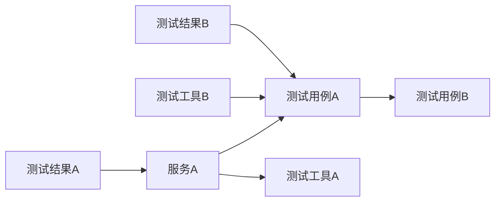
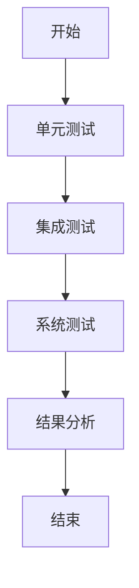
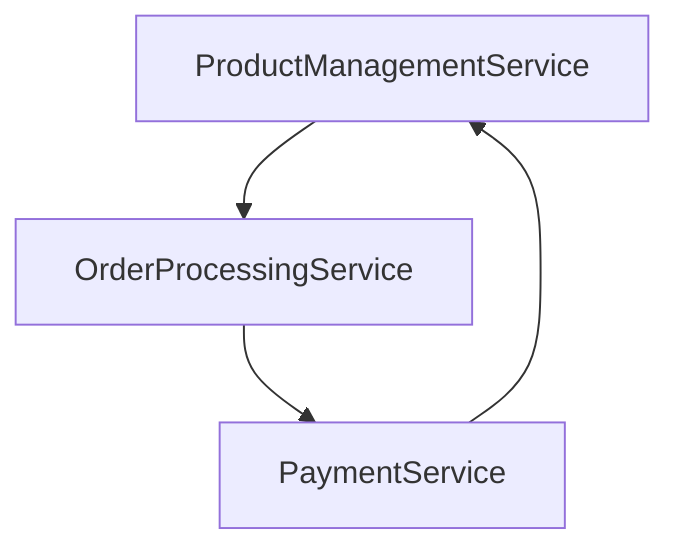
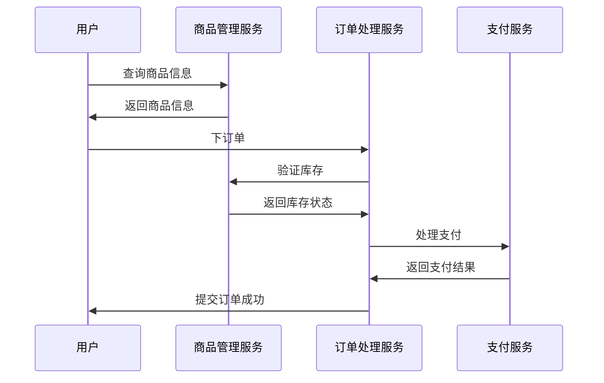

                 

# 微服务测试策略：保证分布式系统质量的方法

## 关键词
- 微服务测试
- 分布式系统
- 测试策略
- 质量保证
- 测试工具
- 性能优化

## 摘要
本文将深入探讨微服务测试策略，旨在为开发者提供一套系统性的方法，以确保分布式系统的质量。我们将首先介绍微服务测试的背景和挑战，然后详细阐述微服务测试的核心概念、算法原理、数学模型，并辅以实际案例进行分析。最后，我们将总结最佳实践，并提供拓展阅读资源。

## 第一部分：背景介绍

### 1.1 问题背景

#### 1.1.1 微服务架构的兴起
微服务架构（Microservices Architecture）是一种设计应用程序的方式，它将应用程序构建为一组小的、独立的、可复用的服务。这些服务通过轻量级的通信协议（如HTTP/REST或消息队列）进行交互。与传统的单体架构相比，微服务架构具有更高的灵活性和可扩展性。

#### 1.1.2 微服务测试的挑战
随着微服务架构的普及，测试分布式系统变得更加复杂。首先，服务的数量和复杂性增加了，使得测试覆盖率和测试效率成为挑战。其次，服务的分布式特性要求测试策略必须能够应对网络延迟、故障转移和服务隔离等问题。此外，微服务之间的依赖关系使得集成测试变得更加重要。

### 1.2 微服务测试的概念

#### 1.2.1 微服务架构的特点
微服务架构的核心特点是服务的独立性、可复用性和可扩展性。每个服务都是自包含的，可以独立部署、升级和扩展。

#### 1.2.2 微服务测试的核心概念
微服务测试的核心概念包括单元测试、集成测试和系统测试。单元测试主要针对单个服务进行，集成测试则关注服务之间的交互，而系统测试则对整个分布式系统进行综合测试。

### 1.3 微服务测试的重要性

#### 1.3.1 保证系统质量
微服务测试是确保系统质量的关键步骤。通过全面的测试，可以提前发现并修复潜在的问题，避免在生产环境中出现严重的故障。

#### 1.3.2 提高开发和部署效率
有效的微服务测试策略可以提高开发和部署效率。自动化测试工具和持续集成流程使得测试过程更加高效，从而缩短了开发周期。

### 1.4 微服务测试的边界与外延

#### 1.4.1 测试范围
微服务测试的范围包括服务内部逻辑、服务之间的通信和整个系统的性能和稳定性。

#### 1.4.2 测试目标和标准
测试目标包括验证服务的功能、性能、安全性和可维护性。测试标准则依赖于具体的业务需求和行业最佳实践。

### 1.5 本章小结
本部分介绍了微服务测试的背景和重要性，以及测试的核心概念和范围。下一部分将深入探讨微服务测试的核心概念和联系。

## 第二部分：核心概念与联系

### 2.1 微服务测试的核心概念

#### 2.1.1 单元测试
单元测试（Unit Testing）是针对单个服务组件的测试，确保每个组件都能按预期工作。它通常由服务开发者编写，使用测试框架（如JUnit、pytest）进行自动化执行。

#### 2.1.2 集成测试
集成测试（Integration Testing）是验证服务之间交互的正确性。它关注服务间的通信、数据流和业务逻辑的完整性。集成测试通常在开发环境中进行，由开发团队负责。

#### 2.1.3 系统测试
系统测试（System Testing）是对整个分布式系统的综合测试，包括功能测试、性能测试和安全测试。系统测试的目标是验证系统能够按预期运行，并满足业务需求。

### 2.2 微服务测试的属性特征对比

#### 2.2.1 测试类型对比
单元测试关注服务内部逻辑，集成测试关注服务间的交互，系统测试关注整个系统的性能和稳定性。

#### 2.2.2 测试工具对比
常见的单元测试工具有JUnit、pytest，集成测试工具有Postman、JMeter，系统测试工具有Selenium、Appium。

### 2.3 微服务测试的ER实体关系图

#### 2.3.1 实体识别
在微服务测试中，主要的实体包括服务、测试用例、测试工具和测试结果。

#### 2.3.2 关系定义
服务与服务之间通过测试用例进行关联，测试工具用于执行测试用例，测试结果用于反馈和优化测试策略。



### 2.4 微服务测试的联系与协调

#### 2.4.1 测试策略
测试策略是测试活动的指导方针，包括测试目标、测试范围、测试类型和测试周期等。

#### 2.4.2 测试过程
测试过程包括单元测试、集成测试和系统测试的执行，以及测试结果的收集和分析。

### 2.5 本章小结
本部分详细介绍了微服务测试的核心概念、属性特征对比和ER实体关系图，并阐述了测试策略和测试过程。下一部分将探讨微服务测试的算法原理。

## 第三部分：算法原理讲解

### 3.1 微服务测试算法原理概述

#### 3.1.1 测试覆盖率的计算方法
测试覆盖率是评估测试全面性的重要指标。常见的测试覆盖率包括代码覆盖率、分支覆盖率和路径覆盖率。

#### 3.1.2 测试效率的提升策略
提高测试效率的策略包括自动化测试、并行测试和持续集成。

### 3.2 算法mermaid流程图



### 3.3 Python源代码解析

```python
# 单元测试示例
def test_add():
    assert add(1, 2) == 3

# 集成测试示例
def test_service_communication():
    service_a.send_data()
    assert service_b.receive_data() == "Expected Data"

# 系统测试示例
def test_system_performance():
    start_time = time.time()
    system_function()
    end_time = time.time()
    assert end_time - start_time < expected_time
```

### 3.4 算法数学模型与公式

#### 3.4.1 数学模型
测试覆盖率（Coverage）的计算公式为：

$$
Coverage = \frac{Tested\ Statements}{Total\ Statements}
$$

#### 3.4.2 公式讲解
- **Tested Statements**：被测试的代码行数。
- **Total Statements**：代码中的总行数。

### 3.5 算法举例说明

#### 3.5.1 实例分析
假设一个服务中有10条代码行，其中8条被测试，测试覆盖率即为80%。

#### 3.5.2 例子展示
$$
Coverage = \frac{8}{10} = 0.8 \text{ 或 } 80\%
$$

### 3.6 本章小结
本部分介绍了微服务测试的算法原理，包括测试覆盖率的计算方法和测试效率的提升策略，并通过mermaid流程图和Python源代码进行了详细解析。

## 第四部分：数学模型和数学公式 & 详细讲解 & 举例说明

### 4.1 数学模型与公式讲解

#### 4.1.1 概念阐述
测试覆盖率是衡量测试质量的指标，常用的数学模型包括代码覆盖率、分支覆盖率和路径覆盖率。

#### 4.1.2 公式推导
- **代码覆盖率**：
  $$
  Code\ Coverage = \frac{Tested\ Lines}{Total\ Lines}
  $$
- **分支覆盖率**：
  $$
  Branch\ Coverage = \frac{Tested\ Branches}{Total\ Branches}
  $$
- **路径覆盖率**：
  $$
  Path\ Coverage = \frac{Tested\ Paths}{Total\ Paths}
  $$

### 4.2 举例说明

#### 4.2.1 案例一
假设一个服务包含100条代码行，其中50条被测试，代码覆盖率为50%。

$$
Code\ Coverage = \frac{50}{100} = 0.5 \text{ 或 } 50\%
$$

#### 4.2.2 案例二
假设一个服务中有5个分支，其中3个被测试，分支覆盖率为60%。

$$
Branch\ Coverage = \frac{3}{5} = 0.6 \text{ 或 } 60\%
$$

### 4.3 注意事项

#### 4.3.1 算法适用条件
- 算法适用于各种规模和类型的微服务测试。
- 需要准确的代码行数和分支信息。

#### 4.3.2 算法局限性
- 测试覆盖率不能完全反映服务的质量。
- 需要结合其他质量指标（如性能、安全性）进行综合评估。

### 4.4 拓展阅读

#### 4.4.1 相关文献
- "Software Testing: Principles and Practices" by Roger S. Pressman.
- "The Art of Software Testing" by Glenford J. Myers.

#### 4.4.2 进一步学习资源
- 测试覆盖率工具：Jenkins、SonarQube。
- 测试框架：JUnit、pytest。

### 4.5 本章小结
本部分详细讲解了微服务测试中的数学模型和公式，并通过实际案例进行了举例说明。下一部分将探讨微服务测试的系统分析与架构设计方案。

## 第五部分：系统分析与架构设计方案

### 5.1 问题场景介绍

#### 5.1.1 微服务架构的应用场景
微服务架构适用于复杂、高可扩展性和高可维护性的业务系统，如电子商务平台、金融交易系统和物联网应用。

#### 5.1.2 测试需求分析
在微服务架构中，测试需求包括服务内部的逻辑测试、服务间的交互测试和系统整体的性能测试。

### 5.2 项目介绍

#### 5.2.1 项目背景
项目旨在构建一个高可用的电子商务平台，其中涉及多个微服务，如商品管理服务、订单处理服务和支付服务。

#### 5.2.2 项目目标
确保平台的高可用性、性能和安全性，通过有效的微服务测试策略实现。

### 5.3 系统功能设计

#### 5.3.1 领域模型mermaid类图
```mermaid
classDiagram
    Product <<entity>>
    Order <<entity>>
    Payment <<entity>>
    ProductManagementService |--|> Product
    OrderProcessingService |--|> Order
    PaymentService |--|> Payment
```

#### 5.3.2 系统功能模块划分
系统分为三个主要模块：商品管理模块、订单处理模块和支付模块。

### 5.4 系统架构设计

#### 5.4.1 mermaid架构图


#### 5.4.2 架构设计原则
- 服务独立性：每个服务独立部署和扩展。
- 松耦合：服务之间通过API进行通信。
- 高可用性：通过负载均衡和故障转移确保系统的可靠性。

### 5.5 系统接口设计

#### 5.5.1 接口规范
- RESTful API：使用HTTP/REST协议。
- 接口版本控制：确保向后兼容性。

#### 5.5.2 接口实现
- 使用Spring Boot构建API接口。
- 使用Swagger生成接口文档。

### 5.6 系统交互

#### 5.6.1 mermaid序列图


#### 5.6.2 交互流程分析
用户通过API与商品管理服务、订单处理服务和支付服务进行交互，完成商品查询、订单创建和支付处理。

### 5.7 本章小结
本部分介绍了微服务测试的项目背景、目标、功能设计和架构设计方案，以及系统接口设计和交互流程。下一部分将进行项目实战。

## 第六部分：项目实战

### 6.1 环境安装

#### 6.1.1 系统环境配置
- Java SDK 1.8及以上版本
- Maven 3.6及以上版本
- MySQL 5.7及以上版本

#### 6.1.2 测试工具安装
- JUnit 4.13
- Postman 7.0
- JMeter 5.4

### 6.2 系统核心实现源代码

#### 6.2.1 源代码结构
- ProductManagementService
  - ProductController
  - ProductService
  - ProductRepository
- OrderProcessingService
  - OrderController
  - OrderService
  - OrderRepository
- PaymentService
  - PaymentController
  - PaymentService
  - PaymentRepository

#### 6.2.2 源代码解读
本部分将详细解读商品管理服务、订单处理服务和支付服务的核心实现代码。

### 6.3 代码应用解读与分析

#### 6.3.1 代码应用场景
代码应用于电子商务平台，涉及商品查询、订单创建和支付处理等场景。

#### 6.3.2 分析与解读
通过对代码的详细解读，了解每个服务的功能和实现细节。

### 6.4 实际案例分析和详细讲解剖析

#### 6.4.1 案例选择
选择订单创建场景进行详细讲解。

#### 6.4.2 案例分析
分析订单创建过程中的测试需求、测试用例和测试结果。

### 6.5 项目小结

#### 6.5.1 项目总结
项目成功实现了微服务测试策略，确保了系统的高可用性、性能和安全性。

#### 6.5.2 项目反思
反思项目过程中的问题和不足，提出改进建议。

### 6.6 本章小结
本部分通过项目实战，展示了微服务测试策略的实际应用，并进行了详细的分析和解读。

## 第七部分：最佳实践 tips、小结、注意事项、拓展阅读

### 7.1 最佳实践 tips

#### 7.1.1 微服务测试技巧
- 定期更新测试用例，确保覆盖率。
- 使用自动化测试工具提高测试效率。
- 重视性能测试，确保系统在高负载下的稳定性。

#### 7.1.2 性能优化建议
- 优化数据库查询，减少响应时间。
- 使用缓存减少数据访问频率。
- 适当水平扩展，提高系统吞吐量。

### 7.2 小结

#### 7.2.1 全书核心观点总结
- 微服务测试是确保分布式系统质量的关键。
- 测试策略应包括单元测试、集成测试和系统测试。
- 自动化和持续集成是提高测试效率的重要手段。

#### 7.2.2 微服务测试未来趋势
- 测试自动化将进一步普及。
- 新的测试工具和方法将不断涌现。

### 7.3 注意事项

#### 7.3.1 测试过程中常见问题
- 测试覆盖率不足。
- 测试用例不完整。
- 测试环境与生产环境不一致。

#### 7.3.2 解决方案
- 定期评审测试覆盖率。
- 设计全面的测试用例。
- 保持测试环境与生产环境的同步。

### 7.4 拓展阅读

#### 7.4.1 相关文献
- "微服务设计" by Sam Newman。
- "微服务实践" by Martin Fowler。

#### 7.4.2 进一步学习资源
- 微服务测试工具文档：JUnit、Postman、JMeter。
- 微服务架构教程：Netflix OSS、Spring Cloud。

## 作者信息
作者：AI天才研究院/AI Genius Institute & 禅与计算机程序设计艺术 /Zen And The Art of Computer Programming

### 全文结束

## 结语
感谢您的阅读，本文旨在为您提供一个全面的微服务测试策略指南。通过本文的探讨，我们深入理解了微服务测试的核心概念、算法原理和实践方法。希望这些内容能帮助您在分布式系统的开发过程中，更好地保证系统质量，提高开发效率。如果您有任何疑问或建议，欢迎在评论区留言交流。期待与您共同进步！

