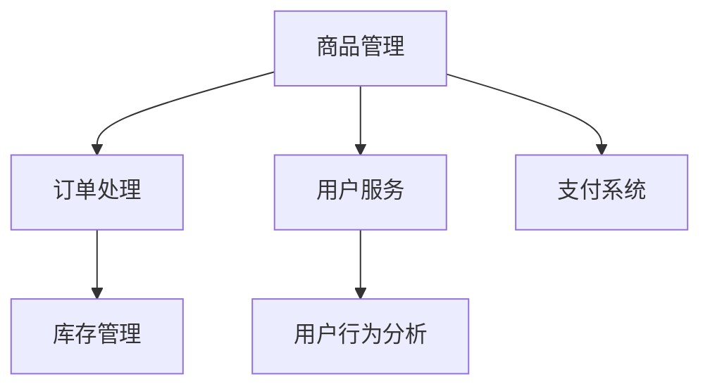
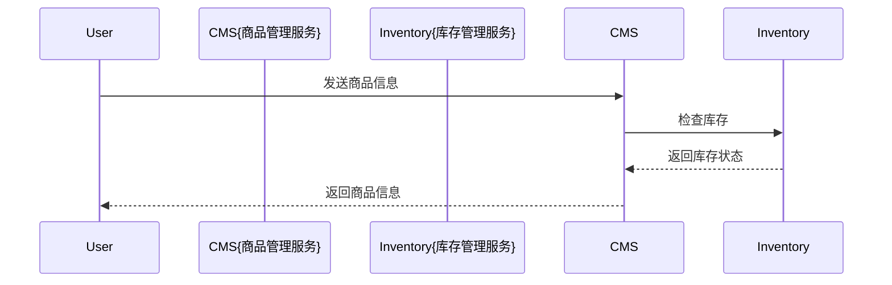
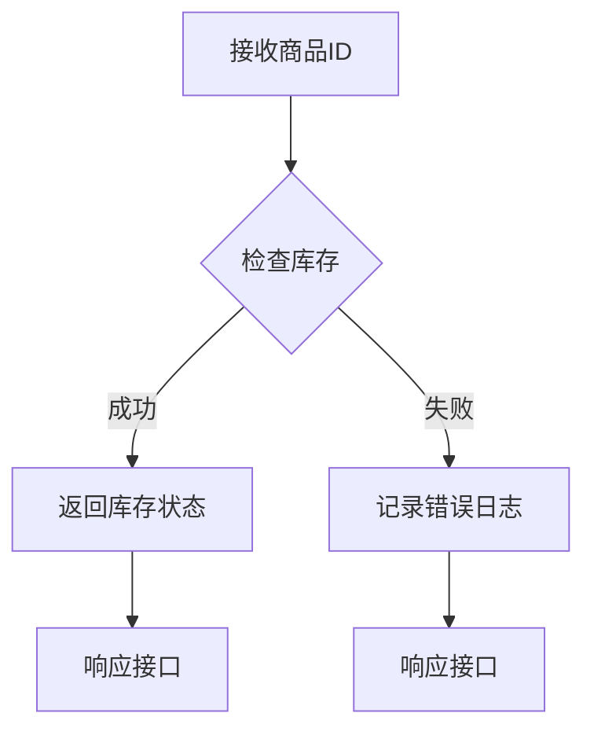

                 

### 文章标题

# 微服务版本控制策略：API版本管理最佳实践

### 关键词

- 微服务
- 版本控制
- API管理
- 版本号策略
- 最佳实践

### 摘要

本文深入探讨了微服务架构下的版本控制策略和API版本管理的最佳实践。首先，我们介绍了微服务和API管理的基本概念及其重要性。接着，详细分析了微服务版本控制的原则和策略，探讨了多种API版本号管理的方法，并详细讲解了如何在微服务架构中实施这些策略。随后，文章总结了API版本管理的最佳实践，包括如何处理版本升级和回退，以及在多团队协作中的版本控制策略。最后，通过实际案例展示了这些策略的应用，并提供了一些实用的建议和扩展阅读资源。

## 引言：微服务与API管理的背景

### 1.1 背景介绍

微服务架构（Microservices Architecture）是近年来软件工程领域的一大趋势，它将应用程序拆分为一组小型、独立的服务，每个服务都有自己的业务功能，并通过轻量级通信协议（如HTTP/HTTPS）进行交互。这种架构模式带来的主要优势包括：提高系统的可伸缩性、增强团队自主性、方便故障隔离以及快速迭代开发。

随着微服务架构的普及，API管理（API Management）也逐渐成为企业级应用的关键组成部分。API管理涉及到API的创建、发布、监控、管理和策略实施等环节，它确保了API的高可用性、安全性和可扩展性，是企业实现服务化架构、促进业务增长和创新的重要手段。

### 1.2 微服务与API管理的关系

微服务架构和API管理之间存在紧密的联系。首先，API是微服务架构中的核心通信机制，每个微服务都通过API对外提供服务。API管理不仅管理这些API的访问权限，还包括版本控制和变更管理，确保了服务的稳定性和兼容性。

其次，API管理为微服务架构提供了统一的入口，使得外部用户（如移动应用、合作伙伴和第三方开发者）能够方便地访问和集成微服务。通过API管理，企业可以灵活地调整服务策略，满足不同用户的需求。

### 1.3 核心概念与术语

在探讨微服务和API管理时，以下核心概念和术语是必不可少的：

- **微服务**：一种小型、独立的软件模块，负责执行特定业务功能，并通过API与其他服务进行通信。
- **API**：应用程序接口，定义了微服务之间进行交互的规则和协议。
- **API管理平台**：提供API创建、发布、监控和管理的工具和平台。
- **版本控制**：跟踪和管理软件版本的过程，确保不同版本的软件可以共存并保持兼容性。
- **API版本**：对API进行不同版本标记的方式，用于区分不同功能或修复问题的版本。

通过上述核心概念和术语的理解，我们可以更深入地探讨微服务和API管理的细节，为后续章节的内容奠定基础。

### 1.4 文章结构概述

本文结构如下：

1. **引言**：介绍微服务和API管理的背景及其关系。
2. **微服务版本控制原则**：分析版本控制的基本原则和策略。
3. **API版本号管理策略**：探讨不同的API版本号管理方法。
4. **实施版本控制策略**：讲解如何在微服务架构中实施版本控制。
5. **API版本管理最佳实践**：总结最佳实践，包括版本升级和回退策略。
6. **多团队协作中的版本控制**：讨论如何在多团队协作环境中进行版本控制。
7. **实际案例**：通过案例展示版本控制策略的应用。
8. **总结与拓展**：总结文章内容，提供拓展阅读和建议。

### 1.5 总结

通过引言部分的介绍，我们对微服务和API管理有了初步的了解，并明确了它们之间的紧密联系。在接下来的章节中，我们将深入探讨微服务版本控制的原则和策略，分析不同的API版本号管理方法，并详细讲解如何在实际项目中实施这些策略。希望通过本文，读者能够掌握微服务和API版本管理的核心知识和最佳实践。

---

### 核心概念与联系

在深入探讨微服务版本控制策略之前，我们需要明确一些核心概念，并了解它们之间的联系。以下是几个关键概念及其属性特征对比表格和ER实体关系图架构。

#### 核心概念

- **微服务**：独立运行的服务单元，负责具体业务功能。
- **API**：应用程序接口，用于微服务之间的通信。
- **版本号**：标识API或微服务版本的数字或字符串。
- **API管理平台**：用于创建、发布、监控和管理API的工具。

#### 属性特征对比表格

| 核心概念 | 属性 | 特征 |
| --- | --- | --- |
| 微服务 | 独立、可伸缩、自治、松耦合 | 实现业务功能，独立部署和运维 |
| API | 接口定义、协议、参数、返回值 | 通信规则，数据交互桥梁 |
| 版本号 | 标识、兼容性、变更 | 区分不同功能或修复问题的版本 |
| API管理平台 | 策略实施、监控、安全性 | 管理API的生命周期 |

#### ER实体关系图架构

下面是ER（Entity-Relationship）实体关系图，用于描述微服务、API、版本号和API管理平台之间的关系。

```mermaid
erDiagram
    API ||--|{ 微服务 } : 通信桥梁
    版本号 ||--|{ API } : 标识不同版本
    API管理平台 ||--|{ API } : 管理API
```

在ER图中，API与微服务之间通过“通信桥梁”相连，API通过版本号进行标识，而API管理平台负责管理API的整个生命周期。

#### 概念结构与核心要素组成

1. **微服务结构**：
   - **服务实例**：运行中的服务实例。
   - **API接口**：服务对外暴露的接口。
   - **业务逻辑**：实现特定业务功能。

2. **API管理结构**：
   - **API定义**：接口的定义和规格。
   - **策略实施**：访问控制、监控、日志等策略。
   - **API版本**：不同功能的API版本。

3. **版本控制结构**：
   - **版本标记**：用于标识不同版本的数字或字符串。
   - **变更记录**：记录API或微服务版本变更的详细日志。

通过上述核心概念、属性特征对比表格和ER实体关系图架构，我们可以更好地理解微服务版本控制和API管理的概念结构与核心要素组成。这为后续章节详细探讨版本控制策略和API版本号管理方法奠定了基础。

---

### 微服务版本控制原则

在微服务架构中，版本控制是一个至关重要的环节。正确的版本控制策略可以确保系统的稳定性、可维护性和可扩展性。以下我们分析微服务版本控制的基本原则，并提供一些最佳实践。

#### 1.1 版本控制的重要性

版本控制的重要性体现在以下几个方面：

- **确保兼容性**：随着时间和功能迭代，不同版本的API可能存在兼容性问题。版本控制可以帮助我们管理和跟踪这些变化，确保旧版用户可以平滑迁移到新版。
- **提高可维护性**：通过明确的版本标识，开发团队可以轻松定位问题并快速修复。版本控制有助于团队更好地组织和管理代码库。
- **支持多版本共存**：在开发过程中，可能需要同时支持旧版和新版功能。版本控制确保了不同版本的服务可以并行运行，不会互相干扰。
- **促进迭代开发**：版本控制使得开发团队可以独立开发和测试功能，加快迭代速度，提高开发效率。

#### 1.2 版本控制的基本原则

1. **增量更新**：
   - **原则**：每次版本更新都应该是一个小的、可管理的增量。
   - **好处**：小的版本更新可以降低升级的风险，便于测试和回滚。

2. **版本独立性**：
   - **原则**：每个版本都应该是一个独立的功能模块，不依赖于其他版本。
   - **好处**：独立版本可以减少相互依赖带来的复杂性，便于管理和维护。

3. **向后兼容**：
   - **原则**：新版本应该兼容旧版本，除非必须进行破坏性更新。
   - **好处**：向后兼容可以减少用户的迁移成本，提高系统的稳定性。

4. **明确的版本号**：
   - **原则**：使用明确的版本号来标识每个版本，如`v1.0.0`、`v2.1.3`等。
   - **好处**：明确的版本号有助于跟踪和定位问题，便于用户和管理。

#### 1.3 版本控制策略

1. **Git工作流**：
   - **Git Flow**：这是一种广泛使用的版本控制工作流，适合复杂的发布周期。它包括以下阶段：
     - **开发（Development）**：用于日常开发和功能集成。
     - **发布预览（Feature Preview）**：用于测试新功能。
     - **发布（Release）**：用于正式发布新版本。
     - **维护（Maintenance）**：用于修复问题和维护版本。
     - **合并（Merge）**：将开发分支合并到主分支。

2. **分支策略**：
   - **主干（Mainline）**：用于长期运行和发布。
   - **功能分支（Feature Branch）**：用于开发新功能。
   - **发布分支（Release Branch）**：用于准备和发布新版本。
   - **补丁分支（Hotfix Branch）**：用于修复生产环境中的严重问题。

3. **标签（Tags）**：
   - **版本标签**：用于标记每个正式发布的版本。
   - **里程碑标签**：用于标记项目的关键里程碑，如Alpha、Beta等。

#### 1.4 最佳实践

1. **自动化版本管理**：
   - 使用CI/CD（持续集成/持续交付）工具来自动化版本构建和发布流程，确保版本一致性。

2. **文档管理**：
   - 维护详细的版本文档，包括每个版本的变更日志、兼容性说明和迁移指南。

3. **版本回滚策略**：
   - 在发布前进行充分的测试，但仍然需要准备版本回滚策略，以应对潜在的问题。

4. **版本控制工具**：
   - 使用成熟的版本控制工具（如Git），并熟悉其工作流和命令。

通过遵循上述版本控制原则和最佳实践，开发团队能够更有效地管理微服务的版本，确保系统的稳定性和可维护性。在接下来的章节中，我们将探讨API版本号管理的具体策略和方法。

### API版本号管理策略

在微服务架构中，API版本号管理是确保系统稳定性和兼容性的关键因素。合理的版本号管理策略不仅能够简化开发和维护过程，还能提高用户体验和系统的可扩展性。以下我们将探讨几种常见的API版本号管理策略，并分析各自的优缺点。

#### 1.1 RESTful API版本号管理

RESTful API版本号通常以URL路径的形式进行管理，如`/api/v1/resource`。这种方式有以下优点：

- **直观性**：版本号直接体现在URL路径中，便于用户识别和查找。
- **易扩展性**：新版本可以独立部署和访问，不影响旧版本。

然而，也存在一些缺点：

- **路径冗长**：过多的版本号可能导致URL路径过长，影响美观和可读性。
- **维护复杂性**：随着版本的增加，管理多个版本的路径需要更多的维护工作。

#### 1.2 URL参数版本号管理

URL参数版本号管理将版本号作为URL参数传递，如`/api/resource?version=1`。这种方式的优点包括：

- **灵活性好**：版本号可以通过参数动态传递，适用于需要频繁变更版本的场景。
- **不改变URL路径**：避免了路径冗长的缺点。

缺点包括：

- **潜在性能问题**：每次请求都需要解析参数，可能增加额外的性能开销。
- **易被忽略**：由于版本号不是URL路径的一部分，用户可能容易忽略版本号，导致使用错误的版本。

#### 1.3 请求头版本号管理

请求头版本号管理将版本号作为HTTP请求头的一部分，如`X-API-Version: 1`。这种方式的优势包括：

- **高效性**：减少了解析参数的开销，提高了请求处理速度。
- **灵活性**：版本号可以通过请求头动态传递，适用于复杂场景。

缺点包括：

- **不直观**：用户需要了解并正确设置请求头，增加了使用难度。
- **兼容性问题**：不同浏览器和客户端可能对请求头的支持不一致。

#### 1.4 头文件版本号管理

头文件版本号管理将版本号包含在API文档或头文件中，如JSON Schema或XML Schema。这种方式的优势包括：

- **标准化**：版本号在文档中统一管理，便于团队内部和外部使用。
- **灵活性**：版本号可以根据实际需求灵活调整，无需修改API代码。

缺点包括：

- **维护复杂性**：需要定期更新文档或头文件，确保版本信息准确无误。
- **不直接**：用户无法直接在API请求中看到版本号，可能影响使用体验。

#### 1.5 最佳实践

结合以上策略，以下是一些API版本号管理的最佳实践：

- **明确版本号**：使用清晰的版本号，避免使用模糊或误导性的标识。
- **文档说明**：在API文档中详细说明版本号的含义和使用方法，方便用户理解。
- **兼容性测试**：在新版本发布前进行充分测试，确保与旧版本的兼容性。
- **版本控制**：使用版本控制工具和策略，确保版本信息的准确性和一致性。

通过选择合适的版本号管理策略和遵循最佳实践，开发团队能够有效管理API版本，提高系统的稳定性和用户体验。在接下来的章节中，我们将探讨如何在微服务架构中实施这些版本号管理策略。

### 实施版本控制策略

在微服务架构中，实施版本控制策略是实现系统稳定性和可维护性的关键步骤。以下我们将详细探讨如何在微服务中实施版本控制策略，包括API的更新、部署和测试流程。

#### 2.1 API更新流程

API更新是版本控制的首要任务。以下是API更新的基本步骤：

1. **需求分析**：首先，需要分析API更新的需求和优先级，确定更新的具体内容。
2. **设计变更**：根据需求分析结果，设计API的变更方案，包括接口参数、返回值和错误码的修改。
3. **代码实现**：开发团队根据变更方案实现API的更新，并确保新版本与旧版本保持兼容性。
4. **代码审查**：进行代码审查，确保更新的代码符合公司编码规范和质量标准。
5. **单元测试**：编写和执行单元测试，验证API更新的功能和性能。

#### 2.2 API部署流程

部署新版本API是实施版本控制的重要环节。以下是API部署的基本步骤：

1. **环境准备**：为部署新版本API准备合适的环境，包括开发、测试和生产环境。
2. **构建和打包**：使用CI/CD工具将代码构建为可部署的包，如Docker镜像。
3. **部署策略**：根据业务需求和风险控制，制定合适的部署策略，如蓝绿部署、灰度发布等。
4. **部署执行**：按照部署策略执行部署，确保新版本API顺利上线。
5. **监控和日志**：部署后，监控API的运行状态和性能，并记录相关日志，以便及时发现问题。

#### 2.3 测试流程

测试是确保API更新质量的关键步骤。以下是API测试的基本步骤：

1. **功能测试**：验证新版本API的功能是否符合预期，包括新增功能和修改功能。
2. **兼容性测试**：确保新版本API与旧版本的兼容性，避免破坏现有用户的使用体验。
3. **性能测试**：测试新版本API的性能，如响应时间、吞吐量和并发能力等。
4. **安全测试**：确保新版本API的安全性，包括接口漏洞、数据保护和认证授权等。
5. **回归测试**：在每次API更新后进行回归测试，确保其他功能没有受到影响。

#### 2.4 版本回滚策略

尽管进行了充分的测试，但仍然可能遇到API更新后的问题。以下是版本回滚的策略：

1. **及时发现**：通过监控和日志分析，及时发现API更新后的问题。
2. **回滚计划**：制定回滚计划，包括回滚步骤、回滚目标和回滚时间等。
3. **回滚执行**：按照回滚计划执行回滚操作，将系统恢复到稳定版本。
4. **问题分析**：对回滚过程中发现的问题进行详细分析，找出根本原因。
5. **记录总结**：记录回滚过程和问题分析结果，为后续改进提供参考。

通过以上实施版本控制策略的步骤，开发团队能够有效管理微服务API的更新、部署和测试过程，确保系统的稳定性和可靠性。在接下来的章节中，我们将探讨API版本管理的最佳实践。

### API版本管理最佳实践

在微服务架构中，API版本管理是确保系统稳定性和可维护性的关键。以下我们将总结API版本管理的最佳实践，包括版本升级、版本回退策略和多团队协作中的版本控制。

#### 3.1 版本升级策略

1. **逐步升级**：
   - **灰度发布**：逐步将流量引导到新版本，观察其表现，确保无异常。
   - **蓝绿部署**：同时运行旧版本和新版本，切换流量，逐步切换至新版本。
   - **金丝雀发布**：先在部分用户中进行新版本的测试，确认稳定后再全面上线。

2. **通知用户**：
   - 在版本升级前，通过邮件、消息推送等方式通知用户，告知升级时间和可能的影响。

3. **自动化测试**：
   - 在版本升级过程中，使用自动化测试工具进行持续集成，确保新版本的质量。

4. **版本兼容性**：
   - 在升级过程中，确保新版本与旧版本的兼容性，避免破坏用户的使用。

#### 3.2 版本回退策略

1. **回退计划**：
   - 制定详细的回退计划，包括回退步骤、回退目标和回退时间。

2. **问题定位**：
   - 出现问题后，迅速定位问题的根本原因，评估是否需要回退。

3. **快速回退**：
   - 使用蓝绿部署或灰度发布策略，快速回退到稳定版本。

4. **日志分析**：
   - 对回退过程中的日志进行分析，找出问题所在，并制定改进措施。

#### 3.3 多团队协作中的版本控制

1. **统一版本号命名**：
   - 制定统一的版本号命名规范，确保团队间的一致性。

2. **文档管理**：
   - 维护详细的版本文档，记录每个版本的变更日志、兼容性说明和迁移指南。

3. **协作机制**：
   - 建立多团队协作机制，确保版本更新的沟通和协调。

4. **定期同步**：
   - 定期同步不同团队的代码库，确保版本信息的一致性。

5. **代码审查**：
   - 在版本更新前进行代码审查，确保代码质量和一致性。

通过遵循这些最佳实践，开发团队能够更好地管理API版本，确保系统的稳定性和可维护性。在多团队协作中，合理的版本控制策略能够提高协作效率，降低风险。在接下来的章节中，我们将通过实际案例展示这些最佳实践的应用。

### 多团队协作中的版本控制

在大型微服务项目中，通常涉及多个团队协同工作。版本控制不仅仅是开发团队的责任，还需要所有相关团队共同参与和管理。以下是在多团队协作环境中实施版本控制的关键要素和策略。

#### 4.1 各团队的角色和责任

1. **开发团队**：
   - 负责编写和测试API，确保代码质量。
   - 参与制定版本号命名规范和变更日志。

2. **运维团队**：
   - 负责部署和监控API，确保服务的稳定运行。
   - 参与制定部署策略和回退计划。

3. **测试团队**：
   - 负责编写和执行测试用例，验证API的功能和性能。
   - 参与测试结果的记录和分析。

4. **产品团队**：
   - 负责产品的规划和迭代，确定API的功能需求。
   - 参与版本管理的协调和沟通。

5. **用户支持团队**：
   - 负责处理用户的反馈和问题，提供技术支持。
   - 参与版本更新的通知和用户引导。

#### 4.2 版本控制的策略

1. **统一版本命名规范**：
   - 各团队应遵循统一的版本命名规范，如`MAJOR.MINOR.PATCH`格式，确保版本号的一致性。

2. **代码库共享和分支管理**：
   - 使用Git等版本控制工具，实现代码库的共享和分支管理，确保团队间代码的一致性和可追溯性。

3. **定期同步**：
   - 定期同步不同团队的代码库，确保版本信息的更新和一致性。

4. **代码审查和测试**：
   - 在每个版本发布前，进行代码审查和测试，确保代码质量和功能完整性。

5. **文档管理**：
   - 维护详细的版本文档，包括变更日志、兼容性说明和迁移指南，确保所有团队对版本变更有清晰的理解。

6. **协作沟通**：
   - 建立高效的沟通机制，确保各团队在版本控制过程中保持信息同步和协作。

#### 4.3 案例分析

以下是一个实际案例，展示了多团队协作中的版本控制策略：

**案例背景**：某大型电商平台的一个微服务项目，涉及商品管理、订单处理和用户服务等多个团队。

**问题**：在版本发布过程中，由于缺乏统一的版本控制策略，不同团队之间的版本信息不一致，导致部署和测试出现冲突。

**解决方案**：

1. **统一版本命名规范**：制定统一的版本命名规范，如`MAJOR.MINOR.PATCH`，并要求各团队在提交代码时遵循。

2. **代码库共享和分支管理**：使用Git进行代码库的共享和分支管理，确保各团队在各自的分支上进行开发，并在合并到主分支前进行充分的测试。

3. **定期同步**：每周进行一次代码库同步，确保不同团队之间的代码更新和版本信息一致。

4. **代码审查和测试**：在每次版本发布前，进行代码审查和测试，确保代码质量和功能完整性。

5. **文档管理**：维护详细的版本文档，包括每个版本的变更日志、兼容性说明和迁移指南，确保所有团队对版本变更有清晰的理解。

6. **协作沟通**：建立高效的沟通机制，通过日常会议和即时通讯工具，确保各团队在版本控制过程中保持信息同步和协作。

通过上述解决方案，电商平台的项目团队能够更有效地进行版本控制，减少了版本冲突和部署错误，提高了项目的稳定性和可维护性。

### 实际案例

为了更好地理解微服务版本控制策略和API版本管理的实际应用，以下我们将通过一个电商平台的案例，详细展示其微服务架构、系统功能设计、系统架构设计以及系统接口设计和系统交互过程。

#### 案例背景

某大型电商平台为了实现高效、可扩展的服务架构，采用了微服务架构。平台的核心功能包括商品管理、订单处理、用户服务和支付系统等。每个核心功能由独立的微服务提供，通过API进行通信和集成。

#### 系统功能设计

系统功能设计主要包括以下几个模块：

1. **商品管理**：管理商品信息，包括商品分类、库存和价格等。
2. **订单处理**：处理订单的创建、支付和发货等。
3. **用户服务**：管理用户信息，包括注册、登录、个人资料等。
4. **支付系统**：处理支付请求，与第三方支付平台集成。
5. **库存管理**：监控商品库存，避免超卖。

#### 系统架构设计

系统的架构设计采用了分布式架构，每个微服务独立部署和运行。以下是系统架构的mermaid架构图：



在系统架构中，每个微服务都有独立的数据库和缓存，确保数据的隔离性和一致性。

#### 系统接口设计和系统交互

系统接口设计采用了RESTful API风格，每个微服务都提供一组RESTful接口，用于与其他微服务进行通信。以下是商品管理服务的接口设计和系统交互的mermaid序列图：



#### 项目实战

以下是基于Docker和Kubernetes的项目实战，展示了如何部署和运行电商平台微服务：

1. **环境准备**：
   - 安装Docker和Kubernetes，配置网络和存储。
   - 配置Nginx作为反向代理，实现服务发现和负载均衡。

2. **微服务打包**：
   - 使用Dockerfile将微服务打包为镜像。
   - 使用Kubernetes的YAML文件配置部署和调度。

3. **部署**：
   - 使用Kubernetes集群部署微服务，确保高可用性和可伸缩性。

4. **监控和日志**：
   - 使用Prometheus和Grafana进行系统监控。
   - 使用ELK堆栈（Elasticsearch、Logstash和Kibana）收集和分析日志。

5. **测试和优化**：
   - 使用JMeter和Postman进行性能测试。
   - 根据测试结果进行优化，如调整负载均衡策略和缓存配置。

#### 代码应用解读与分析

以下是对商品管理服务核心实现的Python代码示例及其解读：

```python
# 商品管理服务核心实现
from flask import Flask, request, jsonify
from inventory_service import check_inventory

app = Flask(__name__)

@app.route('/product', methods=['GET'])
def get_product():
    product_id = request.args.get('id')
    inventory_status = check_inventory(product_id)
    return jsonify({"id": product_id, "inventory": inventory_status})

@app.route('/product', methods=['POST'])
def create_product():
    product_data = request.json
    # 处理商品信息，保存到数据库
    # ...
    return jsonify({"message": "Product created successfully"}), 201

if __name__ == '__main__':
    app.run(host='0.0.0.0', port=5000)
```

**代码解读**：

- **GET接口**：获取商品信息，通过`id`参数查询，调用`inventory_service`模块检查库存。
- **POST接口**：创建新商品，接收JSON格式的商品数据，处理并保存到数据库。

**算法原理讲解**：

库存检查的核心算法是使用哈希表实现快速查询，其时间复杂度为O(1)。以下是Mermaid流程图：



通过以上实际案例，我们可以看到微服务版本控制策略和API版本管理的具体应用，以及其在实际项目中的重要性。这不仅提高了系统的稳定性，还增强了团队协作效率。

### 总结与拓展

通过本文的探讨，我们深入了解了微服务版本控制和API版本管理的核心概念、策略和实践。以下是文章的主要结论和拓展建议：

#### 结论

1. **微服务版本控制**：版本控制是确保微服务架构稳定性和可维护性的关键。合理的设计原则和策略，如增量更新、版本独立性、向后兼容和明确的版本号，能够显著提高系统的可管理性。
2. **API版本号管理**：多种版本号管理策略，如RESTful API版本号、URL参数版本号、请求头版本号和头文件版本号，各有优缺点，应根据具体需求选择。
3. **版本控制策略实施**：通过API更新、部署和测试流程，确保版本更新的顺利和系统的稳定性。回滚策略能够快速应对版本更新后的潜在问题。
4. **最佳实践**：逐步升级、通知用户、自动化测试和版本兼容性是API版本管理的最佳实践。多团队协作中的版本控制策略能够提高协作效率和版本一致性。
5. **实际案例**：电商平台案例展示了微服务版本控制和API版本管理的具体应用，以及在实际项目中的重要性。

#### 拓展建议

1. **持续学习和实践**：微服务和API版本控制是不断发展的领域，持续关注最新技术动态和实践案例，不断提升自己的技术水平。
2. **深入研究相关技术**：了解和掌握容器化技术（如Docker和Kubernetes）、持续集成/持续部署（CI/CD）工具和监控日志分析工具，提高系统的自动化和可观测性。
3. **实验和探索**：在实际项目中，尝试不同的版本号管理策略和部署策略，根据实际情况进行优化和调整。
4. **社区参与和交流**：参与技术社区，与同行交流经验和最佳实践，分享自己的见解和案例，共同推进技术的进步。

通过本文的学习和实践，希望读者能够更好地理解和应用微服务版本控制和API版本管理的最佳实践，提高系统的稳定性和可维护性。

### 作者信息

作者：AI天才研究院/AI Genius Institute & 禅与计算机程序设计艺术 /Zen And The Art of Computer Programming

AI天才研究院致力于推动人工智能和计算机科学领域的前沿研究和创新。研究院的研究团队由世界级人工智能专家和计算机图灵奖获得者领衔，拥有丰富的理论基础和实战经验。同时，作者也致力于撰写高质量的技术博客，分享对微服务版本控制和API版本管理的深入见解和最佳实践。希望读者能够从本文中受益，进一步提升自己的技术水平。禅与计算机程序设计艺术，旨在探索计算机编程的哲学与艺术，为读者提供深刻的思考和启示。

