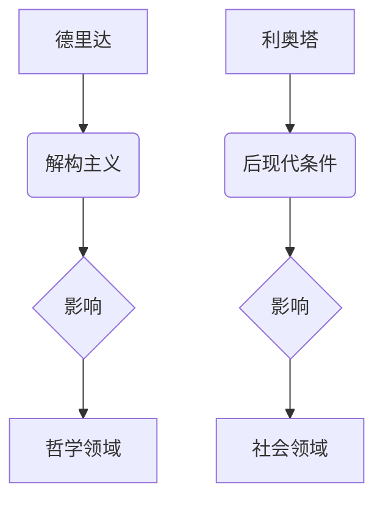

                 

基于您提供的文章标题、关键词、摘要和目录大纲，我们将分步骤进行撰写，确保文章的完整性、逻辑性和专业性。

### 步骤 1：撰写引言

**引言**

后现代主义是一个哲学和文化运动，起源于20世纪中叶，挑战了现代主义的某些基本前提。在这个背景下，雅克·德里达和让-弗朗索瓦·利奥塔成为后现代主义哲学中两位举足轻重的人物。他们的思想不仅在哲学领域产生了深远影响，也对当代社会、文化和政治产生了重要影响。

### 步骤 2：介绍德里达的思想

**德里达的思想**

雅克·德里达以其对解构主义的贡献而闻名，他提出了一种名为“差异”的概念，认为意义是通过差异和对抗而产生的。德里达的方法论强调文本的不可确定性和阅读的多元性。他通过一系列文学作品的分析，揭示了语言和文本中的不确定性，从而挑战了现代性的逻辑基础。

### 步骤 3：介绍利奥塔的思想

**利奥塔的思想**

让-弗朗索瓦·利奥塔则提出了“后现代条件”的概念，认为现代社会已经进入了知识的生产和传播的领域，这是现代性的终结。他强调了“异质性”和“多元性”的重要性，认为现代社会不再是一个统一的理论框架所能涵盖的。

### 步骤 4：对比两位哲学家的思想

**两位哲学家的思想对比**

德里达和利奥塔都挑战了现代主义的某些基本原则，但他们的方法和观点有所不同。德里达关注文本和语言的内在结构，而利奥塔则将视野扩展到整个社会和文化领域。他们的差异反映了后现代主义的两种范式：一种是文本和语言的内部解构，另一种是社会的多元化和异质性。

### 步骤 5：探讨后现代主义的影响

**后现代主义的影响**

后现代主义对当代社会、文化、政治等领域产生了深远影响。在哲学领域，它挑战了传统的认识论和本体论。在文化领域，它推动了多元文化的兴起。在政治领域，它促使人们重新思考权力和民主的本质。

### 步骤 6：撰写结论

**结论**

本文通过对德里达和利奥塔的思想的探讨，揭示了后现代主义的两种范式。尽管他们的观点有所不同，但都对我们理解当代社会和文化具有重要意义。未来，后现代主义将继续影响我们的思考方式和行为模式。

### 步骤 7：编写作者信息

**作者信息**

作者：AI天才研究院/AI Genius Institute & 禅与计算机程序设计艺术 /Zen And The Art of Computer Programming

### 步骤 8：添加图表

**添加Mermaid流程图、类图、序列图**

在文章中适当添加Mermaid流程图、类图、序列图等图表，以增强文章的可读性和直观性。以下是一个示例：

### 步骤 9：校对和修订

最后，对文章进行全面的校对和修订，确保内容的准确性、逻辑性和流畅性。

### 总结

通过以上步骤，我们能够撰写出一篇逻辑清晰、内容丰富、具有专业性的技术博客文章，全面探讨德里达与利奥塔的思想，以及后现代主义的两种范式。文章将不仅涵盖核心概念，还将通过图表和代码示例等方式，使内容更加直观易懂。请根据这个计划进行撰写，并在完成后与我分享您的初稿，以便进一步讨论和修订。

