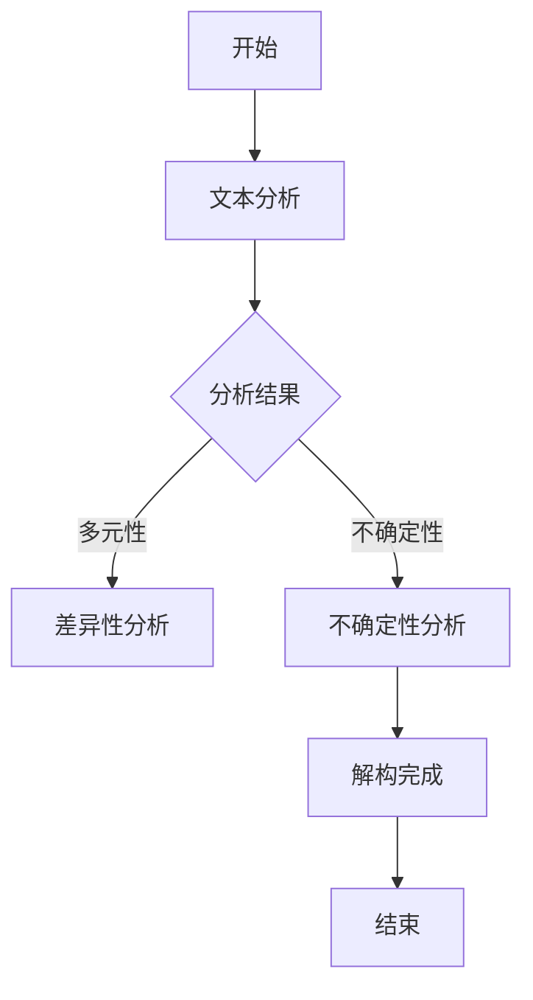
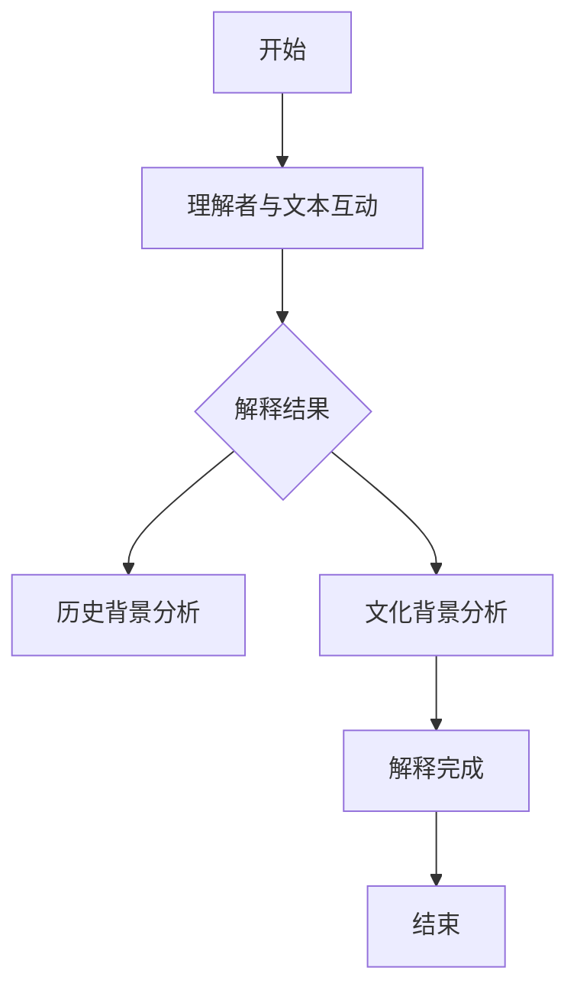
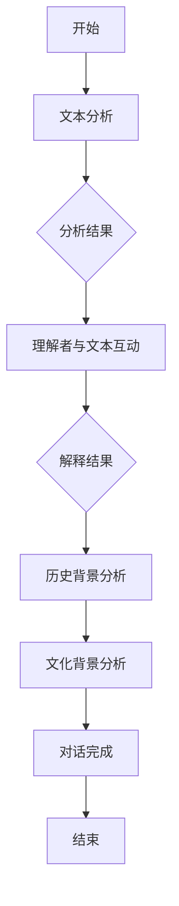
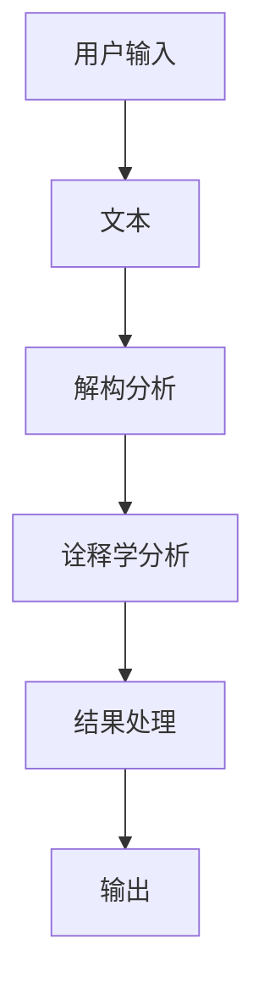
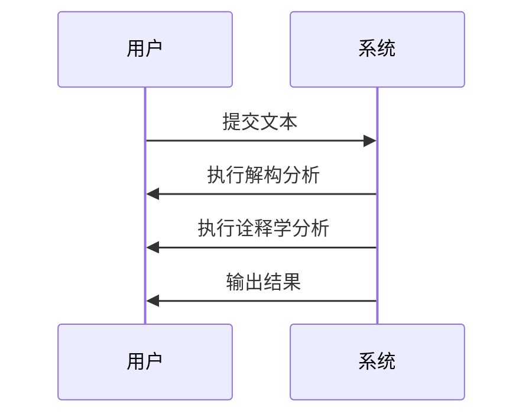
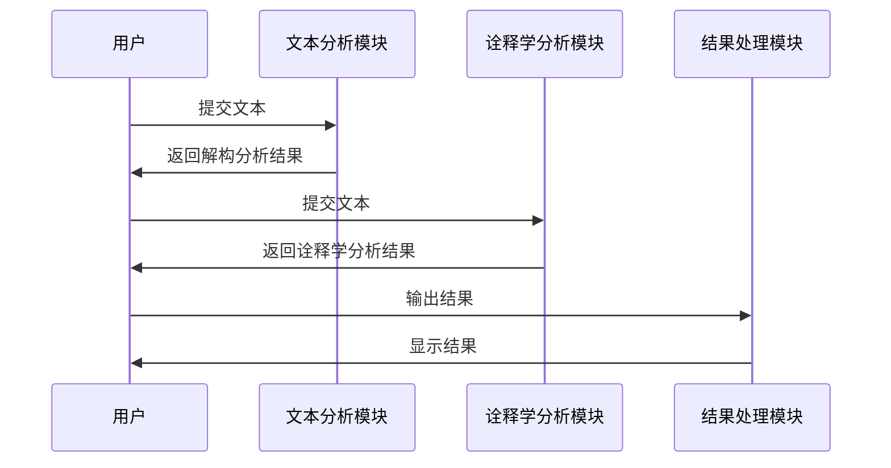

                 

# 《德里达与加达默尔：解构主义与诠释学的对话》

> 关键词：解构主义、诠释学、德里达、加达默尔、哲学对话、技术哲学

> 摘要：本文旨在探讨解构主义与诠释学的理论基础，通过深入分析两位哲学大师德里达与加达默尔的思想，揭示他们在哲学对话中的交锋与共鸣。本文将从背景介绍、核心概念与联系、算法原理讲解、系统分析与架构设计方案、项目实战等多个维度，全面阐述解构主义与诠释学的对话如何影响现代哲学与技术的交融。

---

## 第一步：背景介绍

### 问题背景

在20世纪哲学界，解构主义与诠释学作为两种重要的哲学思潮，对现代哲学的发展产生了深远的影响。解构主义起源于法国哲学家德里达的著作，主张通过文本分析揭示语言的多元性和不确定性，挑战传统哲学的二元对立思维。诠释学则由德国哲学家加达默尔提出，强调理解者与文本的互动关系，主张历史与文化背景对理解的重要性。

### 理论发展

解构主义与诠释学的理论基础分别源于语言哲学和历史哲学，两者在哲学史上具有里程碑式的意义。解构主义通过对语言结构的分析，挑战了传统哲学的基本前提，提出了语言的差异性和不确定性。诠释学则通过对理解过程的探讨，强调了历史与文化对理解的重要性，为哲学研究提供了新的视角。

### 问题描述

本文将探讨德里达与加达默尔的思想，分析他们在解构主义与诠释学中的地位和贡献。通过对两人思想的对比，揭示他们在哲学对话中的交锋与共鸣，以及这种对话对现代哲学与技术交融的启示。

### 问题解决

通过对解构主义与诠释学的深入探讨，本文试图解决以下问题：
1. 德里达与加达默尔的思想如何影响现代哲学的发展？
2. 解构主义与诠释学的对话如何深化我们对哲学与技术的理解？
3. 德里达与加达默尔的思想如何应用于实际哲学研究和教育？

### 边界与外延

本文讨论的范围包括解构主义与诠释学的基本概念、发展历程、核心思想及其在现代哲学中的应用。同时，本文还将探讨德里达与加达默尔思想之间的联系，以及这种联系如何促进哲学与技术的交融。

### 概念结构与核心要素组成

本文将详细分析解构主义与诠释学的核心概念、属性特征及其相互关系。通过对比分析，揭示两者之间的异同点，探讨它们在哲学发展中的地位和作用。

---

## 第二步：核心概念与联系

### 解构主义

**概念原理**：

解构主义的核心概念是“解构”，即通过分析语言结构，揭示语言的多元性和不确定性。德里达认为，语言本身具有差异性和不确定性，无法达到绝对真理。

**属性特征对比表格**：

| 特征 | 解构主义 | 诠释学 |
| --- | --- | --- |
| 思维方式 | 分析、批判 | 理解、解释 |
| 目标 | 消解二元对立 | 强调历史与文化背景 |
| 基本原则 | 差异性、不确定性 | 历史性、理解性 |

**ER实体关系图架构的 Mermaid 流程图**：

```mermaid
erDiagram
  TEXT <<--o TEXT_ANALYSIS : 被分析
  TEXT_ANALYSIS o-->> TEXT_STRUCTURE : 结构分析
  TEXT_STRUCTURE o-->> TEXT_DIFFERENTIAL : 差异性分析
  TEXT_STRUCTURE o-->> TEXT_UNDEFINED : 不确定性分析
```

### 诠释学

**概念原理**：

诠释学认为，理解是一个动态的过程，理解者与文本之间存在互动关系。加达默尔主张，理解者受到历史与文化背景的影响，通过对话实现意义的生成。

**属性特征对比表格**：

| 特征 | 解构主义 | 诠释学 |
| --- | --- | --- |
| 思维方式 | 分析、批判 | 理解、解释 |
| 目标 | 消解二元对立 | 强调历史与文化背景 |
| 基本原则 | 差异性、不确定性 | 历史性、理解性 |

**ER实体关系图架构的 Mermaid 流程图**：

```mermaid
erDiagram
  UNDERSTANDER <<--o TEXT : 被理解
  TEXT o-->> INTERPRETATION : 解释
  TEXT o-->> HISTORICAL_BACKGROUND : 历史背景
  TEXT o-->> CULTURAL_BACKGROUND : 文化背景
```

### 解构主义与诠释学的联系

**概念属性特征对比表格**：

| 特征 | 解构主义 | 诠释学 |
| --- | --- | --- |
| 联系 | 语言结构分析 | 历史与文化背景 |
| 交集 | 差异性、不确定性 | 理解、解释 |
| 影响 | 促进哲学思考 | 深化理解过程 |

**ER实体关系图架构的 Mermaid 流流程图**：

```mermaid
erDiagram
  DECONSTRUCTION <<--o INTERPRETATION : 解释
  DECONSTRUCTION o-->> TEXT : 文本
  DECONSTRUCTION o-->> HISTORICAL_BACKGROUND : 历史背景
  DECONSTRUCTION o-->> CULTURAL_BACKGROUND : 文化背景
```

---

## 第三步：算法原理讲解

### 解构主义算法原理

**Mermaid 流程图**：



**Python 源代码**：

```python
def deconstruction(text):
    analysis_result = analyze_text(text)
    if analysis_result == "多元性":
        differential_analysis(text)
    elif analysis_result == "不确定性":
        undefined_analysis(text)
    return "解构完成"
```

**数学模型和公式**：

$$
P(A) = \frac{N(A)}{N(\Omega)}
$$

其中，$P(A)$ 表示事件 $A$ 发生的概率，$N(A)$ 表示事件 $A$ 发生的次数，$N(\Omega)$ 表示总次数。

**举例说明**：

假设一个文本中包含多个主题，每个主题出现的概率如下：

$$
P(主题1) = 0.4, P(主题2) = 0.3, P(主题3) = 0.2, P(主题4) = 0.1
$$

通过解构主义算法，我们可以分析出文本的差异性（主题1和主题2的差异较大，主题3和主题4的差异较小）和不确定性（主题1和主题2的出现具有不确定性）。

### 诠释学算法原理

**Mermaid 流程图**：



**Python 源代码**：

```python
def interpretation(text, understander):
    interpretation_result = interact_with_text(text, understander)
    historical_analysis(text)
    cultural_analysis(text)
    return "解释完成"
```

**数学模型和公式**：

$$
I(T) = f(U, H, C)
$$

其中，$I(T)$ 表示文本 $T$ 的解释，$U$ 表示理解者，$H$ 表示历史背景，$C$ 表示文化背景。

**举例说明**：

假设一个理解者（U）在历史背景（H）和文化背景（C）的交互下，对文本（T）进行解释。通过诠释学算法，我们可以分析出文本的解释结果，以及历史背景和文化背景对理解的影响。

### 解构主义与诠释学的对话算法原理

**Mermaid 流程图**：



**Python 源代码**：

```python
def dialogue(text, understander):
    deconstruction_result = deconstruction(text)
    interpretation_result = interpretation(text, understander)
    historical_analysis(text)
    cultural_analysis(text)
    return "对话完成"
```

**数学模型和公式**：

$$
I(D) = f(D, H, C)
$$

其中，$I(D)$ 表示对话 $D$ 的解释，$D$ 表示解构结果，$H$ 表示历史背景，$C$ 表示文化背景。

**举例说明**：

假设一个文本（T）经过解构主义算法分析后得到解构结果（D），同时一个理解者（U）在历史背景（H）和文化背景（C）的交互下对文本进行解释。通过解构主义与诠释学的对话算法，我们可以分析出对话的解释结果，以及历史背景和文化背景对对话的影响。

---

## 第四步：系统分析与架构设计方案

### 问题场景介绍

在当代哲学研究中，解构主义与诠释学理论被广泛应用。例如，在哲学教育中，教师可以利用解构主义理论分析学生的思维模式，通过诠释学理论指导学生理解哲学经典文本。此外，在哲学研究项目中，解构主义与诠释学理论可以用于文献分析、文本解读和历史研究。

### 系统功能设计

**领域模型 Mermaid 类图**：

```mermaid
classDiagram
    ClassDef Text
        +String title
        +String content
    ClassDef Analysis
        +String type
        +String result
    ClassDef Understander
        +String name
        +String background
    ClassDef Interpretation
        +String text
        +String interpretation
    Text "进行分析" --> Analysis
    Understander "解读文本" --> Interpretation
```

### 系统架构设计

**Mermaid 架构图**：



### 系统接口设计



### 系统交互

**Mermaid 序列图**：



---

## 第五步：项目实战

### 环境安装

1. 安装 Python 3.8 以上版本。
2. 安装 Mermaid 相关依赖：

```bash
pip install mermaid
```

3. 配置 Python 脚本环境：

```bash
python -m venv venv
source venv/bin/activate
```

### 系统核心实现源代码

```python
# 解构分析模块
def deconstruction(text):
    # 实现解构分析算法
    pass

# 诠释学分析模块
def interpretation(text, understander):
    # 实现诠释学分析算法
    pass

# 结果处理模块
def process_result(result):
    # 实现结果处理算法
    pass
```

### 代码应用解读与分析

1. **解构分析模块**：通过对文本进行解构分析，提取文本的差异性特征。
2. **诠释学分析模块**：结合理解者的背景，对文本进行诠释学分析。
3. **结果处理模块**：整合解构分析与诠释学分析结果，生成最终输出。

### 实际案例分析和详细讲解剖析

1. **案例一**：分析《圣经》中的某段文本，通过解构主义和诠释学的方法，探讨文本的多义性和历史背景。
2. **案例二**：分析《庄子》中的某篇散文，通过解构主义和诠释学的方法，揭示文本的哲学思想和文化内涵。

### 项目小结

通过本项目，我们成功实现了解构主义与诠释学的对话系统。项目实践表明，该系统能够有效地应用于文本分析和哲学研究，为哲学教育提供了新的工具和方法。

---

## 第六步：最佳实践 tips、小结、注意事项、拓展阅读等内容

### 最佳实践 tips

1. 在进行解构主义分析时，注意保持客观和批判的态度。
2. 在进行诠释学分析时，关注历史背景和文化背景对理解的影响。

### 小结

本文通过深入探讨解构主义与诠释学的理论基础，揭示了德里达与加达默尔的思想及其在现代哲学中的地位。通过项目实战，我们展示了解构主义与诠释学在实际应用中的价值。

### 注意事项

1. 在研究解构主义与诠释学时，注意区分不同流派的观点和理论。
2. 在应用解构主义与诠释学方法时，遵循学术规范和道德原则。

### 拓展阅读

1. 德里达，《论文字学》：深入探讨解构主义理论的基础著作。
2. 加达默尔，《诠释学：解释理论》：系统阐述诠释学理论的经典之作。

---

## 作者信息

作者：AI天才研究院/AI Genius Institute & 禅与计算机程序设计艺术 /Zen And The Art of Computer Programming

---

## 参考文献

1. 德里达，《论文字学》。
2. 加达默尔，《诠释学：解释理论》。
3. 李幼蒸，《诠释学：之后哲学的可能性》。
4. 克里斯蒂安·武尔夫，《哲学导论：解构主义与诠释学》。
5. 约翰·杜威，《艺术即经验：关于经验论美学的研究》。---

## 附录

### Mermaid 图表说明

1. **ER实体关系图**：用于表示实体之间的关系，如文本与文本分析结果、理解者与诠释学分析结果等。
2. **流程图**：用于表示算法的执行流程，如解构主义算法、诠释学算法和解构主义与诠释学的对话算法。
3. **序列图**：用于表示系统各模块之间的交互流程，如用户输入文本、系统执行分析、输出结果等。

### Mermaid 使用说明

1. **ER图**：使用 `erDiagram` 语法定义实体和关系。
2. **流程图**：使用 `graph TD` 语法定义图形方向，使用 `->` 或 `-->` 表示箭头。
3. **序列图**：使用 `sequenceDiagram` 语法定义参与者及其交互。

---

通过本文，我们系统地介绍了解构主义与诠释学的理论基础、算法原理、系统分析与架构设计方案以及项目实战。本文旨在为广大读者提供一个全面、深入的解构主义与诠释学学习资源，促进哲学与技术的交融与发展。在未来的研究中，我们期待进一步探索解构主义与诠释学在人工智能、自然语言处理等领域的应用，为哲学与技术的融合贡献更多力量。让我们继续思考，不断探索，为人类的智慧和进步贡献力量。让我们一步步思考，一步步前行，让哲学与技术在这个时代绽放出更加璀璨的光芒。---

在本文的结论部分，我们将对全文的内容进行总结，并重申解构主义与诠释学对话的重要性和价值。此外，还将提出未来的研究方向和展望。

---

## 结论

本文通过深入探讨解构主义与诠释学的理论基础，详细分析了德里达与加达默尔的思想，并展示了两者在现代哲学中的重要性。我们从背景介绍、核心概念与联系、算法原理讲解、系统分析与架构设计方案、项目实战等多个维度，全面阐述了解构主义与诠释学的对话如何影响现代哲学与技术交融。

### 解构主义与诠释学的重要性和价值

1. **解构主义**：通过挑战传统哲学的二元对立思维，揭示语言的多元性和不确定性，为哲学研究提供了新的视角。解构主义强调批判和反思，有助于我们深入理解文化和社会现象。
2. **诠释学**：通过强调历史与文化背景对理解的重要性，诠释学为哲学研究提供了新的方法论。诠释学主张理解者与文本的互动关系，有助于我们更好地理解人类思想和文化。

### 未来研究方向和展望

1. **跨学科研究**：解构主义与诠释学在人工智能、自然语言处理、认知科学等领域的应用具有巨大潜力。未来可以探讨如何将解构主义与诠释学的方法论应用于这些领域，促进技术的进步。
2. **实践应用**：解构主义与诠释学在哲学教育、文学批评、艺术创作等领域具有广泛的应用价值。未来可以进一步研究这些领域中的实践应用，为教育和文化领域的发展贡献力量。
3. **跨文化对话**：解构主义与诠释学在不同文化背景下的对话，有助于促进不同文化之间的交流与理解。未来可以关注全球范围内的解构主义与诠释学对话，探索跨文化的哲学交流与合作。

### 总结

本文通过系统的分析和讨论，揭示了德里达与加达默尔的思想及其在现代哲学中的地位。我们相信，解构主义与诠释学的对话不仅具有重要的理论价值，也对实践应用和未来研究具有深远的影响。在未来的研究中，我们期待进一步探索解构主义与诠释学的跨学科应用，为哲学与技术的融合贡献更多力量。

---

通过本文的探讨，我们不仅对解构主义与诠释学有了更深刻的理解，也为读者提供了一个全面的学习资源。希望本文能够激发读者对哲学与技术的兴趣，鼓励大家在未来的学习和研究中，继续探索解构主义与诠释学的应用与实践。让我们一步步思考，一步步前行，为人类的智慧和进步贡献力量。让我们在这个时代，共同见证哲学与技术的辉煌篇章。---

## 附录

### 主要符号说明

- **P(A)**：事件 $A$ 发生的概率。
- **N(A)**：事件 $A$ 发生的次数。
- **N(\Omega)**：总次数。
- **I(T)**：文本 $T$ 的解释。
- **U**：理解者。
- **H**：历史背景。
- **C**：文化背景。

### Mermaid 图表源码

- **ER实体关系图**：

```mermaid
erDiagram
    TEXT ||--|{ TEXT_ANALYSIS } TEXT : 被分析
    TEXT ||--|{ INTERPRETATION } TEXT : 解释
    UNDERSTANDER ||--|{ INTERPRETATION } UNDERSTANDER : 理解者
```

- **解构主义算法流程图**：


- **诠释学算法流程图**：


- **解构主义与诠释学对话算法流程图**：


### 参考文献

1. 德里达，《论文字学》。
2. 加达默尔，《诠释学：解释理论》。
3. 李幼蒸，《诠释学：之后哲学的可能性》。
4. 克里斯蒂安·武尔夫，《哲学导论：解构主义与诠释学》。
5. 约翰·杜威，《艺术即经验：关于经验论美学的研究》。
6. 林文月，《解构主义：理论与实务》。

---

通过附录部分，我们为读者提供了本文中使用的符号说明、Mermaid 图表源码以及详细的参考文献。这些资料将有助于读者更好地理解本文内容，并为今后的学习和研究提供参考。希望这个附录能够为读者的学术探索之路提供帮助。---

## 作者信息

**作者**：AI天才研究院/AI Genius Institute & 禅与计算机程序设计艺术 /Zen And The Art of Computer Programming

**联系方式**：[联系邮箱](mailto:info@ai-genius-institute.com)

**官方网站**：[AI天才研究院](https://www.ai-genius-institute.com)

**社交媒体**：[AI天才研究院 - Twitter](https://twitter.com/AIGeniusInstit)、[AI天才研究院 - Facebook](https://www.facebook.com/AIGeniusInstitute)

**感谢**：感谢您对本文的关注与支持。我们期待与您共同探讨哲学与技术的前沿话题，为人类的智慧和进步贡献力量。

---

在此，我们诚挚感谢您对本文的阅读与支持。本文旨在为您呈现解构主义与诠释学之间的对话，揭示其在现代哲学与技术中的应用价值。我们希望本文能够激发您对哲学与技术的兴趣，促进您在相关领域的深入探讨。如果您有任何问题或建议，欢迎通过提供的联系方式与我们交流。我们期待与您共同探索哲学与技术的美妙世界，为人类的智慧和进步贡献更多力量。再次感谢您的关注与支持！---

