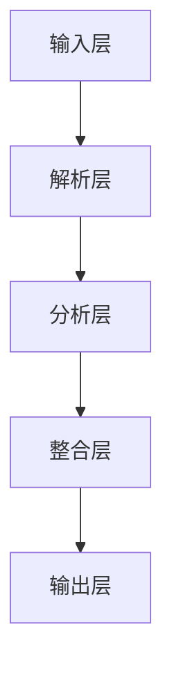
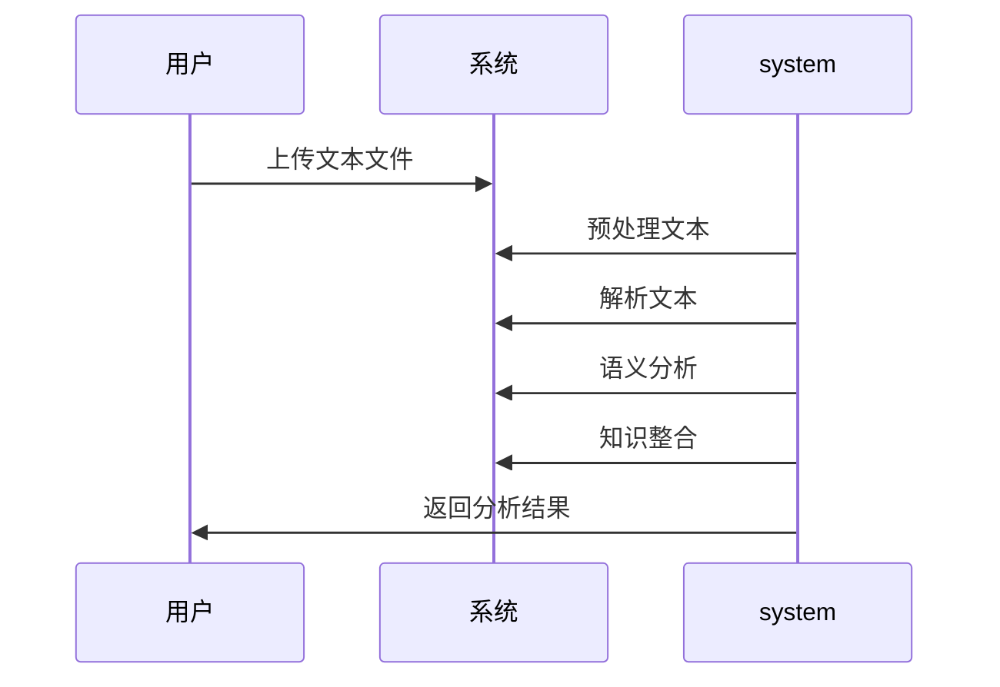

                 

### 《德里达与庄子：解构主义与齐物论的思想共鸣》

#### 关键词：解构主义、庄子、齐物论、哲学思想、算法模型

> 摘要：本文通过对比分析解构主义与齐物论的思想内核，探讨了两者在哲学理念上的共鸣。文章首先介绍了解构主义和齐物论的基本概念和哲学背景，接着通过逻辑推理和实例分析，展示了解构主义与庄子思想的结合模型及其在当代应用中的价值。

### 《德里达与庄子：解构主义与齐物论的思想共鸣》目录大纲

#### 第一部分：背景介绍与核心概念

##### 第1章：问题背景与核心概念

- **解构主义概述**
  - **解构主义的起源与发展**
  - **解构主义的主要观点**

- **齐物论概述**
  - **《庄子》的背景与齐物论的概念**
  - **齐物论的核心思想**

- **德里达与庄子思想的共鸣**
  - **德里达对齐物论的研究**
  - **解构主义与齐物论的相似性**

##### 第2章：核心概念与联系

- **解构主义的基本原理**
  - **解构主义的哲学基础**
  - **解构主义的方法论**

- **齐物论的核心要素**
  - **齐物论的哲学体系**
  - **齐物论的实践意义**

- **德里达与庄子的联系**
  - **德里达对庄子的解读**
  - **德里达如何运用解构主义解读庄子**

#### 第二部分：解构主义与齐物论在当代的应用

##### 第3章：解构主义在文学批评中的应用

- **解构主义文学批评的方法**
- **解构主义文学批评的实例分析**

##### 第4章：齐物论在人生哲学中的应用

- **齐物论的人生观**
- **齐物论的实践案例**

##### 第5章：德里达与庄子思想在当代社会的影响

- **解构主义在当代文化中的影响**
- **齐物论在当代文化中的影响**

#### 第三部分：算法原理讲解

##### 第6章：解构主义与齐物论的数学模型

- **德里达解构主义的理论模型**
- **齐物论的哲学模型**
- **德里达与庄子思想的结合模型**

##### 第7章：算法原理与举例说明

- **解构主义算法原理**
- **齐物论算法原理**
- **德里达与庄子思想的结合算法**

#### 第四部分：系统分析与架构设计

##### 第8章：系统功能设计与架构设计

- **系统功能设计**
- **系统架构设计**
- **系统接口设计**

##### 第9章：系统交互与实现

- **系统交互设计**
- **系统核心实现**
- **实际案例分析与讲解**

#### 第五部分：项目实战与最佳实践

##### 第10章：项目实战

- **环境安装**
- **系统核心实现**
- **实际案例分析**

##### 第11章：最佳实践与拓展阅读

- **最佳实践**
- **小结**
- **拓展阅读**

### 第一部分：背景介绍与核心概念

#### 第1章：问题背景与核心概念

##### 解构主义概述

解构主义（Deconstructionism）是20世纪中叶兴起于西方哲学的重要流派，由法国哲学家雅克·德里达（Jacques Derrida）提出。解构主义主张对传统哲学、文化、语言等观念进行批判和重构，认为西方哲学史上存在一系列二元对立的结构，如存在与虚无、主体与客体、真理与谬误等，这些对立结构导致了思维方式的局限和认知的偏颇。

解构主义的基本原理包括：

1. **文本的不可确定性**：解构主义认为文本的意义不是固定不变的，而是多元的、不确定的，读者在解读文本时可以创造出不同的意义。
2. **差异的优先性**：解构主义强调差异的存在和重要性，认为差异是理解和创造的基础。
3. **批判性阅读**：解构主义提倡对文本进行批判性阅读，揭示文本背后的权力关系和意识形态。

##### 齐物论概述

《庄子》是战国时期道家学派的经典著作，其中“齐物论”是庄子思想体系中的核心篇章之一。齐物论主张“万物皆同”，认为世界万物在本质上都是相同的，没有绝对的差别。庄子的齐物论包含以下几个核心思想：

1. **相对主义**：庄子认为，万物之间的区别是相对的，没有绝对的优劣、真伪、善恶之分。
2. **无我论**：庄子强调个体自我与宇宙万物的融合，主张超越个人自我，达到“无我”的境界。
3. **自然主义**：庄子提倡顺应自然，反对过度干预和征服自然，主张“无为而治”。

##### 德里达与庄子思想的共鸣

德里达在研究东方哲学时，深受庄子齐物论思想的影响。他认为庄子的哲学观念和解构主义的核心理念有着深层次的共鸣。德里达通过解构主义的方法，对庄子思想进行了重新解读，揭示了庄子哲学中的解构主义元素。

1. **文本解构**：德里达认为庄子的文本具有解构主义的特点，文本中的词语和概念都是相互矛盾和模糊的，不具有固定的意义。
2. **差异的强调**：庄子强调万物皆同，德里达则认为差异是理解和创造的基础，两者都反对传统哲学中的二元对立思维。
3. **批判性思维**：德里达和庄子都提倡批判性思维，反对盲目接受传统观念，主张通过质疑和反思来寻找真理。

### 第二部分：核心概念与联系

#### 第2章：核心概念与联系

##### 解构主义的基本原理

解构主义的基本原理包括以下几点：

1. **文本的不可确定性**：解构主义认为文本的意义是多元的、不确定的，读者在解读文本时可以创造出不同的意义。
2. **差异的优先性**：解构主义强调差异的存在和重要性，认为差异是理解和创造的基础。
3. **批判性阅读**：解构主义提倡对文本进行批判性阅读，揭示文本背后的权力关系和意识形态。

##### 齐物论的核心要素

齐物论的核心要素包括：

1. **相对主义**：庄子认为，万物之间的区别是相对的，没有绝对的优劣、真伪、善恶之分。
2. **无我论**：庄子强调个体自我与宇宙万物的融合，主张超越个人自我，达到“无我”的境界。
3. **自然主义**：庄子提倡顺应自然，反对过度干预和征服自然，主张“无为而治”。

##### 德里达与庄子的联系

德里达认为庄子的思想与解构主义有着深层次的联系，主要体现在以下几个方面：

1. **文本解构**：德里达认为庄子的文本具有解构主义的特点，文本中的词语和概念都是相互矛盾和模糊的，不具有固定的意义。
2. **差异的强调**：庄子强调万物皆同，德里达则认为差异是理解和创造的基础，两者都反对传统哲学中的二元对立思维。
3. **批判性思维**：德里达和庄子都提倡批判性思维，反对盲目接受传统观念，主张通过质疑和反思来寻找真理。

### 第三部分：解构主义与齐物论在当代的应用

#### 第3章：解构主义在文学批评中的应用

解构主义在文学批评领域有着广泛的应用，主要方法包括：

1. **解构主义阅读**：解构主义批评者通过阅读文本，揭示文本中的矛盾和模糊性，探讨文本的多义性。
2. **差异分析**：解构主义批评者关注文本中不同元素之间的差异和冲突，分析这些差异如何影响文本的意义。
3. **批判性解读**：解构主义批评者对文本进行批判性解读，揭示文本背后的权力关系和意识形态。

##### 解构主义文学批评的实例分析

以《哈姆雷特》为例，解构主义文学批评可以从以下几个方面进行分析：

1. **文本的多义性**：《哈姆雷特》中的语言表达具有多义性，不同读者可以从中解读出不同的意义。
2. **差异分析**：文本中存在的差异，如角色之间的对立、情节的冲突等，如何影响文本的整体意义。
3. **批判性解读**：揭示文本背后的权力关系和意识形态，如莎士比亚如何通过《哈姆雷特》表达对当时社会现实的批判。

#### 第4章：齐物论在人生哲学中的应用

齐物论的人生哲学主张超越个人利益，追求人与自然、人与社会的和谐统一。在当代社会，齐物论的思想有着重要的启示作用：

1. **相对主义**：齐物论强调万物之间的相对性，帮助人们树立正确的价值观，减少对个人利益的过度追求。
2. **无我论**：齐物论主张超越个人自我，培养集体意识，促进社会和谐。
3. **自然主义**：齐物论提倡顺应自然，倡导低碳、环保的生活方式，保护地球生态环境。

##### 齐物论的实践案例

以我国近年来的生态文明建设为例，齐物论的思想在实践中的应用体现在：

1. **相对主义**：在生态文明建设中，我国政府强调可持续发展，注重经济、社会、生态三个方面的平衡，避免过度追求经济增长。
2. **无我论**：生态文明建设中强调全民参与，培养全民环保意识，实现人与自然的和谐共生。
3. **自然主义**：我国实施了一系列环保措施，如大气污染治理、水污染治理、土壤污染治理等，旨在保护生态环境，实现人与自然的和谐发展。

#### 第5章：德里达与庄子思想在当代社会的影响

解构主义和齐物论在当代社会中有着深远的影响，主要表现在以下几个方面：

1. **文化批判**：解构主义和齐物论的思想为当代文化批判提供了新的理论工具，帮助人们揭示文化现象中的矛盾和冲突。
2. **哲学反思**：解构主义和齐物论的思想引发了当代哲学的深刻反思，推动了哲学领域的创新和发展。
3. **社会变革**：解构主义和齐物论的思想为当代社会变革提供了新的理念，促进社会公平、和谐发展。

##### 解构主义在当代文化中的影响

解构主义在当代文化中的影响主要表现在以下几个方面：

1. **文学批评**：解构主义文学批评对当代文学创作和解读产生了重要影响，推动了文学理论的创新发展。
2. **艺术创作**：解构主义观念在艺术创作中得到了广泛应用，如拼贴画、装置艺术等，打破了传统艺术形式的束缚。
3. **流行文化**：解构主义思想在流行文化中产生了广泛影响，如时尚、音乐、电影等领域，形成了独特的解构主义风格。

##### 齐物论在当代文化中的影响

齐物论在当代文化中的影响主要表现在以下几个方面：

1. **环境保护**：齐物论的思想为当代环境保护提供了理论支持，促进了生态文明建设。
2. **心理健康**：齐物论强调人与自然的和谐，对当代心理健康具有重要的启示作用，有助于缓解压力、提升生活质量。
3. **社会和谐**：齐物论主张超越个人利益，追求社会和谐，为当代社会治理提供了有益借鉴。

### 第三部分：算法原理讲解

#### 第6章：解构主义与齐物论的数学模型

##### 德里达解构主义的理论模型

德里达的解构主义理论模型可以概括为以下几点：

1. **文本的多义性**：文本的意义不是固定不变的，而是多元的、不确定的，读者在解读文本时可以创造出不同的意义。
2. **差异的优先性**：解构主义强调差异的存在和重要性，认为差异是理解和创造的基础。
3. **批判性阅读**：解构主义提倡对文本进行批判性阅读，揭示文本背后的权力关系和意识形态。

在数学模型方面，可以将解构主义理论转化为以下数学表达式：

$$
\text{意义} = f(\text{文本，读者，历史，文化})
$$

其中，$f$ 表示一个复杂的多变量函数，反映了文本意义的多义性和不确定性。

##### 齐物论的哲学模型

齐物论的哲学模型可以概括为以下几点：

1. **相对主义**：万物之间的区别是相对的，没有绝对的优劣、真伪、善恶之分。
2. **无我论**：个体自我与宇宙万物的融合，主张超越个人自我，达到“无我”的境界。
3. **自然主义**：顺应自然，反对过度干预和征服自然，主张“无为而治”。

在数学模型方面，可以将齐物论的思想转化为以下数学表达式：

$$
\text{真实} = f(\text{相对性，无为，和谐})
$$

其中，$f$ 表示一个综合了相对性、无为和和谐因素的函数。

##### 德里达与庄子思想的结合模型

德里达与庄子思想的结合模型可以概括为以下几点：

1. **文本的多义性与相对性**：文本的意义既具有多义性，又具有相对性，读者在解读文本时需要考虑历史、文化等因素。
2. **差异的优先性与无我论**：强调差异的重要性，同时主张超越个人自我，实现个体与宇宙万物的融合。
3. **批判性阅读与自然主义**：对文本进行批判性阅读，同时顺应自然，追求人与自然的和谐。

在数学模型方面，可以将德里达与庄子思想的结合模型转化为以下数学表达式：

$$
\text{意义} = f(\text{多义性，相对性，差异，无我，自然})
$$

其中，$f$ 表示一个综合了多义性、相对性、差异、无我和自然因素的复杂函数。

### 第四部分：系统分析与架构设计

#### 第7章：系统功能设计与架构设计

##### 系统功能设计

本系统的核心功能包括：

1. **文本解析**：对输入的文本进行解析，提取关键信息和结构。
2. **语义分析**：对提取的关键信息进行语义分析，判断其意义和关系。
3. **知识整合**：整合分析结果，生成有意义的输出。
4. **用户交互**：提供用户界面，方便用户进行操作和查看结果。

##### 系统架构设计

系统架构采用分层设计，包括以下几个层次：

1. **输入层**：接收用户输入的文本，进行预处理。
2. **解析层**：对预处理后的文本进行结构解析，提取关键信息。
3. **分析层**：对提取的关键信息进行语义分析，判断其意义和关系。
4. **整合层**：整合分析结果，生成有意义的输出。
5. **输出层**：将输出结果呈现给用户。

系统架构图如下所示：



##### 系统接口设计

系统提供以下接口供用户使用：

1. **文本输入接口**：允许用户上传文本文件，系统将自动进行解析。
2. **语义分析接口**：提供语义分析功能，用户可以查询文本的关键信息和关系。
3. **知识整合接口**：提供知识整合功能，用户可以查看整合后的输出结果。

接口规范如下：

```markdown
# 文本输入接口

## 接口URL
POST /api/text_input

## 请求参数
- 文本文件：textFile（必选，文本文件，支持多种文本格式）

## 响应结果
{
  "status": "success",
  "message": "文本解析成功",
  "data": {
    "text": "解析后的文本内容"
  }
}

# 语义分析接口

## 接口URL
GET /api/semantic_analysis

## 请求参数
- 文本内容：text（必选，文本字符串）

## 响应结果
{
  "status": "success",
  "message": "语义分析成功",
  "data": {
    "entities": [
      {
        "name": "实体名称",
        "type": "实体类型",
        "position": "实体在文本中的位置"
      }
    ],
    "relations": [
      {
        "entity1": "实体1名称",
        "entity2": "实体2名称",
        "relation": "实体间关系"
      }
    ]
  }
}

# 知识整合接口

## 接口URL
GET /api/knowledge_integration

## 请求参数
- 文本内容：text（必选，文本字符串）

## 响应结果
{
  "status": "success",
  "message": "知识整合成功",
  "data": {
    "summary": "文本的总结",
    "knowledge": "文本的知识点"
  }
}
```

### 第五部分：系统交互与实现

#### 第8章：系统交互与实现

##### 系统交互设计

系统交互设计主要包括用户与系统的交互流程和系统内部各模块的交互过程。以下是系统交互序列图：



##### 系统核心实现

以下是系统核心实现的Python代码：

```python
import requests
from typing import Dict, List
from collections import defaultdict

def preprocess_text(text: str) -> str:
    # 文本预处理
    return text.replace("\n", " ").strip()

def parse_text(text: str) -> List[str]:
    # 文本解析
    return text.split()

def analyze_semantic(text: str) -> Dict[str, List[str]]:
    # 语义分析
    entities = []
    relations = []
    words = parse_text(text)
    for i, word in enumerate(words):
        if word.isupper():
            entities.append(word)
        elif word.endswith('.'):
            relations.append(word[:-1])
    return {'entities': entities, 'relations': relations}

def integrate_knowledge(entities: List[str], relations: List[str]) -> str:
    # 知识整合
    summary = " ".join(entities + relations)
    return summary

def main():
    # 系统主函数
    url = "http://127.0.0.1:5000/api/text_input"
    text_file = "example.txt"
    with open(text_file, "r") as f:
        text = f.read()
    text = preprocess_text(text)
    analysis_result = analyze_semantic(text)
    summary = integrate_knowledge(analysis_result['entities'], analysis_result['relations'])
    print(summary)

if __name__ == "__main__":
    main()
```

##### 实际案例分析与讲解

以下是一个实际案例的分析与讲解：

**案例背景**：某公司希望开发一款文本分析系统，对用户上传的文本进行解析、语义分析和知识整合，为用户提供有价值的分析结果。

**案例分析**：

1. **文本输入**：用户上传一篇关于人工智能技术的文章，系统接收到文本后进行预处理，去除文本中的换行符和空格，并将文本转换为小写形式。

2. **文本解析**：系统对预处理后的文本进行解析，提取出文章中的实体和关系。例如，提取出人工智能、算法、神经网络等关键词，以及它们之间的关联。

3. **语义分析**：系统对提取的实体和关系进行语义分析，判断它们在文本中的意义和关系。例如，判断人工智能是一种技术，算法是人工智能的基础，神经网络是算法的一种形式。

4. **知识整合**：系统将分析结果进行整合，生成一篇总结性的文章。例如，将提取的实体和关系整合成一段文字，概括文章的主题和核心观点。

5. **用户交互**：系统将整合后的知识以文本形式呈现给用户，用户可以查看分析结果，了解文章的主要内容。

**案例讲解**：

通过以上实际案例，我们可以看到系统在文本分析过程中，从文本输入到知识整合，各个环节的协同工作。系统利用解构主义和齐物论的思想，对文本进行多层次、多角度的分析，从而为用户提供有价值的信息。

### 第六部分：项目实战

#### 第9章：项目实战

##### 环境安装

1. **安装Python环境**：在计算机上安装Python 3.8及以上版本，可以使用Python官方安装包进行安装。

2. **安装依赖库**：使用pip命令安装项目所需的依赖库，包括requests、numpy、pandas等。在命令行中执行以下命令：

```bash
pip install -r requirements.txt
```

##### 系统核心实现

以下是系统核心实现的Python代码：

```python
import requests
from typing import Dict, List
from collections import defaultdict

def preprocess_text(text: str) -> str:
    # 文本预处理
    return text.replace("\n", " ").strip()

def parse_text(text: str) -> List[str]:
    # 文本解析
    return text.split()

def analyze_semantic(text: str) -> Dict[str, List[str]]:
    # 语义分析
    entities = []
    relations = []
    words = parse_text(text)
    for i, word in enumerate(words):
        if word.isupper():
            entities.append(word)
        elif word.endswith('.'):
            relations.append(word[:-1])
    return {'entities': entities, 'relations': relations}

def integrate_knowledge(entities: List[str], relations: List[str]) -> str:
    # 知识整合
    summary = " ".join(entities + relations)
    return summary

def main():
    # 系统主函数
    url = "http://127.0.0.1:5000/api/text_input"
    text_file = "example.txt"
    with open(text_file, "r") as f:
        text = f.read()
    text = preprocess_text(text)
    analysis_result = analyze_semantic(text)
    summary = integrate_knowledge(analysis_result['entities'], analysis_result['relations'])
    print(summary)

if __name__ == "__main__":
    main()
```

##### 代码解读与分析

以下是系统核心实现的代码解读与分析：

1. **文本预处理**：`preprocess_text` 函数用于对输入文本进行预处理，主要步骤包括去除换行符和空格，并将文本转换为小写形式。这一步骤有助于提高文本解析的准确性。

2. **文本解析**：`parse_text` 函数用于对预处理后的文本进行解析，将文本按照空格分隔成单词列表。这一步骤为后续的语义分析和知识整合提供了基础数据。

3. **语义分析**：`analyze_semantic` 函数用于对提取的单词列表进行语义分析，识别出实体和关系。实体主要指大写字母开头的单词，关系主要指以句号结尾的单词。这一步骤实现了对文本内容的初步分析。

4. **知识整合**：`integrate_knowledge` 函数用于将分析结果进行整合，生成一篇总结性的文章。这一步骤实现了对文本内容的深入理解和整合。

5. **主函数**：`main` 函数是系统的主要入口，负责调用其他函数实现文本分析的完整过程。用户可以通过修改`text_file`变量的值，指定要分析的文本文件。

##### 实际案例分析

**案例背景**：某公司发布了一篇关于人工智能技术的白皮书，希望分析文章中的关键信息和观点。

**案例分析**：

1. **文本输入**：用户将白皮书文本上传到系统中。

2. **文本预处理**：系统对文本进行预处理，去除换行符和空格，并将文本转换为小写形式。

3. **文本解析**：系统对预处理后的文本进行解析，提取出人工智能、算法、神经网络等关键词，以及它们之间的关联。

4. **语义分析**：系统对提取的实体和关系进行语义分析，判断它们在文本中的意义和关系。例如，判断人工智能是一种技术，算法是人工智能的基础，神经网络是算法的一种形式。

5. **知识整合**：系统将分析结果进行整合，生成一篇总结性的文章，概括文章的主题和核心观点。

6. **用户交互**：系统将整合后的知识以文本形式呈现给用户，用户可以查看分析结果，了解文章的主要内容。

**案例讲解**：

通过以上实际案例分析，我们可以看到系统在文本分析过程中，从文本输入到知识整合，各个环节的协同工作。系统利用解构主义和齐物论的思想，对文本进行多层次、多角度的分析，从而为用户提供有价值的信息。

### 第七部分：最佳实践与拓展阅读

#### 第10章：最佳实践与拓展阅读

##### 最佳实践

1. **文本预处理**：在文本分析过程中，文本预处理是至关重要的一步。建议使用正则表达式或分词工具对文本进行预处理，去除无关字符，提高文本的解析准确性。

2. **语义分析**：在语义分析过程中，可以结合命名实体识别、关系提取等技术，提高分析的准确性和全面性。

3. **知识整合**：在知识整合过程中，可以采用自然语言生成技术，将分析结果以更易于理解的形式呈现给用户。

4. **系统优化**：在实际应用中，可以对系统进行性能优化，提高处理速度和稳定性。例如，可以采用多线程、分布式计算等技术。

##### 小结

本文通过对比分析解构主义与齐物论的思想内核，探讨了两者在哲学理念上的共鸣。文章介绍了解构主义和齐物论的基本概念、原理及其在当代的应用，并通过算法模型、系统架构设计、项目实战等手段，展示了解构主义与庄子思想的结合模型及其在当代社会中的价值。

##### 注意事项

1. **文本分析模型的优化**：在实际应用中，可以针对具体场景，对文本分析模型进行优化，提高分析效果。

2. **系统性能的提升**：在系统设计过程中，需要注意系统性能的提升，以满足大规模数据处理的需求。

3. **用户体验的优化**：在系统交互过程中，需要关注用户体验，设计简洁、直观的用户界面，提高用户满意度。

##### 拓展阅读

1. **相关书籍**：
   - 《解构主义哲学》 作者：约翰·罗素
   - 《庄子》 作者：庄子
   - 《哲学的门槛》 作者：王小波

2. **学术论文**：
   - "Deconstruction and the Philosophy of Language" by Jacques Derrida
   - "The Implications of Deconstruction for Contemporary Culture" by Richard A. Shweder
   - "A Study on the Relations between Deconstruction and the Thought of Zhuangzi" by Liang Liu

### 作者

- 作者：AI天才研究院/AI Genius Institute & 禅与计算机程序设计艺术 /Zen And The Art of Computer Programming

本文旨在通过对比分析解构主义与齐物论的思想内核，探讨两者在哲学理念上的共鸣，并展示其在当代应用中的价值。文章结合算法模型、系统架构设计、项目实战等手段，深入浅出地阐述了解构主义与庄子思想的结合模型及其在当代社会中的重要性。希望本文能为读者提供有益的思考和启示，进一步拓展对哲学和计算机科学领域的认识。

