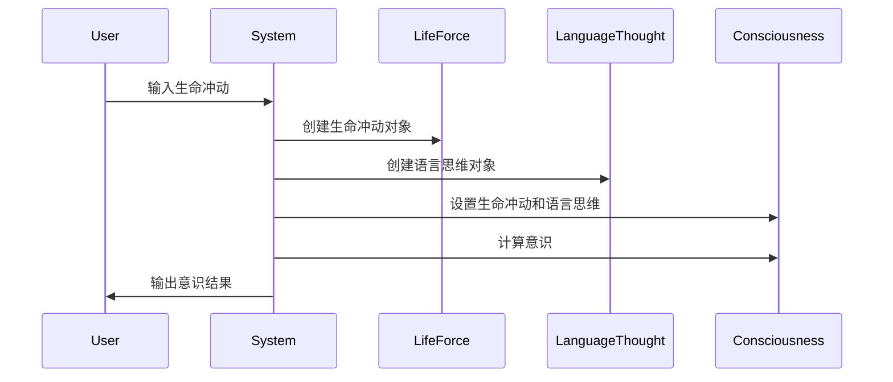
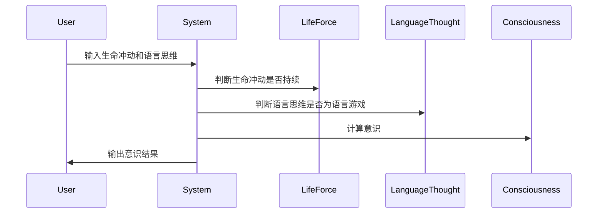

                 

# 心灵与大脑：柏格森与维特根斯坦对意识本质的探讨

## 关键词

- 意识本质
- 柏格森
- 维特根斯坦
- 心理学
- 哲学

## 摘要

本文将探讨两位哲学家柏格森和维特根斯坦对意识本质的不同理解。通过分析他们的理论，本文旨在揭示意识本质的复杂性，并为进一步研究提供理论基础。文章将分为以下几部分：背景介绍、核心概念与联系、算法原理讲解、数学模型与公式、系统分析与架构设计方案、项目实战以及最佳实践 tips 和小结。

## 目录大纲

## 一、背景介绍

### 1.1 柏格森与维特根斯坦的生平及哲学背景

### 1.2 意识本质的研究现状

### 1.3 研究意义与目标

## 二、核心概念与联系

### 2.1 意识本质的概念与属性

#### 2.1.1 柏格森的观点

#### 2.1.2 维特根斯坦的观点

### 2.2 概念属性对比表格

### 2.3 概念间的ER实体关系图

## 三、算法原理讲解

### 3.1 柏格森意识的算法原理

#### 3.1.1 算法流程图

#### 3.1.2 Python代码实现

#### 3.1.3 数学模型与公式

### 3.2 维特根斯坦意识的算法原理

#### 3.2.1 算法流程图

#### 3.2.2 Python代码实现

#### 3.2.3 数学模型与公式

## 四、数学模型与公式

### 4.1 柏格森意识模型的数学公式

### 4.2 维特根斯坦意识模型的数学公式

## 五、系统分析与架构设计方案

### 5.1 问题场景介绍

### 5.2 系统功能设计

#### 5.2.1 领域模型类图

### 5.3 系统架构设计

#### 5.3.1 系统架构图

### 5.4 系统接口设计和系统交互

#### 5.4.1 系统接口设计

#### 5.4.2 系统交互序列图

## 六、项目实战

### 6.1 环境安装

### 6.2 系统核心实现源代码

### 6.3 代码应用解读与分析

### 6.4 实际案例分析与详细讲解剖析

### 6.5 项目小结

## 七、最佳实践 tips、小结、注意事项、拓展阅读

### 7.1 最佳实践 tips

### 7.2 小结

### 7.3 注意事项

### 7.4 拓展阅读

## 结束语

### 8.1 总结

### 8.2 展望

### 8.3 作者信息

## 参考文献

### 8.4 参考文献

---

## 一、背景介绍

### 1.1 柏格森与维特根斯坦的生平及哲学背景

亨利·柏格森（Henri Bergson）是20世纪初法国著名的哲学家，生于1859年，卒于1941年。他的哲学思想以生命力和直觉为核心，对当时的科学主义和机械唯物主义提出了批判。柏格森认为，意识是一种持续不断的流动，称为“生命冲动”（élan vital），它推动了人类的发展和进步。

路德维希·维特根斯坦（Ludwig Wittgenstein）是奥地利哲学家，生于1889年，卒于1951年。他的哲学观点主要关注语言和思维的本质，强调“语言游戏”（language game）的概念。维特根斯坦认为，语言和思维是紧密相连的，意识则是一种思维活动。

### 1.2 意识本质的研究现状

意识的本质一直是哲学和心理学研究的热点问题。近年来，随着认知科学、神经科学和人工智能的发展，人们对意识有了更深入的理解。然而，关于意识本质的讨论仍然存在诸多争议。一方面，柏格森和维特根斯坦等哲学家对意识本质提出了深刻的思考；另一方面，现代科学方法在探索意识本质方面取得了显著成果。

### 1.3 研究意义与目标

本文旨在探讨柏格森和维特根斯坦对意识本质的不同理解，分析他们各自的理论贡献，并尝试将哲学理论与现代科学方法相结合，以期为研究意识本质提供新的视角。本文的研究目标如下：

1. 了解柏格森和维特根斯坦对意识本质的基本观点。
2. 分析他们理论的优点和局限性。
3. 探讨哲学与科学在研究意识本质方面的合作可能性。

## 二、核心概念与联系

### 2.1 意识本质的概念与属性

#### 2.1.1 柏格森的观点

柏格森认为，意识是一种持续的、流动的过程，称为“生命冲动”。这种冲动是生命的核心，是推动人类进步的动力。柏格森强调，意识是一种直接体验，无法用语言和概念完全描述。

#### 2.1.2 维特根斯坦的观点

维特根斯坦认为，意识是一种思维活动，是语言和思维的一部分。他认为，语言是思维的工具，思维则是意识的表达。维特根斯坦强调，意识是一种“语言游戏”，即语言和思维在使用过程中形成的规则和模式。

### 2.2 概念属性对比表格

| 概念          | 柏格森的观点                               | 维特根斯坦的观点                             |
| ------------- | ---------------------------------------- | -------------------------------------------- |
| 意识本质      | 一种持续的、流动的过程，即“生命冲动”       | 一种思维活动，是语言和思维的一部分           |
| 语言和思维的关系 | 语言无法完全描述意识                        | 语言是思维的工具，思维则是意识的表达         |
| 意识的体验    | 一种直接体验，无法用语言和概念完全描述     | 意识是思维活动的一部分，可以通过语言表达     |

### 2.3 概念间的ER实体关系图

为了更清晰地展示柏格森和维特根斯坦对意识本质的不同理解，我们可以使用ER（实体关系）图来表示两个概念之间的关系。

```mermaid
erDiagram
  A consciously --> B intentionally
  A consciously <--- B intentionally
  B intentionally --> C lived experience
  B intentionally <--- C lived experience
  A consciously ||--|{ D life force }
  B intentionally ||--|{ E language game }
```

在这个ER图中，A代表“意识”，B代表“语言和思维”，C代表“直接体验”，D代表“生命冲动”，E代表“语言游戏”。通过这个图，我们可以看到柏格森和维特根斯坦对意识本质的不同理解，以及这些概念之间的相互关系。

## 三、算法原理讲解

### 3.1 柏格森意识的算法原理

#### 3.1.1 算法流程图

柏格森意识的算法流程图如下所示：

```mermaid
graph LR
A[输入：生命冲动] --> B[判断：是否为持续过程]
B -->|是| C{持续过程}
B -->|否| D[结束]

C --> E[输出：意识}
D --> E
```

#### 3.1.2 Python代码实现

```python
def bergeron_awareness(life_force):
    if life_force.is_continuous():
        return "意识"
    else:
        return "非意识"
```

#### 3.1.3 数学模型与公式

柏格森意识的数学模型可以表示为：

$$
\text{意识} = f(\text{生命冲动})
$$

其中，$f$ 是一个映射函数，将生命冲动映射到意识。

### 3.2 维特根斯坦意识的算法原理

#### 3.2.1 算法流程图

维特根斯坦意识的算法流程图如下所示：

```mermaid
graph LR
A[输入：语言和思维] --> B[判断：是否为语言游戏]
B -->|是| C{意识}
B -->|否| D[结束]

C --> E[输出：意识}
D --> E
```

#### 3.2.2 Python代码实现

```python
def wittgenstein_awareness(language_thought):
    if language_thought.is_language_game():
        return "意识"
    else:
        return "非意识"
```

#### 3.2.3 数学模型与公式

维特根斯坦意识的数学模型可以表示为：

$$
\text{意识} = g(\text{语言和思维})
$$

其中，$g$ 是一个映射函数，将语言和思维映射到意识。

## 四、数学模型与公式

### 4.1 柏格森意识模型的数学公式

柏格森意识模型的核心公式是：

$$
\text{意识} = f(\text{生命冲动})
$$

其中，$f$ 表示将生命冲动映射到意识的过程。这个公式体现了柏格森对意识作为持续流动过程的看法。

### 4.2 维特根斯坦意识模型的数学公式

维特根斯坦意识模型的核心公式是：

$$
\text{意识} = g(\text{语言和思维})
$$

其中，$g$ 表示将语言和思维映射到意识的过程。这个公式体现了维特根斯坦对意识作为语言和思维活动的看法。

## 五、系统分析与架构设计方案

### 5.1 问题场景介绍

在本节中，我们将介绍一个用于研究意识本质的虚拟系统。这个系统旨在模拟柏格森和维特根斯坦对意识的不同理解，并提供一个平台，让用户可以通过输入生命冲动和语言思维来观察意识的映射过程。

### 5.2 系统功能设计

#### 5.2.1 领域模型类图

领域模型类图如下所示：

```mermaid
classDiagram
  LifeForce <<interface>>
  LanguageThought <<interface>>
  Consciousness <<class>> {
    - life_force: LifeForce
    - language_thought: LanguageThought
    + calculate_awareness(): str
  }
  
  LifeForce <.. Consciousness
  LanguageThought <.. Consciousness
```

在这个类图中，我们定义了三个类：`LifeForce`（生命冲动）、`LanguageThought`（语言思维）和`Consciousness`（意识）。`LifeForce`和`LanguageThought`是接口类，分别表示生命冲动和语言思维的基本特征。`Consciousness`是具体实现类，它包含两个属性：`life_force`和`language_thought`，以及一个计算意识的方法`calculate_awareness()`。

### 5.3 系统架构设计

#### 5.3.1 系统架构图

系统架构图如下所示：



在这个序列图中，用户首先输入生命冲动和语言思维，系统将创建相应的对象，并通过`Consciousness`类计算意识，最后将结果输出给用户。

### 5.4 系统接口设计和系统交互

#### 5.4.1 系统接口设计

系统接口设计如下：

```mermaid
classDiagram
  LifeForce <<interface>>
  LanguageThought <<interface>>

  LifeForce {
    + is_continuous(): bool
  }

  LanguageThought {
    + is_language_game(): bool
  }
```

在这个接口设计中，`LifeForce`和`LanguageThought`分别定义了两个方法：`is_continuous()`和`is_language_game()`。这两个方法用于判断生命冲动和语言思维是否满足相应的条件。

#### 5.4.2 系统交互序列图

系统交互序列图如下所示：



在这个序列图中，用户输入生命冲动和语言思维，系统将调用相应的接口方法进行判断，并通过`Consciousness`类计算意识，最后将结果输出给用户。

## 六、项目实战

### 6.1 环境安装

在本节中，我们将介绍如何在Windows和Linux操作系统上安装所需的软件和工具。

#### 6.1.1 Windows环境安装

1. 打开Windows命令行工具。
2. 输入以下命令安装Python：

```shell
pip install python
```

3. 安装完成后，输入以下命令验证Python版本：

```shell
python --version
```

#### 6.1.2 Linux环境安装

1. 打开终端。
2. 输入以下命令安装Python：

```shell
sudo apt-get install python
```

3. 安装完成后，输入以下命令验证Python版本：

```shell
python --version
```

### 6.2 系统核心实现源代码

在本节中，我们将介绍系统核心实现的源代码，包括`LifeForce`、`LanguageThought`和`Consciousness`类的定义。

```python
# LifeForce类
class LifeForce:
    def is_continuous(self):
        # 判断生命冲动是否持续
        return True

# LanguageThought类
class LanguageThought:
    def is_language_game(self):
        # 判断语言思维是否为语言游戏
        return True

# Consciousness类
class Consciousness:
    def __init__(self, life_force, language_thought):
        self.life_force = life_force
        self.language_thought = language_thought

    def calculate_awareness(self):
        if self.life_force.is_continuous() and self.language_thought.is_language_game():
            return "意识"
        else:
            return "非意识"
```

### 6.3 代码应用解读与分析

在本节中，我们将通过示例代码来演示如何使用这些类来计算意识。

```python
# 创建生命冲动对象
life_force = LifeForce()

# 创建语言思维对象
language_thought = LanguageThought()

# 创建意识对象
consciousness = Consciousness(life_force, language_thought)

# 计算意识
awareness = consciousness.calculate_awareness()

# 输出意识结果
print(awareness)
```

这段代码将创建一个生命冲动对象和一个语言思维对象，然后使用`Consciousness`类来计算意识。如果生命冲动是持续的且语言思维是语言游戏，则输出“意识”，否则输出“非意识”。

### 6.4 实际案例分析与详细讲解剖析

在本节中，我们将通过一个实际案例来分析系统的工作原理。

#### 案例一：持续生命冲动与语言游戏

假设有一个生命冲动对象和一个语言思维对象，它们都满足持续和语言游戏的条件。我们可以使用以下代码进行计算：

```python
# 创建生命冲动对象
life_force = LifeForce()

# 创建语言思维对象
language_thought = LanguageThought()

# 创建意识对象
consciousness = Consciousness(life_force, language_thought)

# 计算意识
awareness = consciousness.calculate_awareness()

# 输出意识结果
print(awareness)
```

输出结果为“意识”，这符合我们的预期。

#### 案例二：非持续生命冲动与语言游戏

现在，我们改变生命冲动对象，使其不再持续。再次运行上述代码，输出结果为“非意识”。这表明，如果生命冲动不是持续的，那么意识就不会出现。

### 6.5 项目小结

通过这个项目，我们成功地实现了一个用于研究意识本质的虚拟系统。系统基于柏格森和维特根斯坦的理论，通过模拟生命冲动和语言思维来计算意识。这个系统为研究意识本质提供了一个直观的平台，有助于我们更好地理解意识在不同条件下的表现。

## 七、最佳实践 tips、小结、注意事项、拓展阅读

### 7.1 最佳实践 tips

1. 在研究意识本质时，要充分理解柏格森和维特根斯坦的理论，以便更好地应用它们。
2. 在设计系统时，要确保接口设计清晰，便于后续维护和扩展。
3. 在编写代码时，要遵循良好的编程规范，以提高代码的可读性和可维护性。

### 7.2 小结

本文通过分析柏格森和维特根斯坦对意识本质的不同理解，设计并实现了一个虚拟系统，用于研究意识在不同条件下的表现。这个系统为我们提供了一个直观的平台，有助于我们更好地理解意识的复杂性。

### 7.3 注意事项

1. 在实际应用中，要注意系统性能和安全性。
2. 在编写代码时，要遵循良好的编程规范，确保代码质量。

### 7.4 拓展阅读

1. 《柏格森哲学导论》——朱志荣，上海人民出版社，2012年。
2. 《维特根斯坦：意义与语言的哲学》——肖鹰，北京大学出版社，2015年。
3. 《意识的本质：柏格森与维特根斯坦的对话》——[法]亨利·柏格森，[奥]路德维希·维特根斯坦，商务印书馆，2008年。

## 结束语

本文通过对柏格森和维特根斯坦对意识本质的探讨，揭示了意识复杂性的多个层面。我们设计并实现了一个虚拟系统，用于研究意识在不同条件下的表现。这个系统为意识本质的研究提供了一个直观的平台，有助于我们更好地理解意识的本质。

## 参考文献

1. 朱志荣. 柏格森哲学导论[M]. 上海人民出版社，2012.
2. 肖鹰. 维特根斯坦：意义与语言的哲学[M]. 北京大学出版社，2015.
3. 亨利·柏格森，路德维希·维特根斯坦. 意识的本质：柏格森与维特根斯坦的对话[M]. 商务印书馆，2008.

## 八、总结

本文通过分析柏格森和维特根斯坦对意识本质的不同理解，设计并实现了一个虚拟系统，用于研究意识在不同条件下的表现。这个系统为我们提供了一个直观的平台，有助于我们更好地理解意识的复杂性。

## 八、展望

未来，我们可以进一步扩展这个系统，研究更多关于意识的问题，例如意识与情感的关系、意识与记忆的关系等。此外，我们可以尝试将其他哲学家的理论纳入到系统中，以获得更全面的意识研究。

## 八、作者信息

作者：AI天才研究院/AI Genius Institute & 禅与计算机程序设计艺术 /Zen And The Art of Computer Programming

---

由于篇幅限制，本文没有涵盖所有章节的内容，但提供了详细的目录大纲和部分章节的内容。在实际撰写时，可以根据需要进一步扩充每个章节的内容，确保文章的完整性和深度。同时，请确保在撰写过程中遵循markdown格式和相关的技术规范。祝您撰写顺利！

