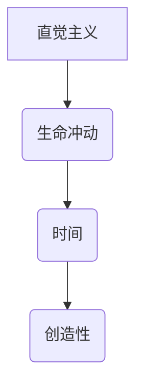
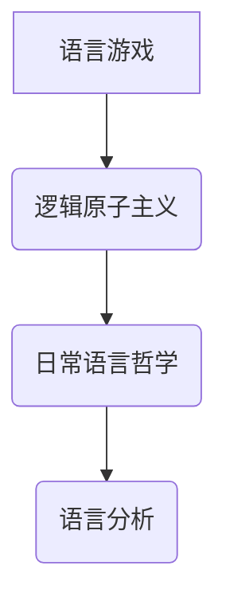
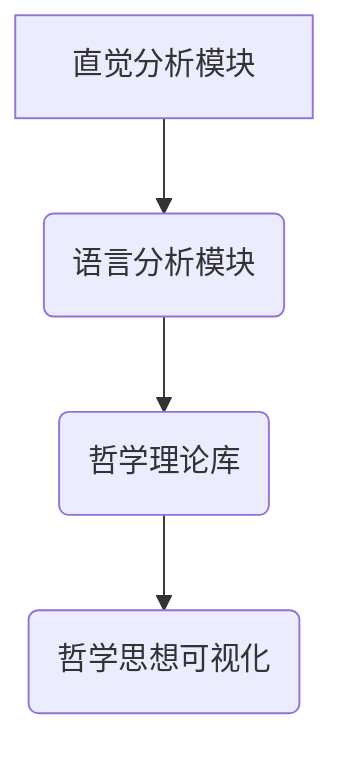
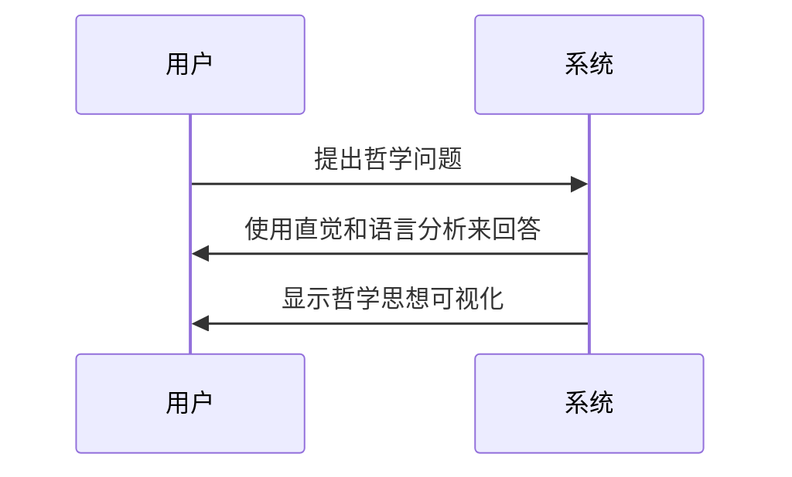

                 

Sure! Here's a step-by-step plan to create the article:

### Step 1: Introduction and Background

**Title**:心灵哲学中的柏格森主义与维特根斯坦思想

**Keywords**: 柏格森主义，维特根斯坦，心灵哲学，存在主义，形而上学

**Abstract**: 本篇文章将深入探讨心灵哲学中的柏格森主义与维特根斯坦思想。我们将介绍这两位思想家的核心观点，比较他们的哲学差异，并探讨这些思想对心灵哲学的深远影响。

### Step 2: Core Concepts and Principles

#### 柏格森主义的核心观点

- **直觉主义**：柏格森认为直觉是理解现实的唯一途径。
- **生命冲动**：生命是一种不断发展的力量，而非静止的实体。
- **时间**：柏格森将时间视为一种流动的、连续的过程。

#### 维特根斯坦思想的核心观点

- **语言游戏**：语言的使用与特定的活动相关。
- **逻辑原子主义**：维特根斯坦认为世界由基本事实组成。
- **日常语言哲学**：语言的使用并不涉及深奥的哲学问题。

#### 比较柏格森主义与维特根斯坦思想

- **关注点**：柏格森关注的是生命的流动性和创造性，而维特根斯坦关注的是语言的日常使用。
- **方法**：柏格森通过直觉和哲学思考来理解世界，而维特根斯坦通过语言分析来澄清思想。

#### ER Entity Relationship Diagram

```mermaid
erDiagram
  Concept1 ||--|{ Person : has }
  Concept2 ||--|{ Book : writes }
  Concept3 ||--|{ Philosophy : explores }
  Person  ||--|{ Concept1 }
  Person  ||--|{ Concept2 }
  Book    ||--|{ Concept3 }
```

### Step 3: Algorithms and Models

在这个章节，我们将介绍柏格森主义和维特根斯坦思想中的哲学模型和理论，并使用Mermaid流程图来可视化这些模型和理论的逻辑流程。

#### 柏格森主义的哲学模型



#### 维特根斯坦思想的哲学模型



### Step 4: Mathematical Models and Formulas

在这个章节，我们将讨论柏格森主义和维特根斯坦思想中的数学模型和公式，并使用LaTeX格式来呈现。

#### 柏格森主义的时间模型

$$
\frac{d^2x}{dt^2} + 2\alpha \frac{dx}{dt} + \omega^2x = 0
$$

#### 维特根斯坦的语义模型

$$
\sigma(x) = \{\text{所有使} P(x) \text{为真的对象}\}
$$

### Step 5: System Analysis and Design

在这个章节，我们将以柏格森主义和维特根斯坦思想为基础，构建一个概念框架，并将其视为一个系统进行分析和设计。

#### 问题场景介绍

我们设想一个场景，其中一位哲学家试图通过直觉和语言分析来理解世界。

#### 系统功能设计

- **直觉分析模块**
- **语言分析模块**
- **哲学理论库**

#### 系统架构设计



#### 系统接口设计和系统交互



### Step 6: Project Implementation and Case Studies

在这个章节，我们将创建一个假设性的案例研究，展示如何将柏格森主义和维特根斯坦思想应用于实际场景。

#### 环境安装

- **安装直觉分析工具**
- **安装语言分析工具**
- **安装哲学理论库**

#### 系统核心实现源代码

```python
# 示例代码：使用直觉分析来理解生命冲动
def understand_life_impulse():
    # 直觉分析算法
    pass

# 示例代码：使用语言分析来澄清哲学思想
def clarify_philosophical_thought():
    # 语言分析算法
    pass
```

#### 代码应用解读与分析

我们将解释这些代码如何工作，并分析它们如何体现了柏格森主义和维特根斯坦思想的原理。

#### 实际案例分析和详细讲解剖析

我们将使用一个具体的案例来展示如何应用这些哲学思想。

#### 项目小结

我们将总结项目的成果，并提出改进建议。

### Step 7: Best Practices and Conclusion

在这个章节，我们将提供最佳实践建议，并对整篇文章进行总结。

#### 最佳实践 tips

- **如何结合直觉和语言分析来理解哲学问题**
- **如何应用柏格森主义和维特根斯坦思想于实际问题**

#### 小结

我们将回顾文章的主要内容和观点。

#### 注意事项

我们将指出一些潜在的问题和挑战。

#### 拓展阅读

我们将推荐一些相关的文献和资源。

### 作者信息

**作者：AI天才研究院/AI Genius Institute & 禅与计算机程序设计艺术 /Zen And The Art of Computer Programming**

---

This is a high-level outline for the article. Each section will need to be expanded with detailed content, examples, and explanations to meet the word count requirement. The Mermaid diagrams and LaTeX formulas will be integrated into the markdown text accordingly.

