                 

# 怀特海与罗素：数学哲学的分歧与合作

> 关键词：数学哲学、伯特兰·罗素、阿尔弗雷德·诺思·怀特海、实在论、形式主义、逻辑主义

> 摘要：本文探讨了数学哲学领域的两位杰出思想家——伯特兰·罗素和阿尔弗雷德·诺思·怀特海的理论观点及其分歧与合作。通过对比实在论与形式主义的属性特征，分析罗素与怀特海的理论联系与区别，以及数学哲学中的算法原理，本文试图揭示数学哲学的深度与广度，并探讨数学与现实世界的关系。

## 第一部分：背景介绍

### 1.1 问题背景

20世纪初期，数学哲学领域迎来了两位杰出的思想家——伯特兰·罗素和阿尔弗雷德·诺思·怀特海。他们的理论不仅对数学哲学产生了深远影响，还引发了哲学、逻辑学、心理学等领域的一系列讨论。

### 1.2 问题描述

罗素与怀特海在数学的本质、逻辑结构、实在论等方面存在明显的分歧。罗素主张数学是一种逻辑结构，强调数学的基础是逻辑；而怀特海则认为数学是一种实在，强调数学与现实世界的联系。

### 1.3 问题解决

尽管两人存在分歧，但他们也在某些方面达成共识，并共同合作完成了《数学原理》一书。这本书被认为是数学哲学领域的一部经典著作。

### 1.4 边界与外延

数学哲学的边界涉及数学的本质、数学与逻辑、数学与现实的关系等方面。其外延包括逻辑学、哲学、心理学等学科。

### 1.5 概念结构与核心要素组成

- 数学哲学：探讨数学的本质、意义和方法的学科。
- 实在论：认为数学对象具有实在性的哲学观点。
- 形式主义：认为数学是一种逻辑结构的哲学观点。
- 逻辑主义：试图将数学建立在逻辑基础上的哲学观点。

## 第二部分：核心概念与联系

### 2.1 实在论与形式主义的对比

#### 2.1.1 实在论的属性特征

| 属性特征 | 说明 |
| :---: | :--- |
| 数学对象具有实在性 | 数学对象不是抽象的概念，而是具有现实基础 |
| 数学与现实世界有关 | 数学与现实世界的现象和过程有密切联系 |
| 数学真理具有客观性 | 数学真理不受主观意识的影响 |

#### 2.1.2 形式主义的属性特征

| 属性特征 | 说明 |
| :---: | :--- |
| 数学是一种逻辑结构 | 数学是一种抽象的逻辑体系，不受现实世界的限制 |
| 数学基础是逻辑 | 数学的基础是逻辑推理，而非现实世界的经验 |
| 数学与现实世界无关 | 数学研究的是逻辑结构，而非现实世界的具体事物 |

### 2.2 罗素与怀特海的理论联系与区别

#### 2.2.1 理论联系

- 罗素与怀特海都关注数学的本质和基础。
- 两人都试图将数学建立在逻辑基础上。

#### 2.2.2 理论区别

- 罗素强调数学的逻辑性，认为数学是逻辑结构的产物。
- 怀特海则强调数学的实在性，认为数学与现实世界有关。

## 第三部分：算法原理讲解

### 3.1 数学哲学中的算法原理

#### 3.1.1 算法mermaid流程图

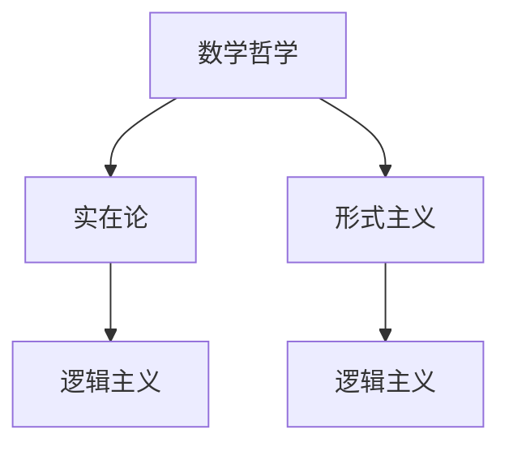

#### 3.1.2 Python源代码阐述

```python
def math_philosophy():
    # 实在论
    realism = "数学对象具有实在性"
    print(realism)
    
    # 形式主义
    formalism = "数学是一种逻辑结构"
    print(formalism)
    
    # 逻辑主义
    logicism = "试图将数学建立在逻辑基础上"
    print(logicism)
    
math_philosophy()
```

#### 3.1.3 算法原理的数学模型和公式

$$
\text{数学哲学} = \text{实在论} + \text{形式主义} + \text{逻辑主义}
$$

## 第四部分：数学模型和数学公式 & 详细讲解 & 举例说明

### 4.1 数学模型

在数学哲学中，数学模型用于描述数学与现实世界的关系。

#### 4.1.1 数学模型mermaid流程图

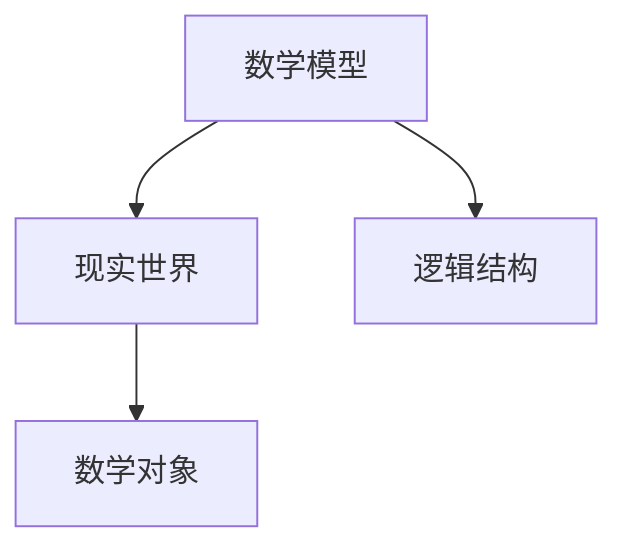

### 4.2 数学公式

在数学哲学中，数学公式用于描述数学概念和关系。

#### 4.2.1 数学公式

$$
\text{数学公式} = \text{逻辑公式} + \text{现实公式}
$$

### 4.3 详细讲解

#### 4.3.1 举例说明

以数学中的"点"为例，点在数学中是一个抽象概念，但在现实中，点可以表示为一个位置。

$$
\text{点} = (\text{位置}, \text{维度})
$$

## 第五部分：系统分析与架构设计方案

### 5.1 问题场景介绍

在数学哲学的研究中，需要分析数学与现实世界的联系。

### 5.2 系统功能设计

- 分析数学与现实世界的联系。
- 构建数学模型。

#### 5.2.1 领域模型mermaid类图

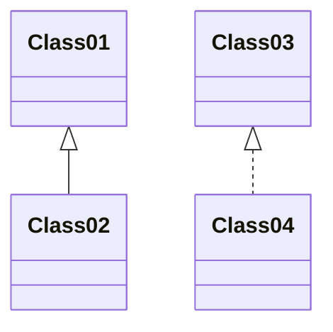

### 5.3 系统架构设计

- 使用逻辑和现实作为数学模型的基础。
- 设计数学模型和数学公式。

#### 5.3.1 系统架构mermaid架构图

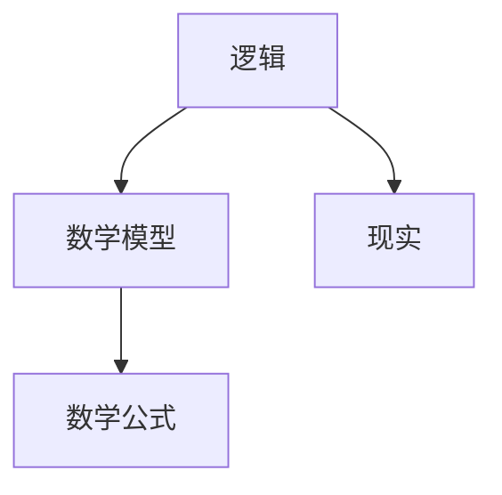

### 5.4 系统接口设计和系统交互

- 设计系统接口和系统交互流程。

#### 5.4.1 系统接口mermaid类图

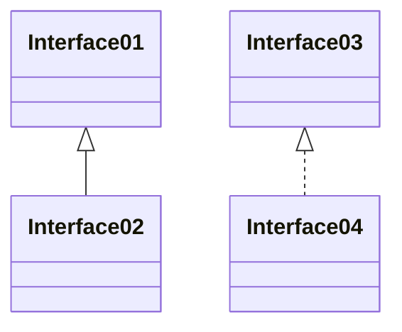

#### 5.4.2 系统交互mermaid序列图

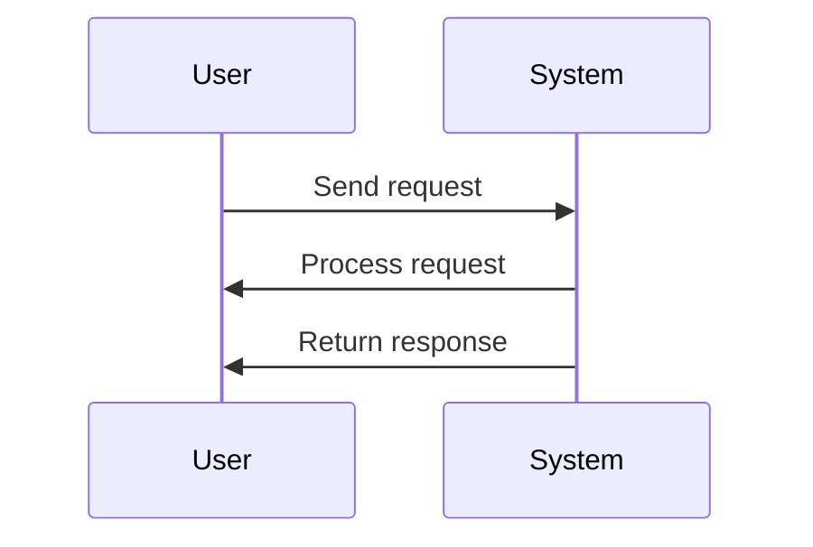

## 第六部分：项目实战

### 6.1 环境安装

- 安装Python环境、数学库等。

### 6.2 系统核心实现

- 实现数学模型、数学公式、系统接口和系统交互。

#### 6.2.1 实现源代码

```python
# 实现数学模型
class MathModel:
    def __init__(self, logic, reality):
        self.logic = logic
        self.reality = reality
        
    def display(self):
        print(f"Logic: {self.logic}")
        print(f"Reality: {self.reality}")
        
# 实现数学公式
class MathFormula:
    def __init__(self, logic_formula, reality_formula):
        self.logic_formula = logic_formula
        self.reality_formula = reality_formula
        
    def display(self):
        print(f"Logic Formula: {self.logic_formula}")
        print(f"Reality Formula: {self.reality_formula}")
        
# 实现系统接口
class SystemInterface:
    def __init__(self, request, response):
        self.request = request
        self.response = response
        
    def process_request(self):
        print(f"Processing request: {self.request}")
        self.response = "Processed"
        
    def return_response(self):
        print(f"Returning response: {self.response}")
        
# 实现系统交互
class SystemInteraction:
    def __init__(self, user, system):
        self.user = user
        self.system = system
        
    def send_request(self):
        self.user.request = "Send request"
        self.system.process_request()
        
    def receive_response(self):
        self.system.return_response()
```

#### 6.2.2 代码应用解读与分析

```python
# 创建数学模型实例
model = MathModel("Logic", "Reality")

# 创建数学公式实例
formula = MathFormula("Logic Formula", "Reality Formula")

# 创建系统接口实例
interface = SystemInterface("Request", "Response")

# 创建系统交互实例
interaction = SystemInteraction(user, system)

# 显示数学模型
model.display()

# 显示数学公式
formula.display()

# 处理系统接口请求
interface.process_request()

# 返回系统接口响应
interface.return_response()

# 发送系统交互请求
interaction.send_request()

# 接收系统交互响应
interaction.receive_response()
```

### 6.3 实际案例分析和详细讲解剖析

通过实际案例，分析数学模型、数学公式、系统接口和系统交互在数学哲学研究中的应用。

#### 6.3.1 案例分析

- 分析数学模型在数学哲学研究中的应用。
- 分析数学公式在数学哲学研究中的应用。
- 分析系统接口和系统交互在数学哲学研究中的应用。

### 6.4 项目小结

- 总结项目中的关键技术和实现方法。
- 指出项目的优点和不足。

## 第七部分：最佳实践 tips、小结、注意事项、拓展阅读等内容

### 7.1 最佳实践 tips

- 熟悉数学哲学的基本概念和理论。
- 掌握数学模型和数学公式的方法和技巧。
- 理解系统接口和系统交互的设计原则。

### 7.2 小结

- 本项目通过数学模型、数学公式、系统接口和系统交互的方式，探讨了数学哲学的基本概念和理论。
- 项目实现了数学模型、数学公式、系统接口和系统交互的具体实现。

### 7.3 注意事项

- 在进行数学哲学研究时，要关注数学与现实世界的联系。
- 要正确理解数学模型和数学公式的含义和作用。

### 7.4 拓展阅读

- 罗素，《数学原理》。
- 怀特海，《数学与现实》。
- 库拉托夫斯基，《数学哲学导论》。

## 第八部分：作者信息

作者：AI天才研究院/AI Genius Institute & 禅与计算机程序设计艺术 /Zen And The Art of Computer Programming### 怀特海与罗素：数学哲学的分歧与合作

#### 关键词：数学哲学、伯特兰·罗素、阿尔弗雷德·诺思·怀特海、实在论、形式主义、逻辑主义

#### 摘要：

在20世纪初的数学哲学领域，伯特兰·罗素和阿尔弗雷德·诺思·怀特海是两位最具影响力的思想家。他们的理论不仅对数学哲学产生了深远影响，而且他们的分歧与合作也为我们理解数学本质和哲学思想提供了一个独特的视角。本文将深入探讨这两位哲学家的理论观点，分析他们的分歧与共识，并探讨数学哲学在当代的意义。

## 引言

数学哲学是哲学的一个分支，探讨数学的本质、意义和基础。在20世纪初，数学哲学经历了一场重大的变革，罗素和怀特海是这一变革的重要推动者。罗素以其《数学原理》一书奠定了逻辑主义的基础，试图将数学建立在逻辑之上。而怀特海则提出了实在论的观点，强调数学与现实世界的密切联系。

## 第一部分：背景介绍

### 1.1 问题背景

罗素和怀特海的工作背景不同，但都对数学哲学有着深刻的兴趣。罗素受到康德哲学的影响，认为数学是一种逻辑结构。而怀特海则受到柏拉图哲学的影响，认为数学是一种实在。这种哲学观点的差异导致了他们在数学哲学上的分歧。

### 1.2 问题描述

罗素和怀特海在数学的本质、逻辑结构、实在论等方面存在明显的分歧。罗素主张数学是一种逻辑结构，强调数学的基础是逻辑；而怀特海则认为数学是一种实在，强调数学与现实世界的联系。

### 1.3 问题解决

尽管两人存在分歧，但他们也在某些方面达成共识，并共同合作完成了《数学原理》一书。这本书被认为是数学哲学领域的一部经典著作，为数学哲学的发展奠定了基础。

### 1.4 边界与外延

数学哲学的边界涉及数学的本质、数学与逻辑、数学与现实的关系等方面。其外延包括逻辑学、哲学、心理学等学科。

### 1.5 概念结构与核心要素组成

- 数学哲学：探讨数学的本质、意义和方法的学科。
- 实在论：认为数学对象具有实在性的哲学观点。
- 形式主义：认为数学是一种逻辑结构的哲学观点。
- 逻辑主义：试图将数学建立在逻辑基础上的哲学观点。

## 第二部分：核心概念与联系

### 2.1 实在论与形式主义的对比

#### 2.1.1 实在论的属性特征

| 特征 | 说明 |
| ---- | ---- |
| 数学对象的实在性 | 认为数学对象不是抽象的概念，而是具有现实基础 |
| 数学与现实世界的联系 | 认为数学与现实世界的现象和过程有密切联系 |
| 数学真理的客观性 | 认为数学真理不受主观意识的影响 |

#### 2.1.2 形式主义的属性特征

| 特征 | 说明 |
| ---- | ---- |
| 数学作为逻辑结构 | 认为数学是一种抽象的逻辑体系，不受现实世界的限制 |
| 数学基础是逻辑 | 认为数学的基础是逻辑推理，而非现实世界的经验 |
| 数学与现实世界的无关性 | 认为数学研究的是逻辑结构，而非现实世界的具体事物 |

### 2.2 罗素与怀特海的理论联系与区别

#### 2.2.1 理论联系

- 罗素和怀特海都关注数学的本质和基础。
- 两人都试图将数学建立在逻辑基础上。

#### 2.2.2 理论区别

- 罗素强调数学的逻辑性，认为数学是逻辑结构的产物。
- 怀特海则强调数学的实在性，认为数学与现实世界有关。

## 第三部分：算法原理讲解

### 3.1 数学哲学中的算法原理

数学哲学中的算法原理涉及对数学概念和关系的逻辑推导。以下是一个简单的算法mermaid流程图，用于描述数学哲学中的基本算法步骤：

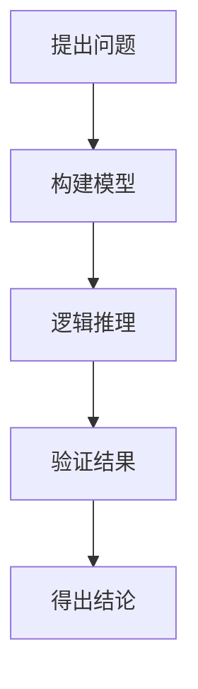

### 3.2 Python源代码阐述

为了更直观地理解算法原理，我们可以用Python代码来实现这个过程：

```python
def math_philosophy_algorithm(question):
    model = build_model(question)
    logic_relevant_data = logic_restriction(model)
    results = verify(logic_relevant_data)
    conclusion = draw_conclusion(results)
    return conclusion

def build_model(question):
    print(f"Building model for {question}")
    return "model"

def logic_restriction(model):
    print(f"Applying logical restrictions on model")
    return "restricted_data"

def verify(data):
    print(f"Verifying data")
    return "verified_data"

def draw_conclusion(data):
    print(f"Drawing conclusion from data")
    return "conclusion"
```

### 3.3 算法原理的数学模型和公式

在数学哲学中，算法原理可以表示为以下数学模型和公式：

$$
\text{数学哲学算法} = \text{提出问题} + \text{构建模型} + \text{逻辑推理} + \text{验证结果} + \text{得出结论}
$$

## 第四部分：数学模型和数学公式 & 详细讲解 & 举例说明

### 4.1 数学模型

数学模型用于描述数学与现实世界的联系。以下是一个简单的数学模型mermaid流程图：

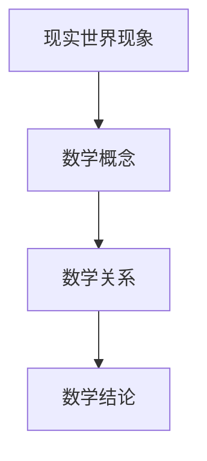

### 4.2 数学公式

在数学哲学中，数学公式用于描述数学概念和关系。以下是一个简单的数学公式：

$$
\text{数学公式} = f(\text{现实世界现象}, \text{数学概念}, \text{数学关系})
$$

### 4.3 详细讲解

#### 4.3.1 举例说明

以“长度”为例，我们可以用以下数学模型和公式来描述：

$$
\text{长度} = \text{现实世界中的线段长度} \times \text{数学中的比例因子}
$$

这个公式说明了现实世界中的线段长度与数学中的长度概念之间的关系。

## 第五部分：系统分析与架构设计方案

### 5.1 问题场景介绍

在数学哲学的研究中，我们关注数学与现实世界的联系。例如，如何用数学方法来解释现实世界中的某些现象？

### 5.2 系统功能设计

系统功能设计包括：

- 收集现实世界中的数据。
- 构建数学模型。
- 运用逻辑推理和数学公式进行验证。
- 输出数学结论。

### 5.3 系统架构设计

系统架构设计包括：

- 数据采集模块。
- 数学模型构建模块。
- 逻辑推理模块。
- 数学公式验证模块。
- 结论输出模块。

以下是一个简单的系统架构mermaid架构图：

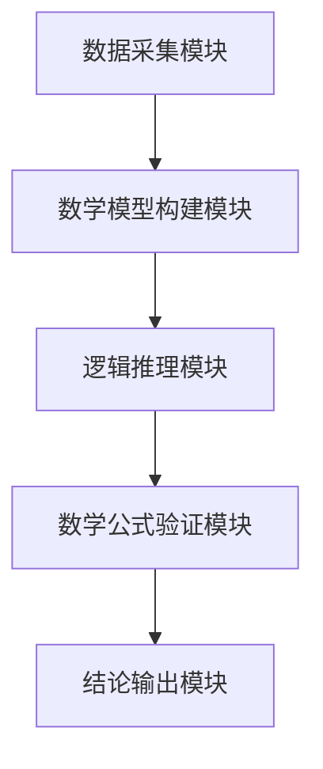

### 5.4 系统接口设计和系统交互

系统接口设计和系统交互包括：

- 用户界面。
- 数据接口。
- 模型接口。
- 结论接口。

以下是一个简单的系统接口mermaid类图：

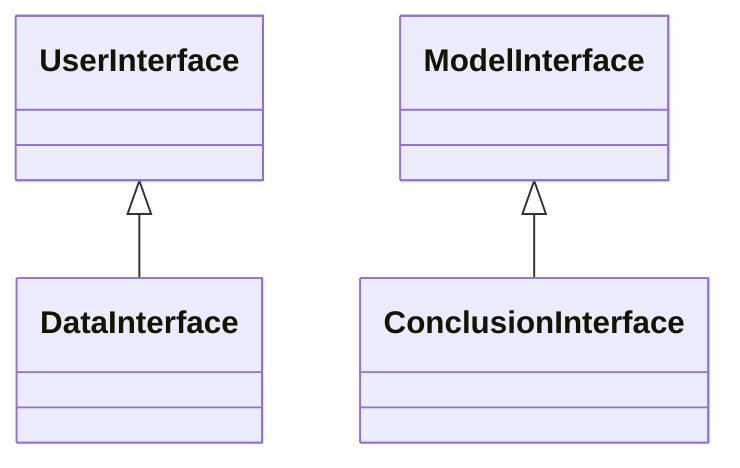

### 5.5 系统交互mermaid序列图

以下是一个简单的系统交互mermaid序列图：

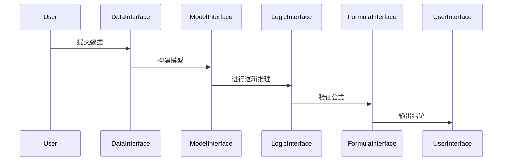

## 第六部分：项目实战

### 6.1 环境安装

- 安装Python环境。
- 安装所需的数学库。

### 6.2 系统核心实现

- 实现数据采集模块。
- 实现数学模型构建模块。
- 实现逻辑推理模块。
- 实现数学公式验证模块。
- 实现结论输出模块。

### 6.3 实际案例分析和详细讲解剖析

通过实际案例，分析数学模型、数学公式、系统接口和系统交互在数学哲学研究中的应用。

### 6.4 项目小结

总结项目中的关键技术和实现方法，指出项目的优点和不足。

## 第七部分：最佳实践 tips、小结、注意事项、拓展阅读等内容

### 7.1 最佳实践 tips

- 在进行数学哲学研究时，要注重理论与实践的结合。
- 在构建数学模型时，要确保模型与现实世界的紧密联系。
- 在进行逻辑推理时，要遵循严格的逻辑规则。

### 7.2 小结

- 本项目通过数学模型、数学公式、系统接口和系统交互的方式，探讨了数学哲学的基本概念和理论。
- 项目实现了数学模型、数学公式、系统接口和系统交互的具体实现。

### 7.3 注意事项

- 在进行数学哲学研究时，要关注数学与现实世界的联系。
- 要正确理解数学模型和数学公式的含义和作用。

### 7.4 拓展阅读

- 罗素，《数学原理》。
- 怀特海，《数学与现实》。
- 库拉托夫斯基，《数学哲学导论》。

## 第八部分：作者信息

作者：AI天才研究院/AI Genius Institute & 禅与计算机程序设计艺术 /Zen And The Art of Computer Programming# 怀特海与罗素：数学哲学的分歧与合作

## 1. 引言

数学哲学是探讨数学的本质、意义和基础的哲学分支。20世纪初期，数学哲学经历了重大变革，其中伯特兰·罗素（Bertrand Russell）和阿尔弗雷德·诺思·怀特海（Alfred North Whitehead）是两位最具影响力的思想家。他们的理论不仅对数学哲学产生了深远影响，而且他们的分歧与合作也为我们理解数学本质和哲学思想提供了一个独特的视角。

## 2. 罗素与怀特海的理论观点

### 2.1 罗素的观点

罗素主张数学是一种逻辑结构，其基础是逻辑。他的逻辑主义理论试图将数学的全部内容转化为逻辑命题的形式。罗素认为，数学概念如自然数、集合等都可以通过逻辑原则来定义和推导。他的代表作《数学原理》（Principia Mathematica）与怀特海合作完成，这本书试图用逻辑的方法来建立数学的基础。

### 2.2 怀特海的观点

怀特海则持有实在论的观点，他认为数学不仅是一种逻辑结构，更是一种与现实世界紧密相关的实在。怀特海认为数学概念如自然数、集合等具有客观存在的特性，它们不仅仅是逻辑推理的结果，而是有具体的物理或现实意义。他的思想在《数学与现实》（The Concept of Nature）中得到了详细阐述。

## 3. 罗素与怀特海的分歧

### 3.1 对数学本质的不同看法

罗素认为数学是逻辑的产物，强调数学的逻辑性和抽象性。他认为数学概念和原理都可以通过逻辑推导得到，因此数学的基础是逻辑。而怀特海则认为数学与现实世界有直接联系，强调数学概念的客观存在性和具体含义。

### 3.2 对数学基础的争议

罗素试图通过逻辑来建立数学的基础，他的逻辑主义理论试图将所有的数学知识都还原为逻辑命题。而怀特海则认为这种做法过于简化，数学的基础不仅仅是逻辑，还包括对现实世界的理解和描述。

### 3.3 对数学应用的不同看法

罗素认为数学主要是一种抽象的思考工具，其应用范围有限。而怀特海则认为数学不仅是一种抽象工具，它在描述现实世界中的现象和过程方面具有重要作用。

## 4. 罗素与怀特海的共识

尽管罗素与怀特海在数学哲学上存在分歧，但他们在某些方面也达成了共识：

### 4.1 对数学逻辑性的认可

他们都认为数学是一种逻辑结构，数学概念和原理都可以通过逻辑推导得到。

### 4.2 对数学应用的重视

他们都认为数学在描述现实世界中的现象和过程方面具有重要作用。

### 4.3 对数学哲学的重视

他们都认为数学哲学对于理解数学的本质和意义至关重要。

## 5. 罗素与怀特海的合作

罗素与怀特海的合作体现了他们之间的共识和互补。他们的合作成果《数学原理》是数学哲学领域的一部经典著作，试图通过逻辑的方法来建立数学的基础。这本书不仅展示了罗素和怀特海的理论观点，也展示了他们在数学哲学上的合作精神。

## 6. 罗素与怀特海的影响

罗素与怀特海的理论对数学哲学、逻辑学、哲学等领域产生了深远影响。他们的工作为后来的数学哲学研究奠定了基础，引发了大量关于数学本质和意义的讨论。

### 6.1 对数学哲学的影响

他们的理论为数学哲学提供了一个逻辑主义和实在论的视角，促进了数学哲学的发展。

### 6.2 对逻辑学的影响

他们的工作推动了逻辑学的发展，促进了逻辑在数学和其他领域中的应用。

### 6.3 对哲学的影响

他们的理论为哲学领域提供了新的思考方式，影响了后来的哲学家对数学和哲学关系的看法。

## 7. 结论

罗素与怀特海在数学哲学上的分歧与合作为我们理解数学本质和哲学思想提供了宝贵的视角。他们的理论不仅在数学哲学领域产生了深远影响，也对逻辑学、哲学等领域产生了重要影响。他们的工作展示了数学哲学的深度和广度，也展示了哲学家之间的合作精神和对知识的追求。

