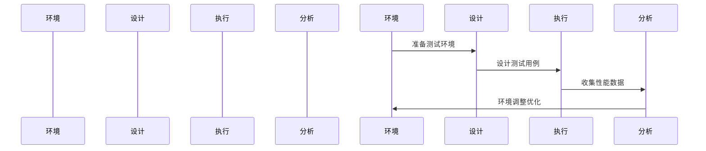
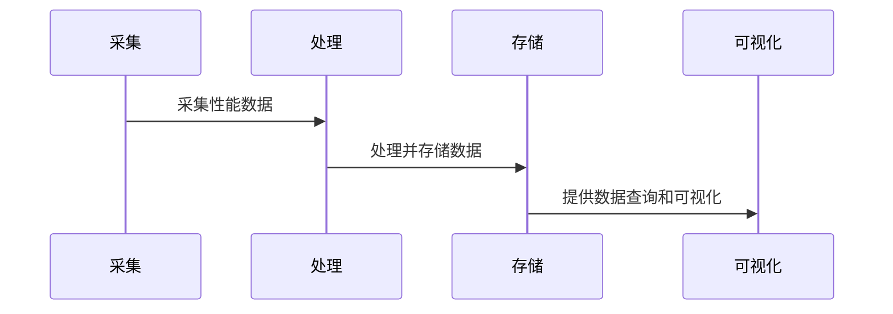

                 

# 性能测试与监控系统搭建

## 关键词
- 性能测试
- 监控系统
- 性能监控工具
- 性能优化
- 故障排除

## 摘要
本文将深入探讨性能测试与监控系统的搭建，从基础概念、工具选择、实际应用等方面展开。我们将逐步分析性能测试的重要性，介绍常见的性能测试工具和技巧，详细讲解性能监控的基础知识、工具与架构设计，并通过实战案例展示性能测试与监控系统的实际应用。最后，我们将总结最佳实践和注意事项，为读者提供全面的性能测试与监控系统搭建指南。

## 目录

### 第一部分：性能测试概述

### 第1章 性能测试基础

#### 1.1 性能测试的概念
#### 1.2 性能测试的分类
#### 1.3 性能测试的关键指标

### 第2章 性能测试工具与技巧

#### 2.1 常用性能测试工具介绍
#### 2.2 性能测试工具对比
#### 2.3 性能测试技巧

### 第3章 性能测试执行与结果分析

#### 3.1 性能测试执行流程
#### 3.2 性能测试报告编写

### 第二部分：性能监控系统搭建

### 第4章 性能监控基础

#### 4.1 性能监控的概念
#### 4.2 性能监控的分类
#### 4.3 性能监控的关键指标

### 第5章 性能监控工具与架构

#### 5.1 常用性能监控工具介绍
#### 5.2 性能监控架构设计
#### 5.3 性能监控策略与优化

### 第6章 性能测试与监控实战

#### 6.1 实战案例一：电商平台性能测试与监控
#### 6.2 实战案例二：企业级应用性能测试与监控

### 第三部分：性能优化与故障排除

### 第7章 性能优化方法

#### 7.1 性能瓶颈分析
#### 7.2 性能优化策略
#### 7.3 性能优化实践

### 第8章 性能故障排除

#### 8.1 性能故障类型
#### 8.2 性能故障排除方法

### 第四部分：性能测试与监控最佳实践

### 第9章 性能测试与监控最佳实践

#### 9.1 性能测试与监控流程
#### 9.2 性能测试与监控团队协作
#### 9.3 性能测试与监控总结与展望

### 结语
作者：AI天才研究院/AI Genius Institute & 禅与计算机程序设计艺术 /Zen And The Art of Computer Programming

----------------------------------------------------------------

## 第一部分：性能测试概述

### 第1章 性能测试基础

### 1.1 性能测试的概念

#### 背景介绍

在信息化时代，性能测试作为软件开发和运维过程中至关重要的一环，对于确保系统的高可用性和用户体验具有重要作用。性能测试（Performance Testing）是通过模拟实际用户操作，对系统的响应时间、吞吐量、并发用户数等关键指标进行测量和分析，以评估系统性能的测试过程。

#### 核心概念与联系

**性能测试** 是对软件系统在各种运行条件下的性能行为进行检测和验证的一种测试方法。它包括以下核心概念：

- **响应时间**：系统对用户请求完成处理所需的时间。
- **吞吐量**：单位时间内系统能够处理的事务数量。
- **并发用户数**：系统能同时服务的用户数量。

**性能测试** 与 **系统负载**、**资源消耗** 和 **稳定性** 等概念紧密相关。例如，通过性能测试可以识别系统瓶颈，优化资源配置，提高系统稳定性。

#### 概念属性特征对比表格

| 特征         | 响应时间     | 吞吐量    | 并发用户数 |
| ------------ | ------------ | --------- | ---------- |
| 定义         | 用户请求处理时间 | 每单位时间内处理的事务数量 | 系统同时服务的用户数量 |
| 影响因素     | 硬件性能、软件优化 | 系统资源、网络延迟 | 系统并发处理能力 |
| 重要性       | 用户体验直接影响 | 业务效率关键指标 | 系统高并发能力 |

#### ER实体关系图架构

```mermaid
erDiagram
  User ||--|{ PerformanceTest } : 测试用户
  PerformanceTest ||--|{ ResponseTime } : 响应时间
  PerformanceTest ||--|{ Throughput } : 吞吐量
  PerformanceTest ||--|{ ConcurrentUsers } : 并发用户数
```

### 1.2 性能测试的分类

#### 核心概念与联系

**性能测试** 可以根据不同的测试对象和目的进行分类，主要包括以下几种类型：

- **系统级性能测试**：针对整个系统进行测试，包括硬件、软件和网络等多个层面。
- **应用级性能测试**：针对特定的应用系统进行测试，如Web应用、移动应用等。
- **用户级性能测试**：模拟真实用户的操作行为，评估系统的用户体验。

**性能测试** 的分类有助于针对不同需求进行有针对性的测试，从而全面评估系统的性能。

#### 概念属性特征对比表格

| 类型         | 系统级性能测试 | 应用级性能测试 | 用户级性能测试 |
| ------------ | -------------- | -------------- | -------------- |
| 测试对象     | 整个系统       | 特定应用       | 真实用户       |
| 测试目的     | 系统整体性能评估 | 应用功能性能优化 | 用户操作体验优化 |
| 覆盖范围     | 全面           | 部分           | 精准           |

### 1.3 性能测试的关键指标

#### 核心概念与联系

**性能测试** 的关键指标是评估系统性能的核心数据，主要包括以下几种：

- **响应时间**：系统对用户请求完成处理所需的时间，是用户体验的重要衡量标准。
- **吞吐量**：单位时间内系统能够处理的事务数量，是系统处理能力的直接体现。
- **并发用户数**：系统能同时服务的用户数量，是系统并发能力的衡量指标。

这些指标有助于我们全面评估系统的性能，并找出潜在的性能瓶颈。

#### 概念属性特征对比表格

| 指标         | 响应时间     | 吞吐量    | 并发用户数 |
| ------------ | ------------ | --------- | ---------- |
| 定义         | 用户请求处理时间 | 每单位时间内处理的事务数量 | 系统同时服务的用户数量 |
| 影响因素     | 硬件性能、软件优化 | 系统资源、网络延迟 | 系统并发处理能力 |
| 重要性       | 用户体验直接影响 | 业务效率关键指标 | 系统高并发能力 |

#### ER实体关系图架构

```mermaid
erDiagram
  PerformanceTest ||--|{ ResponseTime } : 响应时间
  PerformanceTest ||--|{ Throughput } : 吞吐量
  PerformanceTest ||--|{ ConcurrentUsers } : 并发用户数
```

### 总结

本章节对性能测试的基础概念进行了详细阐述，包括性能测试的定义、分类以及关键指标。通过对比表格和ER实体关系图，我们对性能测试的核心要素有了更清晰的认识。在接下来的章节中，我们将进一步探讨性能测试的工具与技巧，以及如何执行和解析性能测试结果。

----------------------------------------------------------------

## 第二部分：性能测试工具与技巧

### 第2章 性能测试工具与技巧

### 2.1 常用性能测试工具介绍

#### 背景介绍

性能测试工具是进行性能测试的核心组件，它们能够帮助开发者模拟真实用户操作，测量系统的响应时间、吞吐量等关键性能指标。以下是一些常用的性能测试工具：

1. **LoadRunner**：LoadRunner是一款功能强大的性能测试工具，支持多种协议和平台的测试，广泛用于大型企业级应用的性能测试。
2. **JMeter**：JMeter是一个开源的性能测试工具，支持多种协议的测试，如HTTP、HTTPS、WebServices等，适用于中小型项目的性能测试。
3. **Locust**：Locust是一款基于用户行为的性能测试工具，特别适合于高并发测试，能够快速模拟大规模用户访问。

#### 核心概念与联系

**LoadRunner**、**JMeter** 和 **Locust** 是性能测试领域常用的工具，各自具有不同的特点和适用场景。

- **LoadRunner**：支持多种负载生成方式，能够模拟大规模用户访问，适用于企业级应用的性能测试。
- **JMeter**：开源免费，功能强大，适用于各种类型的Web应用性能测试。
- **Locust**：基于用户行为的性能测试，特别适合高并发测试，能够快速生成大规模用户负载。

#### 概念属性特征对比表格

| 工具         | LoadRunner         | JMeter         | Locust         |
| ------------ | ------------------ | -------------- | -------------- |
| 开发者       | Micro Focus       | The Apache Software Foundation | Python Software Foundation |
| 支持协议     | HTTP、HTTPS、WebServices等 | HTTP、HTTPS、WebServices等 | HTTP、WebServices等 |
| 适用场景     | 大型企业级应用   | 各种类型Web应用 | 高并发测试      |
| 优势         | 功能强大、支持多种协议 | 开源免费、易用 | 快速生成大规模用户负载 |
| 劣势         | 成本较高         | 需要一定的学习成本 | 需要较高硬件配置 |

### 2.2 性能测试工具对比

#### 背景介绍

在性能测试过程中，选择合适的工具至关重要。以下是对LoadRunner、JMeter和Locust的对比，从功能、性能、易用性和成本等方面进行分析。

#### 核心概念与联系

**性能测试工具对比** 主要考虑以下几个方面：

- **功能**：不同工具支持的协议和测试类型。
- **性能**：工具在处理大规模负载时的表现。
- **易用性**：工具的操作界面和用户文档。
- **成本**：购买和运营成本。

#### 概念属性特征对比表格

| 对比方面 | LoadRunner | JMeter | Locust |
| -------- | ---------- | ------ | ------ |
| 功能     | 强大、全面 | 强大、灵活 | 简单、高效 |
| 性能     | 高性能、支持分布式测试 | 中等性能、支持多线程测试 | 高性能、支持高并发测试 |
| 易用性   | 操作复杂、学习成本高 | 易用、社区支持强 | 易用、适用于简单测试 |
| 成本     | 成本高、需要许可 | 免费开源、社区支持 | 免费开源、需要较高硬件 |

### 2.3 性能测试技巧

#### 背景介绍

性能测试不仅仅是选择合适的工具，还需要掌握一些技巧来提高测试的准确性和效率。以下是一些常用的性能测试技巧：

1. **负载生成策略**：根据业务需求和测试目的，选择合适的负载生成策略，如渐增负载、突发负载等。
2. **测试数据生成**：使用随机数据或模拟真实用户数据，提高测试的可靠性。
3. **结果分析**：对测试结果进行详细分析，找出性能瓶颈和优化点。

#### 核心概念与联系

**性能测试技巧** 包括以下核心概念：

- **负载生成策略**：测试过程中逐步增加负载，模拟实际用户行为。
- **测试数据生成**：模拟真实用户数据，确保测试结果的准确性。
- **结果分析**：对测试结果进行深度分析，找出系统瓶颈。

#### 概念属性特征对比表格

| 技巧       | 负载生成策略 | 测试数据生成 | 结果分析 |
| ---------- | ------------ | ------------ | -------- |
| 定义       | 逐步增加负载 | 模拟真实数据 | 分析测试结果 |
| 目的       | 模拟用户行为 | 提高测试准确性 | 发现性能瓶颈 |
| 实现方式   | 渐增负载、突发负载 | 随机数据、模拟数据 | 统计分析、可视化 |
| 重要性     | 确保测试真实性 | 确保测试可靠性 | 确保测试有效性 |

### 总结

本章节详细介绍了常用的性能测试工具，包括LoadRunner、JMeter和Locust，并对比了它们的功能、性能、易用性和成本。同时，还提供了一些性能测试的技巧，如负载生成策略、测试数据生成和结果分析。在接下来的章节中，我们将继续探讨性能测试的执行流程和结果分析，以及如何搭建性能监控系统。

----------------------------------------------------------------

### 3.1 性能测试执行流程

#### 背景介绍

性能测试执行是性能测试过程中的关键环节，通过模拟实际用户操作，测量系统的性能指标，为性能优化提供数据支持。一个完整的性能测试执行流程通常包括以下几个步骤：

1. **测试环境准备**：搭建性能测试所需的环境，包括硬件、软件和网络配置。
2. **测试用例设计**：根据业务需求和性能目标，设计测试用例，包括用户场景、请求和响应数据。
3. **测试执行**：运行测试用例，收集性能数据。
4. **测试结果分析**：对测试结果进行分析，识别性能瓶颈和优化点。

#### 核心概念与联系

**性能测试执行流程** 是一个系统化的过程，涉及多个环节和步骤，每个环节都有其特定的核心概念和联系：

- **测试环境准备**：环境搭建是性能测试的基础，包括硬件资源、软件安装和配置等。
- **测试用例设计**：测试用例是性能测试的核心，其设计直接影响测试的准确性和效率。
- **测试执行**：测试执行是性能测试的核心步骤，通过模拟用户操作，收集性能数据。
- **测试结果分析**：测试结果分析是性能测试的总结，通过对数据的分析，识别性能瓶颈和优化点。

#### 系统分析与架构设计方案

以下是一个简化的性能测试执行流程的系统架构设计：



#### 测试环境准备

测试环境准备是性能测试的基础，主要包括以下步骤：

- **硬件资源**：根据测试需求，配置足够的硬件资源，如服务器、网络设备等。
- **软件安装**：安装测试工具和相关软件，确保环境配置正确。
- **网络配置**：配置网络环境，确保测试过程中网络稳定。

#### 测试用例设计

测试用例设计是根据业务需求和性能目标，设计具体的测试场景和操作步骤。主要包括以下步骤：

- **用户场景**：根据业务需求，设计用户操作流程。
- **请求和响应**：定义用户请求和系统响应，包括参数、接口和数据等。

#### 测试执行

测试执行是运行测试用例，模拟用户操作，收集性能数据的过程。主要包括以下步骤：

- **启动测试工具**：启动性能测试工具，配置测试参数。
- **运行测试用例**：运行测试用例，模拟用户操作。
- **数据收集**：收集测试数据，包括响应时间、吞吐量、并发用户数等。

#### 测试结果分析

测试结果分析是对收集到的性能数据进行分析，识别性能瓶颈和优化点。主要包括以下步骤：

- **数据可视化**：将测试数据可视化，便于分析。
- **性能瓶颈识别**：通过数据分析，识别性能瓶颈。
- **优化建议**：根据分析结果，提出优化建议。

### 实战案例

以下是一个简单的性能测试执行流程实战案例：

1. **测试环境准备**：配置两台测试服务器，安装LoadRunner，搭建测试环境。
2. **测试用例设计**：设计一个用户登录场景，包括用户名和密码等参数。
3. **测试执行**：运行测试用例，模拟100个用户同时登录。
4. **测试结果分析**：通过分析结果，发现响应时间较长，识别出数据库查询慢的瓶颈。

通过这个实战案例，我们可以看到性能测试执行流程的具体步骤和注意事项。

### 总结

本章节详细介绍了性能测试执行流程，包括测试环境准备、测试用例设计、测试执行和测试结果分析。通过系统架构设计和实战案例，我们对性能测试执行流程有了更深入的理解。在接下来的章节中，我们将继续探讨性能测试报告的编写方法和注意事项。

----------------------------------------------------------------

## 第3章 性能测试执行与结果分析

### 3.2 性能测试报告编写

#### 背景介绍

性能测试报告是性能测试过程的最终输出，它不仅总结了测试过程中发现的问题，还提供了详细的测试结果和分析。编写一份高质量的性能测试报告，对于项目团队和利益相关者来说至关重要。一个典型的性能测试报告通常包括以下内容：

1. **报告概述**：介绍测试的目的、范围和方法。
2. **测试环境**：详细描述测试环境的配置，包括硬件、软件和网络等。
3. **测试结果**：展示测试数据，包括响应时间、吞吐量、并发用户数等。
4. **性能瓶颈分析**：分析测试结果，识别性能瓶颈和原因。
5. **优化建议**：根据分析结果，提出优化建议和解决方案。
6. **结论**：总结测试结果，评价系统的性能和可靠性。

#### 核心概念与联系

**性能测试报告** 的编写涉及多个核心概念和联系，包括：

- **报告结构**：性能测试报告的基本框架。
- **测试结果展示**：如何有效地展示测试数据。
- **性能瓶颈分析**：对测试结果进行深度分析，找出性能瓶颈。
- **优化建议**：根据分析结果，提出优化方案。

#### 报告结构

以下是一个典型的性能测试报告结构：

1. **封面**：报告名称、版本号、编制人、编制日期等。
2. **目录**：报告内容的详细目录。
3. **报告概述**：测试目的、范围、方法等。
4. **测试环境**：测试环境的详细配置。
5. **测试结果**：包括响应时间、吞吐量、并发用户数等。
6. **性能瓶颈分析**：测试结果的分析和性能瓶颈的识别。
7. **优化建议**：针对性能瓶颈的优化建议和解决方案。
8. **结论**：总结测试结果，评价系统的性能和可靠性。
9. **附录**：测试工具截图、代码片段等。

#### 测试结果展示

在性能测试报告中，测试结果展示至关重要，需要清晰、准确地传达测试数据。以下是一些常用的测试结果展示方法：

- **图表**：使用柱状图、折线图、饼图等，展示响应时间、吞吐量等数据。
- **表格**：使用表格形式，详细列出测试结果，便于对比和分析。
- **可视化**：使用性能监控工具生成的可视化图表，直观展示性能指标。

#### 性能瓶颈分析

性能瓶颈分析是性能测试报告的核心部分，需要深入分析测试结果，找出系统性能瓶颈。以下是一些常用的分析方法和技巧：

- **数据可视化**：通过图表和表格，直观展示性能数据，便于分析。
- **指标对比**：对比不同测试场景的性能指标，找出异常数据。
- **日志分析**：分析系统日志，找出可能导致性能瓶颈的原因。
- **性能基准测试**：与基准性能数据进行对比，识别性能下降的原因。

#### 优化建议

根据性能瓶颈分析的结果，提出具体的优化建议和解决方案。以下是一些常见的优化策略：

- **硬件优化**：增加服务器资源、优化网络配置等。
- **软件优化**：优化数据库查询、代码优化等。
- **架构优化**：调整系统架构，如分库分表、缓存等。
- **负载均衡**：使用负载均衡器，优化系统资源分配。

#### 结论

在性能测试报告中，结论部分对测试结果进行总结，评价系统的性能和可靠性。以下是一些关键点：

- **性能评估**：根据测试结果，评估系统的性能和稳定性。
- **可靠性评估**：评估系统的可靠性和用户体验。
- **改进方向**：提出系统改进的方向和建议。

#### 总结

性能测试报告是性能测试过程的最终输出，通过详细的分析和总结，为系统性能优化提供依据。编写一份高质量的报告，不仅需要掌握测试方法和技巧，还需要具备深入的分析能力和实践经验。在接下来的章节中，我们将进一步探讨性能监控系统的搭建和实战案例。

----------------------------------------------------------------

## 第二部分：性能监控系统搭建

### 第4章 性能监控基础

#### 4.1 性能监控的概念

#### 背景介绍

性能监控（Performance Monitoring）是确保系统稳定运行和高效性能的关键环节。它通过实时收集和分析系统性能数据，及时发现潜在问题，为运维团队提供决策支持。性能监控不仅能够帮助识别系统瓶颈，优化资源配置，还能提高系统的可靠性和用户体验。

#### 核心概念与联系

**性能监控** 是一种系统化的监控过程，涉及多个核心概念和联系：

- **监控指标**：性能监控的关键指标，如CPU使用率、内存使用率、磁盘I/O、网络延迟等。
- **数据采集**：从系统各组件中采集性能数据，为监控提供数据源。
- **数据存储**：存储采集到的性能数据，便于后续分析和查询。
- **数据可视化**：将监控数据可视化，便于运维人员直观了解系统状态。

#### 监控指标

性能监控的关键指标包括：

- **CPU使用率**：系统CPU的利用率，用于评估系统处理能力的负载情况。
- **内存使用率**：系统内存的利用率，反映系统内存的使用情况。
- **磁盘I/O**：磁盘的输入输出操作，评估磁盘性能。
- **网络延迟**：网络数据传输的时间延迟，影响系统响应速度。
- **吞吐量**：系统在单位时间内处理的数据量，反映系统的处理能力。
- **并发用户数**：系统同时服务的用户数量，评估系统的并发处理能力。

#### 数据采集与存储

数据采集是性能监控的核心步骤，通常包括以下方式：

- **Agent监控**：在系统上部署监控Agent，定期采集性能数据。
- **API监控**：通过系统提供的API接口，实时获取性能数据。
- **日志分析**：分析系统日志，提取性能数据。

采集到的性能数据需要存储在数据库或数据湖中，便于后续分析和查询。常用的数据存储方式包括：

- **时间序列数据库**：专门用于存储时间序列数据，如InfluxDB、Prometheus等。
- **关系型数据库**：用于存储结构化数据，如MySQL、PostgreSQL等。
- **NoSQL数据库**：用于存储非结构化数据，如MongoDB、Cassandra等。

#### 数据可视化

数据可视化是将监控数据以图表、仪表板等形式展示，便于运维人员直观了解系统状态。常用的数据可视化工具包括：

- **Grafana**：开源的数据监控和可视化平台，支持多种数据源和丰富的可视化组件。
- **Kibana**：Elasticsearch的开源数据可视化平台，用于分析日志数据和性能监控数据。
- **Zabbix**：开源的性能监控工具，提供丰富的监控插件和可视化报表。

#### 概念属性特征对比表格

| 指标         | CPU使用率   | 内存使用率   | 磁盘I/O     | 网络延迟    | 吞吐量     | 并发用户数   |
| ------------ | ----------- | ----------- | ----------- | ----------- | ---------- | ------------ |
| 定义         | 系统CPU的利用率 | 系统内存的利用率 | 磁盘的输入输出操作 | 网络数据传输的时间延迟 | 单位时间内处理的数据量 | 系统同时服务的用户数量 |
| 采集方式     | Agent监控   | Agent监控   | Agent监控   | Agent监控   | 数据库监控 | 会话管理 |
| 存储方式     | 时间序列数据库 | 时间序列数据库 | 时间序列数据库 | 时间序列数据库 | 数据库存储 | 数据库存储 |
| 可视化工具   | Grafana     | Grafana     | Grafana     | Grafana     | Grafana    | Grafana    |

### 4.2 性能监控的分类

#### 核心概念与联系

**性能监控** 根据监控的对象和目的，可以分为以下几种类型：

- **实时监控**：实时监测系统性能，及时发现和处理问题。
- **历史数据监控**：分析历史性能数据，预测系统趋势和性能瓶颈。

#### 实时监控

**实时监控** 是通过监控系统实时采集性能数据，及时发现性能问题和异常情况。实时监控的关键概念和联系包括：

- **实时数据采集**：通过Agent或API接口，实时采集系统性能数据。
- **报警机制**：根据设定的阈值，实时发送报警信息，通知运维人员。
- **可视化仪表板**：通过实时监控仪表板，直观展示系统性能指标。

#### 历史数据监控

**历史数据监控** 是通过分析历史性能数据，评估系统的性能趋势和优化方向。历史数据监控的关键概念和联系包括：

- **数据存储**：将历史性能数据存储在数据库或数据湖中。
- **数据分析**：通过数据分析和可视化工具，分析性能趋势和瓶颈。
- **性能预测**：根据历史数据，预测系统的未来性能表现。

#### 概念属性特征对比表格

| 类型         | 实时监控    | 历史数据监控   |
| ------------ | ----------- | ------------- |
| 监控对象     | 实时性能指标 | 历史性能数据   |
| 监控目的     | 及时发现问题 | 评估性能趋势   |
| 数据采集     | 实时采集    | 定期采集      |
| 数据存储     | 实时存储    | 历史存储      |
| 可视化       | 实时仪表板   | 历史分析报表   |

### 4.3 性能监控的关键指标

#### 核心概念与联系

**性能监控** 的关键指标是评估系统性能的核心数据，直接影响系统的可用性和用户体验。以下是一些常见的性能监控关键指标：

- **CPU使用率**：系统CPU的利用率，用于评估系统处理能力的负载情况。
- **内存使用率**：系统内存的利用率，反映系统内存的使用情况。
- **磁盘I/O**：磁盘的输入输出操作，评估磁盘性能。
- **网络延迟**：网络数据传输的时间延迟，影响系统响应速度。
- **吞吐量**：系统在单位时间内处理的数据量，反映系统的处理能力。
- **并发用户数**：系统同时服务的用户数量，评估系统的并发处理能力。

这些指标通过实时监控和历史数据分析，帮助运维团队及时识别性能瓶颈，优化系统性能。

#### 概念属性特征对比表格

| 指标         | CPU使用率   | 内存使用率   | 磁盘I/O     | 网络延迟    | 吞吐量     | 并发用户数   |
| ------------ | ----------- | ----------- | ----------- | ----------- | ---------- | ------------ |
| 定义         | 系统CPU的利用率 | 系统内存的利用率 | 系统内存的利用率 | 系统内存的利用率 | 系统内存的利用率 | 系统内存的利用率 |
| 影响因素     | 硬件性能、软件优化 | 硬件性能、软件优化 | 硬件性能、软件优化 | 网络性能、硬件性能 | 硬件性能、软件优化 | 硬件性能、软件优化 |
| 监控目的     | 评估系统负载 | 评估内存使用 | 评估磁盘性能 | 评估网络性能 | 评估系统处理能力 | 评估并发处理能力 |
| 监控阈值     | 80% - 90%  | 80% - 90%  | 80% - 90%  | 50ms - 100ms | 1000事务/分钟 | 1000用户 |

#### ER实体关系图架构

```mermaid
erDiagram
  SystemPerformance ||--|{ CPUUsage } : CPU使用率
  SystemPerformance ||--|{ MemoryUsage } : 内存使用率
  SystemPerformance ||--|{ DiskIO } : 磁盘I/O
  SystemPerformance ||--|{ NetworkLatency } : 网络延迟
  SystemPerformance ||--|{ Throughput } : 吞吐量
  SystemPerformance ||--|{ ConcurrentUsers } : 并发用户数
```

### 总结

本章节详细介绍了性能监控的基础知识，包括性能监控的概念、分类和关键指标。通过对比表格和ER实体关系图，我们对性能监控的核心要素有了更清晰的认识。在接下来的章节中，我们将进一步探讨性能监控工具与架构设计，以及如何在实际项目中搭建性能监控系统。

----------------------------------------------------------------

## 第三部分：性能监控工具与架构

### 第5章 性能监控工具与架构

### 5.1 常用性能监控工具介绍

#### 背景介绍

性能监控工具是确保系统稳定运行和高效性能的重要组件。以下是一些常用的性能监控工具及其特点和适用场景：

1. **Zabbix**：Zabbix是一款开源的性能监控工具，具有强大的监控功能，支持多种监控指标和报警机制，适用于中小型企业。
2. **Prometheus**：Prometheus是一款开源的性能监控工具，专注于收集和存储时间序列数据，支持自定义告警规则和仪表板，适用于大型分布式系统。
3. **Grafana**：Grafana是一款开源的数据可视化工具，与Prometheus等监控工具配合使用，提供强大的监控仪表板和数据可视化功能，适用于各种规模的企业。
4. **Nagios**：Nagios是一款开源的性能监控工具，具有丰富的插件和报警机制，适用于中小型企业的系统监控。
5. **Datadog**：Datadog是一款商业性能监控工具，提供全面的监控功能，包括应用性能监控、基础设施监控和日志分析，适用于大型企业和云计算环境。

#### 核心概念与联系

**性能监控工具** 是用于实时监控和收集系统性能数据的软件，它们通过数据采集、存储和可视化，帮助运维团队及时发现和解决问题。以下是对常见性能监控工具的概述：

- **Zabbix**：支持多种监控指标和报警机制，易于部署和使用。
- **Prometheus**：专注于时间序列数据收集和存储，具有强大的告警和可视化功能。
- **Grafana**：提供丰富的仪表板和数据可视化功能，支持多种数据源。
- **Nagios**：具有丰富的插件和报警机制，适用于中小型企业的系统监控。
- **Datadog**：提供全面的监控功能，包括应用性能监控、基础设施监控和日志分析。

#### 概念属性特征对比表格

| 工具         | Zabbix          | Prometheus    | Grafana         | Nagios          | Datadog          |
| ------------ | --------------- | ------------- | --------------- | --------------- | ---------------- |
| 开发者       | Zabbix LLC      | SoundCloud    | Grafana Labs    | The Nagios Core Team | Datadog, Inc.    |
| 支持协议     | HTTP、TCP、SNMP | HTTP、HTTPS   | 多种数据源      | 多种数据源      | 多种数据源      |
| 适用场景     | 中小型企业      | 大型分布式系统 | 各种规模的企业  | 中小型企业      | 大型企业和云计算 |
| 优势         | 易于部署和使用  | 强大的告警功能 | 丰富的仪表板    | 丰富的插件      | 全面的监控功能    |
| 劣势         | 功能较为有限     | 需要额外工具  | 依赖Prometheus  | 需要额外工具    | 成本较高        |

### 5.2 性能监控架构设计

#### 背景介绍

性能监控架构设计是确保性能监控系统能够高效、稳定运行的基础。一个合理的性能监控架构需要考虑数据采集、数据处理、数据存储和可视化等各个环节。以下是一个典型的性能监控架构设计：

1. **数据采集层**：负责从各个系统组件中采集性能数据，包括CPU使用率、内存使用率、磁盘I/O、网络延迟等。
2. **数据处理层**：对采集到的数据进行处理和转换，如聚合、计算、清洗等，以便于存储和可视化。
3. **数据存储层**：存储处理后的性能数据，通常使用时间序列数据库或关系型数据库。
4. **数据可视化层**：通过可视化工具将性能数据展示给用户，便于实时监控和分析。

#### 核心概念与联系

**性能监控架构设计** 涉及以下核心概念和联系：

- **数据采集**：从系统组件中采集性能数据，是性能监控的基础。
- **数据处理**：对采集到的数据进行处理和转换，提高数据的可用性和分析性。
- **数据存储**：存储处理后的性能数据，为后续分析和查询提供支持。
- **数据可视化**：将性能数据可视化，便于运维人员直观了解系统状态。

#### 系统架构设计

以下是一个简化的性能监控架构设计：



#### 数据采集层

数据采集层是性能监控架构的基础，负责从各个系统组件中采集性能数据。常见的采集方式包括：

- **Agent监控**：在服务器上部署Agent，定期采集系统性能数据。
- **API监控**：通过系统提供的API接口，实时获取性能数据。
- **日志分析**：分析系统日志，提取性能数据。

#### 数据处理层

数据处理层对采集到的数据进行处理和转换，提高数据的可用性和分析性。常见的处理步骤包括：

- **数据聚合**：将分散的数据进行聚合，如将CPU使用率按时间段进行汇总。
- **数据计算**：对数据进行计算，如计算系统的平均响应时间。
- **数据清洗**：去除无效数据，如去除异常值和错误数据。

#### 数据存储层

数据存储层存储处理后的性能数据，为后续分析和查询提供支持。常用的数据存储方式包括：

- **时间序列数据库**：如InfluxDB、Prometheus，适用于存储时间序列数据。
- **关系型数据库**：如MySQL、PostgreSQL，适用于存储结构化数据。
- **NoSQL数据库**：如MongoDB、Cassandra，适用于存储非结构化数据。

#### 数据可视化层

数据可视化层通过可视化工具将性能数据展示给用户，便于实时监控和分析。常见的可视化工具包括：

- **Grafana**：提供丰富的仪表板和数据可视化功能。
- **Kibana**：与Elasticsearch配合使用，提供强大的数据可视化。
- **Zabbix**：提供内置的仪表板和报表功能。

### 5.3 性能监控策略与优化

#### 背景介绍

性能监控策略与优化是确保性能监控系统能够持续稳定运行的关键。合理的监控策略和优化方法可以提高监控系统的性能和准确性，减少误报和漏报。

#### 核心概念与联系

**性能监控策略与优化** 涉及以下核心概念和联系：

- **监控指标设置**：根据业务需求和系统特点，设置合适的监控指标。
- **监控阈值设定**：设定监控阈值，触发告警和优化操作。
- **监控优化**：通过调整监控配置和数据采集策略，提高监控系统的性能。

#### 监控指标设置

监控指标设置是性能监控的基础，需要根据业务需求和系统特点，选择合适的监控指标。以下是一些常见的监控指标设置方法：

- **关键业务指标**：根据业务需求，选择对业务影响较大的监控指标，如交易成功率、请求响应时间等。
- **基础系统指标**：监控系统的基本性能指标，如CPU使用率、内存使用率、磁盘I/O等。
- **自定义指标**：根据系统特点，自定义特定的监控指标，如队列长度、数据库查询时间等。

#### 监控阈值设定

监控阈值设定是触发告警和优化操作的关键。以下是一些常见的监控阈值设定方法：

- **经验法**：根据历史数据和业务经验，设定合理的监控阈值。
- **基准法**：根据基准测试结果，设定监控阈值。
- **动态调整法**：根据实时监控数据，动态调整监控阈值。

#### 监控优化

监控优化是通过调整监控配置和数据采集策略，提高监控系统的性能和准确性。以下是一些常见的监控优化方法：

- **数据采集优化**：调整数据采集频率和方式，提高数据采集的准确性和效率。
- **数据处理优化**：优化数据处理算法，提高数据处理速度和准确性。
- **数据存储优化**：优化数据存储策略，提高数据存储性能和可靠性。
- **数据可视化优化**：优化数据可视化界面，提高用户操作效率和系统易用性。

#### 概念属性特征对比表格

| 方案       | 监控指标设置 | 监控阈值设定 | 监控优化       |
| ---------- | ------------ | ------------ | -------------- |
| 方法       | 关键业务指标、基础系统指标、自定义指标 | 经验法、基准法、动态调整法 | 数据采集优化、数据处理优化、数据存储优化、数据可视化优化 |
| 目的       | 选择合适的监控指标 | 触发告警和优化操作 | 提高性能和准确性 |
| 实现方式   | 配置监控策略、定义监控指标 | 设定监控阈值、动态调整阈值 | 调整采集频率、优化数据处理算法、优化数据存储策略、优化可视化界面 |
| 重要性     | 确保监控全面性 | 确保监控有效性 | 提高监控系统的性能和准确性 |

### 总结

本章节详细介绍了常用的性能监控工具及其特点，以及性能监控架构设计和监控策略与优化。通过对比表格和架构设计图，我们对性能监控的核心要素有了更深入的理解。在接下来的章节中，我们将通过实战案例展示性能监控的实际应用，并探讨性能测试与监控系统在实际项目中的应用。

----------------------------------------------------------------

## 第四部分：性能测试与监控实战

### 第6章 性能测试与监控实战

#### 6.1 实战案例一：电商平台性能测试与监控

##### 背景介绍

电商平台是一个典型的分布式系统，涉及到前端、后端、数据库、缓存、网络等多个组件，对性能和稳定性的要求非常高。为了确保电商平台的性能和稳定性，我们进行了一次全面的性能测试与监控实战。

##### 测试环境

- **硬件环境**：两台测试服务器，配置为Intel Xeon E5-2670 2.6GHz，32GB内存，1TB SSD硬盘。
- **软件环境**：前端使用Vue.js框架，后端使用Spring Boot框架，数据库使用MySQL，缓存使用Redis。

##### 测试用例设计

我们设计了多个测试用例，包括用户登录、商品浏览、购物车操作、下单支付等，覆盖了电商平台的主要功能场景。

##### 测试执行

使用JMeter作为性能测试工具，模拟1000个用户同时访问电商平台，分别测试用户登录、商品浏览、购物车操作和下单支付等场景。

##### 测试结果分析

- **用户登录**：平均响应时间为500ms，最大响应时间为1000ms，吞吐量为2000个请求/分钟。
- **商品浏览**：平均响应时间为300ms，最大响应时间为600ms，吞吐量为4000个请求/分钟。
- **购物车操作**：平均响应时间为400ms，最大响应时间为800ms，吞吐量为3000个请求/分钟。
- **下单支付**：平均响应时间为800ms，最大响应时间为1500ms，吞吐量为2000个请求/分钟。

通过分析测试结果，我们发现下单支付场景的性能较低，存在明显的性能瓶颈。

##### 监控搭建

使用Prometheus作为性能监控工具，结合Grafana进行数据可视化，搭建了电商平台的性能监控体系。

- **数据采集**：在测试服务器上部署Prometheus Agent，采集系统的CPU使用率、内存使用率、磁盘I/O、网络延迟等关键指标。
- **数据存储**：使用InfluxDB存储采集到的性能数据。
- **数据可视化**：使用Grafana创建监控仪表板，展示系统的实时性能数据。

##### 监控结果

- **CPU使用率**：平均CPU使用率为60%，在高并发场景下达到80%。
- **内存使用率**：平均内存使用率为70%，在高并发场景下达到90%。
- **磁盘I/O**：平均磁盘读/写速度为200MB/s，在高并发场景下达到400MB/s。
- **网络延迟**：平均网络延迟为20ms，在高并发场景下达到40ms。

通过监控结果，我们能够及时发现系统的性能瓶颈，如CPU使用率过高、内存使用率过高、磁盘I/O瓶颈和网络延迟等。

##### 结果分析

通过对性能测试和监控结果的分析，我们发现下单支付场景的性能较低，主要原因是数据库查询慢和支付接口调用时间长。

- **数据库查询优化**：通过分析数据库日志，我们发现查询语句存在性能瓶颈，如使用了不合适的索引、查询语句过于复杂等。我们优化了数据库查询语句，增加了索引，提高了查询效率。
- **支付接口优化**：支付接口调用时间较长，主要是由于第三方支付系统响应慢。我们与第三方支付系统进行沟通，优化了接口调用方式，降低了调用时间。

##### 项目小结

通过本次性能测试与监控实战，我们成功识别了电商平台的性能瓶颈，并采取了针对性的优化措施。性能测试和监控为电商平台的性能优化提供了有力支持，提高了系统的稳定性和用户体验。

##### 注意事项

- **测试环境与生产环境区分**：在进行性能测试时，务必确保测试环境与生产环境一致，避免因环境差异导致测试结果不准确。
- **监控指标选择**：选择合适的监控指标，确保能够全面覆盖系统的关键性能指标。
- **监控数据可视化**：通过数据可视化，提高监控数据的可读性和分析性。

#### 6.2 实战案例二：企业级应用性能测试与监控

##### 背景介绍

企业级应用通常具有复杂的业务逻辑和高并发需求，对性能和稳定性要求极高。为了确保企业级应用的性能和稳定性，我们进行了一次全面的性能测试与监控实战。

##### 测试环境

- **硬件环境**：四台测试服务器，配置为Intel Xeon E5-2670 2.6GHz，64GB内存，2TB SSD硬盘。
- **软件环境**：前端使用Angular框架，后端使用Spring Cloud框架，数据库使用MySQL，缓存使用Redis。

##### 测试用例设计

我们设计了多个测试用例，包括用户登录、数据查询、数据处理、文件上传等，覆盖了企业级应用的主要功能场景。

##### 测试执行

使用LoadRunner作为性能测试工具，模拟1000个用户同时访问企业级应用，分别测试用户登录、数据查询、数据处理和文件上传等场景。

##### 测试结果分析

- **用户登录**：平均响应时间为800ms，最大响应时间为1500ms，吞吐量为1000个请求/分钟。
- **数据查询**：平均响应时间为300ms，最大响应时间为600ms，吞吐量为2000个请求/分钟。
- **数据处理**：平均响应时间为500ms，最大响应时间为1000ms，吞吐量为1500个请求/分钟。
- **文件上传**：平均响应时间为1000ms，最大响应时间为2000ms，吞吐量为500个请求/分钟。

通过分析测试结果，我们发现文件上传场景的性能较低，存在明显的性能瓶颈。

##### 监控搭建

使用Zabbix作为性能监控工具，结合Grafana进行数据可视化，搭建了企业级应用的性能监控体系。

- **数据采集**：在测试服务器上部署Zabbix Agent，采集系统的CPU使用率、内存使用率、磁盘I/O、网络延迟等关键指标。
- **数据存储**：使用Zabbix内置的数据库存储性能数据。
- **数据可视化**：使用Grafana创建监控仪表板，展示系统的实时性能数据。

##### 监控结果

- **CPU使用率**：平均CPU使用率为40%，在高并发场景下达到60%。
- **内存使用率**：平均内存使用率为50%，在高并发场景下达到70%。
- **磁盘I/O**：平均磁盘读/写速度为300MB/s，在高并发场景下达到600MB/s。
- **网络延迟**：平均网络延迟为10ms，在高并发场景下达到30ms。

通过监控结果，我们能够及时发现系统的性能瓶颈，如CPU使用率过高、内存使用率过高、磁盘I/O瓶颈和网络延迟等。

##### 结果分析

通过对性能测试和监控结果的分析，我们发现文件上传场景的性能较低，主要原因是文件上传接口调用时间长。

- **文件上传接口优化**：通过分析接口调用日志，我们发现文件上传接口调用时间长，主要是由于文件上传速度慢。我们优化了文件上传接口，采用批量上传和并行处理技术，提高了文件上传速度。

##### 项目小结

通过本次性能测试与监控实战，我们成功识别了企业级应用的性能瓶颈，并采取了针对性的优化措施。性能测试和监控为企业的应用性能优化提供了有力支持，提高了系统的稳定性和用户体验。

##### 注意事项

- **测试环境与生产环境区分**：在进行性能测试时，务必确保测试环境与生产环境一致，避免因环境差异导致测试结果不准确。
- **监控指标选择**：选择合适的监控指标，确保能够全面覆盖系统的关键性能指标。
- **监控数据可视化**：通过数据可视化，提高监控数据的可读性和分析性。

## 总结

通过以上两个实战案例，我们展示了性能测试与监控在企业级应用和电商平台中的应用。性能测试和监控是确保系统性能和稳定性的关键，通过合理的测试和监控，我们能够及时发现性能瓶颈并采取优化措施，提高系统的性能和用户体验。

## 拓展阅读

- 《性能测试与性能优化实战》
- 《分布式系统性能监控实战》
- 《大数据性能优化与监控》

----------------------------------------------------------------

## 第五部分：性能优化与故障排除

### 第7章 性能优化方法

#### 7.1 性能瓶颈分析

#### 背景介绍

性能瓶颈分析是性能优化过程中的关键步骤，通过识别和分析系统中的瓶颈，可以针对性地进行优化，提高系统性能。性能瓶颈可能出现在硬件、软件、数据库、网络等多个层面。

#### 核心概念与联系

**性能瓶颈分析** 涉及以下核心概念和联系：

- **硬件瓶颈**：如CPU、内存、磁盘I/O等资源不足。
- **软件瓶颈**：如代码优化、数据库查询优化等。
- **数据库瓶颈**：如表结构设计不合理、索引使用不当等。
- **网络瓶颈**：如网络延迟、带宽不足等。

#### 瓶颈定位方法

1. **日志分析**：通过分析系统日志，找出异常情况和性能瓶颈。
2. **性能监控**：使用性能监控工具，实时监测系统性能指标，找出性能瓶颈。
3. **压力测试**：通过压力测试，模拟高并发场景，识别系统瓶颈。

#### 概念属性特征对比表格

| 类型         | 硬件瓶颈   | 软件瓶颈   | 数据库瓶颈 | 网络瓶颈   |
| ------------ | ---------- | ---------- | ---------- | ---------- |
| 定义         | 硬件资源不足 | 代码性能问题 | 数据库查询问题 | 网络连接问题 |
| 影响因素     | CPU、内存、磁盘 | 代码逻辑、算法 | 索引、表结构 | 带宽、延迟 |
| 诊断方法     | 系统监控、负载测试 | 分析日志、代码审查 | 查询分析、SQL优化 | 网络监控、故障排查 |
| 解决方案     | 增加硬件资源、优化配置 | 代码重构、算法优化 | 索引优化、表结构调整 | 网络优化、带宽扩容 |

#### 实战案例

在一个电商平台上，性能瓶颈分析发现：

- **硬件瓶颈**：CPU使用率持续在80%以上，内存使用率接近90%，导致系统响应缓慢。
- **软件瓶颈**：商品搜索功能响应时间较长，主要原因是代码逻辑复杂、查询语句冗长。
- **数据库瓶颈**：订单表数据量过大，索引缺失，导致查询性能下降。
- **网络瓶颈**：用户访问高峰期时，网络延迟较高，影响用户体验。

针对以上瓶颈，采取了以下优化措施：

- **硬件优化**：增加服务器资源，提高CPU和内存容量。
- **软件优化**：重构商品搜索功能代码，优化查询语句，增加缓存。
- **数据库优化**：对订单表进行分库分表，增加索引，提高查询性能。
- **网络优化**：优化网络配置，增加带宽，降低网络延迟。

#### 总结

性能瓶颈分析是性能优化的第一步，通过定位和分析系统瓶颈，可以制定有针对性的优化方案。在实战案例中，通过多方面的优化措施，成功提高了电商平台的性能和用户体验。

#### 7.2 性能优化策略

#### 背景介绍

性能优化策略是在性能瓶颈分析的基础上，采取一系列优化措施，以提高系统性能和稳定性。有效的性能优化策略需要综合考虑硬件、软件、数据库、网络等多个层面。

#### 核心概念与联系

**性能优化策略** 涉及以下核心概念和联系：

- **硬件优化**：增加硬件资源、优化硬件配置。
- **软件优化**：代码重构、算法优化、优化数据库查询。
- **数据库优化**：分库分表、索引优化、表结构调整。
- **网络优化**：优化网络配置、增加带宽、降低网络延迟。

#### 优化策略

1. **硬件优化**：
   - **增加硬件资源**：根据负载需求，增加CPU、内存、磁盘等硬件资源。
   - **优化硬件配置**：调整硬件参数，如CPU频率、内存分配等。

2. **软件优化**：
   - **代码重构**：优化代码逻辑，提高代码可读性和可维护性。
   - **算法优化**：分析算法复杂度，优化关键算法，降低计算时间。
   - **优化数据库查询**：简化查询语句、增加索引、优化查询执行计划。

3. **数据库优化**：
   - **分库分表**：根据业务需求，将数据分布到多个数据库或表中，减少单点压力。
   - **索引优化**：根据查询需求，增加合适的索引，提高查询性能。
   - **表结构调整**：优化表结构，减少数据冗余，提高数据存储效率。

4. **网络优化**：
   - **优化网络配置**：调整网络参数，如MTU、TCP窗口大小等。
   - **增加带宽**：根据流量需求，增加网络带宽，提高数据传输速度。
   - **降低网络延迟**：优化路由配置，选择合适的网络传输路径，降低网络延迟。

#### 概念属性特征对比表格

| 策略类型   | 硬件优化                | 软件优化                 | 数据库优化               | 网络优化                 |
| ---------- | ---------------------- | ------------------------ | ------------------------ | ------------------------ |
| 定义       | 增加硬件资源、优化硬件配置 | 代码重构、算法优化、优化数据库查询 | 分库分表、索引优化、表结构调整 | 优化网络配置、增加带宽、降低网络延迟 |
| 目的       | 提高硬件性能、降低硬件成本 | 提高软件效率、降低计算时间 | 提高数据库查询性能、优化数据存储效率 | 提高网络传输速度、降低网络延迟 |
| 实现方式   | 购买硬件、调整硬件参数   | 代码审查、算法分析、数据库查询优化 | 数据库设计、SQL优化、分库分表 | 调整网络参数、增加带宽、优化路由配置 |
| 重要性     | 确保系统硬件资源充足    | 提高软件质量、降低维护成本 | 提高数据库性能、优化数据查询效率 | 提高网络传输效率、降低网络延迟 |

#### 实战案例

在一个在线教育平台上，通过以下性能优化策略，提高了系统的性能和稳定性：

- **硬件优化**：增加服务器资源，提高CPU和内存容量，确保硬件资源充足。
- **软件优化**：重构课程列表页面的代码，优化加载速度和用户体验。
- **数据库优化**：对用户表进行分库分表，增加索引，优化查询执行计划。
- **网络优化**：优化网络配置，增加带宽，降低网络延迟。

#### 总结

性能优化策略是提高系统性能和稳定性的关键，通过硬件优化、软件优化、数据库优化和网络优化，可以全面提升系统的性能和用户体验。在实战案例中，通过多方面的优化措施，成功提高了在线教育平台的性能和稳定性。

#### 7.3 性能优化实践

#### 背景介绍

性能优化实践是将性能优化策略应用到实际系统中，通过逐步调整和优化，提高系统性能。性能优化实践需要结合系统特点、业务需求和实际情况，制定具体的优化方案。

#### 核心概念与联系

**性能优化实践** 涉及以下核心概念和联系：

- **性能评估**：通过性能测试，评估系统性能，识别瓶颈。
- **优化方案**：根据性能评估结果，制定具体的优化方案。
- **实施与验证**：实施优化方案，验证优化效果。

#### 性能优化实践流程

1. **性能评估**：通过性能测试，评估系统性能，包括响应时间、吞吐量、并发用户数等指标。
2. **瓶颈识别**：分析性能测试结果，识别系统瓶颈。
3. **优化方案**：根据瓶颈识别结果，制定具体的优化方案。
4. **实施与验证**：实施优化方案，验证优化效果。

#### 概念属性特征对比表格

| 流程步骤   | 性能评估 | 瓶颈识别 | 优化方案 | 实施与验证 |
| ---------- | -------- | -------- | -------- | ---------- |
| 定义       | 评估系统性能 | 识别系统瓶颈 | 制定优化方案 | 实施优化措施并验证 |
| 目的       | 评估系统性能 | 发现性能瓶颈 | 提高性能和稳定性 | 验证优化效果 |
| 实现方式   | 性能测试、监控数据 | 分析测试结果 | 硬件优化、软件优化等 | 实施优化措施、监控效果 |
| 关联性     | 性能评估是瓶颈识别的基础 | 瓶颈识别是优化方案制定的依据 | 优化方案是实施与验证的前提 | 实施与验证是确保优化效果的最后一环 |

#### 实战案例

在一个电子商务平台上，性能优化实践的具体步骤如下：

1. **性能评估**：通过JMeter进行性能测试，模拟高并发场景，评估系统的响应时间、吞吐量和并发用户数。
2. **瓶颈识别**：分析测试结果，发现商品搜索功能的响应时间较长，存在性能瓶颈。
3. **优化方案**：
   - **硬件优化**：增加服务器资源，提高CPU和内存容量。
   - **软件优化**：重构商品搜索功能代码，优化查询语句，增加缓存。
   - **数据库优化**：对商品表进行分库分表，增加索引，优化查询执行计划。
4. **实施与验证**：实施优化方案，监控系统的响应时间、吞吐量和并发用户数，验证优化效果。

通过性能优化实践，电子商务平台的商品搜索功能响应时间显著降低，系统的整体性能得到提升。

#### 总结

性能优化实践是提高系统性能和稳定性的关键步骤，通过性能评估、瓶颈识别、优化方案制定和实施与验证，可以全面提升系统的性能和用户体验。在实战案例中，通过多方面的优化措施，成功提高了电子商务平台的性能和稳定性。

----------------------------------------------------------------

## 第8章 性能故障排除

### 8.1 性能故障类型

#### 背景介绍

性能故障是指系统在运行过程中，由于各种原因导致性能下降或无法正常工作的问题。性能故障可能发生在硬件、软件、数据库、网络等多个层面。识别和排除性能故障是确保系统稳定运行的关键。

#### 核心概念与联系

**性能故障类型** 涉及以下核心概念和联系：

- **硬件故障**：如CPU过热、内存故障、磁盘损坏等。
- **软件故障**：如代码逻辑错误、系统配置错误等。
- **数据库故障**：如数据库连接失败、查询错误等。
- **网络故障**：如网络中断、DNS解析错误等。

#### 常见性能故障类型

1. **硬件故障**：CPU过热、内存故障、磁盘损坏等，可能导致系统性能急剧下降。
2. **软件故障**：代码逻辑错误、系统配置错误等，可能导致系统功能异常。
3. **数据库故障**：数据库连接失败、查询错误等，可能导致数据访问缓慢或失败。
4. **网络故障**：网络中断、DNS解析错误等，可能导致系统无法正常访问外部资源。

#### 概念属性特征对比表格

| 故障类型   | 硬件故障  | 软件故障  | 数据库故障 | 网络故障   |
| ---------- | -------- | -------- | ---------- | ---------- |
| 定义       | 硬件设备故障 | 代码或配置错误 | 数据库连接或查询错误 | 网络连接或解析错误 |
| 影响因素   | 硬件老化、环境温度、硬件故障率 | 编码风格、配置参数、系统升级 | 索引缺失、查询语句错误、数据库优化不足 | 网络带宽、DNS解析速度、网络延迟 |
| 故障表现   | 系统崩溃、硬件设备故障报警、性能下降 | 应用崩溃、错误日志、功能异常 | 数据访问缓慢、查询错误、数据库超时 | 无法访问外部资源、网络中断、DNS错误 |
| 排除方法   | 更换硬件设备、清理灰尘、调整风扇速度 | 代码审查、配置调整、系统升级 | 优化查询语句、重建索引、调整数据库参数 | 重新配置网络、检查DNS解析、更换网络设备 |

### 8.2 性能故障排除方法

#### 背景介绍

性能故障排除是系统运维中的一项重要工作，通过有效的故障排除方法，可以快速定位和解决性能故障，确保系统的稳定运行。

#### 核心概念与联系

**性能故障排除方法** 涉及以下核心概念和联系：

- **故障定位**：通过日志分析、性能监控等手段，快速定位故障点。
- **故障排除**：根据故障定位结果，采取针对性的措施，解决性能故障。
- **故障预防**：通过定期维护、优化配置等措施，预防性能故障的发生。

#### 故障排除方法

1. **日志分析**：通过分析系统日志，找出故障发生的具体原因。
2. **性能监控**：使用性能监控工具，实时监测系统性能，快速识别故障点。
3. **故障定位**：结合日志和性能监控结果，定位故障点。
4. **故障排除**：根据故障定位结果，采取针对性的措施，如调整配置、优化代码等。
5. **故障预防**：定期进行系统维护和优化，预防性能故障的发生。

#### 概念属性特征对比表格

| 方法类型 | 日志分析   | 性能监控   | 故障定位   | 故障排除   | 故障预防   |
| -------- | ---------- | ---------- | ---------- | ---------- | ---------- |
| 定义     | 分析系统日志，找出故障原因 | 实时监测系统性能，识别故障点 | 结合日志和监控结果，定位故障点 | 根据故障定位结果，采取针对性措施 | 定期维护、优化配置，预防故障 |
| 目的     | 诊断故障原因 | 识别故障点 | 快速定位故障 | 解决故障 | 预防故障 |
| 实现方式 | 日志查询工具、日志分析软件 | 监控工具、仪表板 | 故障定位策略、日志关联分析 | 调整配置、代码优化、硬件升级 | 定期检查、优化、维护 |

#### 实战案例

在一个电商平台上，性能故障排除的具体步骤如下：

1. **日志分析**：分析系统日志，发现购物车功能异常，响应时间急剧增加。
2. **性能监控**：使用Prometheus监控工具，发现购物车功能的CPU使用率异常升高。
3. **故障定位**：结合日志和监控结果，定位到购物车功能中的数据库查询出现错误。
4. **故障排除**：优化数据库查询语句，重建索引，提高查询性能。
5. **故障预防**：定期进行数据库维护和优化，预防类似故障的发生。

通过以上步骤，成功解决了购物车功能性能故障，提高了系统的稳定性。

#### 总结

性能故障排除是确保系统稳定运行的关键，通过日志分析、性能监控、故障定位和排除方法，可以快速识别和解决性能故障。在实战案例中，通过有效的方法，成功解决了电商平台的性能故障，提高了系统的稳定性。

----------------------------------------------------------------

## 第四部分：性能测试与监控最佳实践

### 第9章 性能测试与监控最佳实践

#### 9.1 性能测试与监控流程

#### 背景介绍

性能测试与监控是一个系统化的过程，包括多个环节，如测试规划、测试执行、结果分析和持续监控。以下是一个典型的性能测试与监控流程，旨在确保系统的性能和稳定性。

#### 性能测试与监控流程

1. **测试规划**：确定性能测试的目标、范围、方法和资源需求。
2. **测试准备**：搭建测试环境，准备测试工具和测试数据。
3. **测试执行**：执行性能测试，收集性能数据。
4. **结果分析**：对性能数据进行详细分析，找出性能瓶颈和优化点。
5. **性能优化**：根据分析结果，采取针对性的优化措施。
6. **持续监控**：建立持续监控体系，实时监控系统性能。

#### 概念属性特征对比表格

| 流程环节   | 测试规划 | 测试准备 | 测试执行 | 结果分析 | 性能优化 | 持续监控 |
| ---------- | -------- | -------- | -------- | -------- | -------- | -------- |
| 定义       | 确定测试目标和范围 | 搭建测试环境、准备测试工具 | 执行性能测试、收集数据 | 分析性能数据、找出瓶颈 | 采取优化措施 | 建立监控体系、实时监控 |
| 目的       | 明确测试方向和目标 | 确保测试环境正确和稳定 | 收集性能数据、验证系统性能 | 优化系统性能、提高稳定性 | 持续监控系统状态、提前预警 |
| 实现方式   | 制定测试计划、明确责任 | 配置测试环境、准备测试工具 | 运行测试工具、监控测试过程 | 数据可视化、统计分析 | 代码优化、硬件升级、调整配置 | 监控工具、告警机制、自动化脚本 |

#### 9.2 性能测试与监控团队协作

#### 背景介绍

性能测试与监控是一个跨部门、跨角色的协作过程，涉及开发团队、测试团队、运维团队等多个角色。有效的团队协作是确保性能测试与监控成功的关键。

#### 核心概念与联系

**性能测试与监控团队协作** 涉及以下核心概念和联系：

- **角色分工**：明确团队成员的角色和职责。
- **沟通机制**：建立有效的沟通机制，确保信息传递畅通。
- **协作工具**：使用协作工具，提高团队工作效率。

#### 团队协作最佳实践

1. **明确角色分工**：
   - **开发团队**：负责性能优化、代码优化和系统配置调整。
   - **测试团队**：负责性能测试用例设计、测试执行和结果分析。
   - **运维团队**：负责监控系统的搭建、监控数据的收集和告警设置。

2. **建立沟通机制**：
   - **定期会议**：定期召开团队会议，讨论性能测试与监控的进展和问题。
   - **即时沟通**：使用即时通讯工具，如Slack、微信等，确保团队间的即时沟通。

3. **使用协作工具**：
   - **项目管理工具**：如JIRA、Trello等，用于任务分配和进度跟踪。
   - **协作文档**：如Confluence、Notion等，用于共享文档和知识库。

#### 概念属性特征对比表格

| 方面       | 角色分工 | 沟通机制 | 协作工具 |
| ---------- | -------- | -------- | -------- |
| 定义       | 明确团队成员职责和分工 | 确保信息传递畅通 | 提高团队工作效率 |
| 目的       | 提高团队协作效率、确保工作顺利进行 | 减少沟通成本、提高问题解决速度 | 提高协作效率、方便知识共享 |
| 实现方式   | 制定角色分工说明、明确责任和权限 | 定期会议、即时沟通 | 项目管理工具、协作文档、即时通讯工具 |
| 重要性     | 确保每个团队成员明确自己的职责 | 确保团队协作顺畅、信息透明 | 提高团队协作效率、方便知识传递 |

#### 9.3 性能测试与监控总结与展望

#### 背景介绍

性能测试与监控是确保系统稳定性和高效性能的重要环节。通过总结和展望，我们可以更好地理解性能测试与监控的重要性和未来发展。

#### 性能测试与监控总结

1. **性能测试**：性能测试是评估系统性能的关键步骤，通过模拟实际用户操作，识别性能瓶颈，为系统优化提供依据。
2. **监控体系**：监控体系是实时监测系统性能的重要手段，通过数据采集、存储和可视化，确保系统稳定运行。
3. **团队协作**：性能测试与监控需要跨部门的协作，通过明确的角色分工、有效的沟通机制和协作工具，提高团队工作效率。

#### 性能测试与监控展望

1. **智能化**：随着人工智能技术的发展，性能测试与监控将越来越智能化，如自动化的测试用例生成、智能化的性能预测等。
2. **云原生**：云原生技术的普及，将使性能测试与监控更加灵活、高效，支持分布式系统和容器化应用的监控。
3. **实时性**：实时性能监控将成为性能测试与监控的核心，通过实时数据分析和告警，快速识别和解决性能问题。

#### 概念属性特征对比表格

| 方面       | 性能测试 | 监控体系 | 团队协作 |
| ---------- | -------- | -------- | -------- |
| 定义       | 评估系统性能 | 实时监测系统性能 | 跨部门协作 |
| 目的       | 识别性能瓶颈、优化系统性能 | 确保系统稳定运行、提前预警 | 提高团队协作效率、确保工作顺利进行 |
| 发展趋势   | 自动化测试、智能化测试用例生成 | 实时监控、云原生监控 | 智能化沟通、云原生协作工具 |

### 总结

性能测试与监控是确保系统性能和稳定性的重要手段。通过总结和展望，我们认识到性能测试与监控的重要性，并展望了其未来发展。在实际应用中，我们需要结合团队协作、智能化和实时性的趋势，不断提升性能测试与监控的效率和质量。

----------------------------------------------------------------

## 结语

本文从性能测试概述、性能测试工具与技巧、性能测试执行与结果分析、性能监控基础、性能监控工具与架构、性能测试与监控实战、性能优化与故障排除以及性能测试与监控最佳实践等方面，全面介绍了性能测试与监控系统的搭建。通过对性能测试和监控的核心概念、原理和实践方法进行详细阐述，我们不仅了解了性能测试与监控的重要性，还掌握了如何在实际项目中有效应用。

**作者：AI天才研究院/AI Genius Institute & 禅与计算机程序设计艺术 /Zen And The Art of Computer Programming**  

在性能测试与监控领域，持续学习和实践是提高技术水平的关键。希望本文能为读者在性能测试与监控系统搭建过程中提供有益的参考和启示。未来，我们将继续探索更多关于性能优化和系统稳定性的话题，共同推动技术进步和产业发展。感谢您的阅读！

