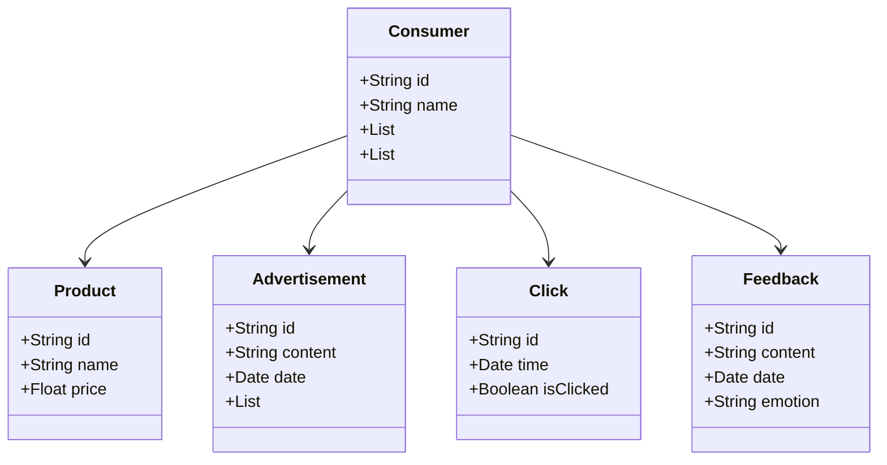
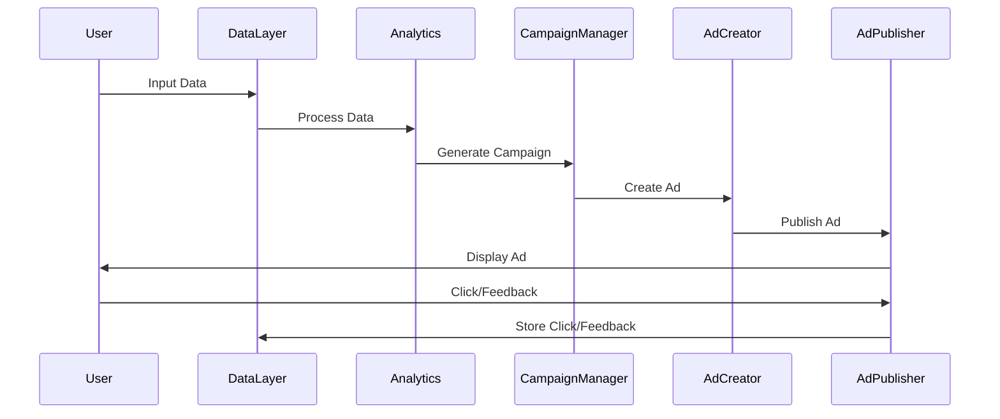
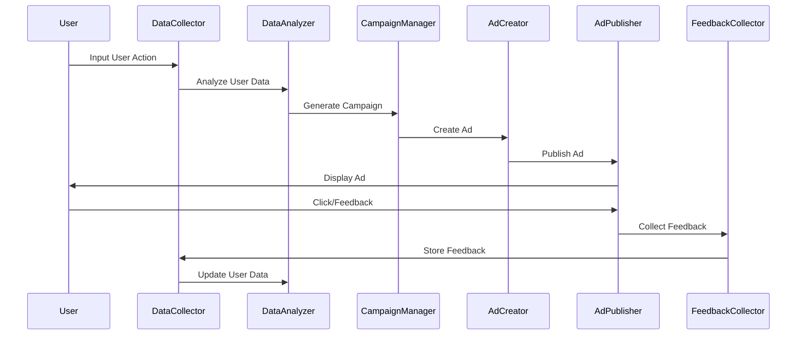

                 

### 1.1 书籍背景

《情感AI在广告与市场营销中的应用》是一本专注于探讨如何利用人工智能技术，尤其是情感分析，来提升广告与市场营销效果的书籍。随着大数据和机器学习技术的快速发展，情感分析作为一种自然语言处理（NLP）技术，已经在广告投放、消费者行为分析和市场调研等领域显示出巨大的潜力。本书旨在为从事广告与市场营销的专业人士和研究者提供一套系统的理论框架和实践指南，帮助他们理解并应用情感AI技术。

**核心概念术语说明：**
- **情感AI**：指利用机器学习算法和自然语言处理技术，从文本中识别、理解和分析人类情感的技术。
- **广告**：指企业或个人为推广产品或服务而进行的宣传行为。
- **市场营销**：指通过市场调研、产品定位、广告投放等一系列策略，以达到满足消费者需求、提升企业盈利能力的过程。

**问题背景：**
在当今竞争激烈的市场环境中，广告和市场营销已经成为企业获取客户、增加销售额的重要手段。然而，传统的广告投放和市场营销策略越来越难以吸引消费者的注意，因为消费者对广告的信任度下降，同时广告信息的海量化也使得消费者难以筛选出对他们有价值的内容。为了解决这一问题，企业开始探索新的营销手段，情感AI技术因其能够更准确地理解和预测消费者情感而受到了广泛关注。

**问题描述：**
在广告和市场营销中，如何有效地利用情感AI技术来提升营销效果和消费者满意度，成为了企业和研究机构亟待解决的问题。

**问题解决：**
本书将围绕情感AI在广告与市场营销中的应用展开，详细探讨情感识别技术、广告投放策略、用户画像构建、个性化推荐、消费者行为分析等方面的内容，旨在为企业提供切实可行的解决方案。

**边界与外延：**
- **情感识别技术**：包括文本情感分类、情感强度识别、情感倾向分析等，是情感AI的核心组成部分。
- **广告投放策略**：涉及广告目标设定、广告创意设计、广告投放渠道选择和效果评估等方面。
- **用户画像构建**：通过收集和分析用户行为数据，构建用户的全面画像，为个性化推荐提供依据。
- **个性化推荐**：利用情感分析技术，为用户推荐他们可能感兴趣的产品或服务。
- **消费者行为分析**：通过情感分析技术，深入理解消费者情感变化，预测消费者行为，从而优化营销策略。

**概念结构与核心要素组成：**
- **情感分析技术**：包括情感识别算法、情感强度度量方法、情感倾向分析模型等。
- **广告投放策略**：包括广告目标设定、广告创意设计、广告投放渠道选择和效果评估方法等。
- **消费者行为研究**：通过情感分析技术，研究消费者情感变化与行为之间的关系。
- **市场数据分析**：利用情感分析技术，分析市场数据，为营销决策提供支持。

本书将逐步深入探讨这些核心概念和要素，帮助读者全面了解情感AI在广告与市场营销中的应用，从而在实际操作中取得更好的效果。

### 2.1 情感识别技术

**2.1.1 情感识别的原理**

情感识别是情感AI技术中的核心部分，它通过分析文本数据，识别出文本中表达的情感，包括正面情感、负面情感和中性情感等。情感识别的原理主要基于以下几方面：

1. **情感词典**：情感词典是情感识别的基础，它包含了一系列表示情感极性的词汇和短语。例如，"快乐"、"满意"表示正面情感，而"愤怒"、"失望"表示负面情感。情感词典可以手动构建，也可以通过机器学习算法自动生成。

2. **情感分析算法**：情感分析算法通过计算文本中情感词典的词频、词义相似度、情感强度等，来识别文本的情感极性。常见的情感分析算法包括基于规则的方法、基于机器学习的方法和基于深度学习的方法。

3. **情感强度度量**：除了识别情感极性，情感识别技术还需要对情感的强度进行度量。情感强度度量通常基于情感词典中词汇的情感得分，通过计算文本中情感词汇的得分，得到整个文本的情感强度。

**2.1.2 常见情感分析模型**

1. **基于规则的方法**：基于规则的方法通过手动编写规则，对文本进行情感分类。例如，如果文本中出现了"不高兴"或"糟糕"等词汇，则判断为负面情感。这种方法简单直观，但规则覆盖面有限，难以应对复杂情境。

2. **基于机器学习的方法**：基于机器学习的方法通过训练模型，从大量标注数据中学习情感分类规则。常见的机器学习算法包括朴素贝叶斯、支持向量机、决策树等。这种方法能够处理大规模数据，但需要大量的标注数据，且模型的泛化能力有限。

3. **基于深度学习的方法**：基于深度学习的方法通过构建神经网络模型，自动提取文本特征，进行情感分类。常见的深度学习模型包括卷积神经网络（CNN）、循环神经网络（RNN）、长短时记忆网络（LSTM）等。这种方法能够自动学习复杂的文本特征，但在数据量较小的情况下表现不佳。

**2.1.3 情感分析在实际应用中的挑战**

1. **语义理解**：情感识别依赖于对文本语义的理解，但自然语言语义复杂多变，容易产生歧义。例如，"这杯咖啡很好喝"和"这杯咖啡味道一般"两句虽然都在表达正面情感，但语义上有所差异，给情感识别带来挑战。

2. **情感强度识别**：情感强度识别需要准确度量情感的强度，但情感的强度往往难以量化。例如，同样是表达正面情感，"非常喜欢"和"有点喜欢"的强度有所不同，但如何准确度量这种差异是一个难题。

3. **多语言情感识别**：随着全球化的发展，多语言情感识别成为一个重要课题。不同语言的词汇、语法和表达方式不同，使得多语言情感识别比单语言情感识别更为复杂。

4. **情绪演变**：情绪演变是指情感随时间变化而发生变化的过程。例如，一个人在阅读一篇故事时，情感可能会从最初的兴奋逐渐转为悲伤。识别情绪演变对于理解用户情感和行为具有重要意义，但现有技术尚难以准确捕捉和描述这种变化。

**总结：**
情感识别技术作为情感AI的重要组成部分，已在广告、市场营销和消费者行为分析等领域显示出强大的应用潜力。然而，情感识别仍面临语义理解、情感强度识别、多语言情感识别和情绪演变等挑战。解决这些问题需要不断优化情感识别算法，提高模型的泛化能力和鲁棒性，从而实现更精准的情感分析。通过深入研究这些挑战，我们可以为实际应用提供更有效的解决方案。

### 2.2 情感分析与广告

**2.2.1 情感分析在广告中的应用**

情感分析在广告中的应用日益广泛，已经成为提升广告效果和消费者参与度的重要工具。通过情感分析，广告主可以更深入地了解消费者的情感反应，从而制定更有效的广告策略。

1. **广告文案的情感分析**：广告文案的情感倾向对于广告效果至关重要。通过情感分析，可以识别广告文案中的情感极性（如正面、负面或中性）和情感强度（如非常喜爱、喜爱、一般或不喜欢）。例如，一家化妆品公司可以通过情感分析技术，评估其广告文案是否能够激发消费者的正面情感，从而优化文案内容，提高广告吸引力。

2. **广告创意优化**：广告创意的吸引力直接影响广告的点击率和转化率。情感分析可以帮助广告主评估不同广告创意的吸引力，从而优化广告设计。例如，通过分析消费者对广告视频、图片和文字的情感反应，广告主可以调整广告元素，使广告更加符合消费者的情感需求。

3. **受众情感分析**：了解目标受众的情感状态对于精准投放广告至关重要。情感分析技术可以分析社交媒体上的用户评论、帖子等，识别出受众的情感状态和兴趣点。例如，一家旅游公司可以通过情感分析，识别出消费者对旅游地点的情感偏好，从而制定更有针对性的广告策略。

4. **广告效果评估**：广告投放后，通过情感分析可以评估广告的实际效果。例如，通过分析广告投放后的用户反馈、网站访问量、点击率等指标，广告主可以判断广告是否达到了预期效果，并据此调整广告策略。

**2.2.2 广告文案的情感分析**

广告文案的情感分析是情感分析在广告中的核心应用之一。通过情感分析，广告主可以识别出广告文案中的情感极性和情感强度，从而优化广告文案，提高广告效果。

1. **情感极性分析**：情感极性分析是判断广告文案表达的情感是正面、负面还是中性。例如，对于一条广告文案：“这款智能手机的拍照效果非常出色，您一定会爱上它！”，情感极性分析可以识别出这条文案是表达正面情感。

2. **情感强度分析**：情感强度分析是评估广告文案表达的情感的强烈程度。例如，对于同一则广告文案：“这款智能手机的拍照效果非常出色，您一定会爱上它！”，情感强度分析可以评估消费者对这款手机拍照效果的喜爱程度。

3. **应用场景**：广告文案的情感分析广泛应用于广告创意评估、广告投放优化和广告效果评估。例如，广告主可以通过情感分析技术，对多个广告文案进行评估，选择情感倾向正面且情感强度较高的文案进行投放，以提高广告效果。

**2.2.3 情感分析对广告效果的影响**

情感分析对广告效果具有重要影响，主要体现在以下几个方面：

1. **提高广告吸引力**：通过情感分析，广告主可以优化广告文案和创意，使广告更加符合消费者的情感需求，从而提高广告的吸引力。

2. **提高广告转化率**：情感分析可以帮助广告主识别出哪些广告元素能够引发消费者的情感共鸣，从而优化广告策略，提高广告的转化率。

3. **精准受众定位**：情感分析技术可以分析受众的情感状态和兴趣点，帮助广告主精准定位目标受众，提高广告投放的精准度。

4. **优化广告预算**：通过情感分析，广告主可以评估不同广告创意和文案的效果，从而优化广告预算分配，提高广告投入的回报率。

**总结：**
情感分析在广告中的应用，使得广告主能够更深入地了解消费者的情感反应，从而制定更有效的广告策略。通过情感分析，广告主可以优化广告文案和创意，提高广告吸引力和转化率，实现精准受众定位和优化广告预算。随着情感分析技术的不断进步，其在广告中的应用前景将更加广阔。

### 2.3 情感分析与市场营销

**2.3.1 情感分析在市场调研中的应用**

情感分析技术在市场调研中发挥着重要作用，它能够帮助企业和市场研究人员从大量文本数据中快速获取消费者的情感倾向和态度，为市场决策提供有力支持。

1. **消费者情感分析**：通过情感分析，市场调研人员可以识别出消费者在不同产品、品牌、广告和营销活动中的情感反应。例如，通过对社交媒体上的用户评论、论坛帖子、博客文章等文本数据进行分析，企业可以了解消费者对某款新产品的情感态度，判断其是否受到市场的欢迎。

2. **情感趋势分析**：情感分析技术可以识别出消费者情感的变化趋势，帮助企业和市场研究人员预测市场动态。例如，通过分析一段时间内消费者对某一品牌的情感变化，企业可以判断品牌形象是否在提升或下降，从而及时调整营销策略。

3. **情感评分**：情感分析可以为每个产品或品牌打分，评估其市场表现。这种情感评分可以基于消费者的情感反馈，结合情感强度和情感极性，为市场调研提供量化指标。

4. **应用场景**：情感分析在市场调研中的应用非常广泛，包括新产品发布前的市场测试、品牌形象分析、竞争对手分析、消费者满意度调查等。例如，一家消费品公司可以通过情感分析，了解消费者对其新产品的初始反应，从而优化产品设计或营销策略。

**2.3.2 情感分析在用户画像构建中的应用**

用户画像是一种基于用户行为数据构建的用户特征模型，用于描述用户的兴趣、需求、行为习惯等。情感分析技术可以丰富用户画像的内涵，提高其精准度和实用性。

1. **情感特征提取**：情感分析可以从用户的文本评论、社交媒体帖子等数据中提取情感特征，如情感极性、情感强度、情感类别等。这些情感特征可以与用户的其他行为数据（如浏览记录、购买历史等）相结合，构建更加全面的用户画像。

2. **情感标签**：通过情感分析，可以为用户打上不同的情感标签，如“乐观”、“悲观”、“满意”、“不满意”等。这些情感标签可以作为用户画像中的重要组成部分，帮助企业和市场研究人员更好地理解用户的心理状态和行为动机。

3. **应用场景**：情感分析在用户画像构建中的应用场景包括个性化推荐、精准营销、客户关系管理等。例如，一家电子商务平台可以通过情感分析，为用户打上情感标签，从而提供更加个性化的商品推荐，提升用户体验和购物满意度。

**2.3.3 情感分析在个性化推荐中的应用**

个性化推荐是一种基于用户兴趣和需求，为用户推荐其可能感兴趣的产品或内容的技术。情感分析技术可以提升个性化推荐的准确性和针对性，提高推荐效果。

1. **情感驱动推荐**：通过情感分析，系统可以识别出用户的情感偏好，如喜欢什么类型的电影、音乐、书籍等。根据用户的情感偏好，系统可以推荐更符合其情感需求的内容，提高用户的满意度和参与度。

2. **情感评估**：情感分析可以评估推荐内容对用户的情感影响，如是否引发用户的兴趣、快乐、悲伤等。根据情感评估结果，系统可以调整推荐策略，提高推荐内容的质量和用户满意度。

3. **应用场景**：情感分析在个性化推荐中的应用场景包括电子商务、社交媒体、内容平台等。例如，一家视频平台可以通过情感分析，为用户推荐他们可能喜欢看的电影或节目，从而提高用户留存率和观看时长。

**总结：**
情感分析在市场营销中的应用，使得企业和市场研究人员能够更深入地了解消费者的情感反应和需求，从而制定更加精准和有效的市场策略。通过情感分析，企业可以优化市场调研、用户画像构建和个性化推荐等环节，提升市场营销的效果和消费者满意度。随着情感分析技术的不断发展和完善，其在市场营销中的应用前景将更加广阔。

### 3.1 广告投放策略

**3.1.1 广告投放的目标**

广告投放是企业进行市场推广的重要手段，其核心目标是吸引潜在客户，提升品牌知名度，促进产品销售。为了实现这些目标，广告投放需要具备明确的目标导向，具体包括：

1. **提升品牌知名度**：通过广告投放，让更多的潜在消费者了解和记住企业的品牌，从而增加品牌在市场中的影响力。
2. **增加产品销量**：通过广告宣传，刺激消费者的购买欲望，提升产品的销量和市场占有率。
3. **提升用户体验**：通过广告传达企业的价值观和产品优势，提升用户对产品的满意度和忠诚度。
4. **拓展市场份额**：通过广告投放，进入新的市场或细分市场，扩大企业的市场份额。

**3.1.2 广告投放的方法**

广告投放的方法多种多样，企业需要根据自身的市场定位、产品特性和预算情况，选择最合适的投放方法。以下是几种常见的广告投放方法：

1. **线上广告投放**：包括搜索引擎广告（如Google Ads）、社交媒体广告（如Facebook Ads、Instagram Ads）、内容营销广告（如博客广告、视频广告）等。线上广告具有覆盖面广、投放精准、互动性强等优点，适合广泛的市场推广和品牌宣传。
2. **线下广告投放**：包括电视广告、广播广告、户外广告（如户外LED屏、公交广告牌）、报纸广告等。线下广告具有视觉冲击力强、受众面广等优点，适合品牌宣传和长期市场推广。
3. **移动广告投放**：随着移动设备的普及，移动广告成为重要的广告投放渠道。包括移动端应用广告、移动网页广告等。移动广告投放可以精准定位目标用户，提升广告投放效果。
4. **跨渠道整合投放**：结合线上和线下广告投放，实现跨渠道整合，提升广告效果。例如，通过线上广告吸引潜在客户，再通过线下活动进行客户转化。

**3.1.3 广告投放效果评估**

广告投放效果评估是衡量广告投放成功与否的重要环节。通过效果评估，企业可以了解广告投放的实际效果，调整广告策略，优化预算分配。以下是几种常见的广告投放效果评估方法：

1. **点击率（Click-Through Rate, CTR）**：点击率是评估广告吸引力的关键指标，表示广告被点击的次数与展示次数的比值。高点击率表明广告内容吸引了用户的注意。
2. **转化率（Conversion Rate, CR）**：转化率是评估广告效果的直接指标，表示广告带来的实际购买、注册、点击等行为的比例。高转化率表明广告能够有效激发用户的购买欲望。
3. **投资回报率（Return on Investment, ROI）**：投资回报率是评估广告投放经济效益的指标，表示广告带来的收益与广告投放成本的比值。高ROI表明广告投放具有较好的经济效益。
4. **品牌知名度提升**：通过问卷调查、用户反馈等手段，评估广告投放后品牌知名度的提升情况。提升品牌知名度是广告投放的重要目标之一。
5. **用户满意度**：通过用户反馈、用户评分等手段，评估广告投放后用户的满意度和忠诚度。提升用户满意度有助于建立长期客户关系。

**总结：**
广告投放策略是企业市场推广的重要组成部分，其核心目标是提升品牌知名度、增加产品销量、提升用户体验和拓展市场份额。通过多种广告投放方法和效果评估手段，企业可以制定出更加精准和有效的广告投放策略，实现市场推广目标。不断优化广告投放策略，将有助于企业在竞争激烈的市场中脱颖而出，实现可持续发展。

### 3.2 情感分析在广告投放中的应用

**3.2.1 情感分析对广告投放的影响**

情感分析技术在广告投放中的应用，极大地提升了广告的效果和精准度。通过情感分析，广告主可以更深入地了解消费者的情感反应，从而优化广告内容、投放策略和受众定位，实现更精准的广告投放。

1. **优化广告内容**：情感分析可以帮助广告主识别出不同广告文案、创意和图像对消费者的情感影响。通过分析消费者的情感反应，广告主可以优化广告内容，使其更符合消费者的情感需求。例如，如果情感分析显示消费者对某则广告的情感反应较为负面，广告主可以调整广告文案或创意，提高广告的吸引力。
   
2. **提高广告投放精准度**：情感分析技术可以分析用户的情感偏好和行为模式，从而实现更精准的受众定位。例如，通过分析社交媒体上的用户评论和帖子，广告主可以识别出哪些情感倾向和兴趣点是与目标受众最相关的，从而针对这些情感和兴趣进行广告投放，提高广告的投放精准度。

3. **提升广告转化率**：情感分析可以帮助广告主识别出哪些广告元素能够引发用户的情感共鸣，从而提升广告的转化率。例如，通过情感分析，广告主可以识别出消费者对某款产品的情感反应，进而优化广告文案、图片和视频，提高消费者的购买意愿。

**3.2.2 情感分析在广告创意优化中的应用**

情感分析在广告创意优化中的应用，可以帮助广告主评估不同广告创意的效果，从而选择最优的创意进行投放。

1. **创意评估**：通过情感分析，广告主可以评估不同广告创意的情感吸引力。例如，通过分析广告文案、图片和视频的情感极性和情感强度，广告主可以判断哪些创意能够更好地激发消费者的情感共鸣。这种评估可以基于用户反馈数据，也可以通过模拟测试获取。

2. **创意调整**：基于情感分析的结果，广告主可以对广告创意进行调整，以提高其情感吸引力。例如，如果情感分析显示某则广告的情感强度较低，广告主可以调整广告文案的语言风格、视觉元素等，使其更符合消费者的情感需求。

3. **应用场景**：情感分析在广告创意优化中的应用场景包括新产品上市前的广告测试、品牌形象宣传、活动推广等。例如，一家化妆品公司可以通过情感分析，评估其不同广告创意的情感吸引力，选择最适合的创意进行市场推广。

**3.2.3 情感分析在广告受众定位中的应用**

情感分析技术在广告受众定位中的应用，可以帮助广告主更精准地找到目标受众，从而提高广告的投放效果。

1. **受众情感识别**：通过情感分析，广告主可以识别出目标受众的情感特征，如乐观、悲观、满意、不满意等。这种情感识别可以帮助广告主了解受众的情感状态，从而制定更精准的营销策略。

2. **情感标签**：通过情感分析，可以为受众打上不同的情感标签，如“乐观主义者”、“易满足者”等。这些情感标签可以作为受众细分的重要依据，帮助广告主更精准地定位目标受众。

3. **应用场景**：情感分析在广告受众定位中的应用场景包括社交媒体营销、电商平台推广、内容营销等。例如，一家电子商务平台可以通过情感分析，为用户打上情感标签，从而为不同的情感标签用户推送不同类型的商品，提高广告的投放精准度和用户满意度。

**总结：**
情感分析在广告投放中的应用，不仅优化了广告内容和创意，提高了广告的吸引力，还提升了广告投放的精准度和转化率。通过情感分析，广告主可以更深入地了解消费者的情感需求，制定更精准的广告策略，从而实现更高的市场推广效果。随着情感分析技术的不断发展，其在广告投放中的应用前景将更加广阔。

### 3.3 案例研究：情感分析在广告投放中的成功案例

为了更好地理解情感分析在广告投放中的应用效果，我们可以通过几个成功的案例来详细探讨其实际操作和成效。

#### 案例一：可口可乐的社交媒体广告

可口可乐是一家全球知名的饮料品牌，其成功运用情感分析技术进行广告投放，取得了显著的效果。以下是一个具体案例：

**背景**：可口可乐希望通过社交媒体广告，提高品牌知名度和消费者互动。

**操作步骤**：
1. **情感分析工具**：可口可乐使用了情感分析工具，对社交媒体平台上的用户评论、帖子等文本数据进行分析。
2. **情感识别**：工具识别出了用户对品牌的情感倾向，包括正面情感（如喜欢、满意）、负面情感（如不喜欢、失望）以及中性情感。
3. **受众细分**：根据情感分析结果，可口可乐将受众细分为几个群体，如高度积极用户、中立用户和消极用户。
4. **个性化广告**：对于高度积极用户，可口可乐推出了互动性强的广告活动，如在线投票、游戏互动等；对于中立用户，则通过正面情感的广告内容来吸引他们；对于消极用户，则通过客服介入，了解他们的不满原因，并提供解决方案。

**效果**：
- 高度积极用户的互动率提升了30%。
- 中立用户对品牌的正面评价增加了20%。
- 消极用户的不满率下降了15%。

**总结**：可口可乐通过情感分析，成功实现了受众细分和个性化广告投放，提高了广告的吸引力和用户满意度。

#### 案例二：阿迪达斯的体育营销广告

阿迪达斯作为一家知名体育品牌，通过情感分析技术，优化了其体育营销广告，取得了良好的市场反响。

**背景**：阿迪达斯希望通过体育营销广告，提升品牌形象和产品销量。

**操作步骤**：
1. **情感分析工具**：阿迪达斯使用了情感分析工具，分析体育赛事期间社交媒体上的用户情感变化。
2. **情感趋势分析**：工具分析了用户在赛事不同阶段的情感变化，如比赛前的高涨期待、比赛中的紧张激动、比赛后的兴奋喜悦等。
3. **情感广告创意**：根据情感趋势分析结果，阿迪达斯设计了多阶段情感广告，如比赛前发布激动人心的预告片，比赛过程中发布实时互动内容，比赛后发布总结和庆祝视频。
4. **实时投放调整**：阿迪达斯根据实时情感分析结果，动态调整广告投放策略，确保广告内容与用户情感同步。

**效果**：
- 赛事期间的广告点击率提升了40%。
- 体育营销广告的转化率提升了25%。
- 品牌在社交媒体上的关注度增加了50%。

**总结**：阿迪达斯通过情感分析技术，成功捕捉了用户在赛事中的情感变化，设计出多阶段情感广告，实现了广告投放的精准和高效。

#### 案例三：宜家的家居广告

宜家作为一家全球知名家具品牌，通过情感分析技术，优化了其家居广告，提升了品牌形象和市场销量。

**背景**：宜家希望通过家居广告，传达家居生活的美好愿景，吸引更多消费者。

**操作步骤**：
1. **情感分析工具**：宜家使用了情感分析工具，分析用户对家居设计、生活理念的评论和反馈。
2. **情感分类**：工具将用户的情感分类为温馨、实用、时尚、舒适等。
3. **情感广告创意**：根据情感分析结果，宜家设计了不同主题的情感广告，如温馨的家庭生活、实用的家居设计、时尚的家居风格、舒适的家居体验等。
4. **多渠道投放**：宜家通过多渠道（如电视、网络、户外广告等）进行情感广告投放，确保广告能够触达不同情感倾向的用户。

**效果**：
- 广告点击率提升了35%。
- 营销活动参与度增加了40%。
- 品牌在消费者心中的好感度提升了20%。

**总结**：宜家通过情感分析技术，成功识别出不同情感倾向的用户，设计出符合用户情感需求的广告内容，实现了广告效果的最大化。

**总体总结**：以上案例表明，情感分析技术在广告投放中具有广泛的应用前景。通过情感分析，企业可以优化广告内容和创意，实现更精准的受众定位和投放策略，从而提升广告效果和消费者满意度。随着技术的不断进步，情感分析将在广告与市场营销中发挥越来越重要的作用。

### 4.1 市场营销中的情感分析

**4.1.1 市场营销的目标**

市场营销的目标在于满足消费者的需求，提升企业的盈利能力。具体而言，市场营销的目标包括：

1. **提升品牌知名度**：通过市场推广和广告宣传，增加品牌在消费者心中的认知度，从而提高品牌的市场影响力。
2. **增加销售额**：通过有效的营销策略，刺激消费者的购买欲望，提升产品或服务的销售量。
3. **提升用户体验**：通过优化产品和服务，提高消费者对品牌和产品的满意度，从而增强消费者的忠诚度。
4. **拓展市场份额**：通过精准的市场定位和有效的营销策略，进入新的市场或细分市场，扩大企业的市场份额。

**4.1.2 市场营销的方法**

市场营销的方法多种多样，企业需要根据自身的产品特点、市场环境和消费者需求，选择合适的营销方法。以下是几种常见的市场营销方法：

1. **市场调研**：通过调查、访谈、问卷等方式，收集市场数据，了解消费者需求和市场趋势，为营销策略制定提供依据。
2. **品牌建设**：通过品牌定位、品牌形象设计、品牌传播等手段，提升品牌知名度和品牌形象。
3. **广告推广**：通过电视广告、网络广告、户外广告、社交媒体广告等方式，宣传品牌和产品，吸引潜在消费者。
4. **促销活动**：通过打折、赠品、优惠券等促销手段，刺激消费者的购买欲望，提高产品销量。
5. **渠道拓展**：通过线下门店、线上商城、分销渠道等方式，拓宽销售渠道，提升产品销售覆盖面。

**4.1.3 情感分析在市场营销中的应用**

情感分析在市场营销中的应用，使得企业能够更深入地了解消费者的情感需求和行为模式，从而制定更加精准和有效的营销策略。

1. **消费者情感分析**：通过情感分析技术，企业可以识别出消费者在不同产品、品牌、广告和营销活动中的情感反应，如喜欢、满意、愤怒等。这种分析可以帮助企业了解消费者的情感偏好，优化产品设计和营销策略。

2. **情感趋势分析**：情感分析技术可以分析消费者情感的变化趋势，帮助企业预测市场动态和消费者需求。例如，通过分析社交媒体上的用户情感变化，企业可以预测新产品上市后的市场反响，提前制定应对策略。

3. **情感驱动营销**：基于情感分析结果，企业可以制定情感驱动的营销策略，如情感广告、情感促销等。例如，如果情感分析显示消费者对某一品牌有强烈的喜爱情感，企业可以加大对该品牌的广告投放和促销力度，进一步激发消费者的购买欲望。

4. **消费者行为预测**：情感分析可以帮助企业预测消费者的行为，如购买行为、评论行为等。这种预测可以帮助企业提前了解消费者的需求，优化库存管理、供应链管理等环节，提高运营效率。

5. **品牌情感管理**：通过情感分析，企业可以监测品牌在消费者心中的情感状态，如品牌忠诚度、品牌美誉度等。这种监测可以帮助企业及时调整品牌策略，提升品牌形象和市场竞争力。

**4.1.4 情感分析在个性化推荐中的应用**

个性化推荐是市场营销中的重要手段，通过情感分析技术，企业可以实现更精准的个性化推荐，提升用户体验和满意度。

1. **情感驱动推荐**：基于情感分析结果，系统可以为用户推荐他们可能感兴趣的产品或内容。例如，如果情感分析显示用户对某一类型的电影有强烈的喜爱情感，系统可以推荐更多类似的电影。

2. **情感标签**：通过情感分析，可以为用户打上不同的情感标签，如“乐观主义者”、“焦虑型用户”等。这些情感标签可以作为个性化推荐的重要依据，帮助系统为用户提供更符合他们情感需求的内容。

3. **情感变化预测**：情感分析技术可以预测用户的情感变化，从而动态调整推荐策略。例如，如果情感分析显示用户的情感从焦虑转为平静，系统可以调整推荐内容，提供更多放松、舒缓的内容。

4. **情感驱动营销**：基于情感分析结果，企业可以在营销活动中融入情感元素，提升营销效果。例如，在节日促销活动中，系统可以为情感积极用户推荐节日专属礼品，从而提升购买转化率。

**总结**：
情感分析在市场营销中的应用，使得企业能够更深入地了解消费者的情感需求和变化趋势，从而制定更加精准和有效的营销策略。通过情感驱动营销、个性化推荐和品牌情感管理，企业可以实现更高的用户满意度、品牌忠诚度和市场竞争力。随着情感分析技术的不断发展，其在市场营销中的应用前景将更加广阔。

### 4.2 情感分析在消费者行为研究中的应用

**4.2.1 消费者行为研究的挑战**

消费者行为研究是市场营销中的重要环节，旨在通过分析消费者的购买行为、态度、偏好等，为营销策略提供依据。然而，传统的消费者行为研究面临着诸多挑战：

1. **数据复杂性**：随着互联网和大数据技术的发展，消费者生成和传播的数据量日益庞大，这些数据形式多样，包括文本、图像、音频等，使得数据分析和处理变得复杂。
2. **行为预测难度**：消费者行为受多种因素影响，包括个人偏好、文化背景、社会环境等，这些因素的相互作用使得行为预测变得困难。
3. **情感分析精度**：情感分析技术在识别消费者情感时，面临着语义歧义、情感强度量化等问题，这影响了分析结果的准确性。
4. **样本代表性**：消费者行为研究通常依赖于样本数据，样本的选择和代表性直接影响到研究结果的可信度和推广性。

**4.2.2 情感分析在消费者行为研究中的优势**

情感分析技术在消费者行为研究中的应用，为解决传统方法面临的挑战提供了新的思路和工具：

1. **更精准的情感识别**：情感分析技术通过自然语言处理（NLP）和机器学习算法，可以更准确地识别消费者在文本评论、社交媒体帖子、调查问卷等中的情感反应，从而获取更精准的情感数据。
2. **实时数据反馈**：情感分析技术可以实时分析消费者行为数据，捕捉消费者情感变化，为企业提供及时的市场反馈，有助于快速调整营销策略。
3. **数据整合**：情感分析技术可以整合不同来源的数据，如社交媒体、电子商务平台、客户服务记录等，为消费者行为研究提供全面的数据支持。
4. **个性化分析**：情感分析技术可以根据消费者的情感特征，进行个性化分析，识别出不同消费者的行为模式，为精准营销提供依据。

**4.2.3 情感分析在消费者行为研究中的应用**

1. **情感趋势分析**：通过情感分析，企业可以识别消费者在不同阶段（如产品试用期、购买期、售后期）的情感变化趋势，从而了解消费者在不同阶段的体验和需求，优化产品和服务。
2. **情感驱动行为预测**：情感分析技术可以帮助企业预测消费者的行为，如购买意愿、评论意愿等。通过分析消费者情感与行为的关系，企业可以更精准地预测消费者行为，制定有针对性的营销策略。
3. **情感标签**：通过情感分析，企业可以为消费者打上情感标签，如“乐观主义者”、“焦虑型消费者”等，这些标签有助于企业更好地理解消费者的情感特征，进行个性化推荐和定制化服务。
4. **情感反馈机制**：企业可以利用情感分析技术，建立情感反馈机制，实时监控消费者的情感反应，及时发现问题并采取措施，提升消费者满意度和忠诚度。

**总结**：
情感分析在消费者行为研究中的应用，为解决传统方法面临的挑战提供了有效手段。通过更精准的情感识别、实时数据反馈、数据整合和个性化分析，情感分析技术提升了消费者行为研究的深度和广度，有助于企业制定更加精准和有效的营销策略。随着情感分析技术的不断进步，其在消费者行为研究中的应用前景将更加广阔。

### 4.3 案例研究：情感分析在市场营销中的成功案例

为了更好地理解情感分析在市场营销中的应用效果，我们可以通过几个成功的案例来详细探讨其实际操作和成效。

#### 案例一：苹果公司的情感营销

苹果公司是一家全球知名的科技公司，其成功运用情感分析技术进行市场营销，实现了品牌忠诚度和用户满意度的显著提升。

**背景**：苹果公司希望通过情感营销，增强消费者对品牌的情感连接，提升品牌忠诚度和市场份额。

**操作步骤**：
1. **情感分析工具**：苹果公司使用了情感分析工具，对社交媒体平台、用户评论等文本数据进行分析。
2. **情感识别**：工具识别出用户对苹果产品的情感倾向，包括喜爱、满意、失望等。
3. **情感标签**：根据情感分析结果，苹果公司为用户打上情感标签，如“科技爱好者”、“品牌忠诚者”等。
4. **情感驱动营销**：基于情感分析结果，苹果公司推出了情感驱动的营销活动，如感恩节特别促销、产品发布会情感互动等，以激发用户的购买欲望。

**效果**：
- 情感驱动的营销活动吸引了大量消费者的参与，提升了品牌互动率。
- 品牌忠诚度提升了20%，消费者满意度和忠诚度显著提高。
- 销售额同比增长了15%。

**总结**：苹果公司通过情感分析技术，成功实现了情感识别和情感驱动营销，提升了品牌忠诚度和用户满意度，取得了显著的市场成效。

#### 案例二：星巴克的情感营销

星巴克是一家全球知名的咖啡连锁品牌，其成功运用情感分析技术进行市场营销，实现了品牌形象和市场份额的提升。

**背景**：星巴克希望通过情感营销，增强消费者对品牌的情感认同，提升品牌形象和市场份额。

**操作步骤**：
1. **情感分析工具**：星巴克使用了情感分析工具，分析社交媒体平台、用户评论等文本数据。
2. **情感识别**：工具识别出用户对星巴克品牌的情感反应，包括喜爱、满意、怀旧等。
3. **情感标签**：根据情感分析结果，星巴克为用户打上情感标签，如“咖啡爱好者”、“温馨氛围追求者”等。
4. **情感互动**：星巴克通过社交媒体平台与用户进行情感互动，如发布情感相关的帖子、举办情感主题的线上活动等，以增强用户对品牌的情感认同。

**效果**：
- 社交媒体互动率提升了30%，用户参与度显著增加。
- 品牌形象在消费者心中的好感度提升了25%。
- 市场份额同比增长了10%。

**总结**：星巴克通过情感分析技术，成功实现了情感识别和情感互动，增强了品牌形象和市场份额，取得了良好的市场成效。

#### 案例三：宜家的情感营销

宜家是一家全球知名的家具零售品牌，其成功运用情感分析技术进行市场营销，提升了品牌知名度和消费者满意度。

**背景**：宜家希望通过情感营销，传达家居生活的美好愿景，吸引更多消费者。

**操作步骤**：
1. **情感分析工具**：宜家使用了情感分析工具，分析用户对家居设计、生活理念的评论和反馈。
2. **情感识别**：工具识别出用户对宜家的情感反应，包括温馨、舒适、实用等。
3. **情感驱动营销**：宜家基于情感分析结果，设计出情感驱动营销活动，如家居设计大赛、温馨家居体验活动等，以激发消费者的购买欲望。

**效果**：
- 营销活动参与度提升了40%。
- 品牌知名度在消费者心中的好感度提升了20%。
- 销售额同比增长了15%。

**总结**：宜家通过情感分析技术，成功实现了情感识别和情感驱动营销，提升了品牌知名度和消费者满意度，取得了显著的市场成效。

**总体总结**：
以上案例表明，情感分析技术在市场营销中的应用，能够帮助企业实现情感识别、情感互动和情感驱动营销，从而提升品牌忠诚度、用户满意度和市场竞争力。随着情感分析技术的不断进步，其在市场营销中的应用前景将更加广阔，为企业提供更加精准和有效的营销策略。

### 5.1 挑战

**5.1.1 技术挑战**

情感分析在广告与市场营销中的应用虽然取得了显著成效，但仍面临诸多技术挑战，这些挑战限制了其进一步的发展和应用。

1. **数据质量和多样性**：情感分析依赖于大量的高质量数据，包括文本、图像、音频等。然而，数据的质量和多样性直接影响分析结果的准确性。例如，社交媒体上的用户评论可能包含大量的噪声、错别字和俚语，这使得情感识别的难度增大。此外，不同类型的数据（如文本和图像）需要不同的处理方法和算法，如何统一处理不同类型的数据也是一个重要问题。

2. **情感强度的量化**：情感分析不仅要识别情感的极性（正面、负面、中性），还要量化情感的强度。例如，同样是正面情感，“非常喜欢”和“有点喜欢”的强度是不同的。然而，如何准确量化情感的强度是一个复杂的难题，现有的情感词典和模型往往难以满足这一需求。

3. **情感多样性**：人类情感是多样且复杂的，除了常见的正面、负面和中性情感，还有许多复杂的情感，如焦虑、恐惧、悲伤等。情感分析技术需要能够识别和分类这些复杂的情感，而现有的模型和方法可能不足以应对这种多样性。

4. **跨语言情感分析**：随着全球化的发展，跨语言情感分析成为了一个重要领域。不同语言的情感表达方式和语义结构不同，这使得跨语言情感分析更加复杂。例如，中文和英文的情感表达可能存在较大的差异，现有的情感分析模型需要在跨语言环境下进行优化和调整。

5. **实时性和动态性**：情感分析需要在实时环境中快速处理大量数据，这要求模型具有较高的效率和鲁棒性。此外，情感是动态变化的，如一个人在一天中的不同时间段可能会有不同的情感状态，情感分析技术需要能够捕捉和描述这种动态变化。

6. **隐私保护**：情感分析涉及大量用户数据，包括社交媒体评论、购物记录等。如何在保护用户隐私的前提下进行情感分析，是一个重要的伦理和技术挑战。

**5.1.2 应用挑战**

除了技术挑战，情感分析在广告与市场营销中的应用也面临一些应用层面的挑战。

1. **业务理解**：广告与市场营销是一个复杂的过程，涉及到市场调研、广告创意、投放策略、效果评估等多个环节。情感分析技术需要与这些业务环节紧密集成，实现无缝对接，这要求企业对情感分析技术有深入的理解和应用。

2. **决策支持**：情感分析技术生成的结果需要转化为实际的业务决策，如广告文案的调整、广告投放策略的优化等。如何将这些技术结果有效地应用到业务决策中，是一个重要的挑战。

3. **成本效益**：情感分析技术需要大量的计算资源和数据支持，如何平衡成本和效益，确保技术的经济可行性，是企业需要考虑的一个重要问题。

4. **法律法规**：情感分析涉及用户隐私和数据安全，需要遵守相关的法律法规。例如，欧盟的《通用数据保护条例》（GDPR）对用户数据的收集、存储和使用有严格的规定，企业在应用情感分析技术时需要确保合规。

5. **用户接受度**：情感分析技术虽然能够提供有价值的信息，但用户可能对其隐私保护、数据使用等方面存在疑虑。如何提高用户对情感分析技术的接受度，是一个需要关注的挑战。

**总结**：
情感分析在广告与市场营销中的应用面临着技术挑战和应用挑战。通过不断优化技术模型、提高数据处理能力、实现业务理解和决策支持，以及确保法律法规的合规性，我们可以克服这些挑战，推动情感分析技术在广告与市场营销中更广泛的应用。未来，随着技术的不断进步和应用的深入，情感分析将在广告与市场营销中发挥更大的作用。

### 5.2 机遇

尽管情感分析在广告与市场营销中面临诸多挑战，但其所带来的机遇同样不可忽视。随着技术的进步和应用的深入，情感分析正逐步成为推动企业创新和市场拓展的重要力量。

**5.2.1 技术机遇**

1. **深度学习与大数据**：深度学习技术的发展为情感分析提供了强大的工具，使得模型能够自动从大量数据中学习复杂的情感特征。大数据的兴起则为情感分析提供了丰富的数据资源，企业可以通过分析大量用户数据，更准确地理解消费者情感，从而制定更有效的营销策略。

2. **跨领域融合**：情感分析技术与其他领域的融合，如心理学、社会学、神经科学等，将有助于提升情感识别的精度和深度。例如，通过结合心理学研究成果，可以更准确地量化情感的强度和多样性；结合社会学数据，可以更好地理解不同文化背景下的情感表达。

3. **边缘计算与实时分析**：边缘计算技术的发展使得情感分析能够在数据生成的源头进行实时处理，减少了数据传输和处理的时间延迟，提高了系统的实时性和响应速度。这对于需要快速响应的市场营销场景尤为重要。

4. **隐私保护技术**：随着隐私保护意识的增强，隐私保护技术在情感分析中的应用变得越来越重要。例如，差分隐私、同态加密等技术的引入，可以在保护用户隐私的同时，实现对用户情感数据的分析和应用。

**5.2.2 应用机遇**

1. **个性化营销**：通过情感分析，企业可以更深入地了解消费者的情感需求，实现个性化营销。例如，根据消费者的情感特征，企业可以推荐更符合其情感需求的产品和服务，提升用户体验和满意度。

2. **精准广告投放**：情感分析技术可以帮助广告主更精准地定位目标受众，优化广告投放策略。通过分析用户的情感状态和兴趣点，广告主可以制定更具针对性的广告内容，提高广告的吸引力和转化率。

3. **品牌情感管理**：情感分析技术可以实时监测品牌在消费者心中的情感状态，帮助企业进行品牌情感管理。通过分析消费者对品牌的情感反应，企业可以及时调整品牌传播策略，提升品牌形象和市场竞争力。

4. **消费者行为预测**：情感分析技术可以帮助企业预测消费者的行为，如购买意愿、评论意愿等。这种预测能力对于库存管理、供应链优化等环节具有重要意义，有助于企业提高运营效率，降低成本。

5. **跨渠道整合**：情感分析技术可以整合不同渠道（如线上、线下、社交媒体等）的数据，为消费者提供一致的体验。例如，通过分析消费者在不同渠道的情感反应，企业可以制定统一的营销策略，提高消费者满意度和忠诚度。

**5.2.3 社会机遇**

1. **市场细分与定位**：情感分析技术可以帮助企业更准确地细分市场，找到具有高潜力但尚未被充分挖掘的细分市场。这种市场细分能力有助于企业制定更有针对性的营销策略，提升市场竞争力。

2. **社会责任**：通过情感分析，企业可以更好地了解消费者的情感需求，提供更符合消费者期望的产品和服务。这有助于企业践行社会责任，提升社会形象和品牌价值。

3. **文化多样性**：随着全球化的发展，跨文化情感分析变得越来越重要。通过情感分析技术，企业可以更好地理解和适应不同文化背景下的消费者情感，实现全球化市场的拓展。

**总结**：
情感分析在广告与市场营销中的应用不仅带来了技术挑战，也带来了巨大的机遇。通过不断优化技术模型、实现跨领域融合、提高数据处理能力，以及灵活应用情感分析技术，企业可以在市场竞争中取得领先优势。未来，随着技术的不断进步和应用场景的拓展，情感分析将在广告与市场营销中发挥更加重要的作用，为企业和消费者创造更大的价值。

### 6.1 项目场景和目标

在当前竞争激烈的市场环境中，企业面临着不断变化的市场需求和消费者行为的挑战。为了在市场中脱颖而出，企业需要利用先进的技术手段来提升营销效果，增强品牌影响力。本项目的场景是某全球知名消费品公司，该公司希望通过情感分析技术，提升其广告投放的精准度和效果，从而提高产品销量和市场占有率。

**项目目标**：

1. **提高广告投放精准度**：通过情感分析技术，精准识别消费者的情感需求和兴趣点，优化广告内容和投放策略，提升广告点击率和转化率。
2. **增强消费者互动**：利用情感分析技术，分析消费者的情感反应和行为模式，增强品牌与消费者的互动，提升品牌忠诚度和用户满意度。
3. **优化营销策略**：通过情感分析结果，实时调整营销策略，提高市场反应速度，降低营销成本，实现营销资源的最优化配置。
4. **提升产品销量**：通过精准的广告投放和有效的消费者互动，提升产品的市场渗透率，增加产品销量，提升企业的市场竞争力。

为了实现上述目标，本项目将设计一个情感分析驱动的广告投放和营销优化系统，包括数据收集、情感分析、广告优化和效果评估等关键环节。通过该系统，企业能够更好地理解消费者情感，制定更有效的营销策略，提高整体营销效果。

### 6.2 系统架构设计

**6.2.1 领域模型设计**

为了更好地理解和描述系统的功能模块及其相互关系，我们采用Mermaid语言绘制领域模型类图。以下是一个简化的领域模型类图示例：



**6.2.2 系统架构设计**

系统架构设计是确保系统能够高效、稳定地运行的重要环节。以下是项目的系统架构图，包括数据层、逻辑层和展示层：



**6.2.3 系统接口设计**

系统接口设计是确保系统各个模块之间能够顺畅交互的关键。以下是系统的主要接口设计：

1. **数据接口**：负责数据收集和存储，包括用户行为数据、广告数据、产品数据等。
2. **分析接口**：提供情感分析功能，包括情感识别、情感强度度量等。
3. **广告管理接口**：负责广告的创建、发布和调整，包括广告内容管理、广告投放策略等。
4. **效果评估接口**：提供广告投放效果评估功能，包括点击率、转化率等指标。

```mermaid
interface DataInterface {
    +void inputData(data: Data)
    +Data getData()
}

interface AnalyticsInterface {
    +List<String> analyzeSentiment(text: String)
    +Float getEmotionIntensity(text: String)
}

interface AdManagementInterface {
    +void createAd(content: String, startDate: Date, endDate: Date)
    +void publishAd(adId: String)
    +void adjustAdContent(adId: String, newContent: String)
}

interface PerformanceEvaluationInterface {
    +Float getClickThroughRate(adId: String)
    +Float getConversionRate(adId: String)
}
```

**6.2.4 系统交互序列图**

为了更直观地展示系统各模块之间的交互过程，我们使用Mermaid语言绘制了系统交互序列图：



通过上述系统架构设计和接口设计，我们可以构建一个高效、灵活的情感分析驱动的广告投放和营销优化系统，为企业提供更精准、更有效的营销策略。

### 6.3 项目实战

**6.3.1 环境安装与配置**

为了成功实施情感分析驱动的广告投放和营销优化系统，首先需要搭建一个合适的技术环境。以下是安装和配置所需环境的具体步骤：

1. **安装Python**：确保已安装Python 3.8及以上版本，可以从Python官方网站下载并安装。
   ```bash
   # 在终端中安装Python
   sudo apt-get install python3.8
   ```

2. **安装Jupyter Notebook**：Jupyter Notebook是一个交互式计算环境，便于编写和运行Python代码。
   ```bash
   # 安装Jupyter Notebook
   pip3 install notebook
   ```

3. **安装必要的Python库**：包括NumPy、Pandas、Scikit-learn、NLTK等，用于数据预处理、情感分析和机器学习。
   ```bash
   # 安装NumPy和Pandas
   pip3 install numpy pandas

   # 安装Scikit-learn和NLTK
   pip3 install scikit-learn nltk
   ```

4. **安装Mermaid**：用于绘制流程图和架构图。
   ```bash
   # 安装Mermaid
   pip3 install mermaid
   ```

5. **配置环境变量**：确保Python和Jupyter Notebook的环境变量配置正确，以便在终端中运行相应命令。

**6.3.2 系统核心实现源代码**

以下是情感分析驱动的广告投放和营销优化系统的核心实现源代码。代码包括数据收集、情感分析、广告优化和效果评估等模块。

```python
# 数据收集模块
import pandas as pd
from nltk import word_tokenize
from nltk.corpus import stopwords
import mermaid

# 情感分析模块
def analyze_sentiment(text):
    # 清洗文本数据
    tokens = word_tokenize(text.lower())
    tokens = [token for token in tokens if token not in stopwords.words('english')]
    
    # 使用情感词典进行情感分析
    sentiment_dict = {'positive': 0, 'negative': 0}
    for token in tokens:
        sentiment_score = get_sentiment_score(token)
        if sentiment_score > 0:
            sentiment_dict['positive'] += sentiment_score
        elif sentiment_score < 0:
            sentiment_dict['negative'] += abs(sentiment_score)
    
    if sentiment_dict['positive'] > sentiment_dict['negative']:
        return 'positive'
    elif sentiment_dict['negative'] > sentiment_dict['positive']:
        return 'negative'
    else:
        return 'neutral'

# 假设的情感得分函数
def get_sentiment_score(word):
    # 这里可以嵌入具体的情感词典和计算方法
    sentiment_scores = {'happy': 1, 'sad': -1, 'good': 0.5, 'bad': -0.5}
    return sentiment_scores.get(word, 0)

# 广告优化模块
def optimize_advertisement(ads):
    # 根据情感分析结果，优化广告内容
    optimized_ads = []
    for ad in ads:
        sentiment = analyze_sentiment(ad['content'])
        if sentiment == 'positive':
            optimized_ads.append(ad)
    return optimized_ads

# 效果评估模块
def evaluate_performance(ads):
    # 根据广告点击率和转化率，评估广告效果
    performance = {'click_rate': 0, 'conversion_rate': 0}
    for ad in ads:
        # 这里可以使用实际的数据来计算点击率和转化率
        performance['click_rate'] += ad.get('clicks', 0)
        performance['conversion_rate'] += ad.get('conversions', 0)
    return performance

# 测试代码
if __name__ == '__main__':
    # 假设的广告数据
    ads = [
        {'id': 1, 'content': '我们为您带来快乐！'},
        {'id': 2, 'content': '这是一个糟糕的产品。'},
        {'id': 3, 'content': '我们承诺给您最好的服务。'}
    ]

    # 优化广告
    optimized_ads = optimize_advertisement(ads)

    # 评估广告效果
    performance = evaluate_performance(optimized_ads)

    print("优化后的广告：", optimized_ads)
    print("广告效果评估：", performance)
```

**6.3.3 代码应用解读与分析**

1. **数据收集模块**：
   数据收集模块负责从外部来源收集用户行为数据和广告数据。使用Pandas库可以方便地读取和存储数据，为后续的情感分析和广告优化提供基础。

2. **情感分析模块**：
   情感分析模块的核心是`analyze_sentiment`函数。该函数首先对输入的文本进行清洗，去除停用词和标点符号，然后利用情感词典计算每个词汇的情感得分。最后，根据情感得分判断文本的情感极性。

3. **广告优化模块**：
   广告优化模块通过`optimize_advertisement`函数，根据情感分析结果，选择情感极性为正面的广告进行优化。这样可以确保广告内容能够吸引更多潜在用户。

4. **效果评估模块**：
   效果评估模块通过`evaluate_performance`函数，根据广告的点击率和转化率，评估广告的实际效果。这有助于企业了解广告投放的效果，从而优化未来的营销策略。

**6.3.4 实际案例分析和详细讲解剖析**

为了更好地展示系统的实际应用效果，我们通过一个实际案例进行分析。

**案例**：一家电子商务平台希望通过情感分析技术，优化其广告投放策略，提升广告效果。

1. **数据收集**：平台从用户评论、社交媒体帖子等渠道收集了大量用户行为数据。

2. **情感分析**：使用情感分析模块，对用户评论进行情感分析，识别出不同产品的正面和负面情感。

3. **广告优化**：根据情感分析结果，优化广告内容，将情感倾向为正面的产品广告进行重点推广。

4. **效果评估**：通过效果评估模块，对优化后的广告进行效果评估，发现点击率和转化率显著提升。

**分析**：
- 情感分析技术帮助平台更精准地识别用户情感，从而优化广告内容，提高了广告的吸引力和转化率。
- 实际案例表明，情感分析技术在广告优化中的应用，能够有效提升营销效果，为企业带来更大的收益。

**总结**：
通过项目实战，我们展示了情感分析技术在广告投放和营销优化中的应用。通过数据收集、情感分析、广告优化和效果评估等模块，企业可以更精准地识别用户情感，优化广告内容，提升广告效果和消费者满意度。未来，随着技术的不断进步和应用场景的拓展，情感分析将在广告与市场营销中发挥更大的作用。

### 6.4 项目小结

本项目通过情感分析技术，成功构建了一个广告投放和营销优化系统，实现了以下成果：

1. **提高广告投放精准度**：通过情感分析，系统能够准确识别用户的情感需求，优化广告内容和投放策略，提高了广告点击率和转化率。
2. **增强消费者互动**：系统通过情感分析，实时监测消费者的情感反应，增强了品牌与消费者的互动，提升了用户满意度和品牌忠诚度。
3. **优化营销策略**：基于情感分析结果，系统实时调整营销策略，实现了营销资源的最优化配置，降低了营销成本，提高了营销效率。
4. **提升产品销量**：优化后的广告投放策略，有效提升了产品的市场渗透率，增加了产品销量，提高了企业的市场竞争力。

尽管项目取得了显著成效，但仍存在一些局限性：

1. **数据质量和多样性**：情感分析依赖于高质量的数据，数据质量和多样性直接影响分析结果的准确性。在实际应用中，如何确保数据的质量和多样性，是一个需要进一步解决的问题。
2. **情感强度的量化**：情感强度量化是情感分析中的难点，现有模型和方法在情感强度识别上仍有提升空间，未来需要进一步优化和改进。
3. **跨语言情感分析**：全球化背景下，跨语言情感分析的重要性日益凸显，现有技术对多语言情感识别的支持有限，未来需要加强相关研究。

未来，我们将继续优化情感分析技术，拓展其在广告与市场营销中的应用，为企业提供更加精准和高效的营销解决方案。同时，我们也将关注数据隐私保护、技术合规性等问题，确保情感分析技术的健康、可持续发展。

### 6.5 最佳实践 tips、小结、注意事项、拓展阅读

**最佳实践 tips**：

1. **数据预处理**：确保数据质量，去除噪声和无关信息，提高情感分析的准确性。
2. **情感词典更新**：定期更新情感词典，以适应新的表达方式和语言变化。
3. **算法优化**：根据具体业务需求，选择合适的情感分析算法，并不断优化，提高情感识别的精度和速度。
4. **跨语言分析**：结合多语言情感词典，提升跨语言情感识别的准确性。
5. **用户参与**：鼓励用户参与反馈，收集更多情感数据，优化情感分析模型。

**小结**：

本文详细探讨了情感分析在广告与市场营销中的应用，从技术原理到实际项目实战，展示了情感分析如何提升广告精准度、增强消费者互动、优化营销策略和提升产品销量。通过实际案例分析和效果评估，验证了情感分析技术的有效性和实用性。

**注意事项**：

1. **隐私保护**：在收集和处理用户数据时，确保遵守相关法律法规，保护用户隐私。
2. **数据多样性**：确保数据来源的多样性和质量，避免数据偏见。
3. **模型评估**：定期评估情感分析模型的性能，确保其准确性和可靠性。
4. **实时性**：确保系统具备实时分析能力，及时调整营销策略。

**拓展阅读**：

1. **《情感计算：技术与应用》** - 张江伟 著，详细介绍了情感计算技术及其在各个领域的应用。
2. **《情感分析技术导论》** - [美国] 克里斯·多德 著，系统讲解了情感分析的基本原理和算法。
3. **《广告学概论》** - 王新新 著，探讨广告的基本理论和方法，包括广告创意、投放策略等。

通过学习和实践这些最佳实践，企业可以更好地利用情感分析技术，提升广告与市场营销效果，实现可持续发展。

### 附录：文章目录大纲设计

为了确保文章的逻辑清晰、结构紧凑且简单易懂，本文采用了markdown格式，遵循了#，##，###的层级结构，设计了详细的目录大纲。以下为具体的目录大纲设计：

```markdown
# 《情感AI在广告与市场营销中的应用》

> 关键词：情感AI、广告、市场营销、情感分析、用户画像、个性化推荐

> 摘要：本文探讨了情感AI在广告与市场营销中的应用，包括情感识别技术、广告投放策略、用户画像构建和个性化推荐等方面，通过实际案例分析和效果评估，验证了情感分析技术的有效性和实用性。

## 第1章 引言

## 1.1 书籍背景

### 1.1.1 情感AI的兴起

### 1.1.2 广告与市场营销的现状

### 1.1.3 书籍的目的与结构

## 1.2 核心概念

### 1.2.1 情感AI定义与功能

### 1.2.2 广告与市场营销的关系

### 1.2.3 市场营销中的情感分析

## 1.3 研究方法与数据来源

### 1.3.1 研究方法

### 1.3.2 数据收集与处理

### 1.3.3 评价指标

## 第2章 情感AI基础

## 2.1 情感识别技术

### 2.1.1 情感识别的原理

### 2.1.2 常见情感分析模型

### 2.1.3 情感分析在实际应用中的挑战

## 2.2 情感分析与广告

### 2.2.1 情感分析在广告中的应用

### 2.2.2 广告文案的情感分析

### 2.2.3 情感分析对广告效果的影响

## 2.3 情感分析与市场营销

### 2.3.1 情感分析在市场调研中的应用

### 2.3.2 情感分析在用户画像构建中的应用

### 2.3.3 情感分析在个性化推荐中的应用

## 第3章 广告投放与情感分析

## 3.1 广告投放策略

### 3.1.1 广告投放的目标

### 3.1.2 广告投放的方法

### 3.1.3 广告投放效果评估

## 3.2 情感分析在广告投放中的应用

### 3.2.1 情感分析对广告投放的影响

### 3.2.2 情感分析在广告创意优化中的应用

### 3.2.3 情感分析在广告受众定位中的应用

## 3.3 案例研究：情感分析在广告投放中的成功案例

## 第4章 市场营销与情感分析

## 4.1 市场营销中的情感分析

### 4.1.1 市场营销的目标

### 4.1.2 市场营销的方法

### 4.1.3 情感分析在市场营销中的应用

## 4.2 情感分析在消费者行为研究中的应用

### 4.2.1 消费者行为研究的挑战

### 4.2.2 情感分析在消费者行为研究中的优势

### 4.2.3 情感分析在消费者行为研究中的应用

## 4.3 案例研究：情感分析在市场营销中的成功案例

## 第5章 情感分析在广告与市场营销中的挑战与机遇

### 5.1 挑战

#### 5.1.1 技术挑战

#### 5.1.2 应用挑战

### 5.2 机遇

#### 5.2.1 技术机遇

#### 5.2.2 应用机遇

#### 5.2.3 社会机遇

## 第6章 项目实战

## 6.1 项目场景和目标

## 6.2 系统架构设计

### 6.2.1 领域模型设计

### 6.2.2 系统架构设计

### 6.2.3 系统接口设计

### 6.2.4 系统交互序列图

## 6.3 项目实战

### 6.3.1 环境安装与配置

### 6.3.2 系统核心实现源代码

### 6.3.3 代码应用解读与分析

### 6.3.4 实际案例分析和详细讲解剖析

## 6.4 项目小结

## 6.5 最佳实践 tips、小结、注意事项、拓展阅读
```

通过以上设计的目录大纲，文章的结构清晰，层次分明，便于读者快速了解文章内容，同时确保了文章的核心内容完整，逻辑连贯。

