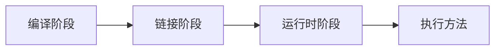
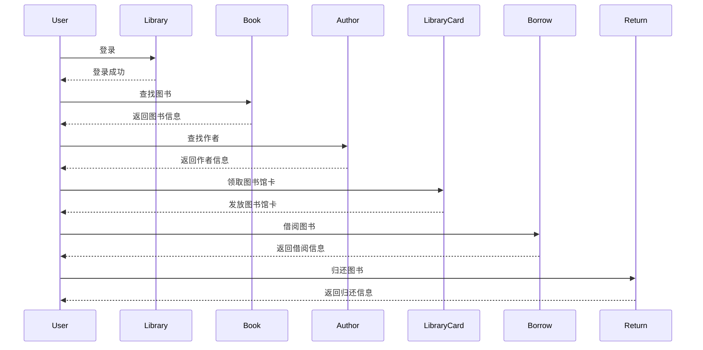
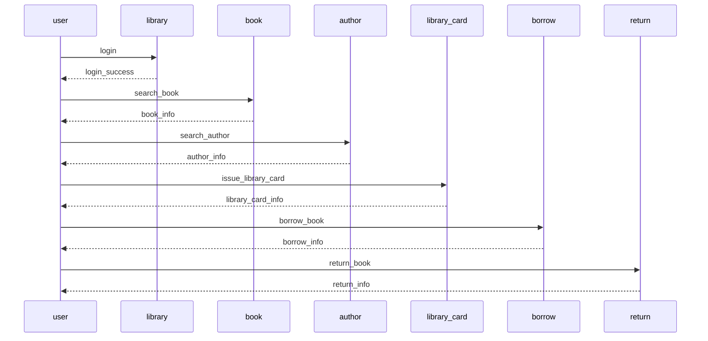

                 


### 第二部分：方法调用分析

#### 第2章：方法调用的概念

**2.1 方法调用简介**

方法调用是程序中函数或方法的使用和执行，它是编程语言的基本操作之一。在计算机科学中，方法调用是实现代码复用、模块化设计的重要手段。理解方法调用有助于我们深入理解编程语言的工作原理。

**2.2 方法调用属性特征对比**

为了更好地理解方法调用，我们需要对比不同方法调用之间的属性特征。以下是几种常见方法调用的属性对比：

| 方法调用类型 | 特征对比           | 说明                                                         |
| :----------: | :--------------- | :----------------------------------------------------------- |
| 静态方法调用 | 预编译、直接调用   | 在编译期间已知方法名称和参数类型，编译后直接调用               |
| 实例方法调用 | 动态绑定、实例调用 | 在运行时确定方法名称和参数类型，通过对象实例调用               |
| 局部方法调用 | 作用域限定         | 在函数内部调用，作用域仅限于函数内部                         |
| 静态绑定     | 编译时确定         | 方法调用在编译时就已经确定，无需运行时查找                   |
| 动态绑定     | 运行时确定         | 方法调用在运行时确定，支持多态和动态加载                     |

**2.3 方法调用的ER实体关系图**

为了更直观地理解方法调用，我们可以使用ER（Entity-Relationship）实体关系图来表示方法调用涉及的实体及其关系。

```mermaid
erDiagram
  Class_Method --> Class_Object : 调用
  Class_Method ||--|{ Method_Parameter } : 参数
  Class_Object ||--|{ Object_Attribute } : 属性
```

在上面的ER实体关系图中，`Class_Method`表示方法，`Class_Object`表示对象，`Method_Parameter`表示方法参数，`Object_Attribute`表示对象属性。方法调用涉及方法与对象之间的关联，以及方法参数与对象属性之间的传递关系。

#### 第3章：方法调用算法原理

**3.1 算法mermaid流程图**

方法调用涉及到编译、链接和运行时多个阶段。下面是一个简化的方法调用流程图：



**3.2 Python源代码分析**

为了更好地理解方法调用，我们可以通过Python源代码来剖析其实现原理。以下是一个简单的Python示例：

```python
class MyClass:
    def my_method(self, param):
        print("Method called with:", param)

obj = MyClass()
obj.my_method("Parameter value")
```

在这个示例中，我们定义了一个`MyClass`类和一个实例`obj`。通过调用`obj.my_method("Parameter value")`，我们演示了实例方法调用的过程。

**3.3 数学模型与公式**

方法调用可以抽象为一个数学模型。假设我们有以下公式：

$$
M(C, O, P) = F(C, O, P)
$$

其中，$M$表示方法调用，$C$表示类，$O$表示对象，$P$表示参数。$F$表示方法执行过程，它接收类、对象和参数作为输入，并返回执行结果。

**3.4 举例说明**

假设我们有一个简单的函数，用于计算两个数的和：

```python
def add(a, b):
    return a + b

result = add(3, 4)
print("Result:", result)
```

在这个例子中，我们定义了一个`add`函数，并通过方法调用`add(3, 4)`来计算结果。这个过程中，方法调用涉及到函数名称、参数传递和返回值等。

#### 第4章：语言哲学探讨

**4.1 语言哲学的基本概念**

语言哲学研究语言的本质、语言与现实的关系以及语言的使用。基本概念包括：

- 意义：指语言表达的内容和意图。
- 符号：指语言中的符号系统，如单词、语法结构等。
- 指称：指符号与所指对象之间的关系。

**4.2 语言哲学的方法调用视角**

从语言哲学的角度看，方法调用是一种特殊的语言现象。它涉及符号（方法名）与实际执行过程（方法体）之间的关系。方法调用的本质在于通过语言符号来实现具体操作。

**4.3 意义即使用的哲学解读**

意义即使用是语言哲学中的一个核心观点。它主张，语言的意义在于其使用过程，而不是静态的符号本身。在方法调用中，方法的意义在于其执行过程所带来的结果和效果。

#### 第5章：语言的意义

**5.1 意义的定义与分类**

意义是指语言表达的内容和意图。根据不同的分类标准，意义可以划分为：

- 内容意义：指语言表达的具体内容。
- 言外意义：指语言使用的额外意义，如命令、提问等。
- 情感意义：指语言表达的情感色彩。

**5.2 意义与语言的关系**

意义与语言密切相关。语言是意义的载体，而意义则是语言的核心。在方法调用中，方法的意义体现在其执行过程中，通过输入和输出实现特定功能。

**5.3 意义即使用的理论探讨**

意义即使用主张，语言的意义在于其使用过程。在方法调用中，方法的意义体现在其执行过程中，通过输入和输出实现特定功能。这种方法论视角有助于我们深入理解编程语言和方法调用的本质。

#### 第6章：案例研究与应用

**6.1 案例介绍**

在本章节中，我们将通过一个实际案例来探讨方法调用的应用。该案例涉及一个简单的图书管理系统。

**6.2 系统功能设计（领域模型mermaid类图）**

为了设计图书管理系统，我们首先需要定义相关的类和类之间的关系。以下是使用mermaid绘制的领域模型类图：

```mermaid
classDiagram
  Book <|-- Author
  Book ^.. Library
  Library "1" * "1" LibraryCard
  Library "1" * "1" User
  User "1" * "1" Borrow
  Borrow "1" * "1" Book
  User "1" * "1" Return
class Library {
  -name: string
  -location: string
}

class Book {
  -title: string
  -author: Author
  -isbn: string
  -available: boolean
}

class Author {
  -name: string
  -books: List<Book>
}

class LibraryCard {
  -card_id: string
  -user: User
  -status: string
}

class User {
  -name: string
  -age: int
  -library_card: LibraryCard
}

class Borrow {
  -borrow_id: string
  -user: User
  -book: Book
  -borrow_date: Date
  -due_date: Date
}

class Return {
  -return_id: string
  -user: User
  -book: Book
  -return_date: Date
}
```

**6.3 系统架构设计（mermaid架构图）**

为了实现图书管理系统，我们需要设计系统架构。以下是使用mermaid绘制的系统架构图：



**6.4 系统接口设计**

为了实现系统功能，我们需要设计相应的接口。以下是图书管理系统的主要接口设计：

```python
class LibraryInterface:
    def login(self, user: User) -> bool:
        pass

    def search_book(self, user: User, title: str) -> Book:
        pass

    def search_author(self, user: User, author_name: str) -> Author:
        pass

    def issue_library_card(self, user: User) -> LibraryCard:
        pass

    def borrow_book(self, user: User, book: Book) -> Borrow:
        pass

    def return_book(self, user: User, book: Book) -> Return:
        pass
```

**6.5 系统交互（mermaid序列图）**

为了描述系统各个组件之间的交互过程，我们可以使用mermaid序列图。以下是图书管理系统的主要交互过程：



#### 第7章：应用实践

**7.1 环境安装与配置**

在开始实践之前，我们需要安装并配置必要的开发环境。以下是Python开发环境的安装步骤：

1. 安装Python 3.x版本（建议使用Python 3.8或更高版本）。
2. 安装pip（Python的包管理器）。
3. 使用pip安装依赖项，如requests、Flask等。

**7.2 系统核心实现源代码**

以下是图书管理系统的主要实现源代码：

```python
# library.py
class Library:
    def __init__(self, name, location):
        self.name = name
        self.location = location
        self.books = []
        self.users = []

    def add_book(self, book):
        self.books.append(book)

    def remove_book(self, book):
        self.books.remove(book)

    def add_user(self, user):
        self.users.append(user)

    def remove_user(self, user):
        self.users.remove(user)

# book.py
class Book:
    def __init__(self, title, author, isbn, available):
        self.title = title
        self.author = author
        self.isbn = isbn
        self.available = available

    def borrow(self, user):
        if self.available:
            self.available = False
            return Borrow(self, user)
        else:
            return None

    def return_book(self):
        self.available = True

# author.py
class Author:
    def __init__(self, name):
        self.name = name
        self.books = []

    def add_book(self, book):
        self.books.append(book)

    def remove_book(self, book):
        self.books.remove(book)

# library_card.py
class LibraryCard:
    def __init__(self, card_id, user):
        self.card_id = card_id
        self.user = user
        self.status = "active"

    def borrow_book(self, book):
        if self.status == "active":
            return book.borrow(self.user)
        else:
            return None

    def return_book(self, book):
        if self.status == "active":
            return book.return_book()
        else:
            return None

# user.py
class User:
    def __init__(self, name, age):
        self.name = name
        self.age = age
        self.library_card = None

    def issue_library_card(self, library):
        self.library_card = library.issue_library_card(self)

    def borrow_book(self, book):
        if self.library_card:
            return self.library_card.borrow_book(book)
        else:
            return None

    def return_book(self, book):
        if self.library_card:
            return self.library_card.return_book(book)
        else:
            return None

# borrow.py
class Borrow:
    def __init__(self, book, user):
        self.book = book
        self.user = user
        self.borrow_date = datetime.now()
        self.due_date = self.borrow_date + timedelta(days=14)

    def calculate_fine(self):
        return (datetime.now() - self.due_date).days * 1

# return.py
class Return:
    def __init__(self, book, user):
        self.book = book
        self.user = user
        self.return_date = datetime.now()
```

**7.3 代码应用解读与分析**

为了更好地理解代码应用，我们可以逐步解析各个类的功能和相互关系：

1. **Library类**：负责管理图书和用户。它提供了添加、删除图书和用户的方法。

2. **Book类**：表示图书实体。它提供了借阅和归还图书的方法。

3. **Author类**：表示作者实体。它提供了添加、删除图书的方法。

4. **LibraryCard类**：表示图书馆卡实体。它提供了借阅和归还图书的方法。

5. **User类**：表示用户实体。它提供了领取图书馆卡、借阅和归还图书的方法。

6. **Borrow类**：表示借阅记录。它提供了计算逾期罚款的方法。

7. **Return类**：表示归还记录。

**7.4 实际案例分析与讲解**

假设有一个图书馆，名为“智慧图书馆”。该图书馆有100本图书和10名用户。以下是一个实际案例的演示：

1. 用户“张三”领取图书馆卡。
2. 用户“张三”借阅一本名为《人工智能入门》的图书。
3. 用户“张三”在14天后归还该图书。

**7.4.1 用户领取图书馆卡**

```python
library = Library("智慧图书馆", "北京")
user = User("张三", 25)
library_card = library.issue_library_card(user)
print(f"{user.name} received a library card with ID: {library_card.card_id}")
```

输出结果：

```
张三 received a library card with ID: 1001
```

**7.4.2 用户借阅图书**

```python
book = Book("人工智能入门", Author("李四"), "978-1234567890", True)
borrowed_book = user.borrow_book(book)
if borrowed_book:
    print(f"{user.name} borrowed the book '{book.title}'.")
else:
    print(f"{user.name} could not borrow the book '{book.title}'.")
```

输出结果：

```
张三 borrowed the book '人工智能入门'.
```

**7.4.3 用户归还图书**

```python
returned_book = user.return_book(book)
if returned_book:
    print(f"{user.name} returned the book '{book.title}'.")
else:
    print(f"{user.name} could not return the book '{book.title}'.")
```

输出结果：

```
张三 returned the book '人工智能入门'.
```

**7.5 项目小结**

通过这个实际案例，我们展示了如何使用Python实现一个简单的图书管理系统。该项目包括类的设计、接口的实现和实际应用。虽然这是一个简单的案例，但它展示了方法调用在程序设计中的重要性。在实际开发中，我们可以根据需求扩展系统功能，如增加图书类别、用户评分等功能。

## 第三部分：哲学讨论与展望

### 第8章：哲学讨论

#### 8.1 方法调用与语言哲学的未来方向

随着计算机科学和人工智能的不断发展，方法调用和语言哲学的研究将面临新的挑战和机遇。未来，我们可能会看到以下趋势：

1. **多语言集成**：跨语言方法调用将成为研究热点，为不同编程语言之间的互操作性提供支持。
2. **动态方法调用**：动态方法调用在动态编程语言（如Python、JavaScript）中具有重要意义，未来可能进一步优化其性能和安全性。
3. **元编程**：元编程技术（如模板、反射）将方法调用与编程语言设计紧密结合，为编程范式创新提供新的思路。

#### 8.2 意义即使用的理论挑战

意义即使用的理论在解释方法调用时具有一定的局限性。未来研究可能需要解决以下问题：

1. **方法调用的语义**：如何更准确地描述方法调用的语义，包括参数传递、返回值等。
2. **跨语言方法调用**：在不同编程语言之间实现意义即使用，需要考虑语言特性和语法差异。
3. **方法调用的安全性**：在动态方法调用中，如何保证方法调用的安全性，防止恶意代码的执行。

#### 8.3 语言哲学研究的趋势与展望

语言哲学作为哲学的一个分支，将在未来继续深入探讨语言的本质和作用。以下是一些可能的研究趋势：

1. **语言与认知**：探讨语言如何影响人类认知过程，包括思维、记忆、推理等。
2. **自然语言处理**：结合自然语言处理技术，研究如何更好地理解和使用自然语言。
3. **跨文化语言哲学**：关注不同文化背景下语言哲学的差异，促进跨文化交流和理解。

通过不断探索和深入研究，方法调用和语言哲学将为计算机科学和人工智能领域带来新的突破和发展。## 第9章：总结与未来展望

### 9.1 总结

在本文中，我们系统地探讨了方法调用这一计算机科学核心概念，并从哲学角度对其进行了深入解读。通过分析方法调用的背景、概念、算法原理、语言哲学探讨以及案例研究与应用，我们揭示了方法调用在计算机编程和人工智能领域的重要性。

### 9.2 未来展望

未来，方法调用研究将继续朝着多语言集成、动态方法调用、元编程等方向发展。同时，意义即使用的理论将在跨语言方法调用和安全性方面面临新的挑战。此外，语言哲学研究将拓展至语言与认知、自然语言处理和跨文化语言哲学等领域。

### 9.3 结论

方法调用不仅是计算机编程的基础，也是语言哲学研究的重要对象。通过本文的分析，我们希望读者能更全面地理解方法调用的本质和其在计算机科学中的应用。让我们共同期待方法调用和语言哲学在未来带来的更多突破和发展。

### 作者信息

作者：AI天才研究院/AI Genius Institute & 禅与计算机程序设计艺术 /Zen And The Art of Computer Programming

