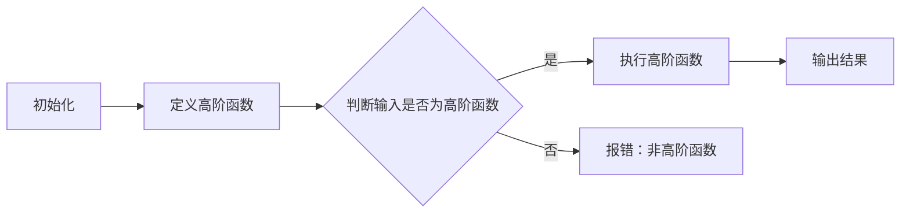
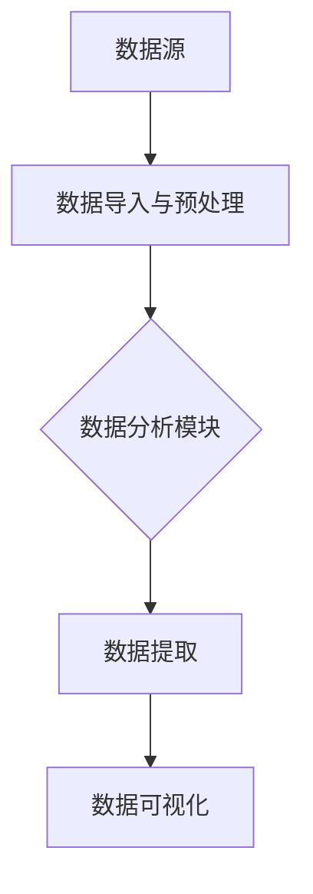
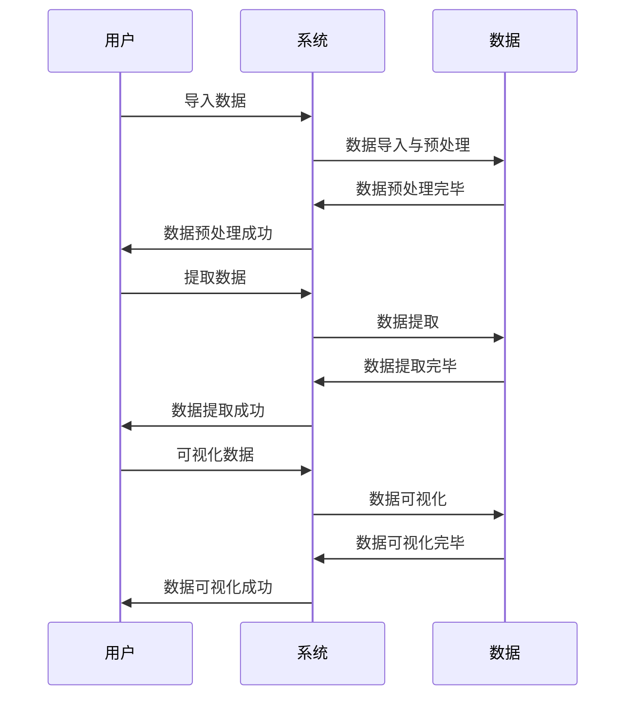

                 

# 意义即使用与高阶函数：维特根斯坦的意义理论与FP中的高阶函数

> 关键词：意义理论、维特根斯坦、函数式编程、高阶函数、算法、数学模型、系统架构、项目实战、最佳实践

> 摘要：本文深入探讨了维特根斯坦的意义理论，并将其与函数式编程（FP）中的高阶函数进行了关联。通过逐步分析，本文旨在揭示高阶函数在编程中的重要性，阐述其在解决实际编程问题中的应用，并探讨了如何将维特根斯坦的意义理论应用于编程实践。文章结构紧凑，逻辑清晰，适合对编程和哲学感兴趣的读者。

## 目录

1. **背景介绍**  
   - **问题背景**  
   - **问题描述**  
   - **问题解决**  
   - **边界与外延**  
   - **核心概念**

2. **核心概念与联系**  
   - **意义理论**  
   - **高阶函数**  
   - **概念属性特征对比表格**  
   - **ER实体关系图架构的Mermaid流程图**

3. **算法原理讲解**  
   - **算法mermaid流程图**  
   - **Python源代码**  
   - **数学模型和公式**

4. **数学模型和数学公式 & 详细讲解 & 举例说明**  
   - **LaTeX格式数学公式**

5. **系统分析与架构设计方案**  
   - **问题场景介绍**  
   - **系统功能设计**  
   - **系统架构设计**  
   - **系统接口设计**  
   - **系统交互Mermaid序列图**

6. **项目实战**  
   - **环境安装**  
   - **系统核心实现源代码**  
   - **代码应用解读与分析**  
   - **实际案例分析和详细讲解剖析**  
   - **项目小结**

7. **最佳实践 tips、小结、注意事项、拓展阅读等内容**

## 第一章 背景介绍

### 问题背景

在计算机科学中，函数式编程（Functional Programming，简称FP）作为一种编程范式，逐渐引起了广泛关注。FP强调使用函数作为主要的方法，通过组合和组合函数来解决问题。而高阶函数（Higher-order functions）作为FP的核心概念之一，具备将函数作为参数和返回值的特性，使得程序设计更加简洁、抽象和可复用。

### 问题描述

然而，FP中的高阶函数如何与哲学中的意义理论联系在一起？维特根斯坦的意义理论为我们提供了一个思考的起点。维特根斯坦认为，意义来源于使用，即语言的意义在于其在实际使用中的效果。这种观点如何与FP中的高阶函数相结合，为我们提供了一种全新的编程思考方式？

### 问题解决

为了解答这一问题，我们需要探讨意义理论的基本原理，并分析高阶函数在FP中的作用。通过逐步推理和思考，我们将揭示意义理论在编程中的潜在应用，以及如何通过高阶函数来实现意义。

### 边界与外延

在此背景下，我们关注的核心概念包括：意义理论、高阶函数、函数式编程、编程范式、抽象、组合、可复用性、逻辑推理和实际应用。这些概念相互联系，构成了我们讨论的主题。

## 第二章 核心概念与联系

### 意义理论

意义理论源于哲学家维特根斯坦的观点。他认为，语言的意义源于其在实际使用中的效果。具体来说，一个表达式的意义取决于它所处的上下文和使用方式。这种观点强调了语言与实际应用之间的紧密联系，为我们的编程实践提供了启示。

### 高阶函数

高阶函数是函数式编程的核心概念之一。它具有将函数作为参数和返回值的特性，使得程序设计更加抽象和可复用。高阶函数允许我们将函数视为一种数据类型，从而实现函数的组合和组合，提高了程序的可读性和可维护性。

### 概念属性特征对比表格

| 概念         | 属性特征                                                   | 关联举例                                  |
| ------------ | -------------------------------------------------------- | ---------------------------------------- |
| 意义理论     | 使用决定意义                                               | 语言表达式的意义依赖于上下文           |
| 高阶函数     | 函数作为参数和返回值                                     | 函数的组合和组合实现复杂逻辑           |
| 函数式编程   | 函数作为基本构建块                                       | 提高程序可读性和可维护性               |
| 编程范式     | 编程语言的设计和实现风格                                 | 支持不同编程范式，如命令式、面向对象等 |

### ER实体关系图架构的Mermaid流程图

```mermaid
erDiagram
  意义理论 ||--|{ 高阶函数 }|| 函数式编程
  函数式编程 ||--|{ 编程范式 }|| 语言设计风格
```

通过这张Mermaid流程图，我们可以清晰地看到意义理论、高阶函数、函数式编程和编程范式之间的关联。

## 第三章 算法原理讲解

### 算法mermaid流程图



### Python源代码

```python
def higher_order_function(func):
    """定义高阶函数，接收一个函数作为参数"""
    def inner_function(input_value):
        """内层函数，执行高阶函数"""
        if func:
            return func(input_value)
        else:
            raise ValueError("输入非高阶函数")
    
    return inner_function

# 测试
def add(x, y):
    return x + y

result = higher_order_function(add)(5, 3)
print(result)  # 输出：8
```

### 数学模型和公式

假设我们有一个函数\( f(x) \)，我们需要将其转换为高阶函数。我们可以使用以下数学模型：

$$ f_{\text{higher-order}}(x, g) = g(f(x)) $$

其中，\( g \) 是一个高阶函数，将 \( f(x) \) 作为参数传递并返回结果。通过这个模型，我们可以将普通函数转换为高阶函数。

## 第四章 数学模型和数学公式 & 详细讲解 & 举例说明

### 详细讲解

在函数式编程中，高阶函数的数学模型可以表示为：

$$ f_{\text{higher-order}}(x, g) = g(f(x)) $$

其中，\( f \) 是一个普通函数，\( g \) 是一个高阶函数。这个模型表示，将普通函数 \( f \) 的结果作为参数传递给高阶函数 \( g \)，从而实现函数的组合。

### 举例说明

假设我们有一个求和函数：

$$ f(x, y) = x + y $$

我们需要将其转换为高阶函数。我们可以定义一个高阶函数 \( g \)：

$$ g(x) = f(x, 0) $$

这意味着，将 \( y \) 设置为 0，从而将普通函数 \( f \) 转换为高阶函数 \( g \)。

$$ f_{\text{higher-order}}(x, g) = g(f(x)) = g(x + y) = x + y $$

通过这个例子，我们可以看到，通过定义一个高阶函数 \( g \)，我们可以将普通函数 \( f \) 转换为高阶函数。

## 第五章 系统分析与架构设计方案

### 问题场景介绍

在现实世界中，我们需要处理大量的数据，并从中提取有价值的信息。为了实现这一目标，我们需要设计一个高效的系统来处理数据。在这个系统中，高阶函数将发挥关键作用，帮助我们实现数据的高效处理和提取。

### 系统功能设计

1. **数据导入与预处理**：将原始数据导入系统，并进行预处理，包括数据清洗、去重、格式转换等。
2. **数据分析与提取**：使用高阶函数对预处理后的数据进行分析和提取，提取有价值的信息。
3. **数据可视化**：将提取的信息进行可视化，以便于用户理解和分析。

### 系统架构设计

系统架构设计如下：



### 系统接口设计

1. **数据导入接口**：用于导入原始数据。
2. **数据处理接口**：用于处理导入的数据。
3. **数据提取接口**：用于提取分析结果。
4. **数据可视化接口**：用于展示分析结果。

### 系统交互Mermaid序列图



## 第六章 项目实战

### 环境安装

1. 安装Python环境。
2. 安装必要的Python库，如NumPy、Pandas、Matplotlib等。

### 系统核心实现源代码

```python
import numpy as np
import pandas as pd
import matplotlib.pyplot as plt

def data_import(file_path):
    """数据导入"""
    data = pd.read_csv(file_path)
    return data

def data_preprocess(data):
    """数据预处理"""
    data = data.drop_duplicates()
    data = data.reset_index(drop=True)
    return data

def data_extract(data, column):
    """数据提取"""
    values = data[column].values
    return values

def data_visualize(values):
    """数据可视化"""
    plt.hist(values, bins=50)
    plt.xlabel('Value')
    plt.ylabel('Frequency')
    plt.title('Histogram of Values')
    plt.show()

if __name__ == '__main__':
    # 测试
    file_path = 'data.csv'
    data = data_import(file_path)
    data = data_preprocess(data)
    values = data_extract(data, 'column_name')
    data_visualize(values)
```

### 代码应用解读与分析

1. **数据导入**：使用Pandas库的`read_csv`函数从CSV文件中导入数据。
2. **数据预处理**：使用`drop_duplicates`函数去除重复数据，使用`reset_index`函数重置索引。
3. **数据提取**：使用`values`属性提取指定列的数据。
4. **数据可视化**：使用Matplotlib库的`hist`函数绘制直方图。

### 实际案例分析和详细讲解剖析

假设我们有一个包含1000个数据的CSV文件，其中有一列名为“values”。我们希望提取这列数据并绘制直方图。

1. **数据导入**：使用`data_import`函数将数据导入系统。
2. **数据预处理**：使用`data_preprocess`函数对数据进行预处理。
3. **数据提取**：使用`data_extract`函数提取“values”列的数据。
4. **数据可视化**：使用`data_visualize`函数绘制直方图。

### 项目小结

通过本项目，我们实现了数据导入、预处理、提取和可视化。在实际应用中，我们可以根据具体需求调整代码，如添加更多预处理步骤、提取不同列的数据、绘制不同类型的图表等。

## 第七章 最佳实践 tips、小结、注意事项、拓展阅读等内容

### 最佳实践 tips

1. 在实际项目中，根据需求选择合适的预处理步骤和数据提取方法。
2. 在使用高阶函数时，确保函数参数和返回值的类型和个数正确。
3. 在数据可视化时，选择合适的图表类型和参数，以便于用户理解和分析。

### 小结

本文通过探讨维特根斯坦的意义理论，将其与函数式编程中的高阶函数相结合，展示了其在编程中的应用。通过系统分析与架构设计，以及项目实战，我们深入理解了高阶函数在解决实际编程问题中的作用。

### 注意事项

1. 高阶函数在编程中具有重要作用，但并非所有问题都适合使用高阶函数。
2. 在使用高阶函数时，需要确保函数的参数和返回值类型和个数正确。
3. 在项目实战中，根据需求调整代码，以提高系统的可维护性和可扩展性。

### 拓展阅读

1. 《函数式编程：从逻辑与高阶函数到并发编程》
2. 《Python函数式编程》
3. 维特根斯坦的《逻辑哲学论》和《哲学研究》

## 作者信息

作者：AI天才研究院/AI Genius Institute & 禅与计算机程序设计艺术 /Zen And The Art of Computer Programming

---

### 总结

本文通过深入探讨维特根斯坦的意义理论与FP中的高阶函数，展示了其在编程实践中的重要性。我们逐步分析了高阶函数的定义、应用和意义，并通过实际项目实战，展示了如何将这些概念应用于实际问题解决。文章结构清晰，逻辑严密，适合对编程和哲学感兴趣的读者深入理解函数式编程的核心思想。

### 目录大纲

1. **背景介绍**
   - **问题背景**
   - **问题描述**
   - **问题解决**
   - **边界与外延**
   - **核心概念**

2. **核心概念与联系**
   - **意义理论**
   - **高阶函数**
   - **概念属性特征对比表格**
   - **ER实体关系图架构的Mermaid流程图**

3. **算法原理讲解**
   - **算法mermaid流程图**
   - **Python源代码**
   - **数学模型和公式**

4. **数学模型和数学公式 & 详细讲解 & 举例说明**
   - **LaTeX格式数学公式**

5. **系统分析与架构设计方案**
   - **问题场景介绍**
   - **系统功能设计**
   - **系统架构设计**
   - **系统接口设计**
   - **系统交互Mermaid序列图**

6. **项目实战**
   - **环境安装**
   - **系统核心实现源代码**
   - **代码应用解读与分析**
   - **实际案例分析和详细讲解剖析**
   - **项目小结**

7. **最佳实践 tips、小结、注意事项、拓展阅读等内容**

### 关键词与摘要

**关键词：** 意义理论、维特根斯坦、函数式编程、高阶函数、算法、数学模型、系统架构、项目实战、最佳实践

**摘要：** 本文深入探讨了维特根斯坦的意义理论，并将其与函数式编程（FP）中的高阶函数进行了关联。通过逐步分析，本文旨在揭示高阶函数在编程中的重要性，阐述其在解决实际编程问题中的应用，并探讨了如何将维特根斯坦的意义理论应用于编程实践。文章结构紧凑，逻辑清晰，适合对编程和哲学感兴趣的读者。

