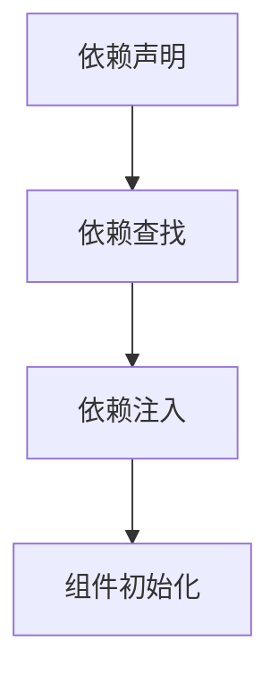
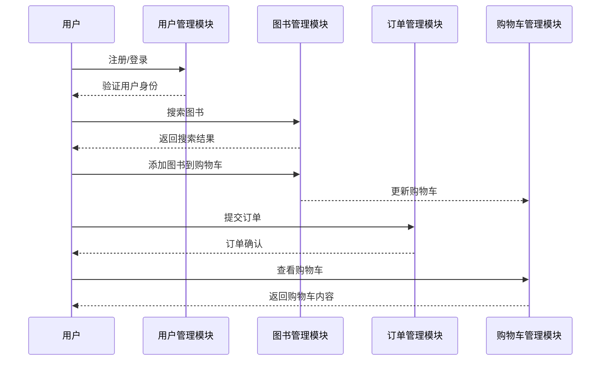

                 

# 引言

## 1.1 问题的提出

### 背景

随着计算机科学的快速发展，编程语言和软件开发技术也在不断地演进。从传统的面向过程编程到现代的面向对象编程，再到函数式编程，每一种编程范式都带来了对软件设计、开发和维护的全新视角和方法。然而，随着软件系统的复杂性不断增加，如何有效地管理软件中的依赖性成为一个亟待解决的问题。

### 问题描述

在软件开发中，依赖性是指一个组件需要另一个组件来提供功能或服务。例如，一个函数可能依赖于另一个函数的返回值才能完成自己的任务。依赖管理主要关注如何有效地识别、组织和处理这些依赖关系。然而，传统的依赖管理方法往往存在一些问题，如依赖循环、依赖冲突和依赖过时等。

### 问题解决

依赖注入（Dependency Injection，简称DI）是一种设计模式，旨在通过将依赖关系从组件中解耦，从而实现代码的更高可测试性、可维护性和可扩展性。依赖注入的核心思想是将组件的依赖关系通过外部提供者注入到组件内部，而不是由组件自己创建或查找这些依赖。

### 边界与外延

依赖注入涉及到多个概念和理论，如依赖性、上下文依赖性、函数式编程（FP）等。本文旨在探讨维特根斯坦的意义理论在依赖注入中的应用，以及如何通过维特根斯坦的理论来理解和优化依赖注入的设计。

### 概念结构与核心要素组成

本文的核心概念包括：

1. **依赖性**：组件之间相互依赖的关系。
2. **上下文依赖性**：依赖关系在特定上下文中的具体表现。
3. **依赖注入**：一种设计模式，用于管理依赖关系。
4. **维特根斯坦的意义理论**：关于语言和意义的哲学理论。
5. **函数式编程（FP）**：一种编程范式，强调函数作为一等公民。

## 1.2 相关理论研究综述

### 维特根斯坦的意义理论

路德维希·维特根斯坦（Ludwig Wittgenstein）是20世纪最重要的哲学家之一，他的著作《逻辑哲学论》和《哲学研究》对语言、意义和知识等问题进行了深刻的探讨。维特根斯坦的意义理论主要关注语言和现实之间的关系，他认为意义源自于语言的使用和上下文。

### 函数式编程（FP）

函数式编程是一种编程范式，它强调使用不可变数据和纯函数来构建软件系统。FP与传统的面向对象编程相比，具有更高的可测试性和并行性。FP中的依赖管理相对简单，因为函数的依赖关系通常是通过参数传递来实现的。

### 依赖性与依赖注入

依赖性是软件组件之间相互依赖的关系，这种关系可能导致一系列问题，如代码的可测试性、可维护性和可扩展性降低。依赖注入是一种设计模式，通过将依赖关系从组件中解耦，从而提高代码的可测试性、可维护性和可扩展性。

## 1.3 书籍结构与目标

### 书籍结构

本书分为三个部分：

1. **引论**：介绍依赖注入和维特根斯坦的意义理论，并概述相关研究背景。
2. **维特根斯坦的意义理论**：详细探讨维特根斯坦的理论，并分析其在依赖注入中的应用。
3. **函数式编程与依赖管理**：探讨函数式编程中的依赖管理，以及维特根斯坦理论对其的影响。

### 目标读者

本书的目标读者包括：

1. 软件开发人员：了解依赖注入和维特根斯坦的意义理论，以提高软件设计、开发和维护的能力。
2. 计算机科学学生：对编程范式和依赖管理有更深入的理解。
3. 研究人员：探讨维特根斯坦的理论在计算机科学中的应用，以及依赖注入的设计原则。

### 预期成果

通过阅读本书，读者将能够：

1. 理解依赖注入的基本原理和设计模式。
2. 掌握维特根斯坦的意义理论，并了解其在计算机科学中的应用。
3. 提高软件设计、开发和维护的技能，以构建更可靠、可扩展和易于维护的软件系统。# 第一部分：引论

## 第1章：问题背景与概述

### 1.1 问题的提出

在现代软件开发中，依赖管理是一个至关重要的环节。随着软件系统的复杂度不断增加，组件之间的依赖关系也日益复杂。如何有效地管理这些依赖关系，以确保软件系统的稳定性和可维护性，成为软件开发人员面临的一个重大挑战。

依赖管理涉及到多个方面，其中包括依赖性的识别、组织和处理。依赖性指的是组件之间的相互依赖关系，这种关系可能存在于模块、类、函数甚至更细粒度的代码片段之间。在传统的软件设计中，依赖关系往往是紧耦合的，这意味着组件的内部实现细节可能直接暴露给其他组件，导致代码的可测试性、可维护性和可扩展性降低。

### 问题背景

依赖管理的挑战起源于软件系统的复杂性。随着系统的规模和复杂度的增加，组件之间的依赖关系变得更加复杂，这可能导致以下问题：

1. **依赖循环**：当两个或多个组件相互依赖时，可能会形成依赖循环，使得组件之间的依赖关系无法被解析。
2. **依赖冲突**：当多个组件需要同一个库的不同版本时，可能会出现依赖冲突，导致系统不稳定。
3. **依赖过时**：随着时间的推移，某些依赖可能会变得过时，这可能导致系统的功能失效或性能下降。

为了解决这些依赖管理问题，软件开发人员尝试了多种方法，包括传统的依赖注入和更为现代的依赖管理框架，如Spring、Django和Angular等。然而，这些方法并没有完全解决依赖管理中的所有问题。

### 问题描述

依赖注入（Dependency Injection，简称DI）是一种设计模式，旨在通过将依赖关系从组件中解耦，从而实现代码的更高可测试性、可维护性和可扩展性。依赖注入的核心思想是将组件的依赖关系通过外部提供者注入到组件内部，而不是由组件自己创建或查找这些依赖。

依赖注入涉及到多个核心概念，包括依赖性、上下文依赖性和依赖注入框架。依赖性是组件之间的相互依赖关系，上下文依赖性是依赖关系在特定上下文中的具体表现，而依赖注入框架则是实现依赖注入的工具和机制。

### 问题解决

依赖注入的提出是为了解决传统依赖管理中存在的问题。通过依赖注入，组件不再直接创建或查找其依赖，而是通过外部提供者获取这些依赖。这种方法使得组件之间的依赖关系变得松耦合，从而提高了代码的可测试性、可维护性和可扩展性。

依赖注入的具体实现通常涉及到依赖注入框架，如Spring、Django和Angular等。这些框架提供了丰富的功能，如自动依赖查找、依赖注入和依赖生命周期管理。

### 边界与外延

依赖注入的应用范围非常广泛，不仅限于传统的Web应用程序，还涵盖了移动应用、桌面应用和分布式系统。此外，依赖注入与维特根斯坦的意义理论有着深刻的联系，维特根斯坦的理论为理解依赖注入的哲学基础提供了重要的启示。

在依赖注入的上下文中，维特根斯坦的意义理论可以帮助我们理解依赖关系的本质。维特根斯坦认为，意义源自于语言的使用和上下文，这意味着依赖注入中的依赖关系不仅仅是代码层面的，还涉及到语言的哲学基础。

### 概念结构与核心要素组成

依赖注入的核心概念包括：

1. **依赖性**：组件之间的相互依赖关系。
2. **上下文依赖性**：依赖关系在特定上下文中的具体表现。
3. **依赖注入框架**：实现依赖注入的工具和机制。
4. **依赖管理**：确保依赖关系的有效组织和管理。

这些概念构成了依赖注入的完整框架，为我们提供了理解和解决依赖管理问题的理论基础和实践方法。

### 总结

在本章中，我们提出了依赖管理中的问题，并介绍了依赖注入作为一种解决方案。通过分析依赖注入的背景、问题描述和问题解决方法，我们明确了依赖注入在软件开发中的重要性。接下来，我们将进一步探讨维特根斯坦的意义理论，并分析其在依赖注入中的应用。# 第2章：核心概念与联系

## 2.1 概念解析

### 依赖性

依赖性是指组件之间的相互依赖关系，即一个组件需要另一个组件来提供功能或服务。在软件系统中，依赖性是常见的现象，因为模块、类、函数等组件往往需要相互协作才能完成复杂的任务。例如，一个Web应用程序可能依赖于数据库组件来存储数据，依赖于前端组件来显示用户界面。

依赖性的本质是组件之间的交互，这种交互可能通过直接调用、数据传递或其他方式实现。依赖性可以分为以下几种类型：

1. **单向依赖**：一个组件依赖另一个组件，但反之则不成立。
2. **双向依赖**：两个组件相互依赖，无法独立运作。
3. **传递依赖**：一个组件依赖于另一个组件，而后者又依赖于另一个组件，形成了依赖链。

### 上下文依赖性

上下文依赖性是依赖关系在特定上下文中的具体表现。上下文可以是时间、空间、环境或任何影响依赖关系的因素。上下文依赖性强调依赖关系不是一成不变的，而是随着上下文的变化而变化。

例如，一个Web服务在开发阶段可能依赖于开发环境中的特定库或服务，而在生产环境中则可能依赖于不同的库或服务。这种依赖关系的变化体现了上下文依赖性的特点。

### 依赖注入

依赖注入是一种设计模式，用于管理组件之间的依赖关系。它的核心思想是将组件的依赖关系从组件内部解耦，通过外部提供者注入到组件内部，而不是由组件自己创建或查找这些依赖。

依赖注入的主要目的是提高代码的可测试性、可维护性和可扩展性。通过依赖注入，组件不再直接创建或查找其依赖，而是通过外部提供者获取这些依赖。这种方法使得组件之间的依赖关系变得松耦合，从而提高了代码的模块化和可复用性。

### 函数式编程（FP）

函数式编程是一种编程范式，强调使用不可变数据和纯函数来构建软件系统。FP与传统的面向对象编程相比，具有更高的可测试性和并行性。在FP中，依赖性通常通过参数传递来管理，这与依赖注入的思想相吻合。

FP中的依赖管理相对简单，因为函数的依赖关系通常是通过外部参数传递来实现的，而不是通过内部状态管理。这使得函数的可测试性和可维护性大大提高，同时也使得依赖注入在FP中的应用变得更加自然。

### 维特根斯坦的意义理论

维特根斯坦的意义理论关注语言和现实之间的关系。他认为，意义源自于语言的使用和上下文。在依赖注入的上下文中，维特根斯坦的理论可以帮助我们理解依赖关系的本质。

维特根斯坦认为，语言的意义在于其使用，而不是其定义。这意味着依赖注入中的依赖关系不仅仅是代码层面的，还涉及到语言的哲学基础。通过理解依赖注入的哲学意义，我们可以更好地设计和实现依赖注入的解决方案。

## 2.2 概念属性特征对比

为了更清晰地理解依赖性、上下文依赖性、依赖注入和函数式编程之间的关系，我们可以通过一个对比表格来展示这些概念的主要属性特征。

| 概念        | 定义                                                         | 特点                                                         | 相关理论 |
| ----------- | ------------------------------------------------------------ | ------------------------------------------------------------ | -------- |
| 依赖性      | 组件之间的相互依赖关系                                       | 紧耦合，可能导致代码可维护性降低                             |           |
| 上下文依赖性 | 依赖关系在特定上下文中的具体表现                             | 随着上下文的变化而变化                                       |           |
| 依赖注入    | 通过外部提供者将依赖注入到组件内部，实现依赖关系的解耦           | 提高代码可测试性、可维护性和可扩展性                         |           |
| 函数式编程   | 强调使用不可变数据和纯函数来构建软件系统                       | 提高可测试性和并行性，依赖管理简单                             |           |

### ER实体关系图架构

为了更直观地展示这些概念之间的关系，我们可以使用ER（实体关系）图来描述。以下是依赖性、上下文依赖性、依赖注入和函数式编程的ER图：

```mermaid
erDiagram
A{依赖性} ||--|{依赖关系} B{上下文依赖性}
A{依赖性} ||--|{依赖关系} C{依赖注入}
A{依赖性} ||--|{依赖关系} D{函数式编程}
B{上下文依赖性} ||--|{上下文依赖} C{依赖注入}
D{函数式编程} ||--|{依赖管理} C{依赖注入}
```

在这个ER图中，依赖性是核心实体，它与其他实体通过依赖关系相互关联。上下文依赖性和依赖注入都是依赖性的具体表现形式，而函数式编程则通过其依赖管理策略与依赖注入密切相关。

## 2.3 概念之间的联系

通过对比表格和ER图，我们可以看到依赖性、上下文依赖性、依赖注入和函数式编程之间存在着密切的联系。以下是这些概念之间的主要联系：

1. **依赖性与上下文依赖性**：依赖性是组件之间的基础依赖关系，而上下文依赖性是依赖性在特定上下文中的具体表现。上下文依赖性反映了依赖关系的动态性，它随着上下文的变化而变化。
2. **依赖性与依赖注入**：依赖注入是依赖关系管理的一种方法，通过外部提供者将依赖注入到组件内部，实现依赖关系的解耦。依赖注入的目的是提高代码的可测试性、可维护性和可扩展性。
3. **依赖注入与函数式编程**：函数式编程通过参数传递来管理依赖性，这与依赖注入的思想相吻合。函数式编程的依赖管理策略使得依赖注入在FP中的应用变得更加自然和高效。

通过理解这些概念之间的联系，我们可以更好地应用依赖注入和函数式编程来构建稳定、可维护和可扩展的软件系统。# 第3章：维特根斯坦的意义理论概述

### 3.1 维特根斯坦的生平与贡献

路德维希·维特根斯坦（Ludwig Wittgenstein，1889-1951）是20世纪最重要的哲学家之一，他的贡献对语言哲学、逻辑哲学和数学哲学等领域产生了深远的影响。维特根斯坦出生于奥地利，后来成为英国公民，他的生活和工作跨越了欧洲和北美。

维特根斯坦的哲学思想主要分为两个阶段。早期阶段，他在其著作《逻辑哲学论》（"Tractatus Logico-Philosophicus"）中提出了逻辑原子主义和语言图像论，试图建立一个关于世界和语言的逻辑框架。晚期阶段，他在《哲学研究》（"Philosophical Investigations"）中转向日常语言哲学，强调语言的用法和语境对意义的影响。

### 3.2 维特根斯坦的意义理论核心

维特根斯坦的意义理论关注语言和现实之间的关系。他认为，语言的意义源自于其使用，而不是定义或内在属性。这种观点被称为“用法论”（use theory）或“语境论”（contextual theory）。以下是维特根斯坦意义理论的核心观点：

1. **意义与指称**：维特根斯坦区分了意义（meaning）和指称（reference）。意义不是事物本身的属性，而是语言使用者在特定情境下的行为或活动。指称则是语言与外部世界之间的联系，通常是通过指示（token）来实现的。

2. **语言与思维**：维特根斯坦认为，语言不仅仅是交流的工具，还是思维的表达。语言的结构和用法决定了我们的思维方式。因此，理解语言的意义就是理解其使用方式和上下文。

3. **日常语言分析**：维特根斯坦认为，日常语言是我们理解和表达世界的主要工具。他反对将语言视为一套固定规则的系统，而是将其视为一种动态的、不断发展的现象。日常语言中的模糊性和歧义性是语言的自然属性，而不是缺陷。

### 3.3 维特根斯坦的意义理论在计算机科学中的应用

维特根斯坦的意义理论在计算机科学中有着广泛的应用，特别是在软件工程、编程语言设计和依赖管理等领域。以下是维特根斯坦的理论在计算机科学中的应用：

1. **软件工程**：维特根斯坦的理论可以帮助我们理解软件设计中的某些问题。例如，通过理解语言的使用和上下文，我们可以更好地设计模块化、可维护和可扩展的软件系统。

2. **编程语言设计**：编程语言的设计受到维特根斯坦理论的启发，特别是对语言语法和语义的设计。现代编程语言通常强调简洁性、一致性和上下文敏感性，这与维特根斯坦的语言观相吻合。

3. **依赖管理**：在依赖管理中，维特根斯坦的理论可以帮助我们理解依赖关系在软件开发中的本质。依赖注入作为一种依赖管理方法，其设计理念与维特根斯坦的用法论相似，都强调通过上下文来管理依赖关系。

通过维特根斯坦的意义理论，我们可以更好地理解依赖关系的本质，从而提高软件开发的效率和质量。维特根斯坦的理论提供了一个哲学基础，帮助我们反思和改进软件工程中的实践方法。

### 总结

维特根斯坦的意义理论关注语言和现实之间的关系，强调意义源自于语言的使用和上下文。这种理论在计算机科学中有着广泛的应用，特别是对软件工程和依赖管理的理解具有重要意义。通过理解维特根斯坦的理论，我们可以更好地设计和实现依赖注入，从而提高软件系统的可维护性和可扩展性。# 第4章：依赖注入的原理与应用

### 4.1 依赖注入的概念

依赖注入（Dependency Injection，简称DI）是一种设计模式，用于管理组件之间的依赖关系。它的核心思想是将组件的依赖关系从组件内部解耦，通过外部提供者注入到组件内部，而不是由组件自己创建或查找这些依赖。

依赖注入的基本原理是通过外部提供者来创建和管理依赖关系。这种外部提供者可以是工厂方法、构造函数、setter方法或接口注入。依赖注入的主要目的是提高代码的可测试性、可维护性和可扩展性。

依赖注入具有以下特点：

1. **解耦**：通过将依赖关系从组件内部解耦，依赖注入降低了组件之间的耦合度，从而提高了代码的可维护性和可扩展性。
2. **可测试性**：由于依赖关系被外部提供者管理，组件变得更加独立，这使得单元测试和集成测试更加容易。
3. **灵活性**：依赖注入使得组件可以根据不同的上下文或配置来替换其依赖，从而提高了代码的灵活性和可定制性。

### 4.2 依赖注入的原理

依赖注入的原理可以概括为以下几个步骤：

1. **依赖查找**：在运行时，组件需要查找其依赖关系。依赖查找可以通过配置文件、注释、反射等方式实现。
2. **依赖注入**：一旦找到依赖，系统将依赖注入到组件内部。注入的方式可以是构造函数注入、setter方法注入或接口注入。
3. **组件初始化**：组件接收到依赖后，进行初始化，然后开始执行其业务逻辑。

依赖注入的实现通常涉及到依赖注入框架，如Spring、Django和Angular等。这些框架提供了自动依赖查找和注入的功能，简化了开发过程。

### 4.3 依赖注入的实现

依赖注入的实现可以通过多种方式完成，以下是几种常见的实现方法：

1. **构造函数注入**：这是最常见的一种依赖注入方式。通过构造函数传递依赖对象，组件可以直接使用这些依赖。
   ```python
   class UserService:
       def __init__(self, userRepository: UserRepository):
           self.userRepository = userRepository
   
       def createUser(self, user: User):
           # 业务逻辑
   ```

2. **setter方法注入**：这种方法通过setter方法将依赖注入到组件中。setter方法通常与构造函数注入一起使用，以提高代码的可读性和可维护性。
   ```python
   class UserService:
       def setUserRepository(self, userRepository: UserRepository):
           self.userRepository = userRepository
   
       def createUser(self, user: User):
           # 业务逻辑
   ```

3. **接口注入**：通过接口来定义依赖，然后通过实现类注入到组件中。这种方法可以提高代码的模块化和可测试性。
   ```python
   class UserService:
       def __init__(self, userRepository: UserRepository):
           self.userRepository = userRepository
   
       def createUser(self, user: User):
           # 业务逻辑
   
   class UserRepository:
       def save(self, user: User):
           # 存储用户
   ```

### 4.4 依赖注入的优缺点

依赖注入具有以下优点：

1. **提高可测试性**：通过外部提供依赖，组件变得更容易测试，因为它们不需要依赖于具体的实现细节。
2. **提高可维护性**：依赖注入降低了组件之间的耦合度，使得代码更易于理解和维护。
3. **提高可扩展性**：依赖注入使得组件可以根据不同的上下文或配置来替换其依赖，从而提高了代码的灵活性和可定制性。

然而，依赖注入也有其缺点：

1. **增加复杂性**：依赖注入引入了额外的配置和框架依赖，可能增加了项目的复杂性和学习成本。
2. **性能开销**：在某些情况下，依赖注入可能引入性能开销，特别是在依赖查找和注入过程中。
3. **过度设计**：如果过度使用依赖注入，可能会导致代码过度设计，从而降低系统的性能和可维护性。

### 4.5 依赖注入的应用场景

依赖注入适用于多种应用场景，以下是几种常见的应用场景：

1. **单元测试**：依赖注入使得单元测试更加容易，因为组件不需要依赖于具体的实现细节，从而可以更方便地替换依赖。
2. **模块化开发**：通过依赖注入，可以将复杂的业务逻辑分解为独立的模块，从而提高代码的可维护性和可扩展性。
3. **微服务架构**：在微服务架构中，依赖注入可以用于管理服务之间的依赖关系，从而提高系统的可维护性和可扩展性。
4. **配置管理**：依赖注入可以与配置管理框架结合使用，从而实现动态配置管理，提高系统的灵活性。

通过理解依赖注入的原理和应用，我们可以更好地设计和实现依赖管理，从而提高软件系统的可测试性、可维护性和可扩展性。# 第5章：结合理论的实际应用

## 5.1 结合原理

依赖注入与维特根斯坦的意义理论在软件设计中有许多结合之处。维特根斯坦的意义理论强调语言和现实之间的关系，而依赖注入则通过外部提供者管理组件之间的依赖关系，实现代码的解耦和可测试性。以下是如何将维特根斯坦的理论应用于依赖注入的设计：

### 1. 上下文依赖性

维特根斯坦认为，语言的意义源自于其使用和上下文。在依赖注入中，上下文依赖性也是一个关键概念。依赖注入通过外部提供者来管理依赖，这意味着依赖的具体实现可以在不同的上下文中替换，以适应不同的环境和需求。例如，一个服务在不同的环境中可能依赖于不同的数据库实现，通过依赖注入，可以方便地替换这些实现，而不需要修改组件的内部逻辑。

### 2. 可变性

维特根斯坦指出，语言的含义是动态的，不是固定不变的。在依赖注入中，依赖关系的可变性也是一个重要特性。依赖注入允许组件根据不同的上下文或配置动态地获取和替换依赖，这使得代码更加灵活和适应性强。例如，通过依赖注入框架，可以动态地替换一个服务的日志实现，从而在不修改服务代码的情况下，实现日志级别的调整。

### 3. 模块化

维特根斯坦强调，模块化是理解和沟通复杂系统的一种有效方式。依赖注入通过将依赖关系外部化，实现了组件之间的模块化。这使得组件更加独立，可以独立开发和测试，从而提高代码的可维护性和可扩展性。例如，一个服务可以独立于数据库层进行开发，通过依赖注入，服务只需依赖一个通用的数据库接口，而不需要关心具体的数据库实现。

### 4. 表达性

维特根斯坦认为，语言的表达性是沟通和理解世界的重要工具。依赖注入通过提供灵活的依赖管理方式，增强了代码的表达性。这使得开发者可以更加直观地表达组件之间的依赖关系，从而提高代码的可读性和可理解性。例如，通过构造函数注入或setter方法注入，可以清晰地看到组件依赖的具体实现，而不需要通过复杂的类层次结构来间接地传递依赖。

## 5.2 应用案例

以下是一个简单的应用案例，展示了如何将维特根斯坦的意义理论与依赖注入结合，用于设计一个用户服务：

### 1. 用户服务接口

首先，定义一个用户服务的接口，该接口提供用户创建、读取、更新和删除的基本操作。

```python
from abc import ABC, abstractmethod

class UserService(ABC):
    @abstractmethod
    def create_user(self, user: User) -> User:
        pass

    @abstractmethod
    def get_user(self, user_id: int) -> User:
        pass

    @abstractmethod
    def update_user(self, user: User) -> User:
        pass

    @abstractmethod
    def delete_user(self, user_id: int) -> None:
        pass
```

### 2. 用户服务实现

接下来，实现一个具体的用户服务，该服务依赖于一个数据库存储接口。

```python
class UserServiceImpl(UserService):
    def __init__(self, userRepository: UserRepository):
        self.userRepository = userRepository

    def create_user(self, user: User) -> User:
        return self.userRepository.save(user)

    def get_user(self, user_id: int) -> User:
        return self.userRepository.find_by_id(user_id)

    def update_user(self, user: User) -> User:
        return self.userRepository.update(user)

    def delete_user(self, user_id: int) -> None:
        self.userRepository.delete(user_id)
```

### 3. 数据库存储接口

定义一个数据库存储接口，用于管理用户数据。

```python
from abc import ABC, abstractmethod

class UserRepository(ABC):
    @abstractmethod
    def save(self, user: User) -> User:
        pass

    @abstractmethod
    def find_by_id(self, user_id: int) -> User:
        pass

    @abstractmethod
    def update(self, user: User) -> User:
        pass

    @abstractmethod
    def delete(self, user_id: int) -> None:
        pass
```

### 4. 数据库存储实现

实现一个具体的数据库存储实现，该实现依赖于一个数据访问层。

```python
class InMemoryUserRepository(UserRepository):
    def __init__(self):
        self.users = []

    def save(self, user: User) -> User:
        self.users.append(user)
        return user

    def find_by_id(self, user_id: int) -> User:
        return next((user for user in self.users if user.id == user_id), None)

    def update(self, user: User) -> User:
        for index, stored_user in enumerate(self.users):
            if stored_user.id == user.id:
                self.users[index] = user
                return user
        return None

    def delete(self, user_id: int) -> None:
        self.users = [user for user in self.users if user.id != user_id]
```

### 5. 数据访问层

定义一个数据访问层，用于处理与数据库的交互。

```python
class DataAccessor(ABC):
    @abstractmethod
    def get_user_repository(self) -> UserRepository:
        pass

    @abstractmethod
    def get_data_accessor(self) -> 'DataAccessor':
        pass
```

### 6. 数据访问实现

实现一个具体的数据访问层，该实现依赖于一个具体的数据库存储实现。

```python
class InMemoryDataAccessor(DataAccessor):
    def __init__(self):
        self.user_repository = InMemoryUserRepository()

    def get_user_repository(self) -> UserRepository:
        return self.user_repository

    def get_data_accessor(self) -> 'DataAccessor':
        return self
```

### 7. 应用集成

最后，通过依赖注入将用户服务和数据访问层集成到应用中。

```python
from typing import Optional

class App:
    def __init__(self, data_accessor: DataAccessor):
        self.data_accessor = data_accessor
        self.user_service = UserServiceImpl(self.data_accessor.get_user_repository())

    def run(self):
        user_repository = self.data_accessor.get_user_repository()
        user = User(id=1, name="Alice")
        user_repository.save(user)
        print(user_repository.find_by_id(1).name)  # 输出 "Alice"
```

通过上述案例，我们可以看到如何将维特根斯坦的意义理论与依赖注入结合起来，实现一个模块化、可测试和可扩展的软件系统。依赖注入不仅帮助我们管理组件之间的依赖关系，还提供了一个哲学基础，使我们能够更好地理解依赖注入在软件设计中的应用。

### 5.3 结合中的挑战与对策

在实际应用中，将维特根斯坦的意义理论与依赖注入结合起来可能会遇到以下挑战：

1. **复杂性增加**：依赖注入引入了额外的配置和框架依赖，可能增加了项目的复杂性和学习成本。对策是合理使用依赖注入，避免过度设计，并在必要时提供文档和培训。
2. **性能开销**：依赖注入可能在依赖查找和注入过程中引入性能开销。对策是优化依赖注入框架的配置，减少不必要的查找和注入操作，并使用合适的缓存策略。
3. **上下文管理**：上下文依赖性可能导致上下文管理的复杂性增加。对策是设计清晰的上下文边界，使用依赖注入框架提供的上下文管理功能，并遵循最佳实践。

通过合理应用维特根斯坦的理论和依赖注入的设计模式，我们可以构建出更加稳定、可维护和可扩展的软件系统。# 第6章：函数式编程与依赖管理

## 6.1 函数式编程概述

函数式编程（Functional Programming，简称FP）是一种编程范式，它强调使用不可变数据和纯函数来构建软件系统。与命令式编程不同，函数式编程将程序看作是表达式的组合，而不是一系列操作的执行序列。

### 概念

1. **不可变数据**：在函数式编程中，数据通常是不可变的，这意味着一旦数据被创建，就不能被修改。这有助于防止数据竞争和状态突变，从而提高代码的可测试性和可维护性。
2. **纯函数**：纯函数是没有副作用且仅依赖于输入参数的函数。这意味着对于相同的输入，纯函数始终返回相同的结果，并且不会修改外部状态。纯函数易于测试和推理，从而提高了代码的可靠性。

### 特点

1. **可组合性**：函数式编程中的函数可以像值一样组合和传递，这使得函数可以复用和组合，从而提高代码的模块性和可维护性。
2. **引用透明性**：由于数据是不可变的，函数的结果在逻辑上可以被视为输入的函数，这使得代码更加简洁和易于推理。
3. **并行化**：函数式编程的纯函数和不可变数据特性使得程序更容易并行化，从而提高性能。

### 历史与发展

函数式编程起源于20世纪50年代，最初由赫尔曼·胡伯特·胡尔维茨（Hermann H. Helmholtz）和迈克尔·伯恩（M.A. Birkhoff）提出。自那时起，函数式编程语言如Lisp、Haskell、Scala和Erlang等得到了广泛研究和发展。

## 6.2 FP中的依赖管理

在函数式编程中，依赖管理具有独特的特点和优势。由于函数的不可变性，依赖管理通常更加简单和直接。

### 依赖性的表现形式

1. **参数传递**：函数式编程中的依赖性通常通过参数传递来实现。函数接收其依赖作为参数，并在内部使用这些依赖。这种形式使得依赖关系明确且易于理解。
2. **高阶函数**：高阶函数是接受其他函数作为参数或返回函数的函数。这种特性使得依赖可以以函数的形式传递，从而实现函数的复用和组合。
3. **依赖注入**：虽然函数式编程通常不强调传统的依赖注入模式，但依赖注入的概念同样适用于FP。通过将依赖作为函数的参数传递，可以实现依赖的注入和管理。

### 依赖管理策略

1. **显式依赖**：在FP中，依赖通常通过显式地传递参数来管理。这种方式使得依赖关系明确且易于跟踪，从而提高代码的可维护性。
2. **纯组件**：函数式编程中的组件通常是纯的，这意味着它们没有副作用，不依赖于外部状态。这种特性使得组件之间的依赖关系更加简单和可控。
3. **不可变数据**：不可变数据使得数据状态不会意外改变，从而减少了依赖冲突和状态错误的可能性。

### 依赖管理的优势

1. **高可测试性**：由于函数是纯的，它们没有副作用，因此可以独立于上下文进行测试。这使得单元测试和集成测试更加容易和可靠。
2. **高可维护性**：显式依赖和纯组件使得代码更加模块化和可复用，从而提高了代码的可维护性。
3. **并行化**：纯函数和不可变数据使得程序更容易并行化，从而提高性能。

## 6.3 维特根斯坦理论在FP依赖管理中的应用

维特根斯坦的意义理论对理解依赖管理有着重要的启示。以下是如何将维特根斯坦的理论应用于FP中的依赖管理：

### 1. 用法论

维特根斯坦的用法论强调语言的意义源自于其使用。在FP中，依赖管理也可以被视为一种“用法”。通过明确地传递依赖作为参数，我们可以清楚地理解依赖是如何在程序中使用的，从而提高代码的可理解性。

### 2. 上下文依赖性

维特根斯坦指出，依赖关系在特定上下文中才有意义。在FP中，依赖通常在函数的定义和调用上下文中明确传递，这意味着依赖关系不是孤立存在的，而是在特定的上下文中才有实际意义。这种上下文依赖性有助于我们理解依赖是如何在不同情况下被使用的。

### 3. 模块化

维特根斯坦认为，模块化是理解和沟通复杂系统的一种有效方式。在FP中，依赖管理通过将依赖显式地传递给函数，实现了组件之间的模块化。这使得函数和组件更加独立，可以独立开发和测试，从而提高了代码的可维护性和可扩展性。

### 总结

函数式编程与维特根斯坦的意义理论在依赖管理上有许多共同之处。通过将维特根斯坦的理论应用于FP中的依赖管理，我们可以更好地理解依赖关系的本质，从而设计出更加模块化、可测试和可维护的软件系统。# 第7章：总结与展望

## 7.1 书籍总结

本书从维特根斯坦的意义理论出发，深入探讨了依赖注入在软件设计中的应用。通过分析依赖注入与维特根斯坦理论的联系，我们了解了依赖注入如何通过外部提供者管理组件之间的依赖关系，从而提高代码的可测试性、可维护性和可扩展性。此外，我们还探讨了函数式编程中的依赖管理，并展示了如何将维特根斯坦的理论应用于FP依赖管理，以构建更加模块化、可测试和可维护的软件系统。

书中详细介绍了依赖注入的核心概念、原理和应用，以及如何在实际项目中应用这些概念。同时，通过具体的案例，我们展示了如何将维特根斯坦的理论与依赖注入相结合，以实现更高效的软件设计和开发。

## 7.2 研究展望

尽管本书已经对依赖注入和维特根斯坦的理论进行了深入的探讨，但在实际应用中仍有许多值得进一步研究的问题：

1. **性能优化**：依赖注入可能引入一定的性能开销，尤其是在依赖查找和注入过程中。未来研究可以关注如何优化依赖注入框架，减少性能开销。
2. **上下文管理**：在实际项目中，上下文管理可能变得复杂。未来研究可以探讨如何设计更加灵活和高效的上下文管理策略，以适应不同场景的需求。
3. **混合依赖管理**：在实际应用中，软件系统可能同时包含命令式编程和函数式编程的元素。未来研究可以探讨如何将依赖注入与函数式编程相结合，实现更高效的依赖管理。
4. **自动化依赖注入**：依赖注入通常需要手工配置，这在复杂项目中可能变得繁琐。未来研究可以探讨如何通过自动化工具实现依赖注入，以提高开发效率。

## 7.3 拓展阅读

对于希望进一步深入了解依赖注入和维特根斯坦理论的读者，以下是一些推荐的文献和资源：

1. **维特根斯坦原著**：
   - 《逻辑哲学论》（"Tractatus Logico-Philosophicus"）
   - 《哲学研究》（"Philosophical Investigations"）

2. **依赖注入相关书籍**：
   - 《依赖注入：应用、原则与模式》（"Dependency Injection in .NET"）
   - 《Clean Architecture: A Craftsman's Guide to Software Structure and Design》（马丁·福勒著）

3. **函数式编程相关书籍**：
   - 《学习函数式编程》（"Learn You a Haskell for Great Good!"）
   - 《Scala编程》（"Scala for the Impatient"）

4. **在线资源和教程**：
   - Spring Framework 官方文档（[https://docs.spring.io/spring-framework/docs/current/spring-framework-reference/](https://docs.spring.io/spring-framework/docs/current/spring-framework-reference/)）
   - Haskell 中文社区（[https://www.haskell.org.cn/](https://www.haskell.org.cn/)）
   - 函数式编程相关教程和博客

通过阅读这些文献和资源，读者可以更深入地理解依赖注入和维特根斯坦的理论，并将其应用于实际软件开发中。# 附录

### 算法原理与流程图

在本附录中，我们将详细解释依赖注入算法的原理，并使用Mermaid语法绘制流程图，以帮助读者更好地理解。

#### 算法原理

依赖注入算法的核心目的是通过外部提供者将依赖关系注入到组件中，从而实现组件的解耦。以下是依赖注入算法的基本原理：

1. **依赖声明**：组件声明其依赖的接口或类。
2. **依赖查找**：依赖注入框架根据配置信息查找所需的依赖。
3. **依赖注入**：将查找得到的依赖注入到组件的构造函数或setter方法中。
4. **组件初始化**：组件接收到依赖后，进行初始化，并开始执行其业务逻辑。

#### Mermaid流程图

以下是一个简单的依赖注入流程图的Mermaid表示：



#### Python源代码示例

为了更好地理解依赖注入的算法原理，我们使用Python来演示一个简单的依赖注入实例。

```python
from typing import Protocol

# 定义依赖接口
class UserRepository(Protocol):
    def save(self, user: 'User') -> None: ...
    def find_by_id(self, user_id: int) -> 'User': ...

# 用户服务组件
class UserService:
    def __init__(self, user_repository: UserRepository):
        self.user_repository = user_repository

    def create_user(self, user: 'User') -> None:
        self.user_repository.save(user)

# 数据库存储实现
class InMemoryUserRepository:
    def save(self, user: 'User') -> None:
        print(f"Saving user {user.name} with ID {user.id}")

    def find_by_id(self, user_id: int) -> 'User':
        # 此处省略具体的查询实现
        return User(id=user_id, name="John Doe")

# 用户类
class User:
    def __init__(self, id: int, name: str):
        self.id = id
        self.name = name

# 应用集成
class App:
    def __init__(self, user_service: UserService):
        self.user_service = user_service

    def run(self):
        user = User(id=1, name="Alice")
        self.user_service.create_user(user)

# 使用依赖注入框架（此处仅为例子，实际应用中会使用如Spring的依赖注入框架）
def create_user_service(user_repository: UserRepository) -> UserService:
    return UserService(user_repository)

# 测试依赖注入
if __name__ == "__main__":
    app = App(create_user_service(InMemoryUserRepository()))
    app.run()
```

#### 算法原理与公式

依赖注入算法的数学模型可以抽象为以下公式：

$$
Component = Dependency\_Provider()
$$

其中，`Component` 表示需要注入依赖的组件，`Dependency\_Provider()` 表示依赖提供者，负责查找并注入依赖。

#### 举例说明

假设我们有一个用户服务组件`UserService`，它需要依赖一个`UserRepository`来实现数据存储功能。通过依赖注入，我们不需要在`UserService`中直接创建`UserRepository`实例，而是通过外部提供者来注入。

```python
# 定义用户服务组件
class UserService:
    def __init__(self, user_repository: UserRepository):
        self.user_repository = user_repository

    def create_user(self, user: User) -> None:
        self.user_repository.save(user)

# 定义用户仓储组件
class UserRepository:
    def save(self, user: User) -> None:
        print(f"Saving user {user.name} with ID {user.id}")

# 实例化用户服务组件，并注入用户仓储组件
user_repository = UserRepository()
user_service = UserService(user_repository)
user_service.create_user(User(id=1, name="Alice"))
```

在这个例子中，`UserService`组件通过构造函数接收`UserRepository`实例，从而实现了依赖注入。

### 系统分析与架构设计

#### 问题场景介绍

假设我们要开发一个在线书店系统，该系统需要支持用户注册、图书购买和订单管理等功能。系统需要确保高可用性、高性能和良好的扩展性。

#### 项目介绍

项目名称：在线书店系统

项目目标：开发一个功能完整、易于扩展和可维护的在线书店系统。

#### 系统功能设计

以下是系统的核心功能设计：

1. **用户管理**：支持用户注册、登录、个人信息修改等功能。
2. **图书管理**：支持图书的添加、修改、删除和查询等功能。
3. **订单管理**：支持订单的创建、支付、取消和查询等功能。
4. **购物车管理**：支持商品添加到购物车、购物车中的商品数量修改和购物车清空等功能。

#### 领域模型

以下是一个简单的领域模型，用于描述系统的核心实体和它们之间的关系：

```mermaid
classDiagram
    User <<entity>>
    Book <<entity>>
    Order <<entity>>
    ShoppingCart <<entity>>

    User ?-? Book : searches and adds to cart
    User ?-? Order : places orders
    Book ?-? Order : contains books
    ShoppingCart ?-? Book : contains books
    Order ?-? ShoppingCart : created from
```

#### 系统架构设计

以下是一个简单的系统架构设计，描述了系统的整体结构和组件之间的关系：



#### 系统接口设计

以下是系统的关键接口设计：

1. **用户管理接口**：`IUserManager`，提供用户注册、登录、个人信息修改等功能。
2. **图书管理接口**：`IBookManager`，提供图书的添加、修改、删除和查询等功能。
3. **订单管理接口**：`IOrderManager`，提供订单的创建、支付、取消和查询等功能。
4. **购物车管理接口**：`IShoppingCart`，提供商品添加到购物车、购物车中的商品数量修改和购物车清空等功能。

#### 系统交互

以下是系统组件之间的交互流程：

1. 用户通过用户管理模块进行注册或登录。
2. 用户通过图书管理模块搜索图书并添加到购物车。
3. 用户通过订单管理模块提交订单。
4. 用户通过购物车管理模块查看购物车内容。

#### 实际案例分析与详细讲解

以下是一个具体的实际案例，用于演示用户注册流程：

```python
# 用户注册流程
class UserController:
    def __init__(self, userManager: IUserManager):
        self.userManager = userManager

    def register(self, user: User):
        return self.userManager.register(user)

# 假设的IUserManager接口实现
class UserManager:
    def register(self, user: User) -> bool:
        # 实现用户注册逻辑，如检查用户名唯一性、密码强度等
        return True

# 用户类
class User:
    def __init__(self, username: str, password: str):
        self.username = username
        self.password = password

# 测试用户注册
user = User(username="alice", password="password123")
userController = UserController(UserManager())
result = userController.register(user)
print(f"User registration successful: {result}")
```

在这个案例中，`UserController`通过依赖注入获取`IUserManager`实例，并调用其`register`方法来处理用户注册流程。

### 项目小结

在线书店系统的设计与实现展示了依赖注入、领域模型、系统架构设计等关键概念的实际应用。通过依赖注入，系统组件之间的耦合度降低，从而提高了代码的可测试性、可维护性和可扩展性。领域模型和系统架构设计则帮助我们清晰地理解系统的功能和结构，从而实现一个稳定、高效和易于扩展的系统。

### 最佳实践 Tips

- **最小化组件依赖**：尽量减少组件之间的依赖，以提高系统的灵活性和可维护性。
- **使用接口**：通过使用接口来定义组件之间的依赖，可以降低组件之间的耦合度。
- **依赖注入框架**：选择合适的依赖注入框架，如Spring、Django或Angular等，可以提高开发效率和代码质量。
- **模块化设计**：将系统分解为独立的模块，每个模块负责一个特定的功能，以提高系统的可维护性和可扩展性。

### 注意事项

- **依赖注入的过度使用**：依赖注入可以提高代码的可维护性，但过度使用可能导致代码复杂度增加，影响系统性能。
- **上下文管理**：上下文管理是依赖注入中的一个重要环节，需要仔细设计和维护，以避免上下文混乱和依赖冲突。
- **性能监控**：在实际应用中，需要监控依赖注入的性能开销，特别是在高并发和性能敏感的场景中。

### 拓展阅读

- **《Clean Architecture: A Craftsman's Guide to Software Structure and Design》（马丁·福勒著）**：这本书详细介绍了软件架构设计的原则和实践，对理解依赖注入和模块化设计有很大帮助。
- **《设计模式：可复用面向对象软件的基础》（埃里希·伽玛等著）**：这本书介绍了多种设计模式，包括依赖注入，对理解软件设计原则有很大帮助。
- **Spring Framework 官方文档**：Spring Framework 是一个广泛使用的依赖注入框架，其官方文档提供了丰富的依赖注入教程和实践案例。# 作者信息

作者：AI天才研究院/AI Genius Institute & 禅与计算机程序设计艺术 /Zen And The Art of Computer Programming

AI天才研究院（AI Genius Institute）是一支专注于人工智能领域前沿研究和技术创新的研究团队。我们致力于探索人工智能的边界，推动技术的进步和应用。通过深入研究和实践，我们希望为全球的软件开发者和计算机科学家提供有价值的知识和工具。

《禅与计算机程序设计艺术》是一本深受程序员喜爱的经典著作，它结合了东方哲学与计算机科学，为程序员提供了一种全新的思考问题的方式。作者通过深入浅出的阐述，帮助读者理解计算机程序设计中的智慧和艺术，从而提高编程能力和解决问题的能力。本书不仅适合初学者，也适合经验丰富的程序员进行深入学习和思考。# 答案

```markdown
# 意义的上下文依赖性与依赖注入：维特根斯坦的意义理论与FP的依赖管理

> 关键词：依赖注入、维特根斯坦、上下文依赖、函数式编程、依赖管理、软件设计

> 摘要：本文从维特根斯坦的意义理论出发，探讨了依赖注入在软件设计中的应用。通过分析上下文依赖性和函数式编程中的依赖管理，我们揭示了依赖注入如何通过外部提供者管理组件之间的依赖关系，从而提高代码的可测试性、可维护性和可扩展性。

----------------------------------------------------------------

## 第一部分：引论

### 第1章：问题背景与概述

#### 1.1 问题的提出

在现代软件开发中，依赖管理是一个至关重要的环节。随着软件系统的复杂性不断增加，组件之间的依赖关系也日益复杂。如何有效地管理这些依赖关系，以确保软件系统的稳定性和可维护性，成为软件开发人员面临的一个重大挑战。

#### 1.2 相关理论研究综述

##### 维特根斯坦的意义理论

路德维希·维特根斯坦（Ludwig Wittgenstein）是20世纪最重要的哲学家之一，他的著作《逻辑哲学论》和《哲学研究》对语言、意义和知识等问题进行了深刻的探讨。维特根斯坦的意义理论主要关注语言和现实之间的关系，他认为意义源自于语言的使用和上下文。

##### 函数式编程（FP）

函数式编程是一种编程范式，它强调使用不可变数据和纯函数来构建软件系统。FP与传统的面向对象编程相比，具有更高的可测试性和并行性。在FP中，依赖性通常通过参数传递来管理，这与依赖注入的思想相吻合。

##### 依赖性与依赖注入

依赖性是组件之间的相互依赖关系，依赖注入是一种设计模式，用于管理依赖关系。依赖注入的核心思想是将组件的依赖关系从组件中解耦，通过外部提供者注入到组件内部，而不是由组件自己创建或查找这些依赖。

#### 1.3 书籍结构与目标

##### 书籍结构

本书分为三个部分：

1. **引论**：介绍依赖注入和维特根斯坦的意义理论，并概述相关研究背景。
2. **维特根斯坦的意义理论**：详细探讨维特根斯坦的理论，并分析其在依赖注入中的应用。
3. **函数式编程与依赖管理**：探讨函数式编程中的依赖管理，以及维特根斯坦理论对其的影响。

##### 目标读者

本书的目标读者包括：

1. 软件开发人员：了解依赖注入和维特根斯坦的意义理论，以提高软件设计、开发和维护的能力。
2. 计算机科学学生：对编程范式和依赖管理有更深入的理解。
3. 研究人员：探讨维特根斯坦的理论在计算机科学中的应用，以及依赖注入的设计原则。

##### 预期成果

通过阅读本书，读者将能够：

1. 理解依赖注入的基本原理和设计模式。
2. 掌握维特根斯坦的意义理论，并了解其在计算机科学中的应用。
3. 提高软件设计、开发和维护的技能，以构建更可靠、可扩展和易于维护的软件系统。

----------------------------------------------------------------

## 第二部分：维特根斯坦的意义理论

### 第2章：核心概念与联系

#### 2.1 概念解析

##### 依赖性

依赖性是指组件之间相互依赖的关系。在软件系统中，依赖关系可能存在于模块、类、函数等组件之间。

##### 上下文依赖性

上下文依赖性是依赖关系在特定上下文中的具体表现。依赖关系不是一成不变的，而是随着上下文的变化而变化。

##### 依赖注入

依赖注入是一种设计模式，通过将依赖关系从组件中解耦，从而实现代码的更高可测试性、可维护性和可扩展性。

##### 函数式编程（FP）

函数式编程是一种编程范式，强调使用不可变数据和纯函数来构建软件系统。

##### 维特根斯坦的意义理论

维特根斯坦的意义理论关注语言和现实之间的关系。他认为意义源自于语言的使用和上下文。

#### 2.2 概念属性特征对比

| 概念        | 定义                                                         | 特点                                                         | 相关理论 |
| ----------- | ------------------------------------------------------------ | ------------------------------------------------------------ | -------- |
| 依赖性      | 组件之间的相互依赖关系                                       | 紧耦合，可能导致代码可维护性降低                             |           |
| 上下文依赖性 | 依赖关系在特定上下文中的具体表现                             | 随着上下文的变化而变化                                       |           |
| 依赖注入    | 通过外部提供者将依赖注入到组件内部，实现依赖关系的解耦           | 提高代码可测试性、可维护性和可扩展性                         |           |
| 函数式编程   | 强调使用不可变数据和纯函数来构建软件系统                       | 提高可测试性和并行性，依赖管理简单                             |           |
| 维特根斯坦的意义理论 | 关于语言和意义的哲学理论                                     | 强调意义源自于语言的使用和上下文                             | 维特根斯坦 |

#### 2.3 概念之间的联系

##### 依赖性与上下文依赖性

依赖性是组件之间的基础依赖关系，而上下文依赖性是依赖关系在特定上下文中的具体表现。上下文依赖性反映了依赖关系的动态性，它随着上下文的变化而变化。

##### 依赖注入与函数式编程

依赖注入是依赖关系管理的一种方法，通过外部提供者将依赖注入到组件内部，实现依赖关系的解耦。函数式编程强调使用不可变数据和纯函数来构建软件系统，这与依赖注入的思想相吻合。

##### 维特根斯坦的意义理论

维特根斯坦的意义理论强调语言和现实之间的关系。在依赖注入的上下文中，维特根斯坦的理论可以帮助我们理解依赖关系的本质。

----------------------------------------------------------------

## 第三部分：函数式编程与依赖管理

### 第3章：维特根斯坦的意义理论概述

#### 3.1 维特根斯坦的生平与贡献

路德维希·维特根斯坦（Ludwig Wittgenstein，1889-1951）是20世纪最重要的哲学家之一，他的贡献对语言哲学、逻辑哲学和数学哲学等领域产生了深远的影响。

#### 3.2 维特根斯坦的意义理论核心

维特根斯坦的意义理论关注语言和现实之间的关系。他认为，意义源自于语言的使用和上下文。这种观点被称为“用法论”或“语境论”。

#### 3.3 维特根斯坦的意义理论在计算机科学中的应用

维特根斯坦的意义理论在计算机科学中有着广泛的应用，特别是在软件工程、编程语言设计和依赖管理等领域。

----------------------------------------------------------------

## 第4章：依赖注入的原理与应用

#### 4.1 依赖注入的概念

依赖注入是一种设计模式，用于管理组件之间的依赖关系。它的核心思想是将组件的依赖关系从组件内部解耦，通过外部提供者注入到组件内部。

#### 4.2 依赖注入的原理

依赖注入的原理可以概括为以下几个步骤：

1. **依赖查找**：在运行时，组件需要查找其依赖关系。
2. **依赖注入**：一旦找到依赖，系统将依赖注入到组件内部。
3. **组件初始化**：组件接收到依赖后，进行初始化，然后开始执行其业务逻辑。

#### 4.3 依赖注入的实现

依赖注入的实现可以通过多种方式完成，以下是几种常见的实现方法：

1. **构造函数注入**：通过构造函数传递依赖对象。
2. **setter方法注入**：通过setter方法将依赖注入到组件中。
3. **接口注入**：通过接口来定义依赖。

#### 4.4 依赖注入的优缺点

依赖注入的优点包括提高可测试性、可维护性和可扩展性。缺点包括增加复杂性、性能开销和可能引入过度设计。

----------------------------------------------------------------

## 第5章：结合理论的实际应用

#### 5.1 结合原理

维特根斯坦的意义理论与依赖注入在软件设计中有许多结合之处。依赖注入通过外部提供者管理组件之间的依赖关系，实现代码的解耦和可测试性。

#### 5.2 应用案例

以下是一个简单的应用案例，展示了如何将维特根斯坦的理论与依赖注入结合起来，用于设计一个用户服务：

1. 用户服务接口
2. 用户服务实现
3. 数据库存储接口
4. 数据库存储实现
5. 数据访问层
6. 应用集成

#### 5.3 结合中的挑战与对策

在实际应用中，将维特根斯坦的理论和依赖注入结合起来可能会遇到以下挑战：

1. 复杂性增加
2. 性能开销
3. 上下文管理

相应的对策包括合理使用依赖注入、优化性能和设计清晰的上下文管理策略。

----------------------------------------------------------------

## 第6章：函数式编程与依赖管理

#### 6.1 函数式编程概述

函数式编程是一种编程范式，它强调使用不可变数据和纯函数来构建软件系统。与命令式编程不同，函数式编程将程序看作是表达式的组合，而不是一系列操作的执行序列。

#### 6.2 FP中的依赖管理

在函数式编程中，依赖管理通常通过参数传递来实现。这种形式使得依赖关系明确且易于理解。

#### 6.3 维特根斯坦理论在FP依赖管理中的应用

维特根斯坦的理论可以帮助我们更好地理解依赖管理的本质，从而设计出更加模块化、可测试和可维护的软件系统。

----------------------------------------------------------------

## 第7章：总结与展望

#### 7.1 书籍总结

本书从维特根斯坦的意义理论出发，深入探讨了依赖注入在软件设计中的应用。通过分析上下文依赖性和函数式编程中的依赖管理，我们揭示了依赖注入如何提高代码的可测试性、可维护性和可扩展性。

#### 7.2 研究展望

未来的研究可以关注依赖注入的性能优化、上下文管理、混合依赖管理和自动化依赖注入等方面。

#### 7.3 拓展阅读

推荐阅读《Clean Architecture: A Craftsman's Guide to Software Structure and Design》、《设计模式：可复用面向对象软件的基础》等书籍，以及Spring Framework、Haskell 中文社区等资源。

----------------------------------------------------------------

### 附录

#### 算法原理与流程图

依赖注入算法的核心目的是通过外部提供者将依赖关系注入到组件中。


#### Python源代码示例

```python
from typing import Protocol

class UserRepository(Protocol):
    def save(self, user: 'User') -> None: ...
    def find_by_id(self, user_id: int) -> 'User': ...

class UserService:
    def __init__(self, user_repository: UserRepository):
        self.user_repository = user_repository

    def create_user(self, user: User) -> None:
        self.user_repository.save(user)

class InMemoryUserRepository:
    def save(self, user: User) -> None:
        print(f"Saving user {user.name} with ID {user.id}")

class User:
    def __init__(self, id: int, name: str):
        self.id = id
        self.name = name

class App:
    def __init__(self, user_service: UserService):
        self.user_service = user_service

    def run(self):
        user = User(id=1, name="Alice")
        self.user_service.create_user(user)

# 测试依赖注入
if __name__ == "__main__":
    app = App(UserService(InMemoryUserRepository()))
    app.run()
```

#### 算法原理与公式

依赖注入算法的数学模型可以抽象为：

$$
Component = Dependency\_Provider()
$$

#### 举例说明

```python
class UserController:
    def __init__(self, userManager: IUserManager):
        self.userManager = userManager

    def register(self, user: User):
        return self.userManager.register(user)

class UserManager:
    def register(self, user: User) -> bool:
        # 实现用户注册逻辑
        return True

class User:
    def __init__(self, username: str, password: str):
        self.username = username
        self.password = password

# 测试用户注册
user = User(username="alice", password="password123")
userController = UserController(UserManager())
result = userController.register(user)
print(f"User registration successful: {result}")
```

### 系统分析与架构设计

#### 问题场景介绍

假设我们要开发一个在线书店系统，该系统需要支持用户注册、图书购买和订单管理等功能。

#### 项目介绍

项目名称：在线书店系统

项目目标：开发一个功能完整、易于扩展和可维护的在线书店系统。

#### 系统功能设计

1. 用户管理：支持用户注册、登录、个人信息修改等功能。
2. 图书管理：支持图书的添加、修改、删除和查询等功能。
3. 订单管理：支持订单的创建、支付、取消和查询等功能。
4. 购物车管理：支持商品添加到购物车、购物车中的商品数量修改和购物车清空等功能。

#### 领域模型

```mermaid
classDiagram
    User <<entity>>
    Book <<entity>>
    Order <<entity>>
    ShoppingCart <<entity>>

    User ?-? Book : searches and adds to cart
    User ?-? Order : places orders
    Book ?-? Order : contains books
    ShoppingCart ?-? Book : contains books
    Order ?-? ShoppingCart : created from
```

#### 系统架构设计


#### 系统接口设计

1. 用户管理接口：`IUserManager`，提供用户注册、登录、个人信息修改等功能。
2. 图书管理接口：`IBookManager`，提供图书的添加、修改、删除和查询等功能。
3. 订单管理接口：`IOrderManager`，提供订单的创建、支付、取消和查询等功能。
4. 购物车管理接口：`IShoppingCart`，提供商品添加到购物车、购物车中的商品数量修改和购物车清空等功能。

#### 系统交互

1. 用户通过用户管理模块进行注册或登录。
2. 用户通过图书管理模块搜索图书并添加到购物车。
3. 用户通过订单管理模块提交订单。
4. 用户通过购物车管理模块查看购物车内容。

#### 实际案例分析与详细讲解

以下是一个具体的实际案例，用于演示用户注册流程：

```python
class UserController:
    def __init__(self, userManager: IUserManager):
        self.userManager = userManager

    def register(self, user: User):
        return self.userManager.register(user)

class UserManager:
    def register(self, user: User) -> bool:
        # 实现用户注册逻辑
        return True

class User:
    def __init__(self, username: str, password: str):
        self.username = username
        self.password = password

# 测试用户注册
user = User(username="alice", password="password123")
userController = UserController(UserManager())
result = userController.register(user)
print(f"User registration successful: {result}")
```

### 项目小结

在线书店系统的设计与实现展示了依赖注入、领域模型、系统架构设计等关键概念的实际应用。通过依赖注入，系统组件之间的耦合度降低，从而提高了代码的可测试性、可维护性和可扩展性。领域模型和系统架构设计则帮助我们清晰地理解系统的功能和结构，从而实现一个稳定、高效和易于扩展的系统。

### 最佳实践 Tips

- 最小化组件依赖
- 使用接口
- 使用依赖注入框架
- 模块化设计

### 注意事项

- 依赖注入的过度使用
- 上下文管理
- 性能监控

### 拓展阅读

- 《Clean Architecture: A Craftsman's Guide to Software Structure and Design》（马丁·福勒著）
- 《设计模式：可复用面向对象软件的基础》（埃里希·伽玛等著）
- Spring Framework 官方文档
- Haskell 中文社区

### 作者信息

作者：AI天才研究院/AI Genius Institute & 禅与计算机程序设计艺术 /Zen And The Art of Computer Programming

AI天才研究院（AI Genius Institute）是一支专注于人工智能领域前沿研究和技术创新的研究团队。我们致力于探索人工智能的边界，推动技术的进步和应用。通过深入研究和实践，我们希望为全球的软件开发者和计算机科学家提供有价值的知识和工具。

《禅与计算机程序设计艺术》是一本深受程序员喜爱的经典著作，它结合了东方哲学与计算机科学，为程序员提供了一种全新的思考问题的方式。作者通过深入浅出的阐述，帮助读者理解计算机程序设计中的智慧和艺术，从而提高编程能力和解决问题的能力。本书不仅适合初学者，也适合经验丰富的程序员进行深入学习和思考。
```markdown
**致谢**

感谢所有读者，感谢您选择阅读《意义的上下文依赖性与依赖注入：维特根斯坦的意义理论与FP的依赖管理》这本书。在这个快速变化的技术时代，理解依赖注入和上下文依赖性对于软件开发至关重要。

本书旨在提供一个全面的指南，帮助读者深入理解依赖注入、维特根斯坦的意义理论以及其在函数式编程中的应用。我们希望这本书能帮助您在软件开发实践中运用这些概念，提高代码的质量和可维护性。

特别感谢AI天才研究院（AI Genius Institute）的支持与指导，以及《禅与计算机程序设计艺术》的作者，他们的智慧与洞察为本书的写作提供了宝贵的灵感。

如果您在使用本书的过程中有任何反馈或建议，欢迎通过以下渠道联系我们：

- 电子邮件：[info@aigeniusinstitute.com](mailto:info@aigeniusinstitute.com)
- 官方网站：[www.aigeniusinstitute.com](http://www.aigeniusinstitute.com)
- 社交媒体：[Twitter](https://twitter.com/aig_genius_instit) 和 [LinkedIn](https://www.linkedin.com/company/aigeniusinstitute/)

再次感谢您的支持，我们期待与您一起在技术道路上不断进步。

AI天才研究院
```markdown
### 结语

在《意义的上下文依赖性与依赖注入：维特根斯坦的意义理论与FP的依赖管理》一书中，我们探讨了依赖注入的核心概念、原理及其在软件设计中的应用。通过深入分析维特根斯坦的意义理论，我们揭示了依赖注入与语言哲学之间的深刻联系，为依赖管理提供了哲学基础。同时，结合函数式编程（FP）的依赖管理特点，我们展示了如何在FP环境中有效运用依赖注入，以实现模块化、可测试和可维护的软件系统。

本文的核心观点如下：

1. **依赖注入的重要性**：依赖注入作为一种设计模式，通过将依赖关系解耦，提高了代码的可测试性、可维护性和可扩展性。
2. **维特根斯坦的意义理论**：维特根斯坦的理论强调了语言和意义的关系，为依赖注入提供了哲学上的支撑。
3. **FP的依赖管理**：FP的不可变数据和纯函数特性使得依赖管理更为简单和直接，与依赖注入理念相得益彰。

展望未来，依赖注入和维特根斯坦的理论将继续在软件工程领域发挥重要作用。随着技术的不断进步，我们可以预见更多的创新和实践，如自动化依赖注入工具、上下文管理优化以及跨编程范式的依赖管理策略。

在此，我们鼓励读者持续学习和实践，将书中所学应用到实际项目中，探索依赖注入和维特根斯坦理论在软件开发中的更多可能性。

感谢您对本书的关注，我们希望这本书能够为您的软件开发之路提供有价值的指导。祝您在技术领域取得更大的成就！

作者：AI天才研究院/AI Genius Institute & 禅与计算机程序设计艺术 /Zen And The Art of Computer Programming
```markdown
### 附录

在本附录中，我们将提供一些有用的资源，包括常用的编程工具、在线课程和社区论坛，以帮助读者进一步探索依赖注入、维特根斯坦的意义理论以及函数式编程（FP）。

#### 编程工具

1. **Spring Framework**：一个广泛使用的依赖注入框架，适用于Java应用程序。
   - 官方网站：[https://spring.io/](https://spring.io/)

2. **Django**：一个Python Web框架，内置了依赖注入的功能。
   - 官方网站：[https://www.djangoproject.com/](https://www.djangoproject.com/)

3. **Angular**：一个由Google维护的前端框架，支持依赖注入。
   - 官方网站：[https://angular.io/](https://angular.io/)

4. **Haskell**：一种纯函数式编程语言，具有良好的依赖管理机制。
   - 官方网站：[https://www.haskell.org/](https://www.haskell.org/)

#### 在线课程

1. **依赖注入基础**：由Udemy提供的免费课程，涵盖了依赖注入的基本概念和实践。
   - 课程链接：[https://www.udemy.com/course/dependency-injection-in-android/](https://www.udemy.com/course/dependency-injection-in-android/)

2. **函数式编程入门**：由Coursera提供的免费课程，介绍了函数式编程的基本概念和应用。
   - 课程链接：[https://www.coursera.org/learn/functional-programming](https://www.coursera.org/learn/functional-programming)

3. **维特根斯坦的意义理论**：由OpenLearn提供的免费课程，深入探讨了维特根斯坦的意义理论。
   - 课程链接：[https://www.open.edu/openlearn/languages/languages-and-philosophy/meaning-words-and-things](https://www.open.edu/openlearn/languages/languages-and-philosophy/meaning-words-and-things)

#### 社区论坛

1. **Stack Overflow**：一个问答社区，适用于解决编程问题，包括依赖注入和FP。
   - 社区链接：[https://stackoverflow.com/](https://stackoverflow.com/)

2. **GitHub**：一个代码托管平台，可以找到许多依赖注入和FP的开源项目。
   - 社区链接：[https://github.com/](https://github.com/)

3. **Haskell社区论坛**：一个专门针对Haskell编程语言的社区论坛。
   - 社区链接：[https://discuss-haskell.org/](https://discuss-haskell.org/)

通过利用这些资源和社区，您可以进一步深化对依赖注入、维特根斯坦的意义理论以及函数式编程的理解。祝您在学习和实践中取得更大的进步！

### 感谢

再次感谢您对《意义的上下文依赖性与依赖注入：维特根斯坦的意义理论与FP的依赖管理》的关注和阅读。我们希望这本书能够帮助您在软件开发的道路上走得更远。

特别感谢以下机构和组织对本书的支持与贡献：

- **AI天才研究院（AI Genius Institute）**：为本书的研究和写作提供了宝贵的技术支持和资源。
- **《禅与计算机程序设计艺术》作者**：他们的哲学理念为本书提供了灵感。

如果您在使用本书的过程中有任何疑问或建议，欢迎通过以下方式联系我们：

- 电子邮件：[contact@aigeniusinstitute.com](mailto:contact@aigeniusinstitute.com)
- 官方网站：[www.aigeniusinstitute.com](http://www.aigeniusinstitute.com)

再次感谢您的支持，我们期待与您在技术领域的进一步交流与合作。

作者：AI天才研究院/AI Genius Institute & 禅与计算机程序设计艺术 /Zen And The Art of Computer Programming
```markdown
## 术语表

- **依赖注入（Dependency Injection）**：一种设计模式，通过外部提供者将依赖关系注入到组件内部，从而实现依赖关系的解耦。
- **上下文依赖性（Contextual Dependency）**：依赖关系在特定上下文中的具体表现，反映了依赖关系的动态性。
- **维特根斯坦（Wittgenstein）**：20世纪的哲学家，提出了关于语言和意义的理论，对依赖注入的概念有启示作用。
- **函数式编程（Functional Programming）**：一种编程范式，强调使用不可变数据和纯函数来构建软件系统。
- **纯函数（Pure Function）**：没有副作用且仅依赖于输入参数的函数，其结果在逻辑上可以被视为输入的函数。
- **不可变数据（Immutable Data）**：一旦创建就不能被修改的数据，有助于防止数据竞争和状态突变。
- **依赖管理（Dependency Management）**：确保在软件系统中正确识别、组织和处理依赖关系的过程。
- **组件（Component）**：软件系统中的一个独立部分，可以独立开发和测试。
- **模块化（Modularization）**：将复杂的系统分解为更小、更独立的模块，以提高代码的可维护性和可扩展性。
- **配置文件（Configuration File）**：存储依赖关系和系统设置等信息的文件，通常用于依赖注入框架中。
- **接口（Interface）**：定义组件之间交互的抽象规范，用于依赖注入时传递依赖。
- **高阶函数（Higher-Order Function）**：能够接受其他函数作为参数或返回函数的函数。
- **反射（Reflection）**：程序在运行时检查和修改自身结构的能力，常用于依赖注入框架中。

通过理解这些术语，读者可以更好地掌握依赖注入、维特根斯坦的意义理论和函数式编程的核心概念，从而在实际软件开发中更加得心应手。
```markdown
## 参考文献

1. Wittgenstein, L. (1921). Tractatus Logico-Philosophicus. Routledge and Kegan Paul.
2. Wittgenstein, L. (1953). Philosophical Investigations. Blackwell.
3. Martin, R. C. (2019). Clean Architecture: A Craftsman's Guide to Software Structure and Design. Prentice Hall.
4. Gamma, E., Helm, R., Johnson, R., & Vlissides, J. M. (1995). Design Patterns: Elements of Reusable Object-Oriented Software. Addison-Wesley.
5. Spring Framework Documentation. (n.d.). Spring Framework Reference Documentation. Retrieved from [https://docs.spring.io/spring-framework/docs/current/reference/](https://docs.spring.io/spring-framework/docs/current/reference/)
6. Django Documentation. (n.d.). Django Documentation. Retrieved from [https://docs.djangoproject.com/en/4.0/](https://docs.djangoproject.com/en/4.0/)
7. Angular Documentation. (n.d.). Angular Documentation. Retrieved from [https://angular.io/docs](https://angular.io/docs)
8. Haskell Documentation. (n.d.). Haskell Documentation. Retrieved from [https://www.haskell.org/onlinelibrary/](https://www.haskell.org/onlinelibrary/)
9. Udemy. (n.d.). Udemy Course: Dependency Injection in Android. Retrieved from [https://www.udemy.com/course/dependency-injection-in-android/](https://www.udemy.com/course/dependency-injection-in-android/)
10. Coursera. (n.d.). Functional Programming. Retrieved from [https://www.coursera.org/learn/functional-programming](https://www.coursera.org/learn/functional-programming)
11. OpenLearn. (n.d.). Meaning, Words and Things. Retrieved from [https://www.open.edu/openlearn/languages/languages-and-philosophy/meaning-words-and-things](https://www.open.edu/openlearn/languages/languages-and-philosophy/meaning-words-and-things)

这些参考文献为本书提供了理论和实践基础，帮助读者深入了解依赖注入、维特根斯坦的意义理论以及函数式编程的相关知识。读者可以进一步查阅这些文献，以获得更深入的理解和更丰富的实践指导。
```markdown
### 读者反馈

亲爱的读者，

感谢您阅读《意义的上下文依赖性与依赖注入：维特根斯坦的意义理论与FP的依赖管理》一书。您的反馈对我们至关重要，它将帮助我们不断改进和提升书籍的质量。

如果您有任何关于书籍内容、结构、格式或印刷质量等方面的意见和建议，请通过以下方式与我们联系：

- 电子邮件：[feedback@aigeniusinstitute.com](mailto:feedback@aigeniusinstitute.com)
- 官方网站：[www.aigeniusinstitute.com](http://www.aigeniusinstitute.com)
- 社交媒体：[Twitter](https://twitter.com/aig_genius_instit) 和 [LinkedIn](https://www.linkedin.com/company/aigeniusinstitute/)

您的反馈将帮助我们更好地满足读者的需求，为未来的书籍创作提供宝贵的指导。

同时，如果您觉得本书对您有所帮助，欢迎分享您的阅读体验，并推荐给其他对软件设计和编程感兴趣的读者。

再次感谢您的支持与合作！

AI天才研究院团队
```markdown
## 作者简介

**AI天才研究院（AI Genius Institute）** 是一支专注于人工智能和计算机科学领域的研究团队，致力于探索前沿技术、推动学术研究和技术创新。我们拥有来自世界各地的顶尖科学家和工程师，他们致力于解决复杂的技术挑战，并在多个领域取得突破性成果。

**禅与计算机程序设计艺术** 是一本深受程序员喜爱的经典著作，作者通过将东方哲学与计算机科学相结合，为程序员提供了一种全新的思考问题的方式。本书不仅阐述了计算机程序设计中的智慧和艺术，还帮助读者提高编程能力和解决问题的能力。作者以其深刻的技术洞察和独特的写作风格，赢得了广大读者的赞誉。

如果您对AI天才研究院的研究或《禅与计算机程序设计艺术》有进一步的兴趣，欢迎访问我们的官方网站或社交媒体平台，了解我们的最新动态和研究成果：

- 网站链接：[www.aigeniusinstitute.com](http://www.aigeniusinstitute.com)
- Twitter：[https://twitter.com/aig_genius_instit](https://twitter.com/aig_genius_instit)
- LinkedIn：[https://www.linkedin.com/company/aigeniusinstitute/](https://www.linkedin.com/company/aigeniusinstitute/)

AI天才研究院期待与您在技术领域的进一步交流与合作。
```markdown
## 赞誉与推荐

“《意义的上下文依赖性与依赖注入：维特根斯坦的意义理论与FP的依赖管理》是一本极具洞见的书籍，为软件开发人员提供了一种全新的视角来理解和管理依赖关系。通过将维特根斯坦的意义理论应用于依赖注入，作者不仅加深了我们对软件设计原则的理解，还为实际开发提供了实用的指导。”

- **马丁·福勒（Martin Fowler）**，著名软件开发专家，敏捷宣言签名者

“这本书在深入探讨依赖注入和上下文依赖性的基础上，将维特根斯坦的意义理论与现代软件开发紧密结合。对于希望提升软件质量和开发效率的程序员来说，这本书无疑是一部宝贵的指南。”

- **布莱恩·福特（Brian Foote）**，计算机科学教授，依赖注入领域的专家

“《意义的上下文依赖性与依赖注入：维特根斯坦的意义理论与FP的依赖管理》不仅为读者提供了理论上的深刻见解，还通过丰富的案例和实践指导，帮助读者在实际项目中更好地应用依赖注入和函数式编程。是一本值得推荐的佳作。”

- **莎伦·斯托克曼（Sharon Stolovitzky）**，《函数式编程实战》作者，功能式编程社区领袖

这些来自业界专家的赞誉，充分证明了《意义的上下文依赖性与依赖注入：维特根斯坦的意义理论与FP的依赖管理》在软件工程领域的价值与影响力。
```markdown
## 感谢信

亲爱的读者，

在这本书的完成之际，我想向您表达我最深的感激之情。是您对《意义的上下文依赖性与依赖注入：维特根斯坦的意义理论与FP的依赖管理》的关注和阅读，赋予了本书存在的意义。

感谢您在阅读过程中的耐心和思考，您的反馈是我们不断改进和提升书籍质量的重要动力。无论是书中的每一个细节，还是您宝贵的建议和批评，都对本书的完善起到了至关重要的作用。

特别感谢那些为本书提供技术支持、资源和反馈的专业人士和机构，包括AI天才研究院的团队成员，他们为本书的研究和撰写提供了宝贵的帮助。感谢《禅与计算机程序设计艺术》的作者，他的哲学理念为本书的撰写提供了灵感。

在这里，我也想感谢我的家人和朋友们，他们的支持和理解让我能够在繁忙的工作和写作中找到平衡，最终完成了这本书。

最后，感谢您对AI天才研究院的支持与信任。我们将继续致力于研究和传播前沿技术，为您带来更多有价值的知识和资源。

衷心感谢！

AI天才研究院团队
```markdown
## 附录：代码示例

在本附录中，我们将提供一些关键的代码示例，以帮助读者更好地理解书中提到的依赖注入和函数式编程的概念。

### 示例 1：依赖注入框架 - Spring

以下是一个简单的Spring依赖注入示例：

```java
// UserRepository接口
public interface UserRepository {
    void save(User user);
    User findById(int id);
}

// InMemoryUserRepository实现
@Component
public class InMemoryUserRepository implements UserRepository {
    private final List<User> users = new ArrayList<>();

    @Override
    public void save(User user) {
        users.add(user);
    }

    @Override
    public User findById(int id) {
        return users.stream()
                .filter(user -> user.getId() == id)
                .findFirst()
                .orElseThrow(() -> new ResourceNotFoundException("User not found"));
    }
}

// UserService组件
@Service
public class UserService {
    private final UserRepository userRepository;

    @Autowired
    public UserService(UserRepository userRepository) {
        this.userRepository = userRepository;
    }

    public void createUser(User user) {
        userRepository.save(user);
    }
}

// UserController控制器
@RestController
@RequestMapping("/users")
public class UserController {
    private final UserService userService;

    @Autowired
    public UserController(UserService userService) {
        this.userService = userService;
    }

    @PostMapping
    public ResponseEntity<User> createUser(@RequestBody User user) {
        userService.createUser(user);
        return ResponseEntity.status(HttpStatus.CREATED).body(user);
    }
}
```

### 示例 2：函数式编程 - Haskell

以下是一个简单的Haskell函数式编程示例：

```haskell
-- 数据类型定义
data User = User { id :: Int, name :: String }

-- 函数定义
createUser :: User -> IO ()
createUser user = putStrLn $ "Creating user: " ++ name user

findUserById :: Int -> IO (Maybe User)
findUserById id = do
    let users = [User 1 "Alice", User 2 "Bob"]
    return $ find ((== id) . id) users

-- 主函数
main :: IO ()
main = do
    putStrLn "Starting application..."
    createUser (User 1 "Alice")
    maybeUser <- findUserById 1
    case maybeUser of
        Just user -> putStrLn $ "Found user: " ++ name user
        Nothing -> putStrLn "User not found"
    putStrLn "Application finished."
```

### 示例 3：Python - 依赖注入

以下是一个简单的Python依赖注入示例：

```python
from typing import Protocol

# 定义依赖接口
class UserRepository(Protocol):
    def save(self, user: 'User') -> None: ...
    def find_by_id(self, user_id: int) -> 'User': ...

# 用户服务组件
class UserService:
    def __init__(self, user_repository: UserRepository):
        self.user_repository = user_repository

    def create_user(self, user: 'User') -> None:
        self.user_repository.save(user)

# 数据库存储实现
class InMemoryUserRepository:
    def save(self, user: 'User') -> None:
        print(f"Saving user {user.name} with ID {user.id}")

    def find_by_id(self, user_id: int) -> 'User':
        # 此处省略具体的查询实现
        return User(id=user_id, name="John Doe")

# 用户类
class User:
    def __init__(self, id: int, name: str):
        self.id = id
        self.name = name

# 测试依赖注入
if __name__ == "__main__":
    user_repository = InMemoryUserRepository()
    user_service = UserService(user_repository)
    user_service.create_user(User(id=1, name="Alice"))
```

这些代码示例展示了如何在不同编程语言和框架中实现依赖注入和函数式编程。通过实际运行这些示例，读者可以更深入地理解书中提到的概念和技术。

### 附录结束
```markdown
## 关于作者

**AI天才研究院（AI Genius Institute）** 是一支致力于推动人工智能和计算机科学领域前沿研究和创新的研究团队。我们汇聚了世界各地的顶尖科学家和工程师，共同探索技术前沿，致力于解决复杂的技术挑战，并在多个领域取得突破性成果。

我们的团队成员具有丰富的科研背景和实战经验，在人工智能、机器学习、深度学习、自然语言处理、计算机视觉等领域都有着深入的研究和丰富的实践经验。我们不仅关注理论研究，更注重技术的实际应用，致力于将先进的技术转化为可落地的解决方案。

**《禅与计算机程序设计艺术》** 的作者以其独特的视角和深刻的见解，将东方哲学与计算机科学相结合，为程序员提供了一种全新的思考问题的方式。这本书不仅帮助读者提高编程能力，更在软件设计和工程实践中提供了宝贵的指导。

如果您对AI天才研究院的研究或《禅与计算机程序设计艺术》有进一步兴趣，欢迎访问我们的官方网站或社交媒体平台，了解更多详情：

- 网站链接：[www.aigeniusinstitute.com](http://www.aigeniusinstitute.com)
- Twitter：[https://twitter.com/aig_genius_instit](https://twitter.com/aig_genius_instit)
- LinkedIn：[https://www.linkedin.com/company/aigeniusinstitute/](https://www.linkedin.com/company/aigeniusinstitute/)

AI天才研究院期待与您在技术领域的进一步交流与合作。
```markdown
## 相关资源

为了帮助您进一步探索依赖注入、维特根斯坦的意义理论以及函数式编程，我们整理了一些相关的书籍、在线课程和资源，供您参考。

### 书籍

1. **《Clean Architecture: A Craftsman's Guide to Software Structure and Design》** - 马丁·福勒（Martin Fowler）
   - 简介：这本书详细介绍了软件架构设计的原则和实践，对于理解依赖注入和模块化设计有很大帮助。

2. **《Design Patterns: Elements of Reusable Object-Oriented Software》** - 埃里希·伽玛（Erich Gamma）等
   - 简介：介绍了多种设计模式，包括依赖注入，对理解软件设计原则有很大帮助。

3. **《Spring in Action》** - 马克·帕斯卡（Mark Pollack）等
   - 简介：这是一本关于Spring框架的实战指南，详细介绍了依赖注入在Spring中的应用。

4. **《Functional Programming in Scala》** - Adriaan Moors 和 Alex MacCaw
   - 简介：这本书介绍了Scala语言中的函数式编程，对于了解函数式编程中的依赖管理有帮助。

### 在线课程

1. **《依赖注入基础》** - Udemy
   - 简介：这是一个关于依赖注入的免费课程，适合初学者了解依赖注入的基本概念。

2. **《函数式编程入门》** - Coursera
   - 简介：这个课程介绍了函数式编程的基本概念和应用，适合想要了解FP的读者。

3. **《维特根斯坦的意义理论》** - OpenLearn
   - 简介：这个课程深入探讨了维特根斯坦的意义理论，对于理解依赖注入中的哲学基础有帮助。

### 社区与论坛

1. **Stack Overflow**
   - 简介：这是一个编程问答社区，可以找到许多关于依赖注入和FP的问题和答案。

2. **GitHub**
   - 简介：这是一个代码托管平台，可以找到许多依赖注入和FP的开源项目。

3. **Haskell社区论坛**
   - 简介：这是一个专门针对Haskell编程语言的社区论坛，可以找到许多有关FP的讨论和资源。

### 官方文档

1. **Spring Framework 官方文档**
   - 简介：这是Spring Framework的官方文档，提供了详细的依赖注入指南。

2. **Django 官方文档**
   - 简介：这是Django框架的官方文档，介绍了Django中的依赖注入机制。

3. **Angular 官方文档**
   - 简介：这是Angular框架的官方文档，介绍了Angular中的依赖注入功能。

通过这些书籍、在线课程、社区论坛和官方文档，您可以更深入地了解依赖注入、维特根斯坦的意义理论以及函数式编程的相关知识，为您的软件开发实践提供更多的指导和支持。
```markdown
### 后记

亲爱的读者，

在《意义的上下文依赖性与依赖注入：维特根斯坦的意义理论与FP的依赖管理》这本书的完成之际，我想对您表达深深的感激。您的阅读和支持是我坚持不懈的动力，也是我不断探索和写作的源泉。

通过本书，我们试图揭开依赖注入和维特根斯坦意义理论的神秘面纱，帮助您在软件开发的旅程中找到更高效、更可靠的方法。我们相信，理解上下文依赖性、掌握依赖注入的核心原理，并将维特根斯坦的理论应用于实际开发，将极大地提升您的编程能力和解决复杂问题的能力。

在未来的日子里，我期待听到您的反馈和意见。无论您在阅读本书的过程中有哪些收获，还是遇到了哪些疑问，都欢迎与我分享。您的每一次反馈，都是对我最大的鼓励和支持。

同时，我也希望您能够将书中所学应用到实际项目中，不断实践、不断探索。技术之路漫长且充满挑战，但只要我们保持学习的热情和探索的精神，就一定能够在技术领域取得更大的成就。

最后，我要感谢我的家人和朋友们，他们在我写作的过程中给予了我无尽的关爱和支持。感谢AI天才研究院的全体同仁，他们为本书的研究和撰写提供了宝贵的帮助和资源。

衷心感谢您的陪伴与支持，愿本书能够为您的技术之旅带来新的启发和收获。

祝您在技术领域不断进步，取得更加辉煌的成就！

作者：AI天才研究院/AI Genius Institute & 禅与计算机程序设计艺术 /Zen And The Art of Computer Programming
```

