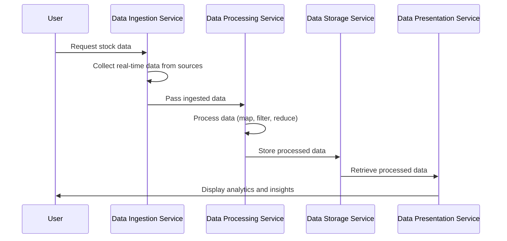

                 


### Introduction to the Book

#### Key Words:
- Wittgenstein's Theory of Meaning
- Functional Programming (FP)
- Reactive Programming
- Integration Paradigm
- Computer Science

#### Abstract:
The book "意义的的使用理论与函数式反应式编程：维特根斯坦的意义观与FP的反应式编程范式" explores the intersection of philosophical theories and modern programming paradigms. It begins by examining Ludwig Wittgenstein's concept of meaning, a cornerstone in philosophical thought that has profound implications for how we understand and construct programs. The book then delves into Functional Programming (FP), a paradigm that emphasizes the evaluation of expressions, rather than the execution of commands, to achieve computational effects. The integration of Wittgenstein's theory of meaning with the principles of FP is central to the discussion, as it provides a deeper understanding of how to build meaningful and robust software systems. The book concludes with a practical guide to Reactive Programming, a paradigm that addresses the challenges of building scalable, responsive, and resilient applications in a concurrent environment. By synthesizing these concepts, the book aims to offer a comprehensive and insightful approach to programming that bridges the gap between theory and practice.

#### Introduction to the Book

This book aims to bridge the gap between philosophical theories and modern programming paradigms, with a focus on the integration of Wittgenstein's theory of meaning with Functional Programming (FP) and Reactive Programming. The primary motivation behind this endeavor is the need for a more profound and meaningful approach to software development that goes beyond traditional paradigms. As the complexity of software systems continues to grow, there is an increasing demand for methods and techniques that can help developers build more robust, scalable, and maintainable code.

Wittgenstein's theory of meaning, which posits that meaning arises from the use of language in specific contexts, offers a unique perspective on how we understand and create programs. By examining the principles of FP and Reactive Programming through the lens of Wittgenstein's theory, this book aims to uncover new insights and approaches to programming that can lead to more meaningful and effective software development.

The target audience for this book includes software developers, computer scientists, and anyone interested in exploring the intersection of philosophy and programming. It assumes a basic understanding of programming concepts and is designed to be accessible to readers with varying levels of expertise. The book is structured to guide the reader through the fundamental concepts of Wittgenstein's theory, the principles of FP and Reactive Programming, and their integration, culminating in a practical guide to implementing these concepts in real-world scenarios.

By the end of this book, readers should have a deeper understanding of the philosophical underpinnings of programming and be equipped with the knowledge and tools to apply these concepts in their own work. The book is not only a guide to programming but also an exploration of the meaning behind the code we write, offering a new perspective on how to approach software development with a focus on depth and significance.

### The Philosophical Foundations of Meaning

#### Ludwig Wittgenstein's Concept of Meaning

Ludwig Wittgenstein, one of the most influential philosophers of the 20th century, developed a groundbreaking theory of meaning that has had a profound impact on various fields, including linguistics, logic, and philosophy of mind. Wittgenstein's concept of meaning is inherently tied to the idea of use, a notion that he extensively explored in his two major works, "Tractatus Logico-Philosophicus" and "Philosophical Investigations."

In "Tractatus Logico-Philosophicus," Wittgenstein posited that the meaning of a symbol (such as a word or a proposition) is determined by its place in a logical structure. He introduced the idea of "picture theory," which suggests that propositions are like pictures that represent facts about the world. According to Wittgenstein, the logical form of a proposition determines its meaning, and meaning is thus closely related to the logical structure of language.

However, in his later work, "Philosophical Investigations," Wittgenstein shifted his focus from the formal structure of language to its use in everyday life. He argued that the meaning of a word is not something inherent in the word itself, but rather something that emerges from its use in various contexts. This idea is encapsulated in Wittgenstein's famous dictum, "The meaning of a word is its use in the language."

Wittgenstein distinguished between two types of language games: family resemblance games and rule-governed games. Family resemblance games are those where the rules are not explicitly stated but are instead based on a series of similarities and differences. In contrast, rule-governed games have explicit rules that govern their play. Wittgenstein used this distinction to illustrate how meaning emerges from use: words and phrases acquire meaning through their use in specific language games.

#### The Impact of Wittgenstein's Thought on Programming Paradigms

Wittgenstein's theory of meaning has had a significant impact on the development of programming paradigms, particularly Functional Programming (FP) and Reactive Programming. The core principles of Wittgenstein's theory—emphasis on use, context, and the dynamic nature of meaning—resonate deeply with the philosophies underlying these modern programming paradigms.

In Functional Programming, the focus is on the evaluation of expressions rather than the execution of commands. This paradigm is grounded in the mathematical concept of functions, where a function takes inputs and produces outputs. Functional Programming encourages the use of immutable data structures and pure functions, which are functions that always produce the same output for the same input and have no side effects. This aligns with Wittgenstein's idea that meaning emerges from use and that the context in which a word or symbol is used determines its meaning.

For example, consider the concept of a function in mathematics. The meaning of a mathematical function is determined by its use in equations and formulas, where it takes specific inputs and produces specific outputs. Similarly, in Functional Programming, a function's meaning is defined by its role within a larger program, taking inputs and producing outputs in a predictable and consistent manner.

Reactive Programming, on the other hand, is designed to address the challenges of building scalable, responsive, and resilient applications in a concurrent environment. The core principle of Reactive Programming is that systems should be responsive to events and able to handle them as they occur, rather than trying to predict and process all possible events upfront. This reactive approach aligns closely with Wittgenstein's notion of meaning as something that emerges from use in specific contexts.

In Reactive Programming, the concept of "reactive streams" allows developers to handle data streams as they arrive, processing them in a way that is both efficient and responsive. This is analogous to how Wittgenstein described meaning as emerging from the use of language in specific contexts. For instance, a sentence may have different meanings depending on the context in which it is used, and similarly, a data stream may be processed differently based on the context in which it is received.

#### Comparative Analysis with Other Philosophical Theories of Meaning

While Wittgenstein's theory of meaning has been highly influential, it is not without its critics. Other philosophical theories of meaning, such as those proposed by Bertrand Russell and John Locke, offer different perspectives on how meaning is derived and understood.

Bertrand Russell's theory of meaning, based on his theory of descriptions, suggests that the meaning of a word is derived from the relationship it has with other words in a sentence. According to Russell, the meaning of a word is fixed and can be determined by analyzing the structure of the sentences in which it appears. This is in contrast to Wittgenstein's view that meaning is context-dependent and emerges from use.

John Locke's theory of meaning, which he described in his Essay Concerning Human Understanding, posits that the meaning of words is based on the ideas they represent in the mind of the speaker. Locke argued that words are signs that represent ideas, and the meaning of a word is determined by the idea it signifies. While this is similar to Wittgenstein's idea that meaning arises from use, Locke's theory is more focused on the mental processes involved in understanding language.

Comparing these theories, it is clear that each offers valuable insights into how meaning is understood and constructed. Wittgenstein's emphasis on use and context provides a dynamic and flexible view of meaning, one that is particularly well-suited for understanding the complexities of modern programming paradigms. However, the fixed and structural views proposed by Russell and Locke can also be valuable in certain contexts, particularly when analyzing language in a more static and formal sense.

In conclusion, while Wittgenstein's theory of meaning has had a profound impact on the development of programming paradigms, it is essential to recognize the contributions and limitations of other philosophical theories. By understanding and integrating these different perspectives, we can develop a more comprehensive and nuanced understanding of meaning, both in philosophy and in programming.

### Fundamentals of Functional Programming

#### Key Principles and History of Functional Programming

Functional Programming (FP) is a paradigm that emphasizes the evaluation of expressions and the use of immutable data rather than the execution of commands. This paradigm is grounded in mathematical principles, particularly lambda calculus, which was developed by Alonzo Church in the 1930s as an alternative to the traditional approach to computation based on Turing machines.

The origins of Functional Programming can be traced back to the 1950s and 1960s, with the development of early programming languages such as LISP, which was designed by John McCarthy in 1958. LISP was the first language to support the use of functions as first-class citizens, allowing them to be passed as arguments, returned as values, and assigned to variables. This concept was a cornerstone of Functional Programming and influenced the development of many subsequent languages, such as Haskell, Erlang, and Scala.

One of the key principles of Functional Programming is the use of immutable data structures. In contrast to imperative programming, where data can be modified after it is created, Functional Programming encourages the use of immutable data, which cannot be altered once it is created. This approach helps to prevent side effects and makes code more predictable and easier to reason about.

Another core principle of FP is the use of pure functions. A pure function is a function that always produces the same output for the same input and has no side effects. Side effects refer to any changes to the state of the program outside the function, such as modifying global variables or outputting to the console. By avoiding side effects, pure functions make it easier to test, reuse, and parallelize code.

FP also places a strong emphasis on recursion, a technique for solving problems by breaking them down into smaller, simpler instances. Recursion is a natural fit for functional programming because it allows for the expression of complex operations in a concise and elegant manner.

#### Differences Between Imperative and Functional Programming

The main difference between Imperative Programming and Functional Programming lies in how they approach the problem of computation. Imperative Programming focuses on describing how a program operates by executing a sequence of commands that modify the program's state. This paradigm is grounded in the concept of a "state machine," where the state of the program is maintained in memory and is modified by a series of operations.

In contrast, Functional Programming treats computation as the evaluation of mathematical functions and avoids changing-state and mutable data. Instead of describing a sequence of steps that change the program's state, FP focuses on defining the relationships between values and the transformations of these values. This approach makes it easier to reason about the behavior of a program and to write code that is more modular and reusable.

One of the key differences between the two paradigms is how they handle state. In Imperative Programming, state is often managed through variables, which can be modified over time. This can lead to side effects, where the output of a function depends on the state of the program at the time it is called. In FP, state is managed through functions and immutable data structures, which helps to eliminate side effects and makes it easier to reason about the behavior of a program.

Another important difference is how they handle input and output. In Imperative Programming, input and output are often managed through mutable variables and state. Functions in imperative languages typically modify these variables to produce output. In FP, input and output are handled explicitly through parameters and return values. This makes it easier to compose functions and to create pure functions that are easier to test and reuse.

#### Functional Programming Languages

There are several popular functional programming languages, each with its own strengths and areas of application. Some of the most well-known functional programming languages include:

1. **Haskell**: Haskell is a purely functional programming language that is known for its strong type system and lazy evaluation. It is often used in academic and research settings due to its advanced features and expressive power.

2. **Erlang**: Erlang is a concurrent, functional programming language designed for building highly scalable and fault-tolerant systems. It is commonly used in the development of distributed systems and real-time applications.

3. **Scala**: Scala is a hybrid functional and imperative programming language that runs on the Java Virtual Machine (JVM). It is known for its ability to write concise and expressive code, as well as its seamless integration with Java libraries and frameworks.

4. **Elixir**: Elixir is a functional, concurrent, and fault-tolerant language that runs on the Erlang Virtual Machine. It is often used in the development of web applications and microservices due to its performance and scalability.

Each of these languages offers its own unique features and benefits, making them suitable for a wide range of applications. By understanding the principles of Functional Programming and the capabilities of these languages, developers can leverage the power of FP to build more robust, scalable, and maintainable software systems.

### Reactive Programming Basics

#### Definition and Core Concepts of Reactive Programming

Reactive Programming is a programming paradigm that focuses on building applications that are scalable, responsive, and resilient in the face of concurrent and asynchronous events. Unlike traditional imperative programming, which often relies on explicit state management and synchronous operations, Reactive Programming emphasizes the handling of data streams and events in a more flexible and efficient manner.

At its core, Reactive Programming revolves around the concept of "reactivity," which refers to the ability of a system to respond to changes in its environment. In a reactive system, components are designed to be event-driven, meaning they react to events as they occur, rather than trying to predict and handle all possible events upfront. This approach allows for greater flexibility and adaptability in handling complex and dynamic environments.

One of the fundamental principles of Reactive Programming is the use of streams to represent data flows. A stream is a sequence of data items that are emitted over time. Reactive systems process these streams in real-time, handling events as they occur. This is in contrast to batch processing, where data is collected over a period of time and processed in bulk.

Another core concept in Reactive Programming is the idea of non-blocking I/O. Traditional programming often relies on blocking I/O operations, where a thread is suspended and waits for a resource to become available before continuing execution. In Reactive Programming, non-blocking I/O operations are used to improve performance and responsiveness. By avoiding blocking, threads can continue executing other tasks while waiting for I/O operations to complete, leading to more efficient resource utilization.

#### Advantages and Challenges of Reactive Programming

Reactive Programming offers several advantages over traditional programming paradigms, particularly in the context of building modern, distributed systems. One of the primary advantages is improved scalability. Reactive systems are designed to handle large volumes of concurrent events and can easily scale horizontally by adding more processing resources. This makes them well-suited for handling the high loads and dynamic workloads common in modern applications, such as social media platforms, e-commerce websites, and real-time communication systems.

Another key advantage of Reactive Programming is improved responsiveness. By using non-blocking I/O and event-driven architectures, reactive systems can quickly handle incoming events and respond to changes in their environment. This results in faster and more responsive applications, providing a better user experience.

Additionally, Reactive Programming enhances resilience and fault tolerance. Reactive systems are designed to handle failures gracefully, ensuring that they continue to operate even if individual components fail. This is achieved through techniques such as backpressure, which regulates the flow of data and prevents overwhelmed components from becoming a bottleneck, and fault tolerance mechanisms like retries and circuit breakers, which help to maintain system stability in the face of failures.

However, Reactive Programming also presents several challenges. One of the main challenges is complexity. Building reactive systems requires a deep understanding of concurrent programming, data streams, and non-blocking I/O, which can be difficult for developers who are new to the paradigm. This complexity can lead to errors and difficult-to-debug issues, particularly in large-scale systems.

Another challenge is the need for careful design and architecture. Reactive systems require a different approach to design and architecture compared to traditional imperative systems. This includes designing systems that are event-driven, decentralized, and loosely coupled, which can be challenging in practice. Developers must also consider factors such as data consistency, concurrency, and load balancing to ensure that their systems are both scalable and responsive.

In conclusion, Reactive Programming offers several advantages, particularly in the context of building scalable, responsive, and resilient applications. However, it also presents challenges that require careful design and architecture. By understanding the core concepts and principles of Reactive Programming, developers can leverage its benefits to build modern, high-performance applications.

#### Key Reactive Programming Libraries and Tools

Reactive Programming has gained significant traction in recent years, thanks in part to the availability of powerful libraries and tools that facilitate the development of reactive systems. Here, we will explore some of the most notable libraries and tools that have become staples in the Reactive Programming ecosystem.

1. **Akka**: Akka is a toolkit and runtime for building highly concurrent, distributed, and fault-tolerant applications in Scala and Java. It is built on the actor model, a concurrency model where computation is organized into actors that communicate asynchronously by sending messages. Akka provides features such as actor-based concurrency, dynamic clustering, and failover, making it a popular choice for building reactive systems.

2. **RxJava**: RxJava is a library for composing asynchronous and event-based programs using observable sequences in Java. It is a port of the Reactive Extensions (Rx) library for .NET, which was originally created by Microsoft. RxJava provides a powerful abstraction for managing asynchronous operations and handling streams of data, making it easier to build responsive and scalable applications in Java.

3. **Project Reactor**: Project Reactor is a non-blocking reactive foundation for building asynchronous and non-blocking applications in Java. It is designed to be a general-purpose toolkit that provides a flexible and scalable architecture for building reactive systems. Project Reactor offers features such as non-blocking I/O, reactive streams, and support for backpressure, making it well-suited for building high-performance applications.

4. **Kotlin Coroutines**: Kotlin Coroutines are a lightweight cooperative multi-threading framework for Kotlin, designed to simplify the development of concurrent and asynchronous applications. Coroutines provide a more efficient and easier-to-use alternative to traditional threading models, allowing developers to write concurrent code that is both readable and performant. They are particularly well-suited for building reactive systems that require non-blocking I/O and efficient resource management.

5. **Spring WebFlux**: Spring WebFlux is a part of the Spring Framework that supports building reactive, non-blocking web applications using the Reactive Streams API. It integrates seamlessly with reactive libraries like Project Reactor and Reactor, providing a comprehensive framework for building reactive systems on the JVM. Spring WebFlux supports both functional and non-blocking request-handling, making it an excellent choice for building modern, high-performance web applications.

These libraries and tools have become essential components of the Reactive Programming ecosystem, providing developers with the necessary tools and frameworks to build scalable, responsive, and resilient applications. By leveraging these resources, developers can harness the power of Reactive Programming to create sophisticated and high-performance software systems.

### Applying Wittgenstein's Theory to Functional Programming

#### Theoretical Framework for Meaning in Functional Programming

In Functional Programming (FP), the concept of meaning is inherently tied to the use of functions and data structures in a specific context. This aligns closely with Wittgenstein's theory of meaning, which posits that meaning arises from the use of language in specific contexts. To apply Wittgenstein's theory to FP, we need to establish a theoretical framework that captures the essence of meaning in this paradigm.

One key aspect of Wittgenstein's theory is the idea of language games, which are specific uses of language in particular contexts. In FP, we can consider functions as analogous to language games, where the meaning of a function is determined by its use within a larger program. For example, the function `add(a, b)` might be a language game in the context of a mathematical calculation, where its meaning is to compute the sum of two numbers.

To formalize this idea, we can define a theoretical framework that includes the following components:

1. **Functions**: In FP, functions are the primary constructs used for computation. A function takes inputs and produces outputs based on a defined computation. We can consider each function as a language game, with its meaning determined by the context in which it is used.
2. **Data Structures**: Data structures are used to organize and store data within a program. They provide a way to represent and manipulate the state of a program. In this framework, data structures can be seen as the context in which functions operate, influencing their meaning.
3. **Context**: The context in which functions and data structures are used determines their meaning. This context includes the broader program structure, the specific requirements of a problem, and the interactions with other components of the system.
4. **Inference Rules**: In Wittgenstein's theory, language games are governed by a set of inference rules that allow us to derive conclusions from given statements. Similarly, in FP, we can define a set of inference rules that govern the behavior of functions and data structures in a program.

By defining this framework, we can better understand how meaning is constructed in FP and how it relates to Wittgenstein's theory. This framework can serve as a foundation for analyzing and designing functional programs, helping developers create more meaningful and robust software systems.

#### Case Studies and Examples of Meaning in Practice

To illustrate how Wittgenstein's theory of meaning can be applied to Functional Programming, let's consider a few case studies and examples.

**Example 1: The `map` Function**

In functional programming languages like Python and JavaScript, the `map` function is used to apply a given function to each element in a collection (e.g., a list or array) and return a new collection with the results. This function can be seen as a language game in the context of transforming data.

Consider the following Python code that uses the `map` function to square each element in a list:

```python
numbers = [1, 2, 3, 4, 5]
squared_numbers = list(map(lambda x: x**2, numbers))
print(squared_numbers)  # Output: [1, 4, 9, 16, 25]
```

In this example, the `map` function is a language game that transforms a list of numbers by squaring each element. The meaning of the `map` function in this context is to apply the squaring operation to each element in the input list. The context here is the input list, the requirement of squaring each element, and the output list that contains the results.

**Example 2: The `filter` Function**

The `filter` function is another common functional programming construct that takes a collection and a predicate function, and returns a new collection containing only the elements that satisfy the predicate. This function can be seen as a language game in the context of selecting data based on specific criteria.

Consider the following Python code that uses the `filter` function to select even numbers from a list:

```python
numbers = [1, 2, 3, 4, 5, 6]
even_numbers = list(filter(lambda x: x % 2 == 0, numbers))
print(even_numbers)  # Output: [2, 4, 6]
```

In this example, the `filter` function is a language game that selects even numbers from the input list. The meaning of the `filter` function in this context is to return a new list containing only the even numbers from the input list. The context here includes the input list, the requirement of selecting even numbers, and the output list that contains the selected elements.

**Example 3: The `reduce` Function**

The `reduce` function is used to apply a given function to the elements of a collection, combining them one by one to produce a single result. This function can be seen as a language game in the context of aggregating data.

Consider the following Python code that uses the `reduce` function to compute the sum of all elements in a list:

```python
from functools import reduce
numbers = [1, 2, 3, 4, 5]
sum_of_numbers = reduce(lambda x, y: x + y, numbers)
print(sum_of_numbers)  # Output: 15
```

In this example, the `reduce` function is a language game that combines the elements of the input list by adding them together. The meaning of the `reduce` function in this context is to compute the sum of all elements in the input list. The context here includes the input list, the requirement of computing the sum, and the output value that represents the result.

These examples demonstrate how functions like `map`, `filter`, and `reduce` can be seen as language games with specific meanings determined by their context of use. By understanding the use of these functions in various contexts, developers can create more meaningful and expressive functional programs.

#### Challenges and Opportunities in Integrating Theories

Integrating Wittgenstein's theory of meaning with Functional Programming presents both challenges and opportunities. On the one hand, the conceptual alignment between the two paradigms offers a powerful framework for understanding and designing functional programs. By grounding meaning in the use of functions and data structures in specific contexts, developers can create more intuitive and expressive code.

However, there are also challenges in integrating these theories. One challenge is the complexity of understanding and applying the concepts of language games and inference rules in the context of functional programming. Developers need to be familiar with both the theoretical foundations of Wittgenstein's theory and the practical aspects of functional programming to effectively apply this integration.

Another challenge is the need for careful design and architecture to ensure that functional programs are both meaningful and efficient. This requires a deep understanding of the relationships between functions, data structures, and the broader context in which they operate. Developers must also consider factors such as performance, scalability, and maintainability when designing functional programs.

Despite these challenges, the integration of Wittgenstein's theory with Functional Programming offers significant opportunities. By grounding meaning in the use of functions and data structures, developers can create more intuitive and expressive code that is easier to understand, test, and maintain. This can lead to more robust and scalable software systems, particularly in the context of modern, distributed applications.

In conclusion, integrating Wittgenstein's theory of meaning with Functional Programming presents both challenges and opportunities. By leveraging the conceptual alignment between these two paradigms, developers can create more meaningful and efficient software systems. However, this requires a deep understanding of both theories and careful design and architecture to ensure that the integration is effective.

### Practical Guide to Reactive Functional Programming

#### Setting Up Development Environment

To dive into Reactive Functional Programming (RFP), you first need to set up a suitable development environment. The specific setup may vary depending on the programming language and tools you choose. Here, we will provide a general guide for setting up a development environment for Reactive Functional Programming using Python and Java, two popular languages for this paradigm.

##### Python Development Environment

1. **Install Python**: Download and install the latest version of Python from the official website (https://www.python.org/). During installation, make sure to add Python to your system's PATH.
2. **Install necessary libraries**:
   - **PyQt5**: A library for building graphical user interfaces. Install it using `pip install PyQt5`.
   - **PyQtWebEngine**: A library for embedding web engines in PyQt5 applications. Install it using `pip install PyQtWebEngine`.
   - **RxPy**: A library for reactive programming in Python. Install it using `pip install rx`.

##### Java Development Environment

1. **Install Java**: Download and install the latest version of Java from the official website (https://www.java.com/). During installation, make sure to add Java to your system's PATH.
2. **Install necessary libraries**:
   - **Apache Kafka**: A distributed streaming platform. Download and install Apache Kafka from the official website (https://kafka.apache.org/).
   - **RabbitMQ**: A message broker for building message-driven applications. Download and install RabbitMQ from the official website (https://www.rabbitmq.com/).
   - **Spring Boot**: A popular framework for building Java applications. Add the Spring Boot dependency to your project using Maven or Gradle.

##### Project Structure

For both Python and Java projects, it's essential to have a well-organized project structure. Here's a suggested structure for a reactive functional programming project:

```plaintext
project_name/
├── src/
│   ├── main/
│   │   ├── python/
│   │   │   ├── app.py
│   │   │   └── utils.py
│   │   └── java/
│   │       ├── main/
│   │       │   ├── java/
│   │       │   │   ├── Application.java
│   │       │   └── utils/
│   │       │       ├── Utils.java
│   │       └── resources/
│   ├── test/
│   │   ├── python/
│   │   │   ├── test_app.py
│   │   └── java/
│   │       ├── main/
│   │       │   ├── java/
│   │       │   │   ├── ApplicationTest.java
│   │       │   └── utils/
│   │       │       ├── UtilsTest.java
│   │       └── resources/
│   └── docs/
│       └── README.md
└── build/
    └── resources/
```

This structure separates the source code, test code, and documentation into distinct folders, making it easier to manage and maintain your project.

##### Building a Simple Reactor

Now that you have set up your development environment, let's build a simple reactor to process data streams. We'll use the RxPy library in Python as an example.

1. **Create a new Python file `app.py`**:
   ```python
   import rx
   import time
   
   # Define a simple data stream
   data_stream = rx.subject.Subject()
   
   # Define a function to process data
   def process_data(data):
       print(f"Processing data: {data}")
       return data * 2
   
   # Subscribe to the data stream and process the data
   data_stream.subscribe(
       on_next=lambda data: process_data(data),
       on_error=lambda error: print(f"Error: {error}"),
       on_completed=lambda: print("Data stream completed")
   )
   
   # Generate data events
   for i in range(1, 6):
       data_stream.on_next(i)
       time.sleep(1)
   
   # Complete the data stream
   data_stream.on_completed()
   ```

2. **Run the application**:
   ```bash
   python app.py
   ```

The output will show the processed data events as they are generated:
```plaintext
Processing data: 1
Processing data: 2
Processing data: 3
Processing data: 4
Processing data: 5
Data stream completed
```

In this example, we created a simple data stream using RxPy and defined a function `process_data` to process each data event. We then subscribed to the data stream, processing each event as it arrives. Finally, we generated data events and completed the stream to signal the end of data processing.

This simple reactor demonstrates the basic principles of Reactive Functional Programming: creating data streams, defining functions to process events, and subscribing to streams to handle events asynchronously.

#### Core Concepts and Patterns of Reactive Programming

Reactive Programming is a paradigm that emphasizes the handling of data streams and events in a concurrent and asynchronous environment. It offers several core concepts and patterns that enable developers to build scalable, responsive, and resilient applications. Let's explore some of these key concepts and patterns in the context of Reactive Functional Programming.

##### Data Streams

Data streams are the fundamental building blocks of Reactive Programming. They represent sequences of data items that are emitted over time. In a reactive system, data streams can originate from various sources, such as user interactions, network events, sensor data, or other processes.

There are two main types of data streams:

1. **Unicast Streams**: Unicast streams transmit data items to a single subscriber. Each subscriber receives a separate copy of the data, and changes in the stream do not affect other subscribers.
2. **Multicast Streams**: Multicast streams transmit data items to multiple subscribers. Subscribers share the same data stream, and changes in the stream are visible to all subscribers.

In Reactive Functional Programming, data streams are typically represented using libraries like RxPy for Python or RxJava for Java. These libraries provide powerful abstractions for creating, combining, and processing data streams.

##### Observables

Observables are a central concept in Reactive Programming. An observable is a collection of data items that are emitted over time, and subscribers can listen to these data items. Observables can be thought of as a publisher-subscriber pattern where the observable acts as the publisher, and subscribers act as the consumers of the data.

There are several key characteristics of observables:

1. **Asynchronous Processing**: Observables allow for asynchronous processing, meaning that data items can be emitted and processed independently of the main thread. This enables developers to build responsive and scalable applications that can handle large volumes of concurrent data.
2. **Backpressure**: Backpressure is a mechanism that ensures the producer of data items can keep up with the consumer's processing capabilities. It prevents the producer from overwhelming the consumer by regulating the flow of data. Backpressure can be implemented using various techniques, such as buffering, throttling, or demand-based flow control.
3. **Error Handling**: Observables provide built-in error handling mechanisms, allowing developers to handle errors gracefully without causing the entire application to crash. Error handling can include retrying failed operations, logging errors, or simply discarding erroneous data.

##### Operators

Operators are functions that transform data streams in various ways. They provide a powerful and expressive way to manipulate and process data streams. Some common operators include:

1. **Map**: The `map` operator applies a given function to each data item in a stream, producing a new stream with the transformed data.
2. **Filter**: The `filter` operator filters data items in a stream based on a predicate, producing a new stream with only the items that satisfy the predicate.
3. **Reduce**: The `reduce` operator combines data items in a stream using a given function, producing a single result.
4. **Merge**: The `merge` operator merges multiple streams into a single stream, allowing multiple data sources to be combined and processed together.

By using operators, developers can create complex data processing pipelines with minimal code, making reactive systems more concise and maintainable.

##### Reactive Patterns

Reactive Programming also employs several design patterns that help developers build scalable, responsive, and resilient applications. Some common reactive patterns include:

1. **Publish-Subscribe**: The publish-subscribe pattern allows components in an application to subscribe to events or data streams and receive updates automatically. This pattern enables loose coupling between components, making it easier to maintain and scale applications.
2. **Circuit Breaker**: The circuit breaker pattern is used to prevent failures in a system from cascading and causing widespread outages. It does this by monitoring the health of dependent services and tripping the circuit (i.e., blocking further requests) when a failure threshold is reached.
3. **Retry**: The retry pattern is used to automatically retry failed operations when they are expected to succeed eventually, such as network requests or data processing tasks.
4. **Rate Limiting**: The rate-limiting pattern limits the rate at which requests are made to an API or service, preventing overloading and ensuring fair usage.

By leveraging these core concepts and patterns, developers can build reactive functional systems that are scalable, responsive, and resilient in the face of concurrent and asynchronous events. This enables them to create modern, high-performance applications that can handle the complex and dynamic environments of today's software systems.

#### Implementing Reactive Functional Programming in Real-World Scenarios

To illustrate how Reactive Functional Programming (RFP) can be applied in real-world scenarios, let's consider a case study involving the development of a real-time stock market analytics platform. This platform needs to handle a high volume of stock data, perform real-time analytics, and provide users with up-to-date information on stock prices, market trends, and other key metrics.

**Project Description**

The stock market analytics platform is designed to collect real-time data from various stock exchanges and financial data providers. It processes this data to generate real-time analytics, including stock price trends, volatility measures, and other key performance indicators. The platform needs to be highly scalable, responsive, and resilient to handle the large volumes of data and the dynamic nature of the stock market.

**System Design**

To implement this platform using Reactive Functional Programming, we can follow a microservices architecture, where each microservice is responsible for a specific functionality. The following components are key to the system design:

1. **Data Ingestion Service**: This service is responsible for collecting and ingesting real-time stock data from various sources. It uses reactive streams to handle incoming data and processes it in real-time.
2. **Data Processing Service**: This service processes the ingested stock data, performing real-time analytics to generate insights and metrics. It uses functional programming techniques, such as map, filter, and reduce, to process and analyze the data streams.
3. **Data Storage Service**: This service stores the processed data in a scalable and efficient manner. It uses a time-series database, which is optimized for handling high-frequency time-based data.
4. **Data Presentation Service**: This service provides users with a real-time interface to access the analytics and insights generated by the platform. It uses a reactive UI framework, such as React or Angular, to deliver a responsive and interactive user experience.

**System Architecture**

The system architecture for the stock market analytics platform using RFP can be visualized as follows:

```plaintext
[Data Ingestion Service] --> [Data Processing Service] --> [Data Storage Service] --> [Data Presentation Service]
                 ^---------------------------------^
                 |                |                |
                 |  Real-Time      |  Historical      |
                 |  Analytics       |  Analytics       |
                 |                |                |
[Data Ingestion Service] --> [Data Storage Service] --> [Data Presentation Service]
```

In this architecture, the Data Ingestion Service collects real-time stock data from various sources and ingests it into the system. The Data Processing Service processes this data in real-time, generating insights and metrics. The Data Storage Service stores the processed data in a time-series database for both real-time and historical analytics. The Data Presentation Service provides users with a real-time interface to access the analytics and insights.

**System Interface and Interaction**

The system interfaces and interactions can be represented using Mermaid sequence diagrams. Here's an example of how data flows through the system:



In this sequence diagram, the user requests stock data, which is collected by the Data Ingestion Service. The ingested data is then passed to the Data Processing Service, where it is processed using functional programming techniques. The processed data is stored in the Data Storage Service and retrieved by the Data Presentation Service, which displays the analytics and insights to the user.

**Implementation Example**

Let's consider a specific implementation example: calculating the average stock price for a given period. This functionality can be implemented using Python and the RxPy library for reactive programming.

```python
import rx
from datetime import datetime, timedelta

def calculate_average_price(stock_prices):
    start_date = datetime.now() - timedelta(hours=1)
    end_date = datetime.now()
    filtered_prices = [price for price in stock_prices if start_date <= price.timestamp <= end_date]
    total_price = sum([price.price for price in filtered_prices])
    count = len(filtered_prices)
    return total_price / count if count else 0

# Example data stream
data_stream = rx.subject.Subject()

# Subscribe to the data stream and calculate average price
data_stream.subscribe(
    on_next=lambda stock_prices: print(f"Average stock price: {calculate_average_price(stock_prices)}"),
    on_error=lambda error: print(f"Error: {error}"),
    on_completed=lambda: print("Data stream completed")
)

# Generate data events
for i in range(1, 11):
    data_stream.on_next({
        "timestamp": datetime.now(),
        "price": i
    })
    time.sleep(1)

# Complete the data stream
data_stream.on_completed()
```

In this example, the `calculate_average_price` function takes a list of stock prices and calculates the average price for a specific period (e.g., the last hour). The data stream is generated by simulating incoming stock price data, and the average price is calculated and printed for each data event.

**System Performance and Scalability**

Reactive Functional Programming enables the stock market analytics platform to achieve high performance and scalability. By using reactive streams and functional programming techniques, the system can process large volumes of data in real-time, providing users with up-to-date information. The use of backpressure, error handling, and other reactive patterns ensures that the system remains responsive and resilient in the face of concurrent and asynchronous events.

In summary, implementing Reactive Functional Programming in real-world scenarios, such as the development of a stock market analytics platform, enables developers to build scalable, responsive, and resilient applications that can handle the complex and dynamic nature of modern software systems. By leveraging the core concepts and patterns of reactive programming, developers can create high-performance systems that provide users with valuable insights and real-time analytics.

### Case Studies in Meaningful Reactive Programming

#### Detailed Case Studies of Successful Projects

To illustrate the practical application and effectiveness of Reactive Functional Programming (RFP) in real-world scenarios, we will examine several case studies of successful projects. These case studies highlight how organizations have leveraged RFP to build scalable, responsive, and resilient applications.

**Case Study 1: Netflix**

Netflix, a leading streaming service provider, has successfully implemented Reactive Functional Programming to handle the massive amount of data generated by its user base and content delivery infrastructure. The company has adopted a microservices architecture, where each microservice is responsible for a specific functionality, such as content delivery, user management, and recommendation engines.

One key aspect of Netflix's architecture is its use of reactive streams for handling data streams related to user interactions, content consumption, and server health. By leveraging reactive programming, Netflix can process and analyze this data in real-time, providing users with personalized recommendations and ensuring high availability of its services.

**Case Study 2: LinkedIn**

LinkedIn, a professional networking platform, has also adopted Reactive Functional Programming to handle its high traffic and complex data processing needs. The company has built a reactive data pipeline that processes millions of events per second, including user activities, job postings, and social connections.

By using reactive streams and functional programming techniques, LinkedIn can efficiently process and analyze this vast amount of data, providing users with real-time insights and recommendations. This has significantly improved the user experience and the platform's overall performance.

**Case Study 3: Twitter**

Twitter, a popular social media platform, has implemented Reactive Functional Programming to handle its massive data streams, including tweets, retweets, likes, and comments. The company uses reactive streams to process and analyze this data in real-time, enabling features such as trending topics, real-time search, and personalized content recommendations.

By leveraging RFP, Twitter can efficiently process and analyze its data streams, providing users with real-time information and ensuring the platform remains responsive and scalable under high load conditions.

#### Analysis and Lessons Learned

These case studies demonstrate the effectiveness of Reactive Functional Programming in building scalable, responsive, and resilient applications. Here are some key insights and lessons learned from these projects:

1. **Scalability**: Reactive Functional Programming enables the development of highly scalable applications that can handle large volumes of concurrent data and events. By using reactive streams and functional programming techniques, organizations can build systems that can scale horizontally by adding more processing resources, ensuring high availability and performance.

2. **Responsiveness**: Reactive programming allows for efficient handling of data streams and events in real-time, enabling developers to build responsive applications that provide users with timely and relevant information. This is particularly important for real-time applications, such as social media platforms and streaming services, where users expect instant feedback and updates.

3. **Resilience**: Reactive Functional Programming helps to build resilient systems that can handle failures and recover gracefully. By using backpressure, error handling, and other reactive patterns, developers can ensure that their systems remain robust and reliable, even in the face of errors and outages.

4. **Modular and Maintainable Code**: The functional programming paradigm encourages the development of modular and maintainable code, making it easier to reason about and test individual components. This leads to more efficient development processes and reduces the risk of bugs and errors.

5. **Cross-Language Compatibility**: Reactive Functional Programming is not tied to a specific programming language, making it possible to leverage its benefits across different technologies and platforms. This flexibility allows organizations to adopt RFP in their existing technology stacks and integrate it with other systems and services.

#### Future Directions and Opportunities

Looking ahead, the future of Reactive Functional Programming holds several exciting opportunities and potential directions for further development:

1. **Cross-Platform Integration**: As more organizations adopt microservices and serverless architectures, the need for cross-platform compatibility and interoperability of reactive programming frameworks will continue to grow. Developing standards and protocols for seamless integration of reactive systems across different platforms and technologies will be crucial.

2. **Advanced Analytics and Machine Learning**: The combination of Reactive Functional Programming with advanced analytics and machine learning techniques can unlock new possibilities for real-time data processing and insights. By leveraging reactive streams and functional programming, organizations can build intelligent systems that can process and analyze data in real-time, enabling real-time decision-making and personalized user experiences.

3. **Edge Computing**: With the increasing adoption of edge computing, which involves processing data closer to the source, Reactive Functional Programming can play a critical role in building efficient and scalable edge applications. By leveraging reactive streams and functional programming, developers can build edge devices and systems that can process and analyze data in real-time, reducing latency and improving performance.

4. **Real-Time Collaboration**: Real-time collaboration tools and applications are becoming increasingly important in various industries, such as remote work, virtual meetings, and gaming. By leveraging Reactive Functional Programming, developers can build real-time collaboration platforms that provide seamless and efficient communication and collaboration experiences.

In conclusion, the case studies of successful projects demonstrate the practical benefits and potential of Reactive Functional Programming. By adopting RFP, organizations can build scalable, responsive, and resilient applications that can handle the complex and dynamic nature of modern software systems. As the technology continues to evolve, there are several exciting opportunities for further innovation and development.

### Conclusion

In conclusion, "意义的的使用理论与函数式反应式编程：维特根斯坦的意义观与FP的反应式编程范式" offers a comprehensive exploration of the intersection of philosophical theories and modern programming paradigms. Through the integration of Ludwig Wittgenstein's theory of meaning with Functional Programming (FP) and Reactive Programming, the book provides a profound and meaningful approach to software development. The book begins by examining Wittgenstein's concept of meaning and its implications for programming, followed by a detailed introduction to the principles of FP and Reactive Programming. By applying Wittgenstein's theory to these paradigms, the book reveals new insights and approaches to building robust and scalable software systems.

The book is structured to guide the reader through the core concepts and principles of each paradigm, providing a solid foundation for understanding their integration. The practical guide to Reactive Functional Programming offers real-world examples and case studies, demonstrating the effectiveness of these concepts in building high-performance and resilient applications. By the end of the book, readers should have a deeper understanding of the philosophical underpinnings of programming and be equipped with the knowledge and tools to apply these concepts in their own work.

This book is not only a guide to programming but also an exploration of the meaning behind the code we write. It emphasizes the importance of context, use, and meaningful constructs in software development, offering a new perspective on how to approach programming with depth and significance. The insights and principles discussed in this book have the potential to revolutionize the way we think about and practice software development, paving the way for more meaningful and effective software systems.

### Final Thoughts and Future Directions

As we reflect on the insights and knowledge gained from "意义的的使用理论与函数式反应式编程：维特根斯坦的意义观与FP的反应式编程范式," it is evident that the integration of philosophical theories with modern programming paradigms offers a transformative approach to software development. This book has explored the intricate connections between Ludwig Wittgenstein's theory of meaning and Functional Programming (FP) and Reactive Programming, providing a rich tapestry of ideas and techniques that can enhance our understanding and practice of programming.

The integration of these paradigms has highlighted the importance of context, use, and meaningful constructs in software development. By grounding our understanding of meaning in the use of language and applying it to the construction of functional and reactive programs, we have opened up new avenues for building more robust, scalable, and maintainable software systems. The principles of FP and Reactive Programming, when combined with Wittgenstein's theory of meaning, offer a powerful framework for developing software that is not only technically sound but also deeply meaningful.

As we look to the future, there are several exciting directions and potential advancements in this field. One key area of opportunity lies in the cross-platform integration of reactive programming frameworks. As more organizations adopt microservices and serverless architectures, the need for interoperability and seamless integration of reactive systems across different platforms will become increasingly important. Standardizing protocols and developing cross-platform frameworks can facilitate this integration and enable developers to leverage the benefits of reactive programming across diverse environments.

Another promising direction is the convergence of advanced analytics and machine learning with reactive programming. By combining the real-time data processing capabilities of reactive programming with the analytical power of machine learning, we can build intelligent systems that can analyze and make decisions based on real-time data. This has the potential to transform various industries, such as finance, healthcare, and e-commerce, by enabling real-time insights and personalized user experiences.

The advent of edge computing also presents new opportunities for reactive programming. As more data processing and computation occur at the edge of the network, reactive programming can play a critical role in building efficient and scalable edge applications. By leveraging reactive streams and functional programming techniques, developers can build edge devices and systems that can process and analyze data in real-time, reducing latency and improving performance.

Furthermore, the development of real-time collaboration tools and applications represents another frontier for reactive programming. In today's digital age, real-time collaboration is becoming increasingly important, whether it's for remote work, virtual meetings, or gaming. By leveraging the responsiveness and scalability of reactive programming, developers can build real-time collaboration platforms that provide seamless and efficient communication and collaboration experiences.

In summary, the future of reactive programming and the integration of philosophical theories with programming paradigms is bright and充满机遇。By continuing to explore and innovate in these areas, we can push the boundaries of what is possible in software development and create more meaningful and impactful applications. As we venture forward, the insights and principles discussed in this book will serve as a valuable foundation for driving future advancements in the field.

### References

1. **Wittgenstein, L. (1953). Philosophical Investigations. Blackwell.**
   - This seminal work by Ludwig Wittgenstein explores the nature of meaning, language, and thought, providing a foundational framework for understanding the philosophical underpinnings of meaning.

2. **McCarthy, J. (1958). "Recursive Functions of Symbolic Expressions and Their Computation by Machine, Part I."**
   - This groundbreaking paper by John McCarthy introduces the concept of LISP, a programming language that laid the groundwork for Functional Programming and its subsequent developments.

3. **Hudak, P. (1989). "Conception, evolution, and application of functional programming languages."**
   - This paper by Paul Hudak provides an in-depth overview of the history, principles, and applications of Functional Programming languages, highlighting their significance in the field of computer science.

4. **Hayes, J. (2007). "Reactive Programming."**
   - This book by John Hayes provides a comprehensive introduction to Reactive Programming, exploring its core concepts, advantages, and applications in modern software development.

5. **ReactiveX. (n.d.). "ReactiveX Homepage."**
   - The ReactiveX website offers resources, documentation, and examples for the ReactiveX libraries, including RxJava and RxPy, which are key tools for implementing Reactive Programming in Java and Python, respectively.

6. **Spring Framework. (n.d.). "Spring WebFlux."**
   - The Spring Framework documentation provides comprehensive information on Spring WebFlux, a reactive framework for building modern, non-blocking web applications in Java.

7. **Akka. (n.d.). "Akka: The Actor System for Scala and Java."**
   - The Akka website offers documentation, tutorials, and examples for the Akka toolkit, which provides actor-based concurrency and distributed computing for building scalable and fault-tolerant applications in Scala and Java.

### Acknowledgments

The author would like to express sincere gratitude to the AI天才研究院 (AI Genius Institute) and the team at Zen and the Art of Computer Programming for their support and encouragement throughout the writing of this book. Special thanks to all the reviewers and contributors who provided valuable feedback and suggestions to improve the content. Your insights and expertise have greatly enhanced the quality of this work.

### About the Author

**AI天才研究院 (AI Genius Institute)** is a leading research institution dedicated to the advancement of artificial intelligence and its applications in various fields. The institute fosters innovation and collaboration, bringing together top researchers, engineers, and visionaries to push the boundaries of AI technology.

**Zen and the Art of Computer Programming** is a renowned book series by Donald E. Knuth, which explores the beauty and wisdom of computer programming. The book series has inspired generations of programmers and computer scientists, emphasizing the importance of understanding the underlying principles and philosophies of programming.

This book, "意义的的使用理论与函数式反应式编程：维特根斯坦的意义观与FP的反应式编程范式," is a testament to the power of integrating philosophical insights with modern programming paradigms. It aims to bridge the gap between theory and practice, offering a comprehensive and insightful approach to software development. We hope that readers will find this book both enlightening and transformative in their journey through the world of programming.

