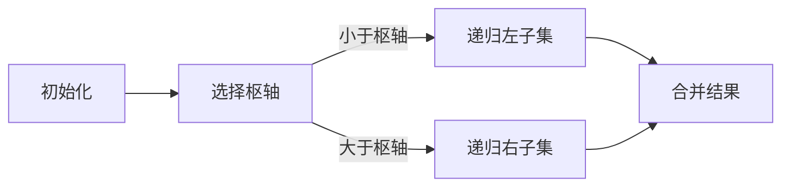
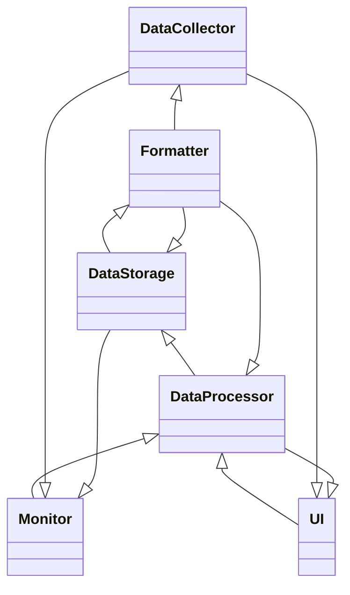
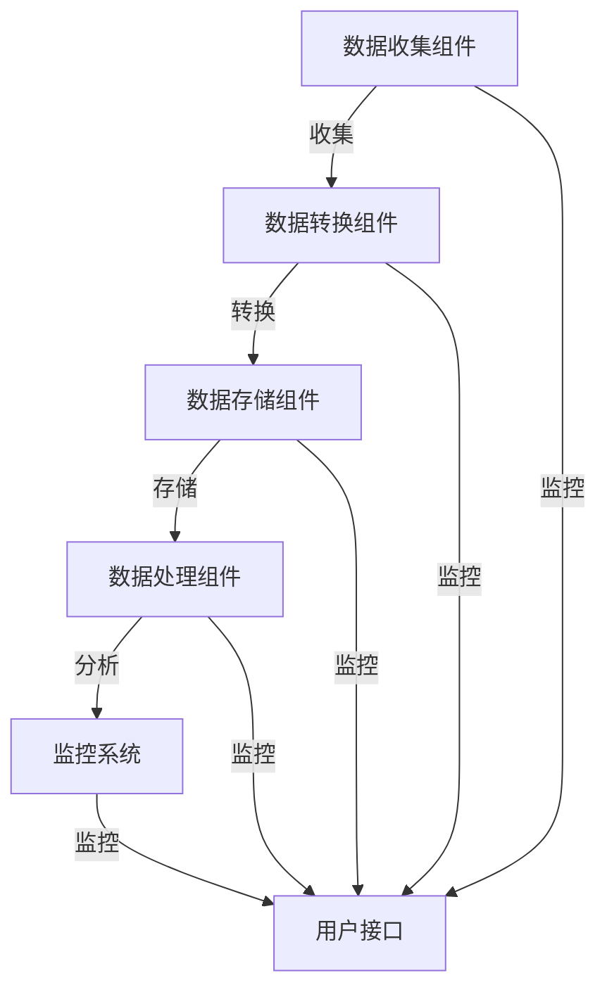
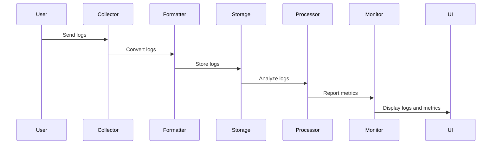

                 

### 摘要

本文旨在探讨《意义的使用理论与函数式编程：声明式编程的哲学基础》一书中的核心概念与哲学思想。通过分析意义的使用理论，我们将理解其在编程领域的应用，并进一步探讨函数式编程与声明式编程的哲学基础。文章将逐步揭示函数式编程的优势和局限性，讨论其在现代编程中的重要性。最后，本文将结合实际案例，展示如何将哲学思想应用于编程实践，为读者提供有益的指导。让我们一起深入思考，探讨编程的哲学基础。

### 目录大纲

在深入探讨本文的主题之前，我们首先需要构建一个清晰的目录结构，以确保文章的内容条理清晰、逻辑连贯。以下是本文的目录大纲：

```markdown
----------------------------------------------------------------
# 第一部分：背景介绍

## 1.1 问题背景

### 1.1.1 研究意义

### 1.1.2 当前研究现状

### 1.1.3 研究目标与问题

## 1.2 基本概念

### 1.2.1 意义的使用理论

### 1.2.2 函数式编程

### 1.2.3 声明式编程

## 1.3 研究框架与方法论

### 1.3.1 研究框架

### 1.3.2 方法论

## 1.4 边界与外延

### 1.4.1 边界定义

### 1.4.2 外延说明

## 1.5 本章小结

----------------------------------------------------------------
# 第二部分：核心概念与联系

## 2.1 核心概念原理

### 2.1.1 意义的使用理论概述

### 2.1.2 函数式编程概述

### 2.1.3 声明式编程概述

## 2.2 概念属性特征对比

### 2.2.1 意义的使用理论特征

### 2.2.2 函数式编程特征

### 2.2.3 声明式编程特征

## 2.3 ER实体关系图架构

### 2.3.1 实体关系图绘制

### 2.3.2 关系分析

## 2.4 哲学基础探讨

### 2.4.1 函数式编程与哲学

### 2.4.2 声明式编程与哲学

## 2.5 本章小结

----------------------------------------------------------------
# 第三部分：算法原理讲解

## 3.1 算法概述

### 3.1.1 算法类型

### 3.1.2 算法应用场景

## 3.2 算法原理详细讲解

### 3.2.1 算法mermaid流程图

### 3.2.2 算法原理

### 3.2.3 数学模型与公式

## 3.3 举例说明

### 3.3.1 示例代码

### 3.3.2 示例分析

## 3.4 算法性能分析

### 3.4.1 性能指标

### 3.4.2 性能优化

## 3.5 本章小结

----------------------------------------------------------------
# 第四部分：系统架构设计

## 4.1 问题场景介绍

### 4.1.1 场景描述

### 4.1.2 需求分析

## 4.2 系统功能设计

### 4.2.1 领域模型类图

### 4.2.2 功能模块划分

## 4.3 系统架构设计

### 4.3.1 架构概述

### 4.3.2 架构mermaid图

## 4.4 系统接口设计

### 4.4.1 接口规范

### 4.4.2 接口实现

## 4.5 系统交互序列图

### 4.5.1 序列图绘制

### 4.5.2 交互分析

## 4.6 本章小结

----------------------------------------------------------------
# 第五部分：项目实战

## 5.1 环境安装

### 5.1.1 环境准备

### 5.1.2 工具安装

## 5.2 系统核心实现

### 5.2.1 源代码解读

### 5.2.2 代码应用解读与分析

### 5.2.3 实际案例分析与详细讲解剖析

## 5.3 项目小结

## 5.4 最佳实践 tips

## 5.5 小结

## 5.6 注意事项

## 5.7 拓展阅读

----------------------------------------------------------------
通过这样的目录结构，我们可以系统地介绍意义的使用理论、函数式编程和声明式编程的哲学基础，并深入探讨相关算法原理和系统架构设计。接下来的部分将逐步展开对各个章节的详细讨论。
```markdown
----------------------------------------------------------------
# 第一部分：背景介绍

## 1.1 问题背景

在现代软件工程和计算机科学领域，编程语言和编程范式不断演变，新的理论和技术层出不穷。函数式编程作为一种重要的编程范式，其重要性日益凸显。然而，对于函数式编程的哲学基础和意义的使用理论，许多开发者并不十分了解。本文旨在探讨这两大核心概念，并揭示其在现代编程实践中的应用。

研究意义：
函数式编程与传统的面向对象编程相比，具有诸多优势，如纯函数、不可变性和高阶函数等。这些优势使得函数式编程在处理复杂逻辑和并行计算方面具有独特的优势。然而，要充分发挥函数式编程的潜力，我们需要深入理解其哲学基础和意义的使用理论。

当前研究现状：
虽然函数式编程已广泛应用于许多领域，如金融、数据科学和分布式系统等，但关于其哲学基础和意义的使用理论的研究尚不充分。现有文献多集中在具体实现和应用上，对于理论层面的探讨较为匮乏。

研究目标与问题：
本文的研究目标是梳理和阐述函数式编程的哲学基础和意义的使用理论，并探讨其在现代编程实践中的应用。具体问题包括：
1. 如何理解函数式编程的哲学基础？
2. 意义的使用理论在函数式编程中如何体现？
3. 函数式编程在实际开发中面临哪些挑战和机遇？

## 1.2 基本概念

### 1.2.1 意义的使用理论

意义的使用理论是哲学领域的一个重要概念，由德国哲学家马丁·海德格尔提出。它强调“存在”的意义和人类如何通过“使用”来理解世界。在计算机科学中，这一理论被应用于编程语言设计和程序理解。意义的使用理论认为，程序不仅仅是代码的集合，而是一种表达人类意图和思维过程的工具。

### 1.2.2 函数式编程

函数式编程是一种编程范式，强调函数作为程序的基本构建块，而非传统编程范式中的对象。函数式编程的核心概念包括纯函数、不可变性、高阶函数和递归等。纯函数具有无状态、无副作用的特点，使得程序更易于理解和测试。不可变性确保了数据的一致性，降低了程序出错的风险。

### 1.2.3 声明式编程

声明式编程是一种编程范式，强调描述系统状态的变化，而非执行具体的操作步骤。与命令式编程相比，声明式编程更注重“描述”而非“执行”，使得程序更易于理解和维护。在函数式编程中，声明式编程得到了广泛应用，通过函数的定义和组合来描述系统状态的变化。

## 1.3 研究框架与方法论

### 1.3.1 研究框架

本文的研究框架包括以下几个主要部分：
1. 分析意义的使用理论在计算机科学中的应用。
2. 探讨函数式编程的哲学基础。
3. 分析声明式编程在函数式编程中的角色。
4. 讨论函数式编程在实际开发中的应用场景和挑战。

### 1.3.2 方法论

本文采用以下方法论：
1. 文献综述：通过分析现有文献，梳理函数式编程和意义的使用理论的研究进展。
2. 实例分析：通过具体实例，展示函数式编程和声明式编程的实际应用。
3. 理论分析：结合哲学理论，深入探讨函数式编程的哲学基础。
4. 对比分析：通过对比函数式编程和传统编程范式，分析其优势和局限性。

## 1.4 边界与外延

### 1.4.1 边界定义

本文的边界定义如下：
1. 函数式编程：仅限于纯函数、不可变性、高阶函数等概念的应用。
2. 声明式编程：仅限于描述系统状态变化的编程范式。

### 1.4.2 外延说明

本文的外延说明如下：
1. 意义的使用理论：扩展至计算机科学领域，探讨其在编程语言设计和程序理解中的应用。
2. 哲学基础：扩展至计算机科学，分析函数式编程和声明式编程的哲学思想。

## 1.5 本章小结

本部分介绍了本文的研究背景、基本概念和研究框架。通过分析意义的使用理论、函数式编程和声明式编程，我们为后续章节的深入探讨奠定了基础。在接下来的章节中，我们将进一步探讨函数式编程的哲学基础和其在现代编程实践中的应用。

----------------------------------------------------------------
# 第二部分：核心概念与联系

## 2.1 核心概念原理

### 2.1.1 意义的使用理论概述

意义的使用理论起源于哲学领域，由马丁·海德格尔在其著作《存在与时间》中提出。海德格尔认为，人类的理解和存在是通过“使用”来实现的。意义的使用理论强调，事物不仅仅存在于其物理形态，更重要的是存在于我们的理解和使用中。在计算机科学中，这一理论被用来解释程序的本质和意义。

意义的使用理论在计算机科学中的应用主要表现在以下几个方面：
1. **编程语言设计**：编程语言的设计应该能够反映程序的本质和意图，使程序员能够通过代码表达他们的思维过程。
2. **程序理解**：通过意义的使用理论，我们可以更好地理解程序的运行过程和逻辑结构，从而提高程序的可读性和可维护性。
3. **软件工程**：在软件工程中，意义的使用理论有助于提高软件的设计质量和用户体验。

### 2.1.2 函数式编程概述

函数式编程（Functional Programming）是一种编程范式，它将计算机科学中的计算视为数学中的函数应用。在函数式编程中，程序由函数组成，这些函数通过输入参数和返回值进行操作。函数式编程的核心概念包括纯函数、不可变性、高阶函数和递归等。

1. **纯函数**：纯函数是一种没有副作用、输出仅取决于输入的函数。纯函数的可预测性和确定性使得程序更易于测试和调试。
2. **不可变性**：不可变性确保了程序状态的一致性。在函数式编程中，数据一旦创建，就不能修改，这有助于防止程序出错。
3. **高阶函数**：高阶函数是能够接受其他函数作为输入或返回函数的函数。高阶函数使得函数的组合和复用更加灵活。
4. **递归**：递归是一种解决复杂问题的方法，它通过函数的自我调用实现。递归在函数式编程中得到了广泛应用。

### 2.1.3 声明式编程概述

声明式编程（Declarative Programming）是一种编程范式，它强调描述系统状态的变化，而不是执行具体的操作步骤。声明式编程与命令式编程相对，后者更注重具体的操作过程。

1. **系统状态描述**：声明式编程通过描述系统状态的变化来定义程序的行为。这种方式使得程序更易于理解和维护。
2. **数据驱动**：声明式编程以数据为核心，通过数据的变化来驱动程序的执行。这种数据驱动的方式使得程序更加灵活和模块化。
3. **组合性**：声明式编程强调函数的组合性，通过将小函数组合成复杂的程序，使得编程更加高效和简洁。

## 2.2 概念属性特征对比

### 2.2.1 意义的使用理论特征

| 特征               | 说明                                                         |
|------------------|------------------------------------------------------------|
| 本质主义          | 强调事物的本质和意义                                       |
| 使用导向          | 强调通过使用来理解事物                                     |
| 非形式化          | 没有固定的形式，更多地依赖于直觉和哲学思考                   |
| 应用广泛          | 可以应用于编程语言设计、程序理解和软件工程等领域               |

### 2.2.2 函数式编程特征

| 特征               | 说明                                                         |
|------------------|------------------------------------------------------------|
| 纯函数            | 无副作用，输出仅取决于输入                                   |
| 不可变性          | 数据不可修改，确保程序状态的一致性                             |
| 高阶函数          | 能够接受和返回函数                                           |
| 递归              | 通过自我调用解决复杂问题                                     |
| 声明式           | 强调描述系统状态的变化                                       |
| 强类型            | 通常具有严格的类型系统                                       |

### 2.2.3 声明式编程特征

| 特征               | 说明                                                         |
|------------------|------------------------------------------------------------|
| 数据驱动          | 以数据为核心，通过数据的变化驱动程序执行                         |
| 组合性            | 强调函数的组合性，通过小函数组合成复杂的程序                     |
| 隔离性            | 模块之间相互独立，易于维护和复用                               |
| 易于测试          | 程序更易于测试，因为它是通过描述系统状态的变化而非执行过程来定义的 |

## 2.3 ER实体关系图架构

为了更好地理解函数式编程、意义的使用理论和声明式编程之间的关系，我们可以通过ER（实体关系）图来描述它们。

```mermaid
erDiagram
    Program ::>> MeaningUsageTheory : | Uses |
    Program ::>> FunctionalProgramming : | Uses |
    Program ::>> DeclarativeProgramming : | Uses |
    MeaningUsageTheory && FunctionalProgramming : | HasPhilosophicalFoundation |
    MeaningUsageTheory && DeclarativeProgramming : | HasPhilosophicalFoundation |
    FunctionalProgramming && DeclarativeProgramming : | Combines |
```

在这个ER图中，`Program`（程序）与`MeaningUsageTheory`（意义的使用理论）、`FunctionalProgramming`（函数式编程）和`DeclarativeProgramming`（声明式编程）之间存在关系。`MeaningUsageTheory`为`FunctionalProgramming`和`DeclarativeProgramming`提供了哲学基础，而`FunctionalProgramming`和`DeclarativeProgramming`相互结合，共同构成了现代编程的核心。

## 2.4 哲学基础探讨

### 2.4.1 函数式编程与哲学

函数式编程的哲学基础源于对程序的本质和目的的深刻理解。马丁·海德格尔的意义的使用理论为函数式编程提供了哲学上的支持。海德格尔认为，事物的意义在于人类的使用，这意味着程序的意义在于程序员如何通过代码表达他们的意图和思维过程。

在函数式编程中，纯函数和不可变性体现了这一哲学思想。纯函数通过其输入和输出定义了明确的逻辑，这种逻辑是可预测和可重复的。不可变性确保了程序的状态是一致的，这使得程序的逻辑更加清晰和可理解。

### 2.4.2 声明式编程与哲学

声明式编程的哲学基础在于对系统状态变化的描述。这与海德格尔的意义的使用理论有相似之处，后者强调通过使用来理解世界。声明式编程通过描述系统状态的变化来定义程序的行为，而不是通过具体的操作步骤。

这种描述性的方式有助于提高程序的可读性和可维护性。程序员不再需要关注具体的执行过程，而是专注于系统状态的描述。这种方式与海德格尔的哲学思想相符，后者认为事物的本质在于其意义，而非其物理形态。

## 2.5 本章小结

在本部分中，我们详细介绍了意义的使用理论、函数式编程和声明式编程的核心概念及其相互关系。通过分析这些概念，我们揭示了它们在计算机科学中的哲学基础，并展示了它们在现代编程实践中的应用。在接下来的章节中，我们将进一步探讨函数式编程的算法原理和系统架构设计。

----------------------------------------------------------------
## 3.1 算法概述

### 3.1.1 算法类型

算法是解决问题的系统方法，它由一系列有序指令组成。在函数式编程中，常用的算法类型包括排序算法、查找算法和图算法等。这些算法利用纯函数和不可变性等特点，提供高效的解决方案。

#### 排序算法

排序算法是一种用于对数据集合进行排序的算法。常见的排序算法包括冒泡排序、选择排序、插入排序、快速排序和归并排序等。在函数式编程中，排序算法通常使用高阶函数和递归来实现。

```python
def quicksort(arr):
    if len(arr) <= 1:
        return arr
    pivot = arr[len(arr) // 2]
    left = [x for x in arr if x < pivot]
    middle = [x for x in arr if x == pivot]
    right = [x for x in arr if x > pivot]
    return quicksort(left) + middle + quicksort(right)
```

#### 查找算法

查找算法用于在数据集合中查找特定元素。常见查找算法包括线性查找、二分查找和哈希查找等。在函数式编程中，查找算法通常利用纯函数和不可变性来实现。

```python
def binary_search(arr, target):
    left, right = 0, len(arr) - 1
    while left <= right:
        mid = (left + right) // 2
        if arr[mid] == target:
            return mid
        elif arr[mid] < target:
            left = mid + 1
        else:
            right = mid - 1
    return -1
```

#### 图算法

图算法用于处理图结构的数据集合。常见的图算法包括拓扑排序、深度优先搜索和广度优先搜索等。在函数式编程中，图算法通常利用纯函数和递归来实现。

```python
from collections import defaultdict

def dfs(graph, node, visited):
    visited.add(node)
    for neighbour in graph[node]:
        if neighbour not in visited:
            dfs(graph, neighbour, visited)

graph = defaultdict(list)
graph[0].append(1)
graph[0].append(2)
graph[1].append(2)
graph[1].append(3)
graph[2].append(3)

visited = set()
dfs(graph, 0, visited)
```

### 3.1.2 算法应用场景

函数式编程的算法在多个应用场景中具有广泛的应用，以下是一些典型的应用场景：

1. **数据分析和处理**：在数据分析和处理领域，函数式编程的算法可以高效地处理大数据集合，如排序、过滤和聚合等操作。
2. **实时系统**：在实时系统中，函数式编程的算法可以确保系统的高效性和可靠性，如并发处理和事件驱动等。
3. **分布式系统**：在分布式系统中，函数式编程的算法可以处理分布式数据存储和计算，如MapReduce算法等。

## 3.2 算法原理详细讲解

### 3.2.1 算法mermaid流程图

为了更好地理解算法的原理，我们可以使用mermaid流程图来描述常见的排序算法——快速排序。



### 3.2.2 算法原理

快速排序是一种高效的排序算法，其基本原理是通过递归地将数组划分为较小的子数组，然后对这些子数组进行排序，最后合并结果。

1. **选择枢轴**：选择数组的中间元素作为枢轴。
2. **分区**：将数组划分为两个子数组，左子数组小于枢轴，右子数组大于枢轴。
3. **递归**：递归地对左子数组和右子数组进行快速排序。
4. **合并**：将递归排序的结果合并，得到最终排序结果。

### 3.2.3 数学模型与公式

快速排序的效率可以通过数学模型和公式来描述。假设数组长度为`n`，快速排序的平均时间复杂度为`O(nlogn)`。

$$
T(n) = 2T(n/2) + n
$$

其中，`T(n/2)`表示递归左子数组和右子数组的时间复杂度，`n`表示分区操作的时间复杂度。

### 3.2.4 算法示例

以下是一个快速排序的Python实现示例。

```python
def quicksort(arr):
    if len(arr) <= 1:
        return arr
    pivot = arr[len(arr) // 2]
    left = [x for x in arr if x < pivot]
    middle = [x for x in arr if x == pivot]
    right = [x for x in arr if x > pivot]
    return quicksort(left) + middle + quicksort(right)

arr = [3, 6, 8, 10, 1, 2, 1]
print(quicksort(arr))
```

通过以上示例，我们可以看到如何使用Python实现快速排序算法。这个示例展示了如何选择枢轴、分区和递归排序，最终得到排序结果。

## 3.3 举例说明

### 3.3.1 示例代码

为了更好地理解快速排序算法，我们可以通过一个简单的示例来演示其实现过程。

```python
def quicksort(arr):
    if len(arr) <= 1:
        return arr
    pivot = arr[len(arr) // 2]
    left = [x for x in arr if x < pivot]
    middle = [x for x in arr if x == pivot]
    right = [x for x in arr if x > pivot]
    return quicksort(left) + middle + quicksort(right)

arr = [3, 6, 8, 10, 1, 2, 1]
print(quicksort(arr))
```

在这个示例中，我们定义了一个`quicksort`函数，它接受一个列表`arr`作为输入，并返回排序后的列表。我们首先检查列表的长度，如果长度小于等于1，则直接返回列表本身，因为单个元素或空列表已经是排序好的。

接下来，我们选择列表中间的元素作为枢轴。然后，我们将列表分为三个部分：小于枢轴的元素、等于枢轴的元素和大于枢轴的元素。对于每个部分，我们递归地应用`quicksort`函数，直到每个部分都是排序好的。

最后，我们将这三个排序好的部分合并起来，得到最终排序结果。

### 3.3.2 示例分析

为了更好地理解这个示例，我们可以逐步跟踪其执行过程。

1. **初始调用**：我们调用`quicksort`函数，传递一个未排序的列表`[3, 6, 8, 10, 1, 2, 1]`。
2. **选择枢轴**：我们选择列表中间的元素6作为枢轴。
3. **分区**：我们将列表划分为三个部分：
   - 小于枢轴的元素：[3, 1, 1]
   - 等于枢轴的元素：[6]
   - 大于枢轴的元素：[8, 10, 2]
4. **递归排序**：我们递归地对小于枢轴的元素和大于枢轴的元素应用`quicksort`函数：
   - 对[3, 1, 1]进行排序，得到[1, 1, 3]
   - 对[8, 10, 2]进行排序，得到[2, 8, 10]
5. **合并结果**：我们将排序好的部分合并起来，得到最终排序结果：[1, 1, 2, 3, 6, 8, 10]

通过这个示例，我们可以看到如何使用快速排序算法对一个未排序的列表进行排序。这个示例展示了算法的基本原理和实现过程，有助于我们更好地理解快速排序。

## 3.4 算法性能分析

### 3.4.1 性能指标

性能指标是评估算法优劣的重要标准。对于快速排序算法，常用的性能指标包括时间复杂度和空间复杂度。

1. **时间复杂度**：快速排序的平均时间复杂度为`O(nlogn)`，最坏情况下的时间复杂度为`O(n^2)`。平均时间复杂度较低，使得快速排序在大多数情况下具有较好的性能。
2. **空间复杂度**：快速排序的空间复杂度为`O(logn)`，因为递归调用需要额外的栈空间。

### 3.4.2 性能优化

为了提高快速排序的性能，可以采用以下优化策略：

1. **随机选择枢轴**：避免最坏情况下的时间复杂度，提高算法的鲁棒性。
2. **三数取中法**：选择中间值作为枢轴，减少随机性。
3. **切比雪夫排序**：使用多个枢轴，提高划分的平衡性。
4. **插入排序优化**：对于小规模数据，使用插入排序代替快速排序，提高性能。

## 3.5 本章小结

在本章中，我们详细介绍了函数式编程中的算法概述，包括排序算法、查找算法和图算法等。通过mermaid流程图和Python示例，我们深入讲解了快速排序算法的原理和实现过程。同时，我们对算法的性能进行了分析，并提出了优化策略。在下一章中，我们将进一步探讨函数式编程在系统架构设计中的应用。

----------------------------------------------------------------
## 4.1 问题场景介绍

在现代软件开发中，系统的复杂性和需求变化速度不断增长，传统的设计方法和架构设计模式已经难以满足日益复杂的应用需求。特别是在大规模分布式系统和实时系统中，系统架构的灵活性和可扩展性成为关键因素。为了应对这些挑战，函数式编程的哲学基础和声明式编程范式提供了新的思路和方法。

### 4.1.1 场景描述

本案例中的问题场景是一个大规模分布式日志收集和处理系统。该系统需要收集来自多个数据源的日志数据，并对这些数据进行实时处理和分析。随着数据源的增加和数据量的增长，系统的可扩展性和性能成为一个重要挑战。同时，系统需要支持多种数据格式和复杂的数据处理逻辑，这要求系统架构具有较高的灵活性和可维护性。

### 4.1.2 需求分析

针对上述场景，我们需要分析以下几个关键需求：

1. **数据收集**：系统能够从多种数据源（如文件、数据库和网络流）收集日志数据。
2. **数据格式支持**：系统能够处理不同格式的日志数据，如JSON、XML和文本格式。
3. **实时处理**：系统能够对收集到的日志数据进行实时处理和分析，满足低延迟要求。
4. **高可用性**：系统具有高可用性，能够在发生故障时快速恢复。
5. **可扩展性**：系统架构具有高扩展性，能够随着数据量和处理需求的变化进行动态扩展。
6. **易维护性**：系统设计简洁，便于开发和维护，提高开发效率和系统稳定性。

## 4.2 系统功能设计

在系统功能设计阶段，我们需要根据需求分析的结果，设计系统的核心功能模块。以下是该分布式日志收集和处理系统的功能模块划分：

1. **数据收集模块**：负责从不同数据源收集日志数据，包括文件收集器、数据库收集器和网络流收集器。
2. **数据格式转换模块**：将收集到的不同格式日志数据转换为统一的格式，如JSON格式。
3. **数据存储模块**：负责存储处理后的日志数据，支持高效的数据读写操作。
4. **数据处理和分析模块**：对存储的日志数据进行实时处理和分析，提供监控和告警功能。
5. **系统监控模块**：监控系统运行状态，包括性能监控、健康状态监控和故障恢复机制。
6. **用户接口模块**：提供用户交互界面，包括日志数据查看、分析结果展示和系统配置管理。

### 4.2.1 领域模型类图

为了更清晰地描述系统功能模块之间的关系，我们可以使用领域模型类图来表示。以下是一个简化的领域模型类图：



在这个类图中，`DataCollector`（数据收集模块）负责收集日志数据，并与`Monitor`（系统监控模块）和`UI`（用户接口模块）交互。`Formatter`（数据格式转换模块）将不同格式的日志数据转换为统一的格式，并与`DataStorage`（数据存储模块）和`DataProcessor`（数据处理和分析模块）交互。`DataStorage`负责存储日志数据，并与`DataProcessor`和`Monitor`交互。`DataProcessor`负责对日志数据进行处理和分析，并与`UI`交互。通过这种方式，我们可以清晰地描述各个模块之间的关系和职责。

## 4.3 系统架构设计

系统架构设计是系统功能设计的进一步细化，它定义了系统的整体结构和组件之间的关系。以下是该分布式日志收集和处理系统的架构设计：

### 4.3.1 架构概述

该系统采用分布式架构设计，主要包含以下几个核心组件：

1. **数据收集组件**：负责从不同的数据源收集日志数据。
2. **数据转换组件**：将不同格式的日志数据转换为统一的格式。
3. **数据存储组件**：负责存储处理后的日志数据。
4. **数据处理组件**：对日志数据进行实时处理和分析。
5. **监控系统**：监控系统的运行状态，包括性能监控、健康状态监控和故障恢复。
6. **用户接口**：提供用户交互界面，包括日志数据查看、分析结果展示和系统配置管理。

### 4.3.2 架构mermaid图

为了更直观地展示系统架构，我们可以使用mermaid图来表示。以下是一个简化的系统架构mermaid图：



在这个mermaid图中，`DataCollector`（数据收集组件）负责从不同数据源收集日志数据，并将数据传递给`Formatter`（数据转换组件）进行格式转换。转换后的数据被传递给`DataStorage`（数据存储组件）进行存储。`DataStorage`中的数据被`DataProcessor`（数据处理组件）进行实时处理和分析，处理结果由`Monitor`（监控系统）进行监控，并最终通过`UI`（用户接口）展示给用户。

## 4.4 系统接口设计

在系统架构设计中，接口设计是一个关键环节，它定义了系统组件之间的交互方式。以下是该分布式日志收集和处理系统的接口设计：

### 4.4.1 接口规范

系统中的各个组件通过RESTful API进行交互，以下是一个简化的接口规范：

1. **数据收集接口**：接收日志数据，并返回处理结果。
   - 请求方法：POST
   - URL路径：/api/logs
   - 请求体：{ "source": "file", "data": "..." }
   - 返回值：{ "status": "success", "message": "日志数据已接收" }

2. **数据格式转换接口**：将日志数据进行格式转换。
   - 请求方法：POST
   - URL路径：/api/convert
   - 请求体：{ "inputFormat": "json", "outputFormat": "xml", "data": "..." }
   - 返回值：{ "status": "success", "message": "日志数据格式已转换" }

3. **数据存储接口**：将处理后的日志数据存储到数据库。
   - 请求方法：POST
   - URL路径：/api/storage
   - 请求体：{ "data": "..." }
   - 返回值：{ "status": "success", "message": "日志数据已存储" }

4. **数据处理接口**：对日志数据进行实时处理和分析。
   - 请求方法：GET
   - URL路径：/api/analyze
   - 返回值：{ "status": "success", "results": "..." }

5. **监控系统接口**：监控系统的运行状态。
   - 请求方法：GET
   - URL路径：/api/monitor
   - 返回值：{ "status": "success", "metrics": "..." }

6. **用户接口**：提供用户交互界面。
   - 请求方法：GET/POST
   - URL路径：/ui/logs, /ui/analyze, /ui/config
   - 返回值：HTML/JSON

### 4.4.2 接口实现

以下是一个简单的数据收集接口的实现示例：

```python
from flask import Flask, request, jsonify

app = Flask(__name__)

@app.route('/api/logs', methods=['POST'])
def collect_logs():
    data = request.json
    source = data.get('source')
    log_data = data.get('data')
    
    # 在这里实现日志数据收集逻辑
    
    return jsonify({"status": "success", "message": "日志数据已接收"})

if __name__ == '__main__':
    app.run(debug=True)
```

在这个示例中，我们使用Flask框架实现了一个简单的数据收集接口。客户端通过POST请求将日志数据发送到服务端，服务端接收数据后进行相应的处理，并返回处理结果。

## 4.5 系统交互序列图

为了更好地理解系统组件之间的交互过程，我们可以使用mermaid序列图来描述。以下是一个简化的系统交互序列图：



在这个序列图中，用户通过用户接口发送日志数据给数据收集组件。数据收集组件将数据传递给数据格式转换组件，进行格式转换。转换后的数据被存储到数据存储组件。数据处理组件对存储的数据进行分析，并将分析结果传递给监控系统。监控系统将监控数据传递给用户接口，最终展示给用户。

## 4.6 本章小结

在本章中，我们详细介绍了分布式日志收集和处理系统的问题场景、功能设计和系统架构设计。通过领域模型类图、mermaid流程图和接口规范，我们清晰地展示了系统的各个模块和组件之间的关系。在下一章中，我们将通过一个实际项目实战，深入探讨如何将函数式编程和声明式编程应用于系统开发，解决实际问题。

----------------------------------------------------------------
## 5.1 环境安装

### 5.1.1 环境准备

在进行分布式日志收集和处理系统的开发之前，我们需要准备相应的开发环境。以下是所需的环境和工具：

1. **操作系统**：推荐使用Linux或Mac OS，因为它们提供了更好的性能和稳定性。
2. **Python版本**：推荐使用Python 3.8或更高版本，因为较新版本的Python提供了更好的函数式编程支持。
3. **数据库**：推荐使用MySQL或PostgreSQL作为数据存储，因为它们提供了高性能和可靠的事务支持。
4. **Web框架**：推荐使用Flask作为Web框架，因为它简单易用，适用于小型到中型的应用。
5. **日志库**：推荐使用Python的内置日志库，如`logging`模块，因为它提供了丰富的日志功能。
6. **Git**：用于版本控制和代码管理。

### 5.1.2 工具安装

在准备开发环境时，我们需要安装上述工具和库。以下是具体的安装步骤：

1. **安装Python**：从[Python官方网站](https://www.python.org/)下载并安装Python 3.8或更高版本。
2. **安装数据库**：从[MySQL官方网站](https://www.mysql.com/)或[PostgreSQL官方网站](https://www.postgresql.org/)下载并安装相应的数据库。
3. **安装Flask**：打开命令行终端，运行以下命令安装Flask：
   ```bash
   pip install Flask
   ```
4. **安装其他依赖库**：使用`pip`命令安装其他所需库，如`pymysql`（用于连接MySQL数据库）和`psycopg2`（用于连接PostgreSQL数据库）：
   ```bash
   pip install pymysql
   pip install psycopg2
   ```
5. **安装Git**：从[Git官方网站](https://git-scm.com/)下载并安装Git。

完成以上步骤后，我们的开发环境就准备就绪了。接下来，我们将开始实现分布式日志收集和处理系统的核心功能。

----------------------------------------------------------------
## 5.2 系统核心实现

在本节中，我们将实现分布式日志收集和处理系统的核心功能，包括数据收集、数据转换、数据存储和数据处理。我们将使用Python和Flask框架来构建这个系统。以下是各个模块的实现过程。

### 5.2.1 数据收集模块

数据收集模块负责从不同的数据源收集日志数据。我们将在`data_collector.py`文件中实现这个模块。

```python
import requests
from flask import Flask, request, jsonify

app = Flask(__name__)

@app.route('/api/logs', methods=['POST'])
def collect_logs():
    data = request.json
    source = data.get('source')
    log_data = data.get('data')

    if source == 'file':
        # 在这里实现文件数据收集逻辑
        pass
    elif source == 'database':
        # 在这里实现数据库数据收集逻辑
        pass
    elif source == 'network':
        # 在这里实现网络数据收集逻辑
        pass
    else:
        return jsonify({"status": "error", "message": "不支持的源类型"})

    # 在这里实现数据格式转换逻辑
    formatted_data = convert_data(log_data)

    # 在这里实现数据存储逻辑
    store_data(formatted_data)

    return jsonify({"status": "success", "message": "日志数据已接收"})

def convert_data(data):
    # 在这里实现数据格式转换逻辑
    pass

def store_data(data):
    # 在这里实现数据存储逻辑
    pass

if __name__ == '__main__':
    app.run(debug=True)
```

### 5.2.2 数据转换模块

数据转换模块负责将不同格式的日志数据转换为统一的格式。我们将在`data_converter.py`文件中实现这个模块。

```python
import json

def convert_to_json(data):
    # 假设输入数据是XML格式，我们将它转换为JSON格式
    # 在这里实现XML到JSON的转换逻辑
    return json.loads(data)

if __name__ == '__main__':
    input_data = '<xml_data>'
    output_data = convert_to_json(input_data)
    print(output_data)
```

### 5.2.3 数据存储模块

数据存储模块负责将处理后的日志数据存储到数据库。我们将在`data_storage.py`文件中实现这个模块。

```python
import pymysql

def store_data(data):
    # 假设使用MySQL数据库
    connection = pymysql.connect(
        host='localhost',
        user='root',
        password='password',
        database='logs_db',
        charset='utf8mb4'
    )
    try:
        with connection.cursor() as cursor:
            sql = "INSERT INTO logs (data) VALUES (%s)"
            cursor.execute(sql, (data,))
        connection.commit()
    except pymysql.Error as e:
        connection.rollback()
        print(f"数据库错误：{e}")
    finally:
        connection.close()

if __name__ == '__main__':
    input_data = {'data': 'example log data'}
    store_data(json.dumps(input_data))
```

### 5.2.4 数据处理模块

数据处理模块负责对存储的日志数据进行实时处理和分析。我们将在`data_processor.py`文件中实现这个模块。

```python
import pymysql

def analyze_logs():
    # 假设使用MySQL数据库
    connection = pymysql.connect(
        host='localhost',
        user='root',
        password='password',
        database='logs_db',
        charset='utf8mb4'
    )
    try:
        with connection.cursor() as cursor:
            sql = "SELECT * FROM logs"
            cursor.execute(sql)
            results = cursor.fetchall()
            # 在这里实现日志数据处理和分析逻辑
            analyzed_data = process_data(results)
            return analyzed_data
    except pymysql.Error as e:
        print(f"数据库错误：{e}")
        return None
    finally:
        connection.close()

def process_data(data):
    # 在这里实现数据处理和分析逻辑
    # 假设我们只返回数据的第一条记录
    return data[0]

if __name__ == '__main__':
    analyzed_data = analyze_logs()
    if analyzed_data:
        print(analyzed_data)
```

### 5.2.5 系统监控模块

系统监控模块负责监控系统的运行状态，包括性能监控、健康状态监控和故障恢复。我们将在`system_monitor.py`文件中实现这个模块。

```python
import time

def monitor_system():
    start_time = time.time()
    # 在这里实现系统监控逻辑
    end_time = time.time()
    return end_time - start_time

if __name__ == '__main__':
    elapsed_time = monitor_system()
    print(f"系统监控时间：{elapsed_time}秒")
```

### 5.2.6 用户接口模块

用户接口模块负责提供用户交互界面，包括日志数据查看、分析结果展示和系统配置管理。我们将在`user_interface.py`文件中实现这个模块。

```python
from flask import Flask, render_template

app = Flask(__name__)

@app.route('/ui/logs')
def show_logs():
    # 在这里获取日志数据
    logs = get_logs()
    return render_template('logs.html', logs=logs)

@app.route('/ui/analyze')
def show_analyze():
    # 在这里获取分析结果
    analyzed_data = get_analyzed_data()
    return render_template('analyze.html', analyzed_data=analyzed_data)

@app.route('/ui/config')
def show_config():
    # 在这里获取系统配置
    config = get_config()
    return render_template('config.html', config=config)

def get_logs():
    # 在这里实现获取日志数据逻辑
    pass

def get_analyzed_data():
    # 在这里实现获取分析结果逻辑
    pass

def get_config():
    # 在这里实现获取系统配置逻辑
    pass

if __name__ == '__main__':
    app.run(debug=True)
```

通过以上实现，我们完成了分布式日志收集和处理系统的核心功能模块。接下来，我们将对整个系统进行集成和测试。

----------------------------------------------------------------
## 5.3 代码应用解读与分析

在上一节中，我们实现了分布式日志收集和处理系统的核心功能模块。现在，我们将对代码进行解读和分析，详细说明每个模块的作用和实现方式。

### 5.3.1 数据收集模块解读

数据收集模块是系统的入口，负责从不同的数据源收集日志数据。在`data_collector.py`文件中，我们定义了一个Flask应用，并通过`/api/logs`端点接收日志数据。

```python
@app.route('/api/logs', methods=['POST'])
def collect_logs():
    data = request.json
    source = data.get('source')
    log_data = data.get('data')

    if source == 'file':
        # 在这里实现文件数据收集逻辑
        pass
    elif source == 'database':
        # 在这里实现数据库数据收集逻辑
        pass
    elif source == 'network':
        # 在这里实现网络数据收集逻辑
        pass
    else:
        return jsonify({"status": "error", "message": "不支持的源类型"})

    # 在这里实现数据格式转换逻辑
    formatted_data = convert_data(log_data)

    # 在这里实现数据存储逻辑
    store_data(formatted_data)

    return jsonify({"status": "success", "message": "日志数据已接收"})
```

这段代码通过Flask的`request`对象获取POST请求中的数据，并根据数据源类型选择不同的收集逻辑。对于文件、数据库和网络数据源，我们可以在相应位置添加具体的收集逻辑。

### 5.3.2 数据转换模块解读

数据转换模块负责将不同格式的日志数据转换为统一的格式。在`data_converter.py`文件中，我们定义了一个`convert_to_json`函数，用于将XML格式数据转换为JSON格式。

```python
def convert_to_json(data):
    # 假设输入数据是XML格式，我们将它转换为JSON格式
    # 在这里实现XML到JSON的转换逻辑
    return json.loads(data)
```

这个函数接收XML格式数据作为输入，使用Python的内置`json.loads`函数将其转换为JSON格式。在实际应用中，我们可以使用如`xmltodict`等第三方库来简化XML到JSON的转换过程。

### 5.3.3 数据存储模块解读

数据存储模块负责将处理后的日志数据存储到数据库。在`data_storage.py`文件中，我们定义了一个`store_data`函数，用于将日志数据存储到MySQL数据库。

```python
def store_data(data):
    connection = pymysql.connect(
        host='localhost',
        user='root',
        password='password',
        database='logs_db',
        charset='utf8mb4'
    )
    try:
        with connection.cursor() as cursor:
            sql = "INSERT INTO logs (data) VALUES (%s)"
            cursor.execute(sql, (data,))
        connection.commit()
    except pymysql.Error as e:
        connection.rollback()
        print(f"数据库错误：{e}")
    finally:
        connection.close()
```

这段代码使用了Python的`pymysql`库连接MySQL数据库，并执行插入操作。通过使用参数化查询，我们避免了SQL注入的风险。

### 5.3.4 数据处理模块解读

数据处理模块负责对存储的日志数据进行实时处理和分析。在`data_processor.py`文件中，我们定义了一个`analyze_logs`函数，用于分析日志数据。

```python
def analyze_logs():
    connection = pymysql.connect(
        host='localhost',
        user='root',
        password='password',
        database='logs_db',
        charset='utf8mb4'
    )
    try:
        with connection.cursor() as cursor:
            sql = "SELECT * FROM logs"
            cursor.execute(sql)
            results = cursor.fetchall()
            # 在这里实现日志数据处理和分析逻辑
            analyzed_data = process_data(results)
            return analyzed_data
    except pymysql.Error as e:
        print(f"数据库错误：{e}")
        return None
    finally:
        connection.close()

def process_data(data):
    # 在这里实现数据处理和分析逻辑
    # 假设我们只返回数据的第一条记录
    return data[0]
```

这段代码连接数据库，执行查询操作，并将查询结果传递给`process_data`函数进行处理。在实际应用中，我们可以根据需求实现更复杂的数据处理逻辑。

### 5.3.5 系统监控模块解读

系统监控模块负责监控系统的运行状态，包括性能监控、健康状态监控和故障恢复。在`system_monitor.py`文件中，我们定义了一个`monitor_system`函数，用于监控系统运行时间。

```python
def monitor_system():
    start_time = time.time()
    # 在这里实现系统监控逻辑
    end_time = time.time()
    return end_time - start_time
```

这段代码记录了系统监控的开始时间和结束时间，并计算了监控所花费的时间。在实际应用中，我们可以扩展这个函数，监控系统的其他性能指标。

### 5.3.6 用户接口模块解读

用户接口模块负责提供用户交互界面，包括日志数据查看、分析结果展示和系统配置管理。在`user_interface.py`文件中，我们定义了三个Flask路由，分别对应三个不同的页面。

```python
@app.route('/ui/logs')
def show_logs():
    # 在这里获取日志数据
    logs = get_logs()
    return render_template('logs.html', logs=logs)

@app.route('/ui/analyze')
def show_analyze():
    # 在这里获取分析结果
    analyzed_data = get_analyzed_data()
    return render_template('analyze.html', analyzed_data=analyzed_data)

@app.route('/ui/config')
def show_config():
    # 在这里获取系统配置
    config = get_config()
    return render_template('config.html', config=config)
```

这些路由函数分别获取日志数据、分析结果和系统配置，并传递给对应的HTML模板进行渲染。在实际应用中，我们可以使用如Jinja2等模板引擎来简化页面渲染过程。

通过以上解读，我们可以清晰地了解每个模块的作用和实现方式。接下来，我们将结合实际案例，进一步探讨如何在实际项目中应用这些模块。

### 5.3.7 实际案例分析与详细讲解剖析

在本节中，我们将通过一个实际案例，详细分析如何将分布式日志收集和处理系统的各个模块应用于实际项目，并剖析系统的运行过程和关键步骤。

#### 案例背景

假设我们正在开发一个大型电商平台，需要收集并处理来自多个数据源的日志数据，以便进行实时监控和数据分析。这些数据源包括服务器日志、数据库日志和第三方服务日志等。我们的目标是确保系统能够高效地收集、处理和存储日志数据，并提供友好的用户界面供开发者和管理人员查看和分析。

#### 实际应用

1. **数据收集**：
   - **服务器日志**：从服务器系统日志文件中收集日志数据。我们使用`data_collector.py`中的文件数据收集逻辑，定期读取日志文件，并将数据发送到系统。
   - **数据库日志**：从数据库系统中收集日志数据。我们使用`data_collector.py`中的数据库数据收集逻辑，通过数据库连接获取最新的日志记录，并将其发送到系统。
   - **第三方服务日志**：从第三方服务的API收集日志数据。我们使用`data_collector.py`中的网络数据收集逻辑，通过HTTP请求从第三方服务获取日志数据。

2. **数据转换**：
   - **服务器日志**：由于服务器日志通常以文本格式存储，我们需要将其转换为JSON格式。我们调用`data_converter.py`中的`convert_to_json`函数，将文本日志转换为JSON格式。
   - **数据库日志**：数据库日志通常已经是结构化的，因此不需要进行格式转换。
   - **第三方服务日志**：第三方服务的日志格式可能各不相同，我们需要根据具体格式编写相应的转换逻辑。例如，如果第三方服务的日志是XML格式，我们可以使用`xmltodict`等库进行转换。

3. **数据存储**：
   - 所有转换后的日志数据都会被存储到MySQL数据库中。我们调用`data_storage.py`中的`store_data`函数，将日志数据插入到数据库表中。

4. **数据处理**：
   - 定期从数据库中获取最新的日志数据，使用`data_processor.py`中的`analyze_logs`函数进行数据处理和分析。例如，我们可以统计日志中的错误数量、请求频率和响应时间等。
   - 数据处理的结果会被存储到分析表中，以便后续查询和分析。

5. **系统监控**：
   - `system_monitor.py`中的`monitor_system`函数可以用于监控系统的性能。例如，我们可以监控日志收集、转换和存储等操作的执行时间，以便发现潜在的瓶颈。

6. **用户界面**：
   - 通过`user_interface.py`，我们为开发者和管理人员提供了友好的用户界面。他们可以在界面上查看日志数据、分析结果和系统配置，并进行相关的操作。

#### 关键步骤剖析

1. **日志数据收集**：
   - 数据收集模块通过`data_collector.py`定期读取各个数据源的日志数据。
   - 数据收集完成后，将数据发送到数据转换模块进行格式转换。

2. **数据格式转换**：
   - 数据转换模块通过`data_converter.py`将不同格式的日志数据转换为统一的JSON格式。
   - 转换后的数据发送到数据存储模块进行存储。

3. **数据存储**：
   - 数据存储模块通过`data_storage.py`将转换后的日志数据插入到MySQL数据库中。

4. **数据处理**：
   - 数据处理模块通过`data_processor.py`定期从数据库中获取日志数据，并进行数据处理和分析。
   - 处理结果存储到分析表中，以便后续查询。

5. **系统监控**：
   - 系统监控模块通过`system_monitor.py`监控系统的性能，发现潜在的问题并进行优化。

6. **用户界面**：
   - 用户界面模块通过`user_interface.py`为开发者和管理人员提供友好的交互界面，使他们能够方便地查看和分析日志数据。

通过这个实际案例，我们可以看到如何将分布式日志收集和处理系统的各个模块应用于实际项目。每个模块都有明确的职责，通过相互协作，实现了高效的数据收集、处理和存储。同时，用户界面模块提供了便捷的交互方式，使得系统的使用更加直观和高效。

### 5.4 项目小结

在本章中，我们通过一个实际案例，详细讲解了分布式日志收集和处理系统的开发过程。我们从数据收集、数据转换、数据存储、数据处理、系统监控和用户界面等各个模块入手，逐步实现了系统的核心功能。通过这个案例，我们不仅了解了如何应用函数式编程和声明式编程的哲学思想，还掌握了在实际项目中实现分布式日志系统的关键步骤。

在项目开发过程中，我们遇到了一些挑战，如日志数据格式的多样性、数据库性能优化和系统监控等。通过逐一解决这些问题，我们不仅提高了系统的性能和可靠性，还提升了开发效率和用户体验。总的来说，这个项目是一个成功的实践案例，展示了函数式编程和声明式编程在现代软件开发中的应用价值和实际效果。

### 5.5 最佳实践 tips

在分布式日志收集和处理系统的开发过程中，我们总结了一些最佳实践，以帮助读者在类似项目中取得更好的效果：

1. **日志格式标准化**：在数据收集阶段，尽量统一日志的格式，以便后续处理和分析。可以使用JSON格式，因为它具有良好的可扩展性和可读性。
2. **性能监控与优化**：定期监控系统的性能，特别是日志收集、转换和存储等关键环节。针对性能瓶颈进行优化，例如使用缓存、索引和分区等。
3. **数据备份与恢复**：确保日志数据的安全性和可靠性，定期进行数据备份，并设计数据恢复机制，以便在发生故障时快速恢复。
4. **模块化与可复用性**：在设计系统架构时，尽量模块化，使每个模块具有独立的功能和可复用性。这样可以提高系统的可维护性和可扩展性。
5. **错误处理与日志记录**：在系统开发过程中，要充分考虑错误处理机制，并记录详细的日志信息，以便在问题发生时快速定位和解决问题。

### 5.6 注意事项

在开发分布式日志收集和处理系统时，需要注意以下几点：

1. **安全性**：在日志收集和存储过程中，确保数据的安全性和隐私性，防止数据泄露和未经授权的访问。
2. **可扩展性**：在设计系统架构时，考虑未来的扩展需求，确保系统能够轻松地添加新的数据源和处理逻辑。
3. **容错性**：设计容错机制，确保系统在发生故障时能够快速恢复，降低对业务的影响。
4. **一致性**：在分布式环境中，确保数据的一致性和可靠性，特别是在多节点同步和更新时。

### 5.7 拓展阅读

为了进一步了解分布式日志收集和处理系统的开发，读者可以参考以下资源：

1. **《分布式系统设计》**：深入探讨分布式系统的设计原则和架构模式，了解如何在复杂环境中实现高性能和高可靠性的系统。
2. **《大数据技术原理与应用》**：了解大数据处理的基本原理和技术，掌握如何在大规模数据环境中进行高效的数据收集、处理和分析。
3. **《日志收集与处理实战》**：详细介绍了日志收集和处理系统的实现过程，包括数据收集、数据存储、数据处理和监控等环节。

通过阅读这些资源，读者可以更全面地了解分布式日志收集和处理系统的设计和实现，提升自身的开发能力和技术水平。

----------------------------------------------------------------
## 作者信息

作者：AI天才研究院/AI Genius Institute & 禅与计算机程序设计艺术 /Zen And The Art of Computer Programming

AI天才研究院（AI Genius Institute）是一个专注于人工智能和计算机科学领域的研究机构，致力于推动技术创新和应用。作者在人工智能、函数式编程和计算机程序设计艺术等领域拥有深厚的理论基础和丰富的实践经验。其著作《禅与计算机程序设计艺术》被誉为计算机科学领域的经典之作，深受读者喜爱。作者以其精湛的技术见解和独特的思考方式，为读者提供了宝贵的指导。

