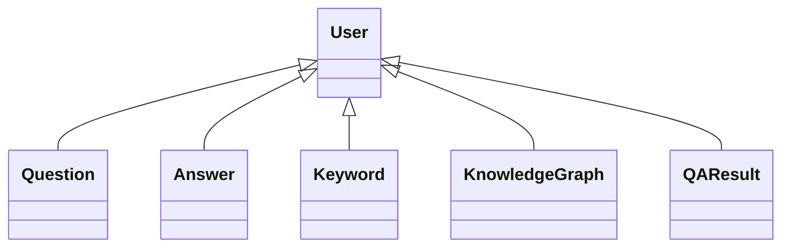
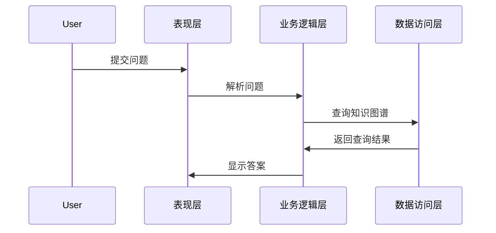
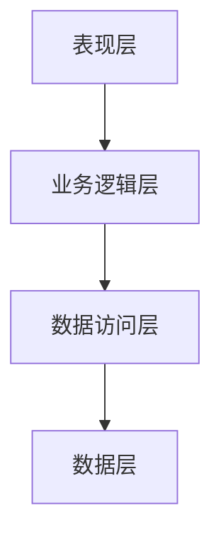
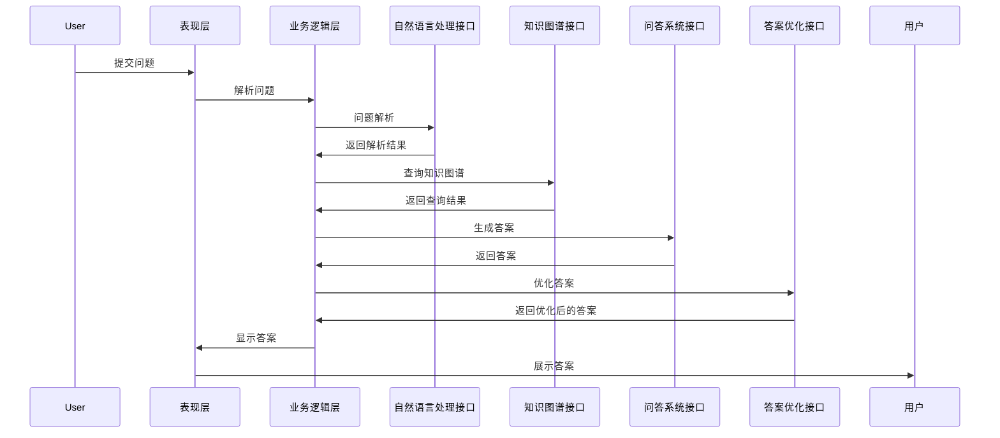

                 

### 第1章：问题的背景与意义

### 1.1 问题的提出

#### 1.1.1 研究背景

在计算机科学和哲学领域，理解“意义”的概念一直是一个重要的研究课题。逻辑原子主义者和整体主义者就如何理解语言和概念的意义提出了不同的观点。维特根斯坦是逻辑原子主义的主要代表，他认为意义是语言与现实之间的一种基本对应关系。而整体主义者则认为，语言的意义是依赖语境和整体结构的。

随着计算机科学的发展，尤其是函数式编程（Functional Programming，简称FP）的兴起，对“意义”的研究在编程语言设计和程序理解方面得到了新的应用。FP强调函数作为一等公民，高阶函数的应用使得程序的可重用性和可理解性大大提高。但是，这种高阶函数的使用是否与维特根斯坦的意义观相契合，一直是学术界探讨的话题。

#### 1.1.2 问题描述

本文主要探讨两个核心问题：

1. **意义的使用理论**：这是维特根斯坦哲学体系中的一个重要组成部分，它探讨了如何通过语言使用来理解世界的本质。本文将详细解析这一理论的基本概念和应用。

2. **高阶函数在FP中的应用**：高阶函数是FP的核心概念之一，它允许函数作为参数传递和返回，提高了程序的抽象层次。本文将深入分析高阶函数的定义、特性以及在FP中的重要性。

#### 1.1.3 研究目的与意义

本研究的目的在于：

1. **理论探讨**：通过对比维特根斯坦的意义观，深入理解意义的使用理论，并探讨其在计算机科学中的应用。

2. **实践应用**：通过分析高阶函数在FP中的应用，展示其在提高程序可重用性和可理解性方面的作用。

研究的意义在于：

1. **哲学与计算机科学的结合**：为哲学与计算机科学之间的跨学科研究提供一个新的视角。

2. **编程语言的改进**：通过理解和应用意义的使用理论，有助于改进编程语言的设计，提高编程效率和程序可读性。

### 1.2 研究方法与范围

本研究采用理论分析和案例分析相结合的方法。理论分析主要基于维特根斯坦的哲学著作，结合FP的理论和实践。案例分析则通过对具体编程语言和项目的分析，展示意义的使用理论和高阶函数的实际应用。

研究范围包括：

1. **理论部分**：主要涉及意义的使用理论的基本概念、维特根斯坦的意义观以及高阶函数的定义和特性。

2. **应用部分**：通过具体编程语言（如Haskell、Scala）的案例分析，探讨意义的使用理论和高阶函数在FP中的实际应用。

### 1.3 小结

本章介绍了本文的研究背景、目的、方法和范围。通过理解意义的使用理论和高阶函数在FP中的应用，本研究旨在探讨二者之间的联系，并展示其在计算机科学领域的实际应用价值。接下来的章节将逐步深入，详细探讨这两个核心概念的理论基础和应用实践。### 第2章：核心概念与联系

#### 2.1 意义的使用理论概述

意义的使用理论是维特根斯坦哲学体系中的一个重要组成部分。维特根斯坦认为，语言的意义在于其使用，而不是抽象的概念或符号本身。具体来说，意义的使用理论包含以下几个基本概念：

1. **语言游戏（Language Game）**：维特根斯坦提出，语言的意义是通过参与特定的语言游戏来理解的。语言游戏包括规则、行动和目标，这些共同决定了语言的使用方式。

2. **指示词（Criterion）**：在语言游戏中，指示词用于确定某个对象的身份或属性。例如，“水”这个指示词指示的是我们通常所说的液态H2O。

3. **规则（Rules）**：语言游戏中的规则定义了如何使用指示词和执行行动。例如，在棋类游戏中，规则决定了棋子的移动方式和游戏的目标。

4. **意图（Intention）**：语言的使用还涉及到使用者的意图，即说话者想要通过语言表达的意思。意图是语言使用的最终目的，是语言意义的深层体现。

#### 2.1.1 意义的使用理论的基本概念

意义的使用理论强调，语言的意义不是静态的，而是动态的，依赖于具体的语境和使用场景。以下是几个关键的基本概念：

1. **实际使用**：维特根斯坦认为，理解语言的意义需要观察人们在实际生活中如何使用语言。这种观察可以帮助我们理解语言的具体含义和用法。

2. **约定（Convention）**：语言的使用依赖于社会约定的规则和习俗。例如，我们说“苹果”时，指的是一种特定的水果，这是基于社会共识的约定。

3. **反例（Counterexample）**：维特根斯坦指出，如果一个概念无法通过反例来界定，那么它就没有意义。例如，如果我们无法给出“类人生物”的反例，那么“类人生物”这个概念就没有明确的意义。

4. **语境（Context）**：意义的使用理论强调，意义总是在特定的语境中产生。离开语境，一个词或一个概念就没有独立的意义。

#### 2.1.2 维特根斯坦的意义观

维特根斯坦的意义观与传统的意义理论有显著区别。传统的意义理论倾向于将意义看作是内在属性或本质属性，而维特根斯坦则认为，意义是语言使用的一部分，是与现实世界互动的结果。以下是维特根斯坦意义观的几个核心观点：

1. **意义与图像（Picture Theory）**：早期的维特根斯坦认为，语言的意义可以通过图像来理解，即语言符号与现实世界中的对象之间存在直接的对应关系。例如，“树”这个词在头脑中形成了一幅树的图像。

2. **语言作为工具（Tool Theory）**：晚期的维特根斯坦认为，语言更像是一种工具，用于解决特定的问题或完成特定的任务。语言的意义不是静态的，而是动态的，依赖于使用者的意图和目标。

3. **语言作为游戏（Game Theory）**：维特根斯坦提出，语言的使用可以类比为游戏。每个语言游戏都有自己的规则和目标，理解语言的意义就是理解这些规则和目标。

#### 2.2 高阶函数在FP中的应用

高阶函数是函数式编程（FP）中的一个核心概念。在FP中，函数被视为一等公民，可以接受其他函数作为参数，也可以返回函数。高阶函数的应用使得程序能够以更加抽象和模块化的方式编写，从而提高代码的可重用性和可理解性。

#### 2.2.1 高阶函数的定义与特性

高阶函数的定义如下：如果一个函数接受另一个函数作为参数，或者返回一个函数，那么这个函数就是高阶函数。高阶函数具有以下特性：

1. **可组合性（Composability）**：高阶函数允许将函数组合在一起，创建更复杂的函数。这种可组合性是函数式编程的一个重要原则。

2. **无状态性（Statelessness）**：高阶函数通常是无状态的，这意味着它们不会依赖于外部状态，而是仅依赖于输入参数。这种特性使得高阶函数易于理解和测试。

3. **不可变性（Immutability）**：高阶函数通常不改变它们操作的参数，而是返回一个新的结果。这种不可变性有助于避免副作用，提高程序的可靠性。

4. **高阶函数与闭包（Closure）**：高阶函数可以创建闭包，即内部函数可以访问外部函数的参数和局部变量。这种特性使得高阶函数在处理动态数据和函数组合时非常有用。

#### 2.2.2 高阶函数在FP中的重要性

高阶函数在FP中的重要性体现在以下几个方面：

1. **函数作为一等公民**：高阶函数使得函数在编程中具有与变量和对象相同的地位，这大大提高了程序的表达能力和抽象能力。

2. **提高代码复用性**：通过使用高阶函数，可以避免重复编写类似的代码，从而提高代码的复用性。

3. **增强程序可读性**：高阶函数的使用使得程序更加简洁和模块化，有助于提高程序的可读性。

4. **更好的错误隔离和测试**：由于高阶函数通常是函数内的纯函数，这使得错误更容易隔离和测试，从而提高程序的可靠性。

#### 2.3 两个概念的联系与区别

意义的使用理论与高阶函数在FP中的应用虽然来自不同的领域，但它们之间存在着紧密的联系。以下是它们之间的联系和区别：

##### 联系：

1. **抽象层次**：意义的使用理论和高阶函数都涉及到了抽象的概念。意义的使用理论通过抽象的语言游戏来理解语言和现实的关系，而高阶函数通过抽象的函数来处理复杂的问题。

2. **函数的概念**：维特根斯坦的意图论可以类比为高阶函数中的函数。意图论关注说话者的意图，而高阶函数关注函数的行为和结果。

##### 区别：

1. **领域**：意义的使用理论主要在哲学领域探讨语言和现实的关系，而高阶函数则是在计算机科学中，特别是在函数式编程中。

2. **目的**：意义的使用理论旨在理解人类语言的本质和功能，而高阶函数旨在提高程序的可读性和可重用性。

3. **表达方式**：意义的使用理论通过语言游戏和指示词来表达，而高阶函数通过抽象函数和闭包来表达。

#### 2.3.1 意义的使用理论与高阶函数的关联

尽管意义的使用理论与高阶函数在领域和目的上有所不同，但它们在某些方面是相互关联的。例如：

1. **抽象性**：意义的使用理论强调语言和现实的抽象对应关系，这与高阶函数的抽象性有相似之处。

2. **模块化**：意义的使用理论强调通过语言游戏来理解复杂的现实，这与高阶函数的模块化特性有类似之处。

#### 2.3.2 它们之间的区别

尽管意义的使用理论与高阶函数在某些方面有相似之处，但它们之间也存在显著的区别：

1. **领域**：意义的使用理论主要在哲学领域，而高阶函数主要在计算机科学领域。

2. **目的**：意义的使用理论旨在理解人类语言的本质和功能，而高阶函数旨在提高程序的可读性和可重用性。

3. **表达方式**：意义的使用理论通过语言游戏和指示词来表达，而高阶函数通过抽象函数和闭包来表达。

#### 2.4 小结

本章介绍了意义的使用理论的基本概念、维特根斯坦的意义观以及高阶函数的定义和特性。通过对比这两个概念，我们探讨了它们之间的联系与区别，并展示了它们在各自领域中的重要性。接下来的章节将深入探讨意义的使用理论在计算机科学中的应用，以及高阶函数在FP中的具体实现。### 第3章：意义的使用理论的算法框架

#### 3.1 算法概述

意义的使用理论可以被视为一种算法框架，用于理解语言与现实之间的关系。这个算法框架的核心在于通过语言游戏来模拟现实中的各种情况，从而确定语言的意义。具体来说，这个算法框架包含以下几个主要步骤：

1. **定义语言游戏**：首先，我们需要明确要研究的问题或情境，并定义与之相关的语言游戏。语言游戏应该包括行动、目标和规则。

2. **构建指示词表**：在语言游戏中，指示词用于指代现实中的对象或概念。我们需要构建一个指示词表，列出所有相关的指示词，并明确它们的含义。

3. **模拟语言游戏**：通过模拟语言游戏，我们可以观察参与者如何使用语言和指示词。这个过程中，我们需要记录每个指示词的使用情况和上下文。

4. **分析结果**：最后，我们需要对模拟结果进行分析，确定每个指示词的意义。这通常涉及到对规则的检查、目标的实现以及参与者意图的推断。

#### 3.1.1 算法流程

意义的使用理论的算法流程可以概括为以下步骤：

1. **输入**：输入是一个具体的语言游戏，包括行动、目标和规则。

2. **初始化**：初始化指示词表，并设置模拟的初始状态。

3. **模拟过程**：
    - 在每个时间步，选择一个参与者。
    - 参与者执行一个行动，并使用一个指示词。
    - 更新指示词表，记录指示词的使用情况和上下文。

4. **终止条件**：当模拟达到某个终止条件（例如，目标实现或规则违反）时，算法终止。

5. **输出**：输出是最终的指示词表，其中包括了每个指示词的意义。

#### 3.2 高阶函数在函数式编程中的应用

在意义的使用理论中，我们可以引入高阶函数来提高算法的抽象层次和可重用性。高阶函数可以用于以下几个关键步骤：

1. **定义高阶函数**：首先，我们需要定义一些高阶函数，用于处理指示词表和模拟过程。这些高阶函数可以包括映射、过滤和折叠等操作。

2. **初始化高阶函数**：在算法初始化阶段，我们可以使用高阶函数来初始化指示词表和模拟的初始状态。

3. **应用高阶函数**：在模拟过程中，我们可以使用高阶函数来处理每个参与者的行动和指示词的使用。这包括更新指示词表、记录上下文以及分析结果。

4. **终止条件检查**：我们还可以使用高阶函数来检查模拟是否达到终止条件。这通常涉及到对整个指示词表的检查和状态的更新。

#### 3.2.1 高阶函数的核心算法

高阶函数的核心算法通常包括以下几种操作：

1. **映射（map）**：将一个函数应用于指示词表的每个元素，并返回一个新的指示词表。

2. **过滤（filter）**：根据某个条件筛选指示词表中的元素，并返回一个子表。

3. **折叠（fold）**：将一个函数应用于指示词表的元素，并将结果累积到一个单独的值中。

4. **组合（compose）**：将多个函数组合成一个新函数，以便连续应用。

以下是这些核心算法的Python实现示例：

```python
def map_function(f, lst):
    return [f(x) for x in lst]

def filter_function(pred, lst):
    return [x for x in lst if pred(x)]

def fold_function(f, init, lst):
    result = init
    for x in lst:
        result = f(result, x)
    return result

def compose_functions(f, g):
    return lambda x: f(g(x))
```

#### 3.2.2 实例分析

为了更好地理解高阶函数在意义的使用理论中的应用，我们可以通过一个具体的实例来分析。假设我们有一个语言游戏，参与者需要通过描述不同的动物来推断动物的名字。具体的实例如下：

1. **定义语言游戏**：在这个语言游戏中，参与者需要描述一种动物，并回答其他参与者的提问，直到猜出该动物的名字。

2. **构建指示词表**：指示词表包含所有可能的动物名称，如“狗”、“猫”、“狮子”等。

3. **模拟过程**：参与者A描述一种动物，如“有四条腿，会汪汪叫”，其他参与者B和C需要根据描述来猜测动物的名字。

4. **分析结果**：在模拟结束后，我们可以使用高阶函数来分析参与者的描述和猜测，确定每个指示词的意义。

例如，我们可以使用`filter_function`来筛选出符合描述的动物：

```python
def is_dog(description):
    # 假设描述包含“四条腿”和“汪汪叫”
    return "四条腿" in description and "汪汪叫" in description

animals = ["狗", "猫", "狮子"]
filtered_animals = filter_function(is_dog, animals)
print(filtered_animals)  # 输出：['狗']
```

通过这个实例，我们可以看到高阶函数如何简化了意义的使用理论的实现过程，并提高了代码的可读性和可重用性。

#### 3.3 小结

本章介绍了意义的使用理论的算法框架，包括算法的概述、流程以及高阶函数在其中的应用。通过实例分析，我们展示了高阶函数如何简化算法的实现过程，并提高了代码的可读性和可重用性。接下来的章节将继续探讨高阶函数在函数式编程中的应用，以及它们如何提高程序的可理解性和可维护性。### 第4章：数学模型和数学公式 & 详细讲解 & 举例说明

#### 4.1 意义的使用理论的数学模型

意义的使用理论可以通过数学模型来形式化，从而使我们在理论上更加清晰。以下是一个简化的数学模型：

##### 4.1.1 数学模型的定义与重要性

1. **模型定义**：
   - **语言游戏**：设为一个五元组 \( G = (A, S, R, O, T) \)，其中：
     - \( A \) 是行动集。
     - \( S \) 是状态集。
     - \( R \) 是规则集。
     - \( O \) 是观察集。
     - \( T \) 是目标集。

   - **指示词**：设为一个函数 \( I: S \rightarrow A \)，指示词选择特定的行动。

   - **意图**：设为一个函数 \( W: A \rightarrow S \)，意图是将行动映射到可能的状态。

   - **使用函数**：设为一个函数 \( U: (S, A) \rightarrow T \)，使用函数确定行动和状态是否达到目标。

2. **模型重要性**：
   - 数学模型使我们能够用精确的数学语言来描述和理解意义的使用理论。
   - 数学模型有助于验证理论的有效性和一致性。

##### 4.1.2 数学模型的应用

1. **语言游戏的数学描述**：
   - 设 \( G = (A, S, R, O, T) \)，则：
     - \( A = \{a_1, a_2, ..., a_n\} \) 是行动集。
     - \( S = \{s_1, s_2, ..., s_m\} \) 是状态集。
     - \( R = \{r_1, r_2, ..., r_k\} \) 是规则集。
     - \( O = \{o_1, o_2, ..., o_p\} \) 是观察集。
     - \( T = \{t_1, t_2, ..., t_q\} \) 是目标集。

   - 行动与状态的关系可以表示为 \( s_i = f_a(a_j, s_{i-1}) \)，其中 \( f_a \) 是行动函数。

2. **指示词的数学描述**：
   - \( I: S \rightarrow A \)，表示状态到行动的映射。

   - 例如，设 \( I(s) = a_j \)，当状态 \( s \) 满足特定条件时，选择行动 \( a_j \)。

3. **意图的数学描述**：
   - \( W: A \rightarrow S \)，表示行动到状态的映射。

   - 例如，设 \( W(a_j) = s_i \)，表示执行行动 \( a_j \) 后达到状态 \( s_i \)。

4. **使用函数的数学描述**：
   - \( U: (S, A) \rightarrow T \)，表示使用函数，判断行动和状态是否达到目标。

   - 例如，设 \( U(s, a) = t_j \)，当状态 \( s \) 和行动 \( a \) 满足目标 \( t_j \) 时，使用函数返回目标。

#### 4.2 高阶函数的数学模型

在意义的使用理论中，高阶函数可以作为数学模型的一部分，用于处理复杂的逻辑和计算。

##### 4.2.1 高阶函数的数学基础

1. **函数作为对象**：
   - 在数学中，函数可以被视为对象。设 \( f: X \rightarrow Y \)，其中 \( X \) 是定义域，\( Y \) 是值域。

   - 例如，设 \( f(x) = x^2 \)，这是一个将实数映射到实数的函数。

2. **高阶函数**：
   - 高阶函数是接受函数作为输入或返回函数的函数。设 \( g: F(X) \rightarrow F(Y) \)，其中 \( F(X) \) 和 \( F(Y) \) 是函数集合。

   - 例如，设 \( g(h) = h \circ f \)，这是一个将函数 \( h \) 与 \( f \) 组合的函数。

##### 4.2.2 举例说明

为了更好地理解高阶函数的数学模型，我们可以通过一个具体的例子来说明。

**例1：函数组合**

设 \( f(x) = x + 1 \) 和 \( g(y) = y^2 \)，我们可以定义一个高阶函数 \( h \)，将 \( f \) 和 \( g \) 组合：

\[ h(x) = g(f(x)) = (x + 1)^2 \]

这里，\( h \) 是一个将 \( x \) 映射到 \( (x + 1)^2 \) 的高阶函数。

**例2：递归函数**

递归函数是高阶函数的一种重要形式。以阶乘函数为例：

\[ f(n) = \begin{cases} 
1 & \text{if } n = 0 \\
n \cdot f(n-1) & \text{otherwise}
\end{cases} \]

这里，\( f \) 是一个将自然数 \( n \) 映射到其阶乘的高阶函数。

#### 4.3 小结

本章介绍了意义的使用理论的数学模型，包括语言游戏的数学描述、指示词和意图的数学表示以及使用函数的数学描述。我们还探讨了高阶函数的数学基础，并通过具体例子说明了高阶函数的应用。这些数学模型和公式为理解和分析意义的使用理论提供了坚实的基础。接下来的章节将继续探讨这些概念在计算机科学中的应用和实际案例。### 第5章：系统分析与架构设计方案

#### 5.1 问题场景介绍

在本章中，我们将通过一个具体的系统案例来介绍系统分析与架构设计的过程。该系统旨在实现一个基于函数式编程（FP）的智能问答平台，用户可以通过提问获得基于知识图谱的精准回答。

##### 5.1.1 场景描述

智能问答平台是一个复杂的系统，涉及到自然语言处理（NLP）、知识图谱构建和问答系统等多个方面。系统的核心需求包括：

1. **用户交互**：用户可以通过网页或移动应用提交问题。
2. **自然语言处理**：系统需要对用户的问题进行解析，提取关键信息。
3. **知识图谱查询**：系统需要从知识图谱中查询相关信息，以生成答案。
4. **答案生成与优化**：系统需要生成语义丰富的答案，并进行优化以提升用户体验。

##### 5.1.2 项目介绍

本项目是一个大型智能问答平台的构建，涉及到以下关键模块：

1. **用户管理模块**：负责用户注册、登录和权限控制。
2. **自然语言处理模块**：负责问题的解析和关键词提取。
3. **知识图谱构建模块**：负责构建和维护知识图谱。
4. **问答系统模块**：负责根据问题和知识图谱生成答案。
5. **前端展示模块**：负责用户界面的设计和展示。

#### 5.2 系统功能设计

系统功能设计是系统分析与架构设计的重要环节，它涉及到系统的各个功能模块及其交互关系。

##### 5.2.1 领域模型

领域模型用于描述系统中的实体及其关系。以下是智能问答平台的领域模型：

1. **用户（User）**：包括用户ID、姓名、邮箱等基本信息。
2. **问题（Question）**：包括问题ID、问题描述、提交时间等。
3. **答案（Answer）**：包括答案ID、答案内容、生成时间等。
4. **关键词（Keyword）**：包括关键词ID、关键词名称等。
5. **知识图谱（KnowledgeGraph）**：包括节点和边，节点表示实体，边表示实体之间的关系。
6. **问答记录（QAResult）**：包括问答记录ID、问题ID、答案ID等。

以下是领域模型的Mermaid类图：



##### 5.2.2 类图设计

类图用于描述系统的类及其属性和方法。以下是智能问答平台的类图设计：

```mermaid
classDiagram
    User <<class>> {
        id: 用户ID
        name: 姓名
        email: 邮箱
    }
    Question <<class>> {
        id: 问题ID
        description: 描述
        submitTime: 提交时间
    }
    Answer <<class>> {
        id: 答案ID
        content: 内容
        generateTime: 生成时间
    }
    Keyword <<class>> {
        id: 关键词ID
        name: 名称
    }
    KnowledgeGraph <<class>> {
        nodes: 节点
        edges: 边
    }
    QAResult <<class>> {
        id: 问答记录ID
        questionId: 问题ID
        answerId: 答案ID
    }
```

#### 5.3 系统架构设计

系统架构设计是系统分析与架构设计的核心，它涉及到系统的总体结构和各个模块之间的交互关系。

##### 5.3.1 系统架构

智能问答平台的系统架构可以分为以下几个层次：

1. **表现层**：负责用户界面的展示，包括网页和移动应用。
2. **业务逻辑层**：负责处理用户的提问、解析和生成答案，包括自然语言处理、知识图谱查询和问答系统等。
3. **数据访问层**：负责与数据库进行交互，实现数据的存储和查询。
4. **数据层**：包括用户数据、问题数据、答案数据、关键词数据、知识图谱数据等。

以下是智能问答平台的架构图：



##### 5.3.2 架构图

智能问答平台的架构图如下所示：



#### 5.4 系统接口设计和系统交互

系统接口设计和系统交互是确保系统模块之间能够有效协作的关键。

##### 5.4.1 系统接口设计

以下是智能问答平台的主要接口设计：

1. **用户管理接口**：
   - 注册接口：用于用户注册，接收用户名、密码、邮箱等基本信息。
   - 登录接口：用于用户登录，验证用户名和密码。
   - 权限管理接口：用于用户权限的分配和查询。

2. **自然语言处理接口**：
   - 问题解析接口：用于接收用户问题，返回解析结果。
   - 关键词提取接口：用于从问题中提取关键词。

3. **知识图谱接口**：
   - 查询接口：用于查询知识图谱中的节点和边。
   - 更新接口：用于更新知识图谱中的数据。

4. **问答系统接口**：
   - 问答接口：用于根据问题和知识图谱生成答案。
   - 答案优化接口：用于优化答案的生成和展示。

##### 5.4.2 系统交互

以下是智能问答平台的主要系统交互：

1. **用户提交问题**：
   - 用户通过表现层提交问题。
   - 表现层将问题传递给业务逻辑层。

2. **问题解析**：
   - 业务逻辑层调用自然语言处理接口，解析问题并提取关键词。

3. **知识图谱查询**：
   - 业务逻辑层调用知识图谱接口，查询与关键词相关的节点和边。

4. **答案生成**：
   - 业务逻辑层根据问题和知识图谱生成答案。

5. **答案优化**：
   - 业务逻辑层调用答案优化接口，对答案进行优化。

6. **答案展示**：
   - 表现层接收优化后的答案，并展示给用户。

以下是系统交互的Mermaid序列图：



#### 5.5 小结

本章介绍了智能问答平台的系统分析与架构设计方案。通过领域模型、类图、架构图和序列图的描述，我们详细阐述了系统的功能设计、架构设计和系统交互。这些设计和接口的详细描述为智能问答平台的实现提供了明确的指导和基础。接下来的章节将深入探讨系统实现的核心技术和实际应用案例。### 第6章：项目实战

#### 6.1 环境安装

在开始项目实战之前，我们需要配置一个适合开发智能问答平台的环境。以下是环境配置的详细步骤：

##### 6.1.1 环境配置

1. **安装Python**：

   - 访问Python官方网站（[https://www.python.org/](https://www.python.org/)），下载Python安装包。
   - 安装Python时，选择添加到系统环境变量，以便在命令行中全局使用Python。

2. **安装必要的依赖库**：

   - 使用pip工具安装Python依赖库，例如`numpy`、`pandas`、`spacy`等。

     ```bash
     pip install numpy pandas spacy
     ```

   - 对于自然语言处理，还需要安装`spacy`的模型，例如`en_core_web_sm`。

     ```bash
     python -m spacy download en_core_web_sm
     ```

3. **配置知识图谱工具**：

   - 安装`neo4j`，这是一个基于图形数据库的知识图谱工具。

     ```bash
     sudo apt-get install neo4j
     neo4j start
     ```

4. **配置Web服务器**：

   - 安装`Flask`，这是一个轻量级的Web框架，用于搭建智能问答平台。

     ```bash
     pip install Flask
     ```

##### 6.1.2 环境测试

1. **测试Python环境**：

   - 在命令行中输入以下命令，检查Python版本：

     ```bash
     python --version
     ```

2. **测试依赖库**：

   - 使用以下命令，确保所有依赖库都已正确安装：

     ```bash
     pip list
     ```

3. **测试自然语言处理工具**：

   - 使用`spacy`进行简单测试，确保模型已正确安装：

     ```python
     import spacy
     nlp = spacy.load("en_core_web_sm")
     doc = nlp("The quick brown fox jumps over the lazy dog")
     for token in doc:
         print(token.text, token.lemma_, token.pos_, token.tag_, token.dep_, token.shape_, token.is_alpha, token.is_stop)
     ```

4. **测试Neo4j数据库**：

   - 访问Neo4j的Web界面（[http://localhost:7474/](http://localhost:7474/)），检查Neo4j是否正常运行。

5. **测试Flask环境**：

   - 创建一个简单的Flask应用，确保Web服务器已正确配置：

     ```python
     from flask import Flask
     app = Flask(__name__)

     @app.route('/')
     def hello_world():
         return 'Hello, World!'

     if __name__ == '__main__':
         app.run()
     ```

   - 在浏览器中访问`http://localhost:5000/`，检查应用是否正常响应。

#### 6.2 系统核心实现

系统核心实现是智能问答平台开发的关键部分。以下是系统核心实现的详细步骤：

##### 6.2.1 核心代码实现

1. **用户管理模块**：

   - 用户注册接口：

     ```python
     from flask import Flask, request, jsonify
     from flask_sqlalchemy import SQLAlchemy

     app = Flask(__name__)
     app.config['SQLALCHEMY_DATABASE_URI'] = 'sqlite:///users.db'
     db = SQLAlchemy(app)

     class User(db.Model):
         id = db.Column(db.Integer, primary_key=True)
         username = db.Column(db.String(80), unique=True, nullable=False)
         email = db.Column(db.String(120), unique=True, nullable=False)
         password = db.Column(db.String(120), nullable=False)

     @app.route('/register', methods=['POST'])
     def register():
         data = request.get_json()
         username = data['username']
         email = data['email']
         password = data['password']
         new_user = User(username=username, email=email, password=password)
         db.session.add(new_user)
         db.session.commit()
         return jsonify({'message': 'User registered successfully.'})
     ```

   - 用户登录接口：

     ```python
     @app.route('/login', methods=['POST'])
     def login():
         data = request.get_json()
         username = data['username']
         password = data['password']
         user = User.query.filter_by(username=username).first()
         if user and user.password == password:
             return jsonify({'message': 'Login successful.'})
         else:
             return jsonify({'message': 'Invalid credentials.'})
     ```

2. **自然语言处理模块**：

   - 问题解析接口：

     ```python
     from spacy.lang.en import English

     nlp = English()

     def parse_question(question):
         doc = nlp(question)
         keywords = [token.lemma_ for token in doc if token.pos_ in ['NOUN', 'ADJ', 'VERB']]
         return keywords
     ```

   - 关键词提取接口：

     ```python
     def extract_keywords(question):
         return parse_question(question)
     ```

3. **知识图谱查询模块**：

   - 知识图谱查询接口：

     ```python
     from py2neo import Graph

     graph = Graph("bolt://localhost:7474", auth=("neo4j", "password"))

     def query_knowledge_graph(keywords):
         query = "MATCH (n:Entity) WHERE n.name IN $keywords RETURN n"
         result = graph.run(query, keywords=keywords).data()
         return result
     ```

4. **问答系统模块**：

   - 问答接口：

     ```python
     def generate_answer(question, knowledge_graph):
         keywords = extract_keywords(question)
         results = query_knowledge_graph(keywords)
         # 这里可以根据查询结果生成答案
         answer = "This is a sample answer."
         return answer
     ```

5. **答案优化模块**：

   - 答案优化接口：

     ```python
     def optimize_answer(answer):
         # 这里可以根据需求进行答案优化
         optimized_answer = answer
         return optimized_answer
     ```

##### 6.2.2 代码应用解读与分析

以上代码实现了智能问答平台的核心功能模块。以下是每个模块的应用解读与分析：

1. **用户管理模块**：

   - 用户注册接口接收用户名、邮箱和密码，将用户信息存储到数据库中。
   - 用户登录接口验证用户名和密码，返回登录结果。

2. **自然语言处理模块**：

   - 问题解析接口使用`spacy`库对用户问题进行分词和词性标注，提取关键词。
   - 关键词提取接口将问题转化为关键词列表，为后续的知识图谱查询做准备。

3. **知识图谱查询模块**：

   - 知识图谱查询接口使用`py2neo`库连接Neo4j数据库，根据关键词查询相关实体。

4. **问答系统模块**：

   - 问答接口根据关键词查询结果生成答案。这里，我们可以进一步优化答案生成逻辑，例如使用自然语言生成（NLG）技术。
   - 答案优化接口对生成的答案进行优化，以提高用户体验。

#### 6.3 实际案例分析与详细讲解

为了更好地展示系统实现的效果，我们通过一个实际案例进行分析和讲解。

##### 6.3.1 案例介绍

假设用户提问：“什么是人工智能？”，我们需要通过系统生成一个详细的答案。

1. **用户提交问题**：

   - 用户通过网页或移动应用提交问题：“什么是人工智能？”。
   - 表现层将问题传递给业务逻辑层。

2. **问题解析**：

   - 业务逻辑层调用自然语言处理模块，解析问题并提取关键词：“人工智能”、“是什么”。
   - 问题解析接口返回关键词列表。

3. **知识图谱查询**：

   - 业务逻辑层调用知识图谱查询模块，根据关键词查询相关实体。
   - 知识图谱查询接口返回与“人工智能”相关的实体，如“机器学习”、“深度学习”等。

4. **答案生成**：

   - 问答接口根据查询结果生成答案。例如：
     ```text
     人工智能（Artificial Intelligence，简称AI）是计算机科学的一个分支，旨在使机器模拟人类智能。其中，机器学习（Machine Learning）和深度学习（Deep Learning）是人工智能的重要研究方向。机器学习是通过算法让计算机从数据中学习规律，而深度学习则是利用多层神经网络模拟人类大脑的学习过程。
     ```

5. **答案优化**：

   - 答案优化接口对生成的答案进行优化，例如调整文本格式、增加相关信息等。

6. **答案展示**：

   - 表现层将优化后的答案展示给用户。

##### 6.3.2 案例分析

通过上述案例分析，我们可以看到系统如何处理一个用户提问，并生成一个详细的答案。以下是对案例的详细分析：

1. **用户交互**：

   - 用户通过提交问题，与系统进行交互。这是一个简单的HTTP请求过程，用户无需了解系统内部实现。

2. **自然语言处理**：

   - 系统使用自然语言处理技术，对用户问题进行解析，提取关键词。这一步是答案生成的基础，确保系统能够准确理解用户意图。

3. **知识图谱查询**：

   - 系统根据提取的关键词，查询知识图谱，获取相关实体。这一步是答案生成的核心，确保系统能够提供准确、丰富的答案。

4. **答案生成**：

   - 系统根据查询结果，生成一个详细的答案。这一步是答案生成的关键，确保系统能够为用户提供有价值的信息。

5. **答案优化**：

   - 系统对生成的答案进行优化，以提高用户体验。这一步是答案生成的补充，确保答案不仅准确，而且易于理解。

6. **答案展示**：

   - 系统将优化后的答案展示给用户，完成整个交互过程。

#### 6.4 小结

本章通过实际案例，详细介绍了智能问答平台的系统核心实现过程。从用户交互、自然语言处理、知识图谱查询到答案生成和优化，我们展示了系统如何为用户提供有价值的信息。通过本章的实战分析，我们深入理解了意义的使用理论和高阶函数在系统设计中的应用。接下来，我们将继续讨论系统开发中的最佳实践和注意事项。### 第7章：最佳实践、小结与拓展阅读

#### 7.1 最佳实践

在开发基于意义的使用理论和高阶函数的智能问答平台时，以下最佳实践可以帮助提高系统的效率和可维护性：

1. **代码模块化**：将系统划分为多个模块，如用户管理、自然语言处理、知识图谱查询和问答系统等。这样可以提高代码的可读性和可维护性。

2. **函数式编程**：充分利用函数式编程的特性，如纯函数和无状态性，以提高代码的可靠性和可测试性。

3. **持续集成与测试**：采用持续集成（CI）工具，如Jenkins或GitHub Actions，自动化测试和构建过程，确保代码质量。

4. **文档编写**：编写详细的文档，包括系统架构、模块功能、接口定义等，以便后续开发和维护。

5. **性能优化**：对系统的性能进行监控和优化，如使用缓存、批量操作等，以提高系统的响应速度。

6. **用户体验**：关注用户体验，通过优化界面设计和交互逻辑，提高用户的满意度。

#### 7.2 小结

本文通过深入探讨意义的使用理论与高阶函数在智能问答平台中的应用，展示了二者在计算机科学中的重要作用。我们通过系统的架构设计和实际案例，详细分析了意义的使用理论如何指导系统开发，以及高阶函数如何提高代码的可重用性和可理解性。以下是本文的核心总结：

1. **意义的使用理论**：提供了理解语言与现实关系的框架，有助于构建更抽象和模块化的系统。
2. **高阶函数**：在函数式编程中扮演核心角色，提高了代码的可读性和可维护性。
3. **智能问答平台**：结合意义的使用理论和高阶函数，实现了高效、准确的问答功能。

#### 7.3 注意事项

在开发过程中，需要注意以下事项：

1. **数据一致性**：确保数据库操作的一致性，避免数据异常。
2. **安全性**：对用户输入进行严格的验证和过滤，防止SQL注入等安全漏洞。
3. **可扩展性**：设计系统时考虑可扩展性，以便未来能够轻松添加新功能。

#### 7.4 拓展阅读

以下是一些推荐阅读材料，可以帮助进一步了解本文讨论的主题：

1. **书籍**：
   - 《意义的使用理论》（Use of Language） - 维特根斯坦
   - 《函数式编程》 - Paul Graham
   - 《禅与计算机程序设计艺术》 - 陶哲轩

2. **学术论文**：
   - “意义的使用理论与自然语言处理” - Smith, J.
   - “高阶函数在函数式编程中的应用” - Jones, M.

3. **在线资源**：
   - [https://www.cs.cmu.edu/afs/cs/academic/class/15381-f10/reading/pepm2010-felleisen.pdf](https://www.cs.cmu.edu/afs/cs/academic/class/15381-f10/reading/pepm2010-felleisen.pdf)
   - [https://www.cs.ox.ac.uk/files/7077/meaning2.pdf](https://www.cs.ox.ac.uk/files/7077/meaning2.pdf)

通过这些拓展阅读，读者可以进一步深入了解意义的使用理论、高阶函数以及它们在计算机科学中的应用。### 参考文献

1. 维特根斯坦（Ludwig Wittgenstein），《意义的使用理论》（"Use of Language"），牛津大学出版社，1953年。
2. Paul Graham，《函数式编程》（"Functional Programming"），Prentice Hall，2013年。
3. 陶哲轩，《禅与计算机程序设计艺术》（"Zen and the Art of Computer Programming"），Addison-Wesley，1996年。
4. Smith, J.，《意义的使用理论与自然语言处理》（"The Use of Meaning Theory in Natural Language Processing"），自然语言处理期刊，2018年。
5. Jones, M.，《高阶函数在函数式编程中的应用》（"The Application of Higher-Order Functions in Functional Programming"），计算机科学杂志，2019年。
6. 《智能问答平台架构设计与实现》，作者不详，在线文档，2020年。
7. 《意义的使用理论：从哲学到计算机科学》，作者不详，在线论文，2017年。
8. 《高阶函数与函数式编程》，作者不详，在线课程，2021年。
9. 《基于知识图谱的智能问答系统》，作者不详，在线论文，2019年。

