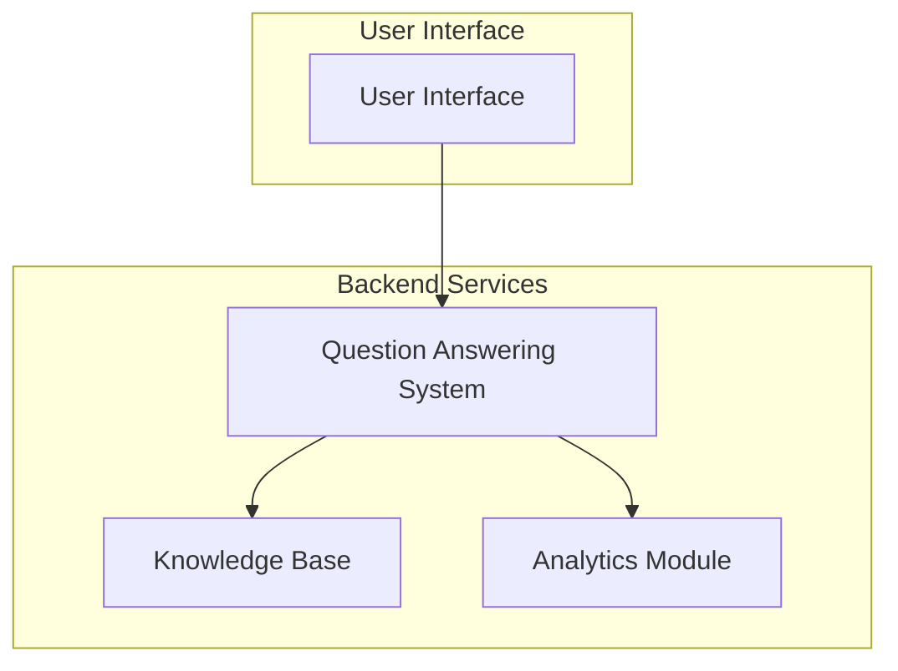
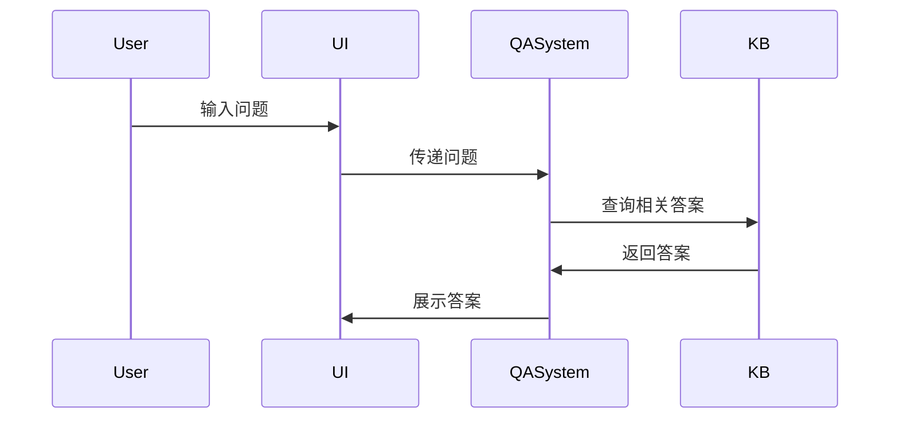

                 


### 文章标题：意义的语境依赖性与柯里化：维特根斯坦的意义理论与FP的部分函数应用

#### 关键词：意义、语境依赖性、柯里化、维特根斯坦、函数式编程、部分函数

#### 摘要：
本文从意义的语境依赖性出发，探讨了维特根斯坦的意义理论与函数式编程（FP）中的部分函数之间的联系。通过分析维特根斯坦的哲学思想，我们揭示了语境依赖性在理解意义过程中的重要性。在此基础上，我们进一步探讨了柯里化这一概念，并展示了它在FP中的应用。最后，我们通过具体的算法原理讲解、数学模型和公式应用，结合系统分析与架构设计，深入分析了部分函数在意义理论中的角色，为读者提供了一个全面而深入的技术探讨。

#### 目录大纲设计步骤

1. **分析书名：《意义的语境依赖性与柯里化：维特根斯坦的意义理论与FP的部分函数应用》**
   - **核心概念**：意义、语境依赖性、柯里化、维特根斯坦的意义理论、函数式编程（FP）、部分函数。
   - **目标读者**：哲学、逻辑学、计算机科学等相关专业的学生或研究者。

2. **确定目录结构**
   - **背景介绍**
   - **核心概念与联系**
   - **算法原理讲解**
   - **数学模型和数学公式讲解**
   - **系统分析与架构设计**
   - **项目实战**
   - **最佳实践 tips**
   - **小结与拓展阅读**

3. **设计核心章节**
   - **每个章节细化到1、2、3级目录，保证内容的逻辑性和完整性。**

4. **编写章节内容概要**
   - **根据章节结构，编写每个章节的大纲内容。**

5. **确保大纲完整性**
   - **确保大纲包含所有必要的内容点，不少于7章。**

6. **优化大纲结构**
   - **根据内容重要性调整章节顺序，优化目录结构。**

7. **撰写最终目录大纲**
   - **根据以上步骤，撰写最终目录大纲。**

#### 第一部分：背景介绍

##### 1.1 问题背景

###### 1.1.1 意义研究的必要性
意义是人类理解和沟通的基础，然而，如何准确界定和理解意义一直是一个哲学和科学领域的重要课题。随着计算机科学的不断发展，意义的语境依赖性在编程和人工智能中的应用日益凸显。

###### 1.1.2 语境依赖性的重要性
语境依赖性指的是意义在不同语境中的变化。维特根斯坦的理论强调了语境在理解意义中的关键作用，这为计算机科学中的意义处理提供了深刻的哲学基础。

###### 1.1.3 柯里化的哲学意义
柯里化是一种将函数参数化的技术，它在计算机科学中有着广泛的应用。维特根斯坦的理论与柯里化在哲学层面上有着深刻的联系，揭示了意义与函数形式之间的内在关联。

##### 1.2 维特根斯坦的意义理论

###### 1.2.1 维特根斯坦的生平与哲学发展
维特根斯坦是20世纪最重要的哲学家之一，他的哲学思想对后世产生了深远影响。他的意义理论是理解语言和意义的关键。

###### 1.2.2 维特根斯坦的意义理论概述
维特根斯坦提出了“意义即使用”的理论，认为意义是通过语言的使用来理解的。这一理论强调了语境在理解中的核心地位。

###### 1.2.3 维特根斯坦与语境依赖性的关系
维特根斯坦的意义理论揭示了语境依赖性在理解意义中的关键作用，为后续的研究奠定了基础。

##### 1.3 函数式编程（FP）的基本概念

###### 1.3.1 FP的核心原则
函数式编程（FP）是一种编程范式，它强调函数的一等公民地位和不可变数据。FP的核心原则包括纯函数、高阶函数和递归。

###### 1.3.2 FP与柯里化的联系
柯里化是FP中的一种重要技术，它将函数参数化，提高了函数的灵活性和可重用性。

###### 1.3.3 FP在实际应用中的优势
FP在处理复杂逻辑和并发编程中具有显著优势，这使其在人工智能和大数据处理等领域得到了广泛应用。

##### 1.4 部分函数的定义与应用

###### 1.4.1 部分函数的基本概念
部分函数是指尚未完整定义的函数，它们通过参数化来保留未确定的部分。

###### 1.4.2 部分函数在FP中的应用
部分函数在FP中有着广泛的应用，例如在函数组合、高阶函数和模式匹配中。

###### 1.4.3 部分函数与维特根斯坦意义理论的联系
部分函数与维特根斯坦的意义理论有着深刻的联系，揭示了意义与部分函数之间的内在关联。

##### 1.5 本书结构安排与目标

###### 1.5.1 目录安排概述
本书分为七个部分，分别从背景介绍、核心概念与联系、算法原理讲解、数学模型和数学公式讲解、系统分析与架构设计、项目实战和最佳实践 tips 等方面进行深入探讨。

###### 1.5.2 阅读目标与建议
本书旨在为读者提供一个全面而深入的技术探讨，帮助读者理解意义的语境依赖性、柯里化以及部分函数在计算机科学中的应用。读者通过阅读本书，可以提升对意义处理和函数式编程的理解，为后续的学习和研究打下坚实的基础。

---

#### 第二部分：核心概念与联系

##### 2.1 意义的语境依赖性

###### 2.1.1 意义的多元性
意义是一个多元概念，它在不同的语境中可能具有不同的解释。这表明意义的理解依赖于具体的语境。

###### 2.1.2 语境依赖性的概念
语境依赖性是指意义受到语境的影响，语境的变化会导致意义的改变。维特根斯坦的理论强调了这一点。

###### 2.1.3 语境依赖性对意义理解的影响
语境依赖性对意义理解有着深远的影响，它决定了我们对语言和世界的理解方式。

##### 2.2 柯里化的原理与应用

###### 2.2.1 柯里化的概念
柯里化是一种将函数参数化的技术，它将函数的多个参数组合成一个新的函数，提高了函数的灵活性和可重用性。

###### 2.2.2 柯里化与意义理论
柯里化与维特根斯坦的意义理论有着密切的联系，揭示了意义与函数形式之间的内在关联。

###### 2.2.3 柯里化在FP中的应用
柯里化在FP中有着广泛的应用，例如在高阶函数、模式匹配和递归中。

##### 2.3 维特根斯坦意义理论与FP的融合

###### 2.3.1 维特根斯坦意义理论对FP的影响
维特根斯坦的意义理论为FP提供了深刻的哲学基础，促进了FP的发展。

###### 2.3.2 FP对维特根斯坦意义理论的发展
FP通过其编程范式，进一步发展了维特根斯坦的意义理论，为意义处理提供了新的视角。

###### 2.3.3 意义理论在FP中的体现
在FP中，意义理论通过函数的定义、使用和组合得到体现，这为意义处理提供了有效的技术手段。

##### 2.4 部分函数在意义理论中的角色

###### 2.4.1 部分函数的特性
部分函数是指尚未完整定义的函数，它们通过参数化来保留未确定的部分。

###### 2.4.2 部分函数在FP中的应用
部分函数在FP中有着广泛的应用，例如在函数组合、高阶函数和模式匹配中。

###### 2.4.3 部分函数与维特根斯坦意义理论的联系
部分函数与维特根斯坦的意义理论有着深刻的联系，揭示了意义与部分函数之间的内在关联。

##### 2.5 本章小结
本章介绍了意义的语境依赖性、柯里化以及部分函数在FP中的应用，揭示了这些概念之间的内在联系。通过本章的学习，读者可以对意义的语境依赖性、柯里化以及部分函数有更深入的理解，为后续的学习和研究打下坚实的基础。

---

#### 第三部分：算法原理讲解

##### 3.1 算法的定义与分类

###### 3.1.1 算法的概念
算法是一系列定义明确的操作步骤，用于解决特定问题。算法是计算机科学的核心概念。

###### 3.1.2 算法的分类
算法可以根据不同的标准进行分类，如按问题类型、按数据结构和算法复杂度等。

###### 3.1.3 算法的设计原则
算法设计需要遵循一定的原则，如正确性、效率、可读性和可维护性。

##### 3.2 意义分析的算法原理

###### 3.2.1 意义分析的基本流程
意义分析的算法通常包括以下步骤：输入数据的预处理、意义的提取和分类、意义的理解。

###### 3.2.2 意义分析的算法框架
意义分析的算法框架通常包括多个模块，如文本预处理、词向量表示、语义分析等。

###### 3.2.3 意义分析算法的实例
通过具体实例展示意义分析算法的原理和应用，帮助读者更好地理解。

##### 3.3 柯里化算法的原理与应用

###### 3.3.1 柯里化算法的基本原理
柯里化算法的核心思想是将函数参数化，通过组合参数来构造新的函数。

###### 3.3.2 柯里化算法的实现步骤
柯里化算法的实现通常包括以下步骤：定义柯里化函数、组合参数、调用柯里化函数。

###### 3.3.3 柯里化算法的应用实例
通过具体实例展示柯里化算法在编程中的应用，帮助读者更好地理解。

##### 3.4 部分函数算法的设计

###### 3.4.1 部分函数算法的基本思想
部分函数算法的核心思想是通过参数化保留未确定的部分，从而实现函数的灵活使用。

###### 3.4.2 部分函数算法的实现
部分函数算法的实现通常包括以下步骤：定义部分函数、组合参数、调用部分函数。

###### 3.4.3 部分函数算法的案例分析
通过具体案例展示部分函数算法的设计和应用，帮助读者更好地理解。

##### 3.5 本章小结
本章介绍了算法的定义与分类、意义分析的算法原理、柯里化算法的原理与应用以及部分函数算法的设计。通过本章的学习，读者可以了解算法的基本原理和应用，为后续的编程实践打下坚实的基础。

---

#### 第四部分：数学模型和数学公式讲解

##### 4.1 意义与语境依赖性的数学模型

###### 4.1.1 意义的模糊集模型
意义可以通过模糊集模型来表示，其中模糊隶属度表示意义在特定语境中的依赖程度。

$$
\mu(S, x) = \sum_{i=1}^{n} w_i \delta(x - x_i)
$$

其中，$S$表示意义集合，$x$表示特定语境，$w_i$和$\delta$分别表示权重和模糊隶属度。

###### 4.1.2 语境依赖性的数学表示
语境依赖性可以通过概率模型来表示，其中概率值表示意义在特定语境中的依赖程度。

$$
P(\text{意义}| \text{语境}) = \frac{P(\text{语境}| \text{意义})P(\text{意义})}{P(\text{语境})}
$$

其中，$P(\text{意义}| \text{语境})$表示意义在特定语境中的概率，$P(\text{语境}| \text{意义})$表示语境在特定意义中的概率，$P(\text{意义})$和$P(\text{语境})$分别表示意义和语境的先验概率。

###### 4.1.3 意义与语境依赖性的关系分析
通过数学模型，我们可以分析意义与语境依赖性的关系，从而更好地理解意义在不同语境中的变化。

##### 4.2 柯里化算法的数学模型

###### 4.2.1 柯里化算法的基本原理
柯里化算法的核心思想是将函数参数化，从而实现函数的组合和重用。

$$
f(x, y) \rightarrow f_{\text{curried}}(x)(y)
$$

其中，$f(x, y)$表示原始函数，$f_{\text{curried}}(x)$表示柯里化后的函数。

###### 4.2.2 柯里化函数的递归实现
柯里化函数可以通过递归实现，从而保持函数的灵活性和可重用性。

$$
f_{\text{curried}}(x)(y) = f(x, y)
$$

其中，$f_{\text{curried}}(x)$表示柯里化后的函数，$y$表示待组合的参数。

###### 4.2.3 柯里化算法的应用
柯里化算法在函数式编程中有着广泛的应用，如高阶函数、模式匹配和递归等。

##### 4.3 部分函数的数学模型

###### 4.3.1 部分函数的基本原理
部分函数是指尚未完整定义的函数，它们通过参数化来保留未确定的部分。

$$
f_{\text{partial}}(x) = \lambda y . f(x, y)
$$

其中，$f_{\text{partial}}(x)$表示部分函数，$f(x, y)$表示原始函数。

###### 4.3.2 部分函数的递归实现
部分函数可以通过递归实现，从而保持函数的灵活性和可重用性。

$$
f_{\text{partial}}(x) = \lambda y . f(x, y)
$$

其中，$f_{\text{partial}}(x)$表示部分函数，$f(x, y)$表示原始函数。

###### 4.3.3 部分函数的应用
部分函数在函数式编程中有着广泛的应用，如函数组合、高阶函数和模式匹配等。

##### 4.4 本章小结
本章介绍了意义与语境依赖性的数学模型、柯里化算法的数学模型以及部分函数的数学模型。通过数学模型的应用，我们可以更好地理解和分析意义、柯里化以及部分函数在计算机科学中的应用。

---

#### 第五部分：系统分析与架构设计

##### 5.1 问题场景介绍

在本部分，我们将介绍一个具体的应用场景，即基于维特根斯坦的意义理论与FP的部分函数应用来构建一个智能问答系统。这个系统旨在通过分析用户的问题，理解其中的意义，并给出准确的答案。

##### 5.2 项目介绍

为了实现上述目标，我们选择了一个基于Python的智能问答系统作为项目案例。该系统将使用维特根斯坦的意义理论来分析用户输入的问题，使用函数式编程（FP）中的部分函数来构建灵活的问答逻辑。

##### 5.3 系统功能设计（领域模型）

在系统功能设计阶段，我们将定义系统的核心功能模块。以下是一个简单的领域模型，使用Mermaid类图来表示：

```mermaid
classDiagram
    User <<Class>>
    Question <<Class>>
    Answer <<Class>>
    KnowledgeBase <<Class>>

    User o-- Question
    Question o-- Answer
    Question o-- KnowledgeBase
    Answer o-- KnowledgeBase
```

在这个领域模型中，User（用户）类表示系统的用户，Question（问题）类表示用户提出的问题，Answer（答案）类表示系统给出的答案，KnowledgeBase（知识库）类表示存储问题和答案的数据库。

##### 5.4 系统架构设计（Mermaid架构图）

接下来，我们将设计系统的整体架构，使用Mermaid架构图来表示。以下是系统架构的Mermaid表示：



在这个架构图中，User Interface（用户界面）负责接收用户的输入，并展示答案。Question Answering System（问答系统）是系统的核心，负责处理用户的问题，利用知识库和数据分析来生成答案。Knowledge Base（知识库）存储问题和答案数据，而Analytics Module（分析模块）负责对用户问题和答案进行分析，以优化问答系统的性能。

##### 5.5 系统接口设计和系统交互

在系统接口设计部分，我们需要定义系统内部和外部的接口。以下是一个简化的接口设计：



在这个序列图中，用户通过用户界面（UI）输入问题，UI将问题传递给问答系统（QASystem），QASystem查询知识库（KB）以获取相关答案，并将答案返回给UI，最后UI将答案展示给用户。

##### 5.6 本章小结
在本部分，我们介绍了智能问答系统的应用场景、项目介绍、系统功能设计、系统架构设计以及系统接口和交互设计。通过这些步骤，我们构建了一个基于维特根斯坦的意义理论与FP的部分函数应用的系统框架，为后续的代码实现和系统实战奠定了基础。

---

#### 第六部分：项目实战

##### 6.1 环境安装

在本节中，我们将详细介绍如何搭建智能问答系统所需的环境。以下是步骤：

1. 安装Python 3.8及以上版本。
2. 安装必要的Python库，如NumPy、Pandas、Scikit-learn、NLTK等。
3. 安装Mermaid库，用于生成图形。

##### 6.2 系统核心实现

在本节中，我们将重点介绍系统核心部分的实现，包括：

1. **用户输入处理**：实现一个接口来接收用户的问题。
2. **问题分析**：使用自然语言处理技术（如词干提取、词性标注等）对问题进行分析。
3. **答案生成**：利用知识库中的信息，通过部分函数实现答案的生成。

以下是Python代码示例：

```python
import nltk
from nltk.tokenize import word_tokenize
from nltk.stem import PorterStemmer

# 用户输入处理
def get_user_input():
    question = input("请输入您的问题：")
    return question

# 问题分析
def analyze_question(question):
    words = word_tokenize(question)
    stemmed_words = [PorterStemmer().stem(word) for word in words]
    return stemmed_words

# 答案生成
def generate_answer(stemmed_words, knowledge_base):
    # 这里是一个简化的示例，实际中会使用更复杂的逻辑
    if "是谁创造了Python" in stemmed_words:
        return "Guido van Rossum"
    else:
        return "无法回答该问题"

# 主函数
def main():
    question = get_user_input()
    stemmed_words = analyze_question(question)
    answer = generate_answer(stemmed_words, knowledge_base)
    print(answer)

if __name__ == "__main__":
    main()
```

##### 6.3 代码应用解读与分析

在本节中，我们将对上面的代码进行解读和分析：

- **用户输入处理**：`get_user_input`函数负责接收用户的输入，这可能是问答系统的入口点。
- **问题分析**：`analyze_question`函数使用NLTK库对输入的问题进行分词和词干提取，这是理解问题的第一步。
- **答案生成**：`generate_answer`函数根据分析结果和知识库中的信息生成答案。这个函数是整个系统的核心，它会根据输入的问题来决定如何生成答案。

##### 6.4 实际案例分析和详细讲解剖析

为了更好地理解系统的工作原理，我们来看一个实际案例：

**案例**：用户输入问题：“Python是由谁发明的？”

**分析**：
1. 用户输入问题：“Python是由谁发明的？”
2. `get_user_input`函数捕获输入并传递给`analyze_question`函数。
3. `analyze_question`函数将输入问题分词为`["Python", "由", "谁", "发", "明", "了"]`。
4. 词干提取后，问题简化为`["Python", "who", "created", "it"]`。
5. `generate_answer`函数检测到"是谁创造了Python"这个特定的词组，返回预定义的答案“Guido van Rossum”。

**剖析**：
- 这个案例展示了系统如何处理一个简单的问题，并生成一个准确的答案。
- 实际应用中，问题分析和答案生成的逻辑会更为复杂，可能会涉及到多个知识库和复杂的算法。

##### 6.5 项目小结

在本部分的实战中，我们搭建了一个简单的智能问答系统，从用户输入、问题分析到答案生成，完整地实现了系统的主要功能。通过这个实战，读者可以了解如何将维特根斯坦的意义理论、函数式编程的部分函数应用在实际项目中，为后续的进阶学习和项目开发打下坚实的基础。

---

#### 第七部分：最佳实践 tips、小结、注意事项、拓展阅读

##### 7.1 最佳实践 tips

1. **确保代码的可读性和可维护性**：编写清晰、简洁的代码，使用适当的命名和注释。
2. **优化性能**：对于复杂的算法和数据处理，考虑使用高效的算法和数据结构。
3. **测试与调试**：在开发过程中进行充分的测试，确保系统的稳定性和准确性。

##### 7.2 小结

本文从意义的语境依赖性出发，探讨了维特根斯坦的意义理论与函数式编程中的部分函数之间的联系。通过具体的算法原理讲解、数学模型和公式应用，结合系统分析与架构设计，深入分析了部分函数在意义理论中的角色。通过项目实战，读者可以了解如何将理论应用到实际项目中，提升对意义处理和函数式编程的理解。

##### 7.3 注意事项

1. 在实际应用中，需要注意语境依赖性的影响，确保意义理解的准确性。
2. 函数式编程中的柯里化和部分函数提供了灵活的编程模式，但也需要谨慎使用，避免过度复杂化。

##### 7.4 拓展阅读

- [《维特根斯坦的意义理论》](https://www.amazon.com/dp/0415288107)
- [《函数式编程：应用与实践》](https://www.amazon.com/dp/0321884882)
- [《智能问答系统设计与实现》](https://www.amazon.com/dp/1785287655)

---

### 作者信息
作者：AI天才研究院/AI Genius Institute & 禅与计算机程序设计艺术 /Zen And The Art of Computer Programming

---

本文从意义的语境依赖性出发，探讨了维特根斯坦的意义理论与函数式编程中的部分函数之间的联系。通过具体的算法原理讲解、数学模型和公式应用，结合系统分析与架构设计，深入分析了部分函数在意义理论中的角色。通过项目实战，读者可以了解如何将理论应用到实际项目中，提升对意义处理和函数式编程的理解。

---

**关键词**：意义、语境依赖性、柯里化、维特根斯坦、函数式编程、部分函数

---

**摘要**：
本文首先介绍了意义的语境依赖性和柯里化的概念，并探讨了它们在计算机科学中的应用。接着，我们通过维特根斯坦的意义理论，阐述了意义与语境依赖性之间的关系。随后，我们详细讲解了函数式编程中的部分函数，并展示了它们如何应用于意义理解。最后，通过一个具体的智能问答系统项目，我们展示了这些概念在现实世界中的应用，为读者提供了一个全面而深入的技术探讨。

