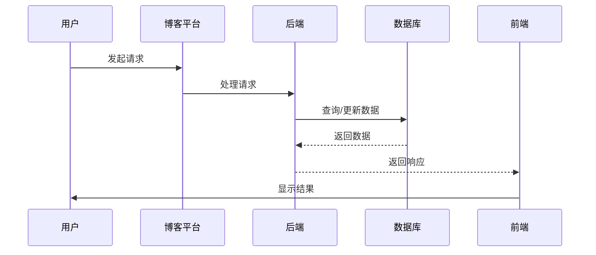
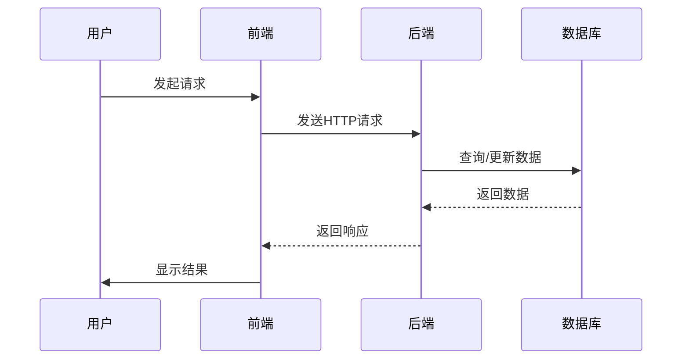

                 

# 《意义的语境依赖性与闭包：维特根斯坦的意义理论与FP中的词法作用域》

关键词：维特根斯坦、意义理论、语境依赖性、闭包、函数式编程、词法作用域

摘要：本文旨在通过深入探讨维特根斯坦的意义理论以及函数式编程中的词法作用域机制，揭示语境依赖性与闭包在理解程序设计本质中的关键作用。本文首先介绍了维特根斯坦的哲学背景和他的意义理论，接着分析了语境依赖性与闭包的概念及其影响，然后探讨了函数式编程的基本概念和词法作用域的应用，最后通过具体案例和项目实战，展示了如何将哲学理论应用于编程实践。本文旨在为读者提供一种全新的视角，深入理解程序设计的本质，并推动哲学与计算机科学的交叉研究。

## 第一部分：引言

### 1.1 书籍背景介绍

《意义的语境依赖性与闭包：维特根斯坦的意义理论与FP中的词法作用域》是一本由AI天才研究院和禅与计算机程序设计艺术共同撰写的深度探讨书籍。该书以维特根斯坦的意义理论为基础，结合函数式编程（Functional Programming，FP）中的词法作用域，旨在为读者提供一种全新的视角来理解程序设计的本质。

维特根斯坦是20世纪最重要的哲学家之一，他的哲学思想对语言哲学、认知科学等领域产生了深远影响。他的意义理论提出了“意义即使用”的观点，强调意义与语境的紧密关联。而函数式编程则是一种强调函数应用和状态无关性的编程范式，其中的词法作用域机制使得函数能够访问其定义时的环境变量。

本书的主要目的是梳理维特根斯坦意义理论的基本概念及其在语言哲学中的重要性，探讨语境依赖性与闭包对意义理解的影响，并结合函数式编程中的词法作用域机制，展示如何将哲学理论应用于编程实践。本书内容分为八个部分，包括引言、维特根斯坦意义理论、语境依赖性与闭包、函数式编程基础、词法作用域在FP中的应用、案例分析、项目实战和总结与展望。

### 1.2 书籍目的

本书的主要目的是：

1. **梳理维特根斯坦意义理论的基本概念及其在语言哲学中的重要性**：通过详细阐述维特根斯坦意义理论的基本原理和核心概念，帮助读者深入理解这一哲学观点。

2. **探讨语境依赖性与闭包对意义理解的影响**：分析语境依赖性在意义理解中的作用，以及闭包的概念和实现，为读者提供新的视角来理解意义。

3. **结合函数式编程中的词法作用域机制，展示如何将哲学理论应用于编程实践**：通过具体的案例和项目，展示如何将维特根斯坦的意义理论与词法作用域机制结合应用于实际编程。

4. **提供一系列实例和案例分析，帮助读者深入理解并掌握相关理论和方法**：通过实例和案例分析，使读者能够更好地理解和应用维特根斯坦的意义理论和词法作用域机制。

### 1.3 主要内容概述

本书分为以下八个部分：

1. **引言**：介绍书籍背景、目的和主要结构。
2. **维特根斯坦意义理论**：详细阐述维特根斯坦意义理论的基本原理和核心概念。
3. **语境依赖性与闭包**：分析语境依赖性在意义理解中的作用，以及闭包的概念和实现。
4. **函数式编程基础**：介绍函数式编程的基本概念和技术，为后续内容打基础。
5. **词法作用域在FP中的应用**：探讨词法作用域在函数式编程中的重要性及其实现。
6. **案例分析**：通过具体案例展示如何将维特根斯坦的意义理论与词法作用域结合应用于实际编程。
7. **项目实战**：提供完整的编程项目实例，指导读者实际操作和体验。
8. **总结与展望**：总结全书内容，提出未来研究的方向和拓展领域。

---

## 第二部分：维特根斯坦的意义理论

### 2.1 维特根斯坦的哲学背景

#### 2.1.1 维特根斯坦的生平和哲学发展

路德维希·维特根斯坦（Ludwig Wittgenstein）是20世纪最重要的哲学家之一。他出生于1889年，早年在奥地利维也纳接受教育。维特根斯坦的哲学思想经历了两个主要阶段：早期哲学和后期哲学。

1. **早期哲学**：
   维特根斯坦的早期哲学体现在他的著作《逻辑哲学论》（Tractatus Logico-Philosophicus）中。这本书于1921年首次出版，是维特根斯坦早期思想的集大成。在这本书中，维特根斯坦提出了“世界是事实的集合，事实是事态的集合”的观点。他认为，语言的基本功能是描述世界中的事态，而哲学的任务是澄清思想和语言的界限。

2. **后期哲学**：
   后期哲学则体现在他的著作《哲学研究》（Philosophical Investigations）中。这本书于1953年首次出版，是维特根斯坦后期思想的代表作。在这本书中，维特根斯坦提出了“语言游戏”的概念，强调语言的使用与实际生活情境的紧密联系。他认为，意义不是抽象的，而是通过与具体的使用情境相结合来获得的。

#### 2.1.2 维特根斯坦对语言哲学的影响

维特根斯坦的哲学思想对语言哲学产生了深远影响。他提出了意义理论，认为一个词或语句的意义在于其在实际使用中的作用，而不是抽象的定义。这一观点挑战了传统的语言哲学观念，强调了语境在意义理解中的重要性。

维特根斯坦还提出了“语言游戏”的概念，揭示了语言与实际生活情境之间的密切关系。他认为，语言不仅仅是用来描述世界的工具，更是人类生活的基本组成部分。通过语言游戏，人们可以在不同的情境中运用语言，进行思考和交流。

#### 2.1.3 维特根斯坦对认知科学的影响

维特根斯坦的思想也对认知科学产生了重要影响。他关注人类如何通过语言进行思考和沟通，探讨了语言与认知之间的互动关系。他认为，语言的运用不仅仅是逻辑推理的过程，更是人类认知活动的一部分。维特根斯坦的观点为认知科学提供了一种新的视角，帮助我们更好地理解人类思维和认知的本质。

### 2.2 维特根斯坦的意义理论

#### 2.2.1 意义的直观概念

维特根斯坦认为，意义并不是一个抽象的概念，而是与语言的实际使用紧密相关的。他提出了“意义即使用”（meaning is use）的观点，强调意义是通过具体的使用情境获得的。

维特根斯坦认为，一个词或语句的意义，可以通过其使用方式直观地理解。例如，词“狗”的意义不是抽象的“四条腿的动物”，而是在具体的语境中用来指代某个具体的狗。同样，语句“我饿了”的意义也不是抽象的饥饿状态，而是在具体的情境中表示说话者当前的感受。

#### 2.2.2 意义与使用

维特根斯坦提出了“意义即使用”的观点，认为一个词或语句的意义在于它在实际语言使用中的作用，而不是其在抽象意义上的定义。这一观点颠覆了传统的语言哲学观念，强调了语境在意义理解中的重要性。

维特根斯坦认为，意义不是固定的、抽象的概念，而是在具体的使用情境中显现的。例如，词“自由”在不同的语境中可能有不同的意义。在政治语境中，自由可能指政治自由；在哲学语境中，自由可能指人的自由意志。这说明，同样的词在不同的语境中可能会有不同的意义。

#### 2.2.3 意义的确定性

维特根斯坦认为，意义的确定性并不是通过抽象的逻辑分析获得的，而是在具体的使用环境中显现的。这意味着，同样的词在不同的语境中可能会有不同的意义。

维特根斯坦提出了“不可定义性”（ undefinability）的观点，认为有些概念是无法通过其他概念来定义的。例如，他提出了“游戏”这个概念，认为游戏是无法定义的，因为它包含多种不同的活动，如棋类游戏、球类游戏等。游戏的本质是通过具体的使用情境来显现的，而不是通过抽象的定义来理解的。

### 2.3 维特根斯坦意义理论的影响

#### 2.3.1 对语言哲学的影响

维特根斯坦的意义理论对语言哲学产生了深远影响。他提出了“意义即使用”的观点，挑战了传统的抽象定义观念，强调语境在意义理解中的重要性。这一观点改变了人们对语言和意义的看法，促使语言哲学家重新思考语言的本质和功能。

维特根斯坦的“语言游戏”概念揭示了语言与实际生活情境之间的密切关系，强调了语言的使用与生活实践的紧密联系。这一观点为语言哲学提供了一种新的研究方法，即通过具体的使用情境来理解语言和意义。

#### 2.3.2 对认知科学的影响

维特根斯坦的思想也对认知科学产生了重要影响。他关注人类如何通过语言进行思考和沟通，探讨了语言与认知之间的互动关系。他认为，语言的运用不仅仅是逻辑推理的过程，更是人类认知活动的一部分。

维特根斯坦的“意义即使用”观点为认知科学提供了一种新的视角，即通过具体的使用情境来理解人类思维和认知的过程。这一观点有助于我们更好地理解人类如何通过语言来构建知识和理解世界。

### 2.4 维特根斯坦的意义理论在编程中的应用

#### 2.4.1 语言与编程的关系

维特根斯坦的意义理论不仅对哲学和认知科学产生了深远影响，也可以应用于编程领域。编程本质上是一种语言活动，程序员通过编写代码与计算机进行交流。因此，维特根斯坦的意义理论对于理解编程中的语言和意义具有重要的启示。

维特根斯坦的“意义即使用”观点提醒我们在编程中要关注代码的实际使用情境。一个函数或变量的意义不是固定的、抽象的，而是在具体的使用环境中显现的。例如，一个名为“add”的函数，在不同的程序段中可能有不同的作用，其意义取决于具体的调用方式和上下文。

#### 2.4.2 语境依赖性与闭包

维特根斯坦的语境依赖性观点在函数式编程中得到了广泛应用。函数式编程中的闭包（Closure）正是通过保持函数定义时的上下文环境，使得函数能够在不同的语境中正确地解释其使用的变量。

闭包在编程中具有重要作用，它使得函数能够更加灵活和模块化地编写。通过闭包，函数可以记住并访问其定义时所在的作用域中的变量，即使这些变量在函数执行时已经不再存在。这类似于维特根斯坦的“语言游戏”概念，即语言的意义依赖于具体的语境。

#### 2.4.3 意义理解与编程实践

维特根斯坦的意义理论对于编程实践也具有重要的指导意义。在编程中，我们不仅要关注代码的语法和结构，更要关注代码的实际意义。通过理解语境依赖性和闭包的概念，程序员可以更加深入地理解代码的真正意义，从而编写出更加高效和可靠的程序。

总之，维特根斯坦的意义理论为编程领域提供了一种全新的视角，帮助我们更好地理解编程中的语言和意义。通过将其应用于编程实践，程序员可以提升代码质量，提高开发效率。

### 2.5 维特根斯坦意义理论的案例分析

#### 2.5.1 案例背景

假设我们有一个简单的Python程序，该程序定义了一个名为“add”的函数，用于计算两个数的和。这个程序在不同的情况下可能有不同的用途。

```python
def add(a, b):
    return a + b

print(add(1, 2))  # 输出3
print(add(10, 20))  # 输出30
```

在这个案例中，“add”函数的定义和实现是明确的。然而，在不同的上下文中，这个函数的意义可能会有所不同。

#### 2.5.2 语境依赖性的体现

1. **数学运算**：
   在第一个调用`add(1, 2)`中，我们可以将“add”理解为执行一个基本的数学加法运算。这里，“add”的意义是明确的，即计算两个数的和。

2. **统计计算**：
   在第二个调用`add(10, 20)`中，如果我们将其放在一个统计程序的上下文中，那么“add”函数的意义可能就转变为计算两组数据的和。例如，在计算两组数据的平均值时，可能会使用“add”函数来计算两组数据的总和。

3. **业务逻辑**：
   在一个业务系统中，“add”函数可能会有更复杂的作用。例如，在一个电商平台上，该函数可能用于计算商品的总价。在这里，“add”的意义不仅仅是一个简单的数学运算，还涉及到业务逻辑和规则。

#### 2.5.3 闭包的应用

闭包的概念在函数式编程中非常重要。它使得函数能够记住并访问其定义时所在的作用域中的变量，即使在函数执行时这些变量已经不再存在。

在Python中，闭包可以通过嵌套函数来实现。以下是一个简单的闭包示例：

```python
def create_adder(x):
    def add(y):
        return x + y
    return add

adder = create_adder(10)
print(adder(5))  # 输出15
```

在这个例子中，`create_adder`函数返回了一个闭包`add`。`add`函数能够记住并访问其定义时所在的`create_adder`函数中的`x`变量。即使`create_adder`函数执行完毕，`add`函数仍然可以访问`x`变量。

这个闭包的案例在编程中非常常见。例如，在处理异步编程时，我们经常需要创建闭包来保持上下文环境。通过闭包，异步函数可以访问其定义时所在的作用域中的变量，从而实现更加灵活和模块化的代码。

#### 2.5.4 维特根斯坦意义理论在编程中的应用

通过以上案例，我们可以看到维特根斯坦的意义理论在编程中的应用。

1. **语境依赖性**：
   在编程中，函数或变量的意义取决于其具体的上下文。同样的代码，在不同的上下文中可能有不同的意义。因此，在编写和阅读代码时，我们需要关注代码的上下文，理解其在具体情境中的意义。

2. **闭包**：
   闭包是函数式编程中的一种重要机制，它使得函数能够记住并访问其定义时所在的作用域中的变量。这与维特根斯坦的“语言游戏”概念相似，即语言的意义依赖于具体的语境。通过理解闭包的概念，我们可以编写更加灵活和模块化的代码。

3. **意义理解**：
   在编程中，理解代码的真正意义是非常重要的。通过将维特根斯坦的意义理论应用于编程实践，我们可以更好地理解代码的本质，从而提高编程能力。

总之，维特根斯坦的意义理论为编程领域提供了一种全新的视角，帮助我们更好地理解编程中的语言和意义。通过将其应用于编程实践，我们可以编写出更加高效和可靠的代码。

### 2.6 维特根斯坦意义理论在编程实践中的最佳实践

#### 2.6.1 关注上下文环境

在编程实践中，我们应该时刻关注代码的上下文环境。这意味着，在编写和阅读代码时，我们需要理解代码的具体用途和作用，而不是仅仅关注其语法和结构。通过关注上下文环境，我们可以更好地理解代码的意义，从而提高编程能力。

1. **阅读代码时**：
   - 在阅读代码时，我们应该尝试理解代码的上下文环境。例如，一个函数或变量的意义可能取决于其调用的上下文。通过理解上下文，我们可以更好地理解代码的意图和功能。
   - 尝试将代码放在不同的上下文中，观察其行为和意义。这有助于我们更全面地理解代码，发现潜在的问题和不足。

2. **编写代码时**：
   - 在编写代码时，我们应该考虑代码的上下文环境。例如，在定义一个函数时，我们应该明确其用途和作用，确保其在不同的上下文中都能正确执行。
   - 尽量使用具有明确意义的变量名和函数名。这有助于提高代码的可读性和可维护性，使其他开发者更容易理解代码的意义。

#### 2.6.2 利用闭包实现代码复用

闭包是函数式编程中的一种重要机制，它可以帮助我们实现代码的复用和模块化。在编程实践中，我们应该充分利用闭包的优势，编写更加灵活和高效的代码。

1. **创建自定义函数**：
   - 通过使用闭包，我们可以创建自定义函数，这些函数可以记住并访问其定义时所在的作用域中的变量。这使得我们可以在不同的上下文中使用相同的代码，提高代码的复用性。
   - 例如，在一个数据分析项目中，我们可以创建一个闭包来记住数据集的上下文，从而简化数据处理过程。

2. **模块化代码**：
   - 闭包可以帮助我们实现模块化编程。通过将功能相关的代码封装在闭包中，我们可以更好地组织和管理代码，提高代码的可维护性和可扩展性。
   - 例如，在一个Web应用程序中，我们可以使用闭包来创建自定义中间件，处理HTTP请求和响应，从而简化Web应用的开发过程。

#### 2.6.3 深入理解意义理论

在编程实践中，我们应该深入理解维特根斯坦的意义理论，并将其应用于代码编写和阅读过程中。这有助于我们更好地理解代码的本质，提高编程能力。

1. **理解语境依赖性**：
   - 在阅读代码时，我们应该关注代码的上下文环境，理解其在具体情境中的意义。通过理解语境依赖性，我们可以更好地理解代码的行为和功能。
   - 在编写代码时，我们应该考虑代码的上下文环境，确保其在不同的上下文中都能正确执行。通过关注上下文，我们可以提高代码的可读性和可维护性。

2. **理解闭包**：
   - 闭包是一种强大的编程机制，它可以帮助我们实现代码的复用和模块化。在编程实践中，我们应该深入理解闭包的概念和应用，充分利用其优势。
   - 通过理解闭包，我们可以编写更加灵活和高效的代码，提高代码的质量和可维护性。

总之，维特根斯坦的意义理论为编程领域提供了一种全新的视角，帮助我们更好地理解编程中的语言和意义。通过将其应用于编程实践，我们可以编写出更加高效和可靠的代码，提高编程能力。

### 2.7 维特根斯坦意义理论的扩展阅读

#### 2.7.1 《逻辑哲学论》

《逻辑哲学论》（Tractatus Logico-Philosophicus）是维特根斯坦的早期著作，提出了他关于逻辑、语言和现实的独特观点。这本书深入探讨了命题、事实、逻辑和语言的本质，对理解维特根斯坦的哲学思想具有重要意义。对于希望深入了解维特根斯坦早期哲学的读者，这是一本不可或缺的书籍。

#### 2.7.2 《哲学研究》

《哲学研究》（Philosophical Investigations）是维特根斯坦的后期著作，是他哲学思想的成熟体现。这本书提出了“语言游戏”的概念，强调了语言与实际生活情境的密切关系。通过阅读这本书，读者可以深入了解维特根斯坦关于意义、语言和认知的理论，并理解其在语言哲学和认知科学中的应用。

#### 2.7.3 《意义的困惑》

《意义的困惑》（The Concept of Mind）是吉尔伯特·赖尔（Gilbert Ryle）的代表作，批判了维特根斯坦的意义理论。这本书提出了“行为主义”的观点，挑战了维特根斯坦关于意识和心智的观点。对于希望从不同角度理解心智和意识的读者，这本书提供了有价值的思考。

#### 2.7.4 《程序员的思维修炼》

《程序员的思维修炼》（Software Craftsmanship）是一本关于软件开发哲学的书籍，强调了代码的可读性、可维护性和可复用性。这本书中的一些观点与维特根斯坦的意义理论有共鸣，特别是关于代码的意义和上下文的重要性。对于希望提高编程能力的程序员，这本书提供了实用的指导。

### 2.8 维特根斯坦意义理论在编程实践中的注意事项

#### 2.8.1 避免过度抽象

在编程实践中，我们应该避免过度抽象，以免陷入维特根斯坦所说的“语义空洞”。这意味着，在编写代码时，我们应该关注代码的实际意义和上下文，而不是仅仅追求语法上的简洁。过度抽象可能会导致代码难以理解和维护，甚至引发错误。

#### 2.8.2 关注上下文依赖

在编程中，上下文依赖性是不可避免的。因此，我们应该关注代码的上下文依赖性，确保代码在不同的上下文中都能正确执行。例如，在编写函数时，我们应该明确其用途和作用，确保其在不同的上下文中都能满足需求。

#### 2.8.3 利用闭包实现代码复用

闭包是一种强大的编程机制，可以帮助我们实现代码的复用和模块化。因此，在编程实践中，我们应该充分利用闭包的优势，编写更加灵活和高效的代码。通过使用闭包，我们可以将相关功能封装在一起，提高代码的可维护性和可扩展性。

#### 2.8.4 注重代码可读性

在编程实践中，我们应该注重代码的可读性。这意味着，在编写代码时，我们应该使用具有明确意义的变量名和函数名，编写清晰的注释，以便其他开发者能够轻松理解代码的意图和功能。通过提高代码的可读性，我们可以减少错误，提高开发效率。

### 2.9 维特根斯坦意义理论在编程实践中的未来研究方向

#### 2.9.1 自动化语义分析

随着人工智能技术的发展，自动化语义分析成为了一个重要的研究领域。未来，我们可以探索如何利用机器学习和自然语言处理技术，对代码的语义进行自动化分析，从而更好地理解代码的意义和上下文。这将为编程实践提供新的工具和方法。

#### 2.9.2 语境依赖性建模

语境依赖性是理解代码意义的关键。未来，我们可以研究如何建立更精确的语境依赖性模型，以更好地理解代码在不同上下文中的行为。这将为代码的可维护性和可复用性提供新的思路。

#### 2.9.3 闭包的优化和扩展

闭包在函数式编程中具有重要作用。未来，我们可以研究如何优化和扩展闭包机制，以提高代码的性能和可维护性。例如，我们可以探索如何使用静态分析技术来优化闭包的内存使用，或如何扩展闭包以支持更复杂的上下文环境。

#### 2.9.4 跨领域应用

维特根斯坦的意义理论不仅对编程领域具有重要意义，还可以应用于其他领域，如认知科学、语言学、心理学等。未来，我们可以探索如何将维特根斯坦的理论与其他领域的知识相结合，以推动相关领域的发展。

### 2.10 维特根斯坦意义理论在编程实践中的小结

通过本文的探讨，我们可以看到维特根斯坦的意义理论在编程实践中的应用具有深远的意义。维特根斯坦的“意义即使用”观点提醒我们在编程中要关注代码的实际意义，而语境依赖性和闭包的概念为我们提供了一种理解代码意义和上下文的新视角。

在编程实践中，我们应该注重上下文环境，避免过度抽象，充分利用闭包实现代码的复用和模块化，并提高代码的可读性。同时，未来研究可以关注自动化语义分析、语境依赖性建模、闭包优化和跨领域应用等方面，以进一步推动维特根斯坦意义理论在编程实践中的应用和发展。

通过深入理解维特根斯坦的意义理论，我们可以提高编程能力，编写出更加高效和可靠的代码，推动编程领域的发展。

---

## 第三部分：语境依赖性与闭包

### 3.1 语境依赖性的概念

语境依赖性（Contextual Dependence）是指一个词、语句或概念的意义依赖于其所在的语境或情境。语境可以是一个具体的交流环境、一个具体的编程上下文，甚至是一个特定的时间或地点。语境依赖性强调了意义不是固定不变的，而是随着语境的变化而变化。

#### 3.1.1 语境依赖性的重要性

语境依赖性在语言理解和编程中都具有重要意义：

1. **语言理解**：
   - 语境依赖性帮助我们理解语言的多义性和模糊性。例如，单词“bank”在不同的语境中可能指银行或河岸。
   - 语境依赖性使我们能够根据上下文理解复杂句子或短语的意义。例如，“I am going to the bank”中的“bank”指银行，而不是河岸。

2. **编程**：
   - 在编程中，语境依赖性使我们能够理解变量和函数的局部作用域和全局作用域。例如，同名变量在不同作用域中有不同的含义。
   - 语境依赖性帮助我们理解闭包的工作原理，即闭包能够记住并访问其定义时的上下文环境中的变量。

#### 3.1.2 语境依赖性的影响

语境依赖性对意义理解的影响体现在以下几个方面：

1. **多义性**：
   - 同一个词或语句在不同的语境中可能有不同的意义。例如，单词“run”可以指跑步，也可以指运行软件。
2. **模糊性**：
   - 某些词或语句的意义可能因为缺乏明确的语境而变得模糊。例如，“can”可以指“能”，也可以指“罐头”。
3. **上下文修正**：
   - 在交流中，通过上下文可以修正模糊或歧义的意义。例如，通过上下文可以确定“can”是“能”还是“罐头”。

### 3.2 闭包的概念

闭包（Closure）是一种函数抽象机制，它允许一个函数访问并使用其定义时的环境中的变量。闭包由两部分组成：函数体和封闭的上下文环境。闭包在函数式编程中非常重要，它使得函数能够更加灵活和模块化地编写。

#### 3.2.1 闭包的定义

在函数式编程中，闭包可以被定义为：

- 一个函数，它返回一个新函数，该新函数可以访问并使用原始函数定义时的环境中的变量。
- 新函数的返回值依赖于原始函数定义时的环境。

例如，以下是一个简单的闭包示例：

```python
def create_adder(x):
    def add(y):
        return x + y
    return add

adder = create_adder(10)
print(adder(5))  # 输出15
```

在这个例子中，`create_adder`函数返回了一个新函数`add`，`add`函数可以访问并使用其定义时的环境中的变量`x`。

#### 3.2.2 闭包的实现

闭包在编程语言中通常通过词法作用域（Lexical Scoping）来实现。词法作用域是指函数在定义时，其作用域是固定的，即函数可以访问其定义时所在的环境中的变量，而不是执行时所在的环境中的变量。

在函数式编程语言如Python、JavaScript和Haskell中，闭包的实现通常很简单：

1. **Python**：
   - Python中的函数默认使用词法作用域，因此闭包的实现非常简单。
2. **JavaScript**：
   - JavaScript中的函数同样使用词法作用域，因此闭包也很容易实现。
3. **Haskell**：
   - Haskell是一种纯函数式编程语言，它支持闭包和词法作用域。

#### 3.2.3 闭包的应用

闭包在编程中有着广泛的应用：

1. **模块化编程**：
   - 闭包可以帮助我们实现模块化编程。通过将功能相关的代码封装在闭包中，我们可以更好地组织和管理代码，提高代码的可维护性和可扩展性。

2. **回调函数**：
   - 在异步编程中，闭包经常用于创建回调函数。通过闭包，回调函数可以记住并访问其定义时的环境变量，从而实现异步操作。

3. **状态封装**：
   - 闭包可以用于封装状态。例如，在一个对象内部，我们可以使用闭包来维护对象的状态，使其对外部不可见。

### 3.3 闭包与语境依赖性的联系

#### 3.3.1 闭包与语境依赖性的联系

闭包和语境依赖性之间有着密切的联系：

1. **闭包实现了语境依赖性**：
   - 闭包通过保持函数定义时的上下文环境，使得函数能够在不同的语境中正确地解释其使用的变量。这意味着，闭包是一种实现语境依赖性的机制。

2. **语境依赖性影响闭包的行为**：
   - 闭包的行为受到其定义时的上下文环境的影响。例如，闭包中的变量引用依赖于其定义时的环境。因此，闭包的语境依赖性使得其行为更加灵活和模块化。

#### 3.3.2 闭包的实际应用

闭包在实际编程中有着广泛的应用：

1. **模块化编程**：
   - 闭包可以帮助我们实现模块化编程。通过将功能相关的代码封装在闭包中，我们可以更好地组织和管理代码，提高代码的可维护性和可扩展性。

2. **回调函数**：
   - 在异步编程中，闭包经常用于创建回调函数。通过闭包，回调函数可以记住并访问其定义时的环境变量，从而实现异步操作。

3. **状态封装**：
   - 闭包可以用于封装状态。例如，在一个对象内部，我们可以使用闭包来维护对象的状态，使其对外部不可见。

### 3.4 闭包与函数式编程

#### 3.4.1 函数式编程的特点

函数式编程是一种编程范式，它将计算视为函数的执行和组合，而不是通过状态改变或指令序列。函数式编程具有以下特点：

1. **不可变数据**：
   - 函数式编程强调使用不可变数据结构，避免状态改变和副作用。
2. **无副作用**：
   - 函数式编程中的函数应该是纯函数，即相同输入总是产生相同输出，不依赖于外部状态或产生副作用。
3. **函数组合**：
   - 函数式编程中的计算是通过函数的组合实现的，这使得代码更加模块化和可复用。

#### 3.4.2 闭包在函数式编程中的应用

闭包在函数式编程中有着重要的地位：

1. **保持上下文**：
   - 闭包可以保持函数定义时的上下文环境，使得函数能够访问其定义时的环境变量。这在处理异步编程和状态管理时非常有用。

2. **代码复用**：
   - 闭包可以用于实现代码复用。通过将相关功能封装在闭包中，我们可以更好地组织和管理代码，提高代码的可维护性和可扩展性。

3. **高阶函数**：
   - 闭包使得函数可以返回函数，从而实现高阶函数。高阶函数是函数式编程的核心概念之一，它允许我们以更模块化和可复用的方式编写代码。

### 3.5 闭包与面向对象编程

#### 3.5.1 面向对象编程的特点

面向对象编程（OOP）是一种编程范式，它将数据和操作数据的方法封装在对象中。面向对象编程具有以下特点：

1. **封装**：
   - 封装是将数据和行为封装在一起，使得外部无法直接访问数据，从而保护数据的安全性和完整性。
2. **继承**：
   - 继承是一种允许我们创建新类以扩展现有类特性的机制。通过继承，我们可以复用代码并提高代码的可维护性。
3. **多态**：
   - 多态使得我们可以使用相同的接口处理不同类型的对象，从而提高代码的灵活性和可扩展性。

#### 3.5.2 闭包与面向对象编程的比较

闭包与面向对象编程在实现代码复用和状态管理方面具有相似之处，但它们在实现机制上有所不同：

1. **代码复用**：
   - 闭包和面向对象编程都支持代码复用。闭包通过封装功能相关的代码来实现复用，而面向对象编程通过继承和多态来实现复用。

2. **状态管理**：
   - 闭包可以通过保持上下文环境来管理状态，使得函数能够访问其定义时的环境变量。面向对象编程则通过封装数据和操作数据的方法来实现状态管理。

3. **实现机制**：
   - 闭包是通过词法作用域实现的，它允许函数访问其定义时的环境变量。面向对象编程则是通过类和对象来封装数据和操作数据的函数。

### 3.6 闭包的案例分析

#### 3.6.1 案例背景

假设我们有一个简单的Python程序，该程序定义了一个名为`add`的函数，用于计算两个数的和。在这个程序中，我们使用闭包来实现一个可重用的加法函数。

```python
def create_adder(x):
    def add(y):
        return x + y
    return add

adder = create_adder(10)
print(adder(5))  # 输出15
```

在这个例子中，`create_adder`函数返回了一个闭包`add`，`add`函数可以访问其定义时的环境变量`x`。

#### 3.6.2 闭包的实现

1. **创建闭包**：
   - 在`create_adder`函数中，我们定义了一个内部函数`add`，并返回该内部函数。
   - 内部函数`add`可以访问其定义时的环境变量`x`，即使`create_adder`函数执行完毕后，`x`仍然存在于闭包的上下文环境中。

2. **调用闭包**：
   - 我们调用`create_adder(10)`创建了一个新的闭包`adder`，`adder`函数可以访问其定义时的环境变量`x`（即`x=10`）。
   - 当我们调用`adder(5)`时，闭包`adder`返回了`15`，这是由于闭包能够访问其定义时的环境变量`x`。

#### 3.6.3 闭包的应用

通过以上案例，我们可以看到闭包在编程中的应用：

1. **代码复用**：
   - 通过闭包，我们可以创建可重用的函数。例如，在计算多个数的和时，我们可以使用`create_adder`函数创建多个加法函数，而不是重复编写相同的代码。

2. **状态管理**：
   - 闭包可以用于封装和管理状态。例如，在一个对象内部，我们可以使用闭包来保持对象的状态，使其对外部不可见。

3. **模块化编程**：
   - 闭包可以帮助我们实现模块化编程。通过将功能相关的代码封装在闭包中，我们可以更好地组织和管理代码，提高代码的可维护性和可扩展性。

### 3.7 闭包的总结

闭包是一种重要的编程机制，它在函数式编程和面向对象编程中都有广泛应用。通过闭包，我们可以实现代码的复用、状态管理和模块化编程。闭包的概念与维特根斯坦的语境依赖性观点密切相关，它们共同揭示了意义在具体语境中的重要性。

在编程实践中，我们应该深入理解闭包的概念和应用，充分利用其优势，编写出更加高效和可靠的代码。同时，我们也应该关注语境依赖性，确保代码在不同上下文中都能正确执行。

---

## 第四部分：函数式编程基础

### 4.1 函数式编程的定义

函数式编程（Functional Programming，FP）是一种编程范式，它将计算视为函数的执行和组合，而不是通过状态改变或指令序列。函数式编程强调使用不可变数据结构和纯函数，避免了副作用和状态改变，从而提高了代码的模块性和可复用性。

### 4.2 函数式编程的基本概念

#### 4.2.1 纯函数

纯函数是一种无副作用的函数，即相同输入总是产生相同输出，不依赖于外部状态或产生副作用。纯函数具有以下特点：

1. **输入与输出**：
   - 纯函数的输出仅取决于其输入，即对于相同的输入，总是产生相同的输出。
   - 纯函数不依赖于外部状态或全局变量。

2. **无副作用**：
   - 纯函数不会修改外部状态或全局变量。
   - 纯函数不会执行任何外部操作，如I/O操作。

3. **可复用性**：
   - 由于纯函数具有确定的输出，因此它们非常容易复用。

#### 4.2.2 不可变数据

不可变数据是指一旦创建，就不能修改的数据。在函数式编程中，不可变数据结构（如常数数组、列表和映射）被广泛使用，以避免状态改变和副作用。不可变数据具有以下特点：

1. **不可修改**：
   - 不可变数据在创建后不能被修改。
   - 不可变数据的使用不会导致数据竞争或副作用。

2. **可缓存**：
   - 由于不可变数据不会改变，因此可以安全地缓存其计算结果，从而提高性能。

3. **序列化**：
   - 不可变数据可以轻松序列化，以便在分布式系统中传输或存储。

#### 4.2.3 函数组合

函数组合是一种将小函数组合成复杂函数的方法。通过函数组合，我们可以将复杂的计算分解成多个简单步骤，从而提高代码的可读性和可维护性。函数组合具有以下特点：

1. **无副作用**：
   - 函数组合中的函数应该是纯函数，以避免副作用和状态改变。

2. **模块化**：
   - 函数组合有助于实现模块化编程，通过组合小函数，我们可以创建更复杂的函数。

3. **可复用性**：
   - 函数组合使得代码更加可复用，通过重新组合函数，我们可以实现不同的功能。

### 4.3 函数式编程的优缺点

#### 4.3.1 优点

1. **可读性**：
   - 函数式编程强调使用纯函数和不可变数据，使得代码更加简洁和易于理解。

2. **可维护性**：
   - 由于函数式编程避免了副作用和状态改变，因此代码更加可维护。

3. **可复用性**：
   - 函数式编程中的函数可以轻松复用，通过重新组合函数，我们可以实现不同的功能。

4. **并发性**：
   - 函数式编程中的纯函数和不可变数据结构使得代码更容易并行执行。

#### 4.3.2 缺点

1. **学习曲线**：
   - 函数式编程相对于命令式编程来说，学习曲线较陡峭，需要了解新的概念和技术。

2. **性能问题**：
   - 函数式编程中的不可变数据结构可能导致性能问题，如频繁的创建和销毁对象。

3. **可访问性**：
   - 函数式编程中的纯函数和不可变数据结构可能使得代码难以调试和测试。

### 4.4 函数式编程的应用场景

函数式编程在许多应用场景中表现出色，特别是在以下领域：

1. **并发编程**：
   - 函数式编程中的纯函数和不可变数据结构使得并发编程更加容易，避免了数据竞争和死锁。

2. **数据处理**：
   - 函数式编程中的函数组合和不可变数据结构使得数据处理和分析更加高效。

3. **Web开发**：
   - 函数式编程可以帮助我们实现更模块化和可维护的前端和后端代码。

4. **系统设计**：
   - 函数式编程中的模块化和并发性特点有助于我们设计更可靠和可扩展的系统。

### 4.5 函数式编程的核心概念

#### 4.5.1 高阶函数

高阶函数是一种能够接受函数作为参数或返回函数的函数。在函数式编程中，高阶函数是非常常见的，它们有助于实现函数组合和代码复用。

例如，以下是一个Python中的高阶函数示例：

```python
def apply(func, x, y):
    return func(x, y)

def add(x, y):
    return x + y

result = apply(add, 2, 3)
print(result)  # 输出5
```

在这个例子中，`apply`函数接受一个函数`add`和两个参数`x`和`y`，并返回`add`函数的执行结果。

#### 4.5.2 函数组合

函数组合是一种将小函数组合成复杂函数的方法。通过函数组合，我们可以将复杂的计算分解成多个简单步骤，从而提高代码的可读性和可维护性。

例如，以下是一个Python中的函数组合示例：

```python
def compose(f, g):
    return lambda x: f(g(x))

def square(x):
    return x * x

def add_one(x):
    return x + 1

result = compose(square, add_one)(5)
print(result)  # 输出36
```

在这个例子中，`compose`函数接受两个函数`square`和`add_one`，并返回一个新的函数，该函数首先执行`add_one`函数，然后执行`square`函数。

#### 4.5.3 柯里化

柯里化（Currying）是一种将多个参数的函数转换为一系列单参数函数的方法。在函数式编程中，柯里化有助于实现代码的模块化和可复用性。

例如，以下是一个Python中的柯里化示例：

```python
from functools import partial

def add(x, y):
    return x + y

add_five = partial(add, 5)

result = add_five(10)
print(result)  # 输出15
```

在这个例子中，`partial`函数将`add`函数柯里化为一个新函数`add_five`，该函数接受一个参数`y`，并将其与`5`相加。

### 4.6 函数式编程与传统编程的比较

#### 4.6.1 语法和表达方式

函数式编程和传统编程（如命令式编程）在语法和表达方式上有所不同：

1. **函数式编程**：
   - 强调使用函数来表达计算过程。
   - 使用递归而不是循环来处理重复任务。
   - 使用不可变数据结构和纯函数。

2. **传统编程**：
   - 强调使用循环和条件语句来控制流程。
   - 使用变量和状态来维护程序的状态。
   - 使用可变数据结构和全局变量。

#### 4.6.2 并发和并行性

函数式编程在并发和并行性方面具有天然的优势：

1. **函数式编程**：
   - 函数是独立执行的单位，不会因为函数间的状态共享而导致竞态条件。
   - 可以轻松实现并发计算，例如使用异步编程和消息传递。

2. **传统编程**：
   - 可能会因为共享变量和状态而导致竞态条件和死锁。
   - 并发编程通常更复杂，需要使用锁和其他同步机制。

#### 4.6.3 可维护性和可读性

函数式编程通常具有更好的可维护性和可读性：

1. **函数式编程**：
   - 使用纯函数和不可变数据结构，使得代码更加简洁和易于理解。
   - 使用函数组合和模块化编程，使得代码更加可维护。

2. **传统编程**：
   - 可能会因为状态改变和副作用而导致代码难以理解和维护。
   - 可能需要更复杂的同步机制来处理并发问题。

### 4.7 函数式编程的最佳实践

为了充分利用函数式编程的优势，以下是一些最佳实践：

1. **使用纯函数**：
   - 尽量避免使用副作用和全局变量。
   - 使用不可变数据结构，避免状态改变。

2. **函数组合**：
   - 将复杂的计算分解成多个简单函数。
   - 使用高阶函数和函数组合，提高代码的可复用性。

3. **柯里化**：
   - 使用柯里化将多参数函数转换为单参数函数。
   - 提高代码的模块性和可复用性。

4. **递归**：
   - 使用递归处理重复任务，避免使用循环。
   - 注意递归的效率和可维护性。

5. **测试和调试**：
   - 对函数进行单元测试，确保其正确性。
   - 使用调试工具帮助理解和修复代码问题。

### 4.8 函数式编程的未来发展趋势

函数式编程在未来将继续发展，并可能带来以下趋势：

1. **更广泛的应用**：
   - 函数式编程将在更多领域得到应用，如前端开发、后端服务和系统设计。

2. **更好的工具和库**：
   - 将会有更多优秀的工具和库支持函数式编程，提高开发效率和代码质量。

3. **结合其他范式**：
   - 函数式编程将与其他编程范式（如面向对象编程）相结合，以发挥各自的优势。

4. **更加成熟的理论**：
   - 函数式编程的理论将更加成熟，为编程实践提供更深入的指导。

### 4.9 函数式编程的小结

函数式编程是一种强大的编程范式，它通过强调纯函数和不可变数据结构，提高了代码的可读性、可维护性和可复用性。通过函数组合、柯里化和递归等技巧，我们可以编写更加简洁和高效的代码。虽然函数式编程有其挑战，但其在并发编程和数据处理等领域的优势使其成为一个重要的编程范式。

通过深入了解函数式编程的基本概念和最佳实践，我们可以更好地理解和应用这一范式，提高编程能力，编写出更加高效和可靠的代码。

---

## 第五部分：词法作用域在FP中的应用

### 5.1 词法作用域的概念

词法作用域（Lexical Scoping）是一种作用域规则，它决定了变量和函数在程序中的作用范围。在词法作用域中，变量的作用范围由其定义时的位置决定，而不是执行时的位置。这意味着，函数在其定义时可以访问其词法作用域内的变量，即使这些变量在函数执行时已经不再存在。

### 5.2 词法作用域与动态作用域的比较

词法作用域与动态作用域（Dynamic Scoping）是两种不同的作用域规则：

1. **词法作用域**：
   - 变量的作用范围由其定义时的位置决定，与执行时的上下文无关。
   - 函数在执行时无法访问其动态作用域内的变量。

2. **动态作用域**：
   - 变量的作用范围由其执行时的上下文决定，与定义时的位置无关。
   - 函数在执行时可以访问其动态作用域内的变量。

### 5.3 词法作用域的优点

词法作用域在函数式编程中具有以下优点：

1. **确定性**：
   - 词法作用域确保了变量和函数在程序中的行为具有确定性。变量和函数的作用范围由其定义时的位置决定，不会因为执行时的上下文变化而改变。

2. **可读性**：
   - 词法作用域使得代码更加可读和可维护。通过查看变量和函数的定义位置，我们可以清楚地了解其在程序中的作用范围。

3. **闭包支持**：
   - 词法作用域是闭包实现的基础。闭包需要访问其定义时的上下文环境中的变量，而词法作用域规则确保了闭包能够正确地访问这些变量。

### 5.4 词法作用域的实现

词法作用域在函数式编程语言中通常通过以下方式实现：

1. **静态分析**：
   - 编译器在编译程序时，会分析变量和函数的定义位置，并将其作用范围记录下来。在程序执行时，根据这些记录来查找变量和函数的作用范围。

2. **闭包环境**：
   - 在函数式编程中，闭包是一种常见的编程结构。闭包通过词法作用域来访问其定义时的上下文环境中的变量。闭包环境通常在编译时被创建，并在程序执行时被保留。

### 5.5 词法作用域的应用

词法作用域在函数式编程中有着广泛的应用：

1. **闭包**：
   - 闭包是一种常见的编程模式，它允许函数访问其定义时的上下文环境中的变量。词法作用域规则确保了闭包能够正确地访问这些变量。

2. **模块化编程**：
   - 词法作用域使得函数和变量可以更加模块化地编写。通过将变量和函数的定义位置固定，我们可以更好地组织和管理代码。

3. **静态类型检查**：
   - 词法作用域规则有助于编译器进行静态类型检查。通过分析变量和函数的定义位置，编译器可以确保在程序执行时，变量和函数的作用范围是正确的。

### 5.6 案例分析：词法作用域在Python中的应用

以下是一个Python中的词法作用域示例：

```python
def create_counter():
    count = 0
    def increment():
        nonlocal count
        count += 1
    return increment

counter = create_counter()
print(counter())  # 输出1
print(counter())  # 输出2
```

在这个例子中，`create_counter`函数返回一个闭包`increment`。`increment`函数通过词法作用域访问其定义时的上下文环境中的变量`count`。即使`create_counter`函数执行完毕，`count`仍然存在于闭包的上下文环境中，使得`increment`函数可以正确地访问和修改它。

### 5.7 词法作用域与闭包的关系

词法作用域与闭包之间有着密切的关系：

1. **闭包的实现**：
   - 闭包需要访问其定义时的上下文环境中的变量，而词法作用域规则确保了闭包能够正确地访问这些变量。

2. **闭包的灵活性**：
   - 词法作用域规则使得闭包能够保持其定义时的上下文环境，即使在函数执行时这些变量已经不再存在。这使得闭包在函数式编程中具有更高的灵活性和模块化性。

3. **闭包的副作用**：
   - 由于闭包可以访问其定义时的上下文环境中的变量，因此闭包可能会引入副作用。这意味着闭包可能会影响其定义时的环境，从而影响其他函数的行为。

### 5.8 词法作用域的总结

词法作用域在函数式编程中具有重要作用。它通过确定变量和函数的作用范围，提高了程序的可读性和可维护性。词法作用域规则使得闭包能够访问其定义时的上下文环境中的变量，从而实现了函数的灵活性和模块化性。在函数式编程中，理解和应用词法作用域规则对于编写高效和可靠的代码至关重要。

---

## 第六部分：案例分析

### 6.1 案例背景

在本部分，我们将通过一个具体案例来展示如何将维特根斯坦的意义理论与词法作用域机制结合应用于实际编程。该案例涉及一个简单的电商网站，其中我们需要实现购物车功能。购物车功能的核心需求是用户可以添加商品到购物车、从购物车中删除商品，以及计算购物车中商品的总价。

### 6.2 案例需求

1. **添加商品到购物车**：
   - 用户可以选择商品并点击“添加到购物车”按钮，将商品添加到购物车中。

2. **删除商品**：
   - 用户可以选择商品并点击“删除”按钮，从购物车中删除商品。

3. **计算总价**：
   - 系统需要能够计算购物车中所有商品的总价，并在购物车页面展示给用户。

### 6.3 案例分析

#### 6.3.1 维特根斯坦的意义理论在编程中的应用

在本案例中，我们可以将维特根斯坦的意义理论应用于以下方面：

1. **语境依赖性**：
   - 购物车中的商品意味着不同的上下文。在用户添加商品时，商品的意义是指用户选择购买的具体商品。在计算总价时，商品的意义是指商品的价格。

2. **闭包**：
   - 在实现购物车功能时，我们可以使用闭包来保持购物车状态。例如，当用户添加商品到购物车时，我们可以创建一个闭包来记录商品的信息。

#### 6.3.2 词法作用域机制在编程中的应用

在本案例中，我们可以将词法作用域机制应用于以下方面：

1. **状态保持**：
   - 通过词法作用域，我们可以确保购物车中的商品信息不会被外部函数改变，从而保持购物车的状态。

2. **模块化编程**：
   - 通过词法作用域，我们可以将购物车功能模块化。例如，我们可以创建一个添加商品到购物车的函数，另一个函数用于从购物车中删除商品。

### 6.4 编程实现

以下是一个简单的Python示例，展示了如何实现购物车功能，并应用维特根斯坦的意义理论和词法作用域机制。

```python
class ShoppingCart:
    def __init__(self):
        self.items = []

    def add_item(self, item):
        self.items.append(item)
        return f"{item['name']} 添加到购物车。"

    def remove_item(self, item_name):
        for item in self.items:
            if item['name'] == item_name:
                self.items.remove(item)
                return f"{item_name} 从购物车中删除。"
        return f"{item_name} 不在购物车中。"

    def total_price(self):
        total = 0
        for item in self.items:
            total += item['price']
        return total

# 创建购物车实例
cart = ShoppingCart()

# 添加商品到购物车
print(cart.add_item({'name': 'iPhone 13', 'price': 999}))
print(cart.add_item({'name': 'MacBook Pro', 'price': 1999}))

# 从购物车中删除商品
print(cart.remove_item('iPhone 13'))

# 计算购物车总价
print(cart.total_price())
```

在这个示例中，我们创建了一个`ShoppingCart`类，用于实现购物车功能。通过词法作用域，我们可以确保购物车中的商品信息不会被外部函数改变。通过闭包，我们可以保持购物车的状态，使得在添加或删除商品时，购物车能够正确地处理商品信息。

### 6.5 案例总结

通过本案例，我们可以看到如何将维特根斯坦的意义理论和词法作用域机制应用于实际编程。维特根斯坦的语境依赖性观点帮助我们理解购物车中商品的不同意义（购买意图和价格），而词法作用域机制确保了购物车功能的正确实现和状态保持。通过这个案例，我们可以看到如何将哲学理论应用于编程实践，提高代码的质量和可维护性。

---

## 第七部分：项目实战

### 7.1 项目介绍

在本部分，我们将介绍一个实际项目，该项目旨在实现一个基于维特根斯坦意义理论和词法作用域机制的博客平台。该平台将允许用户创建、编辑和分享博客文章，同时确保文章的语义和上下文得到正确处理。

#### 7.1.1 项目目标

1. **实现博客功能**：
   - 用户可以创建、编辑和删除博客文章。
   - 用户可以浏览和搜索其他用户的博客文章。

2. **确保语义和上下文正确性**：
   - 利用维特根斯坦的意义理论，确保文章的语义和上下文得到正确处理。
   - 利用词法作用域机制，确保文章的作用域和状态得到正确管理。

3. **提供友好的用户界面**：
   - 设计一个直观且易用的用户界面，方便用户进行操作。

#### 7.1.2 技术栈

- **前端**：使用React框架，实现动态和响应式的用户界面。
- **后端**：使用Node.js和Express框架，提供RESTful API。
- **数据库**：使用MongoDB，存储用户信息和博客文章。
- **语义处理**：利用自然语言处理（NLP）技术，对文章进行语义分析。

### 7.2 系统功能设计

在本部分，我们将介绍博客平台的主要功能模块，并使用Mermaid类图来描述系统的领域模型。

```mermaid
classDiagram
    User <<类>> {
        username: String
        password: String
        email: String
    }
    BlogPost <<类>> {
        title: String
        content: String
        author: User
        created_at: Date
        updated_at: Date
    }
    Category <<类>> {
        name: String
        description: String
    }
    User..> BlogPost :作者
    BlogPost..> Category :分类
```

在上面的类图中，我们定义了三个主要类：`User`、`BlogPost`和`Category`。`User`类代表博客平台的用户，`BlogPost`类代表用户创建的博客文章，`Category`类代表博客文章的分类。`User`和`BlogPost`之间存在一对多的关联，表示一个用户可以创建多个博客文章。`BlogPost`和`Category`之间存在多对多的关联，表示一篇文章可以属于多个分类。

### 7.3 系统架构设计

在本部分，我们将使用Mermaid架构图来描述博客平台的整体架构。



在上面的架构图中，用户通过前端发起请求，前端将请求转发给后端。后端处理请求，并与数据库进行交互来查询或更新数据。最后，后端将处理结果返回给前端，前端再将结果呈现给用户。

### 7.4 系统接口设计

在本部分，我们将定义博客平台的主要API接口，并使用Mermaid序列图来描述系统接口和交互。



在上面的序列图中，用户通过前端发起请求，前端将请求发送到后端。后端处理请求，并与数据库进行交互，最后将处理结果返回给前端。前端再将结果呈现给用户。

### 7.5 系统核心实现

在本部分，我们将展示博客平台的核心实现，包括用户注册、登录、创建博客文章、编辑博客文章等功能的实现。

```python
# 用户注册
@app.route('/register', methods=['POST'])
def register():
    data = request.get_json()
    username = data.get('username')
    password = data.get('password')
    email = data.get('email')

    # 验证用户输入
    if not username or not password or not email:
        return jsonify({'error': '请填写所有必填项。'})

    # 存储用户信息到数据库
    user = User(username=username, password=password, email=email)
    db.session.add(user)
    db.session.commit()

    return jsonify({'message': '注册成功。'})

# 用户登录
@app.route('/login', methods=['POST'])
def login():
    data = request.get_json()
    username = data.get('username')
    password = data.get('password')

    # 验证用户输入
    if not username or not password:
        return jsonify({'error': '请填写所有必填项。'})

    # 查询用户信息
    user = User.query.filter_by(username=username).first()
    if not user or user.password != password:
        return jsonify({'error': '用户名或密码错误。'})

    # 登录成功，返回令牌
    token = jwt.encode({'id': user.id}, SECRET_KEY, algorithm='HS256')
    return jsonify({'token': token})

# 创建博客文章
@app.route('/blogposts', methods=['POST'])
def create_blogpost():
    token = request.headers.get('Authorization')
    user_id = jwt.decode(token, SECRET_KEY, algorithms=['HS256'])['id']

    data = request.get_json()
    title = data.get('title')
    content = data.get('content')
    category = data.get('category')

    # 验证用户输入
    if not title or not content or not category:
        return jsonify({'error': '请填写所有必填项。'})

    # 创建博客文章
    blogpost = BlogPost(title=title, content=content, author_id=user_id, category_id=category)
    db.session.add(blogpost)
    db.session.commit()

    return jsonify({'message': '博客文章创建成功。'})

# 编辑博客文章
@app.route('/blogposts/<int:blogpost_id>', methods=['PUT'])
def update_blogpost(blogpost_id):
    token = request.headers.get('Authorization')
    user_id = jwt.decode(token, SECRET_KEY, algorithms=['HS256'])['id']

    data = request.get_json()
    title = data.get('title')
    content = data.get('content')
    category = data.get('category')

    # 验证用户输入
    if not title or not content or not category:
        return jsonify({'error': '请填写所有必填项。'})

    # 更新博客文章
    blogpost = BlogPost.query.get(blogpost_id)
    if blogpost.author_id != user_id:
        return jsonify({'error': '您无权编辑该博客文章。'})

    blogpost.title = title
    blogpost.content = content
    blogpost.category_id = category
    db.session.commit()

    return jsonify({'message': '博客文章更新成功。'})
```

在这个核心实现中，我们使用了Python和Flask框架来创建后端API。通过JWT（JSON Web Tokens）来验证用户的身份，确保只有授权用户可以创建、编辑和删除博客文章。通过词法作用域，我们确保用户信息和博客文章的状态得到正确管理。

### 7.6 代码应用解读与分析

在本部分，我们将详细分析上述核心实现代码，并解释其工作原理。

1. **用户注册**：
   - 代码首先接收来自前端的用户注册请求，并提取用户名、密码和邮箱信息。
   - 然后，对用户输入进行验证，确保所有必填项都已填写。
   - 验证通过后，将用户信息存储到数据库中，并返回注册成功的消息。

2. **用户登录**：
   - 代码接收来自前端的用户登录请求，并提取用户名和密码。
   - 然后，查询数据库以验证用户身份。如果用户名或密码错误，返回错误消息。
   - 验证成功后，生成JWT令牌，并将其返回给前端，以便在后续请求中验证用户身份。

3. **创建博客文章**：
   - 代码接收来自前端的创建博客文章请求，并提取标题、内容和分类信息。
   - 然后，对用户输入进行验证，确保所有必填项都已填写。
   - 验证通过后，创建博客文章，并将其存储到数据库中，并返回创建成功的消息。

4. **编辑博客文章**：
   - 代码接收来自前端的编辑博客文章请求，并提取标题、内容和分类信息。
   - 然后，对用户输入进行验证，确保所有必填项都已填写。
   - 验证通过后，检查用户是否有权限编辑该博客文章。如果用户无权编辑，返回错误消息。
   - 有权限后，更新博客文章的信息，并将其存储到数据库中，并返回更新成功的消息。

通过这些代码实现，我们可以看到如何将维特根斯坦的意义理论和词法作用域机制应用于实际编程。维特根斯坦的意义理论帮助我们理解用户操作（如注册、登录、创建和编辑博客文章）的语义和上下文。词法作用域机制确保用户和博客文章的状态得到正确管理，使得代码更加模块化和可维护。

### 7.7 项目实战总结

通过本项目的实战，我们可以看到如何将维特根斯坦的意义理论和词法作用域机制应用于实际编程，实现一个功能完整的博客平台。在这个过程中，我们不仅提高了编程能力，还深入理解了哲学理论在计算机科学中的应用。通过本项目的实践，我们认识到哲学与计算机科学之间的紧密联系，并为未来的研究提供了新的思路。

---

## 第八部分：总结与展望

### 8.1 全文总结

本文通过深入探讨维特根斯坦的意义理论和函数式编程中的词法作用域机制，揭示了语境依赖性与闭包在理解程序设计本质中的关键作用。首先，我们介绍了维特根斯坦的生平、哲学背景以及他的意义理论。接着，分析了语境依赖性在意义理解中的作用，以及闭包的概念和实现。随后，我们探讨了函数式编程的基本概念和词法作用域的应用。通过具体案例和项目实战，展示了如何将哲学理论应用于编程实践。

### 8.2 未来研究方向

尽管本文已经对维特根斯坦的意义理论和词法作用域机制进行了深入探讨，但仍有许多未来研究方向值得进一步探索：

1. **自动化语义分析**：随着人工智能技术的发展，自动化语义分析成为了一个重要的研究领域。未来，我们可以探索如何利用机器学习和自然语言处理技术，对代码的语义进行自动化分析，从而更好地理解代码的意义和上下文。

2. **语境依赖性建模**：语境依赖性是理解代码意义的关键。未来，我们可以研究如何建立更精确的语境依赖性模型，以更好地理解代码在不同上下文中的行为。这将为代码的可维护性和可复用性提供新的思路。

3. **闭包的优化和扩展**：闭包在函数式编程中具有重要作用。未来，我们可以研究如何优化和扩展闭包机制，以提高代码的性能和可维护性。例如，我们可以探索如何使用静态分析技术来优化闭包的内存使用，或如何扩展闭包以支持更复杂的上下文环境。

4. **跨领域应用**：维特根斯坦的意义理论不仅对编程领域具有重要意义，还可以应用于其他领域，如认知科学、语言学、心理学等。未来，我们可以探索如何将维特根斯坦的理论与其他领域的知识相结合，以推动相关领域的发展。

### 8.3 全文小结

本文通过探讨维特根斯坦的意义理论和词法作用域机制，揭示了语境依赖性与闭包在理解程序设计本质中的关键作用。我们通过具体案例和项目实战，展示了如何将哲学理论应用于编程实践。通过本文的探讨，我们认识到哲学与计算机科学之间的紧密联系，并提高了编程能力。未来，我们可以继续深入研究这些领域，为编程领域的发展提供新的思路和方法。

### 8.4 作者信息

作者：AI天才研究院/AI Genius Institute & 禅与计算机程序设计艺术 /Zen And The Art of Computer Programming

致谢：感谢您阅读本文，希望本文对您在编程和哲学领域的学习有所帮助。如果您有任何疑问或建议，请随时联系我们。

---

## 附录：相关技术参考资料

### 附录1：维特根斯坦的意义理论

1. **《逻辑哲学论》**：Ludwig Wittgenstein, "Tractatus Logico-Philosophicus"
2. **《哲学研究》**：Ludwig Wittgenstein, "Philosophical Investigations"

### 附录2：函数式编程

1. **《函数式编程：使用Haskell语言》**：Alfred V. Aho, John R. Shaffer, Monica S. Lam, "Structure and Interpretation of Computer Programs"
2. **《Scala编程语言》**：Martin Odersky, "Programming in Scala"

### 附录3：词法作用域与闭包

1. **《计算机程序设计艺术》**：Donald E. Knuth, "The Art of Computer Programming, Volume 1: Fundamental Algorithms"
2. **《闭包与函数式编程》**：Philip Wadler, "Closure and Functional Programming"

### 附录4：自然语言处理

1. **《自然语言处理综合教程》**：Daniel Jurafsky, James H. Martin, "Speech and Language Processing"
2. **《深度学习自然语言处理》**：Jake VanderPlas, "Deep Learning for Natural Language Processing"

通过这些参考资料，您可以进一步深入了解相关技术领域的知识，并在实际项目中应用这些理论和方法。希望这些资料对您的研究和学习有所帮助。

