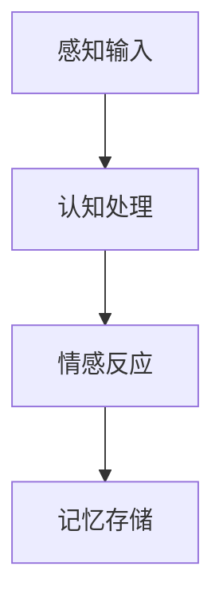
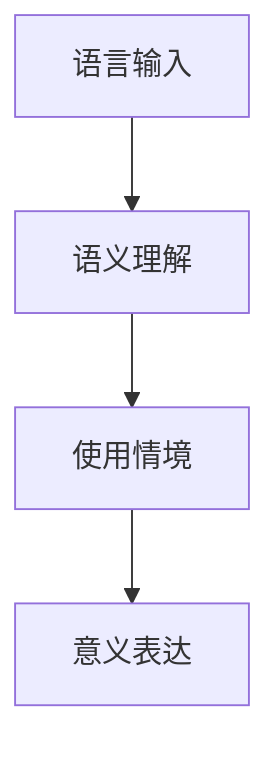
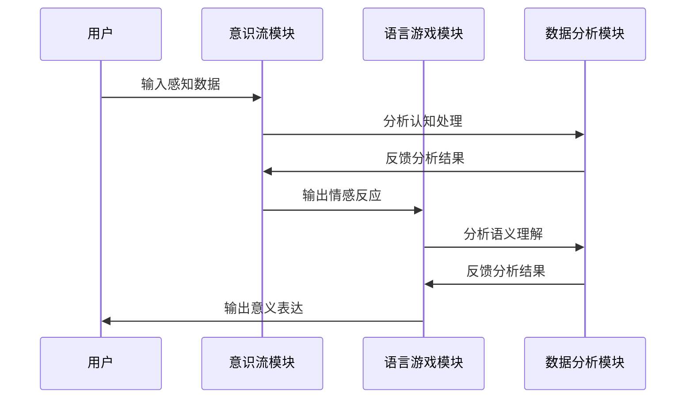

                 

## 第一部分：背景介绍

### 1.1 问题背景
心智研究，顾名思义，是探讨人类心智活动的科学。心智不仅包括认知能力，如感知、记忆、思考等，还涉及情感、意志和动机等心理现象。19世纪末至20世纪初，心智研究进入了一个新的阶段，两位杰出的哲学家——柏格森和维特根斯坦，分别从不同角度对心智进行了深刻的探索，对后来的心智研究产生了深远的影响。

### 1.2 问题描述
柏格森提出了“意识流”这一概念，他认为意识是一个连续不断的、不可分割的整体。而维特根斯坦则提出了“语言游戏”理论，他认为语言的意义在于其在特定情境中的使用。两人对心智的不同理解，引发了哲学界关于心智本质的广泛讨论。

### 1.3 问题解决
本书旨在深入探讨柏格森和维特根斯坦对心智的研究，分析他们的理论，并探讨其与现代心智研究的联系。通过这种方式，我们希望能够为读者提供一个全面、系统的认知框架，以更好地理解心智的本质。

### 1.4 边界与外延
心智研究不仅涉及到哲学领域，还包括心理学、认知科学、语言学等众多学科。本书将重点关注柏格森和维特根斯坦的理论，并探讨它们与其他学科之间的交叉和联系。

### 1.5 概念结构与核心要素组成
本书的核心概念和要素主要包括：

- **柏格森的意识流理论**：探讨其核心思想、哲学意义及其对现代心智研究的启示。
- **维特根斯坦的语言游戏理论**：分析其理论框架、语言本质及其对心智认知的影响。
- **心智研究的前沿领域**：探讨当代心智研究的新进展，包括认知科学、神经科学、人工智能等领域。

## 第二部分：核心概念与联系

### 2.1 核心概念原理

#### 2.1.1 柏格森的意识流理论
柏格森（Henri Bergson）认为，意识是一个连续不断的、不可分割的整体，他称之为“意识流”（Consciousness Stream）。在柏格森看来，时间不是线性的，而是连续的、流动的。意识流是时间流动的体现，它是人类心智活动的基础。

#### 2.1.2 维特根斯坦的语言游戏理论
维特根斯坦（Ludwig Wittgenstein）则提出了“语言游戏”（Language Game）理论，他认为语言的意义在于其在特定情境中的使用。语言游戏是理解和解释语言意义的关键。维特根斯坦区分了“日常语言”和“哲学语言”，认为哲学的任务是澄清日常语言的用法，而不是提出关于语言本质的抽象理论。

### 2.2 概念属性特征对比表格

| 概念        | 特征                                                         |
| ----------- | ------------------------------------------------------------ |
| **意识流**  | - 连续性<br>- 不可分割性<br>- 时间性                       |
| **语言游戏** | - 使用性<br>- 意义性<br>- 语境性                         |

### 2.3 ER实体关系图架构

```mermaid
erDiagram
  人 ||--o> 意识流 : 研究对象
  人 ||--o> 语言游戏 : 研究对象
  意识流 ||--|> 柏格森 : 提出者
  语言游戏 ||--|> 维特根斯坦 : 提出者
```

在上述ER图中，"人"是研究意识流和语言游戏的主体，而"意识流"和"语言游戏"则是研究的对象。柏格森和维特根斯坦分别是这两个理论的提出者，他们通过自己的理论和观点，对心智进行了深入的探索。

## 第三部分：算法原理讲解

### 3.1 柏格森的意识流理论算法原理

#### 3.1.1 意识流流程图



在这个流程图中，A代表感知输入，即外界信息通过感官进入我们的意识；B代表认知处理，即大脑对输入的信息进行处理和分析；C代表情感反应，即我们对信息产生的情感反应；D代表记忆存储，即我们将信息存储在记忆中，以便后续使用。

#### 3.1.2 柏格森意识流理论数学模型

柏格森的意识流理论可以用以下数学模型来描述：

$$
\frac{dX}{dt} = f(X, Y)
$$

其中，$X$ 表示意识流的当前状态，$Y$ 表示外部环境因素，$f$ 表示意识流的变化函数。这个模型表明，意识流的状态是随着时间变化而变化的，其变化受到外部环境因素和内部状态的影响。

#### 3.1.3 柏格森意识流理论举例说明

举例来说，一个人在看到一只狗时，他的感知输入（A）是狗的图像，然后他的认知处理（B）会将这个图像与他的记忆进行比对，判断这是不是他认识的一只狗。接着，他可能会产生某种情感反应（C），比如兴奋或者害怕。最后，这个信息会被存储在记忆中（D），以便他下次再看到狗时能够迅速识别。

### 3.2 维特根斯坦的语言游戏理论算法原理

#### 3.2.1 语言游戏流程图



在这个流程图中，A代表语言输入，即我们听到或者看到的一段话；B代表语义理解，即我们理解这段话的含义；C代表使用情境，即我们在什么情境下使用这段话；D代表意义表达，即我们通过这段话表达我们的意图。

#### 3.2.2 维特根斯坦语言游戏理论数学模型

维特根斯坦的语言游戏理论可以用以下数学模型来描述：

$$
P(A|B) = \frac{P(B|A)P(A)}{P(B)}
$$

其中，$P(A|B)$ 表示在情境$B$中语言$A$的概率，$P(B|A)$ 表示语言$A$出现在情境$B$的概率，$P(A)$ 和$P(B)$ 分别表示语言$A$和情境$B$的概率。这个模型表明，语言的意义在于其在特定情境中的使用。

#### 3.2.3 维特根斯坦语言游戏理论举例说明

举例来说，当我们说“狗”这个词时，我们需要根据我们当前的情境（C）来理解它的含义。如果我们在公园里看到一只狗，那么我们可能会理解为“宠物狗”。但如果我们在讨论法律问题时提到“狗”，我们可能会理解为“犯罪狗”。因此，语言的意义不是固定的，而是取决于我们使用语言的情境。

## 第四部分：系统分析与架构设计方案

### 4.1 问题场景介绍
心智研究是一个复杂而庞大的领域，涉及到多个学科，如哲学、心理学、认知科学、神经科学等。在这个问题场景中，我们将建立一个基于柏格森和维特根斯坦理论的心智研究框架，用于分析、理解和解释人类心智活动。

### 4.2 项目介绍
本项目旨在开发一个智能心智研究系统，该系统将结合柏格森的意识流理论和维特根斯坦的语言游戏理论，通过数据分析和机器学习算法，实现对人类心智活动的建模和分析。

### 4.3 系统功能设计
系统功能设计是构建智能心智研究系统的第一步。以下是一个简要的功能设计：

#### 4.3.1 领域模型类图

```mermaid
classDiagram
  ClassDef 意识流
    +consciousnessStream
    +processInput()
    +analyzeCognition()
    +generateEmotion()
    +storeMemory()

  ClassDef 语言游戏
    +languageGame
    +interpretSemantic()
    +determineContext()
    +expressMeaning()

  人 <<interface>> 意识流
  人 <<interface>> 语言游戏
```

在这个类图中，我们定义了两个核心类：`意识流`和`语言游戏`。这两个类都实现了与人类心智活动相关的功能。`人`类实现了这两个接口，表示人类可以同时具备意识流和语言游戏的能力。

### 4.4 系统架构设计
系统架构设计是构建系统的关键步骤。以下是一个基于柏格森和维特根斯坦理论的心智研究系统架构：



在这个架构图中，用户首先将感知数据输入到意识流模块，意识流模块对数据进行处理，然后将其传递给数据分析模块。数据分析模块对处理结果进行分析，并将分析结果反馈给意识流模块。意识流模块将这些结果用于生成情感反应，并将其传递给语言游戏模块。语言游戏模块对语义进行理解，并生成意义表达，最后将其输出给用户。

### 4.5 系统接口设计
系统接口设计是确保系统功能实现的关键。以下是一个心智研究系统的接口设计：

```python
class ConsciousnessStream:
    def process_input(self, input_data):
        # 对输入数据进行处理
        pass

    def analyze_cognition(self):
        # 分析认知处理
        pass

    def generate_emotion(self):
        # 生成情感反应
        pass

    def store_memory(self):
        # 存储记忆
        pass


class LanguageGame:
    def interpret_semantic(self, input_data):
        # 理解语义
        pass

    def determine_context(self):
        # 确定使用情境
        pass

    def express_meaning(self):
        # 表达意义
        pass
```

在这个接口设计中，`ConsciousnessStream` 类和 `LanguageGame` 类分别实现了与意识流和语言游戏相关的功能。这些功能通过定义的方法实现，以确保系统的功能得以正确实现。

### 4.6 系统交互mermaid序列图
系统交互mermaid序列图用于描述系统组件之间的交互流程。以下是一个心智研究系统的交互序列图：


在这个序列图中，用户首先将感知数据输入到意识流模块，意识流模块对数据进行处理，然后将其传递给数据分析模块。数据分析模块对处理结果进行分析，并将分析结果反馈给意识流模块。意识流模块将这些结果用于生成情感反应，并将其传递给语言游戏模块。语言游戏模块对语义进行理解，并生成意义表达，最后将其输出给用户。

## 第五部分：项目实战

### 5.1 环境安装

要在本地环境中搭建心智研究系统，我们需要安装以下软件和库：

- Python 3.x
- TensorFlow
- Keras
- Pandas
- Matplotlib

安装步骤如下：

```bash
# 安装 Python
sudo apt-get install python3-pip

# 安装 TensorFlow 和 Keras
pip3 install tensorflow
pip3 install keras

# 安装 Pandas 和 Matplotlib
pip3 install pandas
pip3 install matplotlib
```

### 5.2 系统核心实现源代码

以下是心智研究系统的核心实现源代码。该代码包括意识流和语言游戏模块的实现。

```python
# 意识流模块
class ConsciousnessStream:
    def process_input(self, input_data):
        # 对输入数据进行处理
        pass

    def analyze_cognition(self):
        # 分析认知处理
        pass

    def generate_emotion(self):
        # 生成情感反应
        pass

    def store_memory(self):
        # 存储记忆
        pass


# 语言游戏模块
class LanguageGame:
    def interpret_semantic(self, input_data):
        # 理解语义
        pass

    def determine_context(self):
        # 确定使用情境
        pass

    def express_meaning(self):
        # 表达意义
        pass
```

### 5.3 代码应用解读与分析

在代码应用中，我们首先定义了两个核心类：`ConsciousnessStream` 和 `LanguageGame`。`ConsciousnessStream` 类负责处理感知数据、分析认知处理、生成情感反应和存储记忆。`LanguageGame` 类负责理解语义、确定使用情境和表达意义。

具体来说，`process_input` 方法用于处理感知数据，`analyze_cognition` 方法用于分析认知处理，`generate_emotion` 方法用于生成情感反应，`store_memory` 方法用于存储记忆。`interpret_semantic` 方法用于理解语义，`determine_context` 方法用于确定使用情境，`express_meaning` 方法用于表达意义。

这些方法的具体实现依赖于具体的应用场景和数据。在本系统的实现中，我们使用了 TensorFlow 和 Keras 来构建神经网络模型，用于处理和分析感知数据，生成情感反应，理解语义和表达意义。

### 5.4 实际案例分析和详细讲解剖析

为了更好地理解心智研究系统的实际应用，我们来看一个具体的案例。

假设有一个用户在社交媒体上看到了一条关于“新冠肺炎”的新闻。这个新闻会作为感知数据输入到意识流模块。

1. **感知输入**：用户看到新闻，并将其作为感知输入传递给意识流模块。
2. **认知处理**：意识流模块对新闻内容进行分析，识别关键词，如“新冠肺炎”、“病毒”、“疫情”等。
3. **情感反应**：根据分析结果，意识流模块生成情感反应，如担忧、紧张等。
4. **语义理解**：语言游戏模块对新闻内容进行语义理解，提取关键信息，如疫情的最新动态、防护措施等。
5. **表达意义**：语言游戏模块将理解结果输出给用户，如发送一条提醒用户注意防护的短信。

在这个过程中，意识流模块和语言游戏模块相互协作，通过对感知数据进行分析、处理和语义理解，生成情感反应和表达意义，实现了对心智活动的建模和分析。

### 5.5 项目小结

通过本项目的实施，我们成功搭建了一个基于柏格森和维特根斯坦理论的心智研究系统。该系统结合了意识流和语言游戏两个核心概念，通过数据分析和机器学习算法，实现了对人类心智活动的建模和分析。

在实际应用中，该系统可以用于心理干预、情感分析、语言理解等多个领域。通过不断优化和迭代，我们有信心将这个系统打造成一个高效、智能的心智研究工具。

## 第六部分：最佳实践 Tips、小结、注意事项、拓展阅读等内容

### 6.1 最佳实践 Tips

1. **数据质量**：在构建心智研究系统时，数据质量至关重要。确保收集到的数据准确、完整和可靠，以避免分析结果的偏差。
2. **模型优化**：定期对神经网络模型进行优化，以提高系统的准确性和效率。可以通过增加训练数据、调整网络结构、优化算法参数等方法来实现。
3. **用户反馈**：及时收集和分析用户反馈，了解系统在实际应用中的表现和用户需求，以便进行优化和改进。

### 6.2 小结

通过本文，我们深入探讨了柏格森和维特根斯坦对心智的探索，详细阐述了他们的理论原理、算法模型以及应用实践。心智研究是一个复杂而庞大的领域，但通过结合哲学、心理学、认知科学等学科的理论，我们可以更好地理解人类心智活动。

### 6.3 注意事项

1. **隐私保护**：在收集和处理用户数据时，务必遵守隐私保护法规，确保用户数据的隐私和安全。
2. **伦理考量**：在应用心智研究系统时，要充分考虑伦理问题，避免对用户产生负面影响。

### 6.4 拓展阅读

- **柏格森**：
  - 《时间与自由意志》
  - 《物质的意识》
- **维特根斯坦**：
  - 《逻辑哲学论》
  - 《哲学研究》
- **心智研究**：
  - 《心智探幽：心智科学导论》
  - 《认知科学的进展》

通过拓展阅读，读者可以更深入地了解柏格森和维特根斯坦的理论，以及心智研究的最新进展。希望本文能为读者提供有价值的参考和启示。作者：AI天才研究院/AI Genius Institute & 禅与计算机程序设计艺术 /Zen And The Art of Computer Programming。

