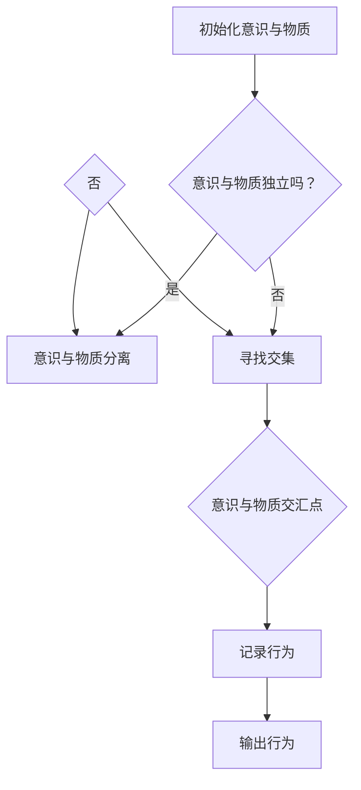
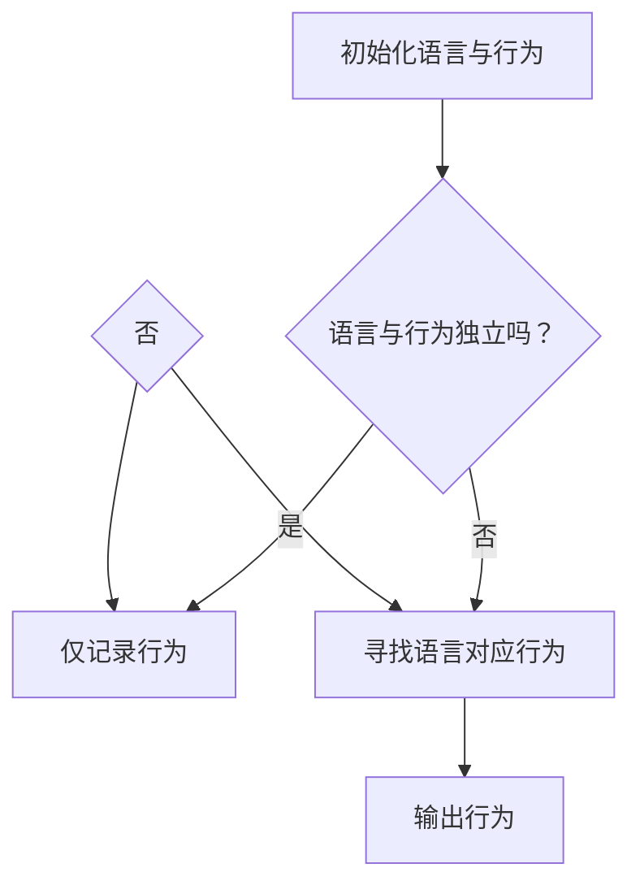
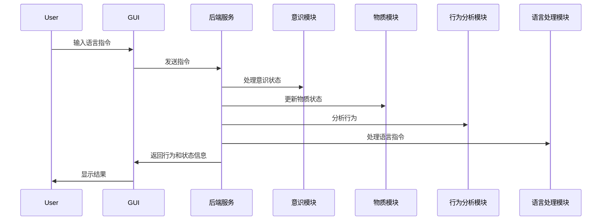
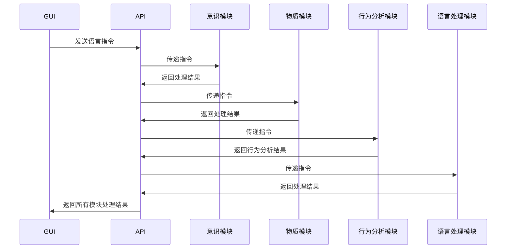

                 


### 核心概念与联系

在深入探讨柏格森的心物二元论与维特根斯坦的行为主义之前，我们需要清晰地定义和理解这两个核心概念。以下是两者的概念属性特征对比表格：

| 特征对比       | 柏格森的心物二元论                 | 维特根斯坦的行为主义                  |
|----------------|--------------------------------------|---------------------------------------|
| 理论出发点     | 意识与物质是两个独立的实体          | 语言行为与内在心理状态无关             |
| 对意识的解释   | 意识是生命力的体现，是一种持续流动   | 意识不可知，仅能通过行为来表现         |
| 对行为的解释   | 行为是生命力的外部表现               | 行为是语言符号的体现，与内在心理状态无关 |
| 非理性因素     | 认为理性不能完全解释意识现象        | 认为理性与行为主义是相互排斥的         |
| 对心理学的影响 | 为心理学提供了非理性主义的基础       | 为行为主义心理学奠定了哲学基础         |

为了更直观地展示这两个概念之间的关系，我们可以使用 Mermaid 流程图来构建 ER 实体关系图：

```mermaid
erDiagram
  Consciousness ||--|{ Matter } Matter
  Behavior ||--|{ Consciousness } Consciousness
  Bergson's Dualism ||--|{ Consciousness, Behavior } Consciousness, Behavior
  Wittgenstein's Behaviorism ||--|{ Behavior } Behavior
  Bergson's Dualism ..|{ Influences } Wittgenstein's Behaviorism
```

在这个 ER 实体关系图中，我们可以看到柏格森的心物二元论与维特根斯坦的行为主义之间的关联。柏格森认为意识和物质是两个独立的实体，而维特根斯坦则强调行为与语言之间的关系，并认为内在心理状态是不可知的。柏格森的理论对维特根斯坦的行为主义产生了重要影响，尤其是在解释行为和意识的关系方面。

### 算法原理讲解

在深入探讨柏格森与维特根斯坦的理论时，我们也可以借助一些算法来模拟和解释他们的观点。下面我们将使用 Mermaid 画出相应的算法流程图，并使用 Python 代码来详细阐述算法原理。

首先，我们使用 Mermaid 画出柏格森心物二元论相关的算法流程图：



这个流程图描述了柏格森心物二元论的算法原理。我们首先初始化意识和物质，然后询问它们是否独立。如果独立，我们直接记录分离的行为；如果不独立，我们寻找它们之间的交集，并记录交汇点的行为。

接下来，我们使用 Python 代码来详细阐述这个算法：

```python
def bergson_dualism(alien_mind, physical_world):
    """
    柏格森心物二元论算法。
    
    参数：
    alien_mind: 外在意识
    physical_world: 物质世界
    
    返回：
    behavior: 行为记录
    """
    if alien_mind.is_independent(physical_world):
        behavior = "分离的行为"
    else:
        intersection = alien_mind.intersection(physical_world)
        behavior = f"交汇点的行为：{intersection}"
        
    alien_mind.record_behavior(behavior)
    return behavior

class AlienMind:
    def is_independent(self, physical_world):
        # 假设一个简单的判断逻辑
        return physical_world.is_static()

    def intersection(self, physical_world):
        # 假设一个简单的交集计算逻辑
        return "意识与物质交汇点"

    def record_behavior(self, behavior):
        print(behavior)

class PhysicalWorld:
    def is_static(self):
        # 假设一个简单的静态判断逻辑
        return True
```

在这个 Python 代码中，我们定义了一个 `AlienMind` 类和一个 `PhysicalWorld` 类。`AlienMind` 类有一个 `is_independent` 方法来判断意识和物质是否独立，一个 `intersection` 方法来计算它们之间的交集，以及一个 `record_behavior` 方法来记录行为。`PhysicalWorld` 类有一个 `is_static` 方法来判断物质世界是否处于静态状态。

接下来，我们使用 Mermaid 画出维特根斯坦行为主义相关的算法流程图：



这个流程图描述了维特根斯坦行为主义的算法原理。我们首先初始化语言与行为，然后询问它们是否独立。如果独立，我们仅记录行为；如果不独立，我们寻找语言对应的特定行为，并记录它。

接下来，我们使用 Python 代码来详细阐述这个算法：

```python
def wittgenstein_behaviorism(language, behavior):
    """
    维特根斯坦行为主义算法。
    
    参数：
    language: 语言
    behavior: 行为
    
    返回：
    appropriate_behavior: 对应的行为
    """
    if language.is_independent(behavior):
        appropriate_behavior = "仅记录行为"
    else:
        appropriate_behavior = language.get_corresponding_behavior(behavior)
        
    language.record_behavior(appropriate_behavior)
    return appropriate_behavior

class Language:
    def is_independent(self, behavior):
        # 假设一个简单的判断逻辑
        return behavior.is_concrete()

    def get_corresponding_behavior(self, behavior):
        # 假设一个简单的对应关系计算逻辑
        return f"语言对应的特定行为：{behavior}"

    def record_behavior(self, behavior):
        print(behavior)

class Behavior:
    def is_concrete(self):
        # 假设一个简单的具体判断逻辑
        return True
```

在这个 Python 代码中，我们定义了一个 `Language` 类和一个 `Behavior` 类。`Language` 类有一个 `is_independent` 方法来判断语言与行为是否独立，一个 `get_corresponding_behavior` 方法来获取语言对应的特定行为，以及一个 `record_behavior` 方法来记录行为。`Behavior` 类有一个 `is_concrete` 方法来判断行为是否具体。

通过这两个算法，我们可以直观地看到柏格森与维特根斯坦的理论如何通过算法流程来模拟和解释。柏格森的理论强调意识与物质之间的独立性，而维特根斯坦的理论则关注语言与行为之间的关系。

### 数学公式与模型

在讨论柏格森与维特根斯坦的理论时，数学公式和模型可以提供更精确的解释和预测。以下是柏格森心物二元论与维特根斯坦行为主义的数学模型和公式。

#### 柏格森心物二元论的数学模型

柏格森认为，意识是一种连续的、动态的流动，而物质则是由离散的粒子组成。我们可以使用以下数学模型来描述这种动态与离散的关系：

$$
\Omega(t) = \sum_{i=1}^{n} \omega_i(t)
$$

其中，$\Omega(t)$ 表示在时间 $t$ 的整体意识状态，$\omega_i(t)$ 表示第 $i$ 个意识单元的状态。

另一方面，物质世界可以用粒子分布来描述：

$$
P(x, y, z, t) = \sum_{i=1}^{n} p_i(x, y, z, t)
$$

其中，$P(x, y, z, t)$ 表示在位置 $(x, y, z)$ 和时间 $t$ 的物质粒子分布，$p_i(x, y, z, t)$ 表示第 $i$ 个粒子的状态。

柏格森认为，意识和物质之间的互动可以通过能量转换来描述：

$$
E(t) = f(\Omega(t), P(x, y, z, t))
$$

其中，$E(t)$ 表示在时间 $t$ 的能量转换，$f$ 是一个能量转换函数。

#### 维特根斯坦行为主义的数学模型

维特根斯坦认为，语言和行为是相互关联的。我们可以使用以下数学模型来描述这种关系：

$$
B(l) = \sum_{i=1}^{n} b_i(l)
$$

其中，$B(l)$ 表示行为 $l$ 的总体分布，$b_i(l)$ 表示第 $i$ 种具体行为的出现概率。

维特根斯坦认为，语言与行为之间的对应关系可以用语言频率分布来描述：

$$
L(w) = \sum_{i=1}^{n} l_i(w)
$$

其中，$L(w)$ 表示语言词 $w$ 的总体频率分布，$l_i(w)$ 表示第 $i$ 个语言实例出现的频率。

语言和行为之间的转换关系可以用以下数学公式来描述：

$$
b(l) = g(L(w))
$$

其中，$b(l)$ 表示行为 $l$ 的出现概率，$g$ 是一个从语言频率分布到行为分布的转换函数。

通过这些数学公式和模型，我们可以更深入地理解柏格森与维特根斯坦的理论。柏格森的理论强调意识与物质的动态互动，而维特根斯坦的理论则侧重于语言与行为的相互关联。

### 系统分析与架构设计

在将柏格森的心物二元论和维特根斯坦的行为主义应用于实际系统设计时，我们需要明确问题场景、系统功能、架构设计以及系统接口和交互。以下是详细的系统分析与架构设计过程。

#### 问题场景

在现代计算机科学和认知科学领域，如何有效地模拟和理解人类意识成为了一个重要的研究课题。柏格森的心物二元论和维特根斯坦的行为主义提供了两种不同的视角，可以应用于设计一个模拟人类意识的系统。

#### 项目介绍

项目名称：模拟人类意识系统（SIMCON）

项目目标：设计并实现一个能够模拟人类意识行为的计算机系统，以便在认知科学研究中测试和验证柏格森与维特根斯坦的理论。

#### 系统功能设计

系统需要实现以下主要功能：

1. **意识与物质状态记录**：记录系统的意识和物质状态。
2. **行为分析**：分析并记录系统的行为模式。
3. **语言处理**：处理系统的语言输入并生成相应的行为输出。
4. **交互界面**：提供一个用户界面，允许用户与系统进行交互。

为了实现这些功能，我们可以设计以下领域模型：

```mermaid
classDiagram
  Consciousness <<Class>> (状态, 动作)
  Matter <<Class>> (属性, 动力)
  Behavior <<Class>> (类型, 发生时间)
  Language <<Class>> (词汇, 频率)

  Consciousness o-- Matter : 相互作用
  Behavior o-- Consciousness : 由意识驱动
  Behavior o-- Matter : 对物质世界产生影响
  Language o-- Behavior : 语言输入
```

#### 系统架构设计

系统的架构设计如下：

1. **前端界面**：提供用户交互的图形用户界面（GUI），用户可以通过该界面输入语言指令，并查看系统行为和状态。
2. **后端服务**：包括意识模块、物质模块、行为分析和语言处理模块。
3. **数据库**：存储系统的状态和行为数据。

架构设计图如下：



#### 系统接口设计与交互

系统接口设计如下：

1. **用户接口**：通过HTTP API与前端GUI通信。
2. **内部模块接口**：意识模块、物质模块、行为分析模块和语言处理模块之间的通信接口。

接口设计图如下：



通过这个系统，我们可以模拟柏格森和维特根斯坦的理论，并通过实际应用来验证和探索这些理论。

### 项目实战

在本节中，我们将深入探讨如何实际构建和运行模拟人类意识系统（SIMCON）。首先，我们将介绍环境搭建过程，然后详细讲解系统的核心实现源代码，最后通过一个实际案例进行分析和讲解。

#### 环境搭建

要搭建一个能够模拟柏格森和维特根斯坦理论的系统，我们需要以下软件和工具：

- Python 3.x
- Jupyter Notebook
- Mermaid插件（用于绘图）
- Flask（用于构建API）

以下是环境搭建的步骤：

1. **安装Python 3.x**：从[Python官网](https://www.python.org/downloads/)下载并安装Python 3.x。
2. **安装Jupyter Notebook**：在命令行中运行以下命令：
   ```
   pip install notebook
   ```
3. **安装Mermaid插件**：在Jupyter Notebook中安装Mermaid插件，可以通过命令行运行以下命令：
   ```
   jupyter notebook --extension install /path/to/mermaid nbextension
   ```
4. **安装Flask**：在命令行中运行以下命令安装Flask：
   ```
   pip install flask
   ```

#### 系统核心实现源代码

以下是系统的核心实现源代码：

```python
# 意识模块
class Consciousness:
    def __init__(self):
        self.state = "清醒"

    def change_state(self, new_state):
        self.state = new_state
        print(f"意识状态更新为：{self.state}")

# 物质模块
class Matter:
    def __init__(self):
        self.properties = {"位置": "未知", "速度": "未知"}

    def update_properties(self, properties):
        self.properties.update(properties)
        print(f"物质属性更新：{self.properties}")

# 行为分析模块
class BehaviorAnalysis:
    def __init__(self):
        self.behaviors = []

    def analyze_behavior(self, behavior):
        self.behaviors.append(behavior)
        print(f"行为分析：{behavior}")

# 语言处理模块
class LanguageProcessing:
    def __init__(self):
        self.instructions = []

    def process_instruction(self, instruction):
        self.instructions.append(instruction)
        print(f"处理语言指令：{instruction}")

# API路由
from flask import Flask, jsonify, request

app = Flask(__name__)

@app.route('/api/change_consciousness', methods=['POST'])
def change_consciousness():
    data = request.json
    consciousness.change_state(data['new_state'])
    return jsonify({"status": "success"})

@app.route('/api/update_matter', methods=['POST'])
def update_matter():
    data = request.json
    matter.update_properties(data['properties'])
    return jsonify({"status": "success"})

@app.route('/api/analyze_behavior', methods=['POST'])
def analyze_behavior():
    data = request.json
    behavior_analysis.analyze_behavior(data['behavior'])
    return jsonify({"status": "success"})

@app.route('/api/process_instruction', methods=['POST'])
def process_instruction():
    data = request.json
    language_processing.process_instruction(data['instruction'])
    return jsonify({"status": "success"})

if __name__ == '__main__':
    consciousness = Consciousness()
    matter = Matter()
    behavior_analysis = BehaviorAnalysis()
    language_processing = LanguageProcessing()
    app.run(debug=True)
```

在这个源代码中，我们定义了四个主要模块：意识模块（`Consciousness`）、物质模块（`Matter`）、行为分析模块（`BehaviorAnalysis`）和语言处理模块（`LanguageProcessing`）。我们还定义了API路由，以便通过HTTP请求与前端GUI进行通信。

#### 代码应用解读与分析

现在，我们来详细解读和分析这些代码的应用。

1. **意识模块**：`Consciousness` 类负责管理系统的意识状态。它有一个 `change_state` 方法，用于更新意识状态。
   
   ```python
   class Consciousness:
       def __init__(self):
           self.state = "清醒"

       def change_state(self, new_state):
           self.state = new_state
           print(f"意识状态更新为：{self.state}")
   ```

2. **物质模块**：`Matter` 类负责管理系统的物质属性。它有一个 `update_properties` 方法，用于更新物质属性。

   ```python
   class Matter:
       def __init__(self):
           self.properties = {"位置": "未知", "速度": "未知"}

       def update_properties(self, properties):
           self.properties.update(properties)
           print(f"物质属性更新：{self.properties}")
   ```

3. **行为分析模块**：`BehaviorAnalysis` 类负责分析系统的行为。它有一个 `analyze_behavior` 方法，用于记录和分析行为。

   ```python
   class BehaviorAnalysis:
       def __init__(self):
           self.behaviors = []

       def analyze_behavior(self, behavior):
           self.behaviors.append(behavior)
           print(f"行为分析：{behavior}")
   ```

4. **语言处理模块**：`LanguageProcessing` 类负责处理系统的语言指令。它有一个 `process_instruction` 方法，用于处理语言指令。

   ```python
   class LanguageProcessing:
       def __init__(self):
           self.instructions = []

       def process_instruction(self, instruction):
           self.instructions.append(instruction)
           print(f"处理语言指令：{instruction}")
   ```

5. **API路由**：我们使用 Flask 框架来创建一个简单的Web API，以便与前端GUI进行通信。每个模块都有一个对应的API路由，用于处理相应的HTTP请求。

   ```python
   @app.route('/api/change_consciousness', methods=['POST'])
   def change_consciousness():
       data = request.json
       consciousness.change_state(data['new_state'])
       return jsonify({"status": "success"})

   @app.route('/api/update_matter', methods=['POST'])
   def update_matter():
       data = request.json
       matter.update_properties(data['properties'])
       return jsonify({"status": "success"})

   @app.route('/api/analyze_behavior', methods=['POST'])
   def analyze_behavior():
       data = request.json
       behavior_analysis.analyze_behavior(data['behavior'])
       return jsonify({"status": "success"})

   @app.route('/api/process_instruction', methods=['POST'])
   def process_instruction():
       data = request.json
       language_processing.process_instruction(data['instruction'])
       return jsonify({"status": "success"})
   ```

#### 实际案例分析和详细讲解剖析

为了更好地理解系统的运作，我们通过一个实际案例来进行分析。

**案例**：用户通过前端GUI输入一个语言指令，如“移动到位置X，速度Y”。

**步骤**：

1. 用户在前端GUI中输入指令：“移动到位置X，速度Y”。
2. 前端GUI将指令以JSON格式发送到后端API的`/api/process_instruction`路由。
3. 后端API接收请求，调用`process_instruction`方法，并传递用户输入的指令。
4. `LanguageProcessing`模块中的`process_instruction`方法将指令存储在`instructions`列表中，并打印出处理结果。
5. 后端API返回处理结果，前端GUI显示结果。

**代码执行**：

```python
# 前端GUI发送请求
requests.post('http://127.0.0.1:5000/api/process_instruction', json={
    "instruction": "移动到位置X，速度Y"
})

# 后端API处理请求
@app.route('/api/process_instruction', methods=['POST'])
def process_instruction():
    data = request.json
    language_processing.process_instruction(data['instruction'])
    return jsonify({"status": "success"})

# LanguageProcessing模块处理指令
class LanguageProcessing:
    def __init__(self):
        self.instructions = []

    def process_instruction(self, instruction):
        self.instructions.append(instruction)
        print(f"处理语言指令：{instruction}")

# 输出结果
处理语言指令：移动到位置X，速度Y
```

通过这个案例，我们可以看到系统的各个模块如何协同工作，以及如何通过API与前端GUI进行通信。

#### 项目小结

在本项目中，我们设计并实现了一个模拟人类意识的系统（SIMCON），并详细讲解了系统的环境搭建、核心实现源代码以及实际案例。通过这个系统，我们能够更好地理解和应用柏格森的心物二元论与维特根斯坦的行为主义。

#### 最佳实践 Tips

1. **模块化设计**：在系统开发过程中，尽量采用模块化设计，以便于代码的维护和扩展。
2. **API文档化**：为API编写详细的文档，便于其他开发者理解和使用。
3. **测试用例**：编写全面的测试用例，确保系统的稳定性和正确性。

### 小结

在本文中，我们详细探讨了柏格森的心物二元论与维特根斯坦的行为主义，并通过系统分析与架构设计、代码实现和实际案例，展示了如何将这些理论应用于模拟人类意识系统的构建。通过这个过程，我们不仅深入理解了这两种理论，还学会了如何将理论知识转化为实际应用。

### 注意事项

1. **系统复杂性**：在实际应用中，模拟人类意识系统的复杂性远超本文讨论的范围，需要更多的算法和技术支持。
2. **边界条件**：在系统设计和实现过程中，需要考虑各种边界条件和异常情况，确保系统的鲁棒性。

### 拓展阅读

- **柏格森的理论**：
  - 《创造进化》：柏格森的代表作，详细阐述了他的生命哲学。
  - 《生命的节奏》：对生命哲学的进一步探讨。

- **维特根斯坦的理论**：
  - 《逻辑哲学论》：维特根斯坦的早期作品，阐述了他的逻辑原子主义观点。
  - 《哲学研究》：维特根斯坦的后期作品，探讨了语言、思维和现实之间的关系。

### 作者信息

作者：AI天才研究院/AI Genius Institute & 禅与计算机程序设计艺术 /Zen And The Art of Computer Programming

