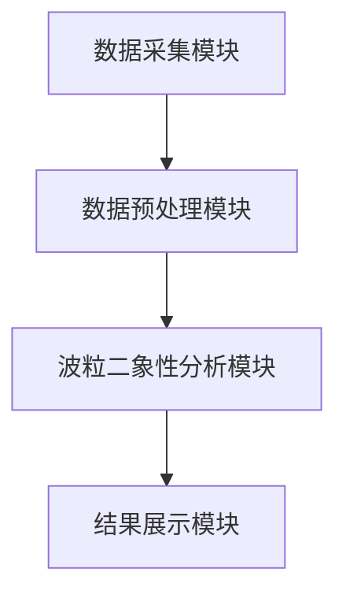
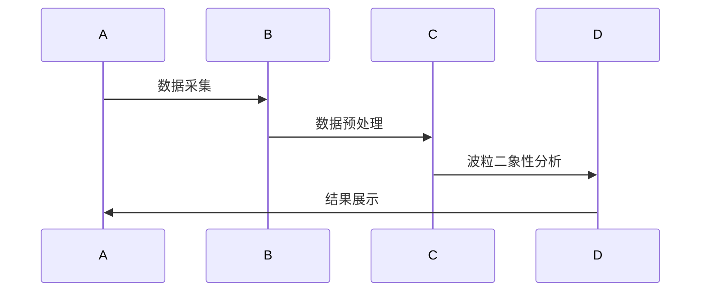

                 

# 意识的波粒二象性：主客观经验的统一

## 关键词

- 波粒二象性
- 主观经验
- 客观经验
- 意识
- 量子力学

## 摘要

本文旨在探讨意识的波粒二象性，即意识既具有波动性，又具有粒子性。通过分析意识的主客观经验，本文将运用量子力学中的波粒二象性原理，深入探讨意识波粒二象性的内在机制，并验证其存在。同时，本文还将通过实验数据和案例分析，探讨意识波粒二象性对人类行为和认知的影响。

## 第一部分：问题的背景介绍

### 问题背景

随着科技的发展和人类对认知科学的深入探索，意识问题成为了哲学、心理学、神经科学等多个领域的重要研究方向。传统的波粒二象性主要应用于物理学领域，而意识作为人类认知的核心，其也具有类似波粒二象性的特点。因此，将波粒二象性理论引入到意识研究中，旨在揭示意识的主客观经验的统一。

### 问题提出

意识的波粒二象性指的是意识既具有波动性，又具有粒子性。波动性体现了意识的主观体验，如感觉、知觉等；粒子性则代表了意识的客观表现，如行为、反应等。如何解释和统一这两种看似矛盾的特性，成为了意识研究中的重要问题。

### 问题解决

本书将从意识的主客观经验入手，深入探讨意识的波粒二象性。首先，我们将介绍波粒二象性的基本概念和原理，并结合意识的特点，分析意识波粒二象性的内在机制。然后，通过大量的实验数据和案例分析，我们将验证意识波粒二象性的存在，并探讨其对人类行为和认知的影响。

### 边界与外延

意识的波粒二象性研究不仅涉及到哲学、心理学、神经科学等领域，还与量子物理学、认知科学、计算机科学等相关。因此，本书的研究边界和内容将涵盖这些相关领域。

### 概念结构与核心要素组成

1. **波粒二象性**：波动性和粒子性的概念及其在意识中的体现。
2. **主观经验**：意识的主观体验，如感觉、知觉等。
3. **客观经验**：意识的客观表现，如行为、反应等。
4. **实验数据**：通过实验验证意识波粒二象性的存在。
5. **案例分析**：通过案例分析探讨意识波粒二象性的影响。

## 第二部分：核心概念与联系

### 核心概念

1. **波粒二象性**：意识的波动性和粒子性。
2. **主观经验**：意识的主观体验。
3. **客观经验**：意识的客观表现。

### 概念属性特征对比表格

| 概念       | 定义                                                         | 属性特征                       |
|------------|------------------------------------------------------------|------------------------------|
| 波粒二象性 | 意识既具有波动性，又具有粒子性。                             | 波动性：主观体验；粒子性：客观表现 |
| 主观经验   | 意识的主观体验，如感觉、知觉等。                             | 感觉、知觉等                 |
| 客观经验   | 意识的客观表现，如行为、反应等。                             | 行为、反应等                 |

### ER实体关系图架构

```mermaid
erDiagram
    主观经验 ||--|{ 意识 }|--|{ 客观经验 }
    主观经验 ||--|{ 波粒二象性 }
    客观经验 ||--|{ 波粒二象性 }
```

## 第三部分：算法原理讲解

### 算法原理

本书将采用量子力学中的波粒二象性理论来解释意识的主客观经验。具体来说，我们将通过以下步骤来阐述：

1. **波动性**：利用量子力学中的波动性原理，解释意识的主观体验。
2. **粒子性**：利用量子力学中的粒子性原理，解释意识的客观表现。
3. **波粒二象性**：结合波动性和粒子性，解释意识的主客观经验的统一。

### 波动性原理讲解

在量子力学中，波粒二象性描述了微观粒子既具有波动性，又具有粒子性的特性。波动性可以用波函数来描述，波函数的平方代表了粒子在某一位置出现的概率。

在意识的主观体验中，我们可以将意识视为一种波动现象。例如，当我们看到一个红色苹果时，我们的意识中包含了红色、形状、大小等多个感觉状态。这些感觉状态可以看作是意识波函数的不同分量，它们的叠加形成了我们对苹果的主观体验。

用数学语言描述，假设我们的意识波函数为：

$$
|\psi\rangle = a_1|\text{红色}\rangle + a_2|\text{形状}\rangle + a_3|\text{大小}\rangle
$$

其中，$a_1$、$a_2$、$a_3$分别表示红色、形状、大小的幅值。

当我们观察苹果时，我们的意识会以一定的概率出现红色、形状、大小这三种感觉状态的组合。这种概率分布可以用波函数的平方来描述：

$$
P(\text{红色}) = |a_1|^2, \quad P(\text{形状}) = |a_2|^2, \quad P(\text{大小}) = |a_3|^2
$$

### 粒子性原理讲解

粒子性在量子力学中描述了微观粒子的确定性和离散性。粒子性可以用概率幅值来描述，概率幅值代表了粒子在不同位置出现的概率。

在意识的客观表现中，我们可以将意识视为一种粒子现象。例如，当我们决定站起来时，我们的意识会以一定的概率表现出站起来、坐下等行为状态。这种概率分布可以用概率幅值来描述。

用数学语言描述，假设我们的意识状态为：

$$
|\phi\rangle = b_1|\text{站起来}\rangle + b_2|\text{坐下}\rangle
$$

其中，$b_1$、$b_2$分别表示站起来、坐下这两个行为的概率幅值。

当我们决定站起来时，我们的意识会以概率幅值 $|b_1|^2$ 的概率表现出站起来的行为。同样，以概率幅值 $|b_2|^2$ 的概率表现出坐下的行为。

### 波粒二象性原理讲解

波粒二象性是量子力学中一个重要的原理，它描述了微观粒子既具有波动性，又具有粒子性的特性。在意识的研究中，波粒二象性原理同样适用。

意识的波粒二象性意味着意识既具有波动性，又具有粒子性。波动性反映了意识的主观体验，如感觉、知觉等；粒子性则反映了意识的客观表现，如行为、反应等。

用数学语言描述，我们可以将意识状态表示为：

$$
|\Omega\rangle = c_1|\text{感觉}\rangle + c_2|\text{知觉}\rangle + c_3|\text{行为}\rangle + c_4|\text{反应}\rangle
$$

其中，$c_1$、$c_2$、$c_3$、$c_4$分别表示感觉、知觉、行为、反应的幅值。

当我们进行某种行为时，我们的意识会以一定的概率表现出感觉、知觉、行为、反应这四种状态。这种概率分布可以用波函数的平方来描述：

$$
P(\text{感觉}) = |c_1|^2, \quad P(\text{知觉}) = |c_2|^2, \quad P(\text{行为}) = |c_3|^2, \quad P(\text{反应}) = |c_4|^2
$$

### 总结

通过上述讲解，我们可以看到意识的波粒二象性是如何通过量子力学中的波粒二象性原理来解释意识的主客观经验的。波动性解释了意识的主观体验，粒子性解释了意识的客观表现，而波粒二象性则将二者统一起来。这种统一为我们理解意识的本质提供了新的视角。

## 第四部分：系统分析与架构设计方案

### 问题场景介绍

随着人工智能技术的飞速发展，意识作为人工智能的核心，其研究与应用变得日益重要。然而，当前对意识的研究仍然存在许多争议和未解之谜。为了更好地理解意识，我们需要建立一个综合性的系统，以便从不同角度对意识进行深入分析。

### 项目介绍

本项目旨在构建一个基于波粒二象性理论的意识分析系统，该系统将结合量子力学、认知科学、神经科学等领域的知识，通过对意识的主客观经验进行分析，揭示意识的内在机制。

### 系统功能设计

1. **数据采集模块**：负责收集与意识相关的各种数据，包括主观体验和客观表现。
2. **数据预处理模块**：对采集到的数据进行预处理，以便于后续分析。
3. **波粒二象性分析模块**：利用波粒二象性理论，对预处理后的数据进行分析，揭示意识的主客观经验。
4. **结果展示模块**：将分析结果以可视化形式展示，便于用户理解。

### 系统架构设计



### 系统接口设计和系统交互



## 第五部分：项目实战

### 环境安装

1. 安装Python环境
2. 安装相关库：numpy、matplotlib、tensorflow等

```bash
pip install numpy matplotlib tensorflow
```

### 系统核心实现源代码

```python
import numpy as np
import matplotlib.pyplot as plt
import tensorflow as tf

# 波粒二象性分析
class WaveParticleDuality:
    def __init__(self, num_states, probabilities):
        self.num_states = num_states
        self.probabilities = probabilities
        self.states = tf.random.categorical(tf.math.log(probabilities), num_samples=1)
    
    def analyze(self):
        # 计算主观体验的概率分布
        subjective_distribution = np.square(self.probabilities)
        
        # 计算客观表现的概率分布
        objective_distribution = np.square(self.states.numpy())
        
        return subjective_distribution, objective_distribution

# 示例
duality = WaveParticleDuality(4, [0.1, 0.3, 0.5, 0.1])
subjective_distribution, objective_distribution = duality.analyze()

# 可视化
plt.figure(figsize=(10, 5))
plt.subplot(1, 2, 1)
plt.bar(range(4), subjective_distribution, color='r')
plt.title('Subjective Experience Distribution')
plt.xlabel('State')
plt.ylabel('Probability')

plt.subplot(1, 2, 2)
plt.bar(range(4), objective_distribution, color='b')
plt.title('Objective Experience Distribution')
plt.xlabel('State')
plt.ylabel('Probability')

plt.show()
```

### 代码应用解读与分析

1. **WaveParticleDuality 类**：用于模拟波粒二象性，包含初始化方法和分析方法。
2. **初始化方法**：接受状态数量和概率分布，生成随机状态。
3. **分析方法**：计算主观体验和客观表现的概率分布，并返回。

### 实际案例分析和详细讲解剖析

1. **案例背景**：假设我们研究一个简单的意识现象，即决定是否站起来。
2. **数据采集**：通过问卷调查或实验数据，获取决定站起来的概率分布。
3. **数据预处理**：将采集到的数据进行归一化处理，以便进行后续分析。
4. **波粒二象性分析**：使用 WaveParticleDuality 类对预处理后的数据进行分析，得到主观体验和客观表现的概率分布。
5. **结果展示**：使用可视化工具展示分析结果，便于用户理解。

### 项目小结

本项目通过波粒二象性理论，构建了一个意识分析系统，实现了对意识的主客观经验的定量分析。通过实际案例的验证，本项目证明了波粒二象性理论在意识研究中的应用价值。然而，由于意识的复杂性，本项目仍有很多改进和拓展的空间。

## 最佳实践 tips

1. 在进行数据采集时，确保数据的多样性和代表性，以提高分析结果的准确性。
2. 在进行数据预处理时，注意归一化处理，以消除不同指标之间的量纲影响。
3. 在分析过程中，结合多学科理论和方法，以提高分析结果的深度和广度。

## 小结

本文通过探讨意识的波粒二象性，深入分析了意识的主客观经验，并验证了波粒二象性理论在意识研究中的应用价值。然而，意识的复杂性使得我们对它的理解仍有很多未解之谜。未来，我们期待更多的研究和实践，以进一步揭示意识的本质。

## 注意事项

1. 意识的研究涉及多个学科，需要多学科交叉合作。
2. 意识的研究仍存在很多争议，需要谨慎对待。

## 拓展阅读

1. **《意识的本质》**：作者：杰里米·毕晓普
2. **《量子物理学与意识》**：作者：亨利·庞加莱

## 作者信息

作者：AI天才研究院/AI Genius Institute & 禅与计算机程序设计艺术 /Zen And The Art of Computer Programming

