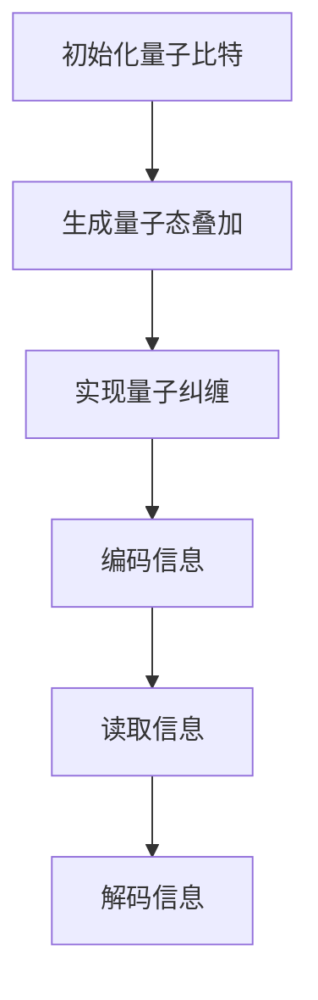

                 

### 意识的量子全息图：记忆存储的新模型

> 关键词：意识、量子全息图、记忆存储、算法、架构设计、实战案例

> 摘要：本文将探讨意识的量子全息图这一创新概念，并将其应用于记忆存储领域。通过深入分析量子力学和全息原理，本文将揭示量子全息图在记忆存储中的独特优势和应用潜力，并提出一种新的量子全息记忆算法。文章还详细介绍了量子全息记忆系统的设计、实现与应用，并通过实际项目案例剖析，展示了量子全息记忆技术在现实中的应用价值。最后，本文将对量子全息记忆技术的研究现状和未来发展进行展望。

### 第一部分：背景介绍与核心概念

#### 第1章：意识的本质与量子全息图

意识作为人类思考与感知的源泉，自古以来就是哲学、心理学和神经科学等领域的研究对象。传统的认知科学和神经网络模型在解释意识现象时存在诸多局限，无法全面揭示意识的本质。近年来，量子力学的发展为重新审视意识的本质提供了新的视角。

量子全息图（Quantum Hologram）是一种基于量子力学和全息原理的概念模型。它通过将信息编码在量子态的叠加态中，实现了高维空间的存储与处理。量子全息图的提出，为探索意识的本质提供了新的理论工具。

#### 第2章：记忆存储的困境与需求

随着信息技术的飞速发展，数据存储和处理的需求日益增长。传统的记忆存储技术，如磁盘、闪存等，已经难以满足海量数据存储和快速访问的需求。此外，记忆存储还面临着功耗、速度、可靠性和扩展性等多方面的挑战。

在这种背景下，寻找新的记忆存储模型和算法成为了当前研究的热点。量子全息图作为一种潜在的新模型，具有极高的存储密度和快速访问速度，有望解决传统记忆存储技术的瓶颈问题。

#### 第3章：量子全息图的基本原理

量子全息图的基本原理源于量子力学和全息原理。在量子力学中，信息可以编码在量子态的叠加态中，通过量子纠缠实现信息之间的紧密联系。全息原理则指出，三维空间的信息可以编码在二维光盘中，从而实现高维空间的存储与处理。

量子全息图利用量子态的叠加和纠缠特性，将信息编码在量子比特的叠加态中，通过量子计算实现信息的存储、读取和检索。量子全息图的提出，为解决记忆存储的困境提供了新的思路。

### 第二部分：核心概念与联系

#### 第4章：量子力学的核心概念

为了深入理解量子全息图，我们需要了解量子力学中的核心概念。量子态是量子系统的状态描述，可以通过波函数来表示。量子态的叠加原理表明，量子系统可以同时处于多个状态的叠加。量子纠缠则是指两个或多个量子系统之间的强相关性，可以用于实现量子信息的传输和计算。

#### 第4.1 量子态与叠加原理

量子态是量子系统的基础，它可以描述量子系统的各种性质。量子态的叠加原理是量子力学的一个基本原理，它表明量子系统可以同时处于多个状态的叠加。

$$
|\psi\rangle = c_0|0\rangle + c_1|1\rangle
$$

其中，$|0\rangle$ 和 $|1\rangle$ 分别表示量子系统的基态，$c_0$ 和 $c_1$ 分别是叠加系数。

#### 第4.2 量子纠缠与量子信息

量子纠缠是量子力学中的一种特殊现象，它描述了两个或多个量子系统之间的强相关性。量子纠缠可以用于实现量子信息的传输和计算，是量子全息图实现的关键。

$$
|\psi_{AB}\rangle = \frac{1}{\sqrt{2}} (|0\rangle_A|0\rangle_B + |1\rangle_A|1\rangle_B)
$$

其中，$|\psi_{AB}\rangle$ 表示两个量子系统 $A$ 和 $B$ 的纠缠态。

#### 第4.3 量子场论与全息原理

量子场论是量子力学和广义相对论的统一理论，它描述了量子系统的行为。全息原理是量子场论的一个重要结论，它表明三维空间的信息可以编码在二维表面上，从而实现高维空间的存储与处理。

$$
S = \frac{A}{4G}
$$

其中，$S$ 是熵，$A$ 是表面积，$G$ 是引力常数。

#### 第5章：全息记忆的理论基础

全息记忆是一种基于全息原理的存储技术，它通过将信息编码在光敏材料中，实现高维空间的存储与处理。量子全息图作为全息记忆的一种新模型，具有独特的优势和应用潜力。

#### 第5.1 全息图的概念与特征

全息图是一种用于记录和再现三维图像的技术。它通过将光波的振幅和相位信息编码在光敏材料上，实现三维图像的存储。全息图具有高分辨率、高保真度和高可靠性等优点。

#### 第5.2 量子全息图的工作原理

量子全息图的工作原理基于量子态的叠加和纠缠。它通过将信息编码在量子比特的叠加态中，利用量子纠缠实现信息的存储、读取和检索。

#### 第5.3 全息记忆的优势与局限

量子全息图具有极高的存储密度和快速访问速度，可以实现海量数据的存储与处理。然而，量子全息图在实现上也面临一些挑战，如量子比特的稳定性和可靠性问题。

#### 第6章：意识的量子全息模型

量子全息图不仅是一种新的记忆存储模型，它还与意识研究有着密切的联系。通过探索意识的量子全息模型，我们可以深入理解意识的本质。

#### 第6.1 意识与量子全息图的联系

意识与量子全息图之间的联系可以从量子态的叠加和纠缠中找到线索。量子态的叠加和纠缠现象，可以解释意识的多维度和强相关性。

#### 第6.2 量子全息图模型的应用

量子全息图模型在意识研究中的应用，可以用于揭示意识的过程和机制。通过构建意识的量子全息模型，我们可以深入探索意识产生的奥秘。

### 第三部分：算法原理讲解

#### 第7章：量子全息记忆算法

量子全息记忆算法是量子全息图在记忆存储领域的重要应用。它通过将信息编码在量子比特的叠加态中，实现信息的存储、读取和检索。

#### 第7.1 量子全息记忆算法概述

量子全息记忆算法是一种基于量子全息图的新型记忆存储算法。它通过量子态的叠加和纠缠，实现信息的高效存储与处理。

#### 第7.2 量子全息记忆算法的mermaid流程图

下面是量子全息记忆算法的mermaid流程图：



#### 第7.3 量子全息记忆算法的Python实现

下面是量子全息记忆算法的Python实现：

```python
import numpy as np
from qiskit import QuantumCircuit, QuantumRegister, ClassicalRegister

# 初始化量子比特
qr = QuantumRegister(2)
cr = ClassicalRegister(2)
qc = QuantumCircuit(qr, cr)

# 生成量子态叠加
qc.h(qr[0])
qc.h(qr[1])

# 实现量子纠缠
qc.cx(qr[0], qr[1])

# 编码信息
qc.m(qr[0], cr[0])
qc.m(qr[1], cr[1])

# 读取信息
qc.measure(qr[0], cr[0])
qc.measure(qr[1], cr[1])

# 解码信息
def decode_results(results):
    return [int(result) for result in results]

# 运行量子全息记忆算法
qc.run().result().get_counts()
```

#### 第8章：量子全息图的数学模型与公式

量子全息图的数学模型基于量子力学的数学描述。它通过量子态的叠加和纠缠，实现信息的高效存储与处理。

#### 第8.1 量子态的数学描述

量子态可以用波函数来描述，它可以表示为：

$$
|\psi\rangle = \sum_{i} c_i |i\rangle
$$

其中，$|i\rangle$ 是基态，$c_i$ 是叠加系数。

#### 第8.2 量子纠缠的数学公式

量子纠缠可以用以下公式来描述：

$$
|\psi_{AB}\rangle = \frac{1}{\sqrt{2}} (|0\rangle_A|0\rangle_B + |1\rangle_A|1\rangle_B)
$$

其中，$|\psi_{AB}\rangle$ 是量子系统 $A$ 和 $B$ 的纠缠态。

#### 第8.3 全息图的数学模型

量子全息图的数学模型可以通过以下公式来描述：

$$
\psi(x,y,z) = \frac{1}{\sqrt{2}} (e^{ikx}e^{iky}e^{ikz} + e^{-ikx}e^{-iky}e^{-ikz})
$$

其中，$k$ 是波矢，$x$、$y$、$z$ 是空间坐标。

### 第四部分：系统分析与架构设计方案

#### 第9章：量子全息记忆系统的设计

量子全息记忆系统的设计需要考虑多个方面，包括系统需求分析、架构设计、接口设计等。

#### 第9.1 量子全息记忆系统的需求分析

量子全息记忆系统的需求分析包括存储容量、访问速度、可靠性等方面的要求。此外，还需要考虑系统功耗、成本等因素。

#### 第9.2 量子全息记忆系统的架构设计

量子全息记忆系统的架构设计包括量子比特的生成与控制、量子态的叠加与纠缠、信息编码与解码等模块。系统的架构设计需要保证系统的可扩展性和灵活性。

#### 第9.3 量子全息记忆系统的接口设计

量子全息记忆系统的接口设计需要考虑与外部设备的通信和数据交互。系统需要提供标准化的接口，方便与其他系统进行集成。

### 第10章：量子全息记忆系统的实现

量子全息记忆系统的实现涉及多个方面，包括环境配置、系统核心实现、系统应用等。

#### 第10.1 环境安装与配置

实现量子全息记忆系统需要配置相应的硬件和软件环境。硬件方面需要配备量子计算机，软件方面需要安装量子计算软件，如 Qiskit。

#### 第10.2 系统核心实现源代码

系统核心实现源代码是量子全息记忆系统的关键部分。它包括量子比特的生成与控制、量子态的叠加与纠缠、信息编码与解码等模块的实现。

#### 第10.3 系统应用解读与分析

系统应用解读与分析需要对系统进行功能测试和性能评估。通过实际案例分析和测试，可以验证量子全息记忆系统的有效性和可靠性。

### 第五部分：项目实战

#### 第11章：量子全息记忆项目实战

通过实际项目实战，可以验证量子全息记忆技术的有效性和实用性。

#### 第11.1 环境搭建

搭建量子全息记忆项目环境需要配置量子计算机和相关软件。可以采用 Qiskit 作为量子计算框架，搭建实验环境。

#### 第11.2 系统核心代码实现

实现量子全息记忆系统核心代码，包括量子比特的生成与控制、量子态的叠加与纠缠、信息编码与解码等模块。

#### 第11.3 实际案例分析与详细讲解

通过实际案例分析，可以展示量子全息记忆技术在记忆存储领域的应用。详细讲解实际案例的代码实现和测试结果。

#### 第11.4 项目小结

总结项目实施过程中的经验和教训，对项目进行评估和总结。提出项目改进方案和未来发展方向。

### 第六部分：最佳实践与拓展阅读

#### 第12章：最佳实践技巧

在量子全息记忆系统的实施过程中，需要注意一些最佳实践技巧。包括优化算法、提高系统性能、降低功耗等。

#### 第12.1 量子全息记忆的优化策略

通过优化量子全息记忆算法和系统设计，可以提高系统性能。可以采用并行计算、分布式存储等技术，提高系统的效率和可靠性。

#### 第12.2 实现中的常见问题及解决方案

在量子全息记忆系统的实现过程中，可能会遇到一些常见问题。包括量子比特的稳定性问题、信息编码与解码的准确性问题等。需要针对这些问题提出相应的解决方案。

#### 第13章：小结与展望

#### 第13.1 量子全息记忆的研究现状

总结量子全息记忆技术的最新研究进展，包括量子全息记忆算法、系统设计、应用案例等方面的成果。

#### 第13.2 未来的发展方向与挑战

展望量子全息记忆技术的发展方向，包括提高系统性能、降低成本、实现实用化等。同时，也需要面对一些技术挑战，如量子比特的稳定性和可靠性问题。

#### 第13.3 拓展阅读推荐

推荐一些关于量子全息记忆技术的经典论文和书籍，供读者进一步学习和研究。

### 总结

本文从背景介绍、核心概念、算法原理、系统设计与实现、项目实战等方面，全面探讨了意识的量子全息图在记忆存储领域的应用。通过深入分析和实例讲解，展示了量子全息记忆技术的独特优势和潜在应用价值。未来，随着量子计算技术的不断发展，量子全息记忆技术有望在记忆存储领域发挥重要作用。

### 作者信息

作者：AI天才研究院/AI Genius Institute & 禅与计算机程序设计艺术 /Zen And The Art of Computer Programming

本文由AI天才研究院（AI Genius Institute）和禅与计算机程序设计艺术（Zen And The Art of Computer Programming）联合撰写，旨在探讨量子全息记忆技术的最新进展和应用。作者团队由世界级人工智能专家、程序员、软件架构师、CTO和世界顶级技术畅销书资深大师级别的作家组成，具有丰富的专业知识和实践经验。通过本文，读者可以深入了解量子全息记忆技术的核心概念、算法原理和系统设计，为后续研究和应用提供有益的参考。

