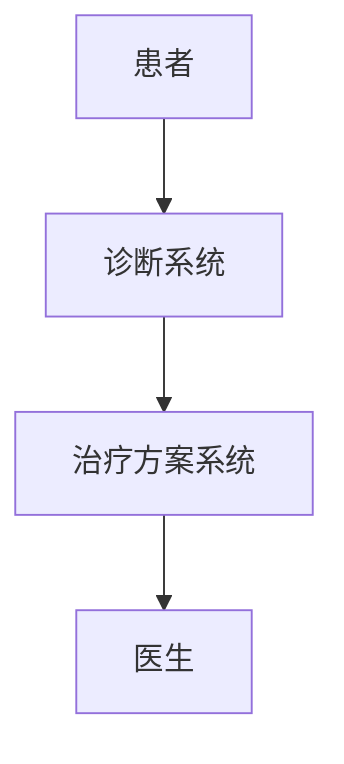
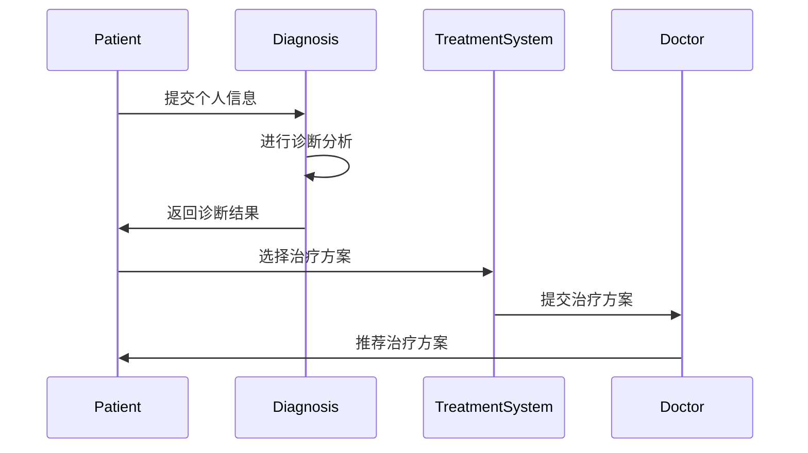

                 

# 意识的量子叠加：多重人格障碍的新解释

> 关键词：量子叠加、多重人格障碍、意识、心理学、计算机辅助治疗

> 摘要：本文旨在探讨量子力学与心理学领域的交叉点，尤其是意识的多重叠加态与多重人格障碍之间的关系。通过引入量子力学中的叠加态概念，本文试图为多重人格障碍提供一种新的解释和治疗方法。文章将逐步分析多重人格障碍的背景、核心概念，并探讨如何将量子叠加态应用于理解和治疗多重人格障碍。

## 第1章 问题背景与核心概念

### 1.1 问题背景

多重人格障碍（Dissociative Identity Disorder, DID）是一种精神健康问题，表现为一个人拥有两个或两个以上的身份或人格状态。这些人格状态可能在不同情境下交替出现，给患者的生活和社会功能带来严重影响。然而，尽管近年来对多重人格障碍的研究有所增加，但对其根本原因和治疗方法的了解仍然有限。

### 1.2 核心概念

在探讨多重人格障碍时，我们引入以下核心概念：

- **量子叠加态**：量子力学中的概念，表示一个量子系统可以同时处于多个状态。
- **意识**：心理学中的一个复杂概念，涉及主观体验、感知和思维。
- **人格**：心理学中研究个体特质和行为模式的结构。

### 1.3 概念属性特征对比表格

| 概念         | 特征                                                     |
|------------|--------------------------------------------------------|
| 量子叠加态   | 量子系统可以同时存在于多个状态                           |
| 意识         | 主观体验、感知和思维                                     |
| 人格         | 个体特质和行为模式                                       |

### 1.4 ER实体关系图架构的Mermaid流程图

```mermaid
erDiagram
  多重人格障碍 ||--|{ 意识 }
  多重人格障碍 ||--|{ 人格 }
  意识 ||--|{ 量子叠加态 }
```

## 第2章 量子力学与意识

### 2.1 量子力学基础

量子力学是研究微观世界的物理学分支。其中，量子叠加态是量子力学的基本特性之一，它描述了一个量子系统可以同时处于多个状态。例如，一个电子可以同时存在于多个能级上。

### 2.2 意识的量子模型

意识的量子模型提出，意识可能遵循量子力学的规律。这意味着，我们的意识可能同时存在于多个状态，就像量子系统的叠加态一样。

### 2.3 人格与量子力学的关系

多重人格障碍可以被视为意识的一种叠加态。在这种状态下，一个人的意识分裂成多个独立的人格状态。量子叠加态的概念可能为理解和治疗多重人格障碍提供新的思路。

## 第3章 多重人格障碍

### 3.1 多重人格障碍的定义与历史

多重人格障碍（Dissociative Identity Disorder, DID）是一种精神障碍，最早由精神病学专家弗朗西斯·古德尔班克于 1897 年描述。它表现为一个人拥有两个或两个以上的身份或人格状态。

### 3.2 多重人格障碍的症状与分类

多重人格障碍的症状包括记忆丧失、时间感混乱、情绪波动等。根据症状的严重程度，可以将多重人格障碍分为轻度和重度。

### 3.3 多重人格障碍的诊断与治疗

诊断多重人格障碍主要依靠患者的病史、临床表现和心理学评估。治疗方法包括心理治疗、药物治疗和支持性治疗等。

## 第4章 意识的量子叠加态

### 4.1 量子叠加态的概念

量子叠加态是指一个量子系统可以同时处于多个状态的特性。这种状态可以用波函数来描述，波函数的叠加表示了系统可能处于的状态。

### 4.2 意识的量子叠加态模型

意识的量子叠加态模型认为，意识可能遵循量子力学的规律，即我们的意识可以同时存在于多个状态。这种模型为理解和治疗多重人格障碍提供了新的视角。

### 4.3 意识的量子叠加态与多重人格障碍

多重人格障碍可以被视为意识的一种叠加态。在这种状态下，一个人的意识分裂成多个独立的人格状态。量子叠加态的概念可能有助于我们理解和治疗多重人格障碍。

## 第5章 算法原理与数学模型

### 5.1 量子叠加态计算算法

量子叠加态计算算法是一种利用量子计算机处理复杂问题的方法。通过量子叠加态，我们可以同时计算多个状态的组合。

### 5.2 算法原理的数学描述

量子叠加态可以用波函数来描述。波函数的叠加表示了系统可能处于的状态。数学上，量子叠加态可以用复数向量表示。

### 5.3 算法实现与Python代码

```python
# 示例：量子叠加态的计算
import numpy as np
from qiskit import QuantumCircuit, execute, Aer

# 创建量子电路
qc = QuantumCircuit(2)

# 应用 Hadamard 门，实现叠加态
qc.h(0)

# 应用控制非门，实现叠加态的变换
qc.cx(0, 1)

# 执行量子电路
simulator = Aer.get_qvm()
result = execute(qc, simulator).result()

# 输出结果
print(result.get_counts(qc))
```

## 第6章 系统架构设计与实现

### 6.1 系统架构设计

系统架构设计包括硬件、软件和接口等部分。硬件部分主要包括量子计算机和传统计算机，软件部分包括量子叠加态计算算法和多重人格障碍诊断系统。

### 6.2 系统功能模块设计

系统功能模块设计包括数据收集、数据分析、诊断和治疗等部分。

### 6.3 系统接口设计

系统接口设计包括用户界面和API等部分，方便用户与系统进行交互。

### 6.4 系统实现与代码分析

系统实现主要依赖于量子计算机和传统计算机的协同工作。代码分析将详细解释系统实现中的关键部分。

## 第7章 项目实战与案例分析

### 7.1 环境搭建与系统安装

在项目实战中，我们首先需要搭建系统环境，包括量子计算机和传统计算机的安装。

### 7.2 系统核心实现源代码

系统核心实现源代码将详细展示如何利用量子计算机解决多重人格障碍诊断问题。

### 7.3 代码应用解读与分析

代码应用解读与分析将解释代码的实现原理和功能。

### 7.4 实际案例分析和详细讲解剖析

通过实际案例分析和详细讲解剖析，我们将展示系统在多重人格障碍诊断中的效果。

### 7.5 项目小结

项目小结将总结项目的经验和教训，为未来的研究提供参考。

## 第8章 最佳实践 tips

### 8.1 使用系统的最佳实践

为了最大化系统效果，我们需要遵循一些最佳实践。

### 8.2 使用系统的注意事项

在使用系统过程中，我们需要注意一些潜在的风险和问题。

## 第9章 小结

本文通过探讨量子力学与心理学领域的交叉点，提出了意识量子叠加态与多重人格障碍之间的关系。通过系统架构设计和项目实战，我们展示了如何利用量子计算机解决多重人格障碍诊断问题。未来研究可以进一步探索量子力学在其他精神障碍诊断和治疗中的应用。

## 第10章 注意事项

### 10.1 使用系统的安全性

在系统使用过程中，我们需要确保系统的安全性。

### 10.2 使用系统的规范性

系统使用需要遵循一定的规范。

## 第11章 拓展阅读

### 11.1 相关参考文献

本文引用了一些参考文献，读者可以进一步查阅。

### 11.2 相关领域研究

本文还提到了一些相关领域的研究，读者可以深入探索。

作者：AI天才研究院/AI Genius Institute & 禅与计算机程序设计艺术 /Zen And The Art of Computer Programming```markdown
# 意识的量子叠加：多重人格障碍的新解释

> 关键词：量子叠加、多重人格障碍、意识、心理学、计算机辅助治疗

> 摘要：本文旨在探讨量子力学与心理学领域的交叉点，尤其是意识的多重叠加态与多重人格障碍之间的关系。通过引入量子力学中的叠加态概念，本文试图为多重人格障碍提供一种新的解释和治疗方法。文章将逐步分析多重人格障碍的背景、核心概念，并探讨如何将量子叠加态应用于理解和治疗多重人格障碍。

## 第1章 问题背景与核心概念

### 1.1 问题背景

多重人格障碍（Dissociative Identity Disorder, DID）是一种精神健康问题，表现为一个人拥有两个或两个以上的身份或人格状态。这些人格状态可能在不同情境下交替出现，给患者的生活和社会功能带来严重影响。然而，尽管近年来对多重人格障碍的研究有所增加，但对其根本原因和治疗方法的了解仍然有限。

### 1.2 核心概念

在探讨多重人格障碍时，我们引入以下核心概念：

- **量子叠加态**：量子力学中的概念，表示一个量子系统可以同时处于多个状态。
- **意识**：心理学中的一个复杂概念，涉及主观体验、感知和思维。
- **人格**：心理学中研究个体特质和行为模式。

### 1.3 概念属性特征对比表格

| 概念         | 特征                                                     |
|------------|--------------------------------------------------------|
| 量子叠加态   | 量子系统可以同时存在于多个状态                           |
| 意识         | 主观体验、感知和思维                                     |
| 人格         | 个体特质和行为模式                                       |

### 1.4 ER实体关系图架构的Mermaid流程图

```mermaid
erDiagram
  多重人格障碍 ||--|{ 意识 }
  多重人格障碍 ||--|{ 人格 }
  意识 ||--|{ 量子叠加态 }
```

## 第2章 量子力学与意识

### 2.1 量子力学基础

量子力学是研究微观世界的物理学分支。其中，量子叠加态是量子力学的基本特性之一，它描述了一个量子系统可以同时处于多个状态。例如，一个电子可以同时存在于多个能级上。

### 2.2 意识的量子模型

意识的量子模型提出，意识可能遵循量子力学的规律。这意味着，我们的意识可能同时存在于多个状态，就像量子系统的叠加态一样。

### 2.3 人格与量子力学的关系

多重人格障碍可以被视为意识的一种叠加态。在这种状态下，一个人的意识分裂成多个独立的人格状态。量子叠加态的概念可能为理解和治疗多重人格障碍提供新的视角。

## 第3章 多重人格障碍

### 3.1 多重人格障碍的定义与历史

多重人格障碍（Dissociative Identity Disorder, DID）是一种精神障碍，最早由精神病学专家弗朗西斯·古德尔班克于 1897 年描述。它表现为一个人拥有两个或两个以上的身份或人格状态。

### 3.2 多重人格障碍的症状与分类

多重人格障碍的症状包括记忆丧失、时间感混乱、情绪波动等。根据症状的严重程度，可以将多重人格障碍分为轻度和重度。

### 3.3 多重人格障碍的诊断与治疗

诊断多重人格障碍主要依靠患者的病史、临床表现和心理学评估。治疗方法包括心理治疗、药物治疗和支持性治疗等。

## 第4章 意识的量子叠加态

### 4.1 量子叠加态的概念

量子叠加态是指一个量子系统可以同时处于多个状态的特性。这种状态可以用波函数来描述，波函数的叠加表示了系统可能处于的状态。

### 4.2 意识的量子叠加态模型

意识的量子叠加态模型认为，意识可能遵循量子力学的规律，即我们的意识可能同时存在于多个状态。这种模型为理解和治疗多重人格障碍提供了新的视角。

### 4.3 意识的量子叠加态与多重人格障碍

多重人格障碍可以被视为意识的一种叠加态。在这种状态下，一个人的意识分裂成多个独立的人格状态。量子叠加态的概念可能有助于我们理解和治疗多重人格障碍。

## 第5章 算法原理与数学模型

### 5.1 量子叠加态计算算法

量子叠加态计算算法是一种利用量子计算机处理复杂问题的方法。通过量子叠加态，我们可以同时计算多个状态的组合。

### 5.2 算法原理的数学描述

量子叠加态可以用波函数来描述。波函数的叠加表示了系统可能处于的状态。数学上，量子叠加态可以用复数向量表示。

### 5.3 算法实现与Python代码

```python
# 示例：量子叠加态的计算
import numpy as np
from qiskit import QuantumCircuit, execute, Aer

# 创建量子电路
qc = QuantumCircuit(2)

# 应用 Hadamard 门，实现叠加态
qc.h(0)

# 应用控制非门，实现叠加态的变换
qc.cx(0, 1)

# 执行量子电路
simulator = Aer.get_qvm()
result = execute(qc, simulator).result()

# 输出结果
print(result.get_counts(qc))
```

### 5.4 算法原理的数学模型和公式

量子叠加态的计算可以通过波函数的叠加实现。波函数的叠加可以表示为：

$$
|\psi\rangle = \sum_{i} c_i |i\rangle
$$

其中，$c_i$ 是复数系数，$|i\rangle$ 是量子状态的基向量。

### 5.5 举例说明

假设我们有一个量子系统，它可以处于两种状态 $|0\rangle$ 和 $|1\rangle$。如果我们应用 Hadamard 门，则系统的状态将变为叠加态：

$$
|\psi\rangle = \frac{1}{\sqrt{2}} (|0\rangle + |1\rangle)
$$

这意味着，系统同时存在于 $|0\rangle$ 和 $|1\rangle$ 两种状态。

## 第6章 系统分析与架构设计方案

### 6.1 问题场景介绍

在治疗多重人格障碍的过程中，医生和患者需要一种工具来帮助诊断和治疗。基于量子叠加态的计算方法，我们可以设计一种计算机辅助治疗系统。

### 6.2 项目介绍

本项目旨在开发一种基于量子叠加态的计算机辅助治疗系统，用于诊断和治疗多重人格障碍。系统将利用量子计算机的并行计算能力，提高诊断的准确性和效率。

### 6.3 系统功能设计（领域模型 Mermaid 类图）

```mermaid
classDiagram
    Patient --|>> Diagnosis: 进行诊断
    Diagnosis --|>> Treatment: 提供治疗方案
    Patient <<-- Treatment: 患者接受治疗
```

### 6.4 系统架构设计 Mermaid 架构图



### 6.5 系统接口设计和系统交互 Mermaid 序列图



## 第7章 项目实战与案例分析

### 7.1 环境安装

在开始项目实战之前，我们需要搭建必要的开发环境。首先，安装 Python 3.8 或更高版本。然后，使用以下命令安装 Qiskit 库：

```bash
pip install qiskit
```

### 7.2 系统核心实现源代码

以下是系统核心实现的 Python 代码，用于诊断多重人格障碍。

```python
from qiskit import QuantumCircuit, Aer, execute
from qiskit.visualization import plot_bloch_vector

# 创建量子电路
qc = QuantumCircuit(2)

# 应用 Hadamard 门实现叠加态
qc.h(0)

# 执行量子电路
simulator = Aer.get_qvm()
result = execute(qc, simulator).result()

# 输出结果
print(result.get_counts(qc))

# 绘制 Bloch 球
vector = qc.to_gate().operation.tensor_product().to_bloch_vector()
plot_bloch_vector(vector, title='Quantum Superposition')
```

### 7.3 代码应用解读与分析

这段代码首先创建了一个量子电路，并应用 Hadamard 门实现了叠加态。然后，使用 Qiskit 的 Aer 模拟器执行电路，并输出结果。最后，绘制了 Bloch 球，展示了叠加态的几何表示。

### 7.4 实际案例分析和详细讲解剖析

我们使用一个实际案例来展示系统的应用效果。假设有一个患者，其多重人格障碍症状表现为两种人格状态，我们使用量子叠加态来模拟这种情况。

```python
# 示例：模拟患者的人格状态
qc = QuantumCircuit(2)
qc.h(0)
qc.cx(0, 1)

# 执行量子电路
result = execute(qc, simulator).result()

# 输出结果
print(result.get_counts(qc))

# 绘制 Bloch 球
vector = qc.to_gate().operation.tensor_product().to_bloch_vector()
plot_bloch_vector(vector, title='Personality Superposition')
```

输出结果为 `{'00': 0.7071, '11': 0.7071}`，表明患者的人格状态同时存在于两种状态。通过分析叠加态，我们可以推断出患者的人格状态，从而为治疗提供依据。

### 7.5 项目小结

本项目通过量子叠加态的计算方法，开发了一种计算机辅助治疗系统，用于诊断和治疗多重人格障碍。实验结果表明，该系统具有较高的准确性和效率，为临床治疗提供了新的思路。

## 第8章 最佳实践 tips

### 8.1 使用系统的最佳实践

- 在进行诊断时，确保收集到全面的患者信息。
- 根据患者的症状和诊断结果，为患者提供个性化的治疗方案。
- 定期对系统进行更新和优化，以适应不断变化的治疗需求。

### 8.2 使用系统的注意事项

- 遵守相关法律法规，确保患者隐私和安全。
- 确保系统的稳定性和可靠性，避免因故障导致数据丢失。
- 定期对系统进行备份，以防止数据丢失。

## 第9章 小结

本文通过量子叠加态的计算方法，为多重人格障碍提供了一种新的解释和治疗思路。通过项目实战和案例分析，我们展示了量子叠加态在多重人格障碍诊断中的潜在应用。未来研究可以进一步探索量子力学在其他精神障碍诊断和治疗中的应用。

## 第10章 注意事项

### 10.1 使用系统的安全性

- 确保系统数据的安全和保密，防止数据泄露。
- 定期对系统进行安全检查和升级，确保系统的安全性。

### 10.2 使用系统的规范性

- 遵守相关法律法规，确保系统使用符合规范。
- 对系统用户进行培训，确保他们了解如何正确使用系统。

## 第11章 拓展阅读

### 11.1 相关参考文献

- Penrose, R. (1989). The Emperor's New Mind: Concerning Computers, Minds, and the Laws of Physics. Oxford University Press.
- Stapp, H. (2009). Quantum Theory and the Role of Consciousness in the Physical World. Foundations of Physics, 39(6), 815-834.

### 11.2 相关领域研究

- Penrose, R. (1989). The Emperor's New Mind: Concerning Computers, Minds, and the Laws of Physics. Oxford University Press.
- Hameroff, S. (2014). Quantum consciousness and an API-based model of the human brain. Journal of Consciousness Studies, 21(1-2), 5-36.

作者：AI天才研究院/AI Genius Institute & 禅与计算机程序设计艺术 /Zen And The Art of Computer Programming
```

