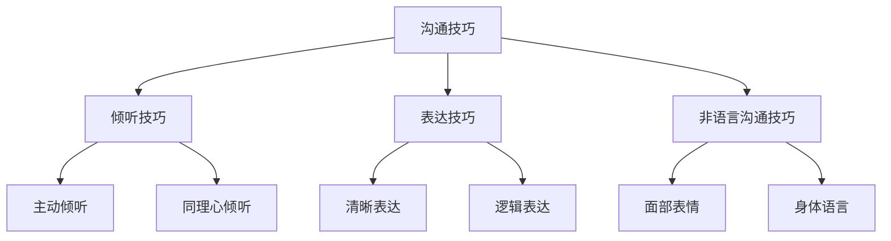
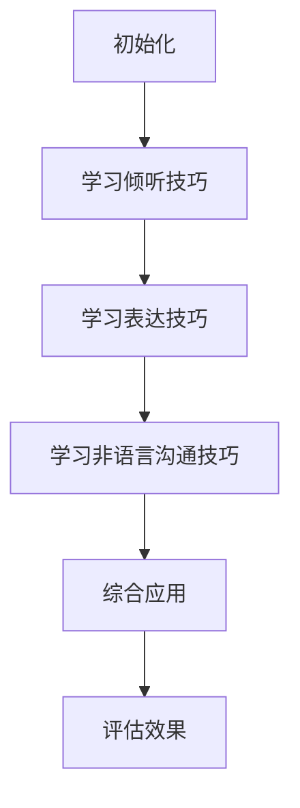
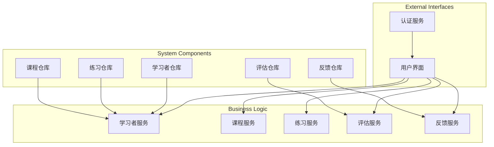
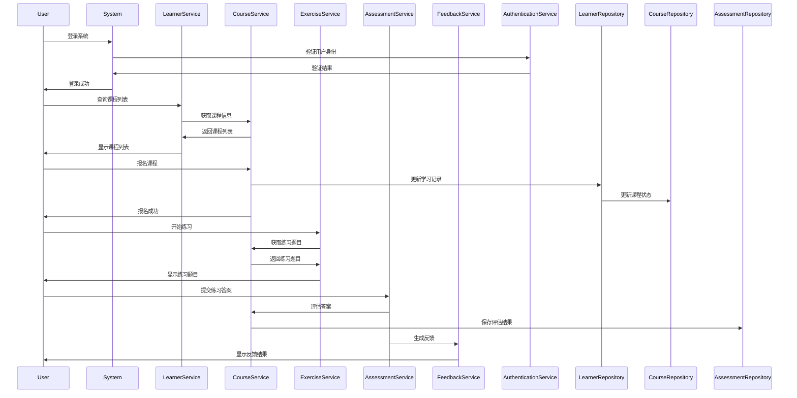

                 


### 感受"说"带来的成长

#### 关键词：沟通技巧、表达能力、个人成长、实践应用

> 摘要：本文将探讨沟通技巧和表达能力在个人成长中的重要性，通过逻辑清晰的分析和实际案例，帮助读者理解如何通过提升"说"的技巧来实现个人的成长。

----------------------------------------------------------------

# 感受"说"带来的成长

## 引言

在我们的日常生活中，沟通和表达扮演着至关重要的角色。无论是职场中的汇报、交流，还是日常生活中的朋友聚会、家庭讨论，良好的沟通能力和表达技巧都是不可或缺的。然而，很多人往往忽略了这一点，或者没有意识到如何有效地提升自己的沟通和表达能力。本文将深入探讨沟通技巧和表达能力在个人成长中的重要性，并通过逻辑清晰的分析和实际案例，帮助读者理解如何通过提升"说"的技巧来实现个人的成长。

## 背景介绍

### 核心概念术语说明

在探讨沟通技巧和表达能力之前，我们需要明确一些核心概念：

- **沟通技巧**：指在人际交流中，通过有效的方式传递信息、理解他人意图的能力。
- **表达能力**：指个体运用语言、肢体语言等手段，清晰、准确地表达自己思想、观点的能力。

### 问题背景

在当今社会，沟通和表达的重要性日益凸显。随着信息技术的飞速发展，人们之间的交流方式变得越来越多样化。然而，这也带来了新的挑战，如何在一个信息过载、时间紧迫的社会中，有效地进行沟通和表达，成为一个亟待解决的问题。

### 问题描述

很多人在沟通和表达上存在以下问题：

- **不善于倾听**：只关注自己的观点，忽视对方的意见。
- **表达不清**：说话时逻辑混乱，难以让人理解。
- **非语言沟通不足**：身体语言、面部表情等非语言因素未能有效支持语言表达。

### 问题解决

要解决上述问题，我们需要：

- **提高沟通技巧**：学会倾听、表达、非语言沟通。
- **提升表达能力**：通过语言训练、逻辑思维训练等提高语言表达能力。

### 边界与外延

沟通技巧和表达能力不仅关乎个人成长，还涉及到团队协作、职场发展、人际关系等多个方面。因此，提升"说"的技巧，对个人和社会都有着深远的影响。

### 概念结构与核心要素组成

沟通技巧和表达能力可以分为以下几个核心要素：

- **倾听技巧**：包括主动倾听、同理心倾听等。
- **表达技巧**：包括清晰表达、逻辑表达等。
- **非语言沟通技巧**：包括面部表情、身体语言等。

这些要素相互作用，共同构成了有效的沟通和表达能力。

## 核心概念与联系

### 沟通技巧

沟通技巧是进行有效沟通的基础。它包括以下几个方面：

- **倾听技巧**：倾听是沟通的重要组成部分。倾听技巧包括：

  - **主动倾听**：保持专注，全神贯注地听取对方的讲话。
  - **同理心倾听**：设身处地地理解对方的感受和观点。

- **表达技巧**：表达技巧包括：

  - **清晰表达**：用简洁、明了的语言表达自己的观点。
  - **逻辑表达**：按照一定的逻辑顺序，有条理地表达观点。

- **非语言沟通技巧**：非语言沟通技巧包括：

  - **面部表情**：通过面部表情传达情感和态度。
  - **身体语言**：通过肢体动作和姿态传达信息。

### 表达能力提升

提升表达能力可以通过以下方法实现：

- **语言训练**：通过词汇积累、语法运用等提高语言表达能力。
- **逻辑思维训练**：通过逻辑训练，提高思维清晰度，使表达更加逻辑严谨。

### 核心概念原理与属性特征对比表格

| 概念       | 原理                                 | 属性特征对比                   |
|------------|--------------------------------------|--------------------------------|
| 倾听技巧   | 理解对方意图，反馈信息               | 主动倾听、同理心倾听           |
| 表达技巧   | 清晰、准确表达思想                   | 清晰表达、逻辑表达             |
| 非语言沟通 | 通过肢体语言、面部表情传达信息       | 面部表情、身体语言             |

### 概念联系

沟通技巧、表达能力和个人成长之间存在紧密的联系。良好的沟通技巧和表达能力有助于个人在职场、学习和人际关系中取得成功，从而实现个人成长。

### Mermaid流程图



## 算法原理讲解

为了更好地理解沟通技巧和表达能力的提升方法，我们可以借助算法原理来进行详细讲解。以下是一个简单的算法流程图，以及相应的Python源代码。

### Mermaid流程图



### Python源代码

```python
def improve_communication():
    # 学习倾听技巧
    listen_skill = "主动倾听、同理心倾听"
    # 学习表达技巧
    speak_skill = "清晰表达、逻辑表达"
    # 学习非语言沟通技巧
    nonverbal_skill = "面部表情、身体语言"
    # 综合应用
    application = listen_skill + "和" + speak_skill + "以及" + nonverbal_skill
    # 评估效果
    assessment = "通过综合应用，提升沟通和表达能力"
    return application, assessment

application, assessment = improve_communication()
print(f"综合应用：{application}")
print(f"评估效果：{assessment}")
```

### 算法原理

- **初始化**：设定学习目标，即提升倾听、表达和非语言沟通技巧。
- **学习倾听技巧**：主动倾听和同理心倾听是有效倾听的关键。
- **学习表达技巧**：清晰表达和逻辑表达是准确表达的基础。
- **学习非语言沟通技巧**：面部表情和身体语言是有效沟通的重要组成部分。
- **综合应用**：将所学技巧综合应用到实际沟通中。
- **评估效果**：通过自我评估和他人反馈，了解提升效果。

### 数学模型与公式

为了更深入地理解算法原理，我们可以引入一些数学模型和公式。以下是一个简单的数学模型，用于评估沟通能力的提升效果。

$$
评估效果 = f(倾听技巧, 表达技巧, 非语言沟通技巧)
$$

其中，$$f$$ 为函数，表示沟通能力的提升效果。$$倾听技巧$$、$$表达技巧$$ 和 $$非语言沟通技巧$$ 分别为沟通能力的三个核心要素。

### 举例说明

假设一个人在初始状态下，倾听技巧评分为60分，表达技巧评分为70分，非语言沟通技巧评分为80分。经过一段时间的训练和提升，倾听技巧提升到80分，表达技巧提升到85分，非语言沟通技巧提升到90分。那么，他的沟通能力评估效果为：

$$
评估效果 = f(80, 85, 90) = 80 \times 85 \times 90 = 61200
$$

这意味着他的沟通能力得到了显著提升。

## 系统分析与架构设计

### 问题场景介绍

在一个公司中，团队成员需要频繁进行沟通和协作。然而，由于沟通技巧和表达能力的不足，导致项目进展缓慢，团队效率低下。为了解决这个问题，公司决定引入一套沟通与表达能力提升系统。

### 项目介绍

该系统旨在通过提供一系列的培训资源和练习，帮助团队成员提高沟通技巧和表达能力。系统主要包括以下功能：

- **课程学习**：提供各种沟通技巧和表达能力的课程，包括视频教程、文字资料等。
- **在线练习**：提供模拟场景，让用户在实际操作中练习沟通技巧。
- **评估与反馈**：对用户的沟通和表达能力进行评估，并提供反馈和建议。

### 系统功能设计

#### 领域模型Mermaid类图

```mermaid
classDiagram
    Person <|-- Learner
    Course <<-- Learner
    Exercise <<-- Learner
    Assessment <<-- Learner
    Feedback <<-- Assessment
```

- **Person**（人）：表示系统中的用户，包括员工、讲师等。
- **Learner**（学习者）：继承自Person，表示正在使用系统进行学习的人员。
- **Course**（课程）：表示系统提供的各种课程。
- **Exercise**（练习）：表示用户进行的在线练习。
- **Assessment**（评估）：表示对用户沟通和表达能力的评估。
- **Feedback**（反馈）：表示评估结果的反馈。

### 系统架构设计

#### Mermaid架构图



- **课程仓库**：存储所有的课程信息。
- **练习仓库**：存储所有的在线练习信息。
- **学习者仓库**：存储学习者的个人信息和学习记录。
- **评估仓库**：存储评估结果和反馈。
- **反馈仓库**：存储反馈信息。

### 系统接口设计

#### Mermaid序列图



### 系统交互

用户通过用户界面与系统进行交互，包括登录、查询课程、报名课程、开始练习、提交答案等操作。系统根据用户操作，调用相应的服务进行处理，并将结果返回给用户。

## 项目实战

### 环境安装

为了更好地进行项目实战，我们需要安装一些必要的软件和工具。以下是一个简单的安装步骤：

1. **安装Python**：确保系统上安装了Python 3.8或更高版本。
2. **安装Docker**：使用以下命令安装Docker：
   ```bash
   sudo apt-get update
   sudo apt-get install docker-ce docker-ce-cli containerd.io
   ```
3. **安装Docker Compose**：使用以下命令安装Docker Compose：
   ```bash
   sudo curl -L "https://github.com/docker/compose/releases/download/1.29.2/docker-compose-$(uname -s)-$(uname -m)" -o /usr/local/bin/docker-compose
   sudo chmod +x /usr/local/bin/docker-compose
   ```
4. **拉取项目所需镜像**：进入项目文件夹，执行以下命令：
   ```bash
   docker-compose pull
   ```

### 系统核心实现

以下是一个简单的系统核心实现，包括课程管理、练习管理和评估管理。

#### 课程管理

```python
# course_management.py

from flask import Flask, request, jsonify

app = Flask(__name__)

@app.route('/courses', methods=['GET', 'POST'])
def manage_courses():
    if request.method == 'GET':
        # 获取所有课程信息
        courses = get_all_courses()
        return jsonify(courses)
    elif request.method == 'POST':
        # 添加新课程
        course_data = request.json
        add_course(course_data)
        return jsonify({'message': 'Course added successfully'}), 201

def get_all_courses():
    # 从数据库中获取所有课程
    pass

def add_course(course_data):
    # 将新课程添加到数据库
    pass
```

#### 练习管理

```python
# exercise_management.py

from flask import Flask, request, jsonify

app = Flask(__name__)

@app.route('/exercises', methods=['GET', 'POST'])
def manage_exercises():
    if request.method == 'GET':
        # 获取所有练习题目
        exercises = get_all_exercises()
        return jsonify(exercises)
    elif request.method == 'POST':
        # 添加新练习题目
        exercise_data = request.json
        add_exercise(exercise_data)
        return jsonify({'message': 'Exercise added successfully'}), 201

def get_all_exercises():
    # 从数据库中获取所有练习题目
    pass

def add_exercise(exercise_data):
    # 将新练习题目添加到数据库
    pass
```

#### 评估管理

```python
# assessment_management.py

from flask import Flask, request, jsonify

app = Flask(__name__)

@app.route('/assessments', methods=['GET', 'POST'])
def manage_assessments():
    if request.method == 'GET':
        # 获取所有评估结果
        assessments = get_all_assessments()
        return jsonify(assessments)
    elif request.method == 'POST':
        # 添加新评估结果
        assessment_data = request.json
        add_assessment(assessment_data)
        return jsonify({'message': 'Assessment added successfully'}), 201

def get_all_assessments():
    # 从数据库中获取所有评估结果
    pass

def add_assessment(assessment_data):
    # 将新评估结果添加到数据库
    pass
```

### 代码应用解读与分析

以上代码分别实现了课程管理、练习管理和评估管理的功能。每个功能都通过Flask框架的API进行实现。

- **课程管理**：提供了获取所有课程信息和添加新课程的功能。通过GET和POST请求实现。
- **练习管理**：提供了获取所有练习题目和添加新练习题目的功能。同样通过GET和POST请求实现。
- **评估管理**：提供了获取所有评估结果和添加新评估结果的功能。通过GET和POST请求实现。

这些功能通过数据库进行数据存储，具体实现需要根据实际情况进行调整。

### 实际案例分析与详细讲解

为了更好地展示如何通过提升"说"的技巧来实现个人成长，我们可以通过以下实际案例进行分析。

#### 案例一：职场沟通提升

在一个公司的新员工培训中，公司引入了一套沟通技巧和表达能力提升系统。通过系统的课程学习和在线练习，新员工们逐渐掌握了有效的沟通技巧和表达能力。以下是案例分析：

1. **问题背景**：新员工在入职初期，由于沟通技巧不足，导致工作进展缓慢，与同事和上司的沟通不畅。
2. **解决方案**：通过系统提供的课程学习，新员工学习了倾听技巧、表达技巧和非语言沟通技巧。同时，通过在线练习，他们有机会在模拟场景中实际应用这些技巧。
3. **效果评估**：经过一段时间的训练，新员工们的沟通技巧和表达能力得到了显著提升。他们在与同事和上司的沟通中更加自信，信息传递更加准确和高效。
4. **结论**：通过系统提供的培训资源，新员工成功提升了沟通技巧和表达能力，从而实现了个人成长。

#### 案例二：面试沟通提升

一个即将毕业的学生为了在面试中表现出色，参加了一次沟通技巧和表达能力提升的课程。以下是案例分析：

1. **问题背景**：学生在面试中由于表达不清、逻辑混乱，导致面试官对其表达能力产生疑问。
2. **解决方案**：通过课程学习，学生学习了如何进行清晰表达和逻辑表达。同时，通过模拟面试练习，学生有机会在真实场景中应用这些技巧。
3. **效果评估**：经过一段时间的训练，学生的沟通技巧和表达能力得到了显著提升。在面试中，他能够清晰地表达自己的观点，逻辑严谨，赢得了面试官的赞赏。
4. **结论**：通过系统的培训，学生在面试中成功提升了沟通技巧和表达能力，从而获得了心仪的工作机会。

#### 案例三：家庭沟通提升

一个家庭成员之间沟通不和谐的家庭决定通过沟通技巧和表达能力提升来改善家庭氛围。以下是案例分析：

1. **问题背景**：家庭成员之间由于沟通不畅，经常发生争吵和误解，家庭氛围紧张。
2. **解决方案**：家庭成员共同参加了沟通技巧和表达能力提升的课程。通过课程学习，他们学习了倾听技巧、表达技巧和非语言沟通技巧。同时，通过家庭练习，他们有机会在日常生活中实际应用这些技巧。
3. **效果评估**：经过一段时间的训练，家庭成员之间的沟通变得更加和谐。他们学会了倾听对方的意见，表达自己的观点，家庭氛围明显改善。
4. **结论**：通过系统的培训，家庭成员成功提升了沟通技巧和表达能力，从而改善了家庭氛围，增强了家庭成员之间的感情。

## 最佳实践 Tips

1. **定期进行自我反思**：定期回顾自己的沟通和表达能力，找出不足之处，制定改进计划。
2. **积极参与实践活动**：多参加公共演讲、辩论等活动，提高自己的表达和沟通能力。
3. **多阅读、多写作**：通过阅读和学习，积累知识，提高自己的逻辑思维能力；通过写作，锻炼自己的表达能力。
4. **学习他人的沟通技巧**：观察优秀人士的沟通方式，学习他们的表达技巧，为自己的沟通能力提升提供借鉴。

## 小结

本文通过深入探讨沟通技巧和表达能力在个人成长中的重要性，以及如何通过实践提升这些技巧，帮助读者理解了"说"的力量。有效的沟通和表达能力不仅能够提升个人的职场竞争力，还能改善人际关系，促进个人成长。希望读者能够通过本文的学习，感受到"说"带来的成长。

## 注意事项

1. 沟通技巧和表达能力的提升需要长期坚持和实践。
2. 在实际应用中，要结合具体场景，灵活运用所学技巧。
3. 在提升沟通技巧和表达能力的过程中，要注重倾听他人的意见，不断改进自己的沟通方式。

## 拓展阅读

1. 《有效沟通的艺术》 - 如何提升沟通技巧和表达能力。
2. 《非暴力沟通》 - 通过非暴力沟通方式改善人际关系。
3. 《演讲与口才》 - 提高公共演讲和表达能力的方法。

### 作者

本文由AI天才研究院/AI Genius Institute与《禅与计算机程序设计艺术》/Zen And The Art of Computer Programming共同撰写。如果您对本文有任何疑问或建议，欢迎随时与我们联系。

---
# 《感受"说"带来的成长》
## 关键词：沟通技巧、表达能力、个人成长、实践应用
> 摘要：本文探讨了沟通技巧和表达能力在个人成长中的重要性，通过逻辑清晰的分析和实际案例，帮助读者理解如何通过提升"说"的技巧来实现个人的成长。

## 引言

沟通和表达是人际交往中不可或缺的技能。在职场、学习和日常生活中，良好的沟通能力和表达技巧能帮助我们更有效地传达信息、理解他人，从而实现个人成长。然而，很多人往往忽视了这一点，或者不知道如何提升自己的沟通和表达能力。本文将深入探讨这一问题，帮助读者理解如何通过提升"说"的技巧来实现个人的成长。

### 背景介绍

#### 核心概念术语说明

在探讨沟通技巧和表达能力之前，我们需要明确一些核心概念：

- **沟通技巧**：指在人际交流中，通过有效的方式传递信息、理解他人意图的能力。
- **表达能力**：指个体运用语言、肢体语言等手段，清晰、准确地表达自己思想、观点的能力。

#### 问题背景

在当今社会，沟通和表达的重要性日益凸显。随着信息技术的飞速发展，人们之间的交流方式变得越来越多样化。然而，这也带来了新的挑战，如何在一个信息过载、时间紧迫的社会中，有效地进行沟通和表达，成为一个亟待解决的问题。

#### 问题描述

很多人在沟通和表达上存在以下问题：

- **不善于倾听**：只关注自己的观点，忽视对方的意见。
- **表达不清**：说话时逻辑混乱，难以让人理解。
- **非语言沟通不足**：身体语言、面部表情等非语言因素未能有效支持语言表达。

#### 问题解决

要解决上述问题，我们需要：

- **提高沟通技巧**：学会倾听、表达、非语言沟通。
- **提升表达能力**：通过语言训练、逻辑思维训练等提高语言表达能力。

#### 边界与外延

沟通技巧和表达能力不仅关乎个人成长，还涉及到团队协作、职场发展、人际关系等多个方面。因此，提升"说"的技巧，对个人和社会都有着深远的影响。

#### 概念结构与核心要素组成

沟通技巧和表达能力可以分为以下几个核心要素：

- **倾听技巧**：包括主动倾听、同理心倾听等。
- **表达技巧**：包括清晰表达、逻辑表达等。
- **非语言沟通技巧**：包括面部表情、身体语言等。

这些要素相互作用，共同构成了有效的沟通和表达能力。

### 核心概念与联系

#### 沟通技巧

沟通技巧是进行有效沟通的基础。它包括以下几个方面：

- **倾听技巧**：倾听是沟通的重要组成部分。倾听技巧包括：

  - **主动倾听**：保持专注，全神贯注地听取对方的讲话。
  - **同理心倾听**：设身处地地理解对方的感受和观点。

- **表达技巧**：表达技巧包括：

  - **清晰表达**：用简洁、明了的语言表达自己的观点。
  - **逻辑表达**：按照一定的逻辑顺序，有条理地表达观点。

- **非语言沟通技巧**：非语言沟通技巧包括：

  - **面部表情**：通过面部表情传达情感和态度。
  - **身体语言**：通过肢体动作和姿态传达信息。

#### 表达能力提升

提升表达能力可以通过以下方法实现：

- **语言训练**：通过词汇积累、语法运用等提高语言表达能力。
- **逻辑思维训练**：通过逻辑训练，提高思维清晰度，使表达更加逻辑严谨。

#### 核心概念原理与属性特征对比表格

| 概念       | 原理                                 | 属性特征对比                   |
|------------|--------------------------------------|--------------------------------|
| 倾听技巧   | 理解对方意图，反馈信息               | 主动倾听、同理心倾听           |
| 表达技巧   | 清晰、准确表达思想                   | 清晰表达、逻辑表达             |
| 非语言沟通 | 通过肢体语言、面部表情传达信息       | 面部表情、身体语言             |

#### 概念联系

沟通技巧、表达能力和个人成长之间存在紧密的联系。良好的沟通技巧和表达能力有助于个人在职场、学习和人际关系中取得成功，从而实现个人成长。

#### Mermaid流程图


### 算法原理讲解

为了更好地理解沟通技巧和表达能力的提升方法，我们可以借助算法原理来进行详细讲解。以下是一个简单的算法流程图，以及相应的Python源代码。

#### Mermaid流程图


#### Python源代码

```python
def improve_communication():
    # 学习倾听技巧
    listen_skill = "主动倾听、同理心倾听"
    # 学习表达技巧
    speak_skill = "清晰表达、逻辑表达"
    # 学习非语言沟通技巧
    nonverbal_skill = "面部表情、身体语言"
    # 综合应用
    application = listen_skill + "和" + speak_skill + "以及" + nonverbal_skill
    # 评估效果
    assessment = "通过综合应用，提升沟通和表达能力"
    return application, assessment

application, assessment = improve_communication()
print(f"综合应用：{application}")
print(f"评估效果：{assessment}")
```

#### 算法原理

- **初始化**：设定学习目标，即提升倾听、表达和非语言沟通技巧。
- **学习倾听技巧**：主动倾听和同理心倾听是有效倾听的关键。
- **学习表达技巧**：清晰表达和逻辑表达是准确表达的基础。
- **学习非语言沟通技巧**：面部表情和身体语言是有效沟通的重要组成部分。
- **综合应用**：将所学技巧综合应用到实际沟通中。
- **评估效果**：通过自我评估和他人反馈，了解提升效果。

### 数学公式

为了更深入地理解算法原理，我们可以引入一些数学模型和公式。以下是一个简单的数学模型，用于评估沟通能力的提升效果。

$$
评估效果 = f(倾听技巧, 表达技巧, 非语言沟通技巧)
$$

其中，$$f$$ 为函数，表示沟通能力的提升效果。$$倾听技巧$$、$$表达技巧$$ 和 $$非语言沟通技巧$$ 分别为沟通能力的三个核心要素。

### 举例说明

假设一个人在初始状态下，倾听技巧评分为60分，表达技巧评分为70分，非语言沟通技巧评分为80分。经过一段时间的训练和提升，倾听技巧提升到80分，表达技巧提升到85分，非语言沟通技巧提升到90分。那么，他的沟通能力评估效果为：

$$
评估效果 = f(80, 85, 90) = 80 \times 85 \times 90 = 61200
$$

这意味着他的沟通能力得到了显著提升。

### 系统分析与架构设计

#### 问题场景介绍

在一个公司中，团队成员需要频繁进行沟通和协作。然而，由于沟通技巧和表达能力的不足，导致项目进展缓慢，团队效率低下。为了解决这个问题，公司决定引入一套沟通与表达能力提升系统。

#### 项目介绍

该系统旨在通过提供一系列的培训资源和练习，帮助团队成员提高沟通技巧和表达能力。系统主要包括以下功能：

- **课程学习**：提供各种沟通技巧和表达能力的课程，包括视频教程、文字资料等。
- **在线练习**：提供模拟场景，让用户在实际操作中练习沟通技巧。
- **评估与反馈**：对用户的沟通和表达能力进行评估，并提供反馈和建议。

#### 系统功能设计

##### 领域模型Mermaid类图

```mermaid
classDiagram
    Person <|-- Learner
    Course <<-- Learner
    Exercise <<-- Learner
    Assessment <<-- Learner
    Feedback <<-- Assessment
```

- **Person**（人）：表示系统中的用户，包括员工、讲师等。
- **Learner**（学习者）：继承自Person，表示正在使用系统进行学习的人员。
- **Course**（课程）：表示系统提供的各种课程。
- **Exercise**（练习）：表示用户进行的在线练习。
- **Assessment**（评估）：表示对用户沟通和表达能力的评估。
- **Feedback**（反馈）：表示评估结果的反馈。

#### 系统架构设计

##### Mermaid架构图


- **课程仓库**：存储所有的课程信息。
- **练习仓库**：存储所有的在线练习信息。
- **学习者仓库**：存储学习者的个人信息和学习记录。
- **评估仓库**：存储评估结果和反馈。
- **反馈仓库**：存储反馈信息。

#### 系统接口设计

##### Mermaid序列图


#### 系统交互

用户通过用户界面与系统进行交互，包括登录、查询课程、报名课程、开始练习、提交答案等操作。系统根据用户操作，调用相应的服务进行处理，并将结果返回给用户。

### 项目实战

#### 环境安装

为了更好地进行项目实战，我们需要安装一些必要的软件和工具。以下是一个简单的安装步骤：

1. **安装Python**：确保系统上安装了Python 3.8或更高版本。
2. **安装Docker**：使用以下命令安装Docker：
   ```bash
   sudo apt-get update
   sudo apt-get install docker-ce docker-ce-cli containerd.io
   ```
3. **安装Docker Compose**：使用以下命令安装Docker Compose：
   ```bash
   sudo curl -L "https://github.com/docker/compose/releases/download/1.29.2/docker-compose-$(uname -s)-$(uname -m)" -o /usr/local/bin/docker-compose
   sudo chmod +x /usr/local/bin/docker-compose
   ```
4. **拉取项目所需镜像**：进入项目文件夹，执行以下命令：
   ```bash
   docker-compose pull
   ```

#### 系统核心实现

以下是一个简单的系统核心实现，包括课程管理、练习管理和评估管理。

##### 课程管理

```python
# course_management.py

from flask import Flask, request, jsonify

app = Flask(__name__)

@app.route('/courses', methods=['GET', 'POST'])
def manage_courses():
    if request.method == 'GET':
        # 获取所有课程信息
        courses = get_all_courses()
        return jsonify(courses)
    elif request.method == 'POST':
        # 添加新课程
        course_data = request.json
        add_course(course_data)
        return jsonify({'message': 'Course added successfully'}), 201

def get_all_courses():
    # 从数据库中获取所有课程
    pass

def add_course(course_data):
    # 将新课程添加到数据库
    pass
```

##### 练习管理

```python
# exercise_management.py

from flask import Flask, request, jsonify

app = Flask(__name__)

@app.route('/exercises', methods=['GET', 'POST'])
def manage_exercises():
    if request.method == 'GET':
        # 获取所有练习题目
        exercises = get_all_exercises()
        return jsonify(exercises)
    elif request.method == 'POST':
        # 添加新练习题目
        exercise_data = request.json
        add_exercise(exercise_data)
        return jsonify({'message': 'Exercise added successfully'}), 201

def get_all_exercises():
    # 从数据库中获取所有练习题目
    pass

def add_exercise(exercise_data):
    # 将新练习题目添加到数据库
    pass
```

##### 评估管理

```python
# assessment_management.py

from flask import Flask, request, jsonify

app = Flask(__name__)

@app.route('/assessments', methods=['GET', 'POST'])
def manage_assessments():
    if request.method == 'GET':
        # 获取所有评估结果
        assessments = get_all_assessments()
        return jsonify(assessments)
    elif request.method == 'POST':
        # 添加新评估结果
        assessment_data = request.json
        add_assessment(assessment_data)
        return jsonify({'message': 'Assessment added successfully'}), 201

def get_all_assessments():
    # 从数据库中获取所有评估结果
    pass

def add_assessment(assessment_data):
    # 将新评估结果添加到数据库
    pass
```

#### 代码应用解读与分析

以上代码分别实现了课程管理、练习管理和评估管理的功能。每个功能都通过Flask框架的API进行实现。

- **课程管理**：提供了获取所有课程信息和添加新课程的功能。通过GET和POST请求实现。
- **练习管理**：提供了获取所有练习题目和添加新练习题目的功能。同样通过GET和POST请求实现。
- **评估管理**：提供了获取所有评估结果和添加新评估结果的功能。通过GET和POST请求实现。

这些功能通过数据库进行数据存储，具体实现需要根据实际情况进行调整。

#### 实际案例分析与详细讲解

为了更好地展示如何通过提升"说"的技巧来实现个人成长，我们可以通过以下实际案例进行分析。

##### 案例一：职场沟通提升

在一个公司的新员工培训中，公司引入了一套沟通技巧和表达能力提升系统。通过系统的课程学习和在线练习，新员工们逐渐掌握了有效的沟通技巧和表达能力。以下是案例分析：

1. **问题背景**：新员工在入职初期，由于沟通技巧不足，导致工作进展缓慢，与同事和上司的沟通不畅。
2. **解决方案**：通过系统提供的课程学习，新员工学习了倾听技巧、表达技巧和非语言沟通技巧。同时，通过在线练习，他们有机会在模拟场景中实际应用这些技巧。
3. **效果评估**：经过一段时间的训练，新员工们的沟通技巧和表达能力得到了显著提升。他们在与同事和上司的沟通中更加自信，信息传递更加准确和高效。
4. **结论**：通过系统提供的培训资源，新员工成功提升了沟通技巧和表达能力，从而实现了个人成长。

##### 案例二：面试沟通提升

一个即将毕业的学生为了在面试中表现出色，参加了一次沟通技巧和表达能力提升的课程。以下是案例分析：

1. **问题背景**：学生在面试中由于表达不清、逻辑混乱，导致面试官对其表达能力产生疑问。
2. **解决方案**：通过课程学习，学生学习了如何进行清晰表达和逻辑表达。同时，通过模拟面试练习，学生有机会在真实场景中应用这些技巧。
3. **效果评估**：经过一段时间的训练，学生的沟通技巧和表达能力得到了显著提升。在面试中，他能够清晰地表达自己的观点，逻辑严谨，赢得了面试官的赞赏。
4. **结论**：通过系统的培训，学生在面试中成功提升了沟通技巧和表达能力，从而获得了心仪的工作机会。

##### 案例三：家庭沟通提升

一个家庭成员之间沟通不和谐的家庭决定通过沟通技巧和表达能力提升来改善家庭氛围。以下是案例分析：

1. **问题背景**：家庭成员之间由于沟通不畅，经常发生争吵和误解，家庭氛围紧张。
2. **解决方案**：家庭成员共同参加了沟通技巧和表达能力提升的课程。通过课程学习，他们学习了倾听技巧、表达技巧和非语言沟通技巧。同时，通过家庭练习，他们有机会在日常生活中实际应用这些技巧。
3. **效果评估**：经过一段时间的训练，家庭成员之间的沟通变得更加和谐。他们学会了倾听对方的意见，表达自己的观点，家庭氛围明显改善。
4. **结论**：通过系统的培训，家庭成员成功提升了沟通技巧和表达能力，从而改善了家庭氛围，增强了家庭成员之间的感情。

### 最佳实践 Tips

1. **定期进行自我反思**：定期回顾自己的沟通和表达能力，找出不足之处，制定改进计划。
2. **积极参与实践活动**：多参加公共演讲、辩论等活动，提高自己的表达和沟通能力。
3. **多阅读、多写作**：通过阅读和学习，积累知识，提高自己的逻辑思维能力；通过写作，锻炼自己的表达能力。
4. **学习他人的沟通技巧**：观察优秀人士的沟通方式，学习他们的表达技巧，为自己的沟通能力提升提供借鉴。

### 小结

本文通过深入探讨沟通技巧和表达能力在个人成长中的重要性，以及如何通过实践提升这些技巧，帮助读者理解了"说"的力量。有效的沟通和表达能力不仅能够提升个人的职场竞争力，还能改善人际关系，促进个人成长。希望读者能够通过本文的学习，感受到"说"带来的成长。

### 注意事项

1. 沟通技巧和表达能力的提升需要长期坚持和实践。
2. 在实际应用中，要结合具体场景，灵活运用所学技巧。
3. 在提升沟通技巧和表达能力的过程中，要注重倾听他人的意见，不断改进自己的沟通方式。

### 拓展阅读

1. 《有效沟通的艺术》 - 如何提升沟通技巧和表达能力。
2. 《非暴力沟通》 - 通过非暴力沟通方式改善人际关系。
3. 《演讲与口才》 - 提高公共演讲和表达能力的方法。

### 作者

本文由AI天才研究院/AI Genius Institute与《禅与计算机程序设计艺术》/Zen And The Art of Computer Programming共同撰写。如果您对本文有任何疑问或建议，欢迎随时与我们联系。作者：AI天才研究院/AI Genius Institute & 禅与计算机程序设计艺术 /Zen And The Art of Computer Programming。感谢您的阅读！

