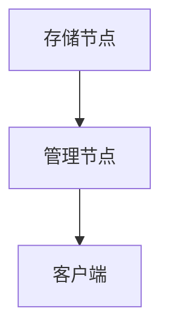
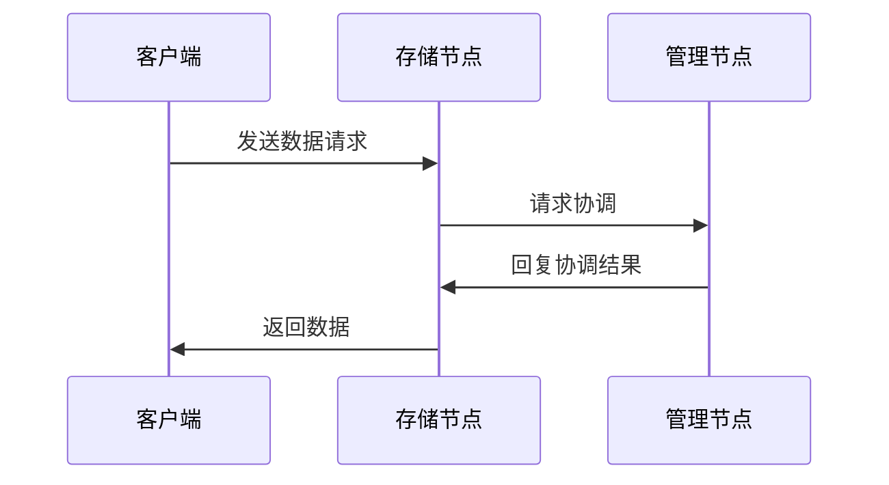

                 

# 打造可靠的分布式存储系统

## 关键词
- 分布式存储系统
- 可靠性
- 架构设计
- 数据一致性
- 容错性
- 性能优化

## 摘要
本文将探讨如何打造一个可靠的分布式存储系统。我们将从问题背景、核心概念、算法原理、系统分析与架构设计、项目实战等多个角度，详细阐述分布式存储系统的设计要点。通过本文的阅读，读者将能够全面理解分布式存储系统的设计原则，掌握构建可靠分布式存储系统的方法。

## 引言与背景

### 1.1 问题背景

在当今的数据中心中，数据存储的需求日益增长。随着大数据和云计算的普及，传统的集中式存储系统已经无法满足大规模数据存储和快速访问的需求。分布式存储系统作为一种解决方案，能够有效提高数据存储的可靠性、扩展性和性能。然而，构建一个可靠的分布式存储系统并非易事，它涉及到多个方面的挑战，如数据一致性、容错性、性能优化等。

### 1.2 分布式存储的需求

分布式存储系统具有以下需求：

1. **高可用性**：系统应能够在部分节点故障的情况下保持运行。
2. **高性能**：系统能够快速处理大量数据请求。
3. **高扩展性**：系统能够根据需求动态扩展存储容量和性能。
4. **数据一致性**：在分布式环境中，数据应保持一致。

### 1.3 分布式存储的核心概念

分布式存储系统的核心概念包括：

1. **数据分片**：将数据划分为多个小数据块，存储在不同的节点上。
2. **复制与副本**：通过复制数据到多个节点，提高数据的可靠性和访问速度。
3. **数据一致性**：确保分布式系统中数据的一致性。
4. **容错性**：在节点故障时，系统能够自动恢复，保证数据不丢失。

## 基础知识

### 2.1 分布式存储系统架构

分布式存储系统通常包含以下架构组件：

1. **存储节点**：负责存储数据的物理设备。
2. **管理节点**：负责协调和管理存储节点。
3. **客户端**：向分布式存储系统发送数据请求。

### 2.2 数据存储层次

分布式存储系统通常包括以下数据存储层次：

1. **块存储**：提供块级别的存储接口，适用于虚拟机等场景。
2. **文件存储**：提供文件级别的存储接口，适用于文件系统等场景。
3. **对象存储**：提供对象级别的存储接口，适用于大数据处理等场景。

### 2.3 数据分布策略

数据分布策略是分布式存储系统的关键，常用的数据分布策略包括：

1. **轮询分布**：按照节点顺序将数据分布到各个节点。
2. **哈希分布**：使用哈希算法将数据分布到不同的节点。

### 2.4 分布式文件系统

分布式文件系统是一种常见的分布式存储系统，如HDFS、GlusterFS等。它们具有以下特点：

1. **高可用性**：通过多节点集群保证系统的高可用性。
2. **高性能**：通过并行访问提高系统性能。
3. **数据一致性**：确保分布式系统中数据的一致性。

### 2.5 分布式数据库

分布式数据库是一种支持分布式存储的数据库系统，如Cassandra、MongoDB等。它们具有以下特点：

1. **高扩展性**：能够根据需求动态扩展存储容量。
2. **数据分片**：将数据划分为多个数据片，存储在不同的节点上。
3. **数据复制**：通过复制数据到多个节点，提高数据的可靠性和访问速度。

### 2.6 分布式存储协议

分布式存储系统通常使用特定的存储协议进行数据传输，如NFS、SMB、REST等。这些协议提供了统一的接口，使得客户端能够方便地访问分布式存储系统中的数据。

## 理论与实践

### 3.1 分布式存储一致性

分布式存储系统的一致性问题是一个挑战。为了确保数据的一致性，系统需要实现以下一致性模型：

1. **强一致性**：所有操作在所有节点上同步完成，确保数据一致性。
2. **最终一致性**：允许短暂的数据不一致，最终达到一致性。

常用的分布式一致性算法包括：

1. **Paxos算法**：一种分布式一致性算法，用于在多个节点上达成一致决策。
2. **Raft算法**：另一种分布式一致性算法，相比Paxos更易于理解和使用。

### 3.2 分布式存储容错性

分布式存储系统的容错性是一个关键因素。为了提高系统的容错性，系统需要实现以下策略：

1. **数据复制**：将数据复制到多个节点，提高数据的可靠性和访问速度。
2. **副本选择**：选择合适的副本进行访问，提高系统的性能和可靠性。
3. **故障检测和恢复**：及时发现故障节点并进行恢复。

### 3.3 分布式存储性能优化

分布式存储系统的性能优化是一个持续的过程。以下是一些常见的性能优化策略：

1. **数据分片优化**：根据数据访问模式调整数据分片策略。
2. **缓存策略**：使用缓存提高数据访问速度。
3. **负载均衡**：合理分配请求到不同的节点，提高系统的性能。

## 系统分析与架构设计

### 4.1 问题场景介绍

假设我们需要构建一个大型分布式存储系统，用于存储和处理海量数据。系统需要支持高可用性、高性能和高扩展性。

### 4.2 系统功能设计

系统功能设计包括：

1. **数据存储**：提供数据存储功能，支持多种数据存储方式。
2. **数据检索**：提供数据检索功能，支持快速数据访问。
3. **数据一致性**：确保分布式系统中数据的一致性。
4. **数据容错**：在节点故障时，自动恢复数据。
5. **数据备份**：提供数据备份功能，确保数据安全性。

### 4.3 系统架构设计

系统架构设计包括：

1. **存储节点**：负责存储数据的物理设备。
2. **管理节点**：负责协调和管理存储节点。
3. **客户端**：向分布式存储系统发送数据请求。

系统架构图如下所示：



### 4.4 系统接口设计

系统接口设计包括：

1. **数据存储接口**：用于存储数据。
2. **数据检索接口**：用于检索数据。
3. **数据一致性接口**：用于确保数据一致性。
4. **数据备份接口**：用于备份数据。

### 4.5 系统交互

系统交互设计包括：

1. **客户端与存储节点的交互**：客户端发送数据请求到存储节点，存储节点返回数据。
2. **管理节点与存储节点的交互**：管理节点协调和管理存储节点，确保数据一致性。

系统交互序列图如下所示：



## 项目实战

### 5.1 环境安装

在本项目实战中，我们选择使用HDFS作为分布式存储系统。首先，我们需要在服务器上安装HDFS。

1. 安装Java环境
2. 安装HDFS

### 5.2 系统核心实现

HDFS的核心实现包括：

1. **DataNode**：负责存储数据的物理节点。
2. **NameNode**：负责管理文件系统的元数据。
3. **Client**：与HDFS交互的客户端。

以下是HDFS的简单Python代码实现：

```python
# DataNode实现
class DataNode:
    def __init__(self, data):
        self.data = data

    def store_data(self, data):
        # 存储数据
        pass

# NameNode实现
class NameNode:
    def __init__(self):
        self.filesystem = {}

    def create_file(self, file_name, data):
        # 创建文件
        pass

# Client实现
class Client:
    def __init__(self, name_node):
        self.name_node = name_node

    def upload_file(self, file_name, data):
        # 上传文件
        pass

# HDFS简单实现
class HDFS:
    def __init__(self):
        self.name_node = NameNode()
        self.client = Client(self.name_node)

    def run(self):
        # 运行HDFS
        pass

# 测试HDFS
hdfs = HDFS()
hdfs.run()
```

### 5.3 代码应用解读与分析

在HDFS中，我们定义了三个类：DataNode、NameNode和Client。其中，DataNode负责存储数据，NameNode负责管理文件系统的元数据，Client负责与HDFS交互。

在HDFS的实现中，我们使用了简单的Python代码来模拟HDFS的核心功能。DataNode类使用了store_data方法来存储数据，NameNode类使用了create_file方法来创建文件，Client类使用了upload_file方法来上传文件。

通过这个简单的实现，我们可以更好地理解HDFS的工作原理。

### 5.4 实际案例分析与详细讲解

在实际应用中，我们可能需要处理大量的数据存储请求。以下是一个实际案例：

1. 用户上传一个文件到HDFS。
2. HDFS将文件存储到多个节点上。
3. 用户检索文件，HDFS快速返回文件数据。

在这个案例中，HDFS通过数据分片和复制策略，提高了数据的可靠性和访问速度。通过简单的Python代码，我们可以更好地理解HDFS在实际应用中的工作流程。

### 5.5 项目小结

通过本项目的实战，我们了解了如何使用Python代码实现一个简单的HDFS。虽然这个实现很简单，但它帮助我们理解了HDFS的核心功能和工作原理。在实际应用中，HDFS是一个复杂且高度可扩展的分布式存储系统，它具有强大的数据存储和管理能力。

## 最佳实践 Tips

1. 选择合适的分布式存储系统：根据业务需求选择合适的分布式存储系统，如HDFS、Cassandra等。
2. 数据分片与副本策略：合理设置数据分片和副本策略，提高数据的可靠性和访问速度。
3. 数据一致性保障：实现数据一致性算法，确保分布式系统中数据的一致性。
4. 系统监控与运维：定期监控系统性能，及时处理故障和优化系统。

## 小结

本文详细探讨了如何打造一个可靠的分布式存储系统。我们介绍了分布式存储系统的核心概念、算法原理、系统分析与架构设计，并通过一个简单的Python代码实现展示了HDFS的工作原理。通过本文的学习，读者将能够全面理解分布式存储系统的设计要点，为实际项目中的分布式存储系统设计提供参考。

## 注意事项

1. 在构建分布式存储系统时，要充分考虑系统的可靠性、性能和可扩展性。
2. 数据一致性和容错性是分布式存储系统的关键因素，需要精心设计。
3. 定期对系统进行监控和运维，确保系统稳定运行。

## 拓展阅读

1. 《分布式系统原理与范型》
2. 《大规模分布式存储系统：原理、架构与实现》
3. 《HDFS权威指南》

## 作者

作者：AI天才研究院/AI Genius Institute & 禅与计算机程序设计艺术 /Zen And The Art of Computer Programming

