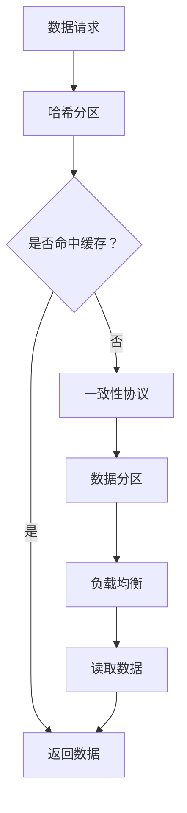
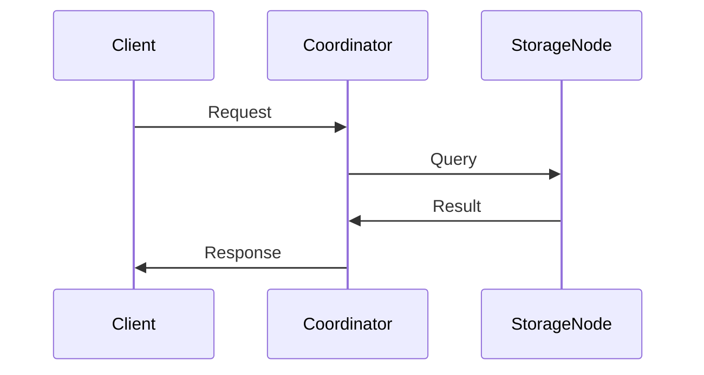
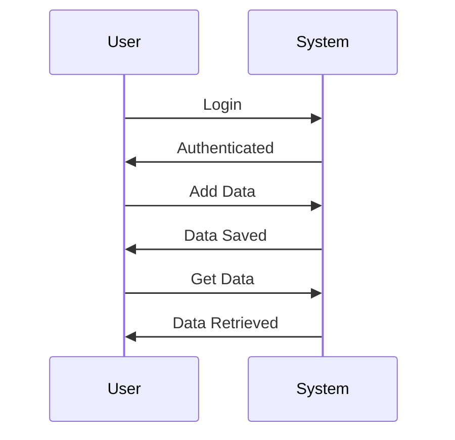
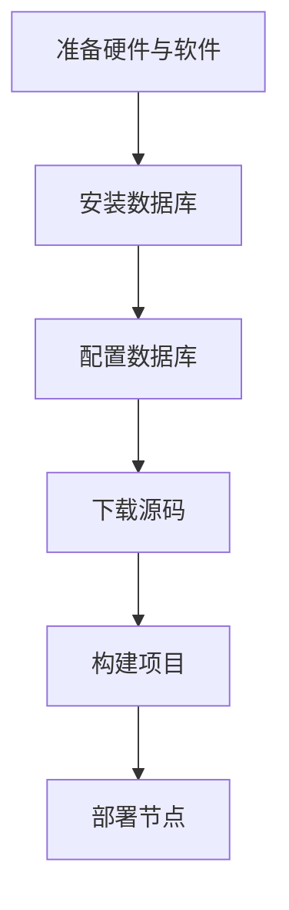
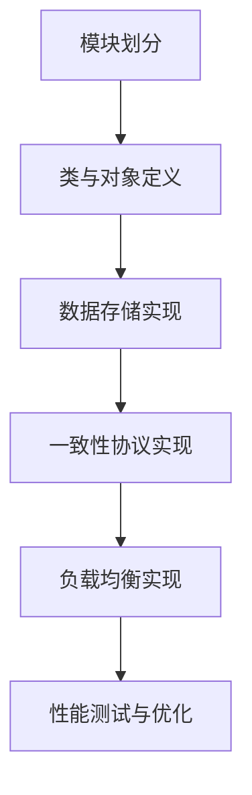
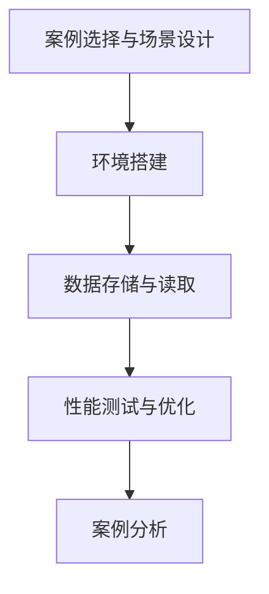
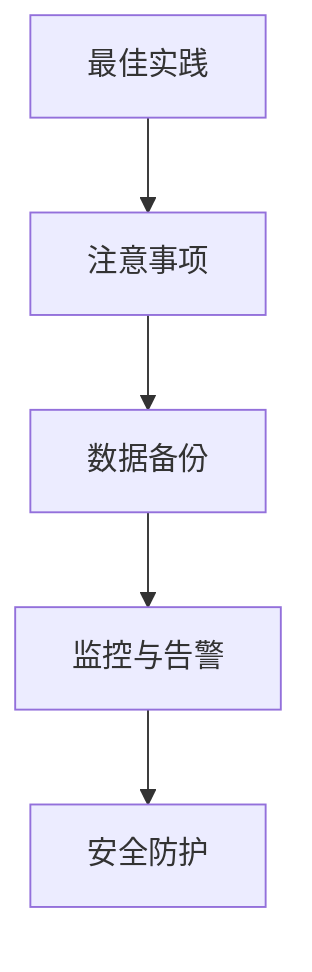

                 

### 文章标题：打造可靠的分布式缓存系统

> **关键词**：分布式缓存系统、可靠性、性能优化、系统架构、实战案例

> **摘要**：本文将深入探讨如何打造一个可靠的分布式缓存系统。我们将从问题背景、核心概念、算法原理、系统架构设计、实战项目、最佳实践等方面展开详细讨论，帮助读者全面理解分布式缓存系统的构建与优化。

----------------------------------------------------------------

### 第一部分：分布式缓存系统概述

#### 1.1 问题背景与概述

在现代互联网应用中，数据存储和访问的需求日益增长。为了满足海量数据的快速访问，传统的单体缓存系统已经难以胜任，分布式缓存系统应运而生。分布式缓存系统通过将缓存数据分散存储在多个节点上，实现数据的高可用、高扩展性和高性能。

#### 1.1.1 分布式缓存系统的需求

- **海量数据存储**：分布式缓存系统能够存储和处理海量数据。
- **高可用性**：通过分布式存储，即使个别节点出现故障，系统仍能正常运行。
- **高扩展性**：可以动态地增加或减少节点，以应对数据量和访问量的变化。
- **高性能**：分布式缓存系统能够实现数据的高速读取和写入。

#### 1.1.2 分布式缓存系统解决的问题

- **数据一致性问题**：分布式缓存系统需要解决多节点间数据一致性的问题。
- **数据分区问题**：如何合理地将数据进行分区，以实现负载均衡。
- **故障转移问题**：如何处理节点的故障，确保系统的高可用性。

#### 1.1.3 分布式缓存系统的边界与外延

- **边界**：分布式缓存系统主要关注缓存数据的存储和访问。
- **外延**：分布式缓存系统可以与其他系统（如数据库、消息队列等）进行集成，实现更复杂的应用场景。

----------------------------------------------------------------

#### 1.2 核心概念与联系

分布式缓存系统涉及多个核心概念，如节点、数据分区、一致性协议等。以下是这些概念的定义及其相互关系。

#### 1.2.1 分布式缓存系统的概念

- **节点**：分布式缓存系统中的单个存储单元。
- **数据分区**：将缓存数据划分到不同的节点上。
- **一致性协议**：确保多节点间数据一致性的方法。

#### 1.2.2 分布式缓存系统的组成要素

- **存储节点**：负责缓存数据的存储和读取。
- **协调节点**：负责管理分布式缓存系统的运行。
- **客户端**：通过API与分布式缓存系统进行交互。

#### 1.2.3 分布式缓存系统的属性特征对比

| 属性特征 | 描述 | 对比 |
| :--- | :--- | :--- |
| **性能** | 数据读写速度 | 单体缓存系统 > 分布式缓存系统（但可通过优化缩小差距） |
| **可用性** | 系统可靠性 | 分布式缓存系统 > 单体缓存系统 |
| **扩展性** | 数据量增长时的系统性能 | 分布式缓存系统 > 单体缓存系统 |
| **一致性** | 数据一致性保证 | 分布式缓存系统需采用一致性协议 |

#### 1.2.4 分布式缓存系统的ER实体关系图架构

```mermaid
erDiagram
    CacheNode ||--|{ CacheClient : has }
    CacheNode ||--|{ CacheCoordinator : manages }
    CacheClient ||--|{ CacheData : accesses }
```

在上述ER实体关系图中，`CacheNode` 表示存储节点，`CacheClient` 表示客户端，`CacheCoordinator` 表示协调节点，`CacheData` 表示缓存数据。

----------------------------------------------------------------

#### 1.3 分布式缓存系统的数学模型与算法原理

分布式缓存系统的设计需要考虑到多个节点间的数据一致性、分区策略和负载均衡等问题。以下是分布式缓存系统的基本数学模型和算法原理。

#### 1.3.1 分布式缓存系统的基本数学模型

分布式缓存系统的基本数学模型可以表示为：

$$
P = \sum_{i=1}^{N} (P_i \times C_i)
$$

其中，\( P \) 表示系统的总性能，\( P_i \) 表示第 \( i \) 个节点的性能，\( C_i \) 表示第 \( i \) 个节点的使用率。

#### 1.3.2 分布式缓存系统的算法原理详解

- **一致性协议**：如Paxos、Raft等，用于确保多节点间的数据一致性。
- **分区策略**：如哈希分区、轮询分区等，用于实现数据的合理分布。
- **负载均衡**：如基于响应时间的负载均衡、基于CPU利用率的负载均衡等，用于优化系统性能。

#### 1.3.3 分布式缓存系统的性能优化

- **缓存预热**：预加载热门数据，减少冷数据访问。
- **缓存淘汰**：合理设置缓存淘汰策略，如LRU、LFU等。
- **数据压缩**：采用数据压缩技术，减少存储空间占用。

#### 1.3.4 分布式缓存系统的算法原理Mermaid流程图



在上述Mermaid流程图中，展示了从数据请求到数据返回的整个过程，包括哈希分区、一致性协议、数据分区、负载均衡等步骤。

----------------------------------------------------------------

### 第二部分：分布式缓存系统设计

#### 2.1 系统功能设计

分布式缓存系统的功能设计包括数据存储与访问、数据一致性与复制、数据分片与负载均衡等。

#### 2.1.1 数据存储与访问功能

- **数据存储**：分布式缓存系统将数据存储在多个节点上，每个节点负责一部分数据的存储。
- **数据访问**：客户端通过API向分布式缓存系统发起数据请求，系统根据请求路径和分区策略，将请求路由到相应的节点。

#### 2.1.2 数据一致性与复制

- **一致性协议**：如Paxos、Raft等，用于确保多节点间的数据一致性。
- **数据复制**：将数据复制到多个节点，以提高系统的可用性和可靠性。

#### 2.1.3 数据分片与负载均衡

- **数据分片**：将数据划分为多个分区，每个分区存储在独立的节点上。
- **负载均衡**：通过调度算法，合理地将请求分发到不同的节点，以优化系统性能。

#### 2.1.4 系统功能设计Mermaid类图

```mermaid
classDiagram
    CacheNode --|{ 数据存储 }--> CacheData
    CacheClient --|{ 数据访问 }--> CacheNode
    CacheCoordinator --|{ 一致性与复制 }--> CacheNode
    CacheNode --|{ 数据分片与负载均衡 }--> CacheNode
```

在上述Mermaid类图中，展示了分布式缓存系统的类图，包括数据存储、数据访问、一致性复制、数据分片和负载均衡等核心功能。

----------------------------------------------------------------

#### 2.2 系统架构设计

分布式缓存系统的架构设计需要考虑到系统的可靠性、性能和可扩展性。以下是分布式缓存系统的架构设计。

#### 2.2.1 分布式缓存系统的架构模型

分布式缓存系统的架构模型通常包括以下几个组件：

- **存储节点**：负责数据的存储和读取。
- **协调节点**：负责管理分布式缓存系统的运行，包括节点监控、故障转移等。
- **客户端**：通过API与分布式缓存系统进行交互。

#### 2.2.2 系统组件与交互设计

- **存储节点**：每个存储节点负责存储一部分数据，并对外提供数据访问接口。
- **协调节点**：协调节点负责协调各个存储节点的运行，确保数据的一致性和系统的稳定性。
- **客户端**：客户端通过发送请求，与存储节点和协调节点进行交互。

#### 2.2.3 系统高可用性与故障转移

- **高可用性**：通过数据复制和故障转移机制，确保系统在节点故障时仍能正常运行。
- **故障转移**：当协调节点出现故障时，系统会自动切换到备用协调节点，以保持系统的正常运行。

#### 2.2.4 系统架构设计Mermaid架构图



在上述Mermaid架构图中，展示了客户端、协调节点和存储节点之间的交互过程，包括请求发送、查询处理和响应返回等步骤。

----------------------------------------------------------------

#### 2.3 系统接口设计与交互

分布式缓存系统的接口设计需要考虑到易用性、性能和安全性等因素。

#### 2.3.1 API设计与实现

分布式缓存系统通常提供以下API：

- **数据存储API**：用于存储和读取缓存数据。
- **监控API**：用于监控系统的运行状态和性能。
- **管理API**：用于管理系统的配置和设置。

#### 2.3.2 交互协议与数据格式

- **交互协议**：通常采用HTTP/HTTPS协议，确保数据传输的安全性。
- **数据格式**：通常采用JSON或XML格式，便于数据的解析和处理。

#### 2.3.3 系统安全性与权限控制

- **安全认证**：采用身份认证机制，确保只有授权用户才能访问系统。
- **权限控制**：根据用户的角色和权限，限制用户对系统的操作权限。

#### 2.3.4 系统接口设计和系统交互Mermaid序列图



在上述Mermaid序列图中，展示了用户与系统之间的交互过程，包括登录认证、数据添加、数据获取等步骤。

----------------------------------------------------------------

### 第三部分：分布式缓存系统实战

#### 3.1 项目环境安装

在开始分布式缓存系统的实战项目之前，我们需要搭建一个合适的环境。

#### 3.1.1 硬件与软件环境准备

- **硬件**：至少两台服务器，用于部署分布式缓存系统的节点。
- **软件**：操作系统（如Linux）、JDK、Maven等。

#### 3.1.2 数据库安装与配置

- **安装数据库**：选择合适的数据库（如MySQL、MongoDB等）。
- **配置数据库**：设置数据库的用户、密码、权限等。

#### 3.1.3 分布式缓存系统安装

- **下载源码**：从开源社区下载分布式缓存系统的源码。
- **构建项目**：使用Maven构建项目，生成可执行的JAR文件。
- **部署节点**：将构建好的JAR文件部署到服务器上，启动节点。

#### 3.1.4 分布式缓存系统环境安装Mermaid流程图



在上述Mermaid流程图中，展示了分布式缓存系统环境安装的步骤，包括硬件与软件准备、数据库安装与配置、源码下载、项目构建和节点部署等。

----------------------------------------------------------------

#### 3.2 系统核心实现

分布式缓存系统的核心实现包括数据存储与管理、缓存数据一致性保障、负载均衡与节点管理等方面。

#### 3.2.1 数据存储与管理

- **数据存储**：使用数据库或文件系统存储缓存数据。
- **数据管理**：实现对数据的增删改查操作。

#### 3.2.2 缓存数据一致性保障

- **一致性协议**：采用Paxos或Raft等一致性协议，确保多节点间的数据一致性。
- **数据复制**：实现数据的备份和恢复，提高系统的可用性。

#### 3.2.3 负载均衡与节点管理

- **负载均衡**：采用轮询、哈希等方式进行负载均衡，优化系统性能。
- **节点管理**：实现对节点的监控、故障转移和扩展等功能。

#### 3.2.4 系统核心实现Python源代码

```python
class CacheNode:
    def __init__(self):
        self.data = {}
        self.replicas = []

    def put(self, key, value):
        self.data[key] = value
        for replica in self.replicas:
            replica.put(key, value)

    def get(self, key):
        return self.data.get(key)
```

在上述Python源代码中，实现了CacheNode类，包括put和get方法，用于数据存储和读取。put方法实现数据写入，同时将数据复制到其他节点；get方法实现数据读取。

----------------------------------------------------------------

#### 3.3 代码应用解读与分析

在分布式缓存系统的实战项目中，我们需要对代码进行详细解读和分析，确保其性能和可靠性。

#### 3.3.1 源代码结构分析

- **模块划分**：将系统功能划分为多个模块，如数据存储模块、一致性协议模块、负载均衡模块等。
- **类与对象**：定义类和对象，封装系统功能，提高代码复用性。

#### 3.3.2 代码实现详解

- **数据存储**：采用数据库或文件系统存储缓存数据，实现数据的持久化。
- **一致性协议**：实现Paxos或Raft等一致性协议，确保多节点间的数据一致性。
- **负载均衡**：实现负载均衡算法，优化系统性能。

#### 3.3.3 性能分析与优化

- **性能测试**：使用压力测试工具，对系统进行性能测试，评估其性能指标。
- **性能优化**：根据测试结果，优化代码和系统配置，提高系统性能。

#### 3.3.4 代码应用解读与分析Mermaid流程图



在上述Mermaid流程图中，展示了分布式缓存系统代码应用解读与分析的步骤，包括模块划分、类与对象定义、数据存储实现、一致性协议实现、负载均衡实现和性能测试与优化等。

----------------------------------------------------------------

#### 3.4 实际案例分析与讲解

为了更好地理解分布式缓存系统的应用，我们将通过实际案例进行详细分析和讲解。

#### 3.4.1 案例选择与场景设计

我们选择一个电商平台作为案例，该电商平台需要实现商品缓存功能，以提高页面加载速度。

#### 3.4.2 案例实现与部署

- **环境搭建**：搭建分布式缓存系统的环境，包括存储节点、协调节点和客户端。
- **数据存储**：将商品数据存储到分布式缓存系统中。
- **缓存读取**：从分布式缓存系统中读取商品数据，实现缓存功能。

#### 3.4.3 案例分析与性能测试

- **性能测试**：对电商平台的页面加载速度进行性能测试，比较有无缓存的情况。
- **性能优化**：根据测试结果，对分布式缓存系统进行优化，提高系统性能。

#### 3.4.4 实际案例分析与讲解Mermaid流程图



在上述Mermaid流程图中，展示了实际案例分析与讲解的步骤，包括案例选择与场景设计、环境搭建、数据存储与读取、性能测试与优化和案例分析等。

----------------------------------------------------------------

#### 4.1 最佳实践与注意事项

在分布式缓存系统的实际应用中，遵循最佳实践和注意事项，可以确保系统的可靠性和性能。

#### 4.1.1 实际应用中的最佳实践

- **合理配置**：根据实际需求，合理配置系统的参数和资源。
- **监控与告警**：定期监控系统的运行状态，设置告警机制，及时发现和处理问题。
- **数据备份**：定期备份数据，防止数据丢失。

#### 4.1.2 注意事项

- **数据一致性**：确保数据的一致性，避免数据冲突和丢失。
- **性能优化**：根据业务需求和负载情况，不断优化系统性能。
- **安全防护**：加强系统安全防护，防止恶意攻击和数据泄露。

#### 4.1.3 拓展阅读与资源推荐

- **分布式缓存系统原理**：《分布式缓存系统原理与实现》
- **一致性协议**：《一致性算法原理与实现》
- **负载均衡**：《负载均衡技术原理与实战》

#### 4.1.4 最佳实践与注意事项Mermaid流程图



在上述Mermaid流程图中，展示了最佳实践与注意事项的步骤，包括最佳实践、注意事项、数据备份、监控与告警和安全防护等。

----------------------------------------------------------------

### 结束语

通过本文的详细讲解，我们了解了分布式缓存系统的核心概念、设计原理和实战项目。分布式缓存系统在现代互联网应用中扮演着重要的角色，它能够提供高性能、高可用性和高扩展性的缓存服务。在实际应用中，我们需要不断优化和改进分布式缓存系统，以满足不断增长的数据存储和访问需求。

#### 作者信息

作者：AI天才研究院/AI Genius Institute & 禅与计算机程序设计艺术 /Zen And The Art of Computer Programming

### 全文总结

本文从分布式缓存系统的问题背景、核心概念、算法原理、系统架构设计、实战项目和最佳实践等方面，全面阐述了分布式缓存系统的构建与优化。通过详细的讲解和分析，使读者对分布式缓存系统有了更深入的理解，为实际应用提供了有益的参考。未来，随着技术的发展，分布式缓存系统将在更多场景中得到应用，其性能和可靠性将不断提升。

