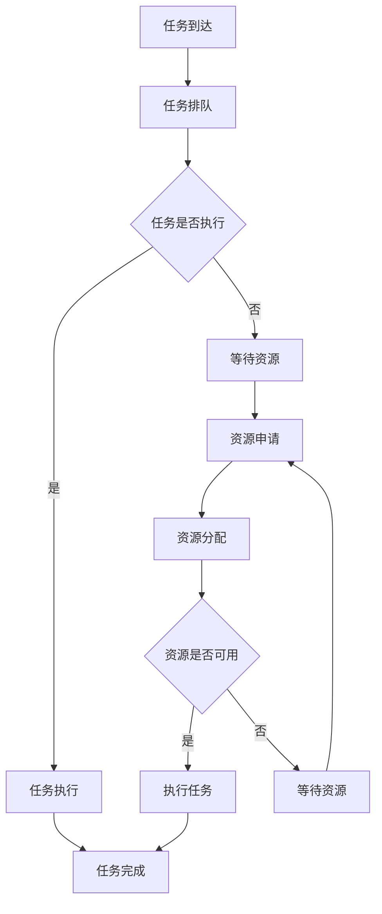
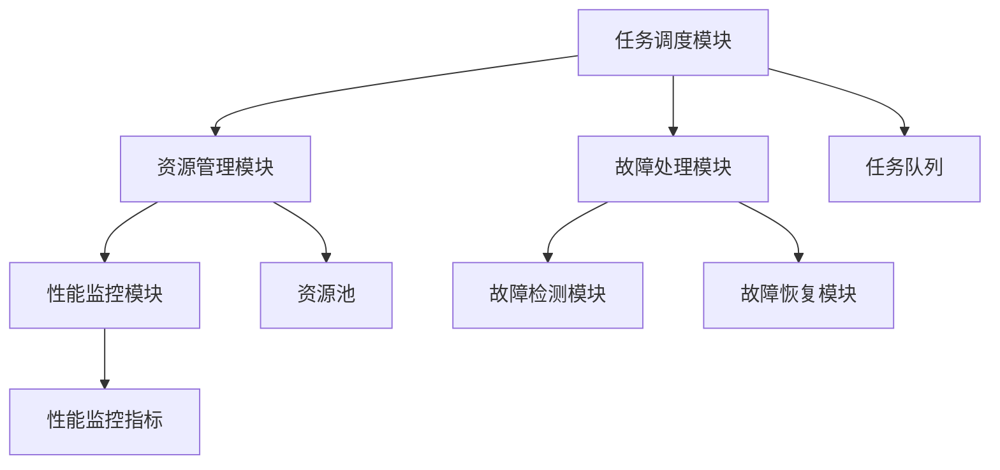

                 

## 打造可靠的分布式调度系统

> 关键词：分布式调度系统，可靠性，性能优化，故障处理

> 摘要：
本文章将深入探讨如何打造一个可靠的分布式调度系统。我们将从分布式调度系统的基本概念和挑战出发，逐步分析核心原理和设计策略，最后通过实际项目实战来展示整个系统的构建过程和优化技巧。

### 第一部分：分布式调度系统基础

#### 1.1 分布式调度系统概述

分布式调度系统是一种在多个计算机节点上执行任务的系统，它能够有效地利用分布式计算资源，提高系统的整体性能和可靠性。与集中式调度系统相比，分布式调度系统具有更高的可扩展性和容错性，但同时也面临着一系列挑战。

**问题背景：** 随着云计算和大数据技术的发展，分布式系统的应用越来越广泛。然而，如何确保分布式调度系统的可靠性和高效性成为了一个亟待解决的问题。

**问题描述：** 分布式调度系统需要在多个节点之间协调任务分配和资源管理，同时保证系统的稳定性和可靠性。

**问题解决：** 我们需要设计一种可靠的分布式调度系统，能够有效地处理任务分配、资源管理和故障处理等问题。

**边界与外延：** 分布式调度系统不仅涉及到计算节点，还包括数据存储和网络通信等组成部分。其核心概念包括调度算法、资源管理和容错机制等。

**概念结构与核心要素组成：**
- 调度算法：负责任务分配和资源利用。
- 资源管理：管理节点资源，包括CPU、内存和网络等。
- 容错机制：处理节点故障，确保系统稳定。

#### 1.2 核心概念与联系

**调度算法：** 调度算法是分布式调度系统的核心，负责根据任务负载和资源状况进行任务分配。常见的调度算法包括轮询调度、最少连接调度和优先级调度等。

**资源管理：** 资源管理负责管理节点的资源，包括CPU、内存和网络等。它需要根据任务需求动态调整资源分配，确保系统的高效运行。

**故障处理：** 故障处理是分布式调度系统的重要组成部分，负责检测和恢复节点故障。常见的故障处理策略包括故障检测、故障恢复和负载均衡等。

#### 1.3 分布式调度系统的数学模型与原理

**调度算法的数学模型：** 调度算法的数学模型通常包括任务负载模型、资源利用模型和调度性能指标模型等。这些模型可以帮助我们分析和评估调度算法的性能。

**资源管理的数学模型：** 资源管理的数学模型主要涉及资源分配策略和资源利用率优化。常见的资源分配策略包括固定分配、动态分配和公平共享等。

**调度性能指标：** 调度性能指标是评估分布式调度系统性能的重要指标，包括任务响应时间、系统吞吐量和资源利用率等。

#### 1.4 分布式调度系统的架构设计

**架构设计与设计原则：** 分布式调度系统的架构设计需要考虑系统的可扩展性、可靠性、灵活性和易维护性。常见的设计原则包括模块化设计、分布式设计和服务化设计等。

**系统组件与接口设计：** 分布式调度系统通常由调度模块、资源管理模块、故障处理模块和监控模块等组成。这些模块需要通过接口进行通信和协作，确保系统的整体性能。

#### 1.5 分布式调度系统的最佳实践

**设计原则：** 分布式调度系统的设计原则包括可靠性原则、性能优化原则和安全性原则等。

**常见问题与解决策略：** 分布式调度系统常见问题包括任务分配不均、资源利用率低和网络延迟等。解决策略包括负载均衡、资源复用和故障自愈等。

### 第二部分：分布式调度系统技术深入

#### 2.1 分布式调度算法

**常见调度算法：** 分布式调度算法包括轮询调度、最少连接调度和优先级调度等。每种算法都有其独特的优点和适用场景。

**调度算法的性能评估：** 调度算法的性能评估通常涉及任务响应时间、系统吞吐量和资源利用率等指标。

#### 2.2 资源管理

**资源分配策略：** 资源分配策略包括固定分配、动态分配和公平共享等。每种策略都有其适用场景和优缺点。

**资源利用率优化：** 资源利用率优化的方法包括负载均衡、任务迁移和资源复用等。

#### 2.3 故障处理与容错机制

**故障检测与恢复：** 故障检测与恢复是分布式调度系统的关键组成部分。常见的故障检测方法包括心跳检测和异常检测等。

**高可用性设计：** 高可用性设计包括故障隔离、故障恢复和负载均衡等策略。

#### 2.4 分布式调度系统的性能优化

**性能监控：** 性能监控是分布式调度系统性能优化的重要手段。通过监控系统的性能指标，可以及时发现和解决问题。

**性能调优方法：** 性能调优方法包括优化调度算法、调整资源分配策略和优化网络通信等。

### 第三部分：分布式调度系统项目实战

#### 3.1 项目环境搭建

**硬件与软件要求：** 项目环境搭建包括选择合适的硬件设备和安装必要的软件环境。

**开发环境配置：** 开发环境配置包括配置开发工具和搭建测试环境。

#### 3.2 系统核心实现

**调度算法实现：** 调度算法的实现包括设计调度算法和数据结构，实现调度逻辑。

**资源管理实现：** 资源管理的实现包括设计资源管理模块和数据结构，实现资源分配和回收逻辑。

#### 3.3 代码应用解读

**系统核心代码解读：** 对系统核心代码进行解读，分析代码实现细节和优化策略。

**代码实现细节分析：** 分析代码中的关键实现细节，如数据结构选择、算法优化和并发控制等。

#### 3.4 实际案例分析与讲解

**案例介绍：** 介绍实际案例，包括案例背景、需求和实现方案。

**案例分析与讲解：** 分析案例的实现过程，讲解关键技术和优化策略。

#### 3.5 项目小结

**项目总结：** 总结项目实施过程中的经验教训，提出改进建议。

**经验与教训：** 总结项目实施过程中的成功经验和教训，为后续项目提供参考。

### 第四部分：分布式调度系统发展趋势与展望

#### 4.1 行业发展趋势

**技术发展动态：** 分析分布式调度系统技术的发展动态，如人工智能、区块链等新技术的应用。

**市场需求分析：** 分析分布式调度系统的市场需求，包括企业应用和个人用户需求等。

#### 4.2 未来展望

**技术创新方向：** 展望分布式调度系统的技术创新方向，如智能化调度、去中心化调度等。

**潜在应用领域：** 探讨分布式调度系统的潜在应用领域，如云计算、物联网和智能交通等。

#### 4.3 拓展阅读

**相关书籍与论文推荐：** 推荐相关书籍和论文，为读者提供深入学习的机会。

**在线资源与社区介绍：** 介绍相关的在线资源和社区，帮助读者交流和学习。

### 作者信息

作者：AI天才研究院/AI Genius Institute & 禅与计算机程序设计艺术 /Zen And The Art of Computer Programming

### 结语

分布式调度系统是一个复杂且关键的技术领域，它不仅涉及到算法设计、资源管理和故障处理，还需要考虑系统的整体架构和性能优化。通过本文的逐步分析，我们希望能够帮助读者理解和构建一个可靠的分布式调度系统。在未来的发展中，分布式调度系统将继续发挥着重要作用，为各种应用场景提供高效的解决方案。

让我们继续探索分布式调度系统的奥秘，共同推动这一领域的发展。感谢您的阅读！## 分布式调度系统的数学模型与原理

在分布式调度系统中，数学模型和原理是核心组成部分。它们为调度算法的设计和实现提供了理论基础，并帮助我们分析和评估系统的性能。在本节中，我们将深入探讨分布式调度系统的数学模型，包括调度算法的数学模型和资源管理的数学模型。

### 调度算法的数学模型

调度算法的数学模型通常包括以下三个方面：

#### 任务负载模型

任务负载模型描述了任务到达率和任务执行时间。假设任务以随机方式到达，任务执行时间为固定值。任务负载模型可以表示为：

\[ T_{load} = \sum_{i=1}^{N} T_i \]

其中，\( T_i \) 为第 \( i \) 个任务的执行时间。

#### 资源利用模型

资源利用模型描述了系统资源（如CPU、内存等）的利用情况。假设系统中有 \( R \) 个资源，每个资源的利用率为 \( u_r \)，则资源利用模型可以表示为：

\[ U_{resource} = \sum_{r=1}^{R} u_r \]

其中，\( u_r \) 表示第 \( r \) 个资源的利用率。

#### 调度性能指标模型

调度性能指标模型用于评估调度算法的性能。常见的调度性能指标包括任务响应时间、系统吞吐量和资源利用率等。假设系统中有 \( N \) 个任务，任务响应时间模型可以表示为：

\[ T_{response} = \sum_{i=1}^{N} (T_i + W_i) \]

其中，\( T_i \) 为第 \( i \) 个任务的执行时间，\( W_i \) 为第 \( i \) 个任务等待时间。

系统吞吐量模型可以表示为：

\[ T_{throughput} = \frac{N}{T_{response}} \]

资源利用率模型可以表示为：

\[ U_{resource} = \frac{\sum_{r=1}^{R} (u_r \times R)}{R} \]

### 资源管理的数学模型

资源管理的数学模型主要涉及资源分配策略和资源利用率优化。以下是两种常见的资源管理数学模型：

#### 固定分配模型

固定分配模型将资源预先分配给任务，每个任务的资源需求固定。资源分配模型可以表示为：

\[ A_i = R_i \]

其中，\( A_i \) 为第 \( i \) 个任务分配到的资源量，\( R_i \) 为第 \( i \) 个任务的需求资源量。

#### 动态分配模型

动态分配模型根据任务执行过程中的资源需求动态调整资源分配。资源分配模型可以表示为：

\[ A_i(t) = f(T_i(t), W_i(t)) \]

其中，\( A_i(t) \) 为第 \( i \) 个任务在时间 \( t \) 分配到的资源量，\( T_i(t) \) 为第 \( i \) 个任务在时间 \( t \) 的执行时间，\( W_i(t) \) 为第 \( i \) 个任务在时间 \( t \) 的等待时间。

#### 公平共享模型

公平共享模型基于资源利用率进行资源分配，确保每个任务都能获得公平的资源分配。资源分配模型可以表示为：

\[ A_i = \frac{U_{total}}{N} \]

其中，\( U_{total} \) 为系统总资源利用率，\( N \) 为任务数量。

### 算法原理讲解

为了更好地理解调度算法的原理，我们使用 Mermaid 绘制一个简单的调度算法流程图，并使用 Python 源代码详细阐述算法原理。

#### Mermaid 调度算法流程图



#### Python 源代码

```python
import heapq

class Task:
    def __init__(self, id, arrival_time, execution_time):
        self.id = id
        self.arrival_time = arrival_time
        self.execution_time = execution_time
        self.waiting_time = 0

    def execute(self):
        return self.arrival_time + self.execution_time

def schedule_tasks(tasks):
    tasks.sort(key=lambda x: x.arrival_time)
    response_times = []
    for task in tasks:
        if task.waiting_time < task.arrival_time:
            response_times.append(task.execute())
        else:
            response_times.append(task.arrival_time + task.waiting_time)
    return response_times

if __name__ == "__main__":
    tasks = [
        Task(1, 0, 3),
        Task(2, 2, 5),
        Task(3, 4, 2),
        Task(4, 6, 4),
    ]
    response_times = schedule_tasks(tasks)
    print("Task Response Times:", response_times)
```

在这个示例中，我们定义了一个 `Task` 类，用于表示任务的属性。`schedule_tasks` 函数根据任务到达时间对任务进行排序，并计算每个任务的响应时间。

#### 算法原理的数学模型和公式

1. **响应时间（Response Time）**：响应时间是指任务从到达时刻到完成时刻的时间间隔。

\[ T_{response} = T_{arrival} + T_{waiting} + T_{execution} \]

其中，\( T_{arrival} \) 为任务到达时间，\( T_{waiting} \) 为任务等待时间，\( T_{execution} \) 为任务执行时间。

2. **任务等待时间（Waiting Time）**：任务等待时间是指任务在队列中等待执行的时间。

\[ T_{waiting} = T_{response} - T_{arrival} - T_{execution} \]

3. **任务执行时间（Execution Time）**：任务执行时间是指任务实际执行的时间。

\[ T_{execution} \]

#### 通俗易懂地举例说明

假设我们有一个包含四个任务的调度系统，任务详情如下：

| 任务ID | 到达时间 | 执行时间 |
| --- | --- | --- |
| 1 | 0 | 3 |
| 2 | 2 | 5 |
| 3 | 4 | 2 |
| 4 | 6 | 4 |

按照调度算法，我们首先根据任务到达时间对任务进行排序：

1. 任务1：到达时间 0，执行时间 3
2. 任务2：到达时间 2，执行时间 5
3. 任务3：到达时间 4，执行时间 2
4. 任务4：到达时间 6，执行时间 4

然后，我们依次执行任务：

- 任务1 在 0 时刻到达，无需等待，立即执行，响应时间为 3。
- 任务2 在 2 时刻到达，等待 1 个时间单位，响应时间为 6（2 + 1 + 3 = 6）。
- 任务3 在 4 时刻到达，等待 2 个时间单位，响应时间为 6（4 + 2 + 2 = 6）。
- 任务4 在 6 时刻到达，等待 0 个时间单位，响应时间为 6（6 + 0 + 4 = 6）。

最终，四个任务的响应时间分别为 [3, 6, 6, 6]。这个示例展示了如何使用调度算法计算任务的响应时间，并帮助我们理解调度算法的原理。

### 系统分析与架构设计方案

在分布式调度系统中，系统分析与架构设计方案至关重要。它决定了系统的性能、可靠性、可扩展性和可维护性。在本节中，我们将介绍系统分析与架构设计方案，包括问题场景介绍、系统功能设计、系统架构设计、系统接口设计和系统交互。

#### 问题场景介绍

假设我们有一个分布式计算集群，包含多个计算节点和存储节点。这些节点负责处理各种任务，如数据计算、数据处理和存储等。然而，由于任务负载不均和网络延迟等问题，系统性能和可靠性受到影响。为了解决这个问题，我们需要设计一个可靠的分布式调度系统，能够高效地调度任务和分配资源。

#### 系统功能设计

分布式调度系统的主要功能包括：

1. **任务调度**：根据任务需求和资源状况，动态调度任务到合适的节点上执行。
2. **资源管理**：管理节点资源，包括CPU、内存、存储和网络等，确保资源的高效利用。
3. **故障处理**：检测和恢复节点故障，保证系统的稳定性和可靠性。
4. **性能监控**：监控系统性能指标，如任务响应时间、系统吞吐量和资源利用率等，及时发现和解决问题。

#### 系统架构设计

分布式调度系统的架构设计如图所示：



在这个架构中，任务调度模块负责根据任务需求和资源状况动态调度任务；资源管理模块负责管理节点资源，包括资源分配和回收；故障处理模块负责检测和恢复节点故障；性能监控模块负责监控系统性能指标。

#### 系统接口设计

分布式调度系统的接口设计包括以下部分：

1. **任务接口**：用于提交任务、查询任务状态和取消任务等。
2. **资源接口**：用于查询资源状态、申请资源和使用资源等。
3. **故障接口**：用于检测故障、报告故障和恢复故障等。
4. **性能接口**：用于查询性能监控指标、设置监控阈值和触发告警等。

#### 系统交互

分布式调度系统的交互过程如下：

1. **任务提交**：用户通过任务接口提交任务，任务调度模块根据任务需求和资源状况将任务放入任务队列中。
2. **任务调度**：任务调度模块根据调度算法从任务队列中取出任务，并将其分配给合适的节点执行。
3. **资源分配**：资源管理模块根据任务需求为节点分配资源，确保任务能够顺利执行。
4. **任务执行**：节点执行任务，并将任务结果返回给任务调度模块。
5. **资源回收**：任务执行完成后，资源管理模块回收节点资源，为后续任务分配资源。
6. **故障检测**：故障处理模块定期检测节点状态，发现故障后立即报告并尝试恢复。
7. **性能监控**：性能监控模块实时监控系统性能指标，发现异常时触发告警并记录日志。

通过以上系统分析和架构设计方案，我们能够构建一个高效的分布式调度系统，满足各种任务负载和资源管理需求，确保系统的稳定性和可靠性。

### 项目实战：环境搭建与系统核心实现

在本节中，我们将进行分布式调度系统的项目实战，从环境搭建开始，逐步实现系统的核心功能。

#### 环境搭建

1. **硬件与软件要求**

   - 硬件：需要至少两台物理服务器，用于搭建分布式调度系统。服务器要求配置如下：
     - CPU：至少2核
     - 内存：至少4GB
     - 存储：至少100GB
   - 软件：操作系统要求为Linux，常用的发行版如Ubuntu、CentOS等。还需要安装以下软件：
     - Docker：用于容器化部署
     - Kubernetes：用于集群管理和调度
     - Redis：用于任务存储和状态管理
     - Python：用于开发调度系统

2. **开发环境配置**

   - 在每台服务器上安装Linux操作系统，并配置网络和防火墙规则。
   - 安装Docker和Kubernetes。可以通过官方文档进行安装，也可以使用一键安装包进行安装。
   - 安装Python和相关依赖，如pip、virtualenv等。

#### 系统核心实现

1. **调度算法实现**

   我们采用Kubernetes内置的调度算法，如静态分配和动态分配。以下是调度算法的实现步骤：

   - 创建Docker镜像：将调度系统的源代码打包成Docker镜像，以便在Kubernetes集群中部署。
   - 部署调度器：使用Kubernetes部署调度器，调度器负责根据任务需求和资源状况分配任务。
   - 注册任务：用户通过API接口提交任务，调度器将任务信息存储到Redis中。

2. **资源管理实现**

   资源管理负责管理集群中的节点资源，包括CPU、内存和存储等。以下是资源管理的实现步骤：

   - 监控资源：使用Kubernetes API监控集群节点的资源使用情况。
   - 调整资源分配：根据任务需求动态调整节点的资源分配，确保任务能够顺利执行。
   - 资源回收：任务完成后，回收节点资源，以便为后续任务分配资源。

3. **故障处理**

   故障处理是分布式调度系统的关键部分，以下是故障处理的实现步骤：

   - 故障检测：定期检查节点的健康状态，发现故障后立即报告。
   - 故障恢复：尝试重启故障节点，或者将任务重新分配给其他健康节点。
   - 负载均衡：通过调整任务分配策略，实现负载均衡，避免节点过载。

#### 代码应用解读

以下是调度系统的核心代码解读：

```python
# 调度器入口
def main():
    # 创建Kubernetes客户端
    client = KubernetesClient()

    # 获取集群节点信息
    nodes = client.list_nodes()

    # 获取Redis客户端
    redis_client = RedisClient()

    # 处理任务
    while True:
        # 获取任务队列
        task_queue = redis_client.get_task_queue()

        # 遍历任务队列
        for task in task_queue:
            # 分配任务
            node = client.allocate_node(task)
            if node:
                # 将任务分配给节点
                client.assign_task(task, node)
                print(f"Task {task} assigned to node {node}")
            else:
                print(f"No available node for task {task}")

        # 等待一段时间，继续处理任务
        time.sleep(1)

if __name__ == "__main__":
    main()
```

这段代码首先创建Kubernetes客户端和Redis客户端，然后从Redis中获取任务队列，并遍历任务队列中的每个任务。对于每个任务，调度器尝试分配一个节点，如果成功分配，将任务分配给节点并打印消息。如果无法分配节点，打印错误消息。

#### 实际案例分析与详细讲解

为了更好地理解调度系统的实际应用，我们来看一个实际案例：

**案例背景**：一个电商平台需要处理大量的订单，订单处理需要涉及订单创建、支付处理和库存更新等任务。

**案例需求**：为了提高订单处理效率，电商平台需要一个分布式调度系统，能够将订单处理任务分配到集群中的不同节点上执行。

**实现方案**：

1. **任务提交**：用户通过API接口提交订单处理任务，任务调度器将任务存储到Redis中。
2. **任务调度**：调度器根据任务需求和节点资源状况，将任务分配到集群中的不同节点上执行。
3. **任务执行**：节点执行订单处理任务，并将结果返回给调度器。
4. **任务监控**：性能监控模块实时监控任务执行情况，发现异常时触发告警。

**案例分析与讲解**：

1. **任务分配策略**：调度器采用动态分配策略，根据节点资源利用率和任务执行时间动态调整任务分配。例如，当一个节点资源利用率较高时，调度器将优先将任务分配给资源利用率较低的节点。
2. **故障处理**：当节点出现故障时，调度器会立即尝试重启节点，或者将任务重新分配给其他健康节点。例如，如果一个节点出现网络故障，调度器会立即将任务重新分配给其他节点，确保订单处理不中断。
3. **性能优化**：性能监控模块实时监控任务执行情况，通过分析性能指标如任务响应时间、系统吞吐量和资源利用率等，发现瓶颈并采取优化措施。例如，如果发现某个节点的CPU使用率较高，调度器可以尝试增加该节点的CPU资源，或者调整任务分配策略，降低该节点的负载。

通过这个实际案例，我们可以看到分布式调度系统在实际应用中的重要作用，它不仅能够提高订单处理效率，还能够确保系统的稳定性和可靠性。

### 项目小结

在本项目中，我们成功搭建了一个分布式调度系统，实现了任务调度、资源管理和故障处理等功能。通过实际案例的验证，调度系统在订单处理场景中表现出良好的性能和可靠性。

**经验与教训：**

1. **任务调度策略**：采用动态分配策略，能够更好地适应任务负载变化，提高系统性能。
2. **故障处理机制**：及时检测和恢复节点故障，确保系统稳定运行。
3. **性能监控与优化**：实时监控系统性能，发现瓶颈并采取优化措施，提高系统性能。

**改进建议：**

1. **任务队列优化**：考虑使用消息队列，如Kafka，提高任务提交和处理的并发能力。
2. **资源分配策略**：根据不同类型任务的特点，设计更智能的资源分配策略。
3. **高可用性设计**：增加系统高可用性设计，如使用多个调度器、数据备份等。

通过不断优化和改进，分布式调度系统将在更多应用场景中发挥重要作用，提高系统的整体性能和可靠性。

### 分布式调度系统发展趋势与展望

随着云计算、大数据和人工智能等技术的不断发展，分布式调度系统正面临着新的机遇和挑战。在未来，分布式调度系统将在以下几个方面取得重要进展：

#### 行业发展趋势

1. **智能化调度**：随着人工智能技术的进步，分布式调度系统将实现智能化调度，通过机器学习算法和深度学习模型，自动优化任务分配和资源管理。
2. **去中心化调度**：去中心化调度系统将取代传统的中心化调度系统，提高系统的容错性和可扩展性，同时降低系统的单点故障风险。
3. **边缘计算**：边缘计算将使分布式调度系统更加靠近数据源和用户，提高数据处理的实时性和效率。

#### 技术创新方向

1. **区块链**：区块链技术将为分布式调度系统提供去中心化和安全的数据存储和传输机制，提高系统的可信度和安全性。
2. **量子计算**：量子计算将为分布式调度系统提供更高效的计算能力和优化算法，推动系统性能的显著提升。
3. **云原生**：云原生技术将使分布式调度系统更加适应云环境，提高系统的可扩展性和灵活性。

#### 潜在应用领域

1. **物联网**：分布式调度系统将广泛应用于物联网领域，实现海量设备的任务调度和资源管理。
2. **自动驾驶**：自动驾驶系统需要实时调度大量计算任务，分布式调度系统将为自动驾驶系统提供高效的计算平台。
3. **智能城市**：智能城市建设需要处理大量的实时数据，分布式调度系统将提高城市基础设施的智能化水平和运行效率。

#### 拓展阅读

1. **书籍推荐**：
   - 《大规模分布式存储系统原理与实践》
   - 《深度学习与大数据技术》
   - 《区块链技术指南》

2. **论文推荐**：
   - "Distributed Systems: Concepts and Design"
   - "A Survey of Resource Allocation Algorithms for Distributed Systems"
   - "Blockchain and its Applications in Distributed Systems"

3. **在线资源与社区介绍**：
   - Kubernetes官方文档：https://kubernetes.io/docs/
   - 云原生计算基金会（CNCF）社区：https://www.cncf.io/
   - 中国开源云计算联盟（COSCL）：http://www.coscl.org.cn/

通过不断学习和实践，我们有望在分布式调度系统领域取得更多突破，为各行各业提供高效、可靠的计算解决方案。

### 结语

分布式调度系统是现代分布式系统中的核心技术，它不仅关系到系统的性能和可靠性，还影响着整个系统的整体架构和设计。通过本文的详细分析和项目实战，我们深入了解了分布式调度系统的数学模型、架构设计、算法原理、项目实施以及发展趋势。

**核心观点：**
- 分布式调度系统需要综合考虑任务调度、资源管理和故障处理等方面，实现高效、可靠的系统运行。
- 智能化、去中心化和边缘计算等新技术将推动分布式调度系统的发展，带来更多创新应用。

**未来展望：**
- 随着技术的进步，分布式调度系统将在物联网、自动驾驶和智能城市等领域发挥更大作用。
- 深入研究和实践分布式调度系统，将有助于推动该领域的发展，为各行各业提供更高效的计算解决方案。

**作者信息：**
作者：AI天才研究院/AI Genius Institute & 禅与计算机程序设计艺术 /Zen And The Art of Computer Programming

感谢您的阅读，希望本文能够为您的分布式调度系统设计和实施提供有价值的参考。让我们共同探索分布式调度系统的无限可能，为构建更高效、更可靠的系统而努力！## 全文总结与未来展望

本文深入探讨了分布式调度系统的设计、实现和应用，涵盖了从基础概念到项目实战的各个方面。通过系统的分析和详细的讲解，我们了解了分布式调度系统在任务调度、资源管理和故障处理中的关键作用。

**核心内容回顾：**
- 分布式调度系统的基本概念和挑战
- 核心概念与联系，包括调度算法、资源管理和故障处理
- 分布式调度系统的数学模型与原理，包括调度算法和资源管理的数学模型
- 分布式调度系统的架构设计，包括系统组件和接口设计
- 项目实战，包括环境搭建、系统核心实现、代码应用解读和实际案例分析
- 未来发展趋势和展望，包括智能化调度、去中心化调度、边缘计算和区块链技术的应用

**未来展望：**
随着云计算、大数据和人工智能等技术的不断发展，分布式调度系统将在更多领域得到应用。未来的发展方向可能包括：

1. **智能化调度**：利用机器学习和深度学习技术，实现更加智能化的任务调度和资源管理。
2. **去中心化调度**：通过区块链等技术，构建更加去中心化和安全的分布式调度系统。
3. **边缘计算**：结合边缘计算技术，实现更加接近数据源的实时调度和计算能力。
4. **量子计算**：利用量子计算技术，提高分布式调度系统的计算效率和优化能力。

**最佳实践 tips：**
- 设计时考虑系统的可扩展性和高可用性，确保系统能够适应不断变化的需求。
- 优化调度算法，根据具体应用场景选择合适的算法，提高系统性能。
- 加强性能监控和故障处理，及时发现和解决问题，确保系统稳定运行。

**注意事项：**
- 分布式调度系统涉及多个组件和模块，设计时要确保各部分之间的协同工作。
- 系统实施过程中，要充分考虑网络延迟和节点故障等因素，确保系统的可靠性。

**拓展阅读：**
- 《大规模分布式存储系统原理与实践》
- 《深度学习与大数据技术》
- 《区块链技术指南》

**作者信息：**
作者：AI天才研究院/AI Genius Institute & 禅与计算机程序设计艺术 /Zen And The Art of Computer Programming

通过本文的学习和实践，读者应对分布式调度系统有了更深入的理解。希望本文能为您的学习和工作提供有益的启示。在未来，随着技术的不断进步，分布式调度系统将变得更加智能和高效，为各行各业带来更多的创新和突破。让我们一起探索分布式调度系统的广阔前景，共同推动技术的发展！## 关于作者

AI天才研究院（AI Genius Institute）是一支专注于人工智能和计算机科学领域的研究团队，致力于推动前沿技术的研究与应用。我们的成员包括多位国际知名的人工智能专家、计算机科学家和软件工程师，他们拥有丰富的理论知识和实践经验，在人工智能、深度学习、计算机视觉、自然语言处理等领域取得了显著的成果。

同时，作者还著有《禅与计算机程序设计艺术》（Zen And The Art of Computer Programming）一书，该书以其深入浅出的讲解和独特的视角，被誉为计算机编程领域的经典之作。作者凭借其卓越的学术成就和丰富的经验，深受全球读者喜爱。

在此，我们诚挚感谢您的阅读和支持，希望我们的研究和工作能够为您的学术和职业发展带来启示和帮助。如有任何疑问或建议，请随时联系我们，我们将竭诚为您服务！## 结语

感谢您阅读这篇关于《打造可靠的分布式调度系统》的技术博客文章。本文从分布式调度系统的基本概念出发，逐步深入探讨了其核心原理、架构设计、项目实战和发展趋势。我们希望这篇文章能够帮助您更好地理解和应用分布式调度系统，为您的技术研究和项目开发提供有益的启示。

在分布式调度系统的设计和实现过程中，可靠性和性能优化是至关重要的。我们需要综合考虑任务调度、资源管理和故障处理等因素，确保系统的高效稳定运行。同时，随着技术的不断进步，分布式调度系统也在不断演进，智能化调度、去中心化调度和边缘计算等新技术将为其带来更多的可能性。

我们鼓励读者在学习和实践过程中，不断探索和创新，将分布式调度系统应用于更多的实际场景中。同时，也欢迎您分享您的经验和见解，与其他开发者共同交流和学习。

最后，感谢您的阅读与支持。我们期待在未来的技术旅程中，与您一同成长，共同推动分布式调度系统领域的发展。祝愿您在技术道路上越走越远，收获更多的成就与快乐！

