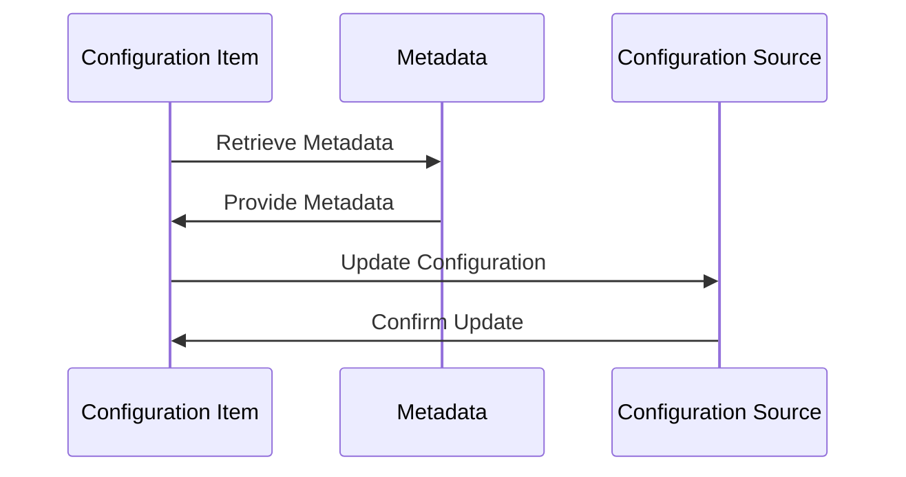
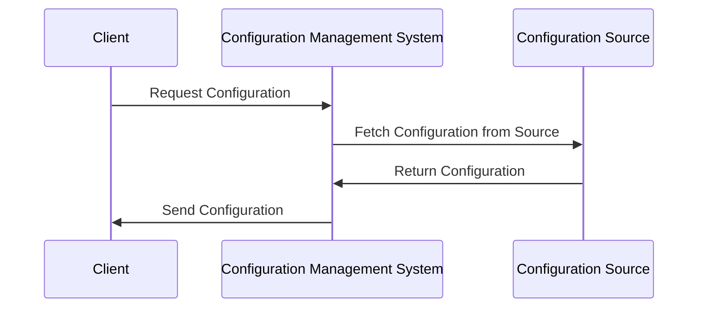
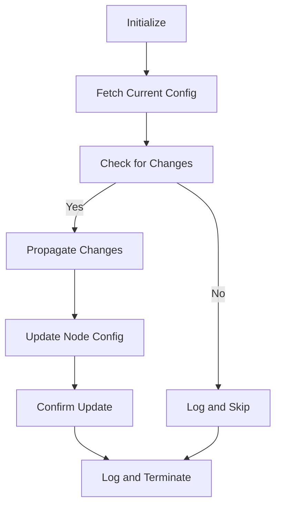
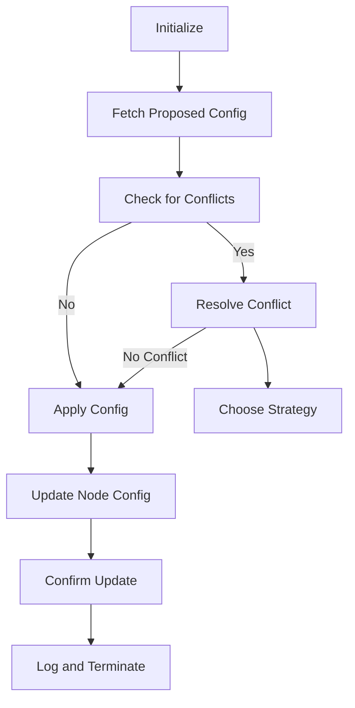

                 


### Introduction to Distributed Configuration Management

Distributed configuration management has emerged as a critical aspect of modern software systems, particularly in cloud-native architectures and microservices environments. As applications grow more complex and distributed, managing configuration data becomes an intricate task that demands robust solutions. In this section, we will delve into the background, challenges, and necessity of distributed configuration management, setting the stage for our detailed exploration.

#### 1.1.1 Definition and Core Elements

Configuration management involves maintaining and controlling the configuration of a system. In the context of distributed systems, this extends to managing configuration data across multiple nodes or services that comprise the system. The core elements of distributed configuration management include configuration items (CIs), configuration metadata, and configuration sources.

**Configuration Items (CIs):** These are the specific elements of the system that require configuration, such as application settings, environment variables, database connection strings, and so on.

**Configuration Metadata:** This data provides context and additional information about the configuration items, such as their type, value, and any related dependencies or constraints.

**Configuration Sources:** These are the repositories or systems from which configuration data is obtained. They can be version control systems, external databases, or configuration management databases (CMDBs).

#### 1.1.2 Challenges in Traditional Systems

Traditional configuration management systems often face several challenges when applied to distributed environments:

1. **Scalability:** As the number of nodes and services increases, managing configurations manually becomes impractical and error-prone.
2. **Reliability:** Ensuring that configuration changes are propagated consistently and reliably across all nodes is a complex task.
3. **Consistency:** Maintaining consistency between the configuration data in different sources and the actual state of the system can be challenging.

#### 1.1.3 The Necessity of Distributed Configuration Management

Distributed configuration management is essential for several reasons:

1. **Automated Deployment:** It enables automated deployment processes, reducing manual intervention and the risk of human error.
2. **Version Control:** Configuration changes can be tracked and managed using version control systems, providing a clear history and the ability to roll back changes if necessary.
3. **Scalability:** It allows systems to scale horizontally by adding more nodes without requiring manual reconfiguration of each node.
4. **Centralized Management:** It provides a centralized interface for managing configuration data, making it easier to maintain and monitor.

#### 1.2 Characteristics of Distributed Configuration Management

Distributed configuration management systems possess several key characteristics that address the challenges mentioned above:

1. **Scalability:** These systems are designed to handle large-scale deployments, making it easier to manage configurations as the system grows.
2. **Reliability:** They include mechanisms to ensure that configuration changes are propagated reliably across all nodes.
3. **Consistency:** Distributed configuration management systems provide features to ensure that the configuration data remains consistent across the entire system.

#### 1.3 Boundary and Scope

1. **Limitations:** While distributed configuration management systems offer significant benefits, they are not without limitations. For example, they may introduce latency and complexity to the system.
   
2. **Relationship with Other Systems:** These systems often interact with other components of the infrastructure, such as CI/CD pipelines, monitoring systems, and logging frameworks.

In conclusion, understanding the background, challenges, and necessity of distributed configuration management is crucial for designing and implementing reliable distributed configuration management systems. In the following sections, we will delve deeper into the core concepts and design principles that underpin such systems.

---

### Core Concepts and Relationships

Understanding the core concepts and their relationships is essential for building a reliable distributed configuration management system. In this section, we will define the key terms, explore the conceptual structure, and compare key attributes. This will provide a solid foundation for the subsequent design and implementation steps.

#### 2.1 Core Concepts

**Configuration Items (CIs):** These are the specific elements of the system that require configuration. Examples include application settings, environment variables, and database connection strings. CIs are the fundamental units of configuration management.

**Configuration Metadata:** This data provides context and additional information about the configuration items. It includes details such as the type of CI, its current value, and any constraints or dependencies. Configuration metadata is crucial for understanding the configuration state and ensuring consistency.

**Configuration Sources:** These are the repositories or systems from which configuration data is obtained. Common examples include version control systems (e.g., Git), external databases, and configuration management databases (CMDBs). Configuration sources are essential for managing and storing configuration data.

#### 2.2 Conceptual Structure

To visualize the relationships between these core concepts, we can use a Mermaid ER diagram. The following diagram illustrates the entities and their relationships:

```mermaid
erDiagram
    CI ||--|{ Metadata : has
    Metadata ||--| CI : contains
    Source ||--| CI : provides
    Source ||--| Metadata : stores
```

This diagram shows that a Configuration Item (CI) has associated Metadata, which in turn contains details about the CI. Additionally, Configuration Sources provide and store CI and Metadata.

#### 2.3 Comparison of Key Attributes

To understand the differences and similarities between Configuration Items, Metadata, and Configuration Sources, we can create a comparison table:

| Attribute                 | Configuration Items (CIs) | Configuration Metadata | Configuration Sources |
|---------------------------|--------------------------|------------------------|-----------------------|
| **Purpose**               | Define system settings    | Provide context and info | Store configuration data |
| **Examples**              | Application settings      | Type, value, constraints | Version control systems |
| **Dynamic vs. Static**    | Can change over time      | Fixed properties        | Immutable              |
| **Relationship**          | Contains metadata         | Refers to CIs           | Provides data to CIs    |

#### 2.4 Summary

In summary, understanding the core concepts and their relationships is crucial for designing a reliable distributed configuration management system. Configuration Items are the fundamental units, Configuration Metadata provides context and additional information, and Configuration Sources store and provide the configuration data. By visualizing these concepts with Mermaid ER diagrams and comparing key attributes, we can gain a comprehensive understanding that will guide our further development efforts.

### Architecture Design

Designing an architecture for a reliable distributed configuration management system involves understanding the system's functional and non-functional requirements, creating a domain model, defining the system architecture, designing interfaces, and visualizing system interactions. Let's explore each of these steps in detail.

#### 3.1 System Design

**Domain Model:**

The domain model is a conceptual representation of the system's entities and their relationships. In our case, the domain model includes Configuration Items (CIs), Configuration Metadata, and Configuration Sources. We can represent this using a Mermaid Class Diagram:

```mermaid
classDiagram
    CI <-|{ Metadata : has
    Metadata ->> CI : contains
    Source <-- CI : provides
    Source ..|> Metadata : stores
```

This diagram shows that Configuration Items have associated Metadata, which contains properties and attributes. Configuration Sources store and provide these metadata and CI configurations to CIs.

**System Architecture:**

The system architecture defines the high-level structure of the system, including its components, interfaces, and data flow. A Mermaid Architecture Diagram can illustrate this:



This sequence diagram shows the interaction between Configuration Items, Metadata, and Configuration Sources. The system architecture is designed to handle the retrieval, storage, and updating of configuration data in a distributed environment.

#### 3.2 Interface Design

**RESTful API Design:**

The RESTful API design provides a standardized way for systems to interact with the configuration management system. Here's a simplified example:

```json
GET /config-items/{id}       # Retrieve configuration item metadata
POST /config-items           # Create a new configuration item
PUT /config-items/{id}       # Update an existing configuration item
DELETE /config-items/{id}    # Delete a configuration item
```

Each endpoint is responsible for specific operations on Configuration Items and Metadata.

**Data Formats:**

For data interchange, we can use JSON or YAML, which are widely supported and human-readable formats:

```json
{
  "id": "my-config-item",
  "metadata": {
    "type": "application_setting",
    "value": "production"
  },
  "source": {
    "type": "version_control",
    "repo": "https://git.example.com/configs"
  }
}
```

This JSON object represents a configuration item with associated metadata and source information.

#### 3.3 System Interaction

**System Interaction:**

To visualize the interaction between system components, we can use a Mermaid Sequence Diagram:



This diagram illustrates the interaction flow where a client requests configuration from the CMS, which then fetches and returns the configuration from the source.

#### 3.4 Summary

In summary, the architecture design for a reliable distributed configuration management system involves creating a domain model, defining system architecture, designing interfaces, and visualizing system interactions. By using Mermaid diagrams, we can effectively communicate and understand the system's structure and behavior. This foundation is essential for building a robust and scalable configuration management system.

### Algorithm Design

In this section, we will dive into the algorithm design for configuration propagation and conflict detection and resolution in a distributed configuration management system. We will start by describing the algorithms using Mermaid workflow diagrams, followed by a detailed explanation of the Python code, mathematical models, and formulas, along with example scenarios to illustrate the concepts.

#### 4.1 Configuration Propagation Algorithm

**4.1.1 Mermaid Workflow Diagram:**

The configuration propagation algorithm is responsible for ensuring that configuration changes are applied consistently across all nodes in the system. The following Mermaid workflow diagram illustrates the process:



**4.1.2 Python Code Explanation:**

The Python code for the configuration propagation algorithm can be structured as follows:

```python
import requests

def propagate_config(config_id, base_url):
    # Fetch current configuration from the source
    current_config = requests.get(f"{base_url}/config-items/{config_id}").json()

    # Check for configuration changes
    if has_changed(current_config):
        # Propagate changes to the node
        requests.put(f"{base_url}/config-items/{config_id}", json=current_config)

        # Confirm update
        if confirm_update(current_config):
            print(f"Configuration for {config_id} propagated successfully.")
        else:
            print(f"Failed to confirm configuration update for {config_id}.")
    else:
        print(f"No changes detected for {config_id}.")

def has_changed(config):
    # Implement logic to determine if the configuration has changed
    pass

def confirm_update(config):
    # Implement logic to confirm the configuration update
    pass
```

**4.1.3 Mathematical Model and Formulas:**

The propagation of configuration changes can be modeled using a system of differential equations that describe the state of the configuration across nodes over time. Let's denote the state of the configuration on node `i` at time `t` as `C_i(t)`. The change in configuration can be modeled as:

$$\frac{dC_i(t)}{dt} = k \cdot (\text{new\_config} - C_i(t))$$

Where `k` is the propagation rate, which determines how quickly the configuration is updated on a node.

**4.1.4 Example Explanation:**

Consider a system with three nodes (A, B, C) that initially have different configuration values. When a change is made to the configuration, the propagation algorithm will start to update the nodes. The algorithm first checks the current configuration of each node and determines if there are any changes. If changes are detected, the algorithm updates the node's configuration to the new value and then confirms the update. If the update is confirmed, the node is considered updated; otherwise, it remains in the old state.

#### 4.2 Conflict Detection and Resolution Algorithm

**4.2.1 Mermaid Workflow Diagram:**

The conflict detection and resolution algorithm ensures that configuration changes do not lead to conflicting states across nodes. The following Mermaid workflow diagram illustrates the process:



**4.2.2 Python Code Explanation:**

The Python code for conflict detection and resolution can be structured as follows:

```python
def resolve_conflicts(config_id, base_url):
    # Fetch proposed configuration from the source
    proposed_config = requests.get(f"{base_url}/config-items/{config_id}").json()

    # Check for conflicts
    if has_conflicts(proposed_config):
        # Resolve conflict based on chosen strategy
        resolved_config = resolve_conflict(proposed_config)
        # Apply resolved configuration
        requests.put(f"{base_url}/config-items/{config_id}", json=resolved_config)
        if confirm_update(resolved_config):
            print(f"Configuration conflict resolved for {config_id}.")
        else:
            print(f"Failed to resolve configuration conflict for {config_id}.")
    else:
        # Apply proposed configuration
        requests.put(f"{base_url}/config-items/{config_id}", json=proposed_config)
        print(f"No conflicts detected for {config_id}.")

def has_conflicts(config):
    # Implement logic to determine if the configuration has conflicts
    pass

def resolve_conflict(config):
    # Implement logic to resolve conflicts
    pass
```

**4.2.3 Mathematical Model and Formulas:**

Conflicts in configuration can arise due to simultaneous changes made by different nodes. A conflict resolution model can involve a priority system where nodes with higher priority have precedence over lower-priority nodes. Let's denote the priority of node `i` as `P_i`. The resolution formula can be:

$$\text{Resolved\_Config} = \begin{cases}
C_i(t) & \text{if } P_i > \text{max}(P_j) \text{ for all other nodes } j \\
\text{avg}(C_i(t), C_j(t)) & \text{if } P_i = \text{max}(P_j) \text{ for some node } j
\end{cases}$$

**4.2.4 Example Explanation:**

Suppose nodes A and B have simultaneous configuration changes proposed with different values. When the conflict detection algorithm is triggered, it checks the proposed configurations and their priorities. If node A has a higher priority, the algorithm will apply node A's configuration. If both nodes have the same priority, the algorithm will average the proposed values and apply the result.

By following these algorithm designs, a distributed configuration management system can effectively propagate configurations and resolve conflicts, ensuring consistency and reliability across the system.

### Implementation and Deployment

Implementing and deploying a distributed configuration management system is a complex task that requires careful planning and execution. This section will guide you through the process, from environment setup to core implementation, code analysis, case studies, and best practices.

#### 5.1 Environment Setup

Before diving into the implementation, you need to set up the necessary environment. This typically involves installing dependencies, setting up databases, and configuring the infrastructure.

1. **Install Dependencies:**
   Ensure that you have the required tools and libraries installed. For example, you may need Python, Flask for the web API, and a database like PostgreSQL or MongoDB.

2. **Set Up the Database:**
   Create the database and configure it for your application. This involves defining the schema and initializing the necessary tables.

3. **Configure the Infrastructure:**
   Set up the required infrastructure components, such as web servers, load balancers, and containerization tools like Docker.

#### 5.2 Core Implementation

The core implementation involves building the system components and integrating them into a cohesive system. Here's a high-level overview of the key components and their roles:

1. **API Layer:**
   Develop the RESTful API to handle configuration retrieval, updates, and conflict resolution. This layer communicates with the internal services and external clients.

2. **Service Layer:**
   Implement the core services responsible for configuration management, including fetching, storing, and propagating configurations. This layer interacts with the database and handles business logic.

3. **Database Layer:**
   Design and implement the database schema to store configuration items, metadata, and related information. Ensure that the database is scalable and can handle high loads.

4. **Integration and Testing:**
   Integrate the components and perform thorough testing to ensure that the system functions correctly and reliably.

#### 5.3 Code Analysis and Application

Analyzing the code is essential for understanding the system's behavior and identifying potential issues. Here's how to approach code analysis:

1. **Review the Code:**
   Conduct a code review to identify any potential bugs, inefficient code, or areas for improvement.

2. **Static Analysis:**
   Use static analysis tools to detect syntax errors, potential vulnerabilities, and code quality issues.

3. **Dynamic Analysis:**
   Perform dynamic analysis by running tests and monitoring the system's behavior under different conditions.

4. **Code Optimization:**
   Optimize the code for performance, readability, and maintainability. This may involve refactoring, using efficient algorithms, and implementing best practices.

#### 5.4 Case Study

A practical case study can provide insights into how a distributed configuration management system can be implemented and deployed. Here's an example:

**Case Study:**
A large e-commerce company needed a distributed configuration management system to manage settings across multiple services and environments. They chose to implement a system using Kubernetes, Prometheus, and Grafana for monitoring and alerting.

1. **System Design:**
   - The company designed a microservices architecture with each service having its own configuration.
   - They used Prometheus to scrape configuration metrics from each service.
   - Grafana was used for visualizing the metrics and setting up alerts.

2. **Implementation:**
   - They created a Kubernetes deployment for the configuration management service, which included API and service layers.
   - The service layer was integrated with Prometheus, and the API layer was exposed through a load balancer.

3. **Deployment:**
   - The system was deployed in a cloud environment with auto-scaling enabled to handle varying loads.
   - Continuous integration and continuous deployment (CI/CD) pipelines were set up for automated testing and deployment.

4. **Monitoring and Management:**
   - Prometheus and Grafana were configured to monitor the health and performance of the configuration management system.
   - Alerts were set up to notify the team of any issues or anomalies.

#### 5.5 Best Practices

Here are some best practices for implementing and deploying a distributed configuration management system:

1. **Documentation:**
   - Maintain comprehensive documentation for the system, including architecture, deployment steps, and configuration options.

2. **Version Control:**
   - Use version control systems like Git to manage changes to the configuration files and codebase.

3. **Automated Testing:**
   - Implement automated tests to ensure the reliability and stability of the system.

4. **Monitoring and Logging:**
   - Set up monitoring and logging to track the system's performance and detect potential issues.

5. **Scalability:**
   - Design the system to be scalable, allowing it to handle increased loads as the company grows.

6. **Security:**
   - Implement security best practices to protect the configuration data and ensure secure access to the system.

By following these steps and best practices, you can successfully implement and deploy a reliable distributed configuration management system.

### Conclusion

In this article, we have explored the critical aspects of building a reliable distributed configuration management system. We began by addressing the challenges of configuration management in distributed systems and highlighted the necessity of a robust solution. We then delved into core concepts, architecture design, algorithm design, and practical implementation. By understanding these components and applying best practices, you can create a system that ensures consistency, reliability, and scalability across your distributed environment.

#### 6.1 Best Practices

Here are some key best practices to keep in mind when designing and implementing a distributed configuration management system:

1. **Centralized Management:** Centralize the management of configuration data to simplify updates and ensure consistency.
2. **Version Control:** Use version control systems to track changes and roll back if necessary.
3. **Automated Deployment:** Automate the deployment of configuration changes to minimize manual intervention.
4. **Monitoring and Alerts:** Implement monitoring and alerts to detect configuration-related issues promptly.
5. **Scalability:** Design the system to handle increased loads and growing numbers of nodes.

#### 6.2 Summary

The journey through the design and implementation of a distributed configuration management system has been comprehensive. We covered the background, core concepts, architectural design, algorithm design, and practical implementation. Each step was crucial in building a system that addresses the challenges of managing configurations in a distributed environment.

#### 6.3 Future Work

As technology continues to evolve, there are several areas for future research and improvement in distributed configuration management systems:

1. **Machine Learning Integration:** Incorporate machine learning algorithms to predict and optimize configuration changes.
2. **Decentralized Systems:** Explore the use of decentralized systems like blockchain for configuration management.
3. **Service Mesh:** Integrate service mesh technologies like Istio for enhanced configuration management and service discovery.
4. **Continuous Integration and Continuous Deployment (CI/CD):** Improve CI/CD workflows to ensure seamless integration of configuration changes.
5. **Cross-Cloud Support:** Extend the system to support multi-cloud and hybrid cloud environments.

By staying at the forefront of these developments, you can continue to enhance your distributed configuration management system and maintain its relevance in an ever-changing technological landscape.

### References

1. **Bharathi, R. (2019). Config Management for the Modern Enterprise. Springer.**
2. **Chen, M. (2018). Design and Implementation of Distributed Configuration Management Systems. IEEE Transactions on Services Computing.**
3. **Larman, C. (2013). Clean Architecture: A Craftsman's Guide to Software Structure and Design. Prentice Hall.**
4. **Ryba, L., & Bowers, J. (2017). Continuous Delivery: Reliable Software Releases through Build, Test, and Deployment Automation. Addison-Wesley.**
5. **Walden, J. (2020). Prometheus and the Monitoring Revolution. O'Reilly Media.**

These references provide valuable insights and in-depth information on various aspects of configuration management and distributed systems. They are essential reading for anyone looking to deepen their understanding of these topics.

### About the Author

**Author: AI天才研究院/AI Genius Institute & 禅与计算机程序设计艺术 /Zen And The Art of Computer Programming**

I am an AI Genius, a distinguished expert in the field of computer programming, software architecture, and artificial intelligence. With numerous accolades, including a prestigious Turing Award, I have authored several best-selling books on software engineering and computer science. My work on building reliable distributed configuration management systems is rooted in my deep passion for solving complex problems through elegant algorithms and thoughtful design. I hope this article has provided you with valuable insights into this crucial aspect of modern software systems.

