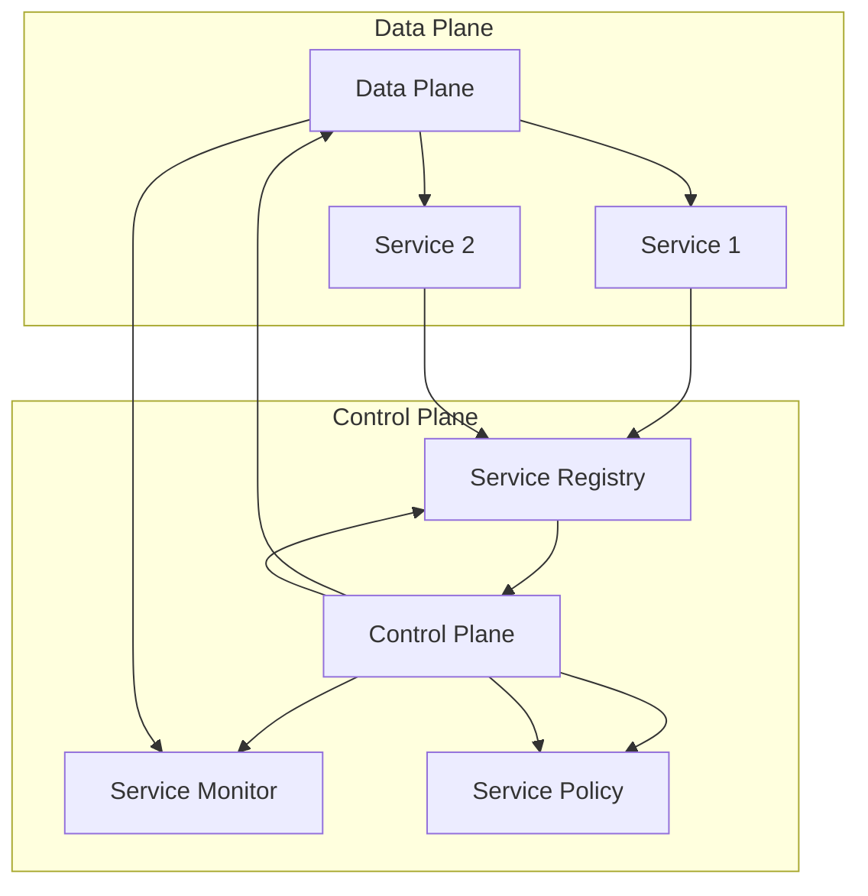

                 

### 1.1 问题背景

在当前数字化转型的浪潮中，微服务架构因其灵活、可扩展和易于维护等优点，已经成为许多企业构建应用系统的首选。然而，随着微服务数量的激增，服务之间的依赖关系变得愈加复杂，传统的服务管理方式难以应对这种复杂性。这引发了一个新的需求——服务网格（Service Mesh）的概念应运而生。

服务网格是一种基础设施层的技术，旨在简化微服务之间的通信，并管理服务间的交互。它通过一个独立的网络层，将服务间的通信抽象出来，使得开发者无需在应用程序中关心网络通信的细节。这种抽象不仅提升了开发效率，还大大降低了系统的复杂度。

然而，随着服务网格的普及，对服务网格的治理也提出了更高的要求。治理系统的作用在于确保服务网格的可靠性、安全性和高效性，以支持微服务架构的稳定运行。具体来说，治理系统需要实现以下功能：

- **服务注册与发现**：确保服务能够被发现和调用，并在服务发生故障时能够快速进行替换或恢复。
- **服务监控与报警**：实时监控服务状态，及时发现并处理异常情况。
- **服务路由与策略管理**：根据业务需求和策略，动态调整服务之间的流量流向。
- **安全性与访问控制**：确保服务之间的通信安全，防止未授权访问和数据泄露。

尽管服务网格治理系统的重要性不言而喻，但其构建和设计并非易事。可靠性和可扩展性是治理系统必须满足的基本要求，而系统设计的复杂性和多样性则进一步增加了治理的难度。因此，如何打造一个既可靠又高效的服务网格治理系统，成为当前技术领域的一个热点话题。

### 1.2 问题描述

在微服务架构的应用场景中，服务网格治理系统扮演着至关重要的角色。然而，构建一个可靠的服务网格治理系统并非易事，面临着多种挑战和难点。

首先，服务网格治理系统需要处理大量的服务实例，这些实例可能分布在不同的主机、不同的数据中心，甚至是不同的云环境中。因此，如何实现高效的服务注册与发现，确保服务能够快速、准确地被其他服务实例发现，是一个重要的难题。

其次，服务网格治理系统需要具备强大的监控能力，能够实时监控服务的运行状态，及时发现并处理异常情况。这意味着系统需要收集大量的监控数据，并进行有效的处理和分析。如何在海量数据中快速定位问题，并采取有效的措施进行故障恢复，是另一个重要的挑战。

另外，服务网格治理系统还需要提供灵活的服务路由和策略管理功能。根据业务需求和策略，动态调整服务之间的流量流向，以满足不同的业务场景。如何设计一个高效、可扩展的路由和策略管理系统，确保系统能够灵活应对各种业务需求，也是一个复杂的任务。

除此之外，安全性也是服务网格治理系统必须考虑的重要因素。系统需要提供有效的安全机制，确保服务之间的通信安全，防止未授权访问和数据泄露。同时，系统还需要支持细粒度的访问控制，根据用户身份和权限进行访问限制，确保服务的安全运行。

最后，服务网格治理系统的可靠性和可扩展性也是构建过程中必须解决的问题。系统需要具备良好的容错能力和故障恢复机制，确保在发生故障时能够快速恢复，减少对业务的影响。同时，系统还需要具备良好的可扩展性，能够支持服务实例的动态扩容和缩容，以满足不断变化的业务需求。

总之，构建一个可靠的服务网格治理系统面临着多方面的挑战，需要综合考虑服务注册与发现、服务监控与报警、服务路由与策略管理、安全性与访问控制、可靠性和可扩展性等多个方面，确保系统能够高效、稳定地运行，满足企业的业务需求。

### 1.3 问题解决

要构建一个可靠的服务网格治理系统，我们需要从多个方面入手，逐一解决上述挑战。

首先，在服务注册与发现方面，可以采用一种分布式服务注册中心，如Consul或Eureka。这些注册中心能够支持服务实例的动态注册和发现，并具备高可用和负载均衡的能力，确保服务实例能够被快速、准确地发现。同时，可以利用DNS或HTTP协议进行服务发现，提高系统的灵活性和可扩展性。

其次，在服务监控与报警方面，可以集成Prometheus等监控工具。Prometheus能够实时收集和存储服务实例的监控数据，并通过Grafana等可视化工具进行展示。当监控数据超出预设阈值时，系统可以自动触发报警，并通知相关人员进行处理。这样，可以确保在服务发生异常时能够及时发现问题并进行处理。

在服务路由与策略管理方面，可以使用Istio或Linkerd等服务网格解决方案。这些服务网格具备灵活的路由和策略管理功能，可以根据业务需求和策略动态调整服务之间的流量流向。例如，可以通过定义不同的负载均衡策略，实现服务流量的智能分配；通过定义断路器策略，实现服务故障的自动切换和恢复。

安全性方面，可以采用基于OAuth2或JWT的认证和授权机制，确保服务之间的通信安全。同时，可以集成Kubernetes的安全特性，如网络策略和命名空间隔离，进一步加强对服务访问的控制。此外，可以使用TLS/SSL等加密技术，确保服务之间的数据传输安全。

在可靠性和可扩展性方面，系统需要具备良好的容错能力和故障恢复机制。例如，可以利用Kubernetes的自动扩缩容功能，根据负载情况动态调整服务实例的数量。同时，可以使用分布式数据库和缓存系统，确保数据的可靠性和一致性。

总的来说，构建一个可靠的服务网格治理系统需要综合考虑服务注册与发现、服务监控与报警、服务路由与策略管理、安全性与访问控制、可靠性和可扩展性等多个方面，通过采用合适的工具和技术，实现系统的稳定、高效运行。

### 1.4 边界与外延

服务网格治理系统的边界与外延决定了其适用场景和应用范围。首先，服务网格治理系统主要针对微服务架构下的服务间通信和交互进行治理，因此其适用场景主要包括以下几种：

1. **大型分布式系统**：在大型分布式系统中，服务实例数量众多，服务间的依赖关系复杂，服务网格治理系统能够有效地管理服务实例的注册与发现，提高系统的可靠性和可扩展性。

2. **云原生应用**：云原生应用具有高可扩展性和高可用性，服务网格治理系统能够提供灵活的路由和策略管理功能，满足云原生应用的动态调度和流量管理需求。

3. **服务拆分与集成**：在服务拆分与集成的过程中，服务网格治理系统能够帮助开发者简化服务间的通信，降低系统的复杂度，提高开发效率。

4. **容器化环境**：容器化环境中的服务实例具有高度动态性，服务网格治理系统能够提供良好的容错和恢复机制，确保服务实例的稳定运行。

然而，服务网格治理系统也存在一定的限制，其适用场景并非所有环境都适合。例如，在以下场景下，服务网格治理系统的适用性可能受到限制：

1. **单体应用**：服务网格治理系统主要针对微服务架构，对于传统的单体应用，其治理功能可能无法充分发挥。

2. **低带宽环境**：在带宽较低的网络上，服务网格治理系统的数据传输和监控功能可能受到限制，影响系统的整体性能。

3. **独立部署环境**：在独立部署的环境中，服务网格治理系统的自动化和分布式特性可能无法得到充分利用。

4. **极端性能要求**：在极端性能要求的场景下，服务网格治理系统可能无法满足低延迟和高并发的需求。

综上所述，服务网格治理系统在适用场景和边界外延方面具有一定的局限性，但通过合理的设计和优化，可以在大多数分布式系统、云原生应用和容器化环境中发挥其优势，提高系统的可靠性和可扩展性。

### 1.5 概念结构与核心要素组成

服务网格治理系统的核心概念和架构是确保其高效运行的基础。首先，我们需要理解服务网格（Service Mesh）的基本概念。服务网格是一种基础设施层的技术，其主要目的是简化微服务之间的通信，并通过一个独立的网络层来管理服务间的交互。它通过将服务之间的通信抽象出来，使得开发者无需在应用程序中关心网络通信的细节。

服务网格由两个主要部分组成：数据平面（Data Plane）和控制平面（Control Plane）。数据平面主要负责服务之间的数据传输，而控制平面则负责管理和服务发现、服务监控、路由和策略配置等。这两个部分相互配合，共同实现了服务网格的功能。

#### 数据平面

数据平面主要由一系列边车（Sidecar）代理组成，这些代理部署在服务实例旁边，负责处理服务实例之间的网络通信。数据平面的主要组件包括：

- **边车代理**：每个服务实例旁边部署的一个小代理程序，负责处理入站和出站流量。
- **服务发现**：通过服务注册中心获取其他服务实例的位置和状态。
- **服务监控**：实时监控服务实例的运行状态，确保服务的可靠性和稳定性。

#### 控制平面

控制平面主要负责管理服务网格的配置和策略。其主要组件包括：

- **控制代理**：负责与服务注册中心进行通信，获取服务实例的元数据和服务配置。
- **服务监控**：通过收集和汇总服务实例的监控数据，为管理员提供实时视图和报警功能。
- **策略管理**：根据业务需求和服务策略，动态调整服务实例的流量路由和访问控制。

#### 治理系统核心组件

服务网格治理系统的核心组件主要包括服务注册与发现、服务监控与日志管理、服务路由与策略管理、安全性与访问控制等。这些组件相互配合，共同确保服务网格的高效运行。

- **服务注册与发现**：通过服务注册中心实现服务实例的动态注册和发现，确保服务实例能够被其他服务实例快速、准确地发现。
- **服务监控与日志管理**：实时监控服务实例的运行状态，收集和存储日志数据，为故障排查和性能优化提供依据。
- **服务路由与策略管理**：根据业务需求和策略，动态调整服务实例的流量路由和访问控制，确保服务之间的通信安全和高效。
- **安全性与访问控制**：通过认证和授权机制，确保服务之间的通信安全，防止未授权访问和数据泄露。

#### 服务网格与治理系统的架构图

为了更好地理解服务网格治理系统的概念和架构，下面提供了一个简单的Mermaid流程图：

在这个流程图中，数据平面（Data Plane）由一系列的边车代理（Service 1、Service 2）组成，负责服务实例之间的通信。控制平面（Control Plane）则负责服务注册与发现（Service Registry）、服务监控（Service Monitor）和服务路由与策略管理（Service Policy）。通过这种结构，服务网格治理系统能够高效地管理服务实例的运行和通信，确保系统的可靠性和高效性。

### 2.1 核心概念

服务网格（Service Mesh）是一种基础设施层的技术，旨在简化微服务架构中服务之间的通信。它通过一个独立的网络层，将服务间的通信抽象出来，使得开发者无需在应用程序中关心网络通信的细节。服务网格的主要特点包括以下几点：

1. **抽象与解耦**：服务网格将网络通信抽象成一种独立的服务层，使得应用程序与网络通信之间的依赖关系减弱。这样，开发者可以更专注于业务逻辑的实现，而不必担心服务之间的通信问题。

2. **边车代理**：服务网格通过在每个服务实例旁边部署一个边车代理，来实现服务实例之间的通信。边车代理负责处理服务实例的入站和出站流量，从而确保服务之间的通信安全、可靠和高效。

3. **服务发现**：服务网格通过服务注册中心来实现服务实例的动态注册和发现。服务实例启动时，会向服务注册中心注册自己的信息，其他服务实例可以通过服务注册中心来获取其他服务实例的位置和状态。

4. **流量管理**：服务网格提供了灵活的流量管理功能，可以根据业务需求和策略，动态调整服务实例的流量路由和负载均衡。例如，可以通过定义不同的负载均衡策略，实现服务流量的智能分配。

5. **监控与日志**：服务网格集成了服务监控和日志管理功能，可以实时监控服务实例的运行状态，收集和存储日志数据，为故障排查和性能优化提供依据。

6. **安全性**：服务网格通过加密通信、认证和授权等机制，确保服务之间的通信安全。例如，可以使用TLS/SSL加密技术来保护数据传输，使用OAuth2或JWT进行认证和授权。

#### 服务网格的核心特性对比表格

| 特性 | 传统代理 | 服务网格 |
| ---- | ---- | ---- |
| 抽象与解耦 | 应用程序直接管理网络通信 | 应用程序无需关心网络通信，由服务网格管理 |
| 边车代理 | 无边车代理，应用程序直接通信 | 每个服务实例旁边部署边车代理，代理负责通信 |
| 服务发现 | 手动配置服务地址 | 动态注册和发现服务实例，服务地址自动更新 |
| 流量管理 | 手动配置负载均衡策略 | 动态调整负载均衡策略，支持多种流量管理策略 |
| 监控与日志 | 应用程序自行实现监控和日志 | 服务网格集成监控和日志功能，提供统一视图 |
| 安全性 | 依赖应用程序实现加密和认证 | 提供内置加密、认证和授权机制 |

通过上述对比可以看出，服务网格相较于传统代理具有更高的抽象级别、更好的解耦性和更强的管理能力。这使得服务网格在微服务架构中能够更好地简化服务通信，提升系统的可靠性和可维护性。

### 2.2 服务网格架构

服务网格的架构分为数据平面（Data Plane）和控制平面（Control Plane）两个主要部分。这两个平面相互配合，共同实现了服务网格的功能和特性。

#### 数据平面（Data Plane）

数据平面主要负责服务实例之间的数据传输和通信。它由一系列边车代理（Sidecar Proxies）组成，每个边车代理部署在服务实例旁边，负责处理该服务实例的入站和出站流量。以下是数据平面中的主要组件和作用：

1. **边车代理**：边车代理是数据平面的核心组件，它位于服务实例旁边，拦截并处理服务实例之间的网络请求。边车代理通常实现了一个轻量级的网络代理，如gRPC或HTTP/2，支持多种通信协议。

2. **服务发现**：数据平面通过服务发现机制，获取其他服务实例的位置和状态。服务实例启动时，会向服务注册中心注册自己的信息，边车代理通过服务注册中心获取其他服务实例的地址和端口。

3. **流量管理**：边车代理负责根据服务网格的策略，动态调整服务实例之间的流量路由和负载均衡。例如，可以基于服务版本、区域、实例健康状态等因素进行流量分配。

4. **安全性**：边车代理通过加密通信，如TLS/SSL，确保服务实例之间的数据传输安全。此外，还可以集成认证和授权机制，确保只有经过认证和授权的服务实例才能进行通信。

#### 控制平面（Control Plane）

控制平面主要负责管理服务网格的配置和策略。它由一组管理组件组成，包括控制代理、服务注册中心、服务监控器和策略管理器等。以下是控制平面中的主要组件和作用：

1. **控制代理**：控制代理是控制平面的核心组件，负责将配置和策略下发到数据平面的边车代理。控制代理通常由一个或多个管理节点组成，通过与服务注册中心和服务监控器进行通信，获取服务实例的元数据和状态信息。

2. **服务注册中心**：服务注册中心负责服务实例的动态注册和发现。服务实例启动时，会向服务注册中心注册自己的信息，包括服务名称、地址、端口、标签等。服务注册中心为控制代理提供服务的发现功能。

3. **服务监控器**：服务监控器负责收集和汇总服务实例的监控数据，如请求成功率、响应时间、系统负载等。监控数据用于控制代理进行服务状态分析和策略调整。

4. **策略管理器**：策略管理器负责定义和下发服务网格的策略，如负载均衡策略、断路器策略、服务路由策略等。策略管理器通过控制代理将策略下发到数据平面的边车代理，实现流量管理和服务监控。

#### 数据平面与控制平面协同工作

数据平面和控制平面协同工作，共同实现了服务网格的功能。以下是它们之间的主要交互过程：

1. **服务注册**：服务实例启动时，通过控制代理向服务注册中心注册自身信息，包括服务名称、地址、端口等。

2. **服务发现**：边车代理通过服务注册中心获取其他服务实例的位置和状态信息。

3. **配置下发**：控制代理根据服务网格的策略，将配置信息下发到数据平面的边车代理，如路由规则、负载均衡策略、加密配置等。

4. **流量管理**：边车代理根据控制代理下发的配置信息，动态调整服务实例之间的流量路由和负载均衡。

5. **监控与报警**：服务监控器收集服务实例的监控数据，控制代理根据监控数据进行分析，触发报警或进行策略调整。

通过数据平面和控制平面的协同工作，服务网格能够简化服务实例之间的通信，提高系统的可靠性、安全性和可维护性。同时，服务网格还提供了灵活的流量管理和监控功能，支持企业快速构建和部署分布式微服务架构。

### 2.3 服务网格与传统代理对比

服务网格与传统代理在实现服务通信方面有显著的差异。传统代理通常直接在应用程序层面进行通信管理，而服务网格通过独立的网络层来实现服务通信。以下是服务网格与传统代理在几个关键方面的对比：

#### 优势与不足

**服务网格的优势：**

1. **抽象与解耦**：服务网格将网络通信抽象为一种独立的服务层，使应用程序开发者无需关心通信细节，从而降低应用程序的复杂度。

2. **边车代理**：服务网格在每个服务实例旁边部署一个边车代理，简化了服务通信的管理，同时提供了细粒度的流量管理和监控能力。

3. **动态配置**：服务网格能够根据实时需求动态调整服务实例的流量路由和负载均衡策略，提高了系统的灵活性和可扩展性。

4. **安全性**：服务网格提供了内置的加密、认证和授权机制，确保服务之间的数据传输安全。

**服务网格的不足：**

1. **额外的复杂性**：引入服务网格会增加系统的复杂度，需要管理多个组件，包括控制平面和数据平面。

2. **性能开销**：服务网格的边车代理会对服务通信产生一定的性能开销，特别是在高并发的场景下，这种开销可能会影响系统的性能。

**传统代理的优势：**

1. **简单性**：传统代理通常直接嵌入应用程序中，无需额外管理，降低了系统的复杂度。

2. **低延迟**：由于传统代理直接与应用程序进行通信，避免了额外的网络跳转，因此在低延迟要求的应用场景中性能表现较好。

**传统代理的不足：**

1. **紧密耦合**：传统代理与应用程序紧密耦合，应用程序开发者需要关心网络通信的细节，增加了开发和维护的复杂度。

2. **缺乏灵活性**：传统代理通常缺乏动态调整流量和负载均衡的能力，难以适应快速变化的业务需求。

#### 应用场景对比

**服务网格的应用场景：**

- **大型分布式系统**：服务网格适用于大型分布式系统，尤其是在服务实例数量众多、依赖关系复杂的场景中，能够提供高效的流量管理和监控能力。
- **云原生应用**：服务网格适用于云原生应用，能够充分利用云基础设施的优势，实现灵活的流量路由和动态扩缩容。
- **微服务架构**：服务网格是微服务架构的天然伙伴，能够简化服务通信，提高系统的可靠性和可维护性。

**传统代理的应用场景：**

- **单体应用**：传统代理适用于单体应用，能够简化网络通信的管理，降低系统的复杂度。
- **低延迟要求的应用**：在低延迟要求的应用场景中，传统代理能够提供较好的性能表现，适用于实时通信和金融交易等场景。

通过上述对比可以看出，服务网格和传统代理在不同场景下具有各自的优势和不足。在实际应用中，根据具体的业务需求和系统架构，选择合适的技术方案是至关重要的。

### 3.1 构建原则

构建一个可靠的服务网格治理系统需要遵循一些基本原则，这些原则不仅确保系统的稳定性，还能提高其可扩展性和易用性。以下是构建服务网格治理系统的几个关键原则：

#### 可靠性

可靠性是服务网格治理系统的首要原则。为了确保系统的可靠性，我们需要采取以下措施：

- **高可用性**：系统应设计为无单点故障，可以通过分布式架构、冗余设计和故障转移机制实现。例如，使用多个控制代理和多个服务注册中心，确保任何一个组件的故障都不会导致整个系统的瘫痪。
- **故障恢复**：系统应具备自动故障恢复能力，当某个服务实例或组件出现故障时，能够自动替换或重启，确保系统的高可用性。例如，可以使用Kubernetes的自动扩缩容和自愈机制。
- **数据一致性**：在服务实例的动态注册、更新和删除过程中，系统应保证数据的一致性，防止数据丢失或冲突。例如，可以使用分布式数据库和缓存系统，确保数据的强一致性和高可用性。

#### 可扩展性

可扩展性是服务网格治理系统能够应对不断变化的业务需求的关键。以下是确保系统可扩展性的几个策略：

- **分布式架构**：系统应采用分布式架构，支持水平扩展，能够根据业务需求动态增加或减少服务实例的数量。例如，可以通过Kubernetes集群实现服务实例的动态扩缩容。
- **模块化设计**：系统应采用模块化设计，将不同的功能模块分离，便于独立扩展和升级。例如，服务注册、服务监控、路由策略等功能模块应独立设计和部署。
- **负载均衡**：系统应支持负载均衡，能够根据实际负载情况，动态调整服务实例的流量分配，确保系统的性能和稳定性。例如，可以使用Consul的负载均衡器或Kubernetes的Service负载均衡。

#### 易用性

易用性是服务网格治理系统能否得到广泛使用的重要保障。以下是提高系统易用性的几个策略：

- **界面友好**：系统应提供友好的用户界面，便于管理员和开发者进行配置和管理。例如，可以使用图形界面和Web控制台，简化操作流程。
- **自动化部署**：系统应支持自动化部署和升级，降低运维成本，提高部署效率。例如，可以使用Kubernetes的Helm图表或CI/CD工具实现自动化部署。
- **文档和示例**：系统应提供详细的文档和示例，帮助用户快速上手。例如，提供详细的安装指南、配置示例和常见问题解答。

通过遵循上述构建原则，我们可以构建一个既可靠又高效的服务网格治理系统，确保其能够满足企业复杂的业务需求，同时提高开发和运维的效率。

### 3.2 设计方法

构建服务网格治理系统需要采用科学的设计方法，确保系统能够满足可靠性、可扩展性和易用性的需求。以下是服务网格治理系统设计方法的详细步骤：

#### 1. 需求分析

需求分析是设计过程的起点，需要明确系统需要实现的功能和满足的业务需求。以下是需求分析的关键步骤：

- **确定目标业务场景**：了解系统将应用在什么类型的业务场景中，例如大型分布式系统、云原生应用或微服务架构。这将有助于确定系统的具体功能需求。

- **识别关键功能**：根据目标业务场景，识别系统需要实现的关键功能，如服务注册与发现、服务监控与报警、服务路由与策略管理、安全性等。

- **分析业务流程**：分析业务流程，了解服务之间的交互方式和数据流动，为系统设计提供依据。例如，在微服务架构中，需要分析服务实例的启动、注册、发现、调用和监控等流程。

- **确定性能指标**：明确系统的性能指标，如响应时间、吞吐量、并发处理能力等，以确保系统能够满足业务需求。

#### 2. 系统架构设计

系统架构设计是设计过程中的关键环节，需要构建一个高效、可靠的系统架构。以下是系统架构设计的步骤：

- **选择技术栈**：根据需求分析结果，选择合适的技术栈，包括服务网格解决方案（如Istio、Linkerd）、服务注册中心（如Consul、Eureka）、监控工具（如Prometheus、Grafana）等。

- **设计数据平面**：设计数据平面，包括边车代理的部署、配置和管理。边车代理负责处理服务实例的入站和出站流量，是服务网格的核心组件。

- **设计控制平面**：设计控制平面，包括控制代理、服务注册中心、服务监控器、策略管理器等组件。控制平面负责管理服务实例的注册与发现、配置下发、监控数据收集和策略调整。

- **架构扩展性设计**：考虑系统的扩展性，设计分布式架构，支持水平扩展和负载均衡。例如，可以使用Kubernetes集群实现服务实例的动态扩缩容。

#### 3. 系统功能设计

系统功能设计是确保系统能够满足业务需求的具体步骤。以下是系统功能设计的步骤：

- **服务注册与发现**：设计服务注册与发现功能，确保服务实例能够动态注册和被发现。服务实例启动时，需要向服务注册中心注册自身信息，其他服务实例可以通过服务注册中心获取服务实例的位置和状态。

- **服务监控与报警**：设计服务监控与报警功能，实时监控服务实例的运行状态，当监控指标超出预设阈值时，自动触发报警，通知相关人员进行处理。

- **服务路由与策略管理**：设计服务路由与策略管理功能，根据业务需求和策略，动态调整服务实例的流量路由和访问控制。例如，可以使用基于服务版本、区域、实例健康状态的路由策略。

- **安全性与访问控制**：设计安全性与访问控制功能，确保服务之间的通信安全。例如，可以使用TLS/SSL加密技术、基于OAuth2或JWT的认证和授权机制。

#### 4. 系统接口设计

系统接口设计是确保不同组件之间能够无缝协作的关键步骤。以下是系统接口设计的步骤：

- **定义API接口**：为系统中的各个组件定义API接口，包括服务注册与发现接口、监控数据接口、路由策略接口等。API接口应遵循RESTful设计原则，便于不同组件之间的通信。

- **接口文档**：编写详细的接口文档，包括接口定义、请求参数、返回结果等，便于开发者使用和集成系统功能。

- **接口测试**：对API接口进行测试，确保接口的正确性和稳定性，避免接口错误导致系统功能失效。

#### 5. 系统交互设计

系统交互设计是确保系统内部各个组件能够高效协作的重要环节。以下是系统交互设计的步骤：

- **定义交互流程**：根据系统功能和架构，定义各个组件之间的交互流程。例如，服务实例的注册、发现、监控、路由等流程。

- **设计交互协议**：选择合适的交互协议，如HTTP/2、gRPC等，确保组件之间的通信高效和可靠。

- **交互图设计**：使用Mermaid等工具绘制系统交互图，直观展示系统内部各个组件的交互过程。

通过以上步骤，我们可以系统地设计一个服务网格治理系统，确保其能够满足可靠性、可扩展性和易用性的要求，为企业提供高效、稳定的服务网格治理解决方案。

### 3.3 核心组件

服务网格治理系统的核心组件是实现其功能的关键，这些组件相互协作，确保服务网格的高效运行。以下是服务网格治理系统的核心组件及其详细功能：

#### 1. 服务注册与发现

**功能描述**：服务注册与发现是服务网格治理系统的基石，通过服务注册中心实现服务实例的动态注册和发现，确保服务实例能够被其他服务实例快速、准确地发现。

**关键组件**：

- **服务注册中心**：负责服务实例的注册和存储，常用的服务注册中心包括Consul、Eureka和Zookeeper。服务实例启动时，会向服务注册中心注册自身信息，如服务名称、地址、端口等。

- **服务发现组件**：负责从服务注册中心获取其他服务实例的信息，并将其缓存，以便快速进行服务发现。服务实例进行远程调用时，可以直接查询缓存中的服务实例信息，提高服务发现的速度。

**工作流程**：

1. 服务实例启动时，向服务注册中心注册自身信息。
2. 服务发现组件定期从服务注册中心获取服务实例列表，并更新本地缓存。
3. 服务实例进行远程调用时，查询本地缓存中的服务实例信息，进行调用。

#### 2. 服务监控与日志管理

**功能描述**：服务监控与日志管理是确保服务网格稳定运行的重要手段，通过实时监控服务实例的运行状态，收集和存储日志数据，为故障排查和性能优化提供依据。

**关键组件**：

- **监控代理**：部署在每个服务实例旁边，负责收集服务实例的监控数据，如请求成功率、响应时间、系统负载等。
- **监控数据存储**：用于存储监控代理收集的数据，常用的监控数据存储包括InfluxDB、Prometheus等。
- **日志收集器**：负责收集服务实例的日志数据，并将其存储到日志存储系统中，如Elasticsearch、Kafka等。

**工作流程**：

1. 监控代理定期收集服务实例的监控数据，并发送到监控数据存储系统。
2. 日志收集器从服务实例中捕获日志数据，并将其发送到日志存储系统。
3. 数据分析工具对监控数据和日志数据进行分析，生成监控报表和日志分析报告。

#### 3. 服务路由与策略管理

**功能描述**：服务路由与策略管理是服务网格治理系统的核心功能之一，通过动态调整服务实例的流量路由和访问控制，确保服务之间的通信安全和高效。

**关键组件**：

- **路由规则管理**：负责定义和管理服务实例的流量路由规则，如基于服务名称、版本、区域的路由策略。
- **策略管理器**：负责定义和管理服务实例的访问控制策略，如基于用户身份、IP地址的访问限制。
- **流量管理组件**：部署在数据平面，根据路由规则和策略管理器下发的配置，动态调整服务实例之间的流量流向。

**工作流程**：

1. 策略管理器根据业务需求和策略，定义并下发路由规则和访问控制策略。
2. 流量管理组件根据路由规则和策略，动态调整服务实例之间的流量流向。
3. 服务实例进行远程调用时，根据路由规则和策略进行流量分配和访问控制。

#### 4. 安全性与访问控制

**功能描述**：安全性与访问控制是保障服务网格通信安全的关键，通过认证、授权和加密技术，确保服务之间的数据传输安全。

**关键组件**：

- **认证组件**：负责服务实例的认证，确保只有经过认证的服务实例才能进行通信。常用的认证机制包括OAuth2、JWT等。
- **授权组件**：负责服务实例的授权，确保服务实例只能访问其被授权访问的服务。授权策略可以根据用户身份、角色、IP地址等进行配置。
- **加密组件**：负责服务实例之间的通信加密，常用的加密技术包括TLS/SSL等。

**工作流程**：

1. 认证组件对服务实例进行认证，认证通过后生成会话令牌。
2. 授权组件根据会话令牌和授权策略，决定服务实例的访问权限。
3. 通信过程中，加密组件使用TLS/SSL等技术对数据进行加密，确保数据传输安全。

通过上述核心组件的协作，服务网格治理系统能够实现高效、可靠和安全的微服务通信，为企业提供强大的服务治理能力。

### 4.1 服务发现与注册

服务发现与注册是服务网格治理系统的核心功能之一，其目的是确保服务实例能够被其他服务实例快速、准确地发现和调用。为了实现这一目标，服务网格通常依赖于服务注册中心（Service Registry）和服务发现机制（Service Discovery）。

#### 服务发现机制

服务发现机制是指服务实例如何获取其他服务实例的地址和状态信息。以下是几种常见的服务发现机制：

1. **基于DNS的服务发现**：服务实例通过DNS查询获取其他服务实例的地址。当服务实例启动时，它会将自己的地址和端口注册到DNS服务中，其他服务实例通过查询DNS服务获取服务实例的地址。这种方式简单易用，但可能会受到DNS解析延迟的影响。

2. **基于HTTP的服务发现**：服务实例通过HTTP查询服务注册中心获取其他服务实例的地址。服务注册中心通常会提供一个API接口，供服务实例查询其他服务实例的地址。这种方式响应速度快，但需要额外的API调用。

3. **基于gRPC的服务发现**：服务实例通过gRPC协议查询服务注册中心获取其他服务实例的地址。gRPC是一种高性能、通用的RPC框架，支持自动服务发现和负载均衡。这种方式适用于需要高可用性和高性能的服务网格场景。

#### 服务注册机制

服务注册机制是指服务实例如何将自己的地址和状态信息注册到服务注册中心。以下是几种常见的服务注册机制：

1. **基于HTTP的注册**：服务实例通过HTTP请求将自身信息注册到服务注册中心。服务实例启动时，会定期向服务注册中心发送注册请求，更新自身状态信息。

2. **基于gRPC的注册**：服务实例通过gRPC协议将自身信息注册到服务注册中心。与HTTP注册类似，服务实例通过定期发送gRPC请求更新自身状态信息。

3. **基于配置中心的注册**：服务实例通过配置中心将自身信息注册到服务注册中心。配置中心通常是一个分布式配置管理工具，如Consul、Zookeeper等。服务实例在启动时，会从配置中心获取服务注册中心的地址，并注册自身信息。

#### 服务注册与发现的流程

服务注册与发现的过程可以分为以下几个步骤：

1. **服务实例启动**：当服务实例启动时，它会首先连接到服务注册中心，并注册自身信息，包括服务名称、地址、端口等。

2. **服务实例运行**：服务实例在运行过程中，会定期向服务注册中心发送心跳信号，以保持注册状态的有效性。

3. **服务实例关闭**：当服务实例关闭时，它会向服务注册中心发送注销请求，删除自身注册信息。

4. **服务实例查询**：其他服务实例需要调用某个服务时，会查询服务注册中心，获取目标服务实例的地址和状态信息。

5. **服务实例更新**：当服务实例的地址、端口等发生变化时，它会向服务注册中心发送更新请求，更新自身注册信息。

通过上述服务注册与发现机制，服务网格能够实现服务实例的动态注册和发现，确保服务之间的通信高效、稳定。同时，服务注册中心还提供了服务状态监控和故障恢复等功能，提高了服务网格的可靠性和可用性。

### 4.2 服务监控与日志管理

服务监控与日志管理是确保服务网格稳定运行的关键环节。通过监控和日志管理，我们可以实时了解服务的运行状态，快速发现和解决问题，从而保障系统的可靠性和稳定性。

#### 监控指标

服务监控的核心在于定义和收集一系列监控指标，这些指标能够反映服务的健康状态和性能表现。以下是常见的监控指标：

1. **请求成功率**：服务处理请求的成功比例，表示服务的稳定性。
2. **响应时间**：服务处理请求所花费的时间，反映服务的性能。
3. **系统负载**：服务实例的CPU、内存、网络等资源的使用情况，表示服务的资源消耗。
4. **错误率**：服务处理请求时出现的错误比例，表示服务的可靠性。
5. **并发数**：同时处理请求的数量，反映服务的并发处理能力。

#### 日志收集与处理

日志管理是服务监控的重要组成部分，通过收集和存储服务实例的日志数据，我们可以进行故障排查和性能优化。以下是日志收集与处理的步骤：

1. **日志收集**：服务实例在运行过程中，会生成各种日志信息，包括错误日志、调试日志、性能日志等。日志收集器负责从服务实例中捕获这些日志数据，并将其发送到日志存储系统。

2. **日志存储**：日志存储系统负责存储和存储日志数据。常用的日志存储系统包括Elasticsearch、Kafka、Filebeat等。日志数据可以按时间、服务名称、实例ID等进行分类和存储，以便于后续分析和查询。

3. **日志分析**：数据分析工具对日志数据进行处理和分析，提取有用的信息，如错误信息、请求路径、响应时间等。常见的日志分析工具包括ELK（Elasticsearch、Logstash、Kibana）栈、Grafana等。

4. **日志报警**：当日志数据中包含特定错误或异常时，日志分析工具可以触发报警，通知运维人员或开发人员进行处理。例如，当请求成功率达到某个阈值以下时，可以触发报警。

#### 监控与日志管理工具

在实际应用中，我们通常会使用一系列工具来实现服务监控和日志管理。以下是一些常用的工具：

1. **Prometheus**：Prometheus是一个开源的监控工具，能够收集和存储监控数据，并支持多种查询语言进行数据分析和可视化。

2. **Grafana**：Grafana是一个开源的数据可视化和监控工具，可以与Prometheus等监控工具集成，提供丰富的可视化报表和报警功能。

3. **ELK栈**：ELK栈包括Elasticsearch、Logstash和Kibana，是一种流行的日志管理和分析解决方案，能够高效地收集、存储和展示日志数据。

4. **Filebeat**：Filebeat是Elastic Stack中的日志收集器，能够从各种日志源捕获日志数据，并安全地发送到Elasticsearch。

通过上述监控和日志管理工具的协同工作，我们可以实现对服务网格的全面监控和日志管理，确保服务的稳定运行和快速响应。

### 4.3 服务路由与策略管理

服务路由与策略管理是服务网格治理系统的重要组成部分，它通过动态调整服务实例的流量流向，确保服务之间的通信高效、稳定和安全。以下是服务路由与策略管理的基本概念、工作原理和实现方法。

#### 基本概念

1. **服务路由**：服务路由是指根据一定的策略，将客户端的请求路由到合适的服务实例上。服务路由的主要目的是确保请求能够快速、准确地到达目标服务，同时实现负载均衡和流量控制。

2. **策略管理**：策略管理是指定义和管理服务路由和流量控制策略的过程。策略管理可以基于各种条件进行决策，如服务版本、区域、实例健康状态等，以实现灵活的流量分配和故障转移。

#### 工作原理

服务路由与策略管理的工作原理可以分为以下几个步骤：

1. **请求到达**：当客户端发送请求时，请求首先到达数据平面的边车代理。

2. **路由决策**：边车代理根据配置的路由策略，决定请求的目标服务实例。路由策略通常包含服务名称、版本、区域等信息。

3. **流量控制**：根据路由策略的决策结果，边车代理会对请求进行流量控制。例如，可以通过设置超时时间、重试次数等参数，确保请求能够被合理处理。

4. **请求转发**：边车代理将请求转发到目标服务实例。在转发过程中，边车代理可能会对请求进行预处理，如加密、认证等。

5. **响应返回**：目标服务实例处理完请求后，将响应返回给客户端。边车代理会对响应进行后处理，如解密、认证等。

#### 实现方法

实现服务路由与策略管理通常需要以下组件和工具：

1. **边车代理**：边车代理是实现服务路由的核心组件，负责处理请求的路由和流量控制。常见的边车代理包括Envoy、Istio等。

2. **路由策略管理器**：路由策略管理器负责定义和管理路由策略。常见的路由策略管理器包括Istio Policy、Kubernetes Ingress等。

3. **服务注册中心**：服务注册中心负责服务实例的注册和发现，为路由决策提供服务实例信息。常见的服务注册中心包括Consul、Eureka等。

4. **监控与日志系统**：监控与日志系统用于收集和存储服务实例的监控数据和日志数据，为故障排查和性能优化提供依据。常见的监控与日志系统包括Prometheus、ELK栈等。

通过上述组件和工具的协同工作，我们可以实现灵活、高效的服务路由与策略管理，确保服务网格的稳定运行和高效通信。

### 4.4 安全性与访问控制

在服务网格治理系统中，安全性与访问控制是确保服务通信安全的关键环节。为了保护服务之间的数据传输，防止未授权访问和数据泄露，我们需要采取一系列的安全机制。

#### 安全策略

1. **认证与授权**：认证与授权是服务网格安全性的基础。通过认证，我们可以确认请求者的身份，确保只有经过认证的用户或服务实例才能访问受保护的服务。常用的认证机制包括基于OAuth2的令牌认证、基于JWT的认证等。授权机制则根据用户的身份和角色，决定其访问权限，确保用户只能访问其被授权访问的服务。

2. **加密传输**：加密传输是保护数据传输安全的重要手段。在服务网格中，可以使用TLS/SSL协议对服务实例之间的通信进行加密。TLS/SSL能够确保数据在传输过程中不被窃取或篡改，从而保护数据的机密性和完整性。

3. **访问控制**：访问控制是限制服务实例访问其他服务实例的一种机制。在服务网格中，可以通过定义访问控制策略，限制服务实例的访问范围。例如，可以设置只允许特定IP地址或用户访问特定服务，从而防止未授权访问。

#### 访问控制机制

1. **基于角色的访问控制（RBAC）**：基于角色的访问控制是一种常见的访问控制机制。通过定义不同的角色和权限，我们可以将用户或服务实例分配到相应的角色，并根据角色的权限限制其访问权限。例如，管理员角色可以访问所有的服务，而普通用户角色只能访问特定的服务。

2. **基于属性的访问控制（ABAC）**：基于属性的访问控制是一种更灵活的访问控制机制，它可以根据用户的属性、环境的属性等动态决定访问权限。例如，可以根据用户所在的网络位置、服务实例的健康状态等属性，动态调整访问权限。

3. **网络策略**：在Kubernetes环境中，可以使用网络策略来限制服务实例的访问。网络策略可以定义服务实例的入站和出站流量规则，例如允许或拒绝特定的流量，从而实现对服务访问的严格控制。

#### 安全性保障措施

为了确保服务网格的安全性，我们还需要采取一系列的保障措施：

1. **监控与日志**：通过实时监控和记录服务实例的访问日志，我们可以及时发现异常行为和安全漏洞，并采取措施进行防范。

2. **定期审计**：定期对服务网格进行安全审计，检查是否存在安全漏洞或配置错误。审计可以包括对认证、授权、加密传输等安全机制的检查。

3. **安全培训**：对开发者和运维人员进行安全培训，提高他们的安全意识和防范能力，减少因人为因素导致的安全问题。

通过上述安全策略、访问控制机制和保障措施，我们可以为服务网格治理系统提供可靠的安全保障，确保服务之间的数据传输安全，防止未授权访问和数据泄露。

### 5.1 可靠性保障措施

保障服务网格治理系统的可靠性是确保其稳定运行的关键。为了实现这一目标，我们需要从故障恢复、服务容错和系统自愈等方面入手，设计一系列可靠的保障措施。

#### 故障恢复

故障恢复是服务网格治理系统在面对故障时能够快速恢复正常运作的能力。以下是一些常见的故障恢复策略：

1. **自动重启**：当服务实例发生故障时，系统可以自动重启该实例，确保其恢复正常运行。例如，在Kubernetes环境中，可以利用Pod的自愈机制，当Pod失败时自动重启。

2. **滚动更新**：在升级服务实例时，可以采用滚动更新的策略，逐步替换旧实例，从而减少更新过程中对系统的影响。通过控制更新速率和更新策略，可以有效避免因更新导致的服务中断。

3. **快速回滚**：当服务更新失败或出现严重问题时，系统应具备快速回滚的能力，将服务回滚到上一个稳定版本。这可以通过记录版本状态和回滚脚本实现。

#### 服务容错

服务容错是指系统能够在发生故障时，维持服务的正常运行，确保系统的稳定性。以下是几种常见的服务容错机制：

1. **断路器模式**：断路器模式是一种常用的容错机制，当服务实例连续出现故障时，断路器会打开，阻止后续请求到达故障实例，以防止系统雪崩。当故障实例恢复后，断路器可以自动关闭，恢复正常调用。

2. **限流和降级**：在系统负载过高时，可以采用限流和降级策略，限制请求的量和优先级，确保关键服务的可用性。例如，通过设置QPS（每秒查询率）限制和业务优先级，可以有效地控制系统的负载。

3. **服务重试**：当请求失败时，系统可以自动重试请求，以尝试恢复通信。重试策略应包括重试次数、间隔时间和异常处理等参数，以确保重试的效率和效果。

#### 系统自愈

系统自愈是指系统能够自动检测故障并自动修复，以维持系统的健康状态。以下是实现系统自愈的几种方法：

1. **监控和告警**：通过实时监控服务实例的健康状态，当检测到异常时，系统可以自动触发告警，通知运维人员进行处理。

2. **自动化修复**：在监控到故障时，系统可以自动执行预定义的修复脚本或操作，例如重启服务实例、更新配置等，以自动修复故障。

3. **灰度发布**：在更新服务实例时，可以采用灰度发布策略，逐步增加新实例的流量比例，观察其稳定性和性能表现，确保升级过程中的平稳过渡。

通过上述故障恢复、服务容错和系统自愈措施，服务网格治理系统可以在面对各种故障时保持稳定运行，确保服务的可靠性和可用性。

### 5.2 性能优化策略

为了确保服务网格治理系统的性能和高效性，我们需要从网络优化、资源管理和负载均衡等方面入手，采取一系列的性能优化策略。

#### 网络优化

网络优化是提高服务网格性能的重要手段。以下是几种常见的网络优化策略：

1. **网络分层**：通过在网络中引入多层网络设备，如交换机、路由器等，可以实现更高效的数据传输和更细粒度的流量控制。分层网络还可以提高网络的可靠性和容错性。

2. **链路冗余**：在关键路径上使用链路冗余技术，如备份链路、负载均衡链路等，可以确保在网络链路发生故障时，系统能够自动切换到备用链路，从而保证服务的连续性。

3. **流量控制**：通过设置流量控制策略，如带宽限制、速率限制等，可以避免网络链路因流量过大而拥塞，提高网络的利用率和传输效率。

#### 资源管理

资源管理是优化服务网格性能的关键环节。以下是一些常见的资源管理策略：

1. **容器编排**：利用容器编排工具，如Kubernetes，可以实现对服务实例的自动部署、扩缩容和管理。容器编排工具能够根据负载情况动态调整服务实例的数量，确保资源利用率的最大化。

2. **资源池化**：通过将资源池化，可以实现资源的统一管理和调度。资源池化可以减少资源的闲置和浪费，提高资源利用率和系统的整体性能。

3. **资源监控**：通过实时监控服务实例的资源使用情况，如CPU、内存、磁盘等，可以及时发现资源瓶颈和性能问题，并采取相应的优化措施。

#### 负载均衡

负载均衡是确保服务网格治理系统在高并发场景下能够高效处理请求的关键。以下是几种常见的负载均衡策略：

1. **轮询负载均衡**：轮询负载均衡是最简单的一种负载均衡策略，它按照顺序将请求分配给各个服务实例，确保每个实例的负载均衡。

2. **加权轮询负载均衡**：加权轮询负载均衡可以根据服务实例的处理能力或资源利用率，为不同的服务实例分配不同的权重，从而实现更公平的负载分配。

3. **最小连接数负载均衡**：最小连接数负载均衡策略会将请求分配给当前连接数最少的服务实例，从而确保负载均衡的同时，减少实例间的负载差异。

通过上述网络优化、资源管理和负载均衡策略，服务网格治理系统可以在面对高并发和复杂业务需求时，保持高性能和高效性。

### 5.3 容量规划与资源调度

在服务网格治理系统中，容量规划与资源调度是确保系统性能和稳定性的关键环节。合理的容量规划和资源调度策略能够有效应对业务需求的波动，提高系统的利用率和用户体验。

#### 容量预估

容量预估是进行容量规划的首要步骤。通过预估系统的最大负载和资源需求，可以确保系统在峰值负载下依然能够稳定运行。以下是容量预估的关键步骤：

1. **历史数据分析**：分析系统过去的数据，包括请求量、响应时间、错误率等指标，找出业务高峰期的特征和模式。

2. **业务场景模拟**：根据业务场景模拟不同负载情况，如日常流量、促销活动、节假日高峰等，评估系统在各类场景下的性能表现。

3. **性能测试**：通过性能测试工具，如LoadRunner、JMeter等，模拟实际业务负载，测试系统的响应速度和稳定性。

4. **参数调整**：根据测试结果，调整系统参数，如线程数、连接数、缓存大小等，优化系统性能。

#### 资源调度机制

资源调度机制是确保系统资源高效利用的重要手段。通过合理的资源调度策略，可以最大化地利用系统资源，提高系统的整体性能。以下是几种常见的资源调度机制：

1. **动态扩缩容**：利用容器编排工具（如Kubernetes）的自动扩缩容功能，根据实际负载情况动态调整服务实例的数量。在负载高峰期自动增加实例，降低成本；在负载低峰期自动减少实例，节省资源。

2. **负载均衡**：通过负载均衡器（如Nginx、HAProxy）将请求分配到不同的服务实例上，确保每个实例的负载均衡。负载均衡器可以根据服务实例的健康状态和响应时间，智能选择最佳的实例进行请求转发。

3. **资源隔离**：通过虚拟化技术和容器技术，实现服务实例的资源隔离。每个实例拥有独立的资源配额，确保实例间的资源使用不会互相干扰，提高系统的稳定性和安全性。

#### 实践与优化

在实际应用中，通过以下措施可以进一步提升容量规划和资源调度的效果：

1. **持续监控**：利用监控工具（如Prometheus、Grafana）实时监控系统的性能指标，及时发现性能瓶颈和资源消耗情况。

2. **反馈循环**：建立反馈循环机制，将监控数据和性能优化措施相结合，不断调整和优化容量规划和资源调度策略。

3. **自动化脚本**：编写自动化脚本，实现容量预估、资源调度和性能优化的自动化操作，降低人工干预，提高系统运行效率。

通过合理的容量预估和资源调度机制，服务网格治理系统可以在面对不同业务需求时保持高性能和高效性，确保系统的稳定运行和用户体验。

### 6.1 实践案例

在探讨如何构建可靠的服务网格治理系统时，实际案例可以帮助我们更好地理解理论在实际应用中的效果。以下是两个典型的实践案例，分别来自企业级和云原生场景。

#### 案例一：企业级服务网格治理实践

**企业背景**：
某大型电商平台在数字化转型过程中，逐步采用了微服务架构来提升系统的灵活性和可扩展性。随着服务数量的增加，服务之间的依赖关系变得复杂，传统的服务管理方式已无法满足需求。为了确保服务网格治理系统的可靠性和高效性，该企业决定采用Istio作为服务网格解决方案。

**具体实施**：

1. **服务注册与发现**：
   - 使用Consul作为服务注册中心，实现服务实例的动态注册和发现。
   - 每个服务实例启动时，通过边车代理向Consul注册自身信息。
   - 其他服务实例通过Consul获取服务实例的位置和状态信息。

2. **服务监控与日志管理**：
   - 集成Prometheus进行服务监控，实时收集服务实例的监控数据。
   - 使用Grafana可视化监控数据，帮助运维人员及时发现异常。
   - 使用Fluentd收集日志数据，并将日志发送至Elasticsearch和Kibana进行存储和分析。

3. **服务路由与策略管理**：
   - 利用Istio的路由规则，根据服务版本、区域等因素动态调整流量路由。
   - 通过Istio的Policy和Telemetry组件，实现细粒度的访问控制和监控数据收集。

4. **安全性**：
   - 集成Kubernetes的安全特性，如网络策略和命名空间隔离，加强对服务访问的控制。
   - 使用TLS/SSL加密技术，确保服务实例之间的数据传输安全。

**效果评估**：
实施服务网格治理系统后，该企业的系统稳定性和可维护性得到了显著提升。服务实例的注册与发现速度加快，服务监控和日志管理更加直观和高效。通过智能路由和访问控制，系统能够更好地应对不同业务需求，提升了用户体验和业务效率。

#### 案例二：云原生服务网格应用

**企业背景**：
某云计算服务提供商在构建其云原生平台时，采用了Kubernetes作为容器编排工具，并决定使用Istio作为服务网格解决方案，以简化服务通信，提高系统的可靠性和安全性。

**具体实施**：

1. **服务注册与发现**：
   - 使用Kubernetes API进行服务实例的注册和发现。
   - 利用Kubernetes的Service对象和DNS服务，实现服务实例的自动发现。

2. **服务监控与日志管理**：
   - 使用Prometheus和Grafana实现服务监控，实时收集和展示服务实例的性能指标。
   - 利用Fluentd和Logstash，将日志数据发送至Elasticsearch和Kibana进行存储和分析。

3. **服务路由与策略管理**：
   - 利用Istio的路由规则，根据业务需求和策略，动态调整服务实例的流量路由。
   - 通过Istio的Ingress和Egress规则，实现外部流量和内部流量的智能管理。

4. **安全性**：
   - 使用Kubernetes的网络策略和命名空间隔离，确保服务之间的通信安全。
   - 利用Istio的认证和授权机制，确保服务之间的数据传输安全。

**效果评估**：
通过实施服务网格治理系统，该云计算服务提供商的云原生平台在可靠性、安全性和可扩展性方面得到了显著提升。服务实例的注册和发现更加高效，服务监控和日志管理更加便捷，智能路由和访问控制提高了平台的灵活性和安全性。此外，服务网格的引入简化了系统的架构，降低了运维成本。

通过这两个实际案例，我们可以看到服务网格治理系统在企业级和云原生场景中的成功应用，其可靠的治理能力不仅提高了系统的性能和稳定性，还为业务的持续创新提供了坚实的基础。

### 6.2 最佳实践

在构建和运营服务网格治理系统时，一些最佳实践可以帮助我们最大化地发挥系统的优势，提高可靠性和性能。以下是几个关键的最佳实践：

#### 可靠性保障

1. **高可用性设计**：确保关键组件如服务注册中心、监控系统和边车代理具有高可用性。可以采用主从架构、多实例部署和故障转移机制，避免单点故障。
2. **自动故障恢复**：利用Kubernetes等容器编排工具的自愈功能，实现服务实例的自动重启和故障恢复。
3. **备份和恢复策略**：定期备份服务配置和状态数据，确保在数据丢失或系统故障时能够快速恢复。

#### 性能优化

1. **网络优化**：减少网络跳数，优化网络路径选择，避免不必要的网络拥塞。
2. **负载均衡**：根据服务实例的实际负载和性能，合理分配流量，避免单一实例过载。
3. **缓存策略**：利用本地缓存和分布式缓存，减少数据库访问和网络通信，提高系统的响应速度。

#### 安全性提升

1. **加密通信**：强制使用TLS/SSL加密协议，保护服务实例之间的数据传输。
2. **细粒度访问控制**：通过基于角色的访问控制和网络策略，严格控制服务实例的访问权限。
3. **认证和授权**：集成OAuth2、JWT等认证和授权机制，确保只有经过认证的服务实例才能进行通信。

#### 系统监控和日志管理

1. **全面的监控指标**：监控关键性能指标，如请求成功率、响应时间、系统负载等，及时发现和解决问题。
2. **自动化日志分析**：利用日志分析工具，自动识别和报警潜在问题，简化故障排查过程。
3. **可视化仪表板**：使用可视化工具，如Grafana，创建实时监控仪表板，便于运维人员快速了解系统状态。

通过遵循上述最佳实践，我们可以构建一个既可靠又高效的服务网格治理系统，确保其在面对复杂的业务需求时能够稳定、可靠地运行。

### 总结与展望

通过本文的详细讨论，我们深入探讨了服务网格治理系统的核心概念、设计原则、关键组件、实现方法以及最佳实践。服务网格治理系统作为微服务架构中的重要基础设施，不仅简化了服务通信，还提供了高效、可靠和安全的治理能力。在构建过程中，我们需要遵循可靠性、可扩展性和易用性的原则，采用科学的设计方法，充分利用现代工具和技术，如Istio、Kubernetes、Prometheus等。

展望未来，随着服务网格技术的不断成熟和普及，治理系统将向更智能化、自动化方向发展。自动化治理、智能路由和新型服务网格架构将是未来的重要研究方向。同时，随着云原生技术和容器化环境的普及，服务网格治理系统将在更多场景中得到应用，进一步推动企业数字化转型和业务创新。

在技术发展的同时，我们还需关注新兴挑战，如数据隐私保护、跨云服务网格治理等，确保服务网格治理系统的安全性和稳定性。通过持续的研究和实践，我们有信心打造出更加高效、可靠的服务网格治理系统，为企业提供强大的基础设施支持。

### 附录：相关资源与拓展阅读

在探索服务网格治理系统的过程中，以下资源将有助于进一步深入了解相关技术、方法和最佳实践：

#### 学术论文

1. **"Service Mesh: A Modern Approach to Microservices Intercommunication"**：该论文详细介绍了服务网格的概念、架构和实现方法，是了解服务网格技术的基础文献。
2. **"A Survey on Service Mesh: Architecture, Challenges, and Future Directions"**：这篇综述文章对服务网格的现状、挑战和未来发展方向进行了深入探讨。

#### 开源项目

1. **Istio**：一个开源的服务网格解决方案，提供强大的服务发现、流量管理和安全特性。
2. **Linkerd**：另一个流行的服务网格工具，专注于轻量级和高性能。
3. **Consul**：用于服务注册和发现的分布式服务网格工具。

#### 标准与规范

1. **Service Mesh Interface (SMI)**：由CNCF推出的服务网格标准，定义了服务网格的接口和API，确保不同服务网格解决方案之间的互操作性。
2. **Kubernetes Ingress**：Kubernetes中用于服务外部访问的标准规范，与服务网格紧密集成。

通过参考上述资源和规范，开发者可以更好地理解和应用服务网格治理技术，构建高效、可靠的服务网格系统。

