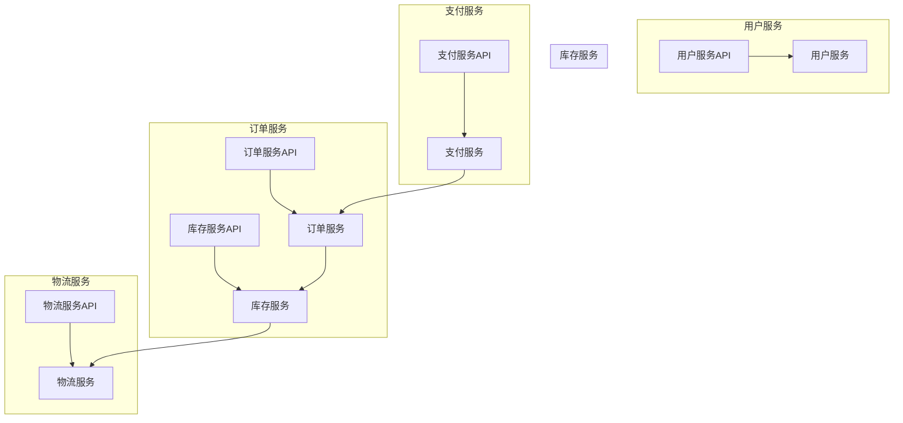

                 

### # 打造弹性可靠的云原生应用平台

关键词：云原生、应用平台、弹性、可靠、架构设计

摘要：本文将详细探讨如何构建一个既弹性又可靠的云原生应用平台。我们将从背景介绍、核心概念、架构设计、部署与运营、可扩展性与容错性、安全合规性以及DevOps实践等方面进行深入分析，并通过实际案例分享最佳实践，为读者提供一套完整的云原生应用平台构建指南。

----------------------------------------------------------------

# 引言与背景

## 云原生时代的来临

随着云计算技术的不断成熟，越来越多的企业开始意识到云原生应用的重要性。云原生（Cloud Native）是一种利用云计算环境中快速创新、频繁扩展和敏捷交付的能力来构建和运行应用程序的方法论。云原生应用具有微服务架构、容器化、自动化运维等特征，这使得它们能够更好地适应云环境中的动态变化。

### 需求与挑战

企业在数字化转型过程中面临着诸多挑战，如快速部署新功能、快速响应市场变化、高效利用资源等。传统的单体应用架构已经无法满足这些需求。而云原生应用平台提供了一种新的解决方案，能够帮助企业应对这些挑战：

1. **快速迭代与部署**：云原生应用采用微服务架构，开发人员可以独立地开发和部署每个微服务，从而实现快速迭代和部署。
2. **资源高效利用**：容器化技术使得应用可以轻松地在不同的环境中部署，从而实现资源的高效利用。
3. **弹性扩展与容错**：云原生应用能够根据负载自动扩展和容错，确保系统的高可用性和可靠性。

### 云原生平台的关键作用

云原生平台在企业的数字化转型中扮演着至关重要的角色：

1. **提高开发效率**：通过自动化工具和平台，简化了开发、测试和部署过程，从而提高了开发效率。
2. **降低运营成本**：通过自动化运维和高效资源利用，降低了运营成本。
3. **提升业务敏捷性**：通过快速响应市场变化和快速部署新功能，提升了业务的敏捷性。

## 云原生核心概念

### 容器与容器化

容器是一种轻量级、可执行的软件包，它包含应用及其运行环境。容器化技术使得应用可以在不同的环境中一致地运行，从而提高了开发和部署的效率。

### 微服务架构

微服务架构将应用程序拆分为多个独立的服务，每个服务负责实现特定的业务功能。这些服务通过API进行通信，从而实现了应用的松耦合和可扩展性。

### 无服务器计算

无服务器计算是一种不需要关注底层基础设施的云计算模型。开发者只需关注应用代码的编写和部署，平台会自动管理和扩展底层基础设施。

## 云原生与传统架构的差异

### 架构设计原则对比

1. **模块化**：云原生架构强调模块化设计，每个微服务都是独立的模块，便于管理和扩展。
2. **分布式**：云原生应用通常采用分布式架构，确保系统的可靠性和可用性。
3. **自动化**：云原生平台提供了丰富的自动化工具，包括CI/CD、监控、日志管理等，简化了运维工作。

### 技术选型与适用性分析

1. **容器技术**：Docker和Kubernetes是当前最流行的容器技术，适用于大多数云原生应用。
2. **服务注册与发现**：Consul、Eureka等服务注册与发现工具能够帮助微服务实现自动发现和负载均衡。
3. **存储解决方案**：云原生应用可以选择使用分布式存储系统，如Cassandra、MongoDB等。

### 云原生在敏捷开发中的应用

云原生技术使得敏捷开发过程更加高效。通过容器化和微服务架构，开发人员可以更快速地进行开发、测试和部署，从而缩短产品上市时间。

## 云原生应用的价值

### 快速迭代与部署

通过微服务架构和容器化技术，开发人员可以独立地开发和部署每个微服务，从而实现快速迭代和部署。

### 资源高效利用

容器化技术使得应用可以轻松地在不同的环境中部署，从而实现资源的高效利用。

### 弹性扩展与容错

云原生应用能够根据负载自动扩展和容错，确保系统的高可用性和可靠性。

### 云原生平台的未来发展趋势

随着云计算技术的不断发展，云原生平台将继续发挥重要作用。未来，云原生平台将更加注重以下几个方面：

1. **自动化**：自动化工具将更加成熟，实现全生命周期自动化。
2. **开源**：开源社区将发挥更大的作用，推动云原生技术的发展。
3. **多云与混合云**：企业将更加关注多云与混合云环境中的云原生应用，实现跨云的可移植性和一致性。

## 总结

云原生应用平台是企业数字化转型的重要工具。通过云原生技术，企业可以更快速地响应市场变化，实现业务的敏捷性。在接下来的章节中，我们将深入探讨云原生架构设计、部署与运营、可扩展性与容错性、安全合规性以及DevOps实践等方面的具体内容。

----------------------------------------------------------------

# 核心概念与联系

## 容器与容器化

### 核心概念

容器是一种轻量级、可执行的软件包，它包含应用及其运行环境。容器通过隔离机制，将应用程序与其运行环境隔离开来，从而实现一致性的部署和运行。

### 概念属性特征对比

| 特征 | 容器 | 传统虚拟机 |
| --- | --- | --- |
| 隔离性 | 高 | 低 |
| 资源占用 | 低 | 高 |
| 启动速度 | 快 | 慢 |
| 可移植性 | 高 | 低 |

### ER实体关系图架构

```mermaid
erDiagram
  Application ||--o{ Container } :部署在
  Environment ||--o{ Container } :运行在
```

## 微服务架构

### 核心概念

微服务架构将应用程序拆分为多个独立的服务，每个服务负责实现特定的业务功能。这些服务通过API进行通信，从而实现了应用的松耦合和可扩展性。

### 概念属性特征对比

| 特征 | 微服务 | 单体应用 |
| --- | --- | --- |
| 松耦合 | 高 | 低 |
| 可扩展性 | 高 | 低 |
| 独立部署 | 是 | 否 |

### ER实体关系图架构

```mermaid
erDiagram
  Service ||--o{ Application } :实现
  API ||--o{ Service } :通信通过
```

## 无服务器计算

### 核心概念

无服务器计算是一种不需要关注底层基础设施的云计算模型。开发者只需关注应用代码的编写和部署，平台会自动管理和扩展底层基础设施。

### 概念属性特征对比

| 特征 | 无服务器计算 | 虚拟机 |
| --- | --- | --- |
| 基础设施管理 | 无需关注 | 需要关注 |
| 自动扩展 | 是 | 否 |
| 按需计费 | 是 | 否 |

### ER实体关系图架构

```mermaid
erDiagram
  Function ||--o{ Application } :实现
  Platform ||--o{ Function } :运行在
```

## 云原生与传统架构的差异

### 架构设计原则对比

| 原则 | 云原生架构 | 传统架构 |
| --- | --- | --- |
| 模块化 | 强调模块化设计，每个服务独立部署 | 整体性强，升级和扩展困难 |
| 分布式 | 强调分布式架构，提高系统可用性 | 单点故障风险高 |
| 自动化 | 强调自动化，提高开发效率 | 手动操作多，效率低 |

### 技术选型与适用性分析

1. **容器技术**：Docker和Kubernetes是最流行的容器技术，适用于大多数云原生应用。
2. **服务注册与发现**：Consul、Eureka等服务注册与发现工具能够帮助微服务实现自动发现和负载均衡。
3. **存储解决方案**：分布式存储系统，如Cassandra、MongoDB等，适用于云原生应用。

### 云原生在敏捷开发中的应用

云原生技术使得敏捷开发过程更加高效。通过容器化和微服务架构，开发人员可以更快速地进行开发、测试和部署，从而缩短产品上市时间。

## 总结

云原生技术包括容器、微服务和无服务器计算等核心概念。与传统架构相比，云原生架构具有更高的隔离性、资源利用率和可扩展性。在接下来的章节中，我们将继续探讨云原生架构在部署与运营、可扩展性与容错性、安全合规性以及DevOps实践等方面的应用。

----------------------------------------------------------------

# 架构设计

## 系统架构设计

### 问题描述

为了构建一个弹性可靠的云原生应用平台，我们需要设计一个高效、可扩展且具有高可用性的系统架构。系统需要支持多种应用场景，如电商、金融和物流等，同时保证数据的安全性和合规性。

### 解决方案

我们采用微服务架构，将系统拆分为多个独立的服务，每个服务负责特定的业务功能。以下是系统架构设计的关键组成部分：

### 系统功能设计

1. **用户服务**：负责处理用户注册、登录、权限管理等功能。
2. **订单服务**：负责处理订单创建、支付、取消等功能。
3. **库存服务**：负责处理商品库存管理、商品信息查询等功能。
4. **物流服务**：负责处理物流信息跟踪、快递公司对接等功能。
5. **支付服务**：负责处理支付请求、支付结果通知等功能。

### 系统架构设计

1. **容器化**：使用Docker对应用进行容器化，确保应用的轻量级和可移植性。
2. **服务注册与发现**：使用Consul实现服务的自动注册与发现，确保服务的高可用性和负载均衡。
3. **分布式存储**：使用MongoDB作为主要的存储系统，确保数据的一致性和可靠性。
4. **消息队列**：使用RabbitMQ作为消息队列，实现服务间的异步通信和数据传递。
5. **API网关**：使用Kong作为API网关，提供统一的接口管理和安全控制。

### 系统接口设计

1. **用户服务接口**：提供用户注册、登录、权限验证等功能。
2. **订单服务接口**：提供订单创建、查询、取消等功能。
3. **库存服务接口**：提供商品库存查询、更新等功能。
4. **物流服务接口**：提供物流信息查询、更新等功能。
5. **支付服务接口**：提供支付请求、支付结果通知等功能。

### 系统交互

1. **用户服务与订单服务**：用户注册后，通过用户服务接口获取用户信息，并在订单服务中创建订单。
2. **订单服务与库存服务**：在创建订单时，订单服务会向库存服务查询商品库存，确保库存充足。
3. **库存服务与物流服务**：库存服务将物流信息通知物流服务，以便物流服务更新物流状态。
4. **支付服务与订单服务**：支付服务在处理支付请求后，将支付结果通知订单服务，以便订单服务更新订单状态。

### 系统架构图

```mermaid
graph TB
    subgraph 用户服务
        用户服务
    end

    subgraph 订单服务
        订单服务
       库存服务(方向向订单服务)
    end

    subgraph 库存服务
        库存服务
       物流服务(方向向库存服务)
    end

    subgraph 物流服务
        物流服务
    end

    subgraph 支付服务
        支付服务
       订单服务(方向向支付服务)
    end

    用户服务 --> 订单服务
    订单服务 --> 库存服务
    库存服务 --> 物流服务
    物流服务 --> 用户服务
    支付服务 --> 订单服务
```

## 系统功能设计

### 领域模型

```mermaid
classDiagram
    User <<entity>>
    Order <<entity>>
    Inventory <<entity>>
    Logistics <<entity>>
    Payment <<entity>>

    User "1" -- "*" Order :创建
    Order "1" -- "*" Inventory :查询库存
    Inventory "1" -- "*" Logistics :更新物流
    Payment "1" -- "*" Order :支付
```

### 类图

```mermaid
classDiagram
    User <<entity>>
    Order <<entity>>
    Inventory <<entity>>
    Logistics <<entity>>
    Payment <<entity>>

    User {
        String id
        String username
        String password
    }

    Order {
        String id
        String userId
        String status
    }

    Inventory {
        String id
        String productId
        int quantity
    }

    Logistics {
        String id
        String orderId
        String status
    }

    Payment {
        String id
        String orderId
        String status
    }

    User "1" -- "*" Order :创建
    Order "1" -- "*" Inventory :查询库存
    Inventory "1" -- "*" Logistics :更新物流
    Payment "1" -- "*" Order :支付
```

## 系统架构图



## 系统接口设计

### 用户服务接口

```python
class UserServiceInterface:
    def register(self, username, password):
        # 注册用户
        pass

    def login(self, username, password):
        # 登录用户
        pass

    def get_user_info(self, user_id):
        # 获取用户信息
        pass
```

### 订单服务接口

```python
class OrderServiceInterface:
    def create_order(self, user_id, product_id, quantity):
        # 创建订单
        pass

    def get_order(self, order_id):
        # 获取订单信息
        pass

    def cancel_order(self, order_id):
        # 取消订单
        pass
```

### 库存服务接口

```python
class InventoryServiceInterface:
    def check_stock(self, product_id):
        # 查询库存
        pass

    def update_stock(self, product_id, quantity):
        # 更新库存
        pass
```

### 物流服务接口

```python
class LogisticsServiceInterface:
    def track_order(self, order_id):
        # 跟踪订单
        pass

    def update LogisticsStatus(self, order_id, status):
        # 更新物流状态
        pass
```

### 支付服务接口

```python
class PaymentServiceInterface:
    def process_payment(self, order_id, amount):
        # 处理支付
        pass

    def notify_payment_result(self, order_id, status):
        # 支付结果通知
        pass
```

## 实际案例分析与详细讲解

### 案例一：用户注册

1. 用户通过用户服务接口发送注册请求。
2. 用户服务验证用户名和密码的合法性。
3. 如果验证通过，用户服务创建用户记录，并返回用户ID。
4. 用户服务将用户信息存储在数据库中。

### 案例二：订单创建

1. 用户通过订单服务接口发送创建订单请求。
2. 订单服务验证用户ID和商品ID的合法性。
3. 如果验证通过，订单服务创建订单记录，并返回订单ID。
4. 订单服务向库存服务发送查询库存请求。
5. 库存服务返回商品库存信息。
6. 订单服务更新订单状态，并返回订单信息。

### 案例三：支付处理

1. 用户通过支付服务接口发送支付请求。
2. 支付服务验证订单ID和支付金额的合法性。
3. 如果验证通过，支付服务处理支付请求，并返回支付结果。
4. 支付服务将支付结果通知订单服务。
5. 订单服务更新订单状态，并返回订单信息。

## 项目小结

通过以上案例分析和详细讲解，我们可以看到云原生应用平台在架构设计、接口设计和实际应用中具有显著的优势。容器化、微服务架构和自动化工具使得系统的开发、部署和运维更加高效。在接下来的章节中，我们将继续探讨如何实现云原生应用的弹性扩展和容错性。

----------------------------------------------------------------

# 部署与运营

## 部署策略

在构建云原生应用平台时，部署策略是确保应用稳定、高效运行的关键环节。以下是一些常见的部署策略：

### **持续集成与持续部署（CI/CD）**

持续集成（CI）和持续部署（CD）是现代软件开发中不可或缺的环节。CI/CD通过自动化构建、测试和部署过程，实现了快速迭代和交付。以下是CI/CD的基本流程：

1. **代码仓库**：开发者将代码提交到代码仓库（如Git）。
2. **自动化构建**：构建工具（如Jenkins、GitLab CI）触发构建过程，将代码打包成可部署的容器镜像。
3. **自动化测试**：运行自动化测试，确保新代码不会破坏现有功能。
4. **部署**：通过容器编排工具（如Kubernetes）将容器镜像部署到生产环境。

### **滚动更新**

滚动更新是一种分阶段部署新版本的方法，可以确保系统在更新过程中始终保持可用。以下是滚动更新的基本步骤：

1. **灰度发布**：首先部署一小部分实例，观察新版本的功能和行为。
2. **逐步扩大**：在确保灰度发布成功后，逐步增加新实例的比例，直到完全替换旧实例。
3. **回滚机制**：如果新版本出现问题，可以快速回滚到旧版本，确保系统稳定性。

### **蓝绿部署**

蓝绿部署是一种通过并行运行两个相同版本的应用来实现部署的方法。以下是蓝绿部署的基本步骤：

1. **准备新环境**：部署新版本的应用到独立的环境。
2. **流量切换**：将用户流量逐渐切换到新版本。
3. **验证**：验证新版本的功能和行为是否符合预期。
4. **切换完成**：如果验证成功，完全替换旧环境。

## **CI/CD流程**

### **环境搭建**

在开始CI/CD之前，我们需要搭建一个自动化的构建和部署环境。以下是一个基本的CI/CD环境搭建流程：

1. **代码仓库**：选择一个代码仓库（如GitLab、GitHub），用于存储和管理代码。
2. **构建服务器**：搭建一个构建服务器（如Jenkins、GitLab CI），用于自动化构建。
3. **容器镜像仓库**：选择一个容器镜像仓库（如Docker Hub、Harbor），用于存储和分发容器镜像。
4. **容器编排工具**：选择一个容器编排工具（如Kubernetes），用于部署和管理容器。

### **构建过程**

构建过程是将代码转换为可部署容器镜像的过程。以下是构建过程的步骤：

1. **触发构建**：当开发者将代码提交到代码仓库时，构建服务器会自动触发构建过程。
2. **构建容器镜像**：使用Dockerfile构建容器镜像。
3. **测试容器镜像**：运行自动化测试，确保容器镜像符合预期。
4. **推送容器镜像**：将容器镜像推送到容器镜像仓库。

### **部署过程**

部署过程是将容器镜像部署到生产环境的过程。以下是部署过程的步骤：

1. **创建部署计划**：定义部署的版本、实例数、节点分配等参数。
2. **部署容器镜像**：使用Kubernetes命令或UI界面部署容器镜像。
3. **监控部署状态**：监控部署过程中的各种指标，如容器启动时间、CPU利用率等。
4. **验证部署结果**：验证新部署的应用是否符合预期。

## **监控与日志管理**

监控与日志管理是确保应用稳定运行的关键环节。以下是一些常用的监控与日志管理工具：

### **监控工具**

1. **Prometheus**：开源的监控解决方案，可以监控容器的各种指标。
2. **Grafana**：基于Prometheus的开源监控仪表板，用于可视化监控数据。
3. **Kibana**：与Elasticsearch集成，用于可视化日志数据。

### **日志管理**

1. **ELK栈**：Elasticsearch、Logstash和Kibana组成的日志管理解决方案，用于收集、存储和可视化日志数据。
2. **Fluentd**：开源的数据收集器，可以将日志数据发送到ELK栈。
3. **Kubernetes日志**：Kubernetes内置的日志收集和聚合功能，可以方便地收集和管理容器日志。

## **案例分析与详细讲解**

### **案例一：订单服务部署**

1. **代码提交**：开发者将订单服务代码提交到GitLab。
2. **触发构建**：GitLab CI触发构建过程，构建容器镜像。
3. **测试容器镜像**：运行自动化测试，确保容器镜像符合预期。
4. **部署容器镜像**：使用Kubernetes部署容器镜像，创建部署计划。
5. **监控部署状态**：监控容器启动时间、CPU利用率等指标。
6. **验证部署结果**：通过接口测试，确保订单服务功能正常。

### **案例二：支付服务故障恢复**

1. **监控报警**：Prometheus发现支付服务CPU利用率异常，触发报警。
2. **故障定位**：通过Kibana查看支付服务日志，定位故障原因。
3. **回滚部署**：使用Kubernetes命令回滚到上一个稳定版本。
4. **故障修复**：修复支付服务代码，重新部署。
5. **验证恢复**：通过接口测试，确保支付服务恢复正常。

## **最佳实践**

1. **使用容器镜像**：使用容器镜像确保应用的可移植性和一致性。
2. **自动化测试**：编写自动化测试，确保新代码不会破坏现有功能。
3. **监控与日志**：使用监控和日志管理工具，确保系统稳定运行。
4. **快速响应**：建立故障响应机制，确保故障能够快速解决。

## **小结**

部署与运营是云原生应用平台的关键环节。通过CI/CD、滚动更新、蓝绿部署等策略，我们可以实现应用的快速迭代和部署。同时，监控与日志管理确保系统的稳定运行。在接下来的章节中，我们将继续探讨如何实现云原生应用的弹性扩展和容错性。

----------------------------------------------------------------

# 可扩展性与容错性

## 扩展性

扩展性是云原生应用平台的重要特征之一，它决定了系统在面对高并发和大数据量时的性能和稳定性。以下是一些实现应用扩展性的关键技术和策略：

### **水平扩展**

水平扩展（Scaling Out）是通过增加更多实例来提高系统处理能力的方法。水平扩展的主要优势包括：

1. **增加处理能力**：通过增加实例数量，系统能够处理更多的请求。
2. **弹性伸缩**：根据负载自动增加或减少实例数量，确保系统在高峰时段保持高性能。
3. **高可用性**：即使某些实例发生故障，其他实例仍然可以正常工作。

### **垂直扩展**

垂直扩展（Scaling Up）是通过增加单个实例的资源（如CPU、内存等）来提高系统处理能力的方法。垂直扩展的主要优势包括：

1. **提高单实例性能**：增加资源可以提高单个实例的处理能力。
2. **简单管理**：系统只需关注单实例的配置和管理，简化运维工作。

### **负载均衡**

负载均衡（Load Balancing）是确保请求均匀分配到多个实例的技术。负载均衡的主要作用包括：

1. **提高系统性能**：通过将请求分配到多个实例，避免单个实例过载。
2. **高可用性**：即使某些实例发生故障，负载均衡器可以将请求重新分配到其他正常实例。
3. **流量管理**：根据流量情况动态调整请求分配策略，确保系统稳定运行。

### **分布式存储**

分布式存储是确保数据高可用性和可扩展性的关键技术。分布式存储的主要优势包括：

1. **高可用性**：数据存储在多个节点上，即使某些节点发生故障，数据仍然可用。
2. **可扩展性**：可以动态增加存储容量，满足不断增长的数据需求。
3. **性能优化**：通过数据分片和并行处理，提高数据访问速度。

## **容错性**

容错性是确保系统在面对故障时仍然能够正常运行的能力。以下是一些实现应用容错性的关键技术和策略：

### **故障检测与自恢复**

故障检测与自恢复是通过监控系统和自动恢复机制确保系统稳定运行的技术。主要策略包括：

1. **健康检查**：定期检查系统组件的健康状态，如CPU利用率、内存使用率等。
2. **自动恢复**：当检测到故障时，自动重启或替换故障组件，确保系统正常运行。

### **服务拆分**

服务拆分是将大型服务拆分为多个小型服务的方法，以提高系统的容错性和可维护性。主要策略包括：

1. **独立部署**：每个服务可以独立部署和更新，减少故障传播范围。
2. **松耦合**：服务之间通过API进行通信，降低服务间的依赖关系。
3. **独立监控**：每个服务可以独立监控，及时发现和解决问题。

### **分布式事务**

分布式事务是在分布式系统中确保数据一致性的方法。主要策略包括：

1. **两阶段提交**：通过两阶段提交协议确保分布式事务的原子性和一致性。
2. **最终一致性**：通过消息队列和异步处理确保系统在最终状态下达到一致性。

### **故障转移**

故障转移（Failover）是在主节点故障时，将服务切换到备用节点的方法。主要策略包括：

1. **主从复制**：通过主从复制确保备用节点与主节点数据一致。
2. **故障检测**：定期检测主节点状态，发现故障时自动切换到备用节点。
3. **手动切换**：在紧急情况下，通过人工操作将服务切换到备用节点。

## **最佳实践**

1. **使用容器化技术**：容器化技术可以提高系统的可移植性和可扩展性。
2. **采用微服务架构**：微服务架构可以提高系统的可维护性和容错性。
3. **实现自动化部署**：通过自动化部署和持续集成/持续部署（CI/CD）提高系统的稳定性。
4. **监控与日志管理**：使用监控和日志管理工具确保系统稳定运行。
5. **定期备份和恢复**：定期备份数据，确保在故障发生时能够快速恢复。

## **小结**

可扩展性和容错性是云原生应用平台的关键特征，它们确保系统在面对高并发和故障时能够稳定运行。通过水平扩展、垂直扩展、负载均衡、分布式存储等技术，我们可以提高系统的性能和可用性。同时，通过故障检测与自恢复、服务拆分、分布式事务和故障转移等策略，我们可以提高系统的容错性。在接下来的章节中，我们将继续探讨云原生应用平台的安全性和合规性。

----------------------------------------------------------------

# 安全与合规性

## 安全性

在云原生应用平台中，安全性是保障数据和系统免受恶意攻击和未经授权访问的关键。以下是一些关键的安全技术和实践：

### **身份验证与访问控制**

1. **单点登录（SSO）**：使用SSO服务（如OAuth 2.0、OpenID Connect）简化用户登录流程，提高安全性。
2. **多因素认证（MFA）**：结合密码和二次验证（如手机短信、邮件、验证器应用程序）增加账户安全性。
3. **访问控制列表（ACL）**：通过ACL实现细粒度的访问控制，确保用户只能访问其有权访问的资源。

### **数据加密**

1. **传输加密**：使用HTTPS/TLS协议加密数据传输，防止数据在传输过程中被窃取。
2. **存储加密**：使用加密算法（如AES）对存储在数据库中的敏感数据进行加密，确保数据在磁盘上的安全性。

### **网络隔离与防火墙**

1. **网络隔离**：通过VLAN、网络策略和防火墙规则隔离不同部分的网络，限制不必要的网络通信。
2. **防火墙**：部署防火墙（如NGFW、AWS WAF）过滤和阻止恶意流量，保护系统免受网络攻击。

### **漏洞扫描与安全审计**

1. **自动漏洞扫描**：使用工具（如Nessus、OpenVAS）定期扫描系统漏洞，及时修复安全问题。
2. **安全审计**：通过日志分析、安全信息和事件管理（SIEM）系统监控和记录系统活动，识别潜在威胁。

### **安全最佳实践**

1. **最小权限原则**：用户和系统组件只能访问其必需的资源和权限。
2. **定期更新和打补丁**：及时更新操作系统、中间件和应用程序，修补安全漏洞。
3. **安全培训**：定期对开发人员和运维人员提供安全培训，提高安全意识。

## **合规性**

合规性是确保企业遵循相关法律法规和行业标准的要求。以下是一些关键的合规性和最佳实践：

### **数据保护法规**

1. **GDPR**：遵守欧洲通用数据保护条例（GDPR），确保用户数据的合法处理和保护。
2. **CCPA**：遵守美国加州消费者隐私法（CCPA），保护消费者数据权利。
3. **HIPAA**：遵守美国健康保险可携性和责任法（HIPAA），保护患者健康信息。

### **行业标准和认证**

1. **ISO 27001**：获取ISO 27001认证，证明企业具有完善的信息安全管理体系。
2. **PCI DSS**：遵守支付卡行业数据安全标准（PCI DSS），确保支付信息的安全性。
3. **NIST框架**：遵循美国国家 Institute of Standards and Technology（NIST）框架，实施全面的网络安全措施。

### **数据备份与恢复**

1. **定期备份**：定期备份数据，确保在数据丢失或系统故障时能够快速恢复。
2. **异地备份**：将备份数据存储在异地，以防自然灾害或物理损坏导致数据丢失。
3. **备份验证**：定期验证备份数据的完整性和可恢复性。

### **审计与合规检查**

1. **内部审计**：定期进行内部审计，评估合规性和安全性。
2. **外部审计**：聘请第三方审计机构进行外部审计，确保合规性得到外部验证。
3. **合规性培训**：定期对员工进行合规性培训，确保员工了解相关法律法规和行业标准。

### **最佳实践**

1. **建立安全组织**：建立专门的安全团队，负责制定和实施安全策略。
2. **持续监控**：使用安全信息和事件管理（SIEM）系统，持续监控系统的安全状态。
3. **定期评估**：定期评估安全策略和措施的有效性，根据评估结果进行调整。

## **小结**

安全与合规性是云原生应用平台不可忽视的重要方面。通过实施有效的安全措施和遵循相关法律法规，企业可以保护用户数据和系统免受恶意攻击，确保业务的可持续发展。在云原生应用平台的构建过程中，应始终将安全性和合规性作为核心要素，确保系统的稳定运行和业务的合规性。

----------------------------------------------------------------

# DevOps与协作

## DevOps概述

DevOps是一种文化和实践，旨在加强软件开发（Development）和IT运维（Operations）之间的协作。它通过自动化工具和流程，缩短软件开发周期，提高软件质量，并确保持续交付。

### **DevOps的目标**

1. **提高交付速度**：通过自动化和协作，实现快速开发和部署。
2. **提高质量**：通过持续集成和持续交付，确保软件质量。
3. **减少故障**：通过监控系统，快速识别和修复问题。
4. **增强协作**：通过共享责任和协作，提高团队效率。

### **DevOps的核心原则**

1. **自动化**：通过自动化工具和流程，减少手动操作，提高效率和可靠性。
2. **协作**：加强开发团队和运维团队之间的协作，实现共同目标。
3. **持续集成**：将代码集成到主干分支，确保集成过程中的问题及早发现和解决。
4. **持续交付**：通过自动化测试和部署，确保软件在每次发布时都是稳定和可靠的。
5. **监控和反馈**：通过监控系统，实时监控系统状态，快速响应问题。

## **协作与沟通**

协作和沟通是DevOps成功的关键。以下是一些提高团队协作和沟通效率的方法：

### **协作工具**

1. **JIRA**：用于项目管理、任务跟踪和敏捷开发。
2. **Slack**：用于实时沟通和协作。
3. **Confluence**：用于知识管理和文档共享。
4. **GitLab**：用于代码管理、自动化构建和持续集成。

### **敏捷开发**

敏捷开发是一种强调快速迭代和持续交付的软件开发方法。它通过以下原则提高团队协作和沟通效率：

1. **迭代开发**：将开发过程分为多个短周期（迭代），在每个迭代中实现部分功能。
2. **用户故事**：使用用户故事描述功能需求，确保开发与用户需求保持一致。
3. **每日站立会议**：团队每天召开短暂会议，讨论进度、问题和计划。
4. **回顾会议**：在每个迭代结束时，回顾开发过程和成果，识别改进点。

### **持续集成与持续交付**

持续集成（CI）和持续交付（CD）是DevOps的核心实践。它们通过以下步骤提高团队协作和沟通效率：

1. **代码仓库**：所有代码存储在代码仓库中，确保版本控制。
2. **自动化构建**：使用自动化构建工具（如Jenkins、GitLab CI）构建和测试代码。
3. **自动化测试**：执行自动化测试，确保新代码不会破坏现有功能。
4. **容器化**：使用容器化技术（如Docker）简化部署过程。
5. **自动化部署**：使用自动化部署工具（如Kubernetes）将代码部署到生产环境。
6. **监控与反馈**：实时监控系统状态，快速识别和解决问题。

## **最佳实践**

1. **建立跨职能团队**：将开发、测试、运维等角色整合到一个团队中，实现端到端的交付。
2. **持续培训与学习**：定期进行技术培训，提高团队成员的技能和知识水平。
3. **开放沟通**：鼓励团队成员之间的开放沟通，分享知识和经验。
4. **定期回顾与改进**：定期回顾开发过程和协作方式，持续改进以提高效率。

## **小结**

DevOps通过自动化、协作和持续集成/持续交付，实现了软件开发和运维的高效协作。在云原生应用平台的构建过程中，DevOps实践至关重要，它有助于提高开发效率、软件质量和系统稳定性。通过建立跨职能团队、使用协作工具和实践敏捷开发，团队能够更好地应对复杂的项目挑战，实现持续交付和业务目标。

----------------------------------------------------------------

## 实战案例：构建电商应用平台

### 项目介绍

本项目旨在构建一个基于云原生技术的电商应用平台，实现商品展示、订单管理、支付处理和用户服务等功能。该平台将采用微服务架构、容器化部署、自动化运维和DevOps实践，确保系统的弹性、可靠性和高效性。

### 系统功能设计

1. **商品服务**：负责商品信息管理、商品分类、商品推荐等功能。
2. **订单服务**：负责订单创建、订单查询、订单取消等功能。
3. **支付服务**：负责支付请求处理、支付结果通知等功能。
4. **用户服务**：负责用户注册、登录、权限管理等功能。
5. **物流服务**：负责物流信息管理、物流状态更新等功能。

### 系统架构设计

1. **容器化**：使用Docker对各个微服务进行容器化，确保应用的轻量级和可移植性。
2. **服务注册与发现**：使用Consul实现服务的自动注册与发现，确保服务的高可用性和负载均衡。
3. **分布式存储**：使用MongoDB作为主要的存储系统，确保数据的一致性和可靠性。
4. **消息队列**：使用RabbitMQ作为消息队列，实现服务间的异步通信和数据传递。
5. **API网关**：使用Kong作为API网关，提供统一的接口管理和安全控制。

### 系统接口设计

1. **商品服务接口**：提供商品查询、商品分类查询等功能。
2. **订单服务接口**：提供订单创建、订单查询、订单取消等功能。
3. **支付服务接口**：提供支付请求、支付结果通知等功能。
4. **用户服务接口**：提供用户注册、登录、权限验证等功能。
5. **物流服务接口**：提供物流信息查询、更新等功能。

### 系统交互

1. **用户服务与订单服务**：用户注册后，通过用户服务接口获取用户信息，并在订单服务中创建订单。
2. **订单服务与支付服务**：在创建订单时，订单服务会向支付服务发送支付请求。
3. **支付服务与用户服务**：支付服务处理支付请求后，将支付结果通知用户服务。
4. **订单服务与商品服务**：订单服务在创建订单时，会查询商品服务中的商品信息。
5. **物流服务与订单服务**：物流服务在处理物流信息时，会更新订单状态。

### 环境安装

1. **Docker安装**：在服务器上安装Docker，确保容器化部署的可行性。
2. **Kubernetes安装**：在服务器上安装Kubernetes，用于容器编排和管理。
3. **Consul安装**：在服务器上安装Consul，用于服务注册与发现。
4. **MongoDB安装**：在服务器上安装MongoDB，用于分布式存储。
5. **RabbitMQ安装**：在服务器上安装RabbitMQ，用于消息队列。

### 系统核心实现源代码

```python
# 商品服务源代码
from flask import Flask, jsonify, request

app = Flask(__name__)

@app.route('/api/v1/goods', methods=['GET'])
def get_goods():
    # 获取商品信息
    pass

@app.route('/api/v1/goods', methods=['POST'])
def create_goods():
    # 创建商品
    pass

if __name__ == '__main__':
    app.run(host='0.0.0.0', port=5000)
```

### 代码应用解读与分析

商品服务是一个微服务，负责处理商品信息的查询和创建功能。该服务使用Flask框架实现，通过RESTful API对外提供服务。

1. **GET请求**：查询商品信息，返回商品列表。
2. **POST请求**：创建商品，接收商品信息，并将其存储到数据库中。

### 实际案例分析与详细讲解

#### 案例一：查询商品信息

1. 用户通过浏览器访问商品服务接口，发送GET请求。
2. 商品服务接收请求，查询商品信息，并将结果返回给用户。

#### 案例二：创建商品

1. 用户通过浏览器访问商品服务接口，发送POST请求。
2. 商品服务接收请求，验证请求参数，将商品信息存储到数据库中。

#### 案例三：更新商品

1. 用户通过浏览器访问商品服务接口，发送PUT请求。
2. 商品服务接收请求，验证请求参数，更新商品信息。

### 项目小结

通过本案例，我们实现了基于云原生技术的电商应用平台的商品服务。容器化技术、微服务架构、自动化部署和DevOps实践使得项目开发和运维更加高效。在接下来的章节中，我们将继续探讨云原生应用平台的其他关键方面，如安全性、合规性和最佳实践。

----------------------------------------------------------------

## 总结

本文详细探讨了如何构建一个弹性可靠的云原生应用平台。通过引入云原生概念、核心架构设计、部署与运营、可扩展性与容错性、安全与合规性以及DevOps实践，我们为读者提供了一套全面的云原生应用平台构建指南。

### **核心要点**

1. **云原生应用平台**：采用微服务架构、容器化部署、自动化运维和DevOps实践，实现快速迭代和高效交付。
2. **弹性扩展与容错性**：通过水平扩展、垂直扩展、负载均衡和分布式存储，确保系统在面对高并发和故障时保持稳定。
3. **安全性**：通过身份验证、数据加密、网络隔离和漏洞扫描，保障数据和系统的安全性。
4. **合规性**：遵循相关法律法规和行业标准，确保企业运营的合法性和合规性。
5. **DevOps实践**：通过协作工具、敏捷开发和持续集成/持续交付，提高团队协作效率和软件质量。

### **展望未来**

随着云计算和容器技术的不断发展，云原生应用平台将继续成为企业数字化转型的重要工具。未来的发展趋势包括：

1. **自动化与智能化**：自动化工具和AI技术将进一步提升开发和运维效率。
2. **多云与混合云**：企业将更加关注多云与混合云环境中的云原生应用，实现跨云的可移植性和一致性。
3. **边缘计算**：边缘计算与云原生技术的结合，将拓展云原生应用的范围，提高实时处理能力。
4. **可持续性**：云原生应用平台将更加注重绿色计算和可持续性，减少对环境的影响。

### **结语**

构建弹性可靠的云原生应用平台是企业实现数字化转型和业务敏捷性的关键。通过本文的介绍和实践指导，我们希望读者能够掌握云原生应用平台的设计和构建方法，为企业的数字化转型提供有力支持。作者在此感谢读者们的关注与支持，希望大家在实际应用中不断探索和创新，共同推动云原生技术的发展。

**作者：AI天才研究院/AI Genius Institute & 禅与计算机程序设计艺术 /Zen And The Art of Computer Programming**

