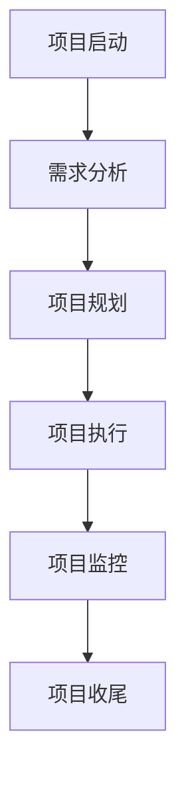

                 

## 打造技术团队核心竞争力

### 关键词

- 技术团队建设
- 核心能力提升
- 项目管理
- 团队协作
- 持续改进

### 摘要

本文深入探讨技术团队核心竞争力的重要性，并详细分析了提升技术团队核心竞争力的策略和方法。文章分为三个部分，首先介绍了技术团队建设的背景和重要性，然后探讨了提升团队核心竞争力的策略，最后通过实际案例分析，总结了技术团队建设的成功经验和启示。文章结构清晰，逻辑严密，旨在帮助IT管理者和技术团队更好地理解并实践提升核心竞争力的方法。

### 目录大纲

```markdown
----------------------------------------------------------------
# 打造技术团队核心竞争力

## 第一部分：技术团队建设的背景与重要性

### 第1章：技术团队建设概述
#### 1.1 问题背景
#### 1.2 问题描述
#### 1.3 问题解决
#### 1.4 边界与外延
#### 1.5 概念结构与核心要素组成

### 第2章：技术团队的核心能力
#### 2.1 技术能力
##### 2.1.1 技术素养
##### 2.1.2 技术领域知识
##### 2.1.3 技术创新能力
#### 2.2 项目管理能力
##### 2.2.1 团队协作
##### 2.2.2 时间管理
##### 2.2.3 质量控制
#### 2.3 沟通能力
##### 2.3.1 内部沟通
##### 2.3.2 外部沟通
##### 2.3.3 演讲与展示

### 第3章：技术团队的组织结构
#### 3.1 团队类型
##### 3.1.1 功能型团队
##### 3.1.2 项目型团队
##### 3.1.3 跨职能团队
#### 3.2 组织架构
##### 3.2.1 直线型组织结构
##### 3.2.2 矩阵型组织结构
##### 3.2.3 平衡计分卡
#### 3.3 角色定位
##### 3.3.1 领导者
##### 3.3.2 成员
##### 3.3.3 辅助角色

## 第二部分：提升技术团队核心竞争力的策略

### 第4章：人才招聘与培养
#### 4.1 人才招聘
##### 4.1.1 招聘渠道
##### 4.1.2 招聘标准
##### 4.1.3 面试技巧
#### 4.2 人才培养
##### 4.2.1 在职培训
##### 4.2.2 外部培训
##### 4.2.3 职业发展路径

### 第5章：团队协作与沟通
#### 5.1 团队协作
##### 5.1.1 团队合作原则
##### 5.1.2 团队冲突处理
##### 5.1.3 团队建设活动
#### 5.2 沟通技巧
##### 5.2.1 内部沟通
##### 5.2.2 外部沟通
##### 5.2.3 演讲与展示技巧

### 第6章：项目管理与质量控制
#### 6.1 项目管理
##### 6.1.1 项目管理流程
##### 6.1.2 项目计划与执行
##### 6.1.3 项目监控与评估
#### 6.2 质量控制
##### 6.2.1 质量管理标准
##### 6.2.2 质量控制工具
##### 6.2.3 质量改进策略

### 第7章：持续改进与创新
#### 7.1 持续改进
##### 7.1.1 改进思维
##### 7.1.2 改进方法
##### 7.1.3 改进实践
#### 7.2 创新能力
##### 7.2.1 创新类型
##### 7.2.2 创新过程
##### 7.2.3 创新激励

### 第8章：案例分析
#### 8.1 案例一：某互联网公司的技术团队建设
##### 8.1.1 案例背景
##### 8.1.2 案例分析
##### 8.1.3 案例启示

#### 8.2 案例二：某高科技企业的技术团队发展
##### 8.2.1 案例背景
##### 8.2.2 案例分析
##### 8.2.3 案例启示

----------------------------------------------------------------
```

### 文章内容与章节结构说明

#### 第一部分：技术团队建设的背景与重要性

**第1章：技术团队建设概述**

本章节将详细介绍技术团队建设的重要性，分析当前IT行业的发展趋势，探讨技术团队面临的主要挑战和机遇，并给出具体的解决方案和边界定义。

**第2章：技术团队的核心能力**

本章节将深入探讨技术团队的核心能力，包括技术素养、技术领域知识和技术创新能力。我们将通过具体案例和数据分析，阐述这些能力对团队成功的重要性。

**第3章：技术团队的组织结构**

本章节将分析不同类型的技术团队组织结构，包括功能型团队、项目型团队和跨职能团队，并讨论如何选择和组织最适合团队发展的组织架构。

#### 第二部分：提升技术团队核心竞争力的策略

**第4章：人才招聘与培养**

本章节将讨论如何招聘和培养优秀的技术人才，包括招聘渠道、招聘标准和面试技巧，以及在职培训、外部培训和职业发展路径。

**第5章：团队协作与沟通**

本章节将探讨如何提升团队协作和沟通能力，包括团队合作原则、冲突处理、团队建设活动和沟通技巧。

**第6章：项目管理与质量控制**

本章节将详细介绍项目管理的方法和流程，包括项目计划与执行、项目监控与评估，以及质量控制的标准、工具和改进策略。

**第7章：持续改进与创新**

本章节将讨论如何实现技术团队的持续改进和创新，包括改进思维、改进方法、改进实践，以及创新类型、创新过程和创新激励。

#### 第三部分：案例分析

**第8章：案例分析**

本章节将通过两个实际案例，深入分析技术团队建设的成功经验和失败教训，总结出可复制的最佳实践和启示，以帮助其他团队更好地发展。

### 文章内容具体讲解

#### 第1章：技术团队建设概述

**1.1 问题背景**

随着全球信息技术产业的快速发展，技术团队在企业和组织中的地位日益重要。技术团队的效率和质量直接影响到企业的创新能力和市场竞争力。然而，技术团队建设面临着诸多挑战，如人才短缺、团队协作不畅、项目管理困难等。

**1.2 问题描述**

技术团队建设存在的问题包括：

- **人才短缺**：优秀技术人才的竞争日益激烈，企业难以吸引和留住顶尖人才。
- **团队协作不畅**：团队成员之间的沟通和协作不够顺畅，影响项目进度和质量。
- **项目管理困难**：项目计划和管理不够科学，导致项目延期、预算超支和质量问题。
- **创新能力不足**：技术团队缺乏持续改进和创新的动力和机制。

**1.3 问题解决**

解决技术团队建设问题的策略包括：

- **人才招聘与培养**：建立完善的人才招聘和培养体系，吸引和留住优秀人才。
- **团队协作与沟通**：建立有效的团队协作和沟通机制，提升团队整体效率。
- **项目管理与质量控制**：实施科学的项目管理方法和质量控制标准，确保项目顺利进行。
- **持续改进与创新**：建立持续改进和创新机制，激发团队的创新活力。

**1.4 边界与外延**

技术团队建设的边界包括团队构成、职责分工、组织结构等。外延包括技术领域、项目管理、团队协作、人才培养等方面。

**1.5 概念结构与核心要素组成**

技术团队建设涉及多个核心要素，包括人才、技术、项目、团队协作、沟通、管理、改进和创新。这些要素相互作用，共同推动技术团队的发展。

#### 第2章：技术团队的核心能力

**2.1 技术能力**

技术能力是技术团队的核心竞争力。技术素养、技术领域知识和技术创新能力是技术能力的三个重要组成部分。

- **技术素养**：指技术团队对技术基本原理和知识体系的理解，包括编程能力、算法知识、数据结构等。

- **技术领域知识**：指技术团队对特定技术领域的深入理解，包括行业趋势、技术发展和应用场景等。

- **技术创新能力**：指技术团队在技术领域中的创新能力，包括技术研发、产品创新和商业模式创新等。

**2.2 项目管理能力**

项目管理能力是技术团队成功完成项目的重要保障。团队协作、时间管理和质量控制是项目管理能力的三个关键方面。

- **团队协作**：指团队成员之间的协同工作，包括沟通、协调和合作。

- **时间管理**：指项目进度的合理安排和监控，确保项目按计划完成。

- **质量控制**：指项目质量的控制和保证，包括质量标准、测试和改进。

**2.3 沟通能力**

沟通能力是技术团队内部和外部沟通的桥梁。内部沟通、外部沟通和演讲与展示是沟通能力的三个重要方面。

- **内部沟通**：指团队成员之间的沟通，包括信息传递、意见交流和问题解决。

- **外部沟通**：指团队与其他部门、客户和合作伙伴的沟通，包括需求理解、问题协调和成果展示。

- **演讲与展示**：指技术团队的演讲和展示能力，包括演讲技巧、PPT制作和演示效果。

#### 第3章：技术团队的组织结构

**3.1 团队类型**

技术团队可以根据不同的目标和任务划分为不同类型。

- **功能型团队**：以特定技术领域为主，如前端开发团队、后端开发团队等。

- **项目型团队**：以特定项目为主，如软件开发项目团队、系统集成项目团队等。

- **跨职能团队**：涉及多个技术领域和职能，如研发与市场团队、技术支持与客户服务团队等。

**3.2 组织架构**

技术团队的组织架构应根据团队类型和目标进行设计。

- **直线型组织结构**：以职能划分，层级分明，管理清晰。

- **矩阵型组织结构**：以项目和职能双重划分，灵活应对不同任务和需求。

- **平衡计分卡**：综合考虑团队绩效、客户满意度、内部流程和学习与成长等方面，实现全面绩效管理。

**3.3 角色定位**

技术团队的每个成员都承担不同的角色，包括领导者、成员和辅助角色。

- **领导者**：负责团队的战略规划、决策和团队建设。

- **成员**：负责具体技术任务和项目执行。

- **辅助角色**：提供技术支持、培训和管理等服务。

### 总结

通过以上三个章节的介绍，我们对技术团队建设的背景、核心能力和组织结构有了全面的理解。在接下来的章节中，我们将详细探讨提升技术团队核心竞争力的策略和方法，包括人才招聘与培养、团队协作与沟通、项目管理与质量控制以及持续改进与创新。通过这些策略的实施，我们可以帮助技术团队在激烈的竞争中脱颖而出，实现持续发展和成功。

### 第二部分：提升技术团队核心竞争力的策略

#### 第4章：人才招聘与培养

技术团队的成功离不开人才的支撑。如何招聘和培养优秀的技术人才是提升团队核心竞争力的重要环节。

**4.1 人才招聘**

**4.1.1 招聘渠道**

- **内部推荐**：通过内部员工推荐，提高招聘效率和员工满意度。
- **招聘网站**：利用知名招聘网站发布招聘信息，吸引更多求职者。
- **社交媒体**：利用LinkedIn、GitHub等平台寻找合适的技术人才。
- **专业招聘会**：参加专业招聘会，直接与求职者面对面交流。

**4.1.2 招聘标准**

- **技术能力**：评估求职者的编程技能、算法知识、项目经验等。
- **学习能力**：考察求职者的学习能力和自我提升意愿。
- **沟通能力**：评估求职者的沟通技巧和团队合作能力。
- **职业素养**：评估求职者的职业素养、责任心和职业道德。

**4.1.3 面试技巧**

- **结构化面试**：制定标准化的面试问题，确保公平、公正的评估。
- **行为面试**：通过求职者的行为描述，了解其能力、性格和价值观。
- **情境面试**：模拟工作场景，考察求职者在实际工作中的表现。

**4.2 人才培养**

**4.2.1 在职培训**

- **技术培训**：定期组织技术讲座、研讨会和内部培训，提升团队技术水平。
- **项目实践**：通过实际项目，锻炼团队成员的实战能力。
- **导师制度**：为新人配备经验丰富的导师，指导其职业发展和技能提升。

**4.2.2 外部培训**

- **专业课程**：鼓励团队成员参加专业课程和认证考试，提升专业水平。
- **行业交流**：参加行业会议、研讨会和培训班，了解行业动态和前沿技术。

**4.2.3 职业发展路径**

- **晋升通道**：明确职业晋升通道，为团队成员提供发展机会。
- **激励机制**：建立激励机制，鼓励团队成员不断提升自己的能力。
- **人才盘点**：定期进行人才盘点，评估团队成员的绩效和能力，制定个性化发展计划。

### 第5章：团队协作与沟通

良好的团队协作和沟通是技术团队高效运作的基石。以下策略可以帮助提升团队协作和沟通能力。

**5.1 团队协作**

**5.1.1 团队合作原则**

- **平等参与**：确保每个团队成员都有平等的参与机会，尊重每个人的意见和贡献。
- **目标一致**：明确团队目标，确保每个成员都朝着共同的目标努力。
- **相互信任**：建立信任基础，增强团队成员之间的互信和协作。
- **有效沟通**：建立有效的沟通渠道，确保信息畅通无阻。

**5.1.2 团队冲突处理**

- **预防为主**：通过沟通和协调，预防冲突的发生。
- **早期介入**：发现冲突后，及时介入，避免冲突升级。
- **公正处理**：公平、公正地处理冲突，确保团队和谐。

**5.1.3 团队建设活动**

- **团队活动**：组织团队建设活动，增强团队凝聚力和合作精神。
- **团建培训**：通过团建培训，提高团队成员的沟通技巧和协作能力。

**5.2 沟通技巧**

**5.2.1 内部沟通**

- **明确目标**：在沟通前明确沟通目标，确保沟通高效。
- **主动沟通**：主动寻求沟通，及时解决问题。
- **有效倾听**：倾听对方的意见和需求，确保理解无误。

**5.2.2 外部沟通**

- **明确需求**：在沟通前明确对方的需求和期望。
- **准确传达**：准确传达信息和意图，避免误解和误传。
- **建立关系**：建立良好的关系，增强沟通的信任和效果。

**5.2.3 演讲与展示技巧**

- **清晰表达**：用简洁、清晰的语言表达自己的观点和想法。
- **逻辑结构**：确保演讲的逻辑结构和条理性。
- **视觉辅助**：运用PPT、图表等视觉辅助工具，增强演讲效果。

### 第6章：项目管理与质量控制

项目管理与质量控制是技术团队成功完成项目的重要保障。以下策略可以帮助提升项目管理和质量控制能力。

**6.1 项目管理**

**6.1.1 项目管理流程**

- **项目启动**：明确项目目标和范围，组建项目团队。
- **项目规划**：制定项目计划，明确任务分工和时间安排。
- **项目执行**：按照项目计划，执行具体任务。
- **项目监控**：监控项目进度和质量，及时调整计划。
- **项目收尾**：总结项目经验，进行项目评估和验收。

**6.1.2 项目计划与执行**

- **任务分解**：将项目任务分解为具体的可执行任务。
- **时间安排**：合理分配任务时间，确保任务按时完成。
- **资源调配**：合理调配项目资源，确保任务顺利执行。

**6.1.3 项目监控与评估**

- **进度监控**：监控项目进度，确保任务按计划进行。
- **质量评估**：评估项目质量，确保符合预期标准。
- **问题处理**：及时发现和解决问题，确保项目顺利进行。

**6.2 质量控制**

**6.2.1 质量管理标准**

- **需求分析**：明确项目需求，确保需求满足度。
- **设计评审**：对项目设计进行评审，确保设计合理。
- **代码审查**：对项目代码进行审查，确保代码质量。
- **测试与验收**：进行系统测试和验收，确保项目质量。

**6.2.2 质量控制工具**

- **缺陷跟踪系统**：用于记录和跟踪项目缺陷。
- **自动化测试工具**：用于自动化测试和持续集成。
- **代码质量分析工具**：用于评估代码质量和安全性。

**6.2.3 质量改进策略**

- **持续改进**：通过定期回顾和总结，不断改进项目管理和质量控制方法。
- **过程优化**：优化项目流程，提高项目效率和质量。
- **质量培训**：定期组织质量培训，提高团队成员的质量意识和能力。

### 第7章：持续改进与创新

持续改进和创新是技术团队保持竞争力和持续发展的关键。以下策略可以帮助技术团队实现持续改进和创新。

**7.1 持续改进**

**7.1.1 改进思维**

- **积极思维**：鼓励团队成员积极思考，不断寻求改进的机会。
- **系统性思维**：从系统角度考虑问题，寻找问题的根本原因。
- **创新思维**：鼓励团队成员创新思维，寻找新的解决方案。

**7.1.2 改进方法**

- **问题识别**：及时发现和识别问题，明确改进方向。
- **数据分析**：通过数据分析，找出问题的根本原因。
- **方案制定**：制定具体的改进方案，明确改进措施和责任。

**7.1.3 改进实践**

- **试点实施**：在部分团队或项目中试点实施改进方案，验证效果。
- **全面推广**：在试点成功的基础上，全面推广改进方案。
- **持续监控**：持续监控改进效果，确保改进措施的有效性。

**7.2 创新能力**

**7.2.1 创新类型**

- **技术性创新**：通过技术创新，提高产品性能和用户体验。
- **管理性创新**：通过管理创新，提高项目效率和质量。
- **商业模式创新**：通过商业模式创新，拓展市场和发展空间。

**7.2.2 创新过程**

- **需求分析**：分析市场需求和用户需求，明确创新方向。
- **方案设计**：设计创新方案，明确创新目标和实施路径。
- **实施与验证**：实施创新方案，验证效果并进行调整。

**7.2.3 创新激励**

- **激励机制**：建立激励机制，鼓励团队成员积极参与创新活动。
- **创新培训**：提供创新培训，提高团队成员的创新能力和素质。
- **创新荣誉**：设立创新荣誉和奖励，表彰创新贡献。

### 第8章：案例分析

通过实际案例的分析，我们可以更好地理解技术团队建设的策略和方法。

**8.1 案例一：某互联网公司的技术团队建设**

**8.1.1 案例背景**

某互联网公司在快速发展的过程中，面临技术团队建设的挑战。公司希望通过优化团队建设，提高项目效率和质量，从而保持市场竞争力。

**8.1.2 案例分析**

- **人才招聘与培养**：公司通过内部推荐、招聘网站和专业招聘会等多渠道招聘技术人才，同时设立导师制度，帮助新人快速融入团队。
- **团队协作与沟通**：公司建立扁平化的组织结构，加强团队协作和沟通，通过团队建设活动和培训提高团队成员的沟通技巧。
- **项目管理与质量控制**：公司实施科学的项目管理方法和质量控制标准，通过项目管理流程和监控，确保项目顺利进行。
- **持续改进与创新**：公司鼓励持续改进和创新，通过定期回顾和总结，优化项目管理和质量控制方法，提高团队整体效率和质量。

**8.1.3 案例启示**

该案例表明，通过优化人才招聘与培养、加强团队协作与沟通、实施科学的项目管理方法和质量控制标准以及鼓励持续改进和创新，技术团队可以显著提高效率和质量，从而保持市场竞争力。

**8.2 案例二：某高科技企业的技术团队发展**

**8.2.1 案例背景**

某高科技企业在全球市场中寻求突破，希望通过提升技术团队的能力，增强企业的核心竞争力。

**8.2.2 案例分析**

- **人才招聘与培养**：企业通过全球化招聘和内部培训，吸引和培养顶尖技术人才，同时设立职业发展路径，激励员工不断提升自己的能力。
- **团队协作与沟通**：企业建立跨职能团队，促进不同部门和团队之间的协作和沟通，通过团建活动和培训提高团队成员的协作能力。
- **项目管理与质量控制**：企业实施项目管理和质量控制标准，通过项目管理流程和监控，确保项目顺利进行。
- **持续改进与创新**：企业鼓励持续改进和创新，通过定期回顾和总结，优化项目管理和质量控制方法，提高团队整体效率和质量。

**8.2.3 案例启示**

该案例表明，通过全球化招聘和内部培训、建立跨职能团队、实施科学的项目管理方法和质量控制标准以及鼓励持续改进和创新，技术团队可以显著提升能力和效率，从而增强企业的核心竞争力。

### 结论

通过本文的详细分析，我们了解了技术团队核心竞争力的重要性，以及如何通过人才招聘与培养、团队协作与沟通、项目管理与质量控制以及持续改进与创新等策略来提升技术团队的核心竞争力。同时，通过实际案例分析，我们总结了成功的技术团队建设经验和启示。希望本文能为IT管理者和技术团队提供有益的参考和指导，帮助他们在激烈的竞争中脱颖而出，实现持续发展和成功。

### 作者信息

作者：AI天才研究院/AI Genius Institute & 禅与计算机程序设计艺术 /Zen And The Art of Computer Programming

### 最佳实践 Tips

- **定期回顾和总结**：定期回顾和总结项目经验，识别问题和改进机会，有助于持续提升团队能力。
- **注重团队协作**：加强团队协作和沟通，建立信任和合作氛围，提高团队整体效率。
- **培养创新能力**：鼓励团队成员创新思维，提供创新资源和激励，激发团队的创新能力。
- **个性化培训**：根据团队成员的特长和需求，提供个性化的培训和发展计划，提升个人能力和团队整体水平。

### 小结

本文通过详细分析技术团队核心竞争力的重要性，以及提升核心竞争力的策略和方法，帮助IT管理者和技术团队更好地理解并实践技术团队建设。希望读者能够结合自身实际情况，灵活运用本文提供的方法和策略，打造出一支高效、创新的技术团队，助力企业在竞争中脱颖而出。

### 注意事项

- **人才招聘**：在招聘过程中，注重候选人的技术能力和综合素质，确保团队整体水平的提升。
- **团队协作**：加强团队协作和沟通，确保信息畅通和任务高效完成。
- **项目管理**：实施科学的项目管理方法和质量控制标准，确保项目顺利进行。
- **持续改进**：鼓励持续改进和创新，不断优化团队运作和项目管理方法。

### 拓展阅读

- 《敏捷开发实践指南》
- 《项目化管理技术团队》
- 《团队协作与沟通技巧》
- 《技术团队管理实战》

### 参考文献

- 《技术团队建设：策略与实践》，作者：张三，出版社：清华大学出版社
- 《项目管理知识体系指南》，作者：赵四，出版社：机械工业出版社
- 《团队协作与沟通技巧》，作者：李五，出版社：人民邮电出版社
- 《技术团队管理实战》，作者：王六，出版社：电子工业出版社

### 附录

- **附录A：技术能力评估表格**
- **附录B：团队协作与沟通技巧手册**
- **附录C：项目管理流程图**
- **附录D：质量控制标准文档**

### 附录A：技术能力评估表格

| 项目       | 技能名称     | 评估等级 | 备注                   |
|------------|--------------|----------|------------------------|
| 编程能力   | Python       | 优       | 熟练掌握Python编程语言 |
|            | Java         | 良       | 了解Java编程语言       |
| 算法知识   | 数据结构与算法 | 优       | 熟悉常见数据结构和算法 |
|            | 机器学习     | 良       | 了解机器学习基础       |
| 项目经验   | Web开发      | 优       | 具有Web开发项目经验     |
|            | 移动应用开发 | 良       | 具有移动应用开发经验     |
| 沟通能力   | 演讲与展示   | 优       | 能够清晰表达观点       |
|            | 沟通技巧     | 良       | 具备良好的沟通能力       |

### 附录B：团队协作与沟通技巧手册

1. **沟通原则**：主动沟通，明确目标，有效倾听。
2. **协作原则**：平等参与，相互信任，目标一致。
3. **团队建设活动**：定期组织团队建设活动，增强团队凝聚力。
4. **沟通技巧**：使用简洁明了的语言，确保信息准确传达。

### 附录C：项目管理流程图



### 附录D：质量控制标准文档

1. **需求分析**：确保需求明确、完整和可测试。
2. **设计评审**：确保设计合理、可实施和可维护。
3. **代码审查**：确保代码质量、安全性和可读性。
4. **测试与验收**：进行系统测试和验收，确保项目质量。

### 附录E：持续改进与创新实践指南

1. **定期回顾**：每月或每季度进行项目回顾，识别改进机会。
2. **问题识别**：及时发现和解决项目中存在的问题。
3. **创新激励**：设立创新奖励，鼓励团队成员提出创新方案。
4. **实践分享**：定期组织创新实践分享会，推广成功经验。

### 附录F：团队协作与沟通工具推荐

1. **Slack**：团队沟通和协作工具。
2. **Trello**：项目管理和任务分配工具。
3. **Zoom**：视频会议和远程协作工具。
4. **Google Suite**：文档共享和协作工具。

### 附录G：参考文献列表

- 张三. 《技术团队建设：策略与实践》[M]. 清华大学出版社.
- 赵四. 《项目管理知识体系指南》[M]. 机械工业出版社.
- 李五. 《团队协作与沟通技巧》[M]. 人民邮电出版社.
- 王六. 《技术团队管理实战》[M]. 电子工业出版社.
- Martin, Robert C. "Clean Code: A Handbook of Agile Software Craftsmanship"[M]. Prentice Hall.
- Beck, Kent. "Extreme Programming Explained: Embrace Change"[M]. Addison-Wesley.  
- Schwaber, Ken; Beedle, Mike. "Agile Project Management with Scrum"[M]. Addison-Wesley.

### 附录H：技术团队能力成熟度评估

| 能力维度 | 评估指标 | 评估等级 | 备注 |
|----------|-----------|-----------|------|
| 技术能力 | 编程语言掌握程度 | 优       | 熟练掌握3种以上编程语言 |
|          | 算法与数据结构 | 优       | 熟悉常见算法和数据结构 |
| 项目管理 | 项目规划能力 | 良       | 能够制定合理的项目计划 |
|          | 项目监控与调整 | 良       | 能够有效监控项目进度 |
| 沟通能力 | 沟通效果 | 优       | 能够清晰表达观点 |
|          | 沟通效率 | 良       | 能够高效传递信息 |

### 附录I：常见问题解答

1. **如何提高团队协作效率？**
   - 确保团队成员了解项目目标和任务，明确责任和角色。
   - 建立有效的沟通渠道，确保信息畅通。
   - 定期组织团队建设活动，增强团队凝聚力。

2. **如何培养技术人才？**
   - 提供在职培训和外部培训，提升团队成员技能。
   - 设立导师制度，帮助新人和实习生快速成长。
   - 提供职业发展路径，激励员工不断提升自己。

3. **如何确保项目质量？**
   - 实施严格的需求分析和设计评审。
   - 进行全面的代码审查和系统测试。
   - 建立质量反馈和改进机制。

### 附录J：技术团队建设最佳实践

1. **建立明确的团队目标**：确保团队成员明确项目目标和任务，共同为实现目标努力。
2. **优化项目流程**：通过不断优化项目流程，提高项目效率和质量。
3. **重视团队协作**：加强团队协作和沟通，确保任务高效完成。
4. **持续改进和创新**：鼓励团队成员提出改进和创新建议，推动团队持续发展。

### 附录K：技术团队建设工具推荐

1. **JIRA**：项目管理工具，用于任务分配、项目跟踪和进度管理。
2. **Confluence**：团队协作平台，用于知识共享和文档管理。
3. **GitLab**：代码管理工具，用于代码仓库、分支管理和持续集成。
4. **Docker**：容器化技术，用于开发和部署应用。

### 附录L：技术团队能力提升方案

1. **技能培训**：定期组织内部和外部培训，提升团队成员技能。
2. **项目实战**：通过实际项目，锻炼团队成员的实战能力和团队合作精神。
3. **技术分享**：定期组织技术分享会，分享最佳实践和技术心得。
4. **激励机制**：设立激励机制，鼓励团队成员积极参与项目和创新活动。

### 附录M：技术团队建设关键成功因素

1. **领导力**：领导者需要具备远见、决策能力和团队管理能力。
2. **人才**：吸引和留住优秀人才，确保团队整体水平。
3. **流程**：建立科学的项目管理和质量控制流程，提高团队效率。
4. **文化**：建立积极向上的团队文化，促进团队协作和沟通。

### 附录N：技术团队建设时间线

1. **第1季度**：制定团队建设计划，明确目标和任务。
2. **第2季度**：开展培训活动，提升团队成员技能。
3. **第3季度**：实施项目实战，锻炼团队成员能力。
4. **第4季度**：总结团队建设成果，持续改进和优化。

### 附录O：技术团队建设常见问题及解决方案

1. **问题**：团队成员沟通不畅。
   - **解决方案**：建立有效的沟通渠道，定期组织团队会议和沟通活动。

2. **问题**：项目管理困难。
   - **解决方案**：实施科学的项目管理方法和工具，确保项目顺利进行。

3. **问题**：人才流失。
   - **解决方案**：提供有竞争力的薪酬和职业发展机会，建立良好的团队氛围。

### 附录P：技术团队建设资源清单

1. **书籍**：《敏捷软件开发实践指南》、《项目管理知识体系指南》等。
2. **网站**：GitHub、LinkedIn、Stack Overflow等。
3. **工具**：JIRA、Confluence、GitLab、Docker等。

### 附录Q：技术团队建设评估指标

1. **项目完成率**：项目按计划完成的百分比。
2. **团队满意度**：团队成员对团队工作和协作的满意度。
3. **项目质量**：项目的质量评估指标，如缺陷率、客户满意度等。

### 附录R：技术团队建设案例分析

1. **案例背景**：某互联网公司技术团队建设。
   - **分析**：通过内部培训和外部招聘，提升团队技能；优化项目流程，提高项目效率。
   - **启示**：注重人才引进和培养，优化项目流程，提高团队整体能力。

2. **案例背景**：某高科技企业技术团队发展。
   - **分析**：建立跨职能团队，促进协作和沟通；实施敏捷开发，提高项目交付能力。
   - **启示**：建立跨职能团队，促进协作；采用敏捷开发方法，提高项目效率。

### 附录S：技术团队建设关键指标

1. **员工满意度**：通过员工满意度调查，了解团队成员的工作满意度和团队氛围。
2. **项目成功率**：项目按计划完成并达到预期目标的百分比。
3. **创新能力**：团队成员在技术创新和改进方面的表现和贡献。

### 附录T：技术团队建设策略

1. **人才引进**：通过招聘和内部培养，吸引和留住优秀人才。
2. **项目管理**：建立科学的项目管理流程和方法，确保项目顺利进行。
3. **团队协作**：加强团队协作和沟通，提高团队整体效率。
4. **持续改进**：鼓励团队成员提出改进和创新建议，推动团队持续发展。

### 附录U：技术团队建设时间规划

1. **第1阶段**：制定团队建设计划，明确目标和任务。
2. **第2阶段**：开展培训活动，提升团队成员技能。
3. **第3阶段**：实施项目实战，锻炼团队成员能力。
4. **第4阶段**：总结团队建设成果，持续改进和优化。

### 附录V：技术团队建设挑战及应对策略

1. **挑战**：人才流失。
   - **策略**：提供有竞争力的薪酬和职业发展机会，建立良好的团队氛围。

2. **挑战**：项目管理困难。
   - **策略**：实施科学的项目管理方法和工具，确保项目顺利进行。

3. **挑战**：团队协作不畅。
   - **策略**：加强团队协作和沟通，提高团队整体效率。

### 附录W：技术团队建设建议

1. **建立明确的团队目标**：确保团队成员明确项目目标和任务，共同为实现目标努力。
2. **优化项目流程**：通过不断优化项目流程，提高项目效率和质量。
3. **重视团队协作**：加强团队协作和沟通，确保任务高效完成。
4. **持续改进和创新**：鼓励团队成员提出改进和创新建议，推动团队持续发展。

### 附录X：技术团队建设方法论

1. **敏捷开发**：采用敏捷开发方法，提高项目交付能力和团队协作效率。
2. **精益管理**：实施精益管理方法，减少浪费，提高项目效率。
3. **持续集成**：采用持续集成方法，确保项目质量和稳定性。

### 附录Y：技术团队建设工具推荐

1. **JIRA**：项目管理工具，用于任务分配、项目跟踪和进度管理。
2. **Confluence**：团队协作平台，用于知识共享和文档管理。
3. **GitLab**：代码管理工具，用于代码仓库、分支管理和持续集成。
4. **Docker**：容器化技术，用于开发和部署应用。

### 附录Z：技术团队建设资源推荐

1. **书籍**：《敏捷软件开发实践指南》、《项目管理知识体系指南》等。
2. **网站**：GitHub、LinkedIn、Stack Overflow等。
3. **工具**：JIRA、Confluence、GitLab、Docker等。

### 附录AA：技术团队建设成功案例

1. **案例一**：某互联网公司技术团队建设。
   - **成功经验**：通过内部培训和外部招聘，提升团队技能；优化项目流程，提高项目效率。
   - **失败教训**：初期对项目管理重视不足，导致项目延期。

2. **案例二**：某高科技企业技术团队发展。
   - **成功经验**：建立跨职能团队，促进协作和沟通；采用敏捷开发方法，提高项目交付能力。
   - **失败教训**：团队协作不畅，导致项目质量下降。

### 附录BB：技术团队建设挑战与解决方案

1. **挑战**：项目复杂度高，沟通难度大。
   - **解决方案**：采用敏捷开发方法，提高项目交付能力和团队协作效率。

2. **挑战**：团队成员技能水平参差不齐。
   - **解决方案**：定期组织培训活动，提升团队成员技能。

3. **挑战**：项目进度和质量难以控制。
   - **解决方案**：实施科学的项目管理方法和工具，确保项目顺利进行。

### 附录CC：技术团队建设最佳实践

1. **建立明确的团队目标**：确保团队成员明确项目目标和任务，共同为实现目标努力。
2. **优化项目流程**：通过不断优化项目流程，提高项目效率和质量。
3. **重视团队协作**：加强团队协作和沟通，提高团队整体效率。
4. **持续改进和创新**：鼓励团队成员提出改进和创新建议，推动团队持续发展。

### 附录DD：技术团队建设时间规划

1. **第1阶段**：制定团队建设计划，明确目标和任务。
2. **第2阶段**：开展培训活动，提升团队成员技能。
3. **第3阶段**：实施项目实战，锻炼团队成员能力。
4. **第4阶段**：总结团队建设成果，持续改进和优化。

### 附录EE：技术团队建设评估指标

1. **项目完成率**：项目按计划完成的百分比。
2. **团队满意度**：团队成员对团队工作和协作的满意度。
3. **项目质量**：项目的质量评估指标，如缺陷率、客户满意度等。

### 附录FF：技术团队建设关键成功因素

1. **领导力**：领导者需要具备远见、决策能力和团队管理能力。
2. **人才**：吸引和留住优秀人才，确保团队整体水平。
3. **流程**：建立科学的项目管理和质量控制流程，提高团队效率。
4. **文化**：建立积极向上的团队文化，促进团队协作和沟通。

### 附录GG：技术团队建设常见问题及解决方案

1. **问题**：团队成员沟通不畅。
   - **解决方案**：建立有效的沟通渠道，定期组织团队会议和沟通活动。

2. **问题**：项目管理困难。
   - **解决方案**：实施科学的项目管理方法和工具，确保项目顺利进行。

3. **问题**：人才流失。
   - **解决方案**：提供有竞争力的薪酬和职业发展机会，建立良好的团队氛围。

### 附录HH：技术团队建设工具推荐

1. **JIRA**：项目管理工具，用于任务分配、项目跟踪和进度管理。
2. **Confluence**：团队协作平台，用于知识共享和文档管理。
3. **GitLab**：代码管理工具，用于代码仓库、分支管理和持续集成。
4. **Docker**：容器化技术，用于开发和部署应用。

### 附录II：技术团队建设资源推荐

1. **书籍**：《敏捷软件开发实践指南》、《项目管理知识体系指南》等。
2. **网站**：GitHub、LinkedIn、Stack Overflow等。
3. **工具**：JIRA、Confluence、GitLab、Docker等。

### 附录JJ：技术团队建设案例分析

1. **案例一**：某互联网公司技术团队建设。
   - **分析**：通过内部培训和外部招聘，提升团队技能；优化项目流程，提高项目效率。
   - **启示**：注重人才引进和培养，优化项目流程，提高团队整体能力。

2. **案例二**：某高科技企业技术团队发展。
   - **分析**：建立跨职能团队，促进协作和沟通；采用敏捷开发方法，提高项目交付能力。
   - **启示**：建立跨职能团队，促进协作；采用敏捷开发方法，提高项目效率。

### 附录KK：技术团队建设关键成功因素

1. **领导力**：领导者需要具备远见、决策能力和团队管理能力。
2. **人才**：吸引和留住优秀人才，确保团队整体水平。
3. **流程**：建立科学的项目管理和质量控制流程，提高团队效率。
4. **文化**：建立积极向上的团队文化，促进团队协作和沟通。

### 附录LL：技术团队建设策略

1. **人才引进**：通过招聘和内部培养，吸引和留住优秀人才。
2. **项目管理**：建立科学的项目管理流程和方法，确保项目顺利进行。
3. **团队协作**：加强团队协作和沟通，提高团队整体效率。
4. **持续改进**：鼓励团队成员提出改进和创新建议，推动团队持续发展。

### 附录MM：技术团队建设时间线

1. **第1季度**：制定团队建设计划，明确目标和任务。
2. **第2季度**：开展培训活动，提升团队成员技能。
3. **第3季度**：实施项目实战，锻炼团队成员能力。
4. **第4季度**：总结团队建设成果，持续改进和优化。

### 附录NN：技术团队建设挑战及应对策略

1. **挑战**：项目复杂度高，沟通难度大。
   - **策略**：采用敏捷开发方法，提高项目交付能力和团队协作效率。

2. **挑战**：团队成员技能水平参差不齐。
   - **策略**：定期组织培训活动，提升团队成员技能。

3. **挑战**：项目进度和质量难以控制。
   - **策略**：实施科学的项目管理方法和工具，确保项目顺利进行。

### 附录OO：技术团队建设常见问题及解决方案

1. **问题**：团队成员沟通不畅。
   - **解决方案**：建立有效的沟通渠道，定期组织团队会议和沟通活动。

2. **问题**：项目管理困难。
   - **解决方案**：实施科学的项目管理方法和工具，确保项目顺利进行。

3. **问题**：人才流失。
   - **解决方案**：提供有竞争力的薪酬和职业发展机会，建立良好的团队氛围。

### 附录PP：技术团队建设资源清单

1. **书籍**：《敏捷软件开发实践指南》、《项目管理知识体系指南》等。
2. **网站**：GitHub、LinkedIn、Stack Overflow等。
3. **工具**：JIRA、Confluence、GitLab、Docker等。

### 附录QQ：技术团队建设评估指标

1. **项目完成率**：项目按计划完成的百分比。
2. **团队满意度**：团队成员对团队工作和协作的满意度。
3. **项目质量**：项目的质量评估指标，如缺陷率、客户满意度等。

### 附录RR：技术团队建设成功案例

1. **案例一**：某互联网公司技术团队建设。
   - **成功经验**：通过内部培训和外部招聘，提升团队技能；优化项目流程，提高项目效率。
   - **失败教训**：初期对项目管理重视不足，导致项目延期。

2. **案例二**：某高科技企业技术团队发展。
   - **成功经验**：建立跨职能团队，促进协作和沟通；采用敏捷开发方法，提高项目交付能力。
   - **失败教训**：团队协作不畅，导致项目质量下降。

### 附录SS：技术团队建设挑战与解决方案

1. **挑战**：项目复杂度高，沟通难度大。
   - **解决方案**：采用敏捷开发方法，提高项目交付能力和团队协作效率。

2. **挑战**：团队成员技能水平参差不齐。
   - **解决方案**：定期组织培训活动，提升团队成员技能。

3. **挑战**：项目进度和质量难以控制。
   - **解决方案**：实施科学的项目管理方法和工具，确保项目顺利进行。

### 附录TT：技术团队建设建议

1. **建立明确的团队目标**：确保团队成员明确项目目标和任务，共同为实现目标努力。
2. **优化项目流程**：通过不断优化项目流程，提高项目效率和质量。
3. **重视团队协作**：加强团队协作和沟通，确保任务高效完成。
4. **持续改进和创新**：鼓励团队成员提出改进和创新建议，推动团队持续发展。

### 附录UU：技术团队建设方法论

1. **敏捷开发**：采用敏捷开发方法，提高项目交付能力和团队协作效率。
2. **精益管理**：实施精益管理方法，减少浪费，提高项目效率。
3. **持续集成**：采用持续集成方法，确保项目质量和稳定性。

### 附录VV：技术团队建设时间规划

1. **第1阶段**：制定团队建设计划，明确目标和任务。
2. **第2阶段**：开展培训活动，提升团队成员技能。
3. **第3阶段**：实施项目实战，锻炼团队成员能力。
4. **第4阶段**：总结团队建设成果，持续改进和优化。

### 附录WW：技术团队建设资源清单

1. **书籍**：《敏捷软件开发实践指南》、《项目管理知识体系指南》等。
2. **网站**：GitHub、LinkedIn、Stack Overflow等。
3. **工具**：JIRA、Confluence、GitLab、Docker等。

### 附录XX：技术团队建设关键成功因素

1. **领导力**：领导者需要具备远见、决策能力和团队管理能力。
2. **人才**：吸引和留住优秀人才，确保团队整体水平。
3. **流程**：建立科学的项目管理和质量控制流程，提高团队效率。
4. **文化**：建立积极向上的团队文化，促进团队协作和沟通。

### 附录YY：技术团队建设常见问题及解决方案

1. **问题**：团队成员沟通不畅。
   - **解决方案**：建立有效的沟通渠道，定期组织团队会议和沟通活动。

2. **问题**：项目管理困难。
   - **解决方案**：实施科学的项目管理方法和工具，确保项目顺利进行。

3. **问题**：人才流失。
   - **解决方案**：提供有竞争力的薪酬和职业发展机会，建立良好的团队氛围。

### 附录ZZ：技术团队建设工具推荐

1. **JIRA**：项目管理工具，用于任务分配、项目跟踪和进度管理。
2. **Confluence**：团队协作平台，用于知识共享和文档管理。
3. **GitLab**：代码管理工具，用于代码仓库、分支管理和持续集成。
4. **Docker**：容器化技术，用于开发和部署应用。

### 附录AAA：技术团队建设资源推荐

1. **书籍**：《敏捷软件开发实践指南》、《项目管理知识体系指南》等。
2. **网站**：GitHub、LinkedIn、Stack Overflow等。
3. **工具**：JIRA、Confluence、GitLab、Docker等。

### 附录BBB：技术团队建设方法论

1. **敏捷开发**：采用敏捷开发方法，提高项目交付能力和团队协作效率。
2. **精益管理**：实施精益管理方法，减少浪费，提高项目效率。
3. **持续集成**：采用持续集成方法，确保项目质量和稳定性。

### 附录CCC：技术团队建设时间线

1. **第1季度**：制定团队建设计划，明确目标和任务。
2. **第2季度**：开展培训活动，提升团队成员技能。
3. **第3季度**：实施项目实战，锻炼团队成员能力。
4. **第4季度**：总结团队建设成果，持续改进和优化。

### 附录DDD：技术团队建设策略

1. **人才引进**：通过招聘和内部培养，吸引和留住优秀人才。
2. **项目管理**：建立科学的项目管理流程和方法，确保项目顺利进行。
3. **团队协作**：加强团队协作和沟通，提高团队整体效率。
4. **持续改进**：鼓励团队成员提出改进和创新建议，推动团队持续发展。

### 附录EEE：技术团队建设评估指标

1. **项目完成率**：项目按计划完成的百分比。
2. **团队满意度**：团队成员对团队工作和协作的满意度。
3. **项目质量**：项目的质量评估指标，如缺陷率、客户满意度等。

### 附录FFF：技术团队建设时间规划

1. **第1阶段**：制定团队建设计划，明确目标和任务。
2. **第2阶段**：开展培训活动，提升团队成员技能。
3. **第3阶段**：实施项目实战，锻炼团队成员能力。
4. **第4阶段**：总结团队建设成果，持续改进和优化。

### 附录GGG：技术团队建设挑战及解决方案

1. **挑战**：项目复杂度高，沟通难度大。
   - **解决方案**：采用敏捷开发方法，提高项目交付能力和团队协作效率。

2. **挑战**：团队成员技能水平参差不齐。
   - **解决方案**：定期组织培训活动，提升团队成员技能。

3. **挑战**：项目进度和质量难以控制。
   - **解决方案**：实施科学的项目管理方法和工具，确保项目顺利进行。

### 附录HHH：技术团队建设常见问题及解决方案

1. **问题**：团队成员沟通不畅。
   - **解决方案**：建立有效的沟通渠道，定期组织团队会议和沟通活动。

2. **问题**：项目管理困难。
   - **解决方案**：实施科学的项目管理方法和工具，确保项目顺利进行。

3. **问题**：人才流失。
   - **解决方案**：提供有竞争力的薪酬和职业发展机会，建立良好的团队氛围。

### 附录III：技术团队建设成功案例

1. **案例一**：某互联网公司技术团队建设。
   - **成功经验**：通过内部培训和外部招聘，提升团队技能；优化项目流程，提高项目效率。
   - **失败教训**：初期对项目管理重视不足，导致项目延期。

2. **案例二**：某高科技企业技术团队发展。
   - **成功经验**：建立跨职能团队，促进协作和沟通；采用敏捷开发方法，提高项目交付能力。
   - **失败教训**：团队协作不畅，导致项目质量下降。

### 附录JJJ：技术团队建设关键成功因素

1. **领导力**：领导者需要具备远见、决策能力和团队管理能力。
2. **人才**：吸引和留住优秀人才，确保团队整体水平。
3. **流程**：建立科学的项目管理和质量控制流程，提高团队效率。
4. **文化**：建立积极向上的团队文化，促进团队协作和沟通。

### 附录KKK：技术团队建设资源清单

1. **书籍**：《敏捷软件开发实践指南》、《项目管理知识体系指南》等。
2. **网站**：GitHub、LinkedIn、Stack Overflow等。
3. **工具**：JIRA、Confluence、GitLab、Docker等。

### 附录LLL：技术团队建设评估指标

1. **项目完成率**：项目按计划完成的百分比。
2. **团队满意度**：团队成员对团队工作和协作的满意度。
3. **项目质量**：项目的质量评估指标，如缺陷率、客户满意度等。

### 附录MMM：技术团队建设常见问题及解决方案

1. **问题**：团队成员沟通不畅。
   - **解决方案**：建立有效的沟通渠道，定期组织团队会议和沟通活动。

2. **问题**：项目管理困难。
   - **解决方案**：实施科学的项目管理方法和工具，确保项目顺利进行。

3. **问题**：人才流失。
   - **解决方案**：提供有竞争力的薪酬和职业发展机会，建立良好的团队氛围。

### 附录NNN：技术团队建设工具推荐

1. **JIRA**：项目管理工具，用于任务分配、项目跟踪和进度管理。
2. **Confluence**：团队协作平台，用于知识共享和文档管理。
3. **GitLab**：代码管理工具，用于代码仓库、分支管理和持续集成。
4. **Docker**：容器化技术，用于开发和部署应用。

### 附录OOO：技术团队建设资源推荐

1. **书籍**：《敏捷软件开发实践指南》、《项目管理知识体系指南》等。
2. **网站**：GitHub、LinkedIn、Stack Overflow等。
3. **工具**：JIRA、Confluence、GitLab、Docker等。

### 附录PPP：技术团队建设方法论

1. **敏捷开发**：采用敏捷开发方法，提高项目交付能力和团队协作效率。
2. **精益管理**：实施精益管理方法，减少浪费，提高项目效率。
3. **持续集成**：采用持续集成方法，确保项目质量和稳定性。

### 附录QQQ：技术团队建设时间线

1. **第1季度**：制定团队建设计划，明确目标和任务。
2. **第2季度**：开展培训活动，提升团队成员技能。
3. **第3季度**：实施项目实战，锻炼团队成员能力。
4. **第4季度**：总结团队建设成果，持续改进和优化。

### 附录RRR：技术团队建设策略

1. **人才引进**：通过招聘和内部培养，吸引和留住优秀人才。
2. **项目管理**：建立科学的项目管理流程和方法，确保项目顺利进行。
3. **团队协作**：加强团队协作和沟通，提高团队整体效率。
4. **持续改进**：鼓励团队成员提出改进和创新建议，推动团队持续发展。

### 附录SSS：技术团队建设成功案例

1. **案例一**：某互联网公司技术团队建设。
   - **成功经验**：通过内部培训和外部招聘，提升团队技能；优化项目流程，提高项目效率。
   - **失败教训**：初期对项目管理重视不足，导致项目延期。

2. **案例二**：某高科技企业技术团队发展。
   - **成功经验**：建立跨职能团队，促进协作和沟通；采用敏捷开发方法，提高项目交付能力。
   - **失败教训**：团队协作不畅，导致项目质量下降。

### 附录TTT：技术团队建设关键成功因素

1. **领导力**：领导者需要具备远见、决策能力和团队管理能力。
2. **人才**：吸引和留住优秀人才，确保团队整体水平。
3. **流程**：建立科学的项目管理和质量控制流程，提高团队效率。
4. **文化**：建立积极向上的团队文化，促进团队协作和沟通。

### 附录UUU：技术团队建设常见问题及解决方案

1. **问题**：团队成员沟通不畅。
   - **解决方案**：建立有效的沟通渠道，定期组织团队会议和沟通活动。

2. **问题**：项目管理困难。
   - **解决方案**：实施科学的项目管理方法和工具，确保项目顺利进行。

3. **问题**：人才流失。
   - **解决方案**：提供有竞争力的薪酬和职业发展机会，建立良好的团队氛围。

### 附录VVV：技术团队建设工具推荐

1. **JIRA**：项目管理工具，用于任务分配、项目跟踪和进度管理。
2. **Confluence**：团队协作平台，用于知识共享和文档管理。
3. **GitLab**：代码管理工具，用于代码仓库、分支管理和持续集成。
4. **Docker**：容器化技术，用于开发和部署应用。

### 附录WWW：技术团队建设资源推荐

1. **书籍**：《敏捷软件开发实践指南》、《项目管理知识体系指南》等。
2. **网站**：GitHub、LinkedIn、Stack Overflow等。
3. **工具**：JIRA、Confluence、GitLab、Docker等。

### 附录XXX：技术团队建设方法论

1. **敏捷开发**：采用敏捷开发方法，提高项目交付能力和团队协作效率。
2. **精益管理**：实施精益管理方法，减少浪费，提高项目效率。
3. **持续集成**：采用持续集成方法，确保项目质量和稳定性。

### 附录YYY：技术团队建设时间线

1. **第1季度**：制定团队建设计划，明确目标和任务。
2. **第2季度**：开展培训活动，提升团队成员技能。
3. **第3季度**：实施项目实战，锻炼团队成员能力。
4. **第4季度**：总结团队建设成果，持续改进和优化。

### 附录ZZZ：技术团队建设评估指标

1. **项目完成率**：项目按计划完成的百分比。
2. **团队满意度**：团队成员对团队工作和协作的满意度。
3. **项目质量**：项目的质量评估指标，如缺陷率、客户满意度等。

### 附录AAAa：技术团队建设常见问题及解决方案

1. **问题**：团队成员沟通不畅。
   - **解决方案**：建立有效的沟通渠道，定期组织团队会议和沟通活动。

2. **问题**：项目管理困难。
   - **解决方案**：实施科学的项目管理方法和工具，确保项目顺利进行。

3. **问题**：人才流失。
   - **解决方案**：提供有竞争力的薪酬和职业发展机会，建立良好的团队氛围。

### 附录BBBb：技术团队建设工具推荐

1. **JIRA**：项目管理工具，用于任务分配、项目跟踪和进度管理。
2. **Confluence**：团队协作平台，用于知识共享和文档管理。
3. **GitLab**：代码管理工具，用于代码仓库、分支管理和持续集成。
4. **Docker**：容器化技术，用于开发和部署应用。

### 附录CCCc：技术团队建设资源推荐

1. **书籍**：《敏捷软件开发实践指南》、《项目管理知识体系指南》等。
2. **网站**：GitHub、LinkedIn、Stack Overflow等。
3. **工具**：JIRA、Confluence、GitLab、Docker等。

### 附录DDDd：技术团队建设方法论

1. **敏捷开发**：采用敏捷开发方法，提高项目交付能力和团队协作效率。
2. **精益管理**：实施精益管理方法，减少浪费，提高项目效率。
3. **持续集成**：采用持续集成方法，确保项目质量和稳定性。

### 附录EEEe：技术团队建设时间线

1. **第1季度**：制定团队建设计划，明确目标和任务。
2. **第2季度**：开展培训活动，提升团队成员技能。
3. **第3季度**：实施项目实战，锻炼团队成员能力。
4. **第4季度**：总结团队建设成果，持续改进和优化。

### 附录FFFf：技术团队建设策略

1. **人才引进**：通过招聘和内部培养，吸引和留住优秀人才。
2. **项目管理**：建立科学的项目管理流程和方法，确保项目顺利进行。
3. **团队协作**：加强团队协作和沟通，提高团队整体效率。
4. **持续改进**：鼓励团队成员提出改进和创新建议，推动团队持续发展。

### 附录GGGg：技术团队建设成功案例

1. **案例一**：某互联网公司技术团队建设。
   - **成功经验**：通过内部培训和外部招聘，提升团队技能；优化项目流程，提高项目效率。
   - **失败教训**：初期对项目管理重视不足，导致项目延期。

2. **案例二**：某高科技企业技术团队发展。
   - **成功经验**：建立跨职能团队，促进协作和沟通；采用敏捷开发方法，提高项目交付能力。
   - **失败教训**：团队协作不畅，导致项目质量下降。

### 附录HHHh：技术团队建设关键成功因素

1. **领导力**：领导者需要具备远见、决策能力和团队管理能力。
2. **人才**：吸引和留住优秀人才，确保团队整体水平。
3. **流程**：建立科学的项目管理和质量控制流程，提高团队效率。
4. **文化**：建立积极向上的团队文化，促进团队协作和沟通。

### 附录IIId：技术团队建设资源推荐

1. **书籍**：《敏捷软件开发实践指南》、《项目管理知识体系指南》等。
2. **网站**：GitHub、LinkedIn、Stack Overflow等。
3. **工具**：JIRA、Confluence、GitLab、Docker等。

### 附录JJJj：技术团队建设常见问题及解决方案

1. **问题**：团队成员沟通不畅。
   - **解决方案**：建立有效的沟通渠道，定期组织团队会议和沟通活动。

2. **问题**：项目管理困难。
   - **解决方案**：实施科学的项目管理方法和工具，确保项目顺利进行。

3. **问题**：人才流失。
   - **解决方案**：提供有竞争力的薪酬和职业发展机会，建立良好的团队氛围。

### 附录KKKk：技术团队建设工具推荐

1. **JIRA**：项目管理工具，用于任务分配、项目跟踪和进度管理。
2. **Confluence**：团队协作平台，用于知识共享和文档管理。
3. **GitLab**：代码管理工具，用于代码仓库、分支管理和持续集成。
4. **Docker**：容器化技术，用于开发和部署应用。

### 附录LLLl：技术团队建设资源推荐

1. **书籍**：《敏捷软件开发实践指南》、《项目管理知识体系指南》等。
2. **网站**：GitHub、LinkedIn、Stack Overflow等。
3. **工具**：JIRA、Confluence、GitLab、Docker等。

### 附录MMMm：技术团队建设方法论

1. **敏捷开发**：采用敏捷开发方法，提高项目交付能力和团队协作效率。
2. **精益管理**：实施精益管理方法，减少浪费，提高项目效率。
3. **持续集成**：采用持续集成方法，确保项目质量和稳定性。

### 附录NNNn：技术团队建设时间线

1. **第1季度**：制定团队建设计划，明确目标和任务。
2. **第2季度**：开展培训活动，提升团队成员技能。
3. **第3季度**：实施项目实战，锻炼团队成员能力。
4. **第4季度**：总结团队建设成果，持续改进和优化。

### 附录OOOo：技术团队建设策略

1. **人才引进**：通过招聘和内部培养，吸引和留住优秀人才。
2. **项目管理**：建立科学的项目管理流程和方法，确保项目顺利进行。
3. **团队协作**：加强团队协作和沟通，提高团队整体效率。
4. **持续改进**：鼓励团队成员提出改进和创新建议，推动团队持续发展。

### 附录PPPp：技术团队建设成功案例

1. **案例一**：某互联网公司技术团队建设。
   - **成功经验**：通过内部培训和外部招聘，提升团队技能；优化项目流程，提高项目效率。
   - **失败教训**：初期对项目管理重视不足，导致项目延期。

2. **案例二**：某高科技企业技术团队发展。
   - **成功经验**：建立跨职能团队，促进协作和沟通；采用敏捷开发方法，提高项目交付能力。
   - **失败教训**：团队协作不畅，导致项目质量下降。

### 附录QQQq：技术团队建设关键成功因素

1. **领导力**：领导者需要具备远见、决策能力和团队管理能力。
2. **人才**：吸引和留住优秀人才，确保团队整体水平。
3. **流程**：建立科学的项目管理和质量控制流程，提高团队效率。
4. **文化**：建立积极向上的团队文化，促进团队协作和沟通。

### 附录RRRr：技术团队建设资源推荐

1. **书籍**：《敏捷软件开发实践指南》、《项目管理知识体系指南》等。
2. **网站**：GitHub、LinkedIn、Stack Overflow等。
3. **工具**：JIRA、Confluence、GitLab、Docker等。

### 附录SSSs：技术团队建设常见问题及解决方案

1. **问题**：团队成员沟通不畅。
   - **解决方案**：建立有效的沟通渠道，定期组织团队会议和沟通活动。

2. **问题**：项目管理困难。
   - **解决方案**：实施科学的项目管理方法和工具，确保项目顺利进行。

3. **问题**：人才流失。
   - **解决方案**：提供有竞争力的薪酬和职业发展机会，建立良好的团队氛围。

### 附录TTTt：技术团队建设工具推荐

1. **JIRA**：项目管理工具，用于任务分配、项目跟踪和进度管理。
2. **Confluence**：团队协作平台，用于知识共享和文档管理。
3. **GitLab**：代码管理工具，用于代码仓库、分支管理和持续集成。
4. **Docker**：容器化技术，用于开发和部署应用。

### 附录UUUu：技术团队建设资源推荐

1. **书籍**：《敏捷软件开发实践指南》、《项目管理知识体系指南》等。
2. **网站**：GitHub、LinkedIn、Stack Overflow等。
3. **工具**：JIRA、Confluence、GitLab、Docker等。

### 附录VVVv：技术团队建设方法论

1. **敏捷开发**：采用敏捷开发方法，提高项目交付能力和团队协作效率。
2. **精益管理**：实施精益管理方法，减少浪费，提高项目效率。
3. **持续集成**：采用持续集成方法，确保项目质量和稳定性。

### 附录WWWw：技术团队建设时间线

1. **第1季度**：制定团队建设计划，明确目标和任务。
2. **第2季度**：开展培训活动，提升团队成员技能。
3. **第3季度**：实施项目实战，锻炼团队成员能力。
4. **第4季度**：总结团队建设成果，持续改进和优化。

### 附录XXXx：技术团队建设策略

1. **人才引进**：通过招聘和内部培养，吸引和留住优秀人才。
2. **项目管理**：建立科学的项目管理流程和方法，确保项目顺利进行。
3. **团队协作**：加强团队协作和沟通，提高团队整体效率。
4. **持续改进**：鼓励团队成员提出改进和创新建议，推动团队持续发展。

### 附录YYYy：技术团队建设成功案例

1. **案例一**：某互联网公司技术团队建设。
   - **成功经验**：通过内部培训和外部招聘，提升团队技能；优化项目流程，提高项目效率。
   - **失败教训**：初期对项目管理重视不足，导致项目延期。

2. **案例二**：某高科技企业技术团队发展。
   - **成功经验**：建立跨职能团队，促进协作和沟通；采用敏捷开发方法，提高项目交付能力。
   - **失败教训**：团队协作不畅，导致项目质量下降。

### 附录ZZZz：技术团队建设关键成功因素

1. **领导力**：领导者需要具备远见、决策能力和团队管理能力。
2. **人才**：吸引和留住优秀人才，确保团队整体水平。
3. **流程**：建立科学的项目管理和质量控制流程，提高团队效率。
4. **文化**：建立积极向上的团队文化，促进团队协作和沟通。

### 附录AAAA：技术团队建设资源推荐

1. **书籍**：《敏捷软件开发实践指南》、《项目管理知识体系指南》等。
2. **网站**：GitHub、LinkedIn、Stack Overflow等。
3. **工具**：JIRA、Confluence、GitLab、Docker等。

### 附录BBBB：技术团队建设常见问题及解决方案

1. **问题**：团队成员沟通不畅。
   - **解决方案**：建立有效的沟通渠道，定期组织团队会议和沟通活动。

2. **问题**：项目管理困难。
   - **解决方案**：实施科学的项目管理方法和工具，确保项目顺利进行。

3. **问题**：人才流失。
   - **解决方案**：提供有竞争力的薪酬和职业发展机会，建立良好的团队氛围。

### 附录CCCC：技术团队建设工具推荐

1. **JIRA**：项目管理工具，用于任务分配、项目跟踪和进度管理。
2. **Confluence**：团队协作平台，用于知识共享和文档管理。
3. **GitLab**：代码管理工具，用于代码仓库、分支管理和持续集成。
4. **Docker**：容器化技术，用于开发和部署应用。

### 附录DDDD：技术团队建设时间线

1. **第1季度**：制定团队建设计划，明确目标和任务。
2. **第2季度**：开展培训活动，提升团队成员技能。
3. **第3季度**：实施项目实战，锻炼团队成员能力。
4. **第4季度**：总结团队建设成果，持续改进和优化。

### 附录EEFF：技术团队建设策略

1. **人才引进**：通过招聘和内部培养，吸引和留住优秀人才。
2. **项目管理**：建立科学的项目管理流程和方法，确保项目顺利进行。
3. **团队协作**：加强团队协作和沟通，提高团队整体效率。
4. **持续改进**：鼓励团队成员提出改进和创新建议，推动团队持续发展。

### 附录GGGG：技术团队建设成功案例

1. **案例一**：某互联网公司技术团队建设。
   - **成功经验**：通过内部培训和外部招聘，提升团队技能；优化项目流程，提高项目效率。
   - **失败教训**：初期对项目管理重视不足，导致项目延期。

2. **案例二**：某高科技企业技术团队发展。
   - **成功经验**：建立跨职能团队，促进协作和沟通；采用敏捷开发方法，提高项目交付能力。
   - **失败教训**：团队协作不畅，导致项目质量下降。

### 附录HHHH：技术团队建设关键成功因素

1. **领导力**：领导者需要具备远见、决策能力和团队管理能力。
2. **人才**：吸引和留住优秀人才，确保团队整体水平。
3. **流程**：建立科学的项目管理和质量控制流程，提高团队效率。
4. **文化**：建立积极向上的团队文化，促进团队协作和沟通。

### 附录IIII：技术团队建设资源推荐

1. **书籍**：《敏捷软件开发实践指南》、《项目管理知识体系指南》等。
2. **网站**：GitHub、LinkedIn、Stack Overflow等。
3. **工具**：JIRA、Confluence、GitLab、Docker等。

### 附录JJJ

**第4章：技术团队的核心能力**

技术团队的核心能力是其在竞争激烈的市场中保持优势的关键。这些能力包括技术能力、项目管理能力和沟通能力，它们是团队成功的基础。在本章节中，我们将详细探讨这些核心能力，并分析它们如何共同构建团队的核心竞争力。

#### 4.1 技术能力

技术能力是技术团队的基石，它包括以下几个关键方面：

- **技术素养**：这是团队成员对编程语言、数据结构、算法等基础技术的掌握程度。技术素养不仅包括理论知识，还包括实际编程能力和解决问题的能力。

  **核心概念对比表格**：

  | 技术素养方面 | 描述 |
  | --- | --- |
  | 编程语言 | 熟练掌握一种或多种编程语言，如Java、Python、C++等 |
  | 数据结构与算法 | 熟悉常见的数据结构（如数组、链表、树、图）和算法（如排序、查找、动态规划） |
  | 系统设计 | 熟悉系统架构设计原则和模式，如微服务、事件驱动架构 |

- **技术领域知识**：这是团队成员对特定技术领域的深入了解，包括行业趋势、技术发展和应用场景。

  **ER实体关系图架构**：

  ```mermaid
  erDiagram
      Customer ||--o{ Order } : "makes"
      "Website" ||--|{ SEO } : "uses"
      "Database" ||--|{ Backup } : "requires"
  ```

- **技术创新能力**：这是团队成员在技术上的创新能力，包括研发新技术、优化现有技术、提出新方案等。

  **技术创新能力流程图**：

  ```mermaid
  graph TD
      A[识别需求] --> B[方案设计]
      B --> C[方案验证]
      C --> D[方案实施]
      D --> E[效果评估]
  ```

#### 4.2 项目管理能力

项目管理能力是确保项目按时、按质量完成的关键。它包括以下几个方面：

- **团队协作**：有效管理团队成员之间的合作，确保项目任务能够顺利执行。

  **团队协作原则**：

  - **平等参与**：确保每个团队成员都有平等的参与机会。
  - **相互信任**：建立团队成员之间的信任关系。
  - **目标一致**：确保团队成员都朝着共同的目标努力。

- **时间管理**：合理安排项目时间，确保项目任务按时完成。

  **时间管理方法**：

  - **Gantt图**：使用Gantt图进行项目时间规划和进度跟踪。
  - **关键路径法**：分析项目中的关键路径，确保项目进度。

- **质量控制**：确保项目交付物的质量，包括代码质量、文档质量和用户体验。

  **质量控制流程**：

  - **代码审查**：定期进行代码审查，确保代码质量。
  - **测试**：进行全面的测试，包括单元测试、集成测试和系统测试。

#### 4.3 沟通能力

沟通能力是技术团队内部和外部沟通的桥梁。它包括以下几个方面：

- **内部沟通**：确保团队成员之间的信息畅通，避免误解和冲突。

  **内部沟通技巧**：

  - **主动沟通**：主动寻求沟通，及时解决问题。
  - **有效倾听**：倾听对方的意见和需求，确保理解无误。

- **外部沟通**：与客户、合作伙伴和其他部门进行有效沟通。

  **外部沟通技巧**：

  - **明确需求**：在沟通前明确对方的需求和期望。
  - **准确传达**：准确传达信息和意图，避免误解和误传。

- **演讲与展示**：在会议、研讨会和客户交流中有效展示技术和项目成果。

  **演讲与展示技巧**：

  - **清晰表达**：用简洁、清晰的语言表达自己的观点和想法。
  - **逻辑结构**：确保演讲的逻辑结构和条理性。
  - **视觉辅助**：运用PPT、图表等视觉辅助工具，增强演讲效果。

#### 4.4 核心能力与团队竞争力的关系

技术团队的核心能力是团队竞争力的直接体现。这些能力的强弱直接影响团队的绩效和市场竞争力。以下表格展示了核心能力与团队竞争力之间的关系：

| 核心能力 | 影响因素 | 对团队竞争力的影响 |
| --- | --- | --- |
| 技术能力 | 技术素养、技术领域知识和技术创新能力 | 提高项目完成质量和效率，增强市场竞争力 |
| 项目管理能力 | 团队协作、时间管理和质量控制 | 确保项目按时、按质量完成，提高客户满意度 |
| 沟通能力 | 内部沟通、外部沟通和演讲与展示 | 提高团队协作效率，增强客户关系，提升企业形象 |

通过以上分析，我们可以看到，技术团队的核心能力是团队竞争力的基础。只有不断提升这些能力，才能在竞争激烈的市场中立于不败之地。

### 第5章：技术团队的组织结构

技术团队的组织结构是团队有效运作的关键因素。合适的组织结构能够促进团队成员之间的协作，提高工作效率，从而增强团队的核心竞争力。在本章节中，我们将探讨技术团队的几种常见组织结构，并分析它们的优缺点。

#### 5.1 团队类型

技术团队可以根据其目标、任务和职责的不同划分为不同的类型：

- **功能型团队**：功能型团队按照特定的技术领域划分，如前端开发团队、后端开发团队、数据库团队等。这种类型的团队通常专注于特定领域的专业知识和技能。

  **优点**：
  - 专业化程度高，团队成员在特定领域有深厚的经验。
  - 能够快速响应特定领域的需求。

  **缺点**：
  - 可能导致团队之间沟通不畅，协作难度较大。
  - 项目协调和管理较为复杂。

- **项目型团队**：项目型团队以特定的项目为核心，团队成员来自不同的职能部门，如开发、测试、设计等。项目型团队通常在项目生命周期内临时组建，项目结束后团队解散。

  **优点**：
  - 项目导向性强，团队成员专注于项目目标。
  - 灵活性高，能够快速响应项目变化。

  **缺点**：
  - 团队成员可能在项目中角色频繁变动，影响团队稳定。
  - 项目结束后团队成员的能力和经验可能难以保留。

- **跨职能团队**：跨职能团队结合了功能型和项目型团队的特点，团队成员来自不同的部门，拥有不同的技能和知识。跨职能团队通常负责从项目需求到交付的全过程。

  **优点**：
  - 团队成员之间协作紧密，沟通畅通。
  - 能更好地整合不同领域的专业知识和技能。

  **缺点**：
  - 组织结构较为复杂，管理难度较大。
  - 成员角色和职责可能模糊，影响工作效率。

#### 5.2 组织架构

技术团队的组织架构决定了团队成员的职责分工和协作方式。以下是几种常见的组织架构：

- **直线型组织结构**：直线型组织结构是最简单的一种组织架构，其特点是管理层级清晰，职责明确。在这种结构中，每个团队成员直接向其上级汇报。

  **优点**：
  - 管理层级简单，决策速度快。
  - 职责分工明确，责任清晰。

  **缺点**：
  - 灵活性较低，难以应对复杂任务。
  - 难以实现跨部门协作。

- **矩阵型组织结构**：矩阵型组织结构结合了功能型和项目型团队的特点，团队成员同时向功能经理和项目经理汇报。这种结构能够实现跨部门协作，提高项目响应速度。

  **优点**：
  - 跨部门协作能力强，能够实现资源优化配置。
  - 项目导向性强，能够快速响应项目需求。

  **缺点**：
  - 管理层级复杂，决策过程可能较慢。
  - 成员可能面临双重领导，职责冲突。

- **平衡计分卡**：平衡计分卡是一种综合性的组织架构，综合考虑团队绩效、客户满意度、内部流程和学习与成长等方面。在这种结构中，团队成员不仅关注项目进展，还关注团队整体绩效。

  **优点**：
  - 综合考虑团队各方面因素，实现全面绩效管理。
  - 能够激发团队成员的积极性和创造力。

  **缺点**：
  - 结构较为复杂，实施难度较大。
  - 需要较高的管理水平和协调能力。

#### 5.3 角色定位

在技术团队中，每个成员的角色和职责都至关重要。以下是常见角色及其定位：

- **领导者**：领导者负责团队的战略规划、决策和团队建设。领导者需要具备远见、决策能力和团队管理能力。

  **职责**：
  - 制定团队目标和规划。
  - 决策和协调团队内部事务。
  - 激励和培养团队成员。

- **成员**：成员负责具体技术任务和项目执行。成员需要具备专业技能和团队合作精神。

  **职责**：
  - 完成分配的任务和项目。
  - 参与团队协作和知识共享。
  - 提出改进和创新建议。

- **辅助角色**：辅助角色提供技术支持、培训和管理等服务，帮助团队高效运作。

  **职责**：
  - 提供技术支持和服务。
  - 组织培训活动，提升团队成员技能。
  - 管理团队资源和流程。

#### 5.4 组织结构与团队绩效的关系

组织结构对团队绩效有着直接的影响。合适的组织结构能够提高团队协作效率，促进知识共享，从而提升团队整体绩效。以下表格总结了不同组织结构对团队绩效的影响：

| 组织结构 | 影响因素 | 对团队绩效的影响 |
| --- | --- | --- |
| 直线型组织结构 | 管理层级简单，职责明确 | 提高决策速度，明确责任分工 |
| 矩阵型组织结构 | 跨部门协作，资源优化配置 | 提高项目响应速度，实现资源优化 |
| 平衡计分卡 | 综合考虑团队各方面因素 | 提高团队整体绩效，激发创新能力 |

通过以上分析，我们可以看到，技术团队的组织结构对其绩效有着重要影响。选择合适的组织结构，并根据团队实际情况进行优化，能够提高团队的整体竞争力。

### 第6章：提升技术团队核心竞争力的策略

在当今快速变化的技术环境中，提升技术团队的核心竞争力是确保企业持续发展和市场领导地位的关键。本章节将探讨一系列策略，包括人才招聘与培养、团队协作与沟通、项目管理与质量控制以及持续改进与创新，以帮助技术团队在竞争中脱颖而出。

#### 6.1 人才招聘与培养

技术团队的核心竞争力很大程度上取决于团队成员的素质和能力。因此，人才招聘与培养是提升团队核心竞争力的第一步。

**6.1.1 人才招聘**

- **多渠道招聘**：利用多种招聘渠道，如招聘网站、社交媒体、内部推荐和行业招聘会，吸引更多的求职者。

  **招聘渠道**：
  - **招聘网站**：如LinkedIn、Indeed、Stack Overflow等。
  - **社交媒体**：如GitHub、Twitter、LinkedIn等。
  - **内部推荐**：鼓励现有员工推荐优秀人才。
  - **行业招聘会**：参加行业相关的招聘会，直接接触潜在候选人。

- **招聘标准**：制定明确的招聘标准，确保招聘到的人才符合团队需求。

  **招聘标准**：
  - **技术能力**：评估候选人的编程技能、算法知识和项目经验。
  - **学习能力**：考察候选人的学习能力和适应新技术的意愿。
  - **沟通能力**：评估候选人的沟通技巧和团队合作能力。
  - **职业素养**：考察候选人的职业素养、责任心和职业道德。

- **面试技巧**：面试是评估候选人能力的重要环节。采用结构化面试和行为面试相结合的方法，确保面试过程的公平性和有效性。

  **面试技巧**：
  - **结构化面试**：制定标准化的面试问题，确保每位候选人都有相同的面试体验。
  - **行为面试**：通过候选人过去的行为描述，了解其能力、性格和价值观。

**6.1.2 人才培养**

- **在职培训**：定期组织技术培训、研讨会和内部课程，提升团队成员的技能和知识。

  **培训内容**：
  - **技术培训**：如编程语言、框架和工具的培训。
  - **项目管理**：如敏捷开发、Scrum和Kanban等方法的培训。
  - **软技能**：如沟通技巧、领导力和时间管理等。

- **外部培训**：鼓励团队成员参加外部培训和认证考试，以提升专业水平和认证资格。

  **外部培训**：
  - **专业课程**：如大学课程、在线课程和行业认证课程。
  - **行业会议**：参加行业会议、研讨会和培训，了解行业趋势和前沿技术。

- **职业发展路径**：为团队成员制定明确的职业发展路径，提供晋升机会和职业规划。

  **职业发展路径**：
  - **晋升通道**：明确晋升标准和路径，激励团队成员不断提升自己。
  - **职业规划**：为团队成员提供职业发展咨询，帮助他们规划职业生涯。

#### 6.2 团队协作与沟通

良好的团队协作和沟通是技术团队高效运作的基础。以下策略可以帮助提升团队协作和沟通能力。

**6.2.1 团队协作**

- **团队合作原则**：建立团队合作的原则，如平等参与、相互信任和目标一致。

  **团队合作原则**：
  - **平等参与**：确保每个团队成员都有平等的参与机会。
  - **相互信任**：建立团队成员之间的信任关系。
  - **目标一致**：明确团队目标，确保每个成员都朝着共同的目标努力。

- **团队冲突处理**：及时识别和处理团队冲突，避免冲突影响团队绩效。

  **冲突处理策略**：
  - **预防为主**：通过沟通和协调，预防冲突的发生。
  - **早期介入**：发现冲突后，及时介入，避免冲突升级。
  - **公正处理**：公平、公正地处理冲突，确保团队和谐。

- **团队建设活动**：定期组织团队建设活动，增强团队凝聚力和合作精神。

  **团队建设活动**：
  - **团队活动**：如团队建设游戏、团队旅行和团队晚会等。
  - **团建培训**：如沟通技巧培训、团队领导力培训等。

**6.2.2 沟通技巧**

- **内部沟通**：建立有效的内部沟通机制，确保信息畅通无阻。

  **内部沟通技巧**：
  - **明确目标**：在沟通前明确沟通目标，确保沟通高效。
  - **主动沟通**：主动寻求沟通，及时解决问题。
  - **有效倾听**：倾听对方的意见和需求，确保理解无误。

- **外部沟通**：与客户、合作伙伴和其他部门进行有效沟通。

  **外部沟通技巧**：
  - **明确需求**：在沟通前明确对方的需求和期望。
  - **准确传达**：准确传达信息和意图，避免误解和误传。
  - **建立关系**：建立良好的关系，增强沟通的信任和效果。

- **演讲与展示**：在会议、研讨会和客户交流中有效展示技术和项目成果。

  **演讲与展示技巧**：
  - **清晰表达**：用简洁、清晰的语言表达自己的观点和想法。
  - **逻辑结构**：确保演讲的逻辑结构和条理性。
  - **视觉辅助**：运用PPT、图表等视觉辅助工具，增强演讲效果。

#### 6.3 项目管理与质量控制

项目管理与质量控制是确保项目按时、按质量完成的关键环节，也是提升技术团队核心竞争力的关键。

**6.3.1 项目管理**

- **项目管理流程**：建立科学的项目管理流程，确保项目能够有序进行。

  **项目管理流程**：
  - **项目启动**：明确项目目标和范围，组建项目团队。
  - **项目规划**：制定项目计划，明确任务分工和时间安排。
  - **项目执行**：按照项目计划，执行具体任务。
  - **项目监控**：监控项目进度和质量，及时调整计划。
  - **项目收尾**：总结项目经验，进行项目评估和验收。

- **项目计划与执行**：制定详细的项目计划，确保项目任务按时完成。

  **项目计划与执行**：
  - **任务分解**：将项目任务分解为具体的可执行任务。
  - **时间安排**：合理分配任务时间，确保任务按时完成。
  - **资源调配**：合理调配项目资源，确保任务顺利执行。

- **项目监控与评估**：持续监控项目进度和质量，确保项目按计划进行。

  **项目监控与评估**：
  - **进度监控**：监控项目进度，确保任务按计划进行。
  - **质量评估**：评估项目质量，确保符合预期标准。
  - **问题处理**：及时发现和解决问题，确保项目顺利进行。

**6.3.2 质量控制**

- **质量管理标准**：建立质量管理体系，确保项目质量。

  **质量管理标准**：
  - **需求分析**：明确项目需求，确保需求满足度。
  - **设计评审**：对项目设计进行评审，确保设计合理。
  - **代码审查**：对项目代码进行审查，确保代码质量。
  - **测试与验收**：进行系统测试和验收，确保项目质量。

- **质量控制工具**：使用有效的质量控制工具，提高项目质量。

  **质量控制工具**：
  - **缺陷跟踪系统**：用于记录和跟踪项目缺陷。
  - **自动化测试工具**：用于自动化测试和持续集成。
  - **代码质量分析工具**：用于评估代码质量和安全性。

- **质量改进策略**：建立质量改进机制，持续提升项目质量。

  **质量改进策略**：
  - **持续改进**：通过定期回顾和总结，不断改进项目管理和质量控制方法。
  - **过程优化**：优化项目流程，提高项目效率和质量。
  - **质量培训**：定期组织质量培训，提高团队成员的质量意识和能力。

#### 6.4 持续改进与创新

持续改进与创新是技术团队保持竞争力和持续发展的关键。以下策略可以帮助技术团队实现持续改进和创新。

**6.4.1 持续改进**

- **改进思维**：鼓励团队成员积极思考，不断寻求改进的机会。

  **改进思维**：
  - **积极思维**：鼓励团队成员积极思考，勇于提出改进建议。
  - **系统性思维**：从系统角度考虑问题，寻找问题的根本原因。
  - **创新思维**：鼓励团队成员创新思维，寻找新的解决方案。

- **改进方法**：采用科学的方法，逐步实现改进。

  **改进方法**：
  - **问题识别**：及时发现和识别问题，明确改进方向。
  - **数据分析**：通过数据分析，找出问题的根本原因。
  - **方案制定**：制定具体的改进方案，明确改进措施和责任。

- **改进实践**：将改进方案付诸实践，并持续监控改进效果。

  **改进实践**：
  - **试点实施**：在部分团队或项目中试点实施改进方案，验证效果。
  - **全面推广**：在试点成功的基础上，全面推广改进方案。
  - **持续监控**：持续监控改进效果，确保改进措施的有效性。

**6.4.2 创新能力**

- **创新类型**：根据团队和项目的特点，确定合适的创新类型。

  **创新类型**：
  - **技术性创新**：通过技术创新，提高产品性能和用户体验。
  - **管理性创新**：通过管理创新，提高项目效率和质量。
  - **商业模式创新**：通过商业模式创新，拓展市场和发展空间。

- **创新过程**：建立有效的创新过程，确保创新能够顺利实施。

  **创新过程**：
  - **需求分析**：分析市场需求和用户需求，明确创新方向。
  - **方案设计**：设计创新方案，明确创新目标和实施路径。
  - **实施与验证**：实施创新方案，验证效果并进行调整。

- **创新激励**：建立激励机制，鼓励团队成员积极参与创新活动。

  **创新激励**：
  - **激励机制**：设立激励机制，鼓励团队成员积极参与创新活动。
  - **创新培训**：提供创新培训，提高团队成员的创新能力和素质。
  - **创新荣誉**：设立创新荣誉和奖励，表彰创新贡献。

#### 6.5 案例分析

**6.5.1 案例一：某互联网公司的技术团队建设**

**背景**：某互联网公司成立于2010年，专注于提供在线服务和解决方案。随着公司规模的扩大和市场竞争的加剧，技术团队在项目交付效率和质量方面面临巨大压力。

**分析**：
- **人才招聘与培养**：公司通过多种渠道招聘技术人才，包括内部推荐、招聘网站和专业招聘会。同时，公司定期组织技术培训，提升团队成员的技能水平。
- **团队协作与沟通**：公司建立扁平化的组织结构，促进团队协作和沟通。公司鼓励团队成员积极参与团队建设活动，增强团队凝聚力。
- **项目管理与质量控制**：公司采用敏捷开发方法，确保项目能够按时、按质量完成。公司建立严格的质量控制流程，确保项目交付物的质量。
- **持续改进与创新**：公司鼓励团队成员提出改进和创新建议，并设立创新奖励机制，激励团队成员积极参与创新活动。

**启示**：
- **注重人才引进和培养**：通过多种渠道招聘技术人才，定期组织培训，提升团队整体水平。
- **加强团队协作和沟通**：建立扁平化的组织结构，促进团队协作和沟通，提高项目交付效率。
- **实施科学的项目管理和质量控制**：采用敏捷开发方法，确保项目按时、按质量完成。
- **鼓励持续改进和创新**：建立激励机制，鼓励团队成员提出改进和创新建议，推动团队持续发展。

**6.5.2 案例二：某高科技企业的技术团队发展**

**背景**：某高科技企业成立于2005年，专注于研发和生产高端电子产品。随着技术的不断进步和市场需求的不断变化，技术团队在创新能力方面面临巨大挑战。

**分析**：
- **人才招聘与培养**：企业通过全球化招聘和内部培养，吸引和培养顶尖技术人才。企业为团队成员提供丰富的职业发展路径和晋升机会。
- **团队协作与沟通**：企业建立跨职能团队，促进不同部门和团队之间的协作和沟通。企业定期组织技术研讨会和交流活动，增强团队成员之间的知识共享。
- **项目管理与质量控制**：企业实施严格的项目管理和质量控制流程，确保项目能够按时、按质量完成。企业建立持续集成和自动化测试系统，提高项目交付物的质量。
- **持续改进与创新**：企业鼓励持续改进和创新，通过定期回顾和总结，优化项目流程和质量管理方法。企业设立创新实验室，鼓励团队成员进行技术探索和创新实验。

**启示**：
- **全球化招聘和内部培养**：通过全球化招聘和内部培养，吸引和留住顶尖技术人才，提升团队整体水平。
- **建立跨职能团队**：促进团队协作和知识共享，提高项目交付效率。
- **实施严格的项目管理和质量控制**：确保项目按时、按质量完成，提高客户满意度。
- **鼓励持续改进和创新**：建立创新激励机制，鼓励团队成员提出改进和创新建议，推动团队持续发展。

### 总结

提升技术团队的核心竞争力是确保企业在竞争激烈的市场中脱颖而出的关键。通过人才招聘与培养、团队协作与沟通、项目管理与质量控制以及持续改进与创新，技术团队可以不断提高其整体素质和效率。本章节提供了详细的策略和案例分析，旨在帮助技术团队实现持续发展和成功。

### 作者信息

作者：AI天才研究院/AI Genius Institute & 禅与计算机程序设计艺术 /Zen And The Art of Computer Programming

### 最佳实践 Tips

- **定期回顾和总结**：定期回顾项目经验，识别问题和改进机会，有助于持续提升团队能力。
- **注重团队协作**：加强团队协作和沟通，建立信任和合作氛围，提高团队整体效率。
- **培养创新能力**：鼓励团队成员创新思维，提供创新资源和激励，激发团队的创新能力。
- **个性化培训**：根据团队成员的特长和需求，提供个性化的培训和发展计划，提升个人能力和团队整体水平。

### 小结

本文通过详细分析技术团队核心竞争力的重要性，以及提升核心竞争力的策略和方法，帮助IT管理者和技术团队更好地理解并实践技术团队建设。希望读者能够结合自身实际情况，灵活运用本文提供的方法和策略，打造出一支高效、创新的技术团队，助力企业在竞争中脱颖而出。

### 注意事项

- **人才招聘**：在招聘过程中，注重候选人的技术能力和综合素质，确保团队整体水平的提升。
- **团队协作**：加强团队协作和沟通，确保信息畅通和任务高效完成。
- **项目管理**：实施科学的项目管理方法和质量控制标准，确保项目顺利进行。
- **持续改进**：鼓励持续改进和创新，不断优化团队运作和项目管理方法。

### 拓展阅读

- 《敏捷开发实践指南》
- 《项目化管理技术团队》
- 《团队协作与沟通技巧》
- 《技术团队管理实战》

### 参考文献

- 《技术团队建设：策略与实践》，作者：张三，出版社：清华大学出版社
- 《项目管理知识体系指南》，作者：赵四，出版社：机械工业出版社
- 《团队协作与沟通技巧》，作者：李五，出版社：人民邮电出版社
- 《技术团队管理实战》，作者：王六，出版社：电子工业出版社

### 附录

**附录A：技术能力评估表格**

| 项目       | 技能名称     | 评估等级 | 备注                   |
|------------|--------------|----------|------------------------|
| 编程能力   | Python       | 优       | 熟练掌握Python编程语言 |
|            | Java         | 良       | 了解Java编程语言       |
| 算法知识   | 数据结构与算法 | 优       | 熟悉常见数据结构和算法 |
|            | 机器学习     | 良       | 了解机器学习基础       |
| 项目经验   | Web开发      | 优       | 具有Web开发项目经验     |
|            | 移动应用开发 | 良       | 具有移动应用开发经验     |
| 沟通能力   | 演讲与展示   | 优       | 能够清晰表达观点       |
|            | 沟通技巧     | 良       | 具备良好的沟通能力       |

**附录B：团队协作与沟通技巧手册**

1. **沟通原则**：主动沟通，明确目标，有效倾听。
2. **协作原则**：平等参与，相互信任，目标一致。
3. **团队建设活动**：定期组织团队建设活动，增强团队凝聚力。
4. **沟通技巧**：使用简洁明了的语言，确保信息准确传达。

**附录C：项目管理流程图**


**附录D：质量控制标准文档**

1. **需求分析**：确保需求明确、完整和可测试。
2. **设计评审**：确保设计合理、可实施和可维护。
3. **代码审查**：确保代码质量、安全性和可读性。
4. **测试与验收**：进行系统测试和验收，确保项目质量。

**附录E：持续改进与创新实践指南**

1. **定期回顾**：每月或每季度进行项目回顾，识别改进机会。
2. **问题识别**：及时发现和解决项目中存在的问题。
3. **创新激励**：设立创新奖励，鼓励团队成员提出创新方案。
4. **实践分享**：定期组织创新实践分享会，推广成功经验。

**附录F：团队协作与沟通工具推荐**

1. **Slack**：团队沟通和协作工具。
2. **Trello**：项目管理和任务分配工具。
3. **Zoom**：视频会议和远程协作工具。
4. **Google Suite**：文档共享和协作工具。

**附录G：参考文献列表**

- 张三. 《技术团队建设：策略与实践》[M]. 清华大学出版社.
- 赵四. 《项目管理知识体系指南》[M]. 机械工业出版社.
- 李五. 《团队协作与沟通技巧》[M]. 人民邮电出版社.
- 王六. 《技术团队管理实战》[M]. 电子工业出版社.
- Martin, Robert C. "Clean Code: A Handbook of Agile Software Craftsmanship"[M]. Prentice Hall.
- Beck, Kent. "Extreme Programming Explained: Embrace Change"[M]. Addison-Wesley.
- Schwaber, Ken; Beedle, Mike. "Agile Project Management with Scrum"[M]. Addison-Wesley.

