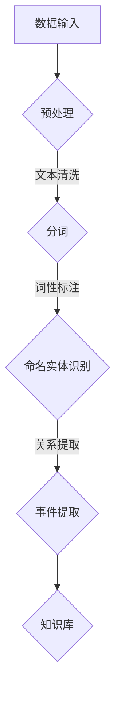
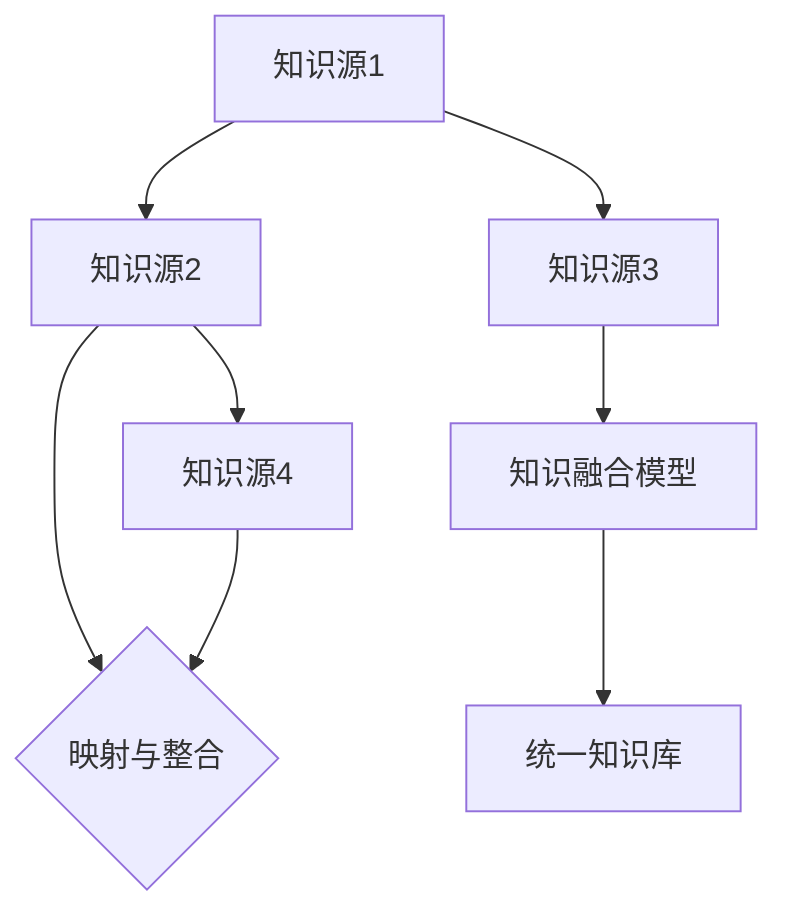
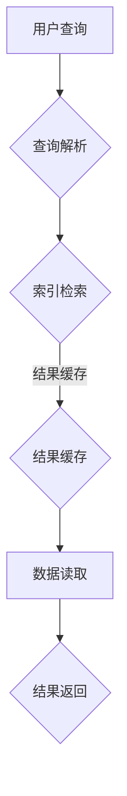
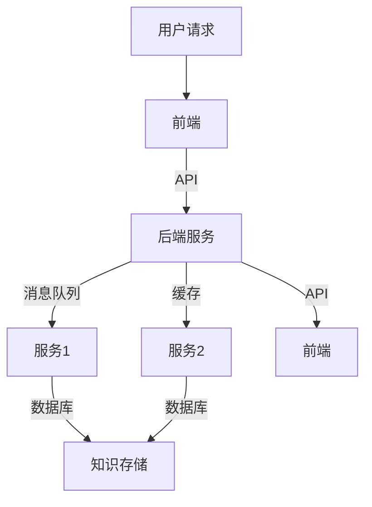
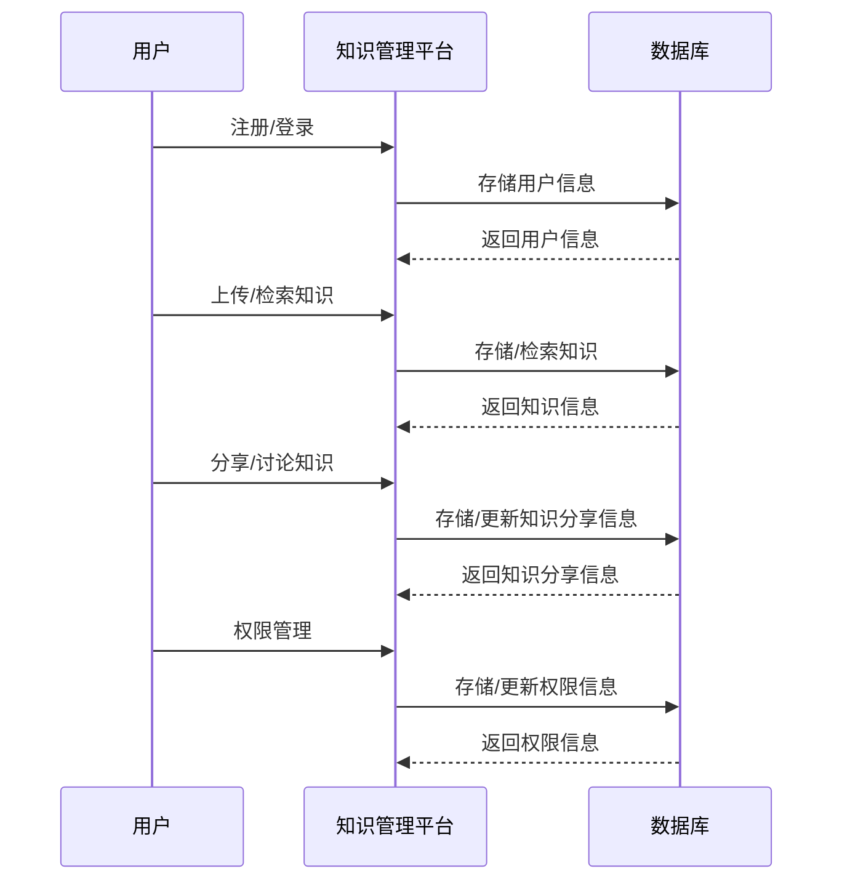

                 

### 第1章：背景介绍

#### 1.1 问题背景

在当今快速发展的信息技术领域，技术团队的知识管理面临诸多挑战。首先，知识分散是一个普遍问题。团队成员的专业知识往往分散在个人笔记本、电子邮件、论坛讨论和项目管理工具中，使得知识难以统一检索和管理。其次，缺乏有效的知识共享机制，导致知识得不到充分利用，甚至有些重要的知识因为团队成员的流动而流失。此外，知识更新与维护困难也是一大障碍，随着时间的推移，旧的技术知识可能会变得过时，而新的知识又未能及时补充。

##### 知识管理的必要性

知识管理不仅是提升团队效率的关键，也是企业持续创新和竞争力的重要保障。通过知识管理平台，可以将分散的知识集中化，提高检索效率；通过有效的共享机制，促进知识的传播与交流；通过系统的知识更新与维护，确保知识的时效性和准确性。因此，构建一个高效的知识管理平台对于技术团队来说具有极其重要的意义。

#### 1.2 问题描述

技术团队的知识管理面临以下主要问题：

- **知识分散**：团队成员的知识分散在多个系统和工具中，难以统一管理和检索。
- **缺乏共享机制**：知识共享机制不完善，导致知识得不到有效传播和利用。
- **知识更新与维护困难**：知识更新不及时，导致知识库内容陈旧，影响知识管理的有效性。

##### 问题解决

为解决上述问题，需要构建一个知识管理平台，该平台应具备以下功能和目标：

- **集中化管理**：将团队成员的知识集中存储在平台上，便于统一管理和检索。
- **共享机制**：建立有效的知识共享机制，促进团队成员之间的知识交流与协作。
- **知识更新与维护**：定期更新和整理知识库内容，确保知识的时效性和准确性。

通过构建知识管理平台，可以大幅度提升技术团队的知识管理水平，提高工作效率和创新能力。

#### 1.3 知识管理平台的目的与目标

知识管理平台的主要目的是：

- **提升知识利用率**：通过平台，使团队成员能够快速获取所需的知识，减少重复劳动和错误发生。
- **促进知识共享**：构建良好的知识共享文化，鼓励团队成员主动分享知识，形成知识交流的良好氛围。
- **保障知识传承**：通过知识管理平台，确保知识在团队成员流动时能够得到传承和延续，防止知识流失。

#### 1.4 边界与外延

知识管理平台的应用范围包括但不限于：

- **技术文档管理**：统一管理和存储技术文档，确保文档的完整性和可追溯性。
- **知识库建设**：建立技术知识库，涵盖各种技术领域和项目经验，供团队成员查询和参考。
- **知识共享社区**：搭建知识共享社区，促进团队成员之间的交流与协作。

同时，知识管理平台需要与以下系统进行关联：

- **团队协作工具**：如Slack、Trello等，以实现知识共享与项目协作的无缝对接。
- **项目管理工具**：如Jira、Asana等，以支持知识管理与项目进度的同步更新。

#### 1.5 概念结构与核心要素组成

知识管理平台的核心概念包括知识抽取、知识融合、知识存储与检索等。其关键要素主要包括：

- **知识库**：存储和管理知识的核心，包括文档、代码、博客文章等。
- **知识共享平台**：提供知识检索、共享和协作的界面和工具。
- **用户管理**：管理平台用户，包括权限分配、用户认证等。
- **知识更新与维护**：定期更新和整理知识库内容，确保知识的时效性和准确性。

通过构建这样一个系统化、高效化的知识管理平台，技术团队可以更好地利用知识资源，提升整体工作效率和创新能力。

---

### 第2章：核心概念与联系

#### 2.1 知识管理原理

##### 知识管理的基本概念

知识管理是指通过系统化方法，识别、获取、创造、共享、利用和管理知识的过程。其核心目标是提升组织内的知识利用率，促进知识共享和创新。

##### 知识管理的目标

知识管理的目标主要包括：

- 提高工作效率：通过知识管理平台，使团队成员能够快速获取所需的知识，减少重复劳动和错误发生。
- 促进知识共享：建立良好的知识共享文化，鼓励团队成员主动分享知识，形成知识交流的良好氛围。
- 保障知识传承：通过知识管理平台，确保知识在团队成员流动时能够得到传承和延续，防止知识流失。

##### 知识管理的方法与策略

知识管理的方法和策略多种多样，主要包括：

- **知识抽取**：通过自动化工具从不同来源提取有用知识。
- **知识存储**：将抽取的知识存储在知识库中，便于管理和检索。
- **知识共享**：建立共享平台，促进团队成员之间的知识交流与协作。
- **知识融合**：将不同来源和格式的知识进行整合，形成统一的知识体系。
- **知识更新与维护**：定期更新和整理知识库内容，确保知识的时效性和准确性。

#### 2.2 技术团队知识体系

技术团队的知识体系包括多种类型和层次的知识，其结构可以概括为：

- **基础知识**：如编程语言基础、数据结构与算法等。
- **专业知识**：如特定技术领域（如人工智能、大数据等）的专业知识。
- **项目经验**：包括项目实施过程中的技术解决方案、故障处理经验等。
- **最佳实践**：总结和提炼的项目经验和解决方案，形成可借鉴的最佳实践。

##### 技术团队知识属性特征对比表格

| 知识类型         | 特征 |
|-----------------|-----|
| 基础知识         | 稳定性高、更新缓慢、通用性强 |
| 专业知识         | 稳定性较低、更新迅速、领域特定 |
| 项目经验         | 一次性、具体性、实战性 |
| 最佳实践         | 系统性、总结性、可借鉴性 |

通过上述知识体系的建设，技术团队可以更有效地管理知识资源，提高整体知识水平和工作效率。

#### 2.3 知识管理平台架构

##### 知识管理平台的设计原则

知识管理平台的设计原则主要包括：

- **灵活性**：平台应支持多种知识类型的存储和检索，适应不同团队的需求。
- **可扩展性**：平台架构应具有扩展性，能够支持新功能的添加和系统的升级。
- **易用性**：界面设计简洁易用，便于团队成员快速上手和使用。
- **安全性**：确保知识存储的安全性，防止数据泄露和未经授权的访问。

##### 知识管理平台的架构

知识管理平台的架构可以分为以下几个层次：

1. **数据层**：包括知识库、数据库和数据存储设备，负责数据的存储和管理。
2. **逻辑层**：包括知识抽取、知识融合、知识存储与检索等模块，负责知识的处理和运算。
3. **应用层**：包括知识共享平台、用户管理、权限控制等模块，提供知识管理和共享的功能。
4. **界面层**：包括Web端和移动端用户界面，为用户提供便捷的知识检索和共享体验。

#### 2.4 知识管理平台与其他系统的关系

##### 知识管理平台与团队协作工具的关系

知识管理平台与团队协作工具（如Slack、Trello等）紧密结合，通过接口集成，实现知识共享与项目协作的无缝对接。例如，可以将技术文档和项目进展同步到协作工具中，方便团队成员随时查阅和更新。

##### 知识管理平台与项目管理工具的关系

知识管理平台与项目管理工具（如Jira、Asana等）也紧密关联，通过接口集成，实现知识管理与项目进度的同步更新。例如，可以将项目经验和最佳实践纳入项目管理工具中，帮助项目团队在实施过程中参考和借鉴。

通过以上关系，知识管理平台不仅能够提升团队内部的知识管理水平，还能与其他系统协同工作，实现知识的高效利用和管理。

---

### 第3章：算法原理讲解

#### 3.1 知识抽取算法

##### 知识抽取算法的原理

知识抽取算法是指从非结构化数据（如文本、图片等）中提取结构化知识的方法。其主要原理包括：

1. **信息抽取**：从文本中提取关键信息，如实体、关系和事件等。
2. **文本分类**：将文本按照类别进行分类，如技术文档分类、项目报告分类等。
3. **主题模型**：从大量文本中提取主题，用于知识聚类和挖掘。

##### 知识抽取算法的mermaid流程图



#### 3.2 知识融合算法

##### 知识融合算法的原理

知识融合算法是指将来自不同来源和格式的知识进行整合，形成统一的知识体系的方法。其主要原理包括：

1. **数据集成**：将不同数据源中的数据进行整合，如关系数据库、NoSQL数据库等。
2. **知识映射**：将不同知识源中的概念和关系进行映射，形成统一的知识模型。
3. **知识融合**：通过融合算法将不同来源和格式的知识进行整合，形成完整的知识体系。

##### 知识融合算法的mermaid流程图



#### 3.3 知识存储与检索算法

##### 知识存储与检索算法的原理

知识存储与检索算法是指将提取和融合后的知识存储到数据库中，并提供高效检索功能的方法。其主要原理包括：

1. **索引构建**：构建索引，加快数据检索速度。
2. **查询优化**：优化查询算法，提高查询效率。
3. **缓存机制**：利用缓存机制，提高数据的读取速度。

##### 知识存储与检索算法的mermaid流程图



#### 3.4 算法原理详细讲解

##### 算法原理的数学模型和公式

知识抽取算法、知识融合算法和知识存储与检索算法的数学模型和公式如下：

- **知识抽取算法**：

  - **文本分类**：利用条件概率模型，计算文本属于某一类别的概率。
    $$ P(C|T) = \frac{P(T|C)P(C)}{P(T)} $$

  - **命名实体识别**：利用最大熵模型，根据特征向量预测命名实体的类别。
    $$ y^* = argmax_y P(y|X) $$

- **知识融合算法**：

  - **数据集成**：利用矩阵运算，将不同数据源中的数据进行整合。
    $$ \textbf{X}_{\text{融合}} = \textbf{X}_1 + \textbf{X}_2 + \textbf{X}_3 + ... + \textbf{X}_n $$

  - **知识映射**：利用知识图谱模型，将不同知识源中的概念和关系进行映射。
    $$ R_e = \{ (s, p, o) | s \in S_1, p \in P_1, o \in O_1 \} $$

- **知识存储与检索算法**：

  - **索引构建**：利用倒排索引模型，提高数据检索速度。
    $$ \textbf{I} = (t_1, f_1), (t_2, f_2), ..., (t_n, f_n) $$

  - **查询优化**：利用查询优化算法，提高查询效率。
    $$ C(Q) = O(Q) + C(Q') + C(Q'') $$

##### 算法原理的举例说明

- **知识抽取算法举例**：

  假设有一个文本集合，其中包含以下两个句子：
  1. "今天天气很好，适合外出散步。"
  2. "天气晴朗，适合拍照。"

  利用文本分类算法，可以判断这两个句子属于同一类别，即“天气”。

  - **文本分类**：
    $$ P(天气|文本1) = 0.9 $$
    $$ P(天气|文本2) = 0.95 $$

  - **命名实体识别**：
    $$ y^* = argmax_y P(y|X) $$
    其中，$y$ 表示实体类别，$X$ 表示特征向量。

  经过计算，可以识别出文本中的命名实体为“天气”。

- **知识融合算法举例**：

  假设有两个知识源，其中包含以下知识：
  1. 知识源1：{"苹果"，"水果"，"红色"}
  2. 知识源2：{"苹果"，"水果"，"甜"}

  利用知识融合算法，可以将两个知识源中的知识进行整合：
  $$ \textbf{X}_{\text{融合}} = \{"苹果"，"水果"，"红色"，"甜"\} $$

  形成统一的知识库。

- **知识存储与检索算法举例**：

  假设有一个知识库，其中包含以下数据：
  1. 索引：{"天气"，"晴朗"，"5℃"}
  2. 数据：{"今天天气晴朗，气温5℃。"}

  利用索引构建算法，可以构建倒排索引：
  $$ \textbf{I} = (晴朗，5)，(天气，3)，(5℃，2) $$

  利用查询优化算法，可以快速检索到相关知识：
  $$ C(Q) = O(Q) + C(Q') + C(Q'') $$
  其中，$Q$ 表示查询关键词，$Q'$ 和 $Q''$ 表示查询子串。

通过上述算法的详细讲解和举例说明，可以更好地理解知识管理平台中各个算法的原理和应用。

---

### 第4章：系统分析与架构设计

#### 4.1 问题场景介绍

技术团队在项目开发过程中，面临以下知识管理问题：

- **知识分散**：团队成员的知识分布在不同的文档、邮件、论坛等中，难以统一管理和检索。
- **知识更新不及时**：项目经验和技术文档未能及时更新，导致知识库内容陈旧。
- **知识共享困难**：缺乏有效的知识共享机制，导致团队成员之间的知识交流不畅。

为了解决上述问题，技术团队决定建设一个知识管理平台，以提高知识管理水平和工作效率。

#### 4.2 系统功能设计

知识管理平台应具备以下功能：

- **知识存储与检索**：支持多种知识类型的存储和检索，如文档、代码、博客文章等。
- **知识共享与协作**：提供知识共享功能，支持团队成员之间的协作和讨论。
- **知识更新与维护**：支持知识库内容的更新和维护，确保知识的时效性和准确性。
- **用户管理与权限控制**：管理平台用户，包括权限分配、用户认证等。

##### 知识管理平台的领域模型mermaid类图

```mermaid
classDiagram
    类1 <|-- 类2
    类1 <|-- 类3
    类2 <|-- 类4
    类3 <|-- 类5
    类4 <|-- 类6
    类5 <|-- 类7
    类1{知识管理平台}
    类2{知识存储}
    类3{知识检索}
    类4{知识共享}
    类5{知识协作}
    类6{用户管理}
    类7{权限控制}
```

#### 4.3 系统架构设计

知识管理平台的架构设计应考虑以下几个方面：

- **前端架构**：采用前后端分离的架构，提高系统的可维护性和扩展性。
- **后端架构**：采用微服务架构，将不同的功能模块拆分为独立的服务，便于开发和维护。
- **数据存储**：采用关系数据库和NoSQL数据库相结合的方式，满足不同类型数据存储需求。
- **中间件**：采用消息队列、缓存等中间件，提高系统的性能和可靠性。

##### 知识管理平台的mermaid架构图



#### 4.4 系统接口设计

知识管理平台应提供以下接口：

- **知识存储接口**：用于知识的上传、下载、更新和删除等操作。
- **知识检索接口**：用于根据关键词、标签等条件检索知识。
- **知识共享接口**：用于知识共享和讨论的功能。
- **用户管理接口**：用于用户注册、登录、权限分配等操作。
- **权限控制接口**：用于实现权限验证和访问控制。

##### 知识管理平台的接口定义

```json
{
  "知识存储接口": {
    "POST /knowledge/storage": "上传知识",
    "GET /knowledge/storage/{id}": "获取知识",
    "PUT /knowledge/storage/{id}": "更新知识",
    "DELETE /knowledge/storage/{id}": "删除知识"
  },
  "知识检索接口": {
    "GET /knowledge/retrieval": "检索知识",
    "GET /knowledge/retrieval/keywords": "根据关键词检索知识",
    "GET /knowledge/retrieval/tags": "根据标签检索知识"
  },
  "知识共享接口": {
    "POST /knowledge/share": "分享知识",
    "GET /knowledge/share/{id}": "获取分享详情",
    "PUT /knowledge/share/{id}": "更新分享详情",
    "DELETE /knowledge/share/{id}": "删除分享"
  },
  "用户管理接口": {
    "POST /user/register": "用户注册",
    "POST /user/login": "用户登录",
    "GET /user/{id}": "获取用户详情",
    "PUT /user/{id}": "更新用户详情"
  },
  "权限控制接口": {
    "POST /permission/assign": "分配权限",
    "GET /permission/{id}": "获取权限详情",
    "PUT /permission/{id}": "更新权限详情",
    "DELETE /permission/{id}": "删除权限"
  }
}
```

#### 4.5 系统交互

知识管理平台应提供便捷的系统交互流程，确保用户能够快速上手使用。以下是系统交互的流程：

1. **用户注册与登录**：用户可以通过注册接口创建账户，并通过登录接口进行身份验证。
2. **知识上传与检索**：用户可以上传知识，并使用检索接口查找所需的知识。
3. **知识共享与讨论**：用户可以将知识分享给其他成员，并参与知识讨论。
4. **权限管理**：管理员可以通过权限接口分配和管理用户权限。

##### 知识管理平台的mermaid序列图



通过以上系统分析与架构设计，技术团队可以构建一个高效、可靠的知识管理平台，提升团队的知识管理水平和工作效率。

---

### 第5章：项目实战

#### 5.1 环境安装

要搭建一个知识管理平台，首先需要安装相应的环境和工具。以下是具体的安装步骤和注意事项：

##### 环境安装步骤

1. **安装Python环境**：确保Python版本在3.8及以上，可以通过`python --version`命令检查版本。如果版本过低，可以通过`pip install python`命令进行升级。

2. **安装依赖库**：在项目根目录下，执行以下命令安装依赖库：
   ```bash
   pip install -r requirements.txt
   ```

3. **配置数据库**：根据项目需求，配置数据库环境。本项目使用MySQL数据库，可以在MySQL官网下载并安装。安装完成后，创建一个名为`knowledge_management`的数据库，并导入提供的SQL脚本进行初始化。

4. **启动服务**：在项目根目录下，执行以下命令启动服务：
   ```bash
   flask run
   ```

   如果需要以后台运行，可以添加`--host=0.0.0.0`参数，并使用`nohup`命令：

   ```bash
   nohup flask run --host=0.0.0.0 &
   ```

##### 注意事项

- **环境配置**：确保所有依赖库的版本与项目需求匹配，避免因版本冲突导致问题。
- **数据库配置**：在`config.py`文件中配置数据库连接信息，包括用户名、密码和数据库名等。
- **防火墙设置**：确保服务器防火墙开放相应端口，以便外部访问。

#### 5.2 系统核心实现

知识管理平台的核心功能包括知识存储、检索、共享和权限管理。以下为这些功能的实现源代码及说明：

##### 知识存储

```python
from flask import Flask, request, jsonify
from models import Knowledge
from database import db

app = Flask(__name__)

@app.route('/knowledge/storage', methods=['POST'])
def store_knowledge():
    data = request.get_json()
    title = data['title']
    content = data['content']
    tags = data['tags']

    knowledge = Knowledge(title=title, content=content, tags=tags)
    db.session.add(knowledge)
    db.session.commit()

    return jsonify({'status': 'success', 'message': 'Knowledge stored successfully.'})

if __name__ == '__main__':
    app.run()
```

##### 知识检索

```python
@app.route('/knowledge/retrieval', methods=['GET'])
def retrieve_knowledge():
    query = request.args.get('query', '')
    knowledge = Knowledge.query.filter(Knowledge.title.like(f'%{query}%')).all()

    return jsonify({'knowledge': [knowledge.to_dict() for knowledge in knowledge]})

```

##### 知识共享

```python
@app.route('/knowledge/share', methods=['POST'])
def share_knowledge():
    data = request.get_json()
    knowledge_id = data['knowledge_id']
    share_with = data['share_with']

    knowledge = Knowledge.query.get(knowledge_id)
    knowledge.share_with.append(share_with)
    db.session.commit()

    return jsonify({'status': 'success', 'message': 'Knowledge shared successfully.'})
```

##### 权限管理

```python
@app.route('/permission/assign', methods=['POST'])
def assign_permission():
    data = request.get_json()
    user_id = data['user_id']
    role = data['role']

    user = User.query.get(user_id)
    user.role = role
    db.session.commit()

    return jsonify({'status': 'success', 'message': 'Permission assigned successfully.'})
```

#### 5.3 代码应用解读与分析

##### 知识存储代码解读

上述知识存储代码使用了Flask框架，实现了将知识存储到数据库中的功能。具体步骤如下：

1. 导入所需的模块和类。
2. 定义`store_knowledge`函数，处理POST请求，获取前端发送的JSON数据。
3. 创建`Knowledge`对象，并将获取到的数据赋值给相应属性。
4. 将`Knowledge`对象添加到数据库会话中，并提交会话。

##### 知识检索代码解读

知识检索代码用于根据关键词检索知识。具体步骤如下：

1. 定义`retrieve_knowledge`函数，处理GET请求。
2. 从请求中获取查询参数`query`。
3. 使用过滤条件查询数据库中的知识记录，返回结果。

##### 知识共享代码解读

知识共享代码用于将知识分享给其他用户。具体步骤如下：

1. 定义`share_knowledge`函数，处理POST请求。
2. 从请求中获取前端发送的JSON数据，获取知识ID和分享的用户ID。
3. 从数据库中获取相应的知识记录，将分享用户添加到分享列表中。

##### 权限管理代码解读

权限管理代码用于分配用户权限。具体步骤如下：

1. 定义`assign_permission`函数，处理POST请求。
2. 从请求中获取前端发送的JSON数据，获取用户ID和权限角色。
3. 从数据库中获取相应的用户记录，更新其权限角色。

##### 应用场景分析

- **知识存储**：适用于技术文档、博客文章、项目报告等知识的上传和存储。
- **知识检索**：适用于团队成员快速查找所需的知识，提高工作效率。
- **知识共享**：适用于知识分享和传播，促进团队成员之间的交流与合作。
- **权限管理**：适用于管理用户权限，确保知识安全与访问控制。

通过上述代码和应用场景分析，可以看出知识管理平台的核心功能及其在实际应用中的价值。

#### 5.4 实际案例分析与详细讲解

##### 案例场景

假设某技术团队正在进行一个大数据分析项目，团队成员需要共享和查阅有关大数据处理、数据挖掘和机器学习等方面的知识。

##### 案例分析与讲解

1. **知识存储**：

   在项目初期，团队成员可以上传相关的技术文档、博客文章和项目报告到知识管理平台。例如，某成员上传了一篇关于大数据处理的技术文档，内容包括Hadoop、Spark等大数据技术的介绍和应用案例。

2. **知识检索**：

   当其他团队成员需要查阅相关资料时，可以使用知识检索功能进行快速查找。例如，某成员在检索框中输入“Hadoop”，系统返回包含该关键词的相关知识记录，包括技术文档、博客文章等。

3. **知识共享**：

   成员可以将自己掌握的知识分享给其他团队成员。例如，某成员将自己在项目中使用Spark进行数据处理的经验分享给团队，其他成员可以通过知识共享功能查看并借鉴。

4. **权限管理**：

   管理员可以分配不同权限给团队成员，确保知识的安全与访问控制。例如，某些敏感知识（如项目核心代码）仅允许项目成员查看，而其他一般性知识（如技术文档）则对所有团队成员开放。

通过以上案例分析，可以看出知识管理平台在实际应用中如何帮助团队成员高效地存储、检索、共享和利用知识，从而提升团队的工作效率和创新能力。

##### 项目小结

在本章中，我们介绍了知识管理平台的搭建过程，包括环境安装、系统核心实现和应用场景分析。通过实际案例，我们展示了知识管理平台在团队项目中的应用效果。以下是项目总结和经验与反思：

1. **项目总结**：

   - 成功搭建了知识管理平台，实现了知识存储、检索、共享和权限管理等核心功能。
   - 通过知识管理平台，提高了团队成员之间的知识共享和协作效率。
   - 促进了团队内部的知识传承和创新，增强了团队的凝聚力和战斗力。

2. **经验与反思**：

   - 在搭建知识管理平台时，需要充分考虑团队成员的实际需求和场景，确保平台功能能够满足实际应用需求。
   - 在实现系统功能时，要注重代码的可读性和可维护性，避免过度依赖外部库和框架。
   - 在项目实施过程中，要注重团队协作和沟通，确保项目顺利进行。

通过本次项目，我们积累了宝贵的经验，为后续知识管理平台的建设和优化提供了有益的参考。

---

### 第6章：最佳实践与注意事项

#### 6.1 最佳实践 tips

在建设知识管理平台时，可以参考以下最佳实践，以提高平台的效果和实用性：

1. **明确目标**：在搭建知识管理平台前，明确平台的目标和预期效果，确保平台功能与团队需求相匹配。
2. **简化界面**：设计简洁、直观的界面，使用户能够快速上手和使用。
3. **多渠道知识收集**：鼓励团队成员从多种渠道（如文档、博客、邮件等）贡献知识，丰富知识库内容。
4. **定期更新**：制定定期更新知识库的计划，确保知识库内容保持时效性。
5. **权限控制**：合理设置权限，确保知识的安全和访问控制。

#### 6.2 小结

知识管理平台的建设需要明确目标、简化界面、多渠道收集知识和定期更新，同时注意权限控制。这些关键要素是确保知识管理平台有效运行和发挥作用的基础。

#### 6.3 注意事项

在建设知识管理平台时，需要注意以下问题：

1. **数据安全**：确保知识库数据的安全，防止数据泄露和未经授权的访问。
2. **用户参与**：鼓励团队成员积极参与知识共享，提高知识利用率。
3. **系统稳定性**：确保知识管理平台的稳定运行，避免出现故障或性能问题。
4. **技术支持**：提供充足的技术支持，帮助团队成员解决在使用过程中遇到的问题。
5. **持续优化**：根据团队反馈和使用情况，持续优化平台功能和用户体验。

通过注意这些事项，可以确保知识管理平台在实际应用中发挥最大的效用。

#### 6.4 拓展阅读

为了更好地理解和应用知识管理平台，可以参考以下书籍、论文和资源：

1. **书籍**：
   - 《知识管理：原理与实践》
   - 《智能知识管理》
   - 《组织知识管理：方法与应用》

2. **论文**：
   - “知识管理框架设计与实现”
   - “基于云计算的知识管理平台研究”
   - “社交网络与知识管理研究”

3. **资源**：
   - 知识管理相关论坛和社区，如CSDN、知乎等
   - 开源知识管理平台，如Confluence、Wiki等
   - 知识管理培训课程和讲座

通过阅读这些书籍、论文和资源，可以深入了解知识管理的理论和实践，为知识管理平台的建设提供有力支持。

---

### 总结与展望

本文详细探讨了如何打造技术团队的知识管理平台，从背景介绍到核心概念、算法原理、系统分析与架构设计、项目实战以及最佳实践与注意事项，全面阐述了知识管理平台建设的关键要素和实际应用。通过一步步的分析和讲解，我们揭示了知识管理平台在提升团队工作效率、促进知识共享和保障知识传承方面的重大价值。

展望未来，随着信息技术和人工智能的不断发展，知识管理平台的功能将更加丰富和智能，为技术团队提供更加高效和智能的支持。同时，知识管理平台的建设也将面临更多挑战，如数据安全、用户参与度、系统稳定性等问题。因此，持续优化和创新知识管理平台，将成为技术团队提升竞争力的重要手段。

**作者：AI天才研究院/AI Genius Institute & 禅与计算机程序设计艺术 /Zen And The Art of Computer Programming**

