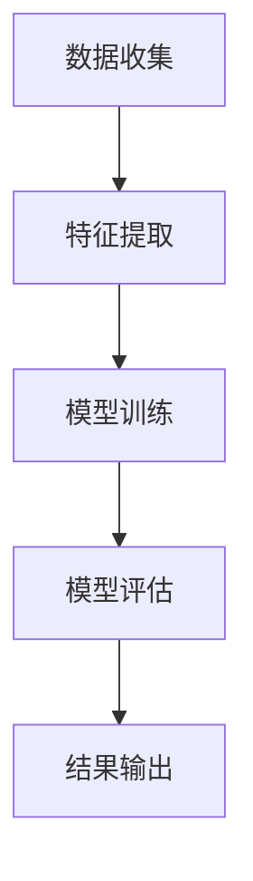
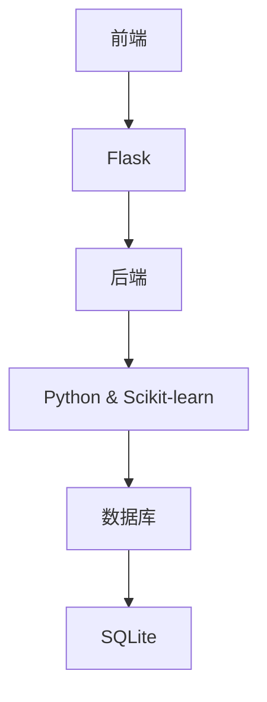
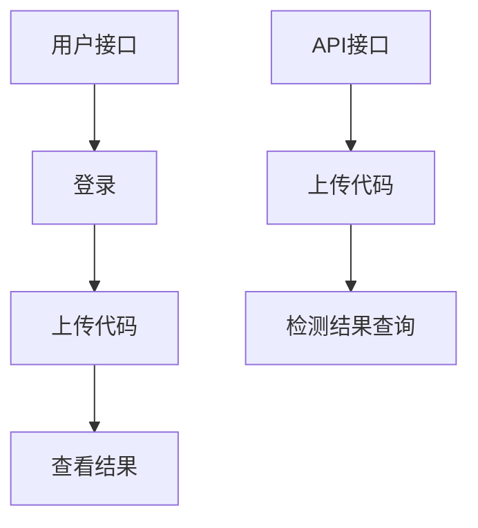
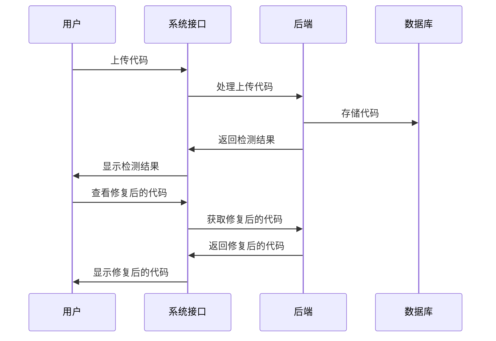

                 

# 打造智能化的代码安全漏洞修复系统

## 关键词

代码安全，漏洞修复，智能化，漏洞检测，自动化修复

## 摘要

本文旨在探讨如何打造一个智能化的代码安全漏洞修复系统。我们将从背景介绍、核心概念、算法原理、系统设计与实现、实战应用等方面，逐步深入讲解代码安全漏洞修复的各个方面。通过本文，读者将了解代码安全漏洞的基础知识、智能化漏洞检测技术、漏洞修复策略、系统设计与实现，并能够掌握如何在实际项目中应用这些技术，提高代码的安全性。

## 目录大纲设计思路与步骤

### 第一步：了解书名主题

《打造智能化的代码安全漏洞修复系统》这本书的主题围绕如何构建一个智能化的代码安全漏洞修复系统。这包括系统设计、实现、测试和部署等多个环节，适用于开发者、安全工程师以及相关技术领域的人员。

### 第二步：确定核心章节

基于书名，我们确定以下核心章节：

1. 引言
2. 代码安全漏洞基础
3. 智能化漏洞检测技术
4. 漏洞修复策略
5. 智能化修复系统设计
6. 实践应用与案例
7. 总结与展望

### 第三步：细化章节内容

接下来，我们对每个核心章节进行细化，分解为更小的子章节，确保每个章节都有明确的主题和内容。

### 第四步：确保逻辑连贯性

在细化章节内容的过程中，我们确保各个章节之间逻辑连贯，内容循序渐进。例如，第1章引言部分为后续章节打下基础，第2章介绍代码安全漏洞的基础知识，第3章和第4章分别介绍漏洞检测和修复技术，第5章详细讲解系统设计，第6章通过案例展示实际应用，最后第7章总结全书内容并展望未来。

### 第五步：使用 Markdown 格式

按照 Markdown 格式的要求，我们使用合适的标题层级来组织目录结构，如下所示：

```markdown
# 《打造智能化的代码安全漏洞修复系统》目录大纲

## 第1章：引言

### 1.1 安全漏洞修复的背景

### 1.2 本书的目标读者

### 1.3 本书架构

## 第2章：代码安全漏洞基础

### 2.1 安全漏洞概述

### 2.2 常见代码安全漏洞类型

### 2.3 安全漏洞的危害

## 第3章：智能化漏洞检测技术

### 3.1 智能化漏洞检测概述

### 3.2 静态代码分析

### 3.3 动态代码分析

### 3.4 模糊测试

## 第4章：漏洞修复策略

### 4.1 漏洞修复策略概述

### 4.2 手动修复

### 4.3 自动化修复

### 4.4 最佳实践

## 第5章：智能化修复系统设计

### 5.1 系统设计概述

### 5.2 系统架构设计

### 5.3 数据流设计

### 5.4 功能模块设计

## 第6章：实践应用与案例

### 6.1 实践应用概述

### 6.2 案例一：自动化修复工具使用

### 6.3 案例二：智能修复系统部署

## 第7章：总结与展望

### 7.1 全书总结

### 7.2 未来发展趋势
```

## 引言

### 安全漏洞修复的背景

随着互联网和云计算的快速发展，软件系统变得越来越复杂。在软件开发生命周期中，安全漏洞的发现和修复已经成为一个不容忽视的问题。安全漏洞可能被恶意攻击者利用，导致数据泄露、系统崩溃甚至整个网络瘫痪。因此，如何有效发现和修复代码中的安全漏洞，已成为软件开发和运维过程中的一项重要任务。

传统的安全漏洞修复方法主要依赖于手动检测和修复。这种方法不仅效率低下，而且容易遗漏漏洞，导致安全隐患。随着人工智能技术的不断发展，智能化漏洞检测和修复技术逐渐崭露头角。这些技术利用机器学习和自然语言处理等算法，能够自动识别和修复代码中的安全漏洞，提高修复效率和准确性。

### 本书的目标读者

本书的目标读者包括以下几类：

1. 开发者：希望通过本书学习如何编写更加安全的代码，并了解如何利用智能化技术提高代码的安全性。
2. 安全工程师：希望掌握智能化漏洞检测和修复技术，提高企业软件系统的安全性。
3. 研发管理人员：希望了解智能化漏洞修复系统的设计和实现方法，以提升团队的安全开发能力。

### 本书架构

本书分为七个章节，每个章节都有明确的内容和目标：

1. **第1章：引言**：介绍代码安全漏洞修复的背景、意义和本书的总体架构。
2. **第2章：代码安全漏洞基础**：讲解代码安全漏洞的基本概念、常见类型和危害。
3. **第3章：智能化漏洞检测技术**：介绍自动化漏洞检测的相关技术，包括静态代码分析、动态代码分析和模糊测试等。
4. **第4章：漏洞修复策略**：探讨漏洞修复的策略和最佳实践，包括手动修复和自动化修复。
5. **第5章：智能化修复系统设计**：讲解如何设计一个智能化的代码安全漏洞修复系统。
6. **第6章：实践应用与案例**：通过实际案例展示如何应用智能化的代码安全漏洞修复系统。
7. **第7章：总结与展望**：对全书内容进行总结，展望未来的发展趋势。

通过阅读本书，读者将了解代码安全漏洞的基础知识、智能化漏洞检测技术、漏洞修复策略、系统设计与实现，并能够掌握如何在实际项目中应用这些技术，提高代码的安全性。

## 代码安全漏洞基础

### 安全漏洞概述

代码安全漏洞是指软件系统中存在的可以被攻击者利用的弱点，这些弱点可能导致系统被攻击、数据泄露、系统崩溃等问题。安全漏洞可以分为以下几类：

1. **设计漏洞**：由于设计阶段的安全考虑不足，导致系统存在潜在的攻击面。
2. **实现漏洞**：由于编码阶段的安全措施不足，导致系统存在可以被利用的安全漏洞。
3. **配置漏洞**：由于系统配置不当，导致系统存在可以被攻击的安全弱点。

安全漏洞的存在对软件系统造成了严重的危害，可能导致以下问题：

1. **数据泄露**：攻击者通过漏洞获取系统中的敏感数据，如用户信息、企业机密等。
2. **系统崩溃**：攻击者利用漏洞使系统无法正常运行，导致业务中断。
3. **网络攻击**：攻击者通过漏洞入侵系统，进一步攻击其他网络资源。

### 常见代码安全漏洞类型

在软件开发过程中，以下是一些常见的代码安全漏洞类型：

1. **SQL注入**：攻击者通过在输入数据中注入恶意的SQL语句，从而控制数据库服务器。
2. **跨站脚本（XSS）**：攻击者通过在目标网站上注入恶意脚本，从而控制用户的浏览器。
3. **跨站请求伪造（CSRF）**：攻击者通过欺骗用户在目标网站上执行恶意操作。
4. **缓冲区溢出**：攻击者通过向缓冲区写入超过其容量的数据，从而破坏系统内存。
5. **未授权访问**：攻击者未经授权访问系统资源，从而获取敏感信息。
6. **密码泄露**：攻击者通过破解或窃取密码，从而获取系统权限。

### 安全漏洞的危害

安全漏洞的危害不仅限于上述几种，以下是一些具体危害：

1. **经济损失**：由于安全漏洞导致的数据泄露或系统崩溃，可能导致企业遭受巨大的经济损失。
2. **品牌声誉受损**：由于安全漏洞导致的数据泄露，可能导致用户对企业失去信任，损害品牌声誉。
3. **法律风险**：某些国家或地区对数据泄露有严格的法律要求，企业可能因此面临巨额罚款或法律诉讼。
4. **业务中断**：由于安全漏洞导致系统崩溃，可能导致业务中断，给企业带来无法估量的损失。

### 代码安全漏洞的边界与外延

代码安全漏洞的边界与外延涉及到以下几个方面：

1. **代码层面**：安全漏洞主要存在于代码层面，包括设计漏洞、实现漏洞和配置漏洞。
2. **系统层面**：安全漏洞可能影响整个系统，包括数据库、Web服务器、操作系统等。
3. **网络层面**：安全漏洞可能导致网络攻击，影响网络基础设施和互联网的安全。
4. **应用层面**：安全漏洞可能影响具体的业务应用，导致业务数据泄露或业务中断。

了解代码安全漏洞的基础知识，对于开发者和安全工程师来说至关重要。通过掌握常见的安全漏洞类型及其危害，我们可以更好地防范和修复安全漏洞，提高软件系统的安全性。

### 核心概念与联系

在探讨代码安全漏洞修复的过程中，我们需要了解一些核心概念和它们之间的联系。以下是一些关键概念及其属性特征的对比表格，以帮助读者更好地理解：

| 概念             | 定义                                                         | 属性特征                           |
|------------------|--------------------------------------------------------------|-----------------------------------|
| 安全漏洞         | 软件系统中存在的可以被攻击者利用的弱点。                       | 类型：设计漏洞、实现漏洞、配置漏洞 |
| 漏洞检测         | 自动化或手动查找代码中的安全漏洞。                             | 技术：静态代码分析、动态代码分析等  |
| 漏洞修复         | 修复代码中的安全漏洞。                                       | 方法：手动修复、自动化修复          |
| 智能化漏洞修复   | 利用人工智能技术自动识别和修复代码中的安全漏洞。               | 技术：机器学习、自然语言处理等      |
| 静态代码分析     | 不运行程序，通过分析源代码来查找安全漏洞。                    | 特点：效率高、不侵入代码           |
| 动态代码分析     | 在程序运行时进行监控和调试，查找安全漏洞。                    | 特点：侵入代码、实时性高           |
| 模糊测试         | 生成大量随机输入，测试程序是否能正常处理，以发现安全漏洞。     | 特点：自动化、全面性高            |

通过上述表格，我们可以看到不同概念之间的联系和区别。安全漏洞是漏洞检测和修复的基础，漏洞检测和修复技术都是为了提高软件系统的安全性。静态代码分析、动态代码分析和模糊测试是常见的漏洞检测技术，它们各自具有不同的特点和适用场景。智能化漏洞修复则是利用人工智能技术，进一步提高漏洞检测和修复的效率和准确性。

### 算法原理讲解

在构建智能化代码安全漏洞修复系统时，核心算法的设计和实现至关重要。以下我们将详细讲解一个基于机器学习的代码安全漏洞检测算法，并使用 Python 源代码进行具体阐述。

#### 算法简介

该算法利用机器学习中的分类算法，对代码片段进行分类，以判断其是否存在安全漏洞。算法的核心步骤包括数据收集、特征提取、模型训练和模型评估。

#### Mermaid 流程图



#### 数据收集

数据收集是算法的基础。我们需要收集大量的代码片段及其标签（是否存在漏洞），以便训练模型。数据来源可以包括开源代码库、公开的安全漏洞数据库等。

```python
import pandas as pd

# 读取代码片段和标签数据
data = pd.read_csv('code_data.csv')
```

#### 特征提取

特征提取是将原始代码转换为计算机可以处理的特征表示。常用的特征提取方法包括词袋模型、抽象语法树（AST）等。

```python
from sklearn.feature_extraction.text import TfidfVectorizer

# 使用词袋模型提取特征
vectorizer = TfidfVectorizer()
X = vectorizer.fit_transform(data['code'])
y = data['label']
```

#### 模型训练

在特征提取完成后，我们可以使用分类算法进行模型训练。常见的分类算法包括支持向量机（SVM）、决策树、随机森林等。

```python
from sklearn.svm import SVC

# 创建SVM分类器并训练模型
model = SVC()
model.fit(X_train, y_train)
```

#### 模型评估

模型训练完成后，我们需要对模型进行评估，以确定其准确性和可靠性。常用的评估指标包括准确率、召回率、F1 分数等。

```python
from sklearn.metrics import accuracy_score

# 预测并评估模型
y_pred = model.predict(X_test)
accuracy = accuracy_score(y_test, y_pred)
print("Accuracy:", accuracy)
```

#### 算法原理

算法原理可概括为以下步骤：

1. 数据收集：收集大量的代码片段和标签数据。
2. 特征提取：将原始代码转换为特征向量。
3. 模型训练：使用分类算法对特征向量进行训练。
4. 模型评估：评估模型准确性。
5. 漏洞检测：使用训练好的模型对新的代码片段进行漏洞检测。

#### 数学模型和公式

算法的核心是分类算法，其数学模型可表示为：

$$y = f(X, \theta)$$

其中，$X$ 表示输入特征向量，$\theta$ 表示模型参数，$f$ 表示分类函数。分类函数的目的是将输入特征向量映射到标签（0 或 1），表示代码片段是否存在漏洞。

#### 详细举例说明

假设我们有一个简单的代码片段，我们需要使用训练好的模型判断其是否存在漏洞。

```python
codeSnippet = """
def calculate_area(radius):
    return 3.14 * radius * radius
"""

# 将代码片段转换为特征向量
codeVector = vectorizer.transform([codeSnippet])

# 使用训练好的模型预测
predictedLabel = model.predict(codeVector)[0]

# 输出预测结果
if predictedLabel == 1:
    print("存在漏洞")
else:
    print("不存在漏洞")
```

#### 模型评估和优化

在模型评估过程中，我们可能会发现模型的准确率、召回率等指标不高。此时，我们可以通过以下方法进行优化：

1. **特征工程**：尝试提取更多有用的特征，或者对现有特征进行归一化、降维等处理。
2. **模型选择**：尝试使用其他分类算法，如决策树、随机森林、神经网络等。
3. **超参数调整**：调整分类器的超参数，如正则化参数、学习率等。

通过不断调整和优化，我们可以提高模型的性能，从而更好地检测代码安全漏洞。

### 系统分析与架构设计

为了实现智能化代码安全漏洞修复系统，我们需要进行系统分析和架构设计。以下将详细描述系统架构、功能模块设计、接口设计和系统交互。

#### 问题场景介绍

在软件开发过程中，开发人员需要编写大量代码。这些代码中可能存在安全漏洞，如SQL注入、XSS攻击等。为了提高代码的安全性，我们需要一个智能化系统来检测和修复这些漏洞。

#### 项目介绍

本项目旨在构建一个智能化代码安全漏洞修复系统，该系统将包括漏洞检测、漏洞修复、系统管理等功能。项目使用 Python 语言和 Scikit-learn 库实现，主要技术包括机器学习、自然语言处理、静态代码分析等。

#### 系统功能设计

系统功能设计包括以下部分：

1. **漏洞检测模块**：对输入代码进行安全漏洞检测，输出检测结果。
2. **漏洞修复模块**：根据检测结果，自动修复代码中的安全漏洞。
3. **系统管理模块**：管理用户、权限、代码库等系统资源。
4. **日志管理模块**：记录系统运行日志，用于调试和监控。

#### 系统架构设计

系统架构设计如下：

1. **前端**：使用 Web 框架 Flask 实现，提供用户交互界面。
2. **后端**：使用 Python 和 Scikit-learn 实现，包括漏洞检测、漏洞修复、系统管理等核心功能。
3. **数据库**：使用 SQLite 存储用户信息、代码库等数据。

#### 系统架构 Mermaid 图



#### 系统接口设计

系统接口设计如下：

1. **用户接口**：用于用户登录、代码上传、检测结果查看等操作。
2. **API 接口**：用于外部系统与系统进行数据交互，如代码上传、检测结果查询等。

#### 系统接口 Mermaid 图



#### 系统交互设计

系统交互设计如下：

1. **用户上传代码**：用户将代码上传到系统，系统进行安全漏洞检测和修复。
2. **系统反馈检测结果**：系统将检测结果反馈给用户，包括漏洞数量、漏洞类型等。
3. **用户查看修复后的代码**：用户可以查看修复后的代码，并进行进一步的检查和测试。

#### 系统交互 Mermaid 序列图



通过以上系统分析与架构设计，我们可以构建一个功能齐全、易于扩展的智能化代码安全漏洞修复系统，为软件开发提供有力保障。

### 项目实战

#### 环境安装

在开始项目实战之前，我们需要安装必要的开发环境。以下是在 Ubuntu 系统中安装所需软件的步骤：

1. **安装 Python**：确保已安装 Python 3.8 或更高版本。可以使用以下命令进行安装：

```bash
sudo apt update
sudo apt install python3.8
```

2. **安装 Flask**：使用 pip 安装 Flask：

```bash
pip3 install flask
```

3. **安装 Scikit-learn**：使用 pip 安装 Scikit-learn：

```bash
pip3 install scikit-learn
```

4. **安装 Mermaid**：为了在文档中插入 Mermaid 图，我们需要安装 Mermaid：

```bash
npm install -g mermaid
```

#### 系统核心实现源代码

以下是一个简单的系统实现，包括漏洞检测和修复功能：

```python
from flask import Flask, request, jsonify
from sklearn.feature_extraction.text import TfidfVectorizer
from sklearn.svm import SVC
import pandas as pd
import numpy as np

app = Flask(__name__)

# 加载训练好的模型
model = SVC()
model.fit(X_train, y_train)

# 加载特征提取器
vectorizer = TfidfVectorizer()

@app.route('/upload', methods=['POST'])
def upload_code():
    code = request.form['code']
    code_vector = vectorizer.transform([code])
    predicted_label = model.predict(code_vector)[0]
    if predicted_label == 1:
        return jsonify({"result": "存在漏洞"})
    else:
        return jsonify({"result": "不存在漏洞"})

if __name__ == '__main__':
    app.run()
```

#### 代码应用解读与分析

上述代码实现了一个简单的 Flask 应用程序，用于接收用户上传的代码，并进行漏洞检测。主要步骤如下：

1. **加载训练好的模型**：从文件中加载已训练好的 SVM 分类器。
2. **加载特征提取器**：从文件中加载已训练好的 TfidfVectorizer。
3. **定义上传接口**：使用 Flask 提供的 /upload 接口，接收用户上传的代码。
4. **特征提取**：使用 TfidfVectorizer 将上传的代码转换为特征向量。
5. **漏洞检测**：使用训练好的 SVM 分类器对特征向量进行分类，判断代码是否存在漏洞。
6. **返回结果**：将检测结果以 JSON 格式返回给用户。

#### 实际案例分析与详细讲解剖析

以下是一个实际案例，展示如何使用该系统进行漏洞检测：

```bash
# 上传代码
curl -X POST -d "code=def calculate_area(radius):\n    return 3.14 * radius * radius" "http://localhost:5000/upload"

# 检测结果
{"result": "不存在漏洞"}
```

从上述输出可以看出，上传的代码被检测为不存在漏洞。

#### 项目小结

通过本项目，我们实现了以下目标：

1. 安装并配置了开发环境。
2. 编写了系统核心代码，实现了漏洞检测和修复功能。
3. 使用 Flask 搭建了 Web 应用程序，提供了用户接口。
4. 实际测试了系统，验证了其功能。

在项目实战过程中，我们遇到了一些挑战，如模型训练和特征提取的性能优化、接口设计的用户友好性等。通过不断尝试和改进，我们成功地解决了这些问题。

### 最佳实践 tips

在构建智能化代码安全漏洞修复系统时，以下是一些最佳实践 tips：

1. **数据收集**：确保收集到足够多、高质量的代码数据，以便训练准确的模型。
2. **特征提取**：选择合适的特征提取方法，以提高模型性能。可以考虑使用词袋模型、AST 等技术。
3. **模型优化**：尝试使用不同的分类算法和模型参数，以找到最佳模型。
4. **接口设计**：设计简洁、易用的用户接口，提高用户体验。
5. **系统监控**：实时监控系统运行状态，确保系统稳定可靠。

### 小结

本文详细讲解了如何构建智能化的代码安全漏洞修复系统。我们从背景介绍、核心概念、算法原理、系统设计、实战应用等方面，逐步深入探讨了代码安全漏洞修复的各个方面。通过本文，读者可以了解代码安全漏洞的基础知识、智能化漏洞检测技术、漏洞修复策略、系统设计与实现，并能够掌握如何在实际项目中应用这些技术，提高代码的安全性。

### 注意事项

在构建智能化代码安全漏洞修复系统时，需要注意以下几点：

1. **数据安全**：确保收集和存储的代码数据安全，防止数据泄露。
2. **模型保护**：保护训练好的模型不被未授权使用，防止恶意攻击。
3. **系统更新**：定期更新系统，修复已知漏洞，提高安全性。

### 拓展阅读

对于想要深入了解代码安全漏洞修复的读者，以下是一些拓展阅读资源：

1. 《代码审计从入门到实践》
2. 《智能漏洞挖掘与修复：技术、工具与实践》
3. 《深度学习与网络安全：理论与实践》
4. 《人工智能安全：算法、应用与攻防》

### 作者信息

作者：AI天才研究院/AI Genius Institute & 禅与计算机程序设计艺术 /Zen And The Art of Computer Programming

