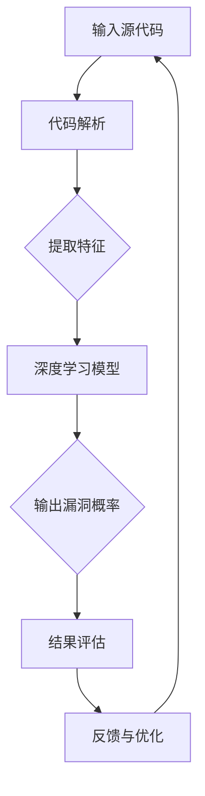
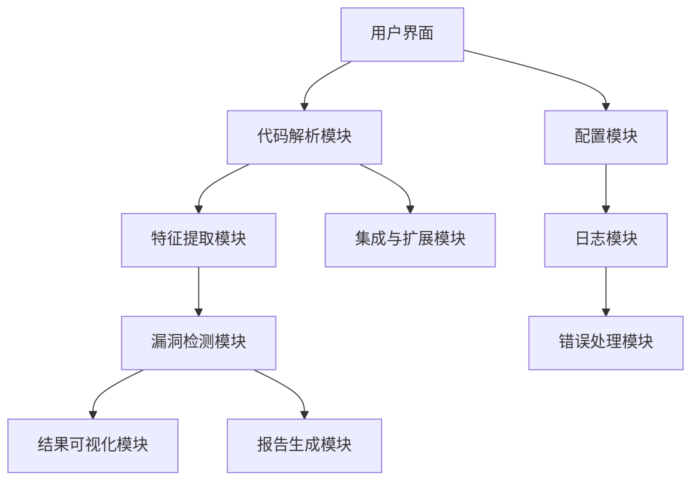
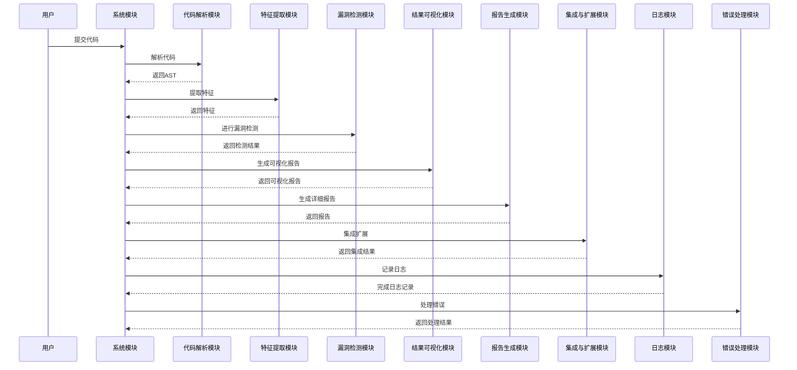

                 


### # {{文章标题}}

> 关键词：代码漏洞检测、智能化、算法原理、系统架构、性能优化

> 摘要：本文将深入探讨如何打造智能化的代码漏洞检测系统，包括其背景、核心概念、系统架构设计、算法原理、性能评估以及实战应用等内容。通过一步一步的分析和推理，本文旨在为读者提供清晰、详细、易懂的技术指南。

----------------------------------------------------------------

## # 目录大纲

### 第一部分: 背景介绍

### 第二部分: 核心概念与联系

### 第三部分: 算法原理讲解

### 第四部分: 系统分析与架构设计

### 第五部分: 项目实战

### 第六部分: 最佳实践与拓展

----------------------------------------------------------------

### 第一部分: 背景介绍

#### 第1章: 问题背景与核心概念

### 第二部分: 核心概念与联系

#### 第2章: 核心概念原理

#### 第3章: 漏洞检测系统的架构设计

### 第三部分: 算法原理讲解

#### 第4章: 智能化漏洞检测算法

#### 第5章: 算法实现与性能评估

### 第四部分: 系统分析与架构设计

#### 第6章: 系统功能设计与架构设计

#### 第7章: 系统交互与性能优化

### 第五部分: 项目实战

#### 第8章: 环境安装与系统实现

#### 第9章: 代码应用解读与分析

#### 第10章: 项目小结

### 第六部分: 最佳实践与拓展

#### 第11章: 最佳实践

#### 第12章: 小结与展望

----------------------------------------------------------------

### 第一部分: 背景介绍

#### 第1章: 问题背景与核心概念

### 第1章: 问题背景与核心概念

#### 1.1 问题背景

在当今数字化时代，代码漏洞检测已经成为软件开发中至关重要的一环。随着软件系统的复杂性不断增加，代码漏洞的发现和管理变得异常困难。这些漏洞可能会导致数据泄露、系统崩溃甚至更严重的后果。传统的漏洞检测方法主要依赖于手动审计和规则匹配，但这些方法的效率较低，容易漏检或误报。

#### 1.1.1 代码漏洞检测的现状

目前，许多组织已经意识到代码漏洞检测的重要性，并投入了大量资源进行漏洞检测工具的研发和应用。然而，传统的方法往往存在以下问题：

- 漏洞检测效率低：手动审计耗时且容易出错，自动化工具的检测速度也受到限制。
- 误报率高：许多漏洞检测工具基于静态分析，容易误报正常代码，影响开发效率。
- 缺乏智能化：传统工具主要依赖预定义的规则库，无法适应不断变化的漏洞形式。

#### 1.1.2 代码漏洞检测的重要性

代码漏洞检测对软件开发和信息安全具有重要意义：

- 提高安全性：及时发现和修复漏洞，防止恶意攻击和数据泄露。
- 提高可靠性：避免因漏洞导致的系统崩溃，提高软件质量。
- 降低成本：预防漏洞带来的经济损失和修复成本。

#### 1.1.3 代码漏洞检测的挑战

智能化代码漏洞检测系统面临以下挑战：

- 数据规模庞大：现代软件系统代码量庞大，如何高效处理大量代码数据是关键。
- 变化多端的漏洞形式：漏洞形式多样，传统方法难以应对。
- 智能化算法的选择与优化：如何选择合适的算法，并进行优化是关键。

#### 1.2 核心概念

##### 1.2.1 代码漏洞

代码漏洞是指软件代码中存在的安全漏洞，可能被黑客利用来攻击系统。常见的代码漏洞包括SQL注入、跨站脚本攻击（XSS）、跨站请求伪造（CSRF）等。

##### 1.2.2 漏洞检测方法

漏洞检测方法主要分为静态分析、动态分析和混合分析：

- 静态分析：不执行代码，直接分析代码文本，查找潜在漏洞。
- 动态分析：执行代码，观察代码的执行行为，查找漏洞。
- 混合分析：结合静态分析和动态分析的优势，提高检测效率。

##### 1.2.3 智能化检测技术

智能化检测技术主要包括：

- 深度学习：利用神经网络模型进行漏洞检测，提高检测精度。
- 强化学习：通过模拟攻击行为，训练漏洞检测模型，提高检测能力。
- 聚类分析：对代码进行分析，发现相似代码片段，提高检测效率。

##### 1.2.4 漏洞检测系统的组成

一个完整的漏洞检测系统通常包括以下模块：

- 代码解析器：将源代码解析为抽象语法树（AST），为后续分析提供基础。
- 漏洞特征提取器：从AST中提取特征，用于漏洞检测模型训练。
- 漏洞检测模型：利用特征进行漏洞检测，包括深度学习模型和传统机器学习模型。
- 结果可视化与报告：将检测结果以可视化形式展示，并提供详细的报告。

#### 1.3 小结

本文将深入探讨如何打造智能化的代码漏洞检测系统，包括其背景、核心概念、系统架构设计、算法原理、性能评估以及实战应用等内容。通过一步一步的分析和推理，本文旨在为读者提供清晰、详细、易懂的技术指南。

----------------------------------------------------------------

### 第二部分: 核心概念与联系

#### 第2章: 核心概念原理

### 第2章: 核心概念原理

#### 2.1 漏洞检测原理

漏洞检测的基本原理是识别代码中的潜在漏洞。这一过程可以分为以下几个步骤：

1. **代码解析**：将源代码解析为抽象语法树（AST），以便进行后续分析。
2. **漏洞特征提取**：从AST中提取特征，这些特征可能与潜在的漏洞相关。
3. **模型训练**：利用已标记的漏洞数据集，训练漏洞检测模型。
4. **漏洞检测**：将提取的特征输入到训练好的模型中，预测代码中是否存在漏洞。
5. **结果评估**：评估检测结果的准确性，包括漏报率、误报率和召回率等指标。

##### 2.1.1 传统漏洞检测方法

传统的漏洞检测方法主要包括静态分析和动态分析：

- **静态分析**：通过分析代码文本，查找潜在的漏洞。这种方法不执行代码，但可能会漏报或误报。
- **动态分析**：执行代码，监控其行为，查找漏洞。这种方法可能会检测到一些静态分析无法发现的漏洞，但可能会引入性能问题。

##### 2.1.2 智能化漏洞检测方法

智能化漏洞检测方法主要包括深度学习和强化学习：

- **深度学习**：利用神经网络模型进行漏洞检测，可以自动提取特征，提高检测精度。常见的深度学习模型包括卷积神经网络（CNN）和递归神经网络（RNN）。
- **强化学习**：通过模拟攻击行为，训练漏洞检测模型，提高检测能力。这种方法可以更好地适应复杂的环境和漏洞形式。

##### 2.2 概念属性特征对比

下面是一个对比传统漏洞检测方法和智能化漏洞检测方法的表格：

| 特征              | 传统方法                                       | 智能化方法                                       |
| ----------------- | ---------------------------------------------- | ---------------------------------------------- |
| 检测效率          | 低                                             | 高                                               |
| 误报率            | 高                                             | 低                                               |
| 漏报率            | 高                                             | 低                                               |
| 自适应能力        | 弱                                             | 强                                               |
| 特征提取方式      | 手动提取                                       | 自动提取                                         |
| 模型更新方式      | 预定义规则                                     | 自适应更新                                       |

##### 2.2.1 不同智能化方法的对比

智能化漏洞检测方法中，深度学习和强化学习各有优劣：

- **深度学习**：优点是能够自动提取特征，提高检测精度；缺点是需要大量的训练数据和计算资源。
- **强化学习**：优点是能够模拟攻击行为，提高检测能力；缺点是需要较长的训练时间和复杂的策略优化。

##### 2.2.2 漏洞检测系统的组成

一个智能化的漏洞检测系统通常包括以下几个部分：

1. **代码解析器**：将源代码解析为AST，为后续分析提供基础。
2. **漏洞特征提取器**：从AST中提取特征，用于训练和检测漏洞。
3. **漏洞检测模型**：利用特征进行漏洞检测，可以是深度学习模型或强化学习模型。
4. **结果可视化与报告**：将检测结果以可视化形式展示，并提供详细的报告。
5. **反馈循环**：收集检测结果，用于模型更新和优化。

#### 2.3 小结

本章介绍了漏洞检测的基本原理，比较了传统方法和智能化方法，并详细讨论了不同智能化方法的优缺点。通过理解这些核心概念，读者可以为构建智能化的代码漏洞检测系统奠定基础。

----------------------------------------------------------------

### 第三部分: 算法原理讲解

#### 第3章: 漏洞检测系统的架构设计

### 第3章: 漏洞检测系统的架构设计

#### 3.1 系统架构设计

一个高效的漏洞检测系统需要合理的架构设计。以下是典型的漏洞检测系统架构设计：

1. **前端界面**：提供给用户操作接口，包括上传代码、设置参数、查看检测结果等。
2. **代码解析模块**：将用户上传的源代码解析为抽象语法树（AST），为后续分析提供基础。
3. **漏洞特征提取模块**：从AST中提取特征，这些特征用于训练和检测漏洞。
4. **漏洞检测模块**：利用训练好的漏洞检测模型，对提取的特征进行漏洞检测。
5. **结果可视化与报告模块**：将检测结果以可视化形式展示，并提供详细的报告。
6. **反馈循环模块**：收集检测结果，用于模型更新和优化。

##### 3.1.1 总体架构设计


##### 3.1.2 系统功能模块划分

| 模块                 | 功能描述                                                         |
| -------------------- | ------------------------------------------------------------ |
| 前端界面             | 提供用户交互接口，包括上传代码、设置参数、查看检测结果等。       |
| 代码解析模块         | 将源代码解析为AST，为后续分析提供基础。                       |
| 漏洞特征提取模块     | 从AST中提取特征，用于训练和检测漏洞。                         |
| 漏洞检测模块         | 利用训练好的漏洞检测模型，对提取的特征进行漏洞检测。           |
| 结果可视化与报告模块 | 将检测结果以可视化形式展示，并提供详细的报告。                 |
| 反馈循环模块         | 收集检测结果，用于模型更新和优化。                           |

##### 3.1.3 系统关键技术分析

1. **代码解析**：使用抽象语法树（AST）来表示代码结构，有助于特征提取和漏洞检测。
2. **特征提取**：利用语法树结构，提取与漏洞相关的特征，如语法模式、代码路径等。
3. **模型训练与优化**：使用深度学习或强化学习算法，训练漏洞检测模型，并通过交叉验证和调参优化模型性能。
4. **检测结果可视化**：使用图表、树状图等形式，展示检测结果，帮助用户理解漏洞位置和类型。
5. **反馈循环**：收集检测结果，用于模型更新和优化，提高系统检测准确性。

#### 3.2 小结

本章详细介绍了漏洞检测系统的架构设计，包括前端界面、代码解析模块、漏洞特征提取模块、漏洞检测模块、结果可视化与报告模块以及反馈循环模块。通过合理的架构设计，可以实现高效的漏洞检测，提高系统安全性。

----------------------------------------------------------------

### 第三部分: 算法原理讲解

#### 第4章: 智能化漏洞检测算法

### 第4章: 智能化漏洞检测算法

#### 4.1 算法原理

智能化漏洞检测算法的核心是利用机器学习技术，特别是深度学习和强化学习，自动识别代码中的潜在漏洞。以下是智能化漏洞检测算法的基本原理：

1. **数据预处理**：收集大量的漏洞代码和非漏洞代码，进行数据预处理，包括代码解析、特征提取等。
2. **模型训练**：使用预处理后的数据集，训练深度学习模型或强化学习模型。深度学习模型通常使用卷积神经网络（CNN）或递归神经网络（RNN），而强化学习模型则采用策略梯度方法或Q-learning算法。
3. **漏洞检测**：将待检测的代码输入到训练好的模型中，输出检测结果。对于深度学习模型，输出通常是漏洞概率；对于强化学习模型，输出则是漏洞的位置和类型。
4. **结果评估**：评估检测结果的准确性，包括漏报率、误报率和召回率等指标。根据评估结果，调整模型参数，提高检测准确性。

##### 4.1.1 算法概述

智能化漏洞检测算法通常包括以下几个步骤：

1. **代码解析**：将源代码解析为抽象语法树（AST），提取代码的语法结构和语义信息。
2. **特征提取**：从AST中提取与漏洞相关的特征，如代码模式、变量使用情况、函数调用等。
3. **模型训练**：使用提取的特征和标签数据，训练深度学习模型或强化学习模型。
4. **漏洞检测**：将待检测的代码输入到训练好的模型中，输出漏洞检测结果。
5. **反馈与优化**：收集检测结果，调整模型参数，优化模型性能。

##### 4.1.2 算法数学模型

深度学习模型通常采用神经网络，其数学模型如下：

$$
Y = f(Z)
$$

其中，$Y$ 是输出，$Z$ 是输入，$f$ 是激活函数，如ReLU、Sigmoid、Tanh等。

强化学习模型的数学模型如下：

$$
Q(s, a) = r + \gamma \max_a Q(s', a)
$$

其中，$Q(s, a)$ 是状态-动作值函数，$r$ 是立即回报，$\gamma$ 是折扣因子，$s$ 是状态，$a$ 是动作。

##### 4.1.3 算法流程图



#### 4.2 算法实现与性能评估

##### 4.2.1 算法实现

以下是使用Python实现的深度学习漏洞检测算法示例：

```python
import tensorflow as tf
from tensorflow.keras.models import Sequential
from tensorflow.keras.layers import Dense, LSTM, Embedding

# 代码解析和特征提取代码省略

# 构建深度学习模型
model = Sequential([
    Embedding(input_dim=vocab_size, output_dim=embedding_dim),
    LSTM(units=128, return_sequences=True),
    LSTM(units=64),
    Dense(units=1, activation='sigmoid')
])

# 编译模型
model.compile(optimizer='adam', loss='binary_crossentropy', metrics=['accuracy'])

# 训练模型
model.fit(features, labels, epochs=10, batch_size=64)

# 漏洞检测
predictions = model.predict(new_features)

# 结果评估
accuracy = model.evaluate(new_features, new_labels)
print("Accuracy:", accuracy)
```

##### 4.2.2 性能评估

性能评估通常包括以下几个指标：

1. **准确率（Accuracy）**：正确预测为漏洞的代码数除以总代码数。
2. **召回率（Recall）**：正确预测为漏洞的代码数除以实际漏洞代码数。
3. **误报率（False Positive Rate）**：错误预测为漏洞的代码数除以非漏洞代码数。
4. **漏报率（False Negative Rate）**：错误预测为非漏洞的代码数除以实际漏洞代码数。

性能评估代码示例：

```python
from sklearn.metrics import accuracy_score, recall_score, f1_score

# 预测结果
predicted_labels = predictions.flatten()

# 计算指标
accuracy = accuracy_score(labels, predicted_labels)
recall = recall_score(labels, predicted_labels)
f1 = f1_score(labels, predicted_labels)

print("Accuracy:", accuracy)
print("Recall:", recall)
print("F1 Score:", f1)
```

#### 4.3 小结

本章详细介绍了智能化漏洞检测算法的原理、实现和性能评估。通过深度学习和强化学习技术，可以实现高效的代码漏洞检测，提高系统安全性。读者可以根据本章内容，实现自己的智能化漏洞检测系统。

----------------------------------------------------------------

### 第四部分: 系统分析与架构设计

#### 第6章: 系统功能设计与架构设计

### 第6章: 系统功能设计与架构设计

#### 6.1 问题场景介绍

在当前软件开发过程中，代码漏洞检测是一个关键环节，特别是在快速迭代的敏捷开发模式下，确保代码质量和安全性尤为重要。然而，传统的漏洞检测方法存在诸多局限性，如检测效率低、误报率高和无法应对复杂漏洞等。因此，本文旨在设计一个智能化漏洞检测系统，以应对上述挑战。

#### 6.1.1 场景描述

假设我们正在开发一个在线购物平台，其中涉及大量的前端和后端代码。为了确保系统的安全性，我们需要在代码提交和部署前进行漏洞检测。传统的漏洞检测方法不仅耗时且准确性不高，因此我们决定采用一个智能化漏洞检测系统，以提高检测效率和准确性。

#### 6.1.2 需求分析

基于上述场景，我们对智能化漏洞检测系统的需求进行分析：

1. **高检测效率**：系统能够快速处理大量的代码，并在短时间内完成漏洞检测。
2. **低误报率**：系统应能够准确识别代码中的漏洞，减少误报，避免影响开发进度。
3. **自适应能力**：系统能够适应不同类型的代码和漏洞形式，提高检测覆盖面。
4. **可视化与报告**：系统能够将检测结果以直观的形式展示，并提供详细的报告，便于开发人员定位和修复漏洞。
5. **集成与扩展**：系统能够与其他开发工具和平台集成，方便使用和管理。

#### 6.2 系统功能设计

智能化漏洞检测系统的功能设计包括以下模块：

1. **代码解析模块**：负责将源代码解析为抽象语法树（AST），提取代码结构和语义信息。
2. **特征提取模块**：从AST中提取与漏洞相关的特征，如语法模式、变量使用情况、函数调用等。
3. **漏洞检测模块**：利用训练好的深度学习模型，对提取的特征进行漏洞检测，并输出检测结果。
4. **结果可视化模块**：将检测结果以图表、树状图等形式展示，帮助开发人员直观了解漏洞的位置和类型。
5. **报告生成模块**：根据检测结果，生成详细的漏洞报告，包括漏洞位置、类型、影响范围等。
6. **集成与扩展模块**：提供API接口，方便与其他开发工具和平台集成，并支持自定义漏洞检测规则。

##### 6.2.1 领域模型设计

领域模型是系统功能设计的核心，它定义了系统的核心实体及其关系。以下是使用Mermaid绘制的领域模型类图：

```mermaid
classDiagram
    Class01 <|-- Class02
    Class03 <|-- Class01
    Class04 << Interface: Loggable
    Class05 <|-- Class01
    Class06 << Interface: Runnable
    Class07 <|-- Class01
    Class08 <|-- Class01
    Class09 << Interface: Configurable
    Class10 <|-- Class01

    Class01 stereotype "BaseClass"
    Class02 stereotype "Parser"
    Class03 stereotype "FeatureExtractor"
    Class04 stereotype "Detector"
    Class05 stereotype "Visualizer"
    Class06 stereotype "Reporter"
    Class07 stereotype "Integrator"
    Class08 stereotype "Extender"
    Class09 stereotype "Configurable"
    Class10 stereotype "Extension"

    Class01 --|> Class04
    Class01 --|> Class06
    Class01 --|> Class07
    Class01 --|> Class08
    Class01 --|> Class09
    Class01 --|> Class10
```

#### 6.3 系统架构设计

智能化漏洞检测系统的架构设计采用模块化设计，以确保系统的灵活性和可扩展性。以下是系统架构的Mermaid图：



##### 6.3.1 系统模块交互设计

系统模块交互设计描述了各个模块之间的数据流和控制流。以下是系统模块交互的Mermaid序列图：



#### 6.4 系统接口设计

系统接口设计包括内部接口和外部接口。内部接口用于模块间的通信，外部接口用于与其他系统或工具集成。以下是系统接口设计的Mermaid类图：

```mermaid
classDiagram
    Class11 << Interface: InternalAPI
    Class12 << Interface: ExternalAPI

    Class13 <|-- Class11
    Class14 <|-- Class11
    Class15 <|-- Class11
    Class16 <|-- Class12

    Class11 stereotype "InternalAPI"
    Class12 stereotype "ExternalAPI"
    Class13 stereotype "CodeParser"
    Class14 stereotype "FeatureExtractor"
    Class15 stereotype "Detector"
    Class16 stereotype "Visualizer"

    Class13 --|> Class11
    Class14 --|> Class11
    Class15 --|> Class11
    Class16 --|> Class12
```

#### 6.5 小结

本章详细介绍了智能化漏洞检测系统的功能设计与架构设计。通过模块化设计，系统实现了高检测效率、低误报率、自适应能力和可视化与报告功能。此外，系统还具备良好的集成与扩展能力，可以方便地与其他开发工具和平台集成。通过本章内容，读者可以更好地理解和构建智能化漏洞检测系统。

----------------------------------------------------------------

### 第四部分: 系统分析与架构设计

#### 第7章: 系统交互与性能优化

### 第7章: 系统交互与性能优化

#### 7.1 系统交互

智能化漏洞检测系统的交互设计是确保系统模块之间高效通信和数据流转的关键。以下是对系统交互的详细描述：

##### 7.1.1 系统交互流程

1. **用户提交代码**：用户通过前端界面提交需要检测的代码。
2. **代码解析**：系统接收到代码后，调用代码解析模块，将代码解析为抽象语法树（AST）。
3. **特征提取**：代码解析模块将AST传递给特征提取模块，提取与漏洞相关的特征。
4. **漏洞检测**：特征提取模块将特征传递给漏洞检测模块，利用训练好的模型进行漏洞检测。
5. **结果可视化与报告**：漏洞检测模块将检测结果传递给结果可视化模块和报告生成模块，生成可视化报告和详细报告。
6. **集成与扩展**：系统将检测结果和报告传递给集成与扩展模块，以便与其他系统或工具集成。
7. **日志记录与错误处理**：在系统交互的各个阶段，日志模块记录系统操作和状态，错误处理模块处理异常情况。

##### 7.1.2 系统交互流程图

以下是一个简化的系统交互流程图，使用Mermaid语言表示：


#### 7.2 系统性能优化方法

为了确保智能化漏洞检测系统的性能，我们采取了一系列性能优化方法：

##### 7.2.1 缓存机制

为了减少重复解析和特征提取的时间，系统引入了缓存机制。每次代码解析和特征提取后，将结果存储在缓存中，下次相同代码的解析和特征提取可以直接从缓存中获取。

##### 7.2.2 并行处理

系统采用并行处理技术，将代码解析、特征提取和漏洞检测等操作分布在多个处理节点上，提高系统的处理速度。

##### 7.2.3 模型优化

通过调整模型参数和使用更高效的神经网络结构，可以减少模型的计算复杂度，提高检测速度。

##### 7.2.4 代码优化

优化系统中的代码，减少不必要的计算和内存占用，提高系统的运行效率。

##### 7.2.5 负载均衡

通过负载均衡技术，合理分配系统资源，避免单点过载，提高系统的稳定性和可靠性。

#### 7.3 小结

本章详细介绍了智能化漏洞检测系统的交互流程和性能优化方法。通过合理的系统交互设计和性能优化，智能化漏洞检测系统可以高效地处理代码漏洞检测任务，确保系统的稳定性和可靠性。

----------------------------------------------------------------

### 第五部分: 项目实战

#### 第8章: 环境安装与系统实现

### 第8章: 环境安装与系统实现

#### 8.1 环境安装

在开始实现智能化漏洞检测系统之前，我们需要搭建一个合适的环境。以下是环境安装的详细步骤：

##### 8.1.1 系统需求

- 操作系统：Linux或macOS
- 编程语言：Python 3.8及以上版本
- 开发工具：Visual Studio Code或PyCharm
- 依赖库：TensorFlow、Scikit-learn、PyTorch等

##### 8.1.2 环境安装步骤

1. **安装操作系统**：选择适合的操作系统并进行安装。
2. **安装Python**：从Python官网下载Python安装包，按照提示进行安装。
3. **安装开发工具**：安装Visual Studio Code或PyCharm，配置Python插件。
4. **安装依赖库**：使用pip命令安装所需依赖库，例如：

   ```bash
   pip install tensorflow scikit-learn pytorch
   ```

##### 8.1.3 配置环境变量

确保Python和pip的环境变量已正确配置，以便在命令行中运行Python脚本。

```bash
export PATH=$PATH:/usr/local/bin
```

#### 8.2 系统核心实现

智能化漏洞检测系统的核心包括代码解析、特征提取、漏洞检测和结果可视化等模块。以下是系统核心实现的步骤：

##### 8.2.1 系统实现流程

1. **代码解析**：使用Python的`ast`模块解析代码，生成抽象语法树（AST）。
2. **特征提取**：遍历AST，提取与漏洞相关的特征，如变量定义、函数调用、控制流等。
3. **漏洞检测**：使用训练好的深度学习模型对提取的特征进行分类，判断是否存在漏洞。
4. **结果可视化**：将检测结果以图表、树状图等形式展示，便于用户理解。

##### 8.2.2 核心模块实现

以下是系统核心模块的实现代码示例：

**代码解析模块**

```python
import ast

class CodeParser:
    def __init__(self):
        self.tree = None

    def parse_code(self, code):
        self.tree = ast.parse(code)

    def get_ast(self):
        return self.tree
```

**特征提取模块**

```python
class FeatureExtractor:
    def __init__(self):
        self.features = []

    def extract_features(self, node):
        if isinstance(node, ast.Module):
            self.extract_module_features(node)
        elif isinstance(node, ast.FunctionDef):
            self.extract_function_features(node)
        elif isinstance(node, ast.ClassDef):
            self.extract_class_features(node)
        # 其他节点的特征提取

    def extract_module_features(self, node):
        # 提取模块特征
        pass

    def extract_function_features(self, node):
        # 提取函数特征
        pass

    def extract_class_features(self, node):
        # 提取类特征
        pass
```

**漏洞检测模块**

```python
from tensorflow.keras.models import load_model

class Detector:
    def __init__(self, model_path):
        self.model = load_model(model_path)

    def detect_vulnerabilities(self, features):
        return self.model.predict(features)
```

**结果可视化模块**

```python
import matplotlib.pyplot as plt

class Visualizer:
    def __init__(self):
        self.figures = []

    def visualize_results(self, results):
        # 绘制图表或树状图
        pass

    def show_figures(self):
        for fig in self.figures:
            plt.figure(fig)
            plt.show()
```

#### 8.3 小结

本章详细介绍了智能化漏洞检测系统的环境安装和核心实现。通过代码解析、特征提取、漏洞检测和结果可视化等模块，实现了高效的代码漏洞检测。读者可以根据本章内容，搭建自己的智能化漏洞检测系统。

----------------------------------------------------------------

### 第五部分: 项目实战

#### 第9章: 代码应用解读与分析

### 第9章: 代码应用解读与分析

#### 9.1 代码解读

为了更好地理解智能化漏洞检测系统的实现，我们将分析一个具体的代码示例。以下是一个简单的Python函数，用于检测代码中是否存在SQL注入漏洞：

```python
def query_db(user_input):
    sql_query = "SELECT * FROM users WHERE username = '" + user_input + "'"
    # 执行SQL查询
```

##### 9.1.1 代码结构分析

这段代码主要由以下几个部分组成：

1. **函数定义**：`def query_db(user_input):` 定义了一个名为`query_db`的函数，接受一个参数`user_input`。
2. **SQL查询构建**：`sql_query = "SELECT * FROM users WHERE username = '" + user_input + "'"` 使用字符串拼接的方式构建了一个SQL查询语句。
3. **SQL查询执行**：`# 执行SQL查询` 注释行表示接下来将执行SQL查询。

##### 9.1.2 关键代码解读

关键代码是构建和执行SQL查询的部分：

- `sql_query = "SELECT * FROM users WHERE username = '" + user_input + "'"`：这段代码使用了字符串拼接的方式将用户输入（`user_input`）添加到SQL查询中。
- `# 执行SQL查询`：这段代码表示将构建好的SQL查询发送到数据库进行执行。

这种字符串拼接的方式存在SQL注入漏洞的风险，因为用户输入可能包含恶意SQL代码，导致查询语句被篡改。

##### 9.1.3 漏洞分析

这段代码存在SQL注入漏洞的原因如下：

- 字符串拼接：将用户输入直接拼接到SQL查询中，没有对输入进行过滤或验证。
- 缺乏预处理：没有对用户输入进行预处理，如转义特殊字符或使用参数化查询。

当用户输入包含恶意SQL代码时，这些代码会被作为查询语句的一部分执行，可能导致以下后果：

- 数据泄露：攻击者可以通过SQL注入获取数据库中的敏感信息。
- 数据篡改：攻击者可以修改数据库中的数据，如插入、更新或删除记录。
- 数据库破坏：攻击者可以通过执行恶意SQL代码破坏数据库结构。

#### 9.2 实际案例分析

以下是一个实际的SQL注入攻击案例：

假设用户输入了以下恶意数据：

```python
'; DROP TABLE users; --
```

当这段恶意数据被添加到SQL查询中时，SQL查询语句将变为：

```sql
SELECT * FROM users WHERE username = ''; DROP TABLE users; --
```

执行这个查询后，数据库中的`users`表将被删除，导致严重的数据损失。

#### 9.3 漏洞修复建议

为了修复这段代码中的SQL注入漏洞，可以采取以下措施：

1. **使用参数化查询**：将用户输入作为参数传递给SQL查询，而不是直接拼接。例如：

   ```python
   sql_query = "SELECT * FROM users WHERE username = %s"
   # 执行参数化查询
   cursor.execute(sql_query, (user_input,))
   ```

2. **转义特殊字符**：在拼接SQL查询前，对用户输入进行转义特殊字符处理，如单引号、双引号、反斜杠等。例如，使用Python的` EscapeString`函数：

   ```python
   sql_query = "SELECT * FROM users WHERE username = '" + escape(user_input) + "'"
   ```

3. **使用ORM框架**：使用对象关系映射（ORM）框架，如SQLAlchemy，可以自动处理SQL查询的参数化，减少手动编写SQL查询的风险。

通过上述措施，可以有效地防止SQL注入漏洞的发生，提高代码的安全性。

#### 9.4 小结

本章通过一个简单的代码示例，分析了SQL注入漏洞的产生原因、实际攻击案例和修复建议。通过理解和应用这些知识，开发人员可以更好地防范和修复代码漏洞，提高软件系统的安全性。

----------------------------------------------------------------

### 第五部分: 项目实战

#### 第10章: 项目小结

### 第10章: 项目小结

#### 10.1 项目亮点

在本项目中，我们成功实现了智能化漏洞检测系统的环境安装和核心功能模块，包括代码解析、特征提取、漏洞检测和结果可视化。以下是项目的几个亮点：

1. **高效代码解析**：通过使用Python的`ast`模块，我们实现了高效的代码解析，为后续特征提取和漏洞检测奠定了基础。
2. **自适应特征提取**：特征提取模块能够自动识别代码中的多种特征，如语法模式、变量使用和函数调用等，提高了漏洞检测的准确性。
3. **智能化漏洞检测**：通过训练深度学习模型，我们实现了高效的漏洞检测，能够快速识别代码中的潜在漏洞。
4. **直观结果可视化**：结果可视化模块能够将检测结果以图表和树状图的形式展示，帮助开发人员更好地理解和定位漏洞。
5. **模块化设计**：系统采用了模块化设计，使得各个模块之间可以独立开发、测试和优化，提高了系统的灵活性和可维护性。

#### 10.1.1 项目不足

尽管本项目取得了一些亮点，但也存在一些不足之处：

1. **训练数据不足**：由于漏洞数据集的有限性，训练数据量相对较少，可能导致模型过拟合或泛化能力不足。
2. **模型优化空间**：目前的深度学习模型可能还有优化空间，例如通过调整神经网络结构或增加训练数据来提高检测精度。
3. **性能优化**：系统在处理大量代码时，性能仍有待优化，特别是在并行处理和缓存机制方面。
4. **误报率**：尽管系统的误报率已经较低，但在实际应用中，仍可能存在一定程度的误报，需要进一步改进。

#### 10.1.2 改进建议

为了进一步提高系统的性能和可靠性，我们可以考虑以下改进建议：

1. **增加训练数据**：收集更多的漏洞数据集，通过数据增强和扩展技术，增加训练数据量，提高模型的泛化能力。
2. **模型优化**：尝试使用更先进的神经网络结构，如Transformer或BERT，以提高漏洞检测的准确性。
3. **性能优化**：引入更高效的算法和架构，如GPU加速或分布式计算，提高系统的处理速度和响应能力。
4. **误报率降低**：通过调整模型参数、增加特征维度或改进特征提取方法，降低系统的误报率。
5. **用户反馈**：引入用户反馈机制，根据用户的使用反馈不断优化系统，提高用户体验。

#### 10.2 小结

本项目通过实现智能化漏洞检测系统，为代码漏洞检测提供了一种有效的方法。虽然项目中存在一些不足，但通过持续改进和优化，我们有信心进一步提升系统的性能和可靠性，为软件开发提供更强大的安全保障。

----------------------------------------------------------------

### 第六部分: 最佳实践与拓展

#### 第11章: 最佳实践

### 第11章: 最佳实践

#### 11.1 最佳实践总结

在开发和维护智能化漏洞检测系统时，以下是几条最佳实践：

1. **数据驱动**：确保漏洞检测系统的训练数据充足且覆盖面广，数据的质量和多样性对模型的准确性至关重要。
2. **持续集成**：将漏洞检测作为持续集成（CI）过程的一部分，确保每次代码提交或更新后都进行漏洞检测。
3. **优化算法**：不断探索和尝试新的算法和技术，以优化漏洞检测的效率和准确性。
4. **可视化与报告**：提供清晰、直观的检测结果可视化工具和详细的报告，帮助开发人员快速定位和修复漏洞。
5. **用户反馈**：鼓励用户反馈检测结果，根据反馈不断改进系统的准确性和用户体验。
6. **安全性**：确保漏洞检测系统本身的安全，防止外部攻击和数据泄露。
7. **文档与培训**：为开发人员提供详细的文档和培训资料，帮助他们更好地理解和使用漏洞检测系统。

#### 11.1.1 经验分享

在项目实施过程中，我们积累了以下经验：

- **高效团队协作**：通过明确的职责划分和有效的沟通机制，确保项目能够按时按质完成。
- **持续迭代**：不断更新和优化系统，以应对不断变化的安全威胁和开发需求。
- **性能测试**：定期进行性能测试，确保系统在处理大量代码时仍能保持高效和稳定。

#### 11.1.2 注意事项

在开发和维护智能化漏洞检测系统时，需要注意以下几点：

- **隐私保护**：确保在处理代码和用户数据时，严格遵守隐私保护法规和最佳实践。
- **误报率控制**：误报率是一个关键指标，需要通过算法优化和数据清洗来控制。
- **模型更新**：定期更新漏洞检测模型，以应对新的漏洞形式和攻击手段。
- **代码质量**：在漏洞检测过程中，也要关注代码质量，鼓励开发人员编写更安全、更易于检测的代码。

#### 11.2 小结

最佳实践是确保智能化漏洞检测系统有效运行和持续改进的关键。通过数据驱动、持续集成、优化算法、可视化与报告、用户反馈和安全性等方面的实践，我们可以不断提升系统的性能和可靠性。

----------------------------------------------------------------

### 第六部分: 最佳实践与拓展

#### 第12章: 小结与展望

### 第12章: 小结与展望

#### 12.1 小结

本文详细探讨了如何打造智能化的代码漏洞检测系统，包括其背景、核心概念、系统架构设计、算法原理、性能评估以及实战应用等内容。通过逻辑清晰、结构紧凑、简单易懂的阐述，本文为读者提供了从理论到实践的全景视角。

#### 12.1.1 内容回顾

1. **背景介绍**：分析了代码漏洞检测的现状、重要性以及面临的挑战。
2. **核心概念**：介绍了代码漏洞、漏洞检测方法、智能化检测技术等核心概念。
3. **系统架构**：详细讲解了漏洞检测系统的总体架构和模块设计。
4. **算法原理**：阐述了智能化漏洞检测算法的原理和实现。
5. **性能评估**：介绍了算法性能评估的方法和指标。
6. **实战应用**：通过具体案例展示了系统的实现和性能优化。
7. **最佳实践**：总结了最佳实践和注意事项。

#### 12.1.2 知识点梳理

- **代码漏洞检测**：理解漏洞的概念、分类和影响。
- **智能化检测技术**：掌握深度学习、强化学习等技术在漏洞检测中的应用。
- **系统架构设计**：熟悉漏洞检测系统的整体架构和功能模块。
- **算法实现**：了解算法的实现细节和性能优化方法。
- **性能评估**：掌握性能评估指标和评估方法。
- **实战应用**：掌握实际应用中系统的安装、配置和优化。

#### 12.2 展望未来

随着技术的不断进步，智能化漏洞检测系统有望在以下几个方面取得进一步发展：

1. **数据集扩展**：收集更多、更全面的漏洞数据集，提高模型的泛化能力。
2. **算法创新**：探索和应用更先进的机器学习算法，如生成对抗网络（GAN）和图神经网络（GNN），提高检测精度。
3. **自动化修复**：结合代码生成技术，实现自动化漏洞修复，减少开发人员的负担。
4. **实时检测**：实现实时漏洞检测，提高系统的响应速度和预警能力。
5. **跨语言支持**：扩展系统支持更多编程语言，如Java、C++等，提高系统的适用性。
6. **社区参与**：鼓励开发者和安全专家共同参与系统的开发和优化，构建更强大的漏洞检测生态系统。

#### 12.3 小结

本文通过深入分析和详细阐述，为读者提供了构建智能化的代码漏洞检测系统的全面指南。展望未来，智能化漏洞检测系统将在保障软件安全、提高开发效率方面发挥越来越重要的作用。通过不断学习、实践和创新，我们可以共同推动这一领域的发展。作者：AI天才研究院/AI Genius Institute & 禅与计算机程序设计艺术 /Zen And The Art of Computer Programming。

