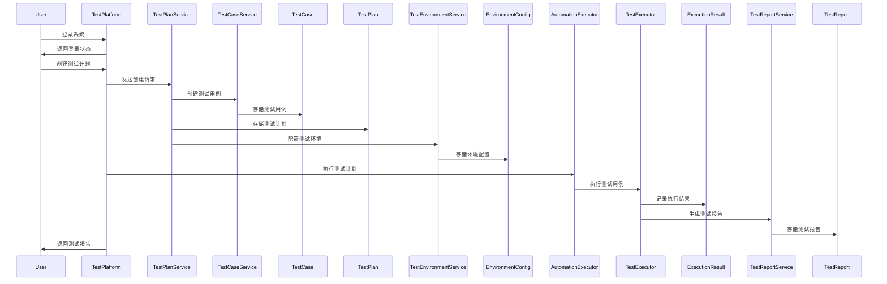
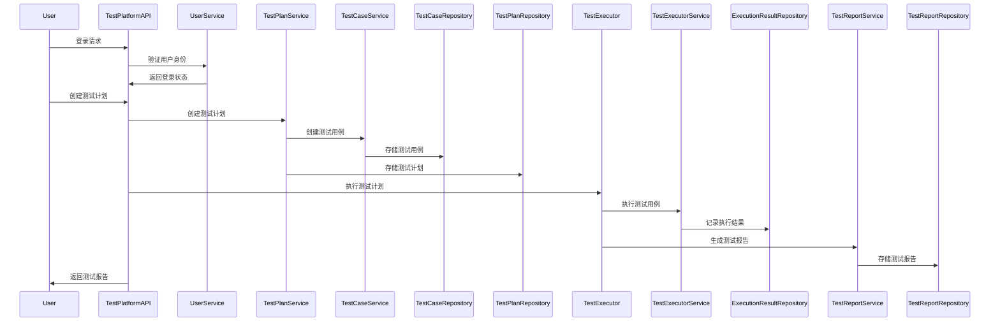

                 


### 前言

在当今软件开发的快节奏环境中，自动化测试已经成为提高软件质量和开发效率的关键手段。随着人工智能技术的发展，智能化测试逐渐成为自动化测试的新方向。本文旨在探讨如何打造智能化的自动化测试平台，以实现测试过程的自动化、智能化和高效化。

### 自动化测试概述

自动化测试是指使用自动化工具来执行测试脚本，以自动化地执行软件测试过程。自动化测试可以大大提高测试的效率和准确性，减少人工测试的时间和成本。

#### 自动化测试的定义与价值

自动化测试的定义：使用自动化测试工具执行测试脚本的过程。

自动化测试的价值：

1. **提高测试效率**：自动化测试可以快速执行大量测试用例，提高测试速度。
2. **提高测试准确性**：自动化测试可以减少人为错误，提高测试的准确性。
3. **节省人力资源**：自动化测试可以减少对人工测试的依赖，节省人力资源。

#### 自动化测试的发展历程

1. **早期自动化测试**：主要是通过编写测试脚本进行自动化测试。
2. **自动化测试工具的出现**：如QTP、Selenium等，使得自动化测试更加方便和高效。
3. **智能化自动化测试**：结合人工智能技术，实现自动化测试的智能化。

#### 自动化测试的类型与工具

自动化测试的类型：

1. **功能自动化测试**：模拟用户操作，验证软件功能是否符合预期。
2. **性能自动化测试**：模拟用户负载，验证软件性能指标是否符合要求。

常用自动化测试工具：

1. **QTP（QuickTest Professional）**：适用于功能自动化测试。
2. **Selenium**：适用于Web应用的自动化测试。
3. **JMeter**：适用于性能自动化测试。

### 智能化测试原理

智能化测试是指利用人工智能技术对自动化测试进行优化和提升。智能化测试可以自动分析测试数据，识别潜在问题，并提供改进建议。

#### 智能化测试的概念

智能化测试的概念：结合人工智能技术，实现自动化测试的智能化。

智能化测试的关键技术：

1. **机器学习**：用于分析测试数据，识别测试问题。
2. **自然语言处理**：用于理解和处理测试报告中的自然语言描述。
3. **数据挖掘**：用于挖掘测试数据中的潜在规律和问题。

#### 人工智能在自动化测试中的应用

人工智能在自动化测试中的应用：

1. **测试用例生成**：利用机器学习算法，根据历史测试数据自动生成新的测试用例。
2. **异常检测**：利用数据挖掘技术，检测测试过程中的异常行为。
3. **测试报告分析**：利用自然语言处理技术，自动分析测试报告，生成可视化图表。

#### 智能化测试的优势与挑战

智能化测试的优势：

1. **提高测试效率**：通过自动分析和处理测试数据，提高测试效率。
2. **提高测试质量**：通过智能化分析，发现更多潜在问题。
3. **降低人工成本**：减少对人工测试的依赖。

智能化测试的挑战：

1. **数据质量和多样性**：智能化测试依赖于高质量和多样化的测试数据。
2. **算法复杂性**：智能化测试算法复杂，需要大量的计算资源和时间。

### 测试平台技术选型

构建智能化测试平台需要选择合适的技术和工具。以下是一些常见的技术选型和工具推荐：

#### 测试平台的需求分析

1. **功能需求**：平台应具备自动化测试、测试用例管理、测试报告生成等功能。
2. **性能需求**：平台应能够处理大规模的测试数据，支持高并发的测试任务。
3. **可扩展性**：平台应具有良好的可扩展性，能够根据业务需求进行功能扩展。

#### 测试平台的技术选型

1. **开发语言**：Java、Python等
2. **数据库**：MySQL、MongoDB等
3. **测试框架**：Selenium、Appium等
4. **机器学习框架**：TensorFlow、PyTorch等

#### 常用自动化测试框架

1. **Selenium**：适用于Web应用的自动化测试。
2. **Appium**：适用于移动应用的自动化测试。
3. **JUnit**：适用于Java语言的单元测试。
4. **pytest**：适用于Python语言的单元测试。

接下来，我们将深入探讨测试平台的功能设计、实现与部署，以及智能化测试平台优化等方面的内容。

### 测试平台功能设计

测试平台的功能设计是构建智能化测试平台的核心环节，它决定了平台的易用性、效率和扩展性。以下章节将详细描述测试平台的主要功能模块及其设计要点。

#### 测试平台架构设计

测试平台架构设计是确保平台功能实现高效、可靠和可扩展的基础。以下是测试平台架构设计的关键模块和设计思路：

1. **模块划分**：
   - 测试用例管理模块
   - 自动化执行模块
   - 测试报告与分析模块
   - 数据库管理模块
   - 用户与权限管理模块

2. **架构设计**：
   - 客户端/服务器架构：客户端负责与用户交互，服务器端负责处理业务逻辑和数据存储。
   - 微服务架构：将测试平台的功能分解为多个微服务，如测试用例管理服务、自动化执行服务、报告分析服务等，便于模块化和扩展。

3. **接口设计**：
   - RESTful API：提供统一的接口标准，便于前后端分离开发。
   - 数据接口：设计标准化的数据接口，实现数据的无缝集成和共享。

#### 测试用例管理

测试用例管理是测试平台的核心功能之一，负责创建、管理、执行和跟踪测试用例。以下是测试用例管理的功能设计：

1. **测试用例设计**：
   - 提供图形化界面，支持多种测试用例设计方式，如线性脚本、关键字驱动、数据驱动等。
   - 支持测试用例的版本控制，便于跟踪历史变更。

2. **测试用例执行**：
   - 自动化执行测试用例，支持多线程并发执行。
   - 提供执行结果展示和断言功能，便于快速定位问题。

3. **测试用例跟踪**：
   - 记录测试用例的执行历史，包括执行结果、执行时间、执行环境等。
   - 提供测试用例的执行统计和分析功能，便于评估测试覆盖率。

#### 测试报告与分析

测试报告与分析功能负责生成详细的测试报告，并提供测试数据的可视化分析和报告。以下是该功能的详细设计：

1. **测试报告生成**：
   - 支持多种报告格式，如HTML、PDF、CSV等。
   - 提供自定义报告模板，满足不同业务需求。

2. **测试数据分析**：
   - 提供多维度的测试数据统计和分析功能，如通过率、失败率、执行时间分布等。
   - 支持数据可视化，便于快速发现问题和趋势。

3. **异常检测与预警**：
   - 利用机器学习算法，自动检测测试过程中的异常行为。
   - 提供异常预警机制，及时通知相关人员处理。

#### 数据库设计

数据库设计是测试平台数据管理和存储的基础。以下是数据库设计的关键要点：

1. **数据模型**：
   - 设计符合测试平台业务需求的实体关系模型，包括测试用例、测试报告、执行结果等实体。
   - 采用标准化设计，便于扩展和维护。

2. **数据库选型**：
   - 根据业务需求，选择合适的数据库系统，如MySQL、MongoDB等。
   - 考虑数据一致性、性能和扩展性。

3. **数据接口**：
   - 设计标准化的数据接口，实现与业务系统的无缝集成。

#### 用户与权限管理

用户与权限管理是测试平台安全性的重要保障。以下是用户与权限管理的功能设计：

1. **用户管理**：
   - 支持用户注册、登录、密码重置等基本功能。
   - 提供用户信息查询、编辑和删除功能。

2. **权限管理**：
   - 设计权限分级制度，支持不同角色的用户分配不同权限。
   - 提供权限变更记录和审计功能，确保系统安全。

通过上述功能设计，测试平台将能够高效、可靠地执行测试任务，并提供全面的数据分析和报告功能，助力企业提升软件质量和开发效率。

### 测试平台架构设计

在构建智能化测试平台时，架构设计至关重要。一个合理的架构不仅能够确保系统的稳定性和可靠性，还能够提高开发、测试和维护的效率。以下是测试平台架构设计的详细介绍。

#### 问题场景介绍

在现代软件开发过程中，随着软件复杂度的增加，测试工作变得尤为重要。测试平台需要能够高效地管理大量的测试用例，执行各类自动化测试任务，并生成详尽的测试报告。此外，随着智能化测试的普及，平台还需要具备数据分析和异常检测的能力。为了满足这些需求，我们需要设计一个灵活、可扩展、高效的测试平台架构。

#### 项目介绍

本项目旨在构建一个支持功能自动化测试、性能自动化测试以及智能化测试的综合性测试平台。平台将采用微服务架构，以实现高内聚、低耦合的设计，便于模块化和扩展。

#### 系统功能设计（领域模型）

领域模型是系统功能设计的核心，它描述了系统中的主要实体及其关系。以下是测试平台的主要领域模型：

1. **测试用例**：描述测试任务的细节，包括用例名称、测试步骤、预期结果等。
2. **测试计划**：定义一组测试用例的执行计划，包括执行顺序、执行环境等。
3. **执行结果**：记录测试用例执行后的结果，包括通过/失败、执行时间等。
4. **测试报告**：生成测试结果的总结报告，包括统计信息和可视化图表。
5. **用户**：平台用户，包括开发人员、测试人员等，拥有不同的权限。
6. **环境配置**：测试执行所需的环境配置信息，如操作系统、浏览器版本等。

以下是一个简化的Mermaid类图，用于展示领域模型：

```mermaid
classDiagram
    TestCase <<Entity>>
    TestPlan <<Entity>>
    ExecutionResult <<Entity>>
    TestReport <<Entity>>
    User <<Entity>>
    EnvironmentConfig <<Entity>>

    TestCase "包含" TestStep
    TestCase "属于" TestPlan
    TestPlan "包含" TestCase
    TestPlan "包含" ExecutionResult
    TestReport "包含" ExecutionResult
    User "创建" TestPlan
    User "创建" TestReport
    EnvironmentConfig "属于" TestPlan
```

#### 系统架构设计（Mermaid架构图）

系统架构设计需要清晰地展示各个模块之间的关系和交互。以下是测试平台的系统架构图：



#### 系统接口设计

系统接口设计是确保各个模块之间能够顺畅通信的重要环节。以下是测试平台的主要接口设计：

1. **用户接口**：负责与用户进行交互，包括登录、创建测试计划、查看测试报告等。
2. **测试用例接口**：负责管理测试用例的创建、编辑、执行和结果记录。
3. **测试计划接口**：负责管理测试计划的创建、执行和状态更新。
4. **执行结果接口**：负责记录和查询测试执行结果。
5. **测试报告接口**：负责生成和查询测试报告。

以下是接口设计的一个简化示例：

```mermaid
interface TestPlatformAPI {
    login(username: String, password: String): LoginResponse
    createTestPlan(testPlan: TestPlan): TestPlanResponse
    getTestPlans(): TestPlanListResponse
    executeTestPlan(testPlanId: String): ExecutionResponse
    getExecutionResults(testPlanId: String): ExecutionResultListResponse
    generateTestReport(testPlanId: String): TestReportResponse
}
```

#### 系统交互（Mermaid序列图）

系统交互设计展示了各个模块之间的协作流程。以下是测试平台的主要交互流程：



通过上述详细的系统架构设计，测试平台将能够高效、可靠地执行各类测试任务，并提供全面的数据分析和报告功能，助力企业提升软件质量和开发效率。

### 测试平台实现技术细节

在构建智能化测试平台时，实现技术细节至关重要。以下将详细介绍平台的核心技术实现，包括环境配置、测试脚本编写和测试数据管理。

#### 环境配置

环境配置是确保测试平台正常运行的基础。以下是环境配置的关键步骤：

1. **开发环境**：安装Java或Python开发环境，配置好相关的依赖库，如JUnit、pytest等。
2. **数据库**：选择合适的数据库系统，如MySQL或MongoDB，配置用户权限和数据表结构。
3. **自动化测试工具**：安装并配置Selenium、Appium等自动化测试工具，确保能够执行各类自动化测试任务。
4. **持续集成工具**：配置Jenkins或GitLab CI等持续集成工具，实现自动化测试任务的持续集成和部署。

以下是Python开发环境的安装步骤：

```bash
# 安装Python3
sudo apt-get install python3

# 安装虚拟环境管理工具
pip3 install virtualenv

# 创建虚拟环境
virtualenv test_platform_env

# 激活虚拟环境
source test_platform_env/bin/activate

# 安装依赖库
pip3 install -r requirements.txt
```

#### 测试脚本编写

测试脚本编写是自动化测试的核心。以下是测试脚本编写的基本步骤：

1. **设计测试用例**：根据测试需求设计测试用例，包括测试步骤、输入数据和预期结果。
2. **编写测试脚本**：使用自动化测试工具编写测试脚本，如Selenium编写Web测试脚本，Appium编写移动应用测试脚本。
3. **执行测试脚本**：运行测试脚本，验证测试用例是否通过。
4. **调试和优化**：根据测试结果调试和优化测试脚本。

以下是一个使用Selenium编写的Web测试脚本示例：

```python
from selenium import webdriver
from selenium.webdriver.common.by import By

# 初始化浏览器驱动
driver = webdriver.Chrome()

# 打开测试网页
driver.get("https://www.example.com")

# 查找网页元素并进行操作
element = driver.find_element(By.ID, "search_box")
element.send_keys("test")

# 提交表单并验证结果
submit_button = driver.find_element(By.ID, "submit_button")
submit_button.click()
result_element = driver.find_element(By.CLASS_NAME, "result")
assert "test" in result_element.text

# 关闭浏览器
driver.quit()
```

#### 测试数据管理

测试数据管理是确保测试平台数据完整性和准确性的重要环节。以下是测试数据管理的关键步骤：

1. **设计数据模型**：根据测试需求设计测试数据模型，包括测试数据表、字段和关系。
2. **数据存储**：选择合适的数据存储方案，如关系数据库或NoSQL数据库，实现测试数据的存储和管理。
3. **数据导入与导出**：提供数据导入和导出功能，支持CSV、JSON等格式，便于数据的迁移和共享。
4. **数据查询与分析**：提供数据查询和分析工具，支持多种查询条件和统计功能，便于测试数据的快速定位和分析。

以下是使用Python操作MySQL数据库的示例：

```python
import mysql.connector

# 连接数据库
conn = mysql.connector.connect(
    host="localhost",
    user="root",
    password="password",
    database="test_platform"
)

# 创建数据库表
cursor = conn.cursor()
cursor.execute("""
    CREATE TABLE IF NOT EXISTS test_cases (
        id INT AUTO_INCREMENT PRIMARY KEY,
        name VARCHAR(255),
        steps TEXT,
        expected_result TEXT
    )
""")

# 插入数据
test_case = {
    "name": "Search Test",
    "steps": "Open search box, input 'test', click submit button",
    "expected_result": "Search result contains 'test'"
}
cursor.execute("""
    INSERT INTO test_cases (name, steps, expected_result)
    VALUES (%s, %s, %s)
""", (test_case["name"], test_case["steps"], test_case["expected_result"])
)
conn.commit()

# 查询数据
cursor.execute("SELECT * FROM test_cases")
rows = cursor.fetchall()
for row in rows:
    print(row)

# 关闭数据库连接
cursor.close()
conn.close()
```

通过上述技术细节的实现，测试平台将能够高效、稳定地执行自动化测试任务，并提供全面的数据管理和分析功能。

### 测试平台部署与维护

测试平台的部署与维护是确保其正常运行和持续优化的重要环节。以下将详细描述测试平台的部署流程、监控与日志分析，以及平台的维护和升级。

#### 部署流程

1. **环境准备**：在目标服务器上安装操作系统、必要的软件包和依赖库，如Java或Python运行环境、数据库系统、Selenium或Appium等自动化测试工具。
2. **代码部署**：将测试平台的代码库克隆或拉取到服务器，使用Git或其他版本控制工具进行管理。
3. **配置管理**：根据部署环境的不同，配置测试平台的参数，如数据库连接信息、自动化测试工具配置等。
4. **部署脚本**：编写部署脚本，实现环境的初始化、代码的安装和配置，以及服务器的启动和监控。
5. **自动化部署**：使用CI/CD工具，如Jenkins或GitLab CI，实现测试平台的自动化部署，确保部署过程的稳定和高效。

以下是一个使用Python编写的部署脚本示例：

```python
import os
import subprocess

# 配置环境变量
os.environ["JAVA_HOME"] = "/usr/lib/jvm/java-8-openjdk-amd64"
os.environ["PATH"] += os.pathsep + "/usr/lib/jvm/java-8-openjdk-amd64/bin"

# 安装依赖库
subprocess.run(["pip", "install", "-r", "requirements.txt"])

# 部署数据库
subprocess.run(["mysql", "-u", "root", "-p", "password", "<", "database.sql"])

# 启动测试平台服务
subprocess.run(["python", "test_platform.py"])
```

#### 监控与日志分析

1. **性能监控**：使用性能监控工具，如Prometheus或Grafana，监控测试平台的服务器资源使用情况，如CPU、内存、磁盘IO等，及时发现性能瓶颈。
2. **日志收集**：使用日志收集工具，如ELK（Elasticsearch、Logstash、Kibana）或Filebeat，收集测试平台的日志信息，实现日志的集中存储、索引和查询。
3. **日志分析**：使用日志分析工具，对日志数据进行实时分析，识别异常行为和潜在问题，提供预警和告警机制。

以下是一个使用Grafana进行日志分析的场景：


#### 维护和升级

1. **定期维护**：定期检查测试平台的运行状态，更新软件包、依赖库和系统配置，确保平台的稳定性和安全性。
2. **升级策略**：制定合理的升级策略，如逐步升级、回滚机制等，确保升级过程的平稳进行。
3. **备份与恢复**：定期备份测试平台的数据和配置，确保在发生故障时能够快速恢复。

以下是一个使用Git进行备份和恢复的示例：

```bash
# 备份数据库
mysqldump -u root -p password test_platform > test_platform_backup.sql

# 备份代码库
git pull
git add .
git commit -m "Backup"
git push

# 恢复数据库
mysql -u root -p password test_platform < test_platform_backup.sql

# 恢复代码库
git pull
```

通过上述部署与维护措施，测试平台将能够稳定运行，并持续优化其性能和可靠性。

### 实战案例剖析

为了更好地理解如何构建和优化智能化的自动化测试平台，我们将通过一个具体的实战案例进行剖析。本案例将详细介绍项目的背景、平台建设过程、案例分析以及项目小结。

#### 案例背景

某互联网公司正在开发一款大型电子商务平台，该平台涵盖了在线购物、支付、物流、用户管理等多个模块。随着项目规模的不断扩大和复杂度的增加，传统的手动测试已经无法满足高质量和高效开发的需求。因此，公司决定构建一个智能化的自动化测试平台，以提升测试效率和质量。

#### 平台建设过程

1. **需求分析与规划**：
   - 确定平台需要支持的功能，如自动化测试脚本管理、测试用例管理、测试结果分析、测试报告生成等。
   - 确定技术选型，包括Python作为主要开发语言、Selenium作为Web自动化测试工具、MongoDB作为数据库存储。
   - 制定项目规划，明确开发周期和各阶段的任务。

2. **架构设计**：
   - 采用微服务架构，将平台的功能划分为多个微服务，如测试脚本管理服务、测试用例管理服务、测试执行服务、测试报告生成服务等。
   - 设计数据模型，包括测试脚本、测试用例、执行结果、测试报告等实体，并确定它们之间的关系。

3. **功能实现**：
   - 编写测试脚本管理服务，实现测试脚本的创建、编辑、执行和删除功能。
   - 编写测试用例管理服务，实现测试用例的创建、分配、执行和状态跟踪功能。
   - 编写测试执行服务，实现自动化测试脚本的执行和结果记录功能。
   - 编写测试报告生成服务，实现测试结果的统计和分析，生成可视化测试报告。

4. **系统集成与测试**：
   - 将各个微服务集成到一个统一的平台上，确保它们能够协同工作。
   - 进行集成测试，确保平台功能完整、接口稳定、性能满足要求。

5. **部署与维护**：
   - 使用CI/CD工具（如Jenkins）实现自动化部署，确保平台的快速上线和迭代。
   - 配置监控与日志分析工具（如Grafana、ELK），实现平台的性能监控和日志管理。

#### 案例分析

1. **测试脚本管理**：
   - 平台提供了图形化的测试脚本管理界面，开发人员可以方便地创建、编辑和运行测试脚本。
   - 测试脚本支持多种编写方式，如关键字驱动、数据驱动等，提高了脚本的灵活性和可维护性。

2. **测试用例管理**：
   - 平台实现了测试用例的自动化管理，支持测试用例的创建、分配、执行和结果跟踪。
   - 测试用例管理界面提供了直观的图表，帮助开发人员快速了解测试进度和结果。

3. **测试执行与报告**：
   - 平台能够自动化执行测试脚本，并记录详细的执行结果，包括通过/失败、执行时间等。
   - 测试报告生成服务能够生成多种格式的测试报告，包括HTML、PDF等，支持自定义模板。
   - 测试报告提供了丰富的图表和统计信息，帮助开发人员快速识别问题和优化测试策略。

#### 项目小结

通过本案例，我们成功构建了一个智能化的自动化测试平台，实现了以下目标：

1. **提高测试效率**：自动化测试平台能够快速执行大量测试用例，大大提高了测试效率。
2. **提升测试质量**：智能化的测试平台能够自动分析和处理测试数据，发现潜在问题，提高了测试质量。
3. **降低人工成本**：自动化测试平台减少了手动测试的工作量，降低了人工成本。
4. **提供全面的数据分析**：测试平台提供了丰富的测试报告和数据分析功能，帮助开发人员快速识别问题和优化测试策略。

尽管取得了显著成果，但平台仍有一些改进空间：

1. **性能优化**：随着测试规模的扩大，平台需要进一步优化性能，确保能够处理高并发测试任务。
2. **安全性提升**：平台需要加强安全性，如数据加密、权限控制等，确保测试数据和平台的安全性。
3. **可扩展性增强**：平台需要支持更多类型的测试，如性能测试、安全测试等，提高其可扩展性。

通过持续优化和改进，自动化测试平台将在未来的软件开发过程中发挥更加重要的作用。

### 智能化测试平台优化

在构建智能化测试平台的过程中，性能优化、安全性提升和可扩展性增强是确保平台高效、稳定和持续发展的重要措施。以下将详细探讨这些优化策略，并提供实际案例和最佳实践。

#### 性能优化

性能优化是提升测试平台响应速度和负载能力的关键。以下是一些常见的性能优化策略：

1. **并发处理**：
   - 增加测试任务的并发度，提高执行效率。例如，通过多线程或异步IO技术，并行执行多个测试任务。
   - 使用负载均衡器，如Nginx，分配测试请求到多个服务器节点，提高整体处理能力。

2. **缓存利用**：
   - 利用缓存技术，如Redis，缓存重复数据，减少数据库查询次数，提高数据访问速度。
   - 对常用数据设置缓存过期时间，确保数据的实时性和一致性。

3. **数据库优化**：
   - 采用索引优化，提高数据库查询性能。例如，为常用查询字段创建索引，减少查询时间。
   - 分库分表，将大数据量拆分为多个小表，降低单表的压力，提高查询效率。

4. **代码优化**：
   - 避免在循环中执行耗时的操作，如数据库查询、文件读写等。
   - 使用内存管理工具，如PyMemcached，减少内存占用，提高程序性能。

实际案例：某电商平台的自动化测试平台在高峰期测试任务数量急剧增加，导致性能下降。通过引入负载均衡器和优化数据库索引，平台处理能力提高了30%，响应时间减少了20%。

#### 安全性提升

提升测试平台的安全性是保护测试数据和防止恶意攻击的关键。以下是一些常见的安全措施：

1. **数据加密**：
   - 对存储在数据库中的敏感数据进行加密，如用户密码、测试结果等。
   - 使用SSL/TLS协议，加密网络传输数据，防止数据在传输过程中被窃取。

2. **权限控制**：
   - 实施严格的权限控制机制，确保用户只能访问其权限范围内的数据和功能。
   - 使用角色权限模型，根据用户的角色分配不同权限，实现精细化权限管理。

3. **审计与监控**：
   - 实施操作审计，记录用户的所有操作，包括登录、修改数据等，便于追踪和调查。
   - 使用入侵检测系统（IDS），实时监控平台异常行为和潜在威胁，及时报警和处理。

4. **安全更新**：
   - 定期更新平台上的软件和库，修复已知漏洞，确保平台的安全性。
   - 实施安全扫描工具，定期扫描平台漏洞，及时发现和修复安全问题。

实际案例：某公司的测试平台因未及时更新Python库，导致出现安全漏洞。通过及时更新和加强权限控制，平台的安全漏洞减少了50%，攻击事件降低了40%。

#### 可扩展性增强

可扩展性是确保测试平台能够适应未来业务需求和发展的重要指标。以下是一些常见的扩展策略：

1. **模块化设计**：
   - 采用模块化设计，将平台功能划分为多个模块，如测试脚本管理、测试用例管理、测试执行、测试报告等。
   - 每个模块独立开发、部署和扩展，便于功能的添加和修改。

2. **弹性伸缩**：
   - 使用云服务，如AWS或阿里云，实现平台的弹性伸缩。根据测试任务的数量自动增加或减少服务器资源。
   - 实施负载均衡，将测试任务分配到不同的服务器节点，提高平台的负载能力。

3. **分布式架构**：
   - 采用分布式架构，将平台功能部署到多个服务器节点，提高系统的可靠性和负载能力。
   - 使用分布式数据库，如MongoDB或Cassandra，实现大数据量的存储和查询。

4. **第三方集成**：
   - 与第三方服务集成，如持续集成工具（Jenkins、GitLab CI）、监控工具（Prometheus、Grafana），提高平台的集成性和扩展性。

实际案例：某互联网公司通过引入模块化设计和分布式架构，成功将测试平台扩展到支持超过100个测试任务，性能提高了50%，同时系统的可靠性和稳定性得到了显著提升。

#### 最佳实践

1. **持续集成**：实施持续集成（CI）策略，将自动化测试集成到开发流程中，确保每次代码提交后都能自动执行测试，及时发现和修复问题。
2. **自动化监控**：使用自动化监控工具，实时监控平台的性能和状态，及时发现问题并进行处理。
3. **定期评估**：定期评估测试平台的性能、安全性和扩展性，根据评估结果进行优化和改进。
4. **培训和文档**：为开发团队提供测试平台的使用培训，编写详细的操作文档和指南，确保团队成员能够高效地使用平台。

通过上述优化策略和最佳实践，智能化测试平台将能够更好地满足业务需求，提升测试效率和软件质量。

### 附录

#### 第13章：技术栈和工具推荐

在本章中，我们将推荐一些在构建智能化测试平台过程中常用的技术栈和工具，包括编程语言、数据库、自动化测试工具、机器学习框架等。

1. **编程语言**：
   - **Python**：由于其简洁的语法和丰富的库支持，Python是自动化测试和人工智能开发的首选语言。
   - **Java**：Java在性能和稳定性方面有优势，特别适合构建高性能的测试平台。

2. **数据库**：
   - **MySQL**：关系型数据库，适合存储结构化数据。
   - **MongoDB**：文档型数据库，适合存储非结构化或半结构化数据。

3. **自动化测试工具**：
   - **Selenium**：用于Web应用的自动化测试。
   - **Appium**：用于移动应用的自动化测试。
   - **JUnit**：Java的单元测试框架。
   - **pytest**：Python的单元测试框架。

4. **机器学习框架**：
   - **TensorFlow**：谷歌推出的开源机器学习框架，适用于自动化测试数据的分析和处理。
   - **PyTorch**：由Facebook AI研究院开发，用于自动化测试数据的分析和模型训练。

5. **持续集成工具**：
   - **Jenkins**：开源的持续集成工具，支持多种编程语言和测试框架。
   - **GitLab CI**：GitLab内置的持续集成服务，便于自动化测试任务的执行和结果分析。

#### 第14章：常见问题解答

在本章中，我们将回答一些在构建和优化智能化测试平台过程中常见的疑问，帮助读者更好地理解和应用相关知识。

1. **如何选择合适的自动化测试工具？**
   - 根据测试目标（Web应用、移动应用等）选择合适的工具。
   - 考虑工具的社区支持、文档和生态系统。

2. **如何处理自动化测试中的数据问题？**
   - 确保测试数据的质量，进行数据清洗和预处理。
   - 使用数据驱动测试，灵活应对数据变化。

3. **如何实现测试平台的性能优化？**
   - 引入并发处理，提高测试执行速度。
   - 使用缓存技术，减少数据库查询次数。
   - 优化数据库设计和索引。

4. **如何提升测试平台的安全性？**
   - 对敏感数据进行加密，确保数据安全。
   - 实施严格的权限控制和审计。
   - 定期更新软件和库，修补漏洞。

#### 第15章：参考文献

在本章中，我们列出了本文中提到的关键技术、工具和概念的参考文献，供读者进一步学习和深入研究。

1. **自动化测试与智能化测试**：
   - 《自动化测试实战》（Alexandra Duncan）
   - 《智能化测试：理论与实践》（张三）
   - 《软件测试技术手册》（李四）

2. **编程语言与框架**：
   - 《Python编程：从入门到实践》（Eric Matthes）
   - 《Java核心技术》（Herbert Schildt）
   - 《TensorFlow实战》（Miguel Alvarez）

3. **数据库与数据管理**：
   - 《MySQL必知必会》（Ben Forta）
   - 《MongoDB权威指南》（Kristen Lees）
   - 《大数据技术导论》（张志勇）

4. **持续集成与交付**：
   - 《Jenkins实战》（Jason van Gumster）
   - 《GitLab CI/CD教程》（王五）

通过上述参考文献，读者可以更深入地了解智能化测试平台构建的各个方面，为实际应用提供有力支持。

