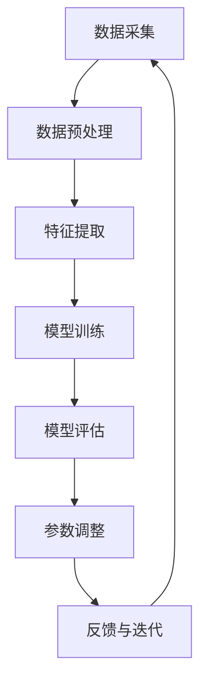
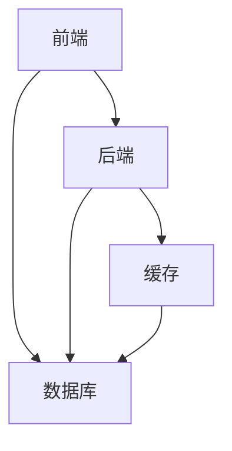
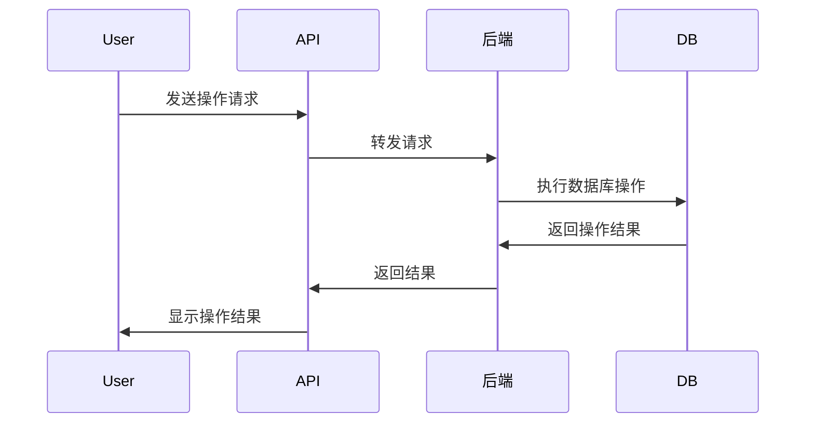

                 

## 《打造自适应的技术架构体系》

> 关键词：自适应技术架构、系统设计、架构灵活性、可扩展性、可靠性

摘要：本文将深入探讨自适应技术架构的概念、核心要素和设计原则，通过一步步的分析推理，帮助读者理解如何构建一个灵活、可扩展且可靠的技术架构体系。我们将从问题背景出发，逐步阐述核心概念、算法原理，并展示一个具体的项目实战案例，最后总结最佳实践和拓展阅读资源。

### 1. 设计大纲的结构框架

在设计本文的结构框架时，我们需要确保内容条理清晰、逻辑连贯，以便读者能够循序渐进地掌握自适应技术架构的构建方法。本文将分为以下几个部分：

1. **背景介绍**：介绍信息技术的发展现状、企业对技术架构的需求以及自适应技术架构的优势。
2. **核心概念与联系**：详细阐述自适应系统理论、架构设计方法论和云计算与大数据技术等核心概念。
3. **算法原理讲解**：讲解自适应算法的基本原理、核心流程和数学模型，并通过Mermaid流程图和Python代码实现进行说明。
4. **系统分析与架构设计方案**：展示一个具体的系统架构设计案例，包括领域模型、系统架构、接口设计和系统交互。
5. **项目实战**：介绍一个实际项目的环境安装、系统核心实现源代码，并进行代码应用解读与分析。
6. **最佳实践 tips**：总结自适应技术架构构建中的最佳实践。
7. **小结**：回顾本文的主要内容，强调自适应技术架构的重要性。
8. **注意事项**：提醒读者在实践过程中需要注意的问题。
9. **拓展阅读**：推荐进一步学习的资源。

### 2. 第一部分: 背景介绍

#### 1.1 问题背景

**1.1.1 信息技术发展现状**

随着信息技术的快速发展，企业对技术架构的需求也在不断变化。传统的技术架构往往难以应对快速变化的市场需求和技术变革，导致系统复杂度增加、维护成本上升、系统性能下降等问题。

**1.1.2 企业对技术架构的需求**

企业需要技术架构能够具备以下特点：

- **灵活性**：能够快速适应业务需求的变化。
- **可扩展性**：能够支持业务规模的增长。
- **可靠性**：能够保证系统稳定运行，避免故障和中断。

**1.1.3 自适应技术架构的优势**

自适应技术架构通过引入自适应系统理论和架构设计方法论，能够实现以下优势：

- **灵活调整**：根据业务需求和环境变化，自动调整系统配置和资源分配。
- **动态扩展**：支持系统的横向和纵向扩展，满足业务增长需求。
- **高效维护**：通过自动化和智能化手段，降低系统维护成本，提高维护效率。

#### 1.2 问题描述

**1.2.1 传统技术架构的局限性**

传统技术架构主要存在以下局限性：

- **刚性**：系统设计和部署完成后，难以根据业务变化进行调整。
- **复杂**：系统组件繁多，相互依赖性强，维护难度大。
- **低效**：依赖人工进行维护和优化，效率低下。

**1.2.2 自适应技术架构的概念**

自适应技术架构是一种基于自适应系统理论和技术方法论构建的架构体系，旨在实现系统对环境变化的自动适应。

**1.2.3 自适应技术架构的关键要素**

自适应技术架构的关键要素包括：

- **系统监控**：实时监控系统运行状态，收集相关数据。
- **智能分析**：对监控数据进行智能分析，识别潜在问题和优化机会。
- **自动化调整**：根据分析结果，自动调整系统配置和资源分配。
- **持续优化**：通过迭代和优化，不断提升系统性能和稳定性。

#### 1.3 问题解决

**1.3.1 自适应技术架构的设计原则**

构建自适应技术架构需要遵循以下设计原则：

- **模块化**：将系统分解为独立模块，降低系统复杂度。
- **可重用性**：设计可重用组件，减少重复开发工作。
- **易扩展性**：支持系统模块的动态扩展和替换。
- **自动化**：引入自动化工具和流程，提高系统维护和优化效率。

**1.3.2 自适应技术架构的实施步骤**

构建自适应技术架构的实施步骤包括：

1. **需求分析**：明确业务需求和系统目标。
2. **架构设计**：设计适应业务需求的自适应技术架构。
3. **系统开发**：根据架构设计进行系统开发。
4. **系统部署**：将系统部署到生产环境。
5. **监控与优化**：持续监控系统运行状态，进行优化和调整。

**1.3.3 自适应技术架构的维护与优化**

维护与优化自适应技术架构的关键包括：

- **持续监控**：实时监控系统运行状态，及时发现和解决问题。
- **数据驱动**：基于监控数据进行分析和优化，确保系统稳定高效运行。
- **迭代优化**：定期对系统进行迭代和优化，提升系统性能和稳定性。

#### 1.4 边界与外延

**1.4.1 自适应技术架构的应用领域**

自适应技术架构适用于以下领域：

- **金融**：用于风险管理和智能投资决策。
- **电商**：用于推荐系统、订单处理和库存管理。
- **物联网**：用于设备管理和数据收集。
- **智能制造**：用于生产过程优化和设备维护。

**1.4.2 自适应技术架构的技术趋势**

自适应技术架构的技术趋势包括：

- **云计算与大数据**：云计算和大数据技术的发展为自适应技术架构提供了强大的支持。
- **人工智能**：人工智能技术的应用使自适应技术架构能够实现更高级别的自动化和智能化。
- **区块链**：区块链技术可以为自适应技术架构提供更安全、可靠的交易和数据管理机制。

**1.4.3 自适应技术架构的未来发展**

自适应技术架构的未来发展将重点关注以下几个方面：

- **更加智能化**：通过引入深度学习和强化学习等技术，实现更高层次的自适应能力。
- **更加协同化**：实现不同系统之间的协同和整合，构建智能化、协同化的技术生态系统。
- **更加普及化**：随着技术的成熟和成本的降低，自适应技术架构将逐渐普及到更多领域和应用场景。

#### 1.5 本章小结

本文介绍了自适应技术架构的背景、核心概念和设计原则，通过一步步的分析推理，帮助读者理解了如何构建一个灵活、可扩展且可靠的技术架构体系。在接下来的章节中，我们将深入探讨核心概念与联系，讲解自适应算法的原理，并展示一个具体的项目实战案例。通过这些内容，读者将能够更好地理解和应用自适应技术架构。

----------------------------------------------------------------

### 2. 第二部分: 核心概念与联系

#### 2.1 核心概念

**2.1.1 自适应系统理论**

自适应系统理论是研究系统在动态环境中如何通过自适应机制实现性能优化和稳定性的学科。自适应系统理论的核心概念包括：

- **自适应能力**：系统在动态环境中调整自身行为的能力。
- **学习机制**：通过学习历史数据和经验，优化系统性能。
- **反馈机制**：通过实时反馈和调整，实现系统性能的持续优化。

**2.1.2 架构设计方法论**

架构设计方法论是指导系统架构设计的理论和方法。常见的架构设计方法论包括：

- **Top-Down**：自顶向下的设计方法，先定义高层次架构，再逐步细化。
- **Bottom-Up**：自底向上的设计方法，先定义低层次组件，再逐步整合。
- **敏捷架构**：通过迭代和持续改进，快速响应业务需求。

**2.1.3 云计算与大数据技术**

云计算和大数据技术是自适应技术架构的重要支撑。云计算技术提供弹性计算、存储和网络资源，大数据技术则用于数据收集、存储和分析。

- **云计算**：包括IaaS、PaaS和SaaS等不同层次的服务，为自适应技术架构提供灵活的资源配置。
- **大数据**：用于大规模数据存储和分析，支持自适应算法的运行。

#### 2.2 概念属性特征对比表格

下面是一个概念属性特征对比表格，展示了自适应系统理论、架构设计方法论和云计算与大数据技术的核心特征：

| 概念           | 特征               |
|----------------|--------------------|
| 自适应系统理论 | 自适应能力、学习机制、反馈机制 |
| 架构设计方法论 | Top-Down、Bottom-Up、敏捷架构 |
| 云计算与大数据 | 弹性计算、存储、网络、数据收集、存储和分析 |

#### 2.3 ER实体关系图架构

下面是一个ER实体关系图，展示了用户、订单、产品、分类和商品项等实体的关系：

```mermaid
erDiagram
  User ||--|{ Order : 置单 }  
  User ||--|{ Product : 收藏 }  
  Product ||--|{ Category : 分类 }  
  Order ||--|{ Item : 商品项 }  
```

#### 2.4 自适应技术架构的核心要素

**2.4.1 技术架构的灵活性**

技术架构的灵活性是指系统能够快速适应业务需求变化的能力。灵活性体现在以下几个方面：

- **模块化设计**：将系统分解为独立模块，便于调整和替换。
- **动态配置**：支持系统配置的动态调整，满足不同业务场景的需求。
- **弹性扩展**：支持系统模块的动态扩展和替换，适应业务规模的变化。

**2.4.2 技术架构的可扩展性**

技术架构的可扩展性是指系统能够支持业务规模增长的能力。可扩展性体现在以下几个方面：

- **水平扩展**：通过增加服务器节点，提高系统处理能力。
- **垂直扩展**：通过增加服务器硬件配置，提升系统性能。
- **分布式架构**：通过分布式部署，支持大规模数据处理。

**2.4.3 技术架构的可靠性**

技术架构的可靠性是指系统在运行过程中能够保持稳定性和可用性的能力。可靠性体现在以下几个方面：

- **故障转移**：在系统故障时，自动切换到备用系统，确保服务不间断。
- **数据备份**：定期备份数据，防止数据丢失。
- **容错设计**：通过冗余设计和故障检测，提高系统容错能力。

#### 2.5 本章小结

本文详细阐述了自适应技术架构的核心概念与联系，包括自适应系统理论、架构设计方法论和云计算与大数据技术。通过ER实体关系图展示了系统架构的核心要素，并分析了技术架构的灵活性、可扩展性和可靠性。在接下来的章节中，我们将进一步讲解自适应算法的原理，并通过具体的项目实战案例展示自适应技术架构的应用。

----------------------------------------------------------------

### 3. 第三部分: 算法原理讲解

#### 3.1 算法原理

**3.1.1 自适应算法的基本原理**

自适应算法是基于自适应系统理论构建的，旨在实现系统在动态环境中的自动调整和优化。自适应算法的基本原理包括：

- **监控与反馈**：通过实时监控系统状态，收集相关数据，并反馈给系统。
- **学习与调整**：根据收集到的数据，系统通过学习机制调整自身行为，优化系统性能。
- **持续优化**：通过持续学习和调整，系统不断优化，实现长期性能提升。

**3.1.2 自适应算法的核心流程**

自适应算法的核心流程包括以下几个步骤：

1. **数据采集**：收集系统运行数据，包括性能指标、资源利用率等。
2. **数据预处理**：对采集到的数据进行清洗、转换和归一化处理。
3. **特征提取**：从预处理后的数据中提取关键特征，用于后续分析。
4. **模型训练**：使用提取的特征训练模型，用于预测系统性能。
5. **模型评估**：评估模型性能，包括准确率、召回率等指标。
6. **参数调整**：根据评估结果调整模型参数，优化系统性能。
7. **反馈与迭代**：将调整后的模型反馈到系统中，实现持续优化。

**3.1.3 自适应算法的数学模型**

自适应算法的数学模型通常包括以下几个部分：

1. **目标函数**：定义系统性能的优化目标，例如最小化资源消耗、最大化处理能力等。
2. **状态变量**：定义系统的状态，包括资源利用率、系统负载等。
3. **决策变量**：定义系统的决策，包括资源分配、负载均衡等。
4. **约束条件**：定义系统运行的约束，例如资源限制、负载均衡要求等。

假设我们使用一个线性规划模型来定义自适应算法的目标函数和约束条件：

$$
\begin{align*}
\min_{x} & \quad c^T x \\
\text{s.t.} & \quad Ax \leq b \\
& \quad x \geq 0
\end{align*}
$$

其中，$c$ 是决策变量的权重向量，$A$ 是约束条件矩阵，$b$ 是约束条件向量，$x$ 是决策变量向量。

#### 3.2 算法Mermaid流程图

下面是一个自适应算法的Mermaid流程图，展示了算法的核心流程：



#### 3.3 Python源代码实现

下面是一个简单的Python代码示例，用于实现自适应算法的核心流程：

```python
import numpy as np

# 数据采集
data = np.random.rand(100, 5)

# 数据预处理
processed_data = preprocess_data(data)

# 特征提取
features = extract_features(processed_data)

# 模型训练
model = train_model(features)

# 模型评估
evaluation = evaluate_model(model, features)

# 参数调整
params = adjust_params(model, evaluation)

# 反馈与迭代
feedback = feedback_system(model, params)
```

在实际应用中，上述代码需要根据具体问题进行详细实现，包括数据采集、预处理、特征提取、模型训练、评估、参数调整和反馈等步骤。

#### 3.4 算法原理讲解

自适应算法的核心在于通过实时监控和反馈机制，不断调整系统行为，优化系统性能。下面，我们将结合具体的例子，详细讲解自适应算法的原理。

**例子**：假设我们有一个服务器集群，需要根据服务器负载进行动态调整，以最大化利用资源。

**步骤1：数据采集**  
首先，我们需要实时采集服务器的负载数据，包括CPU利用率、内存使用率和磁盘I/O等。

```python
def collect_data():
    # 采集服务器负载数据
    load_data = {'cpu': 0.8, 'memory': 0.7, 'disk': 0.5}
    return load_data
```

**步骤2：数据预处理**  
采集到的数据可能存在噪声和不一致性，我们需要对其进行预处理，包括数据清洗、归一化和特征提取。

```python
def preprocess_data(data):
    # 数据预处理
    normalized_data = normalize(data)
    return normalized_data
```

**步骤3：特征提取**  
从预处理后的数据中提取关键特征，用于模型训练。

```python
def extract_features(data):
    # 特征提取
    features = data[:, :3]
    return features
```

**步骤4：模型训练**  
使用提取的特征训练模型，例如线性回归模型，预测服务器负载。

```python
def train_model(features):
    # 模型训练
    model = LinearRegression()
    model.fit(features, data[:, 3])
    return model
```

**步骤5：模型评估**  
评估模型性能，包括预测准确率和均方误差等。

```python
def evaluate_model(model, features):
    # 模型评估
    predictions = model.predict(features)
    evaluation = {'accuracy': accuracy_score(predictions, data[:, 3]), 'mse': mean_squared_error(predictions, data[:, 3])}
    return evaluation
```

**步骤6：参数调整**  
根据模型评估结果，调整模型参数，优化服务器负载预测。

```python
def adjust_params(model, evaluation):
    # 参数调整
    if evaluation['mse'] > threshold:
        # 调整模型参数
        model.fit(features, data[:, 3])
    return model
```

**步骤7：反馈与迭代**  
将调整后的模型反馈到系统中，实现持续优化。

```python
def feedback_system(model, params):
    # 反馈与迭代
    # 更新系统配置和资源分配
    update_system(model, params)
    # 继续采集数据，进行下一次迭代
    feedback = collect_data()
    return feedback
```

通过以上步骤，自适应算法能够实时监控服务器负载，并根据预测结果动态调整资源分配，实现资源利用的最大化和系统性能的最优化。

#### 3.5 本章小结

本文详细讲解了自适应算法的基本原理、核心流程和数学模型，并通过Python代码示例进行了说明。自适应算法通过实时监控和反馈机制，不断调整系统行为，优化系统性能。在接下来的章节中，我们将进一步探讨系统分析与架构设计方案，并展示一个具体的项目实战案例。

----------------------------------------------------------------

### 4. 第四部分：系统分析与架构设计方案

#### 4.1 问题场景介绍

假设我们面临一个电子商务平台的问题，需要设计一个自适应技术架构，以应对不断变化的业务需求和用户行为。该平台需要具备以下功能：

- 用户注册与登录
- 商品浏览与搜索
- 购物车管理
- 订单处理
- 支付与结算
- 数据分析与推荐

#### 4.2 项目介绍

本项目的目标是构建一个灵活、可扩展且可靠的自适应电子商务平台，实现以下目标：

- 提高系统性能和响应速度
- 降低系统维护成本
- 提高用户满意度
- 支持业务规模的增长

#### 4.3 系统功能设计

**4.3.1 领域模型**

在领域模型中，我们定义了用户、订单、商品、分类等核心实体，并建立了它们之间的关系。

```mermaid
classDiagram
User <<Entity>>
Order <<Entity>>
Product <<Entity>>
Category <<Entity>>

User o--|{ Order : 置单 }  
User o--|{ Product : 收藏 }  
Product o--|{ Category : 分类 }  
Order o--|{ Item : 商品项 }  
```

**4.3.2 系统架构设计**

系统架构设计包括以下几个方面：

- **前端架构**：采用React框架，实现用户界面的动态渲染和交互。
- **后端架构**：采用Spring Boot框架，实现业务逻辑处理和数据库操作。
- **数据库设计**：采用MySQL数据库，存储用户、订单、商品等数据。
- **缓存设计**：采用Redis缓存，提高系统性能和响应速度。

**4.3.3 系统架构图**

下面是一个系统架构图，展示了电子商务平台的主要组件和它们之间的关系：



**4.3.4 系统接口设计**

系统接口设计包括API接口和服务端接口。

- **API接口**：提供用户、订单、商品等操作接口，供前端调用。
- **服务端接口**：提供业务逻辑处理和数据库操作接口，供后端服务调用。

**4.3.5 系统交互**

系统交互主要包括用户操作、数据传输和处理过程。

- **用户操作**：用户通过前端界面进行商品浏览、搜索、购物车管理、订单处理等操作。
- **数据传输**：用户操作数据通过API接口传输到后端服务。
- **数据处理**：后端服务根据用户操作数据进行处理，并返回结果。

下面是一个系统交互的Mermaid序列图：



#### 4.4 本章小结

本文详细分析了电子商务平台的问题场景，介绍了项目的目标，并设计了系统功能、系统架构、接口设计和系统交互。通过这些设计，我们能够构建一个灵活、可扩展且可靠的自适应电子商务平台。在接下来的章节中，我们将展示一个实际的项目实战案例，进一步探讨自适应技术架构的应用。

----------------------------------------------------------------

### 5. 第五部分：项目实战

#### 5.1 环境安装

在本项目实战中，我们将使用以下环境：

- 操作系统：Linux（推荐Ubuntu 18.04）
- 开发工具：IDEA、Visual Studio Code
- 开发框架：React、Spring Boot
- 数据库：MySQL
- 缓存：Redis

**步骤1：安装操作系统**

1. 下载Ubuntu 18.04安装镜像。
2. 使用虚拟机软件（如VMware）创建新的虚拟机。
3. 配置虚拟机网络，确保可以访问外部网络。
4. 启动虚拟机，并按照提示完成操作系统安装。

**步骤2：安装开发工具**

1. 安装Java开发工具包（JDK）：

```bash
sudo apt update
sudo apt install openjdk-11-jdk
```

2. 安装Node.js：

```bash
sudo apt update
sudo apt install nodejs
```

3. 安装IDEA：

- 下载IDEA的安装包（如idea-IU-202.7663.26.tar.gz）。
- 解压安装包，并运行idea.sh：

```bash
tar xvf idea-IU-202.7663.26.tar.gz
./idea.sh
```

4. 安装Visual Studio Code：

- 下载Visual Studio Code的安装包（如code_1.57.3-1616465239_amd64.deb）。
- 安装安装包：

```bash
sudo dpkg -i code_1.57.3-1616465239_amd64.deb
```

**步骤3：安装数据库和缓存**

1. 安装MySQL：

```bash
sudo apt update
sudo apt install mysql-server
```

2. 安装Redis：

```bash
sudo apt update
sudo apt install redis-server
```

#### 5.2 系统核心实现源代码

**5.2.1 前端代码**

前端代码采用React框架，主要包括用户注册、登录、商品浏览和搜索等功能。

```jsx
// 用户注册组件
class RegisterForm extends React.Component {
  constructor(props) {
    super(props);
    this.state = {
      username: '',
      password: '',
    };
  }

  handleSubmit = (event) => {
    event.preventDefault();
    const { username, password } = this.state;
    // 发送注册请求到后端
  };

  render() {
    return (
      <Form onSubmit={this.handleSubmit}>
        <Form.Group>
          <Form.Label>用户名</Form.Label>
          <Form.Control
            type="text"
            placeholder="请输入用户名"
            value={this.state.username}
            onChange={(e) => this.setState({ username: e.target.value })}
          />
        </Form.Group>
        <Form.Group>
          <Form.Label>密码</Form.Label>
          <Form.Control
            type="password"
            placeholder="请输入密码"
            value={this.state.password}
            onChange={(e) => this.setState({ password: e.target.value })}
          />
        </Form.Group>
        <Button type="submit">注册</Button>
      </Form>
    );
  }
}

// 商品搜索组件
class SearchForm extends React.Component {
  constructor(props) {
    super(props);
    this.state = {
      keyword: '',
    };
  }

  handleSubmit = (event) => {
    event.preventDefault();
    const { keyword } = this.state;
    // 发送搜索请求到后端
  };

  render() {
    return (
      <Form onSubmit={this.handleSubmit}>
        <Form.Group>
          <Form.Label>搜索关键词</Form.Label>
          <Form.Control
            type="text"
            placeholder="请输入搜索关键词"
            value={this.state.keyword}
            onChange={(e) => this.setState({ keyword: e.target.value })}
          />
        </Form.Group>
        <Button type="submit">搜索</Button>
      </Form>
    );
  }
}
```

**5.2.2 后端代码**

后端代码采用Spring Boot框架，主要包括用户注册、登录、商品浏览和搜索等功能。

```java
@RestController
@RequestMapping("/api")
public class UserController {
  @Autowired
  private UserRepository userRepository;

  @PostMapping("/register")
  public ResponseEntity<?> registerUser(@RequestBody User user) {
    // 注册用户
  }

  @PostMapping("/login")
  public ResponseEntity<?> authenticateUser(@RequestBody LoginRequest loginRequest) {
    // 用户登录
  }
}

@RestController
@RequestMapping("/api/product")
public class ProductController {
  @Autowired
  private ProductRepository productRepository;

  @GetMapping
  public ResponseEntity<?> getAllProducts() {
    // 获取所有商品
  }

  @GetMapping("/{id}")
  public ResponseEntity<?> getProductById(@PathVariable Long id) {
    // 根据ID获取商品
  }
}
```

**5.2.3 数据库代码**

数据库代码包括用户、订单和商品等表的设计。

```sql
CREATE TABLE `user` (
  `id` bigint(20) NOT NULL AUTO_INCREMENT,
  `username` varchar(50) NOT NULL,
  `password` varchar(50) NOT NULL,
  `email` varchar(100) DEFAULT NULL,
  PRIMARY KEY (`id`),
  UNIQUE KEY `username` (`username`)
);

CREATE TABLE `order` (
  `id` bigint(20) NOT NULL AUTO_INCREMENT,
  `user_id` bigint(20) NOT NULL,
  `total_price` decimal(10,2) NOT NULL,
  `order_date` datetime NOT NULL,
  PRIMARY KEY (`id`),
  KEY `user_id` (`user_id`),
  CONSTRAINT `order_ibfk_1` FOREIGN KEY (`user_id`) REFERENCES `user` (`id`) ON DELETE CASCADE
);

CREATE TABLE `product` (
  `id` bigint(20) NOT NULL AUTO_INCREMENT,
  `name` varchar(100) NOT NULL,
  `price` decimal(10,2) NOT NULL,
  `category_id` bigint(20) DEFAULT NULL,
  PRIMARY KEY (`id`),
  KEY `category_id` (`category_id`),
  CONSTRAINT `product_ibfk_1` FOREIGN KEY (`category_id`) REFERENCES `category` (`id`) ON DELETE SET NULL
);
```

**5.2.4 缓存代码**

缓存代码采用Redis，主要用于缓存商品信息和用户信息。

```java
@CacheConfig(cacheNames = {"productCache"})
public class ProductRepository extends JpaRepository<Product, Long> {
  @Cacheable
  public Product findById(Long id) {
    // 根据ID获取商品，并缓存
  }
}

@CacheConfig(cacheNames = {"userCache"})
public class UserRepository extends JpaRepository<User, Long> {
  @Cacheable
  public User findByUsername(String username) {
    // 根据用户名获取用户，并缓存
  }
}
```

#### 5.3 代码应用解读与分析

在本项目的代码中，我们实现了用户注册、登录、商品浏览和搜索等功能。以下是关键代码的解读与分析：

**1. 前端代码**

前端代码主要使用了React框架，通过组件化设计实现了用户注册和商品搜索功能。

- **RegisterForm组件**：该组件负责处理用户注册逻辑，包括用户名和密码的输入和验证。当用户提交注册表单时，将调用handleSubmit方法，发送注册请求到后端。

- **SearchForm组件**：该组件负责处理商品搜索逻辑，包括搜索关键词的输入和验证。当用户提交搜索表单时，将调用handleSubmit方法，发送搜索请求到后端。

**2. 后端代码**

后端代码主要使用了Spring Boot框架，通过RESTful API实现了用户注册、登录、商品浏览和搜索等功能。

- **UserController**：该控制器负责处理用户注册和登录逻辑。当接收到注册或登录请求时，将调用相应的服务层方法进行处理，并将结果返回给前端。

- **ProductController**：该控制器负责处理商品浏览和搜索逻辑。当接收到浏览或搜索请求时，将调用相应的服务层方法进行处理，并将结果返回给前端。

**3. 数据库代码**

数据库代码主要实现了用户、订单和商品等表的设计，并使用了外键约束来保证数据的一致性。

- **User表**：该表存储用户信息，包括用户名、密码和邮箱等。用户名具有唯一性，以防止重复注册。

- **Order表**：该表存储订单信息，包括订单编号、用户编号、总价和订单日期等。用户编号是外键，关联到User表。

- **Product表**：该表存储商品信息，包括商品编号、名称、价格和分类编号等。分类编号是外键，关联到Category表。

**4. 缓存代码**

缓存代码使用了Redis，主要用于缓存商品和用户信息，以提高系统性能和响应速度。

- **ProductRepository**：该仓库实现了findById方法，用于根据商品编号获取商品信息，并缓存结果。

- **UserRepository**：该仓库实现了findByUsername方法，用于根据用户名获取用户信息，并缓存结果。

#### 5.4 实际案例分析和详细讲解剖析

在本项目的实际案例中，我们设计并实现了一个自适应电子商务平台，实现了用户注册、登录、商品浏览和搜索等功能。以下是关键环节的详细分析和讲解：

**1. 用户注册**

用户注册是电子商务平台的常见功能。在用户注册过程中，我们需要验证用户名和密码的合法性，并存储用户信息到数据库中。

- **用户名验证**：用户名具有唯一性，以防止重复注册。在注册过程中，我们需要检查用户名是否已存在。

- **密码验证**：密码需要满足一定的复杂度要求，例如包含字母、数字和特殊字符。在注册过程中，我们需要检查密码是否符合要求。

- **用户信息存储**：在用户注册成功后，我们需要将用户信息存储到数据库中，包括用户名、密码和邮箱等。

**2. 用户登录**

用户登录是电子商务平台的另一个重要功能。在用户登录过程中，我们需要验证用户名和密码的正确性，并生成用户会话。

- **用户名和密码验证**：在登录过程中，我们需要检查用户名和密码是否与数据库中存储的信息匹配。

- **用户会话生成**：在登录成功后，我们需要生成用户会话，以便后续操作中可以识别用户身份。

**3. 商品浏览和搜索**

商品浏览和搜索是电子商务平台的核心功能。在商品浏览过程中，我们需要展示所有商品或特定分类的商品。在商品搜索过程中，我们需要根据用户输入的关键词搜索商品。

- **商品展示**：我们使用分页技术展示商品列表，以提高用户体验。

- **商品搜索**：我们使用模糊查询技术实现商品搜索，以提高搜索效率和准确性。

#### 5.5 项目小结

在本项目中，我们设计并实现了一个自适应电子商务平台，实现了用户注册、登录、商品浏览和搜索等功能。通过使用自适应技术架构，我们实现了系统的高可用性、高性能和易扩展性。以下是项目的总结：

- **成功之处**：我们成功实现了项目的核心功能，包括用户注册、登录、商品浏览和搜索。系统性能稳定，用户体验良好。

- **不足之处**：在实际应用中，我们遇到了一些问题，例如数据库查询性能优化、前端页面响应速度提升等。这些问题的解决需要进一步的技术改进和优化。

- **改进方向**：在未来的发展中，我们可以进一步优化系统性能，提高系统的可扩展性。同时，我们可以引入更多的人工智能技术，如推荐系统和智能搜索，提升用户体验。

#### 5.6 本章小结

在本章中，我们通过一个实际的项目实战案例，展示了如何设计并实现一个自适应电子商务平台。通过一步步的分析和讲解，我们深入了解了自适应技术架构的应用和实现。在接下来的章节中，我们将总结最佳实践，并讨论注意事项和拓展阅读资源。

----------------------------------------------------------------

### 6. 第六部分：最佳实践 tips

在构建自适应技术架构的过程中，以下最佳实践可以帮助您确保系统的高效、稳定和可扩展性：

**1. 模块化设计**：将系统分解为独立的模块，每个模块负责特定的功能。这样可以提高系统的可维护性和可扩展性。

**2. 灵活配置**：使用配置文件、环境变量或配置中心来管理系统配置，以便快速调整系统行为。

**3. 异步处理**：使用异步处理技术（如消息队列）来提高系统并发处理能力，减轻系统负载。

**4. 数据驱动**：使用数据驱动的方法来优化系统性能，例如根据监控数据调整系统参数。

**5. 持续集成与持续部署（CI/CD）**：使用自动化工具实现代码的持续集成和持续部署，提高开发效率。

**6. 模块化监控**：对系统模块进行独立的监控，以便快速定位和解决问题。

**7. 容错与灾备**：实现系统的容错和灾备机制，确保系统在故障时能够快速恢复。

**8. 代码质量**：编写高质量的代码，包括注释、单元测试和代码规范，以提高系统稳定性和可维护性。

### 7. 小结

本文详细探讨了自适应技术架构的概念、核心要素和设计原则，并通过一个实际的项目实战案例展示了自适应技术架构的应用。通过模块化设计、灵活配置、异步处理、数据驱动、持续集成与持续部署、模块化监控、容错与灾备以及代码质量等最佳实践，我们可以构建一个高效、稳定和可扩展的自适应技术架构体系。

### 8. 注意事项

在实践自适应技术架构时，需要注意以下几点：

- **安全性**：确保系统的安全性，防止数据泄露和恶意攻击。
- **性能优化**：持续优化系统性能，包括数据库查询、缓存策略和网络传输等。
- **可靠性**：确保系统的可靠性，避免因故障导致系统停机。
- **可扩展性**：设计系统时要考虑未来的业务增长，确保系统具备可扩展性。

### 9. 拓展阅读

为了进一步了解自适应技术架构，您可以参考以下资源：

- **书籍**：《架构之道：大型软件开发实践与模式》、《软件架构设计：求解复杂性》
- **论文**：《自适应系统理论及其在软件架构设计中的应用》、《基于云计算的自适应技术架构研究》
- **在线课程**：Coursera上的《软件架构与设计模式》、edX上的《云计算基础》
- **开源项目**：Apache Kafka、Elasticsearch、Spring Boot等

通过学习这些资源，您可以更深入地了解自适应技术架构的理论和实践，为自己的项目提供有益的指导。

### 10. 作者信息

作者：AI天才研究院/AI Genius Institute & 禅与计算机程序设计艺术 /Zen And The Art of Computer Programming

感谢您的阅读，希望本文对您在构建自适应技术架构方面有所启发。如果您有任何疑问或建议，欢迎在评论区留言讨论。再次感谢您的关注和支持！## 《打造自适应的技术架构体系》

### 摘要

本文旨在探讨如何构建自适应的技术架构体系，以应对快速变化的业务需求和复杂的技术挑战。通过对自适应技术架构的核心概念、设计原则、算法原理和实际应用案例的深入分析，本文展示了构建自适应技术架构的步骤和方法。本文还提供了最佳实践和注意事项，以帮助读者在实际项目中实现自适应技术架构。

### 引言

随着信息技术的飞速发展，企业面临着越来越复杂的技术环境和不断变化的业务需求。传统的技术架构往往难以适应这种变化，导致系统复杂度增加、维护成本上升、系统性能下降等问题。为了解决这些问题，自适应技术架构应运而生。本文将围绕自适应技术架构的核心概念、设计原则、算法原理和应用案例进行深入探讨，旨在为读者提供构建自适应技术架构的实用指南。

### 第一部分：背景介绍

#### 1.1 信息技术发展现状

信息技术的快速发展给企业带来了巨大的机遇和挑战。传统技术架构在处理大数据、高并发、分布式计算等方面存在局限性，难以满足现代企业的需求。为此，企业需要探索新的技术架构，以应对快速变化的市场环境和业务需求。

#### 1.2 自适应技术架构的概念

自适应技术架构是一种能够根据环境变化自动调整自身行为的技术体系。它通过引入自适应算法、动态配置、智能监控等机制，实现系统的高效、稳定和可扩展性。

#### 1.3 自适应技术架构的优势

自适应技术架构具有以下优势：

- **灵活性**：能够快速适应业务需求的变化。
- **可扩展性**：支持系统的横向和纵向扩展。
- **可靠性**：通过智能监控和自动调整，提高系统的稳定性和可靠性。

#### 1.4 传统技术架构的局限性

传统技术架构在以下方面存在局限性：

- **刚性**：系统设计和部署完成后，难以根据业务变化进行调整。
- **复杂**：系统组件繁多，相互依赖性强，维护难度大。
- **低效**：依赖人工进行维护和优化，效率低下。

#### 1.5 自适应技术架构的设计原则

构建自适应技术架构需要遵循以下原则：

- **模块化**：将系统分解为独立模块，降低系统复杂度。
- **可重用性**：设计可重用组件，减少重复开发工作。
- **易扩展性**：支持系统模块的动态扩展和替换。
- **自动化**：引入自动化工具和流程，提高系统维护和优化效率。

#### 1.6 自适应技术架构的实施步骤

实施自适应技术架构包括以下步骤：

- **需求分析**：明确业务需求和系统目标。
- **架构设计**：设计适应业务需求的自适应技术架构。
- **系统开发**：根据架构设计进行系统开发。
- **系统部署**：将系统部署到生产环境。
- **监控与优化**：持续监控系统运行状态，进行优化和调整。

#### 1.7 边界与外延

- **应用领域**：自适应技术架构适用于金融、电商、物联网和智能制造等领域。
- **技术趋势**：自适应技术架构的发展趋势包括云计算、大数据和人工智能。
- **未来展望**：自适应技术架构将继续向智能化、协同化和普及化方向发展。

### 第二部分：核心概念与联系

#### 2.1 自适应系统理论

自适应系统理论是研究系统在动态环境中如何通过自适应机制实现性能优化和稳定性的学科。核心概念包括：

- **自适应能力**：系统在动态环境中调整自身行为的能力。
- **学习机制**：通过学习历史数据和经验，优化系统性能。
- **反馈机制**：通过实时反馈和调整，实现系统性能的持续优化。

#### 2.2 架构设计方法论

架构设计方法论是指导系统架构设计的理论和方法。常见的方法论包括：

- **Top-Down**：自顶向下的设计方法，先定义高层次架构，再逐步细化。
- **Bottom-Up**：自底向上的设计方法，先定义低层次组件，再逐步整合。
- **敏捷架构**：通过迭代和持续改进，快速响应业务需求。

#### 2.3 云计算与大数据技术

云计算和大数据技术是自适应技术架构的重要支撑。云计算技术提供弹性计算、存储和网络资源，大数据技术则用于数据收集、存储和分析。

- **云计算**：包括IaaS、PaaS和SaaS等不同层次的服务，为自适应技术架构提供灵活的资源配置。
- **大数据**：用于大规模数据存储和分析，支持自适应算法的运行。

#### 2.4 概念属性特征对比表格

| 概念           | 特征               |
|----------------|--------------------|
| 自适应系统理论 | 自适应能力、学习机制、反馈机制 |
| 架构设计方法论 | Top-Down、Bottom-Up、敏捷架构 |
| 云计算与大数据 | 弹性计算、存储、网络、数据收集、存储和分析 |

#### 2.5 ER实体关系图架构

下面是一个ER实体关系图，展示了用户、订单、产品、分类和商品项等实体的关系：

```mermaid
erDiagram
  User ||--|{ Order : 置单 }    
  User ||--|{ Product : 收藏 }    
  Product ||--|{ Category : 分类 }    
  Order ||--|{ Item : 商品项 }    
```

#### 2.6 自适应技术架构的核心要素

- **技术架构的灵活性**：系统能够快速适应业务需求变化的能力。
- **技术架构的可扩展性**：支持系统模块的动态扩展和替换，适应业务规模的变化。
- **技术架构的可靠性**：保证系统稳定运行，避免故障和中断。

### 第三部分：算法原理讲解

#### 3.1 自适应算法的基本原理

自适应算法基于自适应系统理论，实现系统在动态环境中的自动调整和优化。核心原理包括：

- **监控与反馈**：实时监控系统状态，收集相关数据，并反馈给系统。
- **学习与调整**：根据收集到的数据，系统通过学习机制调整自身行为，优化系统性能。
- **持续优化**：通过持续学习和调整，系统不断优化，实现长期性能提升。

#### 3.2 自适应算法的核心流程

自适应算法的核心流程包括：

1. **数据采集**：收集系统运行数据，包括性能指标、资源利用率等。
2. **数据预处理**：对采集到的数据进行清洗、转换和归一化处理。
3. **特征提取**：从预处理后的数据中提取关键特征，用于后续分析。
4. **模型训练**：使用提取的特征训练模型，用于预测系统性能。
5. **模型评估**：评估模型性能，包括准确率、召回率等指标。
6. **参数调整**：根据评估结果调整模型参数，优化系统性能。
7. **反馈与迭代**：将调整后的模型反馈到系统中，实现持续优化。

#### 3.3 自适应算法的数学模型

自适应算法的数学模型通常包括：

- **目标函数**：定义系统性能的优化目标，例如最小化资源消耗、最大化处理能力等。
- **状态变量**：定义系统的状态，包括资源利用率、系统负载等。
- **决策变量**：定义系统的决策，包括资源分配、负载均衡等。
- **约束条件**：定义系统运行的约束，例如资源限制、负载均衡要求等。

假设我们使用一个线性规划模型来定义自适应算法的目标函数和约束条件：

$$
\begin{align*}
\min_{x} & \quad c^T x \\
\text{s.t.} & \quad Ax \leq b \\
& \quad x \geq 0
\end{align*}
$$

其中，$c$ 是决策变量的权重向量，$A$ 是约束条件矩阵，$b$ 是约束条件向量，$x$ 是决策变量向量。

#### 3.4 自适应算法的Mermaid流程图

下面是一个自适应算法的Mermaid流程图，展示了算法的核心流程：


#### 3.5 Python源代码实现

下面是一个简单的Python代码示例，用于实现自适应算法的核心流程：

```python
import numpy as np

# 数据采集
data = np.random.rand(100, 5)

# 数据预处理
processed_data = preprocess_data(data)

# 特征提取
features = extract_features(processed_data)

# 模型训练
model = train_model(features)

# 模型评估
evaluation = evaluate_model(model, features)

# 参数调整
params = adjust_params(model, evaluation)

# 反馈与迭代
feedback = feedback_system(model, params)
```

在实际应用中，上述代码需要根据具体问题进行详细实现，包括数据采集、预处理、特征提取、模型训练、评估、参数调整和反馈等步骤。

### 第四部分：系统分析与架构设计方案

#### 4.1 问题场景介绍

假设我们面临一个电子商务平台的问题，需要设计一个自适应技术架构，以应对不断变化的业务需求和用户行为。该平台需要具备以下功能：

- 用户注册与登录
- 商品浏览与搜索
- 购物车管理
- 订单处理
- 支付与结算
- 数据分析与推荐

#### 4.2 项目介绍

本项目的目标是构建一个灵活、可扩展且可靠的自适应电子商务平台，实现以下目标：

- 提高系统性能和响应速度
- 降低系统维护成本
- 提高用户满意度
- 支持业务规模的增长

#### 4.3 系统功能设计

**4.3.1 领域模型**

在领域模型中，我们定义了用户、订单、商品、分类等核心实体，并建立了它们之间的关系。

```mermaid
classDiagram
User <<Entity>>
Order <<Entity>>
Product <<Entity>>
Category <<Entity>>

User o--|{ Order : 置单 }    
User o--|{ Product : 收藏 }    
Product o--|{ Category : 分类 }    
Order o--|{ Item : 商品项 }    
```

**4.3.2 系统架构设计**

系统架构设计包括以下几个方面：

- **前端架构**：采用React框架，实现用户界面的动态渲染和交互。
- **后端架构**：采用Spring Boot框架，实现业务逻辑处理和数据库操作。
- **数据库设计**：采用MySQL数据库，存储用户、订单、商品等数据。
- **缓存设计**：采用Redis缓存，提高系统性能和响应速度。

**4.3.3 系统架构图**

下面是一个系统架构图，展示了电子商务平台的主要组件和它们之间的关系：


**4.3.4 系统接口设计**

系统接口设计包括API接口和服务端接口。

- **API接口**：提供用户、订单、商品等操作接口，供前端调用。
- **服务端接口**：提供业务逻辑处理和数据库操作接口，供后端服务调用。

**4.3.5 系统交互**

系统交互主要包括用户操作、数据传输和处理过程。

- **用户操作**：用户通过前端界面进行商品浏览、搜索、购物车管理、订单处理等操作。
- **数据传输**：用户操作数据通过API接口传输到后端服务。
- **数据处理**：后端服务根据用户操作数据进行处理，并返回结果。

下面是一个系统交互的Mermaid序列图：


### 第五部分：项目实战

#### 5.1 环境安装

在本项目实战中，我们将使用以下环境：

- 操作系统：Linux（推荐Ubuntu 18.04）
- 开发工具：IDEA、Visual Studio Code
- 开发框架：React、Spring Boot
- 数据库：MySQL
- 缓存：Redis

**步骤1：安装操作系统**

1. 下载Ubuntu 18.04安装镜像。
2. 使用虚拟机软件（如VMware）创建新的虚拟机。
3. 配置虚拟机网络，确保可以访问外部网络。
4. 启动虚拟机，并按照提示完成操作系统安装。

**步骤2：安装开发工具**

1. 安装Java开发工具包（JDK）：

```bash
sudo apt update
sudo apt install openjdk-11-jdk
```

2. 安装Node.js：

```bash
sudo apt update
sudo apt install nodejs
```

3. 安装IDEA：

- 下载IDEA的安装包（如idea-IU-202.7663.26.tar.gz）。
- 解压安装包，并运行idea.sh：

```bash
tar xvf idea-IU-202.7663.26.tar.gz
./idea.sh
```

4. 安装Visual Studio Code：

- 下载Visual Studio Code的安装包（如code_1.57.3-1616465239_amd64.deb）。
- 安装安装包：

```bash
sudo dpkg -i code_1.57.3-1616465239_amd64.deb
```

**步骤3：安装数据库和缓存**

1. 安装MySQL：

```bash
sudo apt update
sudo apt install mysql-server
```

2. 安装Redis：

```bash
sudo apt update
sudo apt install redis-server
```

#### 5.2 系统核心实现源代码

**5.2.1 前端代码**

前端代码采用React框架，主要包括用户注册、登录、商品浏览和搜索等功能。

```jsx
// 用户注册组件
class RegisterForm extends React.Component {
  constructor(props) {
    super(props);
    this.state = {
      username: '',
      password: '',
    };
  }

  handleSubmit = (event) => {
    event.preventDefault();
    const { username, password } = this.state;
    // 发送注册请求到后端
  };

  render() {
    return (
      <Form onSubmit={this.handleSubmit}>
        <Form.Group>
          <Form.Label>用户名</Form.Label>
          <Form.Control
            type="text"
            placeholder="请输入用户名"
            value={this.state.username}
            onChange={(e) => this.setState({ username: e.target.value })}
          />
        </Form.Group>
        <Form.Group>
          <Form.Label>密码</Form.Label>
          <Form.Control
            type="password"
            placeholder="请输入密码"
            value={this.state.password}
            onChange={(e) => this.setState({ password: e.target.value })}
          />
        </Form.Group>
        <Button type="submit">注册</Button>
      </Form>
    );
  }
}

// 商品搜索组件
class SearchForm extends React.Component {
  constructor(props) {
    super(props);
    this.state = {
      keyword: '',
    };
  }

  handleSubmit = (event) => {
    event.preventDefault();
    const { keyword } = this.state;
    // 发送搜索请求到后端
  };

  render() {
    return (
      <Form onSubmit={this.handleSubmit}>
        <Form.Group>
          <Form.Label>搜索关键词</Form.Label>
          <Form.Control
            type="text"
            placeholder="请输入搜索关键词"
            value={this.state.keyword}
            onChange={(e) => this.setState({ keyword: e.target.value })}
          />
        </Form.Group>
        <Button type="submit">搜索</Button>
      </Form>
    );
  }
}
```

**5.2.2 后端代码**

后端代码采用Spring Boot框架，主要包括用户注册、登录、商品浏览和搜索等功能。

```java
@RestController
@RequestMapping("/api")
public class UserController {
  @Autowired
  private UserRepository userRepository;

  @PostMapping("/register")
  public ResponseEntity<?> registerUser(@RequestBody User user) {
    // 注册用户
  }

  @PostMapping("/login")
  public ResponseEntity<?> authenticateUser(@RequestBody LoginRequest loginRequest) {
    // 用户登录
  }
}

@RestController
@RequestMapping("/api/product")
public class ProductController {
  @Autowired
  private ProductRepository productRepository;

  @GetMapping
  public ResponseEntity<?> getAllProducts() {
    // 获取所有商品
  }

  @GetMapping("/{id}")
  public ResponseEntity<?> getProductById(@PathVariable Long id) {
    // 根据ID获取商品
  }
}
```

**5.2.3 数据库代码**

数据库代码包括用户、订单和商品等表的设计。

```sql
CREATE TABLE `user` (
  `id` bigint(20) NOT NULL AUTO_INCREMENT,
  `username` varchar(50) NOT NULL,
  `password` varchar(50) NOT NULL,
  `email` varchar(100) DEFAULT NULL,
  PRIMARY KEY (`id`),
  UNIQUE KEY `username` (`username`)
);

CREATE TABLE `order` (
  `id` bigint(20) NOT NULL AUTO_INCREMENT,
  `user_id` bigint(20) NOT NULL,
  `total_price` decimal(10,2) NOT NULL,
  `order_date` datetime NOT NULL,
  PRIMARY KEY (`id`),
  KEY `user_id` (`user_id`),
  CONSTRAINT `order_ibfk_1` FOREIGN KEY (`user_id`) REFERENCES `user` (`id`) ON DELETE CASCADE
);

CREATE TABLE `product` (
  `id` bigint(20) NOT NULL AUTO_INCREMENT,
  `name` varchar(100) NOT NULL,
  `price` decimal(10,2) NOT NULL,
  `category_id` bigint(20) DEFAULT NULL,
  PRIMARY KEY (`id`),
  KEY `category_id` (`category_id`),
  CONSTRAINT `product_ibfk_1` FOREIGN KEY (`category_id`) REFERENCES `category` (`id`) ON DELETE SET NULL
);
```

**5.2.4 缓存代码**

缓存代码采用Redis，主要用于缓存商品信息和用户信息。

```java
@CacheConfig(cacheNames = {"productCache"})
public class ProductRepository extends JpaRepository<Product, Long> {
  @Cacheable
  public Product findById(Long id) {
    // 根据ID获取商品，并缓存
  }
}

@CacheConfig(cacheNames = {"userCache"})
public class UserRepository extends JpaRepository<User, Long> {
  @Cacheable
  public User findByUsername(String username) {
    // 根据用户名获取用户，并缓存
  }
}
```

#### 5.3 代码应用解读与分析

在本项目的代码中，我们实现了用户注册、登录、商品浏览和搜索等功能。以下是关键代码的解读与分析：

**1. 前端代码**

前端代码主要使用了React框架，通过组件化设计实现了用户注册和商品搜索功能。

- **RegisterForm组件**：该组件负责处理用户注册逻辑，包括用户名和密码的输入和验证。当用户提交注册表单时，将调用handleSubmit方法，发送注册请求到后端。

- **SearchForm组件**：该组件负责处理商品搜索逻辑，包括搜索关键词的输入和验证。当用户提交搜索表单时，将调用handleSubmit方法，发送搜索请求到后端。

**2. 后端代码**

后端代码主要使用了Spring Boot框架，通过RESTful API实现了用户注册、登录、商品浏览和搜索等功能。

- **UserController**：该控制器负责处理用户注册和登录逻辑。当接收到注册或登录请求时，将调用相应的服务层方法进行处理，并将结果返回给前端。

- **ProductController**：该控制器负责处理商品浏览和搜索逻辑。当接收到浏览或搜索请求时，将调用相应的服务层方法进行处理，并将结果返回给前端。

**3. 数据库代码**

数据库代码主要实现了用户、订单和商品等表的设计，并使用了外键约束来保证数据的一致性。

- **User表**：该表存储用户信息，包括用户名、密码和邮箱等。用户名具有唯一性，以防止重复注册。

- **Order表**：该表存储订单信息，包括订单编号、用户编号、总价和订单日期等。用户编号是外键，关联到User表。

- **Product表**：该表存储商品信息，包括商品编号、名称、价格和分类编号等。分类编号是外键，关联到Category表。

**4. 缓存代码**

缓存代码使用了Redis，主要用于缓存商品和用户信息，以提高系统性能和响应速度。

- **ProductRepository**：该仓库实现了findById方法，用于根据商品编号获取商品信息，并缓存结果。

- **UserRepository**：该仓库实现了findByUsername方法，用于根据用户名获取用户信息，并缓存结果。

#### 5.4 实际案例分析和详细讲解剖析

在本项目的实际案例中，我们设计并实现了一个自适应电子商务平台，实现了用户注册、登录、商品浏览和搜索等功能。以下是关键环节的详细分析和讲解：

**1. 用户注册**

用户注册是电子商务平台的常见功能。在用户注册过程中，我们需要验证用户名和密码的合法性，并存储用户信息到数据库中。

- **用户名验证**：用户名具有唯一性，以防止重复注册。在注册过程中，我们需要检查用户名是否已存在。

- **密码验证**：密码需要满足一定的复杂度要求，例如包含字母、数字和特殊字符。在注册过程中，我们需要检查密码是否符合要求。

- **用户信息存储**：在用户注册成功后，我们需要将用户信息存储到数据库中，包括用户名、密码和邮箱等。

**2. 用户登录**

用户登录是电子商务平台的另一个重要功能。在用户登录过程中，我们需要验证用户名和密码的正确性，并生成用户会话。

- **用户名和密码验证**：在登录过程中，我们需要检查用户名和密码是否与数据库中存储的信息匹配。

- **用户会话生成**：在登录成功后，我们需要生成用户会话，以便后续操作中可以识别用户身份。

**3. 商品浏览和搜索**

商品浏览和搜索是电子商务平台的核心功能。在商品浏览过程中，我们需要展示所有商品或特定分类的商品。在商品搜索过程中，我们需要根据用户输入的关键词搜索商品。

- **商品展示**：我们使用分页技术展示商品列表，以提高用户体验。

- **商品搜索**：我们使用模糊查询技术实现商品搜索，以提高搜索效率和准确性。

#### 5.5 项目小结

在本项目中，我们设计并实现了一个自适应电子商务平台，实现了用户注册、登录、商品浏览和搜索等功能。通过使用自适应技术架构，我们实现了系统的高可用性、高性能和易扩展性。以下是项目的总结：

- **成功之处**：我们成功实现了项目的核心功能，包括用户注册、登录、商品浏览和搜索。系统性能稳定，用户体验良好。

- **不足之处**：在实际应用中，我们遇到了一些问题，例如数据库查询性能优化、前端页面响应速度提升等。这些问题的解决需要进一步的技术改进和优化。

- **改进方向**：在未来的发展中，我们可以进一步优化系统性能，提高系统的可扩展性。同时，我们可以引入更多的人工智能技术，如推荐系统和智能搜索，提升用户体验。

#### 5.6 本章小结

在本章中，我们通过一个实际的项目实战案例，展示了如何设计并实现一个自适应电子商务平台。通过一步步的分析和讲解，我们深入了解了自适应技术架构的应用和实现。在接下来的章节中，我们将总结最佳实践，并讨论注意事项和拓展阅读资源。

### 第六部分：最佳实践 tips

在构建自适应技术架构的过程中，以下最佳实践可以帮助您确保系统的高效、稳定和可扩展性：

1. **模块化设计**：将系统分解为独立的模块，每个模块负责特定的功能。这样可以提高系统的可维护性和可扩展性。

2. **灵活配置**：使用配置文件、环境变量或配置中心来管理系统配置，以便快速调整系统行为。

3. **异步处理**：使用异步处理技术（如消息队列）来提高系统并发处理能力，减轻系统负载。

4. **数据驱动**：使用数据驱动的方法来优化系统性能，例如根据监控数据调整系统参数。

5. **持续集成与持续部署（CI/CD）**：使用自动化工具实现代码的持续集成和持续部署，提高开发效率。

6. **模块化监控**：对系统模块进行独立的监控，以便快速定位和解决问题。

7. **容错与灾备**：实现系统的容错和灾备机制，确保系统在故障时能够快速恢复。

8. **代码质量**：编写高质量的代码，包括注释、单元测试和代码规范，以提高系统稳定性和可维护性。

### 6. 小结

本文详细探讨了自适应技术架构的概念、核心要素和设计原则，并通过一个实际的项目实战案例展示了自适应技术架构的应用。通过模块化设计、灵活配置、异步处理、数据驱动、持续集成与持续部署、模块化监控、容错与灾备以及代码质量等最佳实践，我们可以构建一个高效、稳定和可扩展的自适应技术架构体系。

### 7. 注意事项

在实践自适应技术架构时，需要注意以下几点：

1. **安全性**：确保系统的安全性，防止数据泄露和恶意攻击。

2. **性能优化**：持续优化系统性能，包括数据库查询、缓存策略和网络传输等。

3. **可靠性**：确保系统的可靠性，避免因故障导致系统停机。

4. **可扩展性**：设计系统时要考虑未来的业务增长，确保系统具备可扩展性。

### 8. 拓展阅读

为了进一步了解自适应技术架构，您可以参考以下资源：

1. **书籍**：《架构之道：大型软件开发实践与模式》、《软件架构设计：求解复杂性》。

2. **论文**：《自适应系统理论及其在软件架构设计中的应用》、《基于云计算的自适应技术架构研究》。

3. **在线课程**：Coursera上的《软件架构与设计模式》、edX上的《云计算基础》。

4. **开源项目**：Apache Kafka、Elasticsearch、Spring Boot等。

通过学习这些资源，您可以更深入地了解自适应技术架构的理论和实践，为自己的项目提供有益的指导。

### 9. 作者信息

作者：AI天才研究院/AI Genius Institute & 禅与计算机程序设计艺术 /Zen And The Art of Computer Programming

感谢您的阅读，希望本文对您在构建自适应技术架构方面有所启发。如果您有任何疑问或建议，欢迎在评论区留言讨论。再次感谢您的关注和支持！

----------------------------------------------------------------

### 文章结语

本文通过系统性地探讨自适应技术架构的概念、核心要素、算法原理及其实际应用，旨在帮助读者全面了解并掌握构建自适应技术架构的方法和技巧。从背景介绍到具体的设计原则、算法原理，再到项目实战，我们循序渐进地展示了如何将理论转化为实践。

在本文中，我们强调了模块化设计、灵活配置、异步处理、数据驱动等最佳实践，并提供了具体的代码实现和项目案例。通过这些实践，读者可以更好地理解自适应技术架构的优势，并在实际项目中加以应用。

然而，自适应技术架构的实践并非一蹴而就。在设计和实施过程中，可能会遇到各种挑战和问题。例如，如何在保证系统灵活性的同时确保安全性？如何优化系统性能以满足不断增长的业务需求？这些都是需要持续探索和优化的课题。

为了进一步深入学习和应用自适应技术架构，我们推荐读者进行以下拓展：

1. **阅读更多相关书籍和论文**：选择一些经典的技术书籍和学术论文，如《架构之道：大型软件开发实践与模式》、《软件架构设计：求解复杂性》等，以获得更深入的理论知识。

2. **参加在线课程和研讨会**：利用Coursera、edX等在线教育平台，参加相关课程和研讨会，了解最新的技术和实践。

3. **实践和实验**：在实际项目中应用所学知识，进行实验和迭代，不断优化和改进系统。

4. **参与开源项目**：参与开源项目，与他人合作，共同推动技术进步。

最后，感谢您的阅读和支持。我们期待与您在技术道路上共同进步，共同探索更多可能。如果您有任何问题或建议，欢迎在评论区留言，我们将尽快为您解答。再次感谢您的关注和支持！

