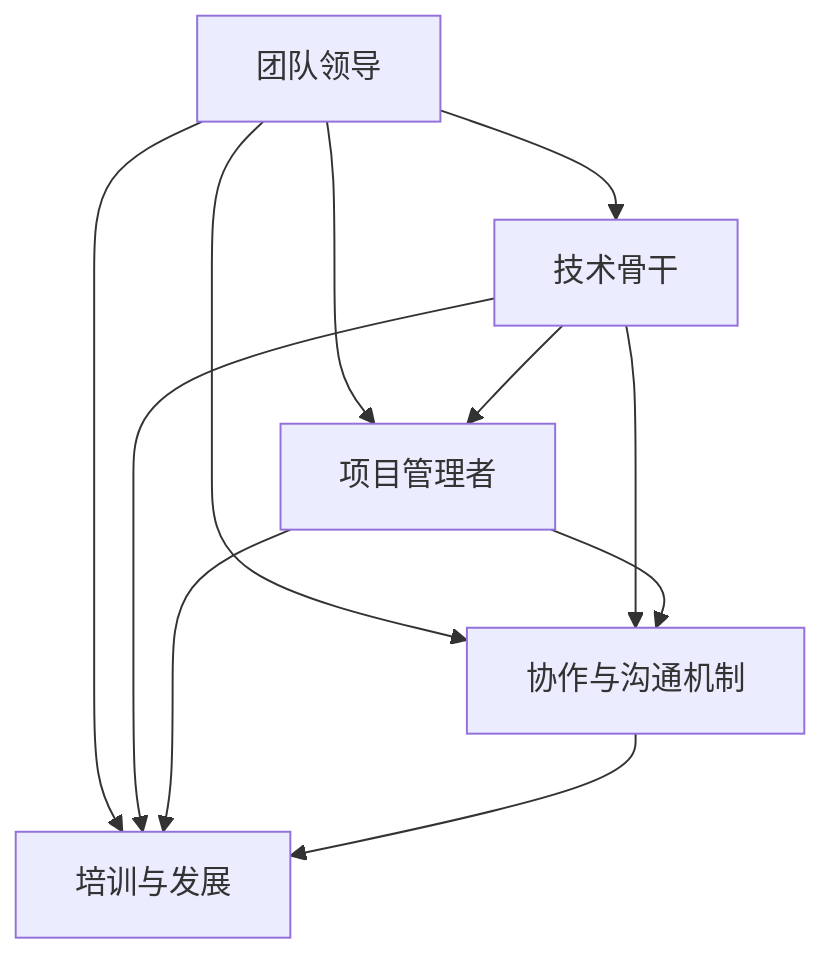
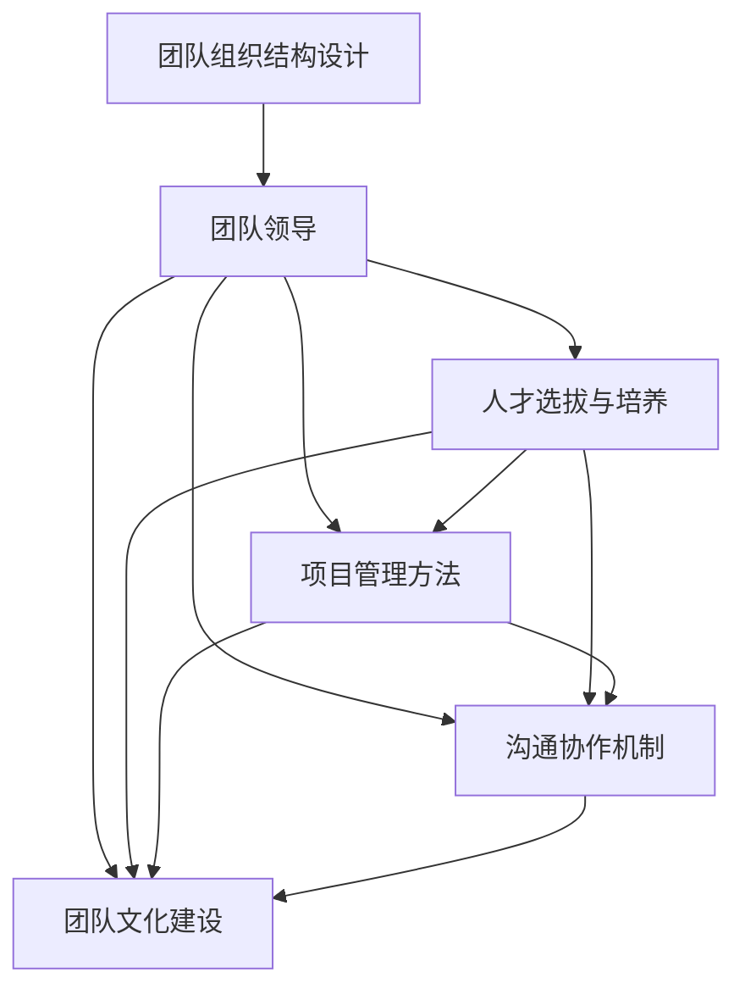

                 


## 打造高性能技术团队的方法论

在当今快速发展的技术时代，高性能技术团队是企业竞争力的核心。如何打造一支高效、协同、创新的技术团队，成为众多企业领导者和项目经理的迫切需求。本文旨在通过系统的方法论，从背景介绍、核心概念与联系、构建策略、团队文化建设以及实践与优化等五个部分，逐步解析如何打造出一支高性能技术团队。

### 关键词

- 高性能技术团队
- 团队组织结构设计
- 人才选拔与培养
- 项目管理方法
- 团队文化建设
- 实践与优化

### 摘要

本文首先介绍了高性能技术团队的背景和核心概念，包括团队的定义、属性和与传统团队的区别。接着，文章详细阐述了团队构建的策略，如组织结构设计、人才选拔与培养、项目管理方法和沟通协作机制。此外，团队文化的建设、激励机制与考核，以及团队建设的实践与优化策略也是本文的重要内容。通过本文的阅读，读者将能够全面理解并掌握打造高性能技术团队的系统方法。

### 目录大纲

```markdown
----------------------------------------------------------------
# 第一部分：背景介绍

## 第1章：问题背景

### 1.1.1 问题背景介绍

### 1.1.2 问题描述

### 1.1.3 问题解决方法

### 1.1.4 边界与外延

## 第2章：核心概念与联系

### 2.1.1 高性能技术团队的概念

#### 2.1.1.1 高性能技术团队的属性

#### 2.1.1.2 高性能技术团队与传统团队的区别

### 2.1.2 高性能技术团队的核心要素组成

#### 2.1.2.1 核心要素的定义

#### 2.1.2.2 核心要素之间的关系

### 2.1.3 核心概念之间的联系

#### 2.1.3.1 概念之间的关系图

----------------------------------------------------------------
# 第二部分：构建高性能技术团队的策略

## 第3章：团队组织结构设计

### 3.1.1 团队组织结构的定义

### 3.1.2 团队组织结构的设计原则

### 3.1.3 团队组织结构的设计流程

## 第4章：人才选拔与培养

### 4.1.1 人才选拔标准

### 4.1.2 人才选拔流程

### 4.1.3 人才培养策略

## 第5章：项目管理方法

### 5.1.1 项目管理的核心原则

### 5.1.2 项目管理的方法论

### 5.1.3 项目管理的工具与技术

## 第6章：沟通协作机制

### 6.1.1 沟通的重要性

### 6.1.2 协作机制的建立

### 6.1.3 沟通与协作的技巧

----------------------------------------------------------------
# 第三部分：团队文化建设

## 第7章：团队价值观与行为规范

### 7.1.1 团队价值观的建立

### 7.1.2 行为规范的制定

### 7.1.3 团队价值观与行为规范的关系

## 第8章：激励机制与考核

### 8.1.1 激励机制的设计

### 8.1.2 考核指标的选择

### 8.1.3 激励与考核的结合

## 第9章：团队文化建设案例

### 9.1.1 成功的团队文化建设案例

### 9.1.2 团队文化建设的挑战与应对策略

----------------------------------------------------------------
# 第四部分：实践与优化

## 第10章：团队建设实践

### 10.1.1 实践前的准备工作

### 10.1.2 实践过程中的关键节点

### 10.1.3 实践成果的分析与总结

## 第11章：团队优化策略

### 11.1.1 优化原则

### 11.1.2 优化方法

### 11.1.3 优化实践的案例分享

## 第12章：持续改进

### 12.1.1 持续改进的重要性

### 12.1.2 持续改进的方法

### 12.1.3 持续改进的案例分析

----------------------------------------------------------------
# 第五部分：附录

## 第13章：拓展阅读

### 13.1.1 相关书籍推荐

### 13.1.2 学术论文精选

### 13.1.3 在线课程推荐

## 第14章：参考文献

### 14.1 参考文献
```

### 第一部分：背景介绍

#### 第1章：问题背景

##### 1.1.1 问题背景介绍

在当今数字化时代，技术团队在企业发展中的作用日益凸显。然而，如何打造一支高性能的技术团队，成为企业领导者和项目经理面临的一大挑战。高性能技术团队不仅要求成员具备扎实的专业技能，还需要具备高效协同的工作能力和创新思维。在这种背景下，团队的组织结构、人才选拔与培养、项目管理以及团队文化建设等方面都成为了亟待解决的问题。

##### 1.1.2 问题描述

高性能技术团队的构建面临着以下问题：

1. **团队结构设计不合理**：传统的团队组织结构往往过于僵化，难以适应快速变化的技术需求，导致团队工作效率低下。
2. **人才选拔与培养不足**：企业在人才选拔过程中可能存在标准不明确、培养机制不完善等问题，导致团队整体素质不高。
3. **项目管理方法不当**：缺乏科学的项目管理方法，容易导致项目延期、成本超支等问题。
4. **沟通协作机制不畅**：团队内部沟通不畅，信息传递不及时，影响团队协作效率。
5. **团队文化建设不足**：缺乏共同的价值观和行为规范，导致团队成员之间缺乏凝聚力。

##### 1.1.3 问题解决方法

针对上述问题，我们可以采取以下解决方法：

1. **优化团队组织结构**：设计灵活、高效的团队组织结构，以适应快速变化的技术需求。
2. **完善人才选拔与培养机制**：建立科学的人才选拔标准，实施系统的培养策略，提升团队整体素质。
3. **采用科学的项目管理方法**：引入先进的项目管理方法论，提高项目管理效率。
4. **建立沟通协作机制**：构建良好的沟通协作机制，确保信息传递的及时性和准确性。
5. **加强团队文化建设**：建立共同的价值观和行为规范，增强团队凝聚力。

##### 1.1.4 边界与外延

在探讨高性能技术团队的构建时，需要明确以下几个方面的边界与外延：

1. **边界**：高性能技术团队的构建主要涉及团队组织结构、人才选拔与培养、项目管理、沟通协作和团队文化建设等方面，不包括其他管理层面的内容。
2. **外延**：高性能技术团队的构建不仅限于技术团队，还可以应用于其他类型的团队，如市场团队、销售团队等。

#### 第2章：核心概念与联系

##### 2.1.1 高性能技术团队的概念

高性能技术团队是指具备以下特点的团队：

1. **高效协同**：团队成员之间能够高效协同，快速响应技术需求，实现项目目标。
2. **创新能力**：团队成员具备创新思维，能够不断推动技术进步，提升团队竞争力。
3. **专业技能**：团队成员具备扎实的专业技能，能够快速掌握新技术，解决复杂问题。
4. **团队文化**：团队成员具备共同的价值观和行为规范，形成良好的团队氛围。

##### 2.1.1.1 高性能技术团队的属性

高性能技术团队的属性主要包括以下几个方面：

1. **团队结构**：灵活、高效、适应性强的团队组织结构。
2. **人才素质**：具备扎实的专业技能和创新能力的高素质人才。
3. **项目管理**：科学的项目管理方法，确保项目进度、质量和成本的有效控制。
4. **沟通协作**：良好的沟通协作机制，确保信息传递的及时性和准确性。
5. **团队文化**：共同的价值观和行为规范，形成良好的团队氛围。

##### 2.1.1.2 高性能技术团队与传统团队的区别

与传统团队相比，高性能技术团队具有以下几个方面的区别：

1. **团队结构**：传统团队组织结构较为僵化，高性能技术团队结构灵活、适应性更强。
2. **人才素质**：传统团队对人才要求较低，高性能技术团队对人才素质要求更高。
3. **项目管理**：传统团队项目管理方法较为粗放，高性能技术团队采用科学的项目管理方法。
4. **沟通协作**：传统团队沟通协作机制不够完善，高性能技术团队沟通协作机制更加高效。
5. **团队文化**：传统团队文化建设不足，高性能技术团队文化建设更加重视共同价值观和行为规范。

##### 2.1.2 高性能技术团队的核心要素组成

高性能技术团队的核心要素主要包括以下几个方面：

1. **团队领导**：具备领导力、决策力和执行力的团队领导者。
2. **技术骨干**：具备扎实专业技能和丰富经验的骨干成员。
3. **项目管理者**：具备项目管理能力和丰富经验的项目管理者。
4. **协作与沟通机制**：有效的协作与沟通机制，确保团队高效运作。
5. **培训与发展**：系统的培训与发展机制，提升团队整体素质。

##### 2.1.2.1 核心要素的定义

核心要素的定义如下：

1. **团队领导**：团队领导是指负责团队整体战略规划、目标设定、团队协调与激励等工作的团队成员。
2. **技术骨干**：技术骨干是指具备扎实专业技能、丰富经验和技术创新能力的团队成员。
3. **项目管理者**：项目管理者是指负责项目计划、执行、监控与收尾等工作的团队成员。
4. **协作与沟通机制**：协作与沟通机制是指团队成员之间进行信息交流、任务分配、协作与沟通的流程和制度。
5. **培训与发展**：培训与发展是指为提升团队成员专业技能和综合素质而提供的培训和学习机会。

##### 2.1.2.2 核心要素之间的关系

核心要素之间的关系如图1所示。



图1：高性能技术团队核心要素之间的关系

##### 2.1.3 核心概念之间的联系

核心概念之间的联系如图2所示。



图2：高性能技术团队核心概念之间的联系

### 第二部分：构建高性能技术团队的策略

#### 第3章：团队组织结构设计

##### 3.1.1 团队组织结构的定义

团队组织结构是指团队成员在团队内部的组织形式、分工合作方式以及相互之间的关系。合理的团队组织结构有助于提高团队工作效率，实现团队目标。

##### 3.1.2 团队组织结构的设计原则

设计团队组织结构时，应遵循以下原则：

1. **适应性**：团队组织结构应具有适应性，能够根据团队目标、任务和环境的变化进行调整。
2. **高效性**：团队组织结构应确保团队成员之间的协作效率，减少信息传递的障碍。
3. **灵活性**：团队组织结构应具备灵活性，能够快速响应变化，适应新的工作任务。
4. **层级清晰**：团队组织结构应明确各层级的职责和权限，确保团队成员之间的协作顺畅。

##### 3.1.3 团队组织结构的设计流程

设计团队组织结构时，可遵循以下流程：

1. **确定团队目标**：明确团队的目标和任务，为后续组织结构设计提供依据。
2. **分析任务和工作流程**：分析团队的任务和工作流程，识别关键环节和瓶颈。
3. **确定组织形式**：根据团队目标和任务，选择合适的团队组织形式，如职能型、项目型、矩阵型等。
4. **划分团队职责**：明确各团队成员的职责和权限，确保团队协作顺畅。
5. **优化组织结构**：根据团队运行情况和反馈，对组织结构进行持续优化。

#### 第4章：人才选拔与培养

##### 4.1.1 人才选拔标准

人才选拔是团队建设的关键环节。以下是人才选拔的几个标准：

1. **专业技能**：具备扎实的专业技能和丰富的实践经验，能够胜任团队工作任务。
2. **学习能力**：具备快速学习新知识和技能的能力，能够适应技术变化。
3. **沟通能力**：具备良好的沟通能力，能够与团队成员、上级和客户有效沟通。
4. **团队合作**：具备团队合作精神，能够积极协作，共同实现团队目标。
5. **责任心**：具备强烈的责任心，能够认真负责地完成工作任务。

##### 4.1.2 人才选拔流程

人才选拔流程如下：

1. **发布招聘信息**：根据团队需求，发布招聘信息，吸引合适的人才。
2. **筛选简历**：对收到的简历进行初步筛选，筛选出符合条件的人才。
3. **面试评估**：对通过筛选的人才进行面试评估，了解其专业技能、学习能力、沟通能力和团队合作精神。
4. **背景调查**：对通过面试的人才进行背景调查，核实其工作经历和技能水平。
5. **录用决策**：根据面试评估和背景调查结果，做出录用决策。

##### 4.1.3 人才培养策略

人才培养策略如下：

1. **培训计划**：根据团队需求和成员实际情况，制定系统的培训计划，包括专业技能培训、项目管理培训、沟通能力培训等。
2. **导师制度**：为新人配备导师，指导其成长，帮助其快速融入团队。
3. **鼓励学习**：鼓励团队成员参加外部培训和认证，提升自身技能水平。
4. **项目实战**：通过实际项目锻炼，提升团队成员的实战能力和团队合作能力。
5. **绩效评估**：建立科学的绩效评估体系，激励团队成员不断进步。

#### 第5章：项目管理方法

##### 5.1.1 项目管理的核心原则

项目管理的核心原则如下：

1. **目标导向**：项目管理应以实现团队目标为导向，确保项目进度、质量和成本的有效控制。
2. **全过程管理**：项目管理应涵盖项目启动、规划、执行、监控和收尾等全过程。
3. **团队协作**：项目管理应注重团队协作，充分发挥团队成员的潜力，共同实现项目目标。
4. **风险管理**：项目管理应识别、评估和控制项目风险，确保项目顺利进行。
5. **持续改进**：项目管理应不断总结经验教训，持续改进管理方法和流程。

##### 5.1.2 项目管理的方法论

项目管理的方法论主要包括以下几种：

1. **瀑布模型**：按照需求分析、设计、开发、测试等阶段依次进行，适用于需求明确、变更较少的项目。
2. **敏捷开发**：强调快速迭代、灵活应对变更，适用于需求变化频繁、对速度和灵活性要求较高的项目。
3. **六西格玛**：通过持续改进和优化，降低项目缺陷率，提高项目质量。
4. **风险管理**：通过识别、评估和控制项目风险，确保项目顺利进行。
5. **质量管理**：通过建立质量管理体系，确保项目质量达到预期标准。

##### 5.1.3 项目管理的工具与技术

项目管理的工具与技术主要包括以下几种：

1. **项目管理软件**：如JIRA、Trello等，用于任务管理、进度跟踪和协作沟通。
2. **甘特图**：用于展示项目进度和任务安排，直观地反映项目进展情况。
3. **鱼骨图**：用于分析项目问题，找出根本原因。
4. **SWOT分析**：用于评估项目优势、劣势、机会和威胁，为项目决策提供依据。
5. **SMART目标**：用于设定明确、可衡量、可实现、相关和时限性的项目目标。

#### 第6章：沟通协作机制

##### 6.1.1 沟通的重要性

沟通是团队协作的基础。良好的沟通有助于以下方面：

1. **信息传递**：确保团队成员之间及时、准确地传递信息，避免误解和冲突。
2. **协作效率**：提高团队协作效率，减少沟通成本和时间浪费。
3. **决策支持**：为团队成员提供充分的信息支持，提高决策质量和速度。
4. **团队凝聚力**：增强团队成员之间的信任和合作精神，提升团队凝聚力。

##### 6.1.2 协作机制的建立

建立有效的协作机制，应考虑以下几个方面：

1. **沟通渠道**：建立多样化的沟通渠道，如会议、邮件、即时通讯等，满足不同场景的沟通需求。
2. **沟通规范**：制定明确的沟通规范，如沟通格式、语言风格、回复时限等，确保沟通的高效和有序。
3. **协作平台**：采用协作平台，如Confluence、GitLab等，集中管理项目文档、代码和任务，提高协作效率。
4. **反馈机制**：建立反馈机制，及时收集团队成员的意见和建议，优化协作流程。
5. **培训与指导**：对团队成员进行沟通协作培训，提高沟通协作能力。

##### 6.1.3 沟通与协作的技巧

有效沟通与协作需要掌握以下技巧：

1. **倾听**：倾听是有效沟通的关键，要尊重对方的意见，理解对方的观点。
2. **表达**：清晰、准确地表达自己的观点，避免歧义和误解。
3. **提问**：善于提问，引导对方提供更多信息，深入探讨问题。
4. **反馈**：及时给予反馈，肯定对方的优点，指出不足之处，促进共同进步。
5. **合作**：积极合作，尊重团队决策，共同承担责任。

### 第三部分：团队文化建设

#### 第7章：团队价值观与行为规范

##### 7.1.1 团队价值观的建立

团队价值观是团队文化的核心，是团队成员共同遵循的行为准则。建立团队价值观应遵循以下原则：

1. **目标一致性**：团队价值观应与团队目标和愿景一致，激励团队成员为实现共同目标而努力。
2. **包容性**：团队价值观应具有包容性，尊重团队成员的差异，促进团队内部和谐。
3. **可持续性**：团队价值观应具有可持续性，能够在长期内指导团队行为，推动团队发展。
4. **激励性**：团队价值观应具有激励性，激发团队成员的积极性和创造力，提升团队整体绩效。

##### 7.1.2 行为规范的制定

行为规范是团队价值观的具体体现，是团队成员在团队中应遵循的行为准则。制定行为规范应考虑以下几个方面：

1. **明确性**：行为规范应明确具体，便于团队成员理解和遵守。
2. **公正性**：行为规范应公正合理，确保团队成员在同等条件下受到公正对待。
3. **可操作性**：行为规范应具备可操作性，能够在实际工作中得到有效执行。
4. **灵活性**：行为规范应具有一定的灵活性，能够根据团队实际情况进行调整。

##### 7.1.3 团队价值观与行为规范的关系

团队价值观与行为规范之间存在密切的关系：

1. **指导作用**：团队价值观指导行为规范，为行为规范提供依据。
2. **相互促进**：行为规范是团队价值观的具体体现，同时有助于强化团队价值观。
3. **协调统一**：团队价值观和行为规范相互协调、统一，共同推动团队发展。

#### 第8章：激励机制与考核

##### 8.1.1 激励机制的设计

激励机制是团队管理的重要手段，能够激发团队成员的积极性和创造力。设计激励机制应考虑以下几个方面：

1. **目标导向**：激励机制应与团队目标和个人目标相结合，确保团队成员为实现共同目标而努力。
2. **多样性**：激励机制应具有多样性，包括物质激励、精神激励、成长激励等，满足不同团队成员的需求。
3. **公平性**：激励机制应公平合理，确保团队成员在同等条件下受到公平对待。
4. **及时性**：激励机制应具有及时性，及时对团队成员的绩效进行评估和激励。
5. **可持续性**：激励机制应具有可持续性，能够长期激发团队成员的积极性和创造力。

##### 8.1.2 考核指标的选择

考核指标是评估团队成员绩效的重要依据，选择合适的考核指标至关重要。考核指标的选择应考虑以下几个方面：

1. **明确性**：考核指标应明确具体，便于团队成员理解和执行。
2. **可衡量性**：考核指标应具有可衡量性，能够通过数据或事实进行量化评估。
3. **相关性**：考核指标应与团队目标和个人目标相关，能够反映团队成员的绩效水平。
4. **公正性**：考核指标应公正合理，确保团队成员在同等条件下受到公正对待。
5. **灵活性**：考核指标应具有一定的灵活性，能够根据团队实际情况进行调整。

##### 8.1.3 激励与考核的结合

激励与考核是相辅相成的，有效的结合能够充分发挥两者的作用。激励与考核的结合应遵循以下原则：

1. **目标一致性**：激励与考核目标应一致，确保团队成员在共同目标下努力。
2. **过程透明**：激励与考核过程应透明，确保团队成员了解考核标准和激励政策。
3. **及时反馈**：激励与考核结果应及时反馈给团队成员，帮助其了解自身绩效，明确改进方向。
4. **持续改进**：激励与考核应持续改进，根据团队实际情况和反馈进行调整，提高激励和考核的有效性。

#### 第9章：团队文化建设案例

##### 9.1.1 成功的团队文化建设案例

成功的团队文化建设案例有以下特点：

1. **共同价值观**：团队形成了共同的价值观，如“用户至上”、“创新进取”等，成为团队行为的准则。
2. **良好的氛围**：团队形成了良好的氛围，如尊重、信任、合作等，提高了团队成员的满意度和归属感。
3. **激励机制**：团队建立了有效的激励机制，如绩效奖金、荣誉表彰等，激发了团队成员的积极性和创造力。
4. **持续改进**：团队持续改进团队文化，如定期开展团队活动、培训等，提高了团队成员的能力和素质。
5. **成果显著**：团队在文化建设过程中取得了显著成果，如项目成功率提高、产品质量提升、团队凝聚力增强等。

##### 9.1.2 团队文化建设的挑战与应对策略

团队文化建设过程中可能面临以下挑战：

1. **文化差异**：团队成员来自不同的背景，文化差异可能导致团队内部的冲突和矛盾。
2. **缺乏共识**：团队成员对团队文化的理解和认同度不一致，缺乏共同的目标和价值观。
3. **执行力不足**：团队文化建设的策略和措施缺乏执行力，难以真正落地。
4. **外部环境变化**：外部环境的变化可能对团队文化建设产生影响，如市场竞争加剧、政策调整等。

应对策略如下：

1. **加强沟通与协调**：通过有效的沟通与协调，促进团队成员之间的理解与认同，减少文化差异带来的冲突。
2. **建立共同目标**：明确团队目标和愿景，使团队成员对团队文化有共同的理解和认同。
3. **强化执行力**：建立有效的执行机制，确保团队文化建设的策略和措施得到有效实施。
4. **灵活应对外部环境变化**：根据外部环境的变化，及时调整团队文化建设的策略和措施，保持团队文化的活力和适应性。

### 第四部分：实践与优化

#### 第10章：团队建设实践

##### 10.1.1 实践前的准备工作

在开展团队建设实践之前，需要进行以下准备工作：

1. **明确团队目标**：明确团队的目标和愿景，为后续团队建设提供方向。
2. **组建团队**：根据团队目标，组建合适的团队，确保团队成员具备相应的技能和素质。
3. **制定团队建设计划**：根据团队目标和现状，制定具体的团队建设计划，包括组织结构设计、人才选拔与培养、项目管理方法等。
4. **沟通与协调**：与团队成员进行充分的沟通与协调，确保团队建设计划的顺利实施。

##### 10.1.2 实践过程中的关键节点

在团队建设实践过程中，需要关注以下关键节点：

1. **组织结构设计**：根据团队目标和任务，设计合理的组织结构，确保团队高效运作。
2. **人才选拔与培养**：按照人才选拔标准，选拔合适的团队成员，同时进行系统的培训与发展，提升团队整体素质。
3. **项目管理**：采用科学的项目管理方法，确保项目进度、质量和成本的有效控制。
4. **沟通协作**：建立良好的沟通协作机制，确保团队成员之间的信息传递和协作顺畅。
5. **团队文化建设**：开展团队文化建设活动，强化团队价值观和行为规范，提高团队凝聚力。

##### 10.1.3 实践成果的分析与总结

在团队建设实践完成后，需要对实践成果进行分析与总结：

1. **成果分析**：分析团队建设实践取得的成果，如项目成功率、产品质量、团队凝聚力等。
2. **经验总结**：总结团队建设实践中的经验教训，包括成功经验、存在问题、改进措施等。
3. **优化建议**：根据实践成果和分析结果，提出团队建设的优化建议，为后续团队建设提供参考。

#### 第11章：团队优化策略

##### 11.1.1 优化原则

团队优化应遵循以下原则：

1. **目标导向**：以团队目标为导向，优化团队的组织结构、人才选拔、项目管理等方面。
2. **持续改进**：持续改进团队建设的方法和流程，提高团队工作效率和绩效。
3. **灵活性**：保持团队的灵活性，根据团队实际情况和环境变化进行适应性调整。
4. **员工参与**：鼓励团队成员参与团队优化，提高团队优化方案的可操作性和执行力。

##### 11.1.2 优化方法

团队优化可以采用以下方法：

1. **SWOT分析**：通过SWOT分析，识别团队的优势、劣势、机会和威胁，为团队优化提供依据。
2. **流程优化**：优化团队工作流程，消除冗余环节，提高工作效率。
3. **工具与技术**：引入先进的项目管理工具和技术，提高项目管理效率和质量。
4. **绩效评估**：建立科学的绩效评估体系，激励团队成员不断进步。

##### 11.1.3 优化实践的案例分享

以下是一个团队优化实践的案例分享：

某互联网公司在团队建设过程中，发现项目管理效率低下、沟通协作不畅等问题。为解决这些问题，公司采取了以下优化措施：

1. **引入敏捷开发**：将瀑布模型的项目管理方法改为敏捷开发，提高项目响应速度和灵活性。
2. **建立沟通协作机制**：采用即时通讯工具，建立团队成员之间的沟通渠道，确保信息传递及时、准确。
3. **培训与指导**：对团队成员进行项目管理培训和沟通技巧培训，提高团队整体能力。
4. **优化流程**：重新梳理团队工作流程，消除冗余环节，提高工作效率。
5. **绩效评估**：建立科学的绩效评估体系，激励团队成员积极投入工作。

通过以上优化措施，该公司的团队工作效率显著提高，项目质量和客户满意度也得到提升。

#### 第12章：持续改进

##### 12.1.1 持续改进的重要性

持续改进是团队管理的重要组成部分，对于提升团队绩效和竞争力具有重要意义：

1. **提高团队绩效**：持续改进能够不断优化团队的工作流程和方法，提高团队工作效率和绩效。
2. **增强竞争力**：持续改进能够使团队保持技术领先和市场竞争力，为企业的长期发展提供支持。
3. **提升团队凝聚力**：持续改进能够激发团队成员的积极性和创造力，增强团队凝聚力。
4. **适应变化**：持续改进能够使团队适应快速变化的市场和技术环境，提高团队的灵活性和适应性。

##### 12.1.2 持续改进的方法

持续改进可以采用以下方法：

1. **PDCA循环**：采用PDCA（计划、执行、检查、行动）循环，不断优化团队的工作流程和方法。
2. **标杆管理**：借鉴其他优秀团队的实践，引入先进的理念和技术，提升团队绩效。
3. **问题解决**：定期识别和解决团队工作中的问题，消除瓶颈和障碍，提高团队效率。
4. **创新驱动**：鼓励团队成员提出创新的想法和方案，推动团队持续改进。

##### 12.1.3 持续改进的案例分析

以下是一个持续改进的案例分析：

某互联网公司为提升团队绩效和竞争力，采取了以下持续改进措施：

1. **引入敏捷开发**：将传统的瀑布模型项目管理方法改为敏捷开发，提高项目响应速度和灵活性。
2. **建立反馈机制**：建立定期反馈机制，收集团队成员对工作流程和方法的意见和建议，及时进行改进。
3. **培训与发展**：对团队成员进行项目管理培训和沟通技巧培训，提高团队整体能力。
4. **优化流程**：重新梳理团队工作流程，消除冗余环节，提高工作效率。
5. **绩效评估**：建立科学的绩效评估体系，激励团队成员积极投入工作。

通过以上持续改进措施，该公司的团队工作效率显著提高，项目质量和客户满意度也得到提升，团队整体竞争力得到增强。

### 第五部分：附录

#### 第13章：拓展阅读

##### 13.1.1 相关书籍推荐

1. 《敏捷开发实践指南》（作者：Jeff Sutherland）
2. 《软件项目管理》（作者：Steve McConnell）
3. 《团队协作工具与实践》（作者：Lynda Feldhake）

##### 13.1.2 学术论文精选

1. "Agile Project Management: Creating Competitive Advantage" by David J. Anderson
2. "The Role of Communication in Team Performance" by Linda Argote and Ralph E. Porter
3. "The Importance of Team Building in High-Performance Organizations" by Karen A. Polenske

##### 13.1.3 在线课程推荐

1. "Scrum: The Complete Guide to Scrum: Agile Project Management"（Udemy）
2. "Project Management Professional (PMP) Certification Training"（LinkedIn Learning）
3. "Effective Teamwork: Building Great Teams"（Coursera）

#### 第14章：参考文献

1. Jeff Sutherland. Agile Project Management: Creating Competitive Advantage [M]. Wiley, 2005.
2. Steve McConnell. Software Project Management: A Managerial Approach [M]. Redmond, WA: Microsoft Press, 1996.
3. Lynda Feldhake. Team Collaboration Tools & Techniques [M]. Springer, 2018.
4. David J. Anderson. Agile Project Management: Creating Competitive Advantage [J]. Project Management Journal, 2007, 38(3): 19-32.
5. Linda Argote and Ralph E. Porter. The Role of Communication in Team Performance [J]. Academy of Management Journal, 2000, 43(5): 741-759.
6. Karen A. Polenske. The Importance of Team Building in High-Performance Organizations [J]. Journal of Management Studies, 2010, 47(5): 762-777.

