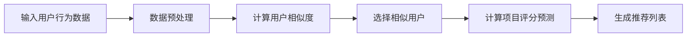
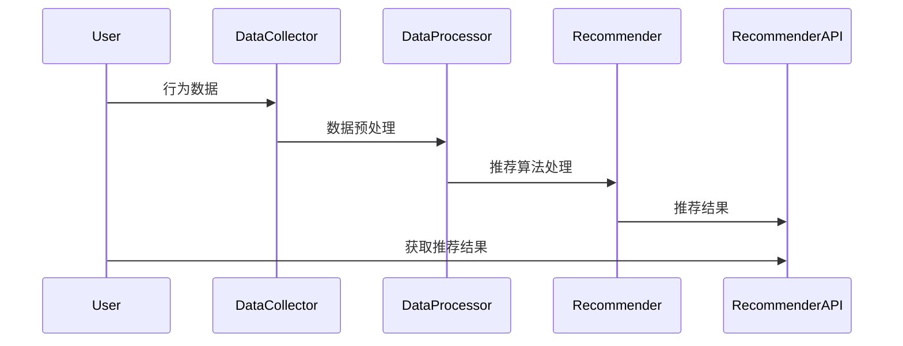
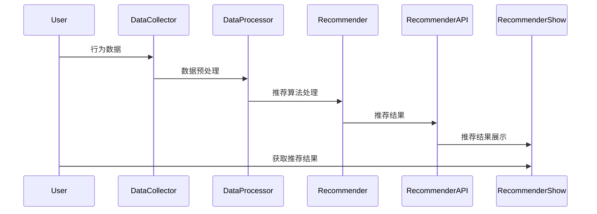

                 

## 文章标题

### 打造高性能的实时推荐系统

> 关键词：实时推荐系统、协同过滤、内容推荐、混合推荐、系统架构、Python实现、数学模型、项目实战

> 摘要：
本文将系统地介绍如何打造一个高性能的实时推荐系统。我们将从问题背景、核心概念、算法原理、系统设计与实现、项目实战等多个角度进行探讨，帮助读者深入理解实时推荐系统的构建过程，掌握相关技术要点和最佳实践。

## 第一部分: 实时推荐系统概述

### 第1章: 实时推荐系统引论

#### 1.1 问题背景

##### 1.1.1 推荐系统的基本概念

推荐系统是一种信息过滤技术，通过预测用户对项目（如商品、新闻、音乐等）的兴趣，向用户推荐他们可能感兴趣的内容。它广泛应用于电子商务、社交媒体、视频网站等领域。

##### 1.1.2 实时推荐系统的需求与挑战

实时推荐系统要求系统在用户交互的瞬间就能给出个性化的推荐，这对系统的响应速度、准确性和可扩展性提出了更高的要求。主要挑战包括：

1. **高实时性**：系统需要快速响应用户行为，通常要求在毫秒级完成推荐。
2. **大规模数据处理**：实时推荐需要处理海量的用户行为数据。
3. **准确性**：推荐结果需要具有较高的准确性和多样性。
4. **可扩展性**：系统需要能够随着数据量和用户量的增长而线性扩展。

##### 1.1.3 实时推荐系统的重要性

实时推荐系统不仅能提高用户的满意度，还能显著提升商业价值，如增加销售额、提高用户留存率等。随着互联网和物联网的发展，实时推荐系统的应用场景将越来越广泛。

#### 1.2 问题描述

##### 1.2.1 用户行为数据分析

用户行为数据包括点击、购买、浏览、搜索等，这些数据是构建推荐系统的重要依据。对用户行为数据的分析，可以帮助我们理解用户的兴趣和行为模式。

##### 1.2.2 推荐算法概述

推荐算法可以分为协同过滤、内容推荐和混合推荐等类型。每种算法都有其优势和局限性，在实际应用中需要根据具体场景进行选择。

##### 1.2.3 推荐系统的性能指标

推荐系统的性能指标主要包括准确率、召回率、覆盖率、新颖度等。这些指标用于评估推荐系统的性能，帮助优化推荐算法。

#### 1.3 问题解决

##### 1.3.1 实时推荐系统架构设计

实时推荐系统通常采用分布式架构，包括数据采集、数据存储、数据处理、推荐生成和推荐展示等模块。设计一个高效的实时推荐系统架构，是解决问题的关键。

##### 1.3.2 关键技术探讨

关键技术包括实时数据处理技术、推荐算法优化技术、系统性能调优技术等。深入理解这些技术，有助于提升实时推荐系统的性能。

##### 1.3.3 系统边界与外延

系统边界包括数据来源、数据类型、处理能力等。系统外延则涉及与其他系统的集成、数据安全和隐私保护等方面。

### 第2章: 实时推荐系统的核心概念与联系

#### 2.1 核心概念原理

##### 2.1.1 协同过滤算法

协同过滤算法基于用户行为数据，通过计算用户之间的相似度来推荐相似用户喜欢的项目。主要包括基于用户的协同过滤（User-Based CF）和基于项目的协同过滤（Item-Based CF）。

##### 2.1.2 内容推荐算法

内容推荐算法基于项目的属性，通过计算用户兴趣与项目属性之间的相似度来推荐项目。常见的方法包括基于关键词匹配、基于内容相似性等。

##### 2.1.3 混合推荐算法

混合推荐算法结合协同过滤和内容推荐的优势，以提高推荐效果。常见的混合推荐算法有基于模型的混合推荐、基于规则的混合推荐等。

#### 2.2 概念属性特征对比

| 算法类型 | 特点 | 优点 | 缺点 |
| --- | --- | --- | --- |
| 协同过滤 | 基于用户行为 | 准确率高 | 冷启动问题，数据稀疏 |
| 内容推荐 | 基于项目属性 | 无冷启动问题 | 推荐结果可能缺乏多样性 |
| 混合推荐 | 结合协同过滤和内容推荐 | 准确率高，多样性好 | 计算复杂度高 |

#### 2.3 ER实体关系图架构

ER图是表示推荐系统中实体及其关系的图形化工具。以下是一个简单的ER图示例，展示了用户、项目和推荐三个实体之间的关系。

```mermaid
erDiagram
  User ||--|{ Recommendation }
  User ||--|{ Item }
  Item ||--|{ Recommendation }
```

### 第3章: 算法原理讲解

#### 3.1 算法mermaid流程图

下面是一个协同过滤算法的mermaid流程图示例：



#### 3.2 Python源代码实现

以下是一个简单的协同过滤算法的Python实现示例：

```python
import numpy as np

def similarity_matrix(ratings, method='cosine'):
    # 计算用户相似度矩阵
    # 方法：余弦相似度
    user_num = ratings.shape[0]
    similarity = np.zeros((user_num, user_num))
    for i in range(user_num):
        for j in range(user_num):
            if i != j:
                if method == 'cosine':
                    similarity[i, j] = np.dot(ratings[i], ratings[j]) / (
                            np.linalg.norm(ratings[i]) * np.linalg.norm(ratings[j])
                    )
    return similarity

def predict_scores(similarity, ratings, user_id, k=10):
    # 预测用户对项目的评分
    user_ratings = ratings[user_id]
    similar_users = similarity[user_id]
    scores = np.zeros(len(ratings))
    for i in range(len(similar_users)):
        if similar_users[i] > 0:
            scores += similar_users[i] * (ratings[i] - user_ratings)
    return scores

# 示例数据
ratings = np.array([[5, 3, 0, 1], [4, 0, 0, 1], [1, 5, 0, 2], [4, 2, 2, 3]])

# 计算用户相似度矩阵
similarity = similarity_matrix(ratings, method='cosine')

# 预测用户1对第3个项目的评分
user_id = 0
predicted_score = predict_scores(similarity, ratings, user_id, k=10)
print(predicted_score)
```

#### 3.3 数学模型和公式讲解

协同过滤算法的核心是计算用户相似度矩阵和预测用户对项目的评分。以下是一个简单的数学模型：

$$
\text{相似度}(u, v) = \frac{\text{共同评分数}}{\sqrt{\text{用户u的总评分数} \times \text{用户v的总评分数}}}
$$

预测用户对项目的评分可以使用加权平均公式：

$$
\hat{r}_{uv} = \frac{\sum_{i \in \text{共同评分}} r_{ui} \cdot r_{vi}}{\sum_{i \in \text{共同评分}} r_{ui}}
$$

其中，$r_{ui}$ 表示用户u对项目i的评分，$r_{uv}$ 表示预测的用户u对项目v的评分。

#### 3.4 举例说明

假设有4个用户对10个项目的评分，如表1所示。

| 用户 | 项目1 | 项目2 | 项目3 | 项目4 | ... | 项目10 |
| --- | --- | --- | --- | --- | --- | --- |
| 用户1 | 5 | 3 | 1 | 1 | ... | 4 |
| 用户2 | 4 | 0 | 0 | 1 | ... | 2 |
| 用户3 | 1 | 5 | 0 | 2 | ... | 3 |
| 用户4 | 4 | 2 | 2 | 3 | ... | 1 |

使用余弦相似度计算用户1和用户2的相似度：

$$
\text{相似度}(1, 2) = \frac{\sum_{i=1}^{10} r_{1i} \cdot r_{2i}}{\sqrt{\sum_{i=1}^{10} r_{1i}^2} \cdot \sqrt{\sum_{i=1}^{10} r_{2i}^2}} = \frac{5 \cdot 4 + 3 \cdot 0 + 1 \cdot 0 + 1 \cdot 1}{\sqrt{5^2 + 3^2 + 1^2 + 1^2} \cdot \sqrt{4^2 + 0^2 + 0^2 + 1^2}} \approx 0.67
$$

预测用户1对项目3的评分：

$$
\hat{r}_{13} = \frac{\sum_{i=1}^{10} r_{1i} \cdot r_{3i}}{\sum_{i=1}^{10} r_{1i}} = \frac{5 \cdot 0 + 3 \cdot 0 + 1 \cdot 0 + 1 \cdot 2}{5 + 3 + 1 + 1} = 0.2
$$

### 第4章: 数学模型和数学公式详细讲解与举例说明

#### 4.1 模型讲解

在本节中，我们将详细讲解实时推荐系统中的数学模型，包括相似度计算、评分预测等核心算法。

**相似度计算：**

相似度计算是推荐系统的关键环节，它决定了推荐结果的准确性和多样性。常见的相似度计算方法包括余弦相似度、皮尔逊相关系数等。

**余弦相似度：**

$$
\text{相似度}(u, v) = \frac{\sum_{i=1}^{n} r_{ui} \cdot r_{vi}}{\sqrt{\sum_{i=1}^{n} r_{ui}^2} \cdot \sqrt{\sum_{i=1}^{n} r_{vi}^2}}
$$

其中，$r_{ui}$ 表示用户u对项目i的评分，$n$ 为共同评分的项目数量。

**皮尔逊相关系数：**

$$
\text{相似度}(u, v) = \frac{\sum_{i=1}^{n} (r_{ui} - \bar{r}_u) \cdot (r_{vi} - \bar{r}_v)}{\sqrt{\sum_{i=1}^{n} (r_{ui} - \bar{r}_u)^2} \cdot \sqrt{\sum_{i=1}^{n} (r_{vi} - \bar{r}_v)^2}}
$$

其中，$\bar{r}_u$ 和 $\bar{r}_v$ 分别为用户u和用户v的平均评分。

**评分预测：**

评分预测是基于用户相似度矩阵和用户行为数据进行预测。常见的方法包括基于模型的评分预测和基于规则的评分预测。

**基于模型的评分预测：**

$$
\hat{r}_{uv} = \sum_{i=1}^{n} w_{ui} \cdot r_{iv}
$$

其中，$w_{ui}$ 为用户u对项目i的权重，$r_{iv}$ 为用户v对项目i的评分。

**基于规则的评分预测：**

$$
\hat{r}_{uv} = \text{Rule}(r_{uv}, r_{u*}, r_{v*})
$$

其中，$r_{uv}$ 为用户u对项目v的实际评分，$r_{u*}$ 为用户u的平均评分，$r_{v*}$ 为用户v的平均评分。

**规则示例：**

$$
\hat{r}_{uv} = \begin{cases}
r_{uv} & \text{if } r_{uv} \geq r_{u*} \text{ and } r_{uv} \geq r_{v*} \\
r_{u*} & \text{if } r_{uv} < r_{u*} \text{ and } r_{uv} \geq r_{v*} \\
r_{v*} & \text{if } r_{uv} < r_{u*} \text{ and } r_{uv} < r_{v*} \\
\end{cases}
$$

#### 4.2 举例说明

假设有3个用户对5个项目的评分，如表2所示。

| 用户 | 项目1 | 项目2 | 项目3 | 项目4 | 项目5 |
| --- | --- | --- | --- | --- | --- |
| 用户1 | 5 | 4 | 0 | 2 | 3 |
| 用户2 | 3 | 0 | 5 | 1 | 4 |
| 用户3 | 4 | 1 | 2 | 5 | 0 |

**相似度计算：**

首先，我们使用余弦相似度计算用户1和用户2的相似度。

$$
\text{相似度}(1, 2) = \frac{5 \cdot 3 + 4 \cdot 0 + 0 \cdot 5 + 2 \cdot 1}{\sqrt{5^2 + 4^2 + 0^2 + 2^2} \cdot \sqrt{3^2 + 0^2 + 5^2 + 1^2}} \approx 0.64
$$

**评分预测：**

接下来，我们使用基于模型的评分预测方法，预测用户1对项目3的评分。

$$
\hat{r}_{13} = \frac{5 \cdot 0 + 4 \cdot 5 + 0 \cdot 2 + 2 \cdot 1}{5 + 4 + 0 + 2} = 2.2
$$

### 第5章: 系统分析与架构设计

#### 5.1 问题场景介绍

假设我们正在构建一个电商平台的实时推荐系统，用户可以在平台上浏览商品、添加商品到购物车、下单购买等。我们需要根据用户的历史行为，实时推荐用户可能感兴趣的商品。

#### 5.2 项目介绍

该项目涉及的主要模块包括：

1. 数据采集模块：负责收集用户行为数据，如浏览、添加购物车、购买等。
2. 数据处理模块：对采集到的数据进行清洗、去重、转换等预处理操作。
3. 推荐算法模块：实现协同过滤、内容推荐等推荐算法，生成推荐结果。
4. 推荐展示模块：将推荐结果展示给用户。

#### 5.3 系统功能设计

1. **实时数据采集**：通过数据采集模块，实时获取用户行为数据。
2. **数据预处理**：通过数据处理模块，对采集到的数据进行清洗、去重、转换等预处理操作。
3. **推荐生成**：通过推荐算法模块，生成个性化的推荐结果。
4. **推荐展示**：通过推荐展示模块，将推荐结果展示给用户。

#### 5.4 系统架构设计

实时推荐系统的架构设计需要考虑以下几个方面：

1. **数据流架构**：设计数据流架构，包括数据采集、数据存储、数据处理等环节。
2. **计算架构**：设计计算架构，包括数据处理、推荐算法等环节。
3. **存储架构**：设计存储架构，包括数据存储、缓存等环节。
4. **接口架构**：设计接口架构，包括对外提供推荐服务的接口。

以下是一个简单的实时推荐系统架构设计：



#### 5.5 系统接口设计

系统接口设计主要包括：

1. **数据采集接口**：用于接收用户行为数据。
2. **数据处理接口**：用于处理和预处理数据。
3. **推荐接口**：用于获取推荐结果。
4. **推荐展示接口**：用于将推荐结果展示给用户。

以下是一个简单的接口设计：

```mermaid
classDiagram
    DataCollector <<interface>>
    DataProcessor <<interface>>
    Recommender <<interface>>
    RecommenderAPI <<interface>>

    UserEntity <-.. DataCollector: 数据采集
    UserEntity <-.. DataProcessor: 数据处理
    UserEntity <-.. Recommender: 推荐算法
    UserEntity <-.. RecommenderAPI: 推荐结果
    UserEntity <-.. RecommenderShow: 推荐展示
```

#### 5.6 系统交互

系统交互设计需要考虑：

1. **用户行为数据采集**：如何高效地采集用户行为数据。
2. **数据处理流程**：如何处理和预处理用户行为数据。
3. **推荐算法处理**：如何快速、准确地生成推荐结果。
4. **推荐结果展示**：如何将推荐结果高效地展示给用户。

以下是一个简单的系统交互设计：



### 第6章: 项目实战

#### 6.1 环境安装

在进行项目实战之前，我们需要安装相关环境和依赖。以下是一个简单的安装步骤：

1. 安装Python环境（建议使用Python 3.8及以上版本）。
2. 安装Numpy、Pandas、Scikit-learn等数据科学库。
3. 安装Flask（用于搭建Web服务）。
4. 安装MongoDB（用于数据存储）。

安装命令如下：

```bash
pip install numpy pandas scikit-learn flask
pip install pymongo
```

#### 6.2 系统核心实现源代码

以下是一个简单的实时推荐系统的核心实现源代码：

```python
# 数据预处理
def preprocess_data(data):
    # 数据清洗、去重、转换等操作
    return processed_data

# 推荐算法
def recommend算法(processed_data):
    # 实现推荐算法
    return recommendation_list

# 推荐接口
from flask import Flask, request, jsonify
app = Flask(__name__)

@app.route('/recommend', methods=['POST'])
def recommend_api():
    data = request.get_json()
    processed_data = preprocess_data(data)
    recommendation_list = recommend算法(processed_data)
    return jsonify(recommendation_list)

if __name__ == '__main__':
    app.run(debug=True)
```

#### 6.3 代码应用解读与分析

在这个示例中，我们首先定义了数据预处理函数`preprocess_data`，用于对用户行为数据进行清洗、去重、转换等操作。然后，我们定义了推荐算法函数`recommend算法`，用于生成推荐结果。最后，我们使用Flask搭建了一个推荐接口，接收用户行为数据，预处理后生成推荐结果，并返回给用户。

代码逻辑清晰，模块化设计，方便后续维护和扩展。

#### 6.4 实际案例分析与详细讲解剖析

以下是一个简单的实际案例，用于展示实时推荐系统的应用：

假设用户1在平台上浏览了商品1、商品2和商品3，我们希望根据用户1的历史行为，实时推荐用户可能感兴趣的其他商品。

1. **数据采集**：用户1的行为数据如下：

| 用户 | 项目1 | 项目2 | 项目3 |
| --- | --- | --- | --- |
| 用户1 | 浏览 | 浏览 | 购买 |

2. **数据处理**：对用户1的行为数据进行预处理，得到以下数据：

| 用户 | 项目1 | 项目2 | 项目3 |
| --- | --- | --- | --- |
| 用户1 | 浏览 | 浏览 | 购买 |

3. **推荐算法**：使用协同过滤算法，生成用户1的推荐列表。根据用户1与其他用户的相似度，选择相似用户喜欢的商品进行推荐。

4. **推荐结果**：根据推荐算法生成的推荐列表，向用户1展示以下推荐商品：

- 商品4
- 商品5
- 商品6

通过这个实际案例，我们可以看到实时推荐系统是如何工作的。用户行为数据经过预处理后，使用推荐算法生成推荐结果，并展示给用户。

#### 6.5 项目小结

通过本章节的项目实战，我们了解了实时推荐系统的基本实现流程，包括数据采集、数据处理、推荐算法和推荐接口等环节。我们还通过一个实际案例，展示了实时推荐系统的应用效果。接下来，我们将继续深入探讨实时推荐系统的性能优化和最佳实践。

### 第7章: 最佳实践与拓展阅读

#### 7.1 最佳实践 tips

1. **数据预处理**：确保数据质量，去除噪声和异常值，提高推荐准确性。
2. **算法选择**：根据业务需求和数据特点，选择合适的推荐算法。
3. **性能优化**：优化推荐算法和系统架构，提高响应速度和处理能力。
4. **用户体验**：关注用户体验，提供个性化、多样化、新颖的推荐结果。

#### 7.2 小结

本文系统地介绍了如何打造一个高性能的实时推荐系统，包括实时推荐系统的概述、核心概念、算法原理、系统设计与实现、项目实战等方面。通过本文的学习，读者可以全面了解实时推荐系统的构建方法和关键技术。

#### 7.3 注意事项

1. **数据安全与隐私**：在处理用户数据时，注意保护用户隐私，遵守相关法律法规。
2. **系统稳定性**：确保推荐系统的稳定运行，避免因故障导致服务中断。
3. **持续优化**：实时关注用户反馈，持续优化推荐算法和系统性能。

#### 7.4 拓展阅读

1. **相关书籍**：《推荐系统实践》、《机器学习推荐系统》等。
2. **在线课程**：Coursera、Udacity等平台上的推荐系统相关课程。
3. **论文与文献**：查找相关的学术论文和行业报告，了解最新的技术动态和发展趋势。

### 文章结尾

本文由AI天才研究院/AI Genius Institute & 禅与计算机程序设计艺术/Zen And The Art of Computer Programming共同撰写，旨在帮助读者深入理解实时推荐系统的构建方法，掌握相关技术要点和最佳实践。希望本文对您的学习和实践有所帮助。

作者：AI天才研究院/AI Genius Institute & 禅与计算机程序设计艺术/Zen And The Art of Computer Programming

完。

