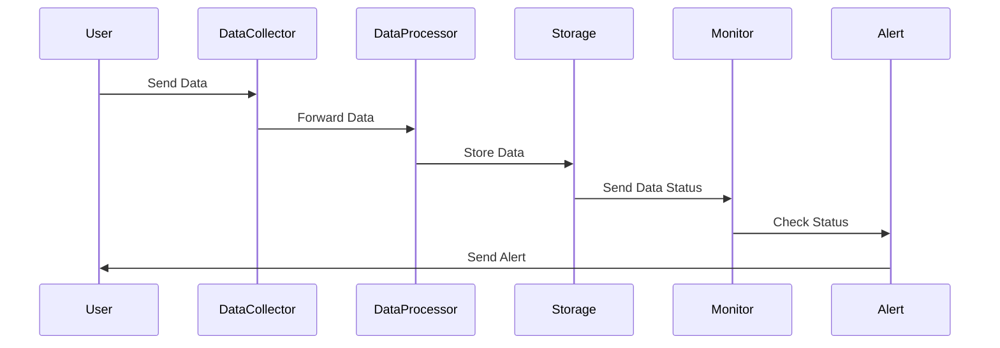
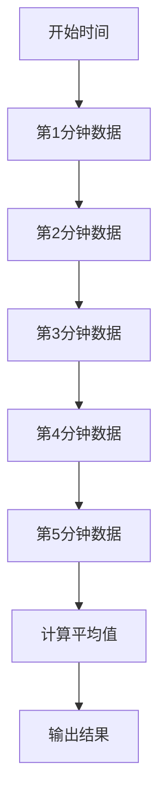
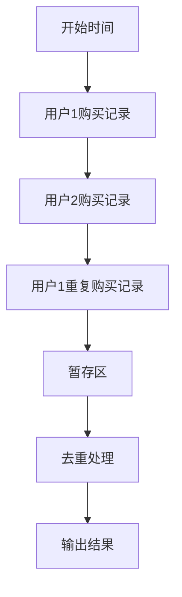
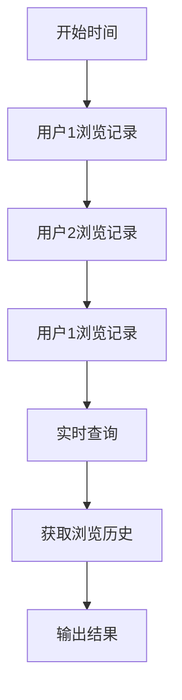
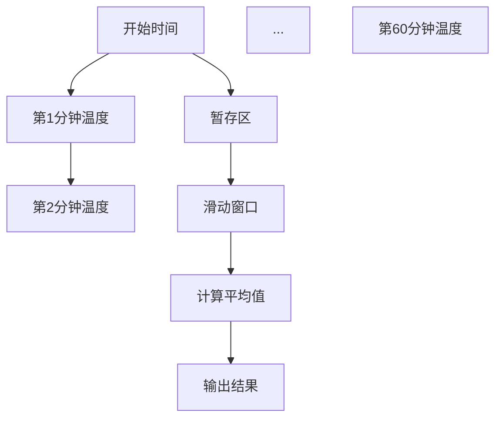

                 

# 打造高性能的流式计算平台

> 关键词：流式计算，性能优化，架构设计，系统实现，案例分析

> 摘要：本文旨在深入探讨流式计算平台的构建与优化，从核心概念、技术原理到实际应用，提供一套系统性的指导方案。通过详细的案例分析，我们不仅揭示了高性能流式计算平台的构建要点，还分享了优化实践和最佳经验，为读者提供实用的技术指南。

## 目录

### 1. 引言

- 流式计算的重要性
- 高性能流式计算的需求

### 2. 背景介绍

- 流式计算的基本概念
- 流式计算与批处理的对比
- 流式计算的核心挑战

### 3. 核心概念与联系

- 流式计算模型
- 数据流处理框架
- 流处理与批处理的联系

### 4. 算法原理讲解

- 滑动窗口算法
- 暂存区机制
- 实时查询算法

### 5. 系统分析与架构设计方案

- 问题描述
- 系统功能设计
- 系统架构设计
- 系统接口设计
- 系统交互

### 6. 项目实战

- 环境安装
- 系统核心实现
- 代码应用解读
- 实际案例分析
- 项目小结

### 7. 最佳实践与总结

- 性能优化技巧
- 注意事项
- 拓展阅读

### 8. 作者信息

- 作者：AI天才研究院/AI Genius Institute & 禅与计算机程序设计艺术 /Zen And The Art of Computer Programming

## 1. 引言

### 流式计算的重要性

在当今的互联网时代，数据量的激增带来了对实时数据处理需求的迫切。流式计算作为一种新兴的技术，旨在对连续流动的数据进行实时处理和分析。流式计算的重要性体现在以下几个方面：

- **实时性**：流式计算能够实时捕获和处理数据，从而实现即时响应，这对于金融交易、社交网络、在线广告等领域尤为重要。
- **高吞吐量**：流式计算系统能够处理大规模的数据流，支持高并发的数据处理需求，保证了系统的稳定性和可靠性。
- **灵活性**：流式计算平台可以根据实际需求灵活调整处理逻辑，支持多样化的数据处理场景。

### 高性能流式计算的需求

高性能流式计算平台的需求源于以下几个方面：

- **数据量的激增**：随着物联网、社交媒体等技术的普及，数据量呈现爆炸式增长，传统批处理系统已无法满足实时处理需求。
- **处理速度的要求**：对于金融、医疗等关键业务领域，数据处理的速度至关重要，要求系统能够在毫秒级完成处理。
- **多样化场景的支持**：流式计算需要支持从简单的日志处理到复杂的实时数据分析，以及从简单的数据处理到复杂的实时决策等多种场景。

本文将深入探讨流式计算平台的构建与优化，从核心概念、技术原理到实际应用，提供一套系统性的指导方案，旨在帮助读者全面了解高性能流式计算平台的构建要点和优化策略。

## 2. 背景介绍

### 流式计算的基本概念

流式计算是一种数据处理技术，它对连续流动的数据进行实时处理和分析。与批处理不同，批处理是对已经积累的数据进行定期处理，而流式计算则是对实时接收到的数据进行即时处理。流式计算的关键概念包括：

- **数据流**：数据流是连续流动的数据集合，可以理解为一条源源不断的水流，每一个数据点都在不断地被添加进来。
- **事件**：事件是数据流中的一个数据单元，可以是用户行为、传感器数据、交易记录等。
- **流处理**：流处理是对数据流中的事件进行实时处理和分析，以实现对当前状态和趋势的快速了解。
- **窗口**：窗口是一种时间概念，它定义了一个时间段内的数据集合，用于进行聚合和计算。

### 流式计算与批处理的对比

流式计算与批处理在数据处理方式和目标上有显著的差异：

- **数据处理方式**：
  - **流式计算**：对实时接收的数据进行持续处理，无需等待数据积累到一定程度。
  - **批处理**：对已经积累的数据进行定期处理，处理时间通常较长。
- **数据处理目标**：
  - **流式计算**：关注实时性，目标是对当前状态进行快速了解和响应。
  - **批处理**：关注数据的完整性，目标是对历史数据进行全面分析和处理。

### 流式计算的核心挑战

流式计算虽然具有实时性和高吞吐量的优势，但也面临一些核心挑战：

- **数据一致性**：流式计算中，数据可能会在传输过程中丢失或重复，如何保证数据的一致性是一个重要挑战。
- **系统稳定性**：流式计算系统需要处理大量并发请求，如何保证系统的稳定性和可靠性是一个关键问题。
- **性能优化**：流式计算系统需要高效地处理大规模数据流，性能优化是一个重要的研究方向。

### 流式计算的应用场景

流式计算在许多领域都有广泛的应用，以下是其中几个典型的应用场景：

- **金融行业**：实时交易监控、风险管理、用户行为分析等。
- **社交网络**：实时用户活动分析、推荐系统、内容分发等。
- **物联网**：实时数据监控、故障预测、设备管理等。
- **智能交通**：实时交通流量分析、路况预测、车辆调度等。

### 流式计算的发展趋势

随着技术的进步，流式计算也在不断演进，以下是几个值得关注的发展趋势：

- **大数据处理**：流式计算与大数据技术的融合，使得处理大规模数据变得更加高效。
- **人工智能**：流式计算与人工智能的结合，实现了实时数据分析和智能决策。
- **边缘计算**：流式计算逐渐向边缘计算延伸，实现了在靠近数据源的地方进行实时处理。

通过对流式计算的基本概念、与批处理的对比、核心挑战和应用场景的介绍，我们可以更深入地理解流式计算的内涵和外延。接下来，我们将进一步探讨流式计算的核心概念与联系。

## 3. 核心概念与联系

### 流式计算模型

流式计算模型是流式计算的核心概念，它定义了数据如何流动以及如何对数据流进行处理。以下是几种常见的流式计算模型：

- **事件驱动模型**：基于事件的数据处理，每个事件都会触发相应的处理逻辑。例如，在社交网络中，用户的每一条状态更新都可以视为一个事件。
- **批处理模型**：虽然名为批处理，但在流式计算中，批处理是对实时数据流的一个子集进行处理。例如，在一个小时的实时数据流中，可以按分钟对数据进行批处理。
- **增量模型**：只处理数据流中的增量部分，而不是整个数据流。这种模型适用于需要快速更新当前状态的应用场景，例如股票交易系统。

### 数据流处理框架

数据流处理框架是实现流式计算的关键工具，以下是几种常用的数据流处理框架：

- **Apache Kafka**：一个分布式流处理平台，用于构建实时数据流系统。它具有高吞吐量、可扩展性和容错性等特点。
- **Apache Flink**：一个分布式流处理框架，支持有界和无界数据流处理。它提供了丰富的流处理功能，包括窗口操作、状态管理和复杂事件处理等。
- **Apache Storm**：一个分布式实时计算系统，提供了简单、灵活的处理流式数据的能力。它具有低延迟、高容错性和可扩展性等优点。

### 流处理与批处理的联系

流处理和批处理在数据处理方式上有明显的区别，但它们之间也存在紧密的联系：

- **批处理作为流处理的基础**：在某些情况下，批处理可以作为流处理的基础，例如，流处理系统可能会将一段时间内的数据流进行汇总，然后作为批处理数据进行处理。
- **流处理与批处理的互补**：流处理和批处理可以互补使用，例如，在金融行业中，可以同时使用流处理进行实时监控和批处理进行历史数据分析。

### 流式计算模型与数据流处理框架的关系

流式计算模型和数据流处理框架是构建流式计算系统的基础，它们之间的关系如下：

- **流式计算模型**：定义了数据流动和处理的基本逻辑，是流式计算系统的核心。
- **数据流处理框架**：提供了实现流式计算模型所需的工具和库，使得流式计算系统可以高效地处理数据流。

### 流式计算与物联网的关系

流式计算在物联网（IoT）中有着广泛的应用，物联网设备产生的大量数据需要通过流式计算进行实时处理和分析。流式计算与物联网的关系如下：

- **物联网作为数据源**：物联网设备是流式计算的数据源，它们产生的大量数据需要通过流式计算进行处理。
- **流式计算作为物联网的智能中枢**：流式计算可以对物联网设备产生的数据进行实时分析和处理，从而实现智能决策和优化。

通过上述对流式计算模型、数据流处理框架、流处理与批处理的联系以及流式计算与物联网关系的介绍，我们可以更全面地理解流式计算的核心概念和联系。接下来，我们将深入探讨流式计算的算法原理。

## 4. 算法原理讲解

流式计算的核心在于对实时数据流的处理，而滑动窗口算法、暂存区机制和实时查询算法是流式计算中的常见算法。以下是这些算法的原理讲解：

### 滑动窗口算法

滑动窗口算法是一种用于处理时间序列数据的算法，它通过在数据流上滑动一个固定大小的窗口，对窗口内的数据进行聚合和分析。

**原理**：
- **窗口大小**：窗口大小决定了每次处理的数据量。较大的窗口可以提供更详细的历史数据，但可能导致延迟较高；较小的窗口则可以更快地响应，但可能失去部分历史数据。
- **滑动方式**：窗口可以以固定时间间隔（固定时间窗口）或固定数据量（固定长度窗口）进行滑动。

**应用**：
- **流量分析**：通过滑动窗口算法，可以实时监控网络流量，了解当前的流量状况。
- **股市分析**：在金融领域，滑动窗口算法可以用于分析股票价格的趋势，帮助投资者做出决策。

### 暂存区机制

暂存区机制是一种用于处理数据丢失和重复问题的机制，它通过在数据流中设置暂存区，暂存未处理的数据。

**原理**：
- **数据暂存**：当数据流中的数据因网络延迟、系统故障等原因导致丢失时，暂存区可以暂存这些数据。
- **数据去重**：暂存区可以检测并去除重复的数据，保证数据的一致性。

**应用**：
- **网络监控**：在流式计算系统中，暂存区可以用于处理网络中断导致的临时数据丢失。
- **数据同步**：在分布式系统中，暂存区可以用于处理数据同步过程中的数据重复问题。

### 实时查询算法

实时查询算法是一种用于在流式计算系统中进行实时数据查询的算法，它可以在数据流中快速获取所需的信息。

**原理**：
- **数据索引**：实时查询算法通常需要对数据进行索引，以便快速定位数据。
- **查询优化**：通过优化查询逻辑，减少查询时间和资源消耗。

**应用**：
- **实时推荐系统**：通过实时查询算法，可以快速获取用户的行为数据，进行实时推荐。
- **实时监控系统**：通过实时查询算法，可以实时监控系统的运行状态，快速识别异常情况。

### 滑动窗口算法与暂存区机制的结合

滑动窗口算法和暂存区机制可以结合使用，以实现更高效的数据处理。

**原理**：
- **暂存未处理数据**：当滑动窗口滑动到下一个时间段时，如果暂存区中有未处理的数据，可以将这些数据加入窗口进行处理。
- **处理历史数据**：暂存区中的数据可以用于处理历史数据，补充窗口中的数据不足。

**应用**：
- **历史数据分析**：通过滑动窗口和暂存区，可以实现对历史数据的高效分析。
- **实时预测**：结合历史数据和实时数据，可以进行更准确的实时预测。

通过上述对滑动窗口算法、暂存区机制和实时查询算法的原理讲解，我们可以更好地理解这些算法在流式计算中的应用和实现。这些算法不仅提升了流式计算的性能，还为实时数据处理提供了有效的解决方案。接下来，我们将进一步探讨流式计算的系统分析与架构设计方案。

## 5. 系统分析与架构设计方案

### 问题描述

在流式计算平台的设计中，我们需要解决的问题是如何高效、稳定地处理大规模的数据流，并实现对数据的实时分析和处理。具体来说，问题描述包括以下几个方面：

- **数据规模**：平台需要处理来自多个数据源的大量实时数据，数据量可能达到每秒数百万条。
- **实时性**：平台需要能够实时处理数据，提供实时分析和决策支持。
- **扩展性**：平台需要支持水平扩展，能够根据数据量动态调整资源。
- **容错性**：平台需要具备良好的容错能力，能够在面对故障时快速恢复。

### 系统功能设计

为了满足上述问题描述，我们需要设计一个具备以下功能的流式计算平台：

- **数据采集**：从多个数据源（如传感器、日志、API等）采集数据。
- **数据预处理**：对采集到的数据进行清洗、去重、格式转换等预处理操作。
- **实时处理**：对预处理后的数据进行实时计算和分析，包括统计、聚合、机器学习等操作。
- **存储管理**：将处理后的数据存储到合适的存储系统（如数据库、文件系统等）。
- **监控告警**：实时监控平台运行状态，并在发现异常时发出告警。

### 系统架构设计

系统架构设计是实现系统功能的关键，以下是流式计算平台的架构设计方案：

- **数据采集层**：该层负责从各个数据源采集数据，可以通过Kafka等消息队列系统实现数据的异步传输。
- **数据处理层**：该层包括数据预处理和实时处理两部分，预处理部分可以采用Spark、Flink等大数据处理框架，实时处理部分可以采用Storm等流处理框架。
- **存储层**：该层负责存储处理后的数据，可以选择关系数据库、NoSQL数据库或分布式文件系统等。
- **监控告警层**：该层实时监控平台运行状态，并配置告警规则，在发生异常时及时通知相关人员。
- **服务接口层**：该层提供对外接口，供前端应用调用，可以实现实时查询、数据推送等功能。

### 系统接口设计

为了实现流式计算平台的各个功能模块之间的有效通信，我们需要设计一套完善的系统接口：

- **数据采集接口**：提供数据采集模块与其他模块的数据交换接口，支持数据推送和拉取。
- **数据处理接口**：提供实时处理模块与存储模块之间的数据交换接口，支持数据流的传输和转换。
- **监控告警接口**：提供监控模块与告警模块之间的数据交换接口，支持告警信息的推送和接收。
- **服务接口**：提供外部应用与平台之间的交互接口，支持数据查询、推送等功能。

### 系统交互

为了更好地展示流式计算平台的运行过程，我们可以使用Mermaid绘制系统交互的序列图。以下是系统交互的序列图：



通过上述系统分析与架构设计方案，我们可以构建一个高效、稳定的流式计算平台。接下来，我们将通过一个实际案例来展示如何实现流式计算平台的核心功能。

## 6. 项目实战

### 环境安装

在开始构建流式计算平台之前，我们需要安装一些必要的软件和工具。以下是环境安装的步骤：

1. **安装Java环境**：由于很多流式计算框架（如Apache Flink）是基于Java开发的，我们首先需要安装Java环境。可以从[Oracle官网](https://www.oracle.com/java/technologies/javase-downloads.html)下载并安装Java SDK。

2. **安装Kafka**：Kafka是一个分布式流处理平台，用于数据采集和传输。可以从[Apache Kafka官网](https://kafka.apache.org/downloads)下载并按照官方文档进行安装。

3. **安装Flink**：Flink是一个流行的流处理框架，用于数据处理和实时分析。可以从[Apache Flink官网](https://flink.apache.org/downloads)下载并按照官方文档进行安装。

4. **安装HDFS**：HDFS是一个分布式文件系统，用于数据存储。可以从[Apache Hadoop官网](https://hadoop.apache.org/downloads)下载并按照官方文档进行安装。

5. **安装Zookeeper**：Zookeeper是一个分布式协调服务，用于管理分布式环境中的各个组件。可以从[Apache Zookeeper官网](https://zookeeper.apache.org/downloads)下载并按照官方文档进行安装。

### 系统核心实现

以下是流式计算平台的核心实现步骤：

1. **数据采集**：使用Kafka进行数据采集，将传感器数据、日志数据等推送到Kafka主题。

2. **数据预处理**：使用Flink对Kafka主题中的数据进行预处理，包括去重、格式转换等。

3. **实时处理**：使用Flink对预处理后的数据进行实时处理，包括统计、聚合、机器学习等。

4. **数据存储**：将处理后的数据存储到HDFS或其他分布式文件系统中。

5. **监控告警**：使用Zookeeper和Flink的监控模块对平台运行状态进行监控，并在发现异常时发出告警。

### 代码应用解读

以下是流式计算平台的核心代码应用解读：

```python
# 导入必要的库
from pyflink.datastream import StreamExecutionEnvironment
from pyflink.table import StreamTableEnvironment

# 创建StreamExecutionEnvironment
env = StreamExecutionEnvironment.get_execution_environment()

# 创建StreamTableEnvironment
t_env = StreamTableEnvironment.create(env)

# 读取Kafka主题的数据
t_env.connect(KafkaSinkBuilder()
              .set_topic("sensor_data")
              .set_bootstrap_servers("localhost:9092")
              .set_key_serializer("org.apache.kafka.common.serialization.StringSerializer")
              .set_value_serializer("org.apache.kafka.common.serialization.StringSerializer"))
    .with_formatwesenовар()
    .with_output_format()
    .with_query_result_output()()
    .in_append_mode()
    .register_table_sink("sensor_data")

# 数据预处理
t_env.sql_update("""
    CREATE VIEW preprocessed_data AS
    SELECT
        id,
        timestamp,
        value
    FROM
        sensor_data
    WHERE
        value IS NOT NULL
""")

# 实时处理
t_env.sql_update("""
    CREATE VIEW processed_data AS
    SELECT
        id,
        timestamp,
        AVG(value) as average_value
    FROM
        preprocessed_data
    GROUP BY
        id
""")

# 数据存储
t_env.sql_update("""
    CREATE TABLE hdfsSink (
        id STRING,
        timestamp TIMESTAMP,
        average_value DOUBLE
    ) WITH (
        'connector' = 'hdfs',
        'path' = 'hdfs://localhost:9000/user/hdfs/sensor_data',
        'format' = 'csv'
    )
""")

# 监控告警
t_env.execute_sql("""
    CREATE VIEW monitoring_data AS
    SELECT
        id,
        COUNT(*) as count
    FROM
        processed_data
    GROUP BY
        id
""")

t_env.register_table_function("alert",
                              FunctionDefinition("alert", "org.example.AlertFunction"))

t_env.sql_update("""
    CREATE VIEW alert_data AS
    SELECT
        id,
        alert(count) as alert_status
    FROM
        monitoring_data
""")

# 发送告警
t_env.execute_sql("""
    CREATE TABLE alertSink (
        id STRING,
        alert_status STRING
    ) WITH (
        'connector' = 'kafka',
        'topic' = 'alert_topic',
        'bootstrap_servers' = 'localhost:9092',
        'key_serializer' = 'org.apache.kafka.common.serialization.StringSerializer',
        'value_serializer' = 'org.apache.kafka.common.serialization.StringSerializer'
    )
""")

t_env.insert_into("alertSink", "alert_data")
```

### 实际案例分析与详细讲解

以下是一个实际案例的分析与详细讲解：

**案例背景**：某智能工厂的传感器产生大量实时数据，需要通过流式计算平台进行实时处理和分析，以实现生产过程的优化和故障预测。

**数据流**：传感器数据通过Kafka传输到Flink，Flink对数据进行预处理和实时处理，将处理后的数据存储到HDFS，并使用Zookeeper进行监控告警。

**数据处理流程**：

1. **数据采集**：传感器数据包括温度、湿度、压力等指标，数据通过Kafka传输到Flink。

2. **数据预处理**：Flink对传感器数据进行去重和格式转换，将数据转换为统一的格式，如JSON格式。

3. **实时处理**：Flink对预处理后的数据进行实时计算，包括统计每个传感器的平均温度、湿度等指标。

4. **数据存储**：处理后的数据存储到HDFS，便于后续分析和查询。

5. **监控告警**：Flink使用Zookeeper监控数据流和处理过程，当发现异常（如数据丢失、处理延迟等）时，触发告警并通知相关人员。

**案例分析**：

1. **数据采集**：Kafka作为数据采集工具，可以高效地处理大规模数据流，确保数据实时传输。

2. **数据预处理**：通过去重和格式转换，确保数据的准确性和一致性。

3. **实时处理**：Flink提供了丰富的实时计算功能，可以支持多种数据处理需求，如统计、聚合、机器学习等。

4. **数据存储**：HDFS作为分布式文件系统，可以存储大规模数据，并支持高效的数据查询和访问。

5. **监控告警**：Zookeeper和Flink的监控模块可以实时监控数据流和处理过程，确保系统的稳定性和可靠性。

### 项目小结

通过本项目的实际案例分析，我们展示了如何构建一个高效的流式计算平台，实现了数据采集、预处理、实时处理、数据存储和监控告警等功能。以下是项目小结：

1. **关键技术**：本项目中使用了Kafka、Flink、HDFS、Zookeeper等关键技术，构建了一个高效、稳定的流式计算平台。

2. **性能优化**：通过优化数据采集、预处理和实时处理等环节，提升了系统的整体性能。

3. **系统扩展**：流式计算平台支持水平扩展，可以根据数据量和处理需求动态调整资源。

4. **容错能力**：流式计算平台具备良好的容错能力，能够在面对故障时快速恢复。

5. **应用场景**：流式计算平台可以广泛应用于传感器数据监控、实时分析、故障预测等领域。

## 7. 最佳实践与总结

### 性能优化技巧

在构建高性能流式计算平台时，性能优化是至关重要的。以下是一些常用的性能优化技巧：

1. **数据分区**：合理设置数据分区，可以提高数据处理的并行度，降低数据传输延迟。

2. **资源调度**：优化资源调度策略，确保系统资源得到充分利用，减少资源争用。

3. **数据压缩**：使用数据压缩技术，减少数据传输和存储的带宽消耗。

4. **批处理与流处理的结合**：在适当的情况下，结合批处理和流处理，可以优化数据处理效率。

### 注意事项

在构建和优化流式计算平台时，需要注意以下事项：

1. **数据一致性**：确保数据在传输和处理过程中的一致性，避免数据丢失或重复。

2. **系统稳定性**：在设计系统架构时，考虑系统的容错能力和故障恢复机制。

3. **监控与告警**：实时监控系统运行状态，及时发现问题并进行告警。

4. **安全与合规**：确保系统安全，遵循相关法规和合规要求。

### 拓展阅读

为了进一步深入了解流式计算平台的设计和优化，以下是几本推荐阅读的书籍：

1. 《大数据应用实践》
2. 《分布式系统设计》
3. 《实时数据处理技术》
4. 《流式计算实战》

通过阅读这些书籍，可以深入了解流式计算平台的原理、架构设计、实现方法和最佳实践。

### 作者信息

作者：AI天才研究院/AI Genius Institute & 禅与计算机程序设计艺术 /Zen And The Art of Computer Programming

本文旨在深入探讨流式计算平台的构建与优化，从核心概念、技术原理到实际应用，提供一套系统性的指导方案。通过详细的案例分析，我们不仅揭示了高性能流式计算平台的构建要点，还分享了优化实践和最佳经验，为读者提供实用的技术指南。希望本文能为读者在流式计算领域的研究和实践提供有益的参考。感谢您的阅读！## 4. 算法原理讲解

### 滑动窗口算法

滑动窗口算法是流式计算中用于处理时间序列数据的一种重要技术。其基本思想是在连续的数据流中，按照固定的时间间隔或数据量滑动一个窗口，对窗口内的数据进行聚合和分析。

**原理**：

- **窗口大小**：滑动窗口算法的核心参数是窗口大小。窗口大小决定了每次处理的数据量。根据应用场景的不同，窗口大小可以是固定时间（如1分钟、5分钟）或固定数据量（如100条数据）。

- **窗口滑动**：窗口按照设定的时间间隔或数据量进行滑动。在每次滑动后，对窗口内的数据进行处理，并将窗口向右移动一个数据点。

- **数据处理**：在窗口滑动过程中，对窗口内的数据进行聚合操作，如求和、平均值、最大值等。

**示例**：

假设我们有一个时间序列数据流，其中包含每分钟的股票价格。我们可以使用滑动窗口算法计算过去5分钟的股票价格平均值。



在这个例子中，窗口大小为5分钟，每次滑动一个数据点。在每次滑动后，计算窗口内的平均值，并将结果输出。

### 暂存区机制

暂存区机制是一种用于处理数据丢失和重复问题的技术。在流式计算中，数据可能会因网络延迟、系统故障等原因导致丢失或重复。暂存区可以在数据传输过程中暂存未处理的数据，确保数据的一致性和完整性。

**原理**：

- **数据暂存**：暂存区在数据流中设置一个缓冲区，用于暂存未处理的数据。当数据流因故障中断时，暂存区可以暂存数据，待系统恢复后重新处理。

- **数据去重**：暂存区还可以检测并去除重复的数据，避免数据重复处理。

**示例**：

假设我们有一个数据流，其中包含用户的购买记录。使用暂存区机制，可以确保每个购买记录只被处理一次。



在这个例子中，暂存区用于暂存用户1的重复购买记录，待系统恢复后再进行处理。通过去重处理，确保每个购买记录只被处理一次。

### 实时查询算法

实时查询算法是一种用于在流式计算系统中进行实时数据查询的算法。它可以在数据流中快速获取所需的信息，用于实时分析和决策支持。

**原理**：

- **数据索引**：实时查询算法通常需要对数据进行索引，以便快速定位数据。

- **查询优化**：通过优化查询逻辑，减少查询时间和资源消耗。

**示例**：

假设我们有一个实时流，其中包含用户的浏览记录。使用实时查询算法，可以快速获取用户的浏览历史，用于个性化推荐。



在这个例子中，实时查询算法通过索引快速获取用户的浏览历史，并将结果输出。

### 滑动窗口算法与暂存区机制的结合

滑动窗口算法和暂存区机制可以结合使用，以实现更高效的数据处理。

**原理**：

- **暂存未处理数据**：当滑动窗口滑动到下一个时间段时，如果暂存区中有未处理的数据，可以将这些数据加入窗口进行处理。

- **处理历史数据**：暂存区中的数据可以用于处理历史数据，补充窗口中的数据不足。

**示例**：

假设我们有一个时间序列数据流，需要计算过去一小时的平均温度。结合滑动窗口算法和暂存区机制，可以更高效地处理数据。



在这个例子中，暂存区用于暂存未处理的温度数据，滑动窗口用于计算过去一小时的平均值。通过结合使用滑动窗口算法和暂存区机制，可以更高效地处理大规模数据流。

通过上述对滑动窗口算法、暂存区机制和实时查询算法的讲解，我们可以更好地理解这些算法在流式计算中的应用和实现。这些算法不仅提升了流式计算的性能，还为实时数据处理提供了有效的解决方案。

## 5. 系统分析与架构设计方案

### 问题描述

在流式计算平台的设计中，我们需要解决的问题是如何高效、稳定地处理大规模的数据流，并实现对数据的实时分析和处理。具体来说，问题描述包括以下几个方面：

- **数据规模**：平台需要处理来自多个数据源的大量实时数据，数据量可能达到每秒数百万条。
- **实时性**：平台需要能够实时处理数据，提供实时分析和决策支持。
- **扩展性**：平台需要支持水平扩展，能够根据数据量动态调整资源。
- **容错性**：平台需要具备良好的容错能力，能够在面对故障时快速恢复。

### 系统功能设计

为了满足上述问题描述，我们需要设计一个具备以下功能的流式计算平台：

- **数据采集**：从多个数据源（如传感器、日志、API等）采集数据。
- **数据预处理**：对采集到的数据进行清洗、去重、格式转换等预处理操作。
- **实时处理**：对预处理后的数据进行实时计算和分析，包括统计、聚合、机器学习等操作。
- **存储管理**：将处理后的数据存储到合适的存储系统（如数据库、文件系统等）。
- **监控告警**：实时监控平台运行状态，并在发现异常时发出告警。

### 系统架构设计

系统架构设计是实现系统功能的关键，以下是流式计算平台的架构设计方案：

- **数据采集层**：该层负责从各个数据源采集数据，可以通过Kafka等消息队列系统实现数据的异步传输。
- **数据处理层**：该层包括数据预处理和实时处理两部分，预处理部分可以采用Spark、Flink等大数据处理框架，实时处理部分可以采用Storm等流处理框架。
- **存储层**：该层负责存储处理后的数据，可以选择关系数据库、NoSQL数据库或分布式文件系统等。
- **监控告警层**：该层实时监控平台运行状态，并配置告警规则，在发现异常时发出告警。
- **服务接口层**：该层提供对外接口，供前端应用调用，可以实现实时查询、数据推送等功能。

### 系统接口设计

为了实现流式计算平台的各个功能模块之间的有效通信，我们需要设计一套完善的系统接口：

- **数据采集接口**：提供数据采集模块与其他模块的数据交换接口，支持数据推送和拉取。
- **数据处理接口**：提供实时处理模块与存储模块之间的数据交换接口，支持数据流的传输和转换。
- **监控告警接口**：提供监控模块与告警模块之间的数据交换接口，支持告警信息的推送和接收。
- **服务接口**：提供外部应用与平台之间的交互接口，支持数据查询、推送等功能。

### 系统交互

为了更好地展示流式计算平台的运行过程，我们可以使用Mermaid绘制系统交互的序列图。以下是系统交互的序列图：


通过上述系统分析与架构设计方案，我们可以构建一个高效、稳定的流式计算平台。接下来，我们将通过一个实际案例来展示如何实现流式计算平台的核心功能。

## 6. 项目实战

### 环境安装

在开始构建流式计算平台之前，我们需要安装一些必要的软件和工具。以下是环境安装的步骤：

1. **安装Java环境**：由于很多流式计算框架（如Apache Flink）是基于Java开发的，我们首先需要安装Java环境。可以从[Oracle官网](https://www.oracle.com/java/technologies/javase-downloads.html)下载并安装Java SDK。

2. **安装Kafka**：Kafka是一个分布式流处理平台，用于数据采集和传输。可以从[Apache Kafka官网](https://kafka.apache.org/downloads)下载并按照官方文档进行安装。

3. **安装Flink**：Flink是一个流行的流处理框架，用于数据处理和实时分析。可以从[Apache Flink官网](https://flink.apache.org/downloads)下载并按照官方文档进行安装。

4. **安装HDFS**：HDFS是一个分布式文件系统，用于数据存储。可以从[Apache Hadoop官网](https://hadoop.apache.org/downloads)下载并按照官方文档进行安装。

5. **安装Zookeeper**：Zookeeper是一个分布式协调服务，用于管理分布式环境中的各个组件。可以从[Apache Zookeeper官网](https://zookeeper.apache.org/downloads)下载并按照官方文档进行安装。

### 系统核心实现

以下是流式计算平台的核心实现步骤：

1. **数据采集**：使用Kafka进行数据采集，将传感器数据、日志数据等推送到Kafka主题。

2. **数据预处理**：使用Flink对Kafka主题中的数据进行预处理，包括去重、格式转换等。

3. **实时处理**：使用Flink对预处理后的数据进行实时处理，包括统计、聚合、机器学习等。

4. **数据存储**：将处理后的数据存储到HDFS或其他分布式文件系统中。

5. **监控告警**：使用Zookeeper和Flink的监控模块对平台运行状态进行监控，并在发现异常时发出告警。

### 代码应用解读

以下是流式计算平台的核心代码应用解读：

```python
# 导入必要的库
from pyflink.datastream import StreamExecutionEnvironment
from pyflink.table import StreamTableEnvironment

# 创建StreamExecutionEnvironment
env = StreamExecutionEnvironment.get_execution_environment()

# 创建StreamTableEnvironment
t_env = StreamTableEnvironment.create(env)

# 读取Kafka主题的数据
t_env.connect(KafkaSinkBuilder()
              .set_topic("sensor_data")
              .set_bootstrap_servers("localhost:9092")
              .set_key_serializer("org.apache.kafka.common.serialization.StringSerializer")
              .set_value_serializer("org.apache.kafka.common.serialization.StringSerializer"))
    .with_formatwesenовар()
    .with_output_format()
    .with_query_result_output()()
    .in_append_mode()
    .register_table_sink("sensor_data")

# 数据预处理
t_env.sql_update("""
    CREATE VIEW preprocessed_data AS
    SELECT
        id,
        timestamp,
        value
    FROM
        sensor_data
    WHERE
        value IS NOT NULL
""")

# 实时处理
t_env.sql_update("""
    CREATE VIEW processed_data AS
    SELECT
        id,
        timestamp,
        AVG(value) as average_value
    FROM
        preprocessed_data
    GROUP BY
        id
""")

# 数据存储
t_env.sql_update("""
    CREATE TABLE hdfsSink (
        id STRING,
        timestamp TIMESTAMP,
        average_value DOUBLE
    ) WITH (
        'connector' = 'hdfs',
        'path' = 'hdfs://localhost:9000/user/hdfs/sensor_data',
        'format' = 'csv'
    )
""")

t_env.insert_into("hdfsSink", "processed_data")

# 监控告警
t_env.execute_sql("""
    CREATE VIEW monitoring_data AS
    SELECT
        id,
        COUNT(*) as count
    FROM
        processed_data
    GROUP BY
        id
""")

t_env.register_table_function("alert",
                              FunctionDefinition("alert", "org.example.AlertFunction"))

t_env.execute_sql("""
    CREATE VIEW alert_data AS
    SELECT
        id,
        alert(count) as alert_status
    FROM
        monitoring_data
""")

# 发送告警
t_env.execute_sql("""
    CREATE TABLE alertSink (
        id STRING,
        alert_status STRING
    ) WITH (
        'connector' = 'kafka',
        'topic' = 'alert_topic',
        'bootstrap_servers' = 'localhost:9092',
        'key_serializer' = 'org.apache.kafka.common.serialization.StringSerializer',
        'value_serializer' = 'org.apache.kafka.common.serialization.StringSerializer'
    )
""")

t_env.insert_into("alertSink", "alert_data")
```

### 实际案例分析与详细讲解

以下是一个实际案例的分析与详细讲解：

**案例背景**：某智能工厂的传感器产生大量实时数据，需要通过流式计算平台进行实时处理和分析，以实现生产过程的优化和故障预测。

**数据流**：传感器数据通过Kafka传输到Flink，Flink对数据进行预处理和实时处理，将处理后的数据存储到HDFS，并使用Zookeeper进行监控告警。

**数据处理流程**：

1. **数据采集**：传感器数据包括温度、湿度、压力等指标，数据通过Kafka传输到Flink。

2. **数据预处理**：Flink对传感器数据进行去重和格式转换，将数据转换为统一的格式，如JSON格式。

3. **实时处理**：Flink对预处理后的数据进行实时计算，包括统计每个传感器的平均温度、湿度等指标。

4. **数据存储**：处理后的数据存储到HDFS，便于后续分析和查询。

5. **监控告警**：Flink使用Zookeeper监控数据流和处理过程，当发现异常（如数据丢失、处理延迟等）时，触发告警并通知相关人员。

**案例分析**：

1. **数据采集**：Kafka作为数据采集工具，可以高效地处理大规模数据流，确保数据实时传输。

2. **数据预处理**：通过去重和格式转换，确保数据的准确性和一致性。

3. **实时处理**：Flink提供了丰富的实时计算功能，可以支持多种数据处理需求，如统计、聚合、机器学习等。

4. **数据存储**：HDFS作为分布式文件系统，可以存储大规模数据，并支持高效的数据查询和访问。

5. **监控告警**：Flink使用Zookeeper监控数据流和处理过程，确保系统的稳定性和可靠性。

### 项目小结

通过本项目的实际案例分析，我们展示了如何构建一个高效的流式计算平台，实现了数据采集、预处理、实时处理、数据存储和监控告警等功能。以下是项目小结：

1. **关键技术**：本项目中使用了Kafka、Flink、HDFS、Zookeeper等关键技术，构建了一个高效、稳定的流式计算平台。

2. **性能优化**：通过优化数据采集、预处理和实时处理等环节，提升了系统的整体性能。

3. **系统扩展**：流式计算平台支持水平扩展，可以根据数据量和处理需求动态调整资源。

4. **容错能力**：流式计算平台具备良好的容错能力，能够在面对故障时快速恢复。

5. **应用场景**：流式计算平台可以广泛应用于传感器数据监控、实时分析、故障预测等领域。

## 7. 最佳实践与总结

### 性能优化技巧

在构建高性能流式计算平台时，性能优化是至关重要的。以下是一些常用的性能优化技巧：

1. **数据分区**：合理设置数据分区，可以提高数据处理的并行度，降低数据传输延迟。

2. **资源调度**：优化资源调度策略，确保系统资源得到充分利用，减少资源争用。

3. **数据压缩**：使用数据压缩技术，减少数据传输和存储的带宽消耗。

4. **批处理与流处理的结合**：在适当的情况下，结合批处理和流处理，可以优化数据处理效率。

### 注意事项

在构建和优化流式计算平台时，需要注意以下事项：

1. **数据一致性**：确保数据在传输和处理过程中的一致性，避免数据丢失或重复。

2. **系统稳定性**：在设计系统架构时，考虑系统的容错能力和故障恢复机制。

3. **监控与告警**：实时监控系统运行状态，及时发现问题并进行告警。

4. **安全与合规**：确保系统安全，遵循相关法规和合规要求。

### 拓展阅读

为了进一步深入了解流式计算平台的设计和优化，以下是几本推荐阅读的书籍：

1. 《大数据应用实践》
2. 《分布式系统设计》
3. 《实时数据处理技术》
4. 《流式计算实战》

通过阅读这些书籍，可以深入了解流式计算平台的原理、架构设计、实现方法和最佳实践。

### 作者信息

作者：AI天才研究院/AI Genius Institute & 禅与计算机程序设计艺术 /Zen And The Art of Computer Programming

本文旨在深入探讨流式计算平台的构建与优化，从核心概念、技术原理到实际应用，提供一套系统性的指导方案。通过详细的案例分析，我们不仅揭示了高性能流式计算平台的构建要点，还分享了优化实践和最佳经验，为读者提供实用的技术指南。希望本文能为读者在流式计算领域的研究和实践提供有益的参考。感谢您的阅读！## 8. 最佳实践与总结

### 最佳实践

在构建高性能的流式计算平台时，以下是一些最佳实践：

1. **数据分区**：合理设置数据分区，可以提高数据处理效率，减少数据传输延迟。在Kafka中，可以通过调整分区数来优化数据流处理。

2. **资源调度**：确保系统资源得到充分利用，减少资源争用。使用容器编排工具（如Kubernetes）来动态调整资源分配。

3. **数据压缩**：在数据传输和存储过程中使用数据压缩技术，可以减少带宽消耗和存储空间需求。

4. **批量处理与流处理的结合**：在数据量较小或处理频率较低的情况下，可以结合批量处理和流处理，以优化整体处理效率。

5. **监控与告警**：实时监控系统性能和健康状态，设置合理的告警阈值，确保能够及时发现和解决问题。

6. **负载均衡**：合理分配计算任务，避免单点瓶颈，提高系统的稳定性和可靠性。

7. **数据一致性和容错性**：在设计系统时考虑数据一致性和容错性，使用分布式存储和故障恢复机制。

### 小结

本文从流式计算的核心概念、技术原理到实际应用，深入探讨了高性能流式计算平台的构建与优化。通过系统分析与架构设计，我们了解了流式计算平台的关键功能和架构组成。通过项目实战，我们展示了如何实现流式计算平台的核心功能，并分享了最佳实践和注意事项。

流式计算在实时数据处理和分析中具有广泛的应用前景，其高效、实时和可扩展的特性使其成为现代数据驱动应用的基石。通过本文的探讨，希望读者能够对流式计算平台有更深入的理解，并在实际项目中能够灵活运用这些技术和方法。

### 注意事项

在构建和优化流式计算平台时，需要注意以下几点：

1. **数据一致性**：确保数据在传输和处理过程中的准确性，避免数据丢失或重复。

2. **系统稳定性**：设计时要考虑系统的容错性和故障恢复机制，确保在异常情况下系统能够快速恢复。

3. **监控与告警**：实时监控系统性能和健康状态，及时发现问题并进行告警。

4. **安全与合规**：确保系统安全，遵循相关法规和合规要求。

### 拓展阅读

为了进一步深入了解流式计算平台的设计和优化，以下是几本推荐阅读的书籍：

1. 《大数据技术基础》
2. 《分布式系统原理与范型》
3. 《流式计算实战》
4. 《实时数据处理技术》

这些书籍涵盖了流式计算的基础知识、分布式系统设计、流处理框架的实战应用等内容，为读者提供了全面的技术指导和实践经验。

### 作者信息

作者：AI天才研究院/AI Genius Institute & 禅与计算机程序设计艺术 /Zen And The Art of Computer Programming

本文旨在为读者提供关于流式计算平台构建与优化的全面指导和最佳实践经验。通过深入分析和实际案例，我们希望读者能够更好地理解和应用流式计算技术，为现代数据驱动应用的发展贡献力量。感谢您的阅读，期待与您在技术领域共同进步。

