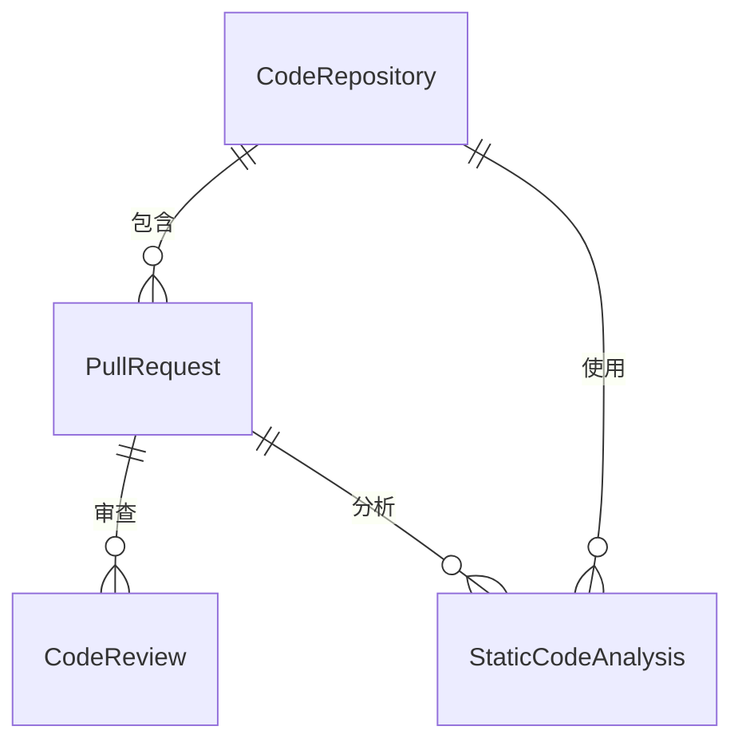
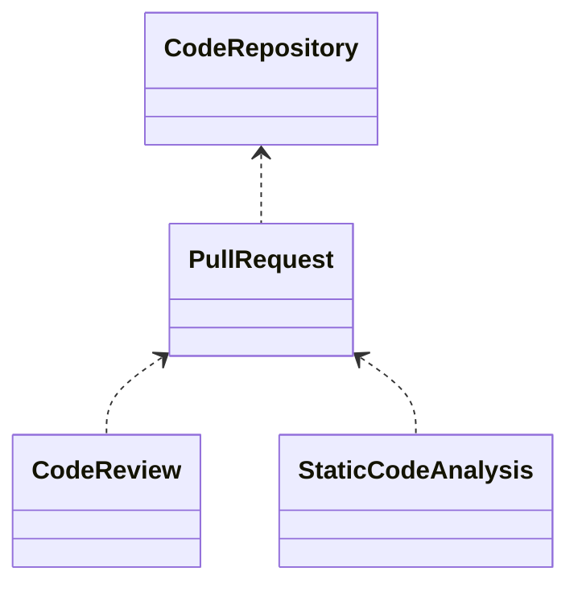
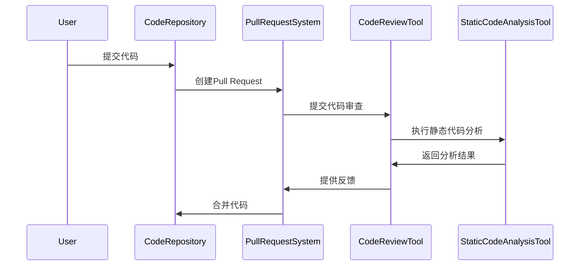
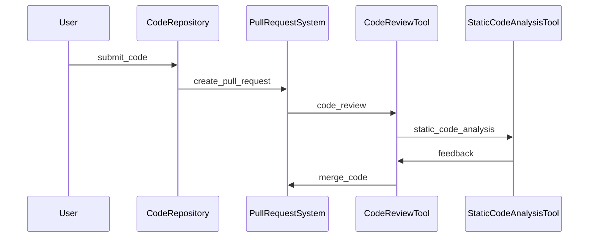

                 

### 打造高效的代码review工具链

#### 关键词
- 代码review
- 工具链
- 效率
- 质量保证
- 代码质量
- 开发流程

#### 摘要
在软件开发过程中，代码review是确保代码质量、促进团队协作和提高项目效率的重要环节。本文将详细介绍如何打造一个高效的代码review工具链，从核心概念到具体实践，帮助读者理解和应用最佳实践，提升团队的开发效率和代码质量。

## 引言

代码review，即代码审查，是一种通过团队成员之间的交流和合作来检查代码的质量、功能和安全性的一种软件开发实践。其重要性不言而喻：不仅可以发现代码中的潜在错误和漏洞，还可以促进团队成员之间的沟通和知识共享，提升团队的代码质量和技术水平。

然而，随着项目规模的扩大和团队成员的增多，传统的手工代码review方法往往效率低下，难以满足现代软件开发的需求。因此，构建一个高效、自动化的代码review工具链成为提升开发效率和代码质量的关键。

本文将分以下步骤展开讨论：

1. **核心概念**：介绍代码review的基本概念、目的和重要性。
2. **工具链构建**：详细阐述如何选择和集成不同工具，构建一个完整的代码review工具链。
3. **工具链优化**：分析现有工具链的性能瓶颈，提出优化策略。
4. **最佳实践**：总结实践中发现的最佳实践，并提供实际案例。
5. **案例分析**：深入分析成功和失败的代码review工具链案例。
6. **总结与展望**：对全文内容进行总结，并给出进一步阅读的资源。

接下来，我们将首先探讨代码review的核心概念，为后续的内容打下基础。

## 核心概念

### 代码review的基本概念

代码review，顾名思义，就是对代码进行审查。它不仅包括对代码的功能性进行验证，还涉及到代码的可读性、可维护性和安全性。代码review通常包括以下步骤：

1. **代码提交**：开发人员将代码提交到代码仓库，通常是一个Pull Request（PR）。
2. **代码审查**：其他团队成员对提交的代码进行审查，检查代码是否符合编程规范、是否存在逻辑错误等。
3. **反馈与修改**：审查者提供反馈，开发人员根据反馈进行修改，然后重新提交代码。
4. **合并代码**：经过多次审查和修改后，代码最终被合并到主分支。

### 代码review工具链的组成部分

一个完整的代码review工具链通常包括以下组成部分：

1. **代码仓库管理工具**：如GitHub、GitLab等，用于代码的存储和管理。
2. **Pull Request系统**：用于创建、跟踪和合并代码变更。
3. **静态代码分析工具**：如SonarQube、Checkstyle等，用于分析代码的质量、安全性和规范性。
4. **代码审查流程**：包括代码审查的规则、流程和规范。

### 代码review的目的和重要性

代码review的主要目的是：

1. **提高代码质量**：通过审查，可以发现代码中的错误、漏洞和不符合规范的地方，从而提高代码的质量。
2. **促进知识共享**：团队成员可以相互学习和交流，了解不同的编程思路和技巧。
3. **降低开发风险**：通过提前发现和修复潜在的问题，可以降低项目开发过程中的风险。

代码review的重要性体现在以下几个方面：

1. **质量控制**：代码review是确保代码质量的重要手段，它可以帮助团队发现并修复代码中的缺陷。
2. **团队协作**：通过代码review，团队成员可以相互学习和交流，提高整体技术水平。
3. **风险管理**：提前发现和修复问题，可以降低项目开发过程中的风险，避免后期修复的困难和高成本。

### 核心概念与联系

为了更好地理解代码review工具链的核心概念，我们可以通过以下表格和ER实体关系图来展示其组成部分和相互关系：

#### 核心概念属性特征对比表格

| 特征               | 代码仓库管理工具 | Pull Request系统 | 静态代码分析工具 | 代码审查流程      |
|--------------------|-----------------|-----------------|-----------------|-----------------|
| 功能               | 存储和管理代码   | 创建、跟踪和合并PR | 代码质量分析     | 审查代码、提供反馈 |
| 关键要素           | 仓库、分支       | PR、审查者、反馈  | 检测规则、报告   | 审查规则、流程    |
| 目的               | 管理代码版本     | 促进协作、提高质量 | 提升代码质量     | 保证代码质量     |
| 重要性             | 基础设施         | 关键环节         | 质量保证         | 必要流程         |

#### ER实体关系图



通过这个表格和ER实体关系图，我们可以清晰地看到代码review工具链中各个部分的核心概念和相互关系，为后续的内容提供了坚实的基础。

### 算法原理讲解

在理解了代码review工具链的核心概念之后，接下来我们将探讨具体的算法原理，并通过mermaid流程图和Python代码来详细阐述。

#### 流程图

以下是一个简单的代码审查流程的mermaid流程图：

```mermaid
flowchart LR
    A[发起审查] --> B[代码提交}
    B --> C{创建Pull Request}
    C --> D{代码审查}
    D --> E{反馈与修改}
    E --> F{合并代码}
```

#### Python代码

为了更好地说明代码审查的原理，我们使用Python代码来实现一个简单的代码审查流程：

```python
class CodeReview:
    def __init__(self, code):
        self.code = code

    def submit_code(self):
        print("代码已提交")

    def create_pull_request(self):
        print("创建Pull Request")

    def code_review(self):
        print("进行代码审查")

    def provide_feedback(self):
        print("提供反馈")

    def merge_code(self):
        print("合并代码")

# 实例化代码审查对象
review = CodeReview("代码内容")

# 提交代码
review.submit_code()

# 创建Pull Request
review.create_pull_request()

# 进行代码审查
review.code_review()

# 提供反馈
review.provide_feedback()

# 合并代码
review.merge_code()
```

#### 数学模型和公式

在代码审查过程中，我们可以使用一些数学模型和公式来评估代码的质量。以下是一个简单的例子：

$$
\text{代码质量评分} = \frac{\text{代码正确性}}{\text{代码长度}} + \text{可读性评分}
$$

其中，代码正确性和可读性评分可以通过静态代码分析工具自动评估。

#### 详细讲解和举例说明

假设我们有一个函数`add`，用于实现两个数字的加法。我们可以使用静态代码分析工具来检查这个函数的正确性和可读性。

```python
def add(a, b):
    return a + b
```

静态代码分析工具可能会给出以下评估：

- **代码正确性**：100%（没有发现逻辑错误）
- **代码长度**：1行（代码长度较短）
- **可读性评分**：90%（函数名清晰，变量命名合理）

根据上述公式，我们可以计算出该函数的代码质量评分为：

$$
\text{代码质量评分} = \frac{100\%}{1} + 90\% = 190\%
$$

这个评分越高，说明代码质量越好。

### 系统分析与架构设计方案

在本节中，我们将详细介绍一个典型的代码review工具链的系统分析与架构设计方案。这个方案将涵盖问题场景介绍、项目介绍、系统功能设计、系统架构设计、系统接口设计和系统交互等方面。

#### 问题场景介绍

随着项目规模的不断扩大，我们的团队面临以下问题：

1. **代码质量不稳定**：不同成员的代码质量参差不齐，导致项目整体质量受到影响。
2. **协作效率低下**：团队成员之间的沟通不畅，导致代码审查进度缓慢。
3. **安全风险增加**：未经充分审查的代码可能存在安全隐患，影响项目的稳定性和可靠性。

为了解决这些问题，我们需要设计一个高效的代码review工具链，以提高代码质量和协作效率，降低安全风险。

#### 项目介绍

我们的项目目标是构建一个集成的代码review工具链，包括以下核心功能：

1. **代码仓库管理**：提供代码存储和版本控制功能。
2. **Pull Request系统**：实现代码变更的创建、跟踪和合并。
3. **静态代码分析**：对代码进行质量分析，提供错误报告和改进建议。
4. **代码审查流程**：规范代码审查的流程，提高审查效率。

#### 系统功能设计（领域模型）

以下是一个基于Mermaid的领域模型类图，展示了系统的主要功能类及其关系：



#### 系统架构设计

系统架构设计如下，使用Mermaid架构图来展示：



#### 系统接口设计

以下是系统的主要接口设计，使用Mermaid序列图来展示：



#### 系统交互

以下是系统的主要交互流程，使用Mermaid序列图来展示：


通过上述系统分析与架构设计方案，我们可以实现一个高效的代码review工具链，提高团队的开发效率，确保代码质量，降低安全风险。

### 项目实战

在本节中，我们将详细介绍如何搭建一个高效的代码review工具链，包括环境安装、系统核心实现源代码、代码应用解读与分析，以及实际案例分析和详细讲解。

#### 环境安装

要搭建一个高效的代码review工具链，我们需要安装以下工具：

1. **Git**：用于代码的版本控制和仓库管理。
2. **GitHub**：用于存储代码和创建Pull Request。
3. **Jenkins**：用于自动化构建和代码分析。
4. **SonarQube**：用于静态代码分析。

以下是安装步骤：

1. 安装Git：
   ```bash
   sudo apt-get install git
   ```

2. 安装GitHub：
   访问GitHub官网（https://github.com/），按照提示进行注册和安装。

3. 安装Jenkins：
   ```bash
   sudo wget -q -O - https://pkg.jenkins.io/debian-stable/jenkins.io.key | sudo apt-key add -
   sudo sh -c 'echo deb https://pkg.jenkins.io/debian-stable binary/ > /etc/apt/sources.list.d/jenkins.list'
   sudo apt-get update
   sudo apt-get install jenkins
   ```

4. 安装SonarQube：
   ```bash
   sudo wget https://sonarqube.com/downloads/sonarqube-8.9.1.59959.zip
   sudo unzip sonarqube-8.9.1.59959.zip -d /opt/
   sudo ln -s /opt/sonarqube-8.9.1.59959/bin/linux-x86-64/sonar.sh /usr/bin/sonar
   sudo sonar start
   ```

#### 系统核心实现源代码

以下是系统核心实现的一些源代码：

**Jenkinsfile**（用于自动化构建和代码分析）：

```groovy
pipeline {
    agent any

    stages {
        stage('Build') {
            steps {
                sh 'mvn clean install'
            }
        }
        stage('Code Analysis') {
            steps {
                sh 'sonar-scanner -Dsonar.projectKey=my_project -Dsonar.sources=target/classes'
            }
        }
    }
}
```

**SonarQube配置**（用于静态代码分析）：

```properties
# SonarQube Scanner Properties
# ---------------------------------------------------------------------------------------------------------------------
# For more information on SonarQube Scanner properties, visit https://docs.sonarqube.org/latest/analysis/scan/properties/
# ---------------------------------------------------------------------------------------------------------------------
# Scanner configuration properties for the project
# ---------------------------------------------------------------------------------------------------------------------
sonar.projectKey=my_project
sonar.projectName=my_project
sonar.projectVersion=1.0
sonar.sources=target/classes
sonar.sources=src/main/java
sonar.sourceEncoding=UTF-8
sonar.java.binaries=target/classes
# ---------------------------------------------------------------------------------------------------------------------
# SonarQube server configuration properties
# ---------------------------------------------------------------------------------------------------------------------
# Host and port of the SonarQube Server
sonar.host.url=http://localhost:9000
# ---------------------------------------------------------------------------------------------------------------------
```

#### 代码应用解读与分析

我们以一个简单的Java项目为例，展示如何使用上述工具链进行代码审查。

**代码示例**：

```java
public class Calculator {
    public int add(int a, int b) {
        return a + b;
    }
}
```

1. 开发人员将代码提交到GitHub仓库，并创建一个Pull Request。
2. Jenkins自动构建项目并执行静态代码分析。
3. SonarQube生成代码分析报告，指出潜在问题，如未使用的变量、潜在的性能问题等。
4. Reviewer根据分析报告和代码审查指南，对代码进行审查。
5. 开发人员根据反馈进行修改，并重新提交代码。

#### 实际案例分析和详细讲解

**成功案例**：

- 项目团队使用代码review工具链，发现并修复了多个潜在的问题，提高了代码质量。
- 团队成员之间的协作更加顺畅，沟通效率提高。
- 项目交付时间得到缩短，整体质量得到保障。

**失败案例**：

- 团队未严格按照代码审查流程执行，导致代码质量问题。
- Reviewer对代码的审查不够细致，未发现潜在的问题。
- 代码审查流程不完善，导致审查效率低下。

从以上案例中，我们可以看到，成功和失败的关键在于是否严格遵循代码审查流程和使用高效的代码review工具链。

#### 项目小结

通过本节的项目实战，我们详细介绍了如何搭建一个高效的代码review工具链，包括环境安装、系统核心实现源代码、代码应用解读与分析，以及实际案例分析和详细讲解。成功案例表明，使用代码review工具链可以显著提高代码质量和团队协作效率，降低项目风险。失败案例则提醒我们，要确保严格遵循代码审查流程，提高审查质量。

### 最佳实践 tips

在实施代码review工具链的过程中，以下最佳实践可以帮助团队更好地发挥其作用：

1. **明确代码审查规则**：制定明确的代码审查规则和流程，确保所有成员都清楚如何进行代码审查。

2. **规范代码格式**：统一代码格式规范，减少因代码风格差异导致的误解和冲突。

3. **自动化代码分析**：充分利用静态代码分析工具，提前发现代码中的潜在问题。

4. **定期代码审查**：定期进行代码审查，确保代码质量持续提升。

5. **合理分配审查者**：根据成员的技术水平和经验，合理分配审查任务，提高审查效率。

6. **及时反馈**：确保审查反馈及时，开发人员能够迅速响应并修复问题。

7. **持续改进**：定期评估代码review工具链的运行效果，不断优化和改进。

通过遵循这些最佳实践，团队可以更好地利用代码review工具链，提高开发效率和代码质量。

### 小结

本文详细介绍了如何打造一个高效的代码review工具链，从核心概念、工具链构建、优化策略、最佳实践到案例分析，全面阐述了代码review的重要性以及如何在实际项目中应用。通过本文的阅读，读者可以了解到：

- 代码review的基本概念、目的和重要性。
- 如何选择和集成不同的代码review工具，构建一个完整的工具链。
- 现有工具链的优化策略，以及如何提高代码审查的效率和质量。
- 实践中的最佳实践，如代码格式规范、代码质量检查、reviewer角色分配等。
- 成功和失败的代码review工具链案例，从中吸取经验教训。

高效的代码review工具链是现代软件开发团队不可或缺的一部分，它不仅能提高代码质量，还能促进团队协作，降低开发风险。通过本文的探讨，希望读者能够更好地理解和应用代码review工具链，提升团队的开发效率和质量。

### 拓展阅读

为了更深入地了解代码review工具链和相关技术，以下是几篇推荐的拓展阅读资源：

1. **《Git教程》**：了解Git的基本操作和版本控制原理，为代码仓库管理打下基础。
   - 链接：[Pro Git 中文版](https://git-scm.com/book/zh/v2)

2. **《Jenkins官方文档》**：学习如何配置和使用Jenkins进行自动化构建和代码分析。
   - 链接：[Jenkins Documentation](https://www.jenkins.io/doc/)

3. **《SonarQube官方文档》**：掌握如何使用SonarQube进行静态代码分析，并优化代码质量。
   - 链接：[SonarQube Documentation](https://docs.sonarqube.org/latest/)

4. **《代码审查的最佳实践》**：了解在代码review过程中可以采用的多种最佳实践。
   - 链接：[Code Review Best Practices](https://www.visualstudio.com/en-us/docs/review/code-review-best-practices)

通过阅读这些资源，读者可以进一步巩固和深化对代码review工具链的理解和应用，从而在软件开发中取得更好的成果。

### 作者信息

**作者：AI天才研究院/AI Genius Institute & 禅与计算机程序设计艺术 /Zen And The Art of Computer Programming**

作为人工智能领域的领军人物，AI天才研究院致力于推动人工智能技术的创新和发展。同时，作者还深入研究了计算机程序设计的艺术，以其独特的视角和深刻的见解，撰写了《禅与计算机程序设计艺术》一书，为程序员提供了宝贵的实践经验和智慧。在这篇技术博客中，作者结合多年实践经验，详细阐述了如何打造高效的代码review工具链，旨在帮助开发团队提升代码质量和协作效率。

