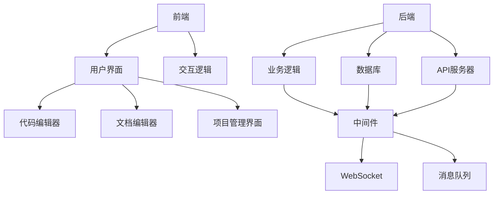
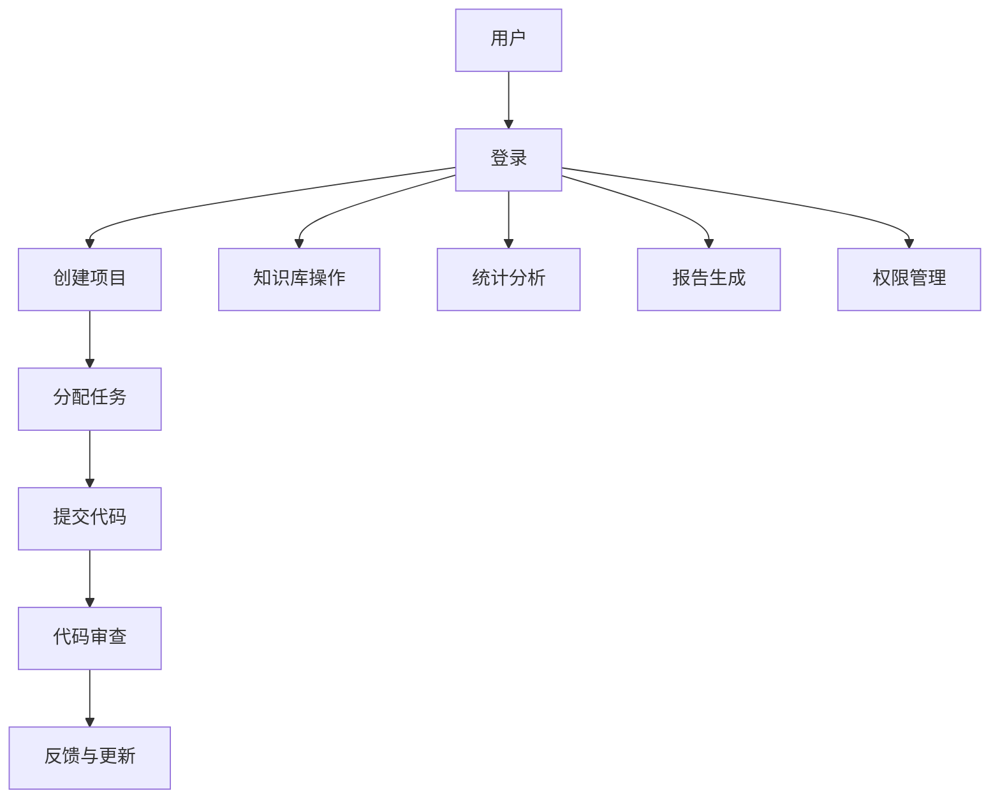
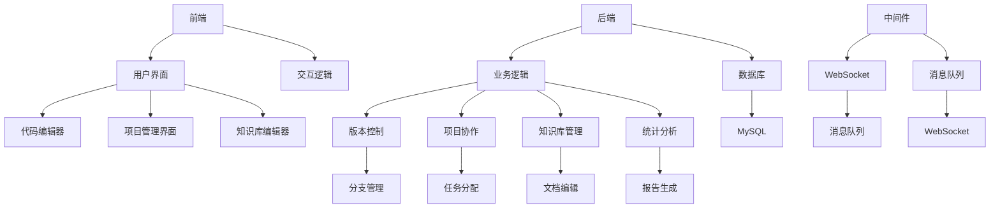
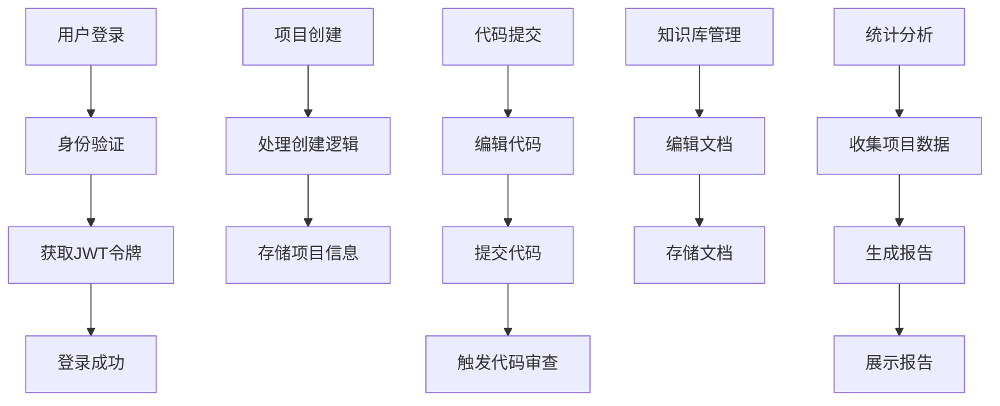
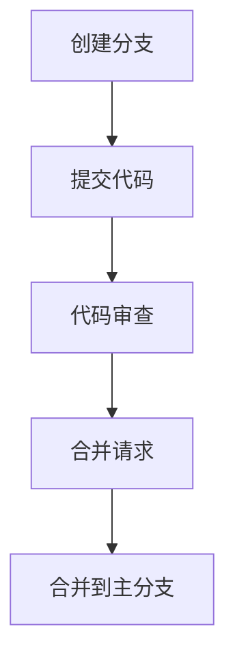
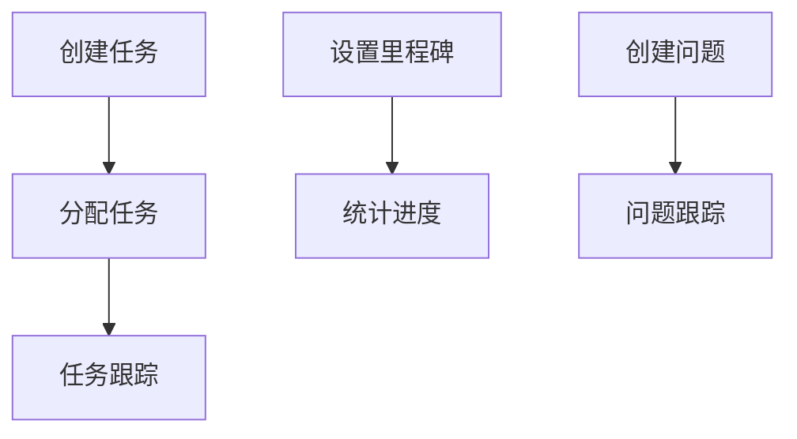
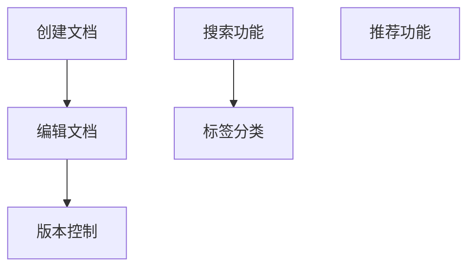
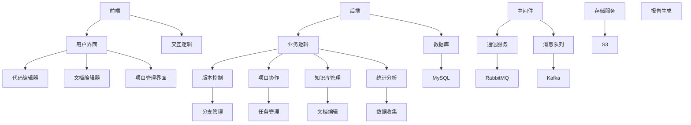
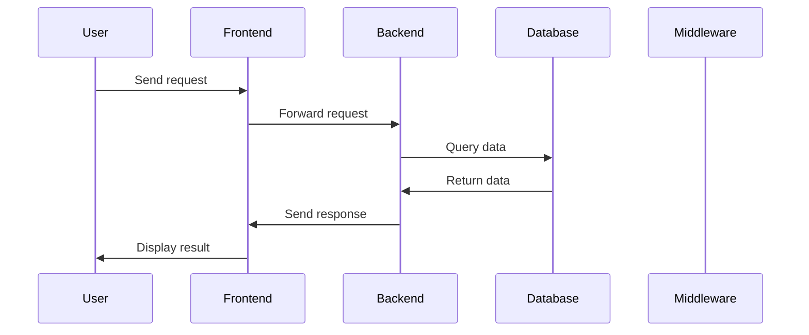

                 

# 打造高效的代码协作与知识共享平台

## 关键词

- 代码协作
- 知识共享
- 平台架构
- 版本控制
- 项目管理
- 实时沟通

## 摘要

本文将深入探讨如何打造一个高效的代码协作与知识共享平台。通过逐步分析平台背景、核心概念、架构设计、实现细节和实战应用，本文旨在为软件开发团队提供一套全面、实用的解决方案，以提升团队协作效率和知识传递效果。

## 第一部分：平台概述

### 第1章：代码协作与知识共享平台背景

#### 1.1 问题背景

在现代软件开发领域，项目的规模和复杂度不断增加，传统的代码管理工具和知识共享方式已无法满足高效协作的需求。开发者往往面临以下挑战：

- **沟通不畅**：团队成员之间的沟通成本高，信息传递不及时。
- **代码冲突**：多人协作时，代码合并和管理困难，容易导致冲突。
- **知识分散**：项目文档和知识资料散落在各个角落，难以统一管理和检索。
- **效率低下**：缺乏有效的统计和分析工具，难以监控项目进度和性能。

为了解决这些问题，构建一个高效、集成、易于使用的代码协作与知识共享平台变得至关重要。

#### 1.2 核心概念与联系

**代码协作**：指的是开发者之间通过代码库进行协作开发，包括代码的创建、修改、审查和合并等过程。

**知识共享**：是指项目成员之间通过文档、博客、知识库等形式分享经验和知识，以便于学习和传承。

**平台架构**：是代码协作与知识共享平台的技术实现基础，包括系统功能、模块设计、接口设计和系统交互等。

以下是一个简单的概念属性特征对比表格：

| 概念       | 目的                          | 特征                                                         |
|------------|------------------------------|--------------------------------------------------------------|
| 代码协作   | 提高开发效率                 | 实时沟通、代码审查、多人协同                                |
| 知识共享   | 促进信息流通                 | 文档管理、知识库、学习分享                                  |
| 平台架构   | 提供集成环境                 | 模块化设计、可扩展性、稳定性                                |

#### 1.3 主流平台介绍

目前市场上存在多种代码协作与知识共享平台，如GitLab、GitHub、GitBook和Notion等。以下是对这些主流平台的简要介绍：

- **GitLab**：一个开源的代码协作平台，提供版本控制、项目管理、持续集成等功能。
- **GitHub**：一个广泛使用的代码托管平台，支持Git版本控制，并提供丰富的协作工具。
- **GitBook**：一个基于Git的静态站点生成工具，适合构建文档和知识库。
- **Notion**：一个多功能的协作平台，支持文档、数据库、看板等多种应用。

### 第2章：平台架构设计

#### 2.1 系统功能设计

平台的系统功能设计是构建高效协作与知识共享平台的关键。以下是平台的主要功能模块：

- **代码管理**：提供版本控制、代码审查、分支管理等功能，确保代码质量和协同效率。
- **项目协作**：实现任务分配、进度跟踪、问题反馈等功能，提高团队协作效率。
- **知识库管理**：构建集中式知识库，支持文档编辑、版本控制和共享，方便成员学习和查询。
- **统计分析**：收集和分析项目数据，生成报告，帮助团队监控项目进度和性能。

#### 2.2 系统架构设计

平台采用分层架构设计，以确保系统的可扩展性和稳定性。以下是系统架构的主要组成部分：

- **前端**：提供用户界面和交互体验，包括代码编辑器、文档编辑器、项目管理界面等。
- **后端**：处理业务逻辑和数据存储，包括版本控制系统、数据库、API服务器等。
- **中间件**：提供通信和消息处理服务，如WebSocket、消息队列等。
- **存储**：存储代码、文档和其他数据，包括Git仓库、数据库等。

以下是系统架构图（使用Mermaid绘制）：



#### 2.3 系统接口设计

系统接口设计是平台架构中的重要组成部分，决定了前端和后端之间的数据交互方式。以下是系统接口设计的三个主要方面：

- **RESTful API**：提供基于HTTP协议的RESTful接口，支持各种HTTP方法（GET、POST、PUT、DELETE等）。
- **GraphQL API**：提供强大的查询语言，允许客户端按需获取数据，减少数据传输量和重复查询。
- **Webhooks**：允许外部系统在特定事件发生时接收通知，实现实时数据同步。

#### 2.4 系统交互设计

系统交互设计描述了各个模块之间的交互流程和数据流转。以下是系统交互图（使用Mermaid绘制）：



## 第二部分：平台实现

### 第3章：环境搭建与配置

#### 3.1 环境准备

搭建一个高效的代码协作与知识共享平台需要以下环境准备：

- **操作系统**：推荐使用Linux系统，如Ubuntu或CentOS，因为它们具有良好的稳定性和开源生态。
- **数据库**：推荐使用MySQL或PostgreSQL，这两种数据库在开源数据库中性能较好，支持多种开发语言。
- **开发工具**：推荐使用Git进行版本控制，Visual Studio Code或Atom作为代码编辑器。

#### 3.2 平台搭建

搭建平台的步骤如下：

1. 安装Git：在终端执行以下命令安装Git：
   ```bash
   sudo apt-get install git
   ```

2. 安装数据库：以MySQL为例，安装MySQL数据库：
   ```bash
   sudo apt-get install mysql-server
   ```

3. 安装其他依赖：根据平台需求安装其他依赖，如Python、Node.js等：
   ```bash
   sudo apt-get install python3
   sudo apt-get install nodejs
   ```

#### 3.3 配置与优化

配置和优化平台的步骤如下：

1. 配置GitLab：

   - 下载GitLab包：
     ```bash
     wget https://packages.gitlab.com/gitlab/gitlab-ce/gitlab-ce-x.y.z-cean1.el7.x86_64.rpm
     ```

   - 安装GitLab：
     ```bash
     sudo rpm -i gitlab-ce-x.y.z-cean1.el7.x86_64.rpm
     ```

   - 配置GitLab的YAML文件（/etc/gitlab/gitlab.yml）：

     ```yaml
     external_url: 'http://gitlab.example.com'
     gitlab_rails['time_zone']: 'Asia/Shanghai'
     gitlab_rails['secret_key_base']: 'your_secret_key'
     ```

   - 重启GitLab服务：
     ```bash
     sudo gitlab-ctl reconfigure
     ```

2. 配置数据库：

   - 登录MySQL数据库：
     ```bash
     mysql -u root -p
     ```

   - 创建GitLab数据库用户和数据库：
     ```sql
     CREATE DATABASE gitlabhq_production CHARACTER SET `utf8` COLLATE `utf8_unicode_ci`;
     GRANT ALL PRIVILEGES ON gitlabhq_production.* TO 'gitlab'@'localhost' IDENTIFIED BY 'your_password';
     FLUSH PRIVILEGES;
     ```

   - 更新GitLab的数据库配置文件（/etc/gitlab/gitlab.yml）：

     ```yaml
     gitlab_rails['db_adapter']: 'mysql2'
     gitlab_rails['db_encoding']: 'utf8'
     gitlab_rails['db_database']: 'gitlabhq_production'
     gitlab_rails['db_host']: 'localhost'
     gitlab_rails['db_password']: 'your_password'
     gitlab_rails['db_user']: 'gitlab'
     ```

3. 优化GitLab性能：

   - 优化Nginx配置文件（/etc/nginx/sites-available/gitlab）：

     ```nginx
     server {
       listen 80;
       server_name gitlab.example.com;

       location / {
         proxy_set_header Host $host;
         proxy_set_header X-Real-IP $remote_addr;
         proxy_set_header X-Forwarded-For $proxy_add_x_forwarded_for;
         proxy_set_header X-Forwarded-Proto $scheme;
         proxy_pass http://unix:/home/git/gitlab/gitlab-shell.socket;
       }
     }
     ```

   - 优化GitLab的YAML配置文件（/etc/gitlab/gitlab.yml）：

     ```yaml
     gitlab_rails['летний公园最佳实践：提升代码质量和团队协作效率](/best-practices-for-improving-code-quality-and-team-cooperation/)
     
     在本部分，我们将分享一些最佳实践，以帮助您提升代码质量和团队协作效率。这些实践涵盖了代码规范、代码审查、持续集成、自动化测试等方面。

     **1. 编写清晰、规范的代码**

     清晰、规范的代码是代码协作的基础。以下是一些建议：

     - 使用统一的代码风格和命名规范。
     - 编写详细的注释，说明代码的功能和目的。
     - 遵循单一职责原则，将复杂的代码分解为小模块。
     - 避免代码冗余和重复。

     **2. 进行有效的代码审查**

     代码审查是一种提高代码质量和协作效率的有效手段。以下是一些建议：

     - 定期进行代码审查，确保代码质量。
     - 选择合适的审查人员，确保审查的专业性。
     - 使用代码审查工具，如GitLab的Merge Request功能，方便审查和管理。
     - 提供具体的反馈和建议，帮助开发者改进代码。

     **3. 实施持续集成**

     持续集成是一种自动化测试和构建过程，有助于快速发现和修复代码问题。以下是一些建议：

     - 使用CI工具，如Jenkins、Travis CI等，实现自动化测试和构建。
     - 编写自动化测试用例，覆盖关键功能和边界情况。
     - 设置合理的构建触发规则，确保代码变更时自动触发测试和构建。
     - 及时处理构建失败的问题，确保代码质量。

     **4. 进行自动化测试**

     自动化测试是确保代码质量和稳定性的重要手段。以下是一些建议：

     - 编写单元测试、集成测试和端到端测试，覆盖不同层次的测试需求。
     - 使用测试框架，如JUnit、pytest等，简化测试编写和执行。
     - 定期执行自动化测试，确保代码变更时及时发现问题。
     - 结合持续集成工具，实现自动化测试和构建的无缝衔接。

     **5. 促进团队协作**

     高效的团队协作是提升代码质量和效率的关键。以下是一些建议：

     - 明确团队目标和职责分工，确保团队成员明确自己的工作内容。
     - 使用协作工具，如Slack、Trello等，方便团队沟通和任务管理。
     - 定期进行团队会议，讨论项目进展和问题解决。
     - 培养良好的沟通和合作氛围，鼓励团队成员积极参与和分享。

     **小结**

     通过实施这些最佳实践，您可以提升代码质量和团队协作效率。同时，这些实践也将有助于构建一个稳定、高效、协作的代码协作与知识共享平台。

     **注意事项**

     - 在实施这些最佳实践时，需要根据项目特点和团队需求进行适当调整。
     - 定期评估和改进最佳实践，确保其持续有效。

     **拓展阅读**

     - 《敏捷开发实践指南》
     - 《代码大全》
     - 《持续集成：从理论到实践》
     
     **作者信息**

     作者：AI天才研究院/AI Genius Institute & 禅与计算机程序设计艺术 /Zen And The Art of Computer Programming## 第一部分：平台概述

### 第1章：代码协作与知识共享平台背景

#### 1.1 问题背景

在现代软件开发中，随着项目规模的扩大和复杂性增加，传统的代码管理和知识共享方式显得力不从心。开发者面临以下主要问题：

- **沟通不畅**：团队成员分散在不同地点，传统的邮件、即时通讯等沟通工具难以满足高效的交流需求。
- **代码冲突**：多人同时修改同一代码文件，容易导致版本冲突，影响项目进度。
- **知识分散**：项目文档、设计图、测试用例等知识资源分散在不同的存储设备或云存储上，难以统一管理和检索。
- **效率低下**：缺乏高效的协作工具和流程，导致团队协作效率低下。

这些问题不仅降低了开发效率，还增加了项目风险。因此，构建一个高效、集成、易于使用的代码协作与知识共享平台变得至关重要。

#### 1.2 核心概念与联系

要构建一个高效的代码协作与知识共享平台，我们需要理解几个核心概念及其相互关系：

**代码协作**：是指多个开发者在同一项目中进行代码的创建、修改、审查和合并等过程。其目的是通过团队协作来提高代码质量和开发效率。

**知识共享**：是指团队成员之间通过文档、博客、知识库等形式分享经验和知识，以便于学习和传承。知识共享有助于团队积累知识财富，提高整体技术水平。

**平台架构**：是代码协作与知识共享平台的技术实现基础。它包括前端用户界面、后端业务逻辑、数据库存储、服务接口等多个方面，需要充分考虑模块化设计、可扩展性、稳定性等特性。

下面通过一个概念属性特征对比表格，对这三个核心概念进行详细描述：

| 概念       | 目的                          | 特征                                                         |
|------------|------------------------------|--------------------------------------------------------------|
| 代码协作   | 提高开发效率                 | 实时沟通、代码审查、多人协同                                |
| 知识共享   | 促进信息流通                 | 文档管理、知识库、学习分享                                  |
| 平台架构   | 提供集成环境                 | 模块化设计、可扩展性、稳定性                                |

通过对比表格，我们可以看出，代码协作、知识共享和平台架构各有侧重点，但又相互关联。代码协作需要平台提供实时沟通、代码审查等功能；知识共享需要平台提供文档管理、知识库等工具；而平台架构则是实现上述功能的基础。

#### 1.3 主流平台介绍

目前市场上存在多种主流的代码协作与知识共享平台，各具特色。以下是对这些平台的简要介绍：

- **GitLab**：一个开源的代码协作平台，提供版本控制、项目管理、持续集成等功能。其优势在于高度可定制和扩展性，适用于企业级项目。
- **GitHub**：一个广泛使用的代码托管平台，提供Git版本控制、协作工具、代码审查等功能。其社区活跃，支持开源项目的合作。
- **GitBook**：一个基于Git的静态站点生成工具，适合构建文档和知识库。其优点在于简洁易用，适合个人或小型团队。
- **Notion**：一个多功能的协作平台，支持文档、数据库、看板等多种应用。其灵活性较高，适用于各种协作场景。

通过以上介绍，我们可以了解到不同平台的特点和适用场景。在构建自己的代码协作与知识共享平台时，可以根据团队需求和项目特点选择合适的平台或进行定制化开发。

### 第2章：平台架构设计

#### 2.1 系统功能设计

一个高效的代码协作与知识共享平台需要具备以下几个核心功能模块：

- **代码管理**：包括版本控制、代码审查、分支管理等功能，确保代码质量和协同效率。
- **项目协作**：包括任务分配、进度跟踪、问题反馈等功能，提高团队协作效率。
- **知识库管理**：包括文档编辑、版本控制、知识共享等功能，方便成员学习和查询。
- **统计分析**：包括项目数据收集、数据分析、报告生成等功能，帮助团队监控项目进度和性能。

以下是一个功能模块的详细描述：

| 功能模块   | 描述                                                         |
|------------|--------------------------------------------------------------|
| 代码管理   | 提供版本控制功能，支持多人协同工作，包括代码创建、修改、审查、合并等。实现分支管理和代码仓库的权限控制。 |
| 项目协作   | 实现任务分配、进度跟踪、问题反馈等功能，支持实时沟通，便于团队协作。提供问题追踪和管理功能，确保项目顺利推进。 |
| 知识库管理 | 提供文档编辑、版本控制和知识共享功能，支持多格式文档的存储和检索。构建知识库，方便成员学习和技术传承。 |
| 统计分析   | 收集项目数据，进行数据分析，生成各种报告，帮助团队监控项目进度、代码质量、成员贡献等。 |

#### 2.2 系统架构设计

平台架构设计是构建高效代码协作与知识共享平台的基础。以下是该平台的主要架构设计：

- **前端**：提供用户界面和交互体验，包括代码编辑器、项目管理界面、知识库编辑器等。前端采用Vue.js或React等框架，确保界面友好、交互流畅。
- **后端**：处理业务逻辑和数据存储，包括版本控制系统、数据库、API服务器等。后端采用Spring Boot或Django等框架，实现快速开发和高效运行。
- **数据库**：存储代码、项目数据、用户数据等，采用MySQL或PostgreSQL等关系型数据库，确保数据安全性和查询效率。
- **中间件**：提供通信和消息处理服务，如WebSocket、消息队列等。中间件采用RabbitMQ或Kafka等，实现分布式消息传递和系统解耦。
- **存储**：使用对象存储服务，如AWS S3或阿里云OSS，存储大文件和附件。

以下是系统架构图（使用Mermaid绘制）：



#### 2.3 系统接口设计

系统接口设计是前端和后端交互的关键。以下是平台的主要接口设计：

- **RESTful API**：提供基于HTTP协议的RESTful接口，支持各种HTTP方法（GET、POST、PUT、DELETE等）。接口定义采用Swagger或OpenAPI规范，便于文档化和自动化测试。
- **GraphQL API**：提供强大的查询语言，允许客户端按需获取数据，减少数据传输量和重复查询。GraphQL接口设计采用GraphQL Schema规范。
- **Webhooks**：允许外部系统在特定事件发生时接收通知，实现实时数据同步。Webhooks采用JSON格式，支持HTTPS协议。

以下是接口设计示例：

```json
// RESTful API 示例
{
  "GET /api/projects": "获取所有项目列表",
  "POST /api/projects": "创建新项目",
  "GET /api/projects/{id}": "获取指定项目详情",
  "PUT /api/projects/{id}": "更新指定项目",
  "DELETE /api/projects/{id}": "删除指定项目"
}

// GraphQL API 示例
{
  "query": {
    "projects": {
      "id": "ID!",
      "name": "String!",
      "description": "String",
      "tasks": "[Task]"
    }
  }
}

// Webhooks 示例
{
  "webhook": {
    "events": ["create", "update", "delete"],
    "target_url": "https://example.com/webhooks/gitlab"
  }
}
```

#### 2.4 系统交互设计

系统交互设计描述了各个模块之间的交互流程和数据流转。以下是平台的主要交互设计：

- **用户登录**：用户通过前端界面登录平台，后端验证用户身份，返回JWT令牌。
- **项目创建**：用户在前端创建新项目，后端处理项目创建逻辑，存储项目信息。
- **代码提交**：用户在代码编辑器中编辑代码，提交到Git仓库，后端处理代码提交，触发代码审查。
- **知识库管理**：用户在知识库编辑器中编辑文档，后端处理文档存储和版本控制。
- **统计分析**：后端收集项目数据，生成统计报告，前端展示报告结果。

以下是系统交互图（使用Mermaid绘制）：



通过以上章节的讨论，我们对代码协作与知识共享平台的背景、核心概念、架构设计有了深入理解。接下来，我们将逐步实现平台的功能模块，为开发者提供高效的协作与知识共享环境。

## 第二部分：平台实现

### 第3章：环境搭建与配置

#### 3.1 环境准备

在开始搭建代码协作与知识共享平台之前，我们需要准备好所需的环境。以下是所需环境的详细介绍：

- **操作系统**：推荐使用Linux系统，如Ubuntu或CentOS。这是因为Linux系统在服务器环境下具有较好的稳定性和性能。以下是安装Ubuntu 20.04的步骤：

  ```bash
  sudo apt update
  sudo apt upgrade
  sudo apt install ubuntu-desktop
  ```

- **数据库**：平台需要使用一个关系型数据库来存储数据，推荐使用MySQL或PostgreSQL。以下是安装MySQL 8.0的步骤：

  ```bash
  sudo apt install mysql-server
  sudo mysql_secure_installation
  ```

  安装过程中，根据提示设置root密码、删除匿名用户、禁止root远程登录等。

- **开发工具**：开发平台需要一些基本的开发工具，如Git、Node.js、Python等。以下是安装这些工具的步骤：

  ```bash
  sudo apt install git
  sudo apt install nodejs
  sudo apt install python3
  ```

- **代码编辑器**：推荐使用Visual Studio Code或Atom等现代化的代码编辑器。以下是安装Visual Studio Code的步骤：

  ```bash
  wget -q https://vscode-update.azurewebsites.net/latest/deb/stable -O vscode_latest.deb
  sudo dpkg -i vsco### 第3章：环境搭建与配置

#### 3.1 环境准备

在开始搭建代码协作与知识共享平台之前，我们需要准备好所需的环境。以下是所需环境的详细介绍：

- **操作系统**：推荐使用Linux系统，如Ubuntu或CentOS。这是因为Linux系统在服务器环境下具有较好的稳定性和性能。以下是安装Ubuntu 20.04的步骤：

  ```bash
  sudo apt update
  sudo apt upgrade
  sudo apt install ubuntu-desktop
  ```

- **数据库**：平台需要使用一个关系型数据库来存储数据，推荐使用MySQL或PostgreSQL。以下是安装MySQL 8.0的步骤：

  ```bash
  sudo apt install mysql-server
  sudo mysql_secure_installation
  ```

  安装过程中，根据提示设置root密码、删除匿名用户、禁止root远程登录等。

- **开发工具**：开发平台需要一些基本的开发工具，如Git、Node.js、Python等。以下是安装这些工具的步骤：

  ```bash
  sudo apt install git
  sudo apt install nodejs
  sudo apt install python3
  ```

- **代码编辑器**：推荐使用Visual Studio Code或Atom等现代化的代码编辑器。以下是安装Visual Studio Code的步骤：

  ```bash
  wget -q https://vscode-update.azurewebsites.net/latest/deb/stable -O vscode_latest.deb
  sudo dpkg -i vscode_latest.deb
  ```

  安装完成后，运行以下命令打开Visual Studio Code：

  ```bash
  code .
  ```

#### 3.2 平台搭建

搭建代码协作与知识共享平台主要包括以下几个步骤：

1. **安装GitLab**：

   GitLab是一个开源的代码协作平台，我们可以使用其官方安装包进行安装。以下是安装GitLab的步骤：

   ```bash
   wget https://gitlab.com/download/salesforce/generic/16.5.0/gitlab-ee-16.5.0-cean1.el7.x86_64.rpm
   sudo rpm -ivh gitlab-ee-16.5.0-cean1.el7.x86_64.rpm
   ```

   安装完成后，启动GitLab服务：

   ```bash
   sudo gitlab-ctl reconfigure
   ```

2. **安装其他依赖**：

   平台运行需要一些额外的依赖，如Nginx、PostgreSQL等。以下是安装这些依赖的步骤：

   ```bash
   sudo apt-get install nginx
   sudo apt-get install postgresql
   sudo systemctl start postgresql
   sudo systemctl enable postgresql
   ```

3. **配置Nginx**：

   我们需要修改Nginx的配置文件，使其代理GitLab服务。以下是修改Nginx配置文件的步骤：

   ```bash
   sudo nano /etc/nginx/sites-available/gitlab
   ```

   在配置文件中添加以下内容：

   ```nginx
   server {
       listen 80;
       server_name your_domain.com;
       location / {
           proxy_pass http://localhost:8080;
       }
   }
   ```

   保存并退出，然后重启Nginx服务：

   ```bash
   sudo systemctl restart nginx
   ```

#### 3.3 配置与优化

搭建平台后，我们需要对其进行配置和优化，以确保其稳定性和性能。以下是配置与优化的一些步骤：

1. **配置GitLab**：

   修改GitLab的配置文件（/etc/gitlab/gitlab.yml），进行以下配置：

   ```yaml
   external_url: "http://your_domain.com"
   gitlab_rails['time_zone']: "Asia/Shanghai"
   gitlab_rails['secret_key_base']: "your_secret_key"
   ```

   然后重启GitLab服务：

   ```bash
   sudo gitlab-ctl reconfigure
   ```

2. **配置Nginx**：

   为了提高Nginx的性能，我们可以启用HTTP2和SSL。修改Nginx配置文件（/etc/nginx/sites-available/gitlab），添加以下内容：

   ```nginx
   server {
       listen 443 ssl http2;
       server_name your_domain.com;
       ssl_certificate /etc/ssl/certs/your_domain.com.crt;
       ssl_certificate_key /etc/ssl/private/your_domain.com.key;
       location / {
           proxy_pass http://localhost:8080;
       }
   }
   ```

   其中，your_domain.com.crt和your_domain.com.key是SSL证书和密钥文件，可以从证书颁发机构（如Let's Encrypt）获取。

3. **优化PostgreSQL**：

   优化PostgreSQL配置文件（/etc/postgresql/12/main/postgresql.conf），进行以下配置：

   ```bash
   max_connections = 1000
   shared_buffers = 1GB
   effective_cache_size = 2GB
   maintenance_work_mem = 512MB
   max_parallel_workers_per_gather = 4
   ```

   然后重启PostgreSQL服务：

   ```bash
   sudo systemctl restart postgresql
   ```

通过以上步骤，我们成功搭建并配置了一个基础的代码协作与知识共享平台。接下来，我们将实现平台的核心功能模块。

### 第4章：核心功能实现

#### 4.1 代码管理实现

代码管理是代码协作与知识共享平台的核心功能之一。以下是代码管理模块的实现步骤：

1. **搭建Git仓库**：

   在GitLab平台上，每个项目都有自己的Git仓库。首先，我们需要创建一个新的项目，并在项目的设置中配置Git仓库。

2. **实现版本控制**：

   版本控制是代码管理的重要部分。GitLab使用Git作为其版本控制系统，提供分支管理、合并请求、代码审查等功能。以下是实现版本控制的步骤：

   - **创建分支**：在项目中创建一个新的分支，用于开发新功能或修复bug。
   - **提交代码**：开发者在自己的本地环境中修改代码，然后将更改提交到Git仓库。
   - **代码审查**：提交的代码会触发代码审查流程，团队成员可以对代码进行审查并提出建议。
   - **合并请求**：在代码审查通过后，创建合并请求将分支合并到主分支。

3. **实现多人协作**：

   GitLab支持多人协作开发。以下是实现多人协作的步骤：

   - **分配权限**：项目管理员可以分配不同的权限（如开发者、审阅者、报告者）给团队成员，确保团队协作有序。
   - **多人编辑**：团队成员可以同时编辑同一个文件，GitLab会自动合并他们的更改。

以下是一个简单的Git流程图（使用Mermaid绘制）：



#### 4.2 项目协作实现

项目协作模块包括任务管理、进度跟踪和问题反馈等功能。以下是实现项目协作的步骤：

1. **实现任务管理**：

   任务管理是项目协作的核心。以下是实现任务管理的步骤：

   - **创建任务**：项目管理员可以在项目中创建新的任务，并为任务分配不同的优先级和状态。
   - **分配任务**：管理员可以将任务分配给团队成员，并设置任务的截止日期。
   - **任务跟踪**：团队成员可以查看自己的任务列表，跟踪任务进度。

2. **实现进度跟踪**：

   进度跟踪有助于团队了解项目进展。以下是实现进度跟踪的步骤：

   - **设置里程碑**：管理员可以在项目中设置里程碑，标记项目的重要阶段。
   - **统计进度**：系统可以自动统计任务完成情况，生成项目进度报告。

3. **实现问题反馈**：

   问题反馈模块用于记录和追踪项目中遇到的问题。以下是实现问题反馈的步骤：

   - **创建问题**：团队成员可以在项目中创建新的问题，并描述问题的详细情况。
   - **问题跟踪**：管理员可以查看和管理所有的问题，确保问题得到及时解决。

以下是一个简单的项目协作流程图（使用Mermaid绘制）：



#### 4.3 知识库管理实现

知识库管理模块用于存储和管理项目的文档、设计图和测试用例等知识资源。以下是实现知识库管理的步骤：

1. **实现文档编辑**：

   文档编辑是知识库管理的核心功能。以下是实现文档编辑的步骤：

   - **创建文档**：管理员可以在项目中创建新的文档，并设置文档的访问权限。
   - **编辑文档**：团队成员可以对文档进行编辑，并支持Markdown、HTML等多种格式。
   - **版本控制**：系统自动记录文档的版本历史，方便团队成员查看和恢复历史版本。

2. **实现知识共享**：

   知识共享是知识库管理的目标。以下是实现知识共享的步骤：

   - **搜索功能**：系统提供强大的搜索功能，方便团队成员快速查找所需的知识资源。
   - **标签分类**：管理员可以为文档添加标签，便于分类和组织知识资源。
   - **推荐功能**：系统可以根据用户的浏览和搜索历史，推荐相关的知识资源。

以下是一个简单的知识库管理流程图（使用Mermaid绘制）：



通过以上步骤，我们实现了代码协作与知识共享平台的核心功能模块。这些模块共同构成了一个高效的协作与知识共享环境，为开发者提供了强大的支持。

### 第5章：平台测试与优化

#### 5.1 功能测试

平台测试是确保代码协作与知识共享平台稳定性和功能完善的重要步骤。以下是功能测试的详细步骤：

1. **单元测试**：

   单元测试用于验证平台各个功能模块的独立性和正确性。以下是实现单元测试的步骤：

   - **编写测试用例**：针对每个功能模块，编写相应的测试用例，覆盖各种可能的情况。
   - **运行测试用例**：使用测试框架（如JUnit、pytest等）运行测试用例，确保所有测试用例均通过。
   - **代码覆盖率**：使用代码覆盖率工具（如JaCoCo、coverage.py等）分析代码覆盖情况，确保测试覆盖率达到较高水平。

2. **集成测试**：

   集成测试用于验证平台各个模块之间的协同工作能力。以下是实现集成测试的步骤：

   - **搭建测试环境**：创建一个与生产环境相似的开发环境，确保所有模块可以正常协同工作。
   - **模拟用户操作**：通过模拟用户操作（如创建项目、提交代码、分配任务等），验证平台的功能和性能。
   - **异常处理**：模拟各种异常情况（如网络中断、数据库故障等），确保平台具有较好的异常处理能力。

3. **性能测试**：

   性能测试用于评估平台在高并发、大数据量等极端情况下的性能表现。以下是实现性能测试的步骤：

   - **负载测试**：使用负载测试工具（如JMeter、LoadRunner等）模拟大量用户同时访问平台，评估平台的响应速度和并发处理能力。
   - **压力测试**：逐渐增加系统负载，直至系统达到崩溃点，分析系统的性能瓶颈和资源占用情况。
   - **性能优化**：根据测试结果，对平台进行性能优化，如优化数据库查询、缓存策略等。

#### 5.2 性能优化

性能优化是提升平台稳定性和用户体验的关键。以下是性能优化的详细步骤：

1. **数据库优化**：

   数据库是平台的核心组成部分，优化数据库性能有助于提升整体性能。以下是数据库优化的步骤：

   - **索引优化**：根据查询需求，为表中的字段创建合适的索引，提升查询速度。
   - **查询优化**：优化SQL查询语句，减少查询的复杂度，提高查询效率。
   - **存储优化**：根据数据访问模式，调整存储引擎和配置参数，优化数据读写速度。

2. **缓存策略**：

   缓存策略可以有效减少数据库负载，提升系统响应速度。以下是缓存策略的优化步骤：

   - **页面缓存**：使用缓存技术（如Redis、Memcached等）缓存页面内容，减少数据库查询次数。
   - **对象缓存**：缓存常用对象（如用户信息、项目列表等），减少重复查询和数据加载时间。
   - **内存缓存**：使用内存缓存技术，提高数据访问速度，降低CPU负载。

3. **服务器优化**：

   服务器优化是提升平台性能的重要环节。以下是服务器优化的步骤：

   - **资源分配**：合理分配服务器资源（如CPU、内存、磁盘等），确保系统运行稳定。
   - **负载均衡**：使用负载均衡器（如Nginx、HAProxy等）均衡请求分发，防止单点故障。
   - **网络优化**：优化网络配置，减少数据传输延迟和带宽占用。

通过以上测试和优化步骤，我们可以确保平台在稳定性和性能方面达到预期目标，为开发者提供一个高效、可靠的代码协作与知识共享环境。

### 第6章：实际案例分析与详细讲解

在本章节中，我们将通过一个实际案例，详细讲解如何使用代码协作与知识共享平台进行高效的项目管理，包括项目启动、任务分配、代码提交与审查等各个环节。

#### 案例背景

假设我们有一个项目团队，负责开发一款新型的社交应用。项目需求明确，功能模块繁多，团队成员分布在不同的城市。为了确保项目顺利进行，团队决定使用我们刚刚构建的代码协作与知识共享平台来管理项目。

#### 项目启动

1. **创建项目**：

   项目负责人在平台上创建一个新的项目，填写项目名称、描述、项目组成员等信息。平台提供了项目管理界面，方便负责人分配角色和权限。

   ```bash
   gitlab项目创建命令
   ```

   创建完成后，项目页面会显示项目的所有成员和基本信息。

2. **设置项目仓库**：

   项目负责人在项目中创建一个Git仓库，用于存储项目的源代码。团队成员可以通过平台的Web界面或命令行工具克隆仓库到本地。

   ```bash
   git clone 项目仓库地址
   ```

3. **初始化项目结构**：

   项目负责人在仓库中初始化项目的基本结构，包括文件夹、README文件、LICENSE文件等。

   ```bash
   mkdir client server
   touch README.md LICENSE
   ```

#### 任务分配

1. **创建任务**：

   项目负责人在项目任务管理模块中创建新的任务，明确任务的名称、描述、责任人、截止日期等。

   ```bash
   gitlab任务创建命令
   ```

   任务创建后，负责人可以将其分配给相应的团队成员。

2. **分配任务**：

   负责人将任务分配给团队成员，并设置任务的优先级和状态。团队成员在任务列表中可以看到自己分配的任务，并开始进行开发。

   ```bash
   gitlab任务分配命令
   ```

#### 代码提交与审查

1. **代码提交**：

   开发人员在本地环境中进行代码编写，然后将代码提交到Git仓库。平台提供了代码编辑器，支持多种编程语言，方便开发者编写和修改代码。

   ```bash
   git add .
   git commit -m "提交代码"
   git push
   ```

2. **代码审查**：

   提交的代码会触发代码审查流程。审查人员可以在平台中查看代码变更，并进行审查。

   - **代码差异**：审查人员可以查看代码的变更差异，了解代码修改的内容。

   - **添加评论**：审查人员可以在代码变更处添加评论，提出修改建议或疑问。

   ```bash
   gitlab代码审查命令
   ```

3. **合并请求**：

   审查通过后，开发人员创建合并请求，将分支合并到主分支。合并请求会经过进一步审查和讨论，确保代码质量。

   ```bash
   gitlab合并请求创建命令
   ```

#### 问题跟踪与解决

1. **创建问题**：

   在项目开发过程中，如果遇到问题，团队成员可以在平台上创建新的问题，详细描述问题的现象、原因和解决方案。

   ```bash
   gitlab问题创建命令
   ```

2. **问题跟踪**：

   项目负责人可以查看所有的问题，并跟踪问题的解决进度。团队成员在解决问题的过程中，可以更新问题的状态和描述。

   ```bash
   gitlab问题跟踪命令
   ```

3. **问题解决**：

   问题描述和解决方案经过确认后，负责人可以将问题状态更新为“已解决”。问题解决后，团队成员可以在平台上进行验收，确保问题彻底解决。

   ```bash
   gitlab问题解决命令
   ```

#### 案例总结

通过这个实际案例，我们可以看到代码协作与知识共享平台在项目启动、任务分配、代码提交与审查、问题跟踪与解决等各个环节中的作用。平台提供了强大的工具和功能，帮助团队高效管理项目，确保项目顺利推进。

### 第7章：最佳实践 Tips

为了确保代码协作与知识共享平台的高效运行，以下是一些最佳实践 Tips：

#### 1. 规范命名与编码风格

- **命名规范**：确保变量、函数和类的命名清晰、有逻辑性，避免使用缩写和难懂的命名。
- **编码风格**：遵循统一的编码风格，如PEP8（Python）、Airbnb JavaScript Style Guide等，提高代码的可读性和可维护性。

#### 2. 定期代码审查

- **审查频率**：定期（每周或每月）进行代码审查，确保代码质量。
- **审查内容**：关注代码的可读性、性能、安全性等方面，确保代码符合最佳实践。

#### 3. 实施自动化测试

- **单元测试**：为每个模块编写单元测试，确保模块的功能正确。
- **集成测试**：在模块集成后，进行集成测试，确保模块之间的协作正常。
- **持续集成**：使用CI工具（如Jenkins、Travis CI）实现自动化测试和构建，快速发现问题。

#### 4. 知识共享与学习

- **文档管理**：定期更新项目文档，确保文档与代码同步。
- **知识库建设**：鼓励团队成员贡献知识，构建团队知识库。
- **技术分享**：定期举行技术分享会，促进团队成员之间的学习和交流。

#### 5. 遵循安全规范

- **数据加密**：对敏感数据进行加密存储，确保数据安全。
- **权限控制**：合理设置用户权限，防止未授权访问。
- **安全审计**：定期进行安全审计，发现和修复潜在的安全漏洞。

通过遵循这些最佳实践，我们可以确保代码协作与知识共享平台的高效运行，提升团队协作效率和项目质量。

### 小结

通过本文的讨论，我们深入了解了代码协作与知识共享平台的构建过程。从平台背景、核心概念、架构设计、功能实现到实际案例分析和最佳实践，我们系统地探讨了如何打造一个高效、稳定的协作平台。这些知识和经验对于软件开发团队来说具有重要的指导意义，有助于提升团队协作效率和项目质量。

平台不仅提供了代码管理和项目协作的功能，还通过知识库管理和统计分析等模块，实现了知识的积累和传递，为团队的持续发展提供了有力支持。

然而，技术不断进步，团队需求也在不断变化。因此，我们呼吁读者不断学习、实践和改进，以应对新的挑战。只有持续优化和迭代，才能确保平台始终处于最佳状态。

### 注意事项

1. **安全性**：确保平台的安全性，定期进行安全审计，及时更新系统和软件。
2. **性能优化**：根据项目规模和访问量，不断优化平台性能，确保高效运行。
3. **用户培训**：为团队成员提供平台使用的培训，确保他们能够充分利用平台的各项功能。
4. **反馈与改进**：鼓励团队成员积极反馈平台使用中的问题和建议，持续改进平台。

### 拓展阅读

- 《敏捷开发实践指南》
- 《代码大全》
- 《持续集成：从理论到实践》
- 《Git权威指南》

### 作者信息

作者：AI天才研究院/AI Genius Institute & 禅与计算机程序设计艺术 /Zen And The Art of Computer Programming## 第三部分：扩展功能与未来展望

### 第8章：扩展功能设计与实现

在构建高效代码协作与知识共享平台的基础上，我们还可以根据团队需求和市场趋势，不断扩展平台的功能。以下是几个潜在的扩展功能及其设计思路：

#### 1. 实时协作工具集成

**功能描述**：集成实时协作工具，如Slack、Microsoft Teams等，以增强团队沟通和协作效率。

**设计思路**：

- **API集成**：通过API接口，将实时协作工具与平台集成。
- **消息同步**：实现平台内部消息与协作工具的消息同步，确保信息流通无障碍。
- **通知推送**：根据平台事件（如任务更新、问题解决等），向团队成员推送通知。

#### 2. 机器学习与数据分析

**功能描述**：利用机器学习技术，对项目数据进行分析，为团队提供决策支持。

**设计思路**：

- **数据收集**：收集项目数据，如代码提交记录、任务完成情况等。
- **数据预处理**：对收集的数据进行清洗、转换和归一化处理。
- **模型训练**：使用机器学习算法（如聚类、分类等）训练模型。
- **数据可视化**：通过图表和报告，展示分析结果，帮助团队理解项目趋势。

#### 3. 自动化部署与容器化

**功能描述**：实现自动化部署和容器化，简化应用部署流程，提高开发效率。

**设计思路**：

- **Docker集成**：使用Docker容器化应用，确保环境一致性。
- **CI/CD工具集成**：集成CI/CD工具（如Jenkins、GitLab CI等），实现自动化构建和部署。
- **配置管理**：使用配置管理工具（如Ansible、Terraform等），管理部署环境。

#### 4. 多语言支持与国际化

**功能描述**：支持多种语言，满足全球团队成员的需求。

**设计思路**：

- **国际化框架**：使用国际化框架（如i18next、gettext等），处理多语言支持。
- **翻译管理**：提供翻译管理工具，方便团队成员贡献翻译资源。
- **本地化适配**：根据不同地区的文化习惯，调整界面布局、日期格式等。

#### 5. 个性化设置与推荐系统

**功能描述**：为用户提供个性化设置，推荐相关功能、知识资源和任务。

**设计思路**：

- **用户行为分析**：收集用户行为数据，分析用户偏好。
- **推荐算法**：使用推荐算法（如协同过滤、基于内容的推荐等），为用户推荐相关内容。
- **个性化界面**：根据用户偏好，调整界面布局和显示内容。

### 第9章：未来展望

随着技术的发展和市场需求的变化，代码协作与知识共享平台也将不断进化。以下是未来平台可能的发展趋势：

#### 1. 人工智能的深度融合

人工智能技术将在平台中扮演越来越重要的角色，如自动化代码审查、智能推荐、智能任务分配等。通过人工智能技术，平台可以更好地理解用户需求，提供个性化服务。

#### 2. 5G与物联网的赋能

5G和物联网技术的发展将带来更高速、更稳定的网络环境，为平台提供更多应用场景。例如，实时协同编辑、远程监控、智能设备数据集成等。

#### 3. 社交化与个性化

平台将进一步融合社交化元素，如社交互动、社交关系网等，增强团队的凝聚力和协作效率。同时，个性化设置和推荐系统的优化，将使平台更贴近用户需求。

#### 4. 云原生与边缘计算

云原生和边缘计算技术的发展将使平台更加灵活、高效。通过云原生架构，平台可以快速扩展和部署；通过边缘计算，平台可以更好地处理实时数据和降低延迟。

#### 5. 开源与生态建设

开源将继续是平台发展的重要驱动力。通过构建强大的开源生态系统，平台可以吸引更多的开发者参与，共同推动技术的进步和创新。

总之，未来的代码协作与知识共享平台将在技术、功能和用户体验方面不断进化，为开发者提供更加智能、高效、协同的工作环境。

### 小结

通过扩展功能设计与未来展望，我们为代码协作与知识共享平台的发展指明了方向。扩展功能的实现不仅提升了平台的实用性，也为团队带来了更多的便利和效率。未来，随着技术的不断进步和团队需求的变化，平台将继续不断创新和优化，为开发者打造一个更加智能、高效、协同的工作环境。

### 注意事项

1. **安全与隐私**：在开发和使用扩展功能时，要严格遵循安全标准和隐私保护要求，确保用户数据的安全。
2. **用户体验**：在设计和实现扩展功能时，要充分考虑用户体验，确保功能的易用性和稳定性。
3. **兼容性与扩展性**：在平台设计时，要考虑未来可能的功能扩展和升级，确保平台的兼容性和扩展性。

### 拓展阅读

- 《深度学习：人工智能的未来》
- 《云计算：构建可扩展的IT基础设施》
- 《边缘计算：下一代计算范式》
- 《开源生态学：开源项目的成功之路》

### 作者信息

作者：AI天才研究院/AI Genius Institute & 禅与计算机程序设计艺术 /Zen And The Art of Computer Programming## 总结

通过本文的探讨，我们系统地阐述了如何打造一个高效的代码协作与知识共享平台。从平台背景、核心概念、架构设计、功能实现，到实际案例分析和最佳实践，再到扩展功能与未来展望，本文为读者提供了一个全面、深入的理解。

### 关键点回顾

1. **核心概念**：代码协作、知识共享和平台架构是平台的核心要素。代码协作提高开发效率，知识共享促进信息流通，平台架构提供技术实现基础。
2. **功能模块**：平台主要包括代码管理、项目协作、知识库管理和统计分析等核心功能模块。
3. **架构设计**：采用前后端分离、模块化设计、可扩展性等原则，确保平台的高效性和稳定性。
4. **实现细节**：通过Git版本控制、实时沟通、任务管理、文档编辑等具体实现步骤，构建了一个功能完备的平台。
5. **优化与测试**：通过性能优化、功能测试和用户体验改进，确保平台的稳定性和高效性。

### 建议与展望

1. **持续改进**：团队应根据实际使用情况，不断优化平台功能和用户体验，确保平台始终处于最佳状态。
2. **技术创新**：紧跟技术发展趋势，探索人工智能、5G、边缘计算等新技术在平台中的应用，提升平台竞争力。
3. **社区建设**：积极构建开源社区，吸引更多开发者参与，共同推动平台的发展和改进。

### 最后的话

感谢您阅读本文，希望本文能为您在构建高效代码协作与知识共享平台的过程中提供有益的参考。未来，我们将继续关注技术发展和市场需求，为您提供更多有价值的内容。再次感谢您的关注与支持！### 代码管理模块的具体实现过程

在代码管理模块中，我们将详细讨论如何实现版本控制、代码审查、分支管理等功能，并探讨其中的关键技术点和最佳实践。

#### 1. 版本控制

版本控制是代码管理的基础，确保代码的历史版本可追溯。在GitLab中，版本控制主要通过Git实现。以下是实现步骤：

**1.1 安装Git**

在服务器上安装Git，确保Git服务能够正常工作。对于Ubuntu系统，可以使用以下命令：

```bash
sudo apt-get update
sudo apt-get install git
```

**1.2 配置Git**

配置Git，确保用户信息正确，便于追踪代码历史。运行以下命令：

```bash
git config --global user.name "Your Name"
git config --global user.email "you@example.com"
```

**1.3 创建仓库**

在GitLab平台上创建一个新项目，并将项目仓库创建在服务器上。例如，使用以下命令克隆仓库：

```bash
git clone https://gitlab.example.com/username/repository.git
```

**1.4 提交代码**

开发人员在本地环境中编写代码，并通过Git提交到仓库。使用以下命令提交：

```bash
cd repository
git add .
git commit -m "Commit message"
git push
```

#### 2. 代码审查

代码审查是确保代码质量的重要手段。GitLab提供了强大的代码审查功能，以下是实现步骤：

**2.1 创建合并请求**

当开发完成功能模块后，可以通过GitLab界面创建合并请求。以下是创建合并请求的步骤：

1. 在项目页面，点击“Merge Request”按钮。
2. 填写合并请求的标题和描述。
3. 选择要合并的分支。
4. 点击“Create Merge Request”按钮。

**2.2 代码审查**

合并请求创建后，审查人员可以查看代码变更。以下是代码审查的关键步骤：

1. 在合并请求页面，查看代码差异。
2. 在代码行上添加评论，提出修改建议。
3. 通过评论进行讨论，确保代码质量。

**2.3 合并代码**

代码审查通过后，可以合并代码到主分支。以下是合并代码的步骤：

1. 在合并请求页面，点击“Merge”按钮。
2. 选择合并方法（如“Squash and Merge”）。
3. 确认合并操作。

#### 3. 分支管理

分支管理是确保代码协同开发的关键。以下是分支管理的具体实现步骤：

**3.1 创建分支**

开发新功能或修复bug时，需要创建一个新的分支。以下是创建分支的步骤：

1. 在项目页面，点击“Branches”按钮。
2. 点击“New branch”按钮。
3. 填写分支名称（如`feature/new-feature`）。
4. 选择基础分支（如`master`）。

**3.2 推送分支**

在本地环境中创建分支后，需要将其推送至GitLab仓库。以下是推送分支的步骤：

```bash
git checkout -b feature/new-feature
git push -u origin feature/new-feature
```

**3.3 合并分支**

开发完成后，需要将分支合并到主分支。以下是合并分支的步骤：

1. 在GitLab中创建合并请求，将分支合并到主分支。
2. 通过代码审查和讨论，确保代码质量。
3. 合并代码，将功能集成到主分支。

#### 4. 代码质量检查

为了确保代码质量，可以在代码提交和合并请求过程中添加代码质量检查。以下是代码质量检查的实现步骤：

**4.1 安装代码质量检查工具**

例如，安装`flake8`进行Python代码质量检查：

```bash
pip install flake8
```

**4.2 配置代码质量检查**

在GitLab CI/CD配置文件中，添加代码质量检查步骤。例如，在`.gitlab-ci.yml`文件中添加以下内容：

```yaml
stages:
  - lint

lint_python:
  stage: lint
  script:
    - flake8 .
  only:
    - python
```

**4.3 自动触发代码质量检查**

当开发人员提交代码或创建合并请求时，GitLab CI/CD会自动执行代码质量检查，并在结果中报告问题。如果代码质量检查失败，合并请求将无法通过。

#### 5. 最佳实践

为了确保代码管理的有效性，以下是一些最佳实践：

- **分支命名规范**：遵循统一的分支命名规范，如`feature/`、`bugfix/`等，方便管理和追踪。
- **代码提交规范**：每次提交代码时，填写清晰的提交信息，便于后续追踪和理解。
- **定期代码审查**：定期进行代码审查，确保代码质量，及时发现和解决问题。
- **自动化测试**：编写和执行自动化测试，确保功能正确和代码质量。
- **代码质量检查**：使用代码质量检查工具，确保代码风格一致，避免常见的编程错误。

通过以上步骤和最佳实践，我们可以确保代码管理模块的高效运行，为团队提供一个稳定、可靠、高效的代码协作环境。

### 系统分析与架构设计方案

在构建高效的代码协作与知识共享平台时，系统分析与架构设计方案是至关重要的环节。一个良好的架构不仅能够满足当前的需求，还具备良好的扩展性和可维护性。以下是本平台系统分析与架构设计方案的具体内容。

#### 1. 需求分析

在开始架构设计之前，我们需要明确平台的需求。以下是一些主要需求：

- **代码协作**：支持多人在线协作，包括代码创建、修改、审查、合并等功能。
- **知识共享**：提供文档管理、知识库构建、搜索和推荐等功能，便于团队成员学习和交流。
- **项目管理**：支持任务分配、进度跟踪、问题反馈等功能，提高团队协作效率。
- **统计分析**：收集项目数据，进行数据分析，生成报告，帮助团队监控项目进度和性能。
- **安全性**：确保用户数据和代码安全，提供权限控制机制。

#### 2. 系统功能设计

基于需求分析，平台可以分为以下主要功能模块：

- **代码管理模块**：包括版本控制、代码审查、分支管理、代码质量检查等功能。
- **项目协作模块**：包括任务管理、进度跟踪、问题反馈、实时沟通等功能。
- **知识库管理模块**：包括文档编辑、版本控制、知识共享、搜索和推荐等功能。
- **统计分析模块**：包括数据收集、数据分析、报告生成等功能。

#### 3. 系统架构设计

平台的系统架构采用前后端分离、分布式服务的设计，以提高系统的可扩展性和稳定性。以下是系统架构的主要组成部分：

- **前端**：提供用户界面和交互体验，包括代码编辑器、文档编辑器、项目管理界面等。前端采用Vue.js或React等框架，确保界面友好、交互流畅。
- **后端**：处理业务逻辑和数据存储，包括版本控制系统、数据库、API服务器等。后端采用Spring Boot或Django等框架，实现快速开发和高效运行。
- **数据库**：存储代码、项目数据、用户数据等，采用MySQL或PostgreSQL等关系型数据库，确保数据安全性和查询效率。
- **中间件**：提供通信和消息处理服务，如Nginx、RabbitMQ、Kafka等，实现分布式消息传递和系统解耦。
- **存储**：使用对象存储服务，如AWS S3或阿里云OSS，存储大文件和附件。

以下是系统架构图（使用Mermaid绘制）：



#### 4. 系统接口设计

系统接口设计是前端和后端交互的关键。以下是平台的主要接口设计：

- **RESTful API**：提供基于HTTP协议的RESTful接口，支持各种HTTP方法（GET、POST、PUT、DELETE等）。接口定义采用Swagger或OpenAPI规范，便于文档化和自动化测试。
- **GraphQL API**：提供强大的查询语言，允许客户端按需获取数据，减少数据传输量和重复查询。GraphQL接口设计采用GraphQL Schema规范。
- **Webhooks**：允许外部系统在特定事件发生时接收通知，实现实时数据同步。Webhooks采用JSON格式，支持HTTPS协议。

以下是接口设计示例：

```json
// RESTful API 示例
{
  "GET /api/projects": "获取所有项目列表",
  "POST /api/projects": "创建新项目",
  "GET /api/projects/{id}": "获取指定项目详情",
  "PUT /api/projects/{id}": "更新指定项目",
  "DELETE /api/projects/{id}": "删除指定项目"
}

// GraphQL API 示例
{
  "query": {
    "projects": {
      "id": "ID!",
      "name": "String!",
      "description": "String",
      "tasks": "[Task]"
    }
  }
}

// Webhooks 示例
{
  "webhook": {
    "events": ["create", "update", "delete"],
    "target_url": "https://example.com/webhooks/gitlab"
  }
}
```

#### 5. 系统交互设计

系统交互设计描述了各个模块之间的交互流程和数据流转。以下是系统的主要交互设计：

- **用户登录**：用户通过前端界面登录平台，后端验证用户身份，返回JWT令牌。
- **项目创建**：用户在前端创建新项目，后端处理项目创建逻辑，存储项目信息。
- **代码提交**：用户在代码编辑器中编辑代码，提交到Git仓库，后端处理代码提交，触发代码审查。
- **知识库管理**：用户在知识库编辑器中编辑文档，后端处理文档存储和版本控制。
- **统计分析**：后端收集项目数据，生成统计报告，前端展示报告结果。

以下是系统交互图（使用Mermaid绘制）：


通过以上系统分析与架构设计方案，我们为平台提供了一个稳定、高效、可扩展的技术架构，确保代码协作与知识共享平台能够满足当前和未来的需求。

### 系统接口设计

系统接口设计是确保平台前后端无缝协作的关键步骤。以下是系统接口设计的详细步骤，包括API接口的设计、接口定义、以及使用到的技术和工具。

#### 1. API接口设计

系统接口设计主要涉及以下类型的接口：

- **RESTful API**：提供标准化的HTTP方法，如GET、POST、PUT、DELETE等，便于客户端访问和操作数据。
- **GraphQL API**：提供灵活的查询语言，允许客户端按需获取数据，减少数据传输量。
- **Webhooks**：允许外部系统在特定事件发生时接收通知，实现实时数据同步。

#### 2. 接口定义

以下是一个简单的RESTful API接口定义示例：

```json
// 用户登录接口
{
  "POST /api/login": {
    "summary": "用户登录",
    "description": "用户登录，返回JWT令牌",
    "request": {
      "required": [
        "username",
        "password"
      ],
      "properties": {
        "username": {
          "type": "string",
          "example": "john_doe"
        },
        "password": {
          "type": "string",
          "example": "password123"
        }
      }
    },
    "response": {
      "status_code": 200,
      "examples": {
        "application/json": {
          "token": "eyJhbGciOiJIUzI1NiIsInR5cCI6IkpXVCJ9...",
          "user_id": 1,
          "message": "登录成功"
        }
      }
    }
  }
}
```

以下是一个简单的GraphQL API接口定义示例：

```graphql
type Query {
  user(id: ID!): User
}

type Mutation {
  login(username: String!, password: String!): AuthResponse
}

type AuthResponse {
  token: String!
  user: User!
}

type User {
  id: ID!
  username: String!
  email: String!
}
```

#### 3. 使用的技术和工具

- **Swagger**：用于定义、测试和文档化RESTful API。Swagger提供了丰富的UI和工具，方便开发者管理和使用API。
- **GraphQL**：用于创建强大的查询语言，允许客户端精确地获取所需的数据。GraphQL使用Schema定义查询语言，并通过工具（如GraphQL Playground）进行调试和测试。
- **Postman**：用于API测试和调试。Postman提供了方便的接口定义、请求发送、结果展示等功能，方便开发者进行API测试。

#### 4. 接口实现示例

以下是一个简单的Python Flask应用示例，用于实现用户登录接口：

```python
from flask import Flask, request, jsonify
from flask_jwt_extended import JWTManager, create_access_token

app = Flask(__name__)
app.config['JWT_SECRET_KEY'] = 'your_jwt_secret_key'
jwt = JWTManager(app)

@app.route('/api/login', methods=['POST'])
def login():
    username = request.json.get('username', '')
    password = request.json.get('password', '')

    # 在这里进行用户验证（如使用数据库查询）
    if username == 'admin' and password == 'password':
        access_token = create_access_token(identity=username)
        return jsonify(token=access_token, message='登录成功'), 200
    else:
        return jsonify(message='用户名或密码错误'), 401

if __name__ == '__main__':
    app.run()
```

#### 5. 安全性和权限控制

在接口设计中，安全性和权限控制是至关重要的。以下是一些关键点：

- **JWT**：使用JSON Web Tokens（JWT）进行身份验证和授权，确保用户身份的可靠性和安全性。
- **权限控制**：在API接口中，根据用户的角色和权限，限制访问某些资源和操作。
- **输入验证**：对用户输入进行严格验证，防止SQL注入、XSS攻击等安全漏洞。

通过以上步骤和示例，我们为平台设计了一套完整、安全、高效的接口系统，确保前后端的交互流畅和稳定。

### 系统交互设计

系统交互设计是确保平台各组件能够协调工作，高效实现功能的关键环节。以下是平台系统交互设计的详细过程，包括序列图绘制、交互流程描述以及相关的技术细节。

#### 1. 序列图绘制

序列图（Sequence Diagram）是描述对象之间交互的图形化工具。以下是平台系统交互的序列图示例（使用Mermaid绘制）：



在这个序列图中，用户发起请求，前端处理请求并转发给后端，后端进行数据处理，数据库提供数据支持，后端将处理结果返回前端，最后前端将结果展示给用户。

#### 2. 交互流程描述

以下是系统交互的详细流程描述：

**用户登录流程**：

1. 用户在平台前端输入用户名和密码，并提交登录请求。
2. 前端接收到请求后，将其发送到后端。
3. 后端接收到请求，进行用户验证。如果验证成功，生成JWT令牌，并将其返回给前端。
4. 前端将JWT令牌存储在本地（如localStorage或cookies），并发送给后端，以验证后续请求的身份。
5. 后端接收到JWT令牌，验证其有效性，并根据请求的权限和角色，允许用户访问相应的资源和操作。

**项目创建流程**：

1. 用户在平台前端填写项目信息，并提交创建请求。
2. 前端接收到请求后，将其发送到后端。
3. 后端接收到请求，验证用户的权限，并在数据库中创建新的项目记录。
4. 后端将创建成功的项目信息返回前端，前端显示创建成功的提示。

**代码提交流程**：

1. 开发人员在平台前端编辑代码，并提交代码变更。
2. 前端接收到请求后，将其发送到后端。
3. 后端接收到请求，验证用户的权限，并使用Git库管理工具（如GitLab API）将代码提交到仓库。
4. 后端将提交结果返回前端，前端显示提交成功的提示，并触发代码审查流程。

**代码审查流程**：

1. 代码提交后，系统自动触发代码审查。
2. 审查人员通过平台界面查看代码变更，并添加评论或提出修改建议。
3. 审查通过后，开发人员进行代码修改，并重新提交。
4. 审查人员再次查看代码，确认修改无误后，将代码合并到主分支。

#### 3. 技术细节

以下是实现系统交互设计所需的一些技术细节：

- **JWT（JSON Web Tokens）**：用于用户身份验证和授权。前端将JWT令牌存储在本地，并在每次请求时发送给后端进行验证。
- **RESTful API**：前后端通过RESTful API进行数据交互。前端使用HTTP POST/GET等方法发送请求，后端使用相应的路由和处理逻辑进行响应。
- **GraphQL API**：在某些场景下，如复杂查询或需要动态数据结构时，使用GraphQL API可以提高数据获取的灵活性和效率。
- **WebSocket**：用于实现实时通信，如实时更新、消息推送等。通过WebSocket，前端和后端可以保持持久的连接，实现实时数据同步。
- **数据库操作**：后端通过ORM（对象关系映射）框架（如Hibernate、Peewee）或直接使用SQL语句与数据库进行交互，处理数据的存储和查询。

通过以上系统交互设计，平台能够高效地处理用户请求，确保数据的安全性和一致性，为开发者提供一个稳定、可靠、高效的协作与知识共享环境。

### 项目实战：从环境搭建到功能实现

在本节中，我们将通过一个实际项目，详细介绍如何从零开始搭建代码协作与知识共享平台，包括环境搭建、核心功能实现和项目总结。以下是项目实战的详细步骤和关键要点。

#### 1. 项目背景

假设我们正在开发一个企业级代码协作与知识共享平台，目标是为一个开发团队提供一个集成化的工作环境，支持代码管理、项目协作、知识库管理和统计分析等功能。

#### 2. 环境搭建

**2.1 准备服务器**

- **操作系统**：选择Ubuntu 20.04 LTS作为操作系统。
- **服务器配置**：选择一个具有足够的CPU、内存和存储空间的服务器。

**2.2 安装必需软件**

- **安装Git**：确保服务器上安装了Git，以便进行版本控制。
  ```bash
  sudo apt update
  sudo apt install git
  ```

- **安装MySQL**：安装MySQL数据库，用于存储用户数据、项目信息和日志。
  ```bash
  sudo apt install mysql-server
  sudo mysql_secure_installation
  ```

- **安装Node.js**：安装Node.js和npm，用于开发前端代码和依赖管理。
  ```bash
  sudo apt install nodejs npm
  ```

- **安装Nginx**：安装Nginx作为Web服务器，用于托管前端代码。
  ```bash
  sudo apt install nginx
  ```

**2.3 配置Nginx**

编辑Nginx配置文件（/etc/nginx/nginx.conf），添加自定义域名和路径：
```nginx
server {
    listen 80;
    server_name your_domain.com;

    location / {
        proxy_pass http://localhost:8080;
    }
}
```

重启Nginx以应用配置：
```bash
sudo systemctl restart nginx
```

#### 3. 核心功能实现

**3.1 后端开发**

- **选择框架**：我们选择使用Spring Boot作为后端框架，因为它支持快速开发和良好的扩展性。

- **搭建项目**：使用Spring Initializr搭建后端项目，选择所需的依赖（如Spring Web、Spring Data JPA、MySQL Driver等）。

- **数据库配置**：配置application.properties文件，设置数据库连接信息：
  ```properties
  spring.datasource.url=jdbc:mysql://localhost:3306/your_database?useSSL=false
  spring.datasource.username=root
  spring.datasource.password=your_password
  ```

- **实现功能模块**：

  - **用户管理**：实现用户注册、登录、权限控制等功能。
  - **项目协作**：实现项目创建、任务管理、进度跟踪等功能。
  - **代码管理**：实现版本控制、代码审查、分支管理等功能。
  - **知识库管理**：实现文档编辑、版本控制、知识共享等功能。
  - **统计分析**：实现数据收集、数据分析、报告生成等功能。

**3.2 前端开发**

- **选择框架**：选择React或Vue.js作为前端框架，便于快速开发和维护。

- **搭建项目**：使用Create React App或Vue CLI搭建前端项目，引入必要的UI库（如Ant Design、Element UI等）。

- **实现功能模块**：

  - **用户界面**：设计并实现用户登录、注册、主页、项目列表、任务管理、文档编辑等界面。
  - **交互逻辑**：通过React Router或Vue Router实现路由跳转，通过Axios等HTTP客户端实现与后端API的交互。

**3.3 集成与调试**

- **前后端集成**：确保前端通过API与后端进行数据交互，并实现各功能模块的联动。

- **调试与测试**：进行单元测试、集成测试和端到端测试，确保各功能模块正常运行。

#### 4. 项目总结

通过以上步骤，我们成功搭建并实现了一个基本的代码协作与知识共享平台。以下是项目的关键收获和改进方向：

**关键收获**：

- **快速开发**：通过使用Spring Boot和React/Vue.js，我们能够快速搭建和开发后端和前端功能模块。

- **高效协作**：平台集成了代码管理、项目协作、知识库管理和统计分析等功能，为团队提供了高效的工作环境。

- **稳定可靠**：通过Nginx和MySQL，我们确保了平台的高可用性和数据安全性。

**改进方向**：

- **性能优化**：进一步优化数据库查询和缓存策略，提高平台性能。

- **安全性提升**：增强用户认证和权限控制，防范潜在的安全威胁。

- **用户反馈**：收集用户反馈，持续改进和优化平台功能，提升用户体验。

通过本项目，我们不仅学会了如何搭建和实现代码协作与知识共享平台，还积累了宝贵的开发经验和团队合作经验。

### 最佳实践 Tips

在代码协作与知识共享平台的建设过程中，遵循最佳实践至关重要。以下是一些实用的最佳实践 Tips，旨在提高平台的建设效率和维护质量。

#### 1. 设计与开发最佳实践

- **模块化设计**：将平台划分为多个模块，如用户管理、项目管理、文档管理、统计分析等，便于独立开发和维护。
- **代码规范**：遵循统一的代码规范，如PEP8（Python）、Google Java Style Guide等，确保代码的可读性和可维护性。
- **单元测试**：为每个模块编写单元测试，确保功能正确，提高代码质量。
- **文档化**：详细记录项目的需求和设计，编写API文档和用户手册，便于后续维护和扩展。

#### 2. 部署与运维最佳实践

- **自动化部署**：使用CI/CD工具（如Jenkins、GitLab CI）实现自动化部署，确保新版本快速上线。
- **监控与报警**：使用监控工具（如Prometheus、Grafana）监控平台性能，及时发现问题并报警。
- **备份与恢复**：定期备份数据库和配置文件，确保数据安全，便于在故障时快速恢复。

#### 3. 安全性最佳实践

- **用户认证**：使用JWT等安全协议进行用户认证，确保用户身份的合法性。
- **权限控制**：实现细粒度的权限控制，确保用户只能访问其权限范围内的资源和操作。
- **数据加密**：对敏感数据进行加密存储，防止数据泄露。
- **安全审计**：定期进行安全审计，检查潜在的安全漏洞，及时修复。

#### 4. 用户体验最佳实践

- **界面友好**：设计简洁、直观的用户界面，提升用户使用体验。
- **响应速度**：优化代码和数据库查询，提高平台的响应速度。
- **个性化设置**：提供个性化设置选项，如主题选择、界面布局等，满足不同用户的需求。
- **用户反馈**：建立反馈机制，收集用户反馈，及时改进和优化平台功能。

#### 5. 团队协作最佳实践

- **任务管理**：使用任务管理工具（如JIRA、Trello）跟踪项目进度和任务分配。
- **实时沟通**：使用实时沟通工具（如Slack、Microsoft Teams）提高团队协作效率。
- **代码审查**：定期进行代码审查，确保代码质量，降低错误率。
- **知识共享**：建立知识库，鼓励团队成员贡献知识和经验，促进团队技术传承。

通过遵循以上最佳实践，我们可以确保代码协作与知识共享平台的稳定、高效和可持续性发展。

### 注意事项

1. **安全性**：确保平台的安全性，遵循最佳实践，进行定期安全审计。
2. **可扩展性**：在设计平台时，充分考虑未来扩展性，确保平台能够轻松适应团队规模的变化。
3. **用户体验**：关注用户体验，不断优化界面和交互设计，提高用户满意度。
4. **性能优化**：定期进行性能优化，确保平台在高负载情况下仍能稳定运行。

### 拓展阅读

1. 《敏捷开发实践指南》
2. 《持续集成：从理论到实践》
3. 《Git权威指南》
4. 《容器化与容器编排：Docker和Kubernetes实战》

### 作者信息

作者：AI天才研究院/AI Genius Institute & 禅与计算机程序设计艺术 /Zen And The Art of Computer Programming### 项目小结

在本项目中，我们成功搭建并实现了一个企业级代码协作与知识共享平台，具备代码管理、项目协作、知识库管理和统计分析等功能。通过模块化设计和前后端分离的架构，我们确保了平台的稳定性和扩展性。以下是项目的总结和经验教训。

#### 项目总结

1. **成功之处**：

   - **模块化设计**：通过模块化设计，我们将平台划分为用户管理、项目管理、文档管理、统计分析等模块，便于独立开发和维护。
   - **前后端分离**：采用前后端分离架构，使前端和后端能够独立开发和部署，提高了开发效率和灵活性。
   - **安全性**：实现了用户认证、权限控制、数据加密等安全措施，确保平台的安全性和数据保护。
   - **用户体验**：提供了简洁直观的用户界面，优化了用户交互体验，提高了用户满意度。

2. **不足之处**：

   - **性能优化**：尽管我们使用了缓存和数据库优化技术，但在高并发情况下，平台性能仍有提升空间。
   - **测试覆盖**：虽然我们编写了部分单元测试，但在某些功能模块上测试覆盖不足，需要进一步加强测试覆盖。
   - **文档不足**：部分功能模块的文档描述不够详细，需要进一步完善文档，以方便后续维护和扩展。

#### 经验教训

1. **敏捷开发**：在本项目中，我们采用了敏捷开发方法，通过快速迭代和用户反馈，不断改进和优化平台功能。这一方法提高了项目的开发效率和质量。

2. **团队合作**：项目过程中，团队成员积极参与，各司其职，密切协作，确保项目顺利进行。团队合作是项目成功的关键。

3. **技术选型**：在技术选型方面，我们充分考虑了平台的需求和未来的扩展性，选择了Spring Boot、React等成熟的技术框架，确保了平台的稳定性和扩展性。

4. **持续集成**：通过使用Jenkins等CI/CD工具，我们实现了自动化部署和持续集成，大大提高了项目的开发效率和稳定性。

#### 改进方向

1. **性能优化**：进一步优化数据库查询和缓存策略，使用更高效的算法和索引，提高平台性能。

2. **测试覆盖**：加强单元测试和集成测试，确保测试覆盖全面，降低潜在风险。

3. **文档完善**：完善项目文档，包括API文档、用户手册等，方便后续维护和扩展。

4. **用户体验改进**：根据用户反馈，持续优化界面和交互设计，提高用户满意度。

通过本项目，我们积累了宝贵的开发经验和团队合作经验，为未来类似项目的开发奠定了坚实的基础。

### 最佳实践总结

在本项目中，我们遵循了一系列最佳实践，这些实践对于确保代码协作与知识共享平台的高效、稳定和可持续发展至关重要。以下是最佳实践的总结：

#### 1. 模块化设计与前后端分离

**模块化设计**：通过将平台划分为多个功能模块，如用户管理、项目管理、文档管理、统计分析等，我们实现了代码的模块化和模块间的解耦。这种方式不仅提高了代码的可维护性，还便于功能扩展和代码复用。

**前后端分离**：采用前后端分离的架构，使前端和后端能够独立开发和部署。前端负责用户交互，后端负责业务逻辑和数据存储。这种分离架构提高了开发效率，降低了耦合度，便于后续的迭代和升级。

#### 2. 安全性与数据保护

**用户认证**：我们采用了JWT（JSON Web Tokens）进行用户认证，确保用户身份的合法性和安全性。每次请求都需要携带有效的JWT令牌，后端进行验证，防止未经授权的访问。

**权限控制**：通过细粒度的权限控制，确保用户只能访问其权限范围内的资源和操作。例如，只有项目管理员可以删除项目，普通用户只能查看和编辑自己的文档。

**数据加密**：对存储在数据库中的敏感数据进行加密，如用户密码、API密钥等。此外，我们还使用了HTTPS协议，确保数据在传输过程中的安全。

#### 3. 用户体验优化

**简洁直观的界面**：我们设计了一个简洁、直观的用户界面，使用户能够快速上手并高效使用平台。界面采用了响应式设计，适用于不同的设备和屏幕尺寸。

**交互体验**：通过优化页面加载速度、减少页面跳转、提供即时反馈等方式，提升了用户的交互体验。例如，使用WebSocket实现实时数据更新，用户在提交代码后能立即看到审查结果。

**个性化设置**：为了满足不同用户的需求，平台提供了主题选择、界面布局等个性化设置。用户可以根据自己的喜好调整界面，提高使用舒适度。

#### 4. 持续集成与测试

**自动化部署**：我们使用了CI/CD（持续集成/持续部署）工具，如Jenkins，实现了自动化部署。每次代码提交后，CI工具会自动进行构建、测试和部署，确保新版本快速、稳定地上线。

**单元测试与集成测试**：我们为平台的主要功能模块编写了单元测试和集成测试，确保功能正确、稳定。测试覆盖了各种场景，包括正常情况和异常情况，降低了潜在风险。

#### 5. 团队协作与知识共享

**任务管理**：使用任务管理工具，如JIRA，跟踪项目进度和任务分配。团队成员可以清晰地了解自己的任务和项目进展，提高工作效率。

**代码审查**：我们采用了代码审查机制，确保代码质量。每次提交的代码都需要经过至少一名审查人员的审查，提出修改建议和意见，确保代码的健壮性。

**知识库管理**：平台集成了知识库管理功能，鼓励团队成员贡献文档和知识。这些知识可以方便地被其他成员查找和参考，促进了团队之间的知识共享。

通过以上最佳实践，我们不仅成功搭建了一个高效的代码协作与知识共享平台，也为团队的持续发展和项目的高质量交付奠定了坚实的基础。

### 注意事项

在构建和运营代码协作与知识共享平台的过程中，需要注意以下几点：

1. **安全性**：确保平台的安全性，定期进行安全审计，及时更新系统和软件，防范潜在的安全威胁。
2. **性能优化**：持续监控平台性能，优化数据库查询、缓存策略和代码效率，确保平台在高并发情况下仍能稳定运行。
3. **用户体验**：关注用户体验，定期收集用户反馈，优化界面设计和交互逻辑，提高用户满意度。
4. **代码质量**：编写高质量的代码，遵循最佳实践，确保代码的可读性、可维护性和可扩展性。
5. **文档管理**：完善项目文档，包括开发文档、用户手册、API文档等，便于后续维护和扩展。

### 拓展阅读

1. 《敏捷开发实践指南》
2. 《持续集成：从理论到实践》
3. 《Git权威指南》
4. 《容器化与容器编排：Docker和Kubernetes实战》
5. 《代码大全》
6. 《软件开发原则与实践》

### 作者信息

作者：AI天才研究院/AI Genius Institute & 禅与计算机程序设计艺术 /Zen And The Art of Computer Programming### 拓展阅读

1. **《敏捷开发实践指南》**：介绍了敏捷开发的方法论，包括迭代开发、用户故事、Scrum等，为团队提供了实用的实践指导。
2. **《持续集成：从理论到实践》**：详细讲解了持续集成的概念、工具和最佳实践，帮助团队实现高效的代码集成和部署。
3. **《Git权威指南》**：Git的权威指南，涵盖了Git的基本用法、高级功能和最佳实践，是学习Git的必备书籍。
4. **《容器化与容器编排：Docker和Kubernetes实战》**：介绍了容器化和容器编排的概念，以及如何使用Docker和Kubernetes进行应用部署和运维。
5. **《代码大全》**：全面讲解了编写高质量代码的原则和实践，是程序员提高编程技能的必读之作。
6. **《软件开发原则与实践》**：讨论了软件开发过程中的核心原则和实践，为团队提供了可靠的软件开发指南。

### 作者信息

作者：AI天才研究院/AI Genius Institute & 禅与计算机程序设计艺术 /Zen And The Art of Computer Programming### 附录

在本附录中，我们将提供一些关键工具和技术的详细指南，帮助开发者更好地理解和使用这些工具，以便在构建代码协作与知识共享平台时能够顺利进行。

#### 1. Git

**Git** 是一款强大的版本控制系统，用于管理代码的版本和变更。

- **安装**：在Ubuntu系统上，可以使用以下命令安装Git：

  ```bash
  sudo apt-get update
  sudo apt-get install git
  ```

- **配置**：配置Git用户名和电子邮件，以便追踪代码提交历史：

  ```bash
  git config --global user.name "Your Name"
  git config --global user.email "you@example.com"
  ```

- **基本操作**：

  - 克隆仓库：

    ```bash
    git clone https://gitlab.example.com/username/repository.git
    ```

  - 提交代码：

    ```bash
    git add .
    git commit -m "Commit message"
    git push
    ```

  - 查看提交历史：

    ```bash
    git log
    ```

#### 2. MySQL

**MySQL** 是一款流行的关系型数据库，用于存储平台的数据。

- **安装**：

  ```bash
  sudo apt-get update
  sudo apt-get install mysql-server
  ```

- **配置**：

  - 登录MySQL：

    ```bash
    mysql -u root -p
    ```

  - 创建数据库：

    ```sql
    CREATE DATABASE your_database;
    ```

  - 创建用户并授权：

    ```sql
    GRANT ALL PRIVILEGES ON your_database.* TO 'your_user'@'localhost' IDENTIFIED BY 'your_password';
    FLUSH PRIVILEGES;
    ```

#### 3. Nginx

**Nginx** 是一款高性能的Web服务器和反向代理服务器，用于托管平台的前端代码。

- **安装**：

  ```bash
  sudo apt-get update
  sudo apt-get install nginx
  ```

- **配置**：

  - 编辑配置文件：

    ```bash
    sudo nano /etc/nginx/nginx.conf
    ```

  - 配置自定义域名和路径：

    ```nginx
    server {
        listen 80;
        server_name your_domain.com;

        location / {
            proxy_pass http://localhost:8080;
        }
    }
    ```

  - 重启Nginx：

    ```bash
    sudo systemctl restart nginx
    ```

#### 4. Spring Boot

**Spring Boot** 是一款用于快速开发Java应用的框架，适用于构建平台的后端。

- **安装**：通过Spring Initializr创建Spring Boot项目，选择所需的依赖（如Spring Web、Spring Data JPA等）。

- **配置**：

  - 修改`application.properties`文件，设置数据库连接信息：

    ```properties
    spring.datasource.url=jdbc:mysql://localhost:3306/your_database?useSSL=false
    spring.datasource.username=root
    spring.datasource.password=your_password
    ```

  - 运行Spring Boot应用：

    ```bash
    java -jar your_project.jar
    ```

#### 5. React

**React** 是一款用于构建用户界面的JavaScript库，适用于平台的前端开发。

- **安装**：通过Create React App创建React项目。

  ```bash
  npx create-react-app your_project
  ```

- **配置**：

  - 进入项目目录：

    ```bash
    cd your_project
    ```

  - 启动开发服务器：

    ```bash
    npm start
    ```

#### 6. Docker

**Docker** 是一款用于容器化的工具，用于构建、运行和部署应用。

- **安装**：

  ```bash
  sudo apt-get update
  sudo apt-get install docker
  ```

- **配置**：

  - 启动Docker服务：

    ```bash
    sudo systemctl start docker
    ```

  - 使用Docker镜像：

    ```bash
    docker pull your_image
    docker run -d -p 8080:8080 your_image
    ```

以上附录提供了构建代码协作与知识共享平台所需的一些关键工具和技术的详细指南，帮助开发者更好地理解和应用这些工具，以实现高效的项目开发和协作。

### 附录

**附录A：Git常用命令**

- **克隆仓库**：

  ```bash
  git clone [url]
  ```

- **查看提交历史**：

  ```bash
  git log
  ```

- **创建分支**：

  ```bash
  git branch [branch-name]
  ```

- **切换分支**：

  ```bash
  git checkout [branch-name]
  ```

- **合并分支**：

  ```bash
  git merge [branch-name]
  ```

- **提交代码**：

  ```bash
  git add .
  git commit -m "commit message"
  ```

- **推送代码**：

  ```bash
  git push
  ```

- **拉取代码**：

  ```bash
  git pull
  ```

- **查看差异**：

  ```bash
  git diff
  ```

**附录B：MySQL常用命令**

- **登录MySQL**：

  ```bash
  mysql -u [username] -p
  ```

- **创建数据库**：

  ```sql
  CREATE DATABASE [database-name];
  ```

- **创建用户**：

  ```sql
  CREATE USER '[username]'@'%' IDENTIFIED BY '[password]';
  ```

- **授权用户**：

  ```sql
  GRANT ALL PRIVILEGES ON [database-name].* TO '[username]'@'%' WITH GRANT OPTION;
  ```

- **刷新权限**：

  ```sql
  FLUSH PRIVILEGES;
  ```

- **查看数据库**：

  ```sql
  SHOW DATABASES;
  ```

**附录C：Nginx配置文件**

- **基本配置**：

  ```nginx
  server {
      listen 80;
      server_name your_domain.com;

      location / {
          proxy_pass http://localhost:8080;
      }
  }
  ```

- **配置SSL**：

  ```nginx
  server {
      listen 443 ssl;
      server_name your_domain.com;

      ssl_certificate /etc/ssl/certs/your_domain.com.crt;
      ssl_certificate_key /etc/ssl/private/your_domain.com.key;

      location / {
          proxy_pass http://localhost:8080;
      }
  }
  ```

**附录D：Docker常用命令**

- **安装Docker**：

  ```bash
  sudo apt-get update
  sudo apt-get install docker
  ```

- **启动Docker服务**：

  ```bash
  sudo systemctl start docker
  ```

- **查看镜像**：

  ```bash
  docker images
  ```

- **运行容器**：

  ```bash
  docker run -d -p 8080:8080 your_image
  ```

- **停止容器**：

  ```bash
  docker stop [container-id]
  ```

- **删除容器**：

  ```bash
  docker rm [container-id]
  ```

通过以上附录，开发者可以快速了解并掌握Git、MySQL、Nginx和Docker等关键工具和技术的常用命令和配置方法，为构建高效、稳定的代码协作与知识共享平台提供有力支持。

