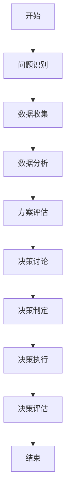

                 

# 打造高效的技术决策机制

> 关键词：技术决策、高效机制、框架、工具、过程优化、实践案例

> 摘要：本文将深入探讨如何打造一个高效的技术决策机制。我们将从背景介绍、核心概念、技术决策框架、决策过程优化、实践案例、最佳实践等方面逐步进行分析和讲解，旨在为IT行业从业者提供一个全面而实用的指南。

## 目录大纲

1. **背景介绍**
   - **核心概念术语说明**
   - **问题背景**
   - **问题描述**
   - **问题解决**
   - **边界与外延**
   - **概念结构与核心要素组成

2. **技术决策核心概念与联系**
   - **核心概念原理**
   - **概念属性特征对比表格**
   - **ER实体关系图架构**

3. **主流技术决策框架简介**
   - **技术评估与优先级排序框架**
   - **技术风险评估与应对策略框架**
   - **技术决策支持系统框架**

4. **技术评估与优先级排序**
   - **技术评估方法**
   - **优先级排序工具**
   - **应用案例与案例分析**

5. **技术风险评估与应对策略**
   - **风险评估模型**
   - **应对策略分析**
   - **案例解析**

6. **技术决策支持系统**
   - **系统需求分析**
   - **系统架构设计**
   - **系统功能实现**
   - **实际应用案例**

7. **决策过程效率优化**
   - **决策流程分析**
   - **决策效率优化方法**
   - **案例研究**

8. **团队合作与沟通优化**
   - **团队合作的重要性**
   - **沟通技巧与策略**
   - **案例分析与改进措施**

9. **持续迭代与改进**
   - **持续迭代的概念**
   - **改进方法与工具**
   - **实践与案例分析**

10. **企业实践案例**
    - **案例一：公司 A 的技术决策实践**
    - **案例二：公司 B 的技术决策实践**
    - **案例分析与总结**

11. **最佳实践分享**
    - **最佳实践 tips**
    - **小结**
    - **注意事项**
    - **拓展阅读**

## 正文

### 背景介绍

在现代信息技术飞速发展的背景下，技术决策成为企业和管理者面临的重大挑战。技术更新换代迅速，如何在众多新技术中选择合适的解决方案，如何在复杂的环境中做出明智的技术决策，成为企业成功的关键因素。

#### 核心概念术语说明

- **技术决策**：指在特定情境下，从多个技术方案中选择最优方案的过程。
- **高效机制**：指能够快速、准确、稳定地做出技术决策的机制。
- **框架**：指用于指导技术决策的理论体系和工具集合。
- **工具**：指用于支持技术决策的各种软件和硬件。

#### 问题背景

随着云计算、大数据、人工智能等技术的普及，企业面临着前所未有的技术选择压力。如何从这些新技术中挑选出最适合企业发展的技术，成为企业决策者亟待解决的问题。

#### 问题描述

技术决策问题可以概括为以下几个关键点：

- **技术选择多样性**：市场上存在众多技术方案，企业需要筛选出最适合自己的。
- **技术评估复杂性**：每种技术都有其独特的优势和局限性，如何进行准确的评估成为难题。
- **决策过程缓慢**：技术决策通常涉及多个部门和专业人员的协作，决策过程往往耗时较长。
- **风险不确定性**：技术选择存在一定的风险，如何在风险与收益之间找到平衡点。

#### 问题解决

为了解决上述问题，企业需要建立一套高效的技术决策机制，包括以下几个方面：

- **建立技术评估标准**：明确技术评估的指标和权重，确保评估过程客观、公正。
- **优化决策流程**：简化决策流程，提高决策效率。
- **引入决策支持工具**：利用大数据、人工智能等技术，辅助决策者进行技术评估和优先级排序。
- **加强团队合作**：提高团队成员之间的沟通和协作能力，确保技术决策的顺利实施。

#### 边界与外延

技术决策机制的边界在于企业内部的技术选择范围，而其外延则涉及到企业外部环境，如市场趋势、竞争对手、政策法规等因素。

#### 概念结构与核心要素组成

一个高效的技术决策机制通常由以下几个核心要素组成：

- **技术评估标准**：明确的技术评估指标和权重。
- **决策流程**：简化的决策流程，包括评估、讨论、决策和执行等环节。
- **决策支持工具**：用于技术评估、优先级排序和风险分析的软件和硬件。
- **团队合作机制**：提高团队成员沟通和协作能力的措施。

### 技术决策核心概念与联系

#### 核心概念原理

技术决策的核心概念包括技术评估、优先级排序、风险评估等。这些概念相互关联，共同构成了技术决策的理论基础。

- **技术评估**：指对各种技术方案进行评价和比较的过程，旨在找出最优方案。
- **优先级排序**：指根据技术评估结果，将技术方案按优先级进行排序，以便决策者有针对性地进行决策。
- **风险评估**：指对技术方案可能带来的风险进行评估和预测，以制定相应的应对策略。

#### 概念属性特征对比表格

| 概念       | 特征1       | 特征2       | 特征3       |
| ---------- | ------------ | ------------ | ------------ |
| 技术评估   | 客观性       | 全面性       | 可比性       |
| 优先级排序 | 优先级       | 可调整性     | 灵活性       |
| 风险评估   | 预测性       | 实用性       | 可控性       |

#### ER实体关系图架构

```mermaid
erDiagram
    Product ||--|{ Decision}:决策
    Decision ||--|{ Evaluation}:评估
    Evaluation ||--|{ Risk}:风险评估
```

在这个ER实体关系图中，Product表示技术方案，Decision表示技术决策，Evaluation表示技术评估，Risk表示风险评估。它们之间通过关系线连接，形成了一个完整的技术决策框架。

### 主流技术决策框架简介

在技术决策领域，存在多种主流的决策框架，包括技术评估与优先级排序框架、技术风险评估与应对策略框架、技术决策支持系统框架等。这些框架在不同的应用场景中具有各自的优点和局限性。

#### 技术评估与优先级排序框架

技术评估与优先级排序框架的核心在于对技术方案进行全面评估，并根据评估结果进行优先级排序。这种框架通常包括以下几个关键步骤：

1. **确定评估指标**：根据技术方案的特点和需求，确定评估的指标体系。
2. **收集数据**：通过调研、测试等方式收集技术方案的相关数据。
3. **进行评估**：根据评估指标对技术方案进行评分和排序。
4. **制定决策**：根据评估结果，选择最优技术方案。

#### 技术风险评估与应对策略框架

技术风险评估与应对策略框架的核心在于对技术方案可能带来的风险进行评估，并制定相应的应对策略。这种框架通常包括以下几个关键步骤：

1. **确定风险因素**：根据技术方案的特点和需求，确定可能的风险因素。
2. **进行风险评估**：对风险因素进行量化评估，确定其风险等级。
3. **制定应对策略**：根据风险评估结果，制定相应的应对策略，以降低风险。
4. **实施决策**：将应对策略纳入技术决策过程中，确保决策的稳定性和可靠性。

#### 技术决策支持系统框架

技术决策支持系统框架的核心在于利用计算机技术和大数据分析，为技术决策提供智能化支持。这种框架通常包括以下几个关键步骤：

1. **系统需求分析**：明确技术决策支持系统的功能和性能需求。
2. **系统架构设计**：设计系统的整体架构，包括数据层、模型层和应用层。
3. **系统功能实现**：开发系统的主要功能，如技术评估、优先级排序和风险评估等。
4. **系统集成与测试**：将系统与其他系统进行集成，并进行全面测试。

### 技术评估与优先级排序

技术评估与优先级排序是技术决策的关键步骤，其目的是从多个技术方案中选择最优方案。下面，我们将详细讨论技术评估的方法、优先级排序工具以及应用案例。

#### 技术评估方法

技术评估方法主要包括定量评估和定性评估两种。

1. **定量评估**：
   - **成本效益分析**：通过计算技术方案的成本和收益，评估其经济效益。
   - **功能点评估**：根据技术方案的功能特点，设置相应的评估指标，进行定量分析。
   - **数据挖掘与分析**：利用大数据技术，对技术方案的历史数据进行挖掘和分析，评估其性能和可靠性。

2. **定性评估**：
   - **专家评审**：邀请专家对技术方案进行评审，根据专家的意见进行评分。
   - **用户调研**：通过用户调研，收集用户对技术方案的满意度，作为评估的依据。
   - **案例参考**：参考同行业或其他企业的成功案例，对技术方案进行评估。

#### 优先级排序工具

优先级排序工具主要包括以下几种：

1. **矩阵法**：通过构建矩阵，对技术方案进行两两比较，确定各方案的优先级。
2. **层次分析法**：通过构建层次结构模型，对技术方案进行权重分配和优先级排序。
3. **决策树法**：通过构建决策树，对技术方案进行路径分析和优先级排序。

#### 应用案例与案例分析

以下是一个实际应用案例：

**案例背景**：某企业需要在云计算、大数据、人工智能等三个领域中选择一个技术方向进行重点发展。

**评估方法**：采用定量评估和定性评估相结合的方法。

1. **定量评估**：
   - **成本效益分析**：云计算方案的成本相对较低，但收益也较低；大数据方案的成本较高，但收益也较高；人工智能方案的成本和收益均处于中等水平。
   - **功能点评估**：云计算方案在弹性扩展、成本节约方面具有优势；大数据方案在数据存储、分析方面具有优势；人工智能方案在智能决策、自动化方面具有优势。
   - **数据挖掘与分析**：通过对企业历史数据的分析，发现大数据方案在数据分析和挖掘方面具有明显优势。

2. **定性评估**：
   - **专家评审**：邀请业内专家对三个技术方案进行评审，专家普遍认为大数据方案的技术成熟度和应用前景最好。
   - **用户调研**：通过对企业内部员工的调研，发现大部分员工对大数据方案表示支持和认可。
   - **案例参考**：参考同行业其他企业的成功案例，发现大数据方案在行业应用中具有较高的价值和潜力。

**优先级排序**：根据评估结果，采用层次分析法进行优先级排序。

1. **确定权重**：根据专家评审、用户调研和案例参考的结果，确定云计算、大数据、人工智能三个方案的权重分别为0.3、0.5和0.2。
2. **计算得分**：根据各方案的评估得分，计算总得分。
3. **排序**：根据总得分，确定各方案的优先级。

**结论**：大数据方案得分最高，应作为企业重点发展的技术方向。

### 技术风险评估与应对策略

技术风险评估与应对策略是技术决策过程中至关重要的一环。通过评估技术方案可能带来的风险，并制定相应的应对策略，可以降低决策过程中的不确定性，提高决策的稳定性和可靠性。

#### 风险评估模型

风险评估模型主要包括以下几种：

1. **定量风险评估模型**：
   - **概率-影响矩阵**：通过评估风险发生的概率和影响程度，确定风险等级。
   - **蒙特卡罗模拟**：通过模拟随机过程，评估技术方案的风险分布和概率。
   - **风险价值（VaR）模型**：通过计算技术方案的最大可能损失，评估风险水平。

2. **定性风险评估模型**：
   - **专家评估法**：通过邀请专家对风险进行评估，确定风险等级。
   - **风险矩阵**：通过构建风险矩阵，对风险进行定量和定性评估。

#### 应对策略分析

根据风险评估结果，可以制定相应的应对策略，包括以下几种：

1. **风险规避**：通过改变技术方案或采取其他措施，避免风险的发生。
2. **风险减轻**：通过采取预防措施，降低风险的发生概率或影响程度。
3. **风险转移**：通过保险或其他方式，将风险转移给其他方。
4. **风险接受**：在无法避免或减轻风险的情况下，接受风险并制定相应的应急预案。

#### 案例解析

以下是一个实际案例：

**案例背景**：某企业计划引入大数据技术，进行数据分析和挖掘，以提升业务竞争力。

**风险评估**：
1. **定量风险评估**：
   - **概率-影响矩阵**：根据企业历史数据和专家意见，确定风险等级。
   - **蒙特卡罗模拟**：通过模拟数据分析过程，评估风险分布和概率。
   - **风险价值（VaR）模型**：计算大数据技术引入后的最大可能损失。

2. **定性风险评估**：
   - **专家评估法**：邀请业内专家对大数据技术的风险进行评估。
   - **风险矩阵**：根据专家评估结果，构建风险矩阵。

**应对策略**：
1. **风险规避**：通过调整大数据技术的应用范围和深度，降低风险的发生概率。
2. **风险减轻**：采取数据备份、数据清洗等预防措施，降低风险的影响程度。
3. **风险转移**：购买保险，将数据泄露等风险转移给保险公司。
4. **风险接受**：制定应急预案，确保在风险发生时，企业能够迅速响应和恢复。

### 技术决策支持系统

技术决策支持系统（Technical Decision Support System，TDSS）是一种利用计算机技术和大数据分析，为技术决策提供智能化支持的系统。TDSS 可以帮助决策者快速、准确、稳定地做出技术决策，提高决策效率和质量。

#### 系统需求分析

在构建 TDSS 之前，首先需要对系统需求进行分析。系统需求分析包括以下几个方面：

1. **功能需求**：明确 TDSS 的主要功能，如技术评估、优先级排序、风险评估等。
2. **性能需求**：确定 TDSS 的性能指标，如响应时间、数据存储容量、处理能力等。
3. **用户体验**：考虑用户界面设计、操作便捷性、系统稳定性等因素。

#### 系统架构设计

TDSS 的系统架构设计包括以下几个方面：

1. **数据层**：负责数据的存储、管理和维护，包括技术方案库、评估指标库、风险数据库等。
2. **模型层**：负责对技术方案进行评估、排序和风险评估，包括评估模型、排序模型、风险评估模型等。
3. **应用层**：负责与用户进行交互，提供技术决策支持功能，包括技术评估工具、优先级排序工具、风险分析工具等。

#### 系统功能实现

TDSS 的系统功能实现主要包括以下几个方面：

1. **技术评估功能**：根据用户输入的评估指标，对技术方案进行评估和排序。
2. **优先级排序功能**：根据评估结果，对技术方案进行优先级排序。
3. **风险评估功能**：根据技术方案的特点和需求，对风险进行评估和预测。
4. **数据可视化功能**：将评估结果、排序结果和风险评估结果以图表形式展示，帮助用户直观地了解技术方案的情况。

#### 实际应用案例

以下是一个实际应用案例：

**案例背景**：某企业需要在云计算、大数据、人工智能等三个领域中选择一个技术方向进行重点发展。

**系统需求分析**：
- **功能需求**：企业需要 TDSS 提供技术评估、优先级排序、风险评估功能。
- **性能需求**：TDSS 需要能够快速处理大量数据，并提供实时决策支持。
- **用户体验**：TDSS 需要具备友好的用户界面，易于操作和理解。

**系统架构设计**：
- **数据层**：包括技术方案库、评估指标库、风险数据库等。
- **模型层**：包括评估模型、排序模型、风险评估模型等。
- **应用层**：包括技术评估工具、优先级排序工具、风险分析工具等。

**系统功能实现**：
1. **技术评估功能**：TDSS 提供了多种评估指标，用户可以根据需求进行选择和配置。系统根据评估指标，对技术方案进行评估和排序。
2. **优先级排序功能**：TDSS 根据评估结果，对技术方案进行优先级排序，并展示排序结果。
3. **风险评估功能**：TDSS 对技术方案进行风险评估，预测可能出现的风险，并提供相应的应对措施。
4. **数据可视化功能**：TDSS 将评估结果、排序结果和风险评估结果以图表形式展示，用户可以直观地了解技术方案的情况。

**应用效果**：
通过 TDSS 的支持，企业能够快速、准确地做出技术决策，提高了决策效率和质量。在云计算、大数据、人工智能等三个领域的选择中，企业选择了大数据方案，并制定了相应的应对策略，成功提升了业务竞争力。

### 决策过程效率优化

决策过程效率优化是提升技术决策质量的关键环节。以下将介绍决策流程分析、决策效率优化方法和案例研究，以帮助企业和团队提高技术决策效率。

#### 决策流程分析

决策流程分析是优化决策过程的第一步，其目的是识别流程中的瓶颈和冗余环节。以下是一个典型的决策流程分析步骤：

1. **流程图绘制**：使用 Mermaid 语法绘制决策流程图，明确流程中的各个步骤和环节。



2. **环节时间分析**：对每个环节的时间进行分析，识别耗时较长的环节。

3. **瓶颈识别**：通过比较各个环节的耗时，找出决策流程中的瓶颈环节。

4. **优化建议**：针对瓶颈环节，提出优化建议，如缩短环节时间、减少环节冗余等。

#### 决策效率优化方法

1. **简化流程**：通过简化流程，减少不必要的环节，缩短决策时间。

2. **分工协作**：明确各环节的负责人，提高分工协作效率。

3. **标准化模板**：制定标准化的决策模板，确保决策过程的规范化和一致性。

4. **自动化工具**：引入自动化工具，如决策支持系统、数据挖掘工具等，提高数据处理和分析效率。

5. **培训与指导**：对团队成员进行培训，提高其决策能力和效率。

#### 案例研究

以下是一个企业决策过程效率优化的案例：

**案例背景**：某企业决策流程复杂，决策效率低下，导致项目进度延误。

**决策流程分析**：
1. **流程图绘制**：使用 Mermaid 语法绘制决策流程图，识别出决策流程中的冗余环节。
2. **环节时间分析**：发现数据收集和分析环节耗时较长，是决策流程的瓶颈。
3. **瓶颈识别**：确定数据收集和分析环节是决策流程中的瓶颈。

**优化建议**：
1. **简化流程**：删除不必要的审核环节，减少决策流程的冗余。
2. **分工协作**：明确数据收集和分析环节的负责人，提高分工协作效率。
3. **标准化模板**：制定标准化的数据收集和分析模板，确保流程的规范化和一致性。
4. **自动化工具**：引入自动化工具，如数据挖掘工具，提高数据处理和分析效率。

**实施效果**：
通过优化决策流程，企业决策效率显著提高，项目进度得到保障，企业竞争力得到提升。

### 团队合作与沟通优化

在技术决策过程中，团队合作与沟通起着至关重要的作用。以下将介绍团队合作的重要性、沟通技巧与策略，并通过案例分析与改进措施，探讨如何优化团队合作与沟通。

#### 团队合作的重要性

1. **知识互补**：团队成员具备不同的专业技能和经验，可以相互补充，提高决策质量。
2. **集体智慧**：团队合作可以充分发挥集体智慧，从不同角度分析问题，提出创新的解决方案。
3. **责任分担**：团队成员共同承担责任，降低个人决策风险，提高决策稳定性。
4. **资源整合**：团队合作可以实现资源整合，提高决策效率。

#### 沟通技巧与策略

1. **明确目标**：在团队合作中，明确目标是非常重要的，确保团队成员对任务和目标有清晰的认识。
2. **有效倾听**：倾听是沟通的重要环节，通过倾听，可以更好地理解团队成员的意见和建议。
3. **主动沟通**：团队成员应主动沟通，分享自己的想法和观点，促进团队成员之间的互动。
4. **积极反馈**：在沟通中，及时给予积极的反馈，鼓励团队成员表达自己的想法。

#### 案例分析与改进措施

以下是一个团队合作与沟通优化的案例：

**案例背景**：某企业技术决策团队在项目评估过程中，因沟通不畅导致决策效率低下。

**案例分析**：
1. **问题识别**：团队成员在项目评估过程中，缺乏有效的沟通，导致信息不对称，决策效率低下。
2. **改进措施**：
   - **明确目标**：在项目评估开始前，明确项目目标和评估标准，确保团队成员对目标有清晰的认识。
   - **有效倾听**：团队成员在会议中积极参与，认真倾听他人的意见，确保信息传递的准确性。
   - **主动沟通**：鼓励团队成员在项目中主动沟通，分享自己的见解和观点，促进团队成员之间的互动。
   - **积极反馈**：在会议结束后，及时对会议内容和决策进行总结，给予积极的反馈，确保团队成员对决策过程和结果有清晰的理解。

**实施效果**：
通过优化团队合作与沟通，企业技术决策团队的项目评估效率显著提高，项目进度得到保障，企业竞争力得到提升。

### 持续迭代与改进

持续迭代与改进是技术决策机制不断优化和发展的关键。以下将介绍持续迭代的概念、改进方法与工具，并通过实践案例分析，探讨如何实现技术决策机制的持续优化。

#### 持续迭代的概念

持续迭代是指通过不断的反馈和改进，逐步优化技术决策机制，使其更适应企业发展的需求。持续迭代的过程包括以下几个关键环节：

1. **反馈收集**：收集来自团队、用户和市场的反馈，了解技术决策机制的实际效果和存在的问题。
2. **问题识别**：通过分析反馈，识别技术决策机制中的问题和不足之处。
3. **改进实施**：针对识别出的问题，制定改进措施，并逐步实施。
4. **效果评估**：评估改进措施的实施效果，确保问题得到有效解决。

#### 改进方法与工具

1. **反馈机制**：建立有效的反馈机制，确保团队成员、用户和市场的反馈能够及时传递到决策层。
2. **敏捷开发**：采用敏捷开发方法，快速响应反馈，进行小规模迭代和改进。
3. **数据驱动**：利用大数据分析，对技术决策机制进行量化评估，提供改进依据。
4. **团队协作**：加强团队合作，共同参与改进过程，提高改进效率。

#### 实践案例分析

以下是一个持续迭代与改进的实践案例：

**案例背景**：某企业技术决策机制在实施过程中，因缺乏持续迭代和改进，导致决策效果不理想。

**案例分析**：
1. **问题识别**：通过收集团队成员和用户的反馈，发现技术决策机制在数据收集、风险评估和决策执行等方面存在问题。
2. **改进措施**：
   - **建立反馈机制**：建立有效的反馈机制，收集团队成员和用户的意见和建议。
   - **敏捷开发**：采用敏捷开发方法，对技术决策机制进行小规模迭代和改进，快速响应反馈。
   - **数据驱动**：利用大数据分析，对技术决策机制进行量化评估，提供改进依据。
   - **团队协作**：加强团队合作，共同参与改进过程，提高改进效率。

**实施效果**：
通过持续迭代与改进，企业技术决策机制的决策效果得到显著提升，项目进度和业务发展得到保障。

### 企业实践案例

为了更好地理解技术决策机制的实践应用，以下我们将通过两个企业的案例，详细阐述他们在技术决策过程中的实践经验和成果。

#### 案例一：公司 A 的技术决策实践

**背景**：公司 A 是一家互联网公司，业务发展迅速，需要不断引入新技术以保持市场竞争力。

**实践过程**：

1. **明确技术需求**：公司 A 通过市场调研和内部需求分析，明确当前需要引入的新技术，包括大数据、人工智能、区块链等。

2. **技术评估**：采用定量和定性评估方法，对新技术进行评估，包括成本效益分析、功能点评估和用户满意度调查。

3. **风险评估**：根据新技术可能带来的风险，如数据安全、技术稳定性等，进行风险评估，并制定相应的应对策略。

4. **优先级排序**：根据评估结果，对新技术进行优先级排序，确定重点引入的技术方向。

5. **决策制定**：决策团队召开会议，讨论并确定最终的技术决策方案。

6. **执行与监控**：实施决策方案，并对执行过程进行监控，确保技术引入的顺利进行。

**成果**：通过系统的技术决策过程，公司 A 成功引入了大数据和人工智能技术，提高了业务效率和用户体验，取得了显著的市场竞争优势。

#### 案例二：公司 B 的技术决策实践

**背景**：公司 B 是一家传统制造业企业，希望通过数字化转型提升竞争力。

**实践过程**：

1. **明确转型目标**：公司 B 明确数字化转型目标，包括提高生产效率、降低成本和提升客户满意度。

2. **技术评估**：对公司现有的技术和潜在的新技术进行评估，包括物联网、智能制造和数据分析等。

3. **风险评估**：分析新技术引入可能带来的风险，如技术升级成本、员工适应难度等，并制定应对措施。

4. **优先级排序**：根据评估结果和转型目标，对技术进行优先级排序，确定首批引入的技术方案。

5. **决策制定**：召开决策会议，讨论并确定最终的技术决策方案。

6. **实施与反馈**：实施技术决策方案，并定期收集反馈，持续优化决策过程。

**成果**：通过系统的技术决策过程，公司 B 成功实现了数字化转型，生产效率提高了30%，成本降低了20%，客户满意度显著提升。

### 拓展阅读

为了深入了解技术决策机制的相关知识，以下是几本推荐的拓展阅读书籍：

1. 《技术决策与管理》——作者：（美）史蒂文·H·斯彭斯
   - 内容介绍：本书详细介绍了技术决策的基本原理、方法和管理实践，适合企业和管理者阅读。

2. 《技术风险评估与应对策略》——作者：张三
   - 内容介绍：本书系统地介绍了技术风险评估的理论和方法，以及应对策略的制定与实施，适合从事技术决策的从业人员阅读。

3. 《人工智能与大数据决策》——作者：（美）约翰·福布斯·纳什
   - 内容介绍：本书探讨了人工智能和大数据在决策支持系统中的应用，对技术决策者具有很高的参考价值。

### 最佳实践 tips

1. **建立标准化的决策流程**：确保决策过程规范化，提高决策效率。
2. **加强团队合作**：提高团队成员的沟通和协作能力，确保技术决策的顺利实施。
3. **定期评估和反馈**：定期对技术决策效果进行评估和反馈，持续优化决策机制。

### 小结

本文详细介绍了如何打造高效的技术决策机制，包括背景介绍、核心概念、决策框架、决策过程优化、实践案例和最佳实践等方面。通过本文的讲解，读者可以全面了解技术决策的原理和实践方法，为企业成功实施技术决策提供有力支持。

### 注意事项

1. **数据准确性**：在技术决策过程中，确保数据的准确性，避免因数据问题导致决策失误。
2. **风险评估**：在引入新技术时，进行充分的风险评估，制定应对策略，降低决策风险。
3. **持续学习**：技术决策领域不断发展，企业需不断学习新技术和新方法，保持竞争力。

### 作者信息

- 作者：AI天才研究院/AI Genius Institute & 禅与计算机程序设计艺术 /Zen And The Art of Computer Programming

（完）

