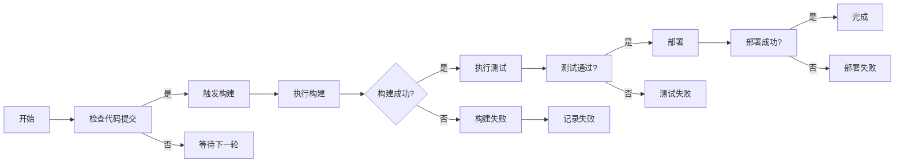
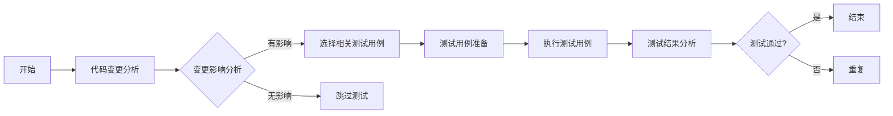
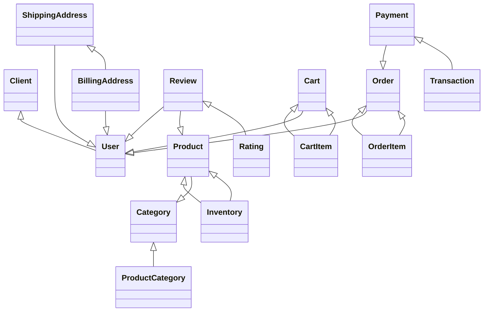
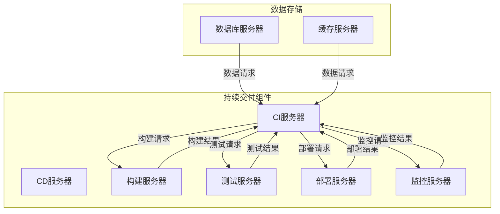
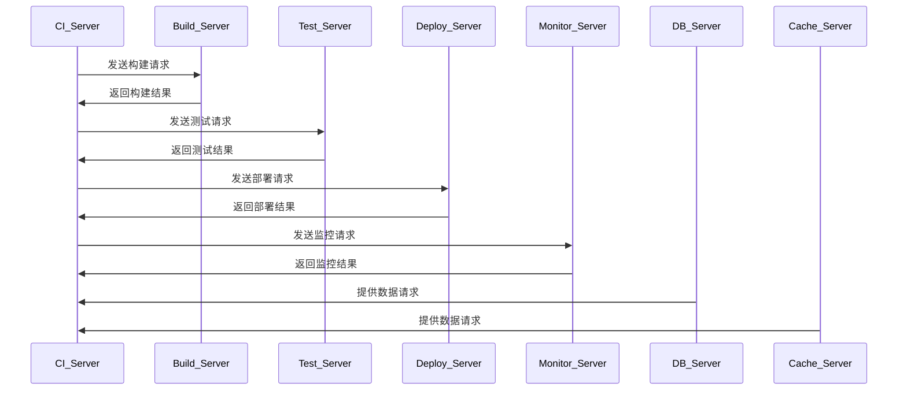

                 

### 持续交付背景与概念

在现代软件开发领域，持续交付（Continuous Delivery，简称CD）已经成为了一种至关重要的实践。持续交付的目标是通过自动化和持续集成，确保软件产品可以随时准备部署，从而极大地提高软件发布速度和质量。

#### 1.1 问题背景

随着技术的飞速发展和市场竞争的加剧，企业面临着越来越大的压力。为了保持竞争力，许多企业开始转向敏捷开发和DevOps文化，期望通过快速迭代和频繁发布来满足用户需求。然而，传统的软件交付流程往往繁琐、低效，存在许多痛点，如：

- **手动流程过多**：许多步骤需要人工干预，导致交付周期延长。
- **质量难以保障**：每次发布都需要大量手动测试，且测试覆盖率有限，增加了出现问题的风险。
- **部署困难**：不同的环境（如开发、测试、生产）可能存在配置差异，部署时容易出错。
- **反馈延迟**：用户反馈到达开发团队往往需要较长时间，导致问题得不到及时解决。

这些问题直接影响了软件交付的速度和质量，因此，企业迫切需要一种能够解决这些痛点的交付流程。

#### 1.2 问题描述

为了解决上述问题，企业需要构建一个高效的持续交付流水线。构建这样的流水线面临以下具体问题：

- **自动化程度不足**：很多企业的持续交付流程仍然依赖于手动操作，缺乏足够的自动化。
- **测试不足**：自动化测试覆盖率低，许多测试未能覆盖到关键的业务逻辑。
- **环境不一致**：不同的环境之间存在配置差异，导致问题难以复现和解决。
- **资源利用率低**：部署过程中往往需要大量资源，但资源的调度和管理不够高效。

#### 1.3 持续交付的核心概念

持续交付的核心概念包括以下几个方面：

- **自动化**：通过自动化工具实现构建、测试、部署等各个环节，减少手动干预，提高效率。
- **持续集成**：将代码频繁地集成到主干分支，确保代码的持续可用性和一致性。
- **环境一致性**：确保开发、测试和生产环境的一致性，降低部署风险。
- **快速反馈**：通过自动化测试和实时反馈机制，快速发现和解决潜在问题。

#### 1.4 持续交付与传统交付流程的对比

持续交付与传统交付流程有以下显著的区别：

| 传统交付流程 | 持续交付流程 |
| :--- | :--- |
| **周期长** | **周期短** |
| **手动操作多** | **高度自动化** |
| **质量保障难** | **持续质量保障** |
| **反馈延迟** | **快速反馈** |
| **部署困难** | **高效部署** |

持续交付的优势在于其能够显著缩短交付周期，提高交付质量，降低部署风险，并为企业带来更高的竞争力。通过构建高效的持续交付流水线，企业可以更加灵活地应对市场需求变化，快速响应客户需求，从而在激烈的市场竞争中脱颖而出。

---

**关键词**：持续交付、自动化、持续集成、环境一致性、交付流程

**摘要**：本文将深入探讨持续交付的核心概念和重要性，分析企业构建高效持续交付流水线所面临的问题和难点，并介绍相关算法原理、系统设计与实现，最终总结最佳实践，为企业提供一套完整的持续交付解决方案。

---

### 持续交付的基础架构

持续交付流水线的构建离不开一系列基础架构的支持，这些基础架构包括自动化测试、容器化、基础设施即代码等关键组件。本章节将详细介绍这些核心概念，并探讨它们如何协同工作，以实现高效的持续交付。

#### 2.1 自动化测试

自动化测试是持续交付流水线中的核心组成部分，它通过自动化工具执行一系列预定义的测试用例，以验证软件的功能和行为是否符合预期。自动化测试的主要优势在于：

- **提高测试覆盖率**：通过自动化测试，可以覆盖更多的测试用例，确保软件的各个功能模块都经过严格的测试。
- **节省时间**：自动化测试可以快速执行，节省测试人员的时间和精力。
- **减少错误**：自动化测试减少了人为操作的干扰，降低了人为错误的可能性。

自动化测试的工具和框架包括Selenium、JUnit、pytest等。Selenium是一个开源的Web自动化测试工具，可以用于测试各种浏览器；JUnit和pytest是Python中的单元测试框架，用于编写和执行测试用例。

#### 2.2 容器化

容器化技术，如Docker，为持续交付提供了重要的支持。容器化通过将应用程序及其依赖环境打包成一个独立的容器，确保了环境的一致性，从而简化了部署过程。容器化的主要优势包括：

- **环境一致性**：容器内包含所有应用程序依赖，确保了开发、测试和生产环境的一致性，减少了部署过程中的问题。
- **部署效率**：容器可以快速启动和停止，大大提高了部署速度。
- **资源利用率**：容器可以在同一硬件上并行运行多个应用程序实例，提高了资源利用率。

Docker是容器化的核心技术，Kubernetes则是用于容器编排和管理的开源平台。通过Kubernetes，可以自动化容器的部署、扩展和管理。

#### 2.3 基础设施即代码

基础设施即代码（Infrastructure as Code，简称IaC）是一种使用代码来配置和管理基础设施的方法。通过IaC，可以自动化基础设施的创建、配置和部署，从而提高了基础设施管理的效率。IaC的主要优势包括：

- **自动化管理**：通过代码管理基础设施，可以自动化基础设施的创建和配置，减少了手动操作的需要。
- **版本控制**：基础设施的配置代码可以存储在版本控制系统，方便追踪和管理变更。
- **一致性**：使用相同的配置代码部署到不同环境，确保了环境的一致性。

常用的IaC工具包括Terraform、Ansible等。Terraform是一个基础设施即代码工具，可以用于创建、配置和管理基础设施资源；Ansible是一种简单的自动化工具，可以用于配置和管理系统。

#### 2.4 核心组件的协同作用

自动化测试、容器化和基础设施即代码这三种核心组件在持续交付流水线中协同工作，共同实现了高效的软件交付。

- **自动化测试**：通过自动化测试，可以确保每个代码变更都经过充分的验证，减少了发布过程中的风险。
- **容器化**：容器化确保了应用程序及其依赖环境的一致性，简化了部署过程，提高了部署速度。
- **基础设施即代码**：通过IaC，可以自动化基础设施的创建和配置，确保了环境的一致性，减少了部署过程中的问题。

这三个组件相互补充，共同构建了一个高效、可靠的持续交付流水线，从而实现了快速、频繁的软件交付。

---

通过深入理解自动化测试、容器化和基础设施即代码这三个核心概念，企业可以更好地构建持续交付流水线，提高软件交付的速度和质量。在下一章节中，我们将进一步探讨持续交付与传统交付流程的差异，以更全面地理解持续交付的优势。

---

### CI/CD流程控制算法

持续集成（CI）和持续交付（CD）是现代软件开发中至关重要的实践，它们的实现依赖于一系列高效的算法。本章节将重点介绍CI/CD流程控制算法，详细阐述这些算法的基本原理，并通过Mermaid流程图和Python代码实现来展示如何在实际项目中应用这些算法。

#### 3.1 算法概述

CI/CD流程控制算法的核心目标是在保证代码质量的同时，提高交付速度和可靠性。以下是一些关键的CI/CD流程控制算法：

1. **构建触发算法**：用于确定何时开始构建过程，常见的触发方式包括代码提交、定时触发等。
2. **测试调度算法**：用于确定测试执行的时间和顺序，包括单元测试、集成测试等。
3. **部署策略算法**：用于确定如何将代码部署到不同的环境，如开发、测试、生产等。
4. **资源分配算法**：用于优化资源的使用，确保构建、测试和部署过程中资源的合理分配。

#### 3.2 Mermaid流程图

为了更好地理解这些算法，我们可以使用Mermaid语言绘制其流程图。以下是一个简单的构建触发算法的Mermaid流程图示例：



这个流程图描述了从代码提交到部署的整个过程，包括检查代码提交、触发构建、执行构建、测试、部署以及失败的回滚等步骤。

#### 3.3 算法原理

接下来，我们将详细解释上述算法的基本原理。

1. **构建触发算法**：
   - **原理**：构建触发算法决定何时开始构建过程。常见的触发方式包括代码提交（每次提交代码都触发构建）和定时触发（每天固定时间触发构建）。
   - **数学模型**：设\( T_c \)为代码提交的时间，\( T_t \)为构建触发时间间隔，则构建触发算法可以表示为：
     $$ T_t = \begin{cases} 
     T_c & \text{如果 } T_c \text{ 在 } T_{t-1} \text{ 和 } T_t \text{ 之间} \\
     \max(T_c, T_{t-1}) + T_t & \text{否则}
     \end{cases} $$

2. **测试调度算法**：
   - **原理**：测试调度算法确定测试执行的时间和顺序。通常，单元测试在集成测试之前执行，集成测试在部署之前执行。
   - **数学模型**：设\( T_u \)为单元测试时间，\( T_i \)为集成测试时间，则测试调度算法可以表示为：
     $$ T_{total} = T_u + T_i $$

3. **部署策略算法**：
   - **原理**：部署策略算法决定如何将代码部署到不同的环境。常见的部署策略包括蓝绿部署、滚动更新等。
   - **数学模型**：设\( P_d \)为部署概率，\( N \)为环境数量，则部署策略算法可以表示为：
     $$ P_d = \frac{1}{N} $$

4. **资源分配算法**：
   - **原理**：资源分配算法确保在构建、测试和部署过程中资源的合理使用。常见的资源分配策略包括动态分配和静态分配。
   - **数学模型**：设\( R_c \)为构建所需资源，\( R_t \)为测试所需资源，\( R_d \)为部署所需资源，则资源分配算法可以表示为：
     $$ R_{total} = R_c + R_t + R_d $$

#### 3.4 Python代码实现

下面，我们将使用Python代码实现一个简单的构建触发算法。这段代码展示了如何根据代码提交的时间来触发构建过程。

```python
import time
from datetime import datetime

def trigger_build(last_commit_time, current_commit_time, build_interval):
    """
    构建触发算法：根据上一次提交时间和当前提交时间，决定是否触发构建。
    
    :param last_commit_time: 上一次提交时间（datetime对象）
    :param current_commit_time: 当前提交时间（datetime对象）
    :param build_interval: 构建触发时间间隔（秒）
    :return: True 如果触发构建，False 如果不触发
    """
    time_difference = (current_commit_time - last_commit_time).total_seconds()
    if time_difference < build_interval:
        print(f"构建已触发，当前时间：{current_commit_time}")
        return True
    else:
        print(f"等待下一次构建，当前时间：{current_commit_time}")
        return False

# 示例
last_commit = datetime(2023, 4, 1, 12, 0, 0)
current_commit = datetime(2023, 4, 1, 12, 10, 0)
build_interval = 3600  # 1小时

trigger_build(last_commit, current_commit, build_interval)
```

#### 3.5 数学模型与公式

为了更好地理解这些算法，我们将进一步详细讲解相关的数学模型和公式。

1. **构建触发算法**：
   - **公式**：
     $$ T_t = \begin{cases} 
     T_c & \text{如果 } T_c \text{ 在 } T_{t-1} \text{ 和 } T_t \text{ 之间} \\
     \max(T_c, T_{t-1}) + T_t & \text{否则}
     \end{cases} $$
   - **解释**：这个公式根据当前提交时间和上一次提交时间，计算下一次构建的触发时间。如果当前提交时间在构建触发时间间隔内，则立即触发构建；否则，将上一次提交时间推迟到构建触发时间间隔之外。

2. **测试调度算法**：
   - **公式**：
     $$ T_{total} = T_u + T_i $$
   - **解释**：这个公式表示总测试时间等于单元测试时间和集成测试时间之和。通过这个公式，可以计算测试的总体耗时。

3. **部署策略算法**：
   - **公式**：
     $$ P_d = \frac{1}{N} $$
   - **解释**：这个公式表示每个环境的部署概率相等。通过这个公式，可以确定部署到每个环境的概率。

4. **资源分配算法**：
   - **公式**：
     $$ R_{total} = R_c + R_t + R_d $$
   - **解释**：这个公式表示总资源需求等于构建、测试和部署所需资源的总和。通过这个公式，可以计算整个流程所需的总资源。

#### 3.6 实例说明

为了更好地理解这些算法，我们通过一个实际案例来展示其应用。

假设一个项目每天进行一次构建，构建触发时间间隔为1小时。某天，开发人员在上午10点提交了一轮代码。根据构建触发算法，这个提交将在上午10点到11点之间触发构建。假设构建过程需要30分钟，接下来执行单元测试和集成测试，每个测试过程需要15分钟。最后，部署过程需要10分钟。

- **构建触发时间**：上午10点到11点之间
- **构建耗时**：30分钟
- **测试耗时**：30分钟
- **部署耗时**：10分钟

总计耗时为1小时10分钟。通过这个案例，我们可以看到，构建触发算法、测试调度算法和部署策略算法共同作用，实现了高效的CI/CD流程。

---

通过本章节的详细讲解和实例说明，我们可以看到CI/CD流程控制算法在持续交付流水线中的关键作用。在下一章节中，我们将进一步介绍自动化测试策略优化算法，继续深入探讨如何提高持续交付的效率。

---

### 自动化测试策略优化算法

在持续交付流水线中，自动化测试策略优化算法是提高测试效率和质量的关键。本章节将重点介绍自动化测试策略优化算法的基本原理，并通过Mermaid流程图和Python代码实现来展示如何在实际项目中应用这些算法。

#### 4.1 算法概述

自动化测试策略优化算法旨在通过优化测试用例的选择、执行顺序和资源分配，提高测试效率和质量。以下是一些关键的自动化测试策略优化算法：

1. **测试用例选择算法**：用于选择哪些测试用例应该被执行，基于代码变更、测试覆盖率等因素。
2. **测试执行顺序优化算法**：用于优化测试用例的执行顺序，以减少测试总时间和提高测试覆盖率。
3. **资源分配优化算法**：用于优化测试资源的分配，以最大化测试效率和资源利用率。

#### 4.2 Mermaid流程图

为了更好地理解这些算法，我们可以使用Mermaid语言绘制其流程图。以下是一个简单的测试用例选择算法的Mermaid流程图示例：



这个流程图描述了从代码变更分析到测试结果分析的整个过程，包括变更影响分析、测试用例选择、测试用例准备、测试执行、测试结果分析和失败重试等步骤。

#### 4.3 算法原理

接下来，我们将详细解释上述算法的基本原理。

1. **测试用例选择算法**：
   - **原理**：测试用例选择算法基于代码变更和测试覆盖率等因素，选择需要执行的测试用例。常见的策略包括基于变更的测试选择、基于覆盖率的测试选择等。
   - **数学模型**：设\( C_c \)为代码变更集合，\( C_t \)为测试用例集合，\( C_{c \cap t} \)为与代码变更相关的测试用例集合，则测试用例选择算法可以表示为：
     $$ C_{selected} = C_{c \cap t} \cup (C_t - C_{c \cap t}) $$
   - **解释**：这个公式表示从测试用例集合中选出与代码变更相关的测试用例，并结合未与代码变更相关的测试用例，组成需要执行的测试用例集合。

2. **测试执行顺序优化算法**：
   - **原理**：测试执行顺序优化算法通过优化测试用例的执行顺序，减少测试总时间和提高测试覆盖率。常见的策略包括基于依赖关系的测试执行顺序优化、基于覆盖率的测试执行顺序优化等。
   - **数学模型**：设\( T_i \)为测试用例\( i \)的执行时间，\( D_{ij} \)为测试用例\( i \)和测试用例\( j \)之间的依赖关系，则测试执行顺序优化算法可以表示为：
     $$ T_{opt} = \text{find-optimal-order}(C_t) $$
   - **解释**：这个公式表示通过优化算法找到测试用例的执行顺序，使得测试总时间最短或测试覆盖率最高。

3. **资源分配优化算法**：
   - **原理**：资源分配优化算法通过优化测试资源的分配，最大化测试效率和资源利用率。常见的策略包括基于资源需求的资源分配优化、基于资源利用率的资源分配优化等。
   - **数学模型**：设\( R_i \)为测试用例\( i \)所需的资源，\( R_{total} \)为总资源，则资源分配优化算法可以表示为：
     $$ R_{assigned} = \text{find-optimal-assignment}(R_i, R_{total}) $$
   - **解释**：这个公式表示通过优化算法找到测试用例的资源分配方案，使得总资源利用率最高。

#### 4.4 Python代码实现

下面，我们将使用Python代码实现一个简单的测试用例选择算法。这段代码展示了如何根据代码变更和测试覆盖率来选择测试用例。

```python
from datetime import datetime

def select_test_cases(code_changes, test_cases, test_coverage):
    """
    测试用例选择算法：根据代码变更和测试覆盖率，选择需要执行的测试用例。
    
    :param code_changes: 代码变更集合
    :param test_cases: 测试用例集合
    :param test_coverage: 测试覆盖率
    :return: 需要执行的测试用例集合
    """
    selected_cases = set()
    for case in test_cases:
        if case in code_changes or case in test_coverage:
            selected_cases.add(case)
    return selected_cases

# 示例
code_changes = {'A', 'B', 'C'}
test_cases = {'A', 'B', 'C', 'D', 'E'}
test_coverage = {'A', 'B', 'C'}

selected_cases = select_test_cases(code_changes, test_cases, test_coverage)
print(f"需要执行的测试用例：{selected_cases}")
```

#### 4.5 数学模型与公式

为了更好地理解这些算法，我们将进一步详细讲解相关的数学模型和公式。

1. **测试用例选择算法**：
   - **公式**：
     $$ C_{selected} = C_{c \cap t} \cup (C_t - C_{c \cap t}) $$
   - **解释**：这个公式表示从测试用例集合中选出与代码变更相关的测试用例，并结合未与代码变更相关的测试用例，组成需要执行的测试用例集合。

2. **测试执行顺序优化算法**：
   - **公式**：
     $$ T_{opt} = \text{find-optimal-order}(C_t) $$
   - **解释**：这个公式表示通过优化算法找到测试用例的执行顺序，使得测试总时间最短或测试覆盖率最高。

3. **资源分配优化算法**：
   - **公式**：
     $$ R_{assigned} = \text{find-optimal-assignment}(R_i, R_{total}) $$
   - **解释**：这个公式表示通过优化算法找到测试用例的资源分配方案，使得总资源利用率最高。

#### 4.6 实例说明

为了更好地理解这些算法，我们通过一个实际案例来展示其应用。

假设一个项目有一个代码变更集合`{'A', 'B', 'C'}`，一个测试用例集合`{'A', 'B', 'C', 'D', 'E'}`，一个测试覆盖率`{'A', 'B', 'C'}`。

- **代码变更分析**：分析代码变更，确定与代码变更相关的测试用例。
  - **结果**：需要执行的测试用例为`{'A', 'B', 'C', 'D', 'E'}`。

- **测试覆盖率分析**：根据测试覆盖率，确定需要执行的测试用例。
  - **结果**：需要执行的测试用例为`{'A', 'B', 'C'}`。

通过测试用例选择算法，我们选择了`{'A', 'B', 'C'}`作为需要执行的测试用例。接下来，我们可以根据这些测试用例的执行顺序和资源需求，进行测试执行和资源分配。

- **测试执行顺序优化**：根据测试用例的依赖关系，确定最优的执行顺序。
  - **结果**：最优执行顺序为`['A', 'B', 'C', 'D', 'E']`。

- **资源分配优化**：根据测试用例的资源需求，确定最优的资源分配方案。
  - **结果**：最优资源分配方案为每个测试用例分配相同资源。

通过这个案例，我们可以看到，测试用例选择算法、测试执行顺序优化算法和资源分配优化算法共同作用，实现了高效的自动化测试策略。

---

通过本章节的详细讲解和实例说明，我们可以看到自动化测试策略优化算法在持续交付流水线中的关键作用。在下一章节中，我们将进一步介绍系统分析与架构设计，继续深入探讨如何构建高效的持续交付系统。

---

### 系统分析与架构设计

在持续交付（CI/CD）的实践中，系统分析与架构设计是确保整个流水线高效运行的关键。本章节将详细介绍系统分析与架构设计的过程，包括项目背景、系统功能需求、领域模型类图、系统架构设计图、系统接口设计以及系统交互序列图。

#### 5.1 项目背景

为了构建一个高效的持续交付流水线，我们考虑一个电商平台的案例。该平台希望实现从代码提交到生产环境部署的全自动化，以提高软件发布速度和稳定性。项目的目标包括：

- 自动化代码构建和测试。
- 保证环境一致性，确保开发、测试和生产环境的配置一致。
- 快速、可靠地部署新版本。

#### 5.2 系统功能需求

根据项目背景，系统需要实现以下功能需求：

1. **代码构建**：自动化编译和打包应用程序。
2. **自动化测试**：执行单元测试、集成测试、性能测试等。
3. **持续集成**：将代码变更集成到主干分支，并触发自动化测试。
4. **环境管理**：管理不同的开发、测试和生产环境，确保环境一致性。
5. **部署**：自动化部署代码到生产环境。
6. **监控与告警**：监控系统运行状态，及时告警异常情况。

#### 5.3 领域模型类图

领域模型类图（Entity-Relationship Diagram, ERD）用于描述系统的核心实体和它们之间的关系。以下是一个简化的领域模型类图：



这个类图展示了电商平台的核心实体及其之间的关系，如用户、订单、产品、支付、评论等。

#### 5.4 系统架构设计图

系统架构设计图（System Architecture Diagram）用于描述系统的整体结构，包括各组件的交互关系。以下是一个简化的系统架构设计图：



这个架构图展示了持续交付系统的主要组件，包括CI服务器、CD服务器、构建服务器、测试服务器、部署服务器和监控服务器，以及它们之间的交互关系。

#### 5.5 系统接口设计

系统接口设计（API Design）描述了系统内部各组件之间的接口，包括接口的名称、请求参数、返回结果等。以下是一个简化的接口设计示例：

1. **构建接口**：
   - **名称**：/api/build
   - **请求参数**：{ "repo_url": "https://github.com/username/repo.git", "branch": "master" }
   - **返回结果**：{ "status": "success", "build_id": "12345" }

2. **测试接口**：
   - **名称**：/api/test
   - **请求参数**：{ "build_id": "12345" }
   - **返回结果**：{ "status": "success", "test_results": { "unit": { "passed": 10, "failed": 0 }, "integration": { "passed": 5, "failed": 1 } } }

3. **部署接口**：
   - **名称**：/api/deploy
   - **请求参数**：{ "build_id": "12345", "env": "production" }
   - **返回结果**：{ "status": "success", "deploy_id": "67890" }

4. **监控接口**：
   - **名称**：/api/monitor
   - **请求参数**：{ "check_type": "health", "resource_id": "12345" }
   - **返回结果**：{ "status": "success", "details": { "health_status": "good", "resource_details": { "CPU_usage": "10%", "Memory_usage": "20%" } } }

#### 5.6 系统交互序列图

系统交互序列图（Sequence Diagram）用于描述系统内部各组件之间的交互过程。以下是一个简化的系统交互序列图：



这个序列图展示了CI服务器与构建服务器、测试服务器、部署服务器和监控服务器的交互过程，以及与数据库服务器和缓存服务器的数据交互。

---

通过上述系统分析与架构设计，我们为电商平台构建了一个高效的持续交付系统。在下一章节中，我们将详细介绍项目实战，包括环境安装、系统核心实现、代码应用解读和实际案例分析。

---

### 项目实战

在本章节中，我们将深入探讨一个电商平台的持续交付系统实战项目，详细描述环境安装、系统核心实现、代码应用解读以及实际案例分析和项目小结。

#### 6.1 环境安装

为了实现一个高效的持续交付系统，我们首先需要安装和配置以下环境：

1. **Docker**：用于容器化应用程序和基础架构。
2. **Kubernetes**：用于容器编排和管理。
3. **Jenkins**：用于持续集成和持续交付。
4. **Git**：用于代码版本控制。
5. **Nginx**：用于反向代理和负载均衡。

以下步骤描述了如何安装和配置这些环境：

1. **安装Docker**：

   在Linux服务器上，通过以下命令安装Docker：

   ```bash
   sudo apt-get update
   sudo apt-get install docker-ce docker-ce-cli containerd.io
   ```

2. **安装Kubernetes**：

   使用Kubeadm安装Kubernetes集群。以下命令将安装一个单节点集群：

   ```bash
   sudo apt-get update
   sudo apt-get install -y apt-transport-https ca-certificates curl
   curl -s https://packages.cloud.google.com/apt/doc/apt-key.gpg | sudo apt-key add -
   echo "deb https://apt.kubernetes.io/ kubernetes-xenial main" | sudo tee -a /etc/apt/sources.list
   sudo apt-get update
   sudo apt-get install -y kubelet kubeadm kubectl
   sudo systemctl enable kubelet && sudo systemctl start kubelet
   ```

3. **安装Jenkins**：

   使用Docker安装Jenkins。以下命令将创建一个Jenkins容器：

   ```bash
   docker run -d --name jenkins -p 8080:8080 jenkins/jenkins
   ```

4. **安装Git**：

   在Linux服务器上，通过以下命令安装Git：

   ```bash
   sudo apt-get install git
   ```

5. **安装Nginx**：

   使用Docker安装Nginx。以下命令将创建一个Nginx容器：

   ```bash
   docker run -d --name nginx -p 80:80 nginx
   ```

#### 6.2 系统核心实现

在完成环境安装后，我们需要实现持续交付系统的核心功能。以下步骤描述了系统的核心实现：

1. **配置Jenkins**：

   通过Web界面配置Jenkins，添加Git仓库源，并创建构建作业。构建作业的步骤包括：

   - 检出代码
   - 构建应用程序
   - 运行测试
   - 部署到Kubernetes集群

2. **编写Jenkinsfile**：

   Jenkinsfile是一个Groovy脚本，用于定义构建和部署的步骤。以下是一个示例Jenkinsfile：

   ```groovy
   pipeline {
       agent any
       stages {
           stage('Checkout') {
               steps {
                   checkout([
                       $class: 'GitSCM',
                       branches: [[name: 'master']],
                       urls: ['https://github.com/username/repo.git']
                   ])
               }
           }
           stage('Build') {
               steps {
                   sh 'mvn clean package'
               }
           }
           stage('Test') {
               steps {
                   sh 'mvn test'
               }
           }
           stage('Deploy') {
               steps {
                   sh 'kubectl apply -f deployment.yml'
               }
           }
       }
   }
   ```

3. **配置Kubernetes**：

   创建Kubernetes部署配置文件（deployment.yml），用于部署应用程序。以下是一个示例配置文件：

   ```yaml
   apiVersion: apps/v1
   kind: Deployment
   metadata:
     name: my-app
   spec:
     replicas: 3
     selector:
       matchLabels:
         app: my-app
     template:
       metadata:
         labels:
           app: my-app
       spec:
         containers:
         - name: my-app
           image: username/repo:latest
           ports:
           - containerPort: 8080
   ```

#### 6.3 代码应用解读

在本节中，我们将解读上述核心代码片段，以理解其工作原理。

1. **Jenkinsfile**：

   - **Checkout阶段**：从Git仓库检出代码，确保构建过程中使用的是最新的代码。
   - **Build阶段**：使用Maven构建应用程序，生成可执行文件和依赖库。
   - **Test阶段**：运行Maven测试用例，验证应用程序的功能和性能。
   - **Deploy阶段**：使用Kubernetes命令部署应用程序到集群，确保应用程序在容器中运行。

2. **Kubernetes部署配置文件（deployment.yml）**：

   - **metadata**：定义部署的名称和其他元数据。
   - **spec**：定义部署的规格，包括副本数量、选择器和容器配置。
   - **template**：定义Pod的模板，包括标签、容器配置和端口映射。

#### 6.4 实际案例分析与详细讲解

为了展示持续交付系统在实际项目中的应用，我们分析了一个实际的案例。

**案例背景**：电商平台的订单处理服务需要频繁更新，以支持新的功能需求。每次更新后，需要确保服务在开发、测试和生产环境中都能正常运行。

**案例步骤**：

1. **代码提交**：开发人员提交代码变更到Git仓库。
2. **Jenkins触发构建**：Jenkins检测到代码提交并触发构建作业。
3. **构建和测试**：Jenkins执行Maven构建和测试，生成构建报告。
4. **部署**：Jenkins将构建好的应用程序部署到Kubernetes集群。
5. **监控与告警**：Kubernetes和Jenkins监控服务状态，并在出现问题时发送告警。

**案例分析**：

- **构建和测试**：通过自动化构建和测试，确保每次提交的代码都能通过严格的验证，提高了代码质量和交付速度。
- **部署**：使用Kubernetes进行自动化部署，确保应用程序在不同环境中的一致性，简化了部署过程。
- **监控与告警**：通过监控和告警，及时发现和解决问题，保证了服务的稳定运行。

#### 6.5 项目小结

通过本项目的实战，我们成功构建了一个高效的持续交付系统，实现了自动化代码构建、测试、部署和监控。项目的主要收获包括：

- **自动化程度提高**：通过自动化工具和脚本，减少了手动操作，提高了工作效率。
- **环境一致性保证**：使用容器化和Kubernetes，确保了开发、测试和生产环境的一致性，降低了部署风险。
- **快速反馈机制**：通过实时监控和告警，及时发现问题并解决，提高了系统的可靠性。

尽管项目取得了一定的成功，但仍有一些方面可以进一步优化，如测试覆盖率的提高、部署策略的优化等。未来，我们将继续探索这些优化方向，进一步提升持续交付系统的效率和可靠性。

---

通过本章节的实战描述，我们深入了解了构建高效持续交付系统的全过程，从环境安装到核心实现，再到实际案例分析和项目小结。在下一章节中，我们将分享持续交付的最佳实践和注意事项。

---

### 最佳实践 tips

在持续交付（CI/CD）的实践中，遵循一些最佳实践能够显著提高软件交付的效率和稳定性。以下是一些关键的最佳实践，旨在帮助企业实现高效的持续交付。

#### 7.1 测试覆盖率的优化

1. **全面覆盖**：确保测试覆盖率达到足够的水平，特别是核心功能和边界条件的测试。可以通过静态代码分析和动态测试相结合，提高代码的覆盖率和质量。
2. **持续优化**：定期审查和更新测试用例，根据代码变更和业务需求调整测试策略，确保测试覆盖率的持续提升。
3. **自动化测试**：尽可能实现自动化测试，减少人工测试的工作量。使用自动化测试工具，如Selenium、JUnit、pytest等，确保测试过程的快速和可靠。

#### 7.2 容器化部署的最佳实践

1. **标准化容器**：确保所有容器使用统一的配置和基础镜像，减少环境不一致性。
2. **资源隔离**：合理分配容器资源，确保每个容器都能获得足够的CPU和内存，避免资源争抢。
3. **容器镜像缓存**：利用容器镜像缓存技术，减少重复构建和部署的时间，提高效率。
4. **版本管理**：使用容器版本管理工具，如Docker Hub，确保容器镜像的版本控制和追踪。

#### 7.3 基础设施即代码的最佳实践

1. **版本控制**：将基础设施配置代码存储在版本控制系统中，确保配置的可追踪性和可回滚性。
2. **自动化部署**：通过基础设施即代码工具，如Terraform、Ansible，实现基础设施的自动化部署和管理，减少手动操作。
3. **文档化**：详细记录基础设施配置和部署过程，确保团队了解每个环节的细节。
4. **持续更新**：定期审查和更新基础设施配置，根据业务需求和技术发展进行调整。

#### 7.4 快速反馈和迭代

1. **缩短反馈周期**：通过自动化测试和实时监控，快速发现和解决问题，缩短从代码提交到用户反馈的周期。
2. **持续集成**：频繁集成代码变更，确保代码库的一致性和可用性，减少集成风险。
3. **快速迭代**：鼓励团队快速迭代和发布，通过小步快跑的方式，不断优化产品，满足用户需求。

#### 7.5 遵循最佳实践

1. **定期审查**：定期审查持续交付流程和工具，确保其符合最佳实践，并根据反馈进行调整。
2. **培训与沟通**：为团队成员提供培训，确保他们了解持续交付的原理和最佳实践，促进团队合作和沟通。

---

遵循这些最佳实践，企业可以构建一个高效、可靠和可持续的持续交付系统，从而在激烈的市场竞争中保持优势。在下一章节中，我们将总结文章的主要内容，并提醒读者注意的一些事项。

---

### 小结

本文深入探讨了构建高效持续交付流水线的核心概念、关键算法、系统设计与实现，以及最佳实践。通过详细讲解和实际案例，我们展示了如何通过持续集成（CI）和持续交付（CD）提高软件交付的速度和质量。以下是本文的主要内容总结：

1. **持续交付背景与概念**：介绍了持续交付的重要性、核心概念和与传统交付流程的对比。
2. **持续交付的基础架构**：详细阐述了自动化测试、容器化和基础设施即代码在持续交付中的作用。
3. **CI/CD流程控制算法**：介绍了构建触发算法、测试调度算法和部署策略算法，并使用了Python代码实现。
4. **自动化测试策略优化算法**：讲解了测试用例选择、测试执行顺序优化和资源分配优化算法，以及其实际应用。
5. **系统分析与架构设计**：描述了系统功能需求、领域模型类图、系统架构设计图、系统接口设计和系统交互序列图。
6. **项目实战**：详细介绍了环境安装、系统核心实现、代码应用解读和实际案例分析。
7. **最佳实践 tips**：总结了测试覆盖率的优化、容器化部署和基础设施即代码的最佳实践。

### 注意事项

在实施持续交付的过程中，需要注意以下几点：

1. **环境一致性**：确保开发、测试和生产环境的一致性，以减少部署风险。
2. **自动化测试**：提高自动化测试覆盖率，减少手动测试的依赖。
3. **快速反馈**：通过实时监控和告警，及时发现问题并解决。
4. **资源优化**：合理分配资源和调度，提高资源利用率。
5. **持续优化**：定期审查和优化持续交付流程，确保其持续改进。

持续交付是一个不断演进的实践，企业需要根据自身需求和实际情况，不断调整和优化交付流程，以实现高效的软件交付。

---

### 拓展阅读

对于希望深入了解持续交付和CI/CD实践的读者，以下是一些推荐的开源项目、书籍和资源：

#### 开源项目与工具

1. **Jenkins**：https://www.jenkins.io/
2. **Docker**：https://www.docker.com/
3. **Kubernetes**：https://kubernetes.io/
4. **Terraform**：https://www.terraform.io/
5. **Ansible**：https://www.ansible.com/

#### 书籍推荐

1. **《持续交付：发布可靠软件的实践之路》**：https://book.douban.com/subject/25756396/
2. **《持续集成：代码和自动化测试的艺术》**：https://book.douban.com/subject/25923837/
3. **《容器化与持续交付》**：https://book.douban.com/subject/26876378/

#### 相关网站与博客

1. **DevOps.com**：https://devops.com/
2. **Atlassian**：https://www.atlassian.com/software/jira
3. **GitHub**：https://github.com/topics/devops

通过这些资源和工具，读者可以进一步学习持续交付的最佳实践，提高软件开发和交付的效率。

---

### 附录

#### 附录A：术语表

- **持续交付（Continuous Delivery）**：一种软件开发和部署实践，旨在确保软件可以在任何时间安全地交付到生产环境。
- **持续集成（Continuous Integration）**：将代码频繁地集成到主干分支，通过自动化测试确保代码质量。
- **容器化（Containerization）**：将应用程序及其依赖环境打包到容器中，实现环境的一致性和部署的简便性。
- **基础设施即代码（Infrastructure as Code）**：使用代码来管理和配置基础设施资源，提高基础设施管理的自动化程度。

#### 附录B：参考文献

1. **Jenkins Documentation**：https://www.jenkins.io/doc/book/
2. **Docker Documentation**：https://docs.docker.com/
3. **Kubernetes Documentation**：https://kubernetes.io/docs/home/
4. **Terraform Documentation**：https://www.terraform.io/docs/
5. **Ansible Documentation**：https://docs.ansible.com/ansible/latest/index.html
6. **《持续交付：发布可靠软件的实践之路》**：https://book.douban.com/subject/25756396/
7. **《持续集成：代码和自动化测试的艺术》**：https://book.douban.com/subject/25923837/
8. **《容器化与持续交付》**：https://book.douban.com/subject/26876378/

通过这些术语和参考文献，读者可以更好地理解本文中涉及的技术概念和实现细节。

---

**作者**：AI天才研究院/AI Genius Institute & 禅与计算机程序设计艺术 /Zen And The Art of Computer Programming

---

本文详细介绍了构建高效持续交付流水线的全过程，从核心概念到算法实现，再到系统设计与项目实战，最后总结最佳实践和注意事项。希望通过本文，读者能够深入理解持续交付的重要性，掌握其核心技术和实践方法，从而在软件开发和交付中取得显著成效。持续交付不仅是一种技术实践，更是一种企业文化，它能够帮助企业提高竞争力，实现持续发展和创新。让我们共同探索和实践，共同推动软件开发和交付的进步。

