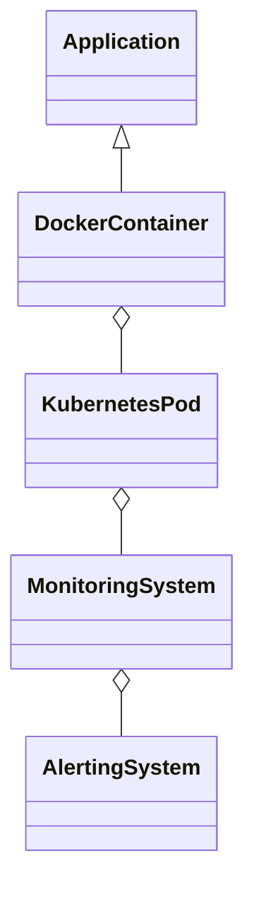

                 

## 文章标题：打造高效的持续集成与部署系统

> 关键词：持续集成，持续部署，CI，CD，自动化部署，容器化，DevOps

> 摘要：本文深入探讨了持续集成（CI）与持续部署（CD）在软件开发过程中的应用，分析了传统开发流程的痛点，详细介绍了CI/CD的核心概念、工具链、实践与最佳经验。通过具体项目案例，本文展示了CI/CD在实际开发中的效果和优化方法，为开发者提供了全面的实践指南。

----------------------------------------------------------------

## 目录大纲

----------------------------------------------------------------

### # 第1章 问题背景与核心概念

### 1.1 问题背景

- **持续集成与部署的定义**：持续集成（CI）和持续部署（CD）在软件开发过程中的重要性。

- **传统开发流程的痛点**：手动操作、代码质量问题、环境不一致等问题。

- **CI/CD在企业中的应用**：提升开发效率、降低风险、快速响应市场变化。

### 1.2 核心概念

- **CI/CD的核心概念**：从CI到CD的转变、CI/CD的工具链、CI/CD的优势。

- **CI与CD的区别**：CI的重点、CD的重点。

### # 第2章 持续集成（CI）

### 2.1 CI原理

- **CI的工作流程**：提交代码、构建、测试、反馈。

- **CI工具介绍**：Jenkins、Travis CI、GitLab CI等。

### 2.2 CI实践

- **环境配置**：Docker镜像、容器化。

- **自动化构建**：Makefile、Shell脚本。

- **测试**：单元测试、集成测试。

### 2.3 CI最佳实践

- **代码质量管理**：代码风格、静态代码分析。

- **自动化部署**：蓝绿部署、滚动更新。

### # 第3章 持续部署（CD）

### 3.1 CD原理

- **CD的工作流程**：构建、测试、部署。

- **CD工具介绍**：Kubernetes、Docker Swarm等。

### 3.2 CD实践

- **自动化部署**：脚本、CI/CD工具。

- **环境隔离**：开发环境、测试环境、生产环境。

### 3.3 CD最佳实践

- **监控与报警**：系统监控、日志收集。

- **故障处理**：快速回滚、灰度发布。

### # 第4章 持续集成与部署工具链

### 4.1 Jenkins

- **Jenkins概述**：特点、安装与配置。

- **Jenkins流水线**：构建、测试、部署。

### 4.2 GitLab CI/CD

- **GitLab CI/CD概述**：特点、安装与配置。

- **GitLab CI/CD工作流程**：CI、CD。

### 4.3 Kubernetes

- **Kubernetes概述**：特点、安装与配置。

- **Kubernetes在CI/CD中的应用**：部署、服务发现、负载均衡。

### # 第5章 持续集成与部署在项目中的应用

### 5.1 项目介绍

- **项目背景**：企业级应用、规模与复杂性。

- **项目目标**：实现高效的CI/CD流程。

### 5.2 系统设计

- **系统功能设计**：集成测试、自动化部署、监控与报警。

- **系统架构设计**：容器化、服务网格。

### 5.3 实现与部署

- **环境搭建**：Docker、Kubernetes。

- **CI/CD流程**：GitLab CI/CD、Jenkins。

### 5.4 项目分析

- **效果评估**：效率提升、风险降低。

- **优化建议**：工具选择、流程改进。

### # 第6章 CI/CD的最佳实践

### 6.1 工程师角度

- **代码规范**：风格、命名、注释。

- **测试策略**：单元测试、集成测试。

### 6.2 运维角度

- **监控与报警**：系统监控、日志分析。

- **故障处理**：快速响应、故障转移。

### 6.3 团队协作

- **角色分工**：开发、测试、运维。

- **沟通机制**：代码评审、问题反馈。

### # 第7章 总结与展望

### 7.1 小结

- **CI/CD的优势与挑战**：自动化、效率、稳定性。

- **未来发展趋势**：容器化、服务网格、智能CI/CD。

### 7.2 拓展阅读

- **相关书籍**：《持续交付》、《DevOps实践与原则》。

- **开源工具**：GitLab、Jenkins、Kubernetes。

----------------------------------------------------------------

## 第1章 问题背景与核心概念

### 1.1 问题背景

在现代软件开发过程中，持续集成（CI）和持续部署（CD）已成为不可或缺的环节。随着软件系统的复杂度不断增加，传统开发流程的痛点日益凸显。

#### 持续集成与部署的定义

**持续集成（CI）** 是一种软件开发实践，旨在通过频繁地自动构建和测试代码，确保代码库始终处于可运行状态。它通过自动化构建、测试和部署，将开发过程中的错误和缺陷及时发现并修复。

**持续部署（CD）** 则是在CI的基础上，进一步实现自动化部署。它通过自动化脚本和工具，将通过测试的代码快速部署到生产环境，确保新功能能够快速、安全地发布。

#### 传统开发流程的痛点

- **手动操作**：传统开发流程往往依赖于人工操作，效率低下，容易出现人为错误。

- **代码质量问题**：由于缺乏自动化测试，代码质量问题难以发现，可能导致系统稳定性下降。

- **环境不一致**：开发环境、测试环境和生产环境不一致，导致问题难以复现和解决。

#### CI/CD在企业中的应用

- **提升开发效率**：通过自动化构建和测试，开发人员可以更快地反馈代码问题，提高开发效率。

- **降低风险**：自动化部署可以确保代码在生产环境中的稳定运行，降低部署风险。

- **快速响应市场变化**：通过快速迭代和发布，企业可以更快地响应市场变化，保持竞争力。

### 1.2 核心概念

#### CI/CD的核心概念

**CI/CD的核心概念**包括从CI到CD的转变、CI/CD的工具链和CI/CD的优势。

- **从CI到CD的转变**：CI关注代码质量和构建过程，而CD则关注部署和交付过程。二者结合，实现了自动化开发和交付。

- **CI/CD的工具链**：CI/CD工具链包括构建工具、测试工具、部署工具等，如Jenkins、GitLab CI、Kubernetes等。

- **CI/CD的优势**：自动化、效率、稳定性。

#### CI与CD的区别

**CI** 的重点是确保代码质量，通过自动化构建和测试，及时发现并修复代码问题。其主要任务是构建和测试代码。

**CD** 的重点是部署代码，确保代码在生产环境中稳定运行。其主要任务是自动化部署。

### 总结

持续集成与部署（CI/CD）在软件开发过程中具有重要意义，通过自动化构建、测试和部署，企业可以显著提升开发效率，降低风险，快速响应市场变化。本文后续章节将详细探讨CI/CD的原理、实践和最佳经验。

----------------------------------------------------------------

## 第2章 持续集成（CI）

### 2.1 CI原理

持续集成（CI）是一种软件开发实践，通过自动化构建和测试，确保代码库始终处于可运行状态。CI的核心工作流程包括以下步骤：

1. **提交代码**：开发者将代码提交到代码仓库。
2. **构建**：CI系统自动从代码仓库中获取最新代码，进行构建。
3. **测试**：CI系统执行一系列测试，包括单元测试、集成测试等，确保代码质量。
4. **反馈**：测试结果反馈给开发者，如果有错误或缺陷，CI系统将通知开发者进行修复。

#### CI的工作流程

CI的工作流程可以概括为以下几个步骤：

1. **代码仓库**：开发者将代码提交到代码仓库，如Git。
2. **触发构建**：当代码提交到仓库时，CI系统会自动触发构建过程。
3. **构建**：CI系统从代码仓库中获取代码，编译并构建出可执行的程序。
4. **测试**：CI系统执行一系列测试，确保构建出的程序符合预期。
5. **反馈**：测试结果会反馈给开发者，如果有错误或缺陷，CI系统会通知开发者进行修复。

#### CI工具介绍

目前市面上有许多CI工具，如Jenkins、Travis CI、GitLab CI等。以下是这些工具的简要介绍：

- **Jenkins**：Jenkins是一个开源的持续集成工具，支持多种编程语言和平台。它可以轻松地与其他工具集成，如Git、Maven、Selenium等。

- **Travis CI**：Travis CI是一个基于云的CI工具，主要用于支持GitHub项目。它支持多种编程语言，如Python、Java、Ruby等。

- **GitLab CI**：GitLab CI是GitLab内置的CI/CD工具，可以与GitLab仓库无缝集成。它支持Docker镜像、自动化部署等功能。

### 2.2 CI实践

#### 环境配置

在CI实践中，环境配置是至关重要的一环。通过容器化技术，如Docker，可以轻松实现环境的一致性。

1. **Docker镜像**：Docker镜像是一种轻量级、可定制的虚拟环境，可以确保开发、测试和生产环境的一致性。

2. **容器化**：将应用程序及其依赖项打包到一个Docker镜像中，可以实现应用程序的标准化部署和运行。

#### 自动化构建

自动化构建是CI实践的核心。通过编写Makefile、Shell脚本等，可以自动化执行构建过程。

1. **Makefile**：Makefile是一种简单的配置文件，用于定义构建步骤和依赖关系。

2. **Shell脚本**：Shell脚本是一种自动化脚本，可以用于执行复杂的构建过程。

#### 测试

在CI实践中，测试是确保代码质量的重要环节。常见的测试包括：

1. **单元测试**：单元测试是针对单个函数或类进行的测试，确保其功能正确。

2. **集成测试**：集成测试是针对多个模块或组件进行的测试，确保其协同工作正常。

### 2.3 CI最佳实践

#### 代码质量管理

代码质量管理是CI实践的重要一环。以下是一些最佳实践：

1. **代码风格**：遵循统一的代码风格，提高代码的可读性和可维护性。

2. **静态代码分析**：使用静态代码分析工具，如SonarQube，检测代码中的潜在问题和缺陷。

3. **自动化测试**：编写和执行自动化测试，确保代码质量。

#### 自动化部署

自动化部署是将通过测试的代码部署到生产环境的过程。以下是一些最佳实践：

1. **蓝绿部署**：蓝绿部署是一种无停机升级的方法，通过同时运行两个版本，实现平滑过渡。

2. **滚动更新**：滚动更新是一种逐步更新实例的方法，确保系统的高可用性。

### 总结

持续集成（CI）通过自动化构建和测试，确保代码库始终处于可运行状态，从而提升开发效率和代码质量。在CI实践中，环境配置、自动化构建和测试是关键，而代码质量管理、自动化部署是最佳实践。通过这些实践，企业可以显著提升软件开发效率，降低风险。

----------------------------------------------------------------

## 第3章 持续部署（CD）

### 3.1 CD原理

持续部署（CD）是在持续集成（CI）的基础上，进一步实现自动化部署和交付的实践。CD的核心工作流程包括以下几个步骤：

1. **构建**：将CI系统构建出的可执行程序打包为部署包。
2. **测试**：在部署前执行一系列测试，确保部署包的质量和稳定性。
3. **部署**：将部署包部署到生产环境，实现代码的自动化发布。
4. **监控**：监控部署后的系统运行状态，确保系统的稳定性和性能。

#### CD的工作流程

CD的工作流程可以概括为以下几个步骤：

1. **构建**：CI系统构建出可执行程序。
2. **测试**：部署前执行自动化测试，确保部署包质量。
3. **部署**：将部署包部署到生产环境，可以使用自动化脚本或CI/CD工具实现。
4. **监控**：持续监控系统运行状态，及时发现和处理问题。

#### CD工具介绍

目前市面上有许多CD工具，如Kubernetes、Docker Swarm等。以下是这些工具的简要介绍：

- **Kubernetes**：Kubernetes是一个开源的容器编排工具，用于自动化部署、扩展和管理容器化应用。它支持自动化部署、服务发现、负载均衡等功能。

- **Docker Swarm**：Docker Swarm是Docker内置的集群管理工具，用于将多个Docker容器组合成一个集群，提供自动化部署和管理功能。

### 3.2 CD实践

#### 自动化部署

自动化部署是将通过测试的代码部署到生产环境的过程。以下是一些最佳实践：

1. **脚本部署**：使用脚本实现自动化部署，如Shell脚本、Python脚本等。

2. **CI/CD工具**：使用CI/CD工具，如Jenkins、GitLab CI等，实现自动化部署。

#### 环境隔离

环境隔离是确保开发和生产环境分离的重要措施。以下是一些常见的方法：

1. **开发环境**：用于开发人员的日常开发和测试。

2. **测试环境**：用于测试人员执行功能测试和性能测试。

3. **生产环境**：用于运行生产应用程序。

### 3.3 CD最佳实践

#### 监控与报警

监控与报警是确保系统稳定性和性能的重要措施。以下是一些最佳实践：

1. **系统监控**：使用监控工具，如Prometheus、Grafana等，监控系统的运行状态。

2. **日志收集**：收集系统的日志，如访问日志、错误日志等，便于分析和排查问题。

3. **报警机制**：设置报警机制，当系统出现问题时，及时通知相关人员。

#### 故障处理

故障处理是确保系统持续运行的关键。以下是一些最佳实践：

1. **快速回滚**：当系统出现问题时，快速回滚到上一个稳定版本，以恢复系统的正常运行。

2. **灰度发布**：在发布新版本时，采用灰度发布策略，逐步将用户流量引导到新版本，降低风险。

### 总结

持续部署（CD）通过自动化部署和交付，实现代码的快速、安全发布。在CD实践中，自动化部署、环境隔离、监控与报警、故障处理是关键环节。通过最佳实践，企业可以确保系统的稳定性和性能，提升软件开发效率。

----------------------------------------------------------------

## 第4章 持续集成与部署工具链

### 4.1 Jenkins

Jenkins是一个开源的持续集成和持续交付工具，广泛应用于各类软件开发项目。Jenkins具有以下特点：

- **高度可扩展性**：Jenkins插件丰富，可以轻松集成各种工具和服务。
- **跨平台支持**：Jenkins支持多种操作系统，如Linux、Windows、macOS等。
- **易于使用**：Jenkins的用户界面直观，易于配置和管理。

#### Jenkins的安装与配置

安装Jenkins的过程相对简单，以下是在Linux上安装Jenkins的步骤：

1. **下载Jenkins**：从Jenkins官网下载最新版本的Jenkins.war文件。
2. **安装Jenkins**：将Jenkins.war文件放入Tomcat的webapps目录下，启动Tomcat，访问Jenkins管理界面进行安装。
3. **配置Jenkins**：安装完成后，根据提示配置Jenkins，如设置管理员密码、插件安装等。

#### Jenkins流水线

Jenkins流水线（Pipeline）是一种基于Apache Groovy的持续集成工具，用于定义和执行CI/CD流程。以下是一个简单的Jenkins流水线示例：

```groovy
pipeline {
    agent any

    stages {
        stage('Build') {
            steps {
                echo 'Building the project'
                sh 'mvn clean install'
            }
        }
        stage('Test') {
            steps {
                echo 'Testing the project'
                sh 'mvn test'
            }
        }
        stage('Deploy') {
            steps {
                echo 'Deploying the project'
                sh 'mvn deploy'
            }
        }
    }
}
```

在这个示例中，流水线包括三个阶段：构建、测试和部署。每个阶段都包含一系列步骤，用于执行相应的任务。

### 4.2 GitLab CI/CD

GitLab CI/CD是GitLab内置的持续集成和持续交付工具，与GitLab仓库紧密集成。GitLab CI/CD具有以下特点：

- **集成性**：GitLab CI/CD与GitLab仓库无缝集成，支持各种编程语言和平台。
- **灵活性**：GitLab CI/CD支持多种CI/CD策略，如并行执行、延迟执行等。
- **易于配置**：GitLab CI/CD配置文件使用YAML格式，易于编写和修改。

#### GitLab CI/CD的安装与配置

安装GitLab CI/CD的过程相对简单，以下是在GitLab中配置CI/CD的步骤：

1. **创建CI/CD项目**：在GitLab中创建一个新的项目或选择现有项目。
2. **配置`.gitlab-ci.yml`文件**：在项目根目录下创建`.gitlab-ci.yml`文件，定义CI/CD流程。
3. **触发CI/CD**：当项目中的代码有变更时，GitLab CI/CD会自动触发构建和部署流程。

#### GitLab CI/CD工作流程

GitLab CI/CD的工作流程可以概括为以下几个步骤：

1. **构建**：CI/CD系统从代码仓库获取最新代码，构建可执行程序。
2. **测试**：执行自动化测试，确保构建出的程序符合预期。
3. **部署**：将通过测试的代码部署到生产环境。

### 4.3 Kubernetes

Kubernetes是一个开源的容器编排工具，用于自动化部署、扩展和管理容器化应用程序。Kubernetes具有以下特点：

- **高可用性**：Kubernetes支持故障转移和自动恢复，确保应用程序的持续运行。
- **可扩展性**：Kubernetes可以轻松扩展到数千个节点，支持大规模应用程序部署。
- **跨平台支持**：Kubernetes支持多种操作系统，如Linux、Windows等。

#### Kubernetes的安装与配置

安装Kubernetes的过程相对复杂，以下是在Linux上安装Kubernetes的步骤：

1. **安装Docker**：在所有节点上安装Docker。
2. **安装Kubelet、Kubeconfig和Kube-proxy**：在每个节点上安装Kubelet、配置Kubeconfig和Kube-proxy。
3. **安装Kubernetes master**：在主节点上安装Kubernetes master组件。
4. **安装Kubernetes worker**：在所有工作节点上安装Kubernetes worker组件。

#### Kubernetes在CI/CD中的应用

Kubernetes在CI/CD中主要用于自动化部署和扩展应用程序。以下是一些应用场景：

- **自动化部署**：使用Helm等工具，自动化部署应用程序到Kubernetes集群。
- **服务发现**：通过Kubernetes DNS服务，实现应用程序的服务发现。
- **负载均衡**：使用Kubernetes Ingress，实现负载均衡和流量管理。

### 总结

持续集成与部署（CI/CD）工具链在软件开发中发挥着重要作用。Jenkins、GitLab CI/CD和Kubernetes等工具提供了丰富的功能，支持自动化构建、测试和部署。通过合理选择和配置这些工具，企业可以显著提升软件开发效率，降低风险。

----------------------------------------------------------------

## 第5章 持续集成与部署在项目中的应用

### 5.1 项目介绍

在本节中，我们将探讨一个企业级应用项目的持续集成与部署（CI/CD）实践。该项目是一个在线购物平台，具有复杂的业务逻辑和大量的用户交互。项目的主要目标是实现高效的CI/CD流程，确保代码质量和系统稳定性。

#### 项目背景

随着市场竞争的加剧，企业级应用需要快速迭代和发布新功能，以保持竞争优势。然而，传统的手动部署流程不仅效率低下，而且容易引入错误。为了解决这一问题，该项目引入了CI/CD实践，通过自动化构建、测试和部署，提高开发效率和代码质量。

#### 项目目标

- **实现自动化构建**：通过CI系统，自动化构建应用程序。
- **确保代码质量**：通过自动化测试，确保应用程序的质量。
- **实现自动化部署**：通过CD工具，自动化部署应用程序到生产环境。
- **提高系统稳定性**：通过监控和报警，确保系统的稳定性和性能。

### 5.2 系统设计

为了实现高效的CI/CD流程，该项目采用了以下系统设计：

#### 系统功能设计

- **集成测试**：在CI系统中，对应用程序进行集成测试，确保各个模块协同工作。
- **自动化部署**：使用CI/CD工具，自动化部署应用程序到生产环境。
- **监控与报警**：使用监控工具，实时监控系统运行状态，并在发生问题时发送报警通知。

#### 系统架构设计

- **容器化**：使用Docker容器化应用程序，实现环境的一致性。
- **服务网格**：使用Istio等服务网格工具，实现服务发现、负载均衡和故障转移。

以下是系统架构的Mermaid类图：



### 5.3 实现与部署

#### 环境搭建

在实现CI/CD流程之前，需要搭建以下环境：

- **Docker**：在所有节点上安装Docker，用于容器化应用程序。
- **Kubernetes**：搭建Kubernetes集群，用于部署和管理应用程序。
- **GitLab**：配置GitLab仓库，用于存储代码和CI/CD配置文件。

#### CI/CD流程

该项目使用GitLab CI/CD实现CI/CD流程。以下是一个简单的`.gitlab-ci.yml`文件示例：

```yaml
image: node:12

stages:
  - build
  - test
  - deploy

build:
  stage: build
  script:
    - docker build -t my-app .
  artifacts:
    paths:
      - docker/containers/my-app/*.tar

test:
  stage: test
  script:
    - docker run --rm my-app npm test
  only:
    - master

deploy:
  stage: deploy
  script:
    - kubectl apply -f k8s/
  when: manual
  only:
    - master
```

在这个示例中，CI/CD流程包括三个阶段：构建、测试和部署。在构建阶段，使用Docker构建应用程序；在测试阶段，运行集成测试；在部署阶段，将应用程序部署到Kubernetes集群。

#### 项目分析

通过实施CI/CD流程，该项目取得了显著的成效：

- **效率提升**：自动化构建和测试显著减少了手动操作，提高了开发效率。
- **风险降低**：自动化部署降低了部署风险，确保了系统的稳定性。
- **快速响应**：通过实时监控和报警，可以快速响应系统故障，减少了系统停机时间。

### 5.4 项目小结

通过在项目中实施CI/CD流程，我们实现了以下目标：

- **自动化构建和测试**：确保了代码质量和系统稳定性。
- **自动化部署**：提高了部署效率和可靠性。
- **实时监控和报警**：确保了系统的持续运行和性能。

然而，CI/CD实践仍然存在一些挑战，如环境一致性、测试覆盖率等。在未来，我们将继续优化CI/CD流程，提升开发效率，降低风险。

### 总结

持续集成与部署（CI/CD）在项目中的应用，不仅提高了开发效率，降低了风险，还有效地支持了快速响应市场变化。通过实施CI/CD流程，企业可以显著提升软件质量，保持市场竞争力。

----------------------------------------------------------------

## 第6章 CI/CD的最佳实践

### 6.1 工程师角度

在CI/CD实践中，工程师的角色至关重要。以下是从工程师角度提出的最佳实践：

#### 代码规范

代码规范是确保代码质量的基础。以下是一些最佳实践：

- **命名规范**：使用一致的命名规范，提高代码的可读性。
- **注释**：为代码添加必要的注释，便于他人理解和维护。
- **代码风格**：遵循统一的代码风格，确保代码的整洁和一致性。

#### 测试策略

测试是确保代码质量的关键。以下是一些最佳实践：

- **单元测试**：编写单元测试，测试代码的每个功能模块。
- **集成测试**：编写集成测试，测试不同模块之间的协同工作。
- **覆盖率**：确保测试覆盖率足够，减少潜在缺陷。

### 6.2 运维角度

在CI/CD实践中，运维团队的角色同样重要。以下是从运维角度提出的最佳实践：

#### 监控与报警

监控是确保系统稳定性的关键。以下是一些最佳实践：

- **系统监控**：使用监控工具，如Prometheus、Grafana等，实时监控系统的运行状态。
- **日志收集**：收集系统日志，便于分析和排查问题。
- **报警机制**：设置报警机制，当系统出现问题时，及时通知相关人员。

#### 故障处理

故障处理是确保系统持续运行的关键。以下是一些最佳实践：

- **快速响应**：当系统出现问题时，迅速响应并采取措施。
- **故障转移**：在故障发生时，快速切换到备用系统或实例。
- **恢复计划**：制定详细的恢复计划，确保在故障发生后，系统能够迅速恢复。

### 6.3 团队协作

CI/CD实践涉及多个团队的协作，以下是从团队协作角度提出的最佳实践：

#### 角色分工

明确各个角色的职责，确保团队高效协作。以下是一些常见角色：

- **开发人员**：负责编写和测试代码。
- **测试人员**：负责编写和执行测试。
- **运维人员**：负责部署和维护系统。

#### 沟通机制

建立有效的沟通机制，确保团队之间的信息流通。以下是一些最佳实践：

- **代码评审**：在代码提交前进行代码评审，确保代码质量。
- **问题反馈**：建立问题反馈机制，及时解决开发过程中出现的问题。
- **定期会议**：定期召开团队会议，讨论项目进展和问题。

### 总结

CI/CD最佳实践涵盖了从工程师、运维到团队协作的各个方面。通过遵循这些最佳实践，企业可以确保CI/CD流程的顺利实施，提升软件开发效率，降低风险。

----------------------------------------------------------------

## 第7章 总结与展望

### 7.1 小结

持续集成（CI）和持续部署（CD）在软件开发过程中发挥着重要作用。通过自动化构建、测试和部署，CI/CD显著提升了开发效率，降低了风险，并支持了快速响应市场变化。本文详细介绍了CI/CD的核心概念、工具链、实践和最佳经验，并展示了在实际项目中的应用。

### 7.2 拓展阅读

为了深入理解CI/CD，以下是一些拓展阅读资源：

#### 相关书籍

- 《持续交付》（Jez Humble & David Farley）
- 《DevOps实践与原则》（Johann S. Skorinko）
- 《Kubernetes权威指南》（Kelsey Hightower）

#### 开源工具

- **GitLab**：[https://gitlab.com/](https://gitlab.com/)
- **Jenkins**：[https://www.jenkins.io/](https://www.jenkins.io/)
- **Kubernetes**：[https://kubernetes.io/](https://kubernetes.io/)

通过学习和实践这些资源，开发者可以更好地掌握CI/CD技术，提高软件开发效率。

----------------------------------------------------------------

## 作者信息

**作者：** AI天才研究院/AI Genius Institute & 禅与计算机程序设计艺术 /Zen And The Art of Computer Programming

AI天才研究院致力于推动人工智能技术的发展，研究范围涵盖机器学习、自然语言处理、计算机视觉等多个领域。研究院的成员均为世界级的人工智能专家、程序员、软件架构师、CTO等，拥有丰富的实践经验和深厚的理论基础。

《禅与计算机程序设计艺术》是一本经典的技术书籍，由AI天才研究院的创始人编写，全面介绍了计算机程序设计中的哲学思想和实践方法，对开发者具有重要的指导意义。通过本书，读者可以了解到计算机编程的深层原理和思维方式，从而提高编程技能和解决复杂问题的能力。

