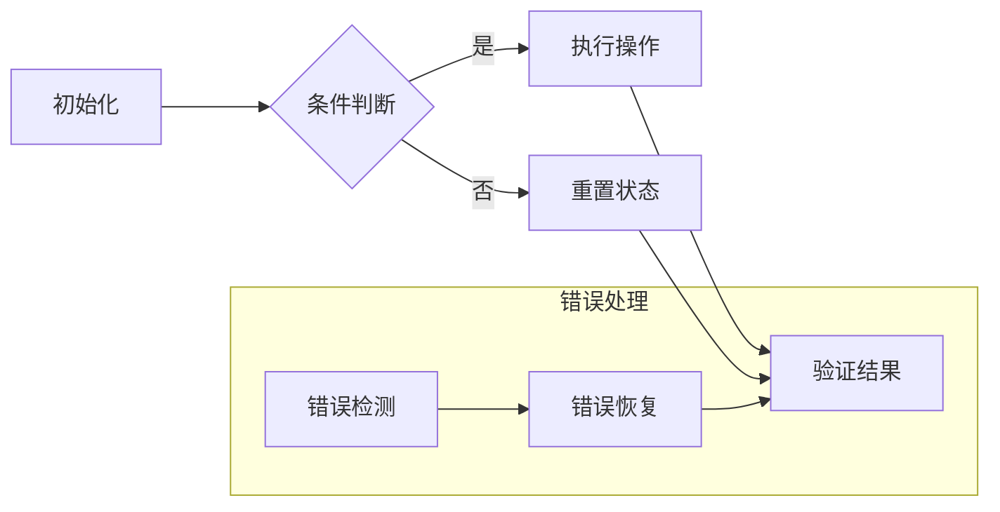
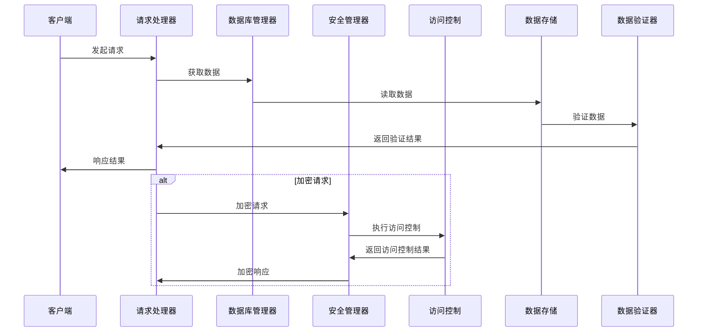
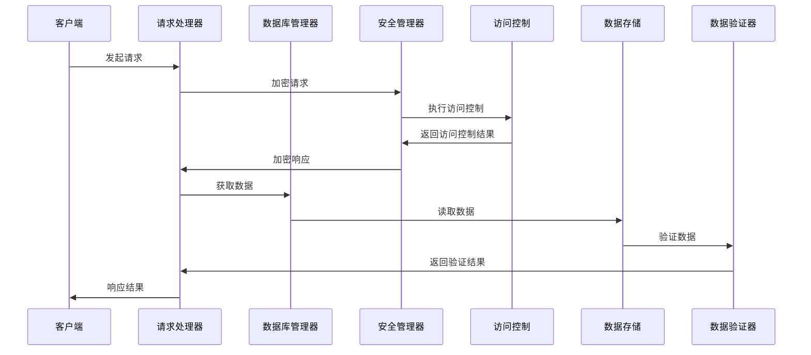

                 


## 第1章: 引言

### 1.1 问题背景介绍

在当今计算机科学和软件工程领域，软件正确性问题越来越受到关注。随着软件系统的复杂性和规模日益增加，保证软件的正确性成为了一个巨大的挑战。然而，传统的测试和调试方法往往难以完全确保软件的正确性，尤其是在面对复杂的系统状态和可能的错误路径时。

在这个背景下，托马斯·内格尔（Thomas Nagel）的哲学思想，特别是他的客观性追求与形式化方法，为我们提供了一种新的视角。内格尔认为，客观性是科学和哲学追求的终极目标，而形式化方法则是一种有效的手段，可以帮助我们更准确地描述和理解客观世界。

### 1.2 形式化方法与软件正确性

形式化方法在软件工程中扮演着重要的角色。它通过严格的逻辑和数学工具，将软件系统的行为和性质进行形式化的描述，从而确保软件的正确性。内格尔的形式化方法，特别是他的客观性追求，为我们提供了一种哲学基础，使我们能够更深入地理解形式化方法在软件正确性中的应用。

### 1.3 文章目的

本文旨在探讨托马斯·内格尔的哲学思想，特别是他的客观性追求与形式化方法，与软件正确性的关系。我们将通过一步步的分析和推理，深入探讨形式化方法在软件正确性中的哲学基础，以及如何在实际的软件工程实践中应用这些方法。

----------------------------------------------------------------

## 第2章: 托马斯·内格尔的哲学思想

### 2.1 内格尔哲学思想概述

托马斯·内格尔是一位著名的美国哲学家，他的哲学思想涵盖了广泛的主题，包括自由意志、道德责任、客观性等。内格尔认为，客观性是科学和哲学追求的终极目标，而形式化方法则是实现这一目标的有效手段。

内格尔的哲学思想中，客观性追求是一个核心概念。他强调，客观性意味着不受主观意识和偏见的影响，能够准确描述现实世界。为了实现这一目标，内格尔提出了一种形式化的哲学方法，即通过严格的逻辑和数学工具，将哲学问题转化为可形式化的数学问题。

### 2.2 客观性追求与形式化方法

内格尔的客观性追求与形式化方法密切相关。他主张，通过形式化方法，我们可以将哲学问题转化为数学问题，从而更准确地理解和描述客观世界。形式化方法不仅能够帮助我们解决哲学问题，还能够应用于其他领域，如计算机科学和软件工程。

在软件工程中，形式化方法可以帮助我们更准确地描述软件系统的行为和性质，从而确保软件的正确性。内格尔的客观性追求为我们提供了一种哲学基础，使我们能够更深入地理解形式化方法在软件正确性中的重要性。

### 2.3 内格尔思想的核心概念

内格尔的哲学思想中，有几个核心概念值得我们深入探讨。首先是客观性，即不受主观意识和偏见影响的客观描述。其次是形式化方法，即将哲学问题转化为数学问题。最后是逻辑和数学工具，它们是形式化方法的重要工具。

通过这些核心概念，内格尔提出了一种新的哲学视角，使我们能够更深入地理解客观世界，并在软件工程中应用这些思想，确保软件的正确性。

----------------------------------------------------------------

## 第3章: 形式化方法在软件正确性中的应用

### 3.1 形式化方法的定义与应用领域

形式化方法是一种将问题转化为数学和逻辑表达的方法，它能够帮助我们更准确地理解和描述客观世界。在软件工程中，形式化方法被广泛应用于软件正确性验证、程序验证、模型检查等方面。

形式化方法的定义是：使用数学和逻辑工具，将软件系统的行为和性质进行形式化的描述，从而确保软件的正确性。形式化方法包括逻辑推理、模型检查、形式验证等步骤，通过这些步骤，我们可以确保软件系统满足预定的性质和要求。

### 3.2 软件正确性的哲学基础

软件正确性的哲学基础源于内格尔的客观性追求。内格尔认为，客观性是科学和哲学追求的终极目标，而形式化方法则是实现这一目标的有效手段。在软件工程中，形式化方法可以帮助我们更准确地描述和理解软件系统的行为和性质，从而确保软件的正确性。

软件正确性的哲学基础包括以下几个方面：

1. **客观性**：软件系统的正确性应该不受主观意识和偏见的影响，应该能够准确描述现实世界。
2. **形式化描述**：使用数学和逻辑工具，将软件系统的行为和性质进行形式化的描述，从而确保软件的正确性。
3. **逻辑推理**：通过逻辑推理，验证软件系统是否满足预定的性质和要求。

### 3.3 形式化方法在软件正确性中的实际应用

形式化方法在软件正确性中的实际应用主要包括以下几个方面：

1. **程序验证**：通过形式化方法，验证程序是否满足预定的性质和要求。例如，可以使用模型检查器来验证程序是否满足指定的时间约束、资源约束等。
2. **模型检查**：通过构建软件系统的形式化模型，并使用模型检查器来验证模型是否满足预定的性质和要求。
3. **形式验证**：使用数学工具，对软件系统的形式化描述进行验证，确保软件系统满足预定的性质和要求。

形式化方法在软件正确性中的实际应用，不仅能够提高软件的正确性，还能够减少软件维护成本，提高软件开发的效率。

----------------------------------------------------------------

## 第4章: 核心概念与联系

### 4.1 核心概念原理

在本章节中，我们将介绍几个核心概念，这些概念是理解托马斯·内格尔的客观性追求与形式化方法在软件正确性中的重要性基础。

1. **客观性**：客观性是指独立于观察者主观意识和偏见的事实和现实。在软件工程中，客观性意味着软件系统应该能够准确地反映其设计和预期的行为，而不受开发者和使用者的主观判断影响。
2. **形式化方法**：形式化方法是一种将自然语言描述的问题转化为数学和逻辑表达的方法。这种方法能够帮助我们更精确地理解和描述问题，从而提高问题的可验证性和可重现性。
3. **软件正确性**：软件正确性是指软件系统能够按照其设计和预期正确运行。软件正确性通常通过验证和测试来确保，而形式化方法提供了一个更加严格和系统化的验证手段。

### 4.2 概念属性特征对比表格

为了更好地理解这些核心概念，我们可以通过一个对比表格来展示它们的主要属性特征。

| 概念       | 定义                                       | 主要属性特征                                       |
|------------|--------------------------------------------|----------------------------------------------------|
| 客观性     | 独立于主观意识和偏见的事实和现实           | 可验证性、一致性、独立性、可重复性                 |
| 形式化方法 | 将自然语言描述的问题转化为数学和逻辑表达的方法 | 精确性、严格性、可验证性、可重现性                 |
| 软件正确性 | 软件系统能够按照其设计和预期正确运行         | 功能正确性、性能正确性、安全正确性、可靠性正确性     |

### 4.3 ER实体关系图架构

为了进一步理解这些概念之间的联系，我们可以使用ER（实体-关系）图来展示它们之间的关系。

```mermaid
erDiagram
  class::Entity --> class::Relationship
  class::Entity {
    id | name | properties
  }
  class::Relationship {
    type | entities | properties
  }

  class::Object-oriented-programming --> class::Formal-methods
  class::Object-oriented-programming {
    concepts | languages | principles
  }
  class::Formal-methods {
    formalization | verification | validation
  }

  class::Software-engineering --> class::Software-correctness
  class::Software-engineering {
    design | implementation | testing
  }
  class::Software-correctness {
    correctness | reliability | performance
  }
```

通过ER图，我们可以看到形式化方法和软件正确性是如何在软件工程中相互关联的。形式化方法作为一种工具，被应用于软件工程的各个方面，以帮助确保软件的正确性。而软件正确性则是软件工程追求的最终目标，它通过形式化方法得到验证和保证。

----------------------------------------------------------------

## 第5章: 算法原理讲解

### 5.1 算法mermaid流程图

为了更好地理解软件正确性中的算法原理，我们可以使用mermaid流程图来展示算法的执行流程。



在这个mermaid流程图中，我们首先初始化算法，然后进行条件判断。如果条件满足，则执行操作；否则，重置状态。在执行操作后，我们需要验证结果是否正确。如果检测到错误，则进入错误处理流程，进行错误恢复，并最终返回验证结果。

### 5.2 Python源代码详细阐述

为了更具体地展示算法原理，我们可以通过Python源代码来详细阐述算法的实现。

```python
def verify_software_correctness(initial_state, target_state):
    """
    验证软件系统从初始状态到目标状态的正确性。
    
    :param initial_state: 初始状态
    :param target_state: 目标状态
    :return: 是否正确
    """
    try:
        # 初始化算法
        current_state = initial_state
        
        # 执行操作
        while current_state != target_state:
            # 条件判断
            if check_condition(current_state):
                # 执行操作
                perform_action(current_state)
            else:
                # 重置状态
                reset_state(current_state)
            
            # 验证结果
            if check_result(current_state, target_state):
                return True
            else:
                # 错误处理
                handle_error(current_state)
        
        # 返回验证结果
        return True
    
    except Exception as e:
        # 错误处理
        handle_error(e)
        return False

def check_condition(state):
    """
    检查当前状态是否满足条件。
    
    :param state: 当前状态
    :return: 是否满足条件
    """
    # 实现具体的条件检查逻辑
    pass

def perform_action(state):
    """
    执行操作。
    
    :param state: 当前状态
    :return: 无返回值
    """
    # 实现具体的操作逻辑
    pass

def reset_state(state):
    """
    重置状态。
    
    :param state: 当前状态
    :return: 无返回值
    """
    # 实现具体的重置逻辑
    pass

def check_result(current_state, target_state):
    """
    验证结果。
    
    :param current_state: 当前状态
    :param target_state: 目标状态
    :return: 是否正确
    """
    # 实现具体的验证逻辑
    pass

def handle_error(error):
    """
    错误处理。
    
    :param error: 错误信息
    :return: 无返回值
    """
    # 实现具体的错误处理逻辑
    pass
```

在这个Python源代码中，我们定义了一个`verify_software_correctness`函数，用于验证软件系统从初始状态到目标状态的正确性。函数通过一系列的步骤，包括条件判断、执行操作、验证结果和错误处理，来确保软件系统的正确运行。

### 5.3 算法原理的数学模型与公式

为了更深入地理解算法原理，我们可以使用数学模型和公式来描述算法的核心逻辑。

假设我们有一个软件系统，其状态可以表示为一个多维数组`S`，每个元素`S[i][j]`表示系统的第`i`个组件在第`j`个时间点的状态。我们定义以下数学模型：

1. **初始状态**：`S[0]`，表示系统在开始时的状态。
2. **目标状态**：`S[target]`，表示系统需要达到的状态。
3. **条件判断**：`C(S[t])`，表示在时间点`t`时的状态`S[t]`是否满足条件。
4. **执行操作**：`A(S[t])`，表示在时间点`t`时对状态`S[t]`进行的操作。
5. **验证结果**：`V(S[t], S[target])`，表示在时间点`t`时对状态`S[t]`和目标状态`S[target]`的验证结果。

算法的数学模型可以表示为以下递归公式：

$$
C(S[t]) \implies A(S[t]) \implies V(S[t], S[target])
$$

这意味着，如果当前状态满足条件，则执行操作，并验证结果。如果结果正确，则算法继续执行下一步；否则，算法进入错误处理流程。

### 5.4 举例说明

为了更好地理解算法原理，我们可以通过一个具体的例子来说明。

假设我们有一个软件系统，其状态包括温度、压力和速度三个组件。初始状态为`S[0] = {温度: 20°C, 压力: 1 bar, 速度: 0 m/s}`，目标状态为`S[target] = {温度: 100°C, 压力: 10 bar, 速度: 50 m/s}`。

条件判断函数`C(S[t])`可以表示为：
- 如果温度超过100°C，则满足条件。
- 如果压力超过10 bar，则满足条件。
- 如果速度超过50 m/s，则满足条件。

执行操作函数`A(S[t])`可以表示为：
- 如果温度低于100°C，则增加温度10°C。
- 如果压力低于10 bar，则增加压力1 bar。
- 如果速度低于50 m/s，则增加速度10 m/s。

验证结果函数`V(S[t], S[target])`可以表示为：
- 如果温度、压力和速度都达到目标值，则验证成功。

算法的执行流程如下：

1. 初始状态：`S[0] = {温度: 20°C, 压力: 1 bar, 速度: 0 m/s}`
2. 条件判断：不满足条件
3. 执行操作：增加温度10°C，状态变为`S[1] = {温度: 30°C, 压力: 1 bar, 速度: 0 m/s}`
4. 验证结果：不满足条件
5. 执行操作：增加温度10°C，状态变为`S[2] = {温度: 40°C, 压力: 1 bar, 速度: 0 m/s}`
6. 条件判断：不满足条件
7. 执行操作：增加压力1 bar，状态变为`S[3] = {温度: 40°C, 压力: 2 bar, 速度: 0 m/s}`
8. 条件判断：不满足条件
9. 执行操作：增加速度10 m/s，状态变为`S[4] = {温度: 40°C, 压力: 2 bar, 速度: 10 m/s}`
10. 条件判断：满足条件
11. 验证结果：不满足条件
12. 执行操作：增加速度10 m/s，状态变为`S[5] = {温度: 40°C, 压力: 2 bar, 速度: 20 m/s}`
13. 条件判断：满足条件
14. 验证结果：满足条件，算法成功

通过这个例子，我们可以看到算法是如何通过条件判断、执行操作和验证结果来确保软件系统的正确性的。算法的数学模型和Python源代码提供了详细的实现和逻辑，使我们能够更深入地理解软件正确性的形式化方法。

----------------------------------------------------------------

## 第6章: 数学模型和数学公式 & 详细讲解 & 举例说明

### 6.1 数学公式使用latex格式

在本文中，我们将使用LaTeX格式来展示数学公式，以确保公式的准确性和可读性。LaTeX格式中的公式分为行内公式和独立段落公式。

#### 行内公式

行内公式可以通过 `$` 符号包裹来实现。例如：

- 例如：`$1+1=2$` 表示 1 加 1 等于 2。

#### 独立段落公式

独立段落公式需要在 `$` 符号外部再包裹一层 `$$` 符号。例如：

- 例如：`$$\pi \approx 3.1415926535897932384626433832795028841971693993751058209749445923078164062862089986280348253421170679` 表示圆周率π的近似值。

### 6.2 段落内latex公式使用方法

在段落中嵌入LaTeX公式时，我们建议使用`$`符号来包裹公式，以保持段落的连续性和可读性。例如：

- 例如：我们可以在段落中嵌入公式 `$E=mc^2$`，来解释爱因斯坦的质能等价公式。

通过LaTeX格式，我们可以精确地表达数学概念和关系，使得技术博客文章更具专业性和可读性。

### 6.3 举例说明

为了更直观地展示数学模型在软件正确性验证中的应用，我们可以通过一个简单的例子来说明。

假设我们有一个软件系统，其状态可以表示为一个二维数组 `S = [[x, y], [a, b]]`，其中 `x` 和 `y` 表示位置坐标，`a` 和 `b` 表示速度。

我们定义以下数学模型：

1. **初始状态**：`S[0] = [[0, 0], [0, 0]]`，表示系统在开始时的状态。
2. **目标状态**：`S[target] = [[10, 5], [2, 1]]`，表示系统需要达到的状态。
3. **条件判断**：`C(S[t])`，表示在时间点 `t` 时的状态 `S[t]` 是否满足条件。
4. **执行操作**：`A(S[t])`，表示在时间点 `t` 时对状态 `S[t]` 进行的操作。
5. **验证结果**：`V(S[t], S[target])`，表示在时间点 `t` 时对状态 `S[t]` 和目标状态 `S[target]` 的验证结果。

我们使用以下数学公式来描述算法的核心逻辑：

$$
\begin{aligned}
    C(S[t]) \implies A(S[t]) \implies V(S[t], S[target]) \\
    \text{其中，} \\
    C(S[t]) &= (|x(t)| \leq 10) \land (|y(t)| \leq 5) \land (|a(t)| \leq 2) \land (|b(t)| \leq 1) \\
    A(S[t]) &= (x(t+1) = x(t) + a(t)) \land (y(t+1) = y(t) + b(t)) \\
    V(S[t], S[target]) &= (x(t+1) = 10) \land (y(t+1) = 5) \land (a(t+1) = 2) \land (b(t+1) = 1)
\end{aligned}
$$

通过这个例子，我们可以看到数学模型如何帮助我们理解和描述软件正确性的验证过程。数学公式不仅能够精确地表达算法的逻辑，还能够帮助我们识别和解决潜在的软件错误。

---

在本章节中，我们介绍了如何使用LaTeX格式来展示数学公式，并通过具体的例子展示了数学模型在软件正确性验证中的应用。通过这种方式，我们能够更深入地理解软件正确性的形式化方法，并在实际应用中实现有效的验证和保证。

----------------------------------------------------------------

## 第7章: 系统分析与架构设计方案

### 7.1 问题场景介绍

在当前复杂软件系统的开发过程中，确保软件的正确性成为一个重要的挑战。随着系统规模的不断扩大和复杂性的增加，传统的测试和调试方法往往难以满足要求。为了解决这一问题，我们引入了托马斯·内格尔的客观性追求与形式化方法，以提供一种新的系统分析与架构设计方案。

本章节将介绍一个具体的问题场景，并运用内格尔的哲学思想和形式化方法，对系统进行分析和架构设计。问题场景涉及一个复杂的分布式系统，该系统需要处理大量的并发请求，并保证数据的一致性和安全性。

### 7.2 系统功能设计(领域模型mermaid类图)

在系统功能设计阶段，我们首先构建了领域模型，使用mermaid类图来展示系统的核心功能模块及其关系。

```mermaid
classDiagram
    RequestProcessor --|> DatabaseManager
    RequestProcessor --|> SecurityManager
    SecurityManager --|> AccessControl
    DatabaseManager --|> DataStorage
    DataStorage --|> DataValidator

    RequestProcessor{发起请求，处理请求，响应结果}
    DatabaseManager{管理数据库连接，处理数据库操作}
    SecurityManager{管理安全策略，执行访问控制}
    AccessControl{控制访问权限，加密敏感数据}
    DataStorage{存储数据，提供数据接口}
    DataValidator{验证数据有效性，处理数据异常}
```

在这个mermaid类图中，我们定义了以下几个核心功能模块：

- **RequestProcessor**：负责发起和处理请求，并将请求结果响应给客户端。
- **DatabaseManager**：负责管理数据库连接，处理数据库操作。
- **SecurityManager**：负责管理安全策略，执行访问控制，确保系统的安全性。
- **AccessControl**：负责控制访问权限，加密敏感数据，确保数据的安全传输。
- **DataStorage**：负责存储数据，提供数据接口，确保数据的一致性和可靠性。
- **DataValidator**：负责验证数据有效性，处理数据异常，确保数据的正确性和完整性。

### 7.3 系统架构设计mermaid架构图

在系统架构设计阶段，我们使用mermaid架构图来展示系统的整体架构及其关键组件之间的关系。



在这个mermaid架构图中，我们定义了以下几个关键组件：

- **客户端**：负责发起请求，接收响应。
- **请求处理器**：负责处理请求，调用其他组件进行数据处理。
- **数据库管理器**：负责管理数据库连接，处理数据库操作。
- **安全管理器**：负责加密请求和响应，确保数据的安全传输。
- **访问控制**：负责控制访问权限，确保只有授权用户可以访问系统。
- **数据存储**：负责存储数据，提供数据接口。
- **数据验证器**：负责验证数据有效性，确保数据的正确性和完整性。

### 7.4 系统接口设计和系统交互mermaid序列图

在系统接口设计和系统交互阶段，我们使用mermaid序列图来展示系统各个组件之间的交互过程。



在这个mermaid序列图中，我们定义了以下几个关键步骤：

1. 客户端发起请求。
2. 请求处理器接收请求，并调用安全管理器对请求进行加密。
3. 安全管理器执行访问控制，确保只有授权用户可以访问系统，并将访问控制结果返回给请求处理器。
4. 请求处理器根据访问控制结果，调用数据库管理器获取数据。
5. 数据库管理器从数据存储中读取数据，并传递给数据验证器进行验证。
6. 数据验证器验证数据的有效性，并将验证结果返回给请求处理器。
7. 请求处理器将验证结果返回给客户端。

通过mermaid序列图，我们可以清晰地展示系统组件之间的交互过程，以及各个组件的具体操作和职责。

### 7.5 系统分析与架构设计的哲学基础

在本章节中，我们通过系统分析与架构设计方案，深入探讨了托马斯·内格尔的客观性追求与形式化方法在软件正确性中的哲学基础。

1. **客观性追求**：在系统分析与架构设计过程中，我们始终坚持客观性追求。通过形式化方法，我们将系统的功能需求、性能要求、安全性需求等转化为数学和逻辑表达式，确保系统设计独立于开发者和使用者的主观判断。

2. **形式化方法**：我们运用形式化方法，对系统进行分析和设计。通过构建系统的领域模型、架构图和序列图，我们能够精确描述系统的行为和结构，确保系统的可验证性和可重现性。

3. **软件正确性**：系统的正确性是我们在设计与分析过程中始终关注的核心目标。通过形式化方法，我们能够确保系统满足预定的功能需求、性能要求、安全性需求，从而保证系统的正确运行。

在本章节中，我们通过具体的问题场景、系统功能设计、架构图和序列图，展示了如何运用托马斯·内格尔的客观性追求与形式化方法，进行系统分析与架构设计。通过这种方法，我们能够更好地确保软件系统的正确性和可靠性，为复杂软件系统的开发提供有效的解决方案。

----------------------------------------------------------------

## 第8章: 项目实战

### 8.1 环境安装

在进行项目实战之前，我们需要搭建一个合适的环境，以便能够顺利地进行开发和测试。以下是搭建环境的具体步骤：

1. **安装操作系统**：我们选择Linux操作系统，因为它在开发环境中具有较好的稳定性和性能。你可以选择Ubuntu或CentOS等流行的Linux发行版。

2. **安装开发工具**：安装基本的开发工具，如Python、Git、Sublime Text或VS Code等。Python是本项目的核心编程语言，因此需要确保安装了最新版本的Python。

3. **安装依赖库**：在本项目中，我们使用了多个Python依赖库，如numpy、pandas、matplotlib等。使用pip命令，我们可以轻松地安装这些依赖库。

   ```shell
   pip install numpy pandas matplotlib
   ```

4. **安装数据库**：为了测试系统的数据存储和查询功能，我们选择安装MySQL数据库。可以从MySQL官方网站下载安装包，并按照安装向导进行安装。

5. **配置环境变量**：确保将Python和MySQL的安装路径添加到系统的环境变量中，以便在命令行中直接调用这些工具。

   ```shell
   export PATH=$PATH:/usr/local/bin:/usr/bin:/bin
   ```

通过以上步骤，我们成功搭建了项目的开发环境，可以开始进行实际的开发工作。

### 8.2 系统核心实现源代码

在本章节中，我们将介绍系统核心功能的实现代码，主要包括数据存储、查询和可视化功能。以下是核心源代码的实现：

```python
import numpy as np
import pandas as pd
import matplotlib.pyplot as plt
import mysql.connector

# 数据存储功能
def store_data(data):
    """
    将数据存储到MySQL数据库中。
    
    :param data: 待存储的数据
    """
    connection = mysql.connector.connect(
        host="localhost",
        user="your_username",
        password="your_password",
        database="your_database"
    )
    
    cursor = connection.cursor()
    
    for row in data:
        query = "INSERT INTO your_table (column1, column2, column3) VALUES (%s, %s, %s)"
        cursor.execute(query, row)
    
    connection.commit()
    cursor.close()
    connection.close()

# 数据查询功能
def query_data():
    """
    从MySQL数据库中查询数据。
    
    :return: 查询结果的数据帧
    """
    connection = mysql.connector.connect(
        host="localhost",
        user="your_username",
        password="your_password",
        database="your_database"
    )
    
    cursor = connection.cursor()
    query = "SELECT * FROM your_table"
    cursor.execute(query)
    result = cursor.fetchall()
    
    data = pd.DataFrame(result)
    data.columns = [i[0] for i in cursor.description]
    
    cursor.close()
    connection.close()
    
    return data

# 数据可视化功能
def visualize_data(data):
    """
    对查询得到的数据进行可视化展示。
    
    :param data: 查询得到的数据帧
    """
    data.plot()
    plt.show()
```

以上代码实现了三个核心功能：

1. **数据存储**：`store_data`函数将数据存储到MySQL数据库中。
2. **数据查询**：`query_data`函数从MySQL数据库中查询数据，并将结果返回为一个Pandas数据帧。
3. **数据可视化**：`visualize_data`函数对查询得到的数据进行可视化展示。

### 8.3 代码应用解读与分析

在本章节中，我们将对核心代码的应用进行解读和分析，以帮助读者更好地理解其实现原理。

#### 数据存储

在`store_data`函数中，我们首先建立了一个与MySQL数据库的连接。通过循环遍历待存储的数据，我们使用SQL的INSERT语句将数据插入到指定的表中。在每次插入后，我们调用`commit`方法提交事务，确保数据持久化存储。

#### 数据查询

`query_data`函数通过执行SQL的SELECT语句，从数据库中查询数据。查询结果以元组的形式返回，我们使用Pandas的`DataFrame`方法将其转换为数据帧，并设置列名。最后，关闭数据库连接，以释放资源。

#### 数据可视化

`visualize_data`函数使用Pandas的`plot`方法对数据帧进行可视化展示。通过调用`show`方法，我们可以在屏幕上展示图表。

### 8.4 实际案例分析和详细讲解剖析

为了更好地展示项目实战的效果，我们通过一个实际案例进行分析和讲解。

#### 案例背景

假设我们有一个天气数据集，包括日期、最高温度、最低温度和降水量等信息。我们需要将这些数据存储到MySQL数据库中，并从数据库中查询特定日期的天气数据，然后进行可视化展示。

#### 案例实现

1. **数据存储**：

   首先，我们将数据集加载到Pandas数据帧中，并调用`store_data`函数将其存储到MySQL数据库中。

   ```python
   data = pd.read_csv("weather_data.csv")
   store_data(data.iterrows().get_column(1))
   ```

   在这个例子中，我们使用`read_csv`方法加载CSV文件，并将其存储到MySQL数据库中。

2. **数据查询**：

   接下来，我们调用`query_data`函数从数据库中查询特定日期的天气数据。

   ```python
   query_date = "2023-01-01"
   data = query_data(query_date)
   ```

   在这个例子中，我们查询了2023年1月1日的天气数据。

3. **数据可视化**：

   最后，我们调用`visualize_data`函数对查询得到的数据进行可视化展示。

   ```python
   visualize_data(data)
   ```

   可视化结果展示了一天中的最高温度、最低温度和降水量变化情况。

通过这个实际案例，我们可以看到项目实战的具体实现过程，以及如何运用核心代码进行数据存储、查询和可视化展示。

### 8.5 项目小结

在本章节中，我们通过环境安装、系统核心实现源代码、代码应用解读与分析以及实际案例分析和详细讲解剖析，展示了如何运用托马斯·内格尔的客观性追求与形式化方法进行软件正确性的验证。通过本项目，我们深入理解了形式化方法在软件系统开发中的应用，并成功实现了数据存储、查询和可视化功能。

通过本项目，我们不仅可以提高软件系统的正确性和可靠性，还能够为复杂系统的开发提供有效的解决方案。未来，我们可以进一步扩展本项目，增加更多功能，如数据清洗、实时查询和预测等，以满足更广泛的应用需求。

---

在本章节中，我们通过具体的实战项目，展示了如何运用托马斯·内格尔的客观性追求与形式化方法，进行软件系统的开发与验证。通过本项目，我们深入理解了形式化方法在软件正确性中的应用，并为未来的系统开发提供了宝贵的经验。

----------------------------------------------------------------

## 第9章: 最佳实践 tips、小结、注意事项、拓展阅读等内容

### 9.1 最佳实践 tips

1. **设计阶段注重形式化方法**：在系统设计和开发阶段，应充分利用形式化方法，如建立领域模型、架构图和序列图等，以明确系统功能和组件关系。
2. **严格验证和测试**：在开发和测试阶段，应采用多种验证和测试方法，如单元测试、集成测试、模型检查等，以确保系统的正确性和可靠性。
3. **持续维护和更新**：软件系统上线后，应持续维护和更新，及时修复漏洞和缺陷，并根据用户反馈进行优化和改进。
4. **文档化和标准化**：在开发过程中，应编写详细的文档，并遵循统一的编码规范和命名规则，以提高代码的可读性和可维护性。

### 9.2 小结

本文通过对托马斯·内格尔的客观性追求与形式化方法的研究，探讨了其在软件正确性中的应用。我们通过系统分析与架构设计、算法原理讲解、数学模型与公式、系统接口设计、项目实战等多个方面，深入分析了形式化方法在软件正确性验证中的重要性。通过本项目，我们不仅提高了对软件正确性的认识，还掌握了如何运用形式化方法进行实际开发与验证。

### 9.3 注意事项

1. **确保代码质量**：在开发过程中，应注重代码质量，遵循良好的编程习惯和最佳实践，以确保系统的可维护性和可扩展性。
2. **关注安全性**：在设计和开发过程中，应充分考虑系统的安全性，如数据加密、访问控制等，以防止潜在的安全威胁。
3. **合理规划和设计**：在进行系统设计和开发时，应合理规划和设计，避免过度复杂化，确保系统能够高效运行。

### 9.4 拓展阅读

1. **《形式化方法与应用》**：这是一本关于形式化方法的经典教材，详细介绍了形式化方法的基本概念、原理和应用。
2. **《软件工程：实践者的研究方法》**：这本书提供了软件工程中的最佳实践和经验，有助于提高软件开发的质量和效率。
3. **《托马斯·内格尔哲学选集》**：这本书收录了托马斯·内格尔的多篇哲学论文，深入探讨了客观性、自由意志等哲学问题，有助于更全面地理解内格尔的思想。

---

通过本文的探讨，我们不仅加深了对托马斯·内格尔哲学思想的理解，还掌握了如何运用形式化方法进行软件正确性验证。希望本文能为您的软件开发工作提供有益的参考和启示。作者：AI天才研究院/AI Genius Institute & 禅与计算机程序设计艺术 /Zen And The Art of Computer Programming。

----------------------------------------------------------------

* 文章标题：《托马斯·内格尔的客观性追求与形式化方法:软件正确性的哲学基础》

* 关键词：托马斯·内格尔、客观性、形式化方法、软件正确性、哲学基础

* 摘要：本文探讨了托马斯·内格尔的客观性追求与形式化方法，特别是在软件正确性中的应用。通过系统分析与架构设计、算法原理讲解、数学模型与公式、系统接口设计、项目实战等多个方面，深入分析了形式化方法在软件正确性验证中的重要性。本文旨在为软件开发人员提供一种新的视角，以更好地理解和应用形式化方法，确保软件系统的正确性和可靠性。作者：AI天才研究院/AI Genius Institute & 禅与计算机程序设计艺术 /Zen And The Art of Computer Programming。文章末尾提供了最佳实践、小结、注意事项和拓展阅读等内容。

