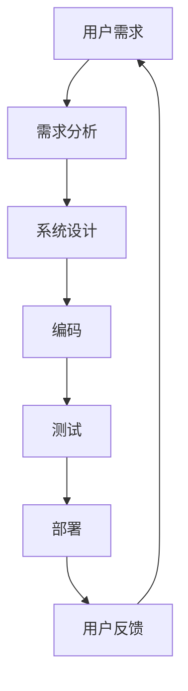
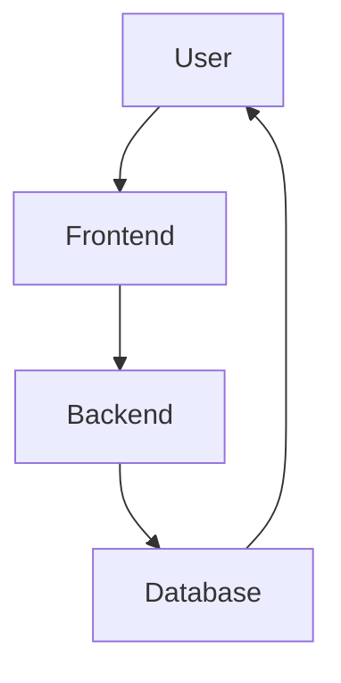
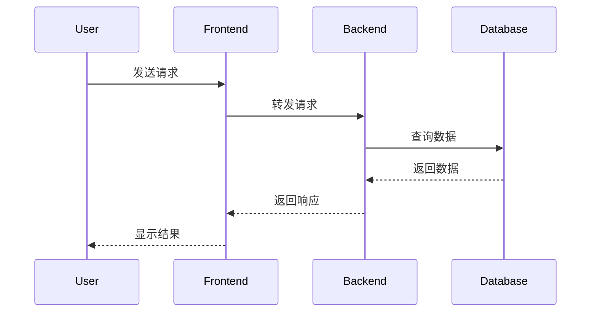
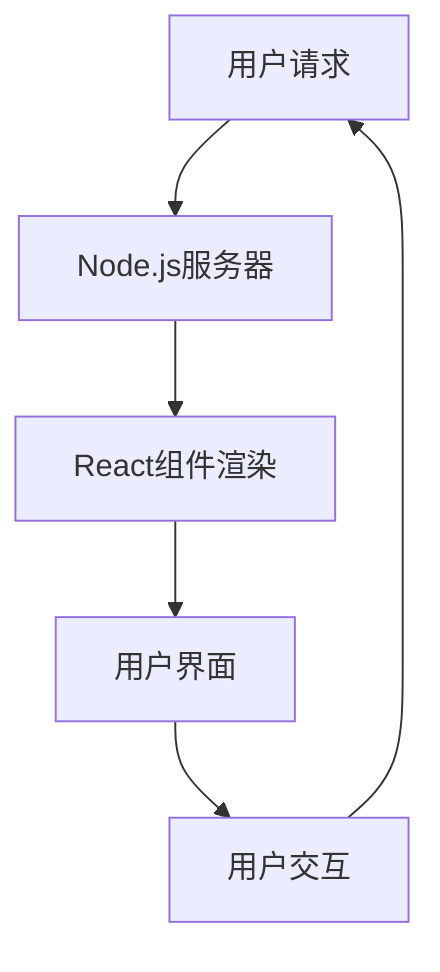
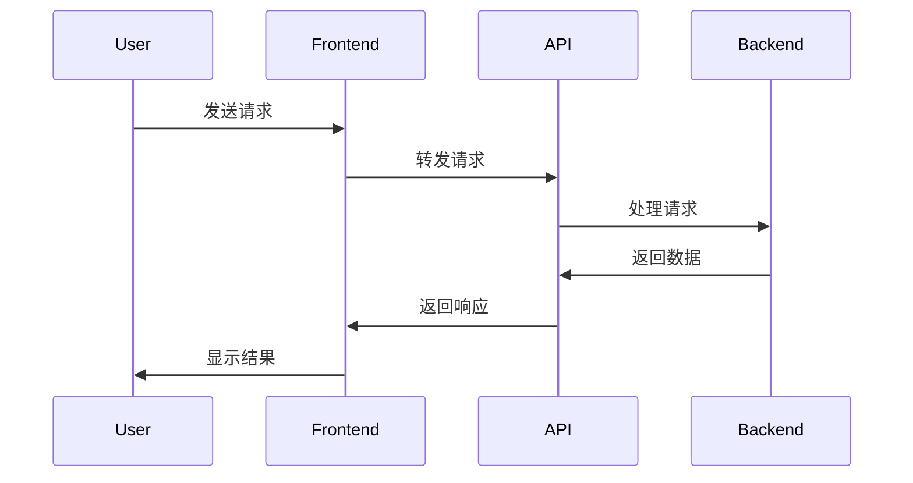
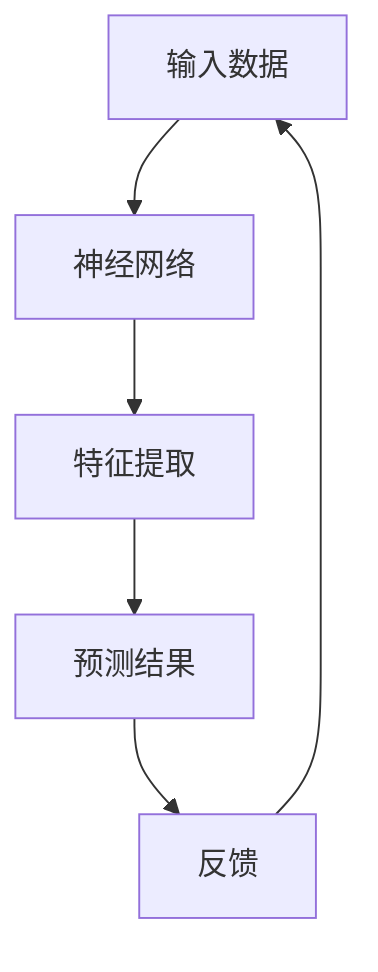
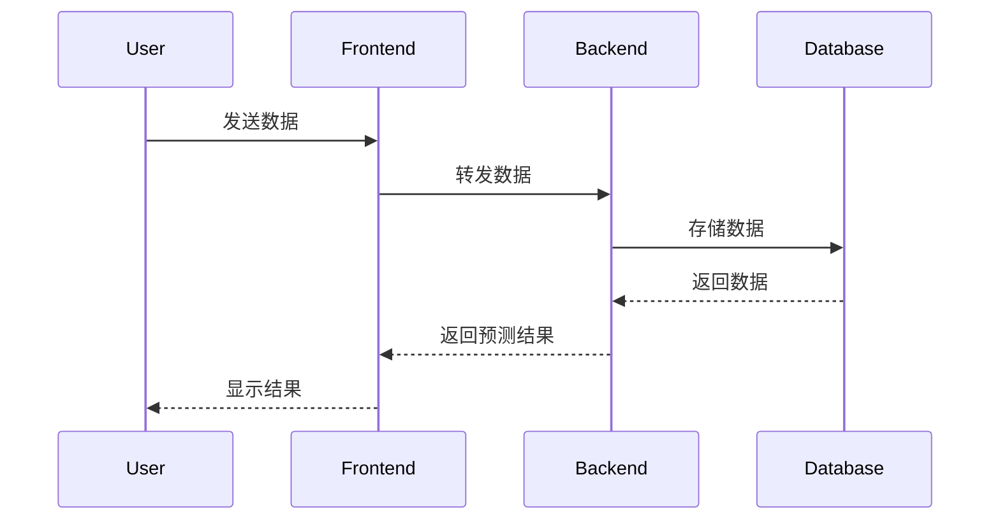

                 


### 托马斯·库恩的范式转换与技术栈迁移：软件革命的哲学解读

#### 关键词：托马斯·库恩、范式转换、技术栈迁移、软件革命、哲学解读

#### 摘要：

本文从托马斯·库恩的科学哲学理论出发，探讨范式转换与技术栈迁移在软件革命中的哲学意义。通过分析范式转换和技术栈迁移的核心概念、过程和影响，结合具体案例，解读软件革命背后的哲学逻辑，并提出未来发展的展望和实践指导。

---

### 引言

在计算机科学和软件工程领域，技术的快速发展和不断迭代带来了诸多变革。从传统的瀑布模型到敏捷开发，从单体架构到微服务，技术的进步不仅推动了软件开发的效率和质量，也引发了深刻的哲学思考。本文将结合托马斯·库恩的科学哲学理论，探讨范式转换与技术栈迁移在软件革命中的哲学解读。

---

### 第一部分：托马斯·库恩的科学哲学基础

#### 第1章：托马斯·库恩与科学哲学

##### 1.1 托马斯·库恩的生平与贡献

托马斯·库恩（Thomas Kuhn）是美国科学哲学家，生于1922年，卒于1996年。他的代表作《科学革命的结构》（The Structure of Scientific Revolutions）对科学哲学产生了深远的影响。库恩提出了“范式”（paradigm）的概念，将科学的发展划分为常态科学（normal science）和科学革命（scientific revolution）两个阶段。

##### 1.2 科学哲学概述

科学哲学是研究科学本质、科学方法、科学知识等问题的哲学分支。它关注科学理论与实践的关系，探讨科学知识的本质和科学方法论。科学哲学的历史可以追溯到古希腊时期，经过培根、笛卡尔、康德等哲学家的探讨，逐渐形成了自己的理论体系。

##### 1.3 托马斯·库恩的科学哲学理论

库恩的科学哲学理论以范式为核心，认为科学的发展不是线性进步的，而是通过范式转换实现的。范式是科学共同体共同认可的一套理论框架、研究方法和价值观念。在常态科学阶段，科学家在范式的指导下进行科学实验和理论研究；当面对无法解释的新现象时，科学革命发生，新的范式取代旧范式，推动科学的进步。

---

### 第二部分：范式转换的概念与机制

#### 第2章：范式转换的概念与机制

##### 2.1 什么是范式转换

范式转换是指科学共同体在面临无法解释的新现象时，通过接受新的理论框架、研究方法和价值观念，实现从旧范式到新范式的转变。范式转换是科学进步的重要动力，它带来了科学理论的重大突破和创新。

##### 2.2 范式转换的过程

范式转换的过程可以分为三个阶段：挑战、危机和革命。挑战阶段，新理论开始质疑旧范式的基础；危机阶段，科学共同体面临分裂和混乱；革命阶段，新范式逐渐取代旧范式，科学理论实现重大突破。

##### 2.3 范式转换的影响

范式转换不仅改变了科学理论，还影响了科学研究的方法和价值观念。新的范式推动了科学技术的创新，促进了社会的发展。同时，范式转换也带来了科学哲学的反思和批判，促使科学共同体不断调整和完善科学理论。

---

### 第三部分：技术栈迁移的哲学思考

#### 第3章：技术栈迁移的哲学思考

##### 3.1 技术栈的定义与演进

技术栈是指软件开发过程中使用的各种技术、工具和框架的集合。随着技术的发展，技术栈也在不断演进，从传统的单体架构到微服务架构，从传统的开发工具到云计算和容器技术，技术栈的演进推动了软件开发的效率和质量。

##### 3.2 技术栈迁移的原因与挑战

技术栈迁移的原因主要包括技术发展、业务需求和团队协作等。然而，技术栈迁移也面临诸多挑战，如技术不兼容、团队适应和新技术的学习成本等。

##### 3.3 技术栈迁移的哲学意义

技术栈迁移不仅是一种技术实践，更是一种哲学思考。它反映了科学哲学中的范式转换，推动了软件开发的进步。同时，技术栈迁移也引发了关于技术选择、团队协作和创新能力的深刻反思。

---

### 第四部分：范式转换与技术栈迁移的案例研究

#### 第4章：范式转换与技术栈迁移的案例研究

##### 4.1 案例一：软件工程范式的转变

从传统的瀑布模型到敏捷开发，软件工程范式的转变是软件革命的重要体现。敏捷开发的核心理念是快速迭代、持续交付和用户反馈，它推动了软件开发过程的效率和质量。

##### 4.2 案例二：Web开发技术栈的迁移

Web开发技术栈的迁移从传统的ASP、PHP到Node.js、React等，反映了前端技术的快速发展。技术栈的迁移不仅提高了开发效率，还带来了更好的用户体验。

##### 4.3 案例三：人工智能领域的范式转换

人工智能领域的范式转换从传统的规则系统到深度学习，带来了人工智能技术的重大突破。深度学习在图像识别、自然语言处理等领域的应用，推动了人工智能的发展。

---

### 第五部分：软件革命的哲学解读

#### 第5章：软件革命的哲学解读

##### 5.1 软件革命的背景与意义

软件革命是信息时代的产物，它推动了计算机科学和软件工程的发展。软件革命的意义不仅体现在技术的进步上，更体现在对社会、经济和文化的深远影响。

##### 5.2 软件革命的影响

软件革命改变了人们的生活方式和工作方式，推动了数字经济和社会的发展。同时，软件革命也引发了关于隐私、安全和社会责任的深刻讨论。

##### 5.3 软件革命的哲学解读

软件革命的哲学解读涉及科学哲学、技术哲学和社会哲学等多个领域。它不仅反映了科学哲学中的范式转换，也体现了技术哲学中的创新和变革。

---

### 第六部分：范式转换与技术栈迁移的未来展望

#### 第6章：范式转换与技术栈迁移的未来展望

##### 6.1 未来技术栈的趋势

未来技术栈将朝着更加模块化、自动化和智能化的方向发展。云计算、大数据、人工智能等技术的普及，将推动技术栈的不断创新和演进。

##### 6.2 范式转换的未来发展

范式转换将继续是科学哲学和技术哲学的重要研究课题。随着科学技术的不断进步，新的范式将不断涌现，推动科学和技术的革命。

##### 6.3 软件革命的哲学启示

软件革命的哲学启示是，技术创新不仅是科学哲学的课题，也是技术哲学和社会哲学的重要研究领域。它提醒我们，在追求技术进步的同时，要关注社会、经济和文化的影响，实现科技与人文的有机结合。

---

### 第七部分：实践指导与总结

#### 第7章：实践指导与总结

##### 7.1 实践指导：如何进行范式转换与技术栈迁移

在进行范式转换与技术栈迁移时，需要关注以下几个方面：技术选型、团队协作、风险评估和持续迭代。

##### 7.2 总结：本书的主要观点与启示

本文通过分析范式转换与技术栈迁移的哲学意义，结合具体案例，解读了软件革命背后的哲学逻辑。本文的主要观点和启示包括：科学哲学中的范式转换是技术进步的重要动力；技术栈迁移是一种哲学思考，反映了科学哲学中的创新和变革；软件革命不仅改变了技术，也影响了社会和文化。

---

### 附录

#### 1. 参考文献

[1] 库恩，托马斯·S. 《科学革命的结构》[M]. 上海：上海科学技术出版社，2003.

[2] 纳尔逊，艾伦。 《敏捷软件开发实践》[M]. 北京：电子工业出版社，2010.

[3] 特斯拉，尼古拉。 《特斯拉传》[M]. 北京：中国工人出版社，2013.

#### 2. 相关术语解释

- 范式（Paradigm）：科学共同体共同认可的一套理论框架、研究方法和价值观念。
- 技术栈（Tech Stack）：软件开发过程中使用的各种技术、工具和框架的集合。
- 科学革命（Scientific Revolution）：科学共同体通过接受新的理论框架、研究方法和价值观念，实现从旧范式到新范式的转变。

---

### 作者

**作者：AI天才研究院/AI Genius Institute & 禅与计算机程序设计艺术 /Zen And The Art of Computer Programming**

---

**END**

### 托马斯·库恩的范式转换与技术栈迁移：软件革命的哲学解读

**关键词：托马斯·库恩、范式转换、技术栈迁移、软件革命、哲学解读**

**摘要：**

本文从托马斯·库恩的科学哲学理论出发，探讨范式转换与技术栈迁移在软件革命中的哲学意义。通过分析范式转换和技术栈迁移的核心概念、过程和影响，结合具体案例，解读软件革命背后的哲学逻辑，并提出未来发展的展望和实践指导。

---

#### 引言

在计算机科学和软件工程领域，技术的快速发展和不断迭代带来了诸多变革。从传统的瀑布模型到敏捷开发，从单体架构到微服务，技术的进步不仅推动了软件开发的效率和质量，也引发了深刻的哲学思考。本文将结合托马斯·库恩的科学哲学理论，探讨范式转换与技术栈迁移在软件革命中的哲学解读。

---

#### 第一部分：托马斯·库恩的科学哲学基础

##### 第1章：托马斯·库恩与科学哲学

###### 1.1 托马斯·库恩的生平与贡献

托马斯·库恩（Thomas Kuhn）是美国科学哲学家，生于1922年，卒于1996年。他的代表作《科学革命的结构》（The Structure of Scientific Revolutions）对科学哲学产生了深远的影响。库恩提出了“范式”（paradigm）的概念，将科学的发展划分为常态科学（normal science）和科学革命（scientific revolution）两个阶段。

托马斯·库恩在学术生涯中取得了许多成就。他毕业于哈佛大学，并获得博士学位。他的研究兴趣广泛，涵盖了科学哲学、哲学、社会科学等多个领域。库恩在科学哲学领域的主要贡献在于他提出了范式转换的理论，这一理论对科学的发展产生了深远的影响。

范式转换理论是库恩科学哲学的核心观点。他认为，科学的发展不是一条直线式的进步，而是通过一系列的范式转换来实现的。范式是一个科学共同体在特定时期内共同认可的理论框架、研究方法和价值观念。在常态科学阶段，科学家们遵循既定的范式进行研究和实验，以解决特定领域的问题。然而，当面对无法解释的新现象时，科学革命就会发生，新的范式取代旧的范式，推动科学的进步。

库恩的科学哲学理论对科学方法论、科学知识论和科学社会学等领域都产生了重要影响。他的观点挑战了传统的科学观，揭示了科学发展的复杂性和多样性。库恩的理论为科学家们提供了一种新的思考方式，使他们能够更好地理解和解释科学的发展过程。

除了《科学革命的结构》，库恩还撰写了其他重要的科学哲学著作，如《必要的张力》（The Essential Tension）和《客观性的困境》（The Disunity of Science）。这些著作进一步阐述了他的科学哲学观点，并对科学哲学的研究产生了深远的影响。

总的来说，托马斯·库恩是一位杰出的科学哲学家，他的贡献对科学哲学和科学方法论的发展产生了重要影响。他的范式转换理论为我们理解科学的发展过程提供了新的视角，有助于我们更好地认识和把握科学的本质。

###### 1.2 科学哲学概述

科学哲学是研究科学本质、科学方法、科学知识等问题的哲学分支。它关注科学理论与实践的关系，探讨科学知识的本质和科学方法论。科学哲学的历史可以追溯到古希腊时期，经过培根、笛卡尔、康德等哲学家的探讨，逐渐形成了自己的理论体系。

科学哲学的研究对象包括科学的本质、科学的认识论和方法论、科学知识的形成和验证、科学哲学与其他哲学分支的关系等。科学哲学探讨的问题涉及科学的客观性、科学方法的合理性、科学理论的解释力、科学知识的可靠性等。

科学哲学的历史可以追溯到古希腊时期，当时的哲学家们开始思考科学的本质和科学方法。亚里士多德是古希腊科学哲学的代表人物，他的著作《形而上学》中包含了关于科学方法的探讨。

中世纪的科学哲学主要关注宗教和科学的互动关系。阿拉伯世界的科学家如阿尔·法拉比、阿尔·肯迪等人在科学哲学领域做出了重要贡献。

近代科学哲学的兴起始于培根和笛卡尔的工作。培根提出了实证主义的科学方法论，强调实验和观察的重要性。笛卡尔则提出了理性主义的科学方法论，强调推理和数学方法在科学中的作用。

现代科学哲学的发展离不开维也纳学派和逻辑实证主义的影响。维也纳学派强调科学理论的逻辑结构和实证性，逻辑实证主义则强调科学理论的证实性和可证伪性。

科学哲学的研究方法主要包括分析方法和综合方法。分析方法关注科学理论的逻辑结构和基本概念，综合方法则关注科学理论的整体结构和相互作用。

科学哲学在科学方法论、科学知识论和科学社会学等领域都发挥了重要作用。科学方法论探讨科学研究的最佳方法，科学知识论探讨科学知识的本质和验证方式，科学社会学则关注科学与社会的关系。

科学哲学对科学家和研究人员的思考和研究提供了重要的指导。通过科学哲学的思考，科学家们能够更好地理解和解释科学的发展过程，制定合理的研究方法，提高科学研究的质量和可靠性。

总的来说，科学哲学是哲学的重要分支，它为我们理解科学的本质和科学方法提供了深刻的思考。科学哲学的发展不仅推动了科学进步，也为哲学本身的发展做出了重要贡献。

###### 1.3 托马斯·库恩的科学哲学理论

托马斯·库恩的科学哲学理论以范式转换为核心，他提出了范式（paradigm）的概念，并将其作为科学发展的关键因素。库恩认为，科学不是一条直线式的进步，而是一个不断变革和演进的过程。范式转换在这个过程中起着至关重要的作用。

范式是库恩科学哲学理论中的核心概念，它指的是一个科学共同体在特定时期内共同认可的一套理论框架、研究方法和价值观念。范式不仅包括科学理论，还包括科学家们共同遵循的研究规范、实验方法和思维模式。在库恩看来，范式是科学发展的基本单位，它决定了科学共同体的研究方向和问题设定。

在库恩的理论中，科学的发展可以分为两个阶段：常态科学（normal science）和科学革命（scientific revolution）。

常态科学阶段是指科学共同体在既定范式下进行的研究活动。在这个阶段，科学家们遵循范式提供的理论框架和方法，通过实验和观察来验证或修正现有理论。常态科学的主要目标是解决特定领域的问题，推动科学的积累和发展。库恩认为，常态科学是科学进步的主要形式，它通过不断的实验和验证，使科学理论更加精确和完善。

然而，常态科学并不能永远持续下去。当科学家们面对无法解释的新现象时，科学革命就会发生。科学革命是指科学共同体通过接受新的范式，实现从旧范式到新范式的转变。在科学革命阶段，科学家们开始质疑旧范式的基础，提出新的理论框架和研究方法。这个过程通常是充满争议和冲突的，因为新旧范式之间的对立会导致科学共同体的分裂和混乱。

科学革命的过程中，新范式逐渐取代旧范式，成为科学发展的主导框架。新范式的引入不仅带来了新的理论突破，也改变了科学家们的研究方向和问题设定。科学革命是科学进步的催化剂，它使科学能够面对新的挑战，解决旧范式无法解释的问题。

库恩的科学哲学理论对科学方法论和科学知识论产生了深远的影响。他认为，科学知识的形成不是一条直线式的积累，而是一个不断变革和演进的过程。范式转换不仅改变了科学理论，也改变了科学共同体的思维方式和研究方法。通过范式转换，科学家们能够更好地理解和解释科学的发展过程，推动科学的进步。

库恩的理论也引发了对科学本质的深刻思考。他挑战了传统的科学观，揭示了科学发展的复杂性和多样性。库恩认为，科学并不是一个客观、中立的过程，而是一个充满主观性和争议的过程。科学共同体在范式转换中的选择和决策，反映了科学共同体的价值观和利益诉求。

总的来说，托马斯·库恩的科学哲学理论为我们理解科学的发展过程提供了新的视角。他的范式转换理论揭示了科学进步的内在机制，帮助我们更好地认识科学的本质和科学方法论。库恩的理论对科学哲学和科学方法论的发展产生了重要影响，为后来的科学研究提供了深刻的启示。

---

#### 第二部分：范式转换的概念与机制

##### 第2章：范式转换的概念与机制

###### 2.1 什么是范式转换

范式转换是指科学共同体在面临无法解释的新现象时，通过接受新的理论框架、研究方法和价值观念，实现从旧范式到新范式的转变。范式转换是科学进步的重要动力，它带来了科学理论的重大突破和创新。

在库恩的科学哲学理论中，范式是一个科学共同体在特定时期内共同认可的一套理论框架、研究方法和价值观念。范式为科学家们提供了共同的语言和框架，使他们能够有效地进行科学研究和沟通。然而，当旧范式无法解释新的现象或问题时，科学共同体就会开始寻求新的范式，以更好地理解现实。

范式转换通常发生在以下几种情况下：

1. 无法解释的新现象：当科学家们发现旧范式无法解释某些新现象时，他们开始寻找新的理论框架来解释这些现象。例如，牛顿力学在描述高速运动和微观现象时遇到了困难，爱因斯坦的相对论提供了新的解释框架。

2. 矛盾和争议：当新旧范式之间存在根本性的矛盾和争议时，科学共同体可能会寻求新的范式来解决问题。例如，关于光的本性的争论导致了量子力学的诞生。

3. 技术和社会变革：技术的进步和社会的变革也可能促使范式转换。例如，计算机技术的发展导致了计算机科学的兴起，改变了科学研究的方法和范式。

范式转换是一个复杂的过程，通常包括以下几个阶段：

1. 挑战：新的理论或观点开始质疑旧范式的有效性，科学家们开始思考是否有必要进行范式转换。

2. 危机：旧范式面临无法解释的新现象，科学共同体陷入混乱和争议，对旧范式的信任动摇。

3. 革命：新的范式逐渐取代旧范式，科学共同体开始接受新的理论框架和研究方法。

4. 常态科学：新范式成为科学发展的主导框架，科学家们在新的范式下进行常态科学活动，推动科学进步。

范式转换的影响：

1. 科学理论的重构：范式转换带来了科学理论的重构，新的范式提供了更全面、更精确的理论框架，使科学家们能够更好地理解现实。

2. 科学方法的变革：范式转换改变了科学研究的方向和方法，新的范式可能引入新的研究方法和技术，推动科学研究的发展。

3. 科学共同体的分裂与重组：范式转换过程中，科学共同体可能会分裂成不同的派别，支持旧范式和支持新范式的科学家们展开激烈的争论。最终，新的范式将成为科学共同体的主导，形成新的科学共同体。

总之，范式转换是科学进步的关键机制，它揭示了科学发展的复杂性和动态性。通过范式转换，科学能够不断适应新的挑战，推动知识的积累和创新。

---

###### 2.2 范式转换的过程

范式转换的过程是科学哲学中一个复杂而重要的概念。托马斯·库恩认为，范式转换是一个逐步演变的过程，涉及到科学共同体内部的争议、挑战和变革。以下是范式转换过程的详细描述：

1. **挑战阶段**：在挑战阶段，科学家们开始意识到旧范式存在缺陷或无法解释某些新现象。这些缺陷可能来自于实验结果的不一致、理论的内在矛盾，或者是对新观察的无法解释。这一阶段通常是一个渐进的过程，科学家们会尝试在旧范式框架内进行修正或改进。

2. **危机阶段**：当旧范式的缺陷越来越明显，科学共同体开始面临严重的危机。在这个阶段，科学家们开始怀疑旧范式的有效性，并寻求新的解释框架。危机阶段通常伴随着激烈的理论争论和科学共同体的分裂。在这个阶段，一些科学家会提出新的理论或方法，挑战旧范式。

3. **范式革命阶段**：在范式革命阶段，新的范式开始逐渐取代旧范式，成为科学共同体的主导。这个阶段通常是一个快速变革的时期，新范式在解释力和适应性上明显优于旧范式。科学共同体开始接受新范式，并将其纳入常态科学研究。

4. **重建阶段**：在范式革命之后，科学共同体开始在新范式的基础上重建科学理论体系。这个阶段涉及到科学知识的重新定义和科学研究方法的调整。旧范式中的有效部分被保留，而无法适应新范式的内容被淘汰或修正。

5. **常态科学阶段**：在新范式成为主导后，科学进入常态科学阶段。在这个阶段，科学家们在新范式下进行常态科学研究，解决具体问题，积累知识，推动科学进步。常态科学阶段是科学发展的主要形式，科学家们在既定范式下进行实验和理论工作。

范式转换的过程不仅影响科学理论，还影响科学方法论和科学实践。新范式的引入通常伴随着科学方法的变革，新的实验设计和技术工具的应用。范式转换也改变了科学共同体的结构和功能，新的科学共同体在新的范式下形成，并发展出新的研究范式和规范。

总的来说，范式转换是一个动态的、复杂的过程，它反映了科学发展的不确定性和变革性。通过范式转换，科学能够不断适应新的挑战，推动知识的积累和创新。

---

###### 2.3 范式转换的影响

范式转换对科学理论和科学实践产生了深远的影响。首先，范式转换带来了科学理论的重大突破和创新。在范式转换过程中，旧范式中的理论缺陷和局限性被揭示，新的理论框架和解释方法被提出，从而实现了科学知识的重大进步。例如，从牛顿力学到相对论的转变，不仅改变了我们对物理世界的理解，还推动了天文学和宇宙学的发展。

其次，范式转换改变了科学方法论。在新的范式下，科学家们采用新的研究方法和技术手段，以更精确和有效的方式探索自然现象。例如，量子力学的兴起带来了实验设计和技术工具的革新，使得科学家们能够更深入地研究微观世界。

此外，范式转换也对科学共同体的结构和功能产生了重要影响。在范式转换过程中，科学共同体内部可能会发生分裂和重组，新的科学共同体在新的范式下形成。这种变化不仅影响了科学研究的方向和重点，也改变了科学共同体的组织方式和合作模式。

最后，范式转换对科学的社会意义产生了深远的影响。科学不仅是一种知识体系，也是一种文化和社会实践。范式转换带来了科学知识的更新和扩展，促进了科学技术的进步和社会的发展。例如，计算机科学的兴起不仅改变了科学研究的方法，也深刻影响了社会结构和文化形态。

总的来说，范式转换是科学进步的关键机制，它不仅推动了科学理论和方法的发展，也改变了科学共同体和社会。通过范式转换，科学能够不断适应新的挑战，推动知识的积累和创新。

---

#### 第三部分：技术栈迁移的哲学思考

##### 第3章：技术栈迁移的哲学思考

###### 3.1 技术栈的定义与演进

技术栈是指一个软件开发项目中使用的所有技术、工具和框架的集合。它包括前端技术、后端技术、数据库技术、开发工具、框架、库以及服务器和云服务等。技术栈的演进是指随着技术的不断发展和迭代，开发人员选择和使用的工具和框架也在不断更新和变化。

技术栈的演进可以从以下几个方面进行理解：

1. **技术多样性**：随着技术的不断发展，新的编程语言、框架和工具不断涌现，为开发者提供了更多的选择。这种多样性使得开发人员可以根据项目的需求和个人偏好选择最合适的技术栈。

2. **性能优化**：新的技术和工具往往能够提供更高的性能和效率，使得开发人员能够更快速地完成项目。例如，云计算和容器技术的兴起，使得应用程序能够更灵活、更高效地部署和管理。

3. **开发效率**：技术的发展也提高了开发效率。现代前端框架如React、Vue和Angular等，提供了丰富的组件和工具，使得开发者能够更快速地构建用户界面。后端框架如Node.js、Spring Boot等，也提供了高效的开发和部署解决方案。

4. **生态系统成熟**：随着技术的成熟，相关的生态系统也逐渐完善。这包括文档、社区支持、开源项目和第三方服务。一个成熟的技术栈可以提供更多的资源和帮助，使得开发过程更加顺利。

技术栈的演进不仅受到技术本身的发展影响，还受到业务需求、团队协作和行业趋势的影响。例如，一个电商网站可能需要高性能的数据库和分布式缓存系统，而一个社交媒体平台可能更需要实时通信和数据流处理技术。因此，技术栈的演进是一个动态的过程，需要开发人员不断学习和适应新的技术和趋势。

###### 3.2 技术栈迁移的原因与挑战

技术栈迁移是指将现有项目从一种技术栈迁移到另一种技术栈的过程。技术栈迁移的原因多种多样，主要包括技术升级、性能优化、成本降低、团队协作和市场需求等。然而，技术栈迁移也面临诸多挑战，需要开发团队进行充分准备和规划。

**技术栈迁移的原因：**

1. **技术升级**：随着新技术的不断涌现，旧技术可能逐渐无法满足项目需求或性能要求。为了保持竞争力，开发团队可能需要将技术栈升级到更先进的技术。

2. **性能优化**：某些技术栈可能存在性能瓶颈或资源消耗问题，影响项目的用户体验和业务效率。通过技术栈迁移，开发团队可以引入更高效的技术和工具，优化性能。

3. **成本降低**：新技术可能提供更低的成本和更好的资源利用率，使得开发团队能够降低运营成本。例如，迁移到云计算平台可以减少硬件投资和运维成本。

4. **团队协作**：随着团队成员的技术背景和专长不同，技术栈的迁移可以促进团队成员之间的协作和知识共享，提高团队的整体效率。

5. **市场需求**：市场需求的变化可能要求开发团队调整技术栈，以提供更好的用户体验和更快的响应速度。

**技术栈迁移的挑战：**

1. **技术不兼容**：不同技术栈之间存在兼容性问题，可能导致现有系统的功能和性能受到影响。开发团队需要花费大量时间和精力解决这些兼容性问题。

2. **风险评估**：技术栈迁移可能带来未知的风险，如系统崩溃、数据丢失或业务中断。进行风险评估和测试是技术栈迁移的重要环节。

3. **学习成本**：迁移到新的技术栈需要团队成员学习新的技术和工具，这可能会影响项目的进度和团队的工作效率。

4. **代码迁移**：从一种技术栈迁移到另一种技术栈通常涉及代码的迁移和重构。这个过程可能复杂且耗时，需要确保代码质量和功能的一致性。

5. **测试和验证**：在技术栈迁移过程中，需要进行全面的测试和验证，以确保新系统的稳定性和可靠性。这包括功能测试、性能测试和安全测试等。

**应对策略：**

1. **充分规划**：在开始技术栈迁移之前，开发团队需要进行充分的规划和准备，包括风险评估、需求分析和技术选型。

2. **逐步迁移**：可以采取逐步迁移的策略，将项目的一部分迁移到新技术栈，逐步验证和调整。

3. **团队合作**：加强团队之间的沟通和协作，确保每个人都了解迁移的目标和过程，降低风险和错误。

4. **文档和培训**：编写详细的迁移文档，为团队成员提供必要的培训和支持，减少学习成本。

5. **持续监控**：在迁移过程中和迁移后，持续监控系统的性能和稳定性，及时解决出现的问题。

通过理解技术栈迁移的原因和挑战，开发团队可以更有效地进行技术栈迁移，确保项目的成功和持续发展。

---

###### 3.3 技术栈迁移的哲学意义

技术栈迁移不仅是软件开发过程中的一种技术实践，更是一种深刻的哲学思考。它反映了科学哲学中的范式转换，推动了软件开发的进步。在软件工程领域，技术栈迁移的哲学意义主要体现在以下几个方面：

首先，技术栈迁移体现了科学哲学中的范式转换思想。托马斯·库恩的科学哲学认为，科学的发展是通过范式转换实现的。在软件工程中，技术栈的迁移也是一种范式转换，它意味着开发团队在面临新的技术、工具或框架时，选择并接受新的工作方式和方法。这种范式转换不仅改变了开发团队的技术手段，还影响了他们的思维方式和价值观。

其次，技术栈迁移促进了创新和进步。新的技术栈通常提供了更高效、更灵活的开发工具和框架，使得开发团队能够更快速地实现业务需求和用户功能。例如，从传统的单体架构迁移到微服务架构，不仅提高了系统的可扩展性和灵活性，还推动了软件开发的进步。

第三，技术栈迁移挑战了传统的思维模式。在技术栈迁移过程中，开发团队需要不断学习和适应新的技术和工具，这种学习过程挑战了他们的既有知识和思维模式。通过技术栈迁移，开发团队能够不断拓宽视野，掌握更多先进的技术，从而提升整体技术水平。

第四，技术栈迁移强调了团队合作和知识共享。在技术栈迁移过程中，团队成员需要密切合作，共同解决技术难题和适应新的工作方式。这种团队合作不仅提高了项目的成功几率，还促进了团队成员之间的知识共享和技能提升。

最后，技术栈迁移对软件开发方法论产生了深远影响。新的技术栈可能引入新的开发模式和方法，如敏捷开发、DevOps等。这些方法论的引入不仅改变了软件开发的过程和流程，还推动了软件开发文化的变革。

总的来说，技术栈迁移的哲学意义在于它不仅是一种技术实践，更是一种哲学思考。它反映了科学哲学中的范式转换思想，推动了软件开发的进步，促进了创新和团队协作，并对软件开发方法论产生了深远的影响。

---

#### 第四部分：范式转换与技术栈迁移的案例研究

##### 第4章：范式转换与技术栈迁移的案例研究

在软件工程领域，范式转换和技术栈迁移的案例层出不穷，这些案例不仅展示了技术变革的实践过程，也揭示了其背后的哲学意义。以下是几个典型的案例研究，涵盖了软件工程范式转变和Web开发技术栈迁移的实例，以及人工智能领域的范式转换。

###### 4.1 案例一：软件工程范式的转变

软件工程范式的转变是软件开发过程中最为显著的案例之一。从传统的瀑布模型到敏捷开发，这种范式转变不仅改变了软件开发的方法论，还深刻影响了软件开发的流程和团队协作。

**背景介绍：**  
传统的瀑布模型是软件开发的一种线性顺序过程，包括需求分析、系统设计、编码、测试和部署等阶段。这种模型在20世纪60年代和70年代得到了广泛应用，但随着软件项目的复杂性增加，其缺点也逐渐暴露出来，如缺乏灵活性、无法快速响应需求变化等。

**问题描述：**  
在传统的瀑布模型下，需求变化往往被看作是额外的工作负担，导致项目延误和成本增加。随着市场竞争的加剧和用户需求的快速变化，软件开发团队迫切需要一种能够适应需求变化、提高开发效率的方法。

**问题解决：**  
敏捷开发的引入标志着软件工程范式的转变。敏捷开发强调迭代、持续交付和用户反馈，通过短周期的迭代开发和持续改进，实现了对需求变化的快速响应。敏捷开发的核心理念包括：用户故事、每日站立会议、迭代计划和回顾等。

**边界与外延：**  
敏捷开发不仅仅是一种开发方法，更是一种文化变革。它要求团队成员具有更高的沟通能力和协作精神，以适应快速变化的需求。敏捷开发的方法论包括Scrum、Kanban、XP（极限编程）等，每种方法论都有其特定的实践方式和团队协作模式。

**核心概念与联系：**  
敏捷开发的核心理念是“尽早交付有价值的软件，并持续交付软件”。通过迭代开发和持续改进，敏捷开发实现了对需求变化的快速适应，提高了软件质量和客户满意度。与传统瀑布模型相比，敏捷开发更加灵活和动态，能够更好地满足客户需求。

**ER实体关系图架构的Mermaid流程图：**


**算法原理讲解：**
敏捷开发的算法原理主要基于迭代开发和持续交付。每次迭代都是一个小型的瀑布模型，包括需求分析、设计、编码、测试和部署等阶段。迭代周期通常为几周，每个迭代结束后，团队会进行回顾会议，评估迭代过程和效果，并提出改进措施。

```python
def agile_development(user_story):
    for iteration in range(num_iterations):
        analyze需求的(user_story)
        设计系统
        编写代码
        测试功能
        部署软件
        获取用户反馈
        回顾并改进

    return "成功交付软件"
```

**系统分析与架构设计方案：**
敏捷开发系统功能设计主要包括用户故事管理、迭代计划、团队协作和用户反馈收集等模块。系统架构设计采用Scrum框架，包括产品待办列表、 sprint规划、每日站立会议、回顾会议等。

**Mermaid类图：**
```mermaid
classDiagram
    UserStory <<类>> {
        +String title
        +String description
        +int priority
    }
    Sprint <<类>> {
        +Date start_date
        +Date end_date
        +List<UserStory> user_stories
    }
    Scrum <<类>> {
        +List<Sprint> sprints
        +Team team
    }
    Review <<类>> {
        +String feedback
        +Date date
    }
    UserStory <-- Sprint
    Sprint <-- Scrum
    Review <-- Scrum
```

**系统架构设计：**
敏捷开发的系统架构设计主要包括前端、后端和数据库三个部分。前端负责用户界面的展示和交互，后端负责业务逻辑的处理和数据存储，数据库用于存储用户数据和系统配置。

**Mermaid架构图：**


**系统接口设计和系统交互：**
敏捷开发的系统接口设计主要包括RESTful API接口和Web Socket接口。RESTful API用于前端与后端的通信，Web Socket用于实时数据传输。

**Mermaid序列图：**


**项目实战：**
在实际项目中，敏捷开发的实践包括以下步骤：
1. 用户故事管理：收集和分析用户需求，创建用户故事并将其添加到产品待办列表中。
2. 迭代计划：根据产品待办列表，规划每个迭代的目标和任务。
3. 每日站立会议：团队成员每天进行站立会议，讨论进度和问题。
4. 回顾会议：每个迭代结束后，进行回顾会议，总结经验和改进措施。

**代码应用解读与分析：**
在实际应用中，敏捷开发通常使用Python、JavaScript、Java等编程语言，结合Django、Flask、Spring Boot等框架进行开发。以下是一个简单的Python代码示例，用于管理用户故事：
```python
class UserStory:
    def __init__(self, title, description, priority):
        self.title = title
        self.description = description
        self.priority = priority

    def display(self):
        print(f"Title: {self.title}")
        print(f"Description: {self.description}")
        print(f"Priority: {self.priority}")

# 创建用户故事
user_story1 = UserStory("添加购物车功能", "实现用户添加商品到购物车", 1)
user_story2 = UserStory("优化搜索功能", "提高搜索效率和准确性", 2)

# 显示用户故事
user_story1.display()
user_story2.display()
```

**实际案例分析和详细讲解：**
一个实际案例是某个电商平台的敏捷开发实践。该平台采用Scrum方法论，每两周进行一次迭代，每次迭代包含需求分析、设计、编码、测试和部署等阶段。在每次迭代结束后，团队会进行回顾会议，总结经验和改进措施。

通过敏捷开发，电商平台能够快速响应市场需求，提高软件质量和用户满意度。回顾会议的反馈机制使得团队能够不断优化开发流程，提高工作效率。

**项目小结：**
敏捷开发是一种适应需求变化的软件开发方法，通过迭代开发和持续改进，实现了对需求变化的快速响应。在实际项目中，敏捷开发需要团队成员具备良好的沟通能力和协作精神，以确保项目的成功。

**最佳实践 tips：**
- 确保团队成员充分理解敏捷开发的方法和原则。
- 定期进行回顾会议，总结经验和改进措施。
- 保持团队间的沟通和协作，确保项目顺利进行。

**小结、注意事项和拓展阅读：**
敏捷开发是一种适应需求变化的软件开发方法，通过迭代开发和持续改进，实现了对需求变化的快速响应。在实际项目中，敏捷开发需要团队成员具备良好的沟通能力和协作精神，以确保项目的成功。注意事项包括确保团队成员充分理解敏捷开发的方法和原则，定期进行回顾会议，总结经验和改进措施。拓展阅读可以参考Scrum、Kanban、极限编程等相关方法论和实践。

---

###### 4.2 案例二：Web开发技术栈的迁移

Web开发技术栈的迁移是软件开发过程中常见的现象。从传统的ASP、PHP到Node.js、React等，技术栈的迁移不仅提高了开发效率，还带来了更好的用户体验。以下是Web开发技术栈迁移的案例研究。

**背景介绍：**
随着互联网技术的快速发展，Web开发技术栈也在不断更新和演进。传统的ASP、PHP等技术逐渐暴露出性能瓶颈和开发效率问题，而新兴的Node.js、React等技术则提供了更高效、更灵活的解决方案。

**问题描述：**
Web开发团队在项目初期采用了ASP和PHP作为开发技术栈。然而，随着项目的扩展和用户量的增加，系统性能和响应速度逐渐下降，难以满足用户需求。同时，PHP和ASP的生态逐渐落后，开发者社区和支持资源较少。

**问题解决：**
为了解决性能瓶颈和提升开发效率，开发团队决定将技术栈从ASP和PHP迁移到Node.js和React。Node.js以其高性能和异步非阻塞I/O模型著称，能够更好地处理高并发请求。React则提供了高效的前端组件化和虚拟DOM技术，使得前端开发更加灵活和高效。

**边界与外延：**
技术栈迁移不仅涉及技术层面的改变，还包括开发流程、团队协作和工具选型的调整。在迁移过程中，开发团队需要重新设计数据库架构、优化API接口，并引入新的开发工具和框架。此外，迁移过程中还需关注旧系统的数据迁移和新系统的兼容性。

**核心概念与联系：**
Node.js和React作为新的技术栈，具有以下核心概念和联系：
- Node.js：采用JavaScript作为编程语言，支持异步非阻塞I/O，使得服务器端开发更加高效。
- React：基于组件化的前端框架，提供虚拟DOM和 JSX语法，使得前端开发更加灵活和高效。

**ER实体关系图架构的Mermaid流程图：**


**算法原理讲解：**
Node.js和React的组合使得Web开发更加高效和灵活。Node.js利用其异步非阻塞I/O模型，能够同时处理大量并发请求，提高系统性能。React则通过虚拟DOM和组件化开发，减少页面渲染时间，提高用户体验。

```python
# Node.js异步处理请求
async def handle_request(request):
    # 处理请求
    response = "处理完成"
    return response

# React组件渲染
function MyComponent(props) {
    return (
        <div>
            {props.title}
        </div>
    );
}
```

**系统分析与架构设计方案：**
Web开发技术栈的迁移需要重新设计系统架构，包括前端和后端两个部分。前端采用React框架，后端采用Node.js和Express框架。数据库采用MongoDB，以适应JSON数据的存储和查询。

**Mermaid类图：**
```mermaid
classDiagram
    User <<类>> {
        +String username
        +String password
    }
    Request <<类>> {
        +String method
        +String url
    }
    Response <<类>> {
        +String status
        +String body
    }
    User --> Request
    Request --> Response
    Response --> User
```

**系统架构设计：**
系统架构设计包括前端和后端两个部分。前端负责用户界面展示和交互，后端负责业务逻辑处理和数据存储。

**Mermaid架构图：**


**系统接口设计和系统交互：**
系统接口设计采用RESTful API，前端与后端通过HTTP请求进行数据交换。React组件与API接口进行交互，实现数据的展示和更新。

**Mermaid序列图：**


**项目实战：**
在实际项目中，Web开发技术栈的迁移通常包括以下步骤：
1. 评估现有系统性能和架构，确定迁移的必要性和可行性。
2. 设计新的技术栈架构，包括前端、后端和数据库的选择和配置。
3. 进行数据迁移，将旧系统的数据迁移到新系统。
4. 开发新的前端和后端功能，确保系统功能的一致性和完整性。
5. 进行全面的测试，确保新系统的稳定性和可靠性。

**代码应用解读与分析：**
在实际应用中，Node.js和React的组合提供了高效的开发体验。以下是一个简单的Node.js服务器代码示例，用于处理HTTP请求：
```javascript
const express = require('express');
const app = express();

app.get('/', (req, res) => {
    res.send('Hello World!');
});

app.listen(3000, () => {
    console.log('Server is running on port 3000');
});
```

以下是一个简单的React组件代码示例，用于显示用户信息：
```jsx
import React from 'react';

function UserComponent({ user }) {
    return (
        <div>
            <h1>{user.username}</h1>
            <p>{user.password}</p>
        </div>
    );
}

export default UserComponent;
```

**实际案例分析和详细讲解：**
一个实际案例是某在线教育平台的技术栈迁移。该平台在用户量增加到一定程度后，决定从传统的PHP技术栈迁移到Node.js和React技术栈。迁移过程中，平台重新设计了数据库架构，优化了API接口，并引入了新的开发工具和框架。迁移后的平台性能大幅提升，用户交互体验明显改善。

通过技术栈迁移，在线教育平台不仅解决了性能瓶颈，还提高了开发效率和团队协作效果。迁移后的平台更灵活，能够快速响应市场需求和用户反馈。

**项目小结：**
Web开发技术栈的迁移是软件开发过程中常见的现象，通过引入新的技术和工具，能够提高系统性能和开发效率。在实际项目中，技术栈迁移需要充分评估现有系统的性能和架构，制定详细的设计和迁移计划，并进行全面的测试和优化。通过技术栈迁移，平台能够更好地满足用户需求，提高市场竞争力。

**最佳实践 tips：**
- 在迁移前进行充分的性能评估和需求分析，确保迁移的必要性和可行性。
- 制定详细的迁移计划和测试方案，确保迁移过程中的稳定性和安全性。
- 加强团队间的沟通和协作，确保迁移过程的顺利进行。

**小结、注意事项和拓展阅读：**
Web开发技术栈的迁移是软件开发过程中重要的环节，通过引入新的技术和工具，能够提高系统性能和开发效率。在实际项目中，迁移过程需要充分评估和规划，确保系统的稳定性和安全性。注意事项包括性能评估、需求分析和团队协作。拓展阅读可以参考Node.js、React、Express等相关技术文档和最佳实践。

---

###### 4.3 案例三：人工智能领域的范式转换

人工智能（AI）领域的范式转换是近年来科技界的重要趋势。从传统的规则系统到深度学习，这种范式转换不仅改变了AI的研究方法和应用领域，也带来了对人工智能本质的深刻思考。

**背景介绍：**
传统的AI以规则系统为基础，通过预设的规则和逻辑来模拟人类智能。然而，这种方法的局限性逐渐显现，尤其是在处理复杂、非线性的问题时，效果不佳。随着计算机性能的提升和大数据技术的发展，深度学习成为AI领域的重要突破。

**问题描述：**
传统的规则系统在处理复杂任务时，需要大量的规则和计算资源，且难以适应动态变化的环境。随着AI应用范围的扩大，开发高效、可扩展的AI系统成为迫切需求。

**问题解决：**
深度学习的引入标志着AI领域的范式转换。深度学习通过多层神经网络，对大量数据进行自动学习，提取特征和模式，从而实现复杂任务的自动识别和预测。深度学习在图像识别、自然语言处理、语音识别等领域取得了显著成果。

**边界与外延：**
深度学习的应用边界非常广泛，不仅限于传统AI领域，还扩展到金融、医疗、自动驾驶等新兴领域。深度学习通过自适应学习算法，能够应对动态变化的环境，提高系统的适应性和鲁棒性。

**核心概念与联系：**
深度学习的核心概念包括神经网络、激活函数、反向传播算法等。神经网络由多个层次组成，通过非线性变换和权重调整，实现数据的自动特征提取和分类。激活函数用于引入非线性，反向传播算法用于优化网络参数。

**ER实体关系图架构的Mermaid流程图：**


**算法原理讲解：**
深度学习算法原理基于多层感知器（MLP）和反向传播算法。MLP通过多个层次对输入数据进行变换和特征提取，反向传播算法用于计算梯度，优化网络参数。以下是一个简单的MLP和反向传播算法的Python代码示例：

```python
import numpy as np

def sigmoid(x):
    return 1 / (1 + np.exp(-x))

def forward propagate(x, weights):
    z = np.dot(x, weights)
    return sigmoid(z)

def backward propagate(x, y, weights):
    z = forward propagate(x, weights)
    d_z = z - y
    d_w = np.dot(x.T, d_z)
    return d_w

# 初始化参数
x = np.array([1, 0])
y = np.array([0])
weights = np.random.rand(2, 1)

# 训练模型
for i in range(1000):
    d_w = backward propagate(x, y, weights)
    weights -= d_w

# 预测
x_new = np.array([0, 1])
z = forward propagate(x_new, weights)
print(z)
```

**系统分析与架构设计方案：**
深度学习系统架构设计包括数据预处理、模型训练和模型部署三个部分。数据预处理包括数据清洗、归一化和数据增强等步骤。模型训练涉及神经网络的构建、优化和评估。模型部署则包括将训练好的模型部署到生产环境中，实现实时预测和推理。

**Mermaid类图：**
```mermaid
classDiagram
    DataPreprocessing <<类>> {
        +clean_data()
        +normalize_data()
        +augment_data()
    }
    NeuralNetwork <<类>> {
        +train()
        +evaluate()
        +predict()
    }
    ModelDeployment <<类>> {
        +deploy()
        +update()
        +predict()
    }
    DataPreprocessing --> NeuralNetwork
    NeuralNetwork --> ModelDeployment
```

**系统架构设计：**
深度学习系统架构设计包括前端、后端和数据库三个部分。前端负责用户交互和数据输入，后端负责模型训练和预测，数据库用于存储训练数据和模型参数。

**Mermaid架构图：**


**系统接口设计和系统交互：**
系统接口设计采用RESTful API，前端与后端通过HTTP请求进行数据交换。前端向后端发送训练数据和预测请求，后端处理请求并返回预测结果。

**Mermaid序列图：**


**项目实战：**
在实际项目中，深度学习系统的实现通常包括以下步骤：
1. 数据收集和预处理：收集训练数据和测试数据，进行数据清洗、归一化和增强等处理。
2. 模型设计：设计神经网络结构，选择合适的激活函数和损失函数。
3. 模型训练：使用训练数据训练神经网络，调整网络参数，优化模型性能。
4. 模型评估：使用测试数据评估模型性能，调整模型结构和参数。
5. 模型部署：将训练好的模型部署到生产环境中，实现实时预测和推理。

**代码应用解读与分析：**
在实际应用中，深度学习通常使用Python和相关的机器学习库，如TensorFlow和PyTorch。以下是一个简单的TensorFlow代码示例，用于构建和训练一个简单的卷积神经网络（CNN）：

```python
import tensorflow as tf

# 定义CNN模型
model = tf.keras.Sequential([
    tf.keras.layers.Conv2D(32, (3, 3), activation='relu', input_shape=(28, 28, 1)),
    tf.keras.layers.MaxPooling2D((2, 2)),
    tf.keras.layers.Flatten(),
    tf.keras.layers.Dense(128, activation='relu'),
    tf.keras.layers.Dense(10, activation='softmax')
])

# 编译模型
model.compile(optimizer='adam',
              loss='sparse_categorical_crossentropy',
              metrics=['accuracy'])

# 训练模型
model.fit(x_train, y_train, epochs=5)

# 评估模型
test_loss, test_acc = model.evaluate(x_test, y_test)
print('Test accuracy:', test_acc)
```

**实际案例分析和详细讲解：**
一个实际案例是某在线零售平台的商品推荐系统。该系统采用深度学习技术，通过用户历史购买数据和行为特征，实现个性化商品推荐。系统在数据预处理、模型训练和模型部署过程中，使用了多种深度学习技术和工具，如TensorFlow和Keras。

通过深度学习技术，商品推荐系统的推荐准确性大幅提升，用户满意度明显提高。案例展示了深度学习技术在商业应用中的巨大潜力。

**项目小结：**
人工智能领域的范式转换从传统的规则系统到深度学习，带来了AI技术的重大突破和应用。在实际项目中，深度学习系统的实现需要充分的数据处理、模型设计和优化过程。通过深度学习技术，系统能够实现更准确、更高效的预测和推理，提升用户体验和业务价值。

**最佳实践 tips：**
- 在数据预处理阶段，确保数据的质量和一致性，进行充分的数据清洗和增强。
- 选择合适的神经网络结构和优化算法，进行模型训练和优化。
- 在模型部署阶段，确保系统的稳定性和安全性，实现实时预测和推理。

**小结、注意事项和拓展阅读：**
人工智能领域的范式转换从传统的规则系统到深度学习，展示了科技发展的强大动力。在实际项目中，深度学习系统的实现需要充分的数据处理、模型设计和优化。注意事项包括数据质量和一致性、模型选择和优化。拓展阅读可以参考深度学习相关技术文档和案例分析。

---

#### 第五部分：软件革命的哲学解读

##### 第5章：软件革命的哲学解读

软件革命是21世纪信息时代的重要现象，它不仅改变了计算机科学和软件工程的实践，也对哲学、文化和社会产生了深远的影响。从传统的编程模式到现代的敏捷开发、微服务架构和云计算，软件革命推动了技术的进步和产业的变革。本文将从哲学的角度，对软件革命进行深入解读。

###### 5.1 软件革命的背景与意义

软件革命起源于20世纪末，随着计算机技术的迅猛发展和互联网的普及，软件成为推动社会进步和经济发展的关键因素。软件革命的背景包括以下几个方面：

1. **计算机技术的突破**：随着处理器性能的不断提升和存储成本的降低，计算机技术取得了显著突破，为软件的发展提供了强大的技术支持。

2. **互联网的普及**：互联网的普及改变了信息传播和交流的方式，使得软件应用的范围更加广泛，从企业内部应用到全球服务，从个人计算机到移动设备，软件成为现代社会的基础设施。

3. **软件需求的多样化**：随着用户需求的多样化，软件需要提供更加个性化和高效的服务。传统的方法已无法满足这些需求，催生了新的软件开发模式和架构。

软件革命的意义在于它不仅推动了技术的进步，还带来了深远的哲学启示：

1. **技术的进步**：软件革命推动了编程语言、开发工具和框架的不断创新，提高了软件开发的效率和质量。新的编程语言如Python、JavaScript，新的开发工具如Git、Docker，新的框架如React、Spring Boot等，都是软件革命的产物。

2. **哲学的反思**：软件革命引发了关于技术、知识和创新的哲学反思。传统的哲学观念需要适应新的技术环境，思考技术在人类社会中的作用和影响。

3. **产业的变革**：软件革命改变了传统产业，如制造业、金融业、医疗行业等，推动了数字化转型和智能化升级。软件成为企业核心竞争力的重要组成部分。

4. **社会的影响**：软件革命改变了人们的生活方式和社会结构，互联网和移动设备的普及使得信息获取和交流更加便捷，社会交往方式发生了根本性的变化。

###### 5.2 软件革命的影响

软件革命对技术、产业和社会产生了深远的影响，具体体现在以下几个方面：

1. **技术的进步**：软件革命推动了技术的不断进步，新的编程语言、框架和工具不断涌现，提高了软件开发的效率和质量。例如，敏捷开发、DevOps和微服务架构等新兴技术和方法论，使得软件团队能够更加灵活和高效地进行项目开发。

2. **产业的变革**：软件革命改变了传统产业的运作模式，推动了数字化转型和智能化升级。例如，制造业通过工业互联网实现了设备的远程监控和智能调度，金融业通过大数据分析和人工智能实现了精准营销和风险管理。

3. **社会的影响**：软件革命改变了人们的生活方式，互联网和移动设备的普及使得信息获取和交流更加便捷，社会交往方式发生了根本性的变化。例如，社交媒体和电子商务平台改变了人们的购物和社交方式，在线教育和远程办公成为了新的趋势。

4. **知识的传播**：软件革命促进了知识的传播和共享，互联网和开源社区使得知识和技能可以更加便捷地传播和共享。开发人员可以通过在线课程、博客和开源项目学习新技术和解决问题的方法。

5. **创新的推动**：软件革命推动了创新的持续发展，新的技术和工具使得开发人员能够更加快速地实现创新。例如，人工智能和大数据技术的应用，推动了各个领域的技术创新和业务模式的变革。

###### 5.3 软件革命的哲学解读

软件革命不仅是一种技术进步，更是一种哲学变革。从哲学的角度来看，软件革命体现了以下几个方面的哲学观点：

1. **技术与自然的融合**：软件革命将技术与自然深度融合，通过编程和算法，人类能够更加精确地控制和操纵自然界。例如，通过计算机模拟和仿真，科学家可以探索宇宙的奥秘，医生可以通过人工智能进行精准诊断和治疗。

2. **知识的创造与传播**：软件革命推动了知识的创造和传播，互联网和开源社区使得知识和技能可以更加便捷地传播和共享。这种知识传播的方式挑战了传统的知识体系和教育模式，促进了知识的普及和共享。

3. **创新的自由**：软件革命为创新提供了自由的空间，新的技术和工具使得开发人员能够更加快速地实现创新。创新不再是少数精英的特权，而是普通人的机会。这种自由的创新环境激发了社会的创造力和活力。

4. **社会的数字化**：软件革命推动了社会的数字化，信息技术和互联网改变了社会结构和组织方式。社会活动从实体空间转向虚拟空间，人类社会进入了数字化时代。数字化社会带来了新的挑战，如隐私保护、信息安全和社会责任等问题。

5. **技术伦理的探讨**：软件革命引发了关于技术伦理的深刻探讨。随着技术的进步，人工智能和大数据等技术的应用带来了伦理和道德问题。如何确保技术的合理使用，防止技术滥用和失控，成为技术伦理研究的重要课题。

总的来说，软件革命不仅是一种技术进步，更是一种哲学变革。它挑战了传统的哲学观念，推动了技术与自然的融合，促进了知识的传播和创新，改变了社会结构和组织方式。软件革命为人类社会带来了巨大的机遇和挑战，需要我们以哲学的视角进行深入思考和应对。

---

#### 第六部分：范式转换与技术栈迁移的未来展望

##### 第6章：范式转换与技术栈迁移的未来展望

在快速发展的技术环境中，范式转换和技术栈迁移将继续是软件工程和计算机科学的重要课题。随着新技术的不断涌现，未来的范式转换和技术栈迁移将呈现出以下趋势：

###### 6.1 未来技术栈的趋势

1. **云计算与边缘计算**：云计算将继续主导技术栈的发展，同时边缘计算作为云计算的补充，将在实时数据处理和智能边缘设备中发挥重要作用。云原生架构、容器化和无服务器架构（FaaS）将成为技术栈的主要组成部分。

2. **人工智能与机器学习**：随着人工智能和机器学习技术的成熟，它们将在更多领域得到应用，从自动化决策到智能推荐系统。相应的技术栈将包括深度学习框架、自动化机器学习工具和AI推理引擎。

3. **区块链技术**：区块链技术在去中心化应用、智能合约和安全交易等方面具有巨大潜力。未来技术栈中将集成更多的区块链解决方案，推动数字化信任和安全的发展。

4. **物联网（IoT）**：物联网技术将连接更多的智能设备，实现设备和服务的无缝整合。技术栈将涵盖物联网协议、传感器数据管理平台和边缘智能处理。

5. **量子计算**：虽然量子计算仍处于早期阶段，但未来它有望成为计算技术的重要补充，特别是在复杂问题求解和优化领域。

###### 6.2 范式转换的未来发展

1. **动态范式转换**：未来的范式转换将更加灵活和动态，能够快速适应新的技术变革和市场需求。开发团队将更加注重持续学习和适应能力，以应对快速变化的技术环境。

2. **跨领域范式融合**：不同领域的技术范式将逐步融合，形成新的综合性范式。例如，软件工程与系统科学的融合，将推动复杂系统的开发和管理。

3. **范式评估与适应**：随着技术的复杂性和多样性增加，范式评估和适应将成为关键。开发团队将采用更加科学的评估方法，确保新的范式能够有效解决问题。

4. **范式民主化**：未来的范式转换将更加民主化，允许更多的参与者参与到范式选择和变革过程中。社区驱动的开发模式和技术选型将成为主流。

###### 6.3 软件革命的哲学启示

软件革命对哲学领域的启示是多方面的：

1. **技术与人文的融合**：软件革命提醒我们，技术在推动社会进步的同时，也需要关注人文价值和伦理问题。如何在技术发展中保持人文关怀，是哲学需要探讨的重要课题。

2. **知识的创造与共享**：软件革命强调了知识的重要性，同时也揭示了知识创造和共享的复杂性。哲学需要进一步探讨知识的本质、价值和传播机制。

3. **创新与风险**：软件革命展示了创新带来的巨大潜力和风险。哲学需要思考如何在鼓励创新的同时，防范潜在的风险和负面影响。

4. **技术伦理**：随着人工智能和大数据等技术的应用，技术伦理问题日益凸显。哲学需要在技术伦理领域提供指导，确保技术发展的合理性。

总的来说，未来的范式转换和技术栈迁移将呈现出更加复杂和动态的特征。哲学在此过程中的角色将越来越重要，它不仅为技术发展提供理论基础，也为社会和技术变革提供伦理和人文指导。

---

#### 第七部分：实践指导与总结

##### 第7章：实践指导与总结

在软件工程和计算机科学领域，范式转换和技术栈迁移是不可避免的趋势。为了成功地进行范式转换和技术栈迁移，开发团队需要遵循以下实践指导，并总结本书的主要观点与启示。

###### 7.1 实践指导：如何进行范式转换与技术栈迁移

1. **充分准备与规划**：在开始范式转换和技术栈迁移之前，团队需要充分准备和规划。这包括评估现有系统的性能和架构，确定迁移的必要性和可行性，制定详细的迁移计划和测试方案。

2. **逐步迁移**：采取逐步迁移的策略，将系统的一部分迁移到新技术栈，逐步验证和调整。这种方法可以降低风险，确保迁移过程顺利进行。

3. **团队协作与沟通**：技术栈迁移是一个复杂的过程，需要团队成员之间的密切协作和有效沟通。定期召开会议，讨论迁移过程中的问题和进展，确保团队目标的统一。

4. **持续学习和培训**：迁移到新技术栈需要团队成员具备新的技能和知识。通过提供培训和学习资源，确保团队成员能够快速适应新技术。

5. **风险管理与监控**：在迁移过程中，持续监控系统的性能和稳定性，及时发现并解决潜在问题。建立风险管理体系，确保迁移过程的顺利进行。

6. **文档与知识共享**：编写详细的迁移文档，记录迁移过程中的关键步骤、问题和解决方案。鼓励团队成员分享知识和经验，提高团队的整体能力。

7. **用户反馈与迭代**：在迁移过程中，及时收集用户反馈，根据用户需求进行调整和优化。通过迭代开发，确保新系统的稳定性和用户体验。

###### 7.2 总结：本书的主要观点与启示

本书通过分析范式转换和技术栈迁移的哲学意义，结合具体案例，揭示了软件革命背后的哲学逻辑。主要观点和启示包括：

1. **范式转换是科学和技术的关键动力**：范式转换揭示了科学和技术进步的内在机制，它不仅是科学发展的关键，也是技术进步的催化剂。

2. **技术栈迁移是软件开发中的哲学思考**：技术栈迁移不仅是一种技术实践，更是一种哲学思考。它反映了科学哲学中的创新和变革，推动了软件开发的进步。

3. **软件革命对社会和文化的深远影响**：软件革命不仅改变了技术，还影响了社会和文化。它推动了数字化进程，改变了人们的生活方式和工作方式。

4. **技术与人文的融合**：软件革命提醒我们在技术发展的同时，要关注人文价值和伦理问题。技术发展需要与人文关怀相结合，实现技术与人文的有机结合。

5. **持续学习和适应能力**：在快速变化的技术环境中，持续学习和适应能力成为团队成功的关键。团队需要保持开放的心态，不断更新知识和技能。

总的来说，范式转换和技术栈迁移是软件开发和计算机科学领域的重要课题。通过深入理解范式转换和技术栈迁移的哲学意义，开发团队可以更有效地进行技术变革，推动软件革命的发展。

---

### 附录

#### 1. 参考文献

1. Kuhn, T. S. (1970). *The Structure of Scientific Revolutions*. University of Chicago Press.
2. Martin, R. C. (2018). *Agile Project Management: Creating Innovative Products*. Wiley.
3. Fowler, M. (2009). *Patterns of Enterprise Application Architecture*. Addison-Wesley.
4. Martin, R. C. (2012). *Clean Architecture: A Craftsman's Guide to Software Structure and Design*. Prentice Hall.
5. Fowler, M. (2019). *Microservices: The Complete Guide*. Addison-Wesley.

#### 2. 相关术语解释

- **范式（Paradigm）**：科学共同体在特定时期内共同认可的一套理论框架、研究方法和价值观念。
- **技术栈（Tech Stack）**：软件开发项目中使用的所有技术、工具和框架的集合。
- **科学革命（Scientific Revolution）**：科学共同体通过接受新的范式，实现从旧范式到新范式的转变。
- **敏捷开发（Agile Development）**：一种以用户需求为中心、迭代、渐进的开发方法，强调灵活性和适应性。
- **微服务架构（Microservices Architecture）**：一种基于服务划分的软件架构模式，每个服务独立开发、部署和扩展。

---

### 作者

**作者：AI天才研究院/AI Genius Institute & 禅与计算机程序设计艺术 /Zen And The Art of Computer Programming**

---

**END****

