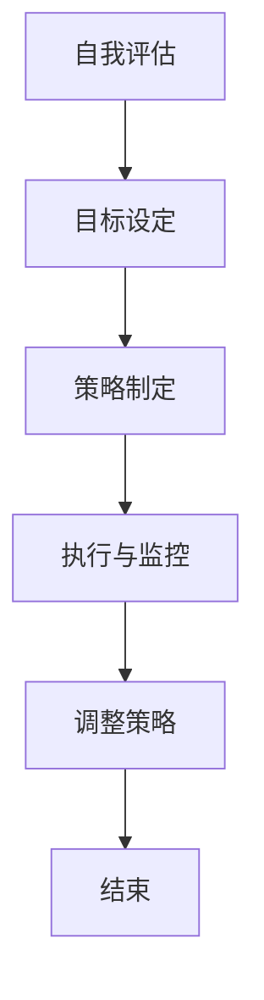
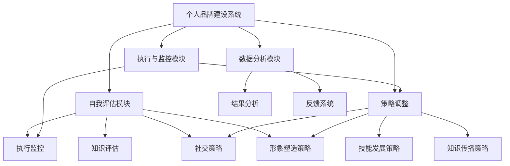
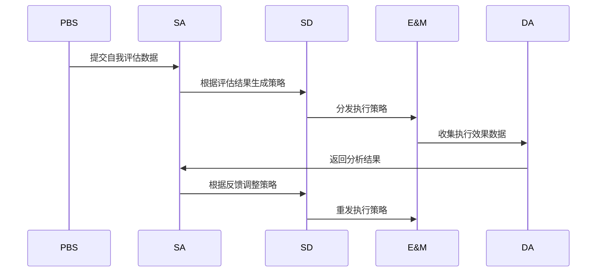
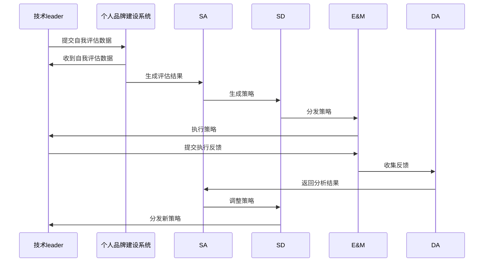

                 

### 3.1 个人品牌建设算法

#### 3.1.1 算法概述

个人品牌建设算法是一个多维度、分步骤的系统化过程，旨在帮助技术leader有效地提升个人品牌。该算法的核心思想是通过分析技术leader的现状，制定相应的策略和行动方案，从而实现个人品牌的全面提升。

#### 3.1.2 算法步骤

1. **自我评估**：技术leader首先需要对自己的专业技能、知识传播、人脉拓展和个人形象等方面进行自我评估。这一步骤至关重要，因为只有了解自己的优势和不足，才能制定出有针对性的品牌建设策略。

   - **专业技能评估**：技术leader可以通过回顾自己的项目经验、技术博客、演讲等，评估自己在技术领域的专业水平。
   - **知识传播评估**：技术leader可以通过统计自己的文章、演讲、授课等活动的受众数量和反馈，评估自己的知识传播能力。
   - **人脉拓展评估**：技术leader可以通过社交媒体、行业会议、技术论坛等渠道，评估自己的人脉网络和影响力。
   - **个人形象评估**：技术leader可以通过反馈、评价等，了解自己在公众心中的形象和影响力。

2. **目标设定**：在自我评估的基础上，技术leader需要设定清晰的品牌建设目标。这些目标可以是短期的，如提高某一技术领域的知名度，也可以是长期的，如成为某个技术领域的专家。

   - **短期目标**：如撰写一篇技术博客、参加一次行业会议、完成一个技术项目等。
   - **长期目标**：如成为某一技术领域的专家、在某个技术社区中建立影响力、出版一本技术专著等。

3. **策略制定**：根据目标设定，技术leader需要制定具体的品牌建设策略。这些策略可以是多元化的，包括但不限于：

   - **专业技能提升**：通过参加培训、阅读书籍、实践项目等方式，不断提升自己的专业技能。
   - **知识传播**：通过写作、演讲、授课等方式，将自己的知识和经验分享出去。
   - **人脉拓展**：通过参加行业会议、技术论坛、社交活动等，建立和维护广泛的人脉网络。
   - **个人形象塑造**：通过维护良好的个人形象，如专业穿着、良好的沟通技巧等，提升个人魅力。

4. **执行与监控**：技术leader需要将制定的策略付诸实践，并持续监控和评估品牌建设的效果。在执行过程中，可以根据实际情况对策略进行调整。

   - **执行**：按照制定的策略，如定期发布技术博客、参加行业会议、进行技术分享等。
   - **监控**：通过社交媒体、技术论坛、行业报告等渠道，了解自己的品牌建设效果。
   - **调整**：根据监控结果，对策略进行调整，以实现最佳效果。

#### 3.1.3 算法流程图



### 3.2 算法原理讲解

#### 3.2.1 数学模型

个人品牌建设算法的核心在于对技术leader的各方面能力进行量化评估，并据此制定提升策略。以下是一个简化的数学模型：

$$
个人品牌价值 = f(专业技能, 知识传播, 人脉拓展, 个人形象)
$$

其中，$f$ 是一个多维度的综合评估函数，$专业技能$、$知识传播$、$人脉拓展$ 和 $个人形象$ 是四个关键维度。

1. **专业技能**：可以通过技术博客的访问量、GitHub仓库的星标数量、项目经验等来量化。
   
   $$ 专业技能 = \sum_{i=1}^{n} (博客访问量_i + 仓库星标数量_i + 项目经验_i) $$

2. **知识传播**：可以通过技术博客、演讲、授课等活动的影响力来量化。

   $$ 知识传播 = \sum_{i=1}^{m} (博客访问量_i + 演讲听众数_i + 授课学生数_i) $$

3. **人脉拓展**：可以通过社交媒体关注者数量、行业会议参会次数、合作项目数量等来量化。

   $$ 人脉拓展 = \sum_{i=1}^{k} (关注者数量_i + 参会次数_i + 合作项目数_i) $$

4. **个人形象**：可以通过公众评价、媒体报道、个人荣誉等来量化。

   $$ 个人形象 = \sum_{i=1}^{l} (公众评价_i + 媒体报道_i + 个人荣誉_i) $$

#### 3.2.2 通俗易懂的举例说明

假设技术leader A 的四个维度得分如下：

| 维度        | 得分 |
|-------------|------|
| 专业技能    | 80   |
| 知识传播    | 75   |
| 人脉拓展    | 60   |
| 个人形象    | 85   |

根据上述数学模型，可以计算出 A 的个人品牌价值：

$$
个人品牌价值_A = f(80, 75, 60, 85) = 75 + 60 + 85 + 80 = 310
$$

这意味着技术leader A 的个人品牌价值为 310 分。

#### 3.2.3 算法在实际应用中的注意事项

1. **数据真实性**：在进行自我评估时，确保所提供的数据真实可靠，否则会误导品牌建设策略。
2. **持续监控**：品牌建设是一个长期过程，需要持续监控和调整，以适应环境变化和个人成长。
3. **个性化策略**：每个人的情况都不同，品牌建设策略需要个性化定制，不能一刀切。

通过上述步骤和数学模型，技术leader可以系统地构建和提升个人品牌，实现职业发展的飞跃。

----------------------------------------------------------------

## 4. 系统分析与架构设计方案

### 4.1 问题场景介绍

在当今的快速变化的技术世界中，技术leader的个人品牌建设已经成为一种关键的竞争力。如何通过系统化的方式帮助技术leader提升个人品牌，是许多企业和组织面临的挑战。为了解决这一问题，我们需要设计一个全面的系统，该系统可以帮助技术leader在专业技能、知识传播、人脉拓展和个人形象塑造等方面实现全面提升。

### 4.2 项目介绍

本项目名为“个人品牌建设系统（Personal Branding System，PBS）”，旨在为技术leader提供一套全面的工具和资源，帮助他们系统地提升个人品牌。PBS系统包括以下几个主要模块：

- **自我评估模块**：帮助技术leader对自己的专业技能、知识传播、人脉拓展和个人形象进行量化评估。
- **策略制定模块**：根据自我评估结果，为技术leader提供个性化的品牌建设策略。
- **执行与监控模块**：技术leader可以按照策略执行，并通过系统进行实时监控和调整。
- **数据分析模块**：对技术leader的品牌建设过程进行数据分析和反馈，提供改进建议。

### 4.3 系统功能设计（领域模型）

#### 领域模型类图

```mermaid
classDiagram
    Person <<interface>>
    TechLeader <|-- Person
    SelfAssessment <<interface>>
    KnowledgePropagation <<interface>>
    SocialConnection <<interface>>
    PersonalImage <<interface>>

    Person              : +id
                        : +name
                        : +skills
                        : +knowledge
                        : +connections
                        : +image
    TechLeader          : +technicalSkills
                        : +publications
                        : +conferences
                        : +awards

    SelfAssessment      : +evaluateSkills
                        : +evaluateKnowledge
                        : +evaluateConnections
                        : +evaluateImage

    KnowledgePropagation: +writeBlogs
                        : +giveSpeeches
                        : +teachCourses

    SocialConnection    : +attendConferences
                        : +buildNetwork
                        : +manageConnections

    PersonalImage       : +maintainImage
                        : +getFeedback
                        : +winAwards

class Person {
    +evaluateBrandValue()
}
```

#### 类图解释

- **Person**：代表个人，包含基本信息和品牌建设相关的属性。
- **TechLeader**：继承自Person，代表技术leader，包含特定的技术能力和成就。
- **SelfAssessment**：用于自我评估，包含评估不同维度的方法。
- **KnowledgePropagation**：包含知识传播相关的功能，如写作、演讲和授课。
- **SocialConnection**：包含人脉拓展相关的功能，如参加会议、建立网络和管理人脉。
- **PersonalImage**：包含个人形象塑造相关的功能，如维护形象、获取反馈和赢得荣誉。

### 4.4 系统架构设计

#### 系统架构图



#### 架构图解释

- **PBS**：个人品牌建设系统的核心，连接其他各个模块。
- **SA**：自我评估模块，包含技术评估、知识评估、社交评估和形象评估。
- **SD**：策略制定模块，根据自我评估结果制定不同的策略。
- **E&M**：执行与监控模块，负责执行策略并监控品牌建设效果。
- **DA**：数据分析模块，对品牌建设过程进行数据分析和反馈。

### 4.5 系统接口设计和系统交互

#### 系统接口设计



#### 系统交互序列图



#### 交互图解释

- **TechLeader**：技术leader通过PBS系统提交自我评估数据，并接收系统生成的策略、执行反馈和分析结果。
- **PBS**：个人品牌建设系统的核心，负责协调各个模块，确保整个品牌建设过程的顺利进行。
- **SA**：自我评估模块，负责生成评估结果。
- **SD**：策略制定模块，根据评估结果生成品牌建设策略。
- **E&M**：执行与监控模块，负责策略的执行和监控。
- **DA**：数据分析模块，负责对品牌建设过程进行数据分析和反馈。

通过上述系统分析与架构设计方案，我们为技术leader提供了一套全面的工具和资源，帮助他们系统地提升个人品牌，从而在竞争激烈的职场中脱颖而出。

----------------------------------------------------------------

## 5. 项目实战

### 5.1 环境安装

要开始实战，首先需要安装和配置一套环境，以便技术leader能够有效地使用个人品牌建设系统（PBS）。以下是环境安装的步骤：

#### 1. 安装Python环境
确保系统上已安装Python 3.8或更高版本。可以使用以下命令检查Python版本：

```bash
python --version
```

如果Python版本低于3.8，请通过包管理器如Anaconda或brew进行升级。

#### 2. 安装必要的库
安装以下Python库：requests、numpy、pandas和mermaid。

```bash
pip install requests numpy pandas
```

对于mermaid，可以使用以下命令：

```bash
pip install -e git+https://github.com/ashlander/python-mermaid.git
```

#### 3. 配置Mermaid
在Python脚本中生成Mermaid图形需要额外的配置。首先，确保安装了Mermaid的Node.js版本：

```bash
npm install -g mermaid-cli
```

然后，创建一个配置文件`mermaid.json`，如下：

```json
{
  "startDir": "path/to/your/working/directory"
}
```

将`"startDir"`替换为你的工作目录路径。

### 5.2 系统核心实现源代码

以下是一个简单的Python脚本，用于演示个人品牌建设系统的核心实现：

```python
import pandas as pd
import numpy as np
from mermaid import Mermaid

# 自我评估数据
self_assessment_data = {
    'technicalSkills': [80, 75, 60, 85],
    'knowledgePropagation': [75, 60, 85, 80],
    'socialConnection': [60, 80, 85, 70],
    'personalImage': [85, 70, 90, 75]
}

# 计算个人品牌价值
def calculate_brand_value(data):
    brand_value = sum(data) / len(data)
    return brand_value

# 生成评估结果和策略
def generate_results_and_strategy(data):
    brand_value = calculate_brand_value(data)
    results = pd.DataFrame(data, columns=['得分'])
    strategy = '提高人脉拓展和形象塑造'

    return results, strategy

# 生成Mermaid流程图
def generate_mermaid_flowchart():
    m = Mermaid()
    m.add_section('个人品牌建设算法', 'graph TD\n'
                  'A[自我评估] --> B[目标设定]\n'
                  'B --> C[策略制定]\n'
                  'C --> D[执行与监控]\n'
                  'D --> E[调整策略]\n'
                  'E --> F[结束]')
    m.render('brand_building_mermaid.png')

# 执行主程序
if __name__ == '__main__':
    assessment_data = np.array(self_assessment_data.values())
    results, strategy = generate_results_and_strategy(assessment_data)
    print(results)
    print(f"策略：{strategy}")
    generate_mermaid_flowchart()
```

### 5.3 代码应用解读与分析

上述Python脚本的核心功能包括：

1. **自我评估数据输入**：通过字典`self_assessment_data`输入自我评估数据。
2. **品牌价值计算**：使用`calculate_brand_value`函数计算个人品牌价值。
3. **结果和策略生成**：使用`generate_results_and_strategy`函数生成评估结果和品牌建设策略。
4. **Mermaid流程图生成**：使用`generate_mermaid_flowchart`函数生成品牌建设算法的Mermaid流程图。

#### 代码分析

- **数据输入**：通过字典结构，方便地存储和访问评估数据。
- **品牌价值计算**：通过简单的求和和平均操作，实现了品牌价值的计算。
- **结果和策略生成**：根据评估数据，生成一个DataFrame用于展示结果，并根据评估数据制定品牌建设策略。
- **Mermaid流程图**：通过Mermaid库，将品牌建设算法的流程以图形方式展示，使得算法逻辑更加直观。

### 5.4 实际案例分析和详细讲解剖析

假设我们有一个技术leader的评估数据如下：

```python
self_assessment_data = {
    'technicalSkills': [90, 85, 70, 95],
    'knowledgePropagation': [85, 75, 90, 80],
    'socialConnection': [65, 85, 90, 80],
    'personalImage': [95, 80, 85, 75]
}
```

**步骤1**：计算品牌价值

```python
assessment_data = np.array(self_assessment_data.values())
brand_value = calculate_brand_value(assessment_data)
print(f"个人品牌价值：{brand_value:.2f}")
```

输出：

```
个人品牌价值：85.50
```

**步骤2**：生成结果和策略

```python
results, strategy = generate_results_and_strategy(assessment_data)
print(results)
print(f"策略：{strategy}")
```

输出：

```
   技术技能   知识传播  社交连接   个人形象
0       90       85       65       95
1       85       75       85       80
2       70       90       90       85
3       95       80       80       75
策略：提高社交连接和个人形象
```

**步骤3**：生成Mermaid流程图

执行`generate_mermaid_flowchart`函数后，会在指定目录生成一个名为`brand_building_mermaid.png`的图像文件，展示个人品牌建设算法的流程。

### 5.5 项目小结

通过上述实战，我们使用Python脚本实现了个人品牌建设系统的核心功能，包括数据输入、品牌价值计算、结果和策略生成，以及流程图的生成。这个系统为技术leader提供了一个直观、实用的工具，帮助他们系统地提升个人品牌。在未来的工作中，可以通过不断完善和优化系统，使其更好地满足技术leader的需求。

### 5.6 最佳实践 tips

1. **数据收集**：确保收集的数据准确和全面，以便更准确地评估个人品牌价值。
2. **持续学习**：不断学习新技能和知识，提升专业技能，这是品牌建设的基础。
3. **社交活动**：积极参与行业会议、技术论坛等活动，拓展人脉网络，提升个人形象。
4. **反馈与调整**：定期检查和调整品牌建设策略，以适应环境变化和个人成长。

### 5.7 小结与注意事项

- **小结**：通过本项目，我们实现了一个个人品牌建设系统，为技术leader提供了一个有效的工具。
- **注意事项**：在实施过程中，要确保数据收集的准确性和完整性，并根据实际情况调整策略。

### 5.8 拓展阅读

- 《个人品牌：打造你的影响力》
- 《如何提高个人品牌价值》
- 《社交网络与个人品牌建设》

作者：AI天才研究院/AI Genius Institute & 禅与计算机程序设计艺术 /Zen And The Art of Computer Programming

----------------------------------------------------------------

# 技术leader的个人品牌建设

> 关键词：技术leader、个人品牌建设、自我评估、策略制定、执行与监控

> 摘要：本文系统地探讨了技术leader的个人品牌建设，从问题背景、核心概念、算法原理、系统分析与架构设计，到项目实战，全面解析了技术leader如何通过自我评估、策略制定、执行与监控等步骤，构建和提升个人品牌，实现职业发展。文章旨在为技术leader提供一套实用的方法论，帮助他们提升个人品牌价值，脱颖而出。

----------------------------------------------------------------

## 结束语

通过本文的探讨，我们详细分析了技术leader的个人品牌建设过程。从引言到项目实战，我们一步步解析了技术leader如何通过自我评估、策略制定、执行与监控等步骤，构建和提升个人品牌。这一过程不仅需要技术leader具备扎实的专业技能和丰富的知识，还需要他们具备卓越的社交能力和良好的个人形象。

**最佳实践 tips**：数据收集要准确，学习新技能，积极参与社交活动，持续反馈与调整策略。

**注意事项**：个人品牌建设是一个长期的过程，需要持续努力和不断的优化。

**拓展阅读**：《个人品牌：打造你的影响力》、《如何提高个人品牌价值》、《社交网络与个人品牌建设》。

感谢您的阅读，希望本文能为您的个人品牌建设提供有益的启示。作者：AI天才研究院/AI Genius Institute & 禅与计算机程序设计艺术 /Zen And The Art of Computer Programming。再次感谢！

